# 5. 使用矩阵分解、奇异值分解和共聚类进行协同过滤

第四章探讨了协同过滤和使用 KNN 方法。本章还涵盖了几个更重要的方法：矩阵分解(MF)、奇异值分解(SVD)和共聚类。这些方法（连同 KNN）属于基于模型的协同过滤方法。计算余弦相似度的基本算术方法属于基于内存的方法。每种方法都有其优缺点；根据用例，你必须选择合适的方法。

图 5-1 解释了协同过滤中的两种方法类型。

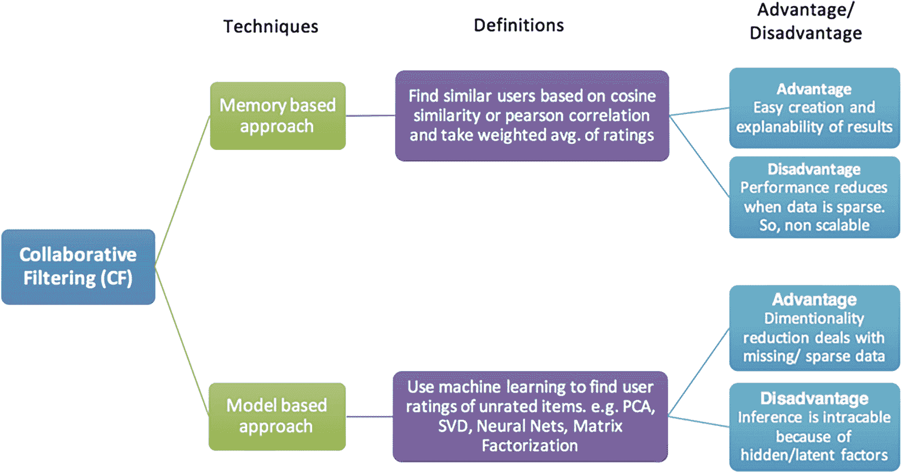

一个框架展示了协同过滤的分类。它分为两种技术：基于内存的方法和基于模型的方法。定义、优点和缺点都被展示出来。

图 5-1

解释了协同过滤的两种方法

基于内存的方法更容易实现和解释，但它的性能通常受到稀疏数据的影响。但另一方面，像 MF 这样的基于模型的方法很好地处理稀疏数据，但它通常不直观或容易解释，并且实现起来可能更加复杂。但基于模型的方法在大数据集上表现更好，因此具有很好的可扩展性。

本章重点介绍几种基于模型的流行方法，例如使用第四章中的相同数据实现矩阵分解、奇异值分解(SVD)和共聚类模型。

## 实现

### 矩阵分解、共聚类和 SVD

以下实现是第四章的延续，并使用相同的数据集。

让我们看看数据。

```py
data1.head()
```

图 5-2 展示了第四章的 DataFrame。

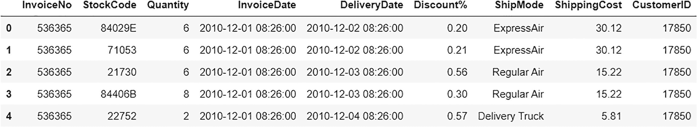

数据框展示了包含发票号、库存代码、数量、发票日期、交货日期、折扣百分比、运输方式、运输成本和客户 ID 的输入数据。

图 5-2

输入数据

让我们重用第四章中的 item_purchase_df。它是一个包含项目和客户是否购买它们的信息的矩阵。

```py
items_purchase_df.head()
```

图 5-3 展示了项目购买数据框/矩阵。


数据框展示了购买项目的数据。客户 ID 和库存代码被表示出来。

图 5-3

项目购买数据框/矩阵

本章使用名为 surprise 的 Python 包进行建模。它实现了协同过滤中流行的各种方法，如矩阵分解、SVD、共聚类，甚至 KNN。

首先，让我们将数据格式化为 surprise 包所需的正确格式。

首先开始堆叠数据框/矩阵。

```py
data3 = items_purchase_df.stack().to_frame()
#Renaming the column as Quantity
data3 = data3.reset_index().rename(columns={0:"Quantity"})
data3
```

图 5-4 显示了堆叠后的输出数据框。

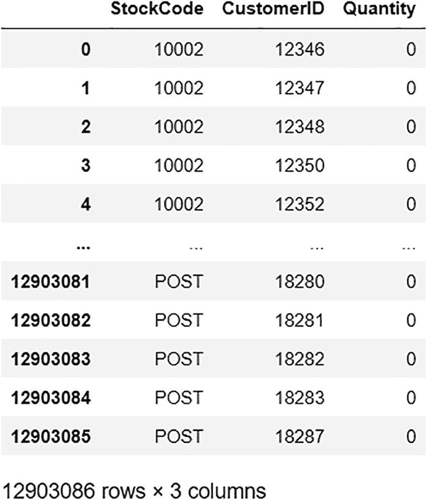

数据框显示了堆叠项目购买的输出。股票代码、客户 ID 和数量被表示。每个数量都观察到 0。

图 5-4

堆叠的项目购买数据框/矩阵

```py
print(items_purchase_df.shape)
print(data3.shape)
```

以下为输出。

```py
(3538, 3647)
(12903086, 3)
```

如您所见，items_purchase_df 有 3538 个独特的项目（行）和 3647 个独特的用户（列）。堆叠的数据框是 3538 × 3647 = 12,903,086 行，这太大，无法传递给任何算法。

让我们根据订单数量筛选一些客户和项目。

首先，将所有 ID 放入一个列表中。

```py
# Storing all customer ids in customers
customer_ids = data1['CustomerID']
# Storing all item descriptions in items
item_ids = data1['StockCode']
```

以下导入计数器以计算每个客户和每个项目的订单数量。

```py
from collections import Counter
```

按每个客户计算订单数量并将该信息存储在数据框中。

```py
# counting no. of orders made by each customer
count_orders = Counter(customer_ids)
# storing the count and customer id in a dataframe
customer_count_df = pd.DataFrame.from_dict(count_orders, orient='index').reset_index().rename(columns={0:"Quantity"})
```

删除所有订单少于 120 次的客户 ID。

```py
customer_count_df = customer_count_df[customer_count_df["Quantity"]>120]
```

将索引列重命名为'CustomerID'以进行内连接。

```py
customer_count_df.rename(columns={'index':'CustomerID'},inplace=True)
customer_count_df
```

图 5-5 显示了客户计数数据框输出。

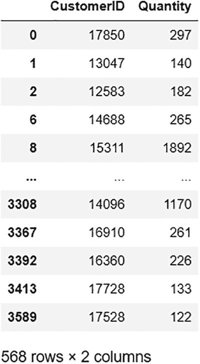

数据框显示了客户的数量。客户 ID 和数量被表示。数据框的模型：568 行和 2 列。

图 5-5

客户计数数据框

类似地，对项目（即，计算每个项目的订单数量并将其存储在数据框中）重复相同的流程。

```py
# counting no. of times an item was ordered
count_items = Counter(item_ids)
# storing the count and item description in a dataframe
item_count_df = pd.DataFrame.from_dict(count_items, orient='index').reset_index().rename(columns={0:"Quantity"})
```

删除所有订单少于 120 次的项目。

```py
item_count_df = item_count_df[item_count_df["Quantity"]>120]
```

将索引列重命名为'Description'以进行内连接。

```py
item_count_df.rename(columns={'index':'StockCode'},inplace=True)
item_count_df
```

图 5-6 显示了输出项目计数数据框。

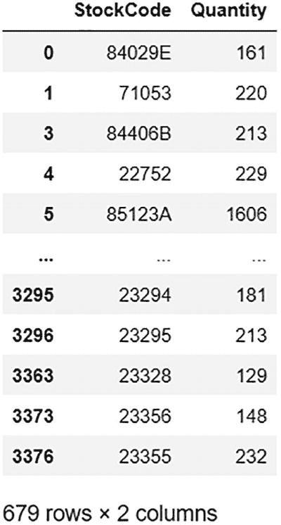

数据框显示了项目计数输出。客户 ID 和数量被表示。数据框的模型：679 行和 2 列。

图 5-6

项目计数数据框

接下来，对两个堆叠数据的 DataFrame 进行连接，以创建短名单的最终 DataFrame。

```py
#Merging stacked df with item count df
data4 = pd.merge(data3, item_count_df, on='StockCode', how='inner')
#Merging with customer count df
data4 = pd.merge(data4, customer_count_df, on='CustomerID', how='inner')
# dropping columns which are not necessary
data4.drop(['Quantity_y','Quantity_x'],axis=1,inplace=True)
data4
```

图 5-7 显示了短名单数据框输出。

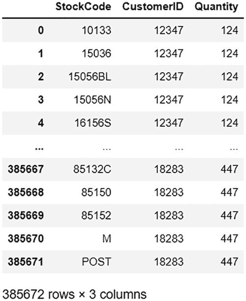

数据框显示了短名单数据的输出。股票代码、客户 ID 和数量被表示。数据框模型：385672 行和 3 列。

图 5-7

最终的短名单数据框

现在数据量已经减少，让我们描述它并查看统计数据。

```py
data4.describe()
```

图 5-8 描述了短名单数据框。

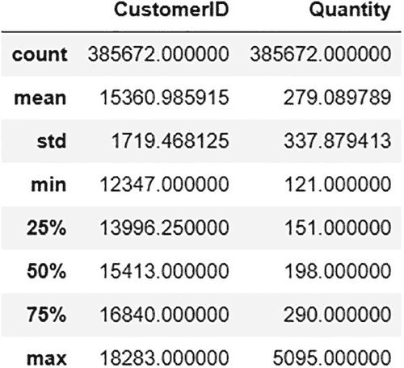

数据框报告了短名单数据。客户 ID、数量以及平均值、计数、最小值和最大值被展示。

图 5-8

描述短名单数据框

您可以从输出中看到，计数已显著减少到 385,672 条记录，从 12,903,086 条。但这个数据框需要使用 surprise 包的内置函数进一步格式化以支持。

以 surprise 库支持的格式读取数据。

```py
reader = Reader(rating_scale=(0,5095))
```

范围已设置为 0,5095，因为最大数量值为 5095。

使用 surprise 库支持的格式加载数据集。

```py
formated_data = Dataset.load_from_df(data4, reader)
```

最终格式化的数据已准备好。

现在，让我们将数据分割成训练和测试，以验证模型。

```py
# performing train test split on the dataset
train_set, test_set = train_test_split(formated_data, test_size= 0.2)
```

#### 实现 NMF

让我们从建模非负矩阵分解方法开始。

图 5-9 解释了矩阵分解（乘法）。

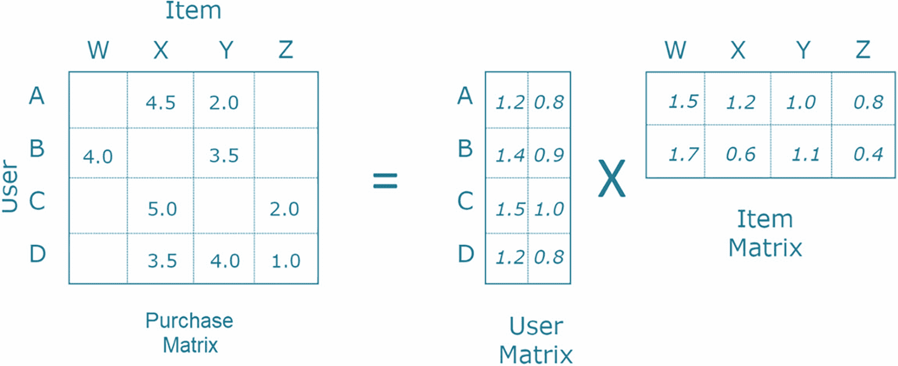

矩阵分解的表示。购买矩阵等于用户矩阵乘以物品矩阵。A、B、C 和 D 表示用户。W、X、Y 和 Z 表示物品。

图 5-9

矩阵分解

矩阵分解是构建基于协同过滤的推荐系统时常用的方法。它是一个基本嵌入模型，其中潜在/隐藏特征（嵌入）通过矩阵乘法从用户和物品矩阵中生成。这减少了完整输入矩阵的维度，因此是一种紧凑的表示，提高了可扩展性和性能。然后使用这些潜在特征来拟合一个优化问题（通常是最小化误差方程），以得到预测。

```py
# defining the model
algo1 = NMF()
# model fitting
algo1.fit(train_set)
# model prediction
pred1 = algo1.test(test_set)
```

使用内置函数，你可以计算性能指标，如 RMSE（均方根误差）和 MAE（平均绝对误差）。

```py
# RMSE
accuracy.rmse(pred1)
#MAE
accuracy.mae(pred1)
```

以下为输出。

```py
RMSE: 428.3167
MAE:  272.6909
```

对于这个模型，RMSE 和 MAE 都属于中等偏高，所以让我们尝试其他两种方法，并在最后进行比较。

你也可以使用内置函数进行交叉验证，以进一步验证这些值。

```py
cross_validate(algo1, formated_data, verbose=True)
```

图 5-10 显示了 NMF 的交叉验证输出。

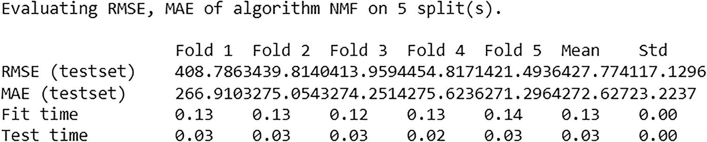

表示展示了 NMF 的交叉验证结果。展示了算法 NMF 在 5 次分割上的 R M S E、M A E 评估。

图 5-10

NMF 的交叉验证输出

交叉验证显示，平均 RMSE 为 427.774，MAE 大约为 272.627，这属于中等偏高。

#### 实现协同聚类

协同聚类（也称为 *双聚类*）在协同过滤中常用。它是一种数据挖掘技术，可以同时聚类 DataFrame/矩阵的列和行。它与基于单个实体/比较类型的正常聚类不同，在协同聚类中，你同时检查每个对象的两个不同实体/比较类型的分组，作为一个成对交互。

让我们尝试使用协同聚类方法进行建模。

```py
# defining the model
algo2 = CoClustering()
# model fitting
algo2.fit(train_set)
# model prediction
pred2 = algo2.test(test_set)
```

使用内置函数计算 RMSE 和 MAE 性能指标。

```py
# RMSE
accuracy.rmse(pred2)
#MAE
accuracy.mae(pred2)
```

以下为输出。

```py
RMSE: 6.7877
MAE:  5.8950
```

对于这个模型，RMSE 和 MAE 非常低。到目前为止，这已经表现最好（优于 NMF）。

使用内置函数进行交叉验证，以进一步验证这些值。

```py
cross_validate(algo2, formated_data, verbose=True)
```

图 5-11 显示了协同聚类的交叉验证输出。

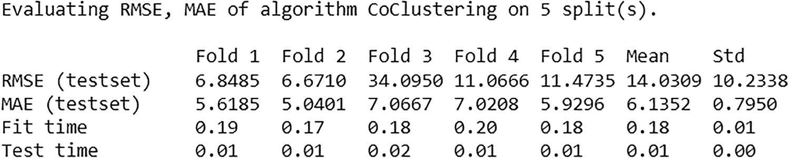

一个表示展示了协同聚类的交叉验证输出。描绘了算法协同聚类在 5 个分割上的 RMSE 和 MAE 评估。

图 5-11

协同聚类的交叉验证输出

交叉验证显示平均 RMSE 为 14.031，MAE 约为 6.135，相当低。

#### 实现 SVD

单特征值分解是线性代数中的一个概念，通常用作降维方法。它也是一种矩阵分解。在协同过滤中，它的工作方式类似，其中用户和项目作为行和列的矩阵进一步减少到潜在特征矩阵。通过最小化误差方程来获得预测。

让我们尝试使用 SVD 方法进行建模。

```py
# defining the model
import SVD
algo3 = SVD()
# model fitting
algo3.fit(train_set)
# model prediction
pred3 = algo3.test(test_set)
```

使用内置函数计算 RMSE 和 MAE 性能指标。

```py
# RMSE
accuracy.rmse(pred3)
#MAE
accuracy.mae(pred3)
```

下面是输出。

```py
RMSE: 4827.6830
MAE:  4815.8341
```

该模型的 RMSE 和 MAE 显著偏高。到目前为止，这是表现最差的（比 NMF 和协同聚类更差）。

通过内置函数进行交叉验证以进一步验证这些值。

```py
cross_validate(algo3, formated_data, verbose=True)
```

图 5-12 显示了 SVD 的交叉验证输出。

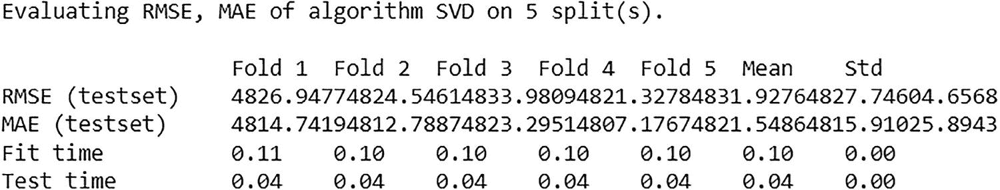

一个表示展示了 SVD 的交叉验证输出。描绘了算法 SVD 在 5 个分割上的 RMSE 和 MAE 评估。

图 5-12

SVD 的交叉验证输出

交叉验证显示平均 RMSE 为 4831.928，MAE 约为 4821.549，非常高。

#### 获取推荐

协同聚类模型的表现优于 NMF 和 SVD 模型。但在使用预测之前，让我们再次进一步验证模型。

为了验证模型，让我们使用项目 47590B 和客户 15738。

```py
data1[(data1['StockCode']=='47590B')&(data1['CustomerID']==15738)].Quantity.sum()
```

下面是输出。

```py
78
```

让我们获取相同组合的预测，以查看估计或预测。

```py
algo2.test([['47590B',15738,78]])
```

下面是输出。

```py
[Prediction(uid='47590B', iid=15738, r_ui=78, est=133.01087456331527, details={'was_impossible': False})]
```

模型给出的预测值是 133.01，而实际值是 78。它接近实际值，进一步验证了模型性能。

预测来自协同聚类模型。

```py
pred2
```

下面是输出。

```py
[Prediction(uid='85014B', iid=17228, r_ui=130.0, est=119.18329013727276, details={'was_impossible': False}),
Prediction(uid='84406B', iid=16520, r_ui=156.0, est=161.85867140088936, details={'was_impossible': False}),
Prediction(uid='47590B', iid=17365, r_ui=353.0, est=352.7773176826455, details={'was_impossible': False}),
...,
Prediction(uid='85049G', iid=16755, r_ui=170.0, est=159.5403752414615, details={'was_impossible': False}),
Prediction(uid='16156S', iid=14895, r_ui=367.0, est=368.129814201444, details={'was_impossible': False}),
Prediction(uid='47566B', iid=17238, r_ui=384.0, est=393.60123986750034, details={'was_impossible': False})]
```

现在，让我们使用这些预测并查看最佳和最差的预测，但首先，让我们将最终输出放入 DataFrame 中。

```py
predictions_data = pd.DataFrame(pred2, columns=['item_id', 'customer_id', 'quantity', 'prediction', 'details'])
```

但首先，让我们也使用以下函数添加重要信息，如每个记录的项目订单数和客户订单数。

```py
def get_item_orders(user_id):
try:
# for an item, return the no. of orders made
return len(train_set.ur[train_set.to_inner_uid(user_id)])
except ValueError:
# user not present in training
return 0
def get_customer_orders(item_id):
try:
# for an customer, return the no. of orders made
return len(train_set.ir[train_set.to_inner_iid(item_id)])
except ValueError:
# item not present in training
return 0
```

下面调用这些函数。

```py
predictions_data['item_orders'] = predictions_data.item_id.apply(get_item_orders)
predictions_data['customer_orders'] = predictions_data.customer_id.apply(get_customer_orders)
```

计算误差分量以获得最佳和最差的预测。

```py
predictions_data['error'] = abs(predictions_data.prediction - predictions_data.quantity)
predictions_data
```

图 5-13 显示了预测 DataFrame。

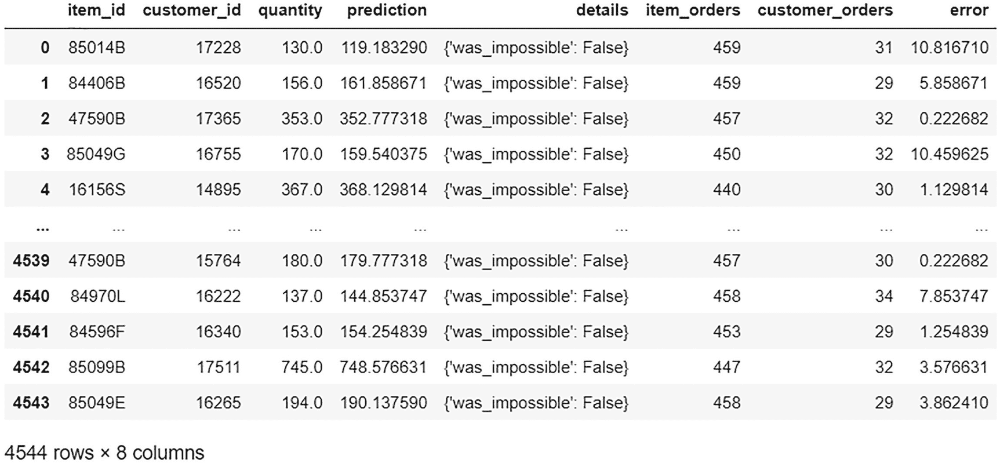

数据框展示了预测数据。项目 ID、客户 ID、数量、预测、详细信息、项目订单、客户订单和误差被表示。

图 5-13

预测 DataFrame

下面获取最佳预测。

```py
best_predictions = predictions_data.sort_values(by='error')[:10]
best_predictions
```

图 5-14 显示了最佳预测。

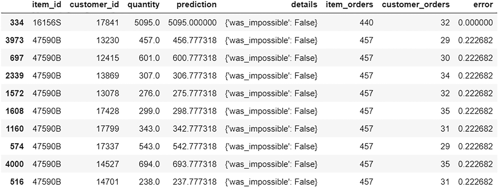

数据框展示了最佳预测数据。项目 ID、客户 ID、数量、预测、详情、项目订单、客户订单和错误都被表示出来。

图 5-14

最佳预测

以下获取最差预测。

```py
worst_predictions = predictions_data.sort_values(by='error')[-10:]
worst_predictions
```

图 5-15 展示了最差的预测。

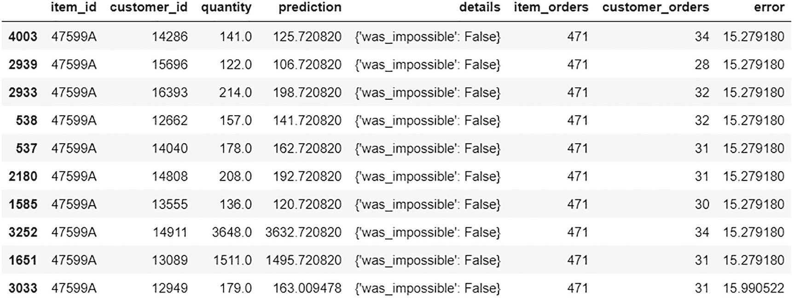

数据框展示了最差预测的数据。项目 ID、客户 ID、数量、预测、详情、项目订单、客户订单和错误都被表示出来。

图 5-15

最差预测

你现在可以使用预测数据来获取推荐。首先，找到购买与指定用户相同物品的客户，然后从他们购买的其他物品中获取顶级物品并推荐。

让我们再次使用客户 12347 并创建一个该用户购买物品的列表。

```py
# Getting item list for user 12347
item_list = predictions_data[predictions_data['customer_id']==12347]['item_id'].values.tolist()
item_list
```

以下是输出结果。

```py
['82494L',
'84970S',
'47599A',
'84997B',
'85123A',
'84997C',
'85049A']
```

获取购买与用户 12347 相同物品的客户列表。

```py
# Getting list of unique customers who also bought same items (item_list)
customer_list = predictions_data[predictions_data['item_id'].isin(item_list)]['customer_id'].values
customer_list = np.unique(customer_list).tolist()
customer_list
```

以下是输出结果。

```py
[12347,
12362,
12370,
12378,
...,
12415,
12417,
12428]
```

现在，让我们从预测数据中过滤这些客户（customer_list），移除已购买的物品，并推荐顶级物品（prediction）。

```py
# filtering those customers from predictions data
filtered_data = predictions_data[predictions_data['customer_id'].isin(customer_list)]
# removing the items already bought
filtered_data = filtered_data[~filtered_data['item_id'].isin(item_list)]
# getting the top items (prediction)
recommended_items = filtered_data.sort_values('prediction',ascending=False).reset_index(drop=True).head(10)['item_id'].values.tolist()
recommended_items
```

以下是输出结果。

```py
['16156S',
'85049E',
'47504K',
'85099C',
'85049G',
'85014B',
'72351B',
'84536A',
'48173C',
'47590A']
```

为用户 12347 生成的物品推荐列表完成。

## 摘要

本章继续讨论基于协同过滤的推荐引擎。探讨了诸如矩阵分解、SVD 和协同聚类等流行方法，重点在于实现这三种模型。对于给定的数据，协同聚类方法表现最佳，但你需要尝试所有不同的方法，以查看哪种最适合你的数据和构建推荐系统的用例。
