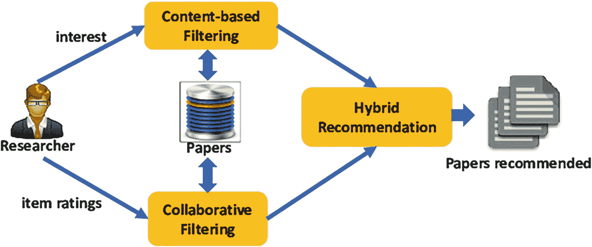
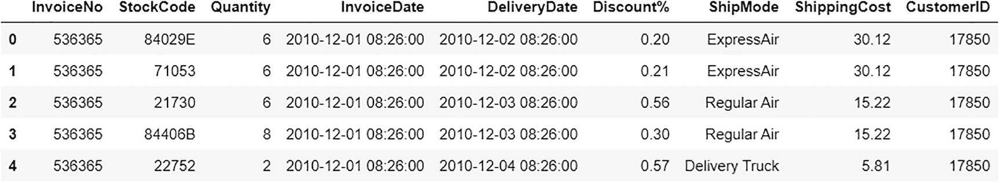
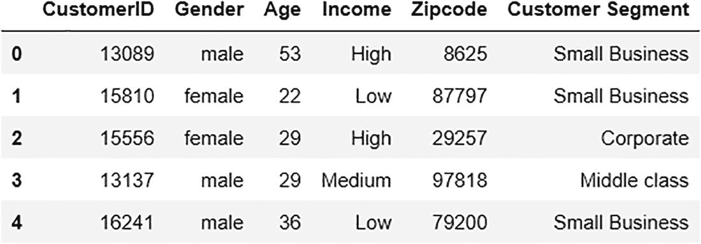
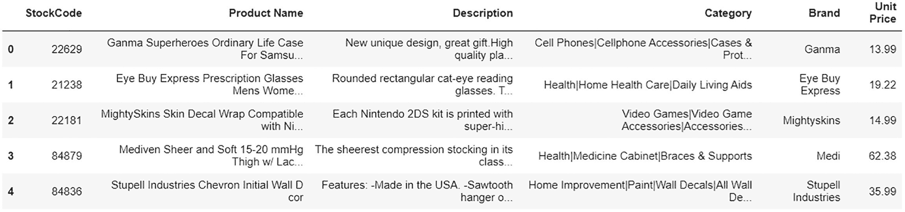
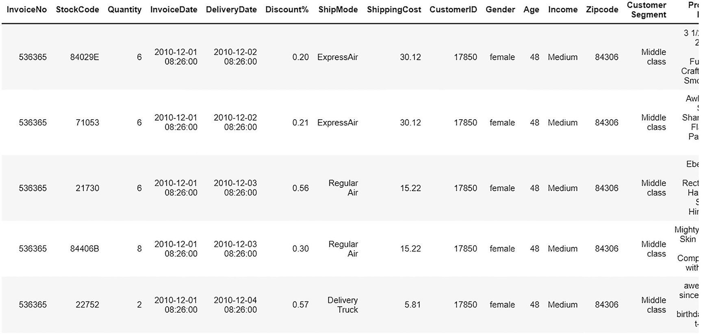
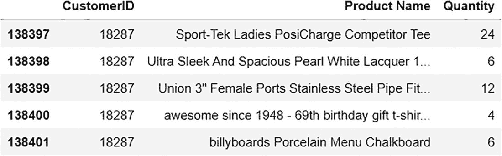
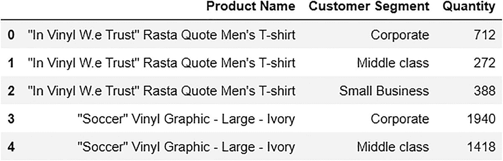

# 6. 混合推荐系统

之前章节实现了使用基于内容的和基于协同过滤方法的推荐引擎。每种方法都有其优缺点。协同过滤受冷启动问题困扰，这意味着当数据中出现新客户或新项目时，推荐将无法进行。

基于内容的过滤倾向于推荐与之前购买/喜欢的类似项目，变得重复。在这种情况下没有个性化效果。

图 6-1 解释了混合推荐系统。



混合推荐系统架构。它从基于内容的过滤开始，到混合推荐，再到协同过滤。

图 6-1

混合推荐系统

*参考:* [《混合论文推荐系统》(https://www.researchgate.net/profile/Xiangjie-Kong-2/publication/330077673/figure/fig5/AS:710433577107459@1546391972632/A-hybrid-paper-recommendation-system.png)](https://www.researchgate.net/profile/Xiangjie-Kong-2/publication/330077673/figure/fig5/AS:710433577107459%25401546391972632/A-hybrid-paper-recommendation-system.png)

为了解决一些这些缺点，引入混合推荐系统。混合推荐系统使用混合模型（即，结合基于内容的和协同过滤方法）。它不仅有助于克服单个模型的缺点，还能在大多数情况下提高效率和提供更好的推荐。

本章实现了一个混合推荐引擎，用于为电子商务公司推荐产品。本实现使用了 LightFM Python 包。

更多信息，请参阅 LightFM 文档，网址为 [`making.lyst.com/lightfm/docs/home.html`](https://making.lyst.com/lightfm/docs/home.html)。

## 实现

让我们导入所有必需的库。

```py
import pandas as pd
import numpy as np
from scipy.sparse import coo_matrix # for constructing sparse matrix
from lightfm import LightFM # for model
from lightfm.evaluation import auc_score
import time
import sklearn
from sklearn import model_selection
```

### 数据收集

本章使用与之前章节相同的自定义电子商务数据集。可以在 `github.com/apress/applied-recommender-systems-python` 找到。

下面的代码读取数据。

```py
#orders data
order_df = pd.read_excel('Rec_sys_data.xlsx','order')
#customers data
customer_df = pd.read_excel('Rec_sys_data.xlsx','customer')
#products data
product_df = pd.read_excel('Rec_sys_data.xlsx','product')
order_df.head()
```

图 6-2 展示了订单 DataFrame。



输出文件描述了前五个订单 DataFrame 的列表。它包括发票号码、库存代码、数量、发票日期、交货日期、折扣百分比、运输方式、运输成本和客户 ID。

图 6-2

订单数据

```py
customer_df.head()
```

图 6-3 展示了客户 DataFrame。



输出文件描述了客户数据框的前五行列表。它包括客户 ID、性别、年龄、收入、邮编和客户细分。

图 6-3

客户数据

```py
product_df.head()
```

图 6-4 展示了产品 DataFrame。



一个输出文件描述了产品数据框的前五行。它包括库存代码、产品名称、描述、类别、品牌和单价。

图 6-4

产品数据

合并数据。

```py
#merging all three data frames
merged_df = pd.merge(order_df,customer_df,left_on=['CustomerID'], right_on=['CustomerID'], how='left')
merged_df = pd.merge(merged_df,product_df,left_on=['StockCode'], right_on=['StockCode'], how='left')
merged_df.head()
```

图 6-5 展示了将要使用的合并后的 DataFrame。



一个输出文件描述了合并后的数据框。它包括发票号、库存代码、数量、发票日期、交货日期、折扣百分比和运输方式，随后是单个客户的详细信息。

图 6-5

合并数据

### 数据准备

在构建推荐模型之前，所需数据必须以适当的格式存在，以便模型可以接收输入。让我们获取用户与产品交互矩阵和产品到特征的交互映射。

从获取唯一用户列表和唯一产品列表开始。编写两个函数来获取唯一列表。

```py
def unique_users(data, column):
return np.sort(data[column].unique())
def unique_items(data, column):
item_list = data[column].unique()
return item_list
```

创建唯一列表。

```py
user_list = unique_users(order_df, "CustomerID")
item_list = unique_items(product_df, "Product Name")
user_list
```

以下为输出结果。

```py
array([12346, 12347, 12348, ..., 18282, 18283, 18287], dtype=int64)
item_list
```

以下为输出结果。

```py
array(['Ganma Superheroes Ordinary Life Case For Samsung Galaxy Note 5 Hard Case Cover',
'Eye Buy Express Prescription Glasses Mens Womens Burgundy Crystal Clear Yellow Rounded Rectangular Reading Glasses Anti Glare grade',
...,
'Mediven Sheer and Soft 15-20 mmHg Thigh w/ Lace Silicone Top Band CT Wheat II - Ankle 8-8.75 inches',
Union 3" Female Ports Stainless Steel Pipe Fitting',
'Auburn Leathercrafters Tuscany Leather Dog Collar’,
'3 1/2"W x 32"D x 36"H Traditional Arts & Crafts Smooth Bracket, Douglas Fir'])
```

让我们创建一个函数，从 DataFrame 中根据三个特征名称获取唯一值的总列表。它获取三个特征的唯一值列表：客户细分、年龄和性别。

```py
def features_to_add(customer, column1,column2,column3):
customer1 = customer[column1]
customer2 = customer[column2]
customer3 = customer[column3]
return pd.concat([customer1,customer3,customer2], ignore_index = True).unique()
```

为这些特征调用该函数。

```py
feature_unique_list = features_to_add(customer_df,'Customer Segment',"Age","Gender")
feature_unique_list
```

以下为输出结果。

```py
array(['Small Business', 'Corporate', 'Middle class', 'male', 'female',
53, 22, 29, 36, 48, 45, 47, 23, 39, 34, 52, 51, 35, 19, 26, 37, 18,
20, 21, 41, 31, 28, 50, 38, 30, 25, 32, 55, 43, 54, 49, 40, 33, 44,
46, 42, 27, 24], dtype=object)
```

现在我们有了用户、产品和特征的唯一列表，我们需要创建 ID 映射，将 user_id、item_id 和 feature_id 转换为整数索引，因为 LightFM 无法读取其他数据类型。

让我们为这个写一个函数。

```py
def mapping(user_list, item_list, feature_unique_list):
#creating empty output dicts
user_to_index_mapping = {}
index_to_user_mapping = {}
# Create id mappings to convert user_id
for user_index, user_id in enumerate(user_list):
user_to_index_mapping[user_id] = user_index
index_to_user_mapping[user_index] = user_id
item_to_index_mapping = {}
index_to_item_mapping = {}
# Create id mappings to convert item_id
for item_index, item_id in enumerate(item_list):
item_to_index_mapping[item_id] = item_index
index_to_item_mapping[item_index] = item_id
feature_to_index_mapping = {}
index_to_feature_mapping = {}
# Create id mappings to convert feature_id
for feature_index, feature_id in enumerate(feature_unique_list):
feature_to_index_mapping[feature_id] = feature_index
index_to_feature_mapping[feature_index] = feature_id
return user_to_index_mapping, index_to_user_mapping, \
item_to_index_mapping, index_to_item_mapping, \
feature_to_index_mapping, index_to_feature_mapping
```

通过提供用户列表、项目列表和特征唯一列表作为输入来调用该函数。

```py
user_to_index_mapping, index_to_user_mapping, \
item_to_index_mapping, index_to_item_mapping, \
feature_to_index_mapping, index_to_feature_mapping = mapping(user_list, item_list, feature_unique_list)
user_to_index_mapping
```

以下为输出结果。

```py
{12346: 0,
12347: 1,
12348: 2,
12350: 3,
12352: 4,
...}
```

现在让我们获取用户与产品关系并计算每个用户的总数量。

```py
user_to_product = merged_df[['CustomerID','Product Name','Quantity']]
#Calculating the total quantity(sum) per customer-product
user_to_product = user_to_product.groupby(['CustomerID','Product Name']).agg({'Quantity':'sum'}).reset_index()
user_to_product.tail()
```

图 6-6 展示了用户与产品关系数据。



一个输出文件描述了用户与产品关系数据。它包括客户 ID、产品名称和单个客户的数量。

图 6-6

用户与产品关系数据

类似地，让我们获取产品到特征的关联数据。

```py
product_to_feature = merged_df[['Product Name','Customer Segment','Quantity']]
#Calculating the total quantity(sum) per customer_segment-product
product_to_feature = product_to_feature.groupby(['Product Name','Customer Segment']).agg({'Quantity':'sum'}).reset_index()
product_to_feature.head()
```

图 6-7 展示了产品到特征的关系数据。



一个输出文件描述了产品到特征的关系数据。它包括产品名称、客户细分和单个客户的数量。

图 6-7

产品到特征关系数据

让我们将用户与产品之间的关系分为训练数据和测试数据。

```py
user_to_product_train,user_to_product_test =  model_selection.train_test_split(user_to_product,test_size=0.33, random_state=42)
print("Training set size:")
print(user_to_product_train.shape)
print("Test set size:")
print(user_to_product_test.shape)
```

以下为输出结果。

```py
Training set size:
(92729, 3)
Test set size:
(45673, 3)
```

现在数据和 ID 映射已经就绪，为了获取用户与产品以及产品到特征的交互矩阵，我们首先创建一个返回交互矩阵的函数。

```py
def interactions(data, row, col, value, row_map, col_map):
#converting the row with its given mappings
row = data[row].apply(lambda x: row_map[x]).values
#converting the col with its given mappings
col = data[col].apply(lambda x: col_map[x]).values
value = data[value].values
#returning the interaction matrix
return coo_matrix((value, (row, col)), shape = (len(row_map), len(col_map)))
```

然后，让我们使用前面的函数生成训练和测试数据的 user_item_interaction_matrix。

```py
#for train
user_to_product_interaction_train = interactions(user_to_product_train, "CustomerID",
"Product Name", "Quantity", user_to_index_mapping, item_to_index_mapping)
#for test
user_to_product_interaction_test = interactions(user_to_product_test, "CustomerID",
"Product Name", "Quantity", user_to_index_mapping, item_to_index_mapping)
print(user_to_product_interaction_train)
```

以下为输出结果。

```py
(2124, 230)  10
(1060, 268)  16
:            :
(64, 8)      24
(3406, 109)   1
(3219, 12)   12
```

类似地，让我们生成产品到特征的交互矩阵。

```py
product_to_feature_interaction = interactions(product_to_feature, "Product Name", "Customer Segment","Quantity",item_to_index_mapping, feature_to_index_mapping)
```

### 模型构建

数据格式正确，因此让我们开始建模过程。本章使用 LightFM 模型，该模型可以结合用户和商品元数据来形成稳健的混合推荐模型。

让我们尝试多个模型，然后选择表现最好的一个。这些模型有不同的超参数，因此这是建模的超参数调整阶段的一部分。

模型中使用的损失函数是调整参数之一。这三个值是 warp、logistic 和 bpr。

让我们开始模型构建实验。

尝试 1 的损失函数为 warp，迭代次数为 1，线程数为 4。

```py
# initialising model with warp loss function
model_with_features = LightFM(loss = "warp")
start = time.time()
#===================
# fitting the model with hybrid collaborative filtering + content based (product + features)
model_with_features.fit_partial(user_to_product_interaction_train,
user_features=None,
item_features=product_to_feature_interaction,
sample_weight=None,
epochs=1,
num_threads=4,
verbose=False)
#===================
end = time.time()
print("time taken = {0:.{1}f} seconds".format(end - start, 2))
```

以下是输出结果。

```py
time taken = 0.11 seconds
```

计算验证的曲线下面积（AUC）分数。

```py
start = time.time()
#===================
# Getting the AUC score using in-built function
auc_with_features = auc_score(model = model_with_features,
test_interactions = user_to_product_interaction_test,
train_interactions = user_to_product_interaction_train,
item_features = product_to_feature_interaction,
num_threads = 4, check_intersections=False)
#===================
end = time.time()
print("time taken = {0:.{1}f} seconds".format(end - start, 2))
print("average AUC without adding item-feature interaction = {0:.{1}f}".format(auc_with_features.mean(), 2))
```

以下是输出结果。

```py
time taken = 0.24 seconds
average AUC without adding item-feature interaction = 0.17
```

尝试 2 的损失函数为 logistic，迭代次数为 1，线程数为 4。

```py
# initialising model with warp loss function
model_with_features = LightFM(loss = "logistic")
start = time.time()
#===================
# fitting the model with hybrid collaborative filtering + content based (product + features)
model_with_features.fit_partial(user_to_product_interaction_train,
user_features=None,
item_features=product_to_feature_interaction,
sample_weight=None,
epochs=1,
num_threads=4,
verbose=False)
#===================
end = time.time()
print("time taken = {0:.{1}f} seconds".format(end - start, 2))
```

以下是输出结果。

```py
time taken = 0.11 seconds
```

为前面的模型计算 AUC 分数。

```py
start = time.time()
#===================
# Getting the AUC score using in-built function
auc_with_features = auc_score(model = model_with_features,
test_interactions = user_to_product_interaction_test,
train_interactions = user_to_product_interaction_train,
item_features = product_to_feature_interaction,
num_threads = 4, check_intersections=False)
#===================
end = time.time()
print("time taken = {0:.{1}f} seconds".format(end - start, 2))
print("average AUC without adding item-feature interaction = {0:.{1}f}".format(auc_with_features.mean(), 2))
```

以下是输出结果。

```py
time taken = 0.22 seconds
average AUC without adding item-feature interaction = 0.89
```

尝试 3 的损失函数为 bpr，迭代次数为 1，线程数为 4。

```py
# initialising model with warp loss function
model_with_features = LightFM(loss = "bpr")
start = time.time()
#===================
# fitting the model with hybrid collaborative filtering + content based (product + features)
model_with_features.fit_partial(user_to_product_interaction_train,
user_features=None,
item_features=product_to_feature_interaction,
sample_weight=None,
epochs=1,
num_threads=4,
verbose=False)
#===================
end = time.time()
print("time taken = {0:.{1}f} seconds".format(end - start, 2))
```

以下是输出结果。

```py
time taken = 0.12 seconds
```

为前面的模型计算 AUC 分数。

以下是输出结果。

尝试 4 的损失函数为 logistic，迭代次数为 10，线程数为 20。

以下是输出结果。

为前面的模型计算 AUC 分数。

```py
start = time.time()
#===================
# Getting the AUC score using in-built function
auc_with_features = auc_score(model = model_with_features,
test_interactions = user_to_product_interaction_test,
train_interactions = user_to_product_interaction_train,
item_features = product_to_feature_interaction,
num_threads = 4, check_intersections=False)
#===================
end = time.time()
print("time taken = {0:.{1}f} seconds".format(end - start, 2))
print("average AUC without adding item-feature interaction = {0:.{1}f}".format(auc_with_features.mean(), 2))
```

以下是输出结果。

```py
time taken = 0.22 seconds
average AUC without adding item-feature interaction = 0.38
model_with_features = LightFM(loss = "logistic")
start = time.time()
#===================
# fitting the model with hybrid collaborative filtering + content based (product + features)
model_with_features.fit_partial(user_to_product_interaction_train,
user_features=None,
item_features=product_to_feature_interaction,
sample_weight=None,
epochs=10,
num_threads=20,
verbose=False)
#===================
end = time.time()
print("time taken = {0:.{1}f} seconds".format(end - start, 2))
time taken = 0.77 seconds
start = time.time()
#===================
# Getting the AUC score using in-built function
auc_with_features = auc_score(model = model_with_features,
test_interactions = user_to_product_interaction_test,
train_interactions = user_to_product_interaction_train,
item_features = product_to_feature_interaction,
num_threads = 4, check_intersections=False)
#===================
end = time.time()
print("time taken = {0:.{1}f} seconds".format(end - start, 2))
print("average AUC without adding item-feature interaction = {0:.{1}f}".format(auc_with_features.mean(), 2))
time taken = 0.25 seconds
average AUC without adding item-feature interaction = 0.89
```

最后一个模型（logistic）在整体上表现最好（AUC 分数最高）。让我们合并训练数据和测试数据，并使用 logistic 模型提供的 0.89 AUC 参数进行最终训练。

使用以下函数合并训练数据和测试数据。

```py
def train_test_merge(training_data, testing_data):
# initialising train dict
train_dict = {}
for row, col, data in zip(training_data.row, training_data.col, training_data.data):
train_dict[(row, col)] = data
# replacing with the test set
for row, col, data in zip(testing_data.row, testing_data.col, testing_data.data):
train_dict[(row, col)] = max(data, train_dict.get((row, col), 0))
# converting to the row
row_list = []
col_list = []
data_list = []
for row, col in train_dict:
row_list.append(row)
col_list.append(col)
data_list.append(train_dict[(row, col)])
# converting to np array
row_list = np.array(row_list)
col_list = np.array(col_list)
data_list = np.array(data_list)
#returning the matrix output
return coo_matrix((data_list, (row_list, col_list)), shape = (training_data.shape[0], training_data.shape[1]))
```

调用前面的函数以获取构建最终模型所需的最终（完整）数据。

```py
user_to_product_interaction = train_test_merge(user_to_product_interaction_train, user_to_product_interaction_test)
```

### 合并训练数据和测试数据后的最终模型

让我们使用损失函数为 logistic，迭代次数为 10，线程数为 20 来构建 LightFM 模型。

```py
# retraining the final model with combined dataset
final_model = LightFM(loss = "warp",no_components=30)
# fitting to combined dataset
start = time.time()
#===================
#final model fitting
final_model.fit(user_to_product_interaction,
user_features=None,
item_features=product_to_feature_interaction,
sample_weight=None,
epochs=10,
num_threads=20,
verbose=False)
#===================
end = time.time()
print("time taken = {0:.{1}f} seconds".format(end - start, 2))
```

以下是输出结果。

```py
time taken = 3.46 seconds
```

### 获取推荐

现在混合推荐模型已经准备好了，让我们用它来获取给定用户的推荐。

让我们编写一个函数，用于根据用户 ID 获取推荐。

```py
def get_recommendations(model,user,items,user_to_product_interaction_matrix,user2index_map,product_to_feature_interaction_matrix):
# getting the userindex
userindex = user2index_map.get(user, None)
if userindex == None:
return None
users = userindex
# getting products already bought
known_positives = items[user_to_product_interaction_matrix.tocsr()[userindex].indices]
print('User index =',users)
# scores from model prediction
scores = model.predict(user_ids = users, item_ids = np.arange(user_to_product_interaction_matrix.shape[1]),item_features=product_to_feature_interaction_matrix)
#getting top items
top_items = items[np.argsort(-scores)]
# printing out the result
print("User %s" % user)
print("     Known positives:")
for x in known_positives[:10]:
print("                  %s" % x)
print("     Recommended:")
for x in top_items[:10]:
print("                  %s" % x)
```

此函数计算用户对所有商品的预测分数（购买的可能性），并推荐得分最高的十个商品。让我们打印出该用户已知为正或购买的商品以进行验证。

调用以下函数为一个随机用户（客户 ID 17017）获取推荐。

```py
get_recommendations(final_model,17017,item_list,user_to_product_interaction,user_to_index_mapping,product_to_feature_interaction)
```

以下是输出结果。

```py
User index = 2888
User 17017
Known positives:
Ganma Superheroes Ordinary Life Case For Samsung Galaxy Note 5 Hard Case Cover
MightySkins Skin Decal Wrap Compatible with Nintendo Sticker Protective Cover 100's of Color Options
Mediven Sheer and Soft 15-20 mmHg Thigh w/ Lace Silicone Top Band CT Wheat II - Ankle 8-8.75 inches
MightySkins Skin Decal Wrap Compatible with OtterBox Sticker Protective Cover 100's of Color Options
MightySkins Skin Decal Wrap Compatible with DJI Sticker Protective Cover 100's of Color Options
MightySkins Skin Decal Wrap Compatible with Lenovo Sticker Protective Cover 100's of Color Options
Ebe Reading Glasses Mens Womens Tortoise Bold Rectangular Full Frame Anti Glare grade ckbdp9088
Window Tint Film Chevy (back doors) DIY
Union 3" Female Ports Stainless Steel Pipe Fitting
Ebe Women Reading Glasses Reader Cheaters Anti Reflective Lenses TR90 ry2209
Recommended:
Mediven Sheer and Soft 15-20 mmHg Thigh w/ Lace Silicone Top Band CT Wheat II - Ankle 8-8.75 inches
MightySkins Skin Decal Wrap Compatible with Apple Sticker Protective Cover 100's of Color Options
MightySkins Skin Decal Wrap Compatible with DJI Sticker Protective Cover 100's of Color Options
3 1/2"W x 20"D x 20"H Funston Craftsman Smooth Bracket, Douglas Fir
MightySkins Skin Decal Wrap Compatible with HP Sticker Protective Cover 100's of Color Options
Owlpack Clear Poly Bags with Open End, 1.5 Mil, Perfect for Products, Merchandise, Goody Bags, Party Favors (4x4 inches)
Ebe Women Reading Glasses Reader Cheaters Anti Reflective Lenses TR90 ry2209
Handcrafted Ercolano Music Box Featuring "Luncheon of the Boating Party" by Renoir, Pierre Auguste - New YorkNew York
A6 Invitation Envelopes w/Peel & Press (4 3/4 x 6 1/2) - Baby Blue (1000 Qty.)
MightySkins Skin Decal Wrap Compatible with Lenovo Sticker Protective Cover 100's of Color Options
```

许多推荐与已知正例相吻合。这提供了进一步的验证。现在这个混合推荐引擎可以为所有其他用户获取推荐。

## 摘要

本章讨论了混合推荐引擎及其如何克服其他类型引擎的不足。它还展示了使用 LightFM 的实现。
