# 7. 基于聚类的推荐系统

基于无监督机器学习算法的推荐系统非常受欢迎，因为它们克服了许多协同、混合和基于分类的系统面临的挑战。使用聚类技术根据每个段/聚类中捕获的模式和行为推荐产品/物品。当数据有限且没有标记数据可工作时，这种技术很好。

无监督学习是一种机器学习类别，其中不利用标记数据，但仍然使用现有数据发现推断。让我们找到没有依赖变量的模式来解决商业问题。图 7-1 展示了聚类结果。

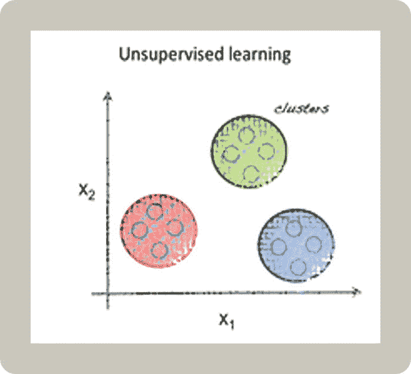

无监督学习的图展示了聚类结果。沿 x 轴（x 下标 1）和 y 轴（x 下标 2）表示了三个聚类。

图 7-1

聚类

将相似的事物分组到段中称为 *聚类*；在我们的术语中，“事物”不是数据点，而是一组观察结果。它们是

+   同组内彼此相似

+   与其他组中的观察结果不同

在行业中主要使用两种重要的算法。在进入项目之前，让我们简要地检查算法是如何工作的。

## 方法

以下基本步骤基于相似用户的推荐构建模型。

1.  数据收集

1.  数据预处理

1.  探索性数据分析

1.  模型构建

1.  推荐

图 7-2 展示了基于聚类的模型构建步骤。

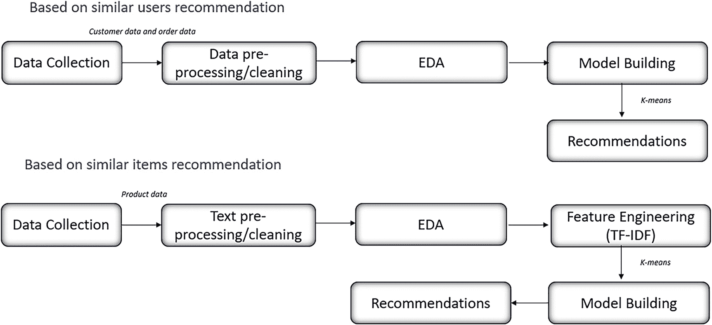

一组框架展示了基于相似用户推荐（顶部）和基于相似物品推荐（底部）构建模型所涉及的步骤。

图 7-2

步骤

## 实现

让我们安装并导入所需的库。

```py
#Importing the libraries
import pandas as pd
import numpy as np
from matplotlib import pyplot as plt
from scipy.cluster.hierarchy import dendrogram
from sklearn.cluster import AgglomerativeClustering
from sklearn.cluster import KMeans
import seaborn as sns
import os
from sklearn import preprocessing
```

### 数据收集和下载所需的词嵌入

让我们考虑一个电子商务数据集。从本书的 GitHub 链接下载数据集。

### 将数据作为数据框（pandas）导入

导入记录、客户和产品数据。

```py
# read Record dataset
df_order = pd.read_excel("Rec_sys_data.xlsx")
#read Customer Dataset
df_customer = pd.read_excel("Rec_sys_data.xlsx", sheet_name = 'customer')
# read product dataset
df_product = pd.read_excel("Rec_sys_data.xlsx", sheet_name = 'product')
```

打印数据框的前五行。

```py
#Viewing Top 5 Rows
print(df_order.head())
print(df_customer.head())
print(df_product.head())
```

图 7-3 展示了记录数据的头五行输出。

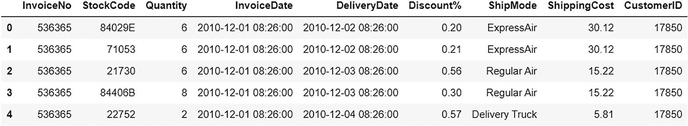

数据框展示了记录数据的前五行（0 到 4）的输出。数据包括发票号、库存代码、数量、交货日期和运输方式。

图 7-3

输出

图 7-4 展示了客户数据头五行的输出。

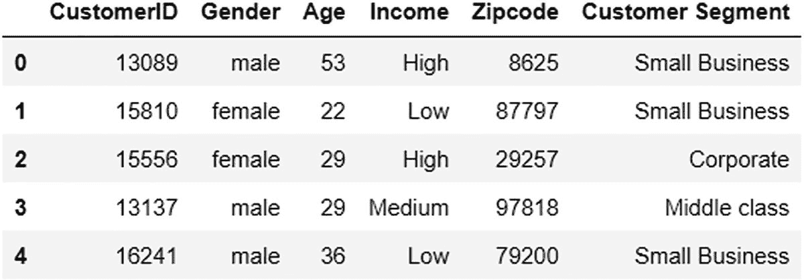

数据框展示了客户数据的前五行（0 到 4）的输出。数据包括客户 ID、性别、年龄、收入、邮编和客户段。

图 7-4

输出

图 7-5 显示了产品数据前五行的输出。

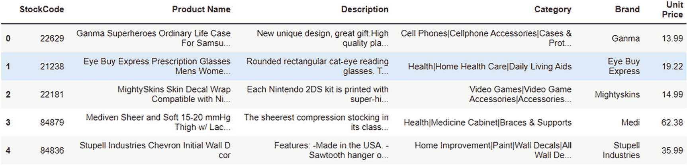

一个数据框显示了产品数据的前 5 行（0 到 4）的输出。数据包括股票代码、产品名称、描述、类别、品牌和单价。

图 7-5

输出

### 数据预处理

在构建任何模型之前，第一步是清理和预处理数据。

让我们分析、清理和合并三个数据集，以便合并后的 DataFrame 可以用于构建机器学习模型。

首先，将所有客户数据分析集中在基于相似用户推荐产品。

接下来，编写一个函数并检查客户数据中的缺失值。

```py
# function to check missing values
def missing_zero_values_table(df):
zero_val = (df == 0.00).astype(int).sum(axis=0)
mis_val = df.isnull().sum()
mis_val_percent = 100 * df.isnull().sum() / len(df)
mz_table = pd.concat([zero_val, mis_val, mis_val_percent], axis=1)
mz_table = mz_table.rename(
columns = {0 : 'Zero Values', 1 : 'Missing Values', 2 : '% of Total Values'})
mz_table['Total Zero Missing Values'] = mz_table['Zero Values'] + mz_table['Missing Values']
mz_table['% Total Zero Missing Values'] = 100 * mz_table['Total Zero Missing Values'] / len(df)
mz_table['Data Type'] = df.dtypes
mz_table = mz_table[
mz_table.iloc[:,1] != 0].sort_values(
'% of Total Values', ascending=False).round(1)
print ("Your selected dataframe has " + str(df.shape[1]) + " columns and " + str(df.shape[0]) + " Rows.\n"
"There are " + str(mz_table.shape[0]) +
" columns that have missing values.")
#         mz_table.to_excel('D:/sampledata/missing_and_zero_values.xlsx', freeze_panes=(1,0), index = False)
return mz_table
# let us call the function now
missing_zero_values_table(df_customer)
```

图 7-6 显示了缺失值的输出。

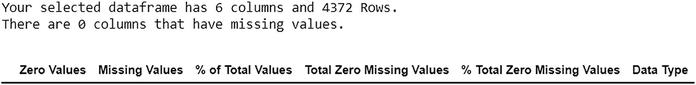

一个表示显示了缺失值的输出。所选数据框有 6 列和 4372 行。没有列有缺失值。

图 7-6

输出

### 探索性数据分析

让我们使用 sklearn 中定义的 Matplotlib 包来探索数据可视化。

首先，让我们看看年龄分布。

```py
# Count of age Category
plt.figure(figsize=(10,6))
plt.title("Ages Frequency")
sns.axes_style("dark")
sns.violinplot(y=df_customer["Age"])
plt.show()
```

图 7-7 显示了年龄分布的输出。

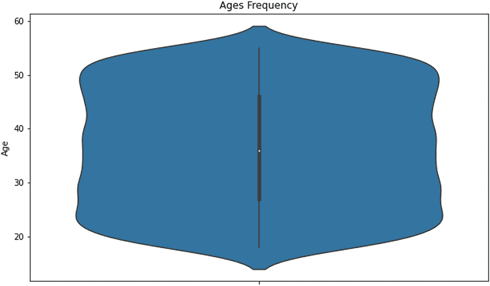

年龄频率的小提琴图表示了客户年龄（从 20 岁到 60 岁）的分布输出。y 轴表示年龄。

图 7-7

输出

接下来，让我们看看性别分布。

```py
# Count of gender Category
genders = df_customer.Gender.value_counts()
sns.set_style("darkgrid")
plt.figure(figsize=(10,4))
sns.barplot(x=genders.index, y=genders.values)
plt.show()
```

图 7-8 显示了性别计数的输出。

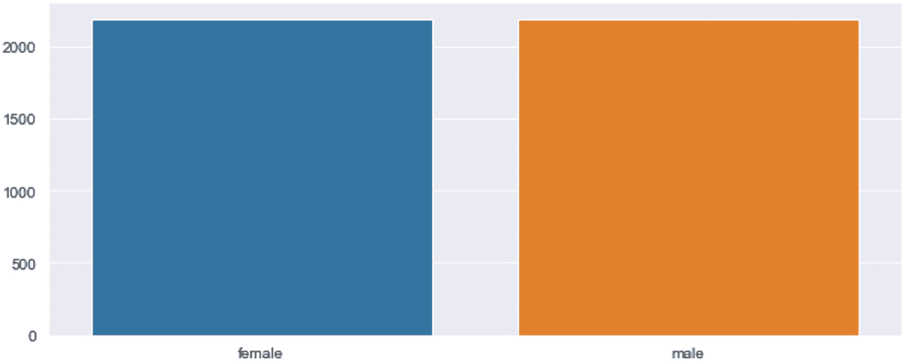

一个柱状图显示了性别（男性和女性）计数的输出。男性和女性的计数在相似范围内。

图 7-8

输出

从这个图表中可以得出的关键见解是数据没有基于性别的偏差。

让我们创建年龄列的桶状图，并绘制它们与客户数量的关系。

```py
# age buckets against number of customers
age18_25 = df_customer.Age[(df_customer.Age = 18)]
age26_35 = df_customer.Age[(df_customer.Age = 26)]
age36_45 = df_customer.Age[(df_customer.Age = 36)]
age46_55 = df_customer.Age[(df_customer.Age = 46)]
age55above = df_customer.Age[df_customer.Age >= 56]
x = ["18-25","26-35","36-45","46-55","55+"]
y = [len(age18_25.values),len(age26_35.values),len(age36_45.values),len(age46_55.values),len(age55above.values)]
plt.figure(figsize=(15,6))
sns.barplot(x=x, y=y, palette="rocket")
plt.title("Number of Customer and Ages")
plt.xlabel("Age")
plt.ylabel("Number of Customer")
plt.show()
```

图 7-9 显示了年龄列的桶状图与客户数量的关系。

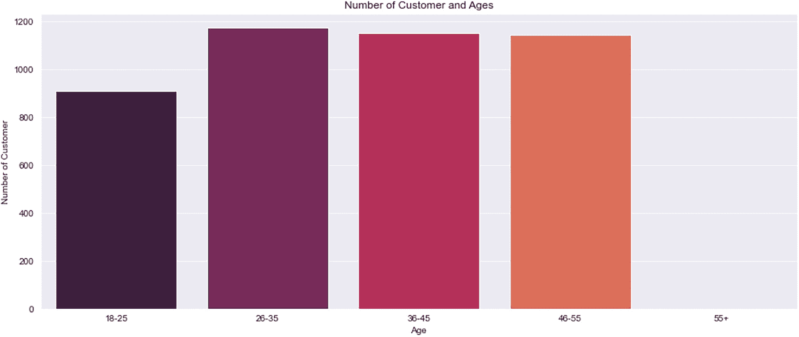

一条柱状图显示了客户数量（y 轴）和年龄（x 轴）的输出。观察到 26 至 35 岁的年龄组客户数量最多。

图 7-9

输出

这项分析表明，18 至 25 岁的客户数量较少。

#### 标签编码

让我们将所有分类变量进行编码。

```py
# label_encoder object knows how to understand word labels.
gender_encoder = preprocessing.LabelEncoder()
segment_encoder = preprocessing.LabelEncoder()
income_encoder =  preprocessing.LabelEncoder()
# Encode labels in column
df_customer['age'] = df_customer.Age
df_customer['gender']= gender_encoder.fit_transform(df_customer['Gender'])
df_customer['customer_segment']= segment_encoder.fit_transform(df_customer['Customer Segment'])
df_customer['income_segment']= income_encoder.fit_transform(df_customer['Income'])
print("gender_encoder",df_customer['gender'].unique())
print("segment_encoder",df_customer['customer_segment'].unique())
print("income_encoder",df_customer['income_segment'].unique())
```

下面的输出是。

```py
gender_encoder [1 0]
segment_encoder [2 0 1]
income_encoder [0 1 2]
```

让我们查看编码值后的 DataFrame。

```py
df_customer.iloc[:,6:]
```

图 7-10 显示了编码值后的 DataFrame 的输出。

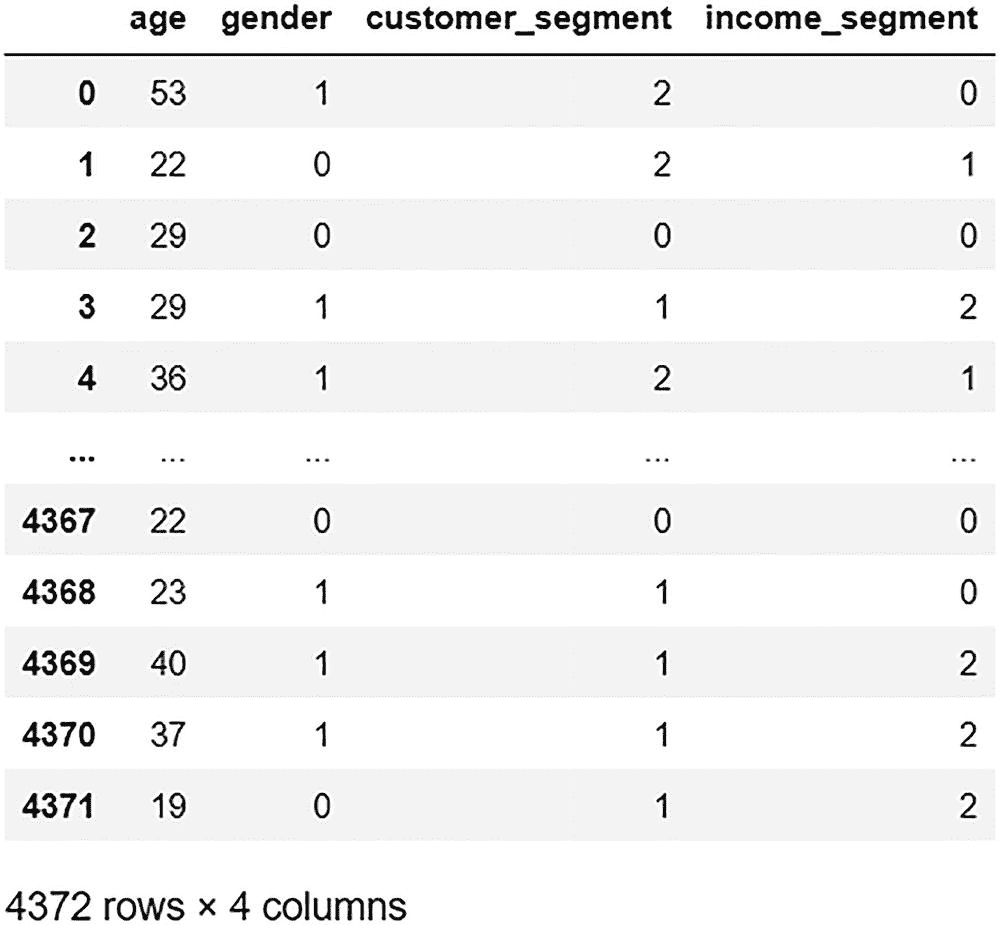

一个数据框显示了编码值后的输出。年龄、性别、客户 _ 段和收入 _ 段的数据被表示出来。

图 7-10

输出

### 模型构建

这个阶段使用 k-means 聚类构建簇。为了定义最佳簇数，也可以考虑肘部方法或树状图方法。

#### K-Means 聚类

*k*-means 聚类是一种高效且广泛使用的聚类技术，它根据点之间的距离对数据进行分组。其目标是最小化聚类内的总方差，如图 7-11 所示。

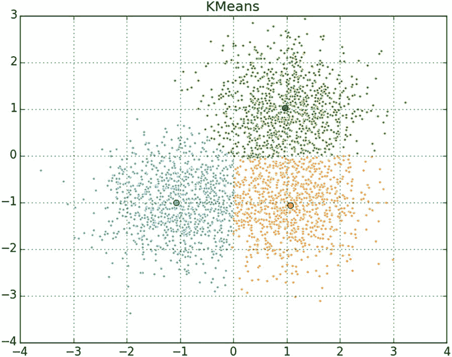

一个图表示 K 均值聚类的聚类。有 3 组聚类。观察到聚类沿 -1 和 +1 轴分布。

图 7-11

k-means 聚类

以下步骤生成聚类。

1.  使用肘部方法确定最佳聚类数量。这作为 *k*。

1.  从整体观察结果或点中选择随机的 *k* 个点作为聚类中心。

1.  计算这些中心与其他数据点之间的距离，并使用以下任何一种距离度量将其分配给最近的中心聚类，该点属于特定的聚类。

    +   欧几里得距离

    +   曼哈顿距离

    +   余弦距离

    +   汉明距离

1.  重新计算每个聚类的聚类中心或质心。

重复步骤 2、3 和 4，直到每个聚类分配给相同的点，并且聚类质心稳定下来。

#### 肘部方法

肘部方法检查聚类的稳定性。它找到数据中的理想聚类数量。解释方差考虑了解释的方差百分比，并推导出理想的聚类数量。假设解释的偏差百分比与聚类数量进行比较。在这种情况下，第一个聚类添加了大量的信息，但到了某个点，解释方差下降，在图上形成一个角度。在这个时刻，选择聚类数量。

肘部方法在数据集上对一系列的 *k* 值（例如，从 1 到 10）运行 *k*-means 聚类，然后对于每个 *k* 值，它计算所有聚类的平均得分。

#### 层次聚类

层次聚类是另一种聚类技术，它也使用距离来创建组。以下步骤生成聚类。

1.  层次聚类首先将每个观察结果或点作为一个单独的聚类创建。

1.  它根据前面讨论的距离度量，确定了两个最接近的观察结果或点。

1.  将这两个最相似的点合并，形成一个聚类。

1.  这一直持续到所有聚类合并形成一个最终的单一聚类。

1.  最后，使用树状图决定理想的聚类数量。

树被切割以决定聚类数量。树切割发生在从一个级别到另一个级别有最大跳跃的地方，如图 7-12 所示。

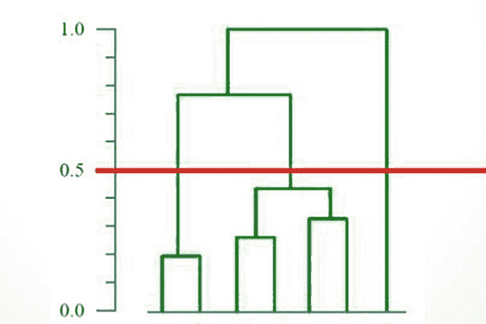

一个层次树状图揭示了聚类。树状结构代表了系统中所有数据点之间的关系。

图 7-12

层次聚类

通常，两个聚类之间的距离是基于欧几里得距离计算的。还可以利用许多其他距离度量来完成同样的工作。

让我们为这个用例构建一个 k-均值模型。在构建模型之前，让我们执行肘部方法和树状图方法以找到最优簇数。

以下是一个肘部方法实现。

```py
# Elbow method
wcss = []
for k in range(1,15):
kmeans = KMeans(n_clusters=k, init="k-means++")
kmeans.fit(df_customer.iloc[:,6:])
wcss.append(kmeans.inertia_)
plt.figure(figsize=(12,6))
plt.grid()
plt.plot(range(1,15),wcss, linewidth=2, color="red", marker ="8")
plt.xlabel("K Value")
plt.xticks(np.arange(1,15,1))
plt.ylabel("WCSS")
plt.show()print("income_encoder",df_customer['income_segment'].unique())
```

图 7-13 显示了肘部方法输出。

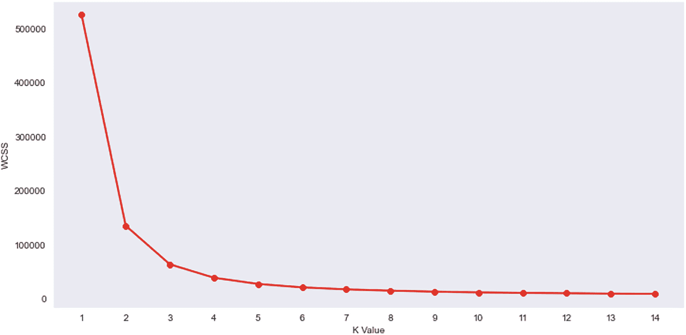

K 值（x 轴）与 W C S S（y 轴）的图表展示了肘部方法输出。图表中的趋势从 1 到 14 K 值逐渐降低。

图 7-13

输出

以下是一个树状图方法实现。

```py
#function to plot dendrogram
def plot_dendrogram(model, **kwargs):
# Create linkage matrix and then plot the dendrogram
# create the counts of samples under each node
counts = np.zeros(model.children_.shape[0])
n_samples = len(model.labels_)
for i, merge in enumerate(model.children_):
current_count = 0
for child_idx in merge:
if child_idx < n_samples:
current_count += 1  # leaf node
else:
current_count += counts[child_idx - n_samples]
counts[i] = current_count
linkage_matrix = np.column_stack(
[model.children_, model.distances_, counts]
).astype(float)
# Plot the corresponding dendrogram
dendrogram(linkage_matrix, **kwargs)
# setting distance_threshold=0 ensures we compute the full tree.
model = AgglomerativeClustering(distance_threshold=0, n_clusters=None)
model = model.fit(df_customer.iloc[:,6:])
plt.title("Hierarchical Clustering Dendrogram")
# plot the top three levels of the dendrogram
plot_dendrogram(model, truncate_mode="level", p=3)
plt.xlabel("Number of points in node (or index of point if no parenthesis).")
plt.show()
```

图 7-14 显示了树状图输出。

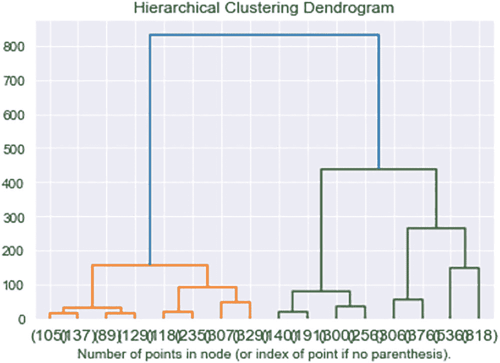

一个层次聚类树状图展示了节点中的点数（如果没有括号，则为点的索引）。它展示了系统中所有数据点之间的关系。

图 7-14

输出

两种方法的最优或最少簇数都是两个。但让我们考虑在这个用例中使用 15 个簇。

注意

你可以考虑任何数量的簇进行实现，但应该大于 k-均值聚类或树状图的**最优**或**最少**簇数。

让我们考虑 15 个簇构建一个 k-均值算法。

```py
# K-means
# Perform kmeans
km = KMeans(n_clusters=15)
clusters = km.fit_predict(df_customer.iloc[:,6:])
# saving prediction back to raw dataset
df_customer['cluster'] = clusters
df_customer
```

图 7-15 显示了创建簇后的 df_cluster 输出。

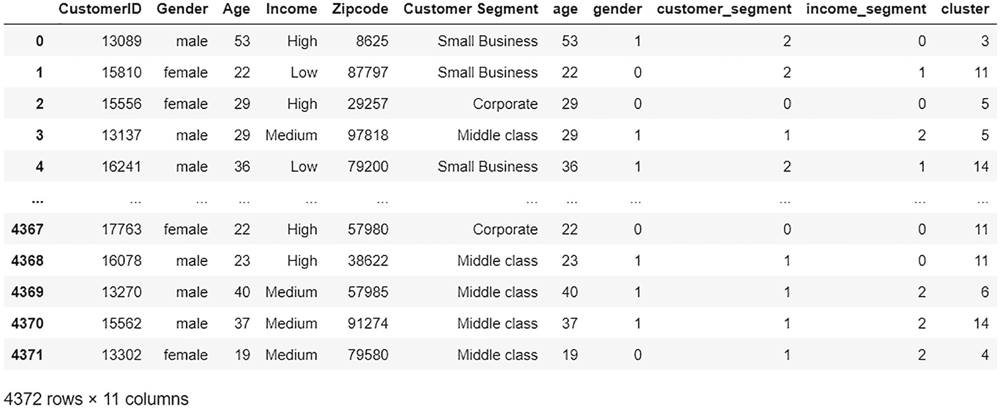

一个数据框展示了创建簇后的 df_cluster 输出。数据包括客户 ID、性别、年龄、收入、邮编和客户细分。

图 7-15

输出

从数据集中选择所需的列。

```py
df_customer = df_customer[['CustomerID', 'Gender', 'Age', 'Income', 'Zipcode', 'Customer Segment', 'cluster']]
df_customer
```

图 7-16 显示了选择特定列后的 df_cluster 输出。

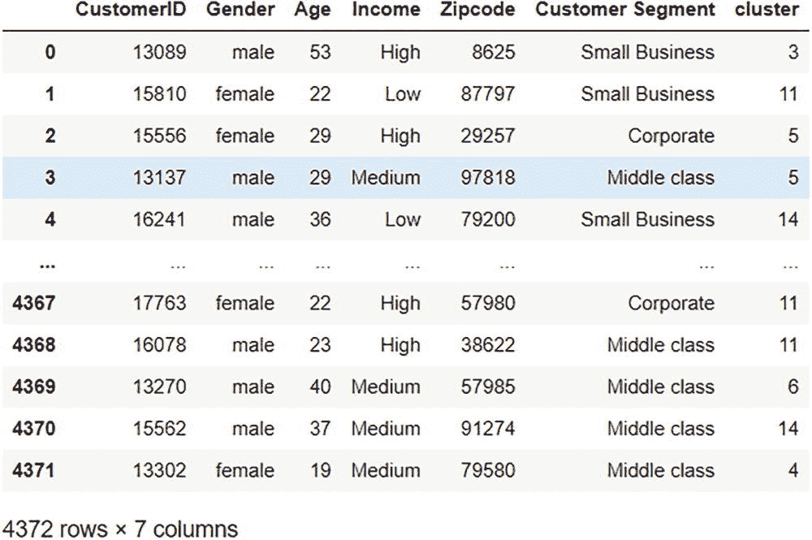

一个数据框展示了选择特定列后的 df_cluster 输出。数据包括客户 ID、年龄、性别、收入和邮编。

图 7-16

输出

让我们在簇级别上进行一些分析。

编写一个函数来绘制簇与给定列的图表。

```py
def plotting_percentages(df, col, target):
x, y = col, target
# Temporary dataframe with percentage values
temp_df = df.groupby(x)[y].value_counts(normalize=True)
temp_df = temp_df.mul(100).rename('percent').reset_index()
# Sort the column values for plotting
order_list = list(df[col].unique())
order_list.sort()
# Plot the figure
sns.set(font_scale=1.5)
g = sns.catplot(x=x, y='percent', hue=y,kind='bar', data=temp_df,
height=8, aspect=2, order=order_list, legend_out=False)
g.ax.set_ylim(0,100)
# Loop through each bar in the graph and add the percentage value
for p in g.ax.patches:
txt = str(p.get_height().round(1)) + '%'
txt_x = p.get_x()
txt_y = p.get_height()
g.ax.text(txt_x,txt_y,txt)
# Set labels and title
plt.title(f'{col.title()} By Percent {target.title()}',
fontdict={'fontsize': 30})
plt.xlabel(f'{col.title()}', fontdict={'fontsize': 20})
plt.ylabel(f'{target.title()} Percentage', fontdict={'fontsize': 20})
plt.xticks(rotation=75)
return g
```

绘制客户细分图。

```py
plotting_percentages(df_customer, 'cluster', 'Customer Segment')
```

图 7-17 显示了客户细分与簇的对应关系图。

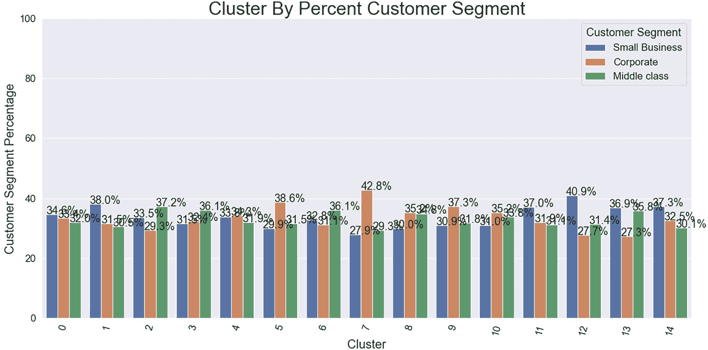

一个三柱状图显示了客户细分（小型企业、企业、中产阶级）与簇的输出。x 轴和 y 轴分别表示簇和客户细分百分比。

图 7-17

输出

让我们绘制收入图。

```py
plotting_percentages(df_customer, 'cluster', 'Income')
```

图 7-18 显示了收入与簇的对应关系图。

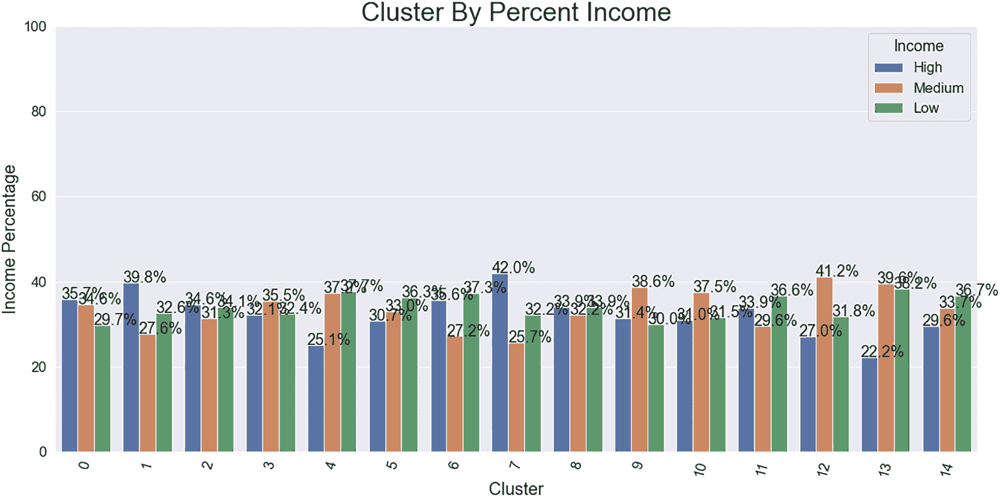

一个三柱状图展示了按百分比收入（高、中、低收入）的簇数据。x 轴和 y 轴分别表示簇和收入百分比。

图 7-18

输出

让我们绘制性别图。

```py
plotting_percentages(df_customer, 'cluster', 'Gender')
```

图 7-19 显示了性别与簇的对应关系图。

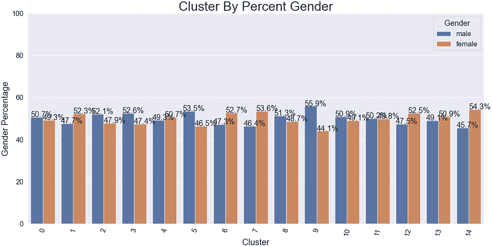

双柱状图展示了性别百分比（男性和女性）与集群的关系。男性在集群 9 中观察到最高的百分比，女性在集群 14 中观察到最高的百分比。

图 7-19

输出

让我们绘制一个图表，显示每个集群的平均年龄。

```py
df_customer.groupby('cluster').Age.mean().plot(kind='bar')
```

图 7-20 展示了每个集群的平均年龄的图表。

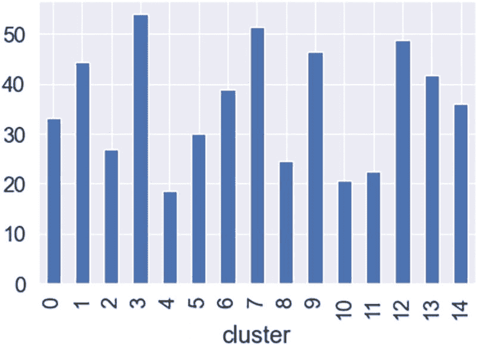

柱状图展示了与集群相关的平均值的输出。x 轴由集群指示。集群 3 的平均值最高（超过 50）。

图 7-20

输出

到目前为止，所有数据预处理、EDA 和模型构建都是在客户数据上进行的。

接下来，将客户数据与订单数据连接，以获取每条记录的产品 ID。

```py
order_cluster_mapping = pd.merge( df_order,df_customer, on='CustomerID', how='inner')[['StockCode','CustomerID','cluster']]
order_cluster_mapping
```

图 7-21 展示了合并客户数据和订单数据后的输出。

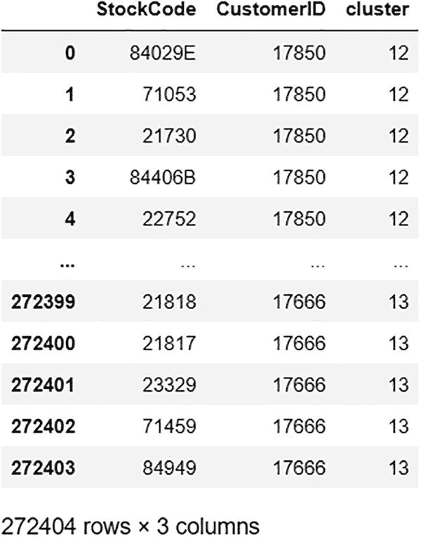

数据框暴露了统一客户数据和订单数据后的输出。数据包括股票代码、客户 ID 和聚类表示。

图 7-21

输出

现在，让我们使用 'cluster' 和 'StockCode' 进行分组，并创建 score_df，然后进行计数。

```py
score_df = order_cluster_mapping.groupby(['cluster','StockCode']).count().reset_index()
score_df = score_df.rename(columns={'CustomerID':'Score'})
score_df
```

图 7-22 展示了创建 score_df 后的输出。

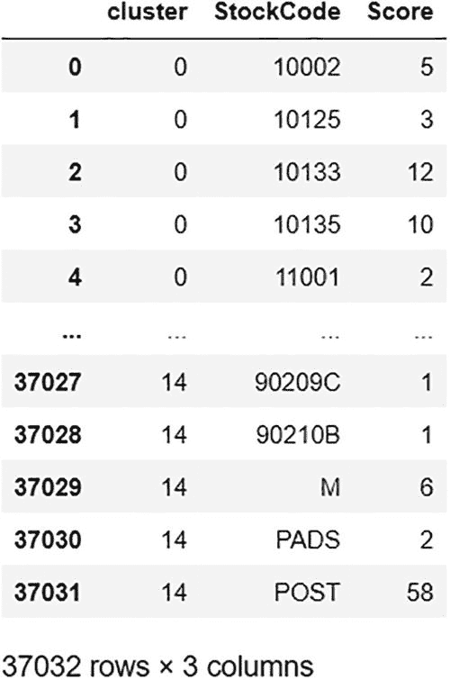

数据框（37032 行和 3 列）展示了 score_df 制定后的输出。数据包括集群、股票代码和分数表示。

图 7-22

输出

score_df 数据已准备好向客户推荐新产品。同一集群中的其他客户已购买了推荐的产品。这是基于相似用户。

让我们关注 *产品数据*，基于相似性推荐产品。

客户分析预处理函数用于检查缺失值。

```py
missing_zero_values_table(df_product)
```

图 7-23 展示了缺失值输出。

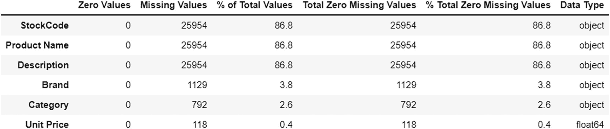

数据框暴露了缺失值的输出。数据包括零值、缺失值、总值的百分比、总零缺失值和数据类型表示。

图 7-23

输出

因此，产品数据中存在差异。让我们清理它并再次检查。

```py
df_product = df_product.dropna()
missing_zero_values_table(df_product)
```

图 7-24 展示了移除缺失值后的输出。


数据框的表示展示了移除缺失值后的输出。所选数据框有 6 列和 3706 行。没有列有缺失值。

图 7-24

输出

让我们专注于 Description 列，因为我们正在处理相似项。

描述列包含文本，因此需要进行预处理并将文本转换为特征。

```py
# Pre-processing step: remove words like we'll, you'll, they'll etc.
df_product['Description'] = df_product['Description'].replace({"'ll": " "}, regex=True)
df_product['Description'] = df_product['Description'].replace({"-": " "}, regex=True)
df_product['Description'] = df_product['Description'].replace({"[^A-Za-z0-9 ]+": ""}, regex=True)
# Converting text to features
# Create word vectors from combined frames
# Make sure to make necessary imports
from sklearn.cluster import KMeans
from sklearn import metrics
from sklearn.feature_extraction.text import TfidfVectorizer
#converting text to features
vectorizer = TfidfVectorizer(stop_words='english')
X = vectorizer.fit_transform(df_product['Description'])
```

文本预处理和文本到特征的转换已完成。现在，让我们使用 15 个聚类构建 *k*-均值模型。

```py
# #clustering your products based on text
km_des = KMeans(n_clusters=15,init='k-means++')
clusters = km_des.fit_predict(X)
df_product['cluster'] = clusters
df_product
```

图 7-25 展示了创建产品数据聚类后的输出结果。

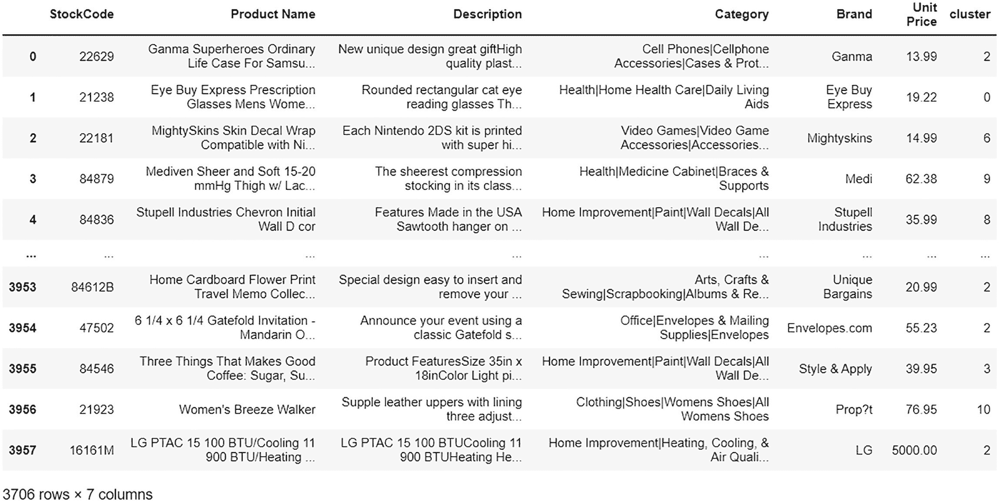

数据框显示了创建产品数据聚类后的输出结果。数据包括股票代码、产品名称、描述、类别、品牌、单价和聚类表示。

图 7-25

输出结果

现在 df_product 数据已经准备好，可以根据相似商品推荐产品。

让我们编写一个基于商品和用户相似性推荐产品的函数。

```py
# functions to recommend products based on item and user similarity.
from sklearn.feature_extraction.text import TfidfVectorizer, ENGLISH_STOP_WORDS
from sklearn.metrics.pairwise import cosine_similarity
from sklearn.feature_extraction.text import TfidfTransformer
from nltk.corpus import stopwords
import pandas as pd
# function to find cosine similarity after converting discerption column to features using TF-IDF
def cosine_similarity_T(df,query):
vec = TfidfVectorizer(analyzer='word', stop_words=ENGLISH_STOP_WORDS)
vec_train = vec.fit_transform(df.Description)
vec_query = vec.transform([query])
within_cosine_similarity = []
for i in range(len(vec_train.todense())):
within_cosine_similarity.append(cosine_similarity(vec_train[i,:].toarray(), vec_query.toarray())[0][0])
df['Similarity'] = within_cosine_similarity
return df
def recommend_product(customer_id):
# filter for the particular customer
cluster_score_df = score_df[score_df.cluster==order_cluster_mapping[order_cluster_mapping.CustomerID == customer_id]['cluster'].iloc[0]]
# filter top 5 stock codes for recommendation
top_5_non_bought = cluster_score_df[~cluster_score_df.StockCode.isin(order_cluster_mapping[order_cluster_mapping.CustomerID == customer_id]['StockCode'])].nlargest(5, 'Score')
print('\n--- top 5 StockCode - Non bought --------\n')
print(top_5_non_bought)
print('\n-------Recommendations Non bought ------\n')
#printing product names from product table.   print(df_product[df_product.StockCode.isin(top_5_non_bought.StockCode)]['Product Name'])
cust_orders = df_order[df_order.CustomerID == customer_id][['CustomerID','StockCode']]
top_orders = cust_orders.groupby(['StockCode']).count().reset_index()
top_orders = top_orders.rename(columns = {'CustomerID':'Counts'})
top_orders['CustomerID'] = customer_id
top_5_bought = top_orders.nlargest(5,'Counts')
print('\n--- top 5 StockCode - bought --------\n')
print(top_5_bought)
print('\n-------Stock code Product (Bought) - Description cluster Mapping------\n')
top_clusters = df_product[df_product.StockCode.isin(top_5_bought.StockCode.tolist())][['StockCode','cluster']]
print(top_clusters)
df = df_product[df_product['cluster']==df_product[df_product.StockCode==top_clusters.StockCode.iloc[0]]['cluster'].iloc[0]]
query = df_product[df_product.StockCode==top_clusters.StockCode.iloc[0]]['Description'].iloc[0]
print("\nquery\n")
print(query)
recomendation = cosine_similarity_T(df,query)
print(recomendation.nlargest(3,'Similarity'))
recommend_product(13137)
```

图 7-26 突出了对客户 13137 的最终推荐。

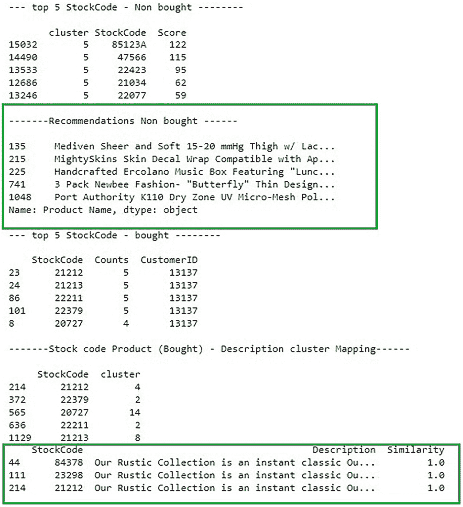

输出结果的表示显示了前 5 个未购买股票代码、前 5 个已购买股票代码、非购买推荐（高亮显示）以及股票代码产品-描述聚类映射。

图 7-26

输出结果

第一组突出显示了相似用户推荐。第二组突出显示了相似商品推荐。

## 摘要

在本章中，你学习了如何使用无监督机器学习算法构建推荐引擎，即聚类。使用客户和订单数据根据相似用户推荐产品/商品。使用产品数据根据相似商品推荐产品/商品。
