# 8. 基于分类算法的推荐系统

基于分类算法的推荐系统也称为*购买倾向模型*。这里的目的是使用历史行为和购买来预测客户购买产品的倾向。

你预测未来购买越准确，推荐和销售就越好。这种推荐系统更常用于确保具有一定概率可能购买的用户的 100% 转化率。在这些产品上提供促销，吸引用户进行购买。

## 方法

以下基本步骤构建了一个基于分类算法的推荐引擎。

1.  数据收集

1.  数据预处理和清理

1.  特征工程

1.  探索性数据分析

1.  模型构建

1.  评估

1.  预测和推荐

图 8-1 显示了构建基于分类算法模型的步骤。

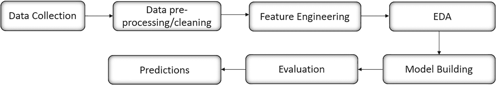

一个框架揭示了构建基于分类模型的步骤。它包括数据收集、数据预处理、特征工程、E D A、模型构建、评估和预测。

图 8-1

基于分类的模型

## 实现

让我们安装并导入所需的库。

```py
#Importing the libraries
import pandas as pd
import numpy as np
import matplotlib.pyplot as plt
import seaborn as sns.display import Image
import os
from sklearn import preprocessing
from sklearn.model_selection import train_test_split
from sklearn.metrics import accuracy_score,confusion_matrix,classification_report
from sklearn.linear_model import LogisticRegression
from imblearn.combine import SMOTETomek
from collections import Counter
from sklearn.ensemble import RandomForestClassifier
from sklearn.metrics import roc_auc_score, roc_curve
from sklearn.neighbors import KNeighborsClassifier
from sklearn.metrics import roc_curve, roc_auc_score
from sklearn.naive_bayes import GaussianNB
from sklearn import tree
from sklearn.tree import DecisionTreeClassifier
from xgboost import XGBClassifier
```

### 数据收集和下载词嵌入

让我们考虑一个电子商务数据集。从 GitHub 链接下载数据集。

### 将数据作为 DataFrame（pandas）导入

导入记录、客户和产品数据。

```py
# read Record dataset
record_df = pd.read_excel("Rec_sys_data.xlsx")
#read Customer Dataset
customer_df = pd.read_excel("Rec_sys_data.xlsx", sheet_name = 'customer')
# read product dataset
prod_df = pd.read_excel("Rec_sys_data.xlsx", sheet_name = 'product')
```

打印 DataFrame 的前五行。

```py
#Viewing Top 5 Rows
print(record_df.head())
print(customer_df.head())
print(prod_df.head())
```

图 8-2 显示了记录数据的头五行（0 到 4）的输出。

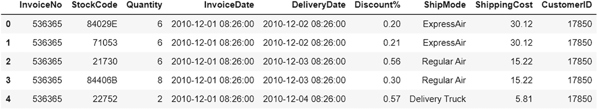

一个数据框揭示了记录数据的头五行（0 到 4）的输出。数据包括发票号、库存代码、数量、发票日期、运费和客户 ID。

图 8-2

输出

图 8-3 显示了客户数据的头五行（0 到 4）的输出。

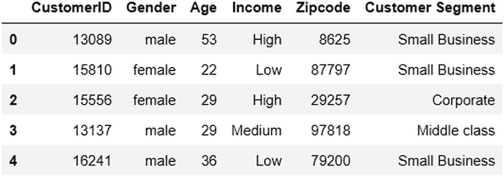

一个数据框揭示了客户数据的头五行（0 到 4）的输出。数据包括客户 ID、性别、年龄、收入、邮编和客户细分。

图 8-3

输出

图 8-4 显示了产品数据的头五行（0 到 4）的输出。

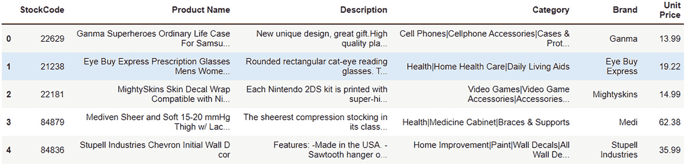

一个数据框揭示了产品数据的头五行（0 到 4）的输出。数据包括库存代码、产品名称、描述、类别、品牌和单价。

图 8-4

输出

### 数据预处理

在构建任何模型之前，第一步是清理和预处理数据。

分析、清理和合并三个数据集，以便合并后的 DataFrame 可以构建机器学习模型。

现在，让我们检查每个客户所购买每种产品的总数量。

```py
# group By Stockcode and CustomerID and sum the Quantity
group = pd.DataFrame(record_df.groupby(['StockCode', 'CustomerID']).Quantity.sum())
print(group.shape)
group.head()
```

图 8-5 显示了按库存代码和客户 ID 分组并求和数量的输出。

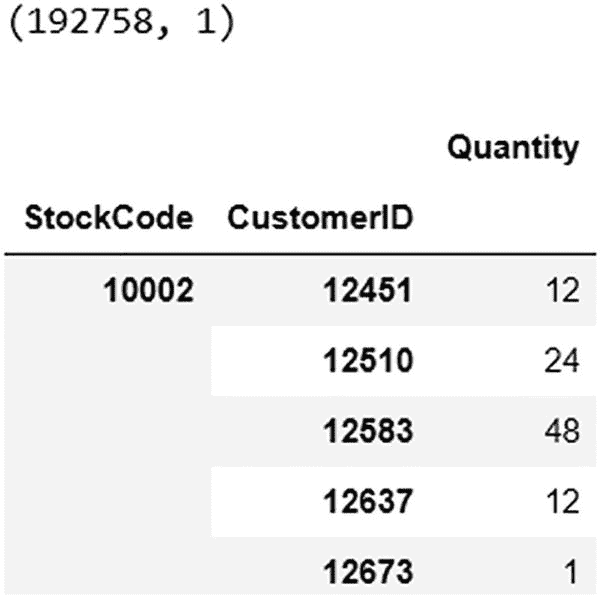

数据框显示了分组股票代码（10002）、客户 ID（12451、12510、12583、12637 和 12673）以及数量（12、24、48、12 和 1）的输出。

图 8-5

输出

接下来，检查客户和记录数据集的空值。

```py
#Check for null values
print(record_df.isnull().sum())
print("--------------\n")
print(customer_df.isnull().sum())
```

以下为输出。

```py
InvoiceNo       0
StockCode       0
Quantity        0
InvoiceDate     0
DeliveryDate    0
Discount%       0
ShipMode        0
ShippingCost    0
CustomerID      0
dtype: int64
--------------
CustomerID          0
Gender              0
Age                 0
Income              0
Zipcode             0
Customer Segment    0
dtype: int64
```

数据集中没有空值，因此不需要删除或处理它们。

让我们将 CustomerID 和 StockCode 加载到不同的变量中，并创建一个交叉产品以供进一步使用。

```py
#Loading the CustomerID and StockCode into different variable d1, d2
d2 = customer_df['CustomerID']
d1 = record_df["StockCode"]
# Taking the sample of data and storing into two variables
row = d1.sample(n= 900)
row1 = d2.sample(n=900)
# Cross product of row and row1
index = pd.MultiIndex.from_product([row, row1])
a = pd.DataFrame(index = index).reset_index()
a.head()
```

图 8-6 显示了输出。

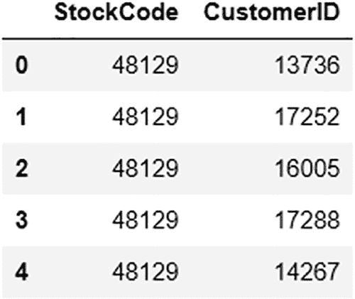

数据框显示了股票代码（48129）和客户 ID（13736、17252、16005、17288 和 14267）从 0 到 4 的输出。

图 8-6

输出

现在，让我们将'group'和'a'与'CustomerID'和'StockCode'合并。

```py
#merge customerID and StockCode
data = pd.merge(group,a, on = ['CustomerID', 'StockCode'], how = 'right')
data.head()
```

图 8-7 显示了输出。

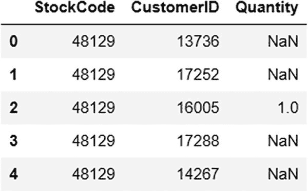

数据框显示了股票代码（48129）、客户 ID（13736、17252、16005、17288 和 14267）以及数量（NaN、NaN、1.0、NaN 和 NaN）从 0 到 4 的输出。

图 8-7

输出

如您所见，数量列中存在空值。

让我们检查空值。

```py
#check total number of null values in quantity column
print(data['Quantity'].isnull().sum())
# check the shape of data that is number of rows and columns
print(data.shape)
```

以下为输出。

```py
779771
(810000, 3)
```

让我们通过用零替换空值并检查唯一值来处理缺失值。

```py
#replacing nan values with 0
data['Quantity'] = data['Quantity'].replace(np.nan, 0).astype(int)
# Check all unique value of quantity column
print(data['Quantity'].unique())
```

图 8-8 显示了输出。

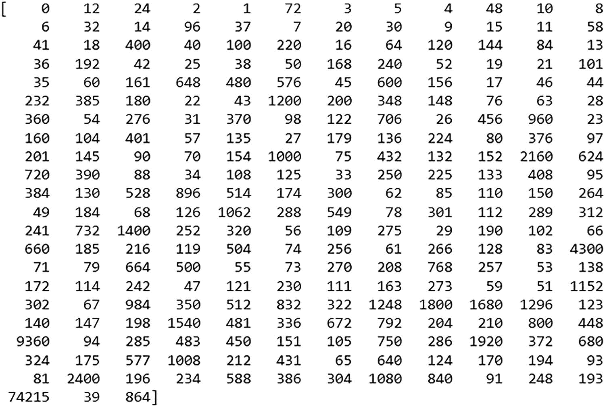

一个表示显示了具有唯一值的输出。

图 8-8

输出

现在让我们从产品表中删除不必要的列。

```py
## drop product name and description column
product_data = prod_df.drop(['Product Name', 'Description'], axis = 1)
product_data['Category'].str.split('::').str[0]
product_data.head()
```

图 8-9 显示了前五行的输出。

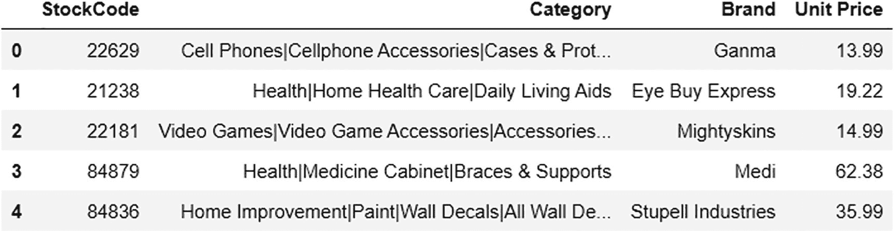

数据框显示了前 5 行（0 到 4）的输出。数据包括股票代码、类别、品牌和单价。

图 8-9

输出

让我们从类别列中提取第一级层次并连接到 product_data 表。

```py
# extract the first string category column
cate = product_data['Category'].str.extract(r"(\w+)", expand=True)
# join cat column with original dataset
df2 = product_data.join(cate, lsuffix="_left")
df2.drop(['Category'], axis = 1, inplace = True)
# rename column to Category
df2 = df2.rename(columns = {0: 'Category'})
print(df2.shape)
df2.head()
```

图 8-10 显示了输出。

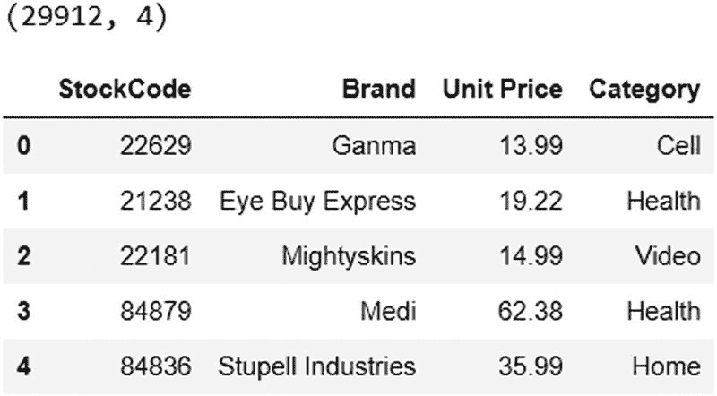

数据框显示了股票代码、品牌、单价和类别（包括 cell、health、video、health 和 home）的输出。

图 8-10

输出

在连接后检查并删除任何空值。

```py
#check for null values and drop it
df2.isnull().sum()
df2.dropna(inplace = True)
df2.isnull().sum()
```

以下为输出。

```py
StockCode     0
Brand         0
Unit Price    0
Category      0
dtype: int64
```

保存预处理文件并再次读取。

```py
## save to csv file
df2.to_csv("Products.csv")
# Load product dataset
product = pd.read_csv("/content/Products.csv")
```

合并数据、产品和客户表。

```py
## Merge data and product dataset
final_data = pd.merge(data, product, on= 'StockCode')
# create final dataset by merging customer & final data
final_data1 = pd.merge(customer_df, final_data, on = 'CustomerID')
# Drop Unnamed and zipcode column
final_data1.drop(['Unnamed: 0', 'Zipcode'], axis = 1, inplace = True)
final_data1.head()
```

图 8-11 显示了合并后的前五行输出。

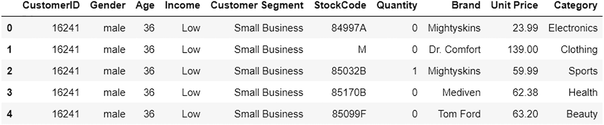

数据框显示了合并后前 5 行（0 到 4）的输出。数据包括客户 ID、性别、年龄、收入、客户细分、股票代码和数量。

图 8-11

输出

在最终表中检查空值。

```py
print(final_data1.shape)
# Check for null values in each columns
final_data1.isnull().sum()
```

以下为输出。

```py
(61200, 10)
CustomerID          0
Gender              0
Age                 0
Income              0
Customer Segment    0
StockCode           0
Quantity            0
Brand               0
Unit Price          0
Category            0
dtype: int64
```

检查每一列中的唯一类别。

```py
#Check for unique value in each categorical columns
print(final_data1['Category'].unique())
print('------------\n')
print(final_data1['Income'].unique())
print('------------\n')
print(final_data1['Brand'].unique())
print('------------\n')
print(final_data1['Customer Segment'].unique())
print('------------\n')
print(final_data1['Gender'].unique())
print('------------\n')
print(final_data1['Quantity'].unique())
```

以下为输出。

```py
['Electronics' 'Clothing' 'Sports' 'Health' 'Beauty' 'Jewelry' 'Home'
'Office' 'Auto' 'Cell' 'Pets' 'Food' 'Household' 'Shop']
------------
['Low' 'Medium' 'High']
------------
['Mightyskins' 'Dr. Comfort' 'Mediven' 'Tom Ford' 'Eye Buy Express'
'MusicBoxAttic' 'Duda Energy' 'Business Essentials' 'Medi'
'Seat Belt Extender Pros' 'Boss (hub)' 'Ishow Hair' 'Ekena Milwork'
'JustVH' 'UNOTUX' 'Envelopes.com' 'Auburn Leathercrafters'
'Style & Apply' 'Edwards' 'Larissa Veronica' 'Awkward Styles' 'New Way'
'McDonalds' 'Ekena Millwork' 'Omega' "Medaglia D'Oro" 'allwitty' 'Prop?t'
'Unique Bargains' 'CafePress' "Ron's Optical" 'Wrangler' 'AARCO']
------------
['Small Business' 'Middle class' 'Corporate']
------------
['male' 'female']
------------
[   0    1    3    5   15    2    4    8    6   24    7   30    9   10
62   20   18   12   72   50  400   36   27  242   58   25   60   48
22  148   16  152   11   31   64  147   42   23   43   26   14   21
1200  500   28  112   90  128   44  200   34   96  140   19  160   17
100  320  370  300  350   32   78  101   66   29]
```

从这个输出中，你可以在品牌列中看到一些特殊字符。让我们将它们删除。

```py
## test cleaning
final_data1['Brand'] = final_data1['Brand'].str.replace('?', '')
final_data1['Brand'] = final_data1['Brand'].str.replace('&', 'and')
final_data1['Brand'] = final_data1['Brand'].str.replace('(', '')
final_data1['Brand'] = final_data1['Brand'].str.replace(')', '')
print(final_data1['Brand'].unique())
```

以下为输出。

```py
['Mightyskins' 'Dr. Comfort' 'Mediven' 'Tom Ford' 'Eye Buy Express'
'MusicBoxAttic' 'Duda Energy' 'Business Essentials' 'Medi'
'Seat Belt Extender Pros' 'Boss hub' 'Ishow Hair' 'Ekena Milwork'
'JustVH' 'UNOTUX' 'Envelopes.com' 'Auburn Leathercrafters'
'Style and Apply' 'Edwards' 'Larissa Veronica' 'Awkward Styles' 'New Way'
'McDonalds' 'Ekena Millwork' 'Omega' "Medaglia D'Oro" 'allwitty' 'Propt'
'Unique Bargains' 'CafePress' "Ron's Optical" 'Wrangler' 'AARCO']
```

所有数据集已合并，所需的数据预处理和清理已完成。

### 特征工程

数据预处理和清理完成后，下一步是进行特征工程。

让我们创建一个使用数量列来指示客户是否购买产品的 flag 列。

如果数量列为 0，则表示客户没有购买产品。

```py
#creating buy_falg column
final_data1.loc[final_data1.Quantity == 0 ,"flag_buy" ] = 0
final_data1.loc[final_data1.Quantity != 0 ,"flag_buy" ] = 1
# Converting the values of flag_buy column into integer
final_data1['flag_buy'] = final_data1.flag_buy.astype(int)
final_data1.tail()
```

图 8-12 展示了创建目标列后的前五行的输出。

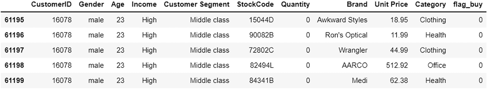

一个数据框展示了创建目标列后的前 5 行的输出。包括性别、年龄、客户 ID、收入、数量和品牌。

图 8-12

输出

创建了一个新的 flag_buy 列。让我们对这个列做一些基本的探索。

```py
#Check for the unique value in flag buy column
print(final_data1['flag_buy'].unique())
# Gives the description of columns
print(final_data1.describe())
##Information about the data
print(final_data1.info())
```

图 8-13 展示了描述的输出。

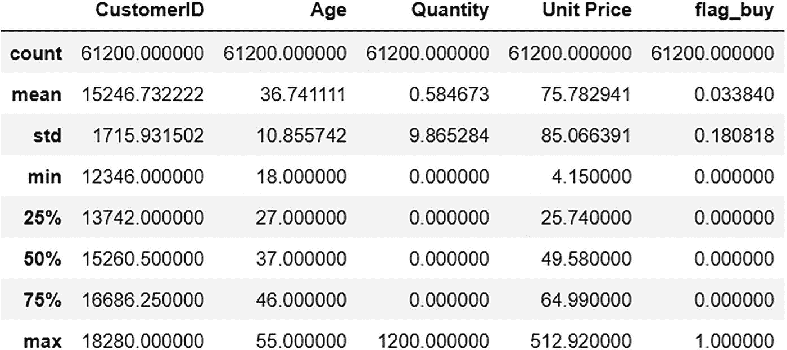

一个数据框展示了描述的输出。包括客户 ID、年龄、数量、单价、flag buy 以及数量、平均值、最小值和最大值。

图 8-13

输出

```py
array([0, 1])
```

```py
Int64Index: 61200 entries, 0 to 61199
Data columns (total 11 columns):
#   Column            Non-Null Count  Dtype
---  ------            --------------  -----
0   CustomerID        61200 non-null  int64
1   Gender            61200 non-null  object
2   Age               61200 non-null  int64
3   Income            61200 non-null  object
4   Customer Segment  61200 non-null  object
5   StockCode         61200 non-null  object
6   Quantity          61200 non-null  int64
7   Brand             61200 non-null  object
8   Unit Price        61200 non-null  float64
9   Category          61200 non-null  object
10  flag_buy          61200 non-null  int64
dtypes: float64(1), int64(4), object(6)
memory usage: 5.6+ MB
```

### 探索性数据分析

特征工程在模型数据预处理中是必须的。然而，探索性数据分析（EDA）也起着至关重要的作用。

通过查看历史数据本身，你可以获得更多的商业洞察。

让我们开始探索数据。绘制品牌列的图表。

```py
plt.figure(figsize=(50,20))
sns.set_theme(style="darkgrid")
sns.countplot(x = 'Brand', data = final_data1)
```

图 8-14 展示了品牌列的输出。

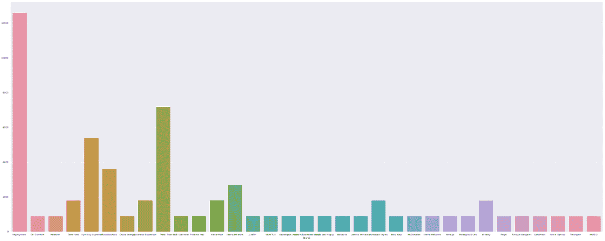

一个柱状图展示了品牌列的输出。观察到 Mightyskins 品牌在所有其他品牌中范围最高。

图 8-14

输出

从这个图表中可以得出的关键洞察是 Mightyskins 品牌销售最高。

让我们绘制收入列的图表。

```py
# Count of Income Category
plt.figure(figsize=(10,5))
sns.set_theme(style="darkgrid")
sns.countplot(x = 'Income', data = final_data1)
```

图 8-15 展示了计数图表的收入列输出。

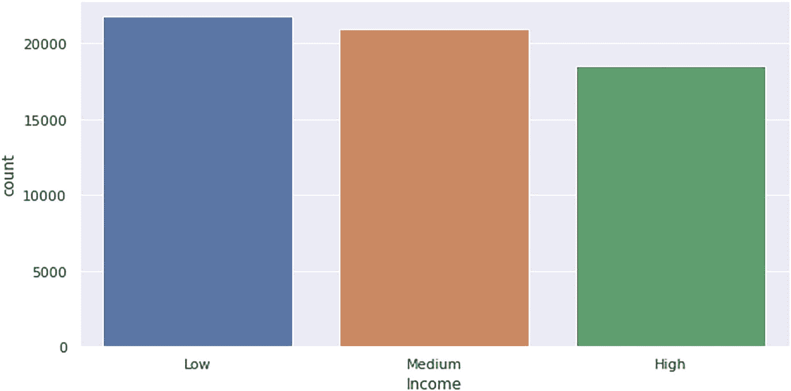

一个柱状图展示了数量和收入（低、中、高）的输出。低收入有最高的数量（超过 20000），比中收入和高收入都要多。

图 8-15

输出

从这个图表中可以得出的关键洞察是低收入客户购买的产品更多。然而，中收入和高收入客户之间没有太大的差异。

让我们在下面放几个图表。更多信息请参阅笔记本。

绘制一个直方图来展示年龄分布。

```py
# histogram plot to show distribution age
plt.figure(figsize=(10,5))
sns.set_theme(style="darkgrid")
sns.histplot(data=final_data1, x="Age", kde = True)
```

图 8-16 展示了年龄分布的输出。

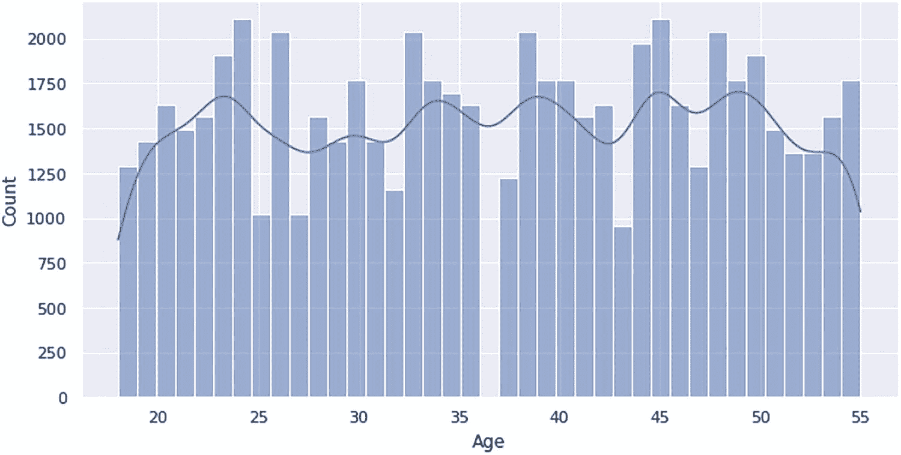

一个图表展示了年龄分布的输出。x 轴表示年龄，y 轴表示数量。观察到数量根据年龄分布增加和减少。

图 8-16

输出

绘制一个面积图以显示按类别划分的年龄分布。

```py
plt.figure(figsize=(10,5))
sns.set_theme(style="darkgrid")
sns.histplot(data=final_data1, x="Age", hue="Category", element= "poly")
```

图 8-17 展示了按类别划分的年龄分布。

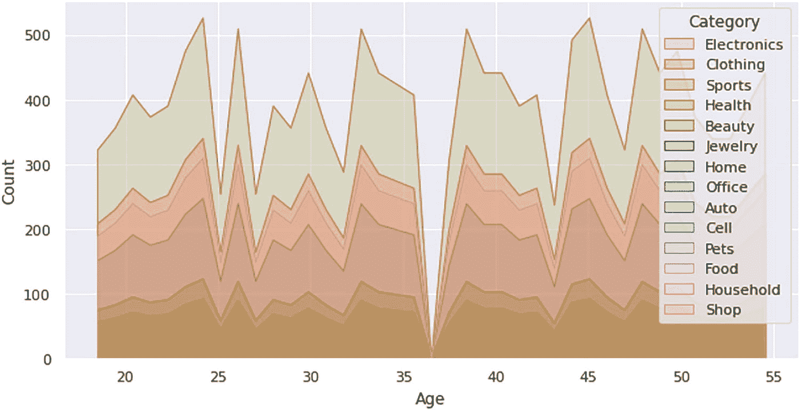

一个图展示了按类别划分的年龄分布输出。类别包括电子产品、服装、运动、健康、美容、珠宝、家居、办公室和商店。

图 8-17

输出

创建一个条形图以检查目标分布。

```py
# Count plot to show number of customer bought the product
plt.figure(figsize=(10,5))
sns.set_theme(style="darkgrid")
sns.countplot(x = 'flag_buy', data = final_data1)
```

图 8-18 是目标分布条形图。

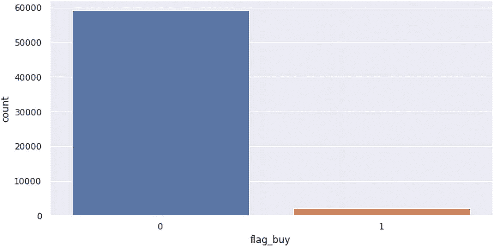

一个条形图展示了目标分布的输出。x 轴表示购买标志，y 轴表示计数。观察到购买标志 0 的计数最高。

图 8-18

输出

看起来这个特定的用例存在数据不平衡。让我们在采样数据后构建模型。

### 模型构建

在构建模型之前，让我们对所有分类变量进行编码。同时，存储股票代码以供进一步使用。

```py
#Encoding categorical variable using Label Encoder
from sklearn import preprocessing
label_encoder = preprocessing.LabelEncoder()
final_data1['StockCode'] = label_encoder.fit_transform(final_data1['StockCode'])
mappings = {}
mappings['StockCode'] = dict(zip(label_encoder.classes_,range(len(label_encoder.classes_))))
final_data1['Gender'] = label_encoder.fit_transform(final_data1['Gender'])
final_data1['Customer Segment'] = label_encoder.fit_transform(final_data1['Customer Segment'])
final_data1['Brand'] = label_encoder.fit_transform(final_data1['Brand'])
final_data1['Category'] = label_encoder.fit_transform(final_data1['Category'])
final_data1['Income'] = label_encoder.fit_transform(final_data1['Income'])
final_data1.head()
```

图 8-19 展示了编码后的前五行。

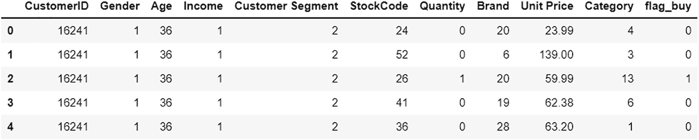

一个数据框展示了编码后的前 5 行（0 到 4）的输出。数据包括客户 ID、性别、年龄、收入、客户细分、股票代码和数量。

图 8-19

输出

#### 训练-测试分割

数据分为两部分：一部分用于训练模型，即训练集；另一部分用于评估模型，即测试集。从 sklearn.model_selection 导入 train_test_split 库将 DataFrame 分为两部分。

```py
## separating dependent and independent variables
x = final_data1.drop(['flag_buy'], axis = 1)
y = final_data1['flag_buy']
# check the shape of dependent and independent variable
print((x.shape, y.shape))
# splitting data into train and test
from sklearn.model_selection import train_test_split
x_train, x_test, y_train, y_test = train_test_split(x, y, train_size = 0.6, random_state = 42)
```

#### 逻辑回归

需要线性回归来预测数值。但你也可能遇到分类问题，其中因变量是二元的，如是或否、1 或 0、真或假等。在这种情况下，需要**逻辑回归**。它是一种分类算法，是线性回归的延续。在这里，使用对数几率来限制因变量在 0 和 1 之间。

图 8-20 展示了逻辑回归公式。

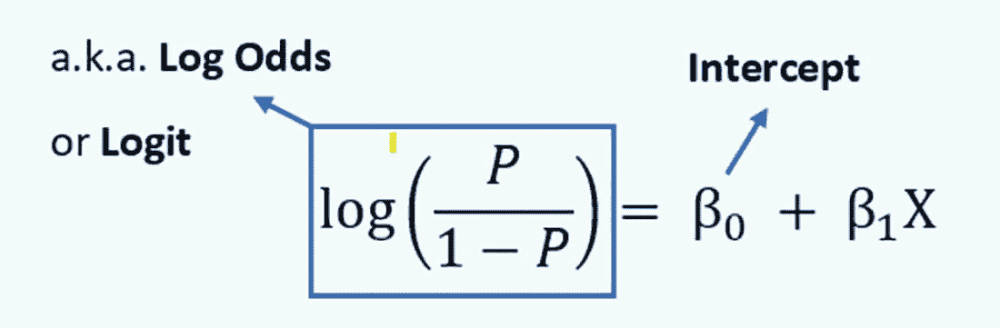

用于计算逻辑回归的公式。

图 8-20

公式

其中(*P*/1 – *P*)是赔率比，β[0]是常数，β是系数。

图 8-21 展示了逻辑回归的工作原理。

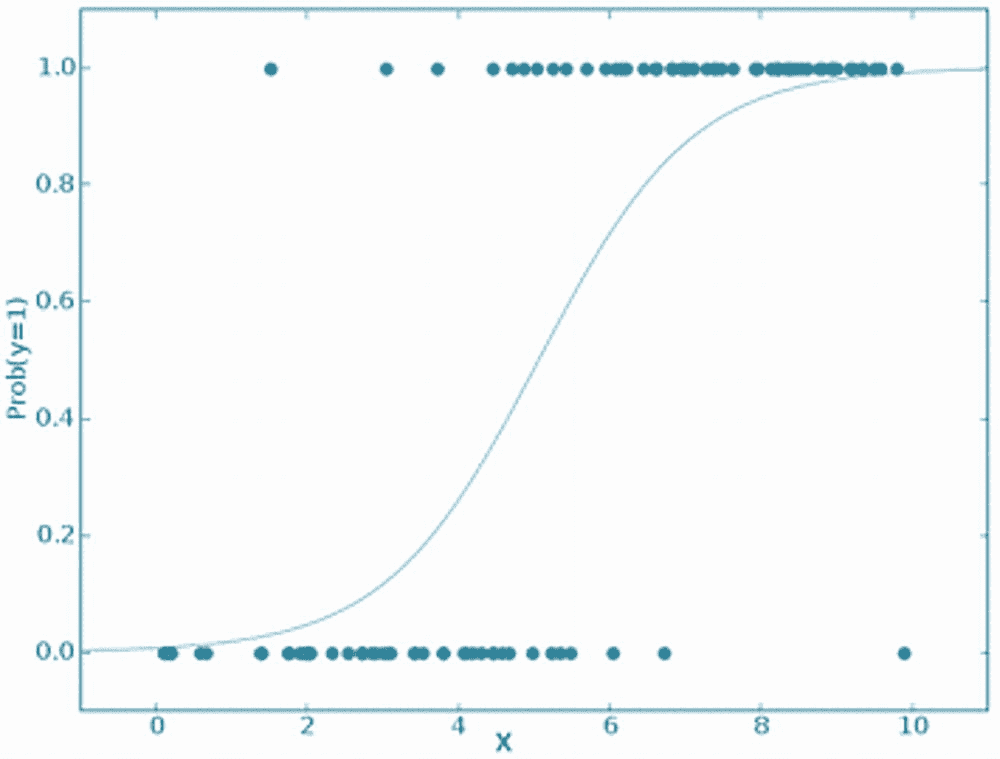

概率（y = 1）与 x 的对数回归图展示了沿 0.0 和 1.0 概率绘制的图。趋势从 0.0 增加到 1.0。

图 8-21

逻辑回归

现在，让我们看看如何评估分类模型。

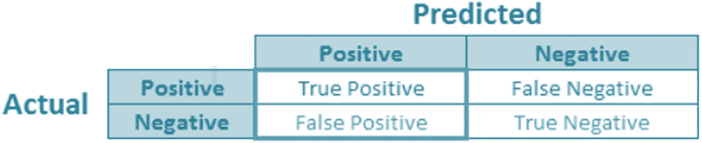

一个框架展示了混淆矩阵。实际和预测类别用正（真正例和假正例）和负（假负例和真负例）率表示。

图 8-22

混淆矩阵

+   准确率是正确预测的数量除以总预测数量。这些值介于 0 和 1 之间；为了将其转换为百分比，将答案乘以 100。但仅考虑准确率作为评估参数并不是理想的做法。例如，如果数据不平衡，可以获得非常高的准确率。

+   实际类别和预测类别之间的交叉表称为*混淆矩阵*。它不仅适用于二分类，也可以用于多分类。图 8-22 代表了一个混淆矩阵。

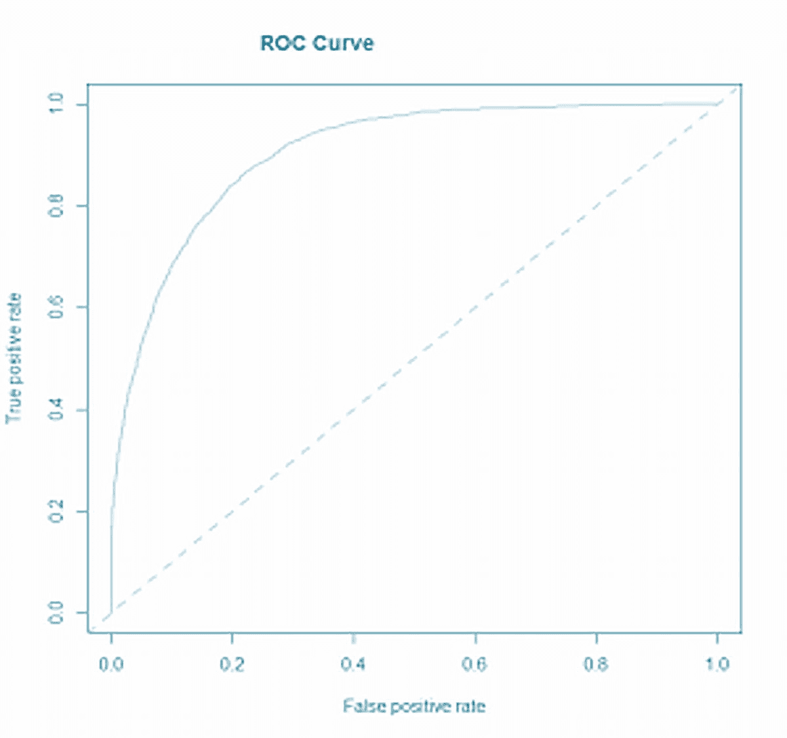

图形展示了在假阳性率（x 轴）和真阳性率（y 轴）上的 R O C 曲线。曲线的趋势从 0.0 增加到 1.0 的比率。

图 8-23

ROC 曲线

+   ROC（接收者操作特征）曲线是分类任务的评估指标。x 轴上为假阳性率，y 轴上为真阳性率的图表是 ROC 曲线图。它说明了当阈值变化时，类别被区分的强度。ROC 曲线下面积值越高，预测能力越强。图 8-23 展示了 ROC 曲线。

线性和逻辑回归是使用统计作为基础来预测因变量的传统方法。但这些算法有一些缺点。

+   统计建模必须满足之前讨论的假设。如果不满足这些假设，模型将不可靠，并且无法完全拟合随机预测。

+   这些算法在数据和非线性目标特征面前面临挑战。复杂模式难以解码。

+   数据应该是干净的（缺失值和异常值应该被处理）。

可以使用像决策树、随机森林、SVM 和神经网络这样的高级机器学习概念来克服这些限制。

##### 实现

```py
##training using logistic regression
from sklearn.metrics import accuracy_score,confusion_matrix,classification_report
from sklearn.linear_model import LogisticRegression
logistic = LogisticRegression()
logistic.fit(x_train, y_train)
# calculate score
pred=logistic.predict(x_test)
print(confusion_matrix(y_test, pred))
print(accuracy_score(y_test, pred))
print(classification_report(y_test, pred))
```

以下为输出。

```py
[[23633     0]
[    2   845]]
0.9999183006535948
precision    recall  f1-score   support
0       1.00      1.00      1.00     23633
1       1.00      1.00      1.00       847
accuracy                           1.00     24480
macro avg       1.00      1.00      1.00     24480
weighted avg       1.00      1.00      1.00     24480
```

本章的“探索性数据分析”部分讨论了目标分布及其不平衡性。让我们应用采样技术，使其数据平衡，然后构建模型。

```py
# Sampling technique to handle imbalanced data
smk = SMOTETomek(0.50)
X_res,y_res=smk.fit_resample(x_train,y_train)
# Count the number of classes
from collections import Counter
print("The number of classes before fit {}".format(Counter(y)))
print("The number of classes after fit {}".format(Counter(y_res)))
```

以下为输出。

```py
The number of classes before fit Counter({0: 59129, 1: 2071})
The number of classes after fit Counter({0: 35428, 1: 17680})
```

在采样后构建相同的模型。

```py
## Training model with Logistics Regression
from sklearn.metrics import accuracy_score,confusion_matrix,classification_report
from sklearn.linear_model import LogisticRegression
logistic = LogisticRegression()
logistic.fit(X_res, y_res)
# Calculate Score
y_pred=logistic.predict(x_test)
print(confusion_matrix(y_test,y_pred))
print(accuracy_score(y_test,y_pred))
print(classification_report(y_test,y_pred))
```

以下为输出。

```py
[[23633     0]
[    0   847]]
1.0
precision    recall  f1-score   support
0       1.00      1.00      1.00     23633
1       1.00      1.00      1.00       847
accuracy                           1.00     24480
macro avg       1.00      1.00      1.00     24480
weighted avg       1.00      1.00      1.00     24480
```

#### 决策树

决策是一种监督学习类型，数据根据最重要的变量到最不重要的变量进行分组。当所有变量都进行分割时，它看起来像树形结构，因此得名基于树的模型。

树包括根节点、决策节点和叶节点。决策节点可以有两条或更多分支，叶节点代表决策。决策树可以处理任何类型的数据，无论是定量还是定性。图 8-24 展示了决策树的工作方式。

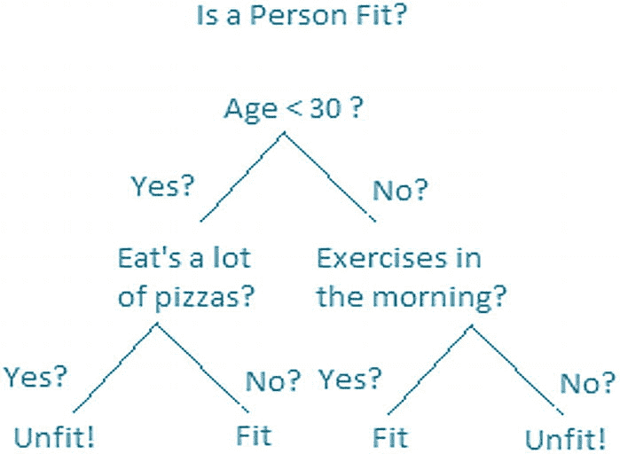

决策树展示了“是否适合一个人？”的数据。该树包括根节点（年龄小于 30 岁）、决策和带有是或否选项的叶节点。

图 8-24

决策树

让我们考察一下树分裂的过程，这是决策树中的关键概念。决策树算法的核心是树的分裂过程。它使用不同的算法来分裂节点，并且对于分类和回归问题有所不同。

以下与分类问题相关。

+   *基尼指数*是分割树的概率方法。它使用成功和失败的概率平方和来决定节点的纯度。CART（分类和回归树）使用基尼指数来创建分割。

+   *卡方检验*是子节点之间的统计显著性，父节点决定分裂。卡方 = ((实际 - 预期)² / 预期)¹/2。CHAID（卡方自动交互检测器）是此类的一个例子。

以下与回归问题相关。

+   *方差减少*基于两个特征（目标特征和独立特征）之间的方差来分割树。

+   当算法紧密拟合给定的训练数据但在预测未训练或测试数据的输出时不够准确时，会发生*过拟合*。决策树也是如此。当树被创建以完美地拟合训练数据集中的所有样本时，会影响测试数据的准确性。

##### 实现

```py
##Training model using decision tree
from sklearn import tree
from sklearn.tree import DecisionTreeClassifier
dt = DecisionTreeClassifier()
dt.fit(X_res, y_res)
y_pred = dt.predict(x_test)
print(dt.score(x_train, y_train))
print(confusion_matrix(y_test,y_pred))
print(accuracy_score(y_test,y_pred))
print(classification_report(y_test,y_pred))
```

以下为输出结果。

```py
1.0
[[23633     0]
[    0   847]]
1.0
precision    recall  f1-score   support
0       1.00      1.00      1.00     23633
1       1.00      1.00      1.00       847
accuracy                           1.00     24480
macro avg       1.00      1.00      1.00     24480
weighted avg       1.00      1.00      1.00     24480
```

#### 随机森林

随机森林因其灵活性和克服过拟合问题的能力而成为最广泛使用的机器学习算法。随机森林是一个集成算法，由多个决策树组成。树的数量越多，准确性越好。

随机森林可以执行分类和回归任务。以下是其一些优点。

+   它对缺失值和异常值不敏感。

+   它防止算法过拟合。

它是如何工作的？它基于袋装和自助抽样技术。

+   随机选取 m 个特征的平方根和 2/3 的带替换的自助数据样本，以随机训练每个决策树并预测结果。

+   构建数量为 n 的树，直到袋外错误率最小化并稳定。

+   计算每个预测目标的投票数，并将众数视为分类的最终预测。

图 8-25 显示了随机森林模型的工作原理。

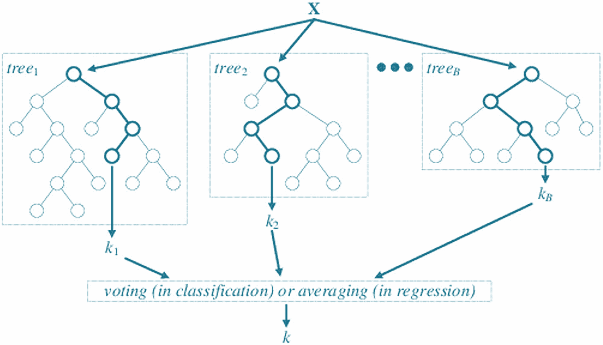

一种表示展示了随机森林的功能。X 被分为三个子树 sub 1、2 和 3。从子树 sub 1、2 和 3 中选取 k 个子 1、2 和 3 进行投票或平均，从而得到 k。

图 8-25

随机森林

##### 实现

```py
##Training model using Random forest
from sklearn.ensemble import RandomForestClassifier
rf = RandomForestClassifier()
rf.fit(X_res, y_res)
# Calculate Score
y_pred=rf.predict(x_test)
print(confusion_matrix(y_test,y_pred))
print(accuracy_score(y_test,y_pred))
print(classification_report(y_test,y_pred))
```

以下为输出结果。

```py
[[23633     0]
[    0   847]]
1.0
precision    recall  f1-score   support
0       1.00      1.00      1.00     23633
1       1.00      1.00      1.00       847
accuracy                           1.00     24480
macro avg       1.00      1.00      1.00     24480
weighted avg       1.00      1.00      1.00     24480
```

#### KNN

关于算法的更多信息，请参阅第四章。

##### 实现

```py
#Training model using KNN
from sklearn.metrics import roc_auc_score, roc_curve
from sklearn.neighbors import KNeighborsClassifier
model1 = KNeighborsClassifier(n_neighbors=3)
model1.fit(X_res,y_res)
y_predict = model1.predict(x_test)
# Calculate Score
print(model1.score(x_train, y_train))
print(confusion_matrix(y_test,y_predict))
print(accuracy_score(y_test,y_predict))
print(classification_report(y_test,y_predict))
# plot AUROC curve
r_auc = roc_auc_score(y_test, y_predict)
r_fpr, r_tpr, _ = roc_curve(y_test, y_predict)
plt.plot(r_fpr, r_tpr, linestyle='--', label='KNN prediction (AUROC = %0.3f)' % r_auc)
plt.title('ROC Plot')
# Axis labels
plt.xlabel('False Positive Rate')
plt.ylabel('True Positive Rate')
# Show legend
plt.legend()
# Show plot
plt.show()
```

图 8-26 显示了 KNN 的输出。

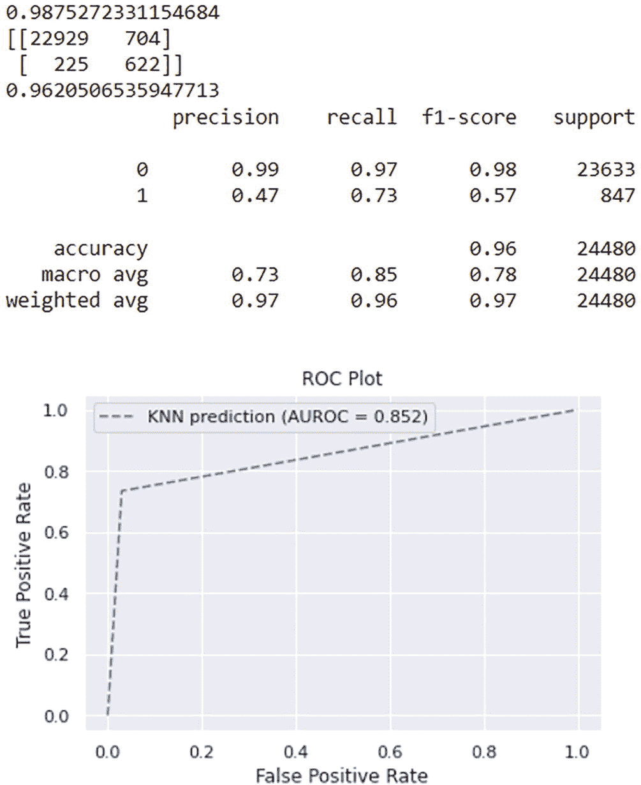

一张错误接受率与正确接受率的图表揭示了 ROC 曲线的输出。虚线表示 KNN 预测（AUC ROC = 0.852）。趋势从 0.0 增加到 1.0。

图 8-26

输出

注意

Naive Bayes 和 XGBoost 的实现也包含在笔记本中。

在前面的模型中，逻辑回归的性能优于所有其他模型。

因此，使用该模型，让我们为一位客户推荐产品。

```py
# x_test has all the features, lets us take the copy of it
test_data = x_test.copy()
#let us store predictions in one variable
test_data['predictions'] = pred
#filter the data and recommend.
recomm_one_cust = test_data[(test_data['CustomerID']== 17315) & (test_data['predictions']== 1)]
# to build the model we have encoded the stockcode column now we will decode and recommend.
items = []
for item_id in recomm_one_cust['StockCode'].unique().tolist():
prod =  {v: k for k, v in mappings['StockCode'].items()}[item_id]
items.append(str(prod))
items
```

以下为输出内容。

```py
['85123A', '85099C', '84970L', 'POST', '84970S', '82494L', '48173C', '85099B']
```

这些是应为客户 17315 推荐的产品 ID。

如果你想要带有产品名称的推荐，请在产品表中过滤这些 ID。

```py
recommendations = []
for i in items:
recommendations.append(prod_df[prod_df['StockCode']== i]['Product Name'])
recommendations
```

以下为输出内容。

```py
[135    Mediven Sheer and Soft 15-20 mmHg Thigh w/ Lac...
Name: Product Name, dtype: object,
551    Mediven Sheer and Soft 15-20 mmHg Thigh w/ Lac...
Name: Product Name, dtype: object,
1282    Eye Buy Express Kids Childrens Reading Glasses...
Name: Product Name, dtype: object,
7    MightySkins Skin Decal Wrap Compatible with Ot...
Name: Product Name, dtype: object,
160    Union 3" Female Ports Stainless Steel Pipe Fit...
Name: Product Name, dtype: object,
179    AARCO Enclosed Wall Mounted Bulletin Board
Name: Product Name, dtype: object,
287    Mediven Sheer and Soft 15-20 mmHg Thigh w/ Lac...
Name: Product Name, dtype: object,
77    Ebe Women Reading Glasses Reader Cheaters Anti...
Name: Product Name, dtype: object]
```

你也可以通过排序模型输出的概率来进行这种推荐。

## 摘要

在本章中，你学习了如何使用各种分类算法向客户推荐产品/项目，从数据清洗到模型构建。这类推荐是电子商务平台的附加功能。通过基于分类算法的输出，你可以向用户展示隐藏的产品，客户更有可能对这些产品/项目感兴趣。与其他推荐技术相比，这些推荐的转化率较高。
