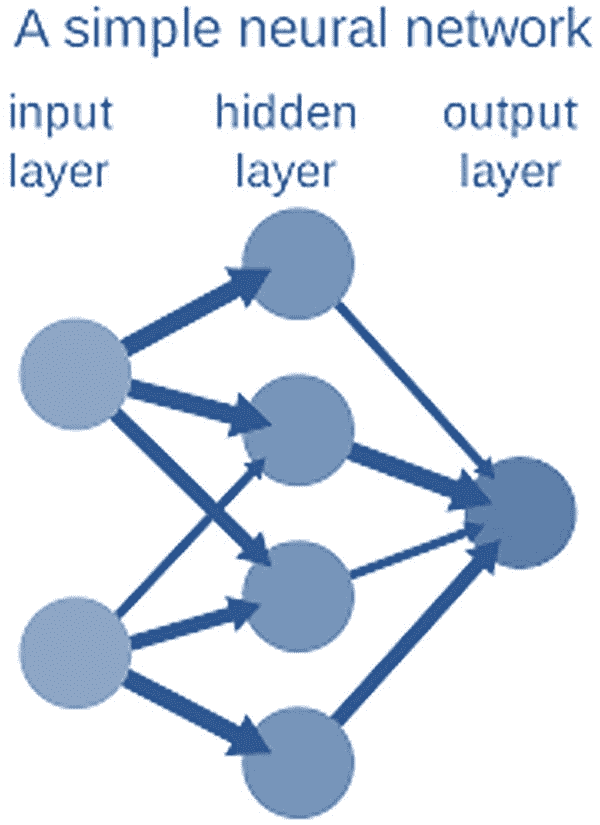
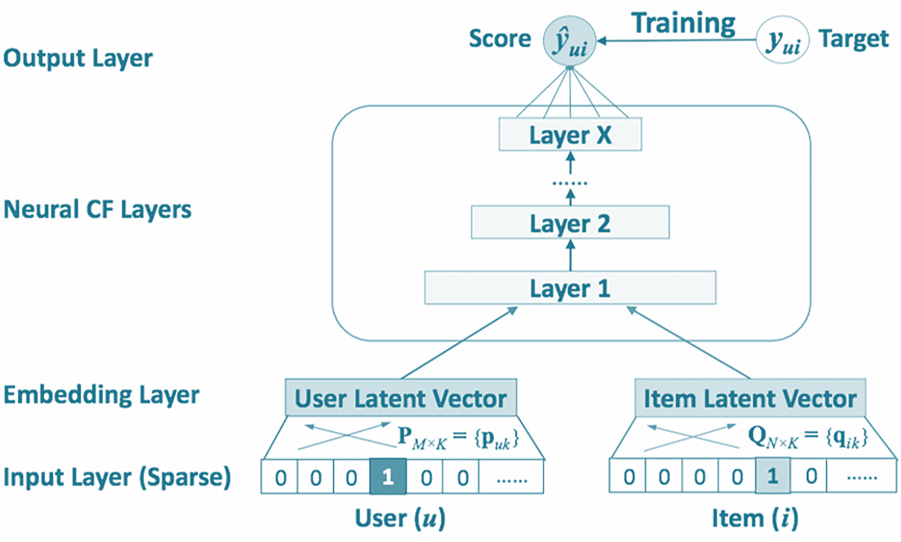
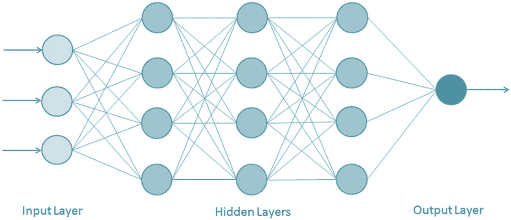
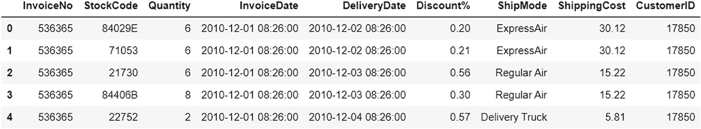
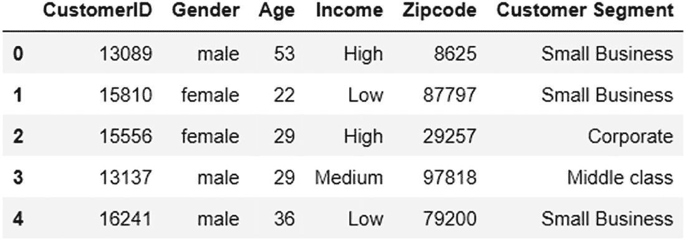
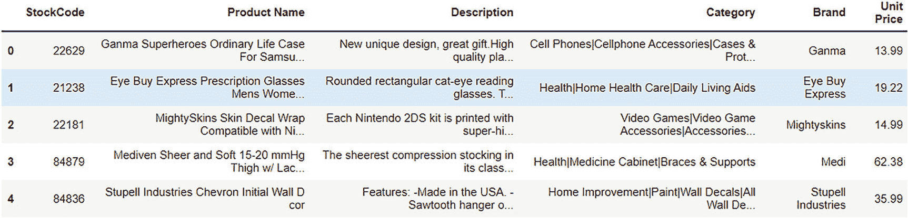
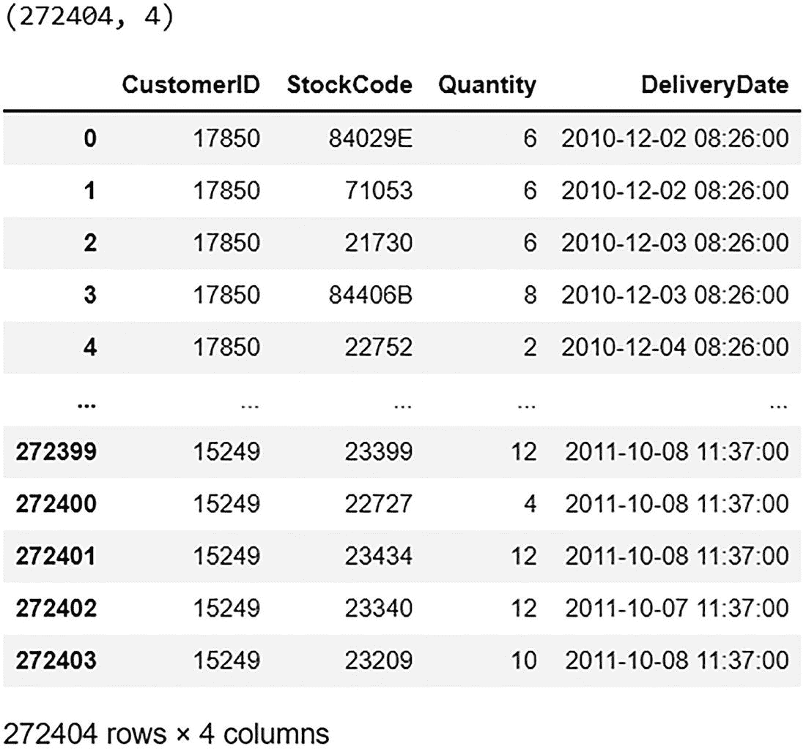
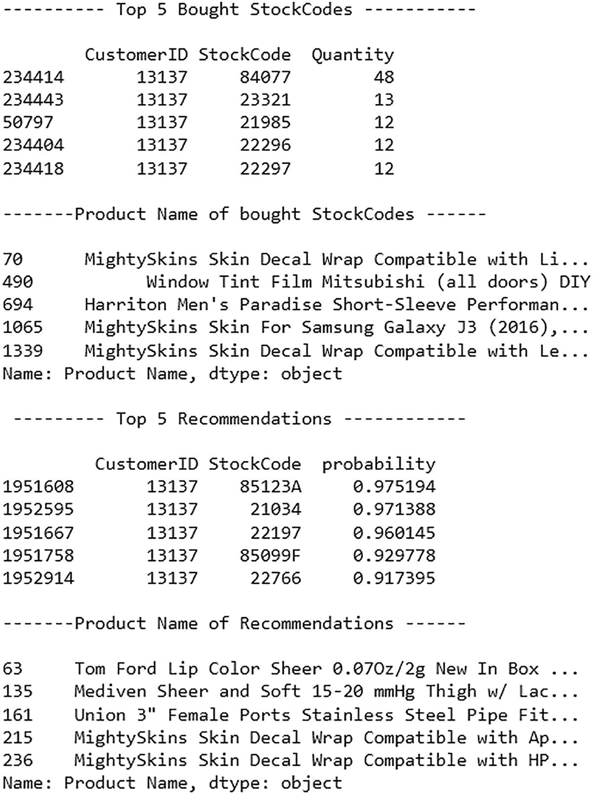
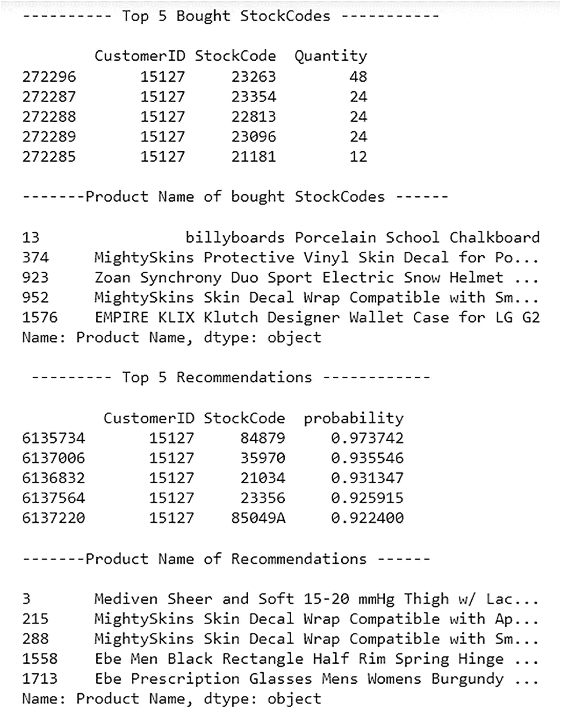

# 9. 基于深度学习的推荐系统

到目前为止，你已经学习了构建推荐系统的各种方法，并看到了它们在 Python 中的实现。本书从基本和直观的方法开始，如市场篮子分析、基于算术的内容和协同过滤方法，然后转向更复杂的机器学习方法，如聚类、矩阵分解和基于机器学习的分类方法。本章通过实现一个端到端的推荐系统，继续这一旅程，该系统使用高级深度学习概念。

深度学习技术利用最新的快速增长的网络架构和优化算法，在大量数据上训练，并构建更具有表现力和更好性能的模型。图形处理单元（GPUs）和深度学习在过去几年中推动了推荐系统的发展。由于它们的巨大并行架构，使用 GPU 进行计算提供了更高的性能和成本节约。让我们首先探索深度学习的基础，然后看看基于深度学习的协同过滤方法（神经协同过滤）。

## 深度学习基础（ANNs）

深度学习是机器学习的一个子类，它本质上涵盖了基于人工神经网络（ANN）的算法，这种网络中的连接节点类似于生物大脑中存在的神经链接。它是一组通过链接或边传输信息的连接节点（人工神经元）。它从输入层（节点）开始，分支到多个节点层，称为隐藏层，然后重新汇合到一个单一的输出节点/层，该层得到输出预测。

图 9-1 展示了一个神经网络，它是任何深度学习算法的基本构建块。



深度学习算法的神经网络模型。该网络包括输入层、隐藏层和输出层。

图 9-1

神经网络

每个节点的输出根据提供给节点和边的权重转换输入，并且随着你通过网络从输入层到输出层的进展，预测通过每一层的优化和进一步细化而得到优化。这被称为*前向传播*。另一个重要的过程，称为*反向传播*，使用损失优化算法，如梯度下降，通过调整每个层的节点和边的权重来计算和减少预测中的损失，同时从输出层向输入层反向移动。这两个过程共同工作，构建出最终能够给出准确预测的网络。

这是对基本神经网络的简单解释，它们通常是每个深度学习算法的基本构建块。

## 神经协同过滤（NCF）

协同过滤方法一直是构建各种领域推荐系统中最受欢迎的方法。像矩阵分解这样的流行技术被广泛使用，因为它们易于实现并提供准确的预测。但近年来，通过新的研究领域，深度学习模型在所有领域，包括协同过滤中，被越来越多地使用。

神经协同过滤（NCF）是一种使用神经网络的超级增强高级协同过滤方法。在矩阵分解中，用户-项目关系是通过用户和项目矩阵的内积定义的。在 NCF 中，这个内积被神经网络结构所取代。通过这种方式，它试图实现两个目标。

+   将矩阵分解推广到神经网络框架中

+   通过多层感知器（MLP）学习用户-项目交互/关系

图 9-2 展示了 NCF 的整体结构。



一幅插图描述了神经协同过滤结构。它包括一个输入层（稀疏）、一个嵌入层（用户潜在和项目潜在向量）、神经协同过滤层和一个输出层。

图 9-2

NCF

多层感知器（MLP）是一个具有多个层的神经网络，这些层是完全连接的（即前一层中的所有节点都连接到下一层中的所有节点）。MLP 中的每个节点通常使用 sigmoid 函数作为其激活函数。sigmoid 函数将实数值作为输入，并使用以下公式返回 0 到 1 之间的实数值：sigmoid(x) = 1/(1 + exp(–x))，其中 x 是输入。在 NCF 中，激活函数是修正线性激活函数（ReLU）。如果输入是正值，则返回相同的数值；如果输入是负值，则输出 0。ReLU 的公式是 max(0, x)，其中 x 是输入。

图 9-3 展示了一个多层感知器（MLP）。



多层感知器（MLP）的神经网络模型。它包括一个输入层、一个隐藏层和一个输出层。

图 9-3

多层感知器（MLP）

在矩阵分解算法之上使用 MLP 算法无疑是一种升级，因为从理论上讲，MLP 可以以更高的精度学习任何连续关系，并且它具有高度的非线性（由于多层），这使得它更适合学习用户和项目之间的复杂交互。

既然你已经了解了深度学习、神经网络和神经协同过滤的基础，那么让我们在接下来的章节中深入探讨基于深度学习/NCF 的推荐系统的端到端实现。

## 实现

以下安装并导入所需的库。

```py
#Importing the libraries
%load_ext autoreload
%autoreload 2
import sys
import pandas as pd
import tensorflow as tf
tf.get_logger().setLevel('ERROR') # only show error messages
from recommenders.utils.timer import Timer
from recommenders.models.ncf.ncf_singlenode import NCF
from recommenders.models.ncf.dataset import Dataset as NCFDataset
#from recommenders.datasets import movielens
from recommenders.utils.notebook_utils import is_jupyter
from recommenders.datasets.python_splitters import python_chrono_split,python_stratified_split
from recommenders.evaluation.python_evaluation import (rmse, mae, rsquared, exp_var, map_at_k, ndcg_at_k, precision_at_k,
recall_at_k, get_top_k_items)
print("System version: {}".format(sys.version))
print("Pandas version: {}".format(pd.__version__))
print("Tensorflow version: {}".format(tf.__version__))
```

### 数据收集

让我们考虑一个电子商务数据集。从 GitHub 链接下载数据集。

### 将数据作为 DataFrame（pandas）导入

让我们导入记录、客户和产品数据。

```py
# read Record dataset
record_df = pd.read_excel("Rec_sys_data.xlsx")
#read Customer Dataset
customer_df = pd.read_excel("Rec_sys_data.xlsx", sheet_name = 'customer')
# read product dataset
prod_df = pd.read_excel("Rec_sys_data.xlsx", sheet_name = 'product')
```

接下来，打印 DataFrame 的前五行。

```py
#Viewing Top 5 Rows
print(record_df.head())
print(customer_df.head())
print(prod_df.head())
```

图 9-4 显示了记录数据前五行的输出。



输出文件描述了记录数据的头五行。它包括发票号、库存代码、数量、发票日期、交货日期、折扣百分比、运输方式、运输成本和客户 ID。

图 9-4

输出

图 9-5 显示了客户数据前五行的输出。



输出文件描述了客户数据的前五行。它包括客户 ID、性别、年龄、收入、邮编和客户细分（小型企业、中型或企业）。

图 9-5

输出

图 9-6 显示了产品数据前五行的输出。



输出文件描述了产品数据的前五行。它包括库存代码、产品名称、描述、类别、品牌和单价。

图 9-6

输出

### 数据预处理

让我们从 records_df 中选择所需的列，如果有任何 null 值，则删除。同时删除字符串项目 ID（StockCode），以获取所需的输入数据 fa 或建模。

```py
#selecting columns
df = record_df[['CustomerID','StockCode','Quantity','DeliveryDate']]
#dropping the StockCodes (item ids) that are string for this experiment, as NCF only takes integer ids
df["StockCode"] = df["StockCode"].apply(lambda x: pd.to_numeric(x, errors='coerce')).dropna()
# dropping nulls
df = df.dropna()
print(df.shape)
df
```

图 9-7 显示了选择所需列后的订单数据输出。



选择所需列后的订单数据输出文件。它包括客户 ID、库存代码、数量和前五行的交货日期。

图 9-7

输出

让我们重命名一些列名。

```py
#header=["userID", "itemID", "rating", "timestamp"]
df = df.rename(columns={
'CustomerID':"userID",'StockCode':"itemID",'Quantity':"rating",'DeliveryDate':"timestamp"
})
```

接下来，将 user_id 和 item_id 数据类型更改为整数，因为这是 NCF 所需的格式。

```py
df["userID"] = df["userID"].astype(int)
df["itemID"] = df["itemID"].astype(int)
```

### 训练-测试分割

数据分为两部分：一部分用于训练模型，即训练集；另一部分用于评估模型，即测试集。

让我们使用工具中提供的 Spark 时间序列分割器来分割数据。

```py
train, test = python_chrono_split(df, 0.75)
```

将训练数据和测试数据保存到两个单独的文件中，稍后将在模型初始化函数中加载。

```py
train_file = "./train.csv"
test_file = "./test.csv"
train.to_csv(train_file, index=False)
test.to_csv(test_file, index=False)
```

### 建模和推荐

在训练数据上训练 NCF 模型，并为我们的测试数据获取前 k 个推荐。NCF 接受隐式反馈，并在 0 到 1 的范围内生成推荐给用户的物品倾向性。然后可以根据分数生成推荐物品列表。请注意，这个快速入门笔记本使用较少的 epoch 数量以减少训练时间。因此，模型性能略有下降。

在构建模型之前，让我们定义一些模型参数。

```py
# top k items to recommend
TOP_K = 10
# Model parameters
EPOCHS = 50
BATCH_SIZE = 256
SEED = 42
#preparing the data
data = NCFDataset(train_file=train_file, test_file=test_file, seed=SEED)
# training NCF model
model = NCF (
n_users=data.n_users,
n_items=data.n_items,
model_type="NeuMF",
n_factors=4,
layer_sizes=[16,8,4],
n_epochs=EPOCHS,
batch_size=BATCH_SIZE,
learning_rate=1e-3,
verbose=10,
seed=SEED
)
#adding timer for training.
with Timer() as train_time:
model.fit(data)
print("Took {} seconds for training.".format(train_time))
#adding timimg for predictions
with Timer() as test_time:
users, items, preds = [], [], []
item = list(train.itemID.unique())
for user in train.userID.unique():
user = [user] * len(item)
users.extend(user)
items.extend(item)
preds.extend(list(model.predict(user, item, is_list=True)))
all_predictions = pd.DataFrame(data={"userID": users, "itemID":items, "prediction":preds})
merged = pd.merge(train, all_predictions, on=["userID", "itemID"], how="outer")
all_predictions = merged[merged.rating.isnull()].drop('rating', axis=1)
print("Took {} seconds for prediction.".format(test_time))
```

下面的输出。

```py
Took 842.6078 seconds for training.
Took 24.8943 seconds for prediction.
```

在这里，所有预测都存储在 all_predictions 对象中。

让我们使用不同的指标来评估 NCF 性能。

```py
# Evaluate model
eval_map = map_at_k(test, all_predictions, col_prediction='prediction', k=TOP_K)
eval_ndcg = ndcg_at_k(test, all_predictions, col_prediction='prediction', k=TOP_K)
eval_precision = precision_at_k(test, all_predictions, col_prediction='prediction', k=TOP_K)
eval_recall = recall_at_k(test, all_predictions, col_prediction='prediction', k=TOP_K)
print("MAP:\t%f" % eval_map,
"NDCG:\t%f" % eval_ndcg,
"Precision@K:\t%f" % eval_precision,
"Recall@K:\t%f" % eval_recall, sep='\n')
```

下面的输出。

```py
MAP:         0.020692
NDCG:        0.064364
Precision@K: 0.047777
Recall@K:    0.051526
```

让我们读取推荐所需的数据。

```py
# read data
df_order = pd.read_excel('Rec_sys_data.xlsx', 'order')
df_customer = pd.read_excel('Rec_sys_data.xlsx', 'customer')
df_product = pd.read_excel('Rec_sys_data.xlsx', 'product')
```

已创建包含模型给出的推荐集的 all_predictions 对象。

选择所需的列并重命名。

```py
#select columns
all_predictions = all_predictions[['userID','itemID','prediction']]
# rename columns
all_predictions = all_predictions.rename(columns={
"userID":'CustomerID',"itemID":'StockCode',"rating":'Quantity','prediction':'probability'
})
```

现在让我们编写一个函数，通过输入客户 ID 来推荐产品。

该函数使用 all_predictions 对象来推荐产品。

```py
def recommend_product(customer_id):
print(" \n---------- Top 5 Bought StockCodes -----------\n")
print(df_order[df_order['CustomerID']==customer_id][['CustomerID','StockCode','Quantity']].nlargest(5,'Quantity'))
top_5_bought = df_order[df_order['CustomerID']==customer_id][['CustomerID','StockCode','Quantity']].nlargest(5,'Quantity')
print('\n-------Product Name of bought StockCodes ------\n')
print(df_product[df_product.StockCode.isin(top_5_bought.StockCode)]['Product Name'])
print("\n --------- Top 5 Recommendations ------------ \n")
print(all_predictions[all_predictions['CustomerID']==customer_id].nlargest(5,'probability'))
recommend = all_predictions[all_predictions['CustomerID']==customer_id].nlargest(5,'probability')
print('\n-------Product Name of Recommendations ------\n')
print(df_product[df_product.StockCode.isin(recommend.StockCode)]['Product Name'])
```

此函数获取以下信息。

+   对于给定客户的前五名购买的股票代码（项目 ID）及其产品名称。

+   来自 NCF 的针对同一客户的 top five 推荐项

让我们使用该函数为客户 13137 和 15127 推荐产品。

```py
recommend_product(13137)
```

图 9-8 展示了针对客户 13137 的推荐。



输出文件展示了针对客户 13137 的推荐。它包括前五名购买的股票代码、购买股票代码的产品名称、前五项推荐及其产品名称。

图 9-8

输出

```py
recommend_product(15127)
```

图 9-9 展示了针对客户 15127 的推荐。



输出文件展示了针对客户 15127 的推荐。它显示了前五名购买的股票代码的详细信息、购买股票代码的产品名称、前五项推荐及其产品名称。

图 9-9

输出

## 摘要

本章介绍了深度学习以及基于深度学习的推荐引擎是如何工作的。您通过使用 NF 实现了一个端到端的基于深度学习的推荐系统来看到这一点。基于深度学习的推荐系统是一个非常新但相关的领域，最近它已经显示出相当有希望的结果。如果提供足够的数据和计算访问，那么基于深度学习的技术肯定会在市场上优于任何其他技术，因此这是一个非常重要的概念，应该在您的知识库中占有重要位置。
