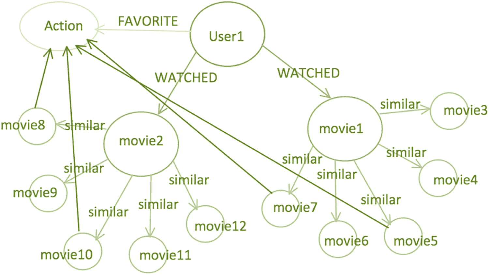
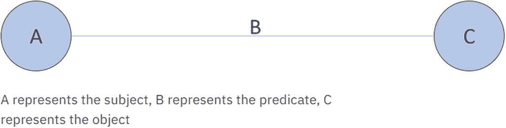
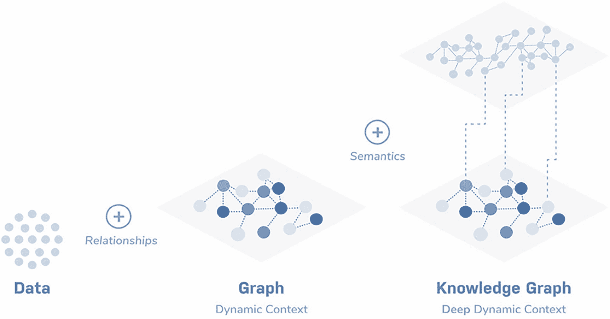
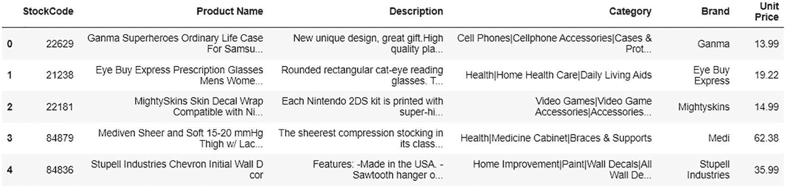
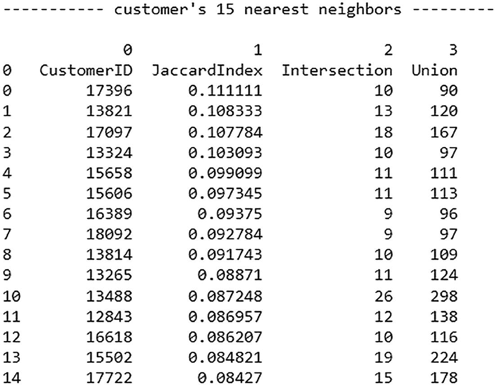
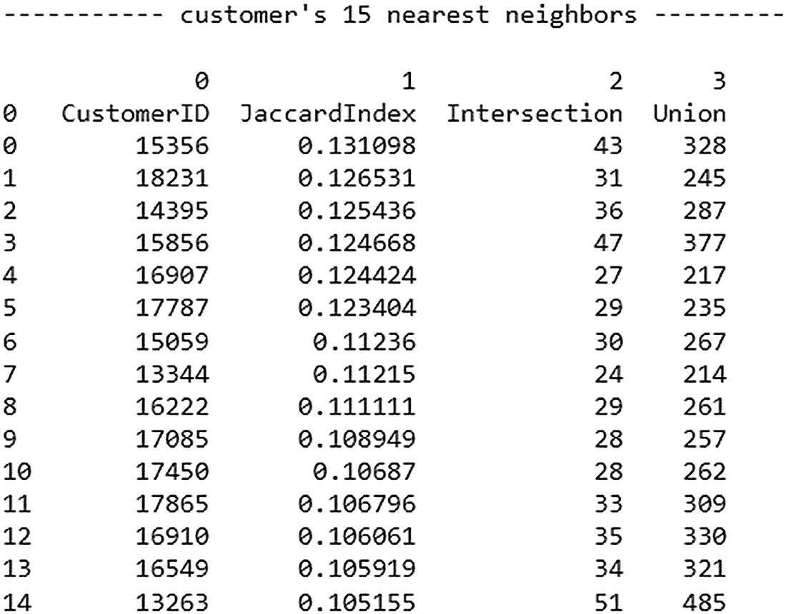
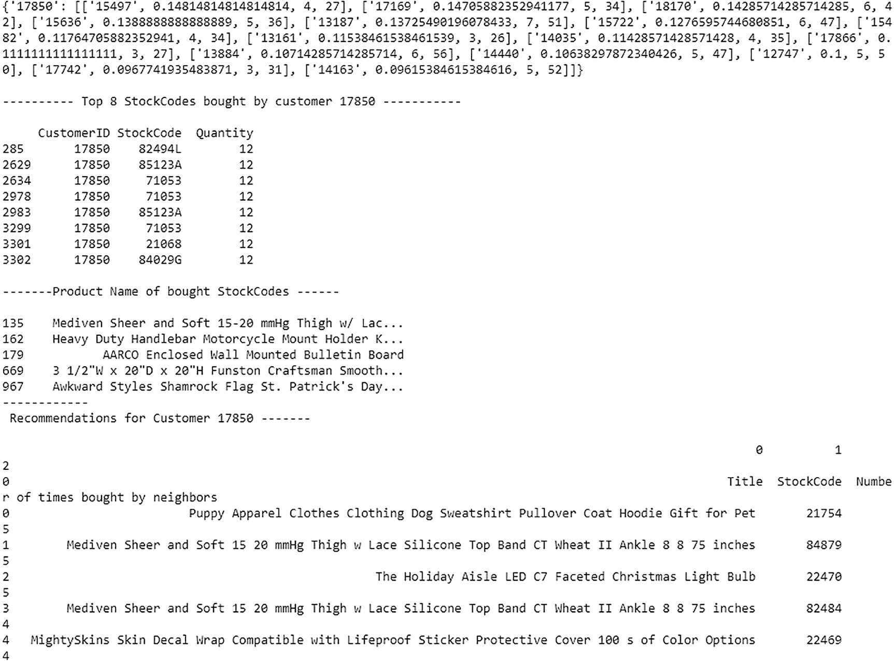
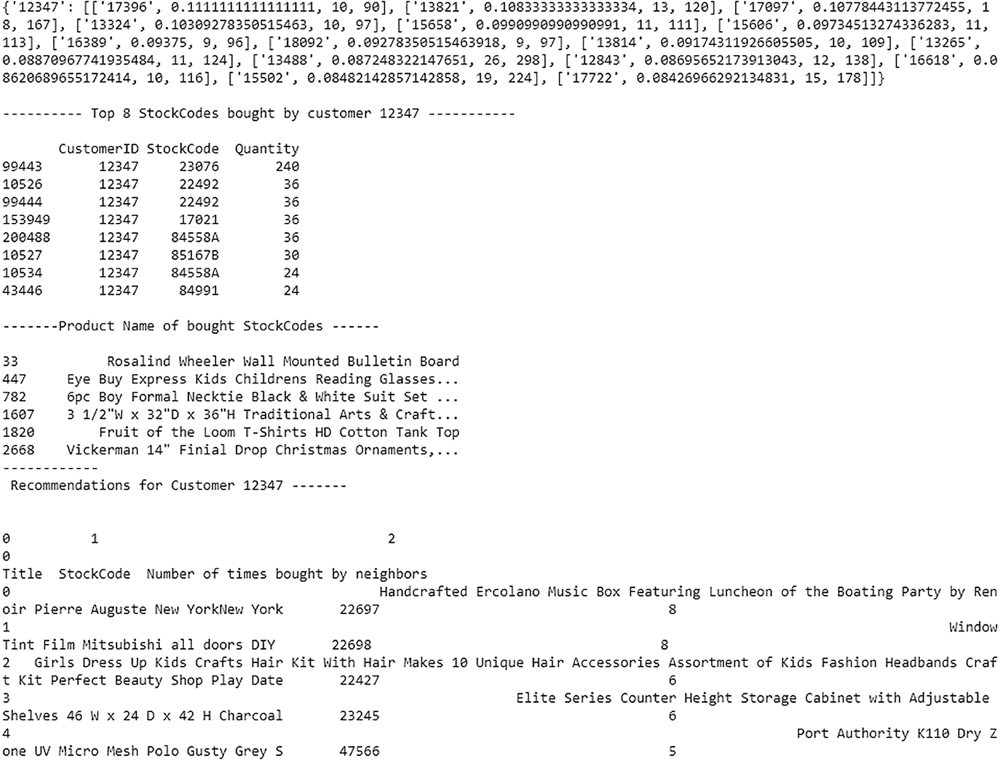

# 10. 基于图的推荐系统

上一章介绍了基于深度学习的推荐系统，并解释了如何实现端到端的神经协同过滤。本章探讨了另一种最近的高级方法：由知识图谱驱动的基于图的推荐系统。

图 10-1 展示了一个基于图的用于电影推荐的推荐系统。



一个用于电影推荐的推荐系统的结构表示。网络的架构展示了用户和项目之间的关系。

图 10-1

基于图的电影推荐

在基于图的推荐系统中，知识图谱结构表示用户和项目之间的关系。知识图谱是一个由语义丰富、相互连接的数据集网络结构，通过展示多个实体之间的关系进行图形化表示。当图形化展示时，有三个主要组件：节点、边和标签。链接的边定义了两个节点/实体之间的关系，其中每个节点可以是任何对象、用户、项目、地点等。底层语义为定义的关系提供了额外的动态上下文，使得决策更加复杂。

图 10-2 展示了知识图谱结构中的一个简单一对一关系。



A、B 和 C 之间的链接知识图谱。A、B 和 C 分别代表主题、谓词和宾语。

图 10-2

简单知识图谱连接

图 10-3 解释了知识图谱。



通过数据、图和语义的结合，获得了一个具有深度动态上下文的知识图谱。

图 10-3

知识图谱解释

本章使用 Neo4j 实现知识图谱。Neo4j 是目前市场上最好的图数据库之一。它是一个高性能的图存储，具有用户友好的查询语言，高度可扩展且稳健。

知识图谱将检索所需推荐的相关用户。

## 实现

下面的代码安装并导入所需的库。

```py
# Installing required packages
!pip install py2neo
!pip install openpyxl –upgrade
!pip install neo4j
!pip install neo4jupyter
#Importing the required libraries
import pandas as pd
from neo4j import GraphDatabase, basic_auth
from py2neo import Graph
import re
import neo4jupyter
```

在建立 Neo4j 和笔记本之间的连接之前，请在 Neo4j 中创建一个新的沙盒，网址为[`https://neo4j.com/sandbox/`](https://neo4j.com/sandbox/)。

一旦创建了沙盒，您必须更改 URL 和密码。

您可以在连接详情中找到它们，如图 10-4 所示。


连接详情的截图包括用户名、密码、IP 地址、HTTP 端口、bolt 端口、bolt URL 和 WebSocket bolt URL。

图 10-4

连接详情

让我们建立 Neo4j 和 Python 笔记本之间的连接。

```py
# establishing the connection
g = Graph("bolt://44.192.55.13:7687", password = "butter-ohms-chairman")
# The url "bolt://34.201.241.51:7687" needs to be replaced in case of new sandbox creation in neo4j.
# The credentials "neo4j" and "whirls-bullet-boils" also need a replacement for each use case.
driver = GraphDatabase.driver(
"bolt://44.192.55.13:7687",
auth=basic_auth("neo4j", "butter-ohms-chairman"))
def execute_transactions(transaction_execution_commands):
# Establishing connection with database
data_base_connection = GraphDatabase.driver("bolt://44.192.55.13:7687",
auth=basic_auth("neo4j", "butter-ohms-chairman"))
# Creating a session
session = data_base_connection.session()
for i in transaction_execution_commands:
session.run(i)
```

让我们导入数据。

```py
# This dataset consists of transactions which will be used to establish relationship between the customer and the stock.
df = pd.read_excel(r'Rec_sys_data.xlsx')
# Little bit of preprocessing so that we can easily run NoSQL queries.
df['CustomerID'] = df['CustomerID'].apply(str)
# This dataset contains detailed information about each stock which will be used to link stockcodes and their description/title.
df1 = pd.read_excel('Rec_sys_data.xlsx','product')
df1.head()
```

图 10-5 显示了 df1 的输出（前五行）。



d f 1 的输出截图。它包括股票代码、产品名称、描述、类别、品牌和单价。

图 10-5

输出

让我们将实体上传到 Neo4j 数据库。

要在 Neo4J 中实现知识图谱，DataFrame 必须转换为关系数据库。首先，客户和股票必须转换为实体（或图的节点），以在它们之间建立关系。

```py
#creating a list of all unique customer IDs
customerids = df['CustomerID'].unique().tolist()
# storing all the create commands to be executed into create_customers list
create_customers = []
for i in customerids:
# example of create statement "create (n:entity {property_key : '12345'})"
statement = "create (c:customer{cid:"+ '"' + str(i) + '"' +"})"
create_customers.append(statement)
# running all the queries into neo4j to create customer entities
execute_transactions(create_customers)
```

一旦完成客户节点，为股票创建节点。

```py
#  creating a list of all unique stockcodes
stockcodes = df['StockCode'].unique().tolist()
# storing all the create commands to be executed into the create_stockcodes list
create_stockcodes = []
for i in stockcodes:
# example of create statement "create (m:entity {property_key : 'XYZ'})"
statement = "create (s:stock{stockcode:"+ '"' + str(i) + '"' +"})"
create_stockcodes.append(statement)
# running all the queries into neo4j to create stock entities
execute_transactions(create_stockcodes)
```

接下来，创建一个链接，将股票代码和标题（推荐商品所需）关联起来。

为了这个目的，让我们在我们的 Neo4j 数据库中现有的库存实体中创建另一个属性键，称为'Title'。

```py
#creating a blank dataframe
df2 = pd.DataFrame(columns = ['StockCode', 'Title'])
#Converting stockcodes to string in both the dataframe
df['StockCode'] = df['StockCode'].astype(str)
df1['StockCode'] = df1['StockCode'].astype(str)
# This cell of code will add all the unique stockcodes along with their title in df2
stockcodes = df['StockCode'].unique().tolist()
for i in range(len(stockcodes)):
dict_temp = {}
dict_temp['StockCode'] = stockcodes[i]
dict_temp['Title'] = df1[df1['StockCode']==stockcodes[i]]['Product Name'].values
temp_Df = pd.DataFrame([dict_temp])
df2 = df2.append(temp_Df)
df2= df2.reset_index(drop=True)
# Doing some data preprocessing such that these queries can be run in neo4j
df2['Title'] = df2['Title'].apply(str)
df2['Title'] = df2['Title'].map(lambda x: re.sub(r'\W+', ' ', x))
df2['Title'] = df2['Title'].apply(str)
# This query will add the 'title' property key to each stock entity in our neo4j database
for i in range(len(df2)):
query = """
MATCH (s:stock {stockcode:""" + '"' + str(df2['StockCode'][i]) + '"' + """})
SET s.title ="""+ '"' + str(df2['Title'][i]) + '"' + """
RETURN s.stockcode, s.title
"""
g.run(query)
```

在客户和股票之间创建关系。

由于所有交易都在数据集中，关系已经已知并存在。要将它转换为 RDS，必须在 Neo4j 中运行加密查询来构建关系。

```py
# Storing transaction values in a list
transaction_list = df.values.tolist()
# storing all commands to build relationship in an empty list relation
relation = []
for i in transaction_list:
# the 9th column in df is customerID and 2nd column is stockcode which we are appending in the statement
statement = """MATCH (a:customer),(b:stock) WHERE a.cid = """+'"' + str(i[8])+ '"' + """ AND b.stockcode = """ + '"' + str(i[1]) + '"' + """ CREATE (a)-[:bought]->(b) """
relation.append(statement)
execute_transactions(relation)
```

接下来，让我们使用创建的关系来查找用户之间的相似性。

Jaccard 相似度可以计算为两个集合的交集与并集的比率。这是一个相似度的度量，作为一个百分比值，它介于 0%到 100%之间。更相似的集合具有更高的值。

```py
def similar_users(id):
# This query will find users who have bought stocks in common with the customer having id specified by user
# Later we will find jaccard index for each of them
# We wil return the neighbors sorted by jaccard index in descending order
query = """
MATCH (c1:customer)-[:bought]->(s:stock) c2 AND c1.cid =""" + '"' + str(id) +'"' """
WITH c1, c2, COUNT(DISTINCT s) as intersection
MATCH (c:customer)-[:bought]->(s:stock)
WHERE c in [c1, c2]
WITH c1, c2, intersection, COUNT(DISTINCT s) as union
WITH c1, c2, intersection, union, (intersection * 1.0 / union) as jaccard_index
ORDER BY jaccard_index DESC, c2.cid
WITH c1, COLLECT([c2.cid, jaccard_index, intersection, union])[0..15] as neighbors
WHERE SIZE(neighbors) = 15   // return users with enough neighbors
RETURN c1.cid as customer, neighbors
"""
neighbors = pd.DataFrame([['CustomerID','JaccardIndex','Intersection','Union']])
for i in g.run(query).data():
neighbors = neighbors.append(i["neighbors"])
print("\n----------- customer's 15 nearest neighbors ---------\n")
print(neighbors)
```

以下是一个示例输出。

```py
similar_users('12347')
```

图 10-6 显示了与客户 12347 相似的用户的输出。



与客户 12347 相似的用户的示例输出。暴露了客户的 15 个最近邻居的数据。数据包括客户 ID、Jaccard 指数、交集和并集。

图 10-6

输出

```py
similar_users(' 17975')
```

图 10-7 显示了与客户 17975 相似的用户的输出。



与客户 17975 相似的用户的示例输出。暴露了客户的 15 个最近邻居的数据。数据包括客户 ID、Jaccard 指数、交集和并集。

图 10-7

输出

现在，让我们根据相似用户推荐产品。

```py
def recommend(id):
# The query below is same as similar_users function
# It will return the most similar customers
query1 = """
MATCH (c1:customer)-[:bought]->(s:stock) c2 AND c1.cid =""" + '"' + str(id) +'"' """
WITH c1, c2, COUNT(DISTINCT s) as intersection
MATCH (c:customer)-[:bought]->(s:stock)
WHERE c in [c1, c2]
WITH c1, c2, intersection, COUNT(DISTINCT s) as union
WITH c1, c2, intersection, union, (intersection * 1.0 / union) as jaccard_index
ORDER BY jaccard_index DESC, c2.cid
WITH c1, COLLECT([c2.cid, jaccard_index, intersection, union])[0..15] as neighbors
WHERE SIZE(neighbors) = 15   // return users with enough neighbors
RETURN c1.cid as customer, neighbors
"""
neighbors = pd.DataFrame([['CustomerID','JaccardIndex','Intersection','Union']])
neighbors_list = {}
for i in g.run(query1).data():
neighbors = neighbors.append(i["neighbors"])
neighbors_list[i["customer"]] = i["neighbors"]
print(neighbors_list)
# From the neighbors_list returned, we will fetch the customer ids of those neighbors to recommend items
nearest_neighbors = [neighbors_list[id][i][0] for i in range(len(neighbors_list[id]))]
# The below query will fetch all the items boughts by nearest neighbors
# We will remove the items which have been already bought by the target customer
# Now from the filtered set of items, we will count how many times each item is repeating within the shopping carts of nearest neighbors
# We will sort that list on count of repititions and return in descending order
query2 = """
// get top n recommendations for customer from their nearest neighbors
MATCH (c1:customer),(neighbor:customer)-[:bought]->(s:stock)    // all items bought by neighbors
WHERE c1.cid = """ + '"' + str(id) + '"' """
AND neighbor.cid in $nearest_neighbors
AND not (c1)-[:bought]->(s)                    // filter for items that our user hasn't bought before
WITH c1, s, COUNT(DISTINCT neighbor) as countnns // times bought by nearest neighbors
ORDER BY c1.cid, countnns DESC
RETURN c1.cid as customer, COLLECT([s.title, s.stockcode, countnns])[0..$n] as recommendations
"""
recommendations = pd.DataFrame([['Title','StockCode','Number of times bought by neighbors']])
for i in g.run(query2, id = id, nearest_neighbors = nearest_neighbors, n = 5).data():
#recommendations[i["customer"]] = i["recommendations"]
recommendations = recommendations.append(i["recommendations"])
# We will also print the items bought earlier by the target customer
print(" \n---------- Top 8 StockCodes bought by customer " + str(id) + " -----------\n")
print(df[df['CustomerID']==id][['CustomerID','StockCode','Quantity']].nlargest(8,'Quantity'))
bought = df[df['CustomerID']==id][['CustomerID','StockCode','Quantity']].nlargest(8,'Quantity')
print('\n-------Product Name of bought StockCodes ------\n')
print((df1[df1.StockCode.isin(bought.StockCode)]['Product Name']).to_string())
# Here we will print the recommendations
print("------------ \n Recommendations for Customer {} ------- \n".format(id))
print(recommendations.to_string())
```

此函数获取以下信息。

+   某个客户购买的前八个股票代码和产品名称

+   同一客户的推荐和邻居购买相同商品的数量

以下步骤是为了达到预期的结果。

1.  获取给定客户的相似客户。

1.  获取最近邻居购买的所有商品，并移除目标客户已经购买的商品。

1.  从过滤后的商品集中，统计每个商品在最近邻居的购物车中重复出现的次数，然后根据重复次数对列表进行排序，并按降序返回。

现在，让我们尝试客户 17850。

```py
recommend('17850')
```

图 10-8 显示了客户 17850 的推荐输出。



这是针对客户 17850 的样本输出，包括对该客户的推荐以及客户购买的前 8 个股票代码的数据和购买股票代码的产品名称。

图 10-8

输出

接下来，让我们尝试客户 12347。

```py
recommend(' 12347')
```

图 10-9 显示了客户 12347 的推荐输出。



这是针对客户 12347 的样本输出，包括对该客户的推荐以及客户购买的前 8 个股票代码的数据和购买股票代码的产品名称。

图 10-9

输出

## 摘要

本章简要介绍了知识图谱以及基于图推荐引擎的工作原理。您看到了一个使用 Neo4j 知识图谱的端到端图推荐系统的实际实现。所使用的一些概念非常新颖且先进，最近也变得流行起来。像 Netflix 和 Amazon 这样的行业巨头正在转向基于图的系统来进行他们的推荐；因此，这种方法非常相关且必须了解。
