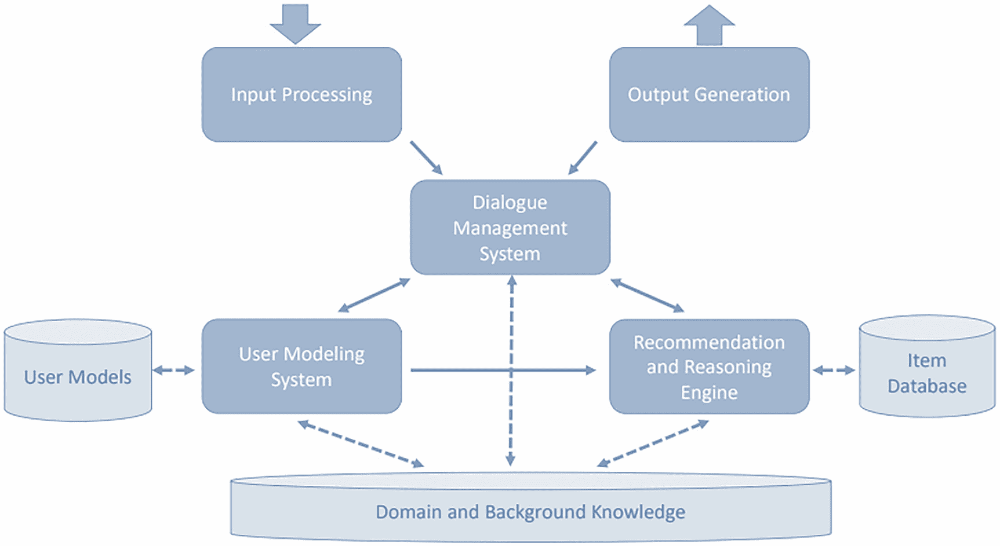
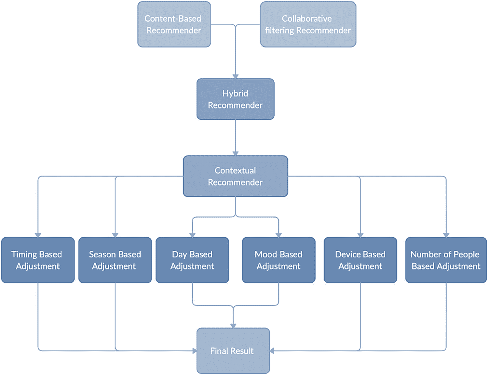
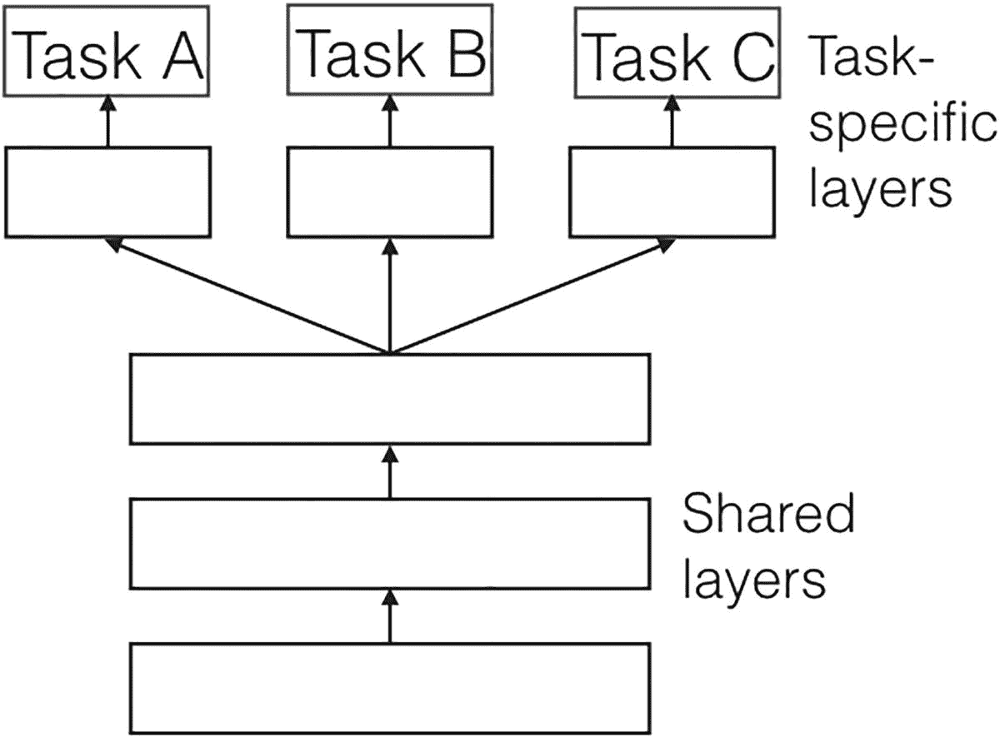
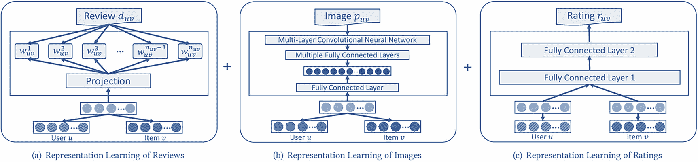

# 11. 推荐系统中的新兴领域和技术

这本书向您展示了使用各种技术实现的多个推荐系统（也称为*推荐系统*）的实现方式。您已经对这些方法有了全面的认识。像深度学习和基于图的方法这样的主题仍在不断进步。推荐系统长期以来一直是主要的研究兴趣。已经发现了更复杂、更有趣的新途径，并且研究仍在同一方向上继续进行。

本章探讨了实时、上下文感知、对话和多任务推荐者，以展示该领域研究和增长的巨大潜力。

## 实时推荐

通常，批量推荐在计算上成本较低，更受欢迎，因为它们可以每天（例如）生成，并且更容易操作化。但最近，更多的关注点在于开发实时推荐。实时推荐通常在计算上更昂贵，因为它们必须按需生成，并且基于实时用户交互。操作实时推荐也更为复杂。

那么，为什么需要实时推荐呢？当基于时间和以任务为中心的客户旅程依赖于上下文时，它们是必不可少的。在大多数情况下，在用户失去兴趣和需求减弱之前，需要满足实时需求。此外，对客户旅程的实时分析有助于在当前情况下提供更好的推荐。相反，批量推荐建议的产品与客户在之前的互动中看到/购买的产品相似。

## 对话推荐

近年来，在开发更多对话系统方面进行了大量的研究和努力。人们相信这将会彻底改变未来人机交互的方式。这种影响也可以在推荐系统最近的对话系统发展中看到。

图 11-1 显示了对话推荐系统的系统设计。

对话推荐系统的系统设计架构。它从输入处理开始，到输出生成，再到对话管理系统、用户建模系统、推荐引擎到领域和背景知识。

图 11-1

对话推荐系统的系统设计

对话推荐系统旨在从文本/语音对话中生成推荐，以便用户可以以自然、对话的方式与计算机交互。它最近变得极其流行，并在语音助手和聊天机器人中得到广泛应用。它使用自然语言理解（输入）和生成（输出）。通过对话管理系统生成针对各种输入对话的不同操作。

## 上下文感知推荐者

研究人员和从业者已经认识到在许多领域，如电子商务个性化、信息检索、普适和移动计算、数据挖掘、营销和管理中，上下文信息的重要性。尽管在推荐系统方面已经进行了大量研究，但许多现有方法并没有考虑其他上下文信息，如时间、地点或他人的陪伴，以找到最相关的信息。它专注于向用户推荐文章。（例如观看电影或吃饭）。越来越多的人认识到，相关的上下文信息在推荐系统中很重要，并且在做出推荐时考虑它是重要的。

基于上下文的推荐系统代表了一个新兴的实验和研究领域，旨在根据用户在任何给定时刻的上下文提供更准确的内容。例如，用户是在家还是在外？他们是在使用大屏幕还是小屏幕？早上还是晚上？给定特定用户的可用数据，上下文系统可能会提供用户在这些场景下可能会接受的推荐。

图 11-2 展示了不同类型的上下文推荐器。

流程图描述了不同类型的上下文推荐器。它包括基于内容和基于协作的，以及混合到上下文推荐器。

图 11-2

不同类型的上下文推荐器

## 多任务推荐器

在许多领域，在构建推荐系统时，可以借鉴的丰富且重要的反馈来源有好几个。例如，电子商务网站通常记录用户访问（产品页面）、用户点击（点击流数据）、添加到购物车以及每个用户和物品级别的购买情况。购买后的输入，如评论和退货，也被记录下来。

整合这些不同形式的反馈对于构建能够产生更好结果的系统至关重要，而不是构建特定任务的模型。这在某些数据稀疏（如购买、退货和评论）而某些数据丰富（如点击）的情况下尤其如此。在这些场景中，联合模型可能使用从丰富任务中获得的表示来通过称为*迁移学习*的现象提高其对稀疏任务的预测。

多任务学习是一种机器学习学习方法，在这种方法中，同时处理多个学习任务，同时利用它们的共性和差异。它主要被用于自然语言处理和计算机视觉，取得了相当的成功。近年来，在构建鲁棒推荐系统时使用这种方法引起了广泛关注。基于多任务学习的深度神经网络因其多种优势而得到广泛应用。

+   它避免了过拟合。

+   它提供可解释的输出以解释推荐。

+   它隐式地扩展了数据，从而减轻了稀疏性问题。

图 11-3 解释了多任务学习的架构。

多任务处理架构。它由三个指定层任务 A、B 和 C 以及共享层组成。

图 11-3

多任务学习架构

您还可以部署多任务学习来解决跨域推荐问题，其中为每个域生成推荐是一个单独的任务。

### 联合表示学习

联合表示学习（JRL），一种最近的方法，能够同时学习用户和物品的多表示模型。它使用深度表示学习架构，其中每种类型的信息源（文本评论、产品图像、评分点等）都被采用来学习适当的用户和物品表示。

图 11-4 解释了 JRL 的表示。

一组三个流程图描述了 J R L 的表示。它包括评论的表示学习、图像的表示学习和评分的表示学习。

图 11-4

JRL 的表示

在 JRL 中，来自不同来源的多个表示通过一个单独的层进行整合，该层为用户和物品获得共同表示。最后，使用成对学习来训练每个来源和联合表示层，以对前 N 个推荐进行排序。由于 JRL 使用简单的向量乘法，因此在在线预测中通常比其他深度学习方法快得多。

## 结论

推荐系统自电子商务时代开始以来一直备受关注，但它已经存在了一段时间。第一个推荐系统是在 1979 年开发的，名为 Grundy 的系统，这是一个基于计算机的图书管理员，为读者提供阅读建议。推荐系统的首次商业应用是在 20 世纪 90 年代初。从那时起，它因提供无与伦比的财务激励和时间节省特性而迅速发展。推荐系统在许多领域的用户体验中变得至关重要。最典型的例子是 Netflix 及其推荐引擎，它获得了大量资金，并专注于研究和开发。

对推荐系统及其在各个领域中的持续需求及其重要性导致了构建良好、可靠和健壮系统的巨大需求。这要求在开发这些系统方面进行更多研究和创新。这有利于企业，并帮助用户在做出决策和获得最合适的选项时节省时间，这在大多数情况下如果手动进行将会错过。

本书介绍了在 Python 中实现端到端推荐系统的各种流行方法，从基本的算术运算到高级的基于图系统。所有这些方法根据需求和领域都可以是有用的。对这些方法的实际了解将帮助您构建理想的推荐引擎（RC）。我们希望这本书对开发者和从业者来说是一个有用的工具。通过提供对各种概念和推荐引擎实现的更深入知识，它应该能够简化并进一步提升在这个激动人心的领域中的现有工作和研究。
