# 一、强化学习简介

对于那些从我以前的书籍中返回的人来说，*使用 R* <sup>[1](#Fn1)</sup> 和*使用 Python 应用自然学习*、 <sup>[2](#Fn2)</sup> 很高兴再次成为你们的读者。对新来的人，欢迎！在过去的一年里，深度学习包和技术的持续增长和发展彻底改变了各个行业。毫无疑问，这个领域最令人兴奋的部分之一是强化学习。这本身通常是许多广义人工智能应用的基础，例如学习玩视频游戏或下棋的软件。强化学习的好处是代理可以熟悉大范围的任务，假设问题可以被建模为包含动作、环境、代理的框架。假设，问题的范围可以从解决简单的游戏，到更复杂的 3D 游戏，到教会自动驾驶汽车如何在各种不同的地方接送乘客，以及教会机器人手臂如何抓住物体并将其放在厨房柜台上。

训练有素和部署良好的 RL 算法的意义是巨大的，因为它们更具体地寻求推动人工智能超越我在之前撰写的文章中谈到的一些狭隘的人工智能应用。算法不再是简单地预测一个目标或标签，而是在一个环境中操纵一个代理，这个代理有一组它可以选择的行动来实现一个目标/奖励。投入大量时间研究强化学习的公司和组织的例子有 Deep Mind 和 OpenAI，它们在该领域的突破是领先的解决方案之一。然而，让我们简要概述一下这个领域的历史。

## 强化学习的历史

强化学习在某种意义上是对最优控制的更名，最优控制是从控制理论延伸出来的概念。最优控制起源于 20 世纪 50 年代和 60 年代，当时它被用来描述一个试图达到某个“最优”标准的问题，以及达到这个目标需要什么样的“控制”法则。通常，我们将最优控制定义为一组微分方程。然后，这些等式定义了一条通向使误差函数值最小的值的路径。最优控制的核心是理查德·贝尔曼工作的顶峰，特别是动态规划。发展于 20 世纪 50 年代的动态规划是一种优化方法，它强调通过将一个大的个体问题分解成更小和更容易解决的部分来解决它。它也被认为是解决随机最优控制问题的唯一可行的方法，而且一般认为所有的最优控制都是强化学习。

贝尔曼对最优控制最显著的贡献是建立了汉密尔顿-雅可比-贝尔曼(HJB)方程。HJB 方程

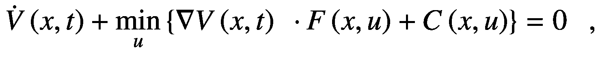

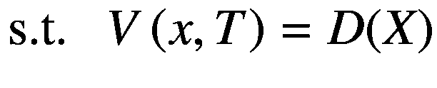

其中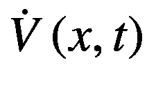= V w r t 的偏导数，时间变量 *t* 。 *a* *b* ， =贝尔曼价值函数(未知标量)或从在时间 *t* 从状态 *x* 开始并最优控制系统直到时间 *T* ， *C* =标量成本率函数， *D* =最终效用状态函数， *x* ( * t * ) =系统状态向量

从这个方程得到的解就是价值函数，或给定动态系统的最小成本。HJB 方程是解决最优控制问题的标准方法。此外，动态规划通常是解决随机最优控制问题的唯一可行的方式或方法。开发动态编程来帮助解决的其中一个问题是马尔可夫决策过程(MDPs)。

## MDP 及其与强化学习的关系

我们将 MDPs 描述为离散时间随机控制过程。具体来说，我们将离散时间随机过程定义为一个随机过程，其中指数变量由一组离散的或特定的值来表征(与连续值相反)。MDP 特别适用于结果部分受流程参与者影响，但流程也表现出一定程度的随机性的情况。MDPs 和动态规划因此成为强化学习理论的基础。

简单地说，我们基于马尔可夫特性假设，给定现在，未来独立于过去。除此之外，如果这种状态给我们对未来的描述与我们拥有全部历史信息一样，那么这种状态就被认为是充分的。这实质上意味着当前状态是唯一相关的信息，所有历史信息都不再是必需的。在数学上，一个状态被称为具有马尔可夫性质 iff

![$$ P\left[{S}_t+1|{S}_t\right]=P\left[{S}_t+1\ \right|{S}_1,\dots, {S}_t\Big] $$](img/480225_1_En_1_Chapter_TeX_Equc.png)

马尔可夫过程本身被认为是无记忆的，因为它们是从一个状态到另一个状态的随机转换。此外，我们认为它们是状态空间 S 上的元组(S，P ),其中状态通过转移函数 P 改变，定义如下:

![$$ {\mathcal{P}}_{s{s}^{\prime }}=\mathbb{P}\left[{S}_{t+1}={s}^{\prime}\right|{S}_t=s\Big], $$](img/480225_1_En_1_Chapter_TeX_Equd.png)

其中 *S* =马氏状态，*S*<sub>T5】t</sub>=下一个状态。

这个转移函数描述了一个概率分布，其中该分布是代理可以转移到的所有可能状态。最后，我们从一种状态转移到另一种状态会得到一种回报，我们用数学方法定义如下:

![$$ {R}_s=\mathbbm{E}\left[{R}_{t+1}\right|{S}_t=S\Big],{G}_t={R}_{t+1}+\gamma {R}_{t+2}+{\gamma}^2{R}_{t+3}+\dots +{\gamma}^{k-1}{R}_{t+k} $$](img/480225_1_En_1_Chapter_TeX_Eque.png)

其中 *γ* =折扣因子， *γ* ∈ [0，1]， *G* <sub>*t*</sub> =总折扣奖励， *R* =奖励函数。

我们因此定义一个马尔可夫报酬过程(MRP)元组为( *S* ， *P* ， *R* ， *γ* )。

现在描述了所有这些公式，图 [1-1](#Fig1) 中的图像是一个可视化马尔可夫决策过程的例子。

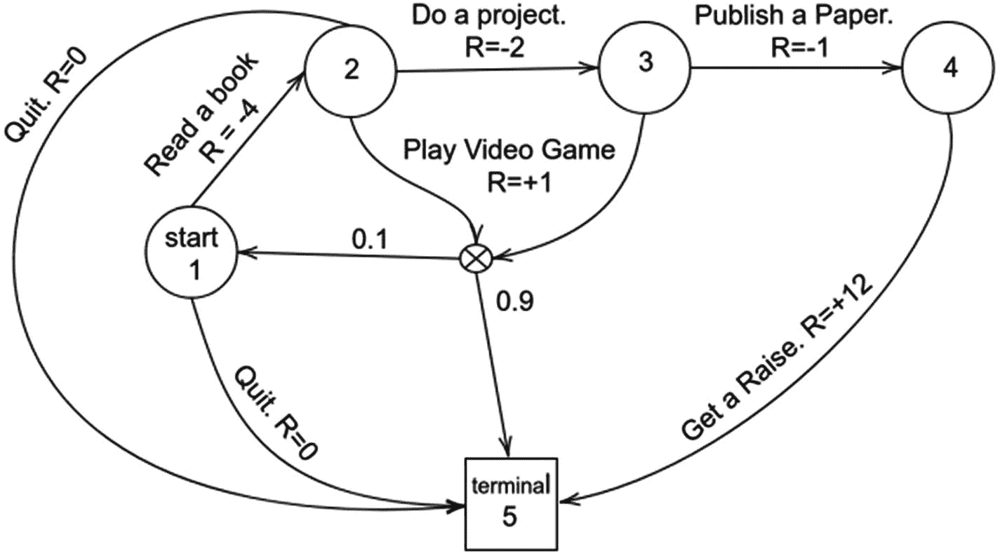

图 1-1

马尔可夫决策过程

图 [1-1](#Fig1) 显示了一个代理人如何以不同的概率从一个状态移动到另一个状态，并获得奖励。最理想的情况是，在给定的环境参数下，在我们失败之前，我们将学会选择在给定事件中积累最多回报的过程。这在本质上是强化学习的一个非常基本的解释。

强化学习发展的另一个重要组成部分是试错学习，这是研究动物行为的一种方法。最具体地说，这被证明有助于理解“强化”不同行为的基本奖励和惩罚机制。然而“强化学习”这个词直到 20 世纪 60 年代才出现。在此期间，“信用分配问题”(cap)的概念被引入，特别是由马文·明斯基提出。明斯基是一位认知科学家，他一生的大部分时间都在研究人工智能，比如他的书 *Perceptrons* (1969 年)和他描述学分分配问题的论文“迈向人工智能”(1961 年)。cap 询问一个人如何分配成功的“荣誉”,即在实现成功的过程中所做的所有决策。具体来说，许多强化学习算法直接致力于解决这个精确的问题。然而，随着这种说法的提出，试错学习在很大程度上变得不太受欢迎，因为神经网络方法(以及一般的监督学习)，如 Bernard Widrow 和 Ted Hoff 提出的创新，占据了人工智能领域的大部分兴趣。然而，在 20 世纪 80 年代，随着 Q 学习的发展，该领域的兴趣复苏是最值得注意的，当时时差(TD)学习真正取得了进展。

具有讽刺意味的是，TD 学习特别受到明斯基指出的动物心理学另一个重要方面的影响。它来自于两个刺激的想法，一个主要强化物与一个次要强化物配对，并随后影响行为。然而，TD 学习本身主要是由 Richard S. Sutton 开发的。他被认为是 RL 领域最有影响力的人物之一，因为他的博士论文引入了时间学分分配的概念。这指的是奖励，尤其是在非常细化的国家行为空间中，是如何被延迟的。例如，赢得一盘棋需要许多动作，然后才能获得赢得比赛的“奖励”。因此，奖励信号对暂时远离的状态没有显著影响。因此，时间信用分配解决了你如何以一种有意义地影响时间上遥远的状态的方式来奖励这些细微的行为。Q 学习，以产生回报的“Q”函数命名，建立在这些创新的基础上，专注于有限马尔可夫决策过程。

对于 Q 学习，这将我们带到了今天，在这里，强化学习的进一步改进正在不断地进行，并代表着人工智能的前沿。然而，随着这个概述的完成，让我们更具体地讨论读者可以期望学到什么。

## 强化学习算法和强化学习框架

强化学习类似地非常类似于传统机器学习中的监督学习领域，尽管存在关键差异。在监督学习中，有一个客观的答案，即我们正在训练模型，以根据给定观察的输入特征正确预测类别标签或特定值。特征类似于环境的给定状态中的向量，我们通常将这些向量作为一系列状态或者从一个状态到下一个状态单独地馈送给强化学习算法。然而，主要的区别是不一定总是有一个“答案”来解决特定的问题，因为强化学习算法可能有多种方式来成功地解决问题。在这种情况下，我们显然希望选择我们能够最快得出的答案，同时尽可能高效地解决问题。这正是我们选择模型变得至关重要的地方。

在前面对 RL 历史的概述中，我们介绍了几个定理，您将在接下来的章节中详细了解这些定理。然而，由于这是一个应用文本，理论也必须与实例一起提供。因此，我们将在本文中花费大量时间讨论 RL 框架 OpenAI Gym 以及它如何与不同的深度学习框架接口。OpenAI Gym 是一个框架，它允许我们轻松地部署、比较和测试强化学习算法。然而，它确实有很大程度的灵活性，因为我们可以利用深度学习方法和 OpenAI gym，我们将在我们的各种概念证明中这样做。下面显示了一些简单的示例代码，这些代码利用了显示从训练过程中产生的视频的包和情节(图 [1-2](#Fig2) )。

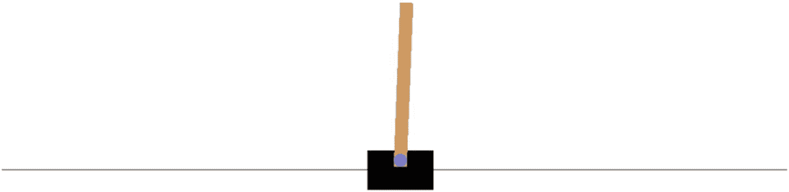

图 1-2

手推车杆子视频游戏

```py
import gym

def cartpole():
    environment = gym.make('CartPole-v1')
    environment.reset()
    for _ in range(50):
        environment.render()
        action = environment.action_space.sample()
        observation, reward, done, info = environment.step(action)
        print("Step {}:".format(_))
        print("action: {}".format(action))
        print("observation: {}".format(observation))
        print("reward: {}".format(reward))
        print("done: {}".format(done))
        print("info: {}".format(info))

```

当审查代码时，我们注意到在使用 gym 时，我们必须初始化一个我们的算法所在的环境。虽然使用软件包提供的环境很常见，但是我们也可以为自定义任务创建自己的环境(比如 gym 没有提供的视频游戏)。但是，接下来，让我们讨论一下终端输出中定义的其他值得注意的变量，如下所示。

```py
action: 1
observation: [-0.02488139  0.00808876  0.0432061   0.02440099]
reward: 1.0
done: False
info: {}

```

这些变量可以细分如下:

*   **行动**–指代理人在一个环境中采取的行动，该行动随后会产生回报

*   **奖励**——屈服于代理。表示完成某个目标的行动质量

*   **观察值**——由动作产生:指一个动作执行后的环境状态

*   **Done**–表示环境是否需要重置的布尔值

*   **信息**–包含调试用杂项信息的字典

描述这些动作的流程如图 [1-3](#Fig3) 所示。

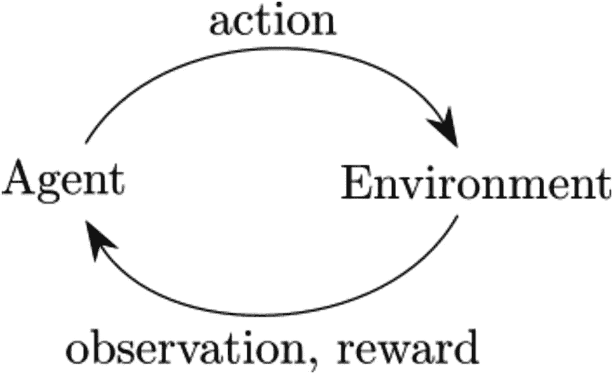

图 1-3

RL 算法的流程和环境

为了提供更多的背景信息，图 [1-2](#Fig2) 显示了一个推车和一根杆子的视频游戏，目标是成功地平衡推车和杆子，使杆子永远不会倾斜。因此，一个合理的目标是训练一些 DL 或 ML 算法，使我们能够做到这一点。然而，我们将在本书的后面处理这个特殊的问题。本节的目的只是简单介绍一下 OpenAI 健身房。

## q 学习

我们在引言中简要讨论了 Q 学习；然而，值得强调的是，我们将利用本文的重要部分来讨论这个主题。q 学习的特点是有一些策略，它通知代理在不同的场景中要采取的行动。虽然它不需要模型，但我们可以使用一个模型，并且它通常特别适用于有限马尔可夫决策过程。具体来说，我们将在本文中处理的变体是 Q 学习、深度 Q 学习(DQL)和双 Q 学习(图 [1-4](#Fig4) )。

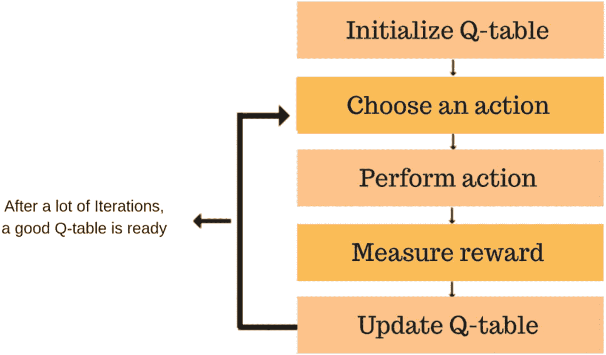

图 1-4

q 学习流程图

我们将在专门引用这些技术的章节中对此进行更深入的讨论；然而，鉴于问题的复杂性，Q 学习和深度 Q 学习各有各自的优势，但两者往往遭受类似的失败。

### 演员-评论家模型

我们将在本书中探讨的最先进的模型是演员-评论家模型，它由 A2C 和 A3C 组成。这两个模型分别代表优势行动者-批评家模型和异步优势行动者-批评家模型。虽然这两者实际上是相同的，但区别在于后者具有多个彼此并行工作并独立更新参数的模型，而前者同时更新所有模型的参数。这些模型在更细粒度的基础上更新(动作对动作),而不是像许多其他强化学习算法那样以偶发的方式更新。图 [1-5](#Fig5) 显示了一个演员-评论家模型的例子。

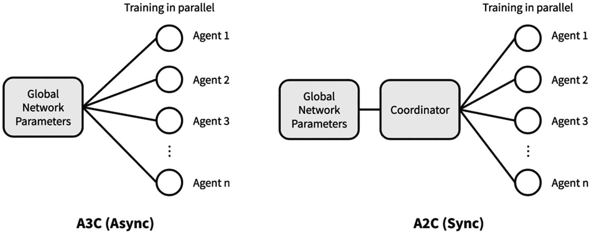

图 1-5

演员-评论家模型可视化

## 强化学习的应用

在向读者全面介绍了强化学习的概念后，我们将解决多个问题，重点是向读者展示如何部署我们将在云环境中培训和利用的解决方案。

### 经典控制问题

由于最优控制领域已经存在了大约 60 年，有一些问题我们将首先解决，用户将会看到在其他强化学习文献中经常引用这些问题。其中一个就是大车杆子问题，参考图 [1-2](#Fig2) 。这是一个游戏，其中要求用户使用一组最佳选项来尝试和平衡一个手推车杆子。另一个如图 [1-6](#Fig6) 所示，称为冰封湖，其中代理学习如何在不踩冰的情况下穿过冰封的湖，否则会导致代理掉下去。

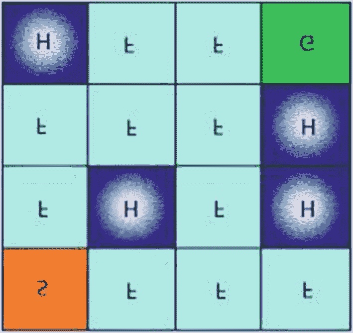

图 1-6

冰湖显现

### 超级马里奥兄弟。

有史以来最受欢迎的视频游戏之一被证明是展示如何将人工智能中的强化学习应用于虚拟环境的最佳方式之一。在 py_nes 库的帮助下，我们能够模拟*超级马里奥兄弟* *。*(图 [1-7](#Fig7) )然后利用游戏中的数据，这样我们就可以训练模型玩关卡了。我们将专门关注一个级别，并将为此应用程序利用 AWS 资源，让读者有机会在此任务中获得经验。

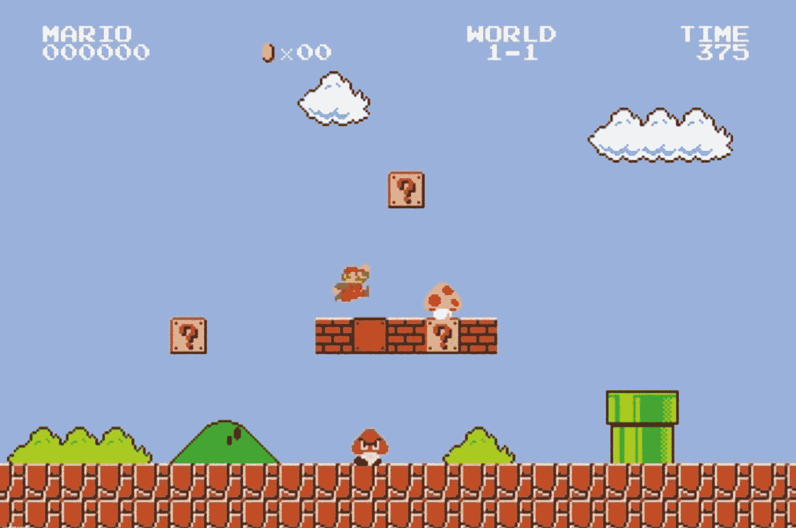

图 1-7

超级马里奥兄弟。

### 死亡

我们将在这里应用的一个经典强化学习示例是学习玩一个简单级别的视频游戏 *Doom* (图 [1-8](#Fig8) )。最初于 20 世纪 90 年代在 PC 上发布，这款视频游戏的重点是成功杀死你所面对的所有恶魔和/或敌人，同时通过整个关卡。然而，考虑到动作的范围、可用的包以及其他有用的属性，这有助于 Deep Q Learning 的出色应用。


图 1-8

Doom 屏幕快照

### 强化营销决策

不同自营交易公司的共同策略是通过向参与者提供流动性来赚钱，目标是以任何给定的价格买卖资产。虽然这种策略有既定的技术，但这是一个应用强化学习的绝佳领域，因为目标相对简单，并且是一个数据丰富的领域。我们将使用来自 Lobster 的限价订单数据，这是一个网站，其中包含大量用于此类实验的优秀订单数据。在图 [1-9](#Fig9) 中，我们可以看到订单簿的示例。

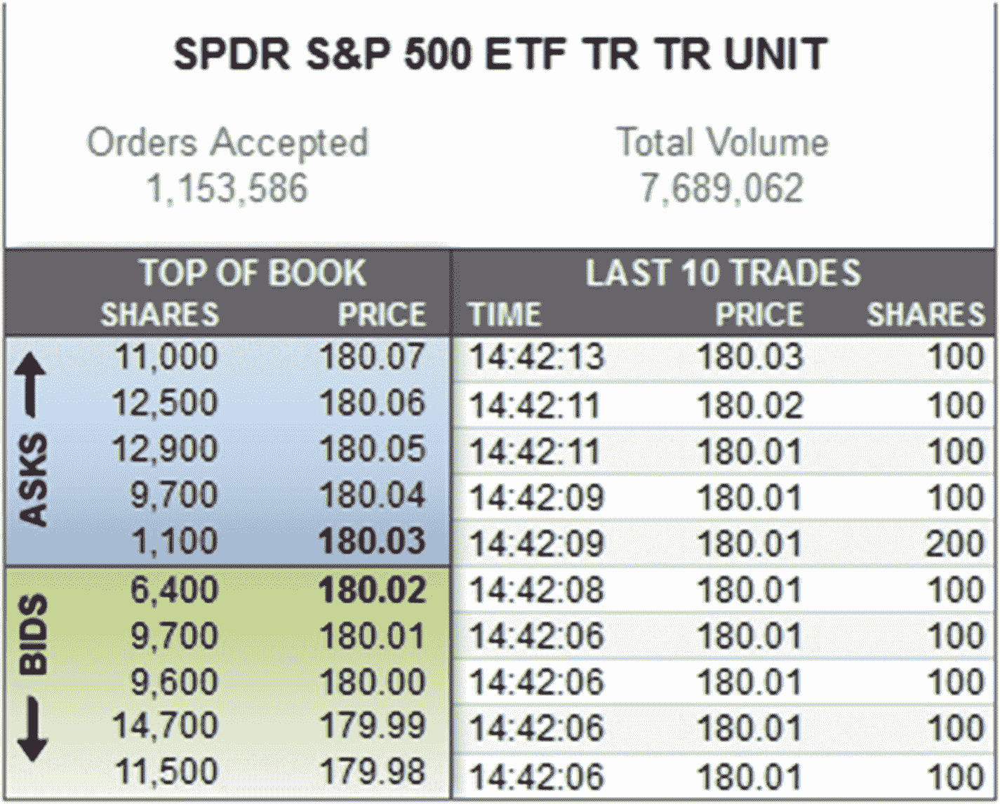

图 1-9

限价订单簿

## 刺猬索尼克

另一个适合我们使用不同模式的经典视频游戏是*刺猬索尼克*(图 [1-10](#Fig10) )。除了在这一特定的章节，我们将带领读者从头开始创建他们自己的环境，他们可以利用 OpenAI gym 和自定义软件包装一个环境，然后训练他们自己的强化学习算法，然后解决水平问题。这将再次利用 AWS 资源进行培训，借鉴其他视频游戏示例中使用的相同流程，特别是*超级马里奥兄弟*

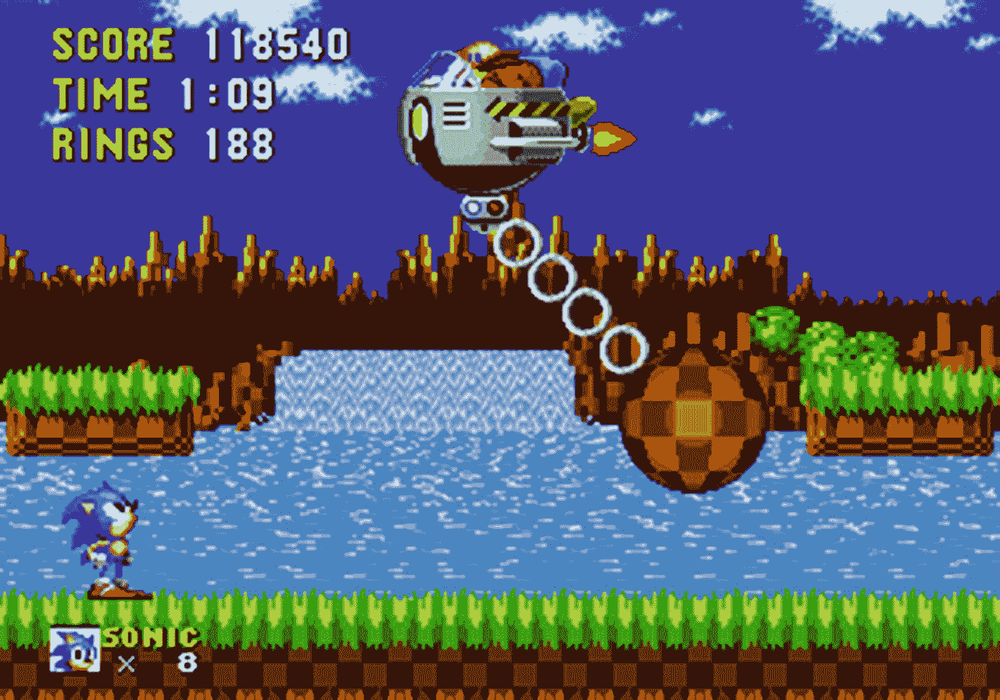

图 1-10

刺猬索尼克

## 结论

本文的目的是让读者熟悉如何在他们工作的各种环境中应用强化学习。读者应该熟悉深度学习框架，如 Tensorflow 和 Keras，我们将从这些框架中部署许多与结合使用的深度学习模型。虽然我们会花时间来解释强化学习理论，并且可能会解释一些与深度学习重叠的理论，但本文的大部分内容将致力于讨论强化学习的理论和应用。话虽如此，让我们从深入讨论强化学习的基础开始。

<aside class="FootnoteSection" epub:type="footnotes">Footnotes [1](#Fn1_source)

纽约:匆匆，2018 年。

  [2](#Fn2_source)

纽约:匆匆，2017 年。

 </aside>