# 二、强化学习算法

读者应该知道，我们将在本书中利用各种深度学习和强化学习方法。然而，由于我们的重点将转移到讨论实现以及这些算法如何在生产环境中工作，我们必须花一些时间更详细地介绍算法本身。因此，本章的重点将是带领读者通过几个普遍应用的强化学习算法的例子，并在利用 OpenAI gym 解决不同问题的背景下展示它们。

## 开放 AI 健身房

在我们深入任何具体的例子之前，让我们首先简要地讨论一下读者将在本文的大部分内容中使用的软件。OpenAI 是一个位于旧金山湾区的研究机构。在他们在人工智能领域贡献的许多论文中，他们做出的最大的开源贡献之一是 OpenAI“健身房”。OpenAI gym 是为 python 发布的一个包，它提供了几个环境，用户可以在其中开始利用强化学习算法。我们将把这个包特别用于视频游戏环境，在其中我们可以训练我们的算法；但是，让我们从尝试理解软件包以及如何使用它开始。

健身房的基础是环境。在第 [1](1.html) 章中，我们讨论了环境，我们定义的各种变量，以及环境的输出。在我们制作的每一个游戏或环境中，往往会观察到它们的不同。本章我们玩的推车杆子游戏将是一个非常小的向量；然而，我们稍后工作的超级马里奥兄弟的环境将会更加复杂。然而，让我们在本章开始时，先看看 cart pole 以及一个新的环境，并尝试理解我们在这个环境中可能想要做些什么来解决这个问题。巴尔托、萨顿和安德森(1983)在“可以解决困难的学习控制问题的神经元样自适应元件”中描述了 cart 极点问题推车杆子问题的目标是保持杆子在推车上平衡。对于杆是垂直的每一帧，我们接收 1 的奖励；然而，如果杆子在任何给定的帧中不再保持垂直，游戏就输了。我们将不再关注他们解决这个问题的方法，而是关注利用策略梯度方法，这是强化学习的基石之一。

## 基于政策的学习

基于策略的梯度方法关注于直接优化策略函数，而不是试图学习一个价值函数，该价值函数将产生关于给定状态下的预期回报的信息。简而言之，我们选择一个动作与选择利用一个价值函数是分开的。策略分为以下几类:

*   **确定性**–将给定状态映射到一个(或多个)操作的策略，具体来说就是所采取的操作“确定”了结果。例如，你在键盘上输入一个 word 文件。当您按下“y”时，您确定字符“y”会出现在屏幕上。

*   **随机**-在一系列行动上产生概率分布的策略，因此有可能发生的行动是 ***而不是*** 。这特别用于环境是 ***而不是*** 确定性的情况，并且是部分可观察马尔可夫决策过程(POMDP)的一个例子。

与基于值的方法相比，基于策略的方法有一些特定的优势，这对于读者在建模过程中要记住是很重要的。首先，与基于价值的方法相比，它们更倾向于收敛于解决方案。这背后的原因是我们正被梯度引导向一个解决方案。直观上，梯度方法指向我们正在微分的最陡函数。当应用于误差函数，并以梯度下降的形式使用时，我们将调整使误差函数值最小化的动作(局部或全局)。因此，我们通常会有一个可行的解决方案。相比之下，基于值的方法可以在最小差异的动作之间产生大得多且更不直观的值范围。具体来说，我们没有相同的趋同保证。

第二，政策梯度特别擅长学习随机过程，而基于价值的函数则不行。虽然不是每个环境都是随机的，但是强化学习有望应用的许多实际例子都是随机的。价值函数在这里失败的原因是它们需要明确定义的环境，其中它们内部的操作将产生特定的结果，这些结果必须是确定的。因此，一个随机的环境不一定会对采取的相同行动产生相同的结果，这使得在这样的环境中基于价值的学习成为一种无效的方法。相比之下，基于策略的方法**不需要通过采取相同的动作来探索环境。具体来说，不存在探索/利用的权衡(在结果已知的情况下做什么和尝试结果未知的行动之间进行选择)。第三，基于策略的方法在高维空间中明显更有效，因为它们的计算成本明显更低。基于价值的方法要求我们为每个可能的行为计算一个价值。如果我们有一个有相当多(或无限)行为的空间，这将使收敛到一个解决方案几乎是不可能的。基于策略的方法只是让我们执行一个动作并调整梯度。现在我们已经对基于策略的学习方法有了一个大致的了解，让我们将它应用于 cart pole 问题。**

 **## 政策梯度的数学解释

对基于策略的方法有了广泛的理解后，让我们首先深入到策略梯度的数学解释中。你应该记得在第一章中，我们简要地介绍了马尔可夫决策过程的概念。我们将 MDP 定义为元组( *S，P，R，γ* )，使得

![$$ {R}_s=\mathbbm{E}\left[{R}_{t+1}\right|{S}_t=S\Big], $$](img/480225_1_En_2_Chapter_TeX_Equa.png)

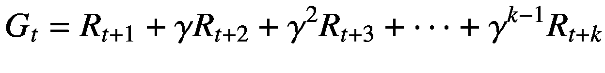

定义了报酬和价值函数后，我们现在可以用数学方法来讨论政策。代理无法控制的环境本身；然而，在某种程度上，代理可以控制自己的行为。因此，策略被定义为在环境的给定状态期间所有动作的概率分布。这在数学上描述如下:

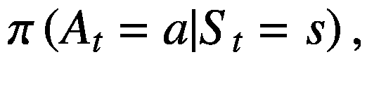

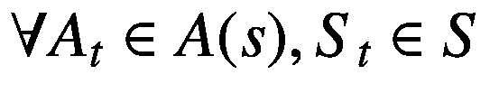

其中 *π* =策略， *S* =状态空间， *A* =动作空间， *A* <sub>*t*</sub> =时步 t 的动作，*S*<sub>*t*</sub>=时步 t 的状态

现在，我们理解了策略引导我们的代理通过一个环境，其中在我们的环境所处的给定状态下某些动作是可能的。政策梯度究竟如何以及在哪里适用？保单梯度法的目的是在假设代理人有保单的情况下使预期报酬最大化。因此，策略由 *θ* 参数化，其中轨迹被定义为 *τ* 。轨迹被广义地定义为当我们遵循一个给定的政策时，我们在一个给定的事件过程中观察到的行动、回报和状态的序列。情节本身指的是在我们达到问题的目标或情节完全失败之前，代理仍在环境中执行一些操作的情况。因此，总报酬在数学上定义为 *r* ( *τ* )，即

![$$ \arg \kern0.5em \max \kern0.5em J\left(\theta \right)={E}_{\pi}\left[r\left(\tau \right)\right] $$](img/480225_1_En_2_Chapter_TeX_Eque.png)

然后，我们应用标准的机器学习方法，其中我们通过梯度下降找到最佳参数来最大化策略梯度。作为一个简短的回顾，函数的梯度表示函数中增长率最大的点，其大小是图形在该方向上的斜率。梯度通常乘以学习率，学习率决定了函数向最优解收敛的速度。然而，简单地说，梯度通常被定义为给定函数的一阶导数。然而，我们如何利用这一点来优化政策选择呢？

## 梯度上升在政策优化中的应用

基于梯度下降的优化在不同的机器学习方法中是常见的，例如线性回归以及用于多层感知器中权重优化的反向传播。然而，梯度上升是我们在这里用来优化我们选择的政策。我们不是试图最小化误差，而是试图*最大化*我们在将使用我们的算法的整个剧集中得到的分数。因此，参数更新应该如下所示:

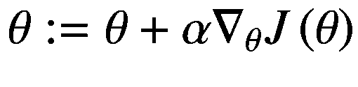

因此，问题的目标可以表述如下:

![$$ {\theta}^{\ast }=\underset{\theta }{\arg \kern0.5em \max }{E}_{\pi \theta}\left[{\sum}_tR\left({s}_t,{a}_t\right)\right] $$](img/480225_1_En_2_Chapter_TeX_Equg.png)

口头上，我们试图选择参数值，使在给定状态下采取的行动产生的回报最大化。在我们建模的特定实例中，我们试图为最大化得分的网络选择权重。因此，我们用数学方法将预期总报酬的导数定义如下:

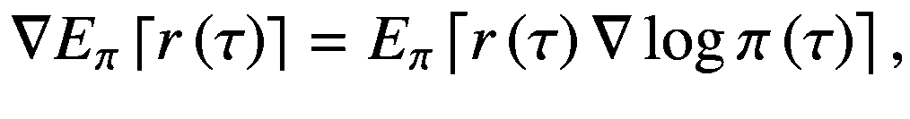

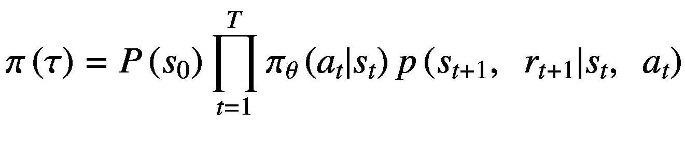

我们采用几何和的原因是，根据第 [1](1.html) 章中关于马尔可夫决策过程的定理，采取的每个行动都是相互独立的。因此，相关的累积奖励应以类似的方式计算。这个过程在轨迹的长度上重复，轨迹在逻辑上遵循给定情节的长度以及相关的奖励、状态和行动。当我们取总报酬的对数时，我们将其数学定义如下:

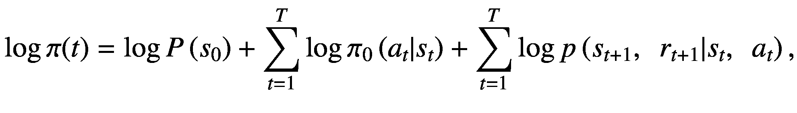

![$$ {\displaystyle \begin{array}{c}\nabla \log \pi (t)=\sum \limits_{t=1}^T\nabla \log {\pi}_0\left({a}_t|{s}_t\right)\to \nabla {E}_{\pi}\left[r\left(\tau \right)\right]\\ {}={E}_{\pi}\left[r\left(\tau \right)\left(\sum \limits_{t=1}^T\nabla \log {\pi}_0\left({a}_t|{s}_t\right)\right)\right]\end{array}} $$](img/480225_1_En_2_Chapter_TeX_Equk.png)

分解所有这些，期望回报的对数仅仅是在给定时间，给定状态下，政策从行动中产生的每个个体回报的对数的累积和，在整个轨迹上相加。理解这一点的重要性以及我们在 RL 中使用的通常被称为“无模型”的算法是，这些方程中隐含地显示了这样一个事实，即我们从未对环境建模，因为我们根本不知道状态的分布。事实上，我们唯一要做的就是奖励。现在，在解释了政策梯度的数学基础之后，让我们接下来将它应用于一个经典的控制问题:车杆。

## 用普通政策梯度解决车杆问题

对于这个问题，我们将利用 Keras，这是一个以能够快速部署神经网络模型而闻名的库。虽然我们将在本章的后面使用 Tensorflow，但是我们将在这里部署的模型将是在“applied _ rl _ python/neural _ networks/models . py”文件中定义的包的一部分。在这里，用户将看到我创建的类，这些类将使在本文内外使用这些解决方案比重复定义这些架构更容易:

```py
class MLPModelKeras():
(Code redacted, please see the source code

    def create_policy_model(self, input_shape):
        input_layer = layers.Input(shape=input_shape)
        advantages = layers.Input(shape=[1])
        hidden_layer = layers.Dense(n_units=self.n_units, activation=self.hidden_activation)(input_layer)
        output_layer = layers.Dense(n_units=self.n_columns, activation=self.output_activation)(hidden_layer)

        def log_likelihood_loss(actual_labels, predicted_labels):
            log_likelihood = backend.log(actual_labels * (actual_labels - predicted_labels) + (1 - actual_labels) * (actual_labels - predicted_labels))
            return backend.mean(log_likelihood * advantages, keepdims=True)

        policy_model = Model(inputs=[input_layer, advantages], outputs=output_layer)
        policy_model.compile(loss=log_likelihood_loss, optimizer=Adam(self.learning_rate))
        model_prediction = Model(input=[input_layer], outputs=output_layer)
        return policy_model, model_prediction

```

用户应该从这部分代码中学到的是，我们正在定义一个用于策略梯度方法的神经网络，特别是在这里，它可以在其他向前发展的问题中重用和重新定义。Keras 的好处是，它允许您快速创建神经网络模型，如果您使用 Tensorflow，这些模型会非常冗长。这个额外的抽象层自动化并减少了在 Keras 中编写相同的神经网络模型所需的代码量。就该模型用于解决这一特定问题而言，用户应查看图 [2-1](#Fig1) 来尝试并理解我们试图用该神经网络解决的问题。


图 2-1

求解小车极点问题的神经网络

输入层表示给定状态下的环境及其方向，两个类表示我们可以采取的相应行动的概率。具体来说，我们将选择正确概率最高的动作，因为这被建模为分类问题。

接下来，让我们看看我们将用来解决这个问题的实际代码，在“chapter2/cart_pole_example.py”中可以找到。虽然 gym 经常更新，但这本书是用 gym 0 . 10 . 5 版编写的。在这个特定的版本中，我建议读者总是全局定义环境变量，然后在不同的函数中访问环境的属性。除此之外，在这里定义“environment_dimension”变量最初会重置环境。现在，让我们把注意力放在“cart_pole_game()”函数上，这个例子中的大部分计算都将在这个函数上进行。具体来说，让我们看看在特定的一集内，当我们还没有输掉游戏时，代码的主体继续:

```py
        state = np.reshape(observation, [1, environment_dimension])
        prediction = model_predictions.predict([state])[0]
        action = np.random.choice(range(environment.action_space.n), p=prediction)
        states = np.vstack([states, state])
        actions = np.vstack([actions, action])

        observation, reward, done, info = environment.step(action)
        reward_sum += reward
        rewards = np.vstack([rewards, reward])

```

从第一章给出的示例文件来看，代码的开头应该是读者熟悉的；但是，也有一些细微的区别。我们在这里定义了一个观察变量，它是每个实验开始时环境的初始化状态。模型产生的预测是概率。我们在这里采取的具体行动是我们可以采取的可能行动的随机样本。然后，状态和动作被附加到一个向量上，我们以后会用到这个向量。像往常一样，我们然后在给定的环境中执行一个动作，产生新的观察结果、当前的奖励，以及我们在该环境中是失败了还是仍然成功的指示。这个过程一直持续到我们输掉游戏，这就把我们带到了“calculated_discounted_reward()”函数。

## 什么是折扣奖励，我们为什么要使用它们？

如前所述，策略梯度方法的目的是利用基于梯度的优化来选择一组行动，在给定目标的环境中实现最佳结果。我们将在给定状态下可以采取的行动的概率分布定义如下:

![$$ {\pi}_{\theta}\left(a|s\right)=P\left[a|s\right] $$](img/480225_1_En_2_Chapter_TeX_Equl.png)

其中 *π* =策略， *θ* =参数， *a* =动作， *s* = *状态*。

由于这是一个基于梯度的优化问题，我们还想定义成本函数，由下式给出:

![$$ J\left(\theta \right)={E}_{\pi \theta}\left[\sum \gamma r\right] $$](img/480225_1_En_2_Chapter_TeX_Equm.png)

上面的等式就是保单得分函数，也就是我们选择的保单的预期/平均回报。因为这是一个基于情节的任务，我们建议用户计算整个情节的折扣奖励。下面的等式给出了如何计算的示例:

![$$ {J}_1\left(\theta \right)={E}_{\pi}\left[{G}_1={R}_1+\gamma {R}_2+{\gamma}^2{R}_3+\cdots +{\gamma}^{k-1}{R}_k\right]. $$](img/480225_1_En_2_Chapter_TeX_Equn.png)

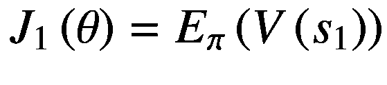

其中 *k* =一集的步数， *G* =总折扣奖励， *γ* =折扣调参， *R* =奖励， *V* =值。

calculate_discounted_reward()函数为产生的每个给定奖励提供一个折扣奖励向量，然后反转该向量，如下所示:

```py
def calculate_discounted_reward(reward, gamma=gamma):
output = [reward[i] * gamma**i for i in range(0, len(reward))]
return output[::-1]

```

给定一些调整参数的值，我们在每一步中提高到不同的幂，我们对奖励打折扣，奖励是给定我们在该步骤中采取的行动从环境中产生的。然后，我们对折扣后的奖励向量进行平均，从而得出该集的成本函数输出。

```py
discounted_rewards -= discounted_rewards.mean()
discounted_rewards /= discounted_rewards.std()
discounted_rewards = discounted_rewards.squeeze()

```

读者将观察到我们对“discounted_rewards”向量执行的以下转换。对于不了解的读者来说，np.array.squeeze()函数采用一个包含多个元素的数组，并将它们连接起来，使得以下情况成立:

[[1, 2], [2, 3]] -> [1, 2, 2, 3]

折扣奖励背后的推理相当简单，因为通过折扣奖励，我们使原本无限的总和变得有限。如果我们不打折扣的奖励，这些奖励的总和将无限增长，因此我们将无法收敛到一个最佳的解决方案。

我们如何计算分数？

在我们的代码中，我们特别利用了“score_model()”函数，该函数使用训练好的模型运行用户指定次数的试验，以得出这些试验次数的平均分数。这允许我们从广义上来看模型是如何表现的，而不是看一个由于偶然因素模型可能表现得更好的试验。我们的得分函数也可以定义如下:

![$$ J\left(\theta \right)={E}_{\pi}\left[R\left(\tau \right)\right] $$](img/480225_1_En_2_Chapter_TeX_Equp.png)

其中 *R* ( *τ* ) =预期未来报酬。

这是如何实现的相当简单；但是，让我们解释如下所示的 score_model()函数:

```py
def score_model(model, n_tests, render=render):
(code redacted, please see github)
            state = np.reshape(observation, [1, environment_dimension])
            predict = model.predict([state])[0]
            action = np.argmax(predict)
            observation, reward, done, _ = environment.step(action)
            reward_sum += reward
            if done:
                break
        scores.append(reward_sum)
    environment.close()
    return np.mean(scores)

```

您会发现，我们不会在每次想要对模型进行评分时都呈现环境标准。我向读者推荐这一点，因为这除了相对缺乏信息之外，还会显著减慢训练过程。如果你真的想渲染这个模型，那么只有当你有了一个你认为已经达到给定问题的基准的模型时，你才应该这么做。

在这个函数中，我们传递一个模型，这个模型是我们之前批量训练的。该模型是专门利用各州及其相应的折扣奖励，以及我们在每个州采取的相应行动来训练的。直观地说，我们正试图训练一个模型，通过在每次迭代中选择一个随机的行动，在预测如何预测会导致一组特定奖励的行动方面变得更加准确。因此，权重将优化，以始终如一地产生给予州的奖励。随着时间的推移，这将产生一个模型，当给定一个特定的状态时，它将理解为了产生一个给定的奖励它将具体做什么。因此，按照问题的框架，我们将最终产生一个模型，该模型将产生我们的得分阈值，因为权重被优化以正确地对状态进行分类，从而随着时间的推移最大化我们的得分。

与所有梯度下降/上升问题一样，我们必须对目标函数进行微分，以便我们可以计算梯度，从而利用梯度来优化权重。因为我们要对概率函数进行微分，所以建议我们使用对数(这就是为什么我们对在 neural_networks/models.py 中后端定义的误差函数使用对数似然损失)。让我们来看看一个似然函数与该函数的对数似然的曲线图(图 [2-2](#Fig2) 和 [2-3](#Fig3) )。

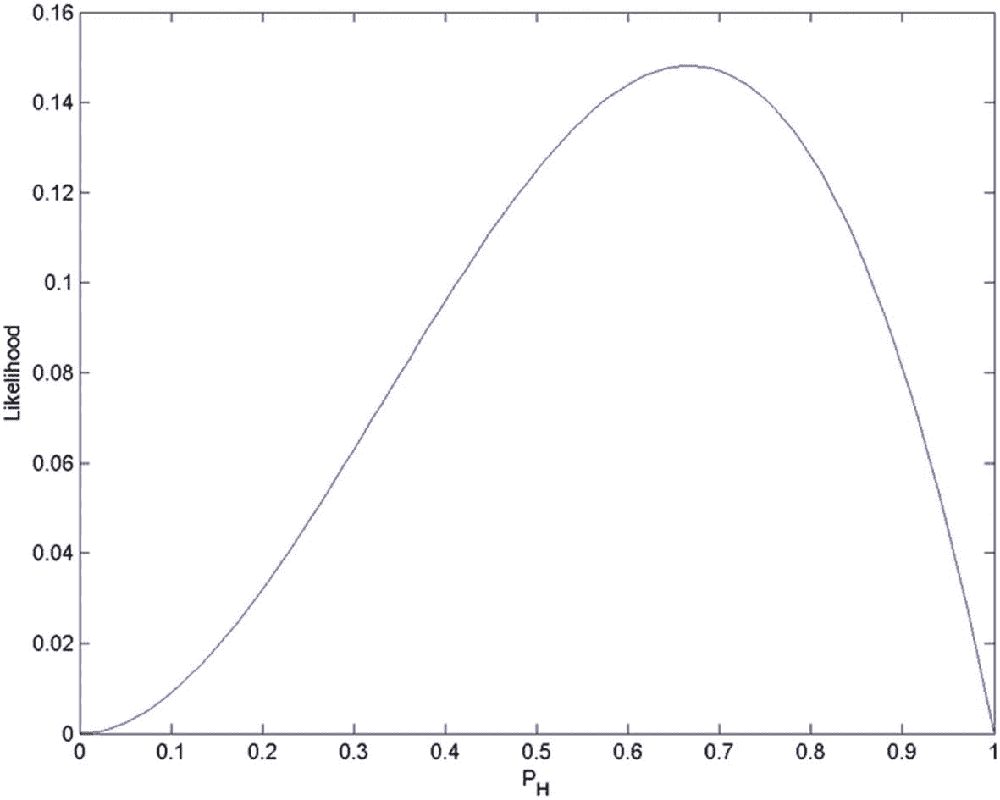

图 2-3

对数似然函数

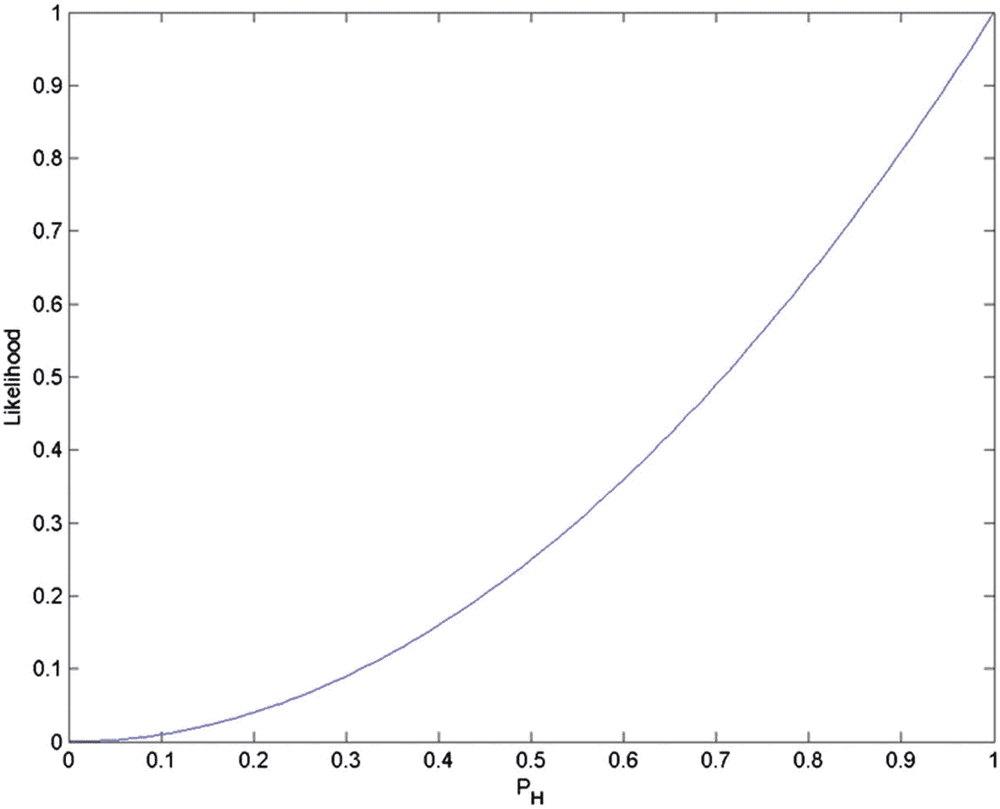

图 2-2

似然函数

得分函数的导数由下式给出:

![$$ {\nabla}_{\theta }J\left(\theta \right)={E}_{\pi}\left[{\nabla}_{\theta}\left( log\pi \left(s,a,\theta \right)\right)R\left(\tau \right)\right] $$](img/480225_1_En_2_Chapter_TeX_Equ1.png)

(2.8)

由于利用了梯度上升，我们最有可能将参数朝**最大化**环境产生的回报的方向移动。

在我们用批量训练更新了参数之后，我们必须将状态、动作和奖励向量重新初始化为空。为了总结 cart_pole_game()函数所做的工作，在详细讨论了这一点之后，流程如下:

1.  初始化变量，这些变量将通过在各自的状态下与环境交互来填充。

2.  在给定的情节中，执行动作直到游戏失败。给定一个状态，使用模型预测最佳行动。附加状态、在这些状态中采取的行动以及在该状态中产生的奖励。

3.  计算折扣奖励，然后使用这些奖励训练一批状态，行动和奖励。

4.  对训练好的模型进行评分，并重复，直到收敛到用户确定的性能阈值。

随着我们的代码被充分解释，我们现在可以执行它并观察结果。当用户执行代码时，应该会看到如图 [2-4](#Fig4) 和 [2-5](#Fig5) 所示的结果。

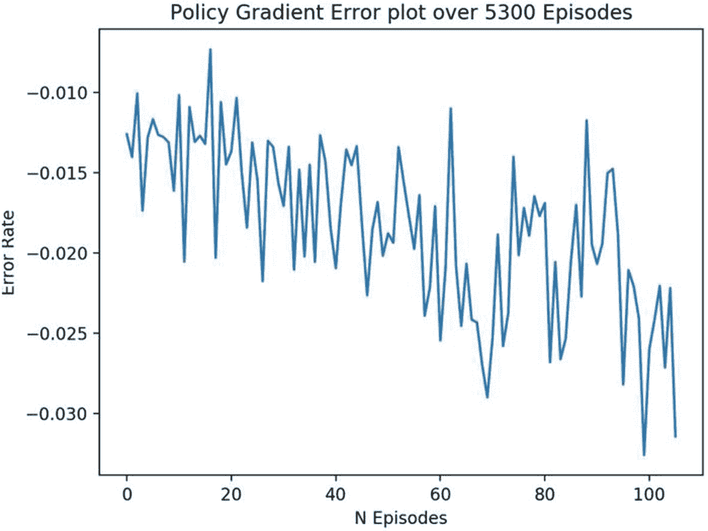

图 2-5

政策梯度问题的误差图

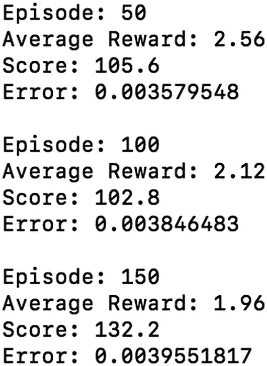

图 2-4

策略梯度问题的输出示例

这个特定的解决方案在多次实验中收敛到大约 5000–6000 集，我们的目标是 190 集。我们现在已经完成了一个情节问题的例子和一个离散问题空间的例子。现在我们知道了我们可以利用普通政策梯度的问题类型，那么在什么情况下我们不能利用政策梯度呢？

## 政策梯度的缺点

在这个阶段，对强化学习的一个更大的批评是政策梯度和强化学习的抽样效率。采样效率是指我们的算法能够通过仅使用产生最重要的学习信息的状态来更快地学习的程度。具体来说，政策梯度不区分在一个事件中采取的单个行动。也就是说，如果我们在一个事件中采取的行动导致了很高的回报，即使这些行动的一些子集非常次优，我们也可以得出结论，这些行动都是好的。我们只能通过通常迭代非最优策略来学习如何选择最优策略。重要的抽样调查缓解了这一问题；然而，这是一种在非策略学习中使用的技术，我们将在后面讨论。然而，这一缺点并不仅限于政策梯度。除此之外，策略梯度可能倾向于收敛于局部最大值，而不是像许多基于梯度下降的方法那样收敛于全局最大值。这也增加了训练合适模型的难度。为了解决其中的一些问题，我们可以选择在更细粒度的级别上进行更新，而不是像前面所示的在普通策略梯度中采用的零星方案。这就引出了我们的下一个话题，近似策略优化。

## 近似政策优化(PPO)和行动者批评模型

PPO 专门处理陷入局部最大值的政策梯度趋势，通过对目标函数施加惩罚，然后在这个新改革的梯度下降上利用梯度下降。使得该等式看起来如下:

![$$ \underset{\theta }{\max }{\hat{E}}_t\left[\frac{\pi_{\theta}\left({a}_t|{s}_t\right)}{\pi_{\theta_{old}}\left({a}_t|{s}_t\right)}{\hat{A}}_t\right]-\beta {\hat{E}}_t\left[ KL\left[{\pi}_{\theta_{old}}\Big(\cdot |{s}_t\right),\kern0.5em {\pi}_{\theta}\left(\cdot |{s}_t\right)\right]\Big] $$](img/480225_1_En_2_Chapter_TeX_Equ2.png)

(2.9)

其中 *β* =调谐参数，KL = KL 散度，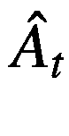 =优势函数。

这种适应性惩罚背后的基本直觉是，我们利用新旧策略之间的 KL 差异，这将在一集内的每次迭代中改变。如果 KL 散度的值高于目标值 *δ* ，我们缩小调谐参数。然而，如果它低于目标值 *δ* ，我们扩展我们愿意搜索不同参数的区域。添加惩罚的好处是，它确保我们搜索参数来定义策略的区域明显更小，并基于正确程度在比情节更细粒度的级别上进行调整。这样的话，一个情节中的不好的行为将会直接受到惩罚，而不是被其他可能是好的决定平均对待。这种逐步而非阶段性的变化是行动者-批评家模型的关键组成部分，也是 PPO 的基础。在这种情况下，与 KL 散度相关的调整参数是政策作为参与者的批评家模型。

优势函数将是演员-评论家模型的关键组成部分，我们利用它来代替算法决策过程的价值函数。这里的推理是因为价值函数具有高度可变性，而优势函数更明显是凸函数。梯度优化背后的直觉是，我们的参数将在优势函数大于 0 的方向上优化，并将远离梯度小于 0 的参数选择。接下来，我们定义将使用的优势函数，而不是价值函数:

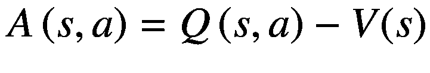

其中 *Q* ( *s* ， *a* ) =状态 s 中动作 a 的 Q 值， *V* ( *s* ) =状态 s 的平均值

行动者-批评家模型分为两种策略:(1)行动者优势批评家(A2C)和(2)异步优势行动者-批评家(A3C)。这两种算法都像我们简要描述的演员-评论家模型一样工作；然而，唯一的区别是 A3C 不同时(在每次迭代结束时)更新每个 actor 的全局参数，因此有了异步描述。在这种情况下，A2C 的训练会更快。

然而，让我们更仔细地检查这个算法，将它应用到一个比 cart pole，Super Mario Bros 稍微难一点的游戏中，并且更直接地求解这个解。

## 实现 PPO，解决超级马里奥兄弟。

对于这个模型，我们将利用我创建的一些包中提供的代码以及开源库。虽然游戏是可以改变的，但是用户也应该可以自由地尝试利用其他问题来解决这个问题。由于与 A3C 相关的培训时间，我将利用 A2C。除此之外，我将简要地向用户介绍如何设置用于培训的 Google Cloud 实例，这是任何像这样基于强化学习的任务的推荐方法。

### 超级马里奥兄弟概述。

*超级马里奥兄弟*(图 [2-6](#Fig6) )是一款相对简单但经典的视频游戏，它允许用户看到强化学习的力量，而不会增加我们将在本书稍后的其他视频游戏环境中看到的一些复杂性。玩家有许多可以利用的动作，列在 [`https://github.com/Kautenja/gym-super-mario-bros/blob/master/gym_super_mario_bros/actions.py`](https://github.com/Kautenja/gym-super-mario-bros/blob/master/gym_super_mario_bros/actions.py) 中。

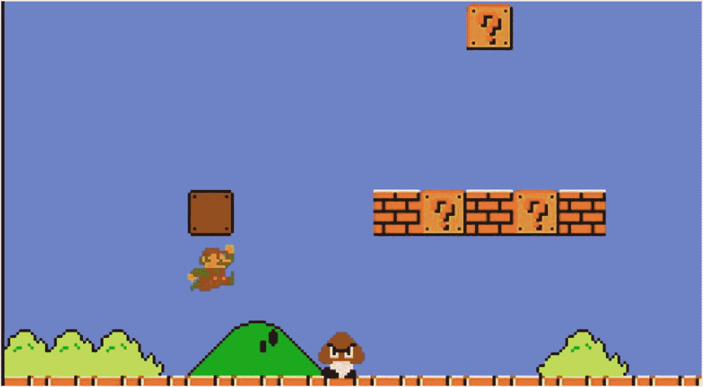

图 2-6

超级马里奥兄弟。屏幕截图

每个关卡的目标都是一样的:我们试图避开所有的障碍和敌人，这样我们就可以在最后摸到旗杆来赢得关卡。旗杆将永远在关卡的最右端，尽管我们可以获得蘑菇和短暂无敌等其他奖励，但这些都不是首要目标。对于这个例子，我们不会特别担心大多数用户的单独目标，即到达旗帜，因为这可能很难训练一个模型，并且只是一个额外的奖励。

### 安装环境包

对于这个特定的环境，我们鼓励用户使用 gym-super-mario-bros，可以使用以下命令安装它:

```py
pip3 install gym-super-mario-bros

```

超级马里奥兄弟不是健身房套餐里提供的标准环境，所以需要创造一个环境。幸运的是，这个开源包完成了这项任务，所以我们可以专注于这个问题的模型架构。这次我们将直接使用 Tensorflow，而不是 Keras，但是将从“neural_networks/models.py”目录中访问一个类。

### 存储库中代码的结构

与前面的例子不同，从这一点开始，读者应该预料到他们将需要引用模型架构，因为它是在存储库中的不同文件中定义的，例如在“neural_neworks”和“algorithms”目录下。在这个具体的例子中，代码的结构如下:

*   A2C 演员-评论家模型在“models.py”中被定义为一个类。

*   “algorithms/actor _ critic _ utilities”包含 Model 和 Runner 类。包括 ActorCriticModel 在内的这些都是在这个文件中定义的 learn_policy()函数中实例化的。这是大部分计算将在其中结束的函数。

这些类和函数取自 OpenAI 发布的基线库，并稍作修改。这背后的原因是，与其手动操作，不如让读者理解**为什么**和**如何**这些模型的工作原理，而不是简单地调用它们。因此，让我们首先讨论我们正在使用的模型及其原因。

### 模型架构

对于这个问题，我们将把它作为一个图像识别问题来处理。因此，我们将使用简单的 LeNet 架构，这是一种卷积神经网络架构。这些设备因图像识别而广受欢迎，最初是由 Yann LeCun 在 20 世纪 80 年代末开发的。图 [2-7](#Fig7) 显示了典型的 LeNet 架构。

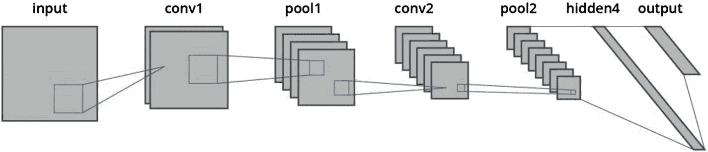

图 2-7

LeNet 体系结构

我们将把每一帧视为一幅图片，对该帧进行卷积以创建特征图，然后不断减少这些特征图的维数，直到我们达到 softmax 编码的输出向量，我们将从该向量中随机选择动作，然后最终以与我们在之前的普通策略梯度示例中相同的方式对该批进行训练。读者现在将会看到详细描述 ActorCriticModel()类的代码，我们已经创建了这个类，它包含了模型架构和相关的属性:

```py
        self.distribution_type = make_pdtype(action_space)
        height, weight, channel = environment.shape
        environment_shape = (height, weight, channel)
        inputs_ = tf.placeholder(tf.float32, [None, environment_shape], name="input")

        self.distribution_type = make_pdtype(action_space)
        height, weight, channel = environment.shape
        environment_shape = (height, weight, channel)
        inputs_ = tf.placeholder(tf.float32, [None, environment_shape], name="input")
        scaled_images = tf.cast(inputs_, tf.float32)/float(255)

        layer1 = tf.layers.batch_normalization(convolution_layer(inputs=scaled_images,
filters=32,
kernel_size=8,
strides=4,
gain=np.sqrt(2)))

(code continued later)

```

在我们谈论超级马里奥兄弟级别的演员-评论家模型的实现之前，让我们简单地讨论一下我们应该做什么来预处理我们的图像数据，以及它需要如何通过 CNN。图像通常为 256 位，包含 3 个维度。当我们将图像处理成 python 矩阵时，这意味着最初产生的矩阵应该是 m x n x 3 的维度，其中 m 和 n 分别是长度和宽度，矩阵的每个维度代表一个颜色通道。具体来说，我们通常期望颜色通道代表红色、绿色和蓝色。在超级马里奥的例子中，我们期望矩阵如图 [2-8](#Fig8) 所示。

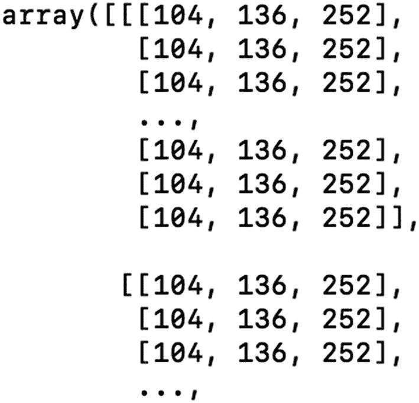

图 2-8

超级马里奥图像矩阵示例(预处理前)

为了最初降低图像的复杂性，我们将对它们进行灰度化，使得最初的三维矩阵变成一维矩阵。256 位中的每一位都代表颜色的亮度，1 代表黑色，256 代表白色。因为 python 数据结构是按 0 索引的，所以 255 是上限，同样，这也是我们缩放输入图像的依据。既然我们已经关注了如何对数据进行预处理，接下来我们将讨论第一个卷积层。

读者会注意到，我们在这里制作的图层利用了一个函数，该函数在 Tensorflow 固有的卷积图层函数周围使用了一个辅助函数。除此之外，我们在每个卷积层上利用 batch_normalization()。如前所述，我们将创建的特征地图会越来越小。从理论上讲，剩余的数据是对分类目的最有用的像素。现在，我们继续前进，直到我们将所有的特征图展平成一个数组，然后我们用它来计算 *V* ( *s* )。该函数的输出以及其他重要值被定义为属性，我们将在该模型的训练过程中调用这些属性。从 ActorCriticModel 开始，让我们讨论 Model()类，其代码如下所示:

```py
class Model(object):
    def __init__(self, policy_model, observation_space, action_space, n_environments,
                 n_steps, entropy_coefficient, value_coefficient, max_grad_norm):

(code redacted, please see github)
        train_model = policy_model(session, observation_space, action_space, n_environments*n_steps, n_steps, reuse=True)
        error_rate = tf.nn.sparse_softmax_cross_entropy_with_logits(logits=train_model.logits, labels=actions_)
        mean_squared_error = tf.reduce_mean(advantages_ * error_rate)

        value_loss = tf.reduce_mean(mse(tf.squeeze(train_model.value_function) ,rewards_))
        entropy = tf.reduce_mean(train_model.distribution_type.entropy())
        loss = mean_squared_error - entropy * entropy_coefficient + value_loss * value_coefficient

(code continued later)

```

在代码中，我们从“policy_model()”开始，它实际上是我们前面讨论过的 ActorCriticModel()类。在它被实例化并通过这个类之后，我们从单个迭代中获取错误率，就像它在 Model()类中发生一样。读者立即看到的应该是熟悉的利用 Tensorflow 的标准神经网络训练。接下来，让我们检查一下 Runner()类

```py
class Runner(AbstractEnvRunner):

    def __init__(self, environment, model, nsteps, total_timesteps, gamma, _lambda):
        super().__init__(environment=environment, model=model, n_steps=n_steps)

        self.gamma = gamma
        self._lambda = _lambda
        self.total_timesteps = total_timesteps

    def run(self):
        _observations, _actions, _rewards, _values, _dones = [],[],[],[],[]

        for _ in range(self.n_steps):
            actions, values = self.model.step(self.obs, self.dones)
            _observations.append(np.copy(self.observations))
            _actions.append(actions)
            _values.append(values)
            _dones.append(self.dones)
            self.observations[:], rewards, self.dones, _ = self.environment.step(actions)
            _rewards.append(rewards)

(code continued later!)

```

读者会注意到，我们已经在前面的代码部分定义了一些我们在上一个例子中看到的变量。具体来说，我们定义伽玛，它将被用作一个折扣因子。同样，与网络使用较大值相比，梯度下降使用较小的梯度来优化权重要容易得多。当我们通过在这个环境中允许我们采取的最大数量的步骤进行每个迭代时，我们附加到观察、动作、值、奖励和布尔项，该布尔项确定我们是否已经失败或者仍然在播放当前的剧集。

```py
(code redacted, please see Github)
delta = _rewards[t] + self.gamma * nextvalues * nextnonterminal - _values[t]
            _advantages[t] = last_lambda = delta + self.gamma * self._lambda * nextnonterminal * last_lambda

        _returns = _advantages + _values
        return map(swap_flatten_axes, (_observations, _actions, _returns, _values))

```

在代码中，我们移动到函数的末尾，在那里我们计算 delta，或者每个单独的步骤之间关于回报、lambda、回报等的差异。这最终将我们引向“train_model()”函数，如下所示:

```py
    model = ActorCriticModel(policy=policy,
           obsevration_space=observation_space,
           action_space=action_space,
           n_environments=n_environments,
n_steps=n+steps,
entropy_coefficient=entropy_coefficient,
value_coefficient=value_coefficient,
max_grad_norm=max_grad_norm)

    model.load("./models/260/model.ckpt")

    runner = Runner(environment,
                    model=model,
                    n_steps=n_steps,
                    n_timesteps=n_timesteps,
                    gamma=gamma,
                    _lambda=_lambda)

 (code redacted please see github)

```

由于读者已经了解了这些函数，现在，给定我们在文件头和 train_model()函数中定义的超参数，它们将被实例化。从这一点来看，读者看到的过程应该反映了前一个例子中关于训练模型的过程。既然我们已经给出了这个例子的适当概述，那么让我们讨论一下尝试训练这样一个模型的挑战以及我们观察到的结果。

## 应对更困难的强化学习挑战

推车极点问题和 RL 中的其他经典控制问题相对容易，因为无论选择哪种方法都不会花费过多的时间来收敛到最优解。然而，对于更抽象的问题，尤其是类似于这个例子的问题，任务的训练时间会呈指数增长。例如，A2C 和 A3C 的一些实现已经被应用到刺猬索尼克身上，但它们在 10 个小时后仍然不能完成一个关卡。尽管这个例子中的复杂性在《超级马里奥兄弟》中并不存在，但同样的一点应该牢记在心。因此，对于这样的问题，我们需要使用云解决方案。虽然我们将在稍后讨论 AWS 以及如何使用它，但我认为读者学习其他框架也很重要。正因为如此，我们将与谷歌云合作。作为一个额外的奖励，他们仍然给新用户免费积分，这将使使用这些代码变得非常容易。

任何数据科学家或机器学习工程师都将达到这样一个点，即他们想要制作的解决方案应该利用云资源进行生产和实验。AWS 和 Google Cloud 是读者应该熟悉的两个解决方案，它们不仅会让读者认识到将代码投入生产是有意义的。图 [2-9](#Fig9) 给出了一个谷歌云仪表板的例子。

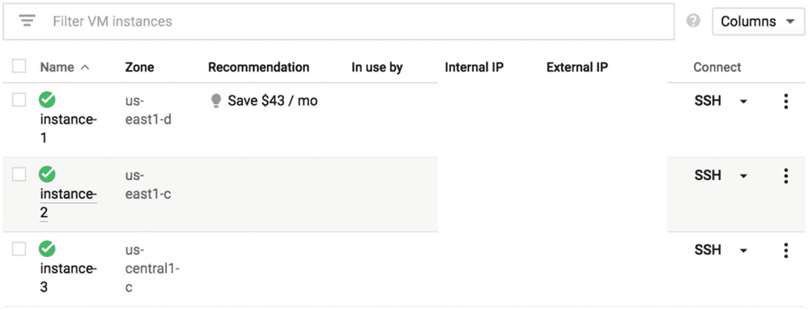

图 2-9

谷歌云仪表板示例

读者应该预料到，当点击 SSH 图标时，他们将加载一个(这里假设是 Linux)终端，这将需要一些标准安装(安装 Git、不同的 python 包等)。).用户在这里做的任何事情都不会与他们在本地机器上做的事情有太大的不同；然而，假设您使用的是 Linux，那么会有一些语法差异。

本节的重要部分是理解您应该在云资源上而不是在您的本地机器上培训这样的解决方案。

现在让我们看看实际运行游戏本身的主函数:

```py
def play_super_mario(policy_model=ActorCriticModel, environment=environment):
    (code redacted, please see github)
        observations = environment.reset()
        score, n_step, done = 0, 0, False

        while done == False:

            actions, values = model.step(observations)
            import pdb; pdb.set_trace()

            for action in actions:

                observations, rewards, done, info = environment.step(action)
                score += rewards
                environment.render()
  n_step += 1

        print('Step: %s \nScore: %s '%(n_step, score))
        environment.close()

```

有了这最后一段代码，我们已经回顾了所有必要的类。这里我们应该讨论的最后一部分是顺利实现培训流程。为此，我建议用户熟悉 docker。

## Dockerizing 强化学习实验

当你在训练一个强化学习代理时，你可能不想坐在那里盯着代理通过优化它的策略来熟悉它自己的环境，而且在你用来训练它的许多小时里，你肯定仍然需要你的计算机。因此，这就是我们利用云资源的原因。然而，仅仅在云环境中运行应用程序*是不够的。在 AWS 或 Google Cloud 上，如果你不在后台运行这个过程，连接就会中断，原因可能是你的电脑死机、死机等。，您将丢失所有的进度，并且必须从最后一个检查点或者从头开始，这取决于您是否修改了代码以沿着某些检查点保存。因此，使用 docker 容器很重要。*

Docker 容器是一个有趣的解决方案，它允许您为从终端运行的应用程序创建一个虚拟环境。简而言之，您可以创建一个虚拟“实例”,快速启动您的应用程序，并从这个虚拟环境中运行它。另一个额外的好处是，docker 包括几个命令，可以帮助您运行这样的进程，并在进程停止时重新启动它。在我们在这里执行的任务的上下文中，一旦我们认为我们已经训练了我们的代理足够长的时间，我们可以终止该过程，之后检查我们的代理的进度，然后如果我们认为有必要，返回训练。首先，让我们看一个 Docker 文件的例子。

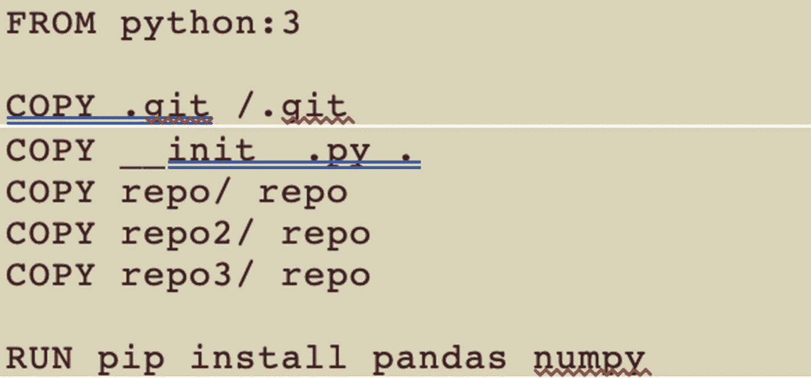

图 2-10

Docker 文件示例

图 [2-10](#Fig10) 是一个虚拟 Docker 文件，我们在其中看到了三个命令，我们将对其进行回顾。具体来说，它们是“从”、“复制”和“运行”“FROM”是我们定义的 python 版本，我们希望这个容器在这个版本中运行。尽管本书中有一些使用 python2 的例子，但所有的例子都应该与 python3 兼容，并且 python2 在 2020 年后将不再受支持。接下来，“COPY”表示存储库中我们想要使用的特定文件。最后，我们开始“运行”,在那里我们专门安装我们需要的 python 包。

值得注意的是，当实例化一个新容器时，必须在 docker 文件中指明所有必需的文件、存储库和 python 模块。如果您不这样做，您的 docker 容器将无法执行代码。

我们通常使用以下命令创建一个容器:

```py
"sudo docker –t build . [container name] . "

```

假设 docker 已经安装，并且我们正在复制的文件没有丢失，这应该会创建一个指定名称的 docker 容器。在这一步之后，建议用户运行以下命令来启动该文件。

```py
"sudo docker run --dit --restart-unless-stopped python3 –m path.to.file"

```

## 实验结果

这主要是为了说明的目的；然而，在解决更困难的强化学习问题时，强调这一点是很有用的—**你必须花大量时间训练你的代理。**与一些更普通的机器学习例子不同，更类似于利用深度学习的困难的自然语言处理问题，训练将需要很长时间才能有效。在这种特殊的情况下，代理通常会耗尽时间，因为它会在相对较早的时候卡在一些障碍物上，如管道，或者它会运气不佳，相对较快地被像古姆巴这样的敌方战斗人员杀死。当代理人被训练了 5 个小时，我们一般观察到它的表现明显更好，最具体的通知是，它现在能够避免死于任何敌人的空间。然而，它确实会被障碍物困住，而且如果它被卡住了，也不太可能原路返回去寻找替代的前进路径。最成功的代理人是那些接受过 12 小时以上培训的人；然而，这个解决方案通常还没有完成，也不一定是完美的。代理的大部分成功似乎往往取决于它在关键点采取的行动，特别是适当的时间跳跃，它倾向于避免杀死敌人，因为它更喜欢尝试不落入关卡的漏洞。在某些场合，这让马里奥赢了；然而，需要注意的是，这是游戏最简单的关卡之一。

## 结论

在本章之后，读者应该能够自如地应用一些基本的和一种更高级的强化学习算法，这些算法基于情节和时间差分方法。本章的关键要点如下:

*   **了解你正在处理的问题类型**-与大多数机器学习问题类似，不同类型的数据有不同的模型。你正在处理一个大的状态空间吗？你的任务是阶段性的吗？如果不是，你真的想要/需要将算法的学习建立在更精细的步骤上吗？在你着手解决之前，花点时间考虑这些问题。

*   **在困难问题上训练 RL 解决方案是耗时的，所以在云资源上训练**-类似于一些高级 NLP 问题，读者会观察到本地机器不是训练模型的地方。尽管在本地机器上编写大部分代码显然是有意义的，但是还是要在其他地方使用它们。

随着第一类算法的完成，我们将继续处理不同的基于价值的方法，如 Q 学习和深度 Q 学习。在接下来的章节中，我们将再次采用同样的先例，先处理一个更简单的问题，然后在一个更大的环境中处理一个更复杂的问题。**