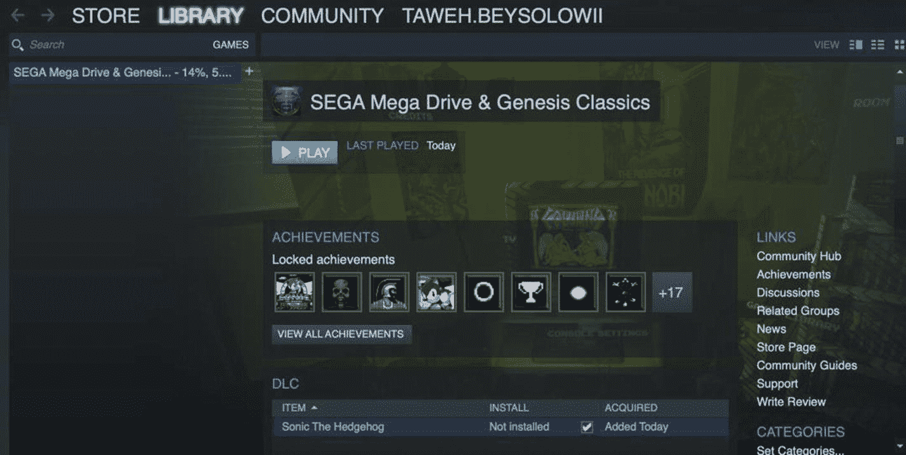
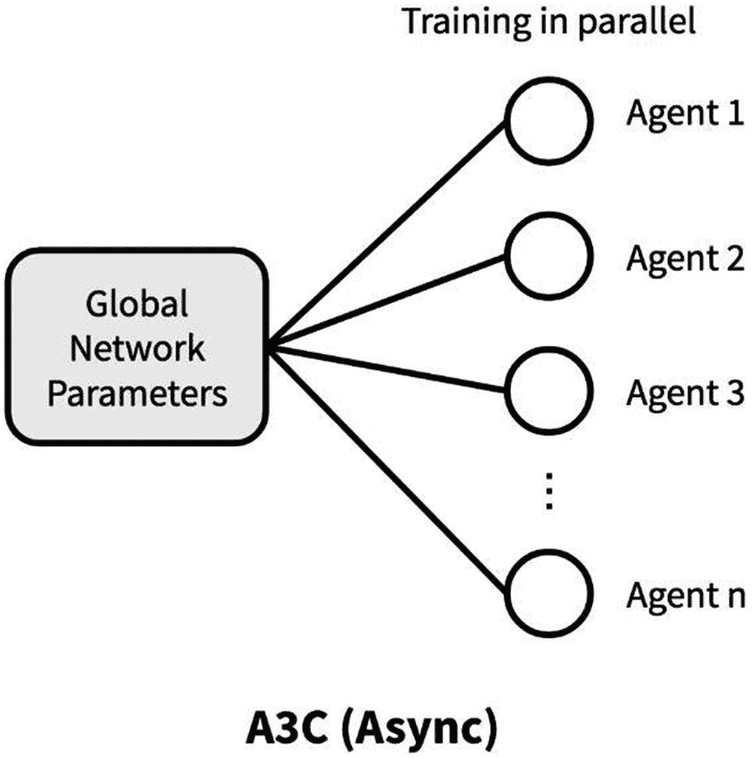
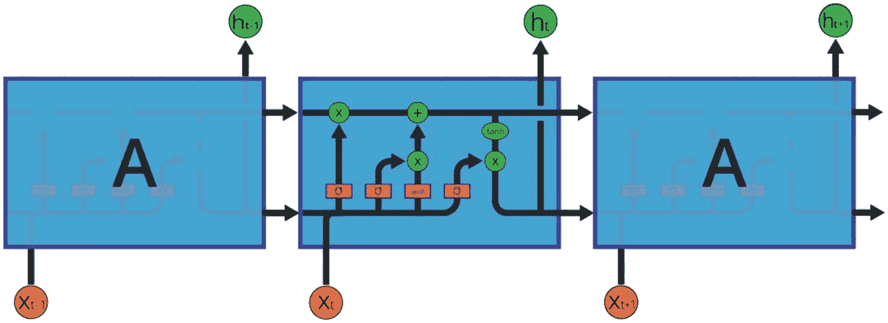
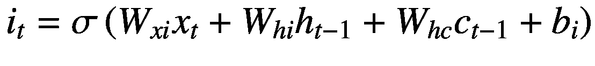
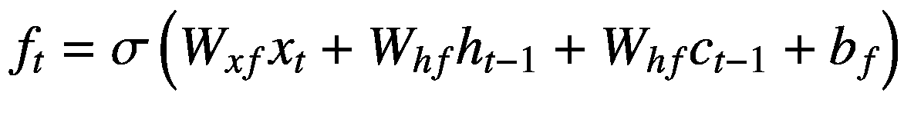
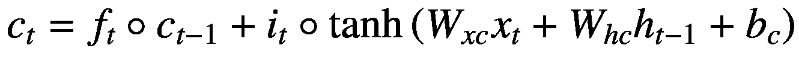
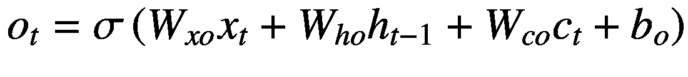
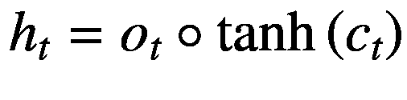

# 五、定制开放式强化学习环境

对于我们的最后一章，我们将关注 OpenAI 的 gym 包，但更重要的是试图理解我们如何创建自己的定制环境，以便我们可以处理更多的典型用例。这一章的大部分内容将集中在我对 OpenAI 编程实践的建议，以及我将如何编写该软件大部分内容的建议上。最后，在我们完成创建环境之后，我们将继续关注解决问题。对于这个实例，我们将集中于尝试创建和解决一个新的视频游戏。

## 刺猬索尼克概述

对于那些不熟悉的人来说，*刺猬索尼克*(图 5-1 )是另一款经典游戏，通常被认为是*超级马里奥兄弟*的对手。游戏的概念是你扮演一只刺猬，从关卡的一边跑到另一边，目的是躲避或杀死敌人并收集戒指。如果玩家受到攻击，他们会失去所有的戒指。如果他们被 0 环攻击，他们会失去一条命。如果他们失去了所有的生命，游戏结束。我们现在不会关注任何有 boss 战的关卡，而是关注一个简单的入门关卡(1 级)。因为它与这个任务有关，我们的目标将是训练代理人成功地通过关卡而不死亡。


图 5-1

刺猬索尼克截图

## 下载游戏

首先，用户需要创建一个 Steam 帐户，然后将 Steam 下载到他们的本地机器上，如果他们还没有这样做的话。对于那些不熟悉的人来说，Steam 是一种游戏流媒体服务，允许玩家购买和租赁游戏，而不必获得特定的主机。在这种情况下，我们将购买*刺猬索尼克*(4.99 美元)。用户下载游戏后，一旦登录 Steam 桌面客户端，应该会看到以下屏幕(图 5-2 )。



图 5-2

蒸汽仪表板

安装游戏后，读者应该会看到播放按钮，表明初步设置已经完成。然而，有一些锅炉板，我们需要做的复古图书馆，我们将带领读者通过现在。Retro 是一个专门处理旧视频游戏并使它们与 OpenAI 兼容的库。这将解决我们可能会遇到的许多繁重的工作，并使过程变得更加简单。不管怎样，让我们相应地下载我们需要的文件。首先，用户应该在这个 URL 下载并克隆这个库: [`https://github.com/openai/retro`](https://github.com/openai/retro) 。

克隆这个存储库之后，我们需要创建一个虚拟环境。对于那些不熟悉的人来说，虚拟环境是一种创建特定 python 安装的独立实例以及与之相关的相对依赖性的方式。这样做的好处是，对于孤立的任务或项目，我们可以创建只包含它们所使用的依赖项的 python 安装。一旦安装了 virtualenv，我们可以通过在 bash 终端中输入以下命令来实例化它:

```py
"sudo mkdir virtual_environments && cd virtual_environments"
"virtualenv [environment name]/python3 –m venv [environment name]"

```

这些命令分别创建虚拟环境目录，将 cd 放入其中，然后创建虚拟环境。完成之后，用户应该用 cd 进入本地克隆的 retro 库所在的目录。之后，他们应该键入以下命令:

```py
"python –m retro.import.sega_classics"

```

该命令将 sega_classics.py 文件下的游戏各自的 rom 写入我们的本地环境。ROM 指的是只读存储器，通常在这种情况下指的是存储视频游戏的存储器，视频游戏通常通过盒式磁带分发，这是光盘和 DVD 出现之前的标准。现在我们已经下载了游戏及其各自的 rom，让我们继续学习如何使用 retro 和 python 创建自定义环境。

## 为环境编写代码

当回顾《超级马里奥兄弟》和《毁灭战士》的例子时，读者可以参考这样一个事实，即我们使用了一个利用了一些相同技术的自定义库。首先，让我们分析第五章/create_environment.py 中的功能，并详细描述每个功能的作用。首先，让我们看看如下所示的身体功能:

```py
def create_new_environment(environment_index, n_frames=4):

 (code redacted, please see github!)
    print(dictionary[environment_index]['game'])
    print(dictionary[environment_index]['state'])

    environment = make(game=dictionary[environment_index]['game'],
    state=dictionary[environment_index]['state'],
    bk2dir="./records")

    environment = ActionsDiscretizer(environment)
    environment = RewardScaler(environment)
    environment = PreprocessFrame(environment)
    environment = FrameStack(environment, n_frames)
    environment = AllowBacktracking(environment)
    return environment

```

创建环境的过程相当简单，我们将参数从“retro_contest”模块传递给 make()函数。这创建了一个环境，然后我们从各种功能中添加结构，直到我们最终返回我们定制和格式化的环境。然而，首先让我们谈谈我们环境中最重要的一个方面，那就是创造和定义我们可以在其中采取的行动。

```py
class PreprocessFrame(gym.ObservationWrapper):

def __init__(self, environment, width, height):

        gym.ObservationWrapper.__init__(self, environment)
        self.width = width
        self.height = height
        self.observation_space = gym.spaces.Box(low=0,

high=255,

shape=(self.height, self.width, 1),

dtype=np.uint8)

    def observation(self, image):
        image = cv2.cvtColor(image, cv2.COLOR_RGB2GRAY)
        image = cv2.resize(image, (self.width, self.height), interpolation=cv2.INTER_AREA)
        image = image[:, :, None]
        return image

```

就像我们在处理 2D 或 3D 视频游戏时遇到的大多数问题一样，我们本质上是在处理一个计算机视觉问题的排列。因此，我们需要从预处理图像开始，这样我们可以减少输入大小或我们将使用的神经网络(或其他方法)，然后返回灰度图像的单个一维矩阵。对于前几章的读者来说，其中的大部分应该是熟悉的，但是对于后代，我们从实例化 PreprocessFrame()类开始，该类首先接受 ObservationWrapper 作为其唯一的参数。读者已经在前面的每个例子中使用过这种方法，OpenAI Gym 源代码证明了这一点，如下所示:

```py
class ObservationWrapper(Wrapper):

    def reset(self, **kwargs):
        observation = self.env.reset(**kwargs)
        return self.observation(observation)

    def step(self, action):
        observation, reward, done, info = self.env.step(action)
        return self.observation(observation), reward, done, info

    def observation(self, observation):
        raise NotImplementedError

```

这是库的核心，我们在这里步进、重置并生成环境的当前状态。回到 PreprocessFrame()类，我们首先定义要输出的图像的环境、宽度和高度。从这三个论点，我们也定义了观察空间，我们将有能力操纵我们的代理人。为此，我们利用体育馆的 Box()类。这被简单地定义为 R <sup>*n*</sup> 中欧几里得空间的一个元素。在这种情况下，我们将该框的边界定义为 0 和 255，表示给定像素的白度，其中 0 表示完全没有白色(黑色)，255 表示完全没有黑暗(白色)。observation()函数执行单个帧的实际灰度调整并输出，以便我们可以对其进行分析。接下来，让我们进入下一个类 ActionsDiscretizer()创建环境的核心部分。

```py
class ActionsDiscretizer(gym.ActionWrapper):
def __init__(self, env):
        super(ActionsDiscretizer, self).__init__(env)
        buttons = ["B", "A", "MODE", "START", "UP", "DOWN", "LEFT", "RIGHT", "C", "Y", "X", "Z"]
        actions = [['LEFT'], ['RIGHT'], ['LEFT', 'DOWN'], ['RIGHT', 'DOWN'], ['DOWN'],
                   ['DOWN', 'B'], ['B']]
        self._actions = []

```

从类的实例化开始，读者应该直接看到按钮和动作数组。根据您是为键盘还是为特定的游戏控制台设计环境，按钮会有所不同。这些按钮对应于 Sega Genesis 控制器上所有可能的按钮。

也就是说，不是每个可能的动作都会映射到每个按钮，尤其是在这个版本的刺猬索尼克的情况下。尽管在游戏的更新版本中加入了某些高级功能，但最初的游戏相当标准，因为 Sonic 可以向左或向右行走/奔跑，并可以使用“B”按钮跳跃。接下来，让我们看看如何创造一个特定的行动空间。

```py
      for action in actions:
            _actions = np.array([False] * len(buttons))
            for button in action:
                _actions[buttons.index(button)] = True
            self._actions.append(_actions)
        self.action_space = gym.spaces.Discrete(len(self._actions))

```

对于动作数组，我们遍历“actions”数组中的每个动作，然后创建一个名为“_actions”的新数组。这应该是一个尺寸为 1 x N 的数组，其中 N 是控制器上按钮的数量，每个索引都是 false。现在，对于动作中的每个按钮，我们希望将其映射到一个数组中，其中一些条目为假，另一些为真。最后，将其作为“self”变量的属性分配给“action_space”。我们已经在其他时候讨论过比例奖励，所以没有必要回顾这个函数。然而，我们应该讨论一个重要的功能，特别是在类似于这个的游戏/环境中。

```py
class AllowBacktracking(gym.Wrapper):
def __init__(self, environment):
        super(AllowBacktracking, self).__init__(environment)
        self.curent_reward = 0
        self.max_reward = 0

    def reset(self, **kwargs):
        self.current_reward = 0
        self.max_reward = 0
        return self.env.reset(**kwargs)

```

AllowBacktracting()类相当简单，因为对于 2D 环境，我们最终必须通过后退到达该级别的末尾。尽管如此，有时，如果我们偶尔(无论多么微小)回溯我们的步骤，然后选择另一套行动，可能会有更好的道路可走。然而，我们不想鼓励奖励结构过多地这样做，所以我们将以下阶跃函数分配给环境:

```py
    def step(self, action):
        observation, reward, done, info = self.environment.step(action)
        self.current_reward += reward
        reward = max(0, self.current_reward - self.max_reward)
        self.max_reward = max(self.max_reward, self.current_reward)
        return observation, reward, done, info

```

读者从这个函数中得到的重要信息是，我们将奖励值指定为 0 或 0 以上。在这种情况下，如果它导致一个可怜的回报，我们不会回去。完成所有的样板文件后，让我们继续讨论我们将具体使用什么模型以及为什么。

## A3C 演员-评论家

读者会记得，当我们试图训练我们的代理人玩*超级马里奥兄弟*时，我们利用了这个模型；我们利用了优势演员-评论家模型，简称为 A2C。在图 5-3 中，我们可以看到一个 A3C 网络的可视化。



图 5-3

A3C 图

如前所述，行动者-批评家网络是有效的，因为我们能够使用价值函数来更新政策函数。我们可以逐步评估每个行动，然后相应地改变我们的策略，以获得比使用普通策略梯度更优化、更快速的结果，而不是等待一集结束，然后采取所有行动，而不管每个行动是好是坏。关于 A3C 与 A2C 的比较，A3C 往往不是最优的，因为我们正在训练多个彼此平行的代理，所有这些都是基于一些初始的全局参数。每个代理在探索环境时，将相应地更新参数，其他代理将根据这些参数进行更新。然而，不是所有的代理都会同时更新，因此这个问题是“异步”的。然而，让我们继续讨论我们的实现，因为它包含在 A3CModel()类中。

```py
class A3CNetwork():

    def __init__(self, s_size, a_size, scope, trainer):
        (code redacted)

layer3 = tf.layers.flatten(inputs=layer3)

            output_layer = fully_connected_layer(inputs=layer3,
            units=512,

activation='softmax')

            outputs, cell_state, hidden_state = lstm_layer(input=hidden,

size=s_size,

actions=a_size,

apply_softmax=False)

```

类似于我们之前部署的 A2C 解决方案，我们首先通过卷积层传递预处理图像。这有助于我们降低维度，并从数据中去除噪声，如前所述。然而，我们将在这里介绍一个新的步骤，这在之前的示例中是没有的，该步骤将通过 LSTM 层传递数据。LSTM 是由 Sepp Hochreiter 和 Jürgen Schmidhuber 在 20 世纪 90 年代发明的模型，长短期记忆单位，或 LSTM。让我们首先想象一下这个模型的样子，如图 5-4 中的图片所示。



图 5-4

LSM 模型

LSTMs 在结构上的区别在于，我们将它们视为块或单元，而不是我们通常看到的神经网络的传统结构。也就是说，同样的原则通常也适用于此。然而，我们对之前讨论的普通 RNN 的隐藏状态进行了改进，我们将开始遍历与 LSTM 相关的公式:



(2.12)



(2.13)



(2.14)



(2.15)



(2.16)

其中 *i* <sub>*t*</sub> 是输入门， *f* <sub>*t*</sub> 是遗忘门， *c* <sub>*t*</sub> 是细胞状态， *o* <sub>*t*</sub> 是输出门， *h* <sub>*t*</sub>

首先，让我们注意模型的图表，特别是中间的 LSTM 单位，并理解与公式相关的方向流。首先，让我们讨论一下记谱法。由矩形表示的每个块代表一个神经网络层，我们通过它传递值。带箭头的水平线代表数据移动的向量和方向。数据在通过神经网络层之后，通常会被传递给逐点操作对象，用圆圈表示。在算法初始化时，隐藏和单元状态都被初始化为 0。从程序上讲，与 LSTM 层相关的大部分计算都发生在 Tensorflow 提供的“dynamic_rnn()”函数之下；但是，我们围绕此函数创建了一个体函数，其中前面的单元格、状态和关联变量定义如下:

```py
def lstm_layer(input, size, actions, apply_softmax=False):
      input = tf.expand_dims(input, [0])
      lstm = tf.contrib.rnn.BasicLSTMCell(size, state_is_tuple=True)
      state_size = lstm.state_size
      step_size = tf.shape(input)[:1]
      cell_init = np.zeros((1, state_size.c), np.float32)
      hidden_init = np.zeros((1, state_size.h), np.float32)
      initial_state = [cell_init, hidden_init]
      cell_state = tf.placeholder(tf.float32, [1, state_size.c])
      hidden_state = tf.placeholder(tf.float32, [1, state_size.h])
      input_state = tf.contrib.rnn.LSTMStateTuple(cell_state, hidden_state)
      (code redacted, please see github!)

```

具体到何时何地使用 LSTM 模型，最常见的是将其应用于基于序列的任务，其中给定的输出依赖于一个以上的输入。例如拼写检查、翻译语言和预测时间序列等任务。因为它与这个特定的任务相关，所以我们对数据进行预处理，以便一次堆叠四个帧。这通常是为了尝试和模拟某种形式的运动，在这种情况下，我们根据先前的观察结果来确定可能采取的最佳行动。在这种情况下，为什么要应用 RNN 的原因很简单。虽然 LSTM 不是必要的，但我们认为向读者展示我们如何结合其他不同类型的机器学习模型来解决这个问题是有用的。接下来，让我们将注意力转回到 A3C 网络本身，并转向功能的后一部分。

```py
            self.policy = slim.fully_connected(output_layer, a_size,
                activation_fn=tf.nn.softmax,
                weights_initializer=normalized_columns_initializer(0.01),
                biases_initializer=None)

            self.value = slim.fully_connected(rnn_out, 1,
                activation_fn=None,
                weights_initializer=normalized_columns_initializer(1.0),
                biases_initializer=None)

```

随着来自 LSTM 的输出的产生，我们通过一个完全连接的层来传递它，这样我们现在已经定义了我们的策略和值函数，我们将利用它们来生成一个输出矩阵。另外，读者应观察梯度的计算，并更新参数，使其各自相似。然而，正是这种模型的不同之处在于作品的异步性。现在，我们将遍历代码的最后一部分，我们可以称之为 main/master 函数。

```py
    def play_sonic()
(code redacted, please see github!)
wiith tf.device("/cpu:0"):
        master_network = AC_Network(s_size,a_size,'global',None)
        num_workers = multiprocessing.cpu_count()
        workers = []

for i in range(num_workers):

            workers.append(Worker(environment=environment,
                                  name=i,
                                  s_size=s_size,
                                  a_sizse=a_size,
                                  trainer=trainer,
                                  saver=saver,
                                  model_path=model_path))

```

在下面的代码中，我们首先创建包含全局参数的主网络，并基于可用的 CPU 创建一些 workers。前面显示的方法将确保我们不会使用过多的内存而导致程序崩溃。然后，对于我们打算创建的每个工人，我们在实例化它们之后，将它们附加到一个数组中。然而，向前移动是计算的重要部分发生的地方。

```py
             coord = tf.train.Coordinator()
sess.run(tf.global_variables_initializer())
worker_threads = []

            for worker in workers:

                worker_work = lambda: worker.work(max_episode_length=max_episode_length,
                gamma=gamma,
                master_network=master_network,
                sess=sess,
                coord=coord)

                _thread = threading.Thread(target=(worker_work))
                _thread.start()
                worker_threads.append(_thread)
            coord.join(worker_threads)

```

读者应该首先注意我们将使用的 tf.train.Coordinator()函数以及线程库。对于 A3C 的实现，理解我们在后端做什么来消除任何潜在的混乱是很重要的。对于那些没有意识到的人来说，线程是一个单独的执行流，这样多线程将允许您在不同的处理器上运行进程。我们通过向变量“_thread”传递一个函数来创建一个线程，在本例中是“worker_work”变量。这是由 worker.work()函数创建的，我们将其定义为以下代码体:

```py
    def work(self,max_episode_length,gamma,sess,coord,saver):
        (code redacted, please see github!)
while self.env.is_episode_finished() == False:
action_dist, value_function,rnn_state = sess.run([self.local_AC.policy,
           self.local_AC.value,
self.local_AC.state_out]...)}

                    action = np.random.choice(action_dist[0], p=action_dist[0])
                    action = np.argmax(action_dist == action)

                    reward = self.env.make_action(self.actions[action]) / 100.0
                    done = self.env.is_episode_finished()
episode_buffer.append([prior_state, action, reward, current_state, done, value[0,0]])
                    episode_values.append(value[0,0])

```

我们首先通过执行计算图/A3C 模型来实例化几个变量。具体来说，在前面的代码部分中，我们希望从产生的分布中随机选择动作。从这一点来看，从前面的例子来看，其他一切都应该相对熟悉。我们在环境中执行一个动作，它应该产生一些回报和一个价值函数。然而，对于读者来说，新的是我们如何更新工人的主参数。这本身与多线程示例有联系，特别是与 coord.join()函数。理解了线程化以及它与我们所写的 A3C 实现的关系之后，我们终于可以讨论我们之前简单提到的 tf.train.Coodinator()函数了。一旦多个线程都终止了，该函数用于协调它们的终止。这是用 join()函数专门完成的，当我们希望一个线程等待另一个线程完成时，就使用这个函数。这将导致主线程暂停，等待另一个线程完成。 ***这个*** 正是 A3C 的异步本质在这个问题中体现出来的地方！

## 结论

当训练模型 10 小时时，我们观察到合理的性能；然而，一个持续存在的问题是音速需要经常绕着圆形路径运行的部分。因此，建议进行更多的培训。也就是说，最初我们已经注意到代理人击败或避免敌人的能力，以及在收集一些硬币时通过关卡的能力。尽管如此，这也揭示了这个问题的难度。

读者必须意识到强化学习的难度。虽然 RL 仍然是一个深入研究的领域，但是对于那些想要部署这些 for 解决方案的人来说，应该意识到特别是演员-评论家模型可能很难从头开始编写。我们甚至没有处理模型本身，而是花了大量的时间构建样板文件来处理环境。虽然这是一个简单的 2D 游戏，但有相当复杂的环境值得与工程师一起工作，他们完全专注于构建渲染和包装环境的工具。

就解决问题本身而言，花费大量的时间进行培训，而没有准确地指出应该如何解决问题，这可能导致大量的时间浪费。适当地构建你的问题，并准备尝试许多不同的方法，但在强化学习的实例中花费更多的时间来构建问题，而不是尝试不同的方法。此外，当你设计你的环境时，考虑你可以利用的不同的奖励结构。例如，在索尼克的例子中，你想要选择更多的戒指而不是更少，还是更喜欢从摧毁敌人中获得点数？显然，在死亡的情况下，这应该是产生最大的负面奖励，但在你看来死于索尼克从地图上掉下来是最糟糕的，还是死于被随机的敌人杀死更糟糕？所有这些考虑因素都会影响培训，但应该是在问题开始时就应该解决的高级问题。

我们鼓励读者利用这些示例中提供的代码，并在他们认为合适的地方对它们进行改进，可能是通过使某些实现在计算上更高效，以及在适合改进所提出的解决方案的地方。通过合作，我们可以解决难以置信的难题，共同推动这一领域的发展。