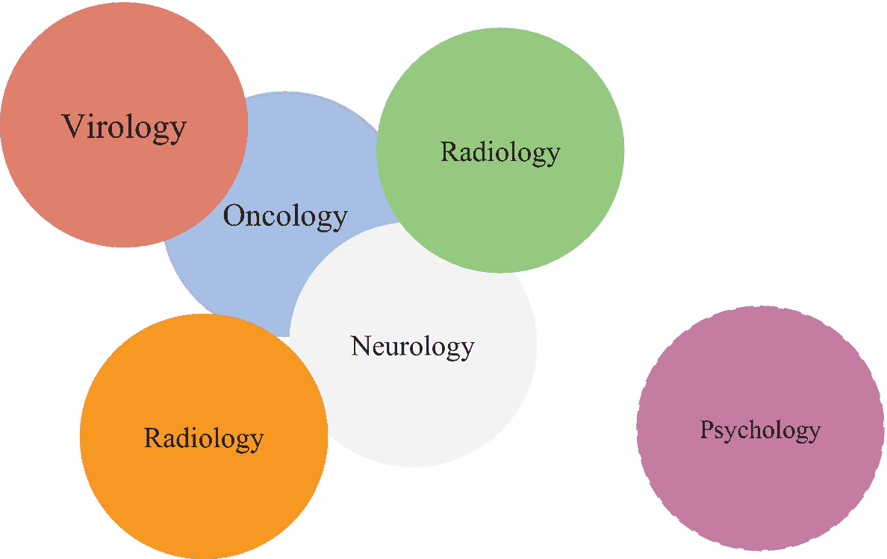
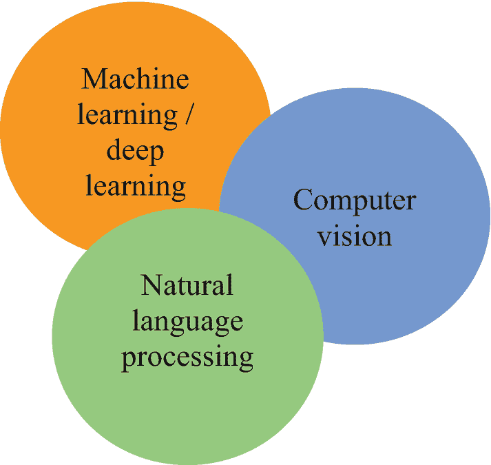
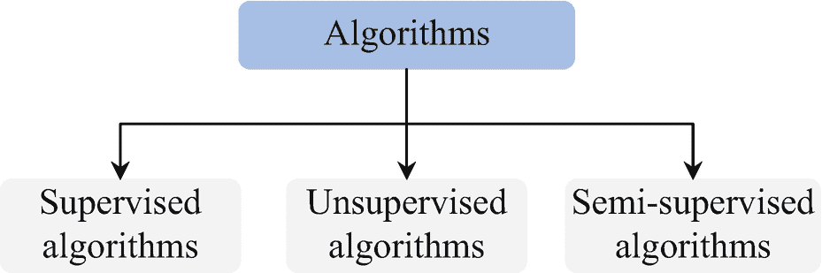
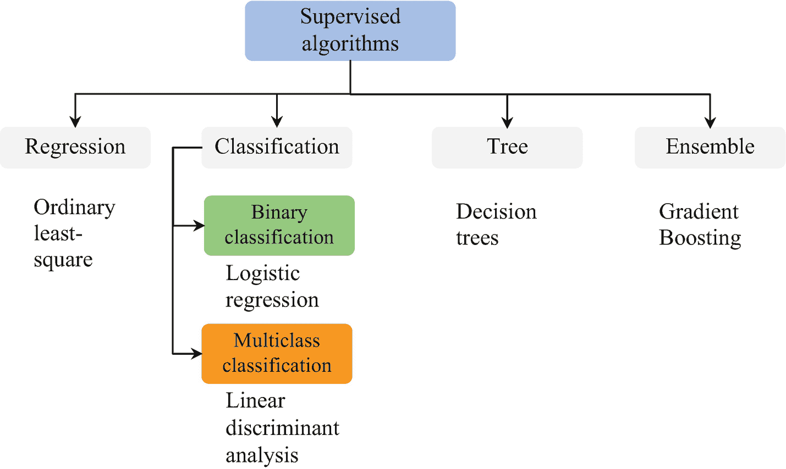
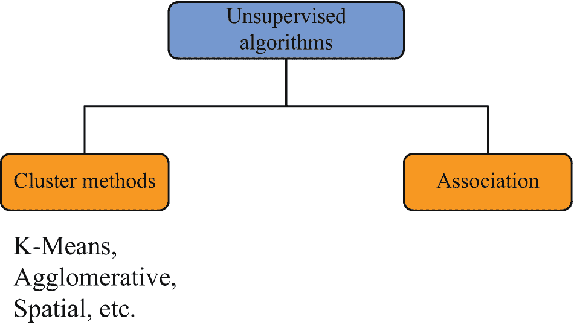

# 1. 人工智能在医学与心理学中的应用导论

在本章中，我将确立本书的具体背景与结构，随后概述其核心所涉及的各个医学专科，再介绍人工智能的独立子集。接着，我会讲解一些用于完成练习的实用工具，例如`Python`编程语言、发行包和库。最后，我将带你了解不同的算法，包括何时使用它们。

**免责声明**

本书并非医学文章或教科书，而是一本编程技术书籍，旨在展示如何正确运用人工智能子集来发现健康科学中的模式。本书中的任何内容均不构成健康建议。

## 本书背景

本书不是医学教科书，我也不是医学科学家。
本书的目标是为健康科学从业者提供一种实现机器学习的方法，以简化他们的实践工作。本书不涉及支撑医学领域的关键理论概念，因为这超出了本书的范围。

## 本书的核心要点

图 1-1 展示了本书核心所涉及的医学专科。

**图 1-1** 本书核心所涉及的医学专科

本书以医学和心理健康科学为核心。我提出了一种实现机器学习的方法，用于处理与医学科学（如肿瘤学、神经科学和心脏病学）以及社会科学（如心理学）相关的数据。

## 本书涵盖的人工智能子集

图 1-2 展示了本书涵盖的人工智能子集，以帮助你理解人工智能在医学科学中的实际应用。

**图 1-2** 本书涵盖的人工智能子集

本书涵盖了三个人工智能子集（即机器学习、计算机视觉和自然语言处理）。

## 本书结构

表 1-1 概述了本书的结构。

**表 1-1** 本书结构

| 章节 | 子集 | 医学专科 |
| --- | --- | --- |
| **第 2 章** | 深度学习 | 心脏病学 |
| **第 3 章** | 马尔可夫方法与蒙特卡洛模拟方法 | 病毒学 |
| **第 4 章** | 计算机视觉与深度学习 | 肿瘤学 |
| **第 5 章** | 计算机视觉与深度学习 | 神经病学与放射学 |
| **第 6 章** | 计算机视觉与深度学习 | 病毒学 |
| **第 7 章** | 生存分析 | 肿瘤学（临床试验） |
| **第 8 章** | 机器学习与自然语言处理 | 通用 |

本书涵盖了机器学习、计算机视觉和自然语言处理。此外，还涵盖了生存回归分析、隐马尔可夫决策和蒙特卡洛模拟。书中包含了关键的医学专科（如心脏病学、肿瘤学和神经病学等）。
在阅读本书之前，请确保你理解统计学和关键健康科学中的核心概念。虽然并非必需，但除了对相关概念有充分理解外，具备一些使用`Python`编程语言进行编程的背景经验也会有所帮助。

## 本书使用的工具

本书使用`Python`编程语言来执行与探索医学相关数据模式相关的典型研究任务。`Python`是一种相对易于学习的开源编程语言。它通过类似人类语言的方式支持我们编写应用程序和执行科学研究任务，因此掌握编程技能并不困难。它是实现和扩展人工智能项目的合适选择。

### Python 发行包

为了让你的`Python`编程体验更轻松，你将使用一个能有效管理关键`Python`资源和功能依赖项的发行包。有众多的`Python`发行包（例如`Anaconda`等）和集成开发环境（例如`PyCharm`）。

### Anaconda 发行包

`Anaconda`是最流行的`Python`发行包。此外，它还支持其他编程语言（例如`R`、`Scala`、`PySpark`等）。这个综合性包包含了像`JupyterLab`、`Jupyter Notebook`和`Spyder`这样的环境。此外，它还拥有一个`cmd`和一个`PowerShell`终端来执行脚本。

### Jupyter Notebook

`Jupyter Notebook`是编写`Python`程序最流行的交互式环境。它使你能够内联查看代码的输出。你无需编写、组装或测试整个程序。它是进行原型开发的合适选择。

### Python 库

全球丰富的开源库资源使 `Python` 编程语言区别于其他语言。库是一套精心编写的预置代码，能让你轻松完成复杂的编程任务。目前存在大量标准的开源 `Python` 库。
表 1-2 列出了本书将使用的库，包括其基本用法和安装方式。

**表 1-2** 本书使用的主要 Python 库

| 名称 | 用途 | 安装方式 |
| --- | --- | --- |
| `Matplotlib` | 二维静态图表绘制 | 在 `Python` 环境中，使用 `pip install matplotlib`。在 `conda` 环境中，使用 `conda install -c conda-forge matplotlib`。 |
| `seaborn` | 二维静态图表绘制 | 在 `Python` 环境中，使用 `pip install seaborn`。在 `conda` 环境中，使用 `conda install -c anaconda seaborn`。 |
| `pandas` | 静态制表与数据处理 | 在 `Python` 环境中，使用 `pip install pandas`。在 `conda` 环境中，使用 `conda install -c anaconda pandas`。 |
| `NumPy` | 数值计算与数据处理 | 在 `Python` 环境中，使用 `pip install numpy`。在 `conda` 环境中，使用 `conda install -c anaconda numpy`。 |
| `CV2` | 计算机视觉与图像数据处理 | 在 `Python` 环境中，使用 `pip install opencv-python`。在 `conda` 环境中，使用 `conda install -c conda-forge opencv`。 |
| `TensorFlow` | 神经网络开发 | 在 `Python` 环境中，使用 `pip install tensorflow`。在 `conda` 环境中，使用 `conda install -c conda-forge tensorflow`。 |
| `Keras` | 神经网络开发 | 在 `Python` 环境中，使用 `pip install keras`。在 `conda` 环境中，使用 `conda install -c conda-forge keras`。 |
| `scikit-learn` | 预处理、模型选择、开发与评估 | 在 `Python` 环境中，使用 `pip install scikit-learn`。在 `conda` 环境中，使用 `conda install -c anaconda scikit-learn`。 |
| `Factor Analyzer` | 探索性因子分析 | 在 `Python` 环境中，使用 `pip install factor_analyzer`。在 `conda` 环境中，使用 `conda install -c ets factor_analyzer`。 |

### 封装人工智能

要认识人工智能，首先必须理解人类智能，它涉及扫描环境中的信息、建立模型、寻找模式以得出结论，然后将这些结论作为行动的基础。人工智能这一统一领域旨在以模拟人类智能的方式对计算机系统进行编程。简单来说，深度学习试图模拟人脑的底层过程；计算机视觉试图模拟人类视觉系统的底层过程；自然语言处理则试图模拟人类处理语言的方式。

### 实现算法

本书将实现多种算法，用于预测来自不同数据集的各类实例。算法是一系列逻辑步骤，包括继承特征实例、建模，并在函数的支持下计算特征实例。你可以将算法视为公式。
图 1-3 展示了关键算法。

**图 1-3** 关键算法

### 监督算法

图 1-4 展示了监督算法的主要类别。

**图 1-4** 监督算法类别

监督算法的主要类别包括回归族（如普通最小二乘法）、分类族（如逻辑回归）、树族以及集成族（如随机森林）。

### 无监督算法

图 1-5 描绘了无监督算法的主要类别。

**图 1-5** 无监督算法类别

无监督算法的主要类别是聚类族和关联算法。

### 人工神经网络

表 1-3 描述了本书将使用的人工神经网络，包括其用途、激活函数和层。

**表 1-3** 本书使用的主要人工神经网络

| 名称 | 用途 | 激活函数 | 层 |
| --- | --- | --- | --- |
| 深度信念网络 | 对糖尿病和心血管疾病进行分类 | `Relu` 和 `sigmoid` | `Dense` 和 `Dropout` |
| 卷积神经网络 | 对 MRI、癌症（乳腺癌、皮肤癌和脑癌）及 X 光扫描进行分类 | `Relu` 和 `Softmax` | `Conv2D`、`MaxPooling2D`、`Flatten` 和 `Dropout` |

后续章节将向你介绍不同的激活函数、层及其用法。

## 结论

既然你已经对本书将要涵盖的内容以及完成各项练习所需的工具有了基本了解，那么让我们直接深入探索，利用神经网络来检测疾病中的模式。