# 2. 利用神经网络识别疾病模式

本章涵盖人工神经网络在医学数据建模中的应用。你将学习如何执行深度信念网络来对数据进行建模，并预测患者是否患有某种疾病（特别是心血管疾病和糖尿病）。此外，你还将学习如何使用关键指标评估网络，以确定网络区分患病与非患病患者的程度。

## 通过执行深度信念网络对心血管疾病诊断结果数据进行分类

在本节中，你将学习如何通过执行深度信念网络对心血管疾病患者进行分类。心血管疾病是指心脏和血管的紊乱。你可以从 `Kaggle`^(¹) 下载该数据集。

`清单 2-1` 从 `CSV` 文件中收集与心血管疾病相关的数据，并删除名为 `id` 的列。首先，在你的环境中安装 `pandas`：`pip install pandas`。

```python
import pandas as pd
cardiovascular_data = pd.read_csv(r"filepath\cardio_train.csv", sep=";")
cardiovascular_data.drop(["id"], axis = 1, inplace = True)
```

`清单 2-1` 收集数据

`清单 2-2` 处理名为 `age` 的列，使其适合分析。

```python
cardiovascular_data["age"] = round(cardiovascular_data["age"] / 365.25, 2)
```

`清单 2-2` 年龄取整

`清单 2-3` 构建了一个配对图，展示了心血管数据集中特征之间的相互关系。此外，它还描绘了特征的分布情况（见 `图 2-1`）。首先，在你的环境中安装 `Matplotlib`：`pip install matplotlib`。

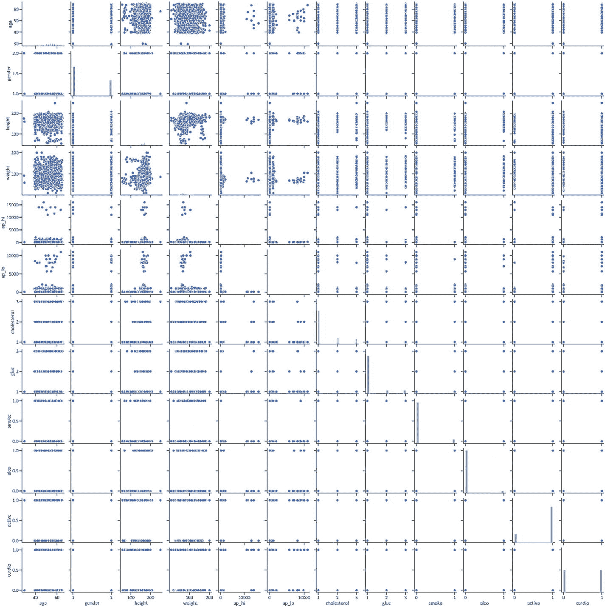

`图 2-1` 配对图

```python
import matplotlib.pyplot as plt
%matplotlib inline
import seaborn as sns
sns.set("talk","ticks", font_scale = 1, font = "Calibri")
sns.pairplot(cardiovascular_data)
plt.show()
```

`清单 2-3` 构建配对图

### 预处理心血管疾病诊断结果数据

`清单 2-4` 对心血管疾病诊断数据进行了预处理。首先，它导入了预处理所需的关键库。随后，将特征放入 `NumPy` 数组中。然后，分离出用于训练和测试人工神经网络的特征值。最后，对训练用的独立特征进行标准化处理。首先在你的环境中安装 `NumPy`：`pip install numpy`。同时安装 `scikit-learn`：`pip install -U scikit-learn`。

```python
import numpy as np
from sklearn.model_selection import train_test_split
from sklearn.preprocessing import StandardScaler
from sklearn.model_selection import train_test_split
x_train_cardio, x_test_cardio, y_train_cardio, y_test_cardio = train_test_split(x_cardio, y_cardio, test_size = 0.2, random_state = 0)
x_train_cardio, x_val_cardio, y_train_cardio, y_val_cardio = train_test_split(x_train_cardio, y_train_cardio, test_size = 0.1, random_state = 0)
standard_scaler_for_cardio = StandardScaler()
x_train_cardio = standard_scaler_for_cardio.fit_transform(x_train_cardio)
x_test_cardio = standard_scaler_for_cardio.transform(x_test_cardio)
```

`清单 2-4` 预处理心血管疾病诊断结果数据

### 揭秘深度信念网络

深度信念网络通过允许使用无数个隐藏层，将多个受限玻尔兹曼机整合在一起，从而增加了神经网络的复杂性。`公式 2-1` 定义了深度信念网络：

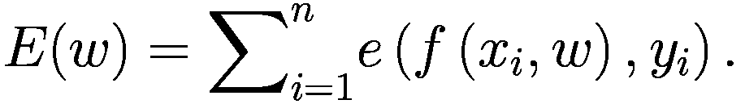

（`公式 2-1`）

### 设计深度信念网络

`清单 2-5` 开发了人工神经网络。首先，它导入了开发网络所需的关键库。接着，它勾勒出网络的结构：输入层包含 11 个神经元，使用 `relu` 激活函数；三个隐藏层各包含 11 个神经元，使用 `relu` 激活函数；输出层使用 `sigmoid` 函数生成标签（见 `图 2-2`）。首先在你的环境中安装 `TensorFlow`：`pip install tensorflow`。

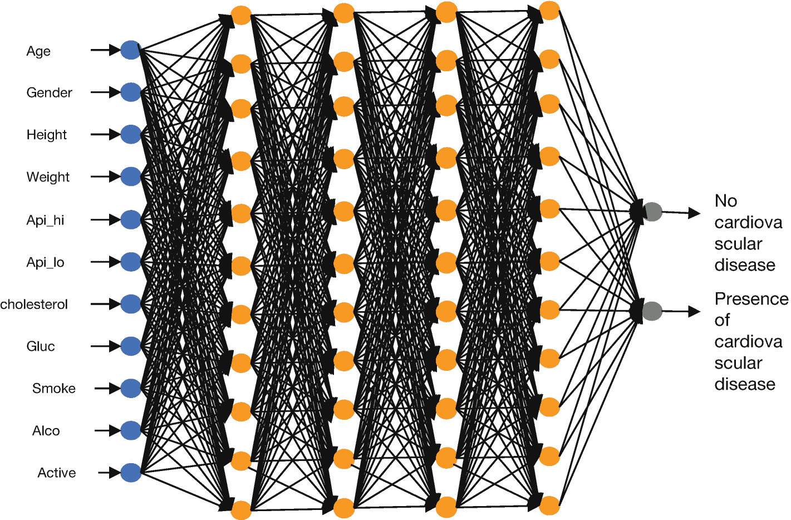

`图 2-2` 神经网络结构

```python
import tensorflow as tf
from tensorflow.keras import Sequential, regularizers
from tensorflow.keras.layers import Dense
def cardiovascular_dbn_function():
cardiovascular_dbn_model = Sequential()
cardiovascular_dbn_model.add(Dense(11, input_dim = 11, activation = "relu"))
cardiovascular_dbn_model.add(Dense(11, activation = "relu"))
cardiovascular_dbn_model.add(Dense(11, activation = "relu"))
cardiovascular_dbn_model.add(Dense(11, activation = "relu"))
cardiovascular_dbn_model.add(Dense(1, activation = "sigmoid"))
cardiovascular_dbn_model.compile(loss = "binary_crossentropy", optimizer = "adam", metrics = ["accuracy"])
return cardiovascular_dbn_model
```

`清单 2-5` 构建深度信念网络

#### `ReLU` 激活函数

`图 2-2` 展示了深度信念网络在输入层中使用了 `relu` 激活函数。

`公式 2-2` 定义了 `relu` 激活函数：


（`公式 2-2`）

`公式 2-2` 表明独立特征可以取从 0 开始的任意值。

#### `Sigmoid` 激活函数

同样地，`公式 2-3` 定义了输出层中的 `sigmoid` 激活函数：

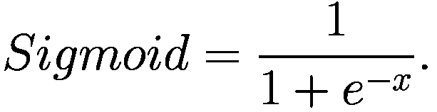

（`公式 2-3`）

`公式 2-3` 生成类别（0 或 1）。

`清单 2-6` 封装了深度信念网络。

```python
from keras.wrappers.scikit_learn import KerasClassifier
cardiovascular_dbn_model = KerasClassifier(build_fn = cardiovascular_dbn_function)
```

`清单 2-6` 封装深度信念网络

### 训练深度信念网络

`清单 2-7` 在数据上训练人工神经网络。同时，它列出了验证数据，包括周期数（也称为迭代次数）和批量大小（也称为人工神经网络每次迭代学习的样本数量）。

```python
cardiovascular_dbn_model_history = cardiovascular_dbn_model.fit(x_train_cardio, y_train_cardio, validation_data = (x_val_cardio, y_val_cardio), epochs = 64, batch_size = 16)
cardiovascular_dbn_model_history
```

`清单 2-7` 训练深度信念网络

### 概述深度信念网络的预测结果

`清单 2-8` 概述了深度信念网络的预测结果（见 `表 2-1`）。

`表 2-1` 深度信念网络的预测结果

|   | 实际值 | 预测值 |
| --- | --- | --- |
| **0** | 无心血管疾病 | 无心血管疾病 |
| **1** | 无心血管疾病 | 无心血管疾病 |
| **2** | 无心血管疾病 | 无心血管疾病 |
| **3** | 无心血管疾病 | 无心血管疾病 |
| **4** | 无心血管疾病 | 无心血管疾病 |
| **...** | ... | ... |
| **13995** | 存在心血管疾病 | 存在心血管疾病 |
| **13996** | 无心血管疾病 | 无心血管疾病 |
| **13997** | 存在心血管疾病 | 存在心血管疾病 |
| **13998** | 无心血管疾病 | 无心血管疾病 |
| **13999** | 存在心血管疾病 | 存在心血管疾病 |

```python
y_hat_cardiovascular_dbn_model = cardiovascular_dbn_model.predict(x_test_cardio)
actual_cardio = pd.DataFrame(y_test_cardio)
actual_cardio.columns = ["Actual"]
predicted_cardio = pd.DataFrame(y_test_cardio)
predicted_cardio.columns = ["Predicted"]
actual_and_predicted_cardio = pd.concat([actual_cardio, predicted_cardio], axis = 1)
actual_and_predicted_cardio.loc[actual_and_predicted_cardio.Actual == 0, "Actual"] = "No cardiovascular disease"
actual_and_predicted_cardio.loc[actual_and_predicted_cardio.Actual == 1, "Actual"] = "Presence of cardiovascular disease"
actual_and_predicted_cardio.loc[actual_and_predicted_cardio.Predicted == 0, "Predicted"] = "No cardiovascular disease"
actual_and_predicted_cardio.loc[actual_and_predicted_cardio.Predicted == 1, "Predicted"] = "Presence of cardiovascular disease"
actual_and_predicted_cardio
```

`清单 2-8` 概述深度信念网络的预测结果

#### 考量深度神经网络的性能

为了确定深度神经网络在训练和交叉验证中对患者心血管疾病结果的分类效果，本节将监测随着训练轮次增加，二元交叉熵损失和准确率指标的波动程度。首先，我们来看混淆矩阵，然后是分类报告。

`代码清单 2-9` 概述了深度信念网络的预测结果（参见 `表 2-2`）。

`表 2-2` 深度信念网络的混淆矩阵

| | 预测：无心血管疾病 | 预测：有心血管疾病 |
|---|---|---|
| **实际：无心血管疾病** | 5592 | 1477 |
| **实际：有心血管疾病** | 2279 | 4652 |

```python
from sklearn.metrics import confusion_matrix
cardiovascular_dbn_model_confusion_matrix = pd.DataFrame(confusion_matrix(y_test_cardio,
y_hat_cardiovascular_dbn_model),
index = ["Actual: No cardiovascular disease",
"Actual: Presence of cardiovascular disease"],
columns = ("Predicted: No cardiovascular disease",
"Predicted: Presence of cardiovascular disease"))
cardiovascular_dbn_model_confusion_matrix
```

`代码清单 2-9` 概述深度信念网络的混淆矩阵

`表 2-2` 显示深度信念网络：

-   正确预测患者无心血管疾病 5592 次。
-   错误预测患者有心血管疾病（实际没有）1477 次。
-   错误预测患者无心血管疾病（实际有）2279 次。
-   正确预测患者有心血管疾病 4652 次。

`代码清单 2-10` 概述了人工神经网络的分类报告，其中包含准确率、精确率、召回率、F-1 分数和支持度（参见 `表 2-3`）。

`公式 2-4` 定义了精确率：

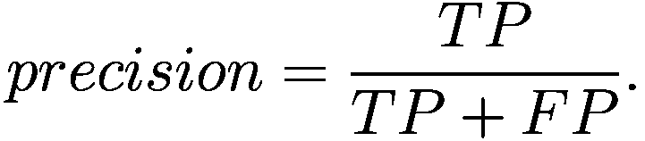

（`公式 2-4`）

真正例（`TP`）计数模型预测为正类且预测正确的情况，假正例（`FP`）计数模型预测为负类的情况。

`公式 2-5` 定义了召回率：


（`公式 2-5`）

假负例（`FN`）计数模型预测为正类，但实际为负类的情况。

`公式 2-6` 定义了 F1 分数：

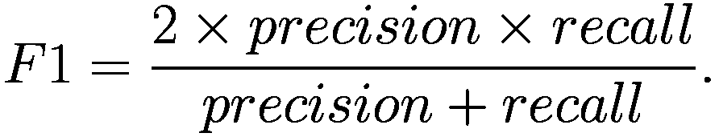

（`公式 2-6`）

`公式 2-7` 定义了准确率：


（`公式 2-7`）

`表 2-3` 深度信念网络的分类报告

| | 精确率 | 召回率 | F-1 分数 | 支持度 |
|---|---|---|---|---|
| **0** | 0.707317 | 0.804074 | 0.752598 | 7069.000000 |
| **1** | 0.767773 | 0.660655 | 0.710198 | 6931.000000 |
| **准确率** | 0.733071 | 0.733071 | 0.733071 | 0.733071 |
| **宏平均** | 0.737545 | 0.732365 | 0.731398 | 14000.000000 |
| **加权平均** | 0.737247 | 0.733071 | 0.731607 | 14000.000000 |

```python
from sklearn.metrics import classification_report
cardiovascular_dbn_model_report = pd.DataFrame(classification_report(y_test_cardio, y_hat_cardiovascular_dbn_model,
output_dict = True)).transpose()
cardiovascular_dbn_model_report
```

`代码清单 2-10` 概述深度信念网络的分类报告

`表 2-3` 表明，深度信念网络在预测无心血管疾病时精确率为 71%，在预测有心血管疾病时精确率为 77%。总体准确率为 73%。

#### 训练和交叉验证中准确率随训练轮次的波动

`代码清单 2-11` 和 `图 2-3` 描绘了深度神经网络对患者心血管疾病结果进行分类时，训练和交叉验证中准确率随训练轮次增加的波动程度。

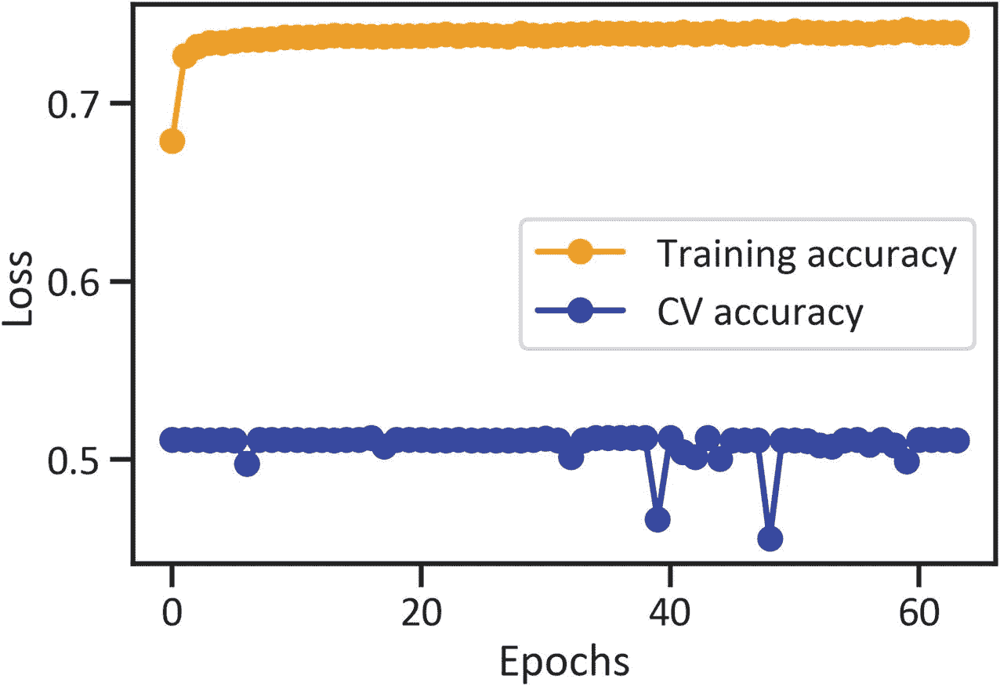

`图 2-3` 训练和交叉验证中准确率随训练轮次的波动

```python
plt.plot(cardiovascular_dbn_model_history.history["accuracy"],
color = "orange",
marker = "o",
label = "Training accuracy")
plt.plot(cardiovascular_dbn_model_history.history["val_accuracy"],
color = "blue",
marker = "o",
label = "CV accuracy")
plt.xlabel("Epochs")
plt.ylabel("Loss")
plt.legend(loc = "best")
plt.show()
```

`代码清单 2-11` 绘制训练和交叉验证中准确率随训练轮次的波动图

## 深度信念网络在糖尿病诊断中的应用

`代码清单 2-13` 从一个 `CSV` 文件中收集与糖尿病相关的数据。你可以从 Kaggle^(²) 下载该数据集。

```python
diabetes_data = pd.read_csv(r"filepath\diabetes.csv")
```

`代码清单 2-13` 收集糖尿病数据。

`代码清单 2-14` 构建了一个配对图，展示了糖尿病数据集中特征之间的相互关系。此外，它还描绘了特征的分布情况（见`图 2-5`）。

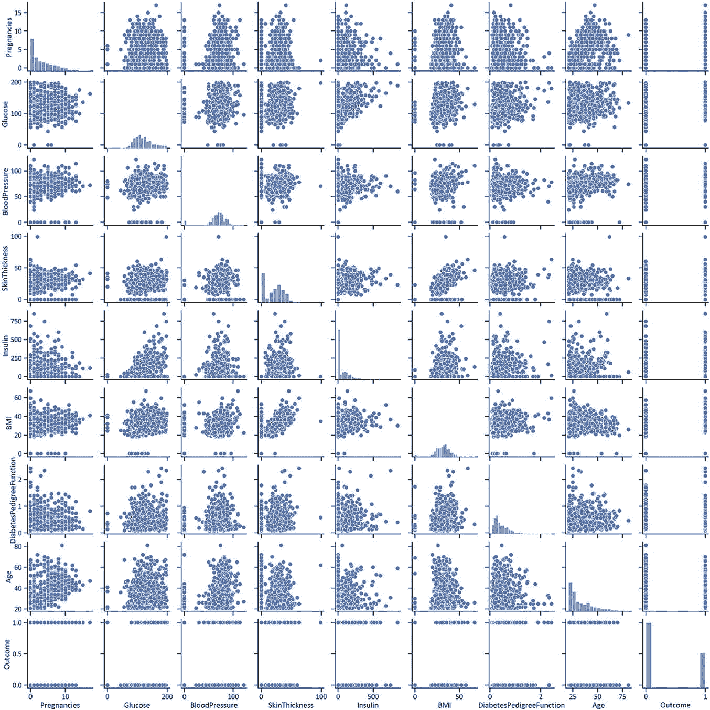

```python
sns.pairplot(diabetes_data)
```

`代码清单 2-14` 糖尿病数据配对图。

### 执行深度信念网络对糖尿病诊断结果数据进行分类

`代码清单 2-15` 将特征分配给 `NumPy` 数组。随后，它将特征值分离出来，用于训练和测试深度信念网络。然后，它对训练独立的特征进行标准化。最后，它在糖尿病数据上训练该网络。

该网络的结构设计为：输入层包含 11 个神经元，使用 `relu` 激活函数；三个隐藏层各包含 11 个神经元，使用 `relu` 激活函数；输出层使用 `sigmoid` 函数生成标签（见`图 2-6`）。

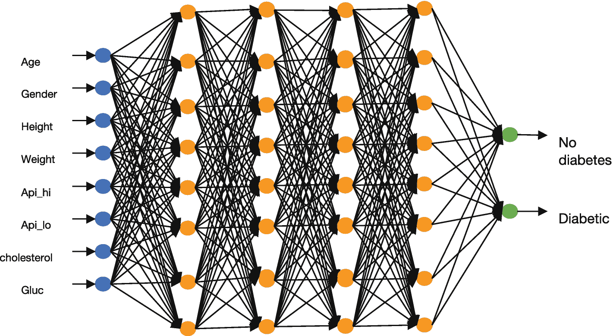

```python
x_diabetes = np.array(diabetes_data.iloc[::, 0:8])
y_diabetes = np.array(diabetes_data.iloc[::, -1])
x_train_diabetes, x_test_diabetes, y_train_diabetes, y_test_diabetes = train_test_split(x_diabetes, y_diabetes, test_size = 0.2, random_state = 0)
x_train_diabetes, x_val_diabetes, y_train_diabetes, y_val_diabetes = train_test_split(x_train_diabetes, y_train_diabetes, test_size = 0.1, random_state = 0)
standard_scaler_for_diabetes = StandardScaler()
x_train_diabetes = standard_scaler_for_diabetes.fit_transform(x_train_diabetes)
x_test_diabetes = standard_scaler_for_diabetes.transform(x_test_diabetes)
from tensorflow.python.keras.layers import Dropout
def diabetes_dbn_function():
    diabetes_dbn_model = Sequential()
    diabetes_dbn_model.add(Dense(8, input_dim = 8, activation="relu"))
    diabetes_dbn_model.add(Dropout(0.2))
    diabetes_dbn_model.add(Dense(8, activation = "relu"))
    diabetes_dbn_model.add(Dense(8, activation = "relu"))
    diabetes_dbn_model.add(Dense(8, activation = "relu"))
    diabetes_dbn_model.add(Dense(1, activation = "sigmoid"))
    diabetes_dbn_model.compile(loss = "binary_crossentropy", optimizer = "adam", metrics = ["accuracy"])
    return diabetes_dbn_model
diabetes_dbn_model = KerasClassifier(build_fn = diabetes_dbn_function)
diabetes_dbn_model_history = diabetes_dbn_model.fit(x_train_diabetes, y_train_diabetes, validation_data = (x_val_diabetes, y_val_diabetes), epochs = 64, batch_size = 16)
diabetes_dbn_model_history
```

`代码清单 2-15` 执行深度信念网络对糖尿病诊断结果数据进行分类。

### 概述深度信念网络的预测结果

`代码清单 2-16` 概述了深度信念网络的预测结果（见`表 2-4`）。

**表 2-4 深度信念网络的预测结果**

|   | 实际值 | 预测值 |
| --- | --- | --- |
| **0** | 糖尿病 | 糖尿病 |
| **1** | 非糖尿病 | 非糖尿病 |
| **2** | 非糖尿病 | 非糖尿病 |
| **3** | 糖尿病 | 糖尿病 |
| **4** | 非糖尿病 | 非糖尿病 |
| **...** | ... | ... |
| **149** | 糖尿病 | 糖尿病 |
| **150** | 非糖尿病 | 非糖尿病 |
| **151** | 糖尿病 | 糖尿病 |
| **152** | 非糖尿病 | 非糖尿病 |
| **153** | 非糖尿病 | 非糖尿病 |

```python
y_hat_diabetes_dbn_model  = diabetes_dbn_model.predict(x_test_diabetes)
actual_diabetes = pd.DataFrame(y_test_diabetes)
actual_diabetes.columns = ["Actual"]
predicted_diabetes = pd.DataFrame(y_test_diabetes)
predicted_diabetes.columns = ["Predicted"]
actual_and_predicted_diabetes = pd.concat([actual_diabetes, predicted_diabetes], axis = 1)
actual_and_predicted_diabetes.loc[actual_and_predicted_diabetes.Actual == 0, "Actual"] = "Not diabetic"
actual_and_predicted_diabetes.loc[actual_and_predicted_diabetes.Actual == 1, "Actual"] = "Diabetic"
actual_and_predicted_diabetes.loc[actual_and_predicted_diabetes.Predicted == 0, "Predicted"] = "Not diabetic"
actual_and_predicted_diabetes.loc[actual_and_predicted_diabetes.Predicted == 1, "Predicted"] = "Diabetic"
actual_and_predicted_diabetes
```

`代码清单 2-16` 概述深度信念网络的预测结果。

### 评估深度神经网络的性能

为了确定深度神经网络在训练和交叉验证中对患者糖尿病结果进行分类的效果如何，本节监测了随着 `epoch` 增加，二元交叉熵损失和准确率指标的波动程度。首先，我们来看混淆矩阵，然后是分类报告。参见`代码清单 2-17`。

**表 2-5 深度信念网络的混淆矩阵**

|   | 预测：非糖尿病 | 预测：糖尿病 |
| --- | --- | --- |
| **实际：非糖尿病** | 90 | 17 |
| **实际：糖尿病** | 17 | 30 |

```python
diabetes_dbn_model_confusion_matrix = pd.DataFrame(confusion_matrix(y_test_diabetes, y_hat_diabetes_dbn_model),
index=["Actual: No diabetes",
"Actual: Diabetic"],
columns = ("Predicted: No diabetes",
"Predicted: Diabetic"))
diabetes_dbn_model_confusion_matrix
```

`代码清单 2-17` 概述深度信念网络的混淆矩阵。

`表 2-5` 显示深度信念网络：

*   正确预测患者未患糖尿病 90 次。
*   错误地将未患糖尿病的患者预测为患有糖尿病 17 次。
*   错误地将患有糖尿病的患者预测为未患病 17 次。
*   正确预测患者患有糖尿病 30 次。

`代码清单 2-18` 概述了神经网络的分类报告，其中包含准确率分数、精确率分数、召回率、F1 分数和支持度（见`表 2-6`）。

**表 2-6 深度信念网络的分类报告**

|   | 精确率 | 召回率 | F-1 分数 | 支持度 |
| --- | --- | --- | --- | --- |
| **0** | 0.841121 | 0.841121 | 0.841121 | 107.000000 |
| **1** | 0.638298 | 0.638298 | 0.638298 | 47.000000 |
| **准确率** | 0.779221 | 0.779221 | 0.779221 | 0.779221 |
| **宏平均** | 0.739710 | 0.739710 | 0.739710 | 154.000000 |
| **加权平均** | 0.779221 | 0.779221 | 0.779221 | 154.000000 |

```python
diabetes_dbn_model_report = pd.DataFrame(classification_report(y_test_diabetes, y_hat_diabetes_dbn_model,
output_dict = True)).transpose()
diabetes_dbn_model_report
```

`代码清单 2-18` 概述深度信念网络的分类报告。

`表 2-6` 表明，深度信念网络在预测无糖尿病时的精确率为 84%，在预测有糖尿病时的精确率为 64%。总体准确率为 78%。

#### 训练和交叉验证中跨 Epoch 的准确率波动

`图 2-7` 描绘了深度神经网络在对患者糖尿病结果进行分类时，随着 `epoch` 增加，训练和交叉验证中准确率的波动程度。代码见`代码清单 2-19`。

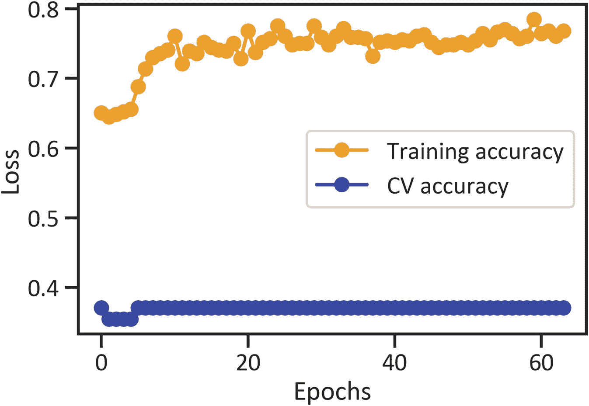

```python
plt.plot(diabetes_dbn_model_history.history["accuracy"],
color="orange",
marker = "o",
label = "Training accuracy")
plt.plot(diabetes_dbn_model_history.history["val_accuracy"],
color="blue",
marker = "o",
label = "CV accuracy")
plt.xlabel("Epochs")
plt.ylabel("Loss")
plt.legend(loc="best")
plt.show()
```

`代码清单 2-19` 绘制训练和交叉验证中跨 `epoch` 的准确率波动图。

`图 2-7` 显示，在对糖尿病结果进行分类时，训练中的准确率高于交叉验证中的准确率。

#### 训练与交叉验证中二元交叉熵损失随轮次的变化

`代码清单 2-20` 和`图 2-8` 展示了深度神经网络在分类患者糖尿病结果时，训练与交叉验证中二元交叉熵损失随轮次增加的变化程度。

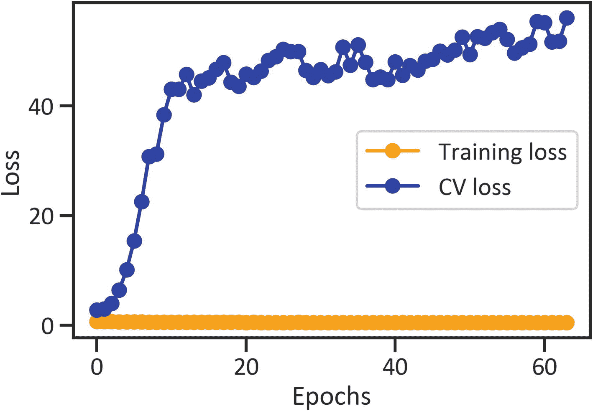

```python
plt.plot(diabetes_dbn_model_history.history["loss"],
color = "orange",
marker = "o",
label = "Training loss")
plt.plot(diabetes_dbn_model_history.history["val_loss"],
color = "blue",
marker = "o",
label = "CV loss")
plt.xlabel("Epochs")
plt.ylabel("Loss")
plt.legend(loc = "best")
plt.show()
```

`代码清单 2-20` 训练与交叉验证中二元交叉熵损失随轮次的变化。

`图 2-8` 显示，二元交叉熵损失在训练中保持恒定，但在交叉验证中却急剧上升。

## 结论

本章介绍了人工神经网络在疾病识别与分割中的实际应用。首先，总结了两类可预防的疾病。随后，提供了神经网络的一些必要背景知识。接着，提出了一种设计网络结构、训练网络并评估性能的方法。

[^1]: 脚注 1
[^2]: 脚注 2