# 3. COVID-19 案例研究：考虑隐藏状态与模拟结果

在本章中，你将运用一组序列方法（或称时间序列方法）进行预测，以识别美国 COVID-19 确诊病例的模式。首先，你将使用高斯隐马尔可夫模型继承序列、对其进行建模，并考虑隐藏状态，包括这些状态中的均值和协方差。随后，你将使用蒙特卡洛模拟方法，在多次试验中复制美国 COVID-19 确诊病例，从而深入理解数据中的模式。

## 执行隐马尔可夫模型

你首先使用隐马尔可夫模型来揭示美国 COVID-19 确诊病例中的隐藏状态（可视为类别或分类）。你将采用最简化的马尔可夫模型，即高斯隐马尔可夫模型，该模型返回两个状态：0（表示美国 COVID-19 确诊病例增加）和 1（表示美国 COVID-19 确诊病例减少）。

让我们基于“当前状态和后续状态依赖于先前状态”这一前提来构建隐马尔可夫模型。`公式 3-1` 定义了高斯隐马尔可夫模型：

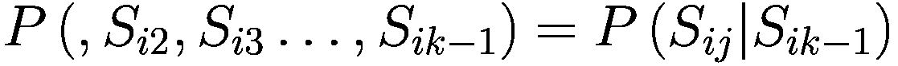

**（公式 3-1）**

其中，`S[ij]` 表示隐藏状态的独立观测值，`S[i1]` 表示第一个隐藏状态，`S[i2]` 表示第二个隐藏状态，以此类推。

`图 3-1` 展示了转移概率（定义见`公式 3-2`）和初始概率（定义见`公式 3-3`）：

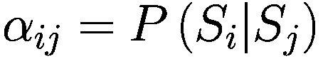

**（公式 3-2）**

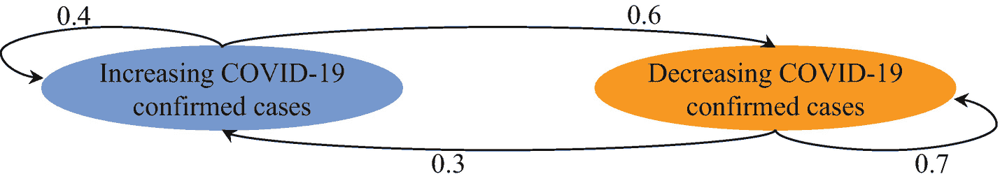

**图 3-1**  
转移概率

以及

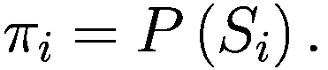

**（公式 3-3）**

`图 3-1` 显示了两个状态：`“COVID-19 确诊病例增加”`和`“COVID-19 确诊病例减少”`，其中转移概率为 `P(“COVID-19 确诊病例增加” | “COVID-19 确诊病例增加”)` = 0.4，`P(“COVID-19 确诊病例减少” | “COVID-19 确诊病例增加”)` = 0.6。

约翰霍普金斯大学收集的数据于 2021 年 9 月 24 日从 GitHub^(³) 下载。

**注意**  
约翰霍普金斯大学每天更新数据。要重现本练习，请从本章的 GitHub 文件夹中下载数据集。


## 描述性分析

在执行高斯隐马尔可夫模型之前，首先应进行探索性描述分析。在本节中，你将通过构建直方图和箱线图来考察数据的分布情况。随后，你将通过集中趋势和离散程度来描述数据。清单 3-1 收集数据并识别空值（见图 3-2）。首先，在你的环境中安装 `pandas`：`pip install pandas`。此外，在你的环境中安装 `Matplotlib`：`pip install matplotlib`。同时，在你的环境中安装 `seaborn`：`pip install seaborn`。

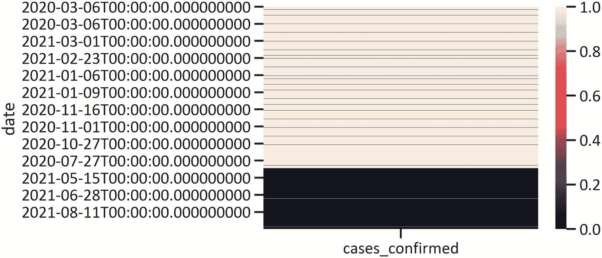

图 3-2

空值热力图

```
import pandas as pd
import matplotlib.pyplot as plt
%matplotlib inline
import seaborn as sns
covid_us_df = pd.read_csv(r"filepaht\time_series_covid19_deaths_US.csv", index_col=[0], parse_dates=[0])["cases_confirmed"]
covid_us_df = pd.DataFrame(covid_us_df)
sns.heatmap(covid_us_df.isnull())
plt.show()
清单 3-1
收集美国确诊 COVID-19 病例数据
```

清单 3-2 删除缺失值。此外，它还绘制了另一张热力图以验证空值是否已被删除（见图 3-3）。

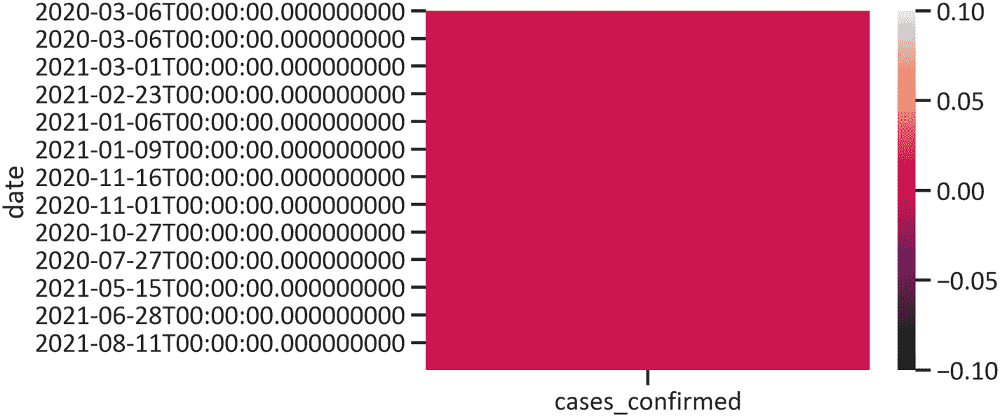

图 3-3

空值热力图

```
import seaborn as sns
covid_us_df = covid_us_df.dropna()
sns.heatmap(covid_us_df.isnull())
plt.show()
清单 3-2
替换空值
```

研究数据向中心实例倾斜程度的最合适方法是使用直方图，根据数据的频率构建置信区间。

清单 3-3 构建了美国确诊 COVID-19 病例的直方图（见图 3-4）。

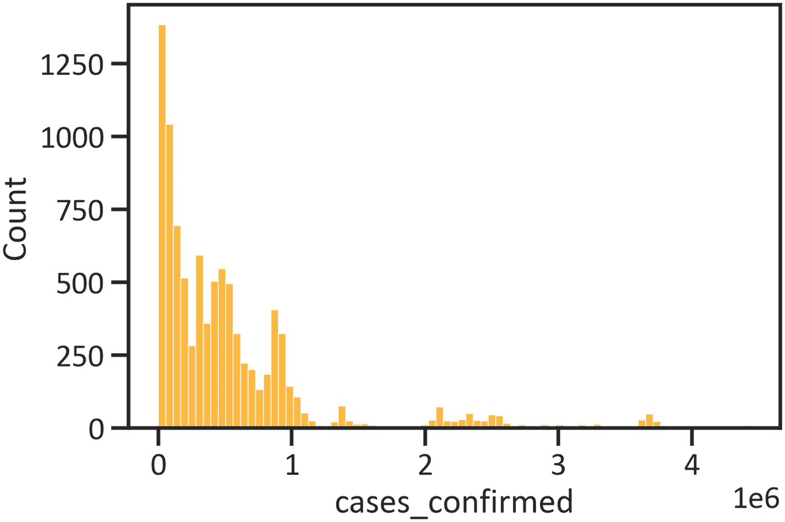

图 3-4

美国确诊 COVID-19 病例

```
sns.histplot(data=covid_us_df, x = covid_us_df.cases_confirmed, color = "orange")
plt.show()
清单 3-3
美国确诊 COVID-19 病例直方图
```

清单 3-4 构建了美国确诊 COVID-19 病例的箱线图，以确认图 3-3 中发现的分布情况（见图 3-5）。

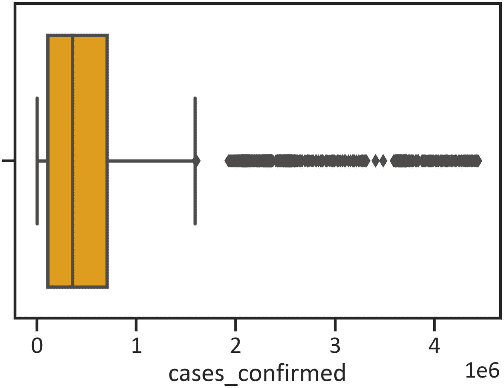

图 3-5

美国确诊 COVID-19 病例箱线图

```
sns.boxplot(covid_us_df.cases_confirmed, color = "orange")
plt.show()
清单 3-4
美国确诊 COVID-19 病例箱线图
```

图 3-5 证实了美国确诊 COVID-19 病例数据向左倾斜。此外，它还表明存在大量异常值。

为防止异常值扭曲数据，你需要执行插补，即使用某个指定值替换数值（在本例中，你使用均值替换异常值）。

清单 3-5 使用均值替换异常值。然后，它构建了另一个箱线图以验证异常值是否已被移除（见图 3-6）。首先，在你的环境中安装 `NumPy`：`pip install numpy`。

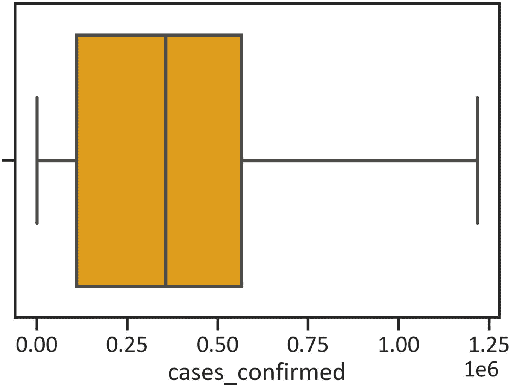

图 3-6

移除异常值后的美国确诊 COVID-19 病例箱线图

```
import numpy as np
covid_us_df.cases_confirmed = np.where((covid_us_df.cases_confirmed > 1.25e+6),covid_us_df.cases_confirmed .mean(),covid_us_df.cases_confirmed)
sns.boxplot(data = covid_us_df, x = covid_us_df.cases_confirmed, color = "orange")
plt.show()
清单 3-5
替换异常值
```

图 3-6 证实均值确实替换了异常值。

清单 3-6 绘制了美国确诊 COVID-19 病例序列图（图 3-7）。

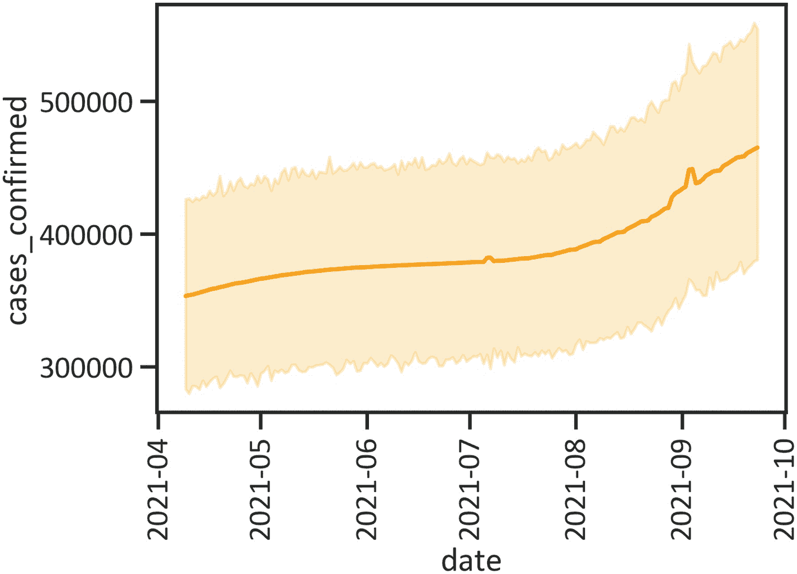

图 3-7

美国确诊 COVID-19 病例序列

```
sns.lineplot(data=covid_us_df, x = covid_us_df.index, y = covid_us_df.cases_confirmed, color = "orange")
plt.xticks (rotation = 90)
plt.show()
清单 3-6
绘制美国确诊 COVID-19 病例序列图
```

清单 3-7 报告了均值、中位数和标准差等关键统计量（见表 3-1）。

表 3-1

描述性统计

|   | cases_confirmed |
| --- | --- |
| **计数** | 9.380000e+03 |
| **均值** | 3.900083e+05 |
| **标准差** | 2.952401e+05 |
| **最小值** | 0.000000e+00 |
| **25% 分位数** | 1.094280e+05 |
| **50% 分位数** | 3.560650e+05 |
| **75% 分位数** | 5.653697e+05 |
| **最大值** | 1.217892e+06 |

```
covid_us_df.describe()
清单 3-7
计算描述性统计量
```

## 执行高斯隐马尔可夫模型

清单 3-8 执行了高斯隐马尔可夫模型，其中 `n_components` 设为 `2`，迭代次数为 `10`。首先，在你的环境中安装 `hmmlearn`：`pip install hmmlearn`。

```
from hmmlearn.hmm import GaussianHMM
hmm_data = np.column_stack([covid_us_df])
gaussian_hmm_model = GaussianHMM(n_components=2, tol=0.0001, n_iter=10)
gaussian_hmm_model.fit(hmm_data)
清单 3-8
执行高斯隐马尔可夫模型
```


### 使用高斯隐马尔可夫模型分析美国新冠确诊病例的隐藏状态

清单 3-9 使用高斯隐马尔可夫模型分析了美国新冠确诊病例中的隐藏状态（表 3-2）。

**表 3-2** 使用高斯隐马尔可夫模型分析美国新冠确诊病例的隐藏状态

| | `hidden_states` |
| --- | --- |
| **日期** | |
| **2021-04-09** | 1 |
| **2021-04-10** | 1 |
| **2021-04-11** | 1 |
| **2021-04-12** | 1 |
| **2021-04-13** | 1 |

```
hidden_states = pd.DataFrame(gaussian_hmm_model.predict(hmm_data), columns = ["hidden_states"])
hidden_states.index = covid_us_df.index
hidden_states.head()
清单 3-9
使用高斯隐马尔可夫模型分析美国新冠确诊病例的隐藏状态
```

清单 3-10 描述了高斯隐马尔可夫模型的隐藏状态（见表 3-3）。

**表 3-3** 高斯隐马尔可夫模型隐藏状态的描述性统计

| | `hidden_states` |
| --- | --- |
| **计数** | 9380.000000 |
| **均值** | 0.430384 |
| **标准差** | 0.495156 |
| **最小值** | 0.000000 |
| **25%** | 0.000000 |
| **50%** | 0.000000 |
| **75%** | 1.000000 |
| **最大值** | 1.000000 |

```
hidden_states.describe()
清单 3-10
高斯隐马尔可夫模型隐藏状态的描述性统计
```

表 3-3 显示均值为 0.43，标准差为 0.49。

清单 3-11 描绘了高斯隐马尔可夫模型的隐藏状态（图 3-8）。

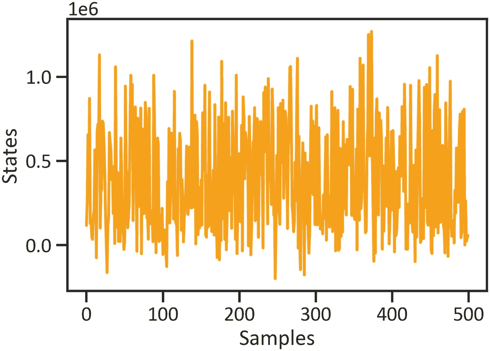

**图 3-8** 高斯隐马尔可夫模型的隐藏状态

```
n_sample = 500
sample, _ = gaussian_hmm_model.sample(n_sample)
plt.plot(np.arange(n_sample), sample[:,0], color = "orange")
plt.xlabel("样本")
plt.ylabel("状态")
plt.show()
清单 3-11
描绘高斯隐马尔可夫模型的隐藏状态
```

图 3-8 显示，500 个样本大多介于 0 和 1 之间，仅有少数例外。

清单 3-12 识别了高斯隐马尔可夫模型隐藏状态的均值和协方差。

```
for i in range(gaussian_hmm_model.n_components):
print("{0} 阶隐藏状态".format(i))
print("均值 = ", gaussian_hmm_model.means_[i])
print("方差 = ", np.diag(gaussian_hmm_model.covars_[i]))
print()
0 阶隐藏状态
均值 =  [591862.57352145]
方差 =  [5.03979663e+10]
1 阶隐藏状态
均值 =  [121584.27846397]
方差 =  [9.80585646e+09]
清单 3-12
识别隐藏状态的均值和协方差
```

## 使用蒙特卡洛模拟方法模拟美国新冠确诊病例

清单 3-13 执行蒙特卡洛模拟方法来模拟美国新冠确诊病例。首先，在你的环境中安装 `pandas_montecarlo`：`pip install pandas_montecarlo`。

```
import pandas_montecarlo
monte_carlo_model = covid_us_df.cases_confirmed.montecarlo(sims=5, bust=-0.1, goal=1)
清单 3-13
执行蒙特卡洛模拟方法
```

### 美国新冠确诊病例模拟结果

清单 3-14 描绘了美国新冠确诊病例的蒙特卡洛模拟结果（见图 3-9）。

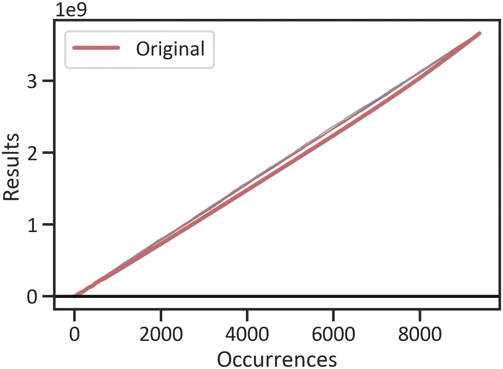

**图 3-9** 美国新冠确诊病例的蒙特卡洛模拟结果

```
monte_carlo_model.plot(title="")
清单 3-14
描绘美国新冠确诊病例的蒙特卡洛模拟结果
```

清单 3-15 概述了美国新冠确诊病例蒙特卡洛模拟结果的描述性统计（见表 3-4）。

**表 3-4** 美国新冠确诊病例蒙特卡洛模拟结果的描述性统计

| | 计数 | 均值 | 标准差 | 最小值 | 25% | 50% | 75% | 最大值 |
| --- | --- | --- | --- | --- | --- | --- | --- | --- |
| **原始** | 9380.0 | 390008.25521 | 295240.11557 | 0.0 | 109428.0 | 356065.0 | 565369.72484 | 1217892.0 |
| **1** | 9380.0 | 390008.25521 | 295240.11557 | 0.0 | 109428.0 | 356065.0 | 565369.72484 | 1217892.0 |
| **2** | 9380.0 | 390008.25521 | 295240.11557 | 0.0 | 109428.0 | 356065.0 | 565369.72484 | 1217892.0 |
| **3** | 9380.0 | 390008.25521 | 295240.11557 | 0.0 | 109428.0 | 356065.0 | 565369.72484 | 1217892.0 |
| **4** | 9380.0 | 390008.25521 | 295240.11557 | 0.0 | 109428.0 | 356065.0 | 565369.72484 | 1217892.0 |

```
monte_carlo_model_output = pd.DataFrame(monte_carlo_model.data)
monte_carlo_model_output.describe().transpose()
清单 3-15
美国新冠确诊病例蒙特卡洛模拟结果的描述性统计
```

清单 3-16 构建了美国新冠确诊病例蒙特卡洛模拟结果的描述性统计（见图 3-10）。

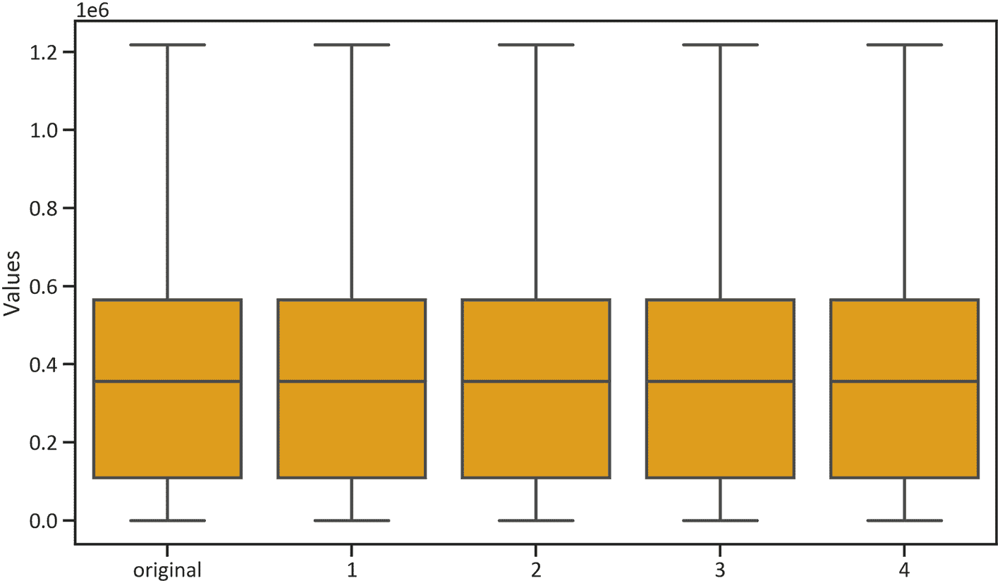

**图 3-10** 美国新冠确诊病例蒙特卡洛模拟结果的直方图

```
fig, ax = plt.subplots(figsize= (12, 7))
sns.boxplot(data = monte_carlo_model_simulation_results, color = "orange")
plt.ylabel("数值")
plt.show()
清单 3-16
构建美国新冠确诊病例蒙特卡洛模拟结果的直方图
```

## 结论

本章展示了两种解决序列问题的方法：高斯隐马尔可夫模型和蒙特卡洛模拟。马尔可夫模型返回了两个状态：0（表示美国新冠确诊病例增加）和 1（表示美国新冠确诊病例减少）。随后，使用蒙特卡洛模拟方法进行了五次模拟试验，所有结果均显示病例在上升。

脚注 1

