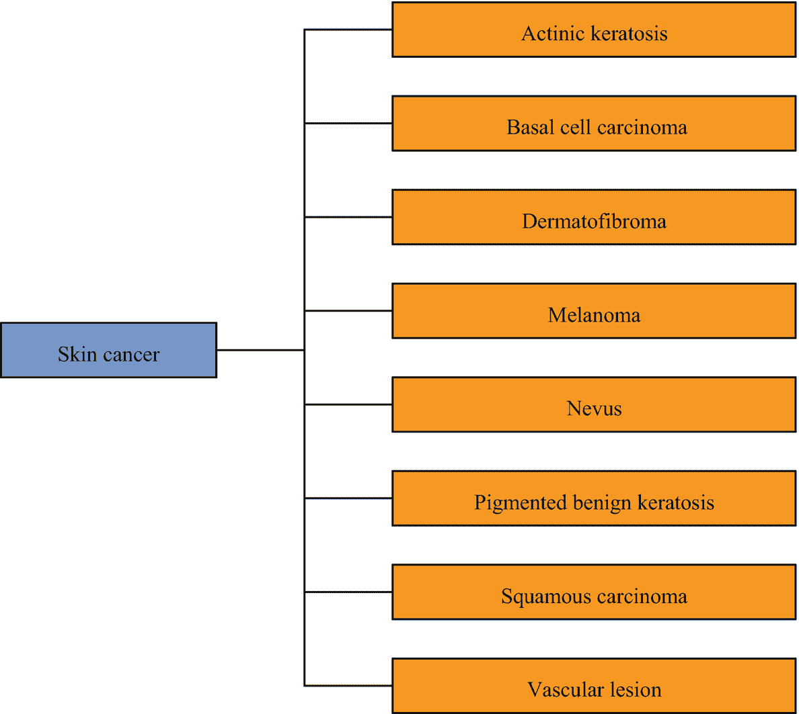
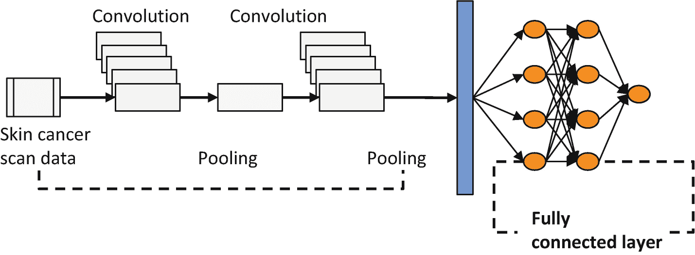
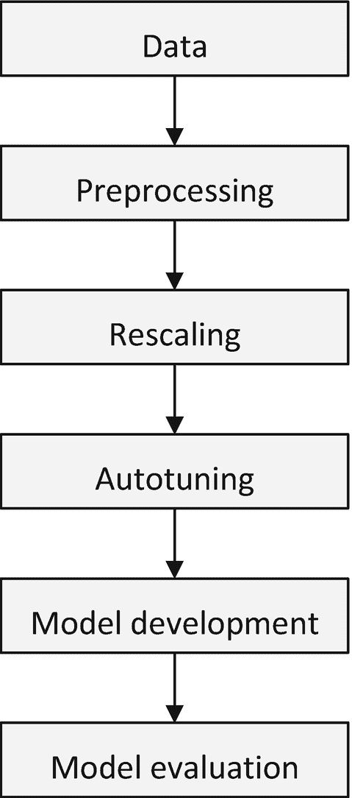
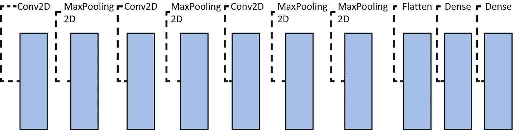
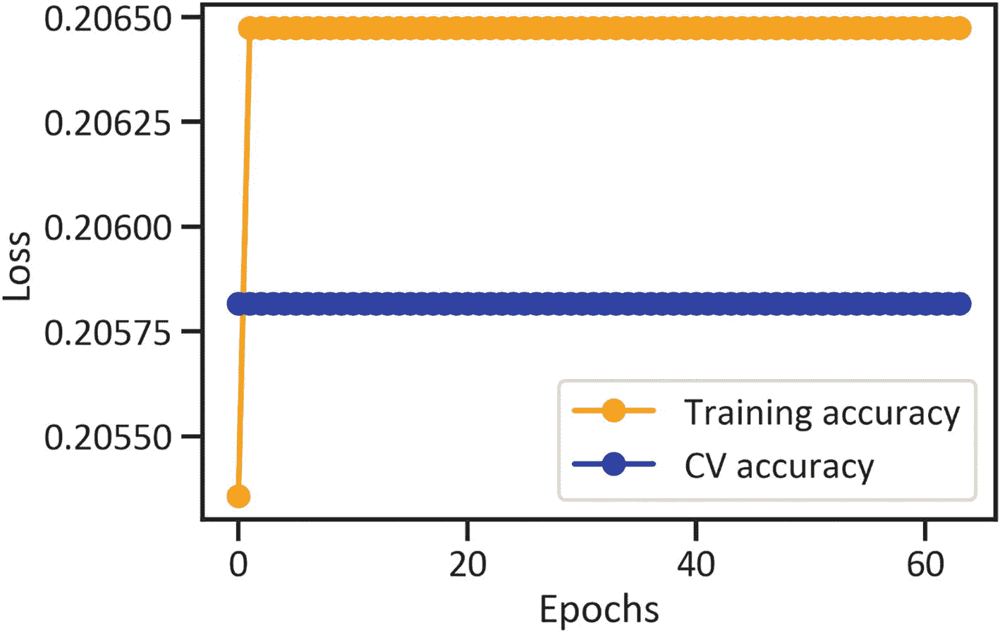
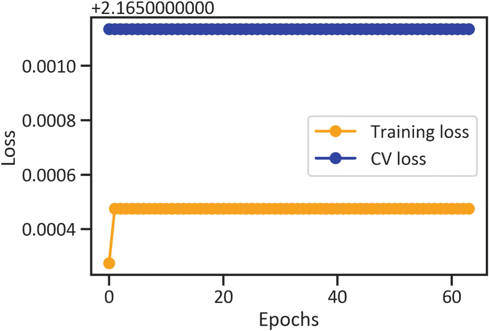
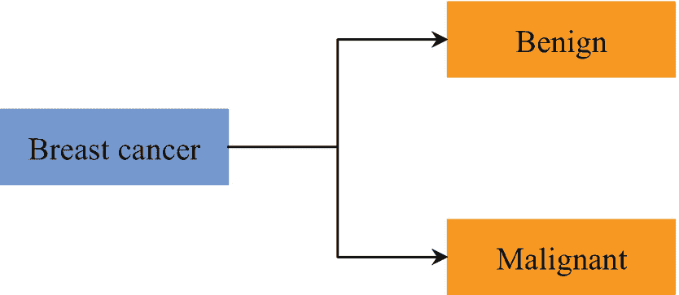
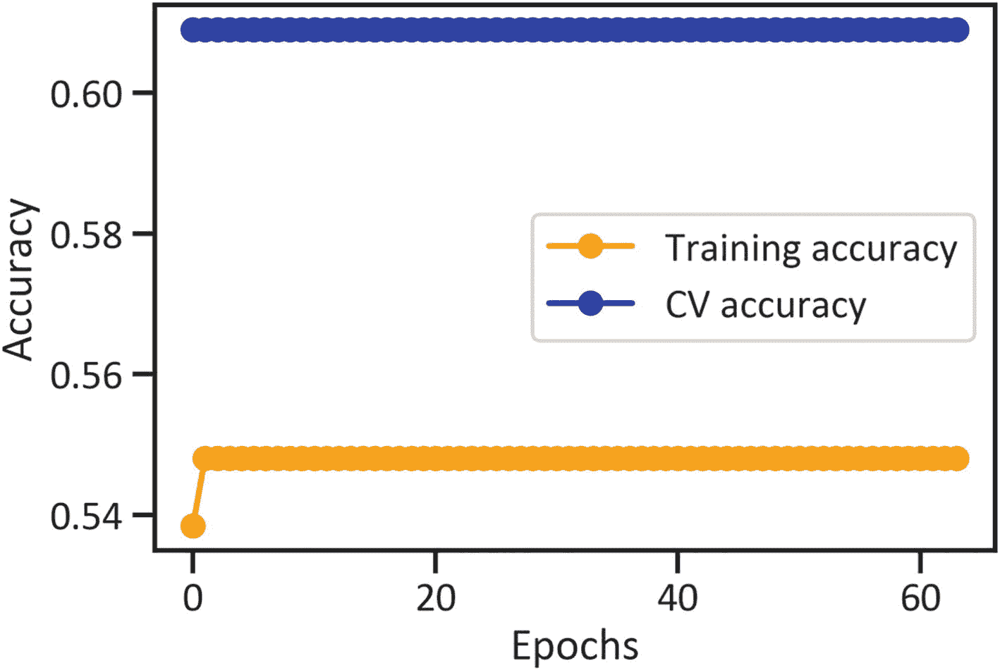
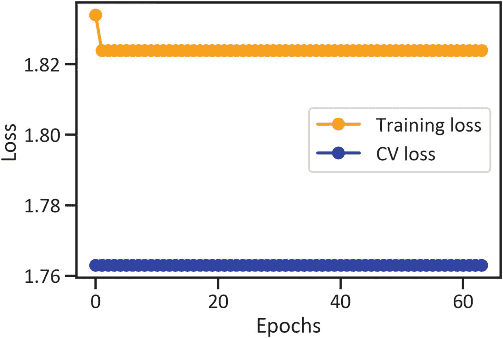

# 4. 使用神经网络进行癌症分割

本章将解释计算机视觉和卷积神经网络在乳腺癌和皮肤癌识别与分割中的实际应用。你将探索一种通过应用 `canny`、`Laplacian` 和 `sobel` 滤波器来过滤医学扫描图像的方法。你还将确定网络在区分患有和未患有癌症患者的扫描图像方面的准确程度。

## 探索癌症

癌症是一种以细胞异常生长为特征的疾病，并倾向于在全身扩散。我们通过可见的肿瘤、异常出血和长期咳嗽来识别这种特定疾病。

致癌因素种类繁多。除了接触某些化学物质外，吸烟和过量饮酒等生活方式行为也可能构成风险。

诊断患者是否患有癌症的最常见方法包括核磁共振成像和超声扫描。在癌症的发展阶段，可以通过化疗、手术和放射治疗等方法进行治疗。鉴于上述情况，定期进行医学检查以诊断癌症至关重要。

## 探索皮肤癌

让我们执行一个卷积神经网络来识别皮肤癌的可见特征。图 4-1 描绘了网络将区分的皮肤癌的主要类型。



图 4-1 各种形式的皮肤癌

图 4-1 展示了常见的皮肤癌类型，例如光化性角化病、基底细胞癌、皮肤纤维瘤等。

### 通过执行 CNN 对患者皮肤癌结果进行分类

卷积神经网络是广泛应用于图像分类的一类特殊网络。它们非常适合本章中的用例。你将应用一种机器学习算法，该算法学习现有皮肤癌数据中的模式，向其输入未见过的皮肤癌扫描数据，并评估其对扫描结果的分类效果。图 4-2 展示了一个卷积神经网络的简单示例。



图 4-2 卷积神经网络示例

图 4-2 展示了一个 CNN，它包含一个接收输入皮肤癌扫描数据的输入层。随后，它通过使用线性或非线性核将输入数据降维，形成物体的部分特征。接着，它聚合降维后的数据以形成完整的物体。这一物体检测过程复制了人类视觉皮层的机制。

CNN 之所以能超越浅层神经网络，主要在于其具备降维能力。如图 4-2 所示，CNN 包含以下关键层：

- **卷积层：** 接收来自输入层的数据。然后识别并优先处理数据中的重要特征，并将数据传输到池化层。
- **池化层：** 处理并聚合从卷积层接收到的特征，将其整合到下一层的单个神经元中。
- **全连接层：** 连接前几层的所有神经元，处理数据，并将数据传输到输出层。

除了本章的用例外，CNN 还可应用于人脸检测、推荐系统和自然语言处理等领域。

### CNN 流水线

本章遵循图 4-3 所示的简单流水线。流水线是概括模型生命周期的步骤。



图 4-3 CNN 流水线

图 4-3 将数据提取作为流水线的初始步骤。本章使用的数据来自 Kaggle^(⁴)。下一步是数据预处理，涉及以下任务：

- 指定用于训练和验证的数据子集（预留一部分数据供 CNN 学习图像模式，另一部分用于验证其预测结果）
- 指定验证集划分比例（将数据划分为训练数据和验证数据的比例）
- 指定图像尺寸（输入图像的通道数和像素数）
- 指定批次大小（每次迭代处理的训练标签数量）

下一步是数据缩放，涉及以下任务：

- 指定类别模式
- 指定目标尺寸（CNN 生成的图像尺寸）
- 分配批次大小
- 生成标签

接下来是模型开发与评估。

### CNN 的架构结构

用于对患者脑肿瘤结果进行分类的 CNN 具有相对简单的架构结构，如图 4-4 所示。



图 4-4 CNN 的架构结构

该 CNN 由一组 2D 卷积层和 `MaxPooling2D` 层、一个展平层以及两个密集层组成，所有层都包含一个修正线性单元（`relu`）激活函数，该函数吸收并建模输入，以估计目标特征的一组无约束值。第 2 章详细讨论了 `relu` 函数。

### 通过执行 CNN 对皮肤癌诊断图像数据进行分类

清单 4-1 通过执行 `pathlib` 库来收集数据。

```python
import pathlib
skin_cancer_data = pathlib.Path(r"filepath")
```

清单 4-1 收集皮肤癌诊断图像数据

### 预处理训练用皮肤癌图像数据

清单 4-2 通过执行 `keras` 库中的 `image_dataset_from_directory()` 方法对图像进行预处理（用于训练）。同时，它指定了 `validation_split`、`subset`、`image_size` 和 `batch_size`。

```python
skin_cancer_training_data = tf.keras.preprocessing.image_dataset_from_directory(skin_cancer_data, seed = 123, validation_split = 0.2, subset = "training",  image_size = (180, 180), batch_size = 16)
```

清单 4-2 预处理训练用皮肤癌图像数据

### 预处理验证用皮肤癌图像数据

清单 4-3 通过执行 `keras` 库中的 `image_dataset_from_directory()` 方法对图像进行预处理（用于验证）。同时，它指定了 `validation_split`、`subset`、`image_size` 和 `batch_size`。

```python
skin_cancer_validation_data = tf.keras.preprocessing.image_dataset_from_directory(skin_cancer_data, seed = 123, validation_split = 0.2, subset = "validation", image_size = (180, 180), batch_size = 16)
```

清单 4-3 预处理验证用皮肤癌图像数据

### 生成训练用皮肤癌诊断图像数据

清单 4-4 通过执行 `ImageDataGenerator()` 方法并指定缩放比例来生成用于训练的图像。然后，它执行 `flow_from_directory()` 方法并指定 `target_size`、`class_mode` 和 `batch_size`。

```python
import keras
skin_cancer_training_data_categories = np.array(skin_cancer_training_data.class_names)
skin_cancer_generated_image_data = keras.preprocessing.image.ImageDataGenerator(rescale = 1./255)
skin_cancer_generated_image_data_for_training = skin_cancer_generated_image_data.flow_from_directory(skin_cancer_data,
target_size = (180, 180),
class_mode = "categorical",
shuffle = True,
batch_size = 16)
skin_cancer_images, skin_cancer_labels = next(iter(skin_cancer_generated_image_data_for_training))
```

清单 4-4 生成训练用皮肤癌诊断图像数据

### 调优训练用皮肤癌图像数据

本节开发一个卷积神经网络。首先，通过调优来准备图像数据，使网络能够更好地发现模式（见清单 4-5）。

```python
skin_cancer_experimental_tuning = tf.data.experimental.AUTOTUNE
skin_cancer_training_data = skin_cancer_training_data.cache().shuffle(1000).prefetch(buffer_size = skin_cancer_experimental_tuning)
skin_cancer_validation_data = skin_cancer_validation_data.cache().prefetch(buffer_size = skin_cancer_experimental_tuning)
```

清单 4-5 调优训练用皮肤癌图像数据

### 执行 CNN 对皮肤癌诊断图像数据进行分类

清单 4-6 在图像数据上训练卷积神经网络。

```python
from tensorflow.keras import layers
from tensorflow.python.keras.layers import Dense, Flatten, Conv2D, Dropout, MaxPooling2D
skin_cancer_convolutional_net_model = Sequential([
layers.experimental.preprocessing.Rescaling(1./255, input_shape = (180, 180, 3)),
layers.Conv2D(16, 3, padding = "same", activation = "relu"),
layers.MaxPooling2D(),
layers.Conv2D(32, 3, padding = "same", activation = "relu"),
layers.MaxPooling2D(),
layers.Conv2D(64, 3, padding = "same", activation = "relu"),
layers.MaxPooling2D(),
layers.Flatten(),
layers.Dense(128, activation = "relu"),
layers.Dense(9, activation='softmax')])
skin_cancer_convolutional_net_model.compile(optimizer = "adam",
loss = tf.keras.losses.SparseCategoricalCrossentropy(from_logits = True),
metrics = ["accuracy"])
skin_cancer_convolutional_net_model_history = skin_cancer_convolutional_net_model.fit(skin_cancer_training_data,
validation_data = skin_cancer_validation_data, epochs = 64)
skin_cancer_convolutional_net_model_history
```

清单 4-6 执行 CNN 对皮肤癌诊断图像数据进行分类

### 评估 CNN 的性能

为了确定 CNN 在训练和交叉验证中对患者皮肤癌结果进行分类的效果，本部分监测了随着轮次增加，稀疏分类交叉熵损失和准确率指标的波动程度。

#### 训练和交叉验证中准确率随轮次的波动

图 4-5 展示了当 CNN 对患者皮肤癌结果进行分类时，训练和交叉验证中准确率随轮次增加的波动程度。代码见清单 4-7。



图 4-5 训练和交叉验证中准确率随轮次的波动

```python
plt.plot(skin_cancer_convolutional_net_model_history.history["accuracy"],
color = "orange",
marker = "o",
label = "Training accuracy")
plt.plot(skin_cancer_convolutional_net_model_history.history["val_accuracy"],
color = "blue",
marker = "o",
label = "CV accuracy")
plt.xlabel("Epochs")
plt.ylabel("Accuracy")
plt.legend(loc = "best")
plt.show()
```

清单 4-7 绘制训练和交叉验证中准确率随轮次的波动图

#### 训练和交叉验证中稀疏分类交叉熵损失随轮次的波动

图 4-6 展示了当 CNN 对患者皮肤癌结果进行分类时，训练和交叉验证中稀疏分类交叉熵损失随轮次增加的波动程度。代码见清单 4-8。



图 4-6 训练和交叉验证中稀疏分类交叉熵损失随轮次的波动

```python
plt.plot(skin_cancer_convolutional_net_model_history.history["loss"],
color = "orange",
marker = "o",
label = "Training loss")
plt.plot(skin_cancer_convolutional_net_model_history.history["val_loss"],
color = "blue",
marker = "o",
label = "CV loss")
plt.xlabel("Epochs")
plt.ylabel("Loss")
plt.legend(loc = "best")
plt.show()
```

清单 4-8 绘制训练和交叉验证中稀疏分类交叉熵损失随轮次的波动图

## 乳腺癌的可见存在

本节执行 CNN 以实现乳腺癌的可见存在。图 4-7 展示了网络将区分的乳腺癌主要形式。



图 4-7 乳腺癌的形式

图 4-7 展示了两种常见的乳腺癌形式：良性和恶性。

### 通过执行 CNN 对乳腺癌患者的超声扫描进行分类

清单 4-9 通过执行 `pathlib` 库来收集数据。

```python
breast_cancer_data = pathlib.Path(r"filepath\Dataset_BUSI_with_GT")
```

清单 4-9 收集乳腺癌诊断图像数据

### 预处理验证集乳腺癌图像数据

清单 4-10 通过执行 `keras` 库中的 `image_dataset_from_directory()` 方法来预处理图像（用于验证）。同时，它指定了 `validation_split`、`subset`、`image_size` 和 `batch_size`。

```python
breast_cancer_validation_data = tf.keras.preprocessing.image_dataset_from_directory(breast_cancer_data, seed = 123, validation_split = 0.2, subset = "validation", image_size = (180, 180), batch_size = 16)
```

清单 4-10 预处理验证集乳腺癌图像数据

### 生成训练集乳腺癌诊断图像数据

清单 4-11 通过执行 `ImageDataGenerator()` 方法并指定缩放比例来生成用于训练的图像。随后，它执行 `flow_from_directory()` 方法并指定 `target_size`、`class_mode` 和 `batch_size`。

```python
breast_cancer_training_data_categories = np.array(breast_cancer_training_data.class_names)
breast_cancer_generated_image_data = keras.preprocessing.image.ImageDataGenerator(rescale = 1./255)
breast_cancer_generated_image_data_for_training = breast_cancer_generated_image_data.flow_from_directory(breast_cancer_data,  target_size = (180, 180),  class_mode = "categorical",  shuffle = True,  batch_size = 16)
breast_cancer_images, breast_cancer_labels = next(iter(breast_cancer_generated_image_data_for_training))
```

清单 4-11 生成训练集乳腺癌诊断图像数据

### 调优训练集乳腺癌图像数据

本节开发了一个 CNN。首先，它通过调优来准备图像数据，以便网络更好地发现模式（见清单 4-12）。

```python
breast_cancer_experimental_tuning = tf.data.experimental.AUTOTUNE
breast_cancer_training_data = breast_cancer_training_data.cache().shuffle(1000).prefetch(buffer_size = breast_cancer_experimental_tuning)
breast_cancer_validation_data = breast_cancer_validation_data.cache().prefetch(buffer_size = breast_cancer_experimental_tuning)
```

清单 4-12 调优训练集乳腺癌图像数据

### 执行 CNN 对乳腺癌诊断图像数据进行分类

清单 4-13 在图像数据上训练 `CNN`。

```python
breast_cancer_convolutional_net_model = Sequential([
    layers.experimental.preprocessing.Rescaling(1./255, input_shape = (180, 180, 3)),
    layers.Conv2D(16, 3, padding = "same", activation = "relu"),
    layers.MaxPooling2D(),
    layers.Conv2D(32, 3, padding = "same", activation = "relu"),
    layers.MaxPooling2D(),
    layers.Conv2D(64, 3, padding = "same", activation = "relu"),
    layers.MaxPooling2D(),
    layers.Flatten(),
    layers.Dense(128, activation = "relu"),
    layers.Dense(9, activation='softmax')
])
breast_cancer_convolutional_net_model.compile(optimizer = "adam", loss = tf.keras.losses.SparseCategoricalCrossentropy(from_logits = True), metrics = ["accuracy"])
breast_cancer_convolutional_net_model_history = breast_cancer_convolutional_net_model.fit(breast_cancer_training_data, validation_data = breast_cancer_validation_data, epochs = 64)
breast_cancer_convolutional_net_model_history
```

清单 4-13 执行 `CNN` 对乳腺癌诊断图像数据进行分类

## 评估 `CNN` 的性能

为了确定 `CNN` 在训练和交叉验证中对患者乳腺癌结果分类的效果，本节监测了 `稀疏分类交叉熵损失` 和 `准确率` 指标随 `训练轮次` 增加而波动的程度。

### 训练与交叉验证中准确率随训练轮次的波动

`图 4-8` 展示了 `CNN` 对患者乳腺癌结果进行分类时，训练和交叉验证中 `准确率` 随 `训练轮次` 增加而波动的程度。相关代码见 `代码清单 4-14`。

```python
plt.plot(breast_cancer_convolutional_net_model_history.history["accuracy"],
         color = "orange",
         marker = "o",
         label = "Training accuracy")
plt.plot(breast_cancer_convolutional_net_model_history.history["val_accuracy"],
         color = "blue",
         marker = "o",
         label = "CV accuracy")
plt.xlabel("Epochs")
plt.ylabel("Accuracy")
plt.legend(loc = "best")
plt.show()
```

`代码清单 4-14` 绘制训练与交叉验证中 `准确率` 随 `训练轮次` 的波动


图 4-8 训练与交叉验证中 `准确率` 随 `训练轮次` 的波动

### 训练与交叉验证中稀疏分类交叉熵损失随训练轮次的波动

`图 4-9` 展示了 `CNN` 对患者乳腺癌结果进行分类时，训练和交叉验证中 `稀疏分类交叉熵损失` 随 `训练轮次` 增加而波动的程度。相关代码见 `代码清单 4-15`。

```python
plt.plot(breast_cancer_convolutional_net_model_history.history["loss"],
         color = "orange",
         marker = "o",
         label = "Training loss")
plt.plot(breast_cancer_convolutional_net_model_history.history["val_loss"],
         color = "blue",
         marker = "o",
         label = "CV loss")
plt.xlabel("Epochs")
plt.ylabel("Loss")
plt.legend(loc = "best")
plt.show()
```

`代码清单 4-15` 绘制训练与交叉验证中 `稀疏分类交叉熵损失` 随 `训练轮次` 的波动


图 4-9 训练与交叉验证中 `稀疏分类交叉熵损失` 随 `训练轮次` 的波动

## 结论

本章通过执行卷积神经网络对癌症患者和非癌症患者的扫描图像进行分类。最后对两种卷积神经网络进行了评估。