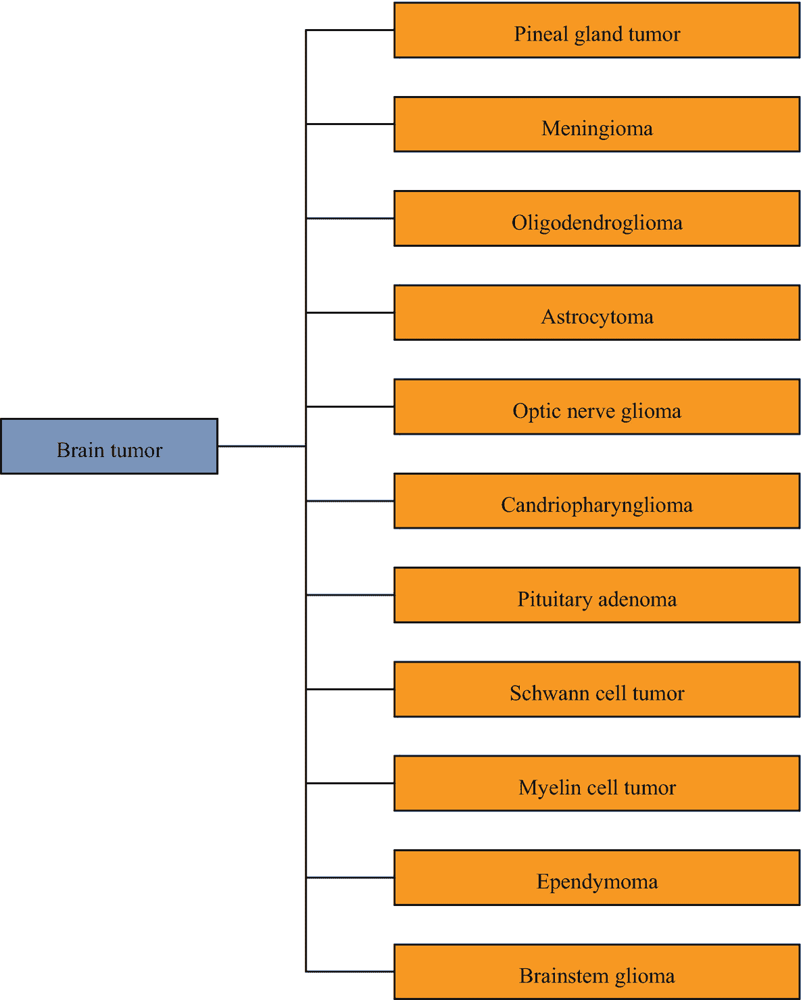
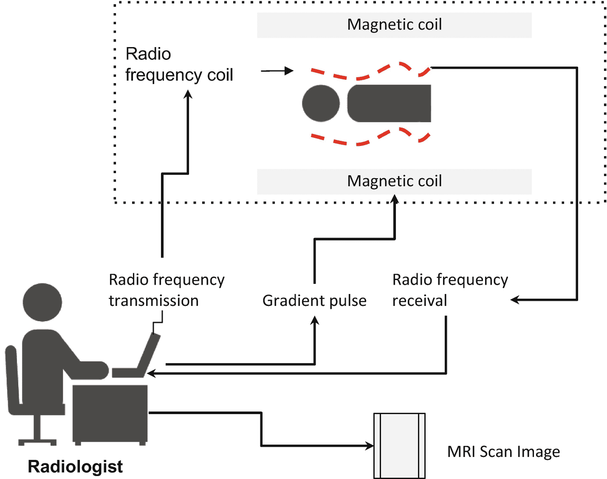
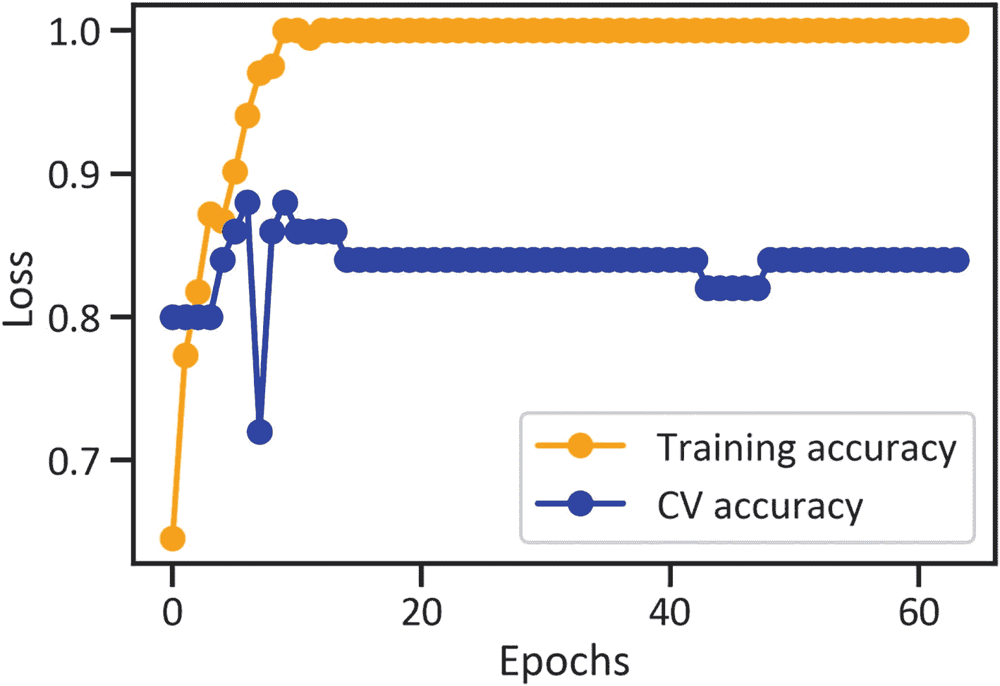
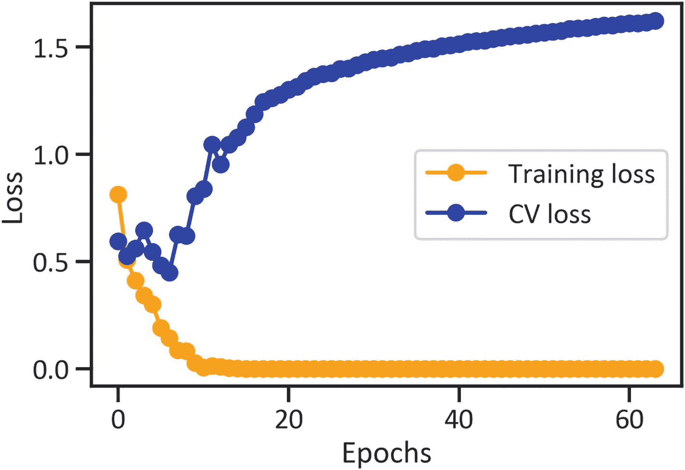
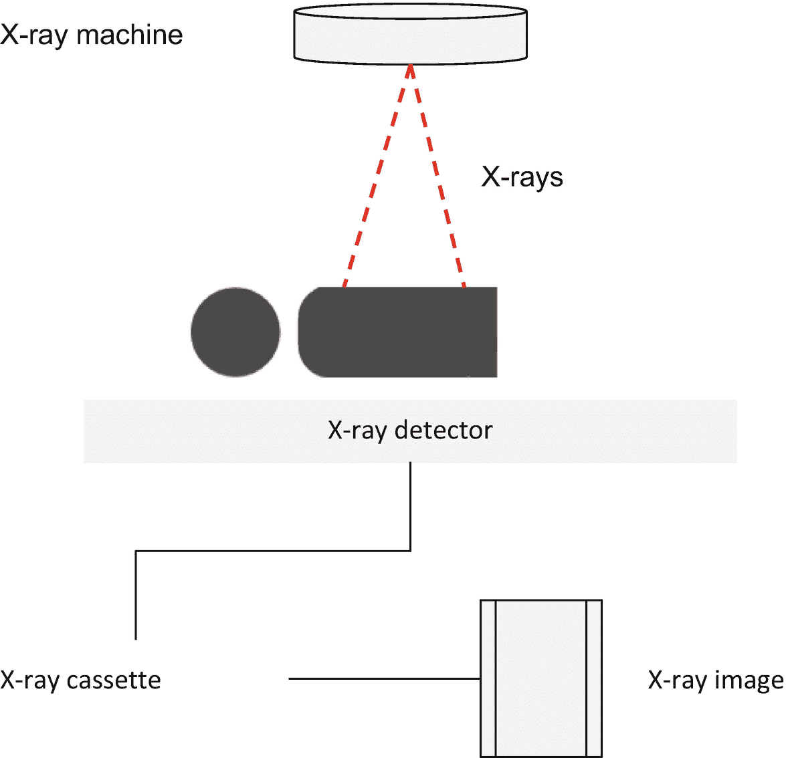
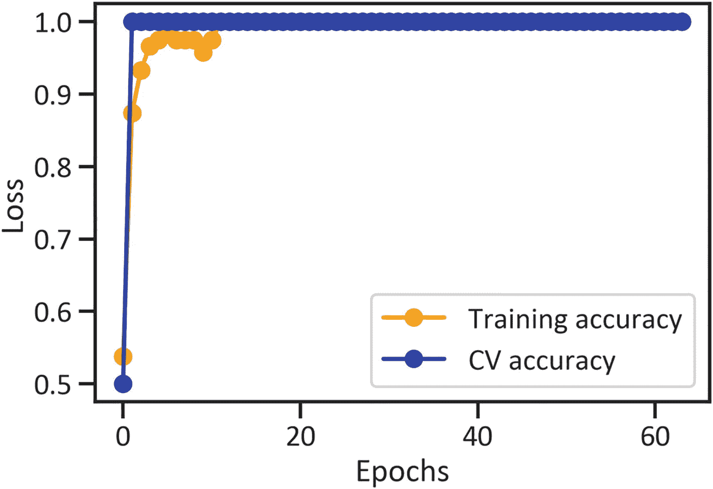
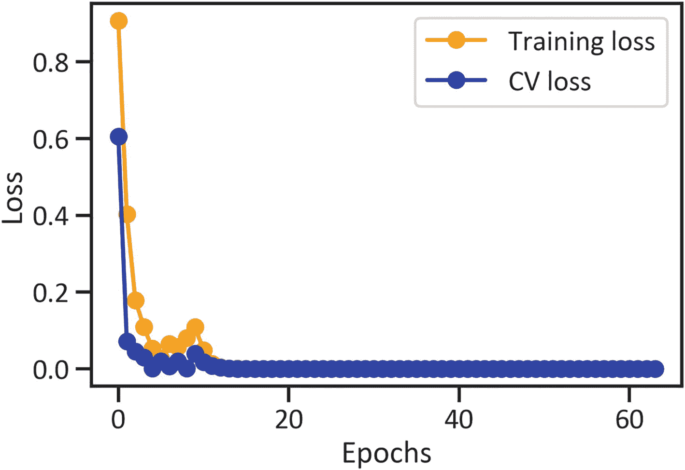

# 5. 通过执行人工神经网络对磁共振成像和 X 光片进行建模

本章将向您介绍计算机视觉和人工神经网络在神经病学和放射学中的实际应用。在本章中，您将执行卷积神经网络（CNN）进行图像分类。第一个网络将对 MRI 扫描进行建模，以区分脑肿瘤患者和非患者；第二个网络将对 X 光片进行建模，以区分肺炎患者和非患者。您将学习一种在医学图像分类中评估网络的有效技术。

## 脑肿瘤

脑肿瘤是指大脑区域周围细胞的异常生长。脑肿瘤有多种类型。图 5-1 展示了最常见的脑肿瘤类型。



图 5-1

脑肿瘤的类型

### MRI 检查流程

发现脑肿瘤最常用的方法是磁共振成像（MRI）扫描，该检查由神经科医生、神经外科医生等专业医疗人员执行。图 5-2 提供了 MRI 扫描流程的高层概览。



图 5-2

简单的 MRI 检查流程

图 5-2 展示了一位放射科医生使用基于计算机的系统，该系统发射由射频线圈接收的无线电频率，以及由磁线圈接收的梯度脉冲。作为回报，基于计算机的系统接收并处理反馈频率，以生成 MRI 扫描图像。

### 预处理训练用 MRI 图像数据

代码清单 5-1 通过执行`keras`库中的`image_dataset_from_directory()`方法对图像（用于训练）进行预处理。同时，它指定了`validation_split`、`subset`、`image_size`和`batch_size`参数。首先，在您的环境中安装 TensorFlow：`pip install tensorflow`。

```
import tensorflow as tf
brain_tumor_training_data = image_dataset_from_directory(brain_tumor_data, seed = 123, validation_split = 0.2, subset = "training", image_size = (180, 180), batch_size = 16)
代码清单 5-1
预处理训练用 MRI 图像数据
```

### 预处理验证用 MRI 图像数据

代码清单 5-2 通过执行`keras`库中的`image_dataset_from_directory()`方法对图像（用于验证）进行预处理。同时，它指定了`validation_split`、`subset`、`image_size`和`batch_size`参数。

```
brain_tumor_validation_data = image_dataset_from_directory(brain_tumor_data, seed = 123, validation_split = 0.2, subset = "validation", image_size = (180, 180), batch_size = 16)
代码清单 5-2
预处理验证用 MRI 图像数据
```

### 生成训练用 MRI 图像数据

代码清单 5-3 通过执行`ImageDataGenerator()`方法并指定缩放比例来生成用于训练的图像。随后，它实现了`flow_from_directory()`方法，并指定了`target_size`、`class_mode`和`batch_size`参数。首先，在您的环境中安装 NumPy：`pip install numpy`。

```
import numpy as np
brain_tumor_training_data_categories = np.array(brain_tumor_training_data.class_names)
brain_tumor_generated_image_data = ImageDataGenerator(rescale = 1./255)
brain_tumor_generated_image_data_for_training = brain_tumor_generated_image_data.flow_from_directory(brain_tumor_data, target_size = (180, 180), class_mode = "categorical", shuffle = True, batch_size = 16)
brain_tumor_images, brain_tumor_labels = next(iter(brain_tumor_generated_image_data_for_training))
代码清单 5-3
生成训练用 MRI 图像数据
```

### 调优训练用 MRI 图像数据

本节开发了一个 CNN。首先，它通过调优图像数据（见代码清单 5-4）的方式，使网络能够更好地识别模式。

```
brain_tumor_experimental_tuning = tf.data.experimental.AUTOTUNE
brain_tumor_training_data = brain_tumor_training_data.cache().shuffle(1000).prefetch(buffer_size = brain_tumor_experimental_tuning)
brain_tumor_validation_data = brain_tumor_validation_data.cache().prefetch(buffer_size = brain_tumor_experimental_tuning)
代码清单 5-4
调优训练用 MRI 图像数据
```


### 执行 CNN 对 MRI 图像数据进行分类

清单 5-5 对图像数据执行了 CNN。

```
from tensorflow.keras import layers
from tensorflow.python.keras.layers import Dense, Flatten, Conv2D, Dropout, MaxPooling2D
brain_tumor_convolutional_net_model = tf.keras.Sequential([
tf.keras.layers.experimental.preprocessing.Rescaling(1./255),
tf.keras.layers.Conv2D(16, 3, activation = "relu"),
tf.keras.layers.MaxPooling2D(),
tf.keras.layers.Conv2D(64, 3, activation="relu"),
tf.keras.layers.MaxPooling2D(),
tf.keras.layers.Conv2D(128, 3, activation="relu"),
tf.keras.layers.MaxPooling2D(),
tf.keras.layers.Flatten(),
tf.keras.layers.Dense(255, activation="relu"),
tf.keras.layers.Dense(3)
])
brain_tumor_convolutional_net_model.compile(optimizer = "adam", loss = tf.keras.losses.SparseCategoricalCrossentropy(from_logits = True), metrics = ["accuracy"])
brain_tumor_convolutional_net_model_history = brain_tumor_convolutional_net_model.fit(brain_tumor_training_data, validation_data = brain_tumor_validation_data, epochs = 64)
清单 5-5
执行 CNN 对 MRI 图像数据进行分类
```

### 评估 CNN 的性能

用于对患者脑肿瘤结果进行分类的 CNN 由一组 2D 卷积层和 MaxPooling 2D 层、一个展平层和两个密集层组成。所有层都包含一个`relu`激活函数，并采用稀疏分类交叉熵损失函数和准确率指标。此外，该模型在 64 个周期上进行了训练。

##### 训练与交叉验证中准确率随周期的波动

图 5-3 展示了当 CNN 对患者脑肿瘤结果进行分类时，训练和交叉验证中准确率随周期增加的波动程度。相关代码见清单 5-6。



图 5-3

训练与交叉验证中准确率随周期的波动

```
plt.plot(brain_tumor_convolutional_net_model_history.history["accuracy"],
color = "orange",
marker = "o",
label = "Training accuracy")
plt.plot(brain_tumor_convolutional_net_model_history.history["val_accuracy"],
color = "blue",
marker = "o",
label = "CV accuracy")
plt.xlabel("Epochs")
plt.ylabel("Loss")
plt.legend(loc = "best")
plt.show()
清单 5-6
绘制 CNN 在各周期中的准确率得分
```

图 5-3 显示，当 CNN 对患者脑肿瘤结果进行分类时，训练和交叉验证中的准确率均有所提升，但在所有周期中交叉验证的准确率略低。

##### 训练与交叉验证中稀疏分类交叉熵损失随周期的波动

图 5-4 展示了当 CNN 对患者脑肿瘤结果进行分类时，训练和交叉验证中稀疏分类交叉熵损失随周期增加的波动程度。相关代码见清单 5-7。



图 5-4

训练与交叉验证中稀疏分类交叉熵损失随周期的波动

```
plt.plot(brain_tumor_convolutional_net_model_history.history["loss"],
color = "orange",
marker = "o",
label = "Training loss")
plt.plot(brain_tumor_convolutional_net_model_history.history["val_loss"],
color = "blue",
marker = "o",
label = "CV loss")
plt.xlabel("Epochs")
plt.ylabel("Loss")
plt.legend(loc = "best")
plt.show()
清单 5-7
绘制 CNN 在各周期中的损失值
```

图 5-4 显示，当 CNN 对患者脑肿瘤结果进行分类时，训练中的稀疏分类交叉熵损失有所增加，但交叉验证中的损失则有所下降。

## 肺炎

肺炎是一种由细菌或病毒引起的可预防的肺部感染。为预防此病，可以选择接种疫苗。肺炎的典型症状包括持续咳嗽、长期发热和呼吸困难等。该病在哮喘患者、糖尿病患者和吸烟者等风险人群中较为常见。对抗此病的医学分支称为肺病学。

### X 射线成像流程

图 5-5 展示了 X 射线成像流程。



图 5-5

X 射线成像流程

图 5-5 描绘了 X 射线机释放辐射剂量，这些辐射穿过人体后被 X 射线探测器检测到，随后传输到暗盒并生成图像。

#### 通过执行 CNN 对 X 射线进行分类

本节涵盖用于滤波的计算机视觉技术，以及使用 CNN 对患有和未患有肺炎患者的胸部 X 光片进行分类。数据集来源于此处^(⁵)，你也可以从 Kaggle^(⁶)下载。

##### 处理 X 射线图像数据

清单 5-8 收集了用于训练 CNN 的 X 光片数据。

```
import pathlib
chest_x_ray_training_df = pathlib.Path(r"filepath\xray_dataset\train")
清单 5-8
处理训练用胸部 X 射线图像数据
```

清单 5-9 通过执行`keras`库中的`image_dataset_from_directory()`方法对图像（用于训练）进行预处理。同时，它还指定了`validation_split`、`subset`、`image_size`和`batch_size`参数。

```
chest_x_ray_training_data = image_dataset_from_directory(chest_x_ray_training_df, seed = 123, validation_split = 0.2, subset = "training",  image_size = (180, 180), batch_size = 16)
清单 5-9
预处理脑肿瘤训练图像数据
```

##### 生成训练用胸部 X 射线图像数据

清单 5-10 通过执行`ImageDataGenerator()`方法并指定缩放比例来生成用于训练的图像。随后，它实现了`flow_from_directory()`方法，并指定了`target_size`、`class_mode`和`batch_size`参数。

```
chest_x_ray_training_data_categories = np.array(chest_x_ray_training_data.class_names)
chest_x_ray_generated_image_data = ImageDataGenerator(rescale = 1./255)
chest_x_ray_generated_image_data_for_training = chest_x_ray_generated_image_data.flow_from_directory(chest_x_ray_training_df, target_size = (180, 180), class_mode = "categorical",  shuffle = True,  batch_size = 16)
chest_x_ray_training_images, chest_x_ray_training_labels = next(iter(chest_x_ray_generated_image_data_for_training))
清单 5-10
生成训练用胸部 X 射线图像数据
```


##### 预处理验证胸部 X 光图像数据

清单 5-11 收集了用于验证 CNN 的 X 光图像数据。

```
chest_x_ray_validation_df = r"filepath\xray_dataset\test"
清单 5-11
处理验证胸部 X 光图像数据
```

清单 5-12 通过执行`keras`库中的`image_dataset_from_directory()`方法来预处理图像（用于训练）。同样，它指定了`validation_split`、`subset`、`image_size`和`batch_size`。

```
chest_x_ray_validation_data = image_dataset_from_directory(chest_x_ray_validation_df, seed = 123, validation_split = 0.2, subset = "validation",  image_size = (180, 180), batch_size = 16)
清单 5-12
预处理验证胸部 X 光图像数据
```

##### 生成验证胸部 X 光图像数据

清单 5-13 通过执行`ImageDataGenerator()`方法并指定缩放比例来生成用于训练的图像。随后，它实现了`flow_from_directory()`方法，并指定了`target_size`、`class_mode`和`batch_size`。

```
chest_x_ray_validation_data_categories = np.array(chest_x_ray_validation_data.class_names)
chest_x_ray_generated_image_data = ImageDataGenerator(rescale = 1./255)
chest_x_ray_generated_image_data_for_validation = chest_x_ray_generated_image_data.flow_from_directory(chest_x_ray_validation_df, target_size = (180, 180), class_mode = "categorical", shuffle = True, batch_size = 16)
chest_x_ray_validation_images, chest_x_ray_validation_labels = next(iter(chest_x_ray_generated_image_data_for_validation))
清单 5-13
生成验证胸部 X 光图像数据
```

##### 调优训练胸部 X 光图像数据

本节开发了一个 CNN。首先，它通过调优图像数据来准备数据，以便网络更好地识别模式（参见清单 5-14）。

```
chest_x_ray_experimental_tuning = tf.data.experimental.AUTOTUNE
chest_x_ray_training_data = chest_x_ray_training_data.cache().shuffle(1000).prefetch(buffer_size = chest_x_ray_experimental_tuning)
chest_x_ray_validation_data = chest_x_ray_validation_data.cache().prefetch(buffer_size = chest_x_ray_experimental_tuning)
清单 5-14
调优训练胸部 X 光图像数据
```

### 执行 CNN 以分类胸部 X 光图像数据

用于分类患者肺炎结果的 CNN 架构与上述用于分类患者脑肿瘤结果的 CNN 类似。它也包含一组 2D 卷积层和最大池化 2D 层、一个展平层和两个全连接层。所有层都包含一个`relu`激活函数，由一个稀疏分类交叉熵损失函数和一个准确率指标组成。此外，它训练了 64 个周期。参见清单 5-15 中的代码。

```
chest_x_ray_convolutional_net_model = tf.keras.Sequential([
tf.keras.layers.experimental.preprocessing.Rescaling(1./255),
tf.keras.layers.Conv2D(16, 3, activation = "relu"),
tf.keras.layers.MaxPooling2D(),
tf.keras.layers.Conv2D(64, 3, activation="relu"),
tf.keras.layers.MaxPooling2D(),
tf.keras.layers.Conv2D(128, 3, activation="relu"),
tf.keras.layers.MaxPooling2D(),
tf.keras.layers.Flatten(),
tf.keras.layers.Dense(255, activation="relu"),
tf.keras.layers.Dense(3)
])
chest_x_ray_convolutional_net_model.compile(optimizer = "adam", loss = tf.keras.losses.SparseCategoricalCrossentropy(from_logits = True), metrics = ["accuracy"])
chest_x_ray_convolutional_net_model_history = chest_x_ray_convolutional_net_model.fit(chest_x_ray_training_data, validation_data = chest_x_ray_validation_data, epochs = 64)
清单 5-15
执行 CNN 以分类胸部 X 光图像数据
```

### 评估 CNN 的性能

为了确定 CNN 在训练和交叉验证中对患者肺炎结果分类的效果如何，本节监测了随着周期增加，稀疏分类交叉熵损失和准确率指标的波动程度。

#### 训练和交叉验证中准确率随周期的波动

图 5-6 描绘了当 CNN 对患者肺炎结果进行分类时，训练和交叉验证中准确率随周期增加的波动程度。参见清单 5-16 中的代码。



图 5-6

训练和交叉验证中准确率随周期的波动

```
plt.plot(chest_x_ray_convolutional_net_model_history.history["accuracy"],
color = "orange",
marker = "o",
label = "训练准确率")
plt.plot(chest_x_ray_convolutional_net_model_history.history["val_accuracy"],
color = "blue",
marker = "o",
label = "交叉验证准确率")
plt.xlabel("周期")
plt.ylabel("损失")
plt.legend(loc = "最佳位置")
plt.show()
清单 5-16
绘制训练和交叉验证中准确率随周期的波动图
```

图 5-6 描绘了当 CNN 对患者肺炎结果进行分类时，训练和交叉验证中的准确率突然提升，其中交叉验证中的准确率略低。

#### 训练和交叉验证中稀疏分类交叉熵损失随周期的波动

图 5-7 描绘了当 CNN 对患者肺炎结果进行分类时，训练和交叉验证中稀疏分类交叉熵损失随周期增加的波动程度。参见清单 5-17 中的代码。



图 5-7

训练和交叉验证中稀疏分类交叉熵损失随周期的波动

```
plt.plot(chest_x_ray_convolutional_net_model_history.history["loss"],
color = "orange",
marker = "o",
label = "训练损失")
plt.plot(chest_x_ray_convolutional_net_model_history.history["val_loss"],
color = "blue",
marker = "o",
label = "交叉验证损失")
plt.xlabel("周期")
plt.ylabel("损失")
plt.legend(loc = "最佳位置")
plt.show()
清单 5-17
绘制训练和交叉验证中稀疏分类交叉熵损失随周期的波动图
```

图 5-7 描绘了当 CNN 对患者肺炎结果进行分类时，训练和交叉验证中稀疏分类交叉熵损失随周期增加的波动程度。

## 结论

本章介绍了两个标准库：用于计算机视觉的`OpenCV`和用于人工神经网络开发的`TensorFlow`/`Keras`。下一章将在此基础上扩展，重点关注乳腺癌和皮肤癌的识别与分割。

脚注 1 2

