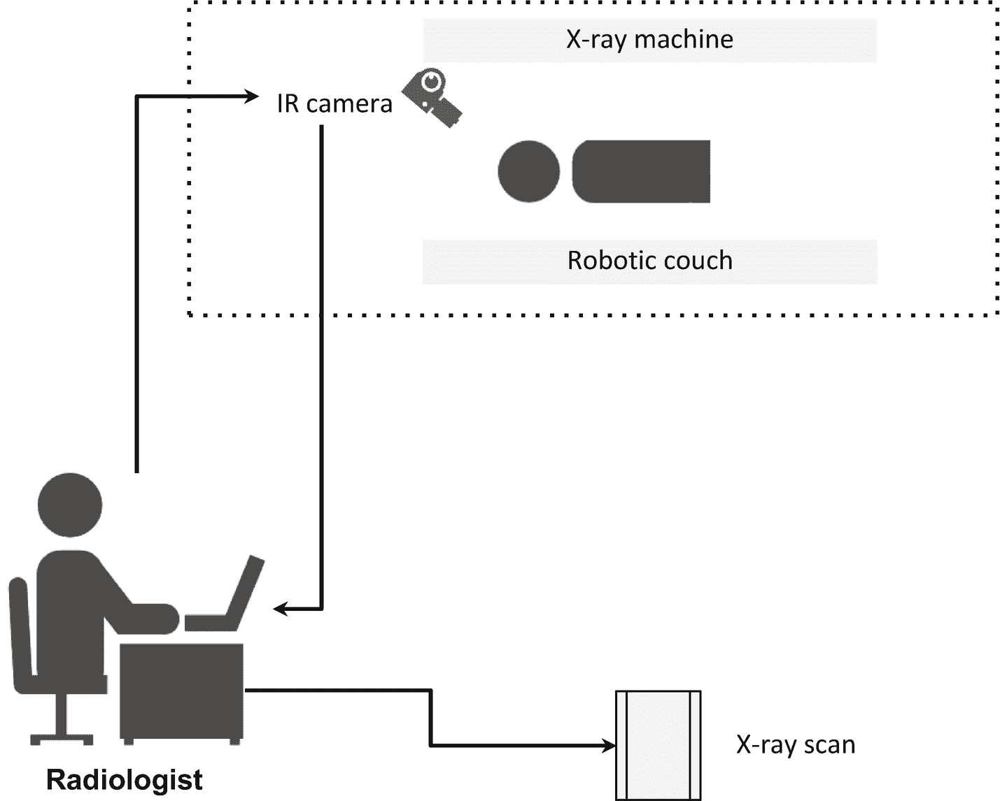
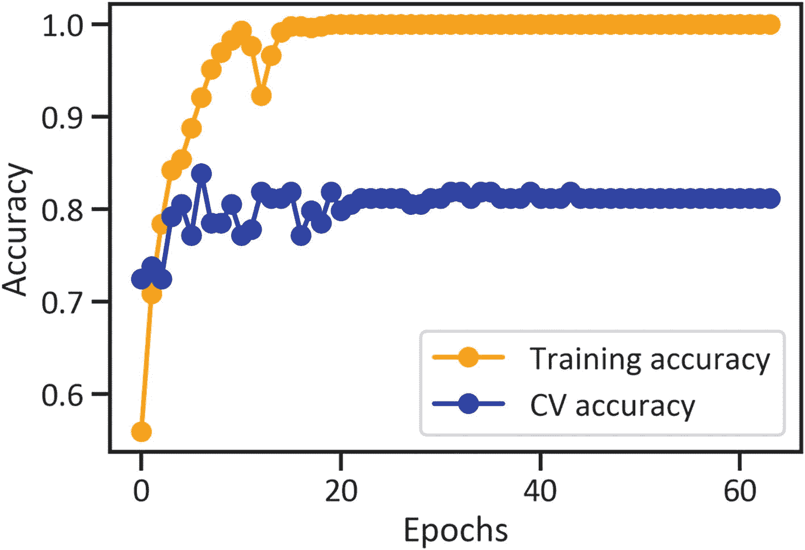
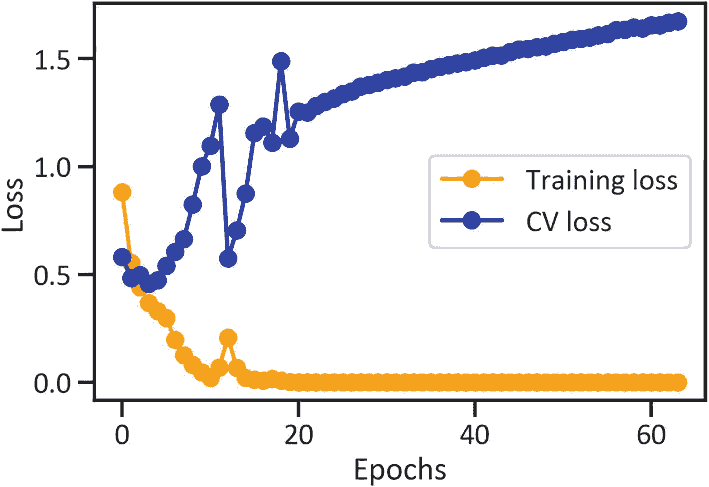

# 6. COVID-19 CT 扫描分割案例研究

本章介绍了一种方法，用于执行卷积神经网络以建模胸部 CT 扫描图像，并区分 COVID-19 阳性与阴性患者。你可以从 Kaggle^(⁷)下载该数据集；原始数据集来源于此^(⁸)。

## 简单的计算机断层扫描流程

COVID-19 检测中使用了鼻拭子测试；它涉及将拭子插入鼻腔以提取细胞。此外，放射科医生可以进行计算机断层扫描（CT）来获取图像，这有助于判断个体是否感染 COVID-19。图 6-1 描绘了一个简单的 CT 扫描流程。



图 6-1 描绘了一位放射科医生使用基于计算机的系统操作一台非封闭式 CT 机，该机器在释放少量辐射剂量的同时，使用红外摄像头从不同角度捕捉身体图像。

## 预处理训练用的 COVID-19 数据

清单 6-1 通过执行 `keras` 库中的 `image_dataset_from_directory()` 方法对图像（用于训练）进行预处理。同时，它还指定了 `validation_split`、`subset`、`image_size` 和 `batch_size`。首先在你的环境中安装 `Keras`：`pip install keras`。此外，在你的环境中安装 `NumPy`：`pip install numpy`。

```python
import keras
import numpy as np
import pathlib
covid_19_data = pathlib.Path(r"filepath\cov_19_ct_scans")
covid_19_training_data = image_dataset_from_directory(covid_19_data,seed = 123, validation_split = 0.2, subset = "training",  image_size = (180, 180), batch_size = 16)
```

清单 6-1 预处理训练用的 COVID-19 CT 扫描数据

## 预处理验证用的 COVID-19 CT 扫描数据

清单 6-2 通过执行 `keras` 库中的 `image_dataset_from_directory()` 方法对图像（用于验证）进行预处理。同时，它还指定了 `validation_split`、`subset`、`image_size` 和 `batch_size`。

```python
covid_19_validation_data = image_dataset_from_directory(covid_19_data, seed = 123, validation_split = 0.2, subset = "validation", image_size = (180, 180), batch_size = 16)
```

清单 6-2 预处理验证用的 COVID-19 CT 扫描数据

## 生成训练用的 COVID-19 CT 扫描数据

清单 6-3 通过执行 `ImageDataGenerator()` 方法并指定缩放比例来生成用于训练的图像。随后，它执行 `flow_from_directory()` 方法并指定 `target_size`、`class_mode` 和 `batch_size`。

```python
import numpy as np
covid_19_training_data_categories = np.array(covid_19_training_data.class_names)
covid_19_generated_image_data = keras.preprocessing.image.ImageDataGenerator(rescale = 1./255)
covid_19_generated_image_data_for_training = covid_19_generated_image_data.flow_from_directory(covid_19_data,  target_size = (180, 180),  class_mode = "categorical",  shuffle = True, batch_size = 16)
covid_19_images, covid_19_labels = next(iter(covid_19_generated_image_data_for_training))
```

清单 6-3 生成训练用的 COVID-19 CT 扫描数据

## 调优训练用的 COVID-19 CT 扫描数据

本节开发了一个卷积神经网络。首先，它通过调优图像数据（见清单 6-4）来使网络更好地识别模式。

```python
covid_19_experimental_tuning = tf.data.experimental.AUTOTUNE
covid_19_training_data = covid_19_training_data.cache().shuffle(1000).prefetch(buffer_size = covid_19_experimental_tuning)
covid_19_validation_data = covid_19_validation_data.cache().prefetch(buffer_size = covid_19_experimental_tuning)
```

清单 6-4 调优训练用的 COVID-19 CT 扫描数据

## 执行 CNN 对 COVID-19 CT 扫描数据进行分类

清单 6-5 在图像数据上执行卷积神经网络。首先在你的环境中安装 `TensorFlow`：`pip install tensorflow`。本章构建的 CNN 架构与前一章用于分类患者脑肿瘤和肺炎结果的架构类似。它同样包含一组 2D 卷积层和 MaxPooling 2D 层、一个展平层和两个全连接层；所有层都包含 `relu` 激活函数，使用稀疏分类交叉熵损失函数和准确率指标。此外，它训练了 64 个周期。

```python
from tensorflow.keras import layers
from tensorflow.python.keras.layers import Dense, Flatten, Conv2D, Dropout, MaxPooling2D
covid_19_convolutional_net_model = tf.keras.Sequential([
tf.keras.layers.experimental.preprocessing.Rescaling(1./255),
tf.keras.layers.Conv2D(16, 3, activation = "relu"),
tf.keras.layers.MaxPooling2D(),
tf.keras.layers.Conv2D(64, 3, activation="relu"),
tf.keras.layers.MaxPooling2D(),
tf.keras.layers.Conv2D(128, 3, activation="relu"),
tf.keras.layers.MaxPooling2D(),
tf.keras.layers.Flatten(),
tf.keras.layers.Dense(255, activation="relu"),
tf.keras.layers.Dense(3)
])
covid_19_convolutional_net_model.compile(optimizer = "adam",   = tf.keras.losses.SparseCategoricalCrossentropy(from_logits = True), metrics = ["accuracy"])
covid_19_convolutional_net_model_history = covid_19_convolutional_net_model.fit(covid_19_training_data, validation_data = covid_19_validation_data, epochs = 64)
```

清单 6-5 执行 CNN 对 COVID-19 CT 扫描数据进行分类

## 评估 CNN 的性能

为了确定 CNN 在训练和交叉验证中对患者 COVID-19 结果的分类效果，本节监测了随着周期增加，稀疏分类交叉熵损失和准确率指标的波动程度。

#### 训练和交叉验证中准确率随周期的波动

图 6-2 展示了当 CNN 对患者 COVID-19 结果进行分类时，训练和交叉验证中准确率随周期增加的波动程度。代码见清单 6-6。



```python
plt.plot(covid_19_convolutional_net_model_history.history["accuracy"],
color = "orange",
marker = "o",
label = "Training accuracy")
plt.plot(covid_19_convolutional_net_model_history.history["val_accuracy"],
color = "blue",
marker = "o",
label = "CV accuracy")
plt.xlabel("Epochs")
plt.ylabel("Accuracy")
plt.legend(loc = "best")
plt.show()
```

清单 6-6 绘制训练和交叉验证中准确率随周期的波动图

图 6-2 显示，在训练和交叉验证中，准确率随周期增加而上升，且训练时的准确率高于交叉验证。

#### 训练和交叉验证中稀疏分类交叉熵损失随周期的波动

图 6-3 展示了当 CNN 对患者 COVID-19 结果进行分类时，训练和交叉验证中稀疏分类交叉熵损失随周期增加的波动程度。代码见清单 6-7。



```python
plt.plot(covid_19_convolutional_net_model_history.history["loss"],
color = "orange",
marker = "o",
label = "Training loss")
plt.plot(covid_19_convolutional_net_model_history.history["val_loss"],
color = "blue",
marker = "o",
label = "CV loss")
plt.xlabel("Epochs")
plt.ylabel("Loss")
plt.legend(loc = "best")
plt.show()
```

清单 6-7 绘制训练和交叉验证中稀疏分类交叉熵损失随周期的波动图

图 6-3 显示，在训练中，稀疏分类交叉熵损失在前两个周期略有下降，随后呈上升趋势直至第 10 个周期，但该趋势在第 11 个周期被抹平，并进一步扩大直至第 64 个周期。同时，稀疏分类交叉熵损失随着周期增加而缓慢恶化。

## 结论

本章通过与前两章类似的方法，向你介绍了使用卷积神经网络对 COVID-19 胸部 CT 扫描图像进行分类。

脚注 1   2