# 7. 临床试验数据建模

本章阐释了最广泛用于充分研究临床试验数据的方法（即生存分析法）的核心要点，并介绍了**Nelson-Aalen**加性模型。首先，你将探索该方法。接着，通过执行**Pearson**相关分析法，你将进行探索性分析，然后进行相关性分析。随后，你将学习生存表并拟合模型。最后，你将了解概况表与置信区间，并重现累积风险与基线风险。

## 临床试验

临床试验是一种在受控环境中，对一组受试者进行长期干预并研究其变化的研究。这种独特的研究方法在医学和心理学领域应用广泛。由于在受控环境中进行，它被认为比其他研究（如横断面研究）更可靠。此外，它通常包含一个对照组，即一组受试者。

## 生存分析概述

在处理临床试验数据时，我们通常执行生存分析方法。这些方法非常适合处理包含时间成分且存在缺失值的数据，这类数据同样被称为删失数据。

表 7-1 概述了参与临床试验的两类研究受试者群体。

表 7-1

临床试验中的分组

| 两类生存分析家族 | 描述 |
| --- | --- |
| **生存分类器** | 构成解决时间-事件问题的生存方法，其中包含删失数据（由于临床试验中的受试者在试验结束前退出而导致的缺失数据），这些数据包含一个分类的因变量或事件列。这些是概率方法。例如，当我们想要确定患者从疾病中存活（或未死于所研究的特定疾病）的可能性时，我们会应用生存分类器，同时考虑时间和删失事件。 |
| **生存回归器** | 构成解决删失数据的生存方法，这些数据包含一个连续的因变量（或事件列）。与生存分类器类似，这些方法用于处理带有删失数据的时间-事件问题，但它们应用基于线性的框架（使用风险函数）来解决这些问题。此外，结果来自协变量的组合。 |

图 7-1 描绘了各种生存方法及其所属家族。

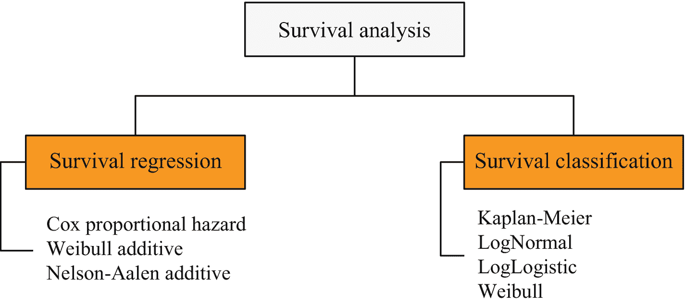

图 7-1

生存分析家族

在医学背景下，假设一家制药公司发现了一种新药。在该公司将药物推向市场之前，它必须遵守管理药物的规章制度。更重要的是，该公司必须确保该药物有效。

该方法要求你将研究受试者分配到两组（见表 7-2）。

表 7-2

临床试验中的分组

| 分组类型 | 描述 |
| --- | --- |
| **非对照组** | 受干预影响的组（即服用该药物的患者） |
| **对照组** | 不受干预影响的研究受试者组（即未服用该药物的患者） |

参见图 7-2 以进一步理解该示例。

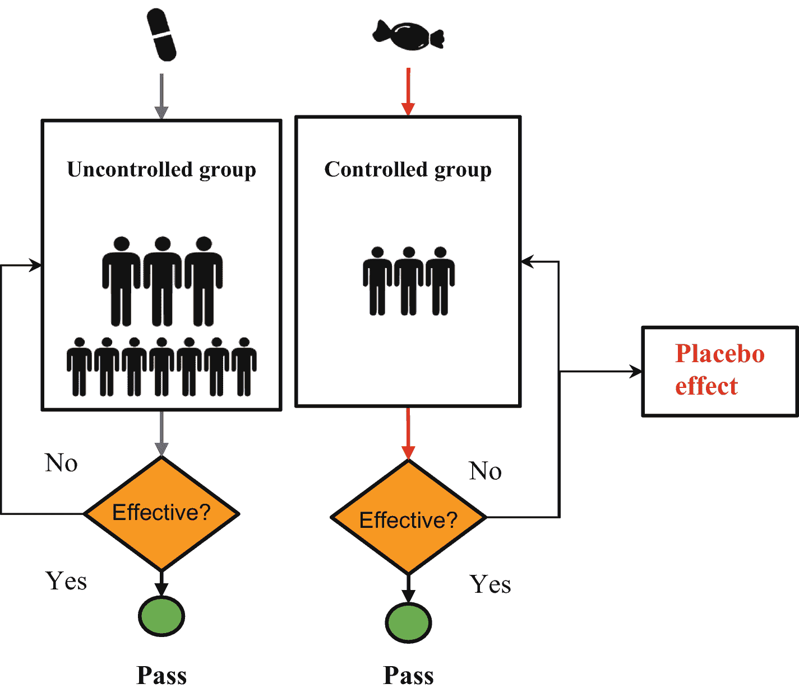

图 7-2

临床试验设置

图 7-2 描绘了临床试验的设置。

临床研究科学家研究该药物对对照组的影响。此外，他们还会辨别安慰剂效应（一种非对照组表现出与对照组相似效果，但并非因服用药物所致的情况）。安慰剂效应的存在表明该药物无效。

## 本章背景

本章执行一种称为 **Nelson-Aalen** 加性方法的生存回归方法。该数据集包含 1958 年至 1970 年间（芝加哥大学比林斯医院，1999 年）接受乳腺癌手术的患者的相关记录。在此处下载数据集^(⁹)。

## 探索 Nelson-Aalen 加性模型

**Nelson-Aalen** 加性方法是一种流行的生存回归方法。它通过执行风险函数来计算在指定时间 (*t*) 的生存概率。公式 7-1 定义了 **Nelson-Aalen** 加性风险函数：

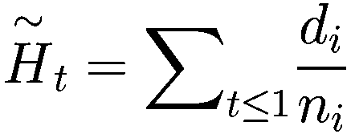

（公式 7-1）

其中 *d*[*i*] 表示随时间 (*t*) 发生的事件数，*n*[*i*] 表示处于风险中的受试者数量。

该方法将预测患者在特定时间（`Year_of_operation`）接受干预后的生存状态可能性。


## 描述性分析

在执行 Nelson-Aalen 加性模型之前，我们先研究数据的分布情况，我来为你解释一下。首先，它对数值进行计数。

清单 7-1 相应地收集并重命名了删失数据的列。首先在你的环境中安装 `pandas`：`pip install pandas`。

```
import pandas as pd
survival_censored_data = pd.read_csv(r"filepath\haberman_survival_data\haberman_survival_data.csv")
survival_censored_data.columns = ["Age", "Year_of_operation", "Axillary_lymph_nodes ", "Event"]
清单 7-1
收集删失数据
```

清单 7-2 识别生存数据中的缺失值（见图 7-3）。首先在你的环境中安装 `seaborn`（`pip install seaborn`）和 `Matplotlib`（`pip install regex`）。

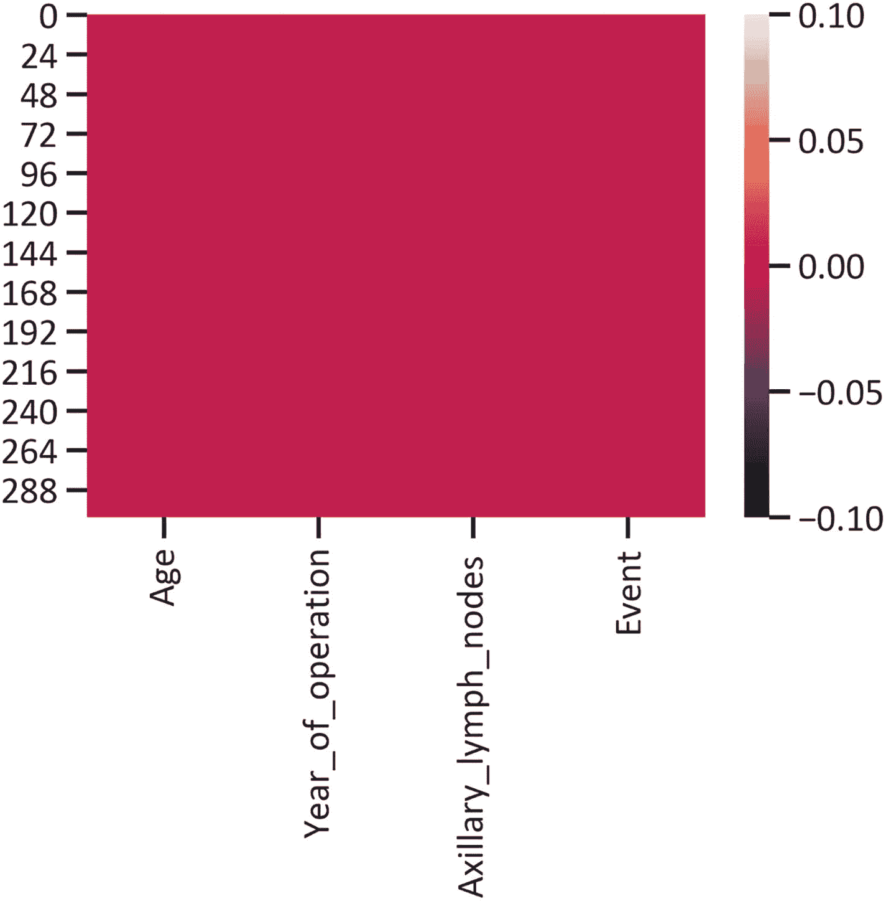

图 7-3

空值热力图

```
import seaborn as sns
import matplotlib.pyplot as plt
%matplotlib inline
sns.heatmap(survival_censored_data.isnull())
plt.show()
清单 7-2
识别缺失值
```

图 7-3 表明生存数据中不存在空值。

清单 7-3 展示了生存数据中 `age` 特征的计数图（见图 7-4）。该图在 `x 轴` 上显示特征（`age`），在 `y 轴` 上显示出现次数。

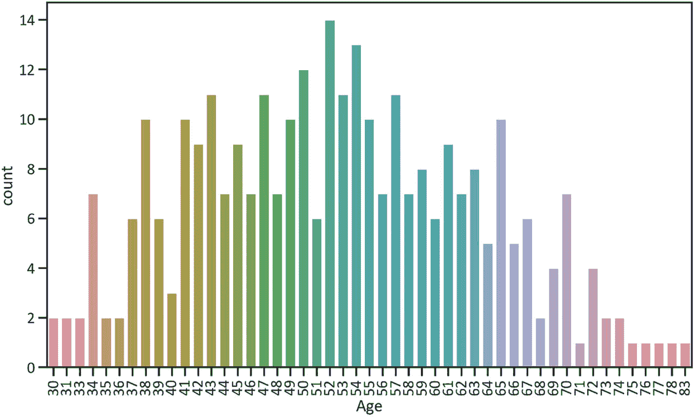

图 7-4

年龄计数图

```
fig, ax = plt.subplots(figsize=(12, 7))
sns.countplot(survival_censored_data["Age"], ax = ax)
plt.xticks (rotation = 90)
plt.show()
清单 7-3
年龄计数图
```

图 7-4 表明，数据中 52 岁的患者出现次数最多，其次是 54 岁的患者。71 岁及 75-83 岁的患者出现次数最少（均只出现一次）。

清单 7-4 展示了生存数据中 `Year_of_operation` 特征的计数图（见图 7-5）。

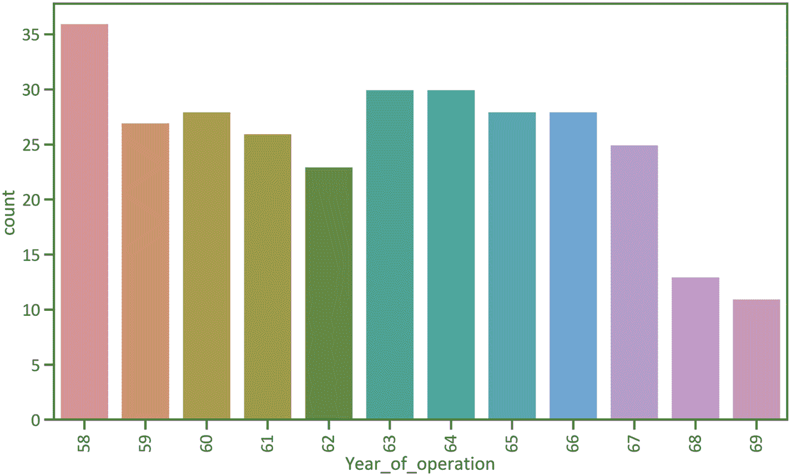

图 7-5

`Year_of_operation` 计数图

```
fig, ax = plt.subplots(figsize=(12, 7))
sns.countplot(survival_censored_data["Year_of_operation"], ax = ax)
plt.xticks (rotation = 90)
plt.show()
清单 7-4
手术年份计数图
```

图 7-5 显示，大多数手术是在 1958 年进行的，其次是 1963-1964 年。1969 年进行了 10 次手术，是所有年份中最少的。

清单 7-5 展示了生存数据的配对图，以识别数据的分布情况，包括特征之间的关系（见图 7-6）。

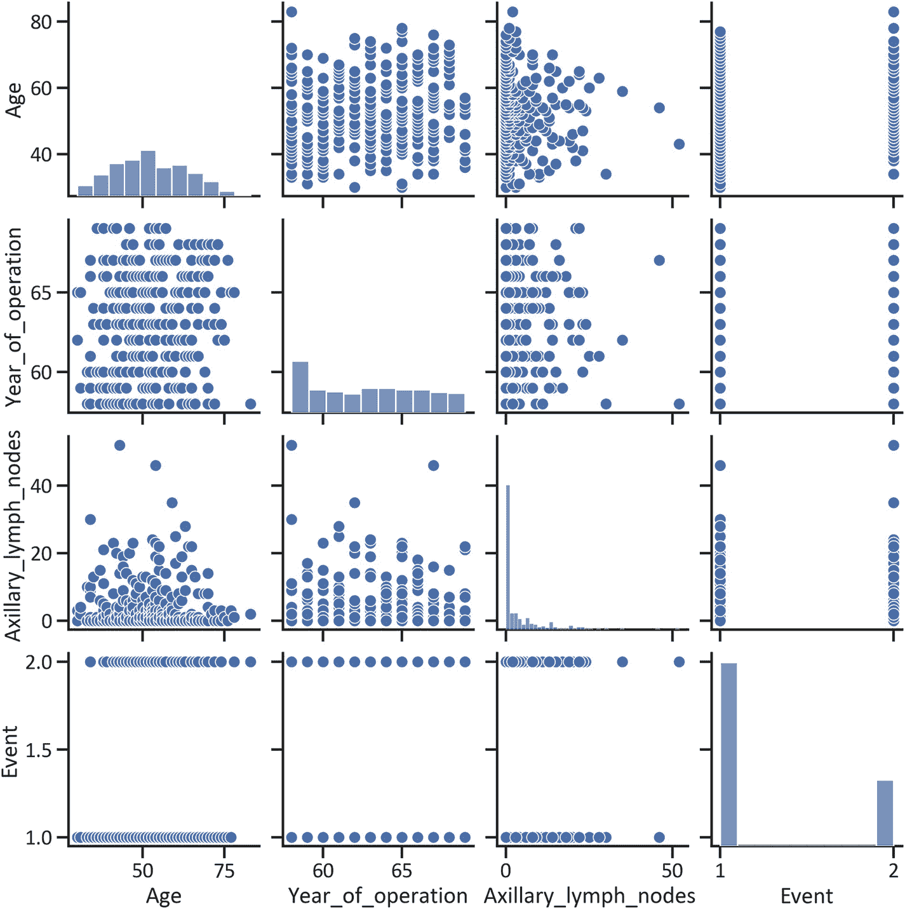

图 7-6

生存数据配对图

```
sns.pairplot(survival_censored_data)
plt.show()
清单 7-5
生存数据配对图
```

图 7-6 表明特征值在散点图中分布广泛。此外，只有 `Age` 显示出正态分布。

### 实现相关性关系

皮尔逊相关性用于识别两个特征之间的相关关联，其中特征的实例是连续的。对于具有类别的特征，需要执行其他相关性方法（即斯皮尔曼和肯德尔相关性方法）。公式 7-2 定义了皮尔逊相关性方法：

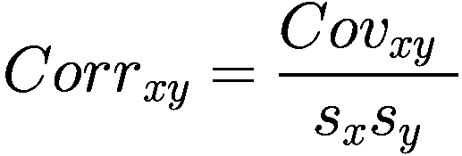

（公式 7-2）

其中 `S[x]` 表示 `x` 的值偏离  的程度，`S[y]` 表示 `y` 的值偏离  的程度，`Cov[xy]` 表示 `x` 和 `y` 相关变化的程度。公式 7-3 定义了协方差方法：

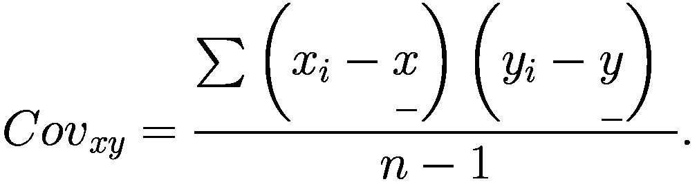

（公式 7-3）

公式 7-2 生成一个介于 -1 和 1 之间的相关系数，其中 -1 表示极强的负相关，0 表示无相关性，1 表示极强的正相关。

清单 7-6 概述了 `Age` 和 `Year_of_operation` 之间关系的皮尔逊系数（见表 7-3）。

表 7-3

年龄与手术年份之间关系的皮尔逊系数

|   | Age | Year_of_operation |
| --- | --- | --- |
| **Age** | 1.000000 | 0.092623 |
| **Year_of_operation** | 0.092623 | 1.000000 |

```
age_yr_op_correlation = survival_censored_data[["Age", "Year_of_operation"]].corr(method = "pearson")
age_yr_op_correlation
清单 7-6
概述年龄与手术年份之间关系的皮尔逊系数
```

表 7-3 表明 `Year_of_operation` 和 `Age` 之间存在非常弱的正相关关系（皮尔逊相关系数为 0.0926）。

清单 7-7 概述了 `Year_of_operation` 和 `Event` 之间关系的皮尔逊系数（见表 7-4）。

表 7-4

手术年份与事件之间关系的皮尔逊系数

|   | Year_of_operation | Event |
| --- | --- | --- |
| **Year_of_operation** | 1.000000 | -0.004076 |
| **Event** | -0.004076 | 1.000000 |

```
yr_op_event_correlation = survival_censored_data[["Year_of_operation", "Event"]].corr(method = "pearson")
yr_op_event_correlation
清单 7-7
概述手术年份与事件之间关系的皮尔逊系数
```

表 7-4 表明 `Year_of_operation` 和 `Event` 之间存在明显的固有弱负相关关系（皮尔逊相关系数为 -0.0040）。


### 概述生存表

生存表是生存分析的核心。生存表用于追踪临床试验中的受试者。它概述了受试者加入研究的时间以及退出研究的时间等信息。同样，它也列出了处于风险中的受试者。

清单 7-8 概述了生存表（见表 7-5）。首先在你的环境中安装 `lifelines`：`pip install lifelines`。

**表 7-5** 癌症生存表

| | removed | observed | censored | entrance | at_risk |
| --- | --- | --- | --- | --- | --- |
| **event_at** | | | | | |
| **0.0** | 0 | 0 | 0 | 305 | 305 |
| **58.0** | 36 | 36 | 0 | 0 | 305 |
| **59.0** | 27 | 27 | 0 | 0 | 269 |
| **60.0** | 28 | 28 | 0 | 0 | 242 |
| **61.0** | 26 | 26 | 0 | 0 | 214 |
| **62.0** | 23 | 23 | 0 | 0 | 188 |
| **63.0** | 30 | 30 | 0 | 0 | 165 |
| **64.0** | 30 | 30 | 0 | 0 | 135 |
| **65.0** | 28 | 28 | 0 | 0 | 105 |
| **66.0** | 28 | 28 | 0 | 0 | 77 |
| **67.0** | 25 | 25 | 0 | 0 | 49 |
| **68.0** | 13 | 13 | 0 | 0 | 24 |
| **69.0** | 11 | 11 | 0 | 0 | 11 |

```
from lifelines.utils import survival_table_from_events
Time = survival_censored_data["Year_of_operation"]
Event = survival_censored_data["Event"]
survival_table = survival_table_from_events(Time, Event)
survival_table
Listing 7-8
Cancer Survival Table
```

表 7-5 显示，第一年有 305 名患者进入研究。默认情况下，所有 305 名患者均处于风险中。1958 年，36 名患者退出试验，次年试验剩余 269 人。随后，28 名患者退出研究，试验剩余 242 人。到 1969 年，有 11 名患者处于风险中。

### 执行 Nelson-Aalen 加法模型

清单 7-9 执行了 Nelson-Aalen 加法模型，并概述了时间列（`Year_of_operations`）和事件列（`Event`）。

```
aalen_additive_method = AalenAdditiveFitter().fit(survival_censored_data, "Year_of_operation", event_col = "Event")
Listing 7-9
Carrying Out the Nelson-Aalen Additive Model
```

清单 7-10 概述了 Nelson-Aalen 加法模型的概况表（见表 7-6）。

**表 7-6** Nelson-Aalen 加法模型概况表

| **模型** | `lifelines.AalenAdditiveFitter` |
| --- | --- |
| **持续时间列** | `Year_of_operation` |
| **事件列** | `Event` |
| **受试者数量** | 305 |
| **观察到的事件数量** | 305 |
| **模型拟合时间** | 2021-09-22 20:45:48 UTC |
| | **斜率(系数)** | **标准误(斜率(系数))** |
| **年龄** | -0.00 | 0.00 |
| **腋窝淋巴结** | 0.00 | 0.00 |
| **_ 截距** | 0.03 | 0.12 |
| **一致性指数** | 0.47 |

```
aalen_additive_method_summary = aalen_additive_method.print_summary()
aalen_additive_method_summary
Listing 7-10
Outlining the Nelson-Aalen Additive Model’s Profile Table
```

#### 概述 Nelson-Aalen 加法模型的置信区间

表 7-6 显示，`Age` 的系数为 0，`Axillary_lymph_nodes` 的系数为 0，截距的系数为 0.03。此外，一致性指数为 0.47。清单 7-11 概述了 Nelson-Aalen 加法模型的置信区间（表 7-7）。

**表 7-7** 概述 Nelson-Aalen 加法模型的置信区间

| | | Age | Axillary_lymph_nodes | _intercept |
| --- | --- | --- | --- | --- |
| **95% 置信下限** | **58.0** | -0.011789 | -0.018840 | -0.145918 |
| | **59.0** | -0.018651 | -0.021651 | -0.004624 |
| | **60.0** | -0.029200 | -0.027498 | 0.323593 |
| | **61.0** | -0.031100 | -0.032479 | 0.333276 |
| | **62.0** | -0.034727 | -0.037655 | 0.354644 |
| | **63.0** | -0.043889 | -0.043974 | 0.591264 |
| | **64.0** | -0.052604 | -0.054649 | 0.888015 |
| | **65.0** | -0.064916 | -0.062502 | 0.977393 |
| | **66.0** | -0.080685 | -0.076952 | 1.235606 |
| | **67.0** | -0.108367 | -0.111897 | 1.322455 |
| | **68.0** | -0.123392 | -0.152858 | -0.226685 |
| | **69.0** | -0.287892 | -0.262761 | -1.590887 |
| **95% 置信上限** | **58.0** | 0.014053 | 0.019916 | 0.258724 |
| | **59.0** | 0.016134 | 0.022809 | 0.568260 |
| | **60.0** | 0.015403 | 0.023818 | 1.085101 |
| | **61.0** | 0.019462 | 0.030469 | 1.196271 |
| | **62.0** | 0.023861 | 0.041435 | 1.354825 |
| | **63.0** | 0.026653 | 0.053084 | 1.799925 |
| | **64.0** | 0.029656 | 0.049602 | 2.307316 |
| | **65.0** | 0.040445 | 0.066189 | 2.797615 |
| | **66.0** | 0.051745 | 0.073717 | 3.535390 |
| | **67.0** | 0.077604 | 0.108511 | 4.569100 |
| | **68.0** | 0.147481 | 0.129512 | 4.276818 |
| | **69.0** | 0.311981 | 0.239415 | 7.641019 |

```
aalen_additive_method_ci = aalen_additive_method.confidence_intervals_s
aalen_additive_method_ci
Listing 7-11
Outlining the Nelson-Aalen Additive Model’s Confidence Interval
```

#### 识别生存风险

清单 7-12 描绘了 Nelson-Aalen 加法模型的生存风险（见图 7-7）。

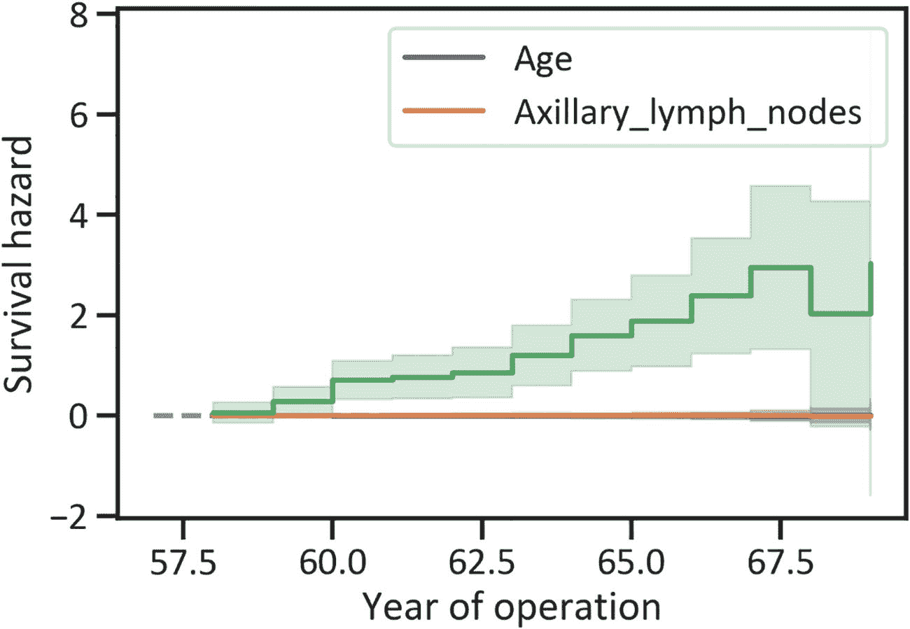

**图 7-7** Nelson-Aalen 加法模型的生存风险

```
aalen_additive_method.plot()
plt.ylabel("Survival hazard")
plt.xlabel("Year of operation")
plt.show()
Listing 7-12
Depicting the Nelson-Aalen Additive Model’s Survival Hazard
```

图 7-7 显示，与 `Age` 和 `Axillary_lymph_nodes` 相关的活动较少。此外，生存风险从 1958 年开始上升，在 1967 年达到峰值，随后一年略有下降，然后再次上升。

#### 识别累积生存风险

清单 7-13 描绘了 Nelson-Aalen 加法模型的累积生存风险（见图 7-8）。

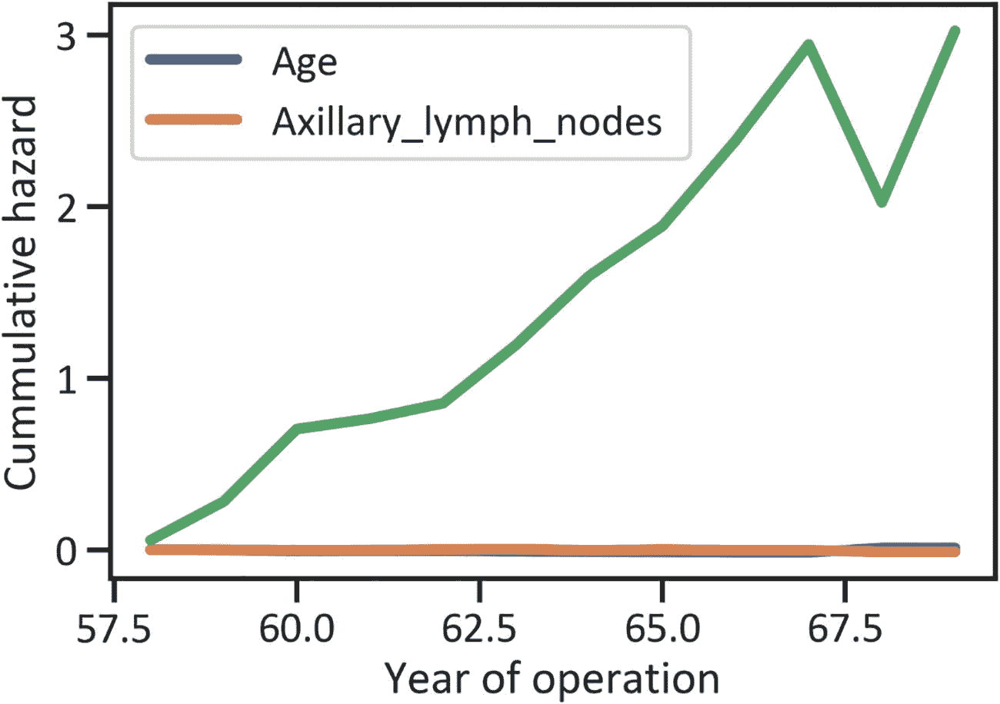

**图 7-8** Nelson-Aalen 加法模型的累积生存风险

```
aalen_additive_method.cumulative_hazards_.plot(lw = 4)
plt.ylabel("Cumulative hazard")
plt.xlabel("Year of operation")
plt.show()
Listing 7-13
Depicting the Nelson-Aalen Additive Model’s Cumulative Survival Hazard
```

图 7-8 显示，从 1958 年到 1966 年，累积生存风险呈现非常强劲的趋势。此外，在 1967 年，该趋势失去了动力，表现为该时期的急剧下降。1968 年，一次急剧上升抹平了之前的下降。

#### 基线生存风险

清单 7-14 描绘了 Nelson-Aalen 加法模型的基线生存风险（见图 7-9）。

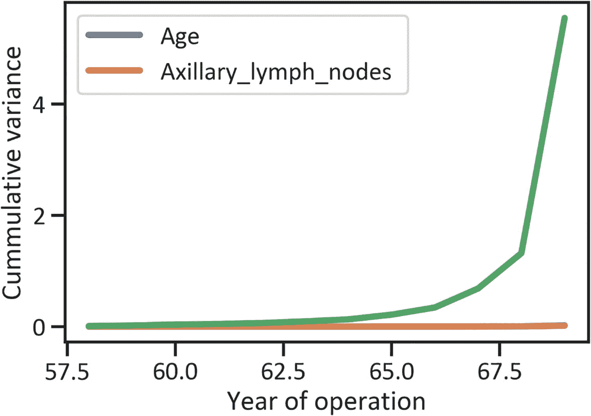

**图 7-9** Nelson-Aalen 加法模型的累积基线生存风险

```
aalen_additive_method.cumulative_variance_.plot(lw=4)
plt.ylabel("Cumulative variance")
plt.xlabel("Year of operation")
plt.show()
Listing 7-14
Depicting the Nelson-Aalen Additive Model’s Baseline Survival Hazard
```

图 7-9 显示累积方差呈现类似指数增长的趋势。


## 结论

本章阐释了执行一种流行的生存回归器（即 Nelson-Aalen 加性模型）的基本原理。该方法通过对生存删失数据进行建模，利用风险函数合理预测研究对象的生存率，从而能够预测患者随时间变化的生存状态概率。生存回归还有其他方法，包括 Cox 比例风险模型和 Weibull 加性模型。

## 参考文献

1. 芝加哥大学比林斯医院。(1999). *Haberman 生存数据*. 芝加哥大学比林斯医院。

脚注 1

