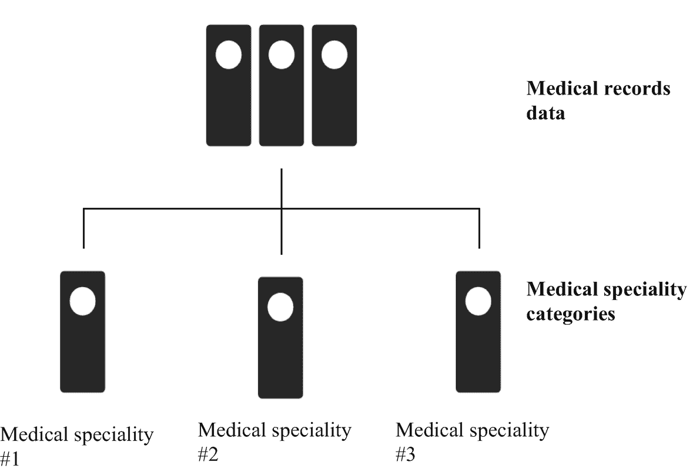
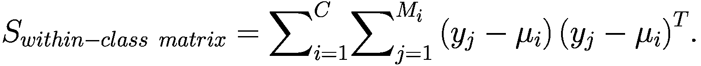
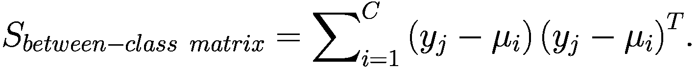
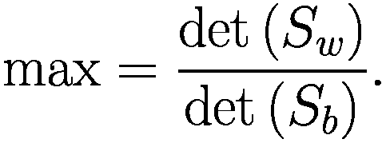
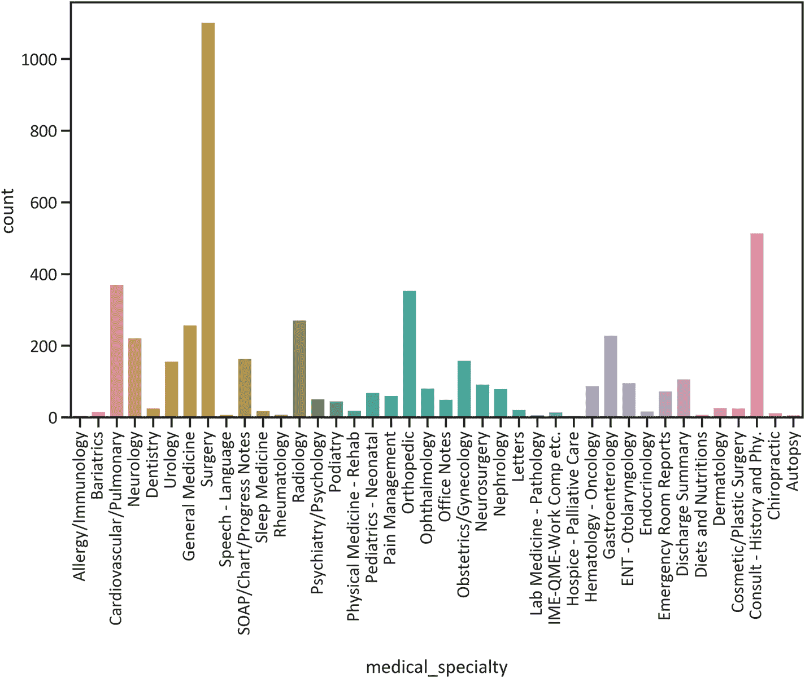

# 8. 医疗记录分类

本章介绍了一种通过执行线性判别分析模型来识别医疗记录模式的整体方法。你将了解什么是医疗记录，然后学习一种通过执行正则化和`TfidfVectorizer`等基本方法来清洗文本数据的技术。之后，你将执行一种方法来对医学专科进行分类，并评估其区分不同类别的程度。

## 医疗记录

医疗记录是与患者病史相关的历史数据。全科医生会保存患者的记录以供参考，并针对特定医疗状况决定应采取哪些合理的预防措施。他们也会出于法律原因保存记录，例如在集体诉讼中，他们可能出示这些记录进行辩护，而检察官则可能利用这些记录在法庭上陈述案情。

## 本章背景

传统上，全科医生将患者的病史记录在纸上，然后存放在安全的设施中。如今，医疗从业者利用计算机化的数据仓库。

医疗从业者可能希望研究其患者医疗记录中的模式。本章介绍了一种执行分类算法的有效技术来实现这一目标。图 8-1 描绘了本章的背景。



图 8-1 本章背景

该练习可能有助于改善患者的医疗记录，并帮助医疗从业者轻松访问这些记录。

你可以从 Kaggle^(¹⁰)获取该数据集（原始数据集来自 mtsamples^(¹¹)）。

## 使用线性判别分析进行分类

线性判别分析构建了一个与线性回归模型相似的模型，因为它执行线性变换。它可以用于多类分类。它仔细确定类内矩阵和类间矩阵，同时最大化它们（参见公式 8-1、8-2 和 8-3）。

公式 8-1 定义了类内矩阵：



（公式 8-1）

公式 8-2 定义了类间矩阵：



（公式 8-2）

公式 8-3 最大化类间矩阵并最小化类内矩阵：



（公式 8-3）

## 描述性分析

代码清单 8-1 从`CSV`文件中收集数据。首先在你的环境中安装 pandas：`pip install pandas`。

```python
import pandas as pd
medical_records_data = pd.read_csv(r"filepath\mtsamples.csv")
medical_records_data.drop(['Unnamed: 0'], axis = 1, inplace = True)
medical_records_data.head()
```

代码清单 8-1 数据提取

代码清单 8-2 展示了医学专科计数图（见图 8-2）。首先在你的环境中安装 Matplotlib：`pip install matplotlib`。



图 8-2 医学专科计数图

```python
import matplotlib.pyplot as plt
%matplotlib inline
import seaborn as sns
sns.set("talk","ticks",font_scale=1,font="Calibri")
fig, ax = plt.subplots(figsize=(12, 7))
sns.countplot(medical_records_data["medical_specialty"], ax = ax)
plt.xticks (rotation=90)
plt.show()
```

代码清单 8-2 医学专科计数图

图 8-2 表明，`Surgery`（外科）专科在医疗记录中出现次数最多，其次是`Consult - History and Phy.`（会诊 - 病史与体检），然后是`Cardiovascular/Pulmonary`（心血管/肺科）。此外，`Allergy/Immunology`（过敏/免疫科）出现次数最少。

代码清单 8-3 统计了每个医学专科的项目数量（见表 8-1）。

表 8-1 医学专科计数

| | 计数 |
| --- | --- |
| **medical_specialty** | |
| **Allergy/Immunology** | 7 |
| **Autopsy** | 8 |
| **Bariatrics** | 18 |
| **Cardiovascular/Pulmonary** | 372 |
| **Chiropractic** | 14 |
| **Consult - History and Phy.** | 516 |
| **Cosmetic/Plastic Surgery** | 27 |
| **Dentistry** | 27 |
| **Dermatology** | 29 |
| **Diets and Nutritions** | 10 |
| **Discharge Summary** | 108 |
| **ENT – Otolaryngology** | 98 |
| **Emergency Room Reports** | 75 |
| **Endocrinology** | 19 |
| **Gastroenterology** | 230 |
| **General Medicine** | 259 |
| **Hematology - Oncology** | 90 |
| **Hospice - Palliative Care** | 6 |
| **IME-QME-Work Comp., etc.** | 16 |
| **Lab Medicine – Pathology** | 8 |
| **Letters** | 23 |
| **Nephrology** | 81 |
| **Neurology** | 223 |
| **Neurosurgery** | 94 |
| **Obstetrics/Gynecology** | 160 |
| **Office Notes** | 51 |
| **Ophthalmology** | 83 |
| **Orthopedic** | 355 |
| **Pain Management** | 62 |
| **Pediatrics - Neonatal** | 70 |
| **Physical Medicine - Rehab** | 21 |
| **Podiatry** | 47 |
| **Psychiatry/Psychology** | 53 |
| **Radiology** | 273 |
| **Rheumatology** | 10 |
| **SOAP/Chart/Progress Notes** | 166 |
| **Sleep Medicine** | 20 |
| **Speech - Language** | 9 |
| **Surgery** | 1103 |
| **Urology** | 158 |

```python
medical_specialty_group = pd.DataFrame(medical_records_data.groupby("medical_specialty").size())
medical_specialty_group.columns = ["Count"]
medical_specialty_group
```

代码清单 8-3 医学专科计数

表 8-1 显示，`Surgery`（外科）专科在医疗记录中出现了 1103 次，其次是`Consult - History and Phy.`（会诊 - 病史与体检），出现了 516 次，以及`Cardiovascular/Pulmonary`（心血管/肺科），出现了 372 次。此外，`Hospice – Palliative`（临终关怀/姑息治疗）出现次数最少（6 次）。

## 预处理医疗记录数据

代码清单 8-4 对数据进行预处理。

```python
ind_variables = medical_records_data[["description", "sample_name", "transcription", "keywords"]].values
labels = medical_records_data["medical_specialty"].values
```

代码清单 8-4 数据预处理

### 执行正则表达式

代码清单 8-5 执行了一个正则表达式来清理病历中的文本数据。它消除了特殊字符、单个字符、多个空格以及前缀“b”，然后将所有文本转换为小写。首先，在你的环境中安装 `regex`：`pip install regex`。

```python
import re
clean_ind_variables = []
for sentence in range(len(ind_variables)):
clean_ind_variable = re.sub(r'\W', ' ', str(ind_variables[sentence]))
clean_ind_variable = re.sub(r'\s+[a-zA-Z]\s+', ' ', clean_ind_variable)
clean_ind_variable = re.sub(r'\^[a-zA-Z]\s+', ' ', clean_ind_variable)
clean_ind_variable = re.sub(r'\s+', ' ', clean_ind_variable, flags=re.I)
clean_ind_variable = re.sub(r'b^\s+', ' ', clean_ind_variable)
clean_ind_variable = clean_ind_variable.lower()
clean_ind_variables.append(clean_ind_variable)
```

代码清单 8-5 正则表达式

### 执行词向量化

代码清单 8-6 通过执行 `TfidfVectorizer()` 方法，并将 `max_features` 设置为 `2500`、`min_df` 设置为 `8`、`max_df` 设置为 `0.8`，对医疗记录中的词语进行向量化。该方法将文本转换为一个 `TF-IDF`（词频-逆文档频率）特征矩阵。首先，在你的环境中安装 `nltk`：`pip install nltk`。

```python
import nltk
from nltk.corpus import stopwords
from sklearn.feature_extraction.text import TfidfVectorizer
vectorizer = TfidfVectorizer(max_features=2500,
min_df=8,
max_df=0.7,
stop_words=stopwords.words("english"))
clean_ind_variables = vectorizer.fit_transform(clean_ind_variables).toarray()
```

代码清单 8-6 词向量化

代码清单 8-7 分配数据用于训练和测试线性判别分析模型。首先，在你的环境中安装 `scikit-learn`：`pip install -U scikit-learn`。

```python
from sklearn.model_selection import train_test_split
x_train, x_test, y_train, y_test = train_test_split(processed_features, labels,test_size=0.2,random_state=0)
```

代码清单 8-7 分配训练和测试数据

## 执行线性判别分析模型以对患者病历进行分类

代码清单 8-8 开发了线性判别分析模型并学习了病历中的数据。

```python
from sklearn.discriminant_analysis import LinearDiscriminantAnalysis
linear_discriminant_model = LinearDiscriminantAnalysis()
linear_discriminant_model.fit(x_train, y_train)
```

代码清单 8-8 执行线性判别分析模型以对患者病历进行分类

代码清单 8-9 概述了线性判别分析模型的预测结果（见表 8-2）。

表 8-2 线性判别分析模型的预测结果

|   | 实际医学专科 | 预测医学专科 |
| --- | --- | --- |
| **0** | 会诊 - 病史与体格检查 | 神经内科 |
| **1** | 放射科 | 放射科 |
| **2** | 外科 | 外科 |
| **3** | 外科 | 外科 |
| **4** | 耳鼻喉科 | 耳鼻喉科 |
| **...** | ... | ... |
| **995** | 心血管/呼吸科 | 心血管/呼吸科 |
| **996** | 骨科 | 全科医学 |
| **997** | 外科 | 尸检 |
| **998** | 外科 | 减重外科 |
| **999** | SOAP/图表/病程记录 | SOAP/图表/病程记录 |

```python
y_hat_linear_discriminant_model = linear_discriminant_model.predict(x_test)
actual_and_linear_discriminant_model_predictions = pd.DataFrame({"Actual Medical Specialty": y_test,
"Predicted Medical Specialty": y_hat_linear_discriminant_model})
actual_and_linear_discriminant_model_predictions
```

代码清单 8-9 计算线性判别分析模型的预测结果

### 评估线性判别分析模型的性能

代码清单 8-10 概述了线性判别分析的分类报告，其中包含准确率、精确率、召回率、F-1 分数和支持度（见表 8-3）。

表 8-3 线性判别分析分类报告

|   | 精确率 | 召回率 | F-1 分数 | 支持度 |
| --- | --- | --- | --- | --- |
| **过敏/免疫科** | 0.200000 | 1.000000 | 0.333333 | 1.000 |
| **尸检** | 0.018868 | 1.000000 | 0.037037 | 1.000 |
| **减重外科** | 0.000000 | 0.000000 | 0.000000 | 0.000 |
| **心血管/呼吸科** | 0.571429 | 0.555556 | 0.563380 | 72.000 |
| **脊椎按摩科** | 0.000000 | 0.000000 | 0.000000 | 1.000 |
| **会诊 - 病史与体格检查** | 0.421053 | 0.273504 | 0.331606 | 117.000 |
| **美容/整形外科** | 0.454545 | 0.833333 | 0.588235 | 6.000 |
| **牙科** | 0.000000 | 0.000000 | 0.000000 | 1.000 |
| **皮肤科** | 0.000000 | 0.000000 | 0.000000 | 6.000 |
| **饮食与营养科** | 0.000000 | 0.000000 | 0.000000 | 0.000 |
| **出院小结** | 0.705882 | 0.545455 | 0.615385 | 22.000 |
| **耳鼻喉科** | 0.615385 | 0.470588 | 0.533333 | 17.000 |
| **急诊室报告** | 0.357143 | 0.357143 | 0.357143 | 14.000 |
| **内分泌科** | 0.000000 | 0.000000 | 0.000000 | 3.000 |
| **消化内科** | 0.790698 | 0.693878 | 0.739130 | 49.000 |
| **全科医学** | 0.513514 | 0.345455 | 0.413043 | 55.000 |
| **血液肿瘤科** | 0.333333 | 0.307692 | 0.320000 | 13.000 |
| **临终关怀与姑息治疗科** | 0.000000 | 0.000000 | 0.000000 | 0.000 |
| **IME-QME-工伤赔偿等** | 0.000000 | 0.000000 | 0.000000 | 0.000 |
| **检验医学 - 病理科** | 0.200000 | 1.000000 | 0.333333 | 1.000 |
| **信件** | 0.000000 | 0.000000 | 0.000000 | 4.000 |
| **肾内科** | 0.096774 | 0.272727 | 0.142857 | 11.000 |
| **神经内科** | 0.733333 | 0.622642 | 0.673469 | 53.000 |
| **神经外科** | 0.750000 | 0.857143 | 0.800000 | 21.000 |

## 清单 8-10 线性判别分析分类报告

```python
from sklearn import metrics
linear_discriminant_model_report = pd.DataFrame(metrics.classification_report(y_test,
y_hat_linear_discriminant_model,
output_dict=True)).transpose()
linear_discriminant_model_report
```

| 科室 | 精确率 | 召回率 | F1分数 | 支持数 |
| :--- | :--- | :--- | :--- | :--- |
| **妇产科** | 0.807692 | 0.700000 | 0.750000 | 30.000 |
| **门诊记录** | 0.714286 | 0.769231 | 0.740741 | 13.000 |
| **眼科** | 0.750000 | 0.818182 | 0.782609 | 11.000 |
| **骨科** | 0.709091 | 0.609375 | 0.655462 | 64.000 |
| **疼痛管理科** | 0.391304 | 0.562500 | 0.461538 | 16.000 |
| **儿科 - 新生儿科** | 0.000000 | 0.000000 | 0.000000 | 14.000 |
| **物理医学与康复科** | 0.066667 | 0.250000 | 0.105263 | 4.000 |
| **足科** | 0.000000 | 0.000000 | 0.000000 | 8.000 |
| **精神科/心理学** | 0.000000 | 0.000000 | 0.000000 | 12.000 |
| **放射科** | 0.904762 | 0.666667 | 0.767677 | 57.000 |
| **风湿免疫科** | 0.000000 | 0.000000 | 0.000000 | 2.000 |
| **SOAP/图表/病程记录** | 0.793103 | 0.560976 | 0.657143 | 41.000 |
| **睡眠医学科** | 0.046154 | 0.600000 | 0.085714 | 5.000 |
| **言语-语言病理科** | 0.000000 | 0.000000 | 0.000000 | 0.000 |
| **外科** | 0.809859 | 0.527523 | 0.638889 | 218.000 |
| **泌尿外科** | 0.727273 | 0.648649 | 0.685714 | 37.000 |
| **准确率** | 0.508000 | 0.508000 | 0.508000 | 0.508 |
| **宏平均** | 0.337054 | 0.396205 | 0.327801 | 1000.000 |
| **加权平均** | 0.632999 | 0.508000 | 0.554631 | 1000.000 |

表 8-3 显示，线性判别分析模型在预测记录属于 `放射科` 医学专科时更为精确（精确率为 90%）。在预测记录属于 `内分泌科`、`临终关怀与姑息治疗科`、`信件`、`儿科 - 新生儿科`、`精神科/心理学` 和 `言语-语言病理科` 时精确度较低（精确率为 0%）。此外，该模型在区分医学专科类别时的准确率为 50%。

## 结论

在本章中，你实现了一个被称为线性判别分析的多类分类模型。由于医疗记录主要由文本数据组成，你通过执行正则表达式和分词方法，采取了一种整体性的文本清洗方法。你还找到了一种方法，通过使用分类报告来确定判别模型在区分医学专业类别方面的可靠程度。