# 9. 心理学案例：人格维度的因子分析与聚类

本章介绍如何通过执行探索性因子分析和聚类分析，来分析人类行为中的潜在模式。首先，你将了解大五人格维度。接着，你将探索一种通过保留李克特量表来收集数据的方法，并使用克朗巴赫信度检验策略来衡量量表的信度。随后，你将执行因子分析，从估计巴特利特球形统计量和凯泽-迈耶-奥尔金统计量开始。之后，你将通过执行最大方差旋转法来旋转特征值，并估计比例方差和累积方差。此外，你还将执行 K-Means 方法来观察数据中的聚类，从标准化数据和执行主成分分析开始。

## 人格维度

一个人的人格是使其独一无二并反映其行为中一致模式的多种特质的组合。支撑人类行为最标准的方法涉及使用大五人格维度测试，该测试将几种特质分组（见表 9-1）。

**表 9-1** 大五人格维度

| 人格特质 | 描述 |
| --- | --- |
| **外向性** | 表示反映社交倾向和自信的特质。相反的特质是内向性，包括自我保留、严肃、安静等。 |
| **神经质** | 表示反映焦虑、紧张、低自尊和非理性等倾向的特质。相反的特质是情绪稳定性。 |
| **尽责性** | 表示反映服从、冲动控制和正直等倾向的特质。相反的特质是权宜性。 |
| **经验开放性** | 表示反映对新想法、智力追求和多样化兴趣等倾向的特质。相反的是经验封闭性。 |
| **宜人性** | 表示反映信任、同理心和合作等倾向的特质。相反的特质是不宜人性或敌意。 |

从 Open Psychometrics 官方网站^(¹²)了解更多关于大五人格维度的信息。

## 问卷

问卷是一组以特定方式构建的问题，旨在捕捉受试者的潜在行为，以便我们能够检查一组受试者的行为模式。一份基本问卷包含两个部分：生物地理因素和李克特量表。

## 李克特量表

研究人类行为最便捷的方法涉及向受试者发放问卷（称为自填式问卷）。为了捕捉一组受试者数据中的变异性，我们使用某种量表（即李克特量表）对问卷进行标准化，这意味着所有受试者都收到相同的问卷。

**表 9-2** 展示了李克特量表的结构。

**表 9-2** 李克特量表的结构

| | 非常不同意 | 不同意 | 既不同意也不反对 | 同意 | 非常同意 |
| --- | --- | --- | --- | --- | --- |
| **问题项** | - | - | - | - | - |

图 9-1 展示了李克特量表的结构，其中我们将 `"非常不同意"` 编码为 `1`，`"不同意"` 编码为 `2`，`"既不同意也不反对"` 编码为 `3`，`"同意"` 编码为 `4`，`"非常同意"` 编码为 `5`。

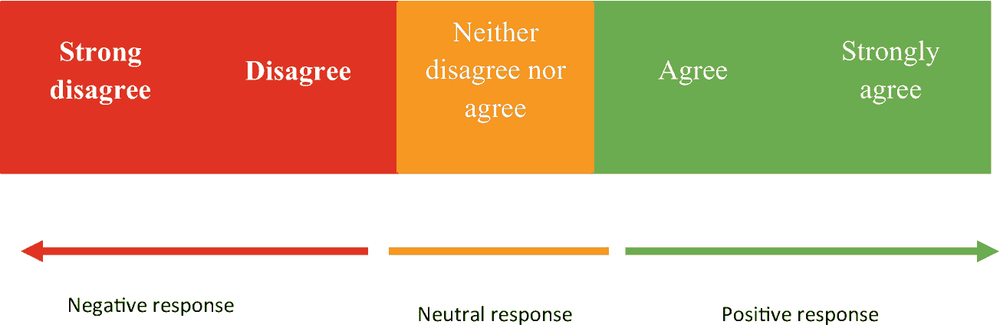

**图 9-1** 消极与积极回应

本章应用因子模型和 K-Means 聚类来对 Open Psychometrics^(¹³) 提供的大五人格数据集进行建模。你可以从 Kaggle^(¹⁴) 下载该数据集。

清单 9-1 收集数据。首先在你的环境中安装 `pandas`：`pip install pandas`。

```
import pandas as pd
big_five_data = pd.read_csv(r"filepath\big_five_data\data-final.csv", sep = "\t")
big_five_data
```

**清单 9-1** 收集数据

清单 9-2 对数据进行预处理。

```
big_five_data.drop(big_five_data.columns[50:110], axis = 1, inplace = True)
big_five_data = big_five_data[(big_five_data > 0).all(axis=1)]
```

**清单 9-2** 预处理数据

## 量表信度

量表信度检验策略数不胜数。本章仅向你介绍两种普遍的信度检验策略：斯皮尔曼-布朗信度检验和克朗巴赫信度检验。

### 斯皮尔曼-布朗信度检验策略

公式 9-1 定义了斯皮尔曼-布朗信度检验：

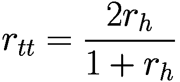

**（公式 9-1）**

其中 `r[tt]` 代表信度，`r[h]` 代表测试两半之间的相关性。

### 执行克朗巴赫信度检验策略

本节展示克朗巴赫系数 alpha 技术如何捕捉整体信度。内部一致性代表在特定测量中，回答与项目之间的一致程度。

公式 9-2 定义了克朗巴赫信度检验：

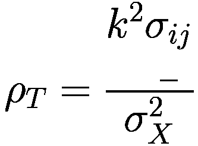

**（公式 9-2）**

其中 `ρ[T]` 代表信度检验，`k` 代表李克特量表中的项目数，`σ[ij]` 代表 `X[i]` 和 `X[j]` 之间的关系，而 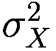 代表项目间的方差和协方差。

清单 9-3 识别克朗巴赫系数 alpha。首先在你的环境中安装 `pingouin`：`pip install pingouin`。

```
import pingouin as pg
pg.cronbach_alpha(data = big_five_data)
(0.5199338748916366, array([0.518, 0.521]))
```

**清单 9-3** 识别克朗巴赫系数 Alpha

上述结果表明，克朗巴赫系数 alpha 为 `0.5199`，这表明该测量并非典范。此外，测量量表中的项目之间一致性一般。


## 执行因子模型

因子分析是一种替代性的降维技术。它同样考虑了因子中的变异性。尽管它与主成分分析有许多相似之处，但在执行因子分析之前，你需要遵循一系列步骤（例如，评估样本充分性）。图 9-2 展示了因子分析的工作原理。

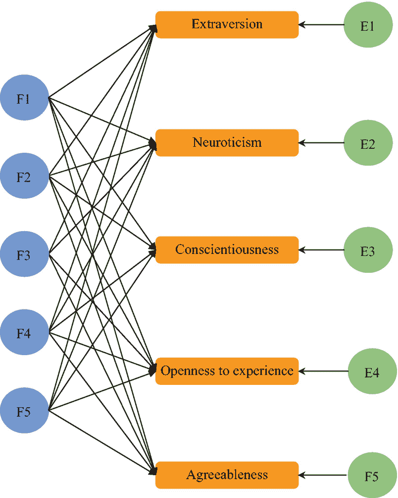

图 9-2

因子模型

图 9-2 构成了基于因子（`F1`、`F2`、`F3` 和 `F4`）的特征（外向性、神经质、尽责性、经验开放性和宜人性）。公式 9-3、9-4、9-5、9-6 和 9-7 表达了图 9-2：

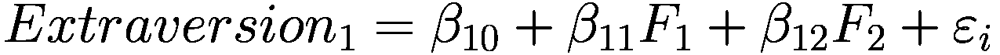

（公式 9-3）

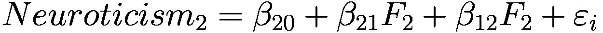

（公式 9-4）

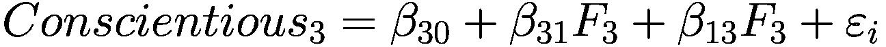

（公式 9-5）

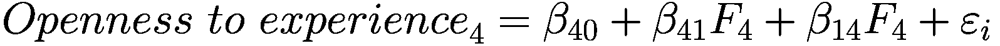

（公式 9-6）

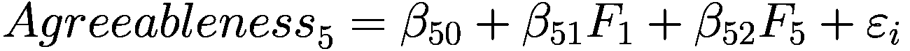

（公式 9-7）

### 执行巴特利特球形度检验

在执行因子分析之前，首先必须判断数据是否合适。最常用于一致确认数据适用性的方法是巴特利特球形度检验。

清单 9-4 通过执行 `factor_analyzer` 库中的 `calculate_bartlett_sphericity` 方法（参见表 9-3，该方法返回 p 值）来汇总 p 值。首先在你的环境中安装 `factor_analyzer`：`pip install factor_analyzer`。

表 9-3

巴特利特球形度统计量

|   | 巴特利特球形度 |
| --- | --- |
| **卡方值** | 1.717619e+07 |
| **P 值** | 0.000000e+00 |

```
from factor_analyzer.factor_analyzer import calculate_bartlett_sphericity
chi_square, p_values = calculate_bartlett_sphericity(big_five_data)
chi_square = pd.DataFrame(pd.Series(chi_square),columns=["Chi squared"])
p_values = pd.DataFrame(pd.Series(p_values),columns = ["P value"])
barlett_sphericity = pd.concat([chi_square, p_values],axis=1)
barlett_sphericity = barlett_sphericity.transpose()
barlett_sphericity.columns = ["Bartlett sphericity"]
barlett_sphericity
清单 9-4
执行巴特利特球形度检验
```

### 执行 Kaiser-Meyer-Olkin 检验

这是一种传统做法，尤其在学术研究中，用于判断数据是否值得探究。一种常用的方法是执行 Kaiser-Meyer-Olkin 统计量。

清单 9-5 通过执行 `factor_analyzer` 库中的 `calculate_kmo()` 方法（参见表 9-4，该方法返回 p 值）来汇总 p 值。

表 9-4

KMO 检验统计量

|   | KMO 检验 |
| --- | --- |
| **P 值** | 0.908983 |

```
from factor_analyzer.factor_analyzer import calculate_kmo
kaiser_meyer_olkin_variance, kaiser_meyer_olkin_test = calculate_kmo(big_five_data)
kaiser_meyer_olkin_test = pd.DataFrame(pd.Series(kaiser_meyer_olkin_test))
kaiser_meyer_olkin_test.columns = ["KMO Test"]
kaiser_meyer_olkin_test.index = ["P value"]
kaiser_meyer_olkin_test
清单 9-5
执行 KMO 检验
```

表 9-4 显示 p 值 > 0.5，因此数据是合适的。在确定数据的适用性后，下一步涉及确定因子的数量。

### 使用碎石图判断 K 值

最常用于明智地决定因子数量的方法是构建一个碎石图，该图以因子为 x 轴，以特征载荷或特征值（来自线性变换的向量）为 y 轴。要确定因子数量，需检测曲线出现急剧弯曲的区域。

清单 9-6 构建了一个碎石图（参见图 9-3）。首先在你的环境中安装 `Matplotlib`：`pip install matplotlib`。

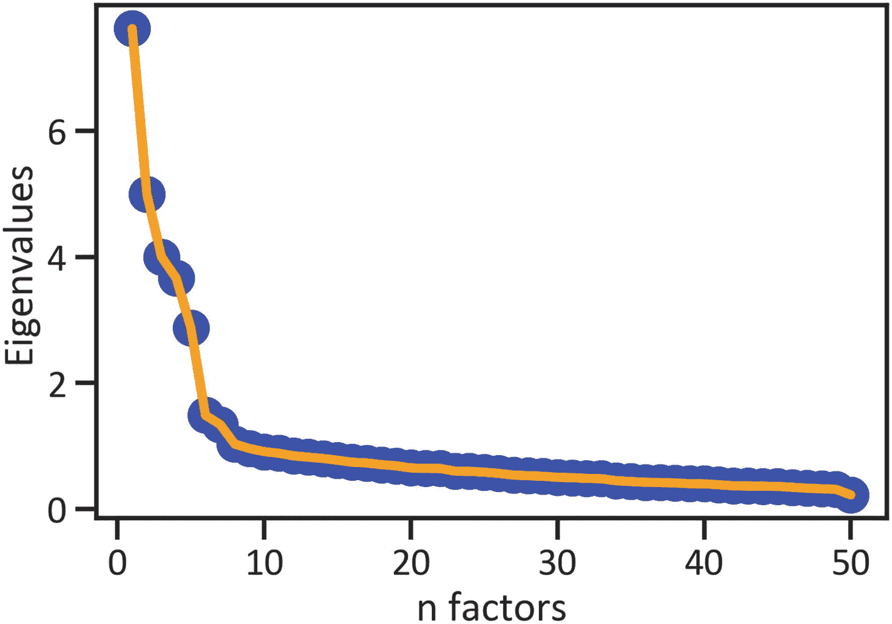

图 9-3

碎石图

```
import matplotlib.pyplot as plt
%matplotlib inline
from factor_analyzer import FactorAnalyzer
factor_analys_model = FactorAnalyzer(rotation = None,impute = "drop", n_factors = big_five_data.shape[1])
factor_analys_model.fit(big_five_data)
eigenvalues,_ = factor_analys_model.get_eigenvalues()
plt.scatter(range(1, big_five_data.shape[1]+1), eigenvalues, s = 200, color = "blue")
plt.plot(range(1, big_five_data.shape[1]+1), eigenvalues, lw = 4, color = "orange")
plt.xlabel("n factors")
plt.ylabel("Eigenvalues")
plt.show()
清单 9-6
构建碎石图
```

图 9-3 显示曲线从第二个因子开始急剧弯曲。因此，因子分析模型将拟合包含两个因子。

### 执行特征值旋转

在拟合因子分析模型后，下一步通常涉及旋转特征值。`factor_analyzer` 库中有无数的旋转技术（例如，`promax`、`oblique`、`oblimin` 和 `oblimax` 等）。下一节将展示如何令人满意地执行最大方差旋转。


#### 最大方差旋转

最大方差旋转用于简化因子载荷。

清单 9-7 通过执行 `FactorAnalyzer()` 方法整合了因子载荷，然后指定了因子数量和旋转方法（见表 9-5）。

**表 9-5** 旋转

| | 因子 1 | 因子 2 | 因子 3 | 因子 4 | 因子 5 |
| --- | --- | --- | --- | --- | --- |
| **EXT1** | 0.695725 | -0.041532 | 0.071403 | -0.009142 | 0.017345 |
| **EXT2** | -0.701616 | -0.006997 | -0.132951 | 0.020675 | -0.039147 |
| **EXT3** | 0.642162 | -0.258014 | 0.255137 | 0.095699 | -0.025813 |
| **EXT4** | -0.738570 | 0.115534 | -0.050113 | -0.027933 | -0.005537 |
| **EXT5** | 0.720532 | -0.075416 | 0.210091 | 0.082719 | 0.069474 |
| **EXT6** | -0.545367 | 0.059033 | -0.139545 | -0.026986 | -0.260178 |
| **EXT7** | 0.716289 | -0.087368 | 0.152714 | 0.025976 | 0.016274 |
| **EXT8** | -0.595159 | 0.031824 | 0.040168 | 0.069637 | -0.048275 |
| **EXT9** | 0.639384 | -0.051900 | -0.029303 | -0.045866 | 0.126483 |
| **EXT10** | -0.676138 | 0.161479 | -0.063951 | -0.030044 | -0.013397 |
| **EST1** | -0.116700 | 0.710429 | 0.106147 | -0.004203 | -0.081596 |
| **EST2** | 0.102799 | -0.549918 | -0.003257 | -0.044860 | 0.030262 |
| **EST3** | -0.143538 | 0.618867 | 0.187814 | 0.041708 | -0.004819 |
| **EST4** | 0.138627 | -0.370749 | -0.035189 | 0.098716 | -0.076226 |
| **EST5** | -0.042177 | 0.505833 | -0.007284 | -0.079965 | -0.113196 |
| **EST6** | -0.033118 | 0.738338 | 0.020280 | -0.067361 | -0.094172 |
| **EST7** | 0.018081 | 0.713498 | -0.029624 | -0.159438 | -0.016969 |
| **EST8** | 0.000966 | 0.737296 | -0.044973 | -0.167907 | -0.021169 |
| **EST9** | -0.020265 | 0.692480 | -0.175702 | -0.039147 | -0.051407 |
| **EST10** | -0.247948 | 0.610271 | -0.023933 | -0.188655 | 0.083560 |
| **AGR1** | -0.017035 | 0.025051 | -0.489886 | -0.027460 | -0.083585 |
| **AGR2** | 0.343977 | -0.043422 | 0.548944 | -0.001409 | 0.097968 |
| **AGR3** | 0.118045 | 0.212494 | -0.404620 | -0.184223 | 0.052855 |
| **AGR4** | 0.032340 | 0.080825 | 0.791517 | 0.032914 | 0.028774 |
| **AGR5** | -0.133649 | -0.004941 | -0.659763 | -0.002029 | -0.031660 |
| **AGR6** | -0.011192 | 0.169866 | 0.600732 | 0.019605 | -0.054179 |
| **AGR7** | -0.296800 | 0.074615 | -0.633004 | -0.010930 | -0.056301 |
| **AGR8** | 0.139934 | -0.002825 | 0.566264 | 0.093890 | 0.028801 |
| **AGR9** | 0.092254 | 0.129425 | 0.695292 | 0.048768 | 0.060667 |
| **AGR10** | 0.311460 | -0.123720 | 0.397421 | 0.120033 | 0.091863 |
| **CSN1** | 0.030204 | -0.086851 | 0.015461 | 0.642191 | 0.079651 |
| **CSN2** | 0.056812 | 0.102458 | 0.037685 | -0.563525 | 0.117736 |
| **CSN3** | -0.034077 | 0.029644 | 0.084773 | 0.402538 | 0.240358 |
| **CSN4** | -0.040437 | 0.348466 | -0.032655 | -0.576761 | 0.000837 |
| **CSN5** | 0.072870 | -0.077612 | 0.046832 | 0.622983 | -0.085307 |
| **CSN6** | 0.015893 | 0.162743 | -0.001254 | -0.612138 | 0.052051 |
| **CSN7** | -0.047800 | 0.089839 | 0.027289 | 0.559690 | 0.022201 |
| **CSN8** | -0.040542 | 0.206362 | -0.131315 | -0.482138 | -0.051629 |
| **CSN9** | 0.054589 | 0.028122 | 0.102645 | 0.618940 | -0.063249 |
| **CSN10** | 0.031027 | -0.010591 | 0.044011 | 0.453525 | 0.239131 |
| **OPN1** | 0.039073 | -0.028388 | -0.043922 | 0.047399 | 0.589616 |
| **OPN2** | -0.005520 | 0.186251 | -0.020297 | -0.003673 | -0.581455 |
| **OPN3** | 0.040570 | 0.114390 | 0.091881 | -0.089634 | 0.542348 |
| **OPN4** | 0.022583 | 0.088703 | -0.108734 | 0.069783 | -0.521393 |
| **OPN5** | 0.216395 | -0.076759 | -0.027234 | 0.136569 | 0.574784 |
| **OPN6** | -0.071497 | 0.031979 | -0.099417 | 0.029790 | -0.503171 |
| **OPN7** | 0.071966 | -0.147081 | -0.018945 | 0.173371 | 0.471799 |
| **OPN8** | 0.029606 | 0.061729 | -0.115983 | -0.022972 | 0.552540 |
| **OPN9** | -0.130261 | 0.132776 | 0.172660 | 0.043014 | 0.388514 |
| **OPN10** | 0.185348 | -0.010013 | 0.036221 | 0.017484 | 0.663781 |

```
factor_analysis_model = FactorAnalyzer(n_factors = 5, rotation = "varimax")
factor_analysis_model.fit(big_five_data)
rotation = pd.DataFrame(factor_analysis_model.loadings_, index = big_five_data.columns)
rotation.columns = ["Factor 1",
"Factor 2",
"Factor 3",
"Factor 4",
"Factor 5"]
rotation
Listing 9-7
Varimax Transformation
```

### 辨别比例方差与累积方差

清单 9-8 通过执行 `FactorAnalyzer()` 方法整合了因子载荷，然后指定了因子数量和旋转方法（见表 9-6）。

**表 9-6** 比例方差与累积方差

| | 共同度 |
| --- | --- |
| **EXT1** | 0.491242 |
| **EXT2** | 0.511950 |
| **EXT3** | 0.553863 |
| **EXT4** | 0.562156 |
| **EXT5** | 0.580662 |
| **EXT6** | 0.388804 |
| **EXT7** | 0.544965 |
| **EXT8** | 0.364021 |
| **EXT9** | 0.430465 |
| **EXT10** | 0.488410 |
| **EST1** | 0.536271 |
| **EST2** | 0.315916 |
| **EST3** | 0.440637 |
| **EST4** | 0.173465 |
| **EST5** | 0.276907 |
| **EST6** | 0.560057 |
| **EST7** | 0.535992 |
| **EST8** | 0.574270 |
| **EST9** | 0.514986 |
| **EST10** | 0.477055 |
| **AGR1** | 0.248647 |
| **AGR2** | 0.431145 |
| **AGR3** | 0.259537 |
| **AGR4** | 0.635988 |
| **AGR5** | 0.454181 |
| **AGR6** | 0.393179 |
| **AGR7** | 0.497641 |
| **AGR8** | 0.349889 |
| **AGR9** | 0.514751 |
| **AGR10** | 0.293104 |
| **CSN1** | 0.427448 |
| **CSN2** | 0.346568 |
| **CSN3** | 0.229035 |
| **CSN4** | 0.456783 |
| **CSN5** | 0.408912 |
| **CSN6** | 0.404162 |
| **CSN7** | 0.324846 |
| **CSN8** | 0.296595 |
| **CSN9** | 0.401394 |
| **CSN10** | 0.265880 |
| **OPN1** | 0.354155 |
| **OPN2** | 0.373235 |
| **OPN3** | 0.325348 |
| **OPN4** | 0.296921 |
| **OPN5** | 0.402488 |
| **OPN6** | 0.270087 |
| **OPN7** | 0.279822 |
| **OPN8** | 0.323967 |
| **OPN9** | 0.217202 |
| **OPN10** | 0.476676 |

```
factor_analysis_model_variance = pd.DataFrame(factor_analysis_model.get_factor_variance(), index=["Variance",
"Proportional Variance",
"Cumulative Variance"])
factor_analysis_model_variance.columns = ["Factor 1",
"Factor 2",
"Factor 3",
"Factor 4",
"Factor 5"]
factor_analysis_model_variance
Listing 9-8
Computing Proportional Variance and Cumulative Variances
```

## 执行聚类分析

本节执行 K-Means 模型，以识别大五人格维度数据集中的不同聚类。首先，对数据进行标准化，然后执行主成分分析。该模型计算数据实例之间的显著距离以识别相似实例，进而确定聚类中心。

方程 9-8 定义了 K-Means：

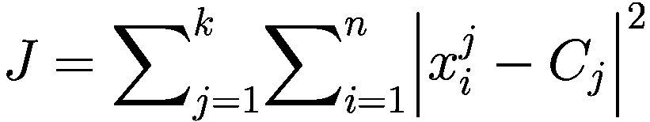

（方程 9-8）

其中 *J* 表示目标函数，*k* 表示聚类数量，*n* 表示案例数量，*x* 表示 *C*[*j*]，*C*[*j*] 表示 *j* 的质心。

K-Means 模型展示了经主成分分析降维后的数据。


### 执行主成分分析

主成分分析技术能够帮助你探究数据中的不一致性。它考虑了数据中的变异性在多大程度上描述了模型。在执行该技术时，你关注的是同样被视为潜在变量的成分。一个成分代表一个源自定量模型而非观测的变量。

图 9-4 展示了一个抽象模型，其中每个成分代表一个感兴趣的变量。

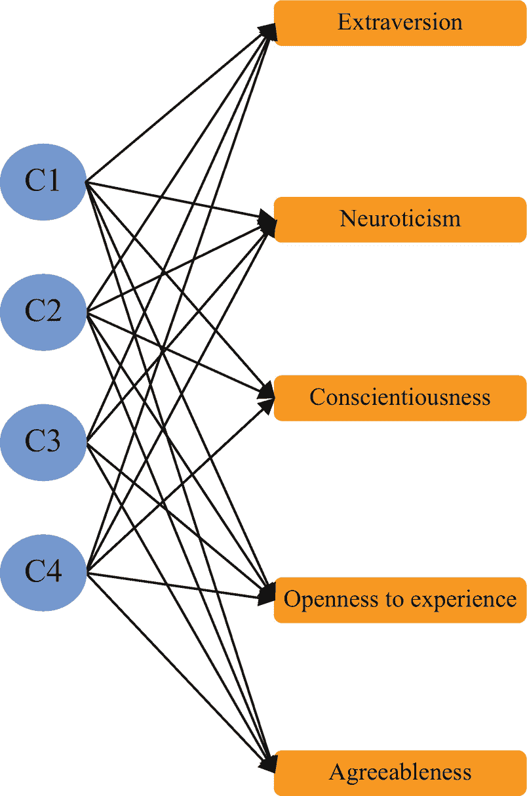

**图 9-4**

主成分

图 9-4 包含了基于成分（`C1`、`C2`、`C3` 和 `C4`）的特征（`外向性`、`神经质`、`尽责性`、`经验开放性`和`宜人性`）。一个显著考虑变异性的成分构成第一主成分，随后的成分构成第二主成分，依此类推。

方程 9-9 定义了 PCA 模型：

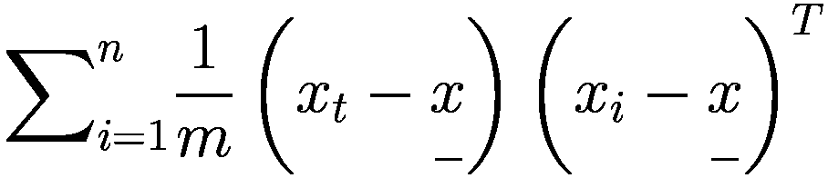

（方程 9-9）

其中 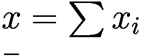 是特征值。

代码清单 9-9 执行了主成分分析。首先在你的环境中安装 `scikit-learn`：`pip install scikit-learn`。

```
from sklearn.preprocessing import StandardScaler
from sklearn.decomposition import PCA
pca = PCA(n_components = 5)
pca.fit(big_five_data)
scaler = StandardScaler()
standardized_big_five_data = scaler.fit_transform(big_five_data)
pca_big_five_data = pca.transform(standardized_big_five_data)
代码清单 9-9
执行主成分分析
```

代码清单 9-10 执行了 K-Means 模型。

```
from sklearn.cluster import KMeans
big_five_data_kmeans = KMeans(n_clusters = 5)
big_five_data_kmeans_model = kmeans.fit(pca_big_five_data)
big_five_data_kmeans_model
代码清单 9-10
执行 K-Means 模型
```

### 返回 K-Means 标签

代码清单 9-11 返回了 K-Means 标签（见表 9-7）。

**表 9-7**

K-Means 标签

|   | 聚类 |
| --- | --- |
| **0** | 2 |
| **1** | 3 |
| **2** | 2 |
| **3** | 0 |
| **4** | 2 |
| **...** | ... |
| **874429** | 3 |
| **874430** | 0 |
| **874431** | 1 |
| **874432** | 0 |
| **874433** | 1 |

```
big_five_data_kmeans_labels = pd.DataFrame(big_five_data_kmeans_model.labels_, columns = ["Clusters"])
big_five_data_kmeans_labels
代码清单 9-11
返回 K-Means 标签
```

### 识别 K-Means 聚类中心

代码清单 9-12 识别了 K-Means 聚类中心（表 9-8）

**表 9-8**

K-Means 聚类中心

|   | 聚类 1 | 聚类 2 | 聚类 3 | 聚类 4 | 聚类 5 |
| --- | --- | --- | --- | --- | --- |
| **0** | 1.070171 | -2.365766 | -4.186860 | 0.702053 | 0.049696 |
| **1** | 6.917444 | 5.127327 | 8.496112 | 8.223140 | 10.037378 |
| **2** | 5.106830 | 6.945864 | 5.599746 | 6.354891 | 8.202415 |
| **3** | 1.625516 | 2.770158 | 2.578343 | 4.617922 | 2.585453 |
| **4** | -5.435118 | -5.658154 | -5.808755 | -7.238314 | -4.330565 |

```
big_five_data_kmeans_centers = big_five_data_kmeans_model.cluster_centers_big_five_data_kmeans_centroids =
pd.DataFrame(big_five_data_kmeans_centers).transpose()
big_five_data_kmeans_centroids.columns = ["Cluster 1","Cluster 2", "Cluster 3", "Cluster 4", "Cluster 5"]
big_five_data_kmeans_centroids
代码清单 9-12
识别 K-Means 聚类中心
```

代码清单 9-13 展示了 K-Means 标签及其聚类中心（见图 9-5）。

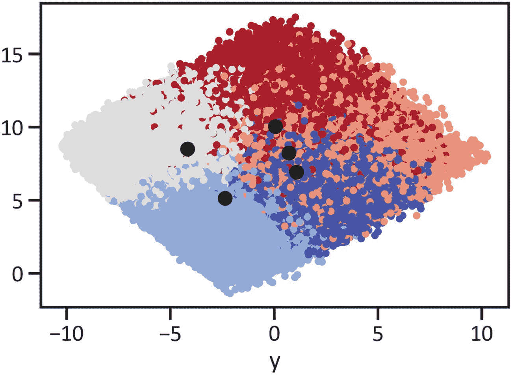

**图 9-5**

K-Means 结果

```
fig, ax = plt.subplots()
plt.scatter(pca_big_five_data[:,0], pca_big_five_data[:,1], c=big_five_data_kmeans_model.labels_, cmap = "coolwarm",s = 15)
plt.scatter(big_five_data_kmeans_centers[:,0], big_five_data_kmeans_centers[:,1], color="black")
plt.xlabel("y")
plt.show()
代码清单 9-13
展示 K-Means 标签
```

## 结论

本章通过执行因子分析和聚类分析，提出了一种分析不同人格特征的整体方法，以此作为本书的结尾。你使用从主成分分析方法中得到的降维数据拟合了聚类模型。

我希望你觉得这本书有用，并希望它能帮助你理解在医学科学多个领域中解决各种问题的方法。请向你的同行推荐并分享本书。

感谢你的阅读。


脚注 1 2 3

