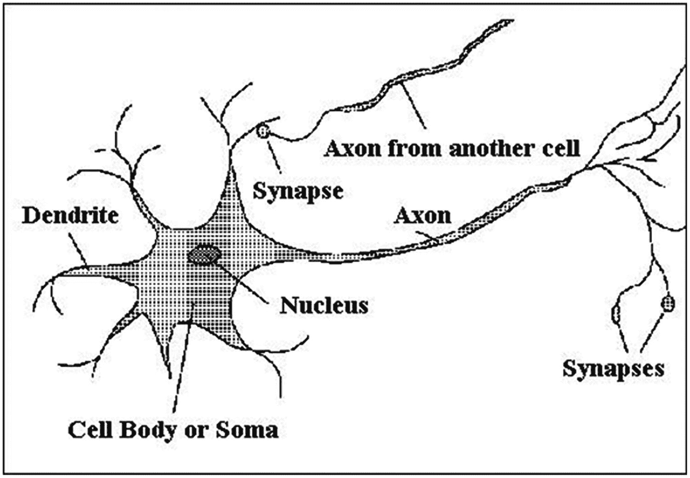
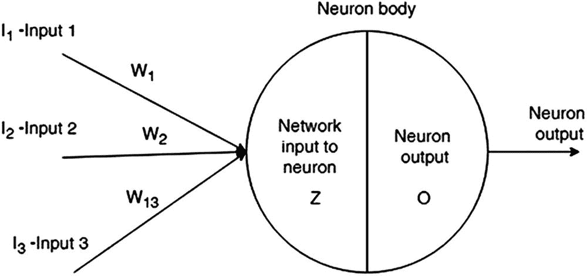
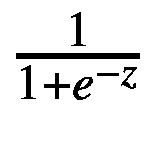
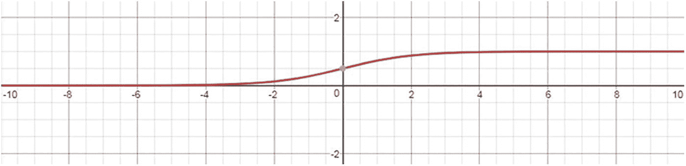
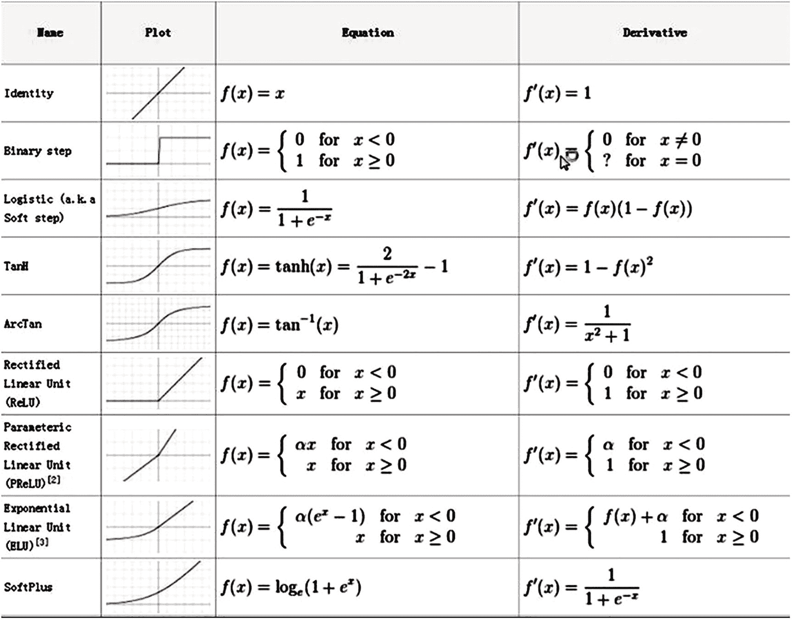

# 了解神经网络

人脑由数十亿个相互连接的神经元组成，这些神经元构成了一个神经网络。每个神经元处理一个小任务，然后激活下一个神经元，使处理得以继续。神经网络的主要特性是它们能够从周围环境中学习。这就是人类运作的方式。

学习过程通过增强或减弱突触连接分布在整个神经元网络中，使得更相关的信息获得更强的突触连接，而不太相关的信息则变弱。人工神经网络就是为了模仿这一过程而构建的，正如你将在本书后面学到的，这是通过调整神经元之间连接的权重来实现的。

人工智能神经网络架构在结构上模仿了大脑网络。它由方向性连接的神经元层组成。`图 1-1` 显示了人类神经元的示意图。


`图 1-1` 人类神经元的示意图

## 生物神经元与人工神经元

生物神经元（在简化层面上）由带有细胞核的细胞体、轴突和突触组成。突触接收冲动，由细胞体处理。细胞体通过轴突向与其他神经元相连的突触发送响应。模仿生物神经元，人工神经元由一个神经元体和与其他神经元的连接组成（见 `图 1-2`）。


`图 1-2` 单个人工神经元

每个输入到神经元的信号都被分配一个权重 `W`。分配给神经元的权重表示该输入在计算网络输出时的影响程度。如果分配给神经元 `W[1]` 的权重大于分配给神经元 `W[2]` 的权重，那么输入 1 对网络输出的影响比输入 2 更显著。我们稍后将展示这是如何工作的。

神经元的主体被描绘成一个被竖线分成两部分的圆圈。左侧部分称为“神经元的网络输入”，是神经元主体进行计算的部分。这一部分在网络图中通常标记为 `Z`。例如，`图 1-2` 所示神经元的 `Z` 值计算为每个输入乘以相应权重（`W`）的总和。这是方程 `(1-1)` 的线性部分。

```
Z = W[1]*I[1] + W[2]*I[2] + W[3]*I[3]      (1-1)
```

## 激活函数

为了计算同一神经元（`图 1-2`）的输出 `O`，我们将某种特殊的非线性函数（称为 `激活函数`，`Ϭ`）应用于计算的线性部分 `Z`（公式 `(1-2)`）。

`O = Ϭ(Z)` `(1-2)`

神经网络中使用的激活函数有很多种。它们的选择取决于其表现良好（未饱和）的区间、函数值随自变量变化的速率，以及个人偏好。让我们来看一种最常用的激活函数，称为 `sigmoid`。该函数的公式如公式 `(1-3)` 所示。

`Ϭ(Z) =`  `(1-3)`

`图 1-3` 展示了 `sigmoid` 激活函数的图像。


`图 1-3` Sigmoid 函数图像

如 `图 1-3` 所示，`sigmoid` 函数（有时也称为 `logistic` 函数）在区间 `[-1, 1]` 上表现最佳。在此区间之外，它会迅速饱和，这意味着当自变量变化时，其函数值不再变化。这就是为什么（你将在后面了解到）网络的输入数据通常被归一化到 `[-1, 1]` 区间内。

一些激活函数在区间 `[0, 1]` 上表现良好，因此这些激活函数的输入数据会相应地归一化到 `[0, 1]` 区间。`图 1-4` 列出了最常用的激活函数，包括函数名称、图像、方程以及函数的导数。`图 1-4` 在计算网络内部各部分时将非常有用。


`图 1-4` 激活函数

我们偏好的激活函数是 `tanh`。它在区间 `[-1, 1]` 上也表现良好（类似于 `sigmoid` 激活函数），但在此区间内的变化速率比 `sigmoid` 函数更快，并且饱和得更慢。在本书的几乎所有示例中，我们都使用 `tanh`。

## 本章小结

本章向你介绍了人工智能神经网络，解释了神经网络的所有重要概念，如层、神经元、连接、权重和激活函数。本章还解释了绘制神经网络图时使用的约定。下一章将通过手动计算所有网络结果，展示神经网络处理的全部细节。为简洁起见，在本书的其余部分，术语 `神经网络` 和 `网络` 将互换使用。