# 2. 神经网络处理的内部机制

本章讨论神经网络处理的内部工作原理，展示网络是如何构建、训练和测试的。

### 待逼近的函数

让我们考虑图 2-1 中所示的函数 `y(x) = x²`。然而，我们假设该函数的公式是未知的，并且我们只知道该函数在四个点上的值。

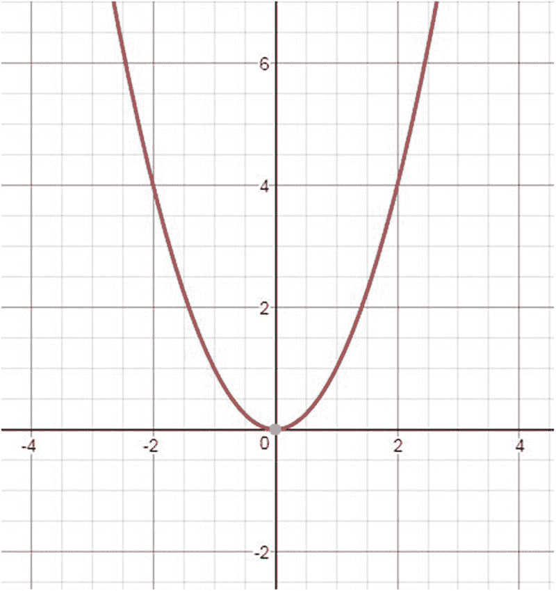

**图 2-1** 函数图像

表 2-1 显示了该函数在四个点上的值。

**表 2-1** 在四个点上给出的函数值

| x | f(x) |
| --- | --- |
| 1 | 1 |
| 3 | 9 |
| 5 | 25 |
| 7 | 49 |

我们希望构建一个公式（或过程），用于预测这个未知函数在未给出的某些自变量（`x`）上的值（在统计分析中，这种处理称为*回归*）。为了能够获得未给出点上的函数值，我们需要逼近这个函数。逼近完成后，我们就可以找到该函数在任何感兴趣点上的值。这正是神经网络的用途，因为网络是一种通用的逼近机制。

### 网络架构

网络是如何构建的？网络是通过包含神经元层来构建的（见图 2-2）。左侧的第一层是输入层，包含接收外部输入的神经元。右侧的最后一层是输出层，包含承载网络输出的神经元。一个或多个隐藏层位于输入层和输出层之间。隐藏层神经元用于在函数逼近过程中执行大部分计算。图 2-2 展示了网络图。

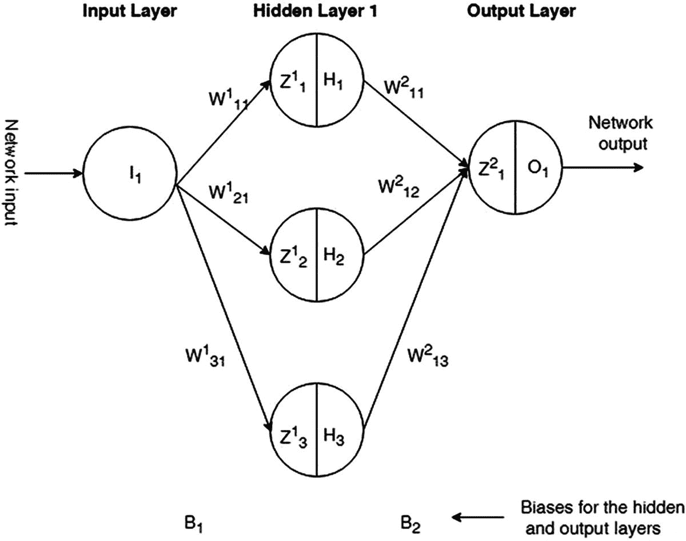

**图 2-2** 神经网络架构

从前一层神经元到下一层神经元之间绘制了连接。前一层中的每个神经元都与下一层的所有神经元相连。这样的网络称为*全连接网络*。每个连接都带有一个权重。每个权重由两个索引编号。第一个索引是接收神经元的编号，第二个索引是发送神经元的编号。例如，隐藏层中第二个神经元（`H[2]`）与输入层中唯一神经元（`I[1]`）之间的连接被赋予权重 `W¹[21]`。上标 1 表示发送神经元所在的层号。每个网络层都分配有一个偏置。偏置类似于分配给神经元的权重，但应用于整个层。

当网络处理开始时，权重和偏置的初始值通常是随机设置的。通常，要确定隐藏层中的神经元数量，可以将输入层神经元数量加倍，然后加上输出层神经元数量。在我们的例子中，是 `(1*2+1 = 3)`，即三个神经元。确定网络中使用的隐藏层数量取决于待逼近函数的复杂度。通常，对于一个平滑的连续函数，一个隐藏层就足够了；而对于更复杂的函数拓扑，则需要更多的隐藏层。在实践中，能够带来最佳逼近结果的隐藏层数量和神经元数量通常是通过实验确定的。

网络处理包括两个过程：前向传播和反向传播。

在前向传播中，计算从左向右进行。对于每个神经元，网络获取该神经元的输入，并计算该神经元的输出。

### 前向传播计算

以下是前向传播计算：

神经元 `H[1]`

`Z¹[1] = W¹[11]*I[1] + B[1]*1`

`H[1] = Ϭ(Z¹[1])`

神经元 `H[2]`

`Z¹[2] = W¹[21]*I[1] + B[1]*1`

`H[2] = Ϭ(Z¹[2])`

神经元 `H[3]`

`Z¹[3] = W¹[31]*I[1] + B[1]*1`

`H[3] = Ϭ(Z¹[3])`

上述计算给出了神经元 `H[1]`、`H[2]` 和 `H[3]` 的输出。这些值在处理下一层（本例中为输出层）的神经元时被用作输入。

神经元 `O[1]`

`Z²[1] = W²[11]*H[1] + W²[12]*H[2] + W²[13]*H[3] + B[2]*1`

`O[1] = Ϭ(Z²[1])`

第一次传播中的计算给出了网络的输出（称为*网络预测值*）。当我们训练网络时，我们使用训练数据点的已知输出，称为*实际值*或*目标值*。通过了解网络对于给定输入应产生的输出值，我们可以计算网络误差，即目标值与网络计算值（预测值）之间的差值。对于本例中我们要逼近的函数，实际（目标）值如表 2-2 的第二列所示。

**表 2-2** 示例的输入数据集

| x | f(x) |
| --- | --- |
| 1 | **1** |
| 3 | **9** |
| 5 | **25** |
| 7 | **49** |

对输入数据集中的每条记录都进行计算。例如，处理输入数据集的第一条记录时使用以下公式。

#### 输入记录 1

以下是输入记录 1：

神经元 `H[1]`

`Z¹[1] = W¹[11]*I[1] + B[1]*1.00 = W¹[11]*1.00 + B[1]*1.00`

`H[1] = Ϭ(Z¹[1])`

神经元 `H[2]`

`Z¹[2] = W¹[21]*I[1] + B[1]*1.00 = W¹[21]*1.00 + B[1]*1.00`

`H[2] = Ϭ(Z¹[2])`

神经元 `H[3]`

`Z¹[3] = W¹[31]*I[1] + B[1]*1.00 = W¹[31]*1.00 + B[1]*1.00`

`H[3] = Ϭ(Z¹[3])`

神经元 `O[1]`

`Z²[1] = W²[11]*H[1] + W²[12]*H[2] + W²[13]*H[3] + B[2]*1.00`

`O[1] = Ϭ(Z²[1])`

记录 1 的误差如下：

`E[1] = Ϭ(Z²[1]) – 记录 1 的目标值 = Ϭ(Z²[1]) – 1.00`

#### 输入记录 2

以下是输入记录 2：

神经元 `H[1]`

`Z¹[1] = W¹[11]*I[1] + B[1]*1.00 = W¹[11]*3.00 + B[1]*1.00`

`H[1] = Ϭ(Z¹[1])`

神经元 `H[2]`

`Z¹[2] = W¹[21]*I[1] + B[1]*1.00 = W¹[21]*3.00 + B[1]*1.00`

`H[2] = Ϭ(Z¹[2])`

神经元 `H[3]`

`Z¹[3] = W¹[31]*I[1] + B[1]*1.00 = W¹[31]*3.00 + B[1]*1.00`

`H[3] = Ϭ(Z¹[3])`

神经元 `O[1]`

`Z²[1] = W²[11]*H[1] + W²[12]*H[2] + W²[13]*H[3] + B[2]*1.00`

`O[1] = Ϭ(Z²[1])`

记录 2 的误差如下：

`E[1] = Ϭ(Z²[1]) – 记录 2 的目标值 = Ϭ(Z²[1]) – 9.00`

#### 输入记录 3

以下是输入记录 3：

神经元 `H[1]`

`Z¹[1] = W¹[11]*I[1] + B[1]*1.00 = W¹[11]*5.00 + B[1]*1.00`

`H[1] = Ϭ(Z¹[1])`

神经元 `H[2]`

`Z¹[2] = W¹[21]*I[1] + B[1]*1.00 = W¹[21]*5.00 + B[1]*1.00`

`H[2] = Ϭ(Z¹[2])`

神经元 `H[3]`

`Z¹[3] = W¹[31]*I[1] + B[1]*1.00 = W¹[31]*5.00 + B[1]*1.00`

`H[3] = Ϭ(Z¹[3])`

神经元 `O[1]`

`Z²[1] = W²[11]*H[1] + W²[12]*H[2] + W²[13]*H[3] + B[2]*1.00`

`O[1] = Ϭ(Z²[1])`

记录 3 的误差如下：

`E[1] = Ϭ(Z²[1]) – 记录 3 的目标值 = Ϭ(Z²[1]) – 25.00`

#### 输入记录 4

以下是输入记录 4：

神经元 `H[1]`

`Z¹[1] = W¹[11]*I[1] + B[1]*1.00 = W¹[11]*7.00 + B[1]*1.00`

`H[1] = Ϭ(Z¹[1])`

神经元 `H[2]`

`Z¹[2] = W¹[21]*I[1] + B[1]*1.00 = W¹[21]*7.00 + B[1]*1.00`

`H[2] = Ϭ(Z¹[2])`

神经元 `H[3]`

`Z¹[3] = W¹[31]*I[1] + B[1]*1.00 = W¹[31]*7.00 + B[1]*1.00`

`H[3] = Ϭ(Z¹[3])`

神经元 `O[1]`

`Z²[1] = W²[11]*H[1] + W²[12]*H[2] + W²[13]*H[3] + B[2]*1.00`

`O[1] = Ϭ(Z²[1])`

输入记录 4 的误差如下：

`E[1] = Ϭ(Z²[1]) – 记录 4 的目标值 = Ϭ(Z²[1]) – 49.00`

当所有记录都处理完毕后，处理过程中的这个点被称为一个*周期*。此时，我们取所有记录的网络误差的平均值，即 `E = (E1 + E2 + E3 + E4)/4`，这就是当前周期的误差。显然，第一个周期（使用随机初始化的权重/偏置）的误差对于良好的函数逼近来说会太大；因此，我们需要将这个误差减小到可接受的（期望的）值，称为*误差限*，我们在处理开始时设定它。减小网络误差是在反向传播（也称为*反向传播*）中完成的。

### 反向传播

如何减小网络误差？显然，初始的权重和偏置值是随机设置的，它们并不理想，这导致了周期误差显著。

我们需要调整它们，使得新的值能够导致更小的网络计算误差。反向传播通过将误差重新分配到输出层和隐藏层的所有网络神经元之间，并调整它们的初始权重值来实现这一点。同时也会对层偏置进行调整。

为了调整每个神经元的权重，我们计算误差函数相对于该神经元输出的偏导数。例如，对于神经元 `O[1]`，计算出的偏导数是 `∂E/∂O₁`。由于偏导数指向函数值增加的方向（但我们需要减小误差函数的值），因此权重调整应在相反方向进行。

*调整后的权重值* = *原始权重值* – η * `∂E/∂O₁`

这里，η 是网络的学习率，它控制网络学习的速度。其值通常设置在 0.1 到 1.0 之间。

对每一层的偏置也进行类似的计算。对于偏置 `B[1]`，计算出的偏导数是 `∂E/∂B₁`；然后按如下方式计算调整后的偏置：

*调整后的偏置值* `B[1]` = *原始偏置值* `B[1]` – η * `∂E/∂B₁`

通过对每个网络神经元和每层偏置重复此计算，我们得到一组新的调整后的权重/偏置值。有了新的权重/偏置值集，我们返回到前向传播，并使用调整后的权重/偏置计算新的网络输出。同时，我们重新计算网络输出误差。

由于权重/偏置的调整是在与梯度（偏导数）相反的方向上进行的，因此新计算出的网络误差应该会减小。我们循环重复前向和反向传播，直到误差小于我们的误差限。此时，网络被认为已训练完成，我们将训练好的网络保存到磁盘上。训练好的网络包含所有权重和偏置参数，这些参数能够以所需的精度逼近预测的函数值。在下一章中，我们将手动处理一些示例，并展示所有详细的计算过程。不过，在此之前，我们需要复习一下函数导数和梯度的知识。

### 函数导数与函数散度

函数的导数定义如下：

 = 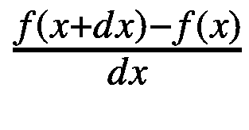

其中 `∂x` 是函数自变量的一个微小变化量。

- `f(x)`: 自变量改变前的函数值
- `f(x + ∂x)`: 自变量改变后的函数值

函数导数表示单变量函数 `f(x)` 在点 `x` 处的变化率。梯度是多变量函数 `f(x, y, z)` 在点 `(x, y, z)` 处的导数（变化率）。多变量函数 `f(x, y, z)` 的梯度是由每个方向上的分量（, 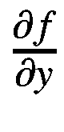, 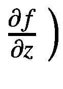 相乘得到的。每个分量被称为函数 `f(x, y, z)` 关于特定变量（方向）`x`、`y`、`z` 的*偏导数*。

函数任意点处的梯度总是指向该函数增长最快的方向。在局部最大值或局部最小值处，梯度为零，因为在这些位置没有单一的增长方向。当我们寻找函数的最小值（例如，误差函数的最小值）时，我们沿着与梯度相反的方向移动。

计算导数有若干规则。

- 幂法则：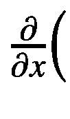`u^a`) = `a * u^(a-1)` * 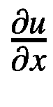

- 乘积法则：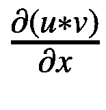 = `u` * 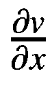 + `v` * 

- 商法则：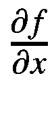 (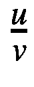) = 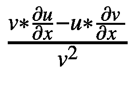

- 链式法则：该法则告诉我们如何对复合函数求导。

    它指出 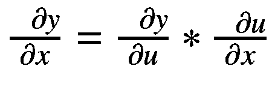，其中 `u = f(x)`。

    示例如下：`y = u⁸` 且 `u = x² + 5`。

    根据链式法则，

     = `8u⁷ * 2x` = `16x * (x² + 5)⁷`

#### 最常用的函数导数

图 2-3 展示了最常用的函数导数。

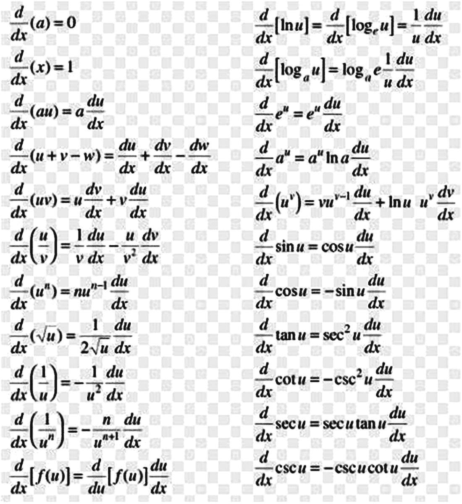

图 2-3

常用导数

了解 sigmoid 激活函数的导数也很有帮助。

`Ϭ(Z) = 1 / (1 + exp(-Z))`

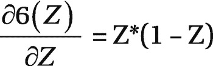

sigmoid 激活函数的导数给出了该激活函数在任意神经元处的变化率。

### 总结

本章通过解释所有处理结果是如何计算的，探讨了神经网络处理的内部机制。它向你介绍了导数和梯度，并描述了这些概念如何用于寻找误差函数的最小值之一。下一章将展示一个手动计算结果的具体示例。仅仅描述计算规则不足以理解该主题，因为将这些规则应用于特定的网络架构确实很棘手。

