# 3. 手动神经网络处理

在本章中，我们通过一个简单的示例来展示神经网络处理的内部细节。我们提供了处理前向传播和反向传播过程所涉及计算的详细分步说明。

> **注意**  
> 需要指出的是，本章中的所有计算均基于第 2 章所解释的信息。如果你在阅读本章时遇到任何问题，请查阅第 2 章以获取解释。

### 示例：单点处函数的手动近似

图 3-1 展示了在三维空间中显示的向量。

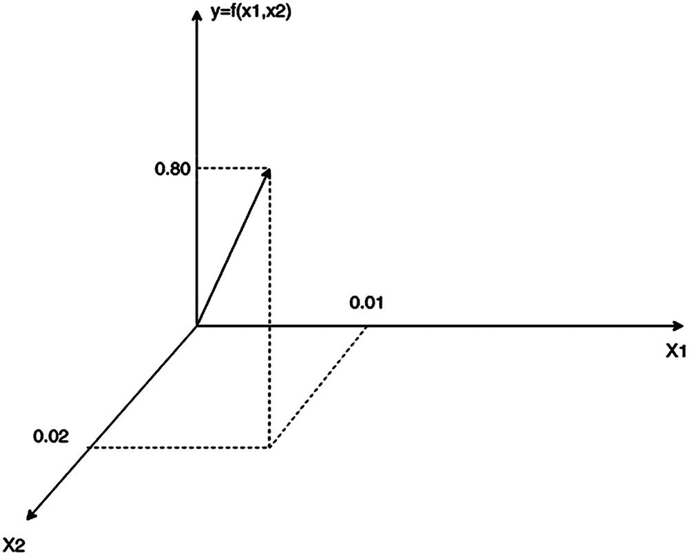

图 3-1

三维空间中的向量

它表示函数 `y = f(x1, x2)` 的值，其中 `x1 = 0.01` 且 `x2 = 0.02`。

`y(0.01, 0.02) = 0.80`

### 构建神经网络

我们要构建并训练一个网络，使其对于给定的输入（`x1 = 0.01`，`x2 = 0.02`）能够计算出输出结果 `y = 0.80`（网络的**目标值**）。图 3-2 展示了该示例的网络图。

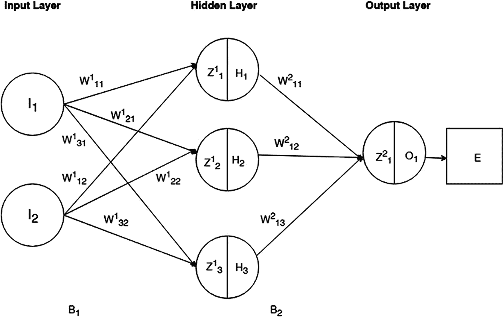

图 3-2

网络图

该网络包含三层神经元（输入层、隐藏层和输出层）。输入层有两个神经元（`I[1]` 和 `I[2]`），隐藏层有三个神经元（`H[1]`、`H[2]`、`H[3]`），输出层有一个神经元（`O[1]`）。权重显示在箭头附近，这些箭头表示神经元之间的连接（例如，神经元 `I[1]` 和 `I[2]` 为神经元 `H[1]` 提供输入，对应的权重分别为 `W¹[11]` 和 `W¹[12]`）。

隐藏层和输出层神经元（`H[1]`、`H[2]`、`H[3]` 和 `O[1]`）的主体被表示为一个分为两部分的圆圈（见图 3-3）。神经元主体的左侧部分显示该神经元计算出的网络输入值（`Z¹[1] = W¹[11]*I[1]+W¹[12]*I[2] + B[1]*1`）。偏置的初始值通常设置为 1.00。右侧部分显示通过对神经元的网络输入应用激活函数而计算出的神经元输出。

`H[1] = Ϭ(Z¹[1]) = 1/(1+exp(- Z¹[1]))`

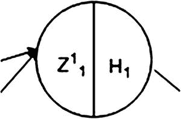

图 3-3

隐藏层和输出层中的神经元表示

误差函数的计算用一个方框表示，以区别于神经元（见图 3-4）。

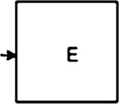

图 3-4

误差函数表示

`B[1]` 和 `B[2]` 是相应网络层的偏置。

以下是网络初始设置的摘要：

- 神经元 `I[1]` 的输入 = 0.01
- 神经元 `I[2]` 的输入 = 0.02
- `T[1]` -（神经元 `O[1]` 的目标输出）= 0.80

我们还需要为权重和偏置参数分配初始值。初始参数的值通常是随机设置的，但对于本例，我们为其分配以下值：

`W¹[11] = 0.05` `W¹[12] = 0.06` `W¹[21] = 0.07` `W¹[22] = 0.08` `W¹[31] = 0.09` `W¹[32] = 0.10`

`W²[11] = 0.11` `W²[12] = 0.12` `W²[13] = 0.13`

`B[1] = 0.20`

`B[2] = 0.25`

### 前向传播计算

前向传播计算从隐藏层开始。

#### 隐藏层

以下是隐藏层：

神经元 `H[1]`：

1. 计算神经元 `H[1]` 的总净输入。

   `Z¹[1] = W¹[11]* I[1] + W¹[12]* I[2] + B[1]*1.00 = 0.05*0.01 + 0.06*0.02 + 0.20*1.00 = 0.2017000000000000` (3-1)

2. 使用逻辑函数获取 `H[1]` 的输出。

   `H[1] = δ(Z¹[1]) = 1/(1+exp(- Z¹[1])) = 1/(1+exp(-0.2017000000000000)) = 0.5502547397403884` (3-2)

神经元 `H[2]`：

- `Z¹[2] = W¹[21]* I[1] + W¹[22]* I[2] + B[1]*1.00 = 0.07*0.01 + 0.08*0.02 + 0.20*1.00 = 0.2023`

  `H[2] = 1/(1+exp(-0.2023)) = 0.5504032199355139` (3-3)

神经元 `H[3]`：

- `Z¹[2] = W¹[31]* I[1] + W¹[32]* I[2] + B[1]*1.00 = 0.09*0.01 + 0.10*0.02 + 0.20*1.00 = 0.20290000000000002`

  `H[3] = 1/(1+exp(-0.20290000000000002)) = 0.5505516911502556` (3-4)

#### 输出层

输出层神经元 `O[1]` 的计算与隐藏层神经元计算类似，但有一个区别。输出神经元 `O[1]` 的输入是相应隐藏层神经元的输出。另外，请注意有三个隐藏层神经元对输出层神经元 `O[1]` 有贡献。

神经元 `O[1]`：

1. 计算神经元 `O` 的总净输入。

   `Z²[1] = W²[11]* H[1] + W²[12]* H[2] + W²[13]* H[3] + B[2]*1.00 = 0.11*0.5502547397403884 + 0.12*0.5504032199355139 + 0.13*0.5505516911502556 + 0.25*1.00 = 0.44814812761323763` (3-5)

2. 使用逻辑函数 `Ϭ` 获取 `O[1]` 的输出。

   `O[1] = Ϭ(Z²[1]) = 1/(1+exp(- Z²[1])) = 1/(1+exp(-0.44814812761323763)) = 0.6101988445912522` (3-6)

神经元 `O[1]` 计算出的输出是 0.6101988445912522，而神经元 `O[1]` 的目标输出必须等于 0.80；因此，神经元 `O[1]` 输出的平方误差如下：

- `E = 0.5*(T[1] – O[1])² = 0.5*(0.80 - 0.6101988445912522) = 0.01801223929724783` (3-7)

这里需要做的是最小化网络计算出的误差，以获得良好的近似结果。这是通过在输出层和隐藏层神经元的权重和偏置之间重新分配网络误差来实现的，同时考虑到每个神经元对网络输出的影响取决于其权重。此计算在反向传播过程中完成。

为了将误差重新分配给所有输出层和隐藏层神经元并调整它们的权重，我们需要了解当每个神经元的权重发生变化时，最终误差值会变化多少。每层偏置的情况也是如此。通过将网络误差重新分配给所有输出层和隐藏层神经元，我们实际上是在计算每个神经元权重和每层偏置的调整量。

### 反向传播计算

计算每个网络神经元/层的权重和偏置调整量是通过反向移动（从网络误差到输出层，然后从输出层到隐藏层）来完成的。

#### 计算输出层神经元的权重调整量

让我们计算神经元 `W²[11]` 的权重调整量。正如我们已经知道的，函数的偏导数决定了误差函数参数的一个微小变化对函数值相应变化的影响。将其应用于神经元 `W²[11]`，我们想知道 `W²[11]` 的变化如何影响网络误差 `E`。为此，我们需要计算误差函数 `E` 关于 `W²[11]` 的偏导数，即 ``。

##### 计算 `W²[11]` 的调整量

应用链式法则求导，`∂E/∂W²[11]` 可由以下公式表示：

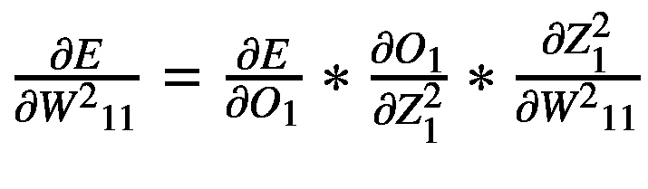 (3-8)

让我们使用微积分分别计算等式的每个部分。

`E = 0.5*(T[1] – O[1])²`

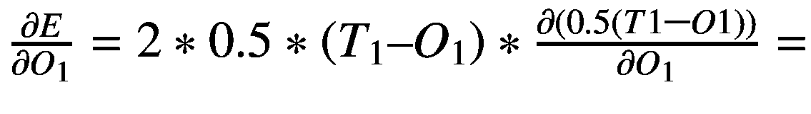 `(T[1] - O[1])*(-1) = O[1]- T[1] = 0.80 – 0.6101988445912522 = -0.18980115540874787` (3-9)

 是 Sigmoid 激活函数的导数，等于 `O[1]*(1- O[1]) = 0.6101988445912522*(1 - 0.6101988445912522) = 0.23785621465075305` (3-10)

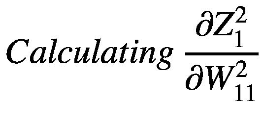

`Z²[1] = W²[11]* H[1] + W²[12]* H[2] + W²[13]* H[3] + B[2]*1.00` (3-11)

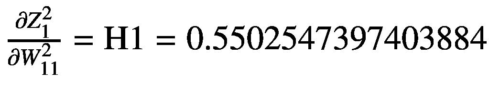 (3-12)

注意，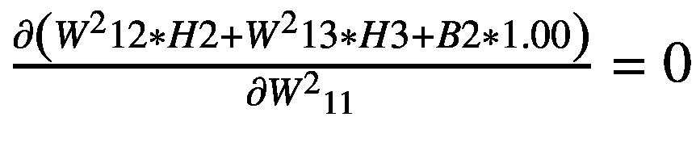，因为这部分不依赖于 `W²[11]`。

综合起来，我们得到：

 `= -0.18980115540874787 * 0.23785621465075305 * 0.5502547397403884 = -0.024841461722517316` (3-13)

为了减小误差，我们需要从 `W²[11]` 的原始值中减去  的值（可选择乘以某个学习率 `η`），从而计算出 `W²[11]` 的新调整值。

`adjustedW²[11] = W²[11] – η * ∂E/∂W²[11]`。在此示例中，`η = 1`。 (3-14)

`adjustedW²[11] = 0.11 + 0.024841461722517316 = 0.13484146172251732`

##### 计算 `W²[12]` 的调整量

应用链式法则求导，`∂E/∂W²[12]` 可由以下公式表示：

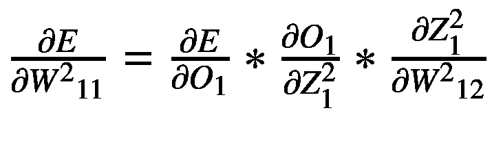 (3-15)

让我们使用微积分分别计算等式的每个部分。

 `= -0.18980115540874787` (参见 1-3) (3-16)

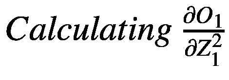

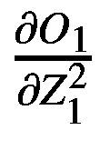 `= 0.23785621465075305` (参见 1-4) (3-17)

`Z²[1] = W²[11]* H[1] + W²[12]* H[2] + W²[13]* H[3] + B[2]*1.00` (3-18)

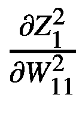 `= H[2] = 0.5504032199355139` (参见 1-3) (3-19)

综合起来，我们得到：

 `= -0.18980115540874787 * 0.23785621465075305 * 0.5502547397403884 = -0.024841461722517316` (3-20)

为了减小误差，我们需要从 `W²[12]` 的原始值中减去  的值（可选择乘以某个学习率 `η`），从而计算出 `W²[12]` 的新调整值。

`adjustedW²[12] = W²[12] – η * ∂E/∂W²[12]`

`adjustedW²[12] = 0.12 + 0.024841461722517316 = 0.1448414617225173` (3-21)

##### 计算 `W²[13]` 的调整量

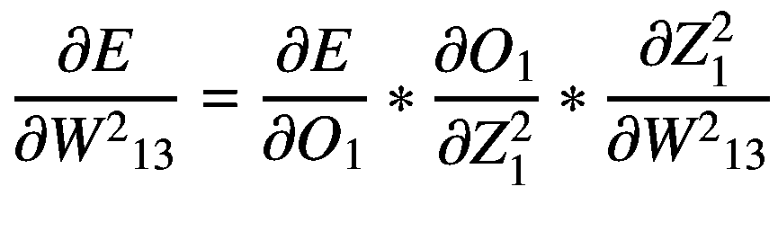

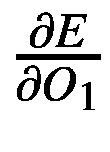 `= -0.18980115540874787` (参见 1-13) (3-22)

 `= 0.23785621465075305` (参见 1-14) (3-23)

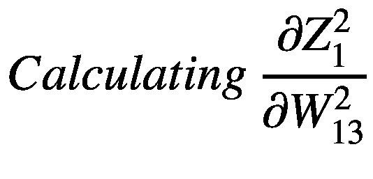

`Z²[1] = W²[11]* H[1] + W²[12]* H[2] + W²[13]* H[3] + B[2]*1.00` (3-24)

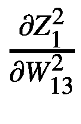 `= H[3] = 0.5505516911502556` (参见 1-4) (3-25)

综合起来，我们得到：

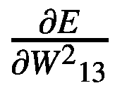 `= -0.18980115540874787 * 0.23785621465075305 * 0.5505516911502556 = -0.024854867708052567` (3-26)

`adjustedW²[13] = W²[13] – η * ∂E/∂W²[13]`。在此示例中，`η = 1`。

`adjustedW²[12] = 0.13 + 0.024841461722517316 = 0.1548414617225173` (3-27)

因此，在第二次迭代中，我们将使用以下调整后的权重值：

*   `adjustedW²[11] = 0.08515853827748268`
*   `adjustedW²[12] = 0.09515853827748268`
*   `adjustedW²[13] = 0.10515853827748269`

调整完输出神经元的权重后，我们准备计算隐藏神经元的权重调整量。

#### 计算隐藏层神经元的权重调整量

计算隐藏层神经元的权重调整量与输出层中的相应计算类似，但有一个重要区别。对于输出层的神经元，其输入现在是隐藏层中相应神经元的输出结果。

##### 计算 `W¹[11]` 的调整量

应用链式法则求导，`∂E/∂W¹[11]` 可由以下公式表示：

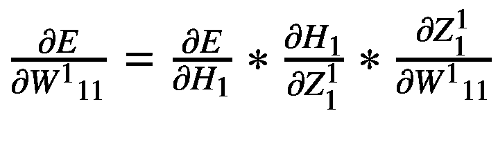 (3-28)

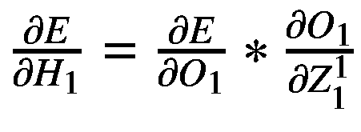 = `-0.18980115540874787 * 0.23785621465075305 = -0.04514538436186407` (参见 1-13 和 1-14) (3-29)

 = `Ϭ(H[1]) = H[1] * (1 - H[1]) = 0.5502547397403884 * (1 - 0.5502547397403884) = 0.24747446113362584` (3-30)

 = `I[1] = 0.01` (3-31)

综合起来，我们得到：

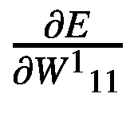 = `-0.04514538436186407 * 0.24747446113362584 * 0.01 = -0.0001117232966762273` (3-32)

`adjustedW¹[11] = W¹[11] – η *`  `= 0.05 - 0.0001117232966762273 = 0.049888276703323776` (3-33)

`adjustedW¹[11] = W¹[11] – η *`  `= 0.05 + 0.0001117232966762273 = 0.05011172329667623` (3-34)

##### 计算 `W¹[12]` 的调整量

应用链式法则求导，`∂E/∂W¹[12]` 可由以下公式表示：

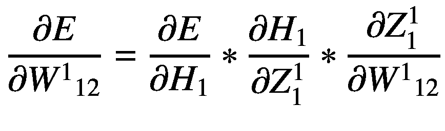

 = `-0.18980115540874787 * 0.23785621465075305 = -0.04514538436186407` (参见 1-13 和 1-14) (3-35)

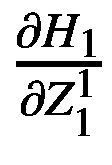 = `0.24747446113362584` (参见 1-28) (3-36)

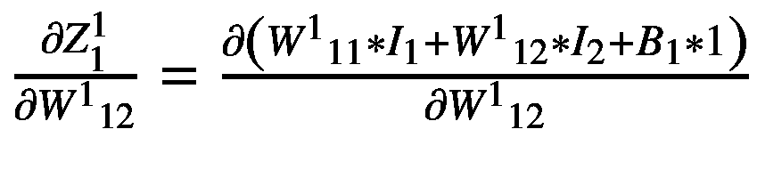 = `I[2] = 0.02` (3-37)

综合起来，我们得到：

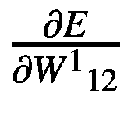 = `-0.04514538436186407 * 0.24747446113362584 * 0.02 = -0.00022344659335245464` (3-38)

`adjustedW¹[12] = W¹[12] – η *`  `= 0.06 + 0.00022344659335245464 = 0.06022344659335245` (3-39)

##### 计算 `W¹[21]` 的调整量

应用链式法则求导，`∂E/∂W¹[21]` 可由以下公式表示：

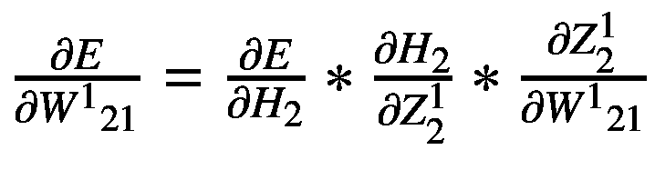 (3-40)

 = `-0.18980115540874787 * 0.23785621465075305 = -0.04514538436186407` (参见 3-9 和 3-10) (3-41)

 = `H[2] * (1 – H[2]) = 0.5504032199355139 * (1 - 0.5504032199355139) = 0.059776553406647545` (3-42)

 = `I[1] = 0.01` (3-43)

综合起来，我们得到：

 = `-0.04514538436186407 * 0.059776553406647545 * 0.01 = -0.000026986354793705983` (3-44)

`adjustedW¹[21] = W¹[12] – η *`  `= 0.07 + 0.000026986354793705983 = 0.07002698635479371` (3-45)

##### 计算 `W¹[22]` 的调整量

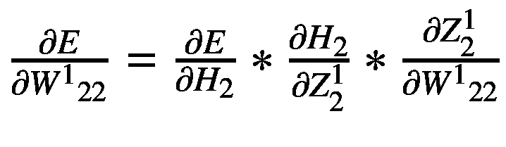 (3-46)

 = `-0.04514538436186407` (参见 3-9 和 3-10) (3-47)

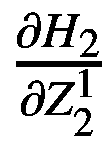 = `H[2] * (1 – H[2]) = 0.5504032199355139 * (1 - 0.5504032199355139) = 0.059776553406647545` (3-48)

 = `I[2] = 0.02` (3-49)

综合起来，我们得到：

 = `-0.04514538436186407 * 0.059776553406647545 * 0.02 = -0.000053972709587411966` (3-50)

`adjustedW¹[22] = W¹[22] – η *`  `= 0.08 + 0.000053972709587411966 = 0.08005397270958742` (3-51)

##### 计算 `W¹[31]` 的调整量

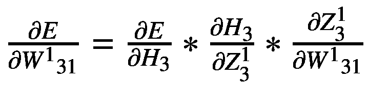 (3-52)

 = `-0.04514538436186407` (参见 1-13 和 1-14) (3-49)

 = `H[3] * (1 – H[3]) = 0.5505516911502556 * (1 - 0.5505516911502556) = 0.24744452652184917` (3-53)

 = `I[1] = 0.01` (3-54)

综合起来，我们得到：

 = `-0.04514538436186407 * 0.24744452652184917 * 0.01 = -0.0001117097825806835` (3-55)

`adjustedW¹[31] = W¹[31] – η *` 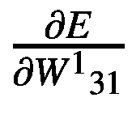 `= 0.09 + 0.0001117097825806835 = 0.09011170978258068` (3-56)

##### 计算 `W¹[32]` 的调整量

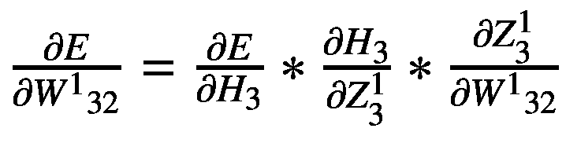 (3-57)

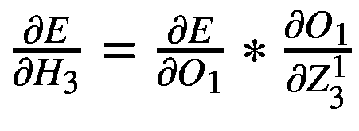 = -0.04514538436186407 (参见 1-49) (3-58)

 = `H[3]` * (1 – `H[3]`) = 0.5505516911502556 * (1 - 0.5505516911502556) = 0.24744452652184917 (参见 1-50) (3-59)

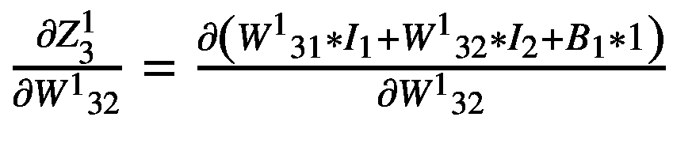 = `I[2]` = 0.02 (3-60)

综合起来，我们得到：

 = -0.04514538436186407 * 0.24744452652184917 * 0.02 = -0.000223419565161367 (3-61)

`adjustedW¹[32]` = `W¹[32]` – η *  = 0.10 + 0.000223419565161367 = 0.10022341956516137 (3-62)

### 更新网络偏置

我们需要计算偏置 `B[1]` 和 `B[2]` 的误差调整量。再次使用链式法则：

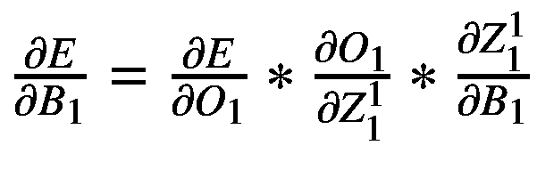 (3-63)

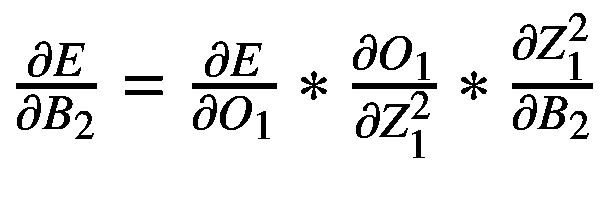 (3-64)

计算上述两个表达式的三个部分，我们得到：

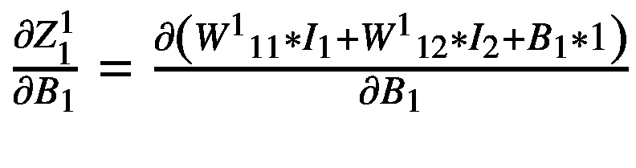 = 1 (3-65)

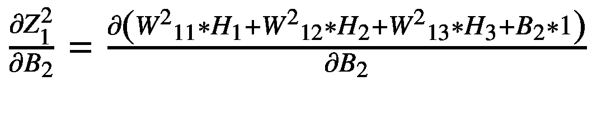 = 1 (3-66)

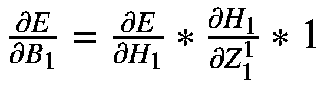 = `δ¹[1]` (3-67)

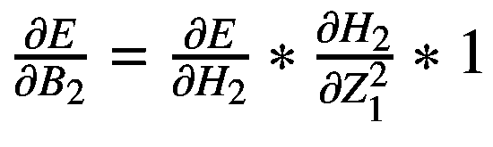 = `δ²[1]` (3-68)

因为我们是按层（而非按神经元）使用偏置 `B[1]` 和 `B[2]`，所以我们可以计算该层的平均 δ。

`δ¹` = `δ¹[1]` + `δ¹[2]` + `δ¹[3]` (3-69)

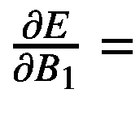 `δ¹` (3-70)

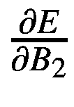 = `δ²` (3-71)

`δ²` =  = -0.18980115540874787 * 0.23785621465075305 = -0.04514538436186407 (3-72)

`δ¹[1]` =  = -0.04514538436186407 (3-73)

`δ¹[2]` = 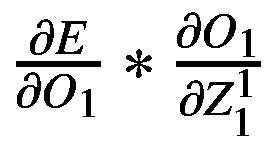 = -0.04514538436186407 (3-74)

`δ¹[3]` = 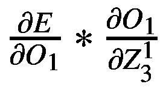 = -0.04514538436186407 (3-75)

由于偏置调整是按层计算的，我们取每个神经元计算出的偏置调整量的平均值。

`δ¹` = (`δ¹[1]` + `δ¹[2]` + `δ¹[3]`) / 3 = -0.04514538436186407 (3-76)

`δ²` = -0.04514538436186407

引入变量 δ 后，我们得到：

`adjusted B[1]` = `B[1]` – η * `δ[1]` = 0.20 + 0.04514538436186407 = 0.2451453843618641 (3-77)

`adjusted B[2]` = `B[2]` - η * `δ[2]` = 0.25 + 0.04514538436186407 = 0.29514538436186405 (3-78)

现在我们已经计算了所有新的权重值，让我们回到前向阶段并计算新的误差。

### 回到前向传播

使用新的调整后的权重/偏置重新计算隐藏层和输出层的网络输出。

#### 隐藏层

以下是隐藏层：

神经元 `H[1]`:

1.  计算神经元 `H[1]` 的总净输入。

    `Z¹[1]` = `W¹[11]` * `I[1]` + `W¹[12]` * `I[2]` + `B[1]` * 1.00 = 0.05011172329667623 * 0.01 + 0.06022344659335245 * 0.02 + 0.2451453843618641 * 1.00 = 0.2468509705266979 (3-79)

2.  使用逻辑函数获取 `H[1]` 的输出。

    `H[1]` = δ(`Z¹[1]`) = 1 / (1 + exp(-`Z¹[1]`)) = 1 / (1 + exp(-0.2468509705266979)) = 0.561401266257945 (3-80)

神经元 `H[2]`:

*   `Z¹[2]` = `W¹[21]` * `I[1]` + `W¹[22]` * `I[2]` + `B[1]` * 1.00 = 0.07002698635479371 * 0.01 + 0.08005397270958742 * 0.02 + 0.2451453843618641 * 1.00 = 0.24744673367960376 (3-81)

    `H[2]` = 1 / (1 + exp(-0.24744673367960376)) = 0.5615479555799516 (3-82)

神经元 `H[3]`:

*   `Z¹[3]` = `W¹[31]` * `I[1]` + `W¹[32]` * `I[2]` + `B[1]` * 1.00 = 0.09011170978258068 * 0.01 + 0.10022341956516137 * 0.02 + 0.2451453843618641 * 1.00 = 0.24805096985099312

    `H[3]` = 1 / (1 + exp(-0.24805096985099312)) = 0.5616967201480348 (3-83)

#### 输出层

以下是输出层：

神经元 `O[1]`：

1.  计算神经元 `O[1]` 的总净输入。

`Z²[1] = W²[11]* H[1] + W²[12]* H[2] + W²[13]* H[3] + B[2]*1.00 = 0.13484146172251732* 0.5502547397403884 + 0.1448414617225173*0.5504032199355139 + 0.1548414617225173* 0.5505516911502556 + 0.29514538436186405*1.00 = 0.5343119733119508` (3-84)

2.  使用逻辑函数 Ϭ 从 `O[1]` 获取输出。

`O[1] = Ϭ(Z²[1]) = 1/(1+exp(- Z²[1])) = 1/(1+exp(- 0.5343119733119508)) = 0.6304882485312977` (3-85)

从神经元 `O[1]` 计算得到的输出是 `0.6304882485312977`，而 `O[1]` 的目标输出是 `0.80`；因此，以下是神经元 `O[1]` 输出的平方误差：

*   `E = 0.5*(T[1] – O[1])² = 0.5*(0.80 - 0.6304882485312977)² = 0.014367116942993556` (3-86)

请记住，第一次迭代时的误差是 `0.01801223929724783`（参见公式 1-7）。现在，在第二次迭代中，误差已减少到 `0.014367116942993556`。

我们继续这些迭代，直到网络计算出的误差小于设定的误差限。让我们看一下针对节点 `H[1]`，计算误差函数 `E` 关于 `W²[11]` 和 `W²[12]` 的偏导数的公式。

 (3-87)

 (3-88)

 (3-89)

你可以看到，所有三个公式都有一个公共部分 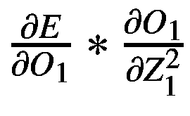。这个部分被称为*节点增量* δ。使用 δ，我们可以重写公式 (3-87)、公式 (3-88) 和公式 (3-89) 中的公式。

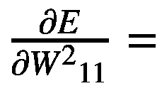`δ²[1]`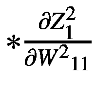 (3-90)

`δ²[1]` (3-91)

`δ²[1]` (3-92)

相应地，我们可以为隐藏层重写公式。

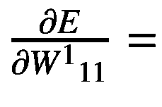`δ¹[1]`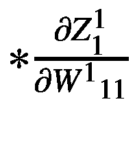 (3-93)

`δ¹[1]` (3-94)

`δ¹[2]` (3-95)

`δ¹[2]` (3-96)

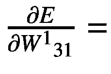`δ¹[3]`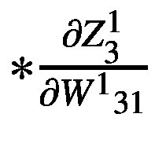 (3-97)

`δ¹[3]` (3-98)

通常，计算误差函数 `E` 关于其权重的偏导数可以通过将节点的增量乘以误差函数关于相应权重的偏导数来完成。这使我们免于计算一些冗余数据。这意味着我们可以计算每个网络节点的 δ 值，然后使用公式 (3-93) 到公式 (3-98) 中的公式。

### 网络计算的矩阵形式

对于同一个网络，我们可以使用矩阵来表达所有计算。例如，通过引入 `Z` 向量、`W` 矩阵和 `B` 向量，我们可以得到与使用标量时相同的计算结果。参见图 3-5。

**图 3-5** 网络计算的矩阵形式

使用矩阵还是标量计算取决于个人偏好。使用优秀的矩阵库可以提供快速的计算，但缺点是内存需求高，因为矩阵需要保存在内存中。

### 深入探讨

在处理神经网络时，我们会设定误差限值（具体指明训练后的网络结果应与目标数据匹配的接近程度）。训练过程通过逐步向误差函数最小值方向移动来迭代进行，从而减小误差。当计算出的网络结果与目标结果之间的差值小于预设的误差限值时，迭代过程停止。

网络是否可能无法达到设定的误差限值？不幸的是，答案是肯定的。我们来详细讨论一下。当然，逼近误差取决于所选的网络架构（隐藏层的数量以及每个隐藏层中神经元的数量）。不过，我们假设网络架构的设置是正确的。

逼近误差还取决于函数的拓扑结构。同样，我们假设该函数是单调且连续的。即便如此，网络仍可能无法达到误差限值。这是为什么呢？我们之前提到过，反向传播是一个寻找误差函数最小值的迭代过程。误差函数通常是多变量函数，但为简单起见，我们将其展示为二维空间图。（见图 3-6。）

**图 3-6** 误差函数的局部最小值和全局最小值

训练过程的目标是找到误差函数的最小值。误差函数取决于在迭代训练过程中被校准的权重/偏置参数。权重/偏置的初始值通常是随机设定的，训练过程会针对这个初始设定（点）计算网络误差。从该点开始，训练过程会向下移动到函数的最小值。

如图 3-6 所示，误差函数通常有多个最小值。其中最低的那个称为*全局最小值*，其余的都称为*局部最小值*。根据训练过程的起始点不同，它可能会找到靠近起始点的某个局部最小值。每个局部最小值都会成为训练过程的陷阱，因为一旦训练过程到达一个局部最小值，任何进一步的移动都不会显示梯度值的变化；迭代过程就会停滞在该局部最小值处。

考虑图 3-6 中的起始点 A 和 B。在起始点 A 的情况下，训练过程会找到局部最小值 A，它产生的误差比情况 B 大得多。这就是为什么多次运行相同的训练过程，每次都会产生不同的误差结果（因为每次运行，训练过程都从一个随机的初始点开始）。

**提示**  
我们如何获得最佳的逼近结果？在编写神经网络处理程序时，始终要安排在一个循环中启动训练过程的逻辑。每次调用训练方法后，训练方法内部的逻辑应检查误差是否小于误差限值，如果不是，则应以非零错误码退出训练方法。控制权将返回给在循环中调用训练方法的代码。如果返回码不为零，代码会再次调用训练方法。该逻辑会持续循环，直到计算出的误差小于误差限值。此时以零返回码退出，这样训练方法就不会再被调用。如果不这样做，训练逻辑只会遍历各个周期（epochs），而无法清除误差限值。此类编程代码的示例将在后续章节中展示。

为什么有时训练网络很困难？网络被认为是通用的函数逼近工具。然而，这个说法也有例外。网络只能很好地逼近连续函数。如果一个函数是非连续的（出现突然的剧烈上下跳跃），那么对此类函数的逼近结果会显示出低质量的结果。误差如此之大，以至于这种逼近实际上毫无用处。

这里展示的计算是针对单个函数点进行的。当我们需要在多个点上逼近一个包含两个或更多变量的函数时，计算量会呈指数级增长。这种资源密集型过程对计算机资源（内存和 CPU）提出了很高的要求。这就是为什么，正如本书引言中提到的，早期使用人工智能的尝试无法处理严肃的任务。直到后来，由于计算能力的急剧提升，人工智能才取得了巨大的成功。

### 小批量与随机梯度

当输入数据集非常大时（例如包含数百万条记录），计算量会变得极其庞大。处理此类网络需要很长时间，网络学习也会变得非常缓慢，因为需要为每条输入记录计算梯度。

为了加速这个过程，我们可以将一个非常大的输入数据集分成多个称为*小批量*的数据块，并独立处理每个小批量。处理单个小批量文件中的所有记录构成一个周期（epoch），即进行权重/偏置调整的时刻。

由于小批量文件的规模小得多，处理所有小批量文件会比将整个数据集作为一个文件处理更快。最后，我们不再为整个数据集的每条记录计算梯度，而是计算随机梯度，即针对每个小批量计算出的梯度的平均值。

如果小批量文件 *m* 中某个神经元的权重调整量为 *W*^(*m*)[*n*]，那么对于整个数据集，该神经元的权重调整量约等于所有小批量独立计算出的调整量的平均值。

*adjustedW*^(*k*)[*s*] ≈ *W*^(*k*)[*s*] *-*   其中 *m* 是小批量的数量。

对于大型输入数据集的神经网络处理，大多采用小批量方法。

### 总结

本章展示了神经网络内部的计算过程。它解释了为什么（即使对于单个点）计算量也相当大。本章引入了可以降低计算量的 δ 变量。“深入探讨”部分解释了如何调用训练方法以获得最佳逼近结果之一。本章还解释了小批量方法。下一章将展示如何配置 Windows 环境以使用 Java 和 Java 网络处理框架。

