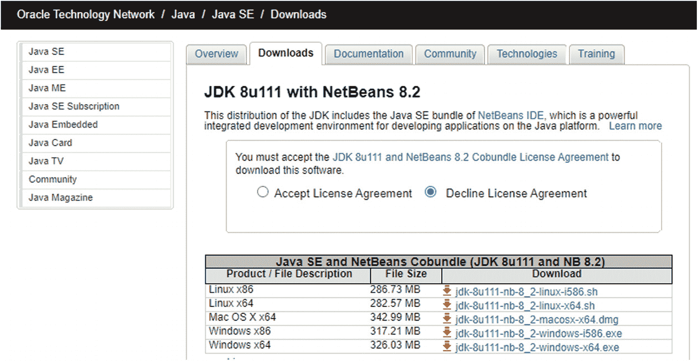
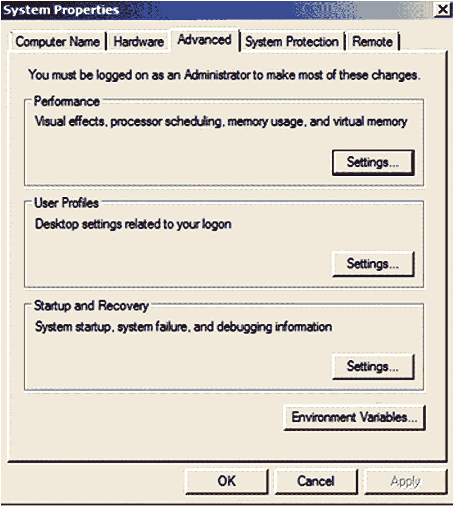
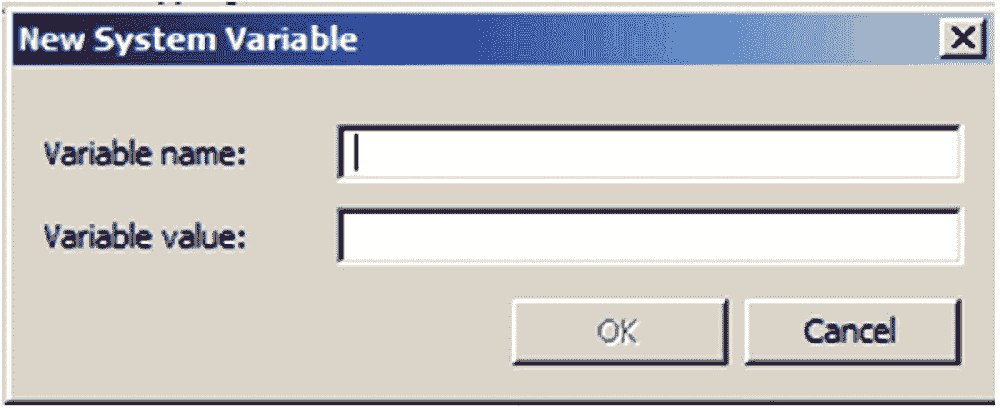
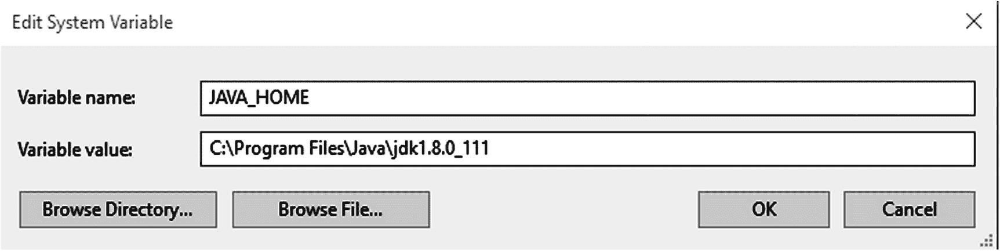
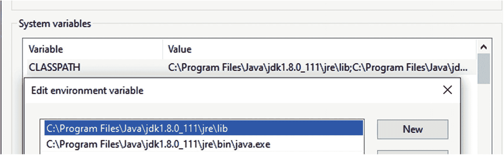
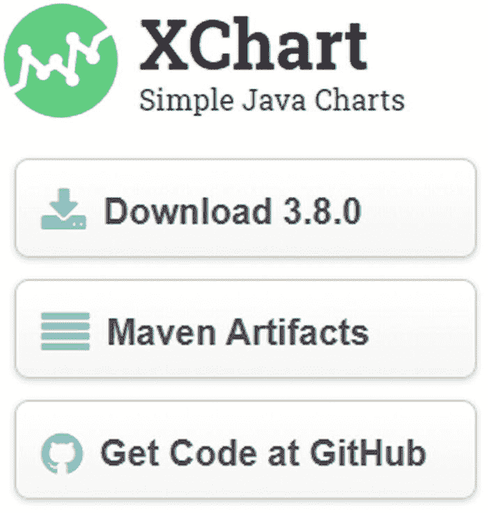
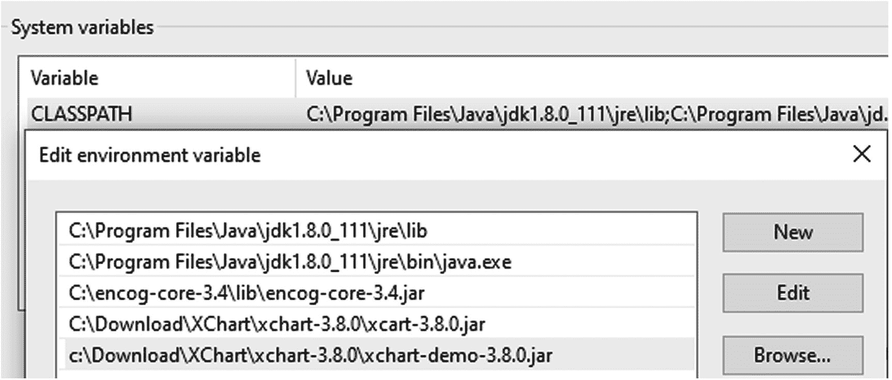

# 4. 配置你的开发环境

本书是关于使用 Java 进行神经网络处理的。在我们开始开发任何神经网络程序之前，需要学习几个 Java 工具。如果你是一名 Java 开发者，并且熟悉这里讨论的工具，可以跳过本章。只需确保你的 Windows 机器上已安装所有必要的工具即可。


### 在 Windows 机器上安装 Java 环境与 NetBeans

作为开发者，我们需要 Java JDK 和 NetBeans 作为开发工具。Oracle 提供的下载包可以在一次执行中同时安装这两个环境。

请访问以下网站：

[`https://www.oracle.com/technetwork/java/javase/downloads/jdk-netbeans-jsp-3413139-esa.html`](https://www.oracle.com/technetwork/java/javase/downloads/jdk-netbeans-jsp-3413139-esa.html)

屏幕上将显示如图 4-1 所示的界面。



图 4-1

Java 下载页面

首先接受许可协议，然后点击下载适用于 Windows x64 的以下文件：

```
jdk-8u111-nb-8-windows-x64.exe
```

右键点击该可执行文件并选择“运行”。按照安装说明进行操作。这将安装适用于 Windows 的 Java SE 开发工具包（`jdk1.8.0_111`）和 NetBeans 8-2 开发工具，两者均位于 `C:\Program Files` 目录下。它们将位于以下子目录中：

```
C:\Program Files\Java\jdk1.8.0_111
C:\Program Files\NetBeans 8.2
```

接下来，我们需要设置几个环境变量，以告知 Windows 10 Java 环境的安装位置。在 Windows 10 的搜索框中输入 `envir`，然后选择“编辑系统环境变量”。

将出现如图 4-2 所示的对话框。



图 4-2

系统属性对话框

点击“高级”选项卡上的“环境变量”按钮。然后点击“新建”以打开允许输入新环境变量的对话框（图 4-3）。



图 4-3

新建系统变量对话框

在“变量名”字段中输入 `JAVA_HOME`。在“变量值”字段中输入已安装 Java 环境的路径（图 4-4）。



图 4-4

设置 `JAVA_HOME` 环境变量

点击“确定”。接下来，选择 `CLASSPATH` 环境变量并点击“编辑”。

将 Java JDK 的 `lib` 目录路径添加到 `CLASSPATH` 变量值字段中，并添加 Java 的 `jar` 文件（见图 4-5）。



图 4-5

更新后的 `CLASSPATH` 系统变量

```
C:\Program Files\Java\jre1.8.0_111\lib;
C:\Program Files\Java\jdk1.8.0_111\jre\bin\java.exe
```

依次点击“确定”、“确定”、“确定”。重启系统。您的 Java 环境就设置好了。

#### 安装 Encog Java 框架

从之前手动处理神经网络的一些示例（第 3 章）中可以看出，即使是对单个点的函数进行简单近似，也涉及大量的计算。对于任何严肃的工作，您都需要使用现有的框架之一。

在编写本书时，已有多个框架可用。以下是最常用的框架列表及其适用的编程语言：

*   TensorFlow（Python、C++ 和 R）
*   Caffe（C、C++、Python 和 MATLAB）
*   Torch（C++、Python）
*   Keras（Python）
*   Deeplearning4j（Java）
*   Encog（Java）
*   Neurop（Java）

注意

用 Java 实现的框架比用 Python 实现的效率更高。

我们关注的是 Java 框架（原因显而易见：在一台机器上开发应用程序，并能在任何地方运行）。我们还关注一个快速且使用方便的 Java 框架。在研究了几个 Java 框架后，我们选择了 Encog 作为神经网络处理的最佳框架。这就是我们在本书中使用的框架。Encog 框架由 Heaton Research 开发，并且可以免费使用。所有 Encog 文档都可以在其网站上找到。

要安装 Encog，请访问 [`https://www.heatonresearch.com/encog`](https://www.heatonresearch.com/encog)。向下滚动到名为 Encog Java Links 的部分，然后点击 Encog Java Download/Release 链接。在下一个屏幕上，为 Encog 4.3 版本选择以下两个文件：

```
encog-core-3.4.jar
encog-java-examples.zip
```

解压第二个文件。将这些文件保存在您记得的目录中，并将以下文件添加到 `CLASSPATH` 环境变量中（也可参考 Java 安装部分）：

```
C:\encog-core-3.4\lib\encog-core-3.4.jar
```

#### 安装 XChart 包

在数据准备和神经网络开发/测试过程中，能够绘制许多结果图表非常有用。本书将使用 XChart Java 图表库。要下载 XChart，请访问以下网站：

```
https://knowm.org/open-source/xchart/
```

将出现如图 4-6 所示的界面。点击“Download 3.8.0”按钮。



图 4-6

XChart 主页

解压下载的 zip 文件，然后双击可执行安装文件。按照安装说明进行操作，XChart 包将安装在您的机器上。将以下两个文件：

```
xchart-3.8.0.jar
xchart-demo-3.8.0.jar
```

添加到 `CLASSPATH` 环境变量中（参见之前为 Java 8 设置的方式），如图 4-7 所示。



图 4-7

`CLASSPATH` 环境变量

```
C:\Download\XChart\xchart-3.8.0\xcart-3.8.0.jar
C:\Download\XChart\xchart-3.8.0\xchart-demo-3.8.0.jar
```

通过将 JDK 二进制目录添加到 `PATH` 环境变量来更新它。

```
C:\Program Files\Java\jdk1.8.0_111\bin
```

最后，重启系统。我们已准备好进行神经网络开发。

### 总结

我们向您介绍了 Java 环境，并解释了如何下载和安装使用 Java 构建、调试、测试和执行神经网络应用程序所需的一组工具。本书其余部分的所有开发示例均使用此环境完成。下一章将向您展示如何使用 Java Encog 框架实际开发神经网络程序。

