# 5. 使用 Java Encog 框架进行神经网络开发

为了学习如何使用 Java 进行网络程序开发，我们将使用第 3 章“示例：单点函数的手动近似”部分中最初展示的函数，来开发我们的第一个简单程序。


### 示例：使用 Java 环境进行函数逼近

图 5-1 展示了该函数，我们已知其在九个点上的值。

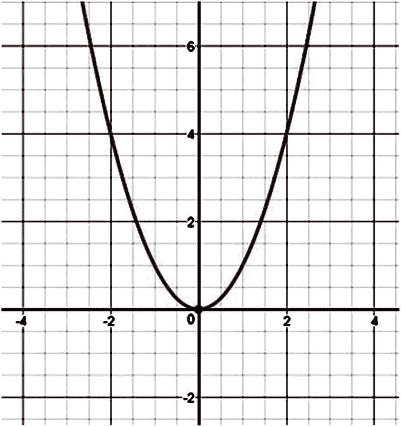

图 5-1

待逼近的函数

如前所述，我们将使用 Encog 软件进行神经网络处理。Encog 要求其处理的所有文件均为 CSV 格式。这实际上是一种简化的 Excel 文件格式，每条记录包含逗号分隔的值。CSV 文件的扩展名为 `.csv`。另外，请记住 Encog 要求处理文件中的第一条记录为标签记录。相应地，表 5-1 展示了本例中带有给定函数值的输入（训练）数据集。

表 5-1

训练数据集

| xPoint | 函数值 |
| --- | --- |
| 0.15 | 0.0225 |
| 0.25 | 0.0625 |
| 0.5 | 0.25 |
| 0.75 | 0.5625 |
| 1 | 1 |
| 1.25 | 1.5625 |
| 1.5 | 2.25 |
| 1.75 | 3.0625 |
| 2 | 4 |

接下来，表 5-2 展示了我们将用于测试已训练网络的数据集。该数据集中的 `xPoint` 值与训练数据集中的 `xPoint` 值不同，因为（如你所知）用于测试的文件应包含不同的输入数据（未在训练文件中使用）。

表 5-2

测试数据集

| xPoint | 函数值 |
| --- | --- |
| 0.2 | 0.04 |
| 0.3 | 0.09 |
| 0.4 | 0.16 |
| 0.7 | 0.49 |
| 0.95 | 0.9025 |
| 1.3 | 1.69 |
| 1.6 | 2.56 |
| 1.8 | 3.24 |
| 1.95 | 3.8025 |

### 网络架构

图 5-2 展示了本例的网络架构。该网络设置为：输入层包含一个神经元，七个隐藏层（每层五个神经元），输出层包含一个神经元。

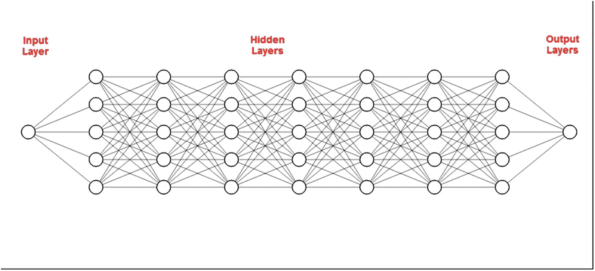

图 5-2

网络架构

### 归一化输入数据集

训练数据集和测试数据集都需要在区间 [-1, 1] 上进行归一化。让我们构建一个 Java 程序来归一化这些数据集。要归一化一个文件，需要知道待归一化字段的最大值和最小值。训练数据集的第一列最小值为 0.15，最大值为 2.00。训练数据集的第二列最小值为 0.0225，最大值为 4.00。

测试数据集的第一列最小值为 0.20，最大值为 1.95。测试数据集的第二列最小值为 0.04，最大值为 3.8025。因此，为简单起见，我们为训练数据集和测试数据集选择的最小值和最大值分别为 `min = 0.00` 和 `max = 5.00`。

用于在区间 [-1, 1] 上归一化值的公式如下：

`f(x) = ( (x – D[L])*(N[H] – N[L]))/(D[H] – D[L]) + N[L]`

其中，

- `x` = 输入数据点。
- `D[L]` = 输入数据集中 `x` 的最小（最低）值。
- `D[H]` = 输入数据集中 `x` 的最大（最高）值。
- `N[L]` = 归一化区间 [-1, 1] 的左端点 = -1。
- `N[H]` = 归一化区间 [-1, 1] 的右端点 = 1。

### 构建归一化两个数据集的 Java 程序

单击桌面上的 NetBeans 图标以打开 NetBeans IDE。IDE 屏幕分为几个窗口。导航窗口是您查看项目的地方（图 5-3）。单击项目前面的 `+` 图标可显示项目的组件，例如源包、测试包和库。

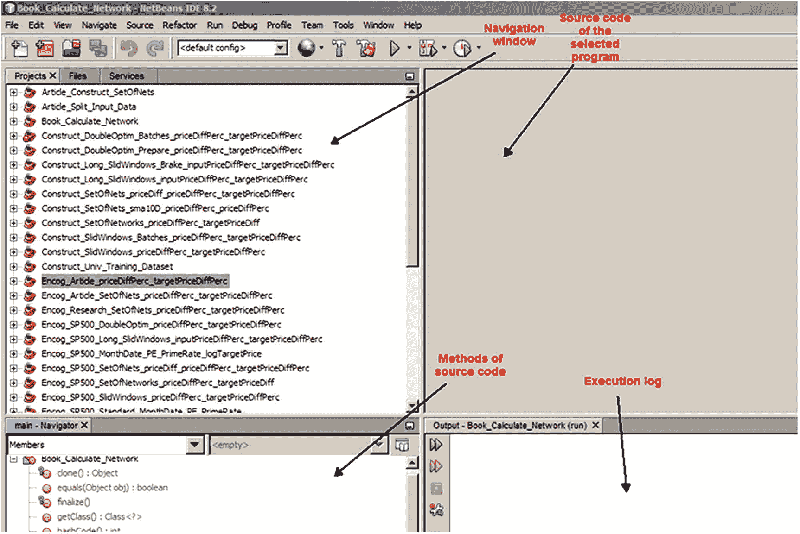

图 5-3

NetBeans IDE

要创建新项目，请选择 **文件** ➤ **新建项目**。将出现如图 5-4 所示的窗口。

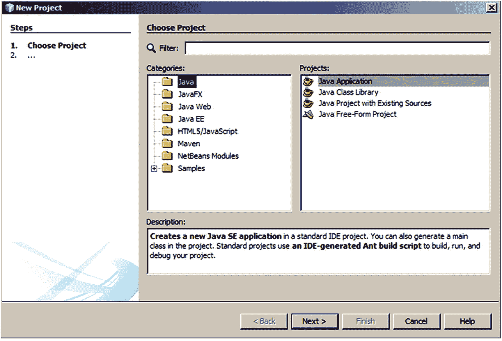

图 5-4

新建项目对话框

单击 **下一步**。将出现如图 5-5 所示的对话框。

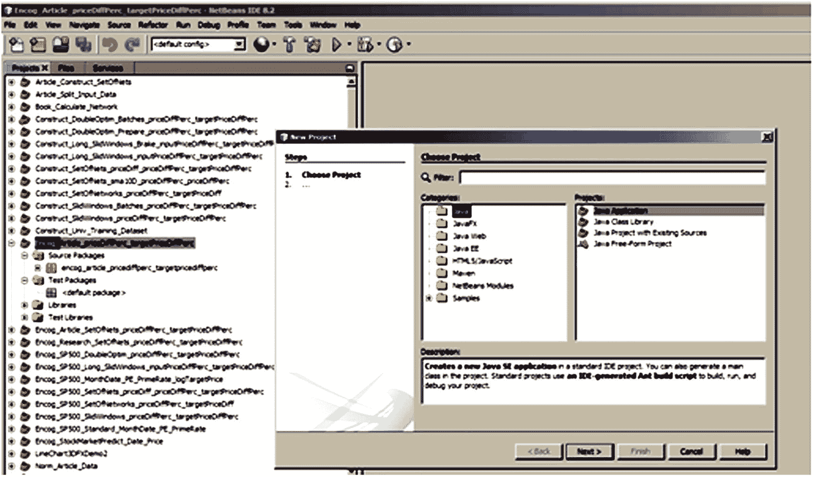

图 5-5

命名新项目

输入项目名称 `Sample1_Norm`，然后单击 **完成** 按钮。图 5-6 显示了出现的下一个对话框。

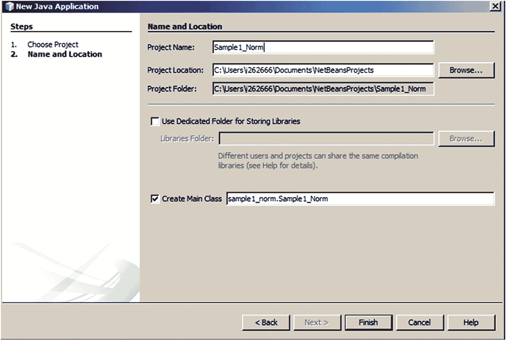

图 5-6

`Sample1_Norm` 项目

创建的项目显示在导航窗口中（图 5-7）。

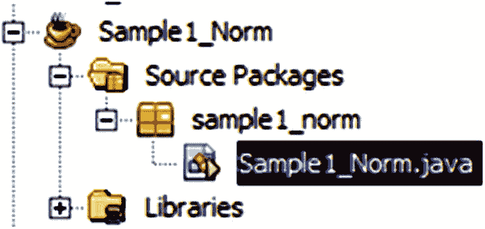

图 5-7

已创建的项目

现在，源代码显示在源代码窗口中，如图 5-8 所示。

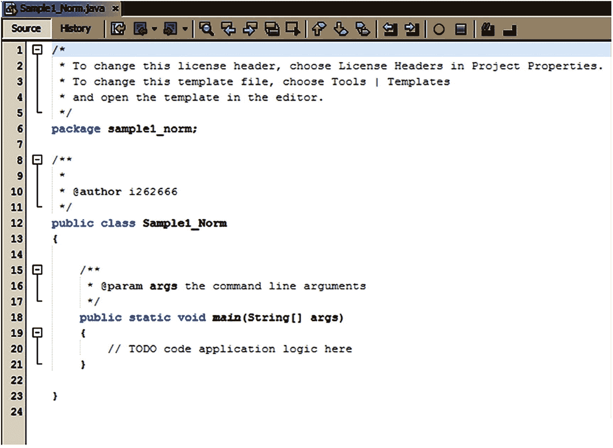

图 5-8

新项目的源代码

如您所见，NetBeans 已生成程序框架。接下来，将归一化逻辑添加到程序中。清单 5-1 展示了归一化程序的源代码。


```java
// ========================================================================
// 对输入 CSV 数据集的所有列进行归一化，并将结果输出到 CSV 文件中。
// 输入数据集的第一列包含 xPoint 值，第二列包含函数在点 X 处的值。
// ========================================================================
package sample2_norm;
import java.io.BufferedReader;
import java.io.BufferedWriter;
import java.io.PrintWriter;
import java.io.FileNotFoundException;
import java.io.FileReader;
import java.io.FileWriter;
import java.io.IOException;
import java.nio.file.*;
public class Sample2_Norm
{
// 归一化区间
static double Nh =  1;
static double Nl = -1;
// 第一列
static double minXPointDl = 0.00;
static double maxXPointDh = 5.00;
// 第二列 - 目标数据
static double minTargetValueDl = 0.00;
static double maxTargetValueDh = 5.00;
public static double normalize(double value, double Dh, double Dl)
{
double normalizedValue = (value - Dl)*(Nh - Nl)/(Dh - Dl) + Nl;
return normalizedValue;
}
public static void main(String[] args)
{
// 配置数据（注释或取消注释训练或测试配置数据）
// 训练配置
String inputFileName = "C:/My_Neural_Network_Book/Book_Examples/Sample2_Train_Real.csv";
String outputNormFileName =
"C:/My_Neural_Network_Book/Book_Examples/Sample2_Train_Norm.csv";
//测试配置
// String inputFileName = "C:/My_Neural_Network_Book/Book_Examples/Sample2_Test_Real.csv";
// String outputNormFileName =
"C:/My_Neural_Network_Book/Book_Examples/Sample2_Test_Norm.csv";
BufferedReader br = null;
PrintWriter out = null;
String line = "";
String cvsSplitBy = ",";
String strNormInputXPointValue;
String strNormTargetXPointValue;
String fullLine;
double inputXPointValue;
double targetXPointValue;
double normInputXPointValue;
double normTargetXPointValue;
int i = -1;
try
{
Files.deleteIfExists(Paths.get(outputNormFileName));
br = new BufferedReader(new FileReader(inputFileName));
out = new
PrintWriter(new BufferedWriter(new FileWriter(outputNormFileName)));
while ((line = br.readLine()) != null)
{
i++;
if(i == 0)
{
// 写入标签行
out.println(line);
}
else
{
// 使用逗号作为分隔符拆分行
String[] workFields = line.split(cvsSplitBy);
inputXPointValue = Double.parseDouble(workFields[0]);
targetXPointValue = Double.parseDouble( workFields[1]);
// 归一化这些字段
normInputXPointValue =
normalize(inputXPointValue, maxXPointDh, minXPointDl);
normTargetXPointValue =
normalize(targetXPointValue, maxTargetValueDh, minTargetValueDl);
// 将归一化后的字段转换为字符串，以便插入到输出 CSV 文件中
strNormInputXPointValue = Double.toString(normInputXPointValue);
strNormTargetXPointValue = Double.toString(normTargetXPointValue);
// 将这些字段拼接成一个字符串行，使用逗号分隔符
fullLine  =
strNormInputXPointValue + "," + strNormTargetXPointValue;
// 将 fullLine 写入输出文件
out.println(fullLine);
} // IF Else 结束
}    // WHILE 结束
}  // TRY 结束
catch (FileNotFoundException e)
{
e.printStackTrace();
System.exit(1);
}
catch (IOException io)
{
io.printStackTrace();
System.exit(2);
}
finally
{
if (br != null)
{
try
{
br.close();
out.close();
}
catch (IOException e1)
{
e1.printStackTrace();
System.exit(3);
}
}
}
}
} // 类结束
```

**清单 5-1** 对训练和测试数据集进行归一化的程序代码

这是一个简单的程序，无需过多解释。我们通过注释和取消注释相应的配置语句，将配置设置为对训练文件或测试文件进行归一化。我们在循环中读取文件行。我们将每一行拆分为两个字段并进行归一化。接着，我们将这两个字段转换回字符串，将它们组合成一行，并将该行写入输出文件。

表 5-3 显示了归一化后的训练数据集。

**表 5-3** 归一化后的训练数据集

| xPoint | 实际值 |
| --- | --- |
| -0.94 | -0.991 |
| -0.9 | -0.975 |
| -0.8 | -0.9 |
| -0.7 | -0.775 |
| -0.6 | -0.6 |
| -0.5 | -0.375 |
| -0.4 | -0.1 |
| -0.3 | 0.225 |
| -0.2 | 0.6 |

表 5-4 显示了归一化后的测试数据集。

**表 5-4** 归一化后的测试数据集

| xPoint | 实际值 |
| --- | --- |
| -0.92 | -0.984 |
| -0.88 | -0.964 |
| -0.84 | -0.936 |
| -0.72 | -0.804 |
| -0.62 | -0.639 |
| -0.48 | -0.324 |
| -0.36 | 0.024 |
| -0.28 | 0.296 |
| -0.22 | 0.521 |

我们将使用这些数据集作为网络训练和测试的输入。


### 构建神经网络处理程序

要创建新项目，请选择“文件”➤“新建项目”。此时将显示如图 5-9 所示的对话框。

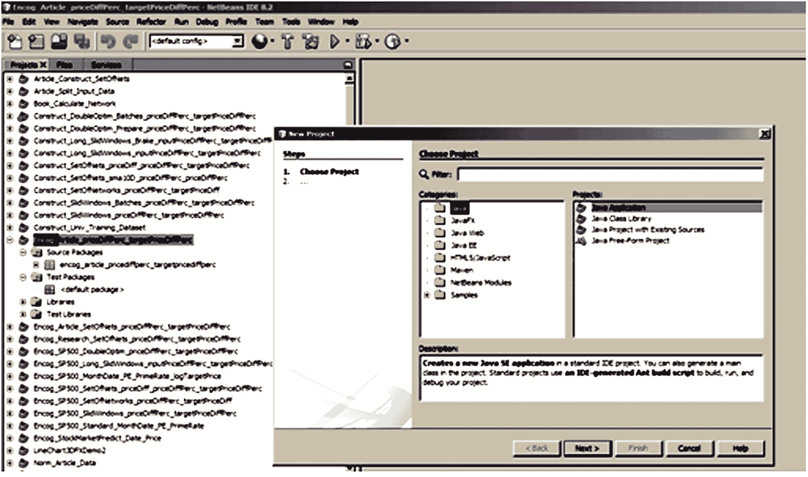

图 5-9

NetBeans IDE

点击“下一步”。在下一个对话框（如图 5-10 所示）中，输入项目名称，然后点击“完成”按钮。

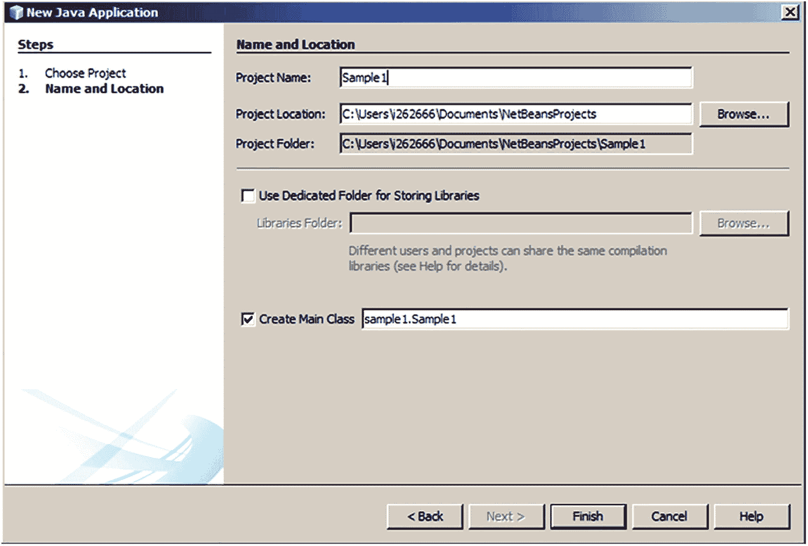

图 5-10

新建 NetBeans 项目

项目创建完成后，您应该在导航窗口中看到它（图 5-11）。

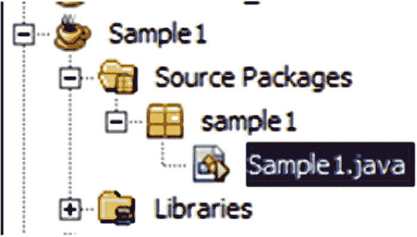

图 5-11

项目 Sample1

程序的源代码会显示在源代码窗口中（图 5-12）。

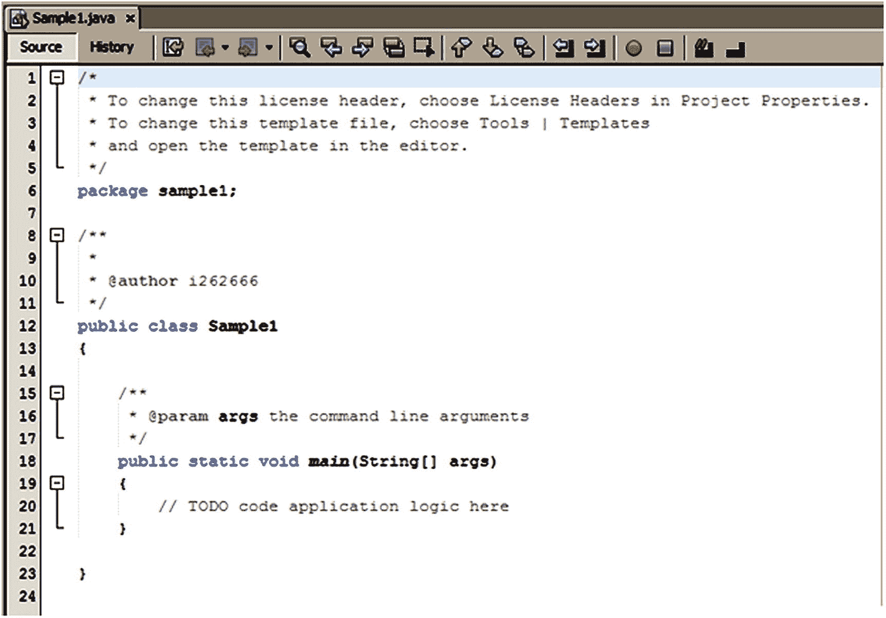

图 5-12

程序 `Sample1.java` 的源代码

同样，这仅仅是 Java 程序自动生成的骨架。现在让我们在此添加必要的逻辑。首先，包含所有必要的导入文件。这里有三组导入语句（Java 导入、Encog 导入和 XChart 导入），其中两组（属于 Encog 的那组和属于 XChart 的那组）被标记为错误，因为 NetBeans 无法找到它们（图 5-13）。

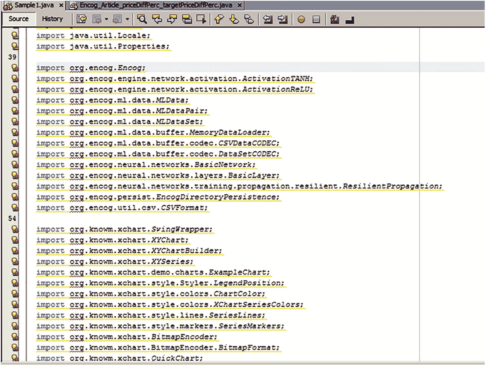

图 5-13

被标记为错误的导入语句

以下是修复方法。右键点击项目并选择“属性”。此时将出现“项目属性”对话框（图 5-14）。

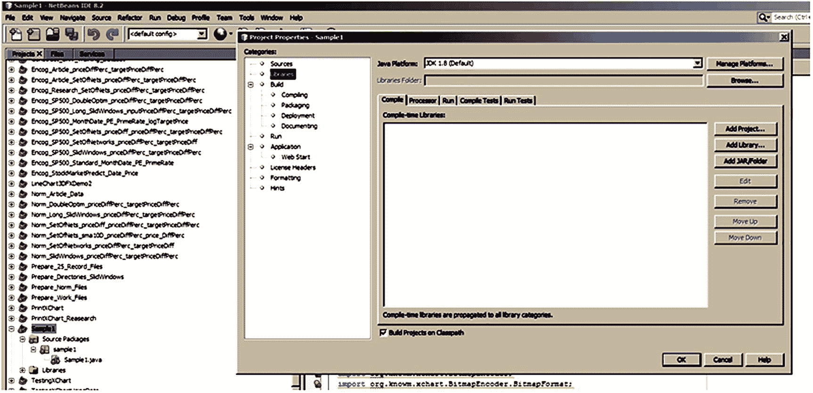

图 5-14

“项目属性”对话框

在“项目属性”对话框的左侧列中，选择“库”。点击属性对话框右侧的“添加 JAR/文件夹”按钮。点击“Java 平台”字段（位于屏幕顶部）的下拉箭头，然后导航到 Encog 包的安装位置（图 5-15）。

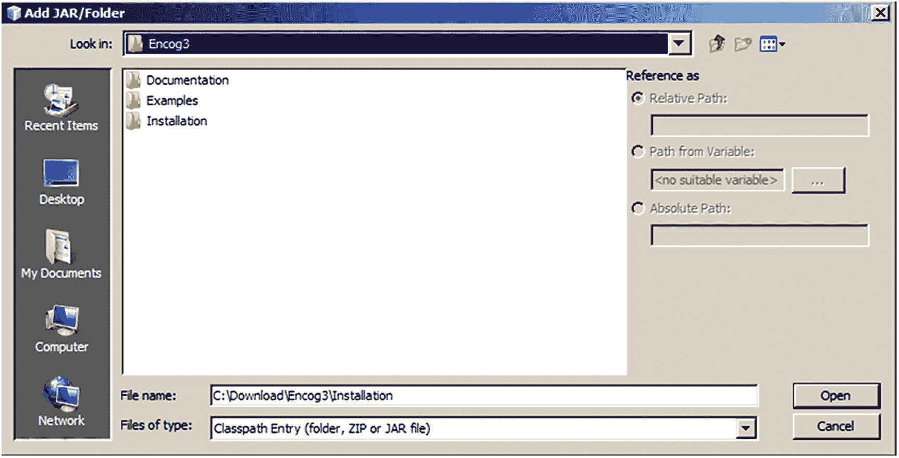

图 5-15

Encog 的安装位置

双击“安装”文件夹，将显示两个 JAR 文件（图 5-16）。

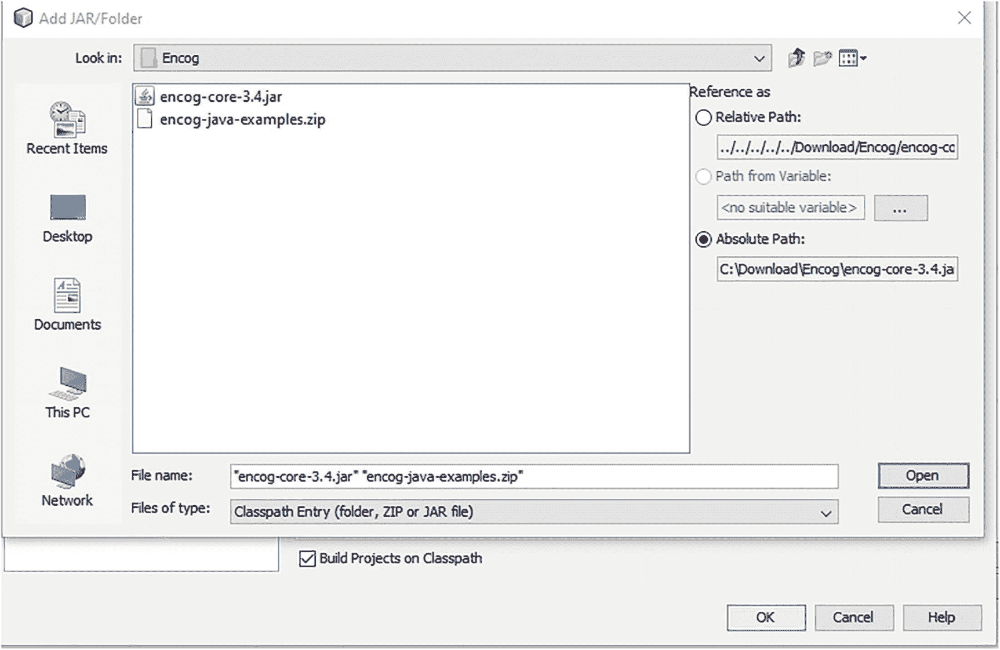

图 5-16

Encog JAR 文件位置

选中这两个 JAR 文件，然后点击“打开”按钮。它们将被包含在要添加到 NetBeans 的 JAR 文件列表中（图 5-17）。

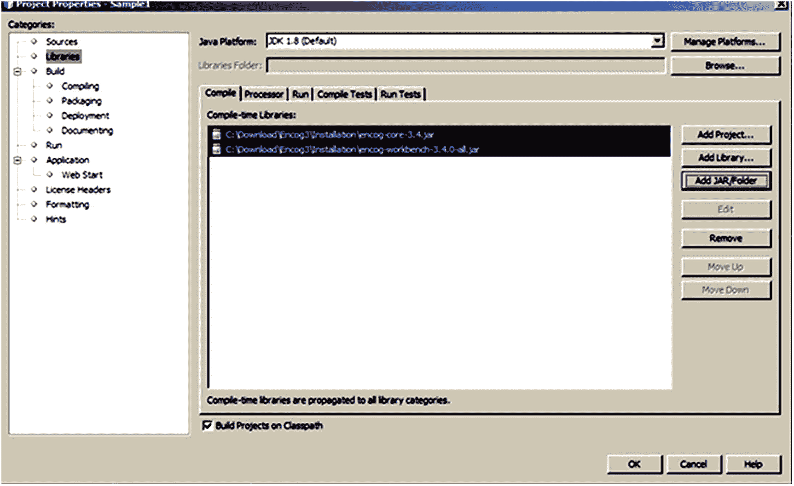

图 5-17

要包含在 NetBeans IDE 中的 Encog JAR 文件列表

再次点击“添加 JAR/文件夹”按钮。再次点击“Java 属性”字段的下拉箭头，导航到 XChart 包的安装位置（图 5-18）。

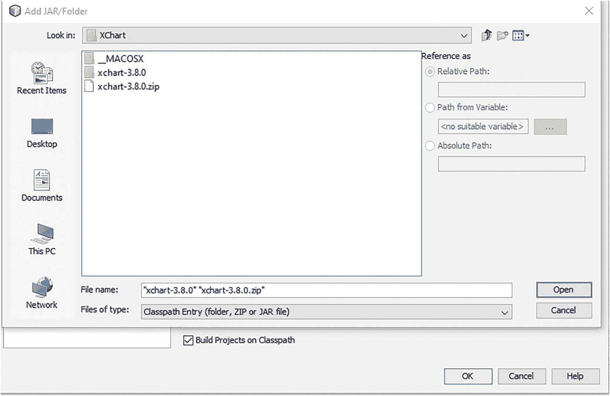

图 5-18

XChart 位置

双击 `XChart-3.5.0` 文件夹，然后选择两个 XChart JAR 文件（图 5-19）。

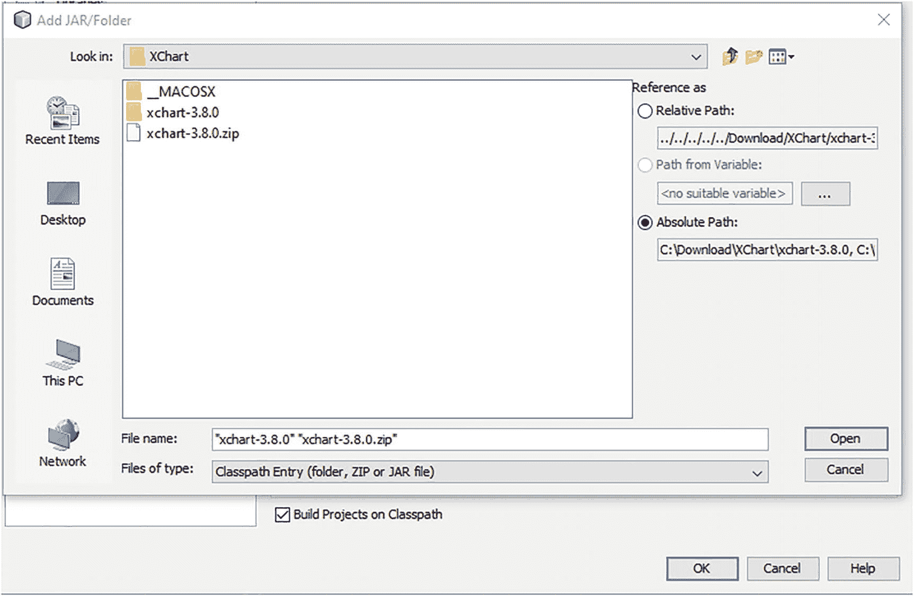

图 5-19

XChart 文件

点击“打开”按钮。现在我们有了要包含在 NetBeans IDE 中的四个 JAR 文件（来自 Encog 和 XChart）的列表（图 5-20）。

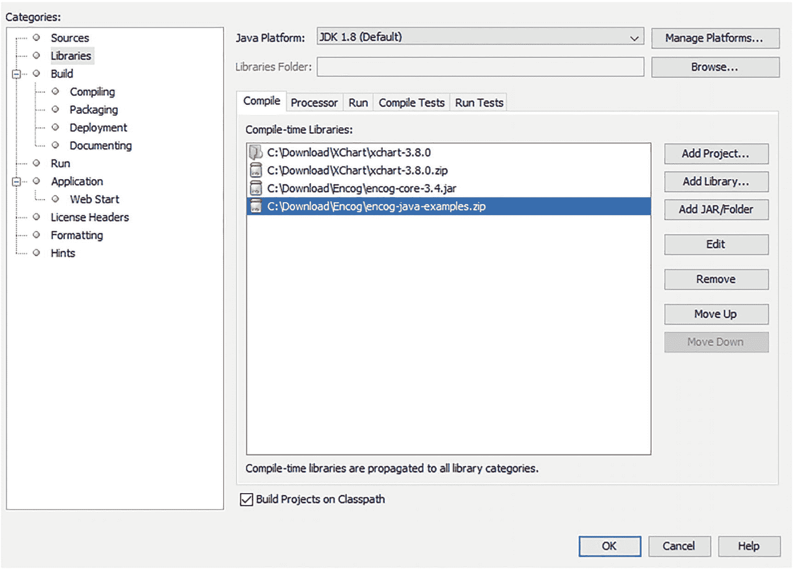

图 5-20

要包含在 NetBeans IDE 中的 JAR 文件列表

最后，点击“确定”，源文件中的所有错误都将消失。

与其为每个新项目都执行此操作，更好的方法是设置一个新的全局库。从主菜单栏中，选择“工具”➤“库”。将出现如图 5-21 所示的屏幕。

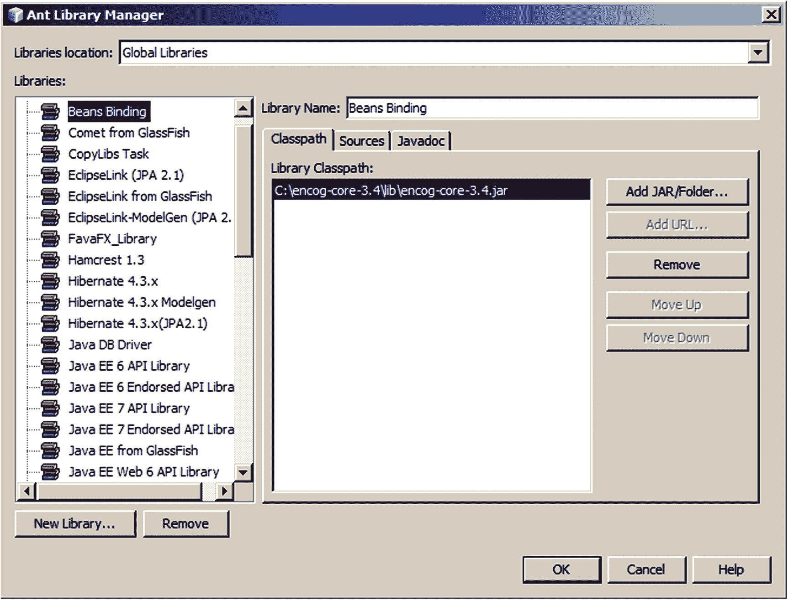

图 5-21

创建全局库

现在，重复之前在项目级别演示的相同步骤。通过两次点击“添加 JAR/文件夹”按钮（分别针对 Encog 和 XChart），并添加 Encog 和 XChart 包对应的 JAR 文件。

### 程序代码

在此，我们将讨论使用 Encog 的程序代码中所有重要的片段。请记住，您可以在 Encog 网站上找到所有 Encog API 的文档以及许多编程示例。


```java
// ===========================================================
// 近似计算在 9 个点处给出值的单变量函数。
// 输入的训练/测试文件已归一化。
// ===========================================================
package sample2;
import java.io.BufferedReader;
import java.io.File;
import java.io.FileInputStream;
import java.io.PrintWriter;
import java.io.FileNotFoundException;
import java.io.FileReader;
import java.io.FileWriter;
import java.io.IOException;
import java.io.InputStream;
import java.nio.file.*;
import java.util.Properties;
import java.time.YearMonth;
import java.awt.Color;
import java.awt.Font;
import java.io.BufferedReader;
import java.text.DateFormat;
import java.text.ParseException;
import java.text.SimpleDateFormat;
import java.time.LocalDate;
import java.time.Month;
import java.time.ZoneId;
import java.util.ArrayList;
import java.util.Calendar;
import java.util.Date;
import java.util.List;
import java.util.Locale;
import java.util.Properties;
import org.encog.Encog;
import org.encog.engine.network.activation.ActivationTANH;
import org.encog.engine.network.activation.ActivationReLU;
import org.encog.ml.data.MLData;
import org.encog.ml.data.MLDataPair;
import org.encog.ml.data.MLDataSet;
import org.encog.ml.data.buffer.MemoryDataLoader;
import org.encog.ml.data.buffer.codec.CSVDataCODEC;
import org.encog.ml.data.buffer.codec.DataSetCODEC;
import org.encog.neural.networks.BasicNetwork;
import org.encog.neural.networks.layers.BasicLayer;
import org.encog.neural.networks.training.propagation.resilient.ResilientPropagation;
import org.encog.persist.EncogDirectoryPersistence;
import org.encog.util.csv.CSVFormat;
import org.knowm.xchart.SwingWrapper;
import org.knowm.xchart.XYChart;
import org.knowm.xchart.XYChartBuilder;
import org.knowm.xchart.XYSeries;
import org.knowm.xchart.demo.charts.ExampleChart;
import org.knowm.xchart.style.Styler.LegendPosition;
import org.knowm.xchart.style.colors.ChartColor;
import org.knowm.xchart.style.colors.XChartSeriesColors;
import org.knowm.xchart.style.lines.SeriesLines;
import org.knowm.xchart.style.markers.SeriesMarkers;
import org.knowm.xchart.BitmapEncoder;
import org.knowm.xchart.BitmapEncoder.BitmapFormat;
import org.knowm.xchart.QuickChart;
import org.knowm.xchart.SwingWrapper;
public class Sample2 implements ExampleChart
{
// 归一化区间
static double Nh =  1;
static double Nl = -1;
// 第一列
static double minXPointDl = 0.00;
static double maxXPointDh = 5.00;
// 第二列 - 目标数据
static double minTargetValueDl = 0.00;
static double maxTargetValueDh = 5.00;
static double doublePointNumber = 0.00;
static int intPointNumber = 0;
static InputStream input = null;
static int intNumberOfRecordsInTrainFile;
static double[] arrPrices = new double[2500];
static double normInputXPointValue = 0.00;
static double normPredictXPointValue = 0.00;
static double normTargetXPointValue = 0.00;
static double normDifferencePerc = 0.00;
static double denormInputXPointValue = 0.00;
static double denormPredictXPointValue = 0.00;
static double denormTargetXPointValue = 0.00;
static double valueDifference = 0.00;
static int returnCode  = 0;
static int numberOfInputNeurons;
static int numberOfOutputNeurons;
static int intNumberOfRecordsInTestFile;
static String trainFileName;
static String priceFileName;
static String testFileName;
static String chartTrainFileName;
static String chartTestFileName;
static String networkFileName;
static int workingMode;
static String cvsSplitBy = ",";
static List xData = new ArrayList();
static List yData1 = new ArrayList();
static List yData2 = new ArrayList();
static XYChart Chart;
@Override
public XYChart getChart()
{
// 创建图表
Chart = new  XYChartBuilder().width(900).height(500).title(getClass().
getSimpleName()).xAxisTitle("x").yAxisTitle("y= f(x)").build();
// 自定义图表
Chart.getStyler().setPlotBackgroundColor(ChartColor.getAWTColor(ChartColor.GREY));
Chart.getStyler().setPlotGridLinesColor(new Color(255, 255, 255));
Chart.getStyler().setChartBackgroundColor(Color.WHITE);
Chart.getStyler().setLegendBackgroundColor(Color.PINK);
Chart.getStyler().setChartFontColor(Color.MAGENTA);
Chart.getStyler().setChartTitleBoxBackgroundColor(new Color(0, 222, 0));
Chart.getStyler().setChartTitleBoxVisible(true);
Chart.getStyler().setChartTitleBoxBorderColor(Color.BLACK);
Chart.getStyler().setPlotGridLinesVisible(true);
Chart.getStyler().setAxisTickPadding(20);
Chart.getStyler().setAxisTickMarkLength(15);
Chart.getStyler().setPlotMargin(20);
Chart.getStyler().setChartTitleVisible(false);
Chart.getStyler().setChartTitleFont(new Font(Font.MONOSPACED, Font.BOLD, 24));
Chart.getStyler().setLegendFont(new Font(Font.SERIF, Font.PLAIN, 18));
Chart.getStyler().setLegendPosition(LegendPosition.InsideSE);
Chart.getStyler().setLegendSeriesLineLength(12);
Chart.getStyler().setAxisTitleFont(new Font(Font.SANS_SERIF, Font.ITALIC, 18));
Chart.getStyler().setAxisTickLabelsFont(new Font(Font.SERIF, Font.PLAIN, 11));
Chart.getStyler().setDatePattern("yyyy-MM");
Chart.getStyler().setDecimalPattern("#0.00");
//Chart.getStyler().setLocale(Locale.GERMAN);
try
{
// 配置（注释和取消注释相应的配置）
// 训练网络的配置
workingMode = 1;
intNumberOfRecordsInTrainFile = 10;
trainFileName = "C:/My_Neural_Network_Book/Book_Examples/Sample2_Train_Norm.csv";
chartTrainFileName = "Sample2_XYLine_Train_Results_Chart";
// 测试已训练网络的配置
// workingMode = 2;
// intNumberOfRecordsInTestFile = 10;
// testFileName = "C:/My_Neural_Network_Book/Book_Examples/Sample2_Test_Norm.csv";
//  chartTestFileName = "XYLine_Test_Results_Chart";
// 通用配置数据
networkFileName = "C:/Book_Examples/Sample2_Saved_Network_File.csv";
numberOfInputNeurons = 1;
numberOfOutputNeurons = 1;
// 检查要运行的工作模式
// 训练模式。
if(workingMode == 1)
{
File file1 = new File(chartTrainFileName);
File file2 = new File(networkFileName);
if(file1.exists())
file1.delete();
if(file2.exists())
file2.delete();
returnCode = 0;    // 清除返回码变量
do
{
returnCode = trainValidateSaveNetwork();
} while (returnCode > 0);
}
// 测试模式。
if(workingMode == 2)
{
// 使用测试数据集作为输入进行测试
loadAndTestNetwork();
}
}
catch (NumberFormatException e)
{
System.err.println("解析 workingMode 时出现问题。workingMode = " + workingMode);
System.exit(1);
}
catch (Throwable t)
{
t.printStackTrace();
System.exit(1);
}
finally
{
Encog.getInstance().shutdown();
}
Encog.getInstance().shutdown();
return Chart;
}  // 方法结束
//--------------------------------------------------------------
// 将 CSV 加载到内存中。
// @return 加载的数据集。
// -------------------------------------------------------------
public static MLDataSet loadCSV2Memory(String filename, int input, int ideal, boolean headers,
CSVFormat
format, boolean significance)
{
DataSetCODEC codec = new CSVDataCODEC(new File(filename), format, headers, input, ideal,
significance);
MemoryDataLoader load = new MemoryDataLoader(codec);
MLDataSet dataset = load.external2Memory();
return dataset;
}
// =======================================================
//  主方法。
//  @param 命令行参数。不使用任何参数。
// ======================================================
public static void main(String[] args)
{
ExampleChart exampleChart = new Sample2();
XYChart Chart = exampleChart.getChart();
new SwingWrapper(Chart).displayChart();
} // 主方法结束
//====================================================
// 训练方法。训练、验证并保存训练好的网络文件
//====================================================
static public int trainValidateSaveNetwork()
{
// 将训练 CSV 文件加载到内存中
MLDataSet trainingSet =
loadCSV2Memory(trainFileName,numberOfInputNeurons,numberOfOutputNeurons,
true,CSVFormat.ENGLISH,false);
// 创建一个神经网络
BasicNetwork network = new BasicNetwork();
// 输入层
network.addLayer(new BasicLayer(null,true,1));
// 隐藏层
network.addLayer(new BasicLayer(new ActivationTANH(),true,5));
network.addLayer(new BasicLayer(new ActivationTANH(),true,5));
network.addLayer(new BasicLayer(new ActivationTANH(),true,5));
network.addLayer(new BasicLayer(new ActivationTANH(),true,5));
network.addLayer(new BasicLayer(new ActivationTANH(),true,5));
network.addLayer(new BasicLayer(new ActivationTANH(),true,5));
network.addLayer(new BasicLayer(new ActivationTANH(),true,5));
// 输出层
//network.addLayer(new BasicLayer(new ActivationLOG(),false,1));
network.addLayer(new BasicLayer(new ActivationTANH(),false,1));
//network.addLayer(new BasicLayer(new ActivationReLU(),false,1));
//network.addLayer(new BasicLayer(new ActivationSigmoid(),false,1));
network.getStructure().finalizeStructure();
network.reset();
// 训练神经网络
final ResilientPropagation train = new ResilientPropagation(network, trainingSet);
int epoch = 1;
returnCode = 0;
do
{
train.iteration();
System.out.println("Epoch #" + epoch + " Error:" + train.getError());
epoch++;
if (epoch >= 500 && network.calculateError(trainingSet) > 0.000000031)    // 0.000000091
{
returnCode = 1;
System.out.println("Try again");
return returnCode;
}
} while (network.calculateError(trainingSet) > 0.00000003);   // 0.00000009
// 保存网络文件
EncogDirectoryPersistence.saveObject(new File(networkFileName),network);
System.out.println("Neural Network Results:");
double sumNormDifferencePerc = 0.00;
double averNormDifferencePerc = 0.00;
double maxNormDifferencePerc = 0.00;
int m = -1;
double xPointer = -1.00;
for(MLDataPair pair: trainingSet)
{
m++;
xPointer = xPointer + 2.00;
//if(m == 0)
// continue;
final MLData output = network.compute(pair.getInput());
MLData inputData = pair.getInput();
MLData actualData = pair.getIdeal();
MLData predictData = network.compute(inputData);
// 计算并打印结果
normInputXPointValue = inputData.getData(0);
normTargetXPointValue = actualData.getData(0);
normPredictXPointValue = predictData.getData(0);
denormInputXPointValue = ((minXPointDl -
maxXPointDh)*normInputXPointValue - Nh*minXPointDl +
maxXPointDh *Nl)/(Nl - Nh);
denormTargetXPointValue = ((minTargetValueDl - maxTargetValueDh)*
normTargetXPointValue - Nh*minTargetValueDl +
maxTargetValueDh*Nl)/(Nl - Nh);
denormPredictXPointValue =((minTargetValueDl - maxTargetValueDh)*
normPredictXPointValue - Nh*minTargetValueDl +
maxTargetValueDh*Nl)/(Nl - Nh);
valueDifference = Math.abs(((denormTargetXPointValue -
denormPredictXPointValue)/denormTargetXPointValue)*100.00);
System.out.println ("xPoint = " + denormTargetXPointValue +
"  denormPredictXPointValue = " + denormPredictXPointValue +
"  valueDifference = " + valueDifference);
sumNormDifferencePerc = sumNormDifferencePerc + valueDifference;
if (valueDifference > maxNormDifferencePerc)
maxNormDifferencePerc = valueDifference;
xData.add(denormInputXPointValue);
yData1.add(denormTargetXPointValue);
yData2.add(denormPredictXPointValue);
}   // 结束 for pair 循环
XYSeries series1 = Chart.addSeries("Actual data", xData, yData1);
XYSeries series2 = Chart.addSeries("Predict data", xData, yData2);
series1.setLineColor(XChartSeriesColors.BLUE);
series2.setMarkerColor(Color.ORANGE);
series1.setLineStyle(SeriesLines.SOLID);
series2.setLineStyle(SeriesLines.SOLID);
try
{
//保存图表图像
BitmapEncoder.saveBitmapWithDPI(Chart, chartTrainFileName, BitmapFormat.JPG, 100);
System.out.println ("Train Chart file has been saved") ;
}
catch (IOException ex)
{
ex.printStackTrace();
System.exit(3);
}
// 最后，保存这个训练好的网络
EncogDirectoryPersistence.saveObject(new File(networkFileName),network);
System.out.println ("Train Network has been saved") ;
averNormDifferencePerc  = sumNormDifferencePerc/intNumberOfRecordsInTrainFile;
System.out.println(" ");
System.out.println("maxErrorDifferencePerc = " + maxNormDifferencePerc + "
averErrorDifferencePerc = " + averNormDifferencePerc);
returnCode = 0;
return returnCode;
}   // 方法结束
//====================================================
// 在训练未使用的点上加载并测试训练好的网络。
//====================================================
static public void loadAndTestNetwork()
{
System.out.println("Testing the networks results");
List xData = new ArrayList();
List yData1 = new ArrayList();
List yData2 = new ArrayList();
double targetToPredictPercent = 0;
double maxGlobalResultDiff = 0.00;
double averGlobalResultDiff = 0.00;
double sumGlobalResultDiff = 0.00;
double maxGlobalIndex = 0;
double normInputXPointValueFromRecord = 0.00;
double normTargetXPointValueFromRecord = 0.00;
double normPredictXPointValueFromRecord = 0.00;
BufferedReader br4;
BasicNetwork network;
int k1 = 0;
int k3 = 0;
maxGlobalResultDiff = 0.00;
averGlobalResultDiff = 0.00;
sumGlobalResultDiff = 0.00;
// 将测试数据集加载到内存中
MLDataSet testingSet =
loadCSV2Memory(testFileName,numberOfInputNeurons,numberOfOutputNeurons,
true,CSVFormat.ENGLISH,false);
// 加载已保存的训练好的网络
network =
(BasicNetwork)EncogDirectoryPersistence.loadObject(new File(networkFileName));
int i = - 1;
double xPoint = -0.00;
for (MLDataPair pair:  testingSet)
{
i++;
xPoint = xPoint + 2.00;
MLData inputData = pair.getInput();
MLData actualData = pair.getIdeal();
MLData predictData = network.compute(inputData);
// 这些值是归一化的，因为整个输入都是归一化的
normInputXPointValueFromRecord = inputData.getData(0);
normTargetXPointValueFromRecord = actualData.getData(0);
normPredictXPointValueFromRecord = predictData.getData(0);
//  对获得的值进行反归一化
denormInputXPointValue = ((minXPointDl - maxXPointDh)*
normInputXPointValueFromRecord - Nh*minXPointDl +
maxXPointDh*Nl)/(Nl - Nh);
denormTargetXPointValue = ((minTargetValueDl - maxTargetValueDh)*
normTargetXPointValueFromRecord - Nh*minTargetValueDl +
maxTargetValueDh*Nl)/(Nl - Nh);
denormPredictXPointValue =((minTargetValueDl - maxTargetValueDh)*
normPredictXPointValueFromRecord - Nh*minTargetValueDl +
maxTargetValueDh*Nl)/(Nl - Nh);
targetToPredictPercent = Math.abs((denormTargetXPointValue -
denormPredictXPointValue)/denormTargetXPointValue*100);
System.out.println("xPoint = " + denormInputXPointValue +
"  denormTargetXPointValue = " + denormTargetXPointValue +
"  denormPredictXPointValue = " + denormPredictXPointValue +
"   targetToPredictPercent = " + targetToPredictPercent);
if (targetToPredictPercent > maxGlobalResultDiff)
maxGlobalResultDiff = targetToPredictPercent;
sumGlobalResultDiff = sumGlobalResultDiff + targetToPredictPercent;
// 填充图表元素
xData.add(denormInputXPointValue);
yData1.add(denormTargetXPointValue);
yData2.add(denormPredictXPointValue);
}  // 结束 for pair 循环
// 打印最大值和平均值结果
System.out.println(" ");
averGlobalResultDiff = sumGlobalResultDiff/intNumberOfRecordsInTestFile;
System.out.println("maxErrorDifferencePercent = " + maxGlobalResultDiff);
System.out.println("averErrorDifferencePercent = " + averGlobalResultDiff);
// 所有测试批次文件已处理完毕
XYSeries series1 = Chart.addSeries("Actual", xData, yData1);
XYSeries series2 = Chart.addSeries("Predicted", xData, yData2);
series1.setLineColor(XChartSeriesColors.BLUE);
series2.setMarkerColor(Color.ORANGE);
series1.setLineStyle(SeriesLines.SOLID);
series2.setLineStyle(SeriesLines.SOLID);
// 保存图表图像
try
{
BitmapEncoder.saveBitmapWithDPI(Chart, chartTestFileName , BitmapFormat.JPG, 100);
}
catch (Exception bt)
{
bt.printStackTrace();
}
System.out.println ("The Chart has been saved");
System.out.println("End of testing for test records");
} // 方法结束
} // 类结束
**清单 5-2**
**网络处理程序代码**
```


在顶部，有一组`XChart`包所需的指令，这些指令允许我们配置图表的显示方式（清单 5-3）。

```
static XYChart Chart;
@Override
public XYChart getChart()
{
// Create Chart
Chart = new  XYChartBuilder().width(900).height(500).title(getClass().
getSimpleName()).xAxisTitle("x").yAxisTitle("y= f(x)").build();
// Customize Chart
Chart.getStyler().setPlotBackgroundColor(ChartColor.getAWTColor(ChartColor.GREY));
Chart.getStyler().setPlotGridLinesColor(new Color(255, 255, 255));
Chart.getStyler().setChartBackgroundColor(Color.WHITE);
Chart.getStyler().setLegendBackgroundColor(Color.PINK);
Chart.getStyler().setChartFontColor(Color.MAGENTA);
Chart.getStyler().setChartTitleBoxBackgroundColor(new Color(0, 222, 0));
Chart.getStyler().setChartTitleBoxVisible(true);
Chart.getStyler().setChartTitleBoxBorderColor(Color.BLACK);
Chart.getStyler().setPlotGridLinesVisible(true);
Chart.getStyler().setAxisTickPadding(20);
Chart.getStyler().setAxisTickMarkLength(15);
Chart.getStyler().setPlotMargin(20);
Chart.getStyler().setChartTitleVisible(false);
Chart.getStyler().setChartTitleFont(new Font(Font.MONOSPACED, Font.BOLD, 24));
Chart.getStyler().setLegendFont(new Font(Font.SERIF, Font.PLAIN, 18));
Chart.getStyler().setLegendPosition(LegendPosition.InsideSE);
Chart.getStyler().setLegendSeriesLineLength(12);
Chart.getStyler().setAxisTitleFont(new Font(Font.SANS_SERIF, Font.ITALIC, 18));
Chart.getStyler().setAxisTickLabelsFont(new Font(Font.SERIF, Font.PLAIN, 11));
Chart.getStyler().setDatePattern("yyyy-MM");
Chart.getStyler().setDecimalPattern("#0.00");
清单 5-3
XChart 包所需的一组指令
```

程序可以以两种模式运行。在第一种模式（训练，`workingMode` = 1）中，程序训练网络，将训练好的网络保存到磁盘，打印结果，显示图表结果，并将图表保存到磁盘。在第二种模式（测试，`workingMode` = 2）中，程序加载之前保存的训练好的网络，计算未在网络训练中使用的点的预测值，打印结果，显示图表，并将图表保存到磁盘。

根据要运行的模式，我们取消注释所需模式的`config`语句，并注释掉相反模式的语句。*程序应始终首先以训练模式运行，因为第二种模式依赖于训练模式下产生的训练结果。* 当前配置设置为以训练模式运行程序（参见清单 5-4）。

```
// ===============================================
// 配置（注释或取消注释相应的配置）
// ===============================================
// 用于训练网络
workingMode = 1;
trainFileName = "C:/Book_Examples/Sample1_Norm.csv";
chartTrainFileName = "XYLine_Train_Results_Chart";
// 用于在非训练点测试训练好的网络
//workingMode = 2;
//intNumberOfRecordsInTestFile = 3;
//testFileName = "C:/Book_Examples/Sample2_Norm.csv";
//chartTestFileName = "XYLine_Test_Results_Chart";
// 通用配置语句（始终保持未注释状态）
networkFileName = "C:/Book_Examples/Saved_Network_File.csv";
numberOfInputNeurons = 1;
numberOfOutputNeurons = 1;
清单 5-4
训练方法代码的代码片段
```

当`workingMode`设置为 1 时，程序执行名为`trainValidateSaveNetwork()`的训练方法；否则，调用名为`loadAndTestNetwork()`的测试方法（参见清单 5-5）。

```
// 检查工作模式
if(workingMode == 1)
{
// 训练模式。
File file1 = new File(chartTrainFileName);
File file2 = new File(networkFileName);
if(file1.exists())
file1.delete();
if(file2.exists())
file2.delete();
trainValidateSaveNetwork();
}
if(workingMode == 2)
{
// 使用测试数据集作为输入进行测试
loadAndTestNetwork();
}
}
catch (NumberFormatException e)
{
System.err.println("解析 workingMode 时出现问题。workingMode = " + workingMode);
System.exit(1);
}
catch (Throwable t)
{
t.printStackTrace();
System.exit(1);
}
finally
{
Encog.getInstance().shutdown();
}
}
清单 5-5
检查 workingMode 并执行相应方法
```

下一个代码片段展示了训练方法的逻辑。该方法训练网络、验证网络，并将训练好的网络文件保存到磁盘（供测试方法稍后使用）。该方法将训练数据集加载到内存中。第一个参数是输入训练数据集的名称。第二个和第三个参数表示网络中输入和输出神经元的数量。第四个参数（`true`）表示数据集有一个标签记录。其余参数指定文件格式和语言（参见清单 5-6）。

```
MLDataSet trainingSet =
loadCSV2Memory(trainFileName,numberOfInputNeurons,numberOfOutputNeurons,
true,CSVFormat.ENGLISH,false);
清单 5-6
网络训练逻辑的片段
```

将训练数据集加载到内存后，通过创建基本网络并向其添加输入层、隐藏层和输出层来构建一个新的神经网络。

```
// 创建一个神经网络
BasicNetwork network = new BasicNetwork();
```

现在添加输入层：

```
network.addLayer(new BasicLayer(null,true,1));
```

第一个参数（`null`）表示这是输入层（无激活函数）。为输入层和隐藏层输入`true`作为第二个参数，为输出层输入`false`。第三个参数显示该层中的神经元数量。接下来我们添加隐藏层。

```
network.addLayer(new BasicLayer(new ActivationTANH(),true,2));
```

第一个参数指定要使用的激活函数（`ActivationTANH()`）。

或者，也可以使用其他激活函数，例如 Sigmoid 函数`ActivationSigmoid()`、对数函数`ActivationLOG()`、线性整流函数`ActivationReLU()`等。第三个参数指定该层中的神经元数量。要添加第二个隐藏层，只需重复上一条语句。

最后，添加输出层。

```
network.addLayer(new BasicLayer(new ActivationTANH(),false,1));
```

这里的第三个参数指定输出层中的神经元数量。接下来的两条语句完成网络的创建。

```
network.getStructure().finalizeStructure();
network.reset();
```

为了训练新构建的网络，我们指定反向传播的类型。这里，我们指定弹性传播作为最先进的传播类型。或者，也可以在此处指定常规的反向传播类型。

```
final ResilientPropagation train = new ResilientPropagation(network, trainingSet);
```

在网络训练期间，我们对网络进行循环。在循环的每一步，我们获取下一个训练迭代次数，增加周期数（关于周期的定义，请参见第 2 章），并检查当前迭代的网络误差是否能够清除设置为 0.00000046 的误差限制。当当前迭代的误差最终变得小于误差限制时，我们退出循环。网络已训练完成，我们将训练好的网络保存到磁盘。该网络也保留在内存中。

```
int epoch = 1;
do
{
train.iteration();
System.out.println("周期 #" + epoch + " 误差:" + train.getError());
epoch++;
} while (network.calculateError(trainingSet) > 0.00000046);
// 保存网络文件
EncogDirectoryPersistence.saveObject(new File(networkFileName),network);
```


代码的下一部分将检索输入（即实际数据），并为训练数据集中的每条记录预测值。首先，创建`inputData`、`actualData`和`predictData`对象。

```
MLData inputData = pair.getInput();
MLData actualData = pair.getIdeal();
MLData predictData = network.compute(inputData);
```

完成上述操作后，我们通过执行以下指令遍历`MLDataPair`的`pair`对象：

```
normInputXPointValue = inputData.getData(0);
normTargetXPointValue = actualData.getData(0);
normPredictXPointValue = predictData.getData(0);
```

`inputData`、`actualData`和`predictData`对象中的单个字段偏移量为 0。在此示例中，每条记录只有一个输入字段和一个输出字段。如果记录有两个输入字段，我们将使用以下语句检索所有输入字段：

```
normInputXPointValue1 = inputData.getData(0);
normInputXPointValue2 = inputData.getData(1);
```

相反，如果记录有两个目标字段，我们将使用类似的语句检索所有目标字段：

```
normTargeValue1 = actualData.getData(0);
normTargeValue2 = actualData.getData(1);
```

预测值的处理方式类似。预测值预测下一个点的目标值。从网络检索到的值是归一化的，因为网络处理的训练数据集已经过归一化。获取这些值后，我们对其进行反归一化。反归一化使用以下公式完成：

`f(x) = ((D[L] – D[H])*x – N[H]*D[L] + D[H*]N[L])/(N[L] – N[H])`

其中：

- `x` = 输入数据点。
- `D[L]` = 输入数据集中`x`的最小值（最低值）。
- `D[H]` = 输入数据集中`x`的最大值（最高值）。
- `N[L]` = 归一化区间[-1, 1]的左侧部分 = -1。
- `N[H]` = 归一化区间[-1, 1]的右侧部分 = 1。

```
denormInputXPointValue = ((minXPointDl - maxXPointDh)*normInputXPointValue - Nh*minXPointDl +
maxXPointDh *Nl)/(Nl - Nh);
denormTargetXPointValue = ((minTargetValueDl - maxTargetValueDh)*normTargetXPointValue –
Nh*minTargetValueDl + maxTargetValueDh*Nl)/(Nl - Nh);
denormPredictXPointValue =((minTargetValueDl - maxTargetValueDh)* normPredictXPointValue -
Nh*minTargetValueDl +  maxTargetValueDh*Nl)/(Nl - Nh);
```

我们还计算误差百分比，即`denormTargetXPointValue`和`denormPredictXPointValue`字段之间的差异百分比。我们打印结果，并将`denormTargetXPointValue`和`denormPredictXPointValue`的值填充为当前处理记录`xPointer`的图形元素。

```
xData.add(denormInputXPointValue);
yData1.add(denormTargetXPointValue);
yData2.add(denormPredictXPointValue);
}   // End for pair loop // End for the pair loop
```

我们将图表文件保存到磁盘，并计算所有已处理记录的实际值与预测值之间的平均和最大百分比差异。退出`pair`循环后，我们添加图表打印图表系列和将图表文件保存到磁盘所需的指令。

```
XYSeries series1 = Chart.addSeries("Actual data", xData, yData1);
XYSeries series2 = Chart.addSeries("Predict data", xData, yData2);
series1.setLineColor(XChartSeriesColors.BLUE);
series2.setMarkerColor(Color.ORANGE);
series1.setLineStyle(SeriesLines.SOLID);
series2.setLineStyle(SeriesLines.SOLID);
try
{
//Save the chart image
BitmapEncoder.saveBitmapWithDPI(Chart, chartTrainFileName, BitmapFormat.JPG, 100);
System.out.println ("Train Chart file has been saved") ;
}
catch (IOException ex)
{
ex.printStackTrace();
System.exit(3);
}
// Finally, save this trained network
EncogDirectoryPersistence.saveObject(new File(networkFileName),network);
System.out.println ("Train Network has been saved") ;
averNormDifferencePerc  = sumNormDifferencePerc/4.00;
System.out.println(" ");
System.out.println("maxErrorPerc = " + maxNormDifferencePerc +
"    averErrorPerc = " + averNormDifferencePerc);
}   // End of the method
```

#### 调试与执行程序

当程序编码完成后，可以尝试执行项目，但通常不会立即正确运行。我们需要调试程序。要设置断点，只需单击程序源代码的行号。图 5-22 显示了单击第 180 行的结果。红色线条确认断点已设置。如果再次单击同一数字，断点将被移除。

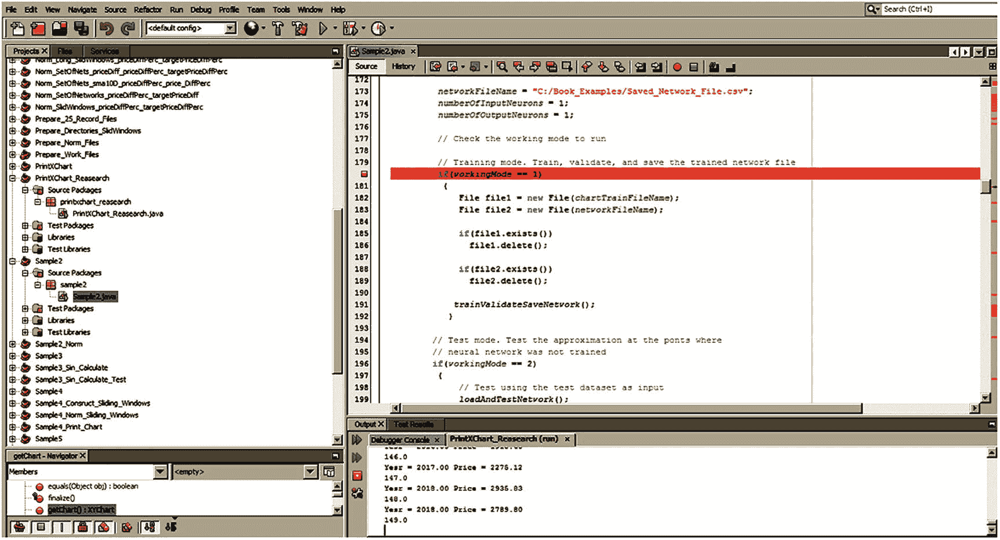

图 5-22 设置断点

在此，我们在检查运行工作模式的逻辑处设置断点。设置断点后，从主菜单中选择`Debug` ➤ `Debug Project`。程序开始执行，然后在断点处停止。此时，如果将光标移动到任何变量上，其值将显示在弹出窗口中。

要推进程序执行，请单击其中一个箭头图标，具体取决于您是希望逐行推进执行、进入正在执行的方法、退出当前方法等（见图 5-23）。

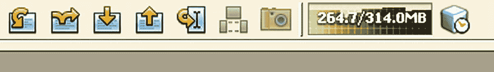

图 5-23 调试时用于推进执行的图标

要运行程序，请从菜单中选择`Run` ➤ `Run Project`。执行结果将显示在日志窗口中。

#### 训练方法的处理结果

清单 5-7 显示了训练结果。

```
RecordNumber = 0  TargetValue = 0.0224 PredictedValue = 0.022898  DiffPerc = 1.77
RecordNumber = 1  TargetValue = 0.0625 PredictedValue = 0.062009  DiffPerc = 0.79
RecordNumber = 2  TargetValue = 0.25   PredictedValue = 0.250359  DiffPerc = 0.14
RecordNumber = 3  TargetValue = 0.5625 PredictedValue = 0.562112  DiffPerc = 0.07
RecordNumber = 4  TargetValue = 1.0    PredictedValue = 0.999552  DiffPerc = 0.04
RecordNumber = 5  TargetValue = 1.5625 PredictedValue = 1.563148  DiffPerc = 0.04
RecordNumber = 6  TargetValue = 2.25   PredictedValue = 2.249499  DiffPerc = 0.02
RecordNumber = 7  TargetValue = 3.0625 PredictedValue = 3.062648  DiffPerc = 0.00
RecordNumber = 8  TargetValue = 4.0    PredictedValue = 3.999920  DiffPerc = 0.00
maxErrorPerc = 1.769902752691229
averErrorPerc = 0.2884023848904945
清单 5-7 训练处理结果
```

所有记录的平均误差差异百分比为 0.29%，所有记录的最大误差差异百分比为 1.77%。

图 5-24 中的图表显示了网络训练的九个点处的逼近结果。

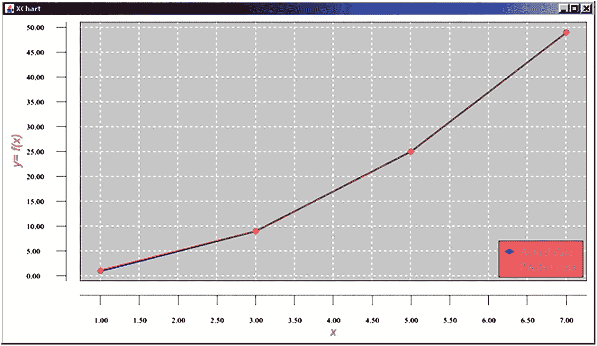

图 5-24 训练结果图表

实际图表（蓝色）和预测（逼近）图表（橙色）在网络训练的点上几乎重叠。


#### 测试网络

测试数据集包含网络训练时未使用过的记录。要测试网络，我们需要调整程序配置语句，使程序以测试模式运行。为此，我们注释掉了训练模式的配置语句，并取消注释了测试模式的配置语句（清单 5-8）。

```
// =============================================
// 配置（注释或取消注释相应的配置）
// =====================================================
// 用于训练网络
//workingMode = 1;
//intNumberOfRecordsInTrainFile = 4;
//trainFileName = "C:/Book_Examples/Sample1_Norm.csv";
//chartTrainFileName = "XYLine_Train_Results_Chart";
// 用于在非训练点测试已训练的网络
workingMode = 2;
intNumberOfRecordsInTestFile = 3;
testFileName = "C:/Book_Examples/Sample2_Norm.csv";
chartTestFileName = "XYLine_Test_Results_Chart";
// 通用配置
networkFileName = "C:/Book_Examples/Saved_Network_File.csv";
numberOfInputNeurons = 1;
numberOfOutputNeurons = 1;
清单 5-8
以测试模式运行程序的配置
```

测试方法的处理逻辑与训练方法类似，但也存在一些差异。该方法处理的输入文件现在是测试数据集，并且该方法不包含网络训练逻辑，因为在执行训练方法期间，网络已经训练完毕并保存到磁盘上。相反，此方法会将之前保存的训练好的网络文件加载到内存中（清单 5-9）。

我们将测试数据集和之前保存的训练好的网络文件加载到内存中。

```
// 将测试数据集加载到内存中
MLDataSet testingSet =
loadCSV2Memory(testFileName,numberOfInputNeurons,numberOfOutputNeurons,
true,CSVFormat.ENGLISH,false);
// 加载保存的训练好的网络
network =
(BasicNetwork)EncogDirectoryPersistence.loadObject(new File(networkFileName));
清单 5-9
测试方法的片段
```

我们遍历成对的数据集，从网络中获取每条记录的归一化输入值、实际值和预测值。接着，我们对这些值进行反归一化，并计算平均差异百分比和最大差异百分比（在反归一化后的实际值与预测值之间）。获取这些值后，我们将其打印出来，并为每条记录填充图表元素。最后，我们添加一些代码来控制图表序列，并将图表保存到磁盘上。

```
int i = - 1;
double xPoint = -0.00;
for (MLDataPair pair:  testingSet)
{
i++;
xPoint = xPoint + 2.00;
MLData inputData = pair.getInput();
MLData actualData = pair.getIdeal();
MLData predictData = network.compute(inputData);
// 这些值是归一化的，因为整个输入都是归一化的
normInputXPointValueFromRecord = inputData.getData(0);
normTargetXPointValueFromRecord = actualData.getData(0);
normPredictXPointValueFromRecord = predictData.getData(0);
denormInputXPointValue = ((minXPointDl - maxXPointDh)*
normInputXPointValueFromRecord - Nh*minXPointDl +
maxXPointDh*Nl)/(Nl - Nh);
denormTargetXPointValue = ((minTargetValueDl - maxTargetValueDh)*
normTargetXPointValueFromRecord - Nh*minTargetValueDl +
maxTargetValueDh*Nl)/(Nl - Nh);
denormPredictXPointValue =((minTargetValueDl - maxTargetValueDh)*
normPredictXPointValueFromRecord - Nh*minTargetValueDl +
maxTargetValueDh*Nl)/(Nl - Nh);
targetToPredictPercent = Math.abs((denormTargetXPointValue -
denormPredictXPointValue)/denormTargetXPointValue*100);
System.out.println("xPoint = " + xPoint +
"  denormTargetXPointValue = " + denormTargetXPointValue +
"  denormPredictXPointValue = " + denormPredictXPointValue +
"   targetToPredictPercent = " + targetToPredictPercent);
if (targetToPredictPercent > maxGlobalResultDiff)
maxGlobalResultDiff = targetToPredictPercent;
sumGlobalResultDiff = sumGlobalResultDiff + targetToPredictPercent;
// 填充图表元素
xData.add(denormInputXPointValue);
yData1.add(denormTargetXPointValue);
yData2.add(denormPredictXPointValue);
}  // 结束成对数据循环
// 打印最大和平均结果
System.out.println(" ");
averGlobalResultDiff = sumGlobalResultDiff/intNumberOfRecordsInTestFile;
System.out.println("maxErrorPerc = " + maxGlobalResultDiff );
System.out.println("averErrorPerc = " + averGlobalResultDiff);
// 所有测试批次文件已处理完毕
XYSeries series1 = Chart.addSeries("实际值", xData, yData1);
XYSeries series2 = Chart.addSeries("预测值", xData, yData2);
series1.setLineColor(XChartSeriesColors.BLUE);
series2.setMarkerColor(Color.ORANGE);
series1.setLineStyle(SeriesLines.SOLID);
series2.setLineStyle(SeriesLines.SOLID);
// 保存图表图像
try
{
BitmapEncoder.saveBitmapWithDPI(Chart, chartTestFileName , BitmapFormat.JPG, 100);
}
catch (Exception bt)
{
bt.printStackTrace();
}
System.out.println ("图表已保存");
System.out.println("测试记录测试结束");
} // 方法结束
```

### 测试结果

清单 5-10 展示了测试结果。

```
xPoint = 0.20 TargetValue = 0.04000  PredictedValue = 0.03785  targetToPredictDiffPerc = 5.37
xPoint = 0.30 TargetValue = 0.09000  PredictedValue = 0.09008  targetToPredictDiffPerc = 0.09
xPoint = 0.40 TargetValue = 0.16000  PredictedValue = 0.15798  targetToPredictDiffPerc = 1.26
xPoint = 0.70 TargetValue = 0.49000  PredictedValue = 0.48985  targetToPredictDiffPerc = 0.03
xPoint = 0.95 TargetValue = 0.90250  PredictedValue = 0.90208  targetToPredictDiffPerc = 0.05
xPoint = 1.30 TargetValue = 1.69000  PredictedValue = 1.69096  targetToPredictDiffPerc = 0.06
xPoint = 1.60 TargetValue = 2.56000  PredictedValue = 2.55464  targetToPredictDiffPerc = 0.21
xPoint = 1.80 TargetValue = 3.24000  PredictedValue = 3.25083  targetToPredictDiffPerc = 0.33
xPoint = 1.95 TargetValue = 3.80250  PredictedValue = 3.82933  targetToPredictDiffPerc = 0.71
maxErrorPerc = 5.369910680518282
averErrorPerc = 0.8098656579029523
清单 5-10
测试结果
```

最大误差（实际值与预测值之间的百分比差异）为 5.37%。平均误差（实际值与预测值之间的百分比差异）为 0.81%。图 5-25 展示了测试结果的图表。

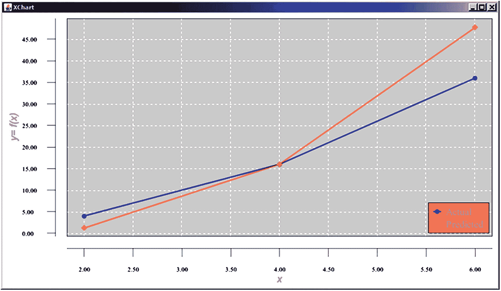

图 5-25

网络未训练点处的近似图表

实际值与预测值之间明显的差异是由于粗略的函数近似造成的。通常可以通过调整网络架构（隐藏层数量、层中神经元数量）来改善近似精度。然而，这里的主要问题是用于训练网络的点数非常少，且点与点之间的距离相对较大。为了获得显著更好的函数近似结果，应该使用更多的点（点与点之间的距离要小得多）来近似这个函数。

如果训练数据集包含更多的点（100、1000 甚至 10,000 个），并且相应地点与点之间的距离小得多（0.01、0.001 甚至 0.0001），那么近似结果将会精确得多。然而，这并非这个第一个简单示例的目标。


### 深入探讨

为什么逼近这个函数需要更多的点？函数逼近控制的是训练过程中所处理点上的逼近函数行为。网络学会了让逼近结果在训练点上与实际函数值紧密匹配，但对训练点之间的函数行为控制力要弱得多。请参考图 5-26 中的示例。

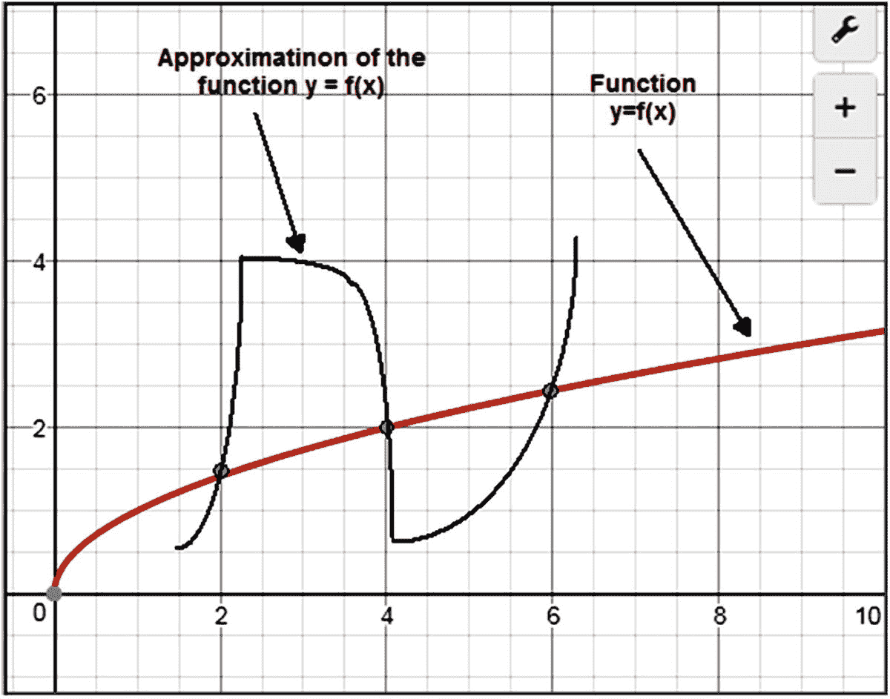

**图 5-26** 原始函数与逼近函数

在图 5-26 的图表中，逼近函数值在训练点上与原始函数值高度吻合，但在点与点之间则不然。为了更清晰地说明问题，图 5-26 有意夸大了测试点的误差。如果使用更多的训练点，那么测试点将始终更接近某个训练点，从而测试点上的测试结果也会更接近该点的原始函数值。

### 总结

本章描述了如何使用 Java Encog 框架开发神经网络应用程序。我们采用循序渐进的方法，解释了使用 Encog 编写神经网络应用程序代码时所涉及的所有细节。本书其余部分的示例均使用 Encog 框架。

