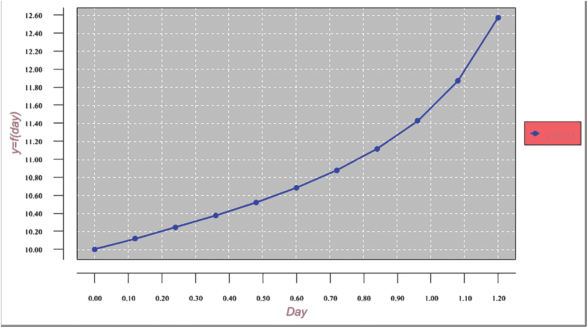
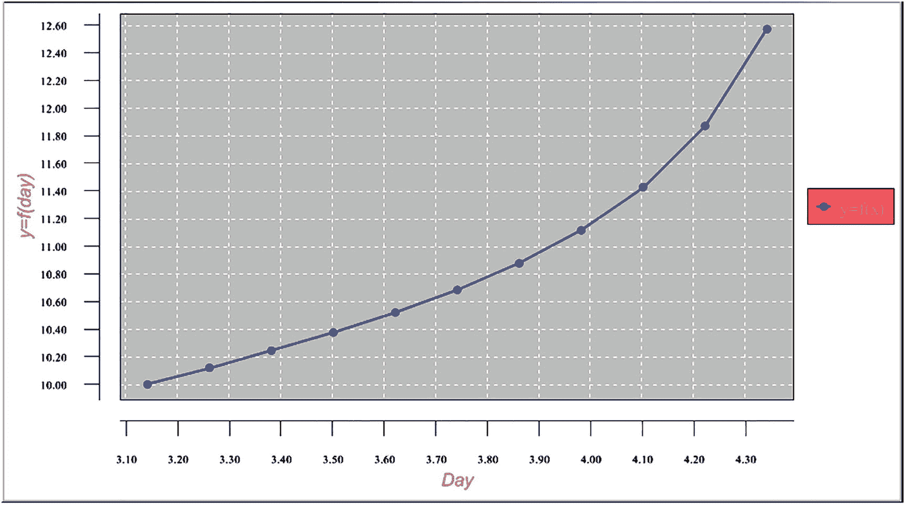
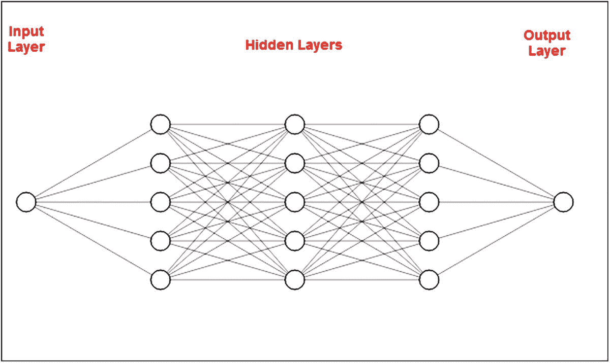
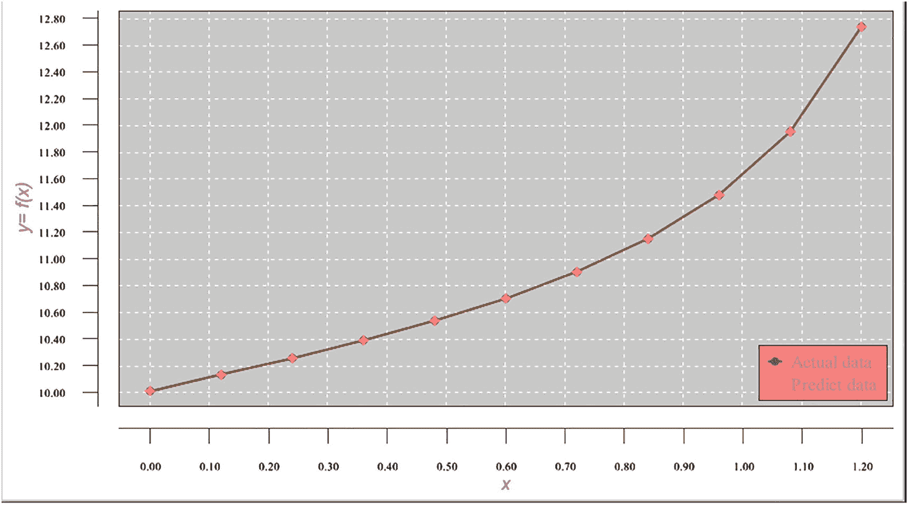
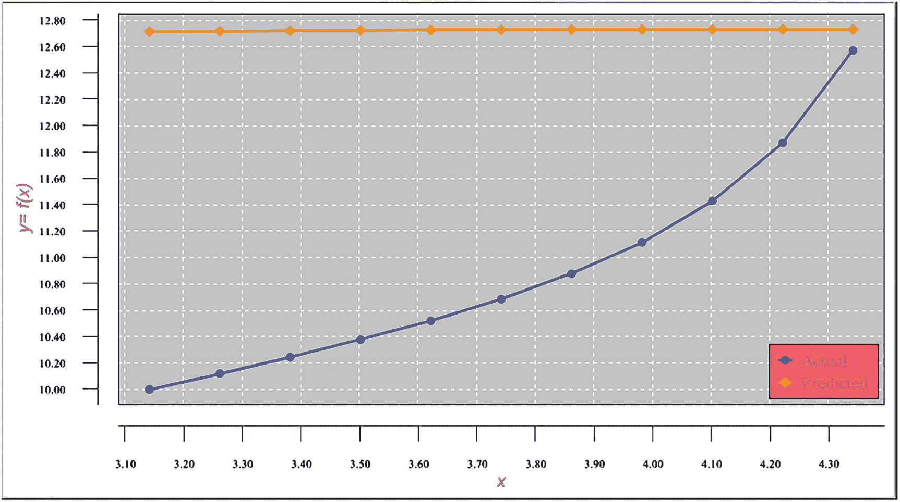
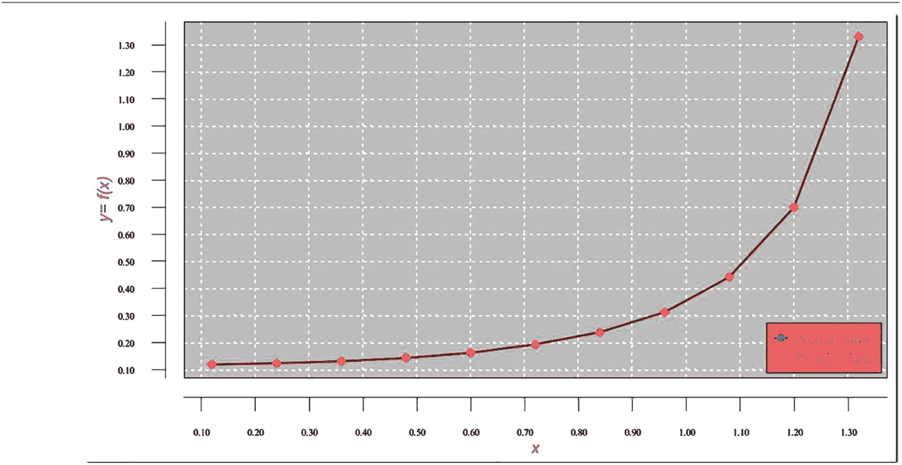

## 6. 训练范围外的神经网络预测

为神经网络处理准备数据通常是最困难且最耗时的任务。除了数据量巨大（可能轻松达到数百万甚至数十亿行）之外，主要难点在于为当前任务准备正确格式的数据。在本章及后续章节中，我们将演示几种数据准备/转换技术。

本示例的目标是展示如何处理神经网络逼近的主要限制，即预测应仅在训练区间内使用。这一限制存在于任何函数逼近机制中（不仅限于神经网络逼近，也包括微积分方法）。在训练区间外获取函数值被称为*预测*（而非预报）。预测函数值基于外推法，而神经网络处理机制则基于逼近机制。在训练区间外获取函数逼近值只会产生错误结果。这是需要了解的重要概念之一。

### 示例：在训练范围外逼近周期函数

本示例将使用正切周期函数 `y = tan(x)`。我们假设不知道给定的是何种周期函数；该函数通过某些点上的值给出。表 6-1 显示了区间 [0, 1.2] 上的函数值。我们将使用这些数据进行网络训练。

**表 6-1** 区间 [0, 1.2] 上的函数值

| 点 `x` | `y` |
| --- | --- |
| 0 | 10 |
| 0.12 | 10.12058 |
| 0.24 | 10.24472 |
| 0.36 | 10.3764 |
| 0.48 | 10.52061 |
| 0.6 | 10.68414 |
| 0.72 | 10.87707 |
| 0.84 | 11.11563 |
| 0.96 | 11.42836 |
| 1.08 | 11.87122 |
| 1.2 | 12.57215 |

图 6-1 显示了区间 [0, 1.2] 上函数值的图表。



**图 6-1** 区间 [0, 1.2] 上函数值的图表

表 6-2 显示了区间 [3.141592654, 4.341592654] 上的函数值。我们将使用这些数据来测试训练好的网络。

**表 6-2** 区间 [3.141592654, 4.341592654] 上的函数值

| 点 `x` | `y` |
| --- | --- |
| 3.141593 | 10 |
| 3.261593 | 10.12058 |
| 3.381593 | 10.24472 |
| 3.501593 | 10.3764 |
| 3.621593 | 10.52061 |
| 3.741593 | 10.68414 |
| 3.861593 | 10.87707 |
| 3.981593 | 11.11563 |
| 4.101593 | 11.42836 |
| 4.221593 | 11.87122 |
| 4.341593 | 12.57215 |

图 6-2 显示了区间 [3.141592654, 4.341592654] 上函数值的图表。



**图 6-2** 区间 [3.141592654, 4.341592654] 上函数值的图表

本示例的目标是在给定区间 [0, 1.2] 上逼近该函数，然后使用训练好的网络预测下一个区间 [3.141592654, 4.341592654] 上的函数值。

例如，我们将尝试以传统方式逼近该函数，即直接使用给定的数据。这些数据需要归一化到区间 [-1, 1]。表 6-3 显示了归一化后的训练数据集。

**表 6-3** 归一化后的训练数据集

| 点 `x` | `Y` |
| --- | --- |
| -0.666666667 | -0.5 |
| -0.626666667 | -0.43971033 |
| -0.586666667 | -0.37764165 |
| -0.546666667 | -0.311798575 |
| -0.506666667 | -0.23969458 |
| -0.466666667 | -0.157931595 |
| -0.426666667 | -0.06146605 |
| -0.386666667 | 0.057816175 |
| -0.346666667 | 0.214178745 |
| -0.306666667 | 0.43560867 |
| -0.266666667 | 0.78607581 |

表 6-4 显示了归一化后的测试数据集。

**表 6-4** 归一化后的测试数据集

| 点 `x` | `y` |
| --- | --- |
| 0.380530885 | -0.5 |
| 0.420530885 | -0.43971033 |
| 0.460530885 | -0.37764165 |
| 0.500530885 | -0.311798575 |
| 0.540530885 | -0.23969458 |
| 0.580530885 | -0.157931595 |
| 0.620530885 | -0.06146605 |
| 0.660530885 | 0.057816175 |
| 0.700530885 | 0.214178745 |
| 0.740530885 | 0.43560867 |
| 0.780530885 | 0.786075815 |

#### 示例的网络架构

图 6-3 显示了本示例的网络架构。该网络由输入层中的一个神经元、三个隐藏层（每层五个神经元）以及输出层中的一个神经元组成。



**图 6-3** 网络架构

#### 示例的程序代码

```python
# 清单 6-1 显示了程序代码。
```

```java
// ====================================================
// 训练范围外周期函数的近似。
// 输入文件由包含两个字段的记录组成：
// - 第一个字段是 `xPoint` 值。
// - 第二个字段是该 `xPoint` 处的目标函数值。
// =====================================================
package `sample3a`;

```java
import java.io.BufferedReader;
import java.io.File;
import java.io.FileInputStream;
import java.io.PrintWriter;
import java.io.FileNotFoundException;
import java.io.FileReader;
import java.io.FileWriter;
import java.io.IOException;
import java.io.InputStream;
import java.nio.file.Paths;
import java.util.Properties;
import java.time.YearMonth;
import java.awt.Color;
import java.awt.Font;
import java.text DateFormat;
import java.text ParseException;
import java.text SimpleDateFormat;
import java.time.LocalDate;
import java.time.Month;
import java.time.ZoneId;
import java.util.ArrayList;
import java.util.Calendar;
import java.util.Date;
import java.util.List;
import java.util.Locale;
import java.util.Properties;
import org.encog.Encog;
import org.encog.engine.network.activation.ActivationTANH;
import org.encog.engine.network.activation.ActivationReLU;
import org.encog.ml.data.MLData;
import org.encog.ml.data.MLDataPair;
import org.encog.ml.data.MLDataSet;
import org.encog.ml.data.buffer.MemoryDataLoader;
import org.encog.ml.data.buffer.codec.CSVDataCODEC;
import org.encog.ml.data.buffer.codec.DataSetCODEC;
import org.encog.neural.networks.BasicNetwork;
import org.encog.neural.networks.layers.BasicLayer;
import org.encog.neural.networks.training.propagation.resilient.ResilientPropagation;
import org.encog.persist.EncogDirectoryPersistence;
import org.encog.util.csv.CSVFormat;
import org.knowm.xchart.SwingWrapper;
import org.knowm.xchart.XYChart;
import org.knowm.xchart.XYChartBuilder;
import org.knowm.xchart.XYSeries;
import org.knowm.xchart.demo.charts.ExampleChart;
import org.knowm.xchart.style.Styler.LegendPosition;
import org.knowm.xchart.style.colors.ChartColor;
import org.knowm.xchart.style.colors.XChartSeriesColors;
import org.knowm.xchart.style.lines.SeriesLines;
import org.knowm.xchart.style.markers.SeriesMarkers;
import org.knowm.xchart.BitmapEncoder;
import org.knowm.xchart.BitmapEncoder.BitmapFormat;
import org.knowm.xchart.QuickChart;
import org.knowm.xchart.SwingWrapper;
```

```java
public class `Sample3a` implements ExampleChart
{
    static double `Nh` =  1;
    static double `Nl` = -1;
    // 第一列
    static double `maxXPointDh` = 5.00;
    static double `minXPointDl` = -1.00;
    // 第二列 - 目标数据
    static double `maxTargetValueDh` = 13.00;
    static double `minTargetValueDl` = 9.00;
    static double `doublePointNumber` = 0.00;
    static int `intPointNumber` = 0;
    static InputStream `input` = null;
    static double[] `arrFunctionValue` = new double[500];
    static double `inputDiffValue` = 0.00;
    static double `predictDiffValue` = 0.00;
    static double `targetDiffValue` = 0.00;
    static double `valueDifferencePerc` = 0.00;
    static String `strFunctionValuesFileName`;
    static int `returnCode`  = 0;
    static int `numberOfInputNeurons`;
    static int `numberOfOutputNeurons`;
    static int `numberOfRecordsInFile`;
    static int `intNumberOfRecordsInTestFile`;
    static double `realTargetValue`;
    static double `realPredictValue`;
    static String `functionValuesTrainFileName`;
    static String `functionValuesTestFileName`;
    static String `trainFileName`;
    static String `priceFileName`;
    static String `testFileName`;
    static String `chartTrainFileName`;
    static String `chartTestFileName`;
    static String `networkFileName`;
    static int `workingMode`;
    static String `cvsSplitBy` = ",";
    static double `denormTargetDiffPerc`;
    static double `denormPredictDiffPerc`;
    static List `xData` = new ArrayList();
    static List `yData1` = new ArrayList();
    static List `yData2` = new ArrayList();
    static XYChart `Chart`;
    
    @Override
    public XYChart getChart()
    {
        // 创建图表
        `Chart` = new  XYChartBuilder().width(900).height(500).title(`getClass()`.
           getSimpleName()).xAxisTitle("x").yAxisTitle("y= f(x)").build();
        // 自定义图表
        `Chart`.getStyler().setPlotBackgroundColor(ChartColor.getAWTColor(ChartColor.GREY));
        `Chart`.getStyler().setPlotGridLinesColor(new Color(255, 255, 255));
        `Chart`.getStyler().setChartBackgroundColor(Color.WHITE);
        `Chart`.getStyler().setLegendBackgroundColor(Color.PINK);
        `Chart`.getStyler().setChartFontColor(Color.MAGENTA);
        `Chart`.getStyler().setChartTitleBoxBackgroundColor(new Color(0, 222, 0));
        `Chart`.getStyler().setChartTitleBoxVisible(true);
        `Chart`.getStyler().setChartTitleBoxBorderColor(Color.BLACK);
        `Chart`.getStyler().setPlotGridLinesVisible(true);
        `Chart`.getStyler().setAxisTickPadding(20);
        `Chart`.getStyler().setAxisTickMarkLength(15);
        `Chart`.getStyler().setPlotMargin(20);
        `Chart`.getStyler().setChartTitleVisible(false);
        `Chart`.getStyler().setChartTitleFont(new Font(Font.MONOSPACED, Font.BOLD, 24));
        `Chart`.getStyler().setLegendFont(new Font(Font.SERIF, Font.PLAIN, 18));
        `Chart`.getStyler().setLegendPosition(LegendPosition.InsideSE);
```

## 重要规则

- 不要修改正文内容的语义
- 不要删减有价值的信息
- 不要重复输出原文，也不要添加额外信息，只输出排版后的文本

## 要排版的文本

```
此代码代表常规神经网络处理过程，无需任何解释。

清单 6-2 **训练处理结果**

```
xPoint = 0.00  TargetValue = 10.00000  PredictedValue = 10.00027  DiffPerc = 0.00274
xPoint = 0.12  TargetValue = 10.12058  PredictedValue = 10.12024  DiffPerc = 0.00336
xPoint = 0.24  TargetValue = 10.24471  PredictedValue = 10.24412  DiffPerc = 0.00580
xPoint = 0.36  TargetValue = 10.37640  PredictedValue = 10.37629  DiffPerc = 0.00102
xPoint = 0.48  TargetValue = 10.52061  PredictedValue = 10.52129  DiffPerc = 0.00651
xPoint = 0.60  TargetValue = 10.68414  PredictedValue = 10.68470  DiffPerc = 0.00530
xPoint = 0.72  TargetValue = 10.87707  PredictedValue = 10.87656  DiffPerc = 0.00467
xPoint = 0.84  TargetValue = 11.11563  PredictedValue = 11.11586  DiffPerc = 0.00209
xPoint = 0.96  TargetValue = 11.42835  PredictedValue = 11.42754  DiffPerc = 0.00712
xPoint = 1.08  TargetValue = 11.87121  PredictedValue = 11.87134  DiffPerc = 0.00104
xPoint = 1.20  TargetValue = 12.57215  PredictedValue = 12.57200  DiffPerc = 0.00119
maxErrorPerc = 0.007121086942321541
averErrorPerc = 0.0034047471040211954
```

图 6-4 **展示了训练结果的图表**。



图 6-4

区间 [0, 1.2] 上的训练结果图表

#### 测试网络

在处理测试数据集时，我们从记录中提取 `xPoint` 值（第 1 列），将该值输入训练好的网络，从网络获取预测的函数值，并将结果与我们已知的函数值（参见清单 6-2 第 2 列）进行比较。

清单 6-3 **展示了测试处理结果**

```
xPoint = 3.141594  TargetValue = 10.00000  PredictedValue = 12.71432  DiffPerc = 27.14318
xPoint = 3.261593  TargetValue = 10.12059  PredictedValue = 12.71777  DiffPerc = 25.66249
xPoint = 3.381593  TargetValue = 10.24471  PredictedValue = 12.72100  DiffPerc = 24.17133
xPoint = 3.501593  TargetValue = 10.37640  PredictedValue = 12.72392  DiffPerc = 22.62360
xPoint = 3.621593  TargetValue = 10.52061  PredictedValue = 12.72644  DiffPerc = 20.96674
xPoint = 3.741593  TargetValue = 10.68413  PredictedValue = 12.72849  DiffPerc = 19.13451
xPoint = 3.861593  TargetValue = 10.87706  PredictedValue = 12.73003  DiffPerc = 17.03549
xPoint = 3.981593  TargetValue = 11.11563  PredictedValue = 12.73102  DiffPerc = 14.53260
xPoint = 4.101593  TargetValue = 11.42835  PredictedValue = 12.73147  DiffPerc = 11.40249
xPoint = 4.221593  TargetValue = 11.87121  PredictedValue = 12.73141  DiffPerc = 7.246064
xPoint = 4.341593  TargetValue = 12.57215  PredictedValue = 12.73088  DiffPerc = 1.262565
maxErrorPerc = 25.662489243649677
averErrorPerc = 15.931756451553364
```

图 6-5 **展示了区间 [3.141592654, 4.341592654] 上的测试处理结果图表**。



图 6-5

区间 [3.141592654, 4.341592654] 上的测试结果图表

请注意，预测图表（黄色）与实际图表（蓝色）看起来差异巨大。测试处理结果的大误差，`maxErrorPerc` = 25.66% 和 `averErrorPerc` > 15.93%（参见清单 6-3），以及图表（图 6-5）表明，这种函数逼近毫无用处。当网络接收到来自测试记录中、超出训练范围的输入 `xPoint` 值时，就会返回这些值。

### 示例：在训练范围外正确逼近周期函数的正确方法

在本示例中，我们将展示如何通过特殊的数据准备，使得周期函数能够在网络训练范围之外被正确逼近。稍后您将看到，这种技术也可用于更复杂的周期函数，甚至一些非周期函数。

#### 准备训练数据

提醒一下，本示例需要使用在区间 [0, 1.2] 上训练的网络，来预测区间 [3.141592654 – 4.341592654]（该区间在训练范围之外）上的函数结果。我们将在此展示如何针对周期函数规避神经网络的这一限制。为此，我们首先将给定的函数值转换为一个数据集，其中每条记录包含两个字段：

*   字段 1 是当前点（记录）的 `xPoint` 值与第一个点（记录）的 `xPoint` 值之差。

*   字段 2 是下一个点（记录）的函数值与当前点（记录）的函数值之差。

提示

当将记录的第一个字段表示为 `xPoint` 值之差，而不是原始的 `xPoint` 值时，即使我们试图预测任何下一个区间（在我们的例子中是 [3.141592654 – 4.341592654]）的函数值，我们也不会再超出训练区间。换句话说，下一个区间 [3.141592654 – 4.341592654] 上的 `xPoint` 值之差将落在训练范围内。

通过以这种方式构建输入数据集，我们实质上是在教网络学习：当当前点与第一个 `xPoint` 之间的函数值之差等于某个值 *a* 时，那么下一个点与当前点之间的函数值之差必须等于某个值 *b*。这使得网络能够通过知道当前天的函数值来预测第二天的函数值。表 6-5 展示了转换后的数据集。

表 6-5

转换后的训练数据集

| 点 x | y |

| --- | --- |

| -0.12 | 9.879420663 |

| 0 | 10 |

| 0.12 | 10.12057934 |

| 0.24 | 10.2447167 |

| 0.36 | 10.37640285 |

| 0.48 | 10.52061084 |

| 0.6 | 10.68413681 |

| 0.72 | 10.8770679 |

| 0.84 | 11.11563235 |

| 0.96 | 11.42835749 |

| 1.08 | 11.87121734 |

| 1.2 | 12.57215162 |

| 1.32 | 13.90334779 |

我们将训练数据集归一化到区间 [-1, 1]。表 6-6 展示了结果。

表 6-6

归一化后的训练数据集

| xDiff | yDiff |

| --- | --- |

| -0.968 | -0.967073056 |

| -0.776 | -0.961380224 |

| -0.584 | -0.94930216 |

| -0.392 | -0.929267216 |

| -0.2 | -0.898358448 |

| -0.008 | -0.851310256 |

| 0.184 | -0.77829688 |

| 0.376 | -0.659639776 |

| 0.568 | -0.45142424 |

| 0.76 | -0.038505152 |

| 0.952 | 0.969913872 |

表 6-7 展示了转换后的测试数据库。

表 6-7

转换后的测试数据集

| xPointDiff | yDiff |

| --- | --- |

| 3.021592654 | 9.879420663 |

| 3.141592654 | 10 |

| 3.261592654 | 10.12057934 |

| 3.381592654 | 10.2447167 |

| 3.501592654 | 10.37640285 |

| 3.621592654 | 10.52061084 |

| 3.741593
```

```java
// =======================================================================
// 对训练范围之外的周期函数进行近似。
// 输入文件由包含两个字段的记录组成：
// - 第一个字段保存当前记录与第一条记录的函数值之差。
// - 第二个字段保存下一条记录与当前记录的函数值之差。
// =======================================================================
package sample3b;

import java.io.BufferedReader;
import java.io.File;
import java.io.FileInputStream;
import java.io.FileOutputStream;
import java.io.FileReader;
import java.io.FileWriter;
import java.io.IOException;
import java.io.InputStream;
import java.nio.file.*;
import java.util.Properties;
import java.time.YearMonth;
import java.awt.Color;
import java.awt.Font;
import java.text.DateFormat;
import java.text.ParseException;
import java.text.SimpleDateFormat;
import java.time.LocalDate;
import java.time.Month;
import java.time.ZoneId;
import java.util.ArrayList;
import java.util.Calendar;
import java.util.Date;
import java.util.List;
import java.util.Locale;
import java.util.Properties;
import org.encog.Encog;
import org.encog.engine.network.activation.ActivationTANH;
import org.encog.engine.network.activation.ActivationReLU;
import org.encog.ml.data.MLData;
import org.encog.ml.data.MLDataPair;
import org.encog.ml.data.MLDataSet;
import org.encog.ml.data.buffer.MemoryDataLoader;
import org.encog.ml.data.buffer.codec.CSVDataCODEC;
import org.encog.ml.data.buffer.codec.DataSetCODEC;
import org.encog.neural.networks.BasicNetwork;
import org.encog.neural.networks.layers.BasicLayer;
import org.encog.neural.networks.training.propagation.resilient.ResilientPropagation;
import org.encog.persist.EncogDirectoryPersistence;
import org.encog.util.csv.CSVFormat;
import org.knowm.xchart.SwingWrapper;
import org.knowm.xchart.XYChart;
import org.knowm.xchart.XYChartBuilder;
import org.knowm.xchart.demo.charts.ExampleChart;
import org.knowm.xchart.style.Styler.LegendPosition;
import org.knowm.xchart.style.colors.ChartColor;
import org.knowm.xchart.style.colors.XChartSeriesColors;
import org.knowm.xchart.style.lines.SeriesLines;
import org.knowm.xchart.style.markers.SeriesMarkers;
import org.knowm.xchart.BitmapEncoder;
import org.knowm.xchart.BitmapEncoder.BitmapFormat;
import org.knowm.xchart.QuickChart;
import org.knowm.xchart.SwingWrapper;

public class Sample3b implements ExampleChart {
    static double Nh = 1;
    static double Nl = -1;
    static double maxXPointDh = 1.35;
    static double minXPointDl = 0.10;
    static double maxTargetValueDh = 1.35;
    static double minTargetValueDl = 0.10;
    static double doublePointNumber = 0.00;
    static int intPointNumber = 0;
    static InputStream input = null;
    static double[] arrFunctionValue = new double[500];
    static double inputDiffValue = 0.00;
    static double predictDiffValue = 0.00;
    static double targetDiffValue = 0.00;
    static double valueDifferencePerc = 0.00;
    static String strFunctionValuesFileName;
    static int returnCode = 0;
    static int numberOfInputNeurons;
    static int numberOfOutputNeurons;
    static int numberOfRecordsInFile;
    static int intNumberOfRecordsInTestFile;
    static double realTargetValue;
    static double realPredictValue;
    static String functionValuesTrainFileName;
    static String functionValuesTestFileName;
    static String trainFileName;
    static String priceFileName;
    static String testFileName;
    static String chartTrainFileName;
    static String chartTestFileName;
    static String networkFileName;
    static int workingMode;
    static String cvsSplitBy = ",";
    static double denormTargetDiffPerc;
    static double denormPredictDiffPerc;
    static List xData = new ArrayList();
    static List yData1 = new ArrayList();
    static List yData2 = new ArrayList();
    static XYChart Chart;

    @Override
    public XYChart getChart() {
        // 创建图表
        Chart = new XYChartBuilder().width(900).height(500).title(getClass().getSimpleName()).xAxisTitle("x").yAxisTitle("y= f(x)").build();
        // 自定义图表
        Chart.getStyler().setPlotBackgroundColor(ChartColor.getAWTColor(ChartColor.GREY));
        Chart.getStyler().setPlotGridLinesColor(new Color(255));
        // ... (其余代码保持不变)
        return Chart;
    }
}
```

```markdown
## 重要规则

- 不要修改正文内容的语义
- 不要删减有价值的信息
- 不要重复输出原文，也不要添加额外信息，只输出排版后的文本

## 要排版的文本

### **清单 6-4**  

### **程序代码**

#### 排版后的内容

与往常一样，程序顶部有一些杂项声明。这些是 XChart 包所必需的。配置部分控制应执行训练方法还是测试方法。如果 `workingMode` 字段等于 1，则执行训练方法；否则，执行测试方法。

请注意调用训练方法 `trainValidateSaveNetwork` 的非常规方式。实际上，我们已经在第 2 章中简要讨论过它。代码清单 6-5 展示了如何编写这种技术。

```java
returnCode = 0;    // 清除错误代码
do
{
    returnCode = trainValidateSaveNetwork();
} while (returnCode > 0);
```

### 代码清单 6-5
在循环中调用训练方法

该逻辑调用训练方法，然后检查 `returnCode`。如果 `returnCode` 字段不为零，则在循环中再次调用训练方法。并且每次调用该方法时，初始权重/偏置参数都会被分配不同的随机值，这有助于在循环中重复调用该方法时选择它们的最佳值。

在被调用的方法内部，逻辑会在 500 次迭代后检查误差值。如果网络计算出的误差仍然大于误差限制，该方法将以 `returnCode` 为 1 退出。并且，正如我们刚才所见，该方法将被再次调用。最后，当计算出的误差低于误差阈值时，该方法以 `returnCode` 为 0 退出，并且不再被调用。您通过实验选择误差限制值，使网络难以清除误差代码限制，但仍确保经过足够多的迭代后，误差将低于误差限制。

代码清单 6-6 展示了训练方法的开头部分。它将训练数据集加载到内存中，并创建由输入层（包含一个神经元）、三个隐藏层（每层包含五个神经元）和输出层（包含一个神经元）组成的神经网络。然后，我们使用最高效的 `ResilientPropagation` 作为反向传播方法来训练网络。

```java
// 将训练 CSV 文件加载到内存中
MLDataSet trainingSet =
    loadCSV2Memory(trainFileName, numberOfInputNeurons, numberOfOutputNeurons,
                   true, CSVFormat.ENGLISH, false);
// 创建一个神经网络
BasicNetwork network = new BasicNetwork();
// 输入层
network.addLayer(new BasicLayer(null, true, 1));
// 隐藏层（创建了七个隐藏层）
network.addLayer(new BasicLayer(new ActivationTANH(), true, 5));
network.addLayer(new BasicLayer(new ActivationTANH(), true, 5));
network.addLayer(new BasicLayer(new ActivationTANH(), true, 5));
// 输出层
network.addLayer(new BasicLayer(new ActivationTANH(), false, 1));
network.getStructure().finalizeStructure();
network.reset();
// 训练神经网络
final ResilientPropagation train = new ResilientPropagation(network, trainingSet);
```

### 代码清单 6-6
加载训练数据集并构建和训练网络

接下来是训练网络的代码片段。我们通过遍历周期（epoch）来训练网络。在每次迭代中，我们检查计算出的误差是否小于设定的误差限制（在本例中为 0.00000006）。当网络误差小于误差限制时，我们退出循环。网络以所需的精度训练完成，因此我们将训练好的网络保存到磁盘上。

```java
int epoch = 1;
returnCode = 0;
do
{
    train.iteration();
    System.out.println("Epoch #" + epoch + " Error:" + train.getError());
    epoch++;
    if (epoch >= 500 && network.calculateError(trainingSet) > 0.000000061)
    {
        returnCode = 1;
        System.out.println("Try again");
        return returnCode;
    }
} while (train.getError() > 0.00000006);
// 保存网络文件
EncogDirectoryPersistence.saveObject(new File(networkFileName), network);
```

请注意代码清单 6-7 中所示的逻辑，它检查网络误差是否已小于误差限制。

```java
if (epoch >= 5000 && network.calculateError(trainingSet) > 0.00000006)
{
    returnCode = 1;
    System.out.println("Try again");
    return returnCode;
}
```

### 代码清单 6-7
检查网络误差

它检查在 500 次迭代后，网络误差是否仍然不小于误差限制。如果是这种情况，则将 `returnCode` 设置为 1，然后我们从训练方法中退出，返回到在循环中调用训练方法的位置。在那里，它将使用一组新的随机权重/偏置参数再次调用训练方法。如果没有这段代码，如果计算出的网络误差无法通过随机选择的初始权重/偏置参数集清除误差限制，循环将无限期地继续下去。

有两个 API 可以检查计算出的网络误差。根据使用的方法不同，结果略有差异。

*   `train.getError()`：在应用训练之前计算误差。

*   `network.CalculateError()`：在应用训练之后计算误差。

代码清单 6-8 中的代码片段遍历成对数据集。循环中的 `xPoint` 被设置在区间 [0, 1.2] 上。对于每条记录，它检索输入值、实际值和预测值，对其进行反归一化，并通过函数值计算 `realTargetValue` 和 `realPredictValue`，将它们（连同对应的 `xPoint` 值）添加到图表数据中。它还计算所有记录的最大值和平均值百分比差异。所有这些数据都作为训练日志打印出来。最后，训练好的网络和图表图像文件被保存到磁盘上。请注意，此时返回代码被设置为零，然后我们才从训练方法返回，因此该方法将不再被调用。

```java
for (MLDataPair pair : trainingSet)
{
    m++;
    xPoint = xPoint + xPoint_Increment;
    final MLData output = network.compute(pair.getInput());
    MLData inputData = pair.getInput();
    MLData actualData = pair.getIdeal();
    MLData predictData = network.compute(inputData);
    // 计算并打印结果
    inputDiffValue = inputData.getData(0);
    targetDiffValue = actualData.getData(0);
    predictDiffValue = predictData.getData(0);
    // 反归一化数值
    denormTargetDiffPerc = ((minXPointDl - maxXPointDh) * targetDiffValue - Nh * minXPointDl +
                             maxXPointDh * Nl) / (Nl - Nh);
    denormPredictDiffPerc = ((minTargetValueDl - maxTargetValueDh) * predictDiffValue -
                             Nh * minTargetValueDl + maxTargetValueDh * Nl) / (Nl - Nh);
    functionValue = arrFunctionValue[m];
    realTargetValue = functionValue + targetDiffValue;
    realPredictValue = functionValue + predictDiffValue;
    valueDifferencePerc =
        Math.abs(((realTargetValue - realPredictValue) / realPredictValue) * 100.00);
    System.out.println("xPoint = " + xPoint + "  realTargetValue = " +
                       realTargetValue + "  realPredictValue = " + realPredictValue);
    sumDifferencePerc = sumDifferencePerc + valueDifferencePerc;
    if (valueDifferencePerc > maxDifferencePerc)
        maxDifferencePerc = valueDifferencePerc;
    xData.add(xPoint);
    yData1.add(realTargetValue);
    yData2.add(realPredictValue);
}   // 结束 for 循环对
XYSeries series1 = Chart.addSeries("实际数据", xData, yData1);
XYSeries series2 = Chart.addSeries("预测数据", xData, yData2);
series1.setLineColor(XChartSeriesColors.BLUE);
series2.setMarkerColor(Color.ORANGE);
series1.setLineStyle(SeriesLines.SOLID);
series2.setLineStyle(SeriesLines.SOLID);
try
{
    // 保存图表图像
    BitmapEncoder.saveBitmapWithDPI(Chart, chartTrainFileName, BitmapFormat.JPG, 100);
    System.out.println("训练图表文件已保存");
}
catch (IOException ex)
{
    ex.printStackTrace();
    System.exit(3);
}
// 最后，保存这个训练好的网络
EncogDirectoryPersistence.saveObject(new File(networkFileName), network);
System.out.println("训练网络已保存");
averNormDifferencePerc = sumDifferencePerc / numberOfRecordsInFile;
System.out.println(" ");
System.out.println("maxDifferencePerc = " + maxDifferencePerc + "  averNormDifferencePerc = " +
                   averNormDifferencePerc);
returnCode = 0;
return returnCode;
}   // 方法结束
```

### 代码清单 6-8
遍历成对数据集

测试方法具有类似的处理逻辑，但构建和训练网络除外。它不构建和训练网络，而是将之前保存的训练好的网络加载到内存中。它还将测试数据集加载到内存中。通过遍历成对数据集，它获取每条记录的输入值、目标值和预测值。循环中的 `xPoint` 取自区间 [3.141592654, 4.341592654]。

### **示例的训练结果**

### **列表 6-9** 显示了训练结果。

```
xPoint = 0.12  TargetValue = 0.12058  PredictedValue = 0.12072  DiffPerc = 0.00143
xPoint = 0.24  TargetValue = 0.12414  PredictedValue = 0.12427  DiffPerc = 0.00135
xPoint = 0.36  TargetValue = 0.13169  PredictedValue = 0.13157  DiffPerc = 9.6467E-4
xPoint = 0.48  TargetValue = 0.14421  PredictedValue = 0.14410  DiffPerc = 0.00100
xPoint = 0.60  TargetValue = 0.16353  PredictedValue = 0.16352  DiffPerc = 5.31138E-5
xPoint = 0.72  TargetValue = 0.19293  PredictedValue = 0.19326  DiffPerc = 0.00307
xPoint = 0.84  TargetValue = 0.23856  PredictedValue = 0.23842  DiffPerc = 0.00128
xPoint = 0.96  TargetValue = 0.31273  PredictedValue = 0.31258  DiffPerc = 0.00128
xPoint = 1.08  TargetValue = 0.44286  PredictedValue = 0.44296  DiffPerc = 8.16305E-4
xPoint = 1.20  TargetValue = 0.70093  PredictedValue = 0.70088  DiffPerc = 4.05989E-4
xPoint = 1.32  TargetValue = 1.33119  PredictedValue = 1.33123  DiffPerc = 2.74089E-4
maxErrorPerc = 0.0030734810314331077
averErrorPerc = 9.929718215067468E-4
```

### **图 6-7** 显示了实际函数值与验证结果的对比图表。



如图 6-7 所示，两个图表几乎完全重叠。

### **示例 3 的测试结果日志**

### **列表 6-10** 显示了区间 [3.141592654, 4.341592654] 上的测试结果。

```
xPoint = 3.26159  TargetValue = 10.12058  PredictedValue = 10.12072  DiffPerc = 0.00143
xPoint = 3.38159  TargetValue = 10.24472  PredictedValue = 10.24485  DiffPerc = 0.00135
xPoint = 3.50159  TargetValue = 10.37640  PredictedValue = 10.37630  DiffPerc = 9.64667E-4
xPoint = 3.62159  TargetValue = 10.52061  PredictedValue = 10.52050  DiffPerc = 0.00100
xPoint = 3.74159  TargetValue = 10
```