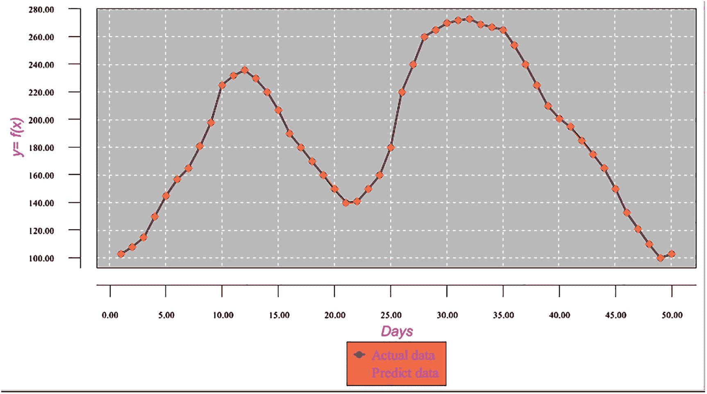
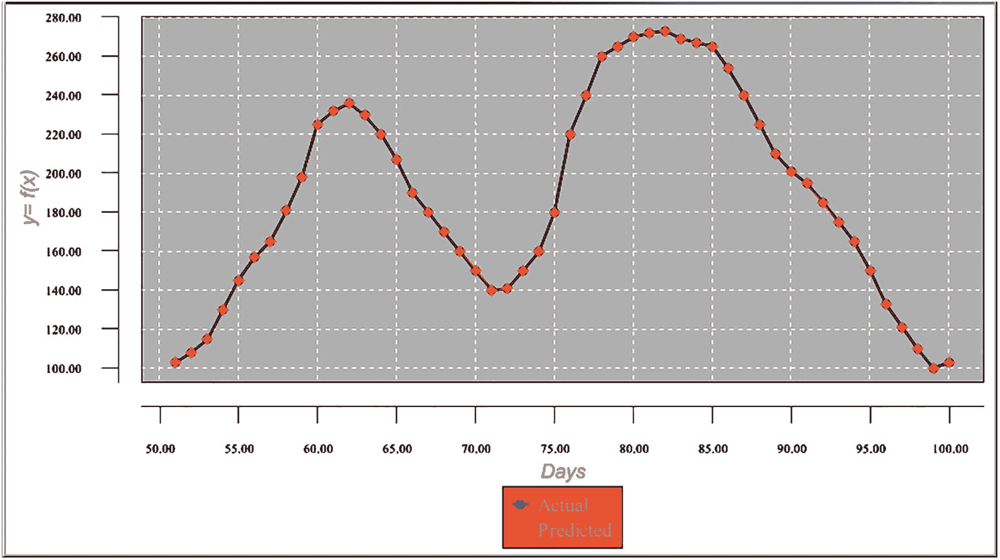

# 7. 处理复杂周期函数

在本章中，我们继续讨论如何处理周期函数，重点关注更复杂的周期函数。

### 示例：复杂周期函数的逼近

让我们来看一下图 7-1 所示的函数图表。该函数表示以天为单位测量的某些实验数据（`x` 是实验的连续天数）。这是一个周期为 50 天的周期函数。


图 7-1 周期函数在两个区间（1–50 天和 51–100 天）的图表

表 7-1 显示了两个周期（1–50 天和 51–100 天）的函数值。

| 天数 | 函数值（周期 1） | 天数 | 函数值（周期 2） |
| --- | --- | --- | --- |
| 1 | 100 | 51 | 103 |
| 2 | 103 | 52 | 108 |
| 3 | 108 | 53 | 115 |
| 4 | 115 | 54 | 130 |
| 5 | 130 | 55 | 145 |
| 6 | 145 | 56 | 157 |
| 7 | 157 | 57 | 165 |
| 8 | 165 | 58 | 181 |
| 9 | 181 | 59 | 198 |
| 10 | 198 | 60 | 225 |
| 11 | 225 | 61 | 232 |
| 12 | 232 | 62 | 236 |
| 13 | 236 | 63 | 230 |
| 14 | 230 | 64 | 220 |
| 15 | 220 | 65 | 207 |
| 16 | 207 | 66 | 190 |
| 17 | 190 | 67 | 180 |
| 18 | 180 | 68 | 170 |
| 19 | 170 | 69 | 160 |
| 20 | 160 | 70 | 150 |
| 21 | 150 | 71 | 140 |
| 22 | 140 | 72 | 141 |
| 23 | 141 | 73 | 150 |
| 24 | 150 | 74 | 160 |
| 25 | 160 | 75 | 180 |
| 26 | 180 | 76 | 220 |
| 27 | 220 | 77 | 240 |
| 28 | 240 | 78 | 260 |
| 29 | 260 | 79 | 265 |
| 30 | 265 | 80 | 270 |
| 31 | 270 | 81 | 272 |
| 32 | 272 | 82 | 273 |
| 33 | 273 | 83 | 269 |
| 34 | 269 | 84 | 267 |
| 35 | 267 | 85 | 265 |
| 36 | 265 | 86 | 254 |
| 37 | 254 | 87 | 240 |
| 38 | 240 | 88 | 225 |
| 39 | 225 | 89 | 210 |
| 40 | 210 | 90 | 201 |
| 41 | 201 | 91 | 195 |
| 42 | 195 | 92 | 185 |
| 43 | 185 | 93 | 175 |
| 44 | 175 | 94 | 165 |
| 45 | 165 | 95 | 150 |
| 46 | 150 | 96 | 133 |
| 47 | 133 | 97 | 121 |
| 48 | 121 | 98 | 110 |
| 49 | 110 | 99 | 100 |
| 50 | 100 | 100 | 103 |

#### 数据准备

我们希望使用第一个区间的函数值来训练神经网络，然后通过获取网络在第二个区间预测的函数值来测试网络。与之前的示例类似，为了能够确定训练范围之外的函数逼近结果，我们将使用 `xPoint` 值之间的差值以及函数值之间的差值，而不是给定的 `xPoints` 和函数值。不过，在本示例中，我们将当前点与前一个点之间的 `xPoint` 值差值用作字段 1，将下一个点与当前点之间的函数值差值用作字段 2。

通过输入文件中的这些设置，我们教会网络学习：当 `xPoint` 值之间的差值等于某个值 `a` 时，下一天与当天之间的函数值差值必须等于某个值 `b`。这使得网络能够通过知道当天（记录）的函数值来预测下一天的函数值。

在测试期间，我们通过以下方式计算函数在下一天的值。当位于点 `x` = 50 时，我们想要计算下一个点 `x` = 51 处的预测函数值。将当前点与前一个点之间的 `xPoint` 值差值（字段 1）输入到训练好的网络中，我们将得到预测的下一天与当天之间的函数值差值。因此，下一个点的预测函数值等于当前点的实际函数值与从训练网络获得的预测值差值之和。

然而，这种方法在本示例中行不通，仅仅是因为图表的许多部分可能具有相同的当前天与前一天之间的函数值差值和方向。当神经网络试图确定该点属于图表的哪个部分时，这会混淆其学习过程（见图 7-2）。


图 7-2 函数图表上令人困惑的点

#### 在数据中反映函数拓扑结构

对于这个示例，我们需要使用一个额外的技巧。我们将把函数拓扑结构包含在数据中，以帮助网络区分令人困惑的点。具体来说，我们的训练文件将使用滑动窗口作为输入记录。每个滑动窗口记录包含前十条记录的输入函数值差值（当前天与前一天之间的差值）。滑动窗口的目标函数值是原始第 11 条记录的目标函数值差值（下一天与当天之间的差值）。

本质上，通过使用这样的记录格式，我们教会网络学习以下条件：如果前十条记录的函数值差值分别等于 `a1`、`a2`、`a3`、`a4`、`a5`、`a6`、`a7`、`a8`、`a9` 和 `a10`，那么下一天函数值与当天函数值之间的差值应该等于下一条记录（第 11 条记录）的目标函数值。图 7-3 展示了一个构建滑动窗口记录的直观示例。


图 7-3 构建滑动窗口记录

表 7-2 显示了滑动窗口训练数据集。

|   |   |   | 滑动窗口 |   |   |   |
|---|---|---|---|---|---|---|
| -9 | -6 | -10 | -10 | -10 | -15 | -17 | -12 | -11 | -10 | 3 |
| -6 | -10 | -10 | -10 | -15 | -17 | -12 | -11 | -10 | 3 | 5 |
| -10 | -10 | -10 | -15 | -17 | -12 | -11 | -10 | 3 | 3 | 7 |
| -10 | -10 | -15 | -17 | -12 | -11 | -10 | 3 | 3 | 7 | 15 |
| -10 | -15 | -17 | -12 | -11 | -10 | 3 | 3 | 7 | 15 | 15 |
| -15 | -17 | -12 | -11 | -10 | 3 | 3 | 7 | 15 | 15 | 12 |
| -17 | -12 | -11 | -10 | 3 | 3 | 7 | 15 | 15 | 12 | 8 |
| -12 | -11 | -10 | 3 | 3 | 7 | 15 | 15 | 12 | 8 | 16 |
| -11 | -10 | 3 | 3 | 7 | 15 | 15 | 12 | 8 | 16 | 17 |
| -10 | 3 | 3 | 7 | 15 | 15 | 12 | 8 | 16 | 17 | 27 |
| 3 | 3 | 7 | 15 | 15 | 12 | 8 | 16 | 17 | 27 | 7 |
| 3 | 7 | 15 | 15 | 12 | 8 | 16 | 17 | 27 | 7 | 4 |
| 7 | 15 | 15 | 12 | 8 | 16 | 17 | 27 | 7 | 4 | -6 |
| 15 | 15 | 12 | 8 | 16 | 17 | 27 | 7 | 4 | -6 | -10 |
| 15 | 12 | 8 | 16 | 17 | 27 | 7 | 4 | -6 | -10 | -13 |
| 12 | 8 | 16 | 17 | 27 | 7 | 4 | -6 | -10 | -13 | -17 |
| 8 | 16 | 17 | 27 | 7 | 4 | -6 | -10 | -13 | -17 | -10 |
| 16 | 17 | 27 | 7 | 4 | -6 | -10 | -13 | -17 | -10 | -10 |
| 17 | 27 | 7 | 4 | -6 | -10 | -13 | -17 | -10 | -10 | -10 |
| 27 | 7 | 4 | -6 | -10 | -13 | -17 | -10 | -10 | -10 | -10 |
| 7 | 4 | -6 | -10 | -13 | -17 | -10 | -10 | -10 | -10 | -10 |
| 4 | -6 | -10 | -13 | -17 | -10 | -10 | -10 | -10 | 1 |
| -6 | -10 | -13 | -17 | -10 | -10 | -10 | -10 | 1 | 9 |
| -10 | -13 | -17 | -10 | -10 | -10 | -10 | 1 | 9 | 10 |
| -13 | -17 | -10 | -10 | -10 | -10 | 1 | 9 | 10 | 20 |
| -17 | -10 | -10 | -10 | -10 | 1 | 9 | 10 | 20 | 40 |
| -10 | -10 | -10 | -10 | 1 | 9 | 10 | 20 | 40 | 20 |
| -10 | -10 | -10 | 1 | 9 | 10 | 20 | 40 | 20 | 20 |
| -10 | -10 | 1 | 9 | 10 | 20 | 40 | 20 | 20 | 5 |
| -10 | -10 | 1 | 9 | 10 | 20 | 40 | 20 | 20 | 5 |
| -10 | 1 | 9 | 10 | 20 | 40 | 20 | 20 | 5 | 5 |
| 1 | 9 | 10 | 20 | 40 | 20 | 20 | 5 | 5 | 2 |
| 9 | 10 | 20 | 40 | 20 | 20 | 5 | 5 | 2 | 1 |
| 10 | 20 | 40 | 20 | 20 | 5 | 5 | 2 | 1 | -4 |
| 20 | 40 | 20 | 20 | 5 | 5 | 2 | 1 | -4 | -2 |
| 40 | 20 | 20 | 5 | 5 | 2 | 1 | -4 | -2 | -2 |
| 20 | 20 | 5 | 5 | 2 | 1 | -4 | -2 | -2 | -11 |
| 20 | 5 | 5 | 2 | 1 | -4 | -2 | -11 | -14 | -15 |
| 5 | 5 | 2 | 1 | -4 | -2 | -11 | -14 | -15 | -15 |
| 5 | 2 | 1 | -4 | -2 | -2 | -11 | -14 | -15 | -15 |
| 2 | 1 | -4 | -2 | -2 | -11 | -14 | -15 | -15 | -9 |
| 1 | -4 | -2 | -2 | -11 | -14 | -15 | -9 | -6 | -10 |
| -4 | -2 | -2 | -11 | -14 | -15 | -9 | -6 | -10 | -10 |
| -2 | -2 | -11 | -14 | -15 | -9 | -6 | -10 | -10 | -

## 重要规则

- 不要修改正文内容的语义
- 不要删减有价值的信息
- 不要重复输出原文，也不要添加额外信息，只输出排版后的文本

| *0.028571* | *0.057143* | *0.342857* | *-0.22857* | *-0.31429* | *-0.6* | *-0.71429* | *-0.8* | *-0.91429* | *-0.71429* | *-0.71429* |
| --- | --- | --- | --- | --- | --- | --- | --- | --- | --- | --- |
| *0.057143* | *0.342857* | *-0.22857* | *-0.31429* | *-0.6* | *-0.71429* | *-0.8* | *-0.91429* | *-0.71429* | *-0.71429* | *-0.71429* |
| *0.342857* | *-0.22857* | *-0.31429* | *-0.6* | *-0.71429* | *-0.8* | *-0.91429* | *-0.71429* | *-0.71429* | *-0.71429* | *-0.71429* |
| *-0.22857* | *-0.31429* | *-0.6* | *-0.71429* | *-0.8* | *-0.91429* | *-0.71429* | *-0.71429* | *-0.71429* | *-0.71429* | *-0.71429* |
| *-0.31429* | *-0.6* | *-0.71429* | *-0.8* | *-0.91429* | *-0.71429* | *-0.71429* | *-0.71429* | *-0.71429* | *-0.71429* | *-0.4* |
| *-0.6* | *-0.71429* | *-0.8* | *-0.91429* | *-0.71429* | *-0.71429* | *-0.71429* | *-0.71429* | *-0.71429* | *-0.4* | *-0.17143* |
| *-0.71429* | *-0.8* | *-0.91429* | *-0.71429* | *-0.71429* | *-0.71429* | *-0.71429* | *-0.4* | *-0.17143* | *-0.14286* |
| *-0.8* | *-0.91429* | *-0.71429* | *-0.71429* | *-0.71429* | *-0.71429* | *-0.71429* | *-0.4* | *-0.17143* | *-0.14286* | *0.142857* |
| *-0.91429* | *-0.71429* | *-0.71429* | *-0.71429* | *-0.71429* | *-0.71429* | *-0.4* | *-0.17143* | *-0.14286* | *0.142857* | *0.714286* |
| *-0.71429* | *-0.71429* | *-0.71429* | *-0.71429* | *-0.71429* | *-0.4* | *-0.17143* | *-0.14286* | *0.142857* | *0.714286* | *0.142857* |
| *-0.71429* | *-0.71429* | *-0.71429* | *-0.71429* | *-0.4* | *-0.17143* | *-0.14286* | *0.142857* | *0.714286* | *0.142857* | *0.142857* |
| *-0.71429* | *-0.71429* | *-0.71429* | *-0.71429* | *-0.4* | *-0.17143* | *-0.14286* | *0.142857* | *0.714286* | *0.142857* | *-0.28571* |
| *-0.71429* | *-0.71429* | *-0.4* | *-0.17143* | *-0.14286* | *0.142857* | *0.714286* | *0.142857* | *0.142857* | *-0.28571* | *-0.28571* |
| *-0.71429* | *-0.4* | *-0.17143* | *-0.14286* | *0.142857* | *0.714286* | *0.142857* | *0.142857* | *-0.28571* | *-0.28571* | *-0.37143* |
| *-0.4* | *-0.17143* | *-0.14286* | *0.142857* | *0.714286* | *0.142857* | *0.142857* | *-0.28571* | *-0.28571* | *-0.37143* | *-0.4* |
| *-0.17143* | *-0.14286* | *0.142857* | *0.714286* | *0.142857* | *0.142857* | *-0.28571* | *-0.28571* | *-0.37143* | *-0.4* | *-0.54286* |
| *-0.14286* | *0.142857* | *0.714286* | *0.142857* | *0.142857* | *-0.28571* | *-0.28571* | *-0.37143* | *-0.4* | *-0.54286* | *-0.48571* |
| *0.142857* | *0.714286* | *0.142857* | *0.142857* | *-0.28571* | *-0.28571* | *-0.37143* | *-0.4* | *-0.54286* | *-0.48571* | *-0.48571* |
| *0.714286* | *0.142857* | *0.142857* | *-0.28571* | *-0.28571* | *-0.37143* | *-0.4* | *-0.54286* | *-0.48571* | *-0.48571* | *-0.74286* |
| *0.142857* | *0.142857* | *-0.28571* | *-0.28571* | *-0.37143* | *-0.4* | *-0.54286* | *-0.48571* | *-0.48571* | *-0.74286* | *-0.82857* |
| *0.142857* | *-0.28571* | *-0.28571* | *-0.37143* | *-0.4* | *-0.54286* | *-0.48571* | *-0.48571* | *-0.74286* | *-0.82857* | *-0.85714* |
| *-0.28571* | *-0.28571* | *-0.37143* | *-0.4* | *-0.54286* | *-0.48571* | *-0.48571* | *-0.74286* | *-0.82857* | *-0.85714* | *-0.85714* |
| *-0.28571* | *-0.37143* | *-0.4* | *-0.54286* | *-0.48571* | *-0.48571* | *-0.74286* | *-0.82857* | *-0.85714* | *-0.85714* | *-0.68571* |
| *-0.37143* | *-0.4* | *-0.54286* | *-0.48571* | *-0.48571* | *-0.74286* | *-0.82857* | *-0.85714* | *-0.85714* | *-0.68571* | *-0.6* |
| *-0.4* | *-0.54286* | *-0.48571* | *-0.48571* | *-0.74286* | *-0.82857* | *-0.85714* | *-0.85714* | *-0.68571* | *-0.6* | *-0.71429* |
| *-0.54286* | *-0.48571* | *-0.48571* | *-0.74286* | *-0.82857* | *-0.85714* | *-0.85714* | *-0.68571* | *-0.6* | *-0.71429* | *-0.71429* |
| *-0.48571* | *-0.48571* | *-0.74286* | *-0.82857* | *-0.85714* | *-0.85714* | *-0.68571* | *-0.6* | *-0.71429* | *-0.71429* | *-0.71429* |
| *-0.48571* | *-0.74286* | *-0.82857* | *-0.85714* | *-0.85714* | *-0.68571* | *-0.6* | *-0.71429* | *-0.71429* | *-0.71429* | *-0.85714* |
| *

```java
//========================================================================
//  复杂周期函数的近似。输入为训练或测试文件，其中的记录以滑动窗口形式构建。
//  每个滑动窗口记录包含 11 个字段。
//  前 10 个字段是原始 10 条记录中的 field1 值，加上下一条记录的 field2 值，该值实际上是
//  下一条原始记录（记录 11）与记录 10 的目标值之间的差值。
//=======================================================================
```java
package sample4;

import java.io.BufferedReader;
import java.io.File;
import java.io.FileInputStream;
import java.io.PrintWriter;
import java.io.FileNotFoundException;
import java.io.FileReader;
import java.io.FileWriter;
import java.io.IOException;
import java.io.InputStream;
import java.nio.file.*;
import java.util.Properties;
import java.time.YearMonth;
import java.awt.Color;
import java.awt.Font;
import java.io.BufferedReader;
import java.text DateFormat;
import java.text ParseException;
import java.text SimpleDateFormat;
import java.time.LocalDate;
import java.time.Month;
import java.time.ZoneId;
import java.util.ArrayList;
import java.util.Calendar;
import java.util.Date;
import java.util.List;
import java.util.Locale;
import java.util.Properties;
import org.encog.Encog;
import org.encog.engine.network.activation.ActivationTANH;
import org.encog.engine.network.activation.ActivationReLU;
import org.encog.ml.data.MLData;
import org.encog.ml.data.MLDataPair;
import org.encog.ml.data.MLDataSet;
import org.encog.ml.data.buffer.MemoryDataLoader;
import org.encog.ml.data.buffer.codec.CSVDataCODEC;
import org.encog.ml.data.buffer.codec.DataSetCODEC;
import org.encog.neural.networks.BasicNetwork;
import org.encog.neural.networks.layers.BasicLayer;
import org.encog.neural.networks.training.propagation.resilient.ResilientPropagation;
import org.encog.persist.EncogDirectoryPersistence;
import org.encog.util.csv.CSVFormat;
import org.knowm.xchart.SwingWrapper;
import org.knowm.xchart.XYChart;
import org.knowm.xchart.XYChartBuilder;
import org.knowm.xchart.XYSeries;
import org.knowm.xchart.demo.charts.ExampleChart;
import org.knowm.xchart.style.Styler.LegendPosition;
import org.knowm.xchart.style.colors.ChartColor;
import org.knowm.xchart.style.colors.XChartSeriesColors;
import org.knowm.xchart.style.lines.SeriesLines;
import org.knowm.xchart.style.markers.SeriesMarkers;
import org.knowm.xchart.BitmapEncoder;
import org.knowm.xchart.BitmapEncoder.BitmapFormat;
import org.knowm.xchart.QuickChart;
import org.knowm.xchart.SwingWrapper;

public class Sample4 implements ExampleChart
{
    static double doublePointNumber = 0.00;
    static int intPointNumber = 0;
    static InputStream input = null;
    static double[] arrFunctionValue = new double[500];
    static double inputDiffValue = 0.00;
    static double targetDiffValue = 0.00;
    static double predictDiffValue = 0.00;
    static double valueDifferencePerc = 0.00;
    static String strFunctionValuesFileName;
    static int returnCode  = 0;
    static int numberOfInputNeurons;
    static int numberOfOutputNeurons;
    static int numberOfRecordsInFile;
    static int intNumberOfRecordsInTestFile;
    static double realTargetDiffValue;
    static double realPredictDiffValue;
    static String functionValuesTrainFileName;
    static String functionValuesTestFileName;
    static String trainFileName;
    static String priceFileName;
    static String testFileName;
    static String chartTrainFileName;
    static String chartTestFileName;
    static String networkFileName;
    static int workingMode;
    static String cvsSplitBy = ",";
    // 反归一化参数
    static double Nh =  1;
    static double Nl = -1;
    static double Dh = 50.00;
    static double Dl = -20.00;
    static String inputtargetFileName;
    static double lastFunctionValueForTraining = 0.00;
    static int tempIndexField;
    static double tempTargetField;
    static  int[] arrIndex = new int[100];
    static double[] arrTarget = new double[100];
    static List xData = new ArrayList();
    static List yData1 = new ArrayList();
    static List yData2 = new ArrayList();
    static XYChart Chart;

    @Override
    public XYChart getChart()
    {
        // 创建图表
        Chart = new  XYChartBuilder().width(900).height(500).title(getClass().
                getSimpleName()).xAxisTitle("天数").yAxisTitle("y= f(x)").build();
        // 自定义图表
        Chart.getStyler().setPlotBackgroundColor(ChartColor.getAWTColor(ChartColor.GREY));
        Chart.getStyler().setPlotGridLinesColor(new Color(255, 255, 255));
        Chart.getStyler().setChartBackgroundColor(Color.WHITE);
        Chart.getStyler().setLegendBackgroundColor(Color.PINK);
        Chart.getStyler().setChartFontColor(Color.MAGENTA);
        Chart.getStyler().setChartTitleBoxBackgroundColor(new Color(0, 222, 0));
        Chart.getStyler().setChartTitleBoxVisible(true);
        Chart.getStyler().setChartTitleBoxBorderColor(Color.BLACK);
        Chart.getStyler().setPlotGridLinesVisible(true);
        Chart.getStyler().setAxisTickPadding(20);
        Chart.getStyler().setAxisTickMarkLength(15);
        Chart.getStyler().setPlotMargin(20);
        Chart.getStyler().setChartTitleVisible(false);
        Chart.getStyler().setChartTitleFont(new Font(Font.MONOSPACED, Font.BOLD, 24));
        Chart.getStyler().setLegendFont(new Font(Font.SERIF, Font.PLAIN, 18));
        Chart.getStyler().setLegendPosition(LegendPosition.OutsideS);
        Chart.getStyler().setLegendSeriesLineLength(12);
        Chart.getStyler().setAxisTitleFont(new Font(Font.SANS_SERIF, Font.ITALIC, 18));
        Chart.getStyler().setAxisTickLabelsFont(new Font(Font.SERIF, Font.PLAIN, 11));
        Chart.getStyler().setDatePattern("yyyy-MM");
        Chart.getStyler().setDecimalPattern("#0.00");
        // 归一化区间
        double Nh =  1;
        double Nl = -1;
        // 滑动窗口中的值
        double Dh = 50.00;
        double Dl = -20.00;
        try
        {
            // 配置
            //--------------------------------------------------------
            // 训练（使用包含所有 1000 条记录的训练文件）
            //--------------------------------------------------------
            workingMode = 1;
            trainFileName = "C:/Book_Examples/Sample4_Norm_Train_Sliding_Windows_File.csv";
            functionValuesTrainFileName = "C:/Book_Examples/Sample4_Function_values_Period_1.csv";
            chartTrainFileName = "XYLine_Sample4_Train_Chart";
            numberOfRecordsInFile = 51;
            //--------------------------------------------------------
            // 在未训练的点上测试训练好的网络
            //--------------------------------------------------------
            // workingMode = 2;
            // trainFileName = "C:/Book_Examples/Sample4_Norm_Train_Sliding_Windows_File.csv";
            // functionValuesTrainFileName = "C:/Book_Examples/Sample4_Function_values_Period_1.csv";
            // chartTestFileName = "XYLine_Sample4_Test_Chart";
            // numberOfRecordsInFile = 51;
            // lastFunctionValueForTraining = 100.00;
            //--------------------------------------------------------
            // 通用配置
            //--------------------------------------------------------
            networkFileName = "C:/Book_Examples/Example4_Saved_Network_File.csv";
            inputtargetFileName   = "C:/Book_Examples/Sample4_Input_File.csv";
            numberOfInputNeurons = 10;
            numberOfOutputNeurons = 1;
            // 检查要运行的工作模式
            // 训练模式。训练、验证并保存训练好的网络文件
            if(workingMode == 1)
            {
                // 将训练用的函数值文件加载到内存中
                loadFunction
```

**清单 7-1**  

**程序代码**

与往常一样，我们将训练文件加载到内存中并构建网络。构建的网络具有包含 10 个神经元的输入层、4 个隐藏层（每层 13 个神经元）以及包含单个神经元的输出层。网络构建完成后，我们通过循环遍历训练周期来训练网络，直到网络误差低于误差限值。最后，我们将训练好的网络保存到磁盘上（稍后将在测试方法中使用）。

请注意，我们在循环中调用训练方法（正如我们在前一个示例中所做的那样）。当经过 11,000 次迭代后，网络误差仍不小于误差限值时，我们将以返回码 1 退出训练方法。这将触发使用新的权重/偏置参数集再次调用训练方法（列表 7-2）。

```
// 将训练 CSV 文件加载到内存中
MLDataSet trainingSet =
loadCSV2Memory(trainFileName,numberOfInputNeurons,numberOfOutputNeurons,
true,CSVFormat.ENGLISH,false);
// 创建一个神经网络
BasicNetwork network = new BasicNetwork();
// 输入层
network.addLayer(new BasicLayer(null,true,10));
// 隐藏层
network.addLayer(new BasicLayer(new ActivationTANH(),true,13));
network.addLayer(new BasicLayer(new ActivationTANH(),true,13));
network.addLayer(new BasicLayer(new ActivationTANH(),true,13));
network.addLayer(new BasicLayer(new ActivationTANH(),true,13));
// 输出层
network.addLayer(new BasicLayer(new ActivationTANH(),false,1));
network.getStructure().finalizeStructure();
network.reset();
// 训练神经网络
final ResilientPropagation train = new ResilientPropagation(network, trainingSet);
int epoch = 1;
returnCode = 0;
do
{
train.iteration();
System.out.println("训练周期 #" + epoch + " 误差:" + train.getError());
epoch++;
if (epoch >= 11000 && network.calculateError(trainingSet) > 0.00000119)
{
// 以返回码 = 1 退出训练方法
returnCode = 1;
System.out.println("重试");
return returnCode;
}
} while(train.getError() > 0.000001187);
// 保存网络文件
EncogDirectoryPersistence.saveObject(new File(networkFileName),network);
列表 7-2
训练方法开头的代码片段
```

接下来，我们遍历成对数据集，从网络中获取每条记录的输入值、实际值和预测值。记录值已被归一化，因此我们需要对其值进行反归一化。反归一化使用以下公式：

`f(x) = ((D[L] – D[H])*x - N[H]* D[L +] N[L]* D[H)] /( N[L] - N[H])`

其中，

- `x` = 输入数据点

- `D[L]` = 输入数据集中`x`的最小值（最低值）

- `D[H]` = 输入数据集中`x`的最大值（最高值）

- `N[L]` = 归一化区间 [-1, 1] 的左侧部分 = -1

- `N[H]` = 归一化区间 [-1, 1] 的右侧部分 = 1

反归一化后，我们计算`realTargetDiffValue`和`realPredictDiffValue`字段，在处理日志中打印它们的值，并为当前记录填充图表数据。最后，我们将图表文件保存到磁盘，并以返回码 0 退出训练方法（列表 7-3）。

```
int m = 0;
double xPoint_Initial = 1.00;
double xPoint_Increment = 1.00;
double xPoint = xPoint_Initial - xPoint_Increment;
realTargetDiffValue = 0.00;
realPredictDiffValue = 0.00;
for(MLDataPair pair: trainingSet)
{
m++;
xPoint = xPoint + xPoint_Increment;
final MLData output = network.compute(pair.getInput());
MLData inputData = pair.getInput();
MLData actualData = pair.getIdeal();
MLData predictData = network.compute(inputData);
// 计算并打印结果
inputDiffValue = inputData.getData(0);
targetDiffValue = actualData.getData(0);
predictDiffValue = predictData.getData(0);
// 对值进行反归一化
denormInputValueDiff     =((Dl - Dh)*inputDiffValue - Nh*Dl + Dh*Nl)/(Nl - Nh);
denormTargetValueDiff = ((Dl - Dh)*targetDiffValue - Nh*Dl + Dh*Nl)/(Nl - Nh);
denormPredictValueDiff =((Dl - Dh)*predictDiffValue - Nh*Dl + Dh*Nl)/(Nl - Nh);
functionValue = arrFunctionValue[m-1];
realTargetDiffValue = functionValue + denormTargetDiffValue;
realPredictDiffValue = functionValue + denormPredictDiffValue;
valueDifferencePerc =
Math.abs(((realTargetDiffValue - realPredictDiffValue)/realPredictDiffValue)*100.00);
System.out.println ("xPoint = " + xPoint + "  realTargetDiffValue = " + realTargetDiffValue +
"  realPredictDiffValue = " + realPredictDiffValue);
sumDifferencePerc = sumDifferencePerc + valueDifferencePerc;
if (valueDifferencePerc > maxDifferencePerc)
maxDifferencePerc = valueDifferencePerc;
xData.add(xPoint);
yData1.add(realTargetDiffValue);
yData2.add(realPredictDiffValue);
}   // 结束成对循环
XYSeries series1 = Chart.addSeries("实际数据", xData, yData1);
XYSeries series2 = Chart.addSeries("预测数据", xData, yData2);
series1.setLineColor(XChartSeriesColors.BLUE);
series2.setMarkerColor(Color.ORANGE);
series1.setLineStyle(SeriesLines.SOLID);
series2.setLineStyle(SeriesLines.SOLID);
try
{
// 保存图表图像
BitmapEncoder.saveBitmapWithDPI(Chart, chartTrainFileName, BitmapFormat.JPG, 100);
System.out.println ("训练图表文件已保存") ;
}
catch (IOException ex)
{
ex.printStackTrace();
System.exit(3);
}
// 最后，保存这个训练好的网络
EncogDirectoryPersistence.saveObject(new File(networkFileName),network);
System.out.println ("训练网络已保存") ;
averNormDifferencePerc  = sumDifferencePerc/numberOfRecordsInFile;
System.out.println(" ");
System.out.println("maxDifferencePerc = " + maxDifferencePerc + "  averNormDifferencePerc = " +
averNormDifferencePerc);
returnCode = 0;
return returnCode;
}   // 方法结束
列表 7-3
训练方法结尾的代码片段
```

到目前为止，训练方法的处理逻辑与前几个示例大致相同，只是训练数据集的格式不同，并且包含了滑动窗口记录。我们将在测试方法的逻辑中看到实质性的变化。

#### 训练网络

清单 7-4 展示了训练处理的结果。

```
xPoint =  1.0  TargetDiff = 102.99999  PredictDiff = 102.98510
xPoint =  2.0  TargetDiff = 107.99999  PredictDiff = 107.99950
xPoint =  3.0  TargetDiff = 114.99999  PredictDiff = 114.99861
xPoint =  4.0  TargetDiff = 130.0      PredictDiff = 130.00147
xPoint =  5.0  TargetDiff = 145.0      PredictDiff = 144.99901
xPoint =  6.0  TargetDiff = 156.99999  PredictDiff = 157.00011
xPoint =  7.0  TargetDiff = 165.0      PredictDiff = 164.99849
xPoint =  8.0  TargetDiff = 181.00000  PredictDiff = 181.00009
xPoint =  9.0  TargetDiff = 197.99999  PredictDiff = 197.99984
xPoint = 10.0  TargetDiff = 225.00000  PredictDiff = 224.99914
xPoint = 11.0  TargetDiff = 231.99999  PredictDiff = 231.99987
xPoint = 12.0  TargetDiff = 236.00000  PredictDiff = 235.99949
xPoint = 13.0  TargetDiff = 230.0      PredictDiff = 230.00122
xPoint = 14.0  TargetDiff = 220.00000  PredictDiff = 219.99767
xPoint = 15.0  TargetDiff = 207.0      PredictDiff = 206.99951
xPoint = 16.0  TargetDiff = 190.00000  PredictDiff = 190.00221
xPoint = 17.0  TargetDiff = 180.00000  PredictDiff = 180.00009
xPoint = 18.0  TargetDiff = 170.00000  PredictDiff = 169.99977
xPoint = 19.0  TargetDiff = 160.00000  PredictDiff = 159.98978
xPoint = 20.0  TargetDiff = 150.00000  PredictDiff = 150.07543
xPoint = 21.0  TargetDiff = 140.00000  PredictDiff = 139.89404
xPoint = 22.0  TargetDiff = 141.0      PredictDiff = 140.99714
xPoint = 23.0  TargetDiff = 150.00000  PredictDiff = 149.99875
xPoint = 24.0  TargetDiff = 159.99999  PredictDiff = 159.99929
xPoint = 25.0  TargetDiff = 180.00000  PredictDiff = 179.99896
xPoint = 26.0  TargetDiff = 219.99999  PredictDiff = 219.99909
xPoint = 27.0  TargetDiff = 240.00000  PredictDiff = 240.00141
xPoint = 28.0  TargetDiff = 260.00000  PredictDiff = 259.99865
xPoint = 29.0  TargetDiff = 264.99999  PredictDiff = 264.99938
xPoint = 30.0  TargetDiff = 269.99999  PredictDiff = 270.00068
xPoint = 31.0  TargetDiff = 272.00000  PredictDiff = 271.99931
xPoint = 32.0  TargetDiff = 273.0      PredictDiff = 272.99969
xPoint = 33.0  TargetDiff = 268.99999  PredictDiff = 268.99975
xPoint = 34.0  TargetDiff = 266.99999  PredictDiff = 266.99994
xPoint = 35.0  TargetDiff = 264.99999  PredictDiff = 264.99742
xPoint = 36.0  TargetDiff = 253.99999  PredictDiff = 254.00076
xPoint = 37.0  TargetDiff = 239.99999  PredictDiff = 240.02203
xPoint = 38.0  TargetDiff = 225.00000  PredictDiff = 225.00479
xPoint = 39.0  TargetDiff = 210.00000  PredictDiff = 210.03944
xPoint = 40.0  TargetDiff = 200.99999  PredictDiff = 200.86493
xPoint = 41.0  TargetDiff = 195.0      PredictDiff = 195.11291
xPoint = 42.0  TargetDiff = 185.00000  PredictDiff = 184.91010
xPoint = 43.0  TargetDiff = 175.00000  PredictDiff = 175.02804
xPoint = 44.0  TargetDiff = 165.00000  PredictDiff = 165.07052
xPoint = 45.0  TargetDiff = 150.00000  PredictDiff = 150.01101
xPoint = 46.0  TargetDiff = 133.00000  PredictDiff = 132.91352
xPoint = 47.0  TargetDiff = 121.00000  PredictDiff = 121.00125
xPoint = 48.0  TargetDiff = 109.99999  PredictDiff = 110.02157
xPoint = 49.0  TargetDiff = 100.00000  PredictDiff = 100.01322
xPoint = 50.0  TargetDiff = 102.99999  PredictDiff = 102.98510
maxErrorPerc = 0.07574160995391013
averErrorPerc = 0.01071011328541703
清单 7-4
训练结果
```

图 7-5 展示了训练结果的图表。



图 7-5：训练/验证结果图表。

#### 测试网络

首先，我们更改配置数据以处理测试逻辑。我们加载之前保存的训练好的网络。请注意，这里我们不加载测试数据集。我们将通过以下方式确定当前函数值。在循环的第一步，当前函数值等于 `lastFunctionValueForTraining` 变量，该变量是在训练过程中计算得出的。此变量保存了最后一个点（即 50）处的函数值。在循环的所有后续步骤中，我们将当前记录值设置为在循环上一步中计算出的函数值。

在本示例的开头附近，我们解释了打算如何在测试阶段计算预测值。我们在此重复这一解释：

> *“在测试期间，我们通过以下方式计算函数的次日值。当训练点为 `x = 50` 时，我们想要计算下一个点 `x = 51` 处的预测函数值。将当前点与前一个点的函数值之差（字段 1）输入训练好的网络，我们将得到下一个点与当前点之间函数值的预测差值。因此，下一个点的预测函数值等于当前点的实际函数值与预测差值之和。”*

接下来，我们从 `xPoint` 51（测试区间的第一个点）开始遍历配对数据集。在循环的每一步，我们获取每条记录的输入值、实际值和预测值，对其值进行反归一化，并计算每条记录的 `realTargetDiffValue` 和 `realPredictDiffValue`。我们将这些值打印为测试日志，并用每条记录的数据填充图表元素。最后，我们保存生成的图表文件。清单 7-5 展示了测试处理的结果。

```text
xPoint = 51.0  TargetDiff = 102.99999  PredictedDiff = 102.98510
xPoint = 52.0  TargetDiff = 107.98510  PredictedDiff = 107.98461
xPoint = 53.0  TargetDiff = 114.98461  PredictedDiff = 114.98322
xPoint = 54.0  TargetDiff = 129.98322  PredictedDiff = 129.98470
xPoint = 55.0  TargetDiff = 144.98469  PredictedDiff = 144.98371
xPoint = 56.0  TargetDiff = 156.98371  PredictedDiff = 156.98383
xPoint = 57.0  TargetDiff = 164.98383  PredictedDiff = 164.98232
xPoint = 58.0  TargetDiff = 180.98232  PredictedDiff = 180.98241
xPoint = 59.0  TargetDiff = 197.98241  PredictedDiff = 197.98225
xPoint = 60.0  TargetDiff = 224.98225  PredictedDiff = 224.98139
xPoint = 61.0  TargetDiff = 231.98139  PredictedDiff = 231.98127
xPoint = 62.0  TargetDiff = 235.98127  PredictedDiff = 235.98077
xPoint = 63.0  TargetDiff = 229.98077  PredictedDiff = 229.98199
xPoint = 64.0  TargetDiff = 219.98199  PredictedDiff = 219.97966
xPoint = 65.0  TargetDiff = 206.97966  PredictedDiff = 206.97917
xPoint = 66.0  TargetDiff = 189.97917  PredictedDiff = 189.98139
xPoint = 67.0  TargetDiff = 179.98139  PredictedDiff = 179.98147
xPoint = 68.0  TargetDiff = 169.98147  PredictedDiff = 169.98124
xPoint = 69.0  TargetDiff = 159.98124  PredictedDiff = 159.97102
xPoint = 70.0  TargetDiff = 149.97102  PredictedDiff = 150.04646
xPoint = 71.0  TargetDiff = 140.04646  PredictedDiff = 139.94050
xPoint = 72.0  TargetDiff = 140.94050  PredictedDiff = 140.93764
xPoint = 73.0  TargetDiff = 149.93764  PredictedDiff = 149.93640
xPoint = 74.0  TargetDiff = 159.93640  PredictedDiff = 159.93569
xPoint = 75.0  TargetDiff = 179.93573  PredictedDiff = 179.93465
xPoint = 76.0  TargetDiff = 219.93465  PredictedDiff = 219.93374
xPoint = 77.0  TargetDiff = 239.93374  PredictedDiff = 239.93515
xPoint = 78.0  TargetDiff = 259.93515  PredictedDiff = 259.93381
xPoint = 79.0  TargetDiff = 264.93381  PredictedDiff = 264.93318
xPoint = 80.0  TargetDiff = 269.93318  PredictedDiff = 269.93387
xPoint = 81.0  TargetDiff = 271.93387  PredictedDiff = 271.93319
xPoint = 82.0  TargetDiff = 272.93318  PredictedDiff = 272.93287
xPoint = 83.0  TargetDiff = 268.93287  PredictedDiff = 268.93262
xPoint = 84.0  TargetDiff = 266.93262  PredictedDiff = 266.93256
xPoint = 85.0  TargetDiff = 264.93256  PredictedDiff = 264.92998
xPoint = 86.0  TargetDiff = 253.92998  PredictedDiff = 253.93075
xPoint = 87.0  TargetDiff = 239.93075  PredictedDiff = 239.95277
xPoint = 88.0  TargetDiff = 224.95278  PredictedDiff = 224.95756
xPoint = 89.0  TargetDiff = 209.95756  PredictedDiff = 209.99701
xPoint = 90.0  TargetDiff = 200.99701  PredictedDiff = 200.86194
xPoint = 91.0  TargetDiff = 194.86194  PredictedDiff = 194.97485
maxGlobalResultDiff = 0.07571646804925916
averGlobalResultDiff = 0.01071236446121567
列表 7-5
测试结果
```

图 7-6 展示了测试结果的图表。



**图 7-6** 测试结果记录图表

两条曲线几乎完全重合。

### 深入探讨

在本例中，我们了解到，通过使用一些特殊的数据准备技术，我们能够根据训练区间最后一个点的函数值，计算出下一个区间第一个点的函数值。对测试区间中的其余点重复此过程，我们就能得到测试区间所有点的函数值。

为什么我们总是强调函数需要是周期性的？因为我们是根据训练区间计算出的结果来确定下一个区间的函数值。这种技术也可以应用于非周期函数。唯一的要求是，下一个区间的函数值能够以某种方式基于训练区间的值来确定。例如，考虑一个函数，其下一个区间的值是训练区间值的两倍。这样的函数不是周期性的，但本章讨论的技术仍然适用。此外，并不要求下一个区间中的每个点都能由训练区间中的对应点来确定。只要存在某种规则，能够根据训练区间某个点的函数值来确定下一个区间某个点的函数值，这种技术就有效。这大大扩展了网络能够在训练区间之外处理的函数类别。

**提示**

如何获得误差限？开始时，只需猜测一个误差限值并运行训练过程。如果你发现在遍历训练周期时，网络误差轻松地低于误差限，那么就减小误差限并再次尝试。持续减小误差限值，直到你发现网络误差能够低于误差限，但需要付出很大努力才能做到。

当你找到这样一个误差限时，尝试调整网络架构，改变隐藏层的数量和隐藏层内的神经元数量，看看是否有可能进一步降低误差限。通常，对于更复杂的函数拓扑结构，使用更多的隐藏层会改善结果。如果在增加隐藏层和神经元数量时，网络误差反而变差，就停止这一过程，并回到之前的层数和神经元数量。

### 总结

在本章中，你看到了对复杂周期函数的近似。训练和测试数据集被转换为滑动窗口记录的格式，以便将函数拓扑信息添加到数据中。在下一章中，我们将讨论一个更复杂的情况，涉及对非连续函数的近似（这目前被认为是传统神经网络近似中的一个已知难题）。