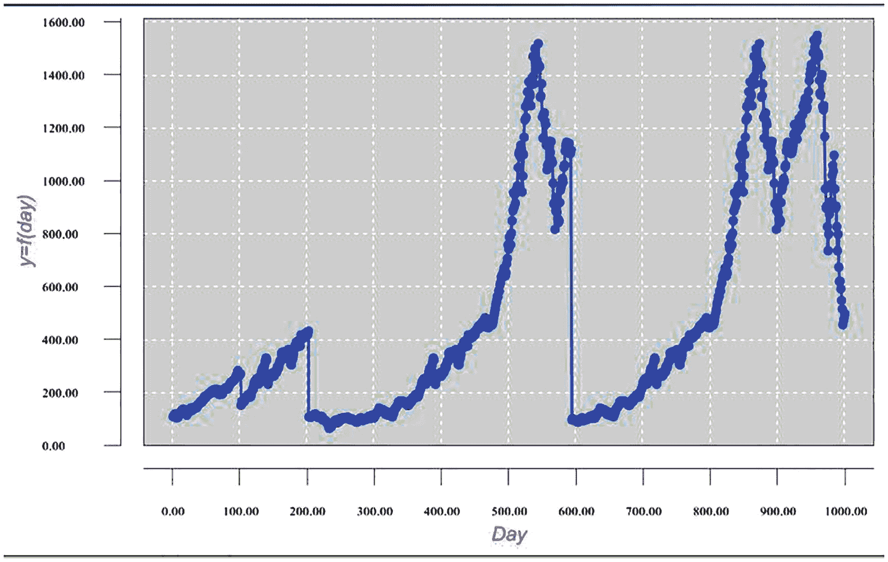
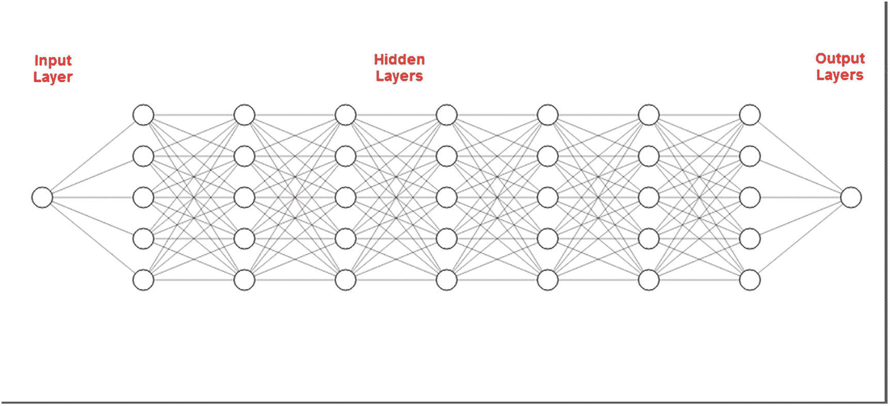
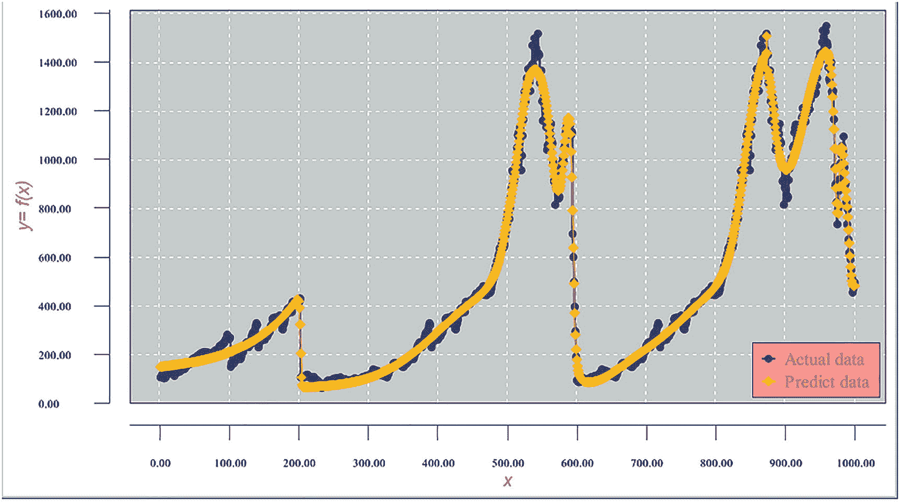
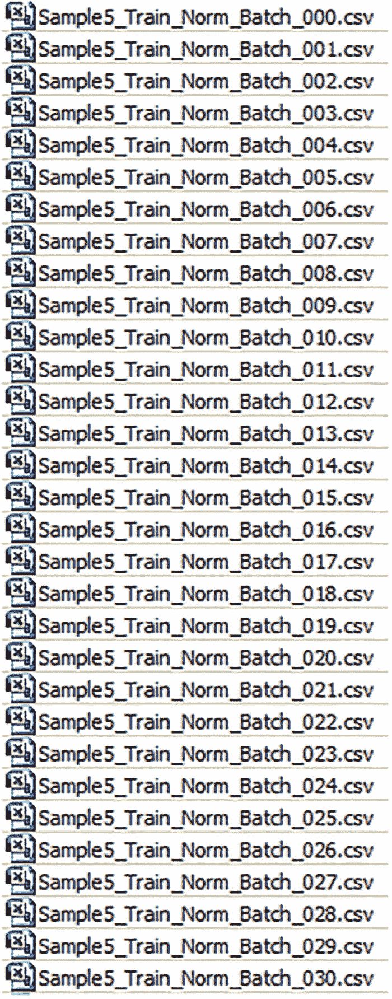
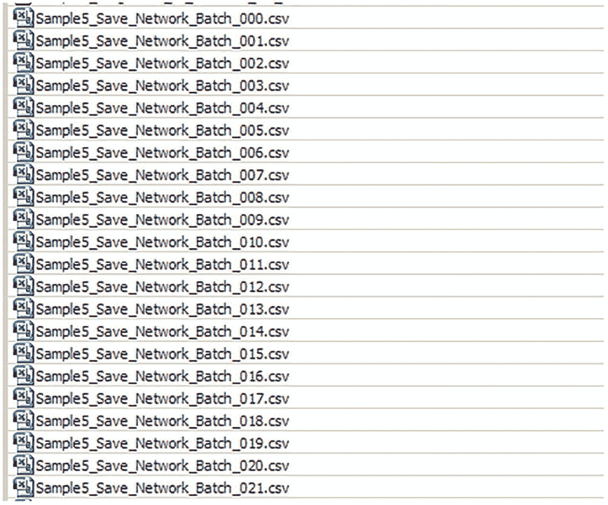
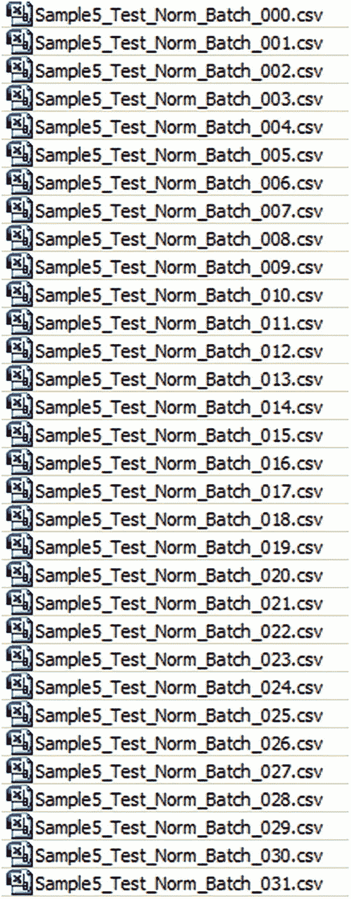
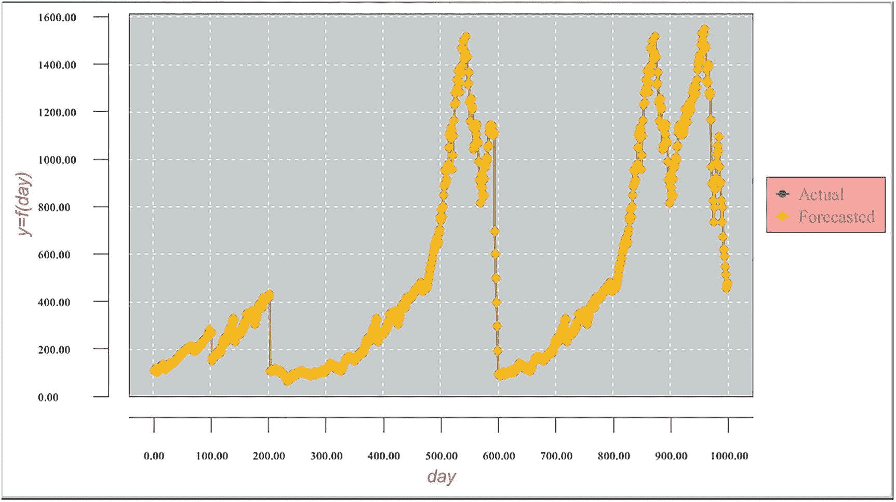
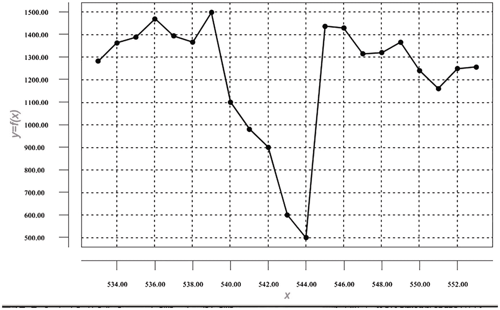
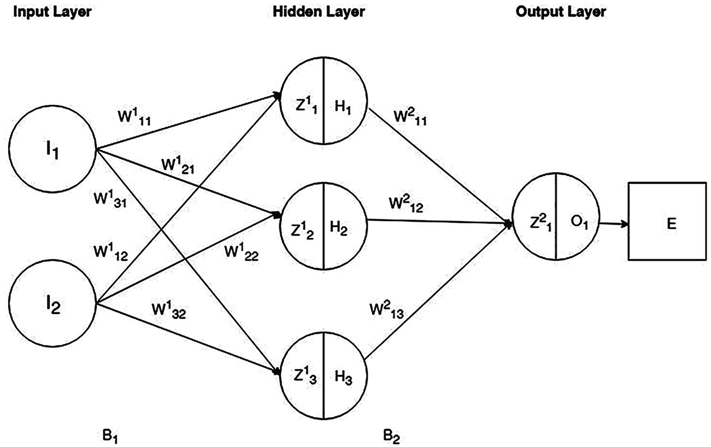
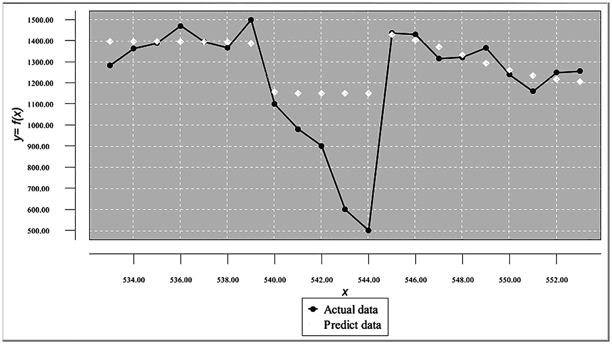

# 8. 近似非连续函数

在本章中，我们将讨论非连续函数的神经网络近似。目前，这对神经网络来说是一个有问题的领域，因为网络处理基于偏函数导数（梯度下降算法）的计算，而在函数值突然跳变或下降的点上，我们计算这些导数的能力是存疑的。我们将在本章后面深入探讨这个问题。本章包含了我开发的解决此问题的方法。

### 示例：逼近非连续函数

我们首先尝试使用传统的神经网络处理来逼近非连续函数（如图 8-1 所示），并展示其结果质量极低，几乎毫无用处。我们将解释其原因，然后介绍一种能够以良好精度逼近此类函数的方法。



图 8-1

非连续函数图表

正如前几章所述，神经网络反向传播利用网络误差函数的偏导数，将输出层计算出的误差重新分配到所有隐藏层神经元。它通过沿函数相反方向移动来重复这一迭代过程，以寻找一个局部（可能是全局）误差函数最小值。由于计算非连续函数的导数/偏导数存在问题，逼近此类函数变得困难重重。

本示例的函数由其 1000 个点的值给出。我们尝试使用传统的神经网络反向传播过程来逼近该函数。表 8-1 显示了输入数据集的一个片段。

表 8-1

输入数据集片段

| `xPoint` | `yValue` |   | `xPoint` | `yValue` |   | `xPoint` | `yValue` |

| --- | --- | --- | --- | --- | --- | --- | --- |

| 1 | 107.387 |   | 31 | 137.932 |   | 61 | 199.499 |

| 2 | 110.449 |   | 32 | 140.658 |   | 62 | 210.45 |

| 3 | 116.943 |   | 33 | 144.067 |   | 63 | 206.789 |

| 4 | 118.669 |   | 34 | 141.216 |   | 64 | 208.551 |

| 5 | 108.941 |   | 35 | 141.618 |   | 65 | 210.739 |

| 6 | 103.071 |   | 36 | 142.619 |   | 66 | 206.311 |

| 7 | 110.16 |   | 37 | 149.811 |   | 67 | 210.384 |

| 8 | 104.933 |   | 38 | 151.468 |   | 68 | 197.218 |

| 9 | 114.12 |   | 39 | 156.919 |   | 69 | 192.003 |

| 10 | 118.326 |   | 40 | 159.757 |   | 70 | 207.936 |

| 11 | 118.055 |   | 41 | 163.074 |   | 71 | 208.041 |

| 12 | 125.764 |   | 42 | 160.628 |   | 72 | 204.394 |

| 13 | 128.612 |   | 43 | 168.573 |   | 73 | 194.024 |

| 14 | 132.722 |   | 44 | 163.297 |   | 74 | 193.223 |

| 15 | 132.583 |   | 45 | 168.155 |   | 75 | 205.974 |

| 16 | 136.361 |   | 46 | 175.654 |   | 76 | 206.53 |

| 17 | 134.52 |   | 47 | 180.581 |   | 77 | 209.696 |

| 18 | 132.064 |   | 48 | 184.836 |   | 78 | 209.886 |

| 19 | 129.228 |   | 49 | 178.259 |   | 79 | 217.36 |

| 20 | 121.889 |   | 50 | 185.945 |   | 80 | 217.095 |

| 21 | 113.142 |   | 51 | 187.234 |   | 81 | 216.827 |

| 22 | 125.33 |   | 52 | 188.395 |   | 82 | 212.615 |

| 23 | 124.696 |   | 53 | 192.357 |   | 83 | 219.881 |

| 24 | 125.76 |   | 54 | 196.023 |   | 84 | 223.883 |

| 25 | 131.241 |   | 55 | 193.067 |   | 85 | 227.887 |

| 26 | 136.568 |   | 56 | 200.337 |   | 86 | 236.364 |

| 27 | 140.847 |   | 57 | 197.229 |   | 87 | 236.272 |

| 28 | 139.791 |   | 58 | 201.805 |   | 88 | 238.42 |

| 29 | 131.033 |   | 59 | 206.756 |   | 89 | 241.18 |

| 30 | 136.216 |   | 60 | 205.89 |   | 90 | 242.341 |

该数据集需要在区间[-1, 1]上进行归一化。表 8-2 显示了归一化后输入数据集的一个片段。

表 8-2

归一化输入数据集片段

| `xPoint` | `yValue` |   | `xPoint` | `yValue` |   | `xPoint` | `yValue` |

| --- | --- | --- | --- | --- | --- | --- | --- |

| -1 | -0.93846 |   | -0.93994 | -0.89879 |   | -0.87988 | -0.81883 |

| -0.998 | -0.93448 |   | -0.93794 | -0.89525 |   | -0.87788 | -0.80461 |

| -0.996 | -0.92605 |   | -0.93594 | -0.89082 |   | -0.87588 | -0.80936 |

| -0.99399 | -0.92381 |   | -0.93393 | -0.89452 |   | -0.87387 | -0.80708 |

| -0.99199 | -0.93644 |   | -0.93193 | -0.894 |   | -0.87187 | -0.80424 |

| -0.98999 | -0.94406 |   | -0.92993 | -0.8927 |   | -0.86987 | -0.80999 |

| -0.98799 | -0.93486 |   | -0.92793 | -0.88336 |   | -0.86787 | -0.8047 |

| -0.98599 | -0.94165 |   | -0.92593 | -0.88121 |   | -0.86587 | -0.82179 |

| -0.98398 | -0.92971 |   | -0.92392 | -0.87413 |   | -0.86386 | -0.82857 |

| -0.98198 | -0.92425 |   | -0.92192 | -0.87045 |   | -0.86186 | -0.80788 |

| -0.97998 | -0.9246 |   | -0.91992 | -0.86614 |   | -0.85986 | -0.80774 |

| -0.97798 | -0.91459 |   | -0.91792 | -0.86931 |   | -0.85786 | -0.81248 |

| -0.97598 | -0.91089 |   | -0.91592 | -0.859 |   | -0.85586 | -0.82594 |

| -0.97397 | -0.90556 |   | -0.91391 | -0.86585 |   | -0.85385 | -0.82698 |

| -0.97197 | -0.90574 |   | -0.91191 | -0.85954 |   | -0.85185 | -0.81042 |

| -0.96997 | -0.90083 |   | -0.90991 | -0.8498 |   | -0.84985 | -0.8097 |

| -0.96797 | -0.90322 |   | -0.90791 | -0.8434 |   | -0.84785 | -0.80559 |

| -0.96597 | -0.90641 |   | -0.90591 | -0.83788 |   | -0.84585 | -0.80534 |

| -0.96396 | -0.91009 |   | -0.9039 | -0.84642 |   | -0.84384 | -0.79564 |

| -0.96196 | -0.91962 |   | -0.9019 | -0.83644 |   | -0.84184 | -0.79598 |

| -0.95996 | -0.93098 |   | -0.8999 | -0.83476 |   | -0.83984 | -0.79633 |

| -0.95796 | -0.91516 |   | -0.8979 | -0.83325 |   | -0.83784 | -0.8018 |

| -0.95596 | -0.91598 |   | -0.8959 | -0.82811 |   | -0.83584 | -0.79236 |

| -0.95395 | -0.9146 |   | -0.89389 | -0.82335 |   | -0.83383 | -0.78716 |

| -0.95195 | -0.90748 |   | -0.89189 | -0.82719 |   | -0.83183 | -0.78196 |

| -0.94995 | -0.90056 |   | -0.88989 | -0.81774 |   | -0.82983 | -0.77096 |

| -0.94795 | -0.895 |   | -0.88789 | -0.82178 |   | -0.82783 | -0.77108 |

| -0.94595 | -0.89638 |   | -0.88589 | -0.81584 |   | -0.82583 | -0.76829 |

| -0.94394 | -0.90775 |   | -0.88388 | -0.80941 |   | -0.82382 | -0.7647 |

| -0.94194 | -0.90102 |   | -0.88188 | -0.81053 |   | -0.82182 | -0.76319 |

### 网络架构

本示例的网络由一个输入层（包含单个神经元）、七个隐藏层（每层五个神经元）和一个输出层（包含单个神经元）组成。见图 8-2。



图 8-2

网络架构

### 程序代码

代码清单 8-1 展示了程序代码。

```java
// =============================================================
// 近似非连续函数，其值在 999 个点上给出。输入文件已归一化。
// =============================================================
package sample5;

import java.io.BufferedReader;
import java.io.File;
import java.io.FileInputStream;
import java.io.PrintWriter;
import java.io.FileNotFoundException;
import java.io.FileReader;
import java.io.FileWriter;
import java.io.IOException;
import java.io.InputStream;
import java.nio.file.*;
import java.util.Properties;
import java.awt.Color;
import java.awt.Font;
import java.io.BufferedReader;
import java.text DateFormat;
import java.text.ParseException;
import java.text.SimpleDateFormat;
import java.time.LocalDate;
import java.time.Month;
import java.time.ZoneId;
import java.util.ArrayList;
import java.util.Calendar;
import java.util.Date;
import java.util.List;
import java.util.Locale;
import java.util.Properties;
import org.encog.Encog;
import org.encog.engine.network.activation.ActivationTANH;
import org.encog.engine.network.activation.ActivationReLU;
import org.encog.ml.data.MLData;
import org.encog.ml.data.MLDataPair;
import org.encog.ml.data.MLDataSet;
import org.encog.ml.data.buffer.MemoryDataLoader;
import org.encog.ml.data.buffer.codec.CSVDataCODEC;
import org.encog.ml.data.buffer.codec.DataSetCODEC;
import org.encog.neural.networks.BasicNetwork;
import org.encog.neural.networks.layers.BasicLayer;
import org.encog.neural.networks.training.propagation.resilient.ResilientPropagation;
import org.encog.persist.EncogDirectoryPersistence;
import org.encog.util.csv.CSVFormat;
import org.knowm.xchart.SwingWrapper;
import org.knowm.xchart.XYChart;
import org.knowm.xchart.XYChartBuilder;
import org.knowm.xchart.XYSeries;
import org.knowm.xchart.demo.charts.ExampleChart;
import org.knowm.xchart.style.Styler.LegendPosition;
import org.knowm.xchart.style.colors.ChartColor;
import org.knowm.xchart.style.colors.XChartSeriesColors;
import org.knowm.xchart.style.lines.SeriesLines;
import org.knowm.xchart.style.markers.SeriesMarkers;
import org.knowm.xchart.BitmapEncoder;
import org.knowm.xchart.BitmapEncoder.BitmapFormat;
import org.knowm.xchart.QuickChart;
import org.knowm.xchart.SwingWrapper;

public class Sample5 implements ExampleChart
{
    // 归一化区间
    static double Nh =  1;
    static double Nl = -1;
    // 第一列
    static double minXPointDl = 1.00;
    static double maxXPointDh = 1000.00;
    // 第二列 - 目标数据
    static double minTargetValueDl = 60.00;
    static double maxTargetValueDh = 1600.00;
    static double doublePointNumber = 0.00;
    static int intPointNumber = 0;
    static InputStream input = null;
    static double[] arrPrices = new double[2500];
    static double normInputXPointValue = 0.00;
    static double normPredictXPointValue = 0.00;
    static double normTargetXPointValue = 0.00;
    static double normDifferencePerc = 0.00;
    static double returnCode = 0.00;
    static double denormInputXPointValue = 0.00;
    static double denormPredictXPointValue = 0.00;
    static double denormTargetXPointValue = 0.00;
    static double valueDifference = 0.00;
    static int numberOfInputNeurons;
    static int numberOfOutputNeurons;
    static int intNumberOfRecordsInTestFile;
    static String trainFileName;
    static String priceFileName;
    static String testFileName;
    static String chartTrainFileName;
    static String chartTestFileName;
    static String networkFileName;
    static int workingMode;
    static String cvsSplitBy = ",";
    static List xData = new ArrayList();
    static List yData1 = new ArrayList();
    static List yData2 = new ArrayList();
    static XYChart Chart;

    @Override
    public XYChart getChart()
    {
        // 创建图表
        Chart = new XYChartBuilder().width(900).height(500).title(getClass().getSimpleName()).xAxisTitle("x").yAxisTitle("y= f(x)").build();
        // 自定义图表
        Chart.getStyler().setPlotBackgroundColor(ChartColor.getAWTColor(ChartColor.GREY));
        Chart.getStyler().setPlotGridLinesColor(new Color(255, 255, 255));
        Chart.getStyler().setChartBackgroundColor(Color.WHITE);
        Chart.getStyler().setLegendBackgroundColor(Color.PINK);
        Chart.getStyler().setChartFontColor(Color.MAGENTA);
        Chart.getStyler().setChartTitleBoxBackgroundColor(new Color(0, 222, 0));
        Chart.getStyler().setChartTitleBoxVisible(true);
        Chart.getStyler().setChartTitleBoxBorderColor(Color.BLACK);
        Chart.getStyler().setPlotGridLinesVisible(true);
        Chart.getStyler().setAxisTickPadding(20);
        Chart.getStyler().setAxisTickMarkLength(15);
        Chart.getStyler().setPlotMargin(20);
        Chart.getStyler().setChartTitleVisible(false);
        Chart.getStyler().setChartTitleFont(new Font(Font.MONOSPACED, Font.BOLD, 24));
        Chart.getStyler().setLegendFont(new Font(Font.SERIF, Font.PLAIN, 18));
        Chart.getStyler().setLegendPosition(LegendPosition.InsideSE);
        Chart.getStyler().setLegendSeriesLineLength(12);
        Chart.getStyler().setAxisTitleFont(new Font(Font.SANS_SERIF, Font.ITALIC, 18));
        Chart.getStyler().setAxisTickLabelsFont(new Font(Font.SERIF, Font.PLAIN, 11));
        Chart.getStyler().setDatePattern("yyyy-MM");
        Chart.getStyler().setDecimalPattern("#0.00");
        // 配置
        // 训练模式
        workingMode = 1;
        trainFileName = "C:/Book_Examples/Sample5_Train_Norm.csv";
        chartTrainFileName = "XYLine_Sample5_Train_Chart_Results";
        // 测试模式
        //workingMode = 2;
        //intNumberOfRecordsInTestFile = 3;
        //testFileName = "C:/Book_Examples/Sample2_Norm.csv";
        //chartTestFileName = "XYLine_Test_Results_Chart";
        // 配置数据的公共部分
        networkFileName = "C:/Book_Examples/Sample";
```

```markdown
## 训练过程的代码片段

训练方法在循环中被调用，直到成功清除误差限制。我们加载归一化后的训练文件，然后创建一个网络，包含一个输入层（一个神经元）、七个隐藏层（每层五个神经元）以及输出层（一个神经元）。接下来，我们通过遍历训练周期来训练网络，直到网络误差低于误差限制。此时，我们退出循环。网络训练完成后，将其保存到磁盘（供测试方法使用）。清单 8-2 展示了训练方法的一个片段。

```java
// 将训练 CSV 文件加载到内存中
MLDataSet trainingSet =
    loadCSV2Memory(trainFileName, numberOfInputNeurons, numberOfOutputNeurons,
    true, CSVFormat.ENGLISH, false);
// 创建一个神经网络
BasicNetwork network = new BasicNetwork();
// 输入层
network.addLayer(new BasicLayer(null, true, 1));
// 隐藏层
network.addLayer(new BasicLayer(new ActivationTANH(), true, 5));
network.addLayer(new BasicLayer(new ActivationTANH(), true, 5));
network.addLayer(new BasicLayer(new ActivationTANH(), true, 5));
network.addLayer(new BasicLayer(new ActivationTANH(), true, 5));
network.addLayer(new BasicLayer(new ActivationTANH(), true, 5));
network.addLayer(new BasicLayer(new ActivationTANH(), true, 5));
network.addLayer(new BasicLayer(new ActivationTANH(), true, 5));
// 输出层
network.addLayer(new BasicLayer(new ActivationTANH(), false, 1));
network.getStructure().finalizeStructure();
network.reset();
// 训练神经网络
final ResilientPropagation train = new ResilientPropagation(network, trainingSet);
int epoch = 1;
do {
    train.iteration();
    System.out.println("Epoch #" + epoch + " Error:" + train.getError());
    epoch++;
    if (epoch >= 11000 && network.calculateError(trainingSet) > 0.00225) {
        returnCode = 1;
        System.out.println("Try again");
        return returnCode;
    }
} while (train.getError() > 0.0022);
// 保存网络文件
EncogDirectoryPersistence.saveObject(new File(networkFileName), network);
```

清单 8-2 训练方法代码片段

接下来，我们遍历成对的数据集，从网络中获取每条记录的输入值、实际值和预测值。然后，我们对获取的值进行反归一化处理，将其记录到日志中，并填充图表数据。

```java
int m = 0;
double xPointer = 0.00;
for (MLDataPair pair : trainingSet) {
    m++;
    xPointer++;
    final MLData output = network.compute(pair.getInput());
    MLData inputData = pair.getInput();
    MLData actualData = pair.getIdeal();
    MLData predictData = network.compute(inputData);
    // 计算并打印结果
    normInputXPointValue = inputData.getData(0);
    normTargetXPointValue = actualData.getData(0);
    normPredictXPointValue = predictData.getData(0);
    denormInputXPointValue = ((minXPointDl - maxXPointDh) * normInputXPointValue -
        Nh * minXPointDl + maxXPointDh * Nl) / (Nl - Nh);
    denormTargetXPointValue = ((minTargetValueDl - maxTargetValueDh) * normTargetXPointValue -
        Nh * minTargetValueDl + maxTargetValueDh * Nl) / (Nl - Nh);
    denormPredictXPointValue = ((minTargetValueDl - maxTargetValueDh) * normPredictXPointValue -
        Nh * minTargetValueDl + maxTargetValueDh * Nl) / (Nl - Nh);
    valueDifference =
        Math.abs(((denormTargetXPointValue - denormPredictXPointValue) / denormTargetXPointValue) * 100.00);
    System.out.println("RecordNumber = " + m + "  denormTargetXPointValue = " +
        denormTargetXPointValue + "  denormPredictXPointValue = " + denormPredictXPointValue +
        "  valueDifference = " + valueDifference);
    sumNormDifferencePerc = sumNormDifferencePerc + valueDifference;
    if (valueDifference > maxNormDifferencePerc)
        maxNormDifferencePerc = valueDifference;
    xData.add(xPointer);
    yData1.add(denormTargetXPointValue);
    yData2.add(denormPredictXPointValue);
}   // 结束成对循环
```

最后，我们计算结果的平均值和最大值，并保存图表文件。

```java
XYSeries series1 = Chart.addSeries("实际数据", xData, yData1);
XYSeries series2 = Chart.addSeries("预测数据", xData, yData2);
series1.setLineColor(XChartSeriesColors.BLUE);
series2.setMarkerColor(Color.ORANGE);
series1.setLineStyle(SeriesLines.SOLID);
series2.setLineStyle(SeriesLines.SOLID);
try {
    // 保存图表图像
    BitmapEncoder.saveBitmapWithDPI(Chart, chartTrainFileName, BitmapFormat.JPG, 100);
    System.out.println("训练图表文件已保存");
} catch (IOException ex) {
    ex.printStackTrace();
    System.exit(3);
}
// 保存这个训练好的网络
EncogDirectoryPersistence.saveObject(new File(networkFileName), network);
System.out.println("训练网络已保存");
averNormDifferencePerc = sumNormDifferencePerc / 1000.00;
System.out.println(" ");
System.out.println("maxNormDifferencePerc = " + maxNormDifferencePerc + "
averNormDifferencePerc = " + averNormDifferencePerc);
returnCode = 0.00;
return returnCode;
}   // 方法结束
```

#### 不理想的训练结果

清单 8-3 展示了训练结果的末尾片段。

```plaintext
RecordNumber =  983  TargetValue = 1036.19  PredictedValue = 930.03102  DiffPerc = 10.24513
RecordNumber =  984  TargetValue = 1095.63  PredictedValue = 915.36958  DiffPerc = 16.45267
RecordNumber =  985  TargetValue = 968.75   PredictedValue = 892.96942  DiffPerc = 7.822511
RecordNumber =  986  TargetValue = 896.24   PredictedValue = 863.64775  DiffPerc = 3.636554
RecordNumber =  987  TargetValue = 903.25   PredictedValue = 829.19287  DiffPerc = 8.198962
RecordNumber =  988  TargetValue = 825.88   PredictedValue = 791.96691  DiffPerc = 4.106298
RecordNumber =  989  TargetValue = 735.09   PredictedValue = 754.34279  DiffPerc = 2.619107
RecordNumber =  990  TargetValue = 797.87   PredictedValue = 718.23458  DiffPerc = 9.981002
RecordNumber =  991  TargetValue = 672.81   PredictedValue = 684.88576  DiffPerc = 1.794825
RecordNumber =  992  TargetValue = 619.14   PredictedValue = 654.90309  DiffPerc = 5.776254
RecordNumber =  993  TargetValue = 619.32   PredictedValue = 628.42044  DiffPerc = 1.469424
RecordNumber =  994  TargetValue = 590.47   PredictedValue = 605.28210  DiffPerc = 2.508528
RecordNumber =  995  TargetValue = 547.28   PredictedValue = 585.18808  DiffPerc = 6.926634
RecordNumber =  996  TargetValue = 514.62   PredictedValue = 567.78844  DiffPerc = 10.33159
RecordNumber =  997  TargetValue = 455.4    PredictedValue = 552.73603  DiffPerc = 21.37374
RecordNumber =  998  TargetValue = 470.43   PredictedValue = 539.71156  DiffPerc = 14.72728
RecordNumber =  999  TargetValue = 480.28   PredictedValue = 528.43269  DiffPerc = 10.02596
RecordNumber = 1000  TargetValue = 496.77   PredictedValue = 518.65485  DiffPerc = 4.405429
maxNormDifferencePerc = 97.69386964911284
averNormDifferencePerc = 7.232624870097155
```

清单 8-3 训练结果的末尾片段

这种近似的质量非常低。即使网络优化得很好，所有记录的平均近似误差也超过 8%，而最大近似误差（近似效果最差的记录）则超过 97%。这样的函数近似显然无法使用。图 8-3 展示了近似结果的图表。



图 8-3 低质量的函数近似

我们事先知道这种近似方法行不通，并在示例开始时就已经说明。然而，我们特意这样做是为了说明问题。现在，我们将展示如何使用神经网络成功近似这个非连续函数。

这个函数近似的问题源于函数的拓扑结构（函数值在某些点上的突然跳跃或下降）。我们将把输入文件拆分成一系列单记录输入文件，称之为*微批次*。通过这样做，我们消除了复杂函数拓扑结构的负面影响。拆分数据集后，每条记录将独立存在，不再与前后函数值相关联。将输入文件拆分成微批次会创建 1,000 个输入文件，网络会逐个处理这些文件。我们将每个训练好的网络与其所代表的记录关联起来。在验证和测试过程中，逻辑会找到与相应测试或验证记录的第一个字段最匹配的训练好的网络。

### 使用微批次方法近似非连续函数

让我们将归一化的训练数据集拆分成微批次。每个微批次数据集应包含标签记录和来自原始文件的一条待处理记录。表 8-3 展示了微批次数据集的样子。

| xPoint | 函数值 |
| --- | --- |
| -1 | -0.938458442 |

我们编写了一个简单的程序来将归一化的训练数据集拆分成微批次。执行该程序后，我们创建了 999 个微批次数据集（编号从 0 到 998）。图 8-4 展示了微批次数据集列表的一个片段。



图 8-4 归一化训练微批次数据集片段

这组微批次数据集现在是我们训练网络的输入。

#### 微批次处理的程序代码

清单 8-4 展示了程序代码。
```
```

```java
package sample5_microbatches;

import java.io.BufferedReader;
import java.io.File;
import java.io.FileInputStream;
import java.io.PrintWriter;
import java.io.FileNotFoundException;
import java.io.FileReader;
import java.io.FileWriter;
import java.io.IOException;
import java.io.InputStream;
import java.nio.file.*;
import java.util.Properties;
import java.time.YearMonth;
import java.awt.Color;
import java.awt.Font;
import java.io.BufferedReader;
import java.time.Month;
import java.time.ZoneId;
import java.util.ArrayList;
import java.util.Calendar;
import java.util.List;
import java.util.Locale;
import java.util.Properties;
import org.encog.Encog;
import org.encog.engine.network.activation.ActivationTANH;
import org.encog.engine.network.activation.ActivationReLU;
import org.encog.ml.data.MLData;
import org.encog.ml.data.MLDataPair;
import org.encog.ml.data.MLDataSet;
import org.encog.ml.data.buffer.MemoryDataLoader;
import org.encog.ml.data.buffer.codec.CSVDataCODEC;
import org.encog.ml.data.buffer.codec.DataSetCODEC;
import org.encog.neural.networks.BasicNetwork;
import org.encog.neural.networks.layers.BasicLayer;
import org.encog.neural.networks.training.propagation.resilient.ResilientPropagation;
import org.encog.persist.EncogDirectoryPersistence;
import org.encog.util.csv.CSVFormat;
import org.knowm.xchart.SwingWrapper;
import org.knowm.xchart.XYChart;
import org.knowm.xchart.XYChartBuilder;
import org.knowm.xchart.XYSeries;
import org.knowm.xchart.demo.charts.ExampleChart;
import org.knowm.xchart.style.Styler.LegendPosition;
import org.knowm.xchart.style.colors.ChartColor;
import org.knowm.xchart.style.colors.XChartSeriesColors;
import org.knowm.xchart.style.lines.SeriesLines;
import org.knowm.xchart.style.markers.SeriesMarkers;
import org.knowm.xchart.BitmapEncoder;
import org.knowm.xchart.BitmapEncoder.BitmapFormat;
import org.knowm.xchart.QuickChart;
import org.knowm.xchart.SwingWrapper;

public class Sample5_Microbatches implements ExampleChart
{
    // 归一化参数
    static double Nh =  1;
    static double Nl = -1;
    static double inputDayDh = 1000.00;
    static double inputDayDl = 1.00;
    static double targetFunctValueDiffPercDh = 1600.00;
    static double targetFunctValueDiffPercDl = 60.00;
    static String cvsSplitBy = ",";
    static Properties prop = null;
    static String strWorkingMode;
    static String strNumberOfBatchesToProcess;
    static String strTrainFileNameBase;
    static String strTestFileNameBase;
    static String strSaveTrainNetworkFileBase;
    static String strSaveTestNetworkFileBase;
    static String strValidateFileName;
    static String strTrainChartFileName;
    static String strTestChartFileName;
    static String strFunctValueTrainFile;
    static String strFunctValueTestFile;
    static int intDayNumber;
    static double doubleDayNumber;
    static int intWorkingMode;
    static int numberOfTrainBatchesToProcess;
    static int numberOfTestBatchesToProcess;
    static int intNumberOfRecordsInTrainFile;
    static int intNumberOfRecordsInTestFile;
    static int intNumberOfRowsInBatches;
    static int intInputNeuronNumber;
    static int intOutputNeuronNumber;
    static String strOutputFileName;
    static String strSaveNetworkFileName;
    static String strDaysTrainFileName;
    static XYChart Chart;
    static String iString;
    static double inputFunctValueFromFile;
    static double targetToPredictFunctValueDiff;
    static int[] returnCodes  = new int[3];
    static List xData = new ArrayList();
    static List yData1 = new ArrayList();
    static List yData2 = new ArrayList();
    static double[] DaysyearDayTraining = new double[1200];
    static String[] strTrainingFileNames = new String[1200];
    static String[] strTestingFileNames = new String[1200];
    static String[] strSaveTrainNetworkFileNames = new String[1200];
    static double[] linkToSaveNetworkDayKeys = new double[1200];
    static double[] linkToSaveNetworkTargetFunctValueKeys = new double[1200];
    static double[] arrTrainFunctValues = new double[1200];
    static double[] arrTestFunctValues = new double[1200];

    @Override
    public XYChart getChart()
    {
        // 创建图表
        Chart = new XYChartBuilder().width(900).height(500).title(getClass().getSimpleName()).xAxisTitle("day").yAxisTitle("y=f(day)").build();
        // 自定义图表
        Chart.getStyler().setPlotBackgroundColor(ChartColor.getAWTColor(ChartColor.GREY));
        Chart.getStyler().setPlotGridLinesColor(new Color(255, 255, 255));
        Chart.getStyler().setChartBackgroundColor(Color.WHITE);
        Chart.getStyler().setLegendBackgroundColor(Color.PINK);
        Chart.getStyler().setChartFontColor(Color.MAGENTA);
        Chart.getStyler().setChartTitleBoxBackgroundColor(new Color(0, 222, 0));
        Chart.getStyler().setChartTitleBoxVisible(true);
        Chart.getStyler().setChartTitleBoxBorderColor(Color.BLACK);
        Chart.getStyler().setPlotGridLinesVisible(true);
        Chart.getStyler().setAxisTickPadding(20);
        Chart.getStyler().setAxisTickMarkLength(15);
        Chart.getStyler().setPlotMargin(20);
        Chart.getStyler().setChartTitleVisible(false);
        Chart.getStyler().setChartTitleFont(new Font(Font.MONOSPACED,Font.BOLD, 24));
        Chart.getStyler().setLegendFont(new Font(Font.SERIF, Font.PLAIN, 18));
        Chart.getStyler().setLegendPosition(LegendPosition.OutsideE);
        Chart.getStyler().setLegendSeriesLineLength(12);
        Chart.getStyler().setAxisTitleFont(new Font(Font.SANS_SERIF,Font.ITALIC, 18));
        Chart.getStyler().setAxisTickLabelsFont(new Font(Font.SERIF,Font.PLAIN, 11));
        Chart.getStyler().setDecimalPattern("#0.00");
        // 配置数据
        intWorkingMode = 0;
        numberOfTrainBatchesToProcess = 1000;
        numberOfTestBatchesToProcess = 999;
        intNumberOfRowsInBatches = 1;
        intInputNeuronNumber = 1;
        intOutputNeuronNumber = 1;
        strTrainFileNameBase = "C:/My_Neural_Network_Book/Temp_Files/Sample5_Train_Norm_Batch_";
        strTestFileNameBase = "C:/My_Neural_Network_Book/Temp_Files/Sample5_Test_Norm_Batch_";
        strSaveTrainNetworkFileBase =
                "C:/Book_Examples/Sample5_Save_Network_Batch_";
        strTrainChartFileName =
                "C:/Book_Examples/Sample5_Chart_Train_File_Microbatch.jpg";
        strTestChartFileName =
                "C:/Book_Examples/Sample5_Chart_Test_File_Microbatch.jpg";
        // 生成训练批次文件名及对应的 SaveNetwork 文件名
        intDayNumber = -1;  // 图表的天数编号
        for (int i = 0; i < 10; i++)
        {
            intDayNumber = i;
            // 结束训练逻辑
        }
        if (intWorkingMode == 1)
        {
            // 测试模式
            File file2 = new File(strTestChartFileName);
            if(file2.exists())
                file2.delete();
            loadAndTestNetwork();
            // 结束测试逻辑
        }
        Encog.getInstance().shutdown();
        return Chart;
    }

    public static MLDataSet loadCSV2Memory(String filename, int input, int ideal, boolean headers, CSVFormat format, boolean significance)
    {
        DataSetCODEC codec = new CSVDataCODEC(new File(filename), format, headers, input, ideal,
                significance);
        MemoryDataLoader load = new MemoryDataLoader(codec);
        MLDataSet dataset = load.external2Memory();
        return dataset;
    }

    public static void main(String[] args)
    {
        ExampleChart exampleChart = new Sample5_Microbatches();
        XYChart Chart = exampleChart.getChart();
        new SwingWrapper(Chart).displayChart();
    }

    static public int[] trainBatches(int paramErrorCode,
                                     int paramBatchNumber, int paramDayNumber)
    {
        int rBatchNumber;
        double targetToPredictFunctValueDiff = 0;
        double maxGlobalResultDiff = 0.00;
        double averGlobalResultDiff = 0.00;
        double sumGlobalResultDiff = 0.00;
        double normInputFunctValueDiffPercFromRecord = 0.00;
        double normTargetFunctValue1 = 0.00;
        double normPredictFunctValue1 = 0.00;
        double denormInputDayFromRecord1;
        double denormInputFunctValueDiffPercFromRecord;
        double denormTargetFunctValue1 = 0.00;
        double denormAverPredictFunctValue11 = 0.00;
        BasicNetwork network1 = new BasicNetwork();
        network1.addLayer(new BasicLayer(null, true, intInputNeuronNumber));
        network1.addLayer(new BasicLayer(new ActivationTANH(), true, 7));
        network1.addLayer(new BasicLayer(new ActivationTANH(), true, 7));
        network1.addLayer(new BasicLayer(new ActivationTANH(), true, 7));
        network1.addLayer(new BasicLayer(new ActivationTANH(), true, 7));
        network1.addLayer(new BasicLayer(new ActivationTANH(), true, 7));
        network1.addLayer(new

此程序中的处理逻辑大不相同。让我们从 `getChart()` 方法开始。除了 XChart 包所需的常规语句外，我们在此处为训练微批次和保存网络文件生成名称。生成的微批次文件名必须与我们将归一化训练文件拆分为微批次时，磁盘上正在准备的微批次文件名相匹配。

保存的网络文件的名称具有相应的结构。这些生成的名称将被训练方法用于将对应于微批次的已训练网络保存到磁盘。生成的名称保存在两个数组中，分别称为 `strTrainingFileNames[]` 和 `strSaveTrainNetworkFileNames[]`。

图 8-5 显示了生成的已保存网络文件的一个片段。



图 8-5

生成的已保存网络文件片段

接下来，我们生成并填充两个数组，分别称为 `linkToSaveNetworkDayKeys[]` 和 `linkToSaveNetworkTargetFunctValueKeys[]`。对于每个连续的天数，我们用训练微批次记录中的字段 1 值填充 `linkToSaveNetworkDayKeys[]` 数组。我们用磁盘上相应已保存网络文件的名称填充 `linkToSaveNetworkTargetFunctValueKeys[]` 数组。因此，这两个数组保存了微批次数据集与相应已保存网络数据集之间的链接。

该程序还会生成测试微批次文件的名称，类似于为训练微批次文件生成的名称。当所有这些完成后，我们调用 `loadTrainFunctValueFileInMemory` 方法，该方法将训练文件值加载到内存中。

#### `getChart()` 方法的程序代码

清单 8-5 展示了 `getChart()` 方法的程序代码。

```
public XYChart getChart()
{
// 创建图表
Chart = new XYChartBuilder().width(900).height(500).title(getClass().
getSimpleName()).xAxisTitle("day").yAxisTitle("y=f(day)").build();
// 自定义图表
Chart.getStyler().setPlotBackgroundColor(ChartColor.getAWTColor(ChartColor.GREY));
Chart.getStyler().setPlotGridLinesColor(new Color(255, 255, 255));
Chart.getStyler().setChartBackgroundColor(Color.WHITE);
Chart.getStyler().setLegendBackgroundColor(Color.PINK);
Chart.getStyler().setChartFontColor(Color.MAGENTA);
Chart.getStyler().setChartTitleBoxBackgroundColor(new Color(0, 222, 0));
Chart.getStyler().setChartTitleBoxVisible(true);
Chart.getStyler().setChartTitleBoxBorderColor(Color.BLACK);
Chart.getStyler().setPlotGridLinesVisible(true);
Chart.getStyler().setAxisTickPadding(20);
Chart.getStyler().setAxisTickMarkLength(15);
Chart.getStyler().setPlotMargin(20);
Chart.getStyler().setChartTitleVisible(false);
Chart.getStyler().setChartTitleFont(new Font(Font.MONOSPACED,Font.BOLD, 24));
Chart.getStyler().setLegendFont(new Font(Font.SERIF, Font.PLAIN, 18));
// Chart.getStyler().setLegendPosition(LegendPosition.InsideSE);
Chart.getStyler().setLegendPosition(LegendPosition.OutsideE);
Chart.getStyler().setLegendSeriesLineLength(12);
Chart.getStyler().setAxisTitleFont(new Font(Font.SANS_SERIF,Font.ITALIC, 18));
Chart.getStyler().setAxisTickLabelsFont(new Font(Font.SERIF,Font.PLAIN, 11));
//Chart.getStyler().setDayPattern("yyyy-MM");
Chart.getStyler().setDecimalPattern("#0.00");
// 配置数据
// 用于训练
//intWorkingMode = 0;
// 用于测试
intWorkingMode = 1;
// 通用配置数据
intNumberOfTrainBatchesToProcess = 1000;
intNumberOfTestBatchesToProcess = 1000;
intNumberOfRecordsInTestFile = 999;
intNumberOfRowsInBatches = 1;
intInputNeuronNumber = 1;
intOutputNeuronNumber = 1;
strTrainFileNameBase = "C:/Book_Examples/Sample5_Train_Norm_Batch_";
strTestFileNameBase = "C:/Book_Examples/Sample5_Test_Norm_Batch_";
strSaveTrainNetworkFileBase = "C:/Book_Examples/Sample5_Save_Network_Batch_";
strTrainChartFileName = "C:/Book_Examples/Sample5_Chart_Train_File_Microbatch.jpg";
strTestChartFileName = "C:/Book_Examples/Sample5_Chart_Test_File_Microbatch.jpg";
strFunctValueTrainFile = "C:/Book_Examples/Sample5_Train_Real.csv";
strFunctValueTestFile = "C:/Book_Examples/Sample5_Test_Real.csv";
// 生成训练微批次文件名和对应的保存网络文件名
intDayNumber = -1;  // 图表的日期编号
for (int i = 0; i = 10 & intDayNumber = 10 & intDayNumber < 100  )
{
strOutputFileName = strTestFileNameBase + "0" +
iString + ".csv";
}
else
{
if (intDayNumber < 10)
{
strOutputFileName = strTestFileNameBase + "00" +
iString + ".csv";
}
else
{
strOutputFileName = strTrainFileNameBase +
iString + ".csv";
}
}
strTestingFileNames[intDayNumber] = strOutputFileName;
}  // 结束 FOR 循环
}   // 结束 IF
}     // 结束 try
catch (IOException io1)
{
io1.printStackTrace();
System.exit(1);
}
// 将函数值文件加载、训练和测试到内存中
loadTrainFunctValueFileInMemory();
清单 8-5
getChart 方法的代码
```

这部分完成后，逻辑会检查是运行训练方法还是测试方法。当 `workingMode` 字段为 1 时，它会在一个循环中调用训练方法（与我们之前所做的方式相同）。但是，由于我们现在有许多微批次训练文件（而不是单个数据集），我们需要扩展 `errorCode` 数组以容纳一个额外的值：微批次编号。

#### 训练方法的代码片段 1

如果在多次迭代后，网络误差仍无法清除误差限制，我们将以 `returnCode` 为 1 退出训练方法。控制权返回到 `getChart()` 方法内部循环调用训练方法的逻辑中。此时，我们需要返回微批次方法被调用时所使用的参数。清单 8-6 展示了训练方法的代码片段 1。

```
if(intWorkingMode == 0)
{
// 训练批次并保存已训练的网络
int paramErrorCode;
int paramBatchNumber;
int paramR;
int paramDayNumber;
int paramS;
File file1 = new File(strTrainChartFileName);
if(file1.exists())
file1.delete();
returnCodes[0] = 0;    // 清除错误代码
returnCodes[1] = 0;    // 将初始批次编号设置为 0;
returnCodes[2] = 0;    // 将初始日期编号设置为 0;
do
{
paramErrorCode = returnCodes[0];
paramBatchNumber = returnCodes[1];
paramDayNumber = returnCodes[2];
returnCodes =
trainBatches(paramErrorCode,paramBatchNumber,paramDayNumber);
} while (returnCodes[0] > 0);
}   // 结束训练逻辑
else
{
// 加载并测试网络逻辑
File file2 = new File(strTestChartFileName);
if(file2.exists())
file2.delete();
loadAndTestNetwork();
// 结束测试逻辑
}
Encog.getInstance().shutdown();
return Chart;
}  // 结束方法
清单 8-6
训练方法的代码片段 1
```

#### 训练方法的代码片段 2

此处，除了处理微批次所涉及的逻辑外，大部分代码对你来说应该都很熟悉。首先，我们构建网络。接着，我们循环遍历微批次（请记住，这里有许多训练微批次文件，而不是我们之前处理的单个训练数据集）。在循环内部，我们将训练微批次文件加载到内存中，然后使用当前的微批次文件训练网络。

当网络训练完成后，我们将其保存到磁盘，文件名使用 `linkToSaveNetworkDayKeys` 数组中与当前处理的微批次文件对应的名称。遍历配对数据集时，我们检索每个微批次的输入值、实际值和预测值，对它们进行反归一化，并将结果作为训练日志打印出来。

在网络训练循环中，当经过多次迭代后，网络误差仍无法低于误差限值时，我们将 `returnCode` 设置为 1 并退出训练方法。控制权将返回到循环调用训练方法的逻辑中。当我们退出训练方法时，现在会设置三个 `returnCode` 值：`returnCode`、微批次编号和天数编号。这有助于循环调用训练方法的逻辑保持在相同的微批次和处理天数内。我们还会填充图表元素的结果。最后，我们添加图表数据，计算所有微批次的平均误差和最大误差，将结果打印为日志文件，并保存图表文件。清单 8-7 展示了训练方法的代码片段 2。

```markdown
## 重要规则

- 不要修改正文内容的语义
- 不要删减有价值的信息
- 不要重复输出原文，也不要添加额外信息，只输出排版后的文本

## 要排版的文本

```
// 构建网络
`BasicNetwork` `network` = new `BasicNetwork`;();
// 输入层
`network`.addLayer(new `BasicLayer`(null, true, `intInputNeuronNumber`));
// 隐藏层
`network`.addLayer(new `BasicLayer`(new `ActivationTANH`(), true, 5));
`network`.addLayer(new `BasicLayer`(new `ActivationTANH`(), true, 5));
`network`.addLayer(new `BasicLayer`(new `ActivationTANH`(), true, 5));
`network`.addLayer(new `BasicLayer`(new `ActivationTANH`(), true, 5));
`network`.addLayer(new `BasicLayer`(new `ActivationTANH`(), true, 5));
`network`.addLayer(new `BasicLayer`(new `ActivationTANH`(), true, 5));
`network`.addLayer(new `BasicLayer`(new `ActivationTANH`(), true, 5));
`network`.addLayer(new `BasicLayer`(new `ActivationTANH`(), true, 5));
// 输出层
`network`.addLayer(new `BasicLayer`(new `ActivationTANH`(), false, `intOutputNeuronNumber`));
`network`.getStructure().finalizeStructure();
`network`.reset();
`maxGlobalResultDiff` = 0.00;
`averGlobalResultDiff` = 0.00;
`sumGlobalResultDiff` = 0.00;
// 循环遍历微批次
`intDayNumber` = `paramDayNumber`;  // 图表的天数编号
for (`rBatchNumber` = `paramBatchNumber`; `rBatchNumber` = 500 && `targetToPredictFunctValueDiff` > 0.0002)
{
    returnCodes[0] = 1;
    returnCodes[1] = `rBatchNumber`;
    returnCodes[2] = `intDayNumber` - 1;
    return returnCodes;
}
} while (`targetToPredictFunctValueDiff` > 0.0002);  // 0.00002
// 保存当前批次的网络
`EncogDirectoryPersistence`.saveObject(new `File`(`strSaveTrainNetworkFileNames[rBatchNumber]`), `network`);
// 获取网络优化后的结果
int `i` = - 1;
for (`MLDataPair` pair: `trainingSet`)
{
    `i`++;
    `MLData` `inputData` = `pair`.getInput();
    `MLData` `actualData` = `pair`.getIdeal();
    `MLData` `predictData` = `network`.compute(`inputData`);
    // 这些值已归一化，因为整个输入都是归一化的
    `normInputFunctValueDiffPercFromRecord` = `inputData`.getData(0);
    `normTargetFunctValue` = `actualData`.getData(0);
    `normPredictFunctValue` = `predictData`.getData(0);
    `denormInputFunctValueDiffPercFromRecord` =
        ((`inputDayDl` - `inputDayDh`)*`normInputFunctValueDiffPercFromRecord` - `Nh`*`inputDayDl` +
         `inputDayDh`*`Nl`)/(`Nl` - `Nh`);
    `denormTargetFunctValue` =
        ((`targetFunctValueDiffPercDl` - `targetFunctValueDiffPercDh`)*`normTargetFunctValue` –
         `Nh`*`targetFunctValueDiffPercDl` + `targetFunctValueDiffPercDh`*`Nl`)/(`Nl` - `Nh`);
    `denormPredictFunctValue` =
        ((`targetFunctValueDiffPercDl` - `targetFunctValueDiffPercDh`)*`normPredictFunctValue` –
         `Nh`*`targetFunctValueDiffPercDl` + `targetFunctValueDiffPercDh`*`Nl`)/(`Nl` - `Nh`);
    `inputFunctValueFromFile` = `arrTrainFunctValues[rBatchNumber]`;
    `targetToPredictFunctValueDiff` =
        (Math.abs(`denormTargetFunctValue` - `denormPredictFunctValue`)/`denormTargetFunctValue`)*100;
    System.out.println("intDayNumber = " + `intDayNumber` + "  targetFunctionValue = " +
                       `denormTargetFunctValue` +
                       "  predictFunctionValue = " + `denormPredictFunctValue` + "  valurDiff = " +
                       `targetToPredictFunctValueDiff`);
    if (`targetToPredictFunctValueDiff` > `maxGlobalResultDiff`)
        `maxGlobalResultDiff` = `targetToPredictFunctValueDiff`;
    `sumGlobalResultDiff` = `sumGlobalResultDiff` + `targetToPredictFunctValueDiff`;
    // 填充图表元素
    double `doubleDayNumber` = (double) `rBatchNumber` + 1;
    `xData`.add(`doubleDayNumber`);
    `yData1`.add(`denormTargetFunctValue`);
    `yData2`.add(`denormPredictFunctValue`);
}
// 结束配对循环
}  // 结束批次循环
`sumGlobalResultDiff` = `sumGlobalResultDiff` + `targetToPredictFunctValueDiff`;
`averGlobalResultDiff` = `sumGlobalResultDiff` / `intNumberOfTrainBatchesToProcess`;
// 打印最大和平均结果
System.out.println(" ");
System.out.println(" ");
System.out.println("maxGlobalResultDiff = " + `maxGlobalResultDiff`);
System.out.println("averGlobalResultDiff = " + `averGlobalResultDiff`);
`XYSeries` `series1` = Chart.addSeries("Actual", `xData`, `yData1`);
`XYSeries` `series2` = Chart.addSeries("Predicted", `xData`, `yData2`);
`series1`.setLineColor(`XChartSeriesColors.BLUE`);
`series2`.setMarkerColor(Color.ORANGE);
`series1`.setLineStyle(`SeriesLines.SOLID`);
`series2`.setLineStyle(`SeriesLines.SOLID`);
// 保存图表图像
try
{
    `BitmapEncoder`.saveBitmapWithDPI(Chart, `strTrainChartFileName`, BitmapFormat.JPG, 100);
}
catch (`Exception` bt)
{
    bt.printStackTrace();
}
System.out.println("图表已保存");
returnCodes[0] = 0;
returnCodes[1] = 0;
returnCodes[2] = 0;
return returnCodes;
}  // 方法结束
清单 8-7
训练方法的代码片段 2
```

#### 微批量方法的训练结果

清单 8-8 展示了训练结果的末尾片段。

```
DayNumber =  989  TargeValue = 735.09  PredictedValue = 735.09005  DiffPercf = 6.99834E-6
DayNumber =  990  TargeValue = 797.87  PredictedValue = 797.86995  DiffPercf = 6.13569E-6
```

| -0.9930 | -0.9301 |   | -0.9329 | -0.8943 |   | -0.8729 | -0.8057 |

| -0.9910 | -0.9403 |   | -0.9309 | -0.8934 |   | -0.8709 | -0.8071 |

| -0.9890 | -0.9395 |   | -0.9289 | -0.8880 |   | -0.8689 | -0.8073 |

| -0.9870 | -0.9383 |   | -0.9269 | -0.8823 |   | -0.8669 | -0.8132 |

| -0.9850 | -0.9357 |   | -0.9249 | -0.8777 |   | -0.8649 | -0.8252 |

| -0.9830 | -0.9270 |   | -0.9229 | -0.8723 |   | -0.8629 | -0.8182 |

| -0.9810 | -0.9244 |   | -0.9209 | -0.8683 |   | -0.8609 | -0.8078 |

| -0.9790 | -0.9196 |   | -0.9189 | -0.8677 |   | -0.8589 | -0.8101 |

| -0.9770 | -0.9127 |   | -0.9169 | -0.8642 |   | -0.8569 | -0.8192 |

| -0.9750 | -0.9082 |   | -0.9149 | -0.8624 |   | -0.8549 | -0.8265 |

| -0.9730 | -0.9056 |   | -0.9129 | -0.8627 |   | -0.8529 | -0.8187 |

| -0.9710 | -0.9033 |   | -0.9109 | -0.8547 |   | -0.8509 | -0.8101 |

| -0.9690 | -0.9020 |   | -0.9089 | -0.8466 |   | -0.8488 | -0.8076 |

| -0.9670 | -0.9048 |   | -0.9069 | -0.8406 |   | -0.8468 | -0.8055 |

| -0.9650 | -0.9083 |   | -0.9049 | -0.8421 |   | -0.8448 | -0.8005 |

| -0.9630 | -0.9149 |   | -0.9029 | -0.8414 |   | -0.8428 | -0.7958 |

| -0.9610 | -0.9253 |   | -0.9009 | -0.8356 |   | -0.8408 | -0.7962 |

| -0.9590 | -0.9231 |   | -0.8989 | -0.8340 |   | -0.8388 | -0.7991 |

| -0.9570 | -0.9156 |   | -0.8969 | -0.8307 |   | -0.8368 | -0.7971 |

| -0.9550 | -0.9153 |   | -0.8949 | -0.8257 |   | -0.8348 | -0.7898 |

| -0.9530 | -0.9110 |   | -0.8929 | -0.8253 |   | -0.8328 | -0.7846 |

| -0.9510 | -0.9040 |   | -0.8909 | -0.8225 |   | -0.8308 | -0.7765 |

| -0.9489 | -0.8978 |   | -0.8889 | -0.8198 |   | -0.8288 | -0.7710 |

| -0.9469 | -0.8957 |   | -0.8869 | -0.8188 |   | -0.8268 | -0.7697 |

| -0.9449 | -0.9021 |   | -0.8849 | -0.8126 |   | -0.8248 | -0.7665 |

| -0.9429 | -0.9044 |   | -0.8829 | -0.8100 |   | -0.8228 | -0.7639 |

| -0.9409 | -0.8999 |   | -0.8809 | -0.8147 |   | -0.8208 | -0.7601 |

与归一化训练数据集类似，我们将归一化测试数据集拆分为微批量。每个微批量数据集应包含标签记录和要处理的原始文件中的记录。因此，我们将得到 998 个微批量数据集（编号从 0 到 997）。图 8-7 展示了归一化测试微批量文件列表的一个片段。



图 8-7

归一化微批量测试数据集片段

这组文件现在作为神经网络测试过程的输入。

#### 测试处理逻辑

在此，我们对微批次进行循环处理。对于每个测试微批次，我们读取其记录，检索记录值，并对其进行反归一化。接下来，我们将点 1（即最接近测试记录但小于它的点）的微批次数据集加载到内存中。同时，我们也将对应的已保存网络文件加载到内存中。在遍历配对数据集时，我们检索该微批次的输入值、激活值和预测值，并对其进行反归一化。

我们还将点 2（即最接近测试记录但大于它的点）的微批次数据集加载到内存中，并加载对应的已保存网络文件。在遍历配对数据集时，我们检索该微批次的输入值、激活值和预测值，并对其进行反归一化。

接着，我们计算点 1 和点 2 的平均预测函数值。最后，我们计算误差百分比，并将结果作为处理日志打印输出。其余部分则是一些杂项内容。清单 8-9 展示了测试方法的程序代码。

```
for (k1 = 0; k1  maxGlobalResultDiff)
{
maxGlobalIndex = iMax;
maxGlobalResultDiff =targetToPredictFunctValueDiff;
}
sumGlobalResultDiff = sumGlobalResultDiff +
targetToPredictFunctValueDiff;
// 填充图表元素
xData.add(denormInputDayFromRecord);
yData1.add(denormTargetFunctValue);
yData2.add(denormPredictFunctValue);
}  // 结束配对循环
}   // 结束使用 k1 的循环
// 打印最大值和平均值
System.out.println(" ");
averGlobalResultDiff = sumGlobalResultDiff/intNumberOfRecordsInTestFile;
System.out.println("maxErrorPerc = " + maxGlobalResultDiff);
System.out.println(“averErroPerc = " + averGlobalResultDiff);
}
catch (IOException e1)
{
e1.printStackTrace();
}
// 所有测试批次文件已处理完毕
XYSeries series1 = Chart.addSeries("实际值", xData, yData1);
XYSeries series2 = Chart.addSeries("预测值", xData, yData2);
series1.setLineColor(XChartSeriesColors.BLUE);
series2.setMarkerColor(Color.ORANGE);
series1.setLineStyle(SeriesLines.SOLID);
series2.setLineStyle(SeriesLines.SOLID);
// 保存图表图像
try
{
BitmapEncoder.saveBitmapWithDPI(Chart, strTrainChartFileName,
BitmapFormat.JPG, 100);
}
catch (Exception bt)
{
bt.printStackTrace();
}
System.out.println ("图表已保存");
System.out.println("微批次训练测试结束");
} // 方法结束
清单 8-9
测试方法的代码
```

#### 微批次方法的结果测试

清单 8-10 展示了测试结果的末尾片段。

```
DayNumber = 986.5  TargetValue = 899.745  AverPredictedValue = 899.74503  DiffPerc = 3.47964E-6
DayNumber = 987.5  TargetValue = 864.565  AverPredictedValue = 864.56503  DiffPerc = 3.58910E-6
DayNumber = 988.5  TargetValue = 780.485  AverPredictedValue = 780.48505  DiffPerc = 6.14256E-6
DayNumber = 989.5  TargetValue = 766.48    AverPredictedValue = 766.48000  DiffPerc = 1.62870E-7
DayNumber = 990.5  TargetValue = 735.34    AverPredictedValue = 735.33996  DiffPerc = 6.05935E-6
DayNumber = 991.5  TargetValue = 645.975  AverPredictedValue = 645.97500  DiffPerc = 4.53557E-7
DayNumber = 992.5  TargetValue = 619.23    AverPredictedValue = 619.23003  DiffPerc = 5.59670E-6
DayNumber = 993.5  TargetValue = 604.895  AverPredictedValue = 604.89504  DiffPerc = 6.02795E-6
DayNumber = 994.5  TargetValue = 568.875  AverPredictedValue = 568.87500  DiffPerc = 2.02687E-7
DayNumber = 995.5  TargetValue = 530.95    AverPredictedValue = 530.94999  DiffPerc = 1.71056E-6
DayNumber = 996.5  TargetValue = 485.01    AverPredictedValue = 485.01001  DiffPerc = 1.92301E-6
DayNumber = 997.5  TargetValue = 462.915  AverPredictedValue = 462.91499  DiffPerc = 7.96248E-8
DayNumber = 998.5  TargetValue = 475.355  AverPredictedValue = 475.35501  DiffPerc = 1.57186E-6
DayNumber = 999.5  TargetValue = 488.525  AverPredictedValue = 488.52501  DiffPerc = 1.23894E-6
maxErrorPerc = 6.840306081962611E-6
averErrorPerc  = 2.349685401959033E-6
清单 8-10
测试结果的末尾片段
```

现在，考虑到该函数是非连续的，测试结果也相当不错。`maxErrorPerc`字段（即所有记录中的最差误差）小于 0.0000068%，而`averErrorPerc`字段小于 0.0000023%。如果当前微批次测试文件的天数不介于两个已保存网络键值之间，则按比例计算值，或使用插值法进行处理。

图 8-8 展示了测试结果的图表。实际值图表与预测值图表几乎完全重叠。



图 8-8  

测试结果图表

### 深入探讨

神经网络反向传播被视为一种通用的函数逼近机制。然而，神经网络能够逼近的函数类型存在严格限制：函数必须是连续的（通用逼近定理）。

我们来讨论当网络试图逼近一个非连续函数时会发生什么。为了研究这个问题，我们使用一个由 20 个点上的值给出的小型非连续函数。这些点围绕着一个函数模式急剧变化的点。图 8-9 展示了该图表。



**图 8-9**

模式急剧变化的函数图表

表 8-8 展示了这 20 个点上的函数值。

**表 8-8**

函数值

| `xPoint` | 函数值 |

| --- | --- |

| 533 | 1282.71 |

| 534 | 1362.93 |

| 535 | 1388.91 |

| 536 | 1469.25 |

| 537 | 1394.46 |

| 538 | 1366.42 |

| 539 | 1498.58 |

| 540 | 1100 |

| 541 | 980 |

| 542 | 900 |

| 543 | 600 |

| 544 | 500 |

| 545 | 1436.51 |

| 546 | 1429.4 |

| 547 | 1314.95 |

| 548 | 1320.28 |

| 549 | 1366.01 |

| 550 | 1239.94 |

| 551 | 1160.33 |

| 552 | 1249.46 |

| 553 | 1255.82 |

该文件在处理前会被归一化。图 8-10 展示了用于逼近该函数的网络架构。



**图 8-10**

网络架构

执行训练过程会显示以下结果：

-   最大误差百分比（实际函数值与预测函数值之差的最大百分比）大于 130.06%。

-   平均误差百分比（实际函数值与预测函数值之差的平均百分比）大于 16.25%。

图 8-11 展示了处理结果的图表。



**图 8-11**

处理结果图表

我们的目标是理解在这个非连续函数逼近过程中，是什么导致了如此糟糕的结果。为了研究这一点，我们将计算每条记录的前向传播结果（误差）。前向传播的计算通过公式 8-1 到 8-5 完成。

神经元 `H[1]`

`Z¹[1] = W¹[11]*I[1] + B[1]*1`

`H[1] = Ϭ(Z¹[1])`  (8-1)

神经元 `H[2]`

`Z¹[2] = W¹[21]*I[1] + B[1]*1`

`H[2] = Ϭ(Z¹[2])`  (8-2)

神经元 `H[3]`

`Z¹[3] = W¹[31]*I[1] + B[1]*1`

`H[3] = Ϭ(Z¹[3])`  (8-3)

这些计算给出了神经元 `H[1]`、`H[2]` 和 `H[3]` 的输出。这些值在处理下一层（本例中为输出层）的神经元时会被用到。

神经元 `O[1]`

`Z²[1] = W²[11]*H[1] + W²[12]*H[2] + W²[13]*H[3] + B[2]*1`

`O[1] = Ϭ(Z²[1])`  (8-4)

误差函数如下：

`E = 0.5 * (记录的实际值 - O[1])²`  (8-5)

在公式 8-1 到 8-3 中，`Ϭ` 是激活函数，`W` 是权重，`B` 是偏置。

表 8-9 展示了第一次前向传播时每条记录的计算误差。

**表 8-9**

第一次前向传播的记录误差

| 天数 | 函数值 | | | |

| --- | --- | --- | --- | --- |

| -0.76 | -0.410177778 | | | |

| -0.68 | -0.053644444 | | | |

| -0.6 | 0.061822222 | | | |

| -0.52 | 0.418888889 | | | |

| -0.44 | 0.086488889 | | **最大值** | **0.202629155** |

| -0.36 | -0.038133333 | | **最小值** | **0.156038965** |

| -0.28 | 0.549244444 | | | |

| -0.2 | -1.222222222 | | **差异百分比** | **29.86** |

| -0.12 | -1.755555556 | | | |

| -0.04 | -2.111111111 | | | |

| 0.04 | -3.444444444 | | | |

| 0.12 | -3.888888889 | | | |

| 0.2 | 0.273377778 | | | |

| 0.28 | 0.241777778 | | | |

| 0.36 | -0.266888889 | | | |

| 0.44 | -0.2432 | | | |

| 0.52 | -0.039955556 | | | |

| 0.6 | -0.600266667 | | | |

| 0.68 | -0.954088889 | | | |

| 0.76 | -0.557955556 | | | |

| 0.84 | -0.529688889 | | | |

所有记录的最大误差值与最小误差值之间的差异非常大，约为 30%。问题就出在这里。当所有记录都处理完毕后，这个点就是一个周期。此时，网络计算平均误差（该周期内所有已处理误差的平均值），然后执行反向传播步骤，将平均误差重新分配到输出层和隐藏层的所有神经元中，调整它们的权重和偏置值。

所有记录的计算误差取决于为第一次前向传播设置的初始（随机分配）权重/偏置参数。当函数由连续（单调）函数值组成，且这些值以有序方式逐渐变化时，基于初始权重/偏置值为每条记录计算的误差足够接近，平均误差也接近每条记录的计算误差。然而，当函数非连续时，其模式在某些点上会急剧变化。这导致随机选择的初始权重/偏置值并不适用于所有记录，从而造成记录误差之间的巨大差异。

接下来，反向传播会调整神经元的初始权重/偏置值，但问题依然存在。这些调整后的值并不适用于属于不同函数模式（拓扑结构）的所有记录。

**提示**

微批处理方法所需的计算量比传统的网络处理方式更大，因此，仅当传统方法无法提供良好的逼近结果时才应使用。

### 总结

神经网络对非连续函数的逼近是一项艰巨的任务。实际上，要获得此类函数的高质量逼近几乎是不可能的。本章介绍了微批处理方法，该方法能够以高精度结果逼近任何非连续函数。下一章将展示微批处理方法如何显著改善具有复杂拓扑结构的连续函数的逼近结果。