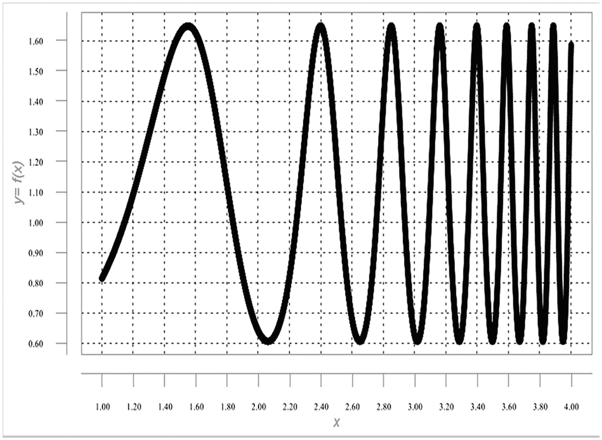
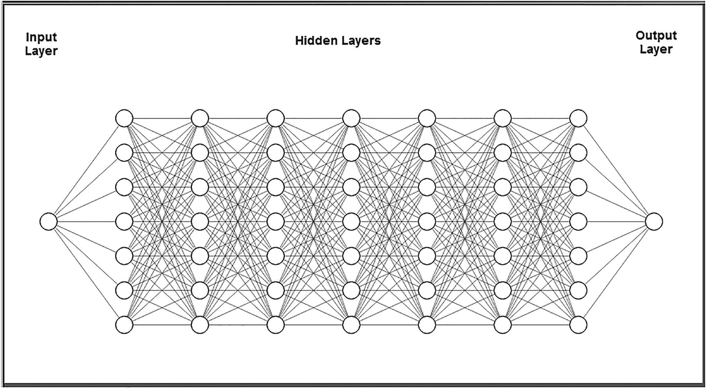
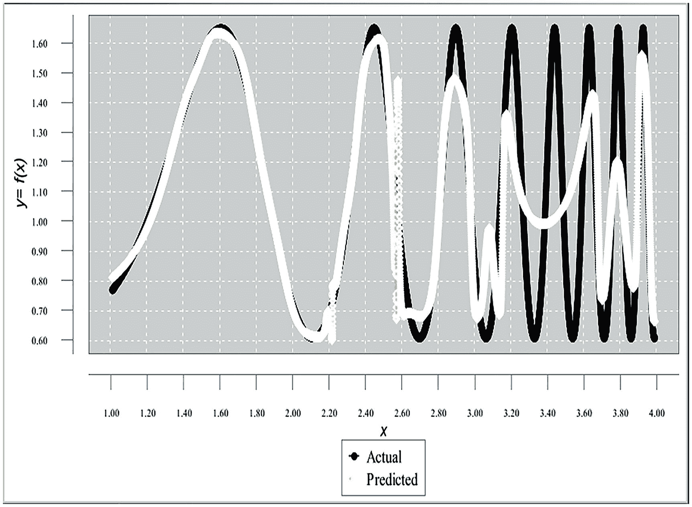
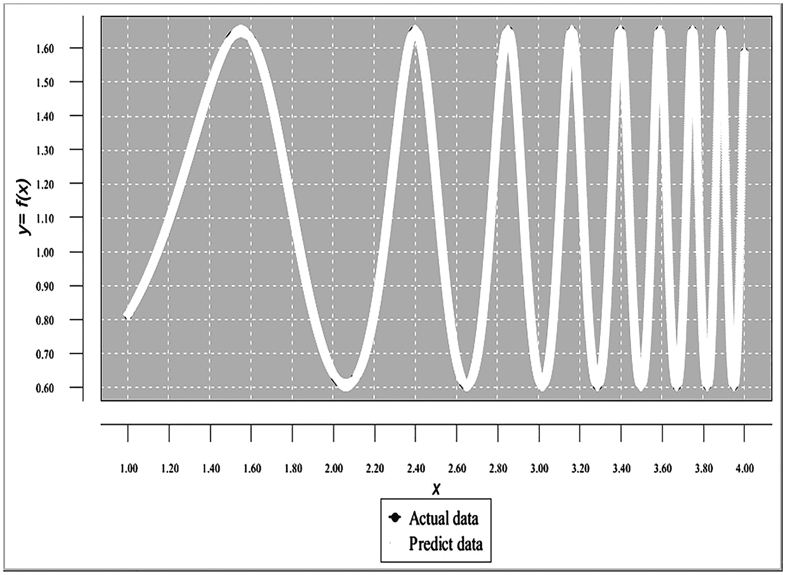
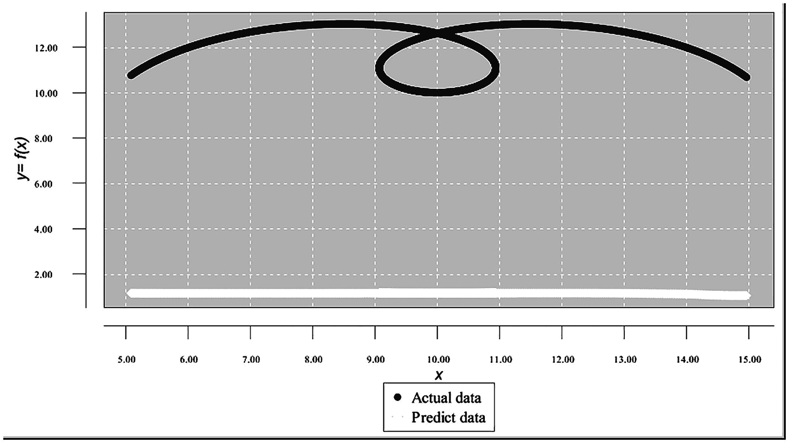
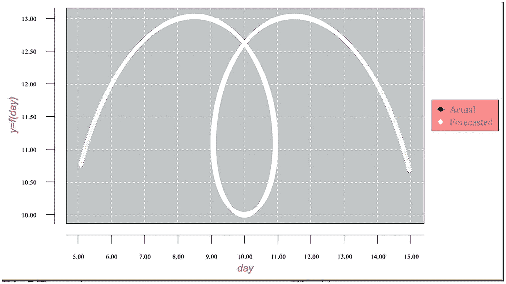
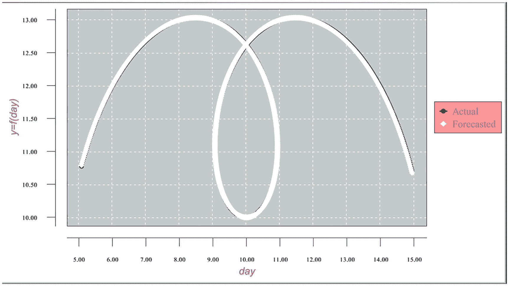

# 9. 具有复杂拓扑结构的连续函数的逼近

本章将展示微批处理方法如何显著改善具有复杂拓扑结构的连续函数的逼近结果。

### 示例：使用传统神经网络过程逼近具有复杂拓扑结构的连续函数

图 9-1 展示了这样一个函数。该函数的公式为 `y = sqrt(e^(-(...)))`，但我们假设函数公式未知，仅通过某些点的函数值来给出该函数。



**图 9-1** – 具有复杂拓扑结构的连续函数图表

同样，我们将首次尝试使用传统神经网络过程来逼近该函数。表 9-1 展示了训练数据集的一个片段。

**表 9-1** – 训练数据集片段

| 点 `x` | 函数值 |

| --- | --- |

| 1 | 0.81432914 |

| 1.0003 | 0.814632027 |

| 1.0006 | 0.814935228 |

| 1.0009 | 0.815238744 |

| 1.0012 | 0.815542575 |

| 1.0015 | 0.815846721 |

| 1.0018 | 0.816151183 |

| 1.0021 | 0.816455961 |

| 1.0024 | 0.816761055 |

| 1.0027 | 0.817066464 |

| 1.003 | 0.817372191 |

| 1.0033 | 0.817678233 |

| 1.0036 | 0.817984593 |

| 1.0039 | 0.818291269 |

| 1.0042 | 0.818598262 |

表 9-2 展示了测试数据集的一个片段。

**表 9-2** – 测试数据集片段

| 点 `x` | 点 `y` |

| --- | --- |

| 1.000015 | 0.814344277 |

| 1.000315 | 0.814647179 |

| 1.000615 | 0.814950396 |

| 1.000915 | 0.815253928 |

| 1.001215 | 0.815557774 |

| 1.001515 | 0.815861937 |

| 1.001815 | 0.816166415 |

| 1.002115 | 0.816471208 |

| 1.002415 | 0.816776318 |

| 1.002715 | 0.817081743 |

| 1.003015 | 0.817387485 |

| 1.003315 | 0.817693544 |

| 1.003615 | 0.817999919 |

| 1.003915 | 0.818306611 |

| 1.004215 | 0.81861362 |

训练数据集和测试数据集在处理前均已进行归一化。

#### 示例的网络架构

图 9-2 展示了该示例的网络架构。



**图 9-2** – 网络架构

#### 示例的程序代码

清单 9-1 展示了该示例的程序代码。

```java
package articleidi_complexformula_traditional;

import java.io.BufferedReader;
import java.io.File;
import java.io.FileInputStream;
import java.io.FileNotFoundException;
import java.io.FileReader;
import java.io.FileWriter;
import java.io.IOException;
import java.io.InputStream;
import java.nio.file.Paths;
import java.util.Properties;
import java.time.YearMonth;
import java.awt.Color;
import java.awt.Font;
import java.io.BufferedReader;
import java.text SimpleDateFormat;
import java.text ParseException;
import java.time.LocalDate;
import java.time.Month;
import java.time.ZoneId;
import java.util.ArrayList;
import java.util.Calendar;
import java.util.Date;
import java.util.List;
import java.util.Locale;
import java.util.Properties;
import org.encog.Encog;
import org.encog.engine.network.activation.ActivationTANH;
import org.encog.engine.network.activation.ActivationReLU;
import org.encog.ml.data.MLData;
import org.encog.ml.data.MLDataPair;
import org.encog.ml.data.MLDataSet;
import org.encog.ml.data.buffer.MemoryDataLoader;
import org.encog.ml.data.buffer.codec.CSVDataCODEC;
import org.encog.ml.data.buffer.codec.DataSetCODEC;
import org.encog.neural.networks.BasicNetwork;
import org.encog.neural.networks.layers.BasicLayer;
import org.encog.neural.networks.training.propagation.resilient.ResilientPropagation;
import org.encog.persist.EncogDirectoryPersistence;
import org.encog.util.csv.CSVFormat;
import org.knowm.xchart.SwingWrapper;
import org.knowm.xchart.XYChart;
import org.knowm.xchart.XYChartBuilder;
import org.knowm.xchart.XYSeries;
import org.knowm.xchart.demo.charts.ExampleChart;
import org.knowm.xchart.style.Styler.LegendPosition;
import org.knowm.xchart.style.colors.ChartColor;
import org.knowm.xchart.style.colors.XChartSeriesColors;
import org.knowm.xchart.style.lines.SeriesLines;
import org.knowm.xchart.style.markers.SeriesMarkers;
import org.knowm.xchart.BitmapEncoder;
import org.knowm.xchart.BitmapEncoder.BitmapFormat;
import org.knowm.xchart.QuickChart;
import org.knowm.xchart.SwingWrapper;

public class ArticleIDI_ComplexFormula_Traditional implements ExampleChart {
    static double Nh = 1;
    static double Nl = -1;
    static double minXPointDl = 0.95;
    static double maxXPointDh = 4.05;
    static double minTargetValueDl = 0.60;
    static double maxTargetValueDh = 1.65;
    static double doublePointNumber = 0.00;
    static int intPointNumber = 0;
    static InputStream input = null;
    static double[] arrPrices = new double[2500];
    static double normInputXPointValue = 0.00;
    static double normPredictXPointValue = 0.00;
    static double normTargetXPointValue = 0.00;
    static double normDifferencePerc = 0.00;
    static double returnCode = 0.00;
    static double denormInputXPointValue = 0.00;
    static double denormPredictXPointValue = 0.00;
    static double denormTargetXPointValue = 0.00;
    static double valueDifference = 0.00;
    static int numberOfInputNeurons;
    static int numberOfOutputNeurons;
    static int numberOfRecordsInFile;
    static String trainFileName;
    static String priceFileName;
    static String testFileName;
    static String chartTrainFileName;
    static String chartTestFileName;
    static String networkFileName;
    static int workingMode;
    static String cvsSplitBy = ",";
    static List xData = new ArrayList();
    static List yData1 = new ArrayList();
    static List yData2 = new ArrayList();
    static XYChart Chart;
    
    @Override
    public XYChart getChart() {
        // 创建图表
        XYSeries series1 = Chart.addSeries("实际数据", xData, yData1);
        XYSeries series2 = Chart.addSeries("预测数据", xData, yData2);
        series1.setLineColor(XChartSeriesColors.BLACK);
        series2.setLineColor(XChartSeriesColors.YELLOW);
        series1.setMarkerColor(Color.BLACK);
        series2.setMarkerColor(Color.WHITE);
        series1.setLineStyle(SeriesLines.SOLID);
        series2.setLineStyle(SeriesLines.DASH_DASH);
        try {
            // 配置
            // 训练模式
            //workingMode = 1;
            //numberOfRecordsInFile = 10001;
            //trainFileName = "C:/Article_To_Publish/IGI_Global/ComplexFormula_Calculate_Train_Norm.csv";
            //chartTrainFileName = "C:/Article_To_Publish/IGI_Global/ComplexFormula_Chart_Train_Results";
            // 测试模式
            workingMode = 2;
            numberOfRecordsInFile = 10001;
            testFileName = "C:/Article_To_Publish/IGI_Global/ComplexFormula_Calculate_Test_Norm.csv";
            chartTestFileName = "C:/Article_To_Publish/IGI_Global/ComplexFormula_Chart_Test_Results";
            // 配置数据的公共部分
            networkFileName = "C:/Article_To_Publish/IGI_Global/ComplexFormula_Saved_Network_File.csv";
            numberOfInputNeurons = 1;
            numberOfOutputNeurons = 1;
            // 检查要运行的工作模式
            if(workingMode == 1) {
                // 训练模式
                File file1 = new File(chartTrainFileName);
                File file2 = new File(networkFileName);
                if(file1.exists())
                    file1.delete();
                if(file2.exists())
                    file2.delete();
                returnCode = 0;    // 清除错误代码
                do {
                    returnCode = trainValidateSaveNetwork();
                }  while (returnCode > 0);
            } else {
                // 测试模式
                loadAndTestNetwork();
            }
        } catch (Throwable t) {
            t.printStackTrace();
            System.exit(1);
        } finally {
            Encog.getInstance().shutdown();
        }
        Encog.getInstance().shutdown();
        return Chart;
    }  // 方法结束
    
    // =======================================================
    // 将 CSV 加载到内存。
    // @return 加载的数据集。
    // =======================================================
    public static MLDataSet loadCSV2Memory(String filename, int input, int ideal, boolean headers,
                                          CSVFormat format, boolean significance) {
        DataSetCODEC codec = new CSVDataCODEC(new File(filename), format, headers, input, ideal,
                                              significance);
        MemoryDataLoader load = new MemoryDataLoader(codec);
        MLDataSet dataset = load.external2Memory();
        return dataset;
    }
    
    // =======================================================
    // 主方法。
    // @param 命令行参数。不使用任何参数。
    // ======================================================
    public static void main(String[] args) {
        ExampleChart exampleChart = new ArticleIDI_ComplexFormula_Traditional();
        XYChart Chart = exampleChart.getChart();
        new SwingWrapper(Chart).displayChart();
    } // 主方法结束
    
    //=====================================================================
    //
}
```

**列表 9-1**  

程序代码

#### 示例的训练处理结果

清单 9-2 展示了传统网络处理结果的末尾片段。

```
xPoint = 4.08605  TargetValue = 1.24795  PredictedValue = 1.15899  DifPerc = 7.12794
xPoint = 4.08636  TargetValue = 1.25699  PredictedValue = 1.16125  DifPerc = 7.61624
xPoint = 4.08667  TargetValue = 1.26602  PredictedValue = 1.16346  DifPerc = 8.10090
xPoint = 4.08698  TargetValue = 1.27504  PredictedValue = 1.16562  DifPerc = 8.58150
xPoint = 4.08729  TargetValue = 1.28404  PredictedValue = 1.16773  DifPerc = 9.05800
xPoint = 4.08760  TargetValue = 1.29303  PredictedValue = 1.16980  DifPerc = 9.53011
xPoint = 4.08791  TargetValue = 1.30199  PredictedValue = 1.17183  DifPerc = 9.99747
xPoint = 4.08822  TargetValue = 1.31093  PredictedValue = 1.17381  DifPerc = 10.4599
xPoint = 4.08853  TargetValue = 1.31984  PredictedValue = 1.17575  DifPerc = 10.9173
xPoint = 4.08884  TargetValue = 1.32871  PredictedValue = 1.17765  DifPerc = 11.3694
xPoint = 4.08915  TargetValue = 1.33755  PredictedValue = 1.17951  DifPerc = 11.8159
xPoint = 4.08946  TargetValue = 1.34635  PredictedValue = 1.18133  DifPerc = 12.25680
xPoint = 4.08978  TargetValue = 1.35510  PredictedValue = 1.18311  DifPerc = 12.69162
xPoint = 4.09008  TargetValue = 1.36380  PredictedValue = 1.18486  DifPerc = 13.12047
xPoint = 4.09039  TargetValue = 1.37244  PredictedValue = 1.18657  DifPerc = 13.54308
xPoint = 4.09070  TargetValue = 1.38103  PredictedValue = 1.18825  DifPerc = 13.95931
xPoint = 4.09101  TargetValue = 1.38956  PredictedValue = 1.18999  DifPerc = 14.36898
xPoint = 4.09132  TargetValue = 1.39802  PredictedValue = 1.19151  DifPerc = 14.77197
xPoint = 4.09164  TargetValue = 1.40642  PredictedValue = 1.19309  DifPerc = 15.16812
xPoint = 4.09194  TargetValue = 1.41473  PredictedValue = 1.19464  DifPerc = 15.55732
xPoint = 4.09225  TargetValue = 1.42297  PredictedValue = 1.19616  DifPerc = 15.93942
xPoint = 4.09256  TargetValue = 1.43113  PredictedValue = 1.19765  DifPerc = 16.31432
xPoint = 4.09287  TargetValue = 1.43919  PredictedValue = 1.19911  DifPerc = 16.68189
xPoint = 4.09318  TargetValue = 1.44717  PredictedValue = 1.20054  DifPerc = 17.04203
xPoint = 4.09349  TargetValue = 1.45505  PredictedValue = 1.20195  DifPerc = 17.39463
xPoint = 4.09380  TargetValue = 1.46283  PredictedValue = 1.20333  DifPerc = 17.73960
xPoint = 4.09411  TargetValue = 1.47051  PredictedValue = 1.20469  DifPerc = 18.07683
xPoint = 4.09442  TargetValue = 1.47808  PredictedValue = 1.20602  DifPerc = 18.40624
xPoint = 4.09473  TargetValue = 1.48553  PredictedValue = 1.20732  DifPerc = 18.72775
xPoint = 4.09504  TargetValue = 1.49287  PredictedValue = 1.20861  DifPerc = 19.04127
xPoint = 4.09535  TargetValue = 1.50009  PredictedValue = 1.20987  DifPerc = 19.34671
xPoint = 4.09566  TargetValue = 1.50718  PredictedValue = 1.21111  DifPerc = 19.64402
xPoint = 4.09597  TargetValue = 1.51414  PredictedValue = 1.21232  DifPerc = 19.93312
xPoint = 4.09628  TargetValue = 1.52097  PredictedValue = 1.21352  DifPerc = 20.21393
xPoint = 4.09659  TargetValue = 1.52766  PredictedValue = 1.21469  DifPerc = 20.48640
xPoint = 4.09690  TargetValue = 1.53420  PredictedValue = 1.21585  DifPerc = 20.75045
xPoint = 4.09721  TargetValue = 1.54060  PredictedValue = 1.21699  DifPerc = 21.00605
xPoint = 4.09752  TargetValue = 1.54686  PredictedValue = 1.21810  DifPerc = 21.25312
xPoint = 4.09783  TargetValue = 1.55296  PredictedValue = 1.21920  DifPerc = 21.49161
xPoint = 4.09814  TargetValue = 1.55890  PredictedValue = 1.22028  DifPerc = 21.72147
xPoint = 4.09845  TargetValue = 1.56468  PredictedValue = 1.22135  DifPerc = 21.94265
xPoint = 4.09876  TargetValue = 1.57030  PredictedValue = 1.22239  DifPerc = 22.15511
xPoint = 4.09907  TargetValue = 1.57574  PredictedValue = 1.22342  DifPerc = 22.35878
xPoint = 4.09938  TargetValue = 1.58101  PredictedValue = 1.22444  DifPerc = 22.55363
xPoint = 4.09969  TargetValue = 1.58611  PredictedValue = 1.22544  DifPerc = 22.73963
maxErrorPerc = 86.08183780343387
averErrorPerc = 10.116005438206885
清单 9-2
传统训练结果的末尾片段
```

采用传统流程，逼近结果如下：

*   最大误差百分比超过 86.08%。

*   平均误差百分比超过 10.11%。

图 9-3 展示了使用传统网络处理的训练逼近结果图表。



图 9-3

使用传统网络处理的训练逼近结果图表

显然，这种逼近毫无用处。

### 使用微批处理方法逼近具有复杂拓扑的连续函数

现在，我们将使用微批处理方法逼近该函数。同样，将归一化的训练数据集拆分为一组训练微批处理文件，并将其作为训练过程的输入。清单 9-3 展示了执行后训练处理结果（使用宏批处理方法）的末尾片段。

```
DayNumber = 9950  TargetValue = 1.19376  PredictedValue = 1.19376  DiffPerc = 4.66352E-6
DayNumber = 9951  TargetValue = 1.20277  PredictedValue = 1.20277  DiffPerc = 5.30417E-6
DayNumber = 9952  TargetValue = 1.21180  PredictedValue = 1.21180  DiffPerc = 4.79291E-6
DayNumber = 9953  TargetValue = 1.22083  PredictedValue = 1.22083  DiffPerc = 5.03070E-6
DayNumber = 9954  TargetValue = 1.22987  PredictedValue = 1.22987  DiffPerc = 3.79647E-6
DayNumber = 9955  TargetValue = 1.23891  PredictedValue = 1.23891  DiffPerc = 8.06431E-6
DayNumber = 9956  TargetValue = 1.24795  PredictedValue = 1.24795  DiffPerc = 7.19851E-6
DayNumber = 9957  TargetValue = 1.25699  PredictedValue = 1.25699  DiffPerc = 4.57148E-6
DayNumber = 9958  TargetValue = 1.26602  PredictedValue = 1.26602  DiffPerc = 5.88300E-6
DayNumber = 9959  TargetValue = 1.27504  PredictedValue = 1.27504  DiffPerc = 3.02448E-6
DayNumber = 9960  TargetValue = 1.28404  PredictedValue = 1.28404  DiffPerc = 7.04155E-6
DayNumber = 9961  TargetValue = 1.29303  PredictedValue = 1.29303  DiffPerc = 8.62206E-6
DayNumber = 9962  TargetValue = 1.30199  PredictedValue = 1.30199  DiffPerc = 9.16473E-8
DayNumber = 9963  TargetValue = 1.31093  PredictedValue = 1.31093  DiffPerc = 1.89459E-6
DayNumber = 9964  TargetValue = 1.31984  PredictedValue = 1.31984  DiffPerc = 4.16695E-6
DayNumber = 9965  TargetValue = 1.32871  PredictedValue = 1.32871  DiffPerc = 8.68118E-6
DayNumber = 9966  TargetValue = 1.33755  PredictedValue = 1.33755  DiffPerc = 4.55866E-6
DayNumber = 9967  TargetValue = 1.34635  PredictedValue = 1.34635  DiffPerc = 6.67697E-6
DayNumber = 9968  TargetValue = 1.35510  PredictedValue = 1.35510  DiffPerc = 4.80264E-6
DayNumber = 9969  TargetValue = 1.36378  PredictedValue = 1.36380  DiffPerc = 8.58688E-7
DayNumber = 9970  TargetValue = 1.37244  PredictedValue = 1.37245  DiffPerc = 5.19317E-6
DayNumber = 9971  TargetValue = 1.38103  PredictedValue = 1.38104  DiffPerc = 7.11052E-6
DayNumber = 9972  TargetValue = 1.38956  PredictedValue = 1.38956  DiffPerc = 5.15382E-6
DayNumber = 9973  TargetValue = 1.39802  PredictedValue = 1.39802  DiffPerc = 5.90734E-6
DayNumber = 9974  TargetValue = 1.40642  PredictedValue = 1.40642  DiffPerc = 6.20744E-7
DayNumber = 9975  TargetValue = 1.41473  PredictedValue = 1.41473  DiffPerc = 5.67234E-7
DayNumber = 9976  TargetValue = 1.42297  PredictedValue = 1.42297  DiffPerc = 5.54862E-6
DayNumber = 9977  TargetValue = 1.43113  PredictedValue = 1.43113  DiffPerc = 3.28318E-6
DayNumber = 9978  TargetValue = 1.43919  PredictedValue = 1.43919  DiffPerc = 7.84136E-6
DayNumber = 9979  TargetValue = 1.44717  PredictedValue = 1.44717  DiffPerc = 6.51767E-6
DayNumber = 9980  TargetValue = 1.45505  PredictedValue = 1.45505  DiffPerc = 6.59220E-6
DayNumber = 9981  TargetValue = 1.46283  PredictedValue = 1.46283  DiffPerc = 9.08060E-7
DayNumber = 9982  TargetValue = 1.47051  PredictedValue = 1.47051  DiffPerc = 8.59549E-6
DayNumber = 9983  TargetValue = 1.47808  PredictedValue = 1.47808  DiffPerc = 5.49575E-7
DayNumber = 9984  TargetValue = 1.48553  PredictedValue = 1.48553  DiffPerc = 1.07879E-6
DayNumber = 9985  TargetValue = 1.49287  PredictedValue = 1.49287  DiffPerc = 2.22734E-6
DayNumber = 9986  TargetValue = 1.50009  PredictedValue = 1.50009  DiffPerc = 1.28405E-6
DayNumber = 9987  TargetValue = 1.50718  PredictedValue = 1.50718  DiffPerc = 8.88272E-6
DayNumber = 9988  TargetValue = 1.51414  PredictedValue = 1.51414  DiffPerc = 4.91930E-6
DayNumber = 9989  TargetValue = 1.52097  PredictedValue = 1.52097  DiffPerc = 3.46714E-6
DayNumber = 9990  TargetValue = 1.52766  PredictedValue = 1.52766  DiffPerc = 7.67496E-6
DayNumber = 9991  TargetValue = 1.53420  PredictedValue = 1.53420  DiffPerc = 4.67918E-6
DayNumber = 9992  TargetValue = 1.54061  PredictedValue = 1.54061  DiffPerc = 2.20484E-6
DayNumber = 9993  TargetValue = 1.54686  PredictedValue = 1.54686  DiffPerc = 7.42466E-6
DayNumber = 9994  TargetValue = 1.55296  PredictedValue = 1.55296  DiffPerc = 3.86183E-6
DayNumber = 9995  TargetValue = 1.55890  PredictedValue = 1.55890  DiffPerc = 6.34568E-7
DayNumber = 9996  TargetValue = 1.56468  PredictedValue = 1.56468  DiffPerc = 6.23860E-6
DayNumber = 9997  TargetValue = 1.57029  PredictedValue = 1.57029  DiffPerc = 3.66380E-7
DayNumber = 9998  TargetValue = 1.57574  PredictedValue = 1.57574  DiffPerc = 4.45560E-6
DayNumber = 9999  TargetValue = 1.58101  PredictedValue = 1.58101  DiffPerc = 6.19952E-6
DayNumber = 10000  TargetValue = 1.5861  PredictedValue = 1.58611  DiffPerc = 1.34336E-6
maxGlobalResultDiff = 1.3433567671366473E-6
averGlobalResultDiff = 2.686713534273295E-10
Listing 9-3
Ending Fragment of the Training Processing Results (Using the Macro-Batch Method)
```

采用微批次方法的训练处理结果如下：

-   最大误差小于 0.00000134%。

-   平均误差小于 0.000000000269%。

图 9-4 展示了训练逼近结果图表（使用了微批次方法）。两张图表（实际值以黑色显示，预测值以白色显示）几乎完全重叠。



图 9-4

训练逼近结果图表（使用了微批次方法）

与训练数据集类似，归一化后的测试数据集被分割成一组微批次文件，这些文件现在作为测试过程的输入。

#### 使用微批次方法的示例程序代码

清单 9-4 展示了此示例的程序代码。
```

```java
// ====================================================
// 使用微批量方法对具有复杂拓扑结构的连续函数进行近似。
// 输入是归一化后的微批量文件集。每个微批量包含一条单日记录，
// 该记录包含两个字段：
// - normDayValue
// - normTargetValue
//
// 输入层神经元数量为 1
// 输出层神经元数量为 1
// ==================================================
```java
package `articleigi_complexformula_microbatchest`;

import java.io.BufferedReader;
import java.io.File;
import java.io.FileInputStream;
import java.io.PrintWriter;
import java.io.FileNotFoundException;
import java.io.FileReader;
import java.io.FileWriter;
import java.io.IOException;
import java.io.InputStream;
import java.nio.file.Paths;
import java.util.Properties;
import java.time.YearMonth;
import java.awt.Color;
import java.awt.Font;
import java.io.BufferedReader;
import java.text DateFormat;
import java.text ParseException;
import java.text SimpleDateFormat;
import java.time.LocalDate;
import java.time.Month;
import java.time.ZoneId;
import java.util.ArrayList;
import java.util.Calendar;
import java.util.Date;
import java.util.List;
import java.util.Locale;
import java.util.Properties;
import org.encog.Encog;
import org.encog.engine.network.activation.ActivationTANH;
import org.encog.engine.network.activation.ActivationReLU;
import org.encog.ml.data.MLData;
import org.encog.ml.data.MLDataPair;
import org.encog.ml.data.MLDataSet;
import org.encog.ml.data.buffer.MemoryDataLoader;
import org.encog.ml.data.buffer.codec.CSVDataCODEC;
import org.encog.ml.data.buffer.codec.DataSetCODEC;
import org.encog.neural.networks.BasicNetwork;
import org.encog.neural.networks.layers.BasicLayer;
import org.encog.neural.networks.training.propagation.resilient.ResilientPropagation;
import org.encog.persist.EncogDirectoryPersistence;
import org.encog.util.csv.CSVFormat;
import org.knowm.xchart.SwingWrapper;
import org.knowm.xchart.XYChart;
import org.knowm.xchart.XYChartBuilder;
import org.knowm.xchart.XYSeries;
import org.knowm.xchart.demo.charts.ExampleChart;
import org.knowm.xchart.style.Styler.LegendPosition;
import org.knowm.xchart.style.colors.ChartColor;
import org.knowm.xchart.style.colors.XChartSeriesColors;
import org.knowm.xchart.style.lines.SeriesLines;
import org.knowm.xchart.style.markers.SeriesMarkers;
import org.knowm.xchart.BitmapEncoder;
import org.knowm.xchart.BitmapEncoder.BitmapFormat;
import org.knowm.xchart.QuickChart;
import org.knowm.xchart.SwingWrapper;

public class `ArticleIGI_ComplexFormula_Microbatchest` implements ExampleChart
{
    // 归一化参数
    // 归一化区间
    static double Nh =  1;
    static double Nl = -1;
    // 第一列
    static double minXPointDl = 0.95;
    static double maxXPointDh = 4.05;
    // 第二列
    static double minTargetValueDl = 0.60;
    static double maxTargetValueDh = 1.65;
    static String cvsSplitBy = ",";
    static Properties prop = null;
    static String strWorkingMode;
    static String strNumberOfBatchesToProcess;
    static String strTrainFileNameBase;
    static String strTestFileNameBase;
    static String strSaveTrainNetworkFileBase;
    static String strSaveTestNetworkFileBase;
    static String strValidateFileName;
    static String strTrainChartFileName;
    static String strTestChartFileName;
    static String strFunctValueTrainFile;
    static String strFunctValueTestFile;
    static int intDayNumber;
    static double doubleDayNumber;
    static int intWorkingMode;
    static int numberOfTrainBatchesToProcess;
    static int numberOfTestBatchesToProcess;
    static int intNumberOfRecordsInTrainFile;
    static int intNumberOfRecordsInTestFile;
    static int intNumberOfRowsInBatches;
    static int intInputNeuronNumber;
    static int intOutputNeuronNumber;
    static String strOutputFileName;
    static String strSaveNetworkFileName;
    static String strDaysTrainFileName;
    static XYChart Chart;
    static String iString;
    static double inputFunctValueFromFile;
    static double targetToPredictFunctValueDiff;
    static int[] returnCodes  = new int[3];
    static List xData = new ArrayList();
    static List yData1 = new ArrayList();
    static List yData2 = new ArrayList();
    static double[] DaysyearDayTraining = new double[10200];
    static String[] strTrainingFileNames = new String[10200];
    static String[] strTestingFileNames = new String[10200];
}
```

## 清单 9-5 测试结果的结尾片段

```
DayNumber = `3.98411`  TargetValue = `1.17624`  AverPredicedValue = `1.18028`  DiffPerc = `0.34348`
DayNumber = `3.98442`  TargetValue = `1.18522`  AverPredicedValue = `1.18927`  DiffPerc = `0.34158`
DayNumber = `3.98472`  TargetValue = `1.19421`  AverPredicedValue = `1.19827`  DiffPerc = `0.33959`
DayNumber = `3.98502`  TargetValue = `1.20323`  AverPredicedValue = `1.20729`  DiffPerc = `0.33751`
DayNumber = `3.98532`  TargetValue = `1.21225`  AverPredicedValue = `1.21631`  DiffPerc = `0.33534`
DayNumber = `3.98562`  TargetValue = `1.22128`  AverPredicedValue = `1.22535`  DiffPerc = `0.33307`
DayNumber = `3.98592`  TargetValue = `1.23032`  AverPredicedValue = `1.23439`  DiffPerc = `0.33072`
DayNumber = `3.98622`  TargetValue = `1.23936`  AverPredicedValue = `1.24343`  DiffPerc = `0.32828`
DayNumber = `3.98652`  TargetValue = `1.24841`  AverPredicedValue = `1.25247`  DiffPerc = `0.32575`
DayNumber = `3.98682`  TargetValue = `1.25744`  AverPredicedValue = `1.26151`  DiffPerc = `0.32313`
DayNumber = `3.98712`  TargetValue = `1.26647`  AverPredicedValue = `1.27053`  DiffPerc = `0.32043`
DayNumber = `3.98742`  TargetValue = `1.27549`  AverPredicedValue = `1.27954`  DiffPerc = `0.31764`
DayNumber = `3.98772`  TargetValue = `1.28449`  AverPredicedValue = `1.28854`  DiffPerc = `0.31477`
DayNumber = `3.98802`  TargetValue = `1.29348`  AverPredicedValue = `1.29751`  DiffPerc = `0.31181`
DayNumber = `3.98832`  TargetValue = `1.30244`  AverPredicedValue = `1.30646`  DiffPerc = `0.30876`
DayNumber = `3.98862`  TargetValue = `1.31138`  AverPredicedValue = `1.31538`  DiffPerc = `0.30563`
DayNumber = `3.98892`  TargetValue = `1.32028`  AverPredicedValue = `1.32428`  DiffPerc = `0.30242`
DayNumber = `3.98922`  TargetValue = `1.32916`  AverPredicedValue = `1.33313`  DiffPerc = `0.29913`
DayNumber = `3.98952`  TargetValue = `1.33799`  AverPredicedValue = `1.34195`  DiffPerc = `0.29576`
DayNumber = `3.98982`  TargetValue = `1.34679`  AverPredicedValue = `1.35072`  DiffPerc = `0.29230`
DayNumber = `3.99012`  TargetValue = `1.35554`  AverPredicedValue = `1.35945`  DiffPerc = `0.28876`
DayNumber = `3.99042`  TargetValue = `1.36423`  AverPredicedValue = `1.36812`  DiffPerc = `0.28515`
DayNumber = `3.99072`  TargetValue = `1.37288`  AverPredicedValue = `1.37674`  DiffPerc = `0.28144`
DayNumber = `3.99102`  TargetValue = `1.38146`  AverPredicedValue = `1.38530`  DiffPerc = `0.27768`
DayNumber = `3.99132`  TargetValue = `1.38999`  AverPredicedValue = `1.39379`  DiffPerc = `0.27383`
DayNumber = `3.99162`  TargetValue = `1.39844`  AverPredicedValue = `1.40222`  DiffPerc = `0.26990`
DayNumber = `3.99192`  TargetValue = `1.40683`  AverPredicedValue = `1.41057`  DiffPerc = `0.26590`
DayNumber = `3.99222`  TargetValue = `1.41515`  AverPredicedValue = `1.41885`  DiffPerc = `0.26183`
DayNumber = `3.99252`  TargetValue = `1.42338`  AverPredicedValue = `1.42705`  DiffPerc = `0.25768`
DayNumber = `3.99282`  TargetValue = `1.43153`  AverPredicedValue = `1.43516`  DiffPerc = `0.25346`
DayNumber = `3.99312`  TargetValue = `1.43960`  AverPredicedValue = `1.44318`  DiffPerc = `0.24918`
DayNumber = `3.99342`  TargetValue = `1.44757`  AverPredicedValue = `1.45111`  DiffPerc = `0.24482`
DayNumber = `3.99372`  TargetValue = `1.45544`  AverPredicedValue = `1.45894`  DiffPerc = `0.24040`
DayNumber = `3.99402`  TargetValue = `1.46322`  AverPredicedValue = `1.46667`  DiffPerc = `0.23591`
DayNumber = `3.99432`  TargetValue = `1.47089`  AverPredicedValue = `1.47429`  DiffPerc = `0.23134`
DayNumber = `3.99462`  TargetValue = `1.47845`  AverPredicedValue = `1.48180`  DiffPerc = `0.22672`
DayNumber = `3.99492`  TargetValue = `1.48590`  AverPredicedValue = `1.48920`  DiffPerc = `0.22204`
DayNumber = `3.99522`  TargetValue = `1.49323`  AverPredicedValue = `1.49648`  DiffPerc = `0.21729`
DayNumber = `3.99552`  TargetValue = `1.50044`  AverPredicedValue = `1.50363`  DiffPerc = `0.21247`
DayNumber = `3.99582`  TargetValue = `1.50753`  AverPredicedValue = `1.51066`  DiffPerc = `0.20759`
DayNumber = `3.99612`  TargetValue = `1.51448`  AverPredicedValue = `1.51755`  DiffPerc = `0.20260`
DayNumber = `3.99642`  TargetValue = `1.52130`  AverPredicedValue = `1.52431`  DiffPerc = `0.19770`
DayNumber = `3.99672`  TargetValue = `1.52799`  AverPredicedValue = `1.53093`  DiffPerc = `0.19260`
DayNumber = `3.99702`  TargetValue = `1.53453`  AverPredicedValue = `1.53740`  DiffPerc = `0.18751`
DayNumber = `3.99732`  TargetValue = `1.54092`  AverPredicedValue = `1.54373`  DiffPerc = `0.18236`
DayNumber = `3.99762`  TargetValue = `1.54717`  AverPredicedValue = `1.54991`  DiffPerc = `0.17715`
DayNumber = `3.99792`  TargetValue = `1.55326`  AverPredicedValue = `1.55593`  DiffPerc = `0.17188`
DayNumber = `3.99822`  TargetValue = `1.55920`  AverPredicedValue = `1.56179`  DiffPerc = `0.16657`
DayNumber = `3.99852`  TargetValue = `1.56496`  AverPredicedValue = `1.56749`  DiffPerc = `0.16120`
DayNumber = `3.99882`  TargetValue = `1.57057`  AverPredicedValue = `1.57302`  DiffPerc = `0.15580`
DayNumber = `3.99912`  TargetValue = `1.57601`  AverPredicedValue = `1.57838`  DiffPerc = `0.15034`
DayNumber = `3.99942`  TargetValue = `1.58127`  AverPredicedValue = `1.58356`  DiffPerc = `0.14484`
maxGlobalResultDiff = `0.3620154382225759`
averGlobalResultDiff = `0.07501532301280595`
```

清单 9-5
测试处理结果的结尾片段

```
测试处理结果（使用了微批次方法）如下：

*   最大误差约为 `0.36%`。

*   平均误差约为 `0.075%`。

图 9-5 展示了测试处理结果的图表（使用了微批次方法）。同样，两张图表（实际值以黑色显示，预测值以白色显示）几乎完全重叠。


## 图 9-5 测试处理结果的图表（使用了微批次方法）

### 示例：螺旋类函数的逼近

在本节中，我们将讨论一组具有螺旋特性的函数。这些函数有一个共同属性：在某些点上，单个`x`值对应多个函数值。这类函数中的某个函数以难以用神经网络逼近而著称。我们将尝试逼近图 9-6 所示的函数。


**图 9-6** – 对某些`xPoints`具有多个值的函数

该函数由两个方程描述：

```
x(t) = 10 + 0.5*t*Cos(0.3*t).
y(t) = 10 + 0.5*t*Sin(0.3*t).
```

其中，`t`是一个角度。

绘制`x`和`y`的值将得到图 9-6 所示的图表。同样，我们假设函数公式未知，并且该函数通过其在 1000 个点上的值给出。像往常一样，我们首先尝试用传统方法逼近这个函数。表 9-3 显示了训练数据集的一个片段。

**表 9-3** – 训练数据集片段

| x | y |
| --- | --- |
| `14.94996248` | `10.70560004` |
| `14.93574853` | `10.73381636` |
| `14.92137454` | `10.76188757` |
| `14.90684173` | `10.78981277` |
| `14.89215135` | `10.81759106` |
| `14.87730464` | `10.84522155` |
| `14.86230283` | `10.87270339` |
| `14.84714718` | `10.90003569` |
| `14.83183894` | `10.92721761` |
| `14.81637936` | `10.9542483` |
| `14.80076973` | `10.98112693` |
| `14.78501129` | `11.00785266` |
| `14.76910532` | `11.03442469` |
| `14.7530531` | `11.06084221` |
| `14.73685592` | `11.08710443` |
| `14.72051504` | `11.11321054` |
| `14` |  |
|  |  |
|  |  |
|  |  |
|  |  |
|  |  |
|  |  |
|  |  |
|  |  |
|  |  |
|  |  |
|  |  |
|  |  |
|  |  |
|  |  |
|  |  |
|  |  |
|  |  |
|  |  |
|  |  |
|  |  |
|  |
```

```java
// ==================================================
// 使用传统流程近似螺旋状函数。
// 输入文件已归一化。
// ==================================================
package `sample8`;
import java.io.BufferedReader;
import java.io.File;
import java.io.FileInputStream;
import java.io.PrintWriter;
import java.io.FileNotFoundException;
import java.io.FileReader;
import java.io.FileWriter;
import java.io.IOException;
import java.io.InputStream;
import java.nio.file.Paths;
import java.util.Properties;
import java.time.YearMonth;
import java.awt.Color;
import java.awt.Font;
import java.text DateFormat;
import java.text ParseException;
import java.text SimpleDateFormat;
import java.time.LocalDate;
import java.time.Month;
import java.time.ZoneId;
import java.util.ArrayList;
import java.util.Calendar;
import java.util.Date;
import java.util.List;
import java.util.Locale;
import org.encog.Encog;
import org.encog.engine.network.activation.ActivationTANH;
import org.encog.engine.network.activation.ActivationReLU;
import org.encog.ml.data.MLData;
import org.encog.ml.data.MLDataPair;
import org.encog.ml.data.MLDataSet;
import org.encog.ml.data.buffer.MemoryDataLoader;
import org.encog.ml.data.buffer.codec.CSVDataCODEC;
import org.encog.ml.data.buffer.codec.DataSetCODEC;
import org.encog.neural.networks.BasicNetwork;
import org.encog.neural.networks.layers.BasicLayer;
import org.encog.neural.networks.training.propagation.resilient.ResilientPropagation;
import org.encog.persist.EncogDirectoryPersistence;
import org.encog.util.csv.CSVFormat;
import org.knowm.xchart.SwingWrapper;
import org.knowm.xchart.XYChart;
import org.knowm.xchart.XYChartBuilder;
import org.knowm.xchart.XYSeries;
import org.knowm.xchart.demo.charts.ExampleChart;
import org.knowm.xchart.style.Styler.LegendPosition;
import org.knowm.xchart.style.colors.ChartColor;
import org.knowm.xchart.style.colors.XChartSeriesColors;
import org.knowm.xchart.style.lines.SeriesLines;
import org.knowm.xchart.style.markers.SeriesMarkers;
import org.knowm.xchart.BitmapEncoder;
import org.knowm.xchart.BitmapEncoder.BitmapFormat;
import org.knowm.xchart.QuickChart;
import org.knowm.xchart.SwingWrapper;
public class Sample8 implements ExampleChart
{
    // 归一化区间
    static double Nh =  1;
    static double Nl = -1;
    // 第一列
    static double minXPointDl = 1.00;
    static double maxXPointDh = 20.00;
    // 第二列 - 目标数据
    static double minTargetValueDl = 1.00;
    static double maxTargetValueDh = 20.00;
    static double doublePointNumber = 0.00;
    static int intPointNumber = 0;
    static InputStream input = null;
    static double[] arrPrices = new double[2500];
    static double normInputXPointValue = 0.00;
    static double normPredictXPointValue = 0.00;
    static double normTargetXPointValue = 0.00;
    static double normDifferencePerc = 0.00;
    static double returnCode = 0.00;
    static double denormInputXPointValue = 0.00;
    static double denormPredictXPointValue = 0.00;
    static double denormTargetXPointValue = 0.00;
    static double valueDifference = 0.00;
    static int numberOfInputNeurons;
    static int numberOfOutputNeurons;
    static int intNumberOfRecordsInTestFile;
    static String trainFileName;
    static String priceFileName;
    static String testFileName;
    static String chartTrainFileName;
    static String chartTestFileName;
    static String networkFileName;
    static int workingMode;
    static String cvsSplitBy = ",";
    static int numberOfInputRecords = 0;
    static List xData = new ArrayList();
    static List yData1 = new ArrayList();
    static List yData2 = new ArrayList();
    static XYChart Chart;

    @Override
    public XYChart getChart()
    {
        // 创建图表
        Chart = new XYChartBuilder().width(900).height(500).title(getClass().getSimpleName()).xAxisTitle("x").yAxisTitle("y= f(x)").build();
        // 自定义图表
        Chart = new XYChartBuilder().width(900).height(500).title(getClass().getSimpleName()).xAxisTitle("x").yAxisTitle("y= f(x)").build();
        // 自定义图表
        Chart.getStyler().setPlotBackgroundColor(ChartColor.getAWTColor(ChartColor.GREY));
        Chart.getStyler().setPlotGridLinesColor(new Color(255, 255, 255));
        //Chart.getStyler().setPlotBackgroundColor(ChartColor.getAWTColor(ChartColor.WHITE));
        //Chart.getStyler().setPlotGridLinesColor(new Color(0, 0, 0));
        Chart.getStyler().setChartBackgroundColor(Color.WHITE);
        //Chart.getStyler().setLegendBackgroundColor(Color.PINK);
        Chart.getStyler().setLegendBackgroundColor(Color.WHITE);
        //Chart.getStyler().setChartFontColor
    }
}
```

## 清单 9-6

## 传统近似过程的程序代码

该函数通过传统网络处理进行了近似。清单 9-7 展示了传统处理结果的末尾片段。

```
Day = 5.57799  TargetValue = 11.53242  PredictedValue = 1.15068  DiffPerc = 90.02216
Day = 5.55941  TargetValue = 11.50907  PredictedValue = 1.15073  DiffPerc = 90.00153
Day = 5.54095  TargetValue = 11.48556  PredictedValue = 1.15077  DiffPerc = 89.98067
Day = 5.52261  TargetValue = 11.46188  PredictedValue = 1.15082  DiffPerc = 89.95958
Day = 5.50439  TargetValue = 11.43804  PredictedValue = 1.15086  DiffPerc = 89.93824
Day = 5.48630  TargetValue = 11.41403  PredictedValue = 1.15091  DiffPerc = 89.91667
Day = 5.46834  TargetValue = 11.38986  PredictedValue = 1.15096  DiffPerc = 89.89485
Day = 5.45051  TargetValue = 11.36552  PredictedValue = 1.15100  DiffPerc = 89.87280
Day = 5.43280  TargetValue = 11.34101  PredictedValue = 1.15105  DiffPerc = 89.85049
Day = 5.41522  TargetValue = 11.31634  PredictedValue = 1.15110  DiffPerc = 89.82794
Day = 5.39778  TargetValue = 11.29151  PredictedValue = 1.15115  DiffPerc = 89.80515
Day = 5.38047  TargetValue = 11.26652  PredictedValue = 1.15120  DiffPerc = 89.78210
Day = 5.36329  TargetValue = 11.24137  PredictedValue = 1.15125  DiffPerc = 89.75880
Day = 5.34625  TargetValue = 11.21605  PredictedValue = 1.15130  DiffPerc = 89.73525
Day = 5.32935  TargetValue = 11.19058  PredictedValue = 1.15134  DiffPerc = 89.71144
Day = 5.31259  TargetValue = 11.16495  PredictedValue = 1.15139  DiffPerc = 89.68737
Day = 5.29596  TargetValue = 11.13915  PredictedValue = 1.15144  DiffPerc = 89.66305
Day = 5.27948  TargetValue = 11.11321  PredictedValue = 1.15149  DiffPerc = 89.63846
Day = 5.26314  TargetValue = 11.08710  PredictedValue = 1.15154  DiffPerc = 89.61361
Day = 5.24694  TargetValue = 11.06084  PredictedValue = 1.15159  DiffPerc = 89.58850
Day = 5.23089  TargetValue = 11.03442  PredictedValue = 1.15165  DiffPerc = 89.56311
Day = 5.21498  TargetValue = 11.00785  PredictedValue = 1.15170  DiffPerc = 89.53746
Day = 5.19923  TargetValue = 10.98112  PredictedValue = 1.15175  DiffPerc = 89.51153
Day = 5.18362  TargetValue = 10.95424  PredictedValue = 1.15180  DiffPerc = 89.48534
Day = 5.16816  TargetValue = 10.92721  PredictedValue = 1.15185  DiffPerc = 89.45886
Day = 5.15285  TargetValue = 10.90003  PredictedValue = 1.15190  DiffPerc = 89.43211
Day = 5.13769  TargetValue = 10.87270  PredictedValue = 1.15195  DiffPerc = 89.40508
Day = 5.12269  TargetValue = 10.84522  PredictedValue = 1.15200  DiffPerc = 89.37776
Day = 5.10784  TargetValue = 10.81759  PredictedValue = 1.15205  DiffPerc = 89.35016
Day = 5.09315  TargetValue = 10.78981  PredictedValue = 1.15210  DiffPerc = 89.32228
Day = 5.07862  TargetValue = 10.76188  PredictedValue = 1.15215  DiffPerc = 89.29410
maxErrorPerc = 91.1677948809837
averErrorPerc = 90.04645291133258
```

## 清单 9-7

## 传统训练结果的末尾片段

采用传统处理方式，近似结果如下：

*   最大误差百分比超过 91.16%。
*   平均误差百分比超过 90.0611%。

图 9-8 展示了使用传统网络处理的训练近似结果图表。



## 图 9-8

使用传统网络处理的训练近似结果图表

显然，这种近似完全无用。

## 使用微批次方法对相同函数进行近似

现在，让我们使用微批次方法来近似这个函数。同样，归一化的训练数据集被分割成一组训练微批次文件，并作为训练过程的输入。

清单 9-8 展示了使用微批次过程的训练方法的程序代码。

```
// 代码内容
```

```markdown
## 使用微批次方法近似螺旋状函数。
## 输入是归一化的微批次文件集（每个微批次包含单日记录）。
## 每条记录包含：
## - `normDayValue`
## - `normTargetValue`
## 
## 输入层神经元数量为 1
## 输出层神经元数量为 1
## 每个网络都保存在磁盘上，并创建一个映射，将每个已保存的训练好的网络
## 与对应的训练微批次文件关联起来。
## 
```java
// 使用微批次方法近似螺旋状函数。
// 输入是归一化的微批次文件集（每个微批次包含单日记录）。
// 每条记录包含：
// - `normDayValue`
// - `normTargetValue`
//
// 输入层神经元数量为 1
// 输出层神经元数量为 1
// 每个网络都保存在磁盘上，并创建一个映射，将每个已保存的训练好的网络
// 与对应的训练微批次文件关联起来。
// ===============================================================
package `sample8_microbatches`;

import `java.io.BufferedReader`;
import `java.io.File`;
import `java.io.FileInputStream`;
import `java.io.PrintWriter`;
import `java.io.FileNotFoundException`;
import `java.io.FileReader`;
import `java.io.FileWriter`;
import `java.io.IOException`;
import `java.io.InputStream`;
import `java.nio.file.Paths`;
import `java.util.Properties`;
import `java.time.YearMonth`;
import `java.awt.Color`;
import `java.awt.Font`;
import `org.encog.Encog`;
import `org.encog.engine.network.activation.ActivationTANH`;
import `org.encog.engine.network.activation.ActivationReLU`;
import `org.encog.ml.data.MLData`;
import `org.encog.ml.data.MLDataPair`;
import `org.encog.ml.data.MLDataSet`;
import `org.encog.ml.data.buffer.MemoryDataLoader`;
import `org.encog.ml.data.buffer.codec.CSVDataCODEC`;
import `org.encog.neural.networks.BasicNetwork`;
import `org.encog.neural.networks.layers.BasicLayer`;
import `org.encog.neural.networks.training.propagation.resilient.ResilientPropagation`;
import `org.encog.persist.EncogDirectoryPersistence`;
import `org.encog.util.csv.CSVFormat`;
import `org.knowm.xchart.SwingWrapper`;
import `org.knowm.xchart.XYChart`;
import `org.knowm.xchart.XYChartBuilder`;
import `org.knowm.xchart.XYSeries`;
import `org.knowm.xchart.demo.charts.ExampleChart`;
import `org.knowm.xchart.style.Styler.LegendPosition`;
import `org.knowm.xchart.style.colors.ChartColor`;
import `org.knowm.xchart.style.colors.XChartSeriesColors`;
import `org.knowm.xchart.style.lines.SeriesLines`;
import `org.knowm.xchart.style.markers.SeriesMarkers`;
import `org.knowm.xchart.BitmapEncoder`;
import `org.knowm.xchart.BitmapEncoder.BitmapFormat`;
import `org.knowm.xchart.QuickChart`;
import `org.knowm.xchart.SwingWrapper`;

public class `Sample8_Microbatches` implements `ExampleChart`
{
    // ... (省略其他静态变量和常量声明)

    @Override
    public `XYChart` getChart()
    {
        // 创建图表
        `XYChart` Chart = new `XYChartBuilder`.width(900).height(500).title(`getClass().getSimpleName()`).xAxisTitle("day").yAxisTitle("y=f(day)").build();

        // 自定义图表
        Chart.getStyler().setPlotBackgroundColor(`ChartColor.getAWTColor(ChartColor.GREY)`);
        Chart.getStyler().setPlotGridLinesColor(new `Color`(255, 255, 255));
        Chart.getStyler().setChartBackgroundColor(`Color.WHITE`);
        Chart.getStyler().setLegendBackgroundColor(`Color.PINK`);
        Chart.getStyler().setChartFontColor(`Color.MAGENTA`);
        Chart.getStyler().setChartTitleBoxBackgroundColor(new `Color`(0, 222, 0));
        Chart.getStyler().setChartTitleBoxVisible(true);
        Chart.getStyler().setChartTitleBoxBorderColor(`Color.BLACK`);
        Chart.getStyler().setPlotGridLinesVisible(true);
        Chart.getStyler().setAxisTickPadding(20);
        Chart.getStyler().setAxisTickMarkLength(15);
        Chart.getStyler().setPlotMargin(20);
        Chart.getStyler().setChartTitleVisible(false);
        Chart.getStyler().setChartTitleFont(new `Font`(Font.MONOSPACED, Font.BOLD, 24));
        Chart.getStyler().setLegendFont(new `Font`(Font.SERIF, Font.PLAIN, 18));
        Chart.getStyler().setLegendPosition(`LegendPosition.OutsideE`);
        Chart.getStyler().setLegendSeriesLineLength(12);
        Chart.getStyler().setAxisTitleFont(new `Font`(Font.SANS_SERIF, Font.ITALIC, 18));
        Chart.getStyler().setAxisTickLabelsFont(new `Font`(Font.SERIF, Font.PLAIN, 11));
        Chart.getStyler().setDecimalPattern("#0.00");

        // 配置数据
        // ... (省略其他配置数据代码)

        // 生成训练批次文件名及对应的 SaveNetwork 文件名
        intDayNumber = -1;  // 图表的天数编号
        for (int i = 0; i < 
```

```
DayNumber = 947  targetFunctionValue = 12.02166  predictFunctionValue = 12.02166  valurDiff = 5.44438E-6

DayNumber = 948  targetFunctionValue = 12.00232  predictFunctionValue = 12.00232  valurDiff = 3.83830E-6

DayNumber = 949  targetFunctionValue = 11.98281  predictFunctionValue = 11.98281  valurDiff = 2.08931E-6

DayNumber = 950  targetFunctionValue = 11.96312  predictFunctionValue = 11.96312  valurDiff = 6.72376E-6

DayNumber = 951  targetFunctionValue = 11.94325  predictFunctionValue = 11.94325  valurDiff = 4.16461E-7

DayNumber = 952  targetFunctionValue = 11.92320  predictFunctionValue = 11.92320  valurDiff = 1.27943E-6

DayNumber = 953  targetFunctionValue = 11.90298  predictFunctionValue = 11.90298  valurDiff = 8.38334E-6

DayNumber = 954  targetFunctionValue = 11.88258  predictFunctionValue = 11.88258  valurDiff = 5.87549E-6

DayNumber = 955  targetFunctionValue = 11.86200  predictFunctionValue = 11.86200  valurDiff = 4.55675E-6

DayNumber = 956  targetFunctionValue = 11.84124  predictFunctionValue = 11.84124  valurDiff = 6.53477E-6

DayNumber = 957  targetFunctionValue = 11.82031  predictFunctionValue = 11.82031  valurDiff = 2.55647E-6

DayNumber = 958  targetFunctionValue = 11.79920  predictFunctionValue = 11.79920  valurDiff = 8.20278E-6

DayNumber = 959  targetFunctionValue = 11.77792  predictFunctionValue = 11.77792  valurDiff = 4.94157E-7

DayNumber = 960  targetFunctionValue = 11.75647  predictFunctionValue = 11.75647  valurDiff = 1.48410E-6

DayNumber = 961  targetFunctionValue = 11.73483  predictFunctionValue = 11.73484  valurDiff = 3.67970E-6

DayNumber = 962  targetFunctionValue = 11.71303  predictFunctionValue = 11.71303  valurDiff = 6.83684E-6

DayNumber = 963  targetFunctionValue = 11.69105  predictFunctionValue = 11.69105  valurDiff = 4.30269E-6

DayNumber = 964  targetFunctionValue = 11.66890  predictFunctionValue = 11.66890  valurDiff = 1.69128E-6

DayNumber = 965  targetFunctionValue = 11.64658  predictFunctionValue = 11.64658  valurDiff = 7.90340E-6

DayNumber = 966  targetFunctionValue = 11.62409  predictFunctionValue = 11.62409  valurDiff = 8.19566E-6

DayNumber = 967  targetFunctionValue = 11.60142  predictFunctionValue = 11.60143  valurDiff = 4.52810E-6

DayNumber = 968  targetFunctionValue = 11.57859  predictFunctionValue = 11.57859  valurDiff = 6.21339E-6

DayNumber = 969  targetFunctionValue = 11.55559  predictFunctionValue = 11.55559  valurDiff = 7.36500E-6

DayNumber = 970  targetFunctionValue = 11.53241  predictFunctionValue = 11.53241  valurDiff = 3.67611E-6

DayNumber = 971  targetFunctionValue = 11.50907  predictFunctionValue = 11.50907  valurDiff = 2.04084E-6

DayNumber = 972  targetFunctionValue = 11.48556  predictFunctionValue = 11.48556  valurDiff = 3.10021E-6

DayNumber = 973  targetFunctionValue = 11.46188  predictFunctionValue = 11.46188  valurDiff = 1.04282E-6

DayNumber = 974  targetFunctionValue = 11.43804  predictFunctionValue = 11.43804  valurDiff = 6.05919E-7

DayNumber = 975  targetFunctionValue = 11.41403  predictFunctionValue = 11.41403  valurDiff = 7.53612E-6

DayNumber = 976  targetFunctionValue = 11.38986  predictFunctionValue = 11.38986  valurDiff = 5.25148E-6

DayNumber = 977  targetFunctionValue = 11.36552  predictFunctionValue = 11.36551  valurDiff = 6.09695E-6

DayNumber = 978  targetFunctionValue = 11.34101  predictFunctionValue = 11.34101  valurDiff = 6.10243E-6

DayNumber = 979  targetFunctionValue = 11.31634  predictFunctionValue = 11.31634  valurDiff = 1.14757E-6

DayNumber = 980  targetFunctionValue = 11.29151  predictFunctionValue = 11.29151  valurDiff = 6.88624E-6

DayNumber = 981  targetFunctionValue = 11.26652  predictFunctionValue = 11.26652  valurDiff = 1.22488E-6

DayNumber = 982  targetFunctionValue = 11.24137  predictFunctionValue = 11.24137  valurDiff = 7.90076E-6

DayNumber = 983  targetFunctionValue = 11.21605  predictFunctionValue = 11.21605  valurDiff = 6.28815E-6

DayNumber = 984  targetFunctionValue = 11.19058  predictFunctionValue = 11.19058  valurDiff = 6.75453E-7

DayNumber = 985  targetFunctionValue = 11.16495  predictFunctionValue = 11.16495  valurDiff = 7.05756E-6

DayNumber = 986  targetFunctionValue = 11.13915  predictFunctionValue = 11.13915  valurDiff = 4.99135E-6

DayNumber = 987  targetFunctionValue = 11.11321  predictFunctionValue = 11.11321  valurDiff = 8.69072E-6

DayNumber = 988  targetFunctionValue = 11.08710  predictFunctionValue = 11.08710  valurDiff = 7.41462E-6

DayNumber = 989  targetFunctionValue = 11.06084  predictFunctionValue = 11.06084  valurDiff = 1.54419E-6

DayNumber = 990  targetFunctionValue = 11.03442  predictFunctionValue = 11.03442  valurDiff = 4.10382E-6

DayNumber = 991  targetFunctionValue = 11.00785  predictFunctionValue = 11.00785  valurDiff = 1.71356E-6

DayNumber = 992  targetFunctionValue = 10.98112  predictFunctionValue = 10.98112  valurDiff = 5.21117E-6

DayNumber = 993  targetFunctionValue = 10.95424  predictFunctionValue = 10.95424  valurDiff = 4.91220E-7

DayNumber = 994  targetFunctionValue = 10.92721  predictFunctionValue = 10.92721  valurDiff = 7.11803E-7

DayNumber = 995  targetFunctionValue = 10.90003  predictFunctionValue = 10.90003  valurDiff = 8.30447E-6

DayNumber = 996  targetFunctionValue = 10.87270  predictFunctionValue = 10.87270  valurDiff = 6.86302E-6

DayNumber = 997  targetFunctionValue = 10.84522  predictFunctionValue = 10.84522  valurDiff = 6.56004E-6

DayNumber = 998  targetFunctionValue = 10.81759  predictFunctionValue = 10.81759  valurDiff = 6.24024E-6

DayNumber = 999  targetFunctionValue = 10.78981  predictFunctionValue = 10.78981  valurDiff = 8.63897E-6

DayNumber = 1000  targetFunctionValue = 10.76181  predictFunctionValue = 10.76188  valurDiff = 7.69201E-6

maxErrorPerc = 1.482606020077711E-6

averErrorPerc = 2.965212040155422E-9

清单 9-9

训练处理结果的结尾片段（使用宏批次方法）

```

训练处理结果（使用微批次方法）如下：

*   最大误差小于 0.00000148%。
*   平均误差小于 0.00000000269%。

图 9-9 展示了训练逼近结果（使用了微批次方法）的图表。这些图表（实际值以黑色显示，预测值以白色显示）几乎完全重叠。



图 9-9

训练逼近结果图表（使用了微批次方法）

与归一化的训练数据集类似，归一化的测试数据集被分割成一组微批次文件，这些文件现在作为测试过程的输入。

清单 9-10 展示了执行后测试结果的结尾片段。

```

```
DayNumber = 6.00372 TargettValue = 11.99207  PredictedValue = 12.00232  DiffPerc = 3.84430E-6
DayNumber = 5.98287 TargettValue = 11.97248  PredictedValue = 11.98281  DiffPerc = 2.09221E-6
DayNumber = 5.96212 TargettValue = 11.95270  PredictedValue = 11.96312  DiffPerc = 6.72750E-6
DayNumber = 5.94146 TargettValue = 11.93275  PredictedValue = 11.94325  DiffPerc = 4.20992E-7
DayNumber = 5.92089 TargettValue = 11.91262  PredictedValue = 11.92320  DiffPerc = 1.27514E-6
DayNumber = 5.90042 TargettValue = 11.89231  PredictedValue = 11.90298  DiffPerc = 8.38833E-6
DayNumber = 5.88004 TargettValue = 11.87183  PredictedValue = 11.88258  DiffPerc = 5.88660E-6
DayNumber = 5.85977 TargettValue = 11.85116  PredictedValue = 11.86200  DiffPerc = 4.55256E-6
DayNumber = 5.83959 TargettValue = 11.83033  PredictedValue = 11.84124  DiffPerc = 6.53740E-6
DayNumber = 5.81952 TargettValue = 11.80932  PredictedValue = 11.82031  DiffPerc = 2.55227E-6
DayNumber = 5.79955 TargettValue = 11.78813  PredictedValue = 11.79920  DiffPerc = 8.20570E-6
DayNumber = 5.77968 TargettValue = 11.76676  PredictedValue = 11.77792  DiffPerc = 4.91208E-7
DayNumber = 5.75992 TargettValue = 11.74523  PredictedValue = 11.75647  DiffPerc = 1.48133E-6
DayNumber = 5.74026 TargettValue = 11.72352  PredictedValue = 11.73484  DiffPerc = 3.68852E-6
DayNumber = 5.72071 TargettValue = 11.70163  PredictedValue = 11.71303  DiffPerc = 6.82806E-6
DayNumber = 5.70128 TargettValue = 11.67958  PredictedValue = 11.69105  DiffPerc = 4.31230E-6
DayNumber = 5.68195 TargettValue = 11.65735  PredictedValue = 11.66890  DiffPerc = 1.70449E-6
DayNumber = 5.66274 TargettValue = 11.63495  PredictedValue = 11.64658  DiffPerc = 7.91193E-6
DayNumber = 5.64364 TargettValue = 11.61238  PredictedValue = 11.62409  DiffPerc = 8.20057E-6
DayNumber = 5.62465 TargettValue = 11.58964  PredictedValue = 11.60143  DiffPerc = 4.52651E-6
DayNumber = 5.60578 TargettValue = 11.56673  PredictedValue = 11.57859  DiffPerc = 6.20537E-6
DayNumber = 5.58703 TargettValue = 11.54365  PredictedValue = 11.55559  DiffPerc = 7.37190E-6
DayNumber = 5.56840 TargettValue = 11.52040  PredictedValue = 11.53241  DiffPerc = 3.68228E-6
DayNumber = 5.54989 TargettValue = 11.49698  PredictedValue = 11.50907  DiffPerc = 2.05114E-6
DayNumber = 5.53150 TargettValue = 11.47340  PredictedValue = 11.48556  DiffPerc = 3.10919E-6
DayNumber = 5.51323 TargettValue = 11.44965  PredictedValue = 11.46188  DiffPerc = 1.03517E-6
DayNumber = 5.49509 TargettValue = 11.42573  PredictedValue = 11.43804  DiffPerc = 6.10184E-7
DayNumber = 5.47707 TargettValue = 11.40165  PredictedValue = 11.41403  DiffPerc = 7.53367E-6
DayNumber = 5.45918 TargettValue = 11.37740  PredictedValue = 11.38986  DiffPerc = 5.25199E-6
DayNumber = 5.44142 TargettValue = 11.35299  PredictedValue = 11.36551  DiffPerc = 6.09026E-6
DayNumber = 5.42379 TargettValue = 11.32841  PredictedValue = 11.34101  DiffPerc = 6.09049E-6
DayNumber = 5.40629 TargettValue = 11.30368  PredictedValue = 11.31634  DiffPerc = 1.13713E-6
DayNumber = 5.38893 TargettValue = 11.27878  PredictedValue = 11.29151  DiffPerc = 6.88165E-6
DayNumber = 5.37169 TargettValue = 11.25371  PredictedValue = 11.26652  DiffPerc = 1.22300E-6
DayNumber = 5.35460 TargettValue = 11.22849  PredictedValue = 11.24137  DiffPerc = 7.89661E-6
DayNumber = 5.33763 TargettValue = 11.20311  PredictedValue = 11.21605  DiffPerc = 6.30025E-6
DayNumber = 5.32081 TargettValue = 11.17756  PredictedValue = 11.19058  DiffPerc = 6.76200E-7
DayNumber = 5.30412 TargettValue = 11.15186  PredictedValue = 11.16495  DiffPerc = 7.04606E-6
DayNumber = 5.28758 TargettValue = 11.12601  PredictedValue = 11.13915  DiffPerc = 4.98925E-6
DayNumber = 5.27118 TargettValue = 11.09999  PredictedValue = 11.11321  DiffPerc = 8.69060E-6
DayNumber = 5.25492 TargettValue = 11.07382  PredictedValue = 11.08710  DiffPerc = 7.41171E-6
DayNumber = 5.23880 TargettValue = 11.04749  PredictedValue = 11.06084  DiffPerc = 1.54138E-6
DayNumber = 5.22283 TargettValue = 11.02101  PredictedValue = 11.03442  DiffPerc = 4.09728E-6
DayNumber = 5.20701 TargettValue = 10.99437  PredictedValue = 11.00785  DiffPerc = 1.71899E-6
DayNumber = 5.19133 TargettValue = 10.96758  PredictedValue = 10.98112  DiffPerc = 5.21087E-6
DayNumber = 5.17581 TargettValue = 10.94064  PredictedValue = 10.95424  DiffPerc = 4.97273E-7
DayNumber = 5.16043 TargettValue = 10.91355  PredictedValue = 10.92721  DiffPerc = 7.21563E-7
DayNumber = 5.14521 TargettValue = 10.88630  PredictedValue = 10.90003  DiffPerc = 8.29551E-6
DayNumber = 5.13013 TargettValue = 10.85891  PredictedValue = 10.87270  DiffPerc = 6.86988E-6
DayNumber = 5.11522 TargettValue = 10.83136  PredictedValue = 10.84522  DiffPerc = 6.55538E-6
DayNumber = 5.10046 TargettValue = 10.80367  PredictedValue = 10.81759  DiffPerc = 6.24113E-6
DayNumber = 5.08585 TargettValue = 10.77584  PredictedValue = 10.78981  DiffPerc = 8.64007E-6
maxErrorPerc = 9.002677165459051E-6
averErrorPerc = 4.567068981414947E-6
清单 9-10
测试结果的结尾片段
```

测试处理结果（使用了微批量方法）如下：

* 最大误差小于 `0.00000900%`。

* 平均误差小于 `0.00000457%`。

图 # 图 9-10 展示了测试结果的图表（使用了微批量方法）。同样，两张图表（实际值以黑色显示，预测值以白色显示）几乎完全重叠。



# 图 9-10 测试结果图表（使用了微批量方法）

### 总结

神经网络在逼近 `逼近` 具有复杂拓扑结构的连续函数时存在问题。对于此类函数，很难获得高质量的 `逼近` 结果。本章表明，微批量方法能够以高精度 `逼近` 此类函数。在下一章中，我们将展示如何使用神经网络进行对象分类。