# 10. 使用神经网络进行对象分类

在本章中，我们将使用神经网络进行对象分类。*分类*是识别各种对象并确定这些对象所属类别的任务。与人工智能的许多领域一样，分类对人类来说轻而易举，但对计算机而言却相当困难。

## 示例：记录分类

`清单 10-1` 展示了五本书，每本书属于人类知识的不同领域：医学、编程、工程、电气和音乐。我们还给出了每本书中最常使用的三个单词。

我们有许多记录需要由我们将要开发的程序进行分类。每条记录包含三个单词。如果一条记录中的三个单词都属于某一本书，那么程序应判定该记录属于那本书。如果一条记录中的单词混杂，不属于这五本书中的任何一本，那么程序应将此记录归类为未知书籍。

这个例子看起来相当简单；这个问题似乎不需要神经网络，可以通过常规编程逻辑来解决。但是，当书籍和记录的数量变得非常庞大，当每条记录中包含大量不可预测的单词组合，并且当一条记录中只需来自某本书的少量单词即可判定其属于该书时，那么只有人工智能才能处理这样的任务。

书籍 1. 医学。
`surgery`, `blood`, `prescription`,

书籍 2. 编程。
`file`, `java`, `debugging`

书籍 3. 工程。
`combustion`, `screw`, `machine`

书籍 4. 电气。
`volt`, `solenoid`, `diode`

书籍 5. 音乐。
`adagio`, `hymn`, `opera`,

额外单词。我们将在测试数据集中使用此列表中的以下单词：
`customer`, `wind`, `grass`, `paper`, `calculator`, `flower`, `printer`, `desk`, `photo`, `map`, `pen`, `floor`.

`清单 10-1`
五本书及其三个最常用单词列表

为了简化处理，我们为所有单词分配数字，并在构建训练和测试数据集时使用这些数字代替单词。`表 10-1` 显示了单词与数字的对照表。

`表 10-1` 单词与数字对照表

| 单词 | 分配的数字 |
| --- | --- |
| `Surgery` | `1` |
| `Blood` | `2` |
| `Prescription` | `3` |
| `File` | `4` |
| `Java` | `5` |
| `Debugging` | `6` |
| `Combustion` | `7` |
| `screw` | `8` |
| `machine` | `9` |
| `Volt` | `10` |
| `solenoid` | `11` |
| `diode` | `12` |
| `adagio` | `13` |
| `hymn` | `14` |
| `opera` | `15` |
| `customer` | `16` |
| `wind` | `17` |
| `grass` | `18` |
| `paper` | `19` |
| `calculator` | `20` |
| `flower` | `21` |
| `printer` | `22` |
| `desk` | `23` |
| `photo` | `24` |
| `map` | `25` |
| `pen` | `26` |
| `floor` | `27` |

### 训练数据集

训练数据集中的每条记录包含三个字段，用于存放我们书籍中最常用单词列表中的单词；记录中还包含五个目标字段。这五个目标字段指示该记录所属的书籍。此信息用于训练网络。例如，组合 `1, 0, 0, 0, 0` 表示书籍 #1，组合 `0, 1, 0, 0, 0` 表示书籍 #2，依此类推。此外，对于每本书，我们需要在训练数据集中构建六条记录，而不是一条。它们包含了记录中单词的所有可能排列。我们使用斜体来突出显示记录中存放单词数字的部分。`表 10-2` 显示了所有记录中单词的所有可能排列。

`表 10-2` 所有记录中单词的排列

| 书籍 1 的记录 | | | | | | | |
| --- | --- | --- | --- | --- | --- | --- | --- |
| *1* | *2* | *3* | 1 | 0 | 0 | 0 | 0 |
| *1* | *3* | *2* | 1 | 0 | 0 | 0 | 0 |
| *2* | *1* | *3* | 1 | 0 | 0 | 0 | 0 |
| *2* | *3* | *1* | 1 | 0 | 0 | 0 | 0 |
| *3* | *1* | *2* | 1 | 0 | 0 | 0 | 0 |
| *3* | *2* | *1* | 1 | 0 | 0 | 0 | 0 |
| **书籍 2 的记录** | | | | | | | |
| *4* | *5* | *6* | 0 | 1 | 0 | 0 | 0 |
| *4* | *6* | *5* | 0 | 1 | 0 | 0 | 0 |
| *5* | *4* | *6* | 0 | 1 | 0 | 0 | 0 |
| *5* | *6* | *4* | 0 | 1 | 0 | 0 | 0 |
| *6* | *4* | *5* | 0 | 1 | 0 | 0 | 0 |
| *6* | *5* | *4* | 0 | 1 | 0 | 0 | 0 |
| **书籍 3 的记录** | | | | | | | |
| *7* | *8* | *9* | 0 | 0 | 1 | 0 | 0 |
| *7* | *9* | *8* | 0 | 0 | 1 | 0 | 0 |
| *8* | *7* | *9* | 0 | 0 | 1 | 0 | 0 |
| *8* | *9* | *7* | 0 | 0 | 1 | 0 | 0 |
| *9* | *7* | *8* | 0 | 0 | 1 | 0 | 0 |
| *9* | *8* | *7* | 0 | 0 | 1 | 0 | 0 |
| **书籍 4 的记录** | | | | | | | |
| *10* | *11* | *12* | 0 | 0 | 0 | 1 | 0 |
| *10* | *12* | *11* | 0 | 0 | 0 | 1 | 0 |
| *11* | *10* | *12* | 0 | 0 | 0 | 1 | 0 |
| *11* | *12* | *10* | 0 | 0 | 0 | 1 | 0 |
| *12* | *10* | *11* | 0 | 0 | 0 | 1 | 0 |
| *12* | *11* | *10* | 0 | 0 | 0 | 1 | 0 |
| **书籍 5 的记录** | | | | | | | |
| *13* | *14* | *15* | 0 | 0 | 0 | 0 | 1 |
| *13* | *15* | *14* | 0 | 0 | 0 | 0 | 1 |
| *14* | *13* | *15* | 0 | 0 | 0 | 0 | 1 |
| *14* | *15* | *13* | 0 | 0 | 0 | 0 | 1 |
| *15* | *13* | *14* | 0 | 0 | 0 | 0 | 1 |
| *15* | *14* | *13* | 0 | 0 | 0 | 0 | 1 |

综合起来，`表 10-3` 显示了训练数据集。

`表 10-3` 训练数据集

| 单词1 | 单词2 | 单词3 | 目标1 | 目标2 | 目标3 | 目标4 | 目标5 |
| --- | --- | --- | --- | --- | --- | --- | --- |
| 1 | 2 | 3 | 1 | 0 | 0 | 0 | 0 |
| 1 | 3 | 2 | 1 | 0 | 0 | 0 | 0 |
| 2 | 1 | 3 | 1 | 0 | 0 | 0 | 0 |
| 2 | 3 | 1 | 1 | 0 | 0 | 0 | 0 |
| 3 | 1 | 2 | 1 | 0 | 0 | 0 | 0 |
| 3 | 2 | 1 | 1 | 0 | 0 | 0 | 0 |
| 4 | 5 | 6 | 0 | 1 | 0 | 0 | 0 |
| 4 | 6 | 5 | 0 | 1 | 0 | 0 | 0 |
| 5 | 4 | 6 | 0 | 1 | 0 | 0 | 0 |
| 5 | 6 | 4 | 0 | 1 | 0 | 0 | 0 |
| 6 | 4 | 5 | 0 | 1 | 0 | 0 | 0 |
| 6 | 5 | 4 | 0 | 1 | 0 | 0 | 0 |
| 7 | 8 | 9 | 0 | 0 | 1 | 0 | 0 |
| 7 | 9 | 8 | 0 | 0 | 1 | 0 | 0 |
| 8 | 7 | 9 | 0 | 0 | 1 | 0 | 0 |
| 8 | 9 | 7 | 0 | 0 | 1 | 0 | 0 |
| 9 | 7 | 8 | 0 | 0 | 1 | 0 | 0 |
| 9 | 8 | 7 | 0 | 0 | 1 | 0 | 0 |
| 10 | 11 | 12 | 0 | 0 | 0 | 1 | 0 |
| 10 | 12 | 11 | 0 | 0 | 0 | 1 | 0 |
| 11 | 10 | 12 | 0 | 0 | 0 | 1 | 0 |
| 11 | 12 | 10 | 0 | 0 | 0 | 1 | 0 |
| 12 | 10 | 11 | 0 | 0 | 0 | 1 | 0 |
| 12 | 11 | 10 | 0 | 0 | 0 | 1 | 0 |
| 13 | 14 | 15 | 0 | 0 | 0 | 0 | 1 |
| 13 | 15 | 14 | 0 | 0 | 0 | 0 | 1 |
| 14 | 13 | 15 | 0 | 0 | 0 | 0 | 1 |
| 14 | 15 | 13 | 0 | 0 | 0 | 0 | 1 |
| 15 | 13 | 14 | 0 | 0 | 0 | 0 | 1 |
| 15 | 14 | 13 | 0 | 0 | 0 | 0 | 1 |

## 网络架构

该网络有一个包含三个输入神经元的输入层，六个隐藏层（每层七个神经元），以及一个包含五个神经元的输出层，如 `图 10-1` 所示。


`图 10-1` 网络架构

## 测试数据集

测试数据集由随机包含单词/数字的记录组成。这些记录不属于任何单一书籍，尽管其中一些记录包含一两个来自最常用列表的单词。`表 10-4` 显示了测试数据集。

`表 10-4` 测试数据集

| 单词1 | 单词2 | 单词3 | 目标1 | 目标2 | 目标3 | 目标4 | 目标5 |
| --- | --- | --- | --- | --- | --- | --- | --- |
| 1 | 2 | 16 | 0 | 0 | 0 | 0 | 0 |
| 4 | 17 | 5 | 0 | 0 | 0 | 0 | 0 |
| 8 | 9 | 18 | 0 | 0 | 0 | 0 | 0 |
| 19 | 10 | 11 | 0 | 0 | 0 | 0 | 0 |
| 15 | 20 | 13 | 0 | 0 | 0 | 0 | 0 |
| 27 | 1 | 26 | 0 | 0 | 0 | 0 | 0 |
| 14 | 23 | 22 | 0 | 0 | 0 | 0 | 0 |
| 21 | 20 | 18 | 0 | 0 | 0 | 0 | 0 |
| 25 | 23 | 24 | 0 | 0 | 0 | 0 | 0 |
| 11 | 9 | 6 | 0 | 0 | 0 | 0 | 0 |
| 3 | 5 | 8 | 0 | 0 | 0 | 0 | 0 |
| 6 | 10 | 15 | 0 | 0 | 0 | 0 | 0 |
| 16 | 17 | 18 | 0 | 0 | 0 | 0 | 0 |
| 19 | 1 | 8 | 0 | 0 | 0 | 0 | 0 |
| 27 | 23 | 17 | 0 | 0 | 0 | 0 | 0 |

实际上，测试文件中不需要包含目标列；但是，为了方便（比较预测结果和实际结果），我们将其包含在内。这些列不用于处理。像往常一样，我们需要在区间 `[-1, 1]` 上对训练和测试数据集进行归一化。由于此示例在输入层和输出层具有多个神经元，我们将在此处展示归一化的源代码。

### 数据归一化的程序代码

`清单 10-2` 展示了训练和测试数据集归一化的程序代码。

```java
// ============================================================
// This program normalizes all columns of the input CSV dataset putting the
// result in the output CSV file.
// ============================================================
package sample5_norm;

import java.io.BufferedReader;
import java.io.BufferedWriter;
import java.io.PrintWriter;
import java.io.FileNotFoundException;
import java.io.FileReader;
import java.io.FileWriter;
import java.io.IOException;
import java.nio.file.*;

public class Sample5_Norm
{
    // Interval to normalize
    static double Nh =  1;
    static double Nl = -1;

    // First column
    static double minXPointDl = 1.00;
    static double maxXPointDh = 1000.00;

    // Second column - target data
    static double minTargetValueDl = 60.00;
    static double maxTargetValueDh = 1600.00;

    public static double normalize(double value, double Dh, double Dl)
    {
        double normalizedValue = (value - Dl)*(Nh - Nl)/(Dh - Dl) + Nl;
        return normalizedValue;
    }

    public static void main(String[] args)
    {
        // Normalize train file
        String inputFileName = "C:/Book_Examples/Sample5_Train_Real.csv";
        String outputNormFileName = "C:/Book_Examples/Sample5_Train_Norm.csv";

        // Normalize test file
        //String inputFileName = "C:/Book_Examples/Sample5_Test_Real.csv";
        //String outputNormFileName = "C:/Book_Examples/Sample5_Test_Norm.csv";

        BufferedReader br = null;
        PrintWriter out = null;
        String line = "";
        String cvsSplitBy = ",";

        double inputXPointValue;
        double targetXPointValue;
        double normInputXPointValue;
        double normTargetXPointValue;
        String strNormInputXPointValue;
        String strNormTargetXPointValue;
        String fullLine;
        int i = -1;

        try
        {
            Files.deleteIfExists(Paths.get(outputNormFileName));
            br = new BufferedReader(new FileReader(inputFileName));
            out = new
                PrintWriter(new BufferedWriter(new FileWriter(outputNormFileName)));

            while ((line = br.readLine()) != null)
            {
                i++;
                if(i == 0)
                {
                    // Write the label line
                    out.println(line);
                }
                else
                {
                    // Brake the line using comma as separator
                    String[] workFields = line.split(cvsSplitBy);

                    inputXPointValue = Double.parseDouble(workFields[0]);
                    targetXPointValue = Double.parseDouble( workFields[1]);

                    // Normalize these fields
                    normInputXPointValue =
                        normalize(inputXPointValue, maxXPointDh, minXPointDl);
                    normTargetXPointValue =
                        normalize(targetXPointValue, maxTargetValueDh, minTargetValueDl);

                    // Convert normalized fields to string, so they can be inserted
                    //into the output CSV file
                    strNormInputXPointValue = Double.toString(normInputXPointValue);
                    strNormTargetXPointValue = Double.toString(normTargetXPointValue);

                    // Concatenate these fields into a string line with
                    //coma separator
                    fullLine  =
```

## 清单 10-2 数据归一化的程序代码

```java
strNormInputXPointValue + "," + strNormTargetXPointValue;

// Put fullLine into the output file

out.println(fullLine);

} // End of IF Else

}    // end of while

}  // end of TRY

catch (FileNotFoundException e)

{

e.printStackTrace();

System.exit(1);

}

catch (IOException io)

{

io.printStackTrace();

}

finally

{

if (br != null)

{

try

{

br.close();

out.close();

}

catch (IOException e)

{

e.printStackTrace();

}

}

}

}

}
```

表 10-5 展示了归一化后的训练数据集。

### 表 10-5 归一化后的训练数据集

| Word 1 | Word 2 | Word 3 | Target 1 | Target 2 | Target 3 | Target 4 | Target 5 |
| --- | --- | --- | --- | --- | --- | --- | --- |
| -1 | -0.966101695 | -0.93220339 | 1 | -1 | -1 | -1 | -1 |
| -1 | -0.93220339 | -0.966101695 | 1 | -1 | -1 | -1 | -1 |
| -0.966101695 | -1 | -0.93220339 | 1 | -1 | -1 | -1 | -1 |
| -0.966101695 | -0.93220339 | -1 | 1 | -1 | -1 | -1 | -1 |
| -0.93220339 | -1 | -0.966101695 | 1 | -1 | -1 | -1 | -1 |
| -0.93220339 | -0.966101695 | -1 | 1 | -1 | -1 | -1 | -1 |
| -0.898305085 | -0.86440678 | -0.830508475 | -1 | 1 | -1 | -1 | -1 |
| -0.898305085 | -0.830508475 | -0.86440678 | -1 | 1 | -1 | -1 | -1 |
| -0.86440678 | -0.898305085 | -0.830508475 | -1 | 1 | -1 | -1 | -1 |
| -0.86440678 | -0.830508475 | -0.898305085 | -1 | 1 | -1 | -1 | -1 |
| -0.830508475 | -0.898305085 | -0.86440678 | -1 | 1 | -1 | -1 | -1 |
| -0.830508475 | -0.86440678 | -0.898305085 | -1 | 1 | -1 | -1 | -1 |
| -0.796610169 | -0.762711864 | -0.728813559 | -1 | -1 | 1 | -1 | -1 |
| -0.796610169 | -0.728813559 | -0.762711864 | -1 | -1 | 1 | -1 | -1 |
| -0.762711864 | -0.796610169 | -0.728813559 | -1 | -1 | 1 | -1 | -1 |
| -0.762711864 | -0.728813559 | -0.796610169 | -1 | -1 | 1 | -1 | -1 |
| -0.728813559 | -0.796610169 | -0.762711864 | -1 | -1 | 1 | -1 | -1 |
| -0.728813559 | -0.762711864 | -0.796610169 | -1 | -1 | 1 | -1 | -1 |
| -0.694915254 | -0.661016949 | -0.627118644 | -1 | -1 | -1 | 1 | -1 |
| -0.694915254 | -0.627118644 | -0.661016949 | -1 | -1 | -1 | 1 | -1 |
| -0.661016949 | -0.694915254 | -0.627118644 | -1 | -1 | -1 | 1 | -1 |
| -0.661016949 | -0.627118644 | -0.694915254 | -1 | -1 | -1 | 1 | -1 |
| -0.627118644 | -0.694915254 | -0.661016949 | -1 | -1 | -1 | 1 | -1 |
| -0.627118644 | -0.661016949 | -0.694915254 | -1 | -1 | -1 | 1 | -1 |
| -0.593220339 | -0.559322034 | -0.525423729 | -1 | -1 | -1 | -1 | 1 |
| -0.593220339 | -0.525423729 | -0.559322034 | -1 | -1 | -1 | -1 | 1 |
| -0.559322034 | -0.593220339 | -0.525423729 | -1 | -1 | -1 | -1 | 1 |
| -0.559322034 | -0.525423729 | -0.593220339 | -1 | -1 | -1 | -1 | 1 |
| -0.525423729 | -0.593220339 | -0.559322034 | -1 | -1 | -1 | -1 | 1 |
| -0.525423729 | -0.559322034 | -0.593220339 | -1 | -1 | -1 | -1 | 1 |

表 10-6 展示了归一化后的测试数据集。

### 表 10-6 归一化后的测试数据集

| Word 1 | Word 2 | Word 3 | Target 1 | Target 2 | Target 3 | Target 4 | Target 5 |
| --- | --- | --- | --- | --- | --- | --- | --- |
| -1 | -0.966101695 | -0.491525424 | -1 | -1 | -1 | -1 | -1 |
| -0.898305085 | -0.457627119 | -0.86440678 | -1 | -1 | -1 | -1 | -1 |
| -0.762711864 | -0.728813559 | -0.423728814 | -1 | -1 | -1 | -1 | -1 |
| -0.389830508 | -0.694915254 | -0.661016949 | -1 | -1 | -1 | -1 | -1 |
| -0.525423729 | -0.355932203 | -0.593220339 | -1 | -1 | -1 | -1 | -1 |
| -0.118644068 | -1 | 0.152542373 | -1 | -1 | -1 | -1 | -1 |
| -0.559322034 | -0.254237288 | -0.288135593 | -1 | -1 | -1 | -1 | -1 |
| -0.322033898 | -0.355932203 | -0.423728814 | -1 | -1 | -1 | -1 | -1 |
| -0.186440678 | -0.254237288 | -0.220338983 | -1 | -1 | -1 | -1 | -1 |
| -0.661016949 | -0.728813559 | -0.830508475 | -1 | -1 | -1 | -1 | -1 |
| -0.93220339 | -0.86440678 | -0.762711864 | -1 | -1 | -1 | -1 | -1 |
| -0.830508475 | -0.69491525 | -0.525423729 | -1 | -1 | -1 | -1 | -1 |
| -0.491525424 | -0.45762711 | -0.423728814 | -1 | -1 | -1 | -1 | -1 |
| -0.389830508 | -1 | -0.762711864 | -1 | -1 | -1 | -1 | -1 |
| -0.118644068 | -0.25423728 | -0.457627119 | -1 | -1 | -1 | -1 | -1 |

## 分类的程序代码

```java
// ========================================================================
// 使用神经网络进行物体分类的示例。
// 标准化后的训练/测试文件由以下格式的记录组成：
// 3 个输入字段（单词编号）和 5 个目标字段（指示记录所属的书籍）。
// ========================================================================
package sample6;

import java.io.BufferedReader;
import java.io.File;
import java.io.FileInputStream;
import java.io.PrintWriter;
import java.io.FileNotFoundException;
import java.io.FileReader;
import java.io.FileWriter;
import java.io.IOException;
import java.io.InputStream;
import java.nio.file.*;
import java.util.Properties;
import java.time.YearMonth;
import java.awt.Color;
import java.awt.Font;
import java.io.BufferedReader;
import java.text.DateFormat;
import java.text.ParseException;
import java.text.SimpleDateFormat;
import java.time.LocalDate;
import java.time.Month;
import java.time.ZoneId;
import java.util.ArrayList;
import java.util.Calendar;
import java.util.Date;
import java.util.List;
import java.util.Locale;
import java.util.Properties;
import org.encog.Encog;
import org.encog.engine.network.activation.ActivationTANH;
import org.encog.engine.network.activation.ActivationReLU;
import org.encog.ml.data.MLData;
import org.encog.ml.data.MLDataPair;
import org.encog.ml.data.MLDataSet;
import org.encog.ml.data.buffer.MemoryDataLoader;
import org.encog.ml.data.buffer.codec.CSVDataCODEC;
import org.encog.ml.data.buffer.codec.DataSetCODEC;
import org.encog.neural.networks.BasicNetwork;
import org.encog.neural.networks.layers.BasicLayer;
import org.encog.neural.networks.training.propagation.resilient.ResilientPropagation;
import org.encog.persist.EncogDirectoryPersistence;
import org.encog.util.csv.CSVFormat;
import org.knowm.xchart.SwingWrapper;
import org.knowm.xchart.XYChart;
import org.knowm.xchart.XYChartBuilder;
import org.knowm.xchart.XYSeries;
import org.knowm.xchart.demo.charts.ExampleChart;
import org.knowm.xchart.style.Styler.LegendPosition;
import org.knowm.xchart.style.colors.ChartColor;
import org.knowm.xchart.style.colors.XChartSeriesColors;
import org.knowm.xchart.style.lines.SeriesLines;
import org.knowm.xchart.style.markers.SeriesMarkers;
import org.knowm.xchart.BitmapEncoder;
import org.knowm.xchart.BitmapEncoder.BitmapFormat;
import org.knowm.xchart.QuickChart;
import org.knowm.xchart.SwingWrapper;

public class Sample6 implements ExampleChart
{
    // 数据标准化区间
    static double Nh;
    static double Nl;

    // 单词编号的标准化参数
    static double minWordNumberDl;
    static double maxWordNumberDh;

    // 目标值的标准化参数
    static double minTargetValueDl;
    static double maxTargetValueDh;

    static double doublePointNumber = 0.00;
    static int intPointNumber = 0;
    static InputStream input = null;
    static double[] arrPrices = new double[2500];

    static double normInputWordNumber_01 = 0.00;
    static double normInputWordNumber_02 = 0.00;
    static double normInputWordNumber_03 = 0.00;
    static double denormInputWordNumber_01 = 0.00;
    static double denormInputWordNumber_02 = 0.00;
    static double denormInputWordNumber_03 = 0.00;

    static double normTargetBookNumber_01 = 0.00;
    static double normTargetBookNumber_02 = 0.00;
    static double normTargetBookNumber_03 = 0.00;
    static double normTargetBookNumber_04 = 0.00;
    static double normTargetBookNumber_05 = 0.00;

    static double normPredictBookNumber_01 = 0.00;
    static double normPredictBookNumber_02 = 0.00;
    static double normPredictBookNumber_03 = 0.00;
    static double normPredictBookNumber_04 = 0.00;
    static double normPredictBookNumber_05 = 0.00;

    static double denormTargetBookNumber_01 = 0.00;
    static double denormTargetBookNumber_02 = 0.00;
    static double denormTargetBookNumber_03 = 0.00;
    static double denormTargetBookNumber_04 = 0.00;
    static double denormTargetBookNumber_05 = 0.00;

    static double denormPredictBookNumber_01 = 0.00;
    static double denormPredictBookNumber_02 = 0.00;
    static double denormPredictBookNumber_03 = 0.00;
    static double denormPredictBookNumber_04 = 0.00;
```

## Sample6 神经网络示例代码

```java
static double denormPredictBookNumber_05 = 0.00;
static double normDifferencePerc = 0.00;
static double denormPredictXPointValue_01 = 0.00;
static double denormPredictXPointValue_02 = 0.00;
static double denormPredictXPointValue_03 = 0.00;
static double denormPredictXPointValue_04 = 0.00;
static double denormPredictXPointValue_05 = 0.00;
static double valueDifference = 0.00;
static int numberOfInputNeurons;
static int numberOfOutputNeurons;
static int intNumberOfRecordsInTestFile;
static String trainFileName;
static String priceFileName;
static String testFileName;
static String chartTrainFileName;
static String chartTestFileName;
static String networkFileName;
static int workingMode;
static String cvsSplitBy = ",";
static int returnCode;
static List xData = new ArrayList();
static List yData1 = new ArrayList();
static List yData2 = new ArrayList();
static XYChart Chart;

@Override
public XYChart getChart()
{
    // 创建图表
    Chart = new XYChartBuilder().width(900).height(500).title(getClass().
            getSimpleName()).xAxisTitle("x").yAxisTitle("y= f(x)").build();

    // 自定义图表
    Chart.getStyler().setPlotBackgroundColor(ChartColor.getAWTColor(ChartColor.GREY));
    Chart.getStyler().setPlotGridLinesColor(new Color(255, 255, 255));
    Chart.getStyler().setChartBackgroundColor(Color.WHITE);
    Chart.getStyler().setLegendBackgroundColor(Color.PINK);
    Chart.getStyler().setChartFontColor(Color.MAGENTA);
    Chart.getStyler().setChartTitleBoxBackgroundColor(new Color(0, 222, 0));
    Chart.getStyler().setChartTitleBoxVisible(true);
    Chart.getStyler().setChartTitleBoxBorderColor(Color.BLACK);
    Chart.getStyler().setPlotGridLinesVisible(true);
    Chart.getStyler().setAxisTickPadding(20);
    Chart.getStyler().setAxisTickMarkLength(15);
    Chart.getStyler().setPlotMargin(20);
    Chart.getStyler().setChartTitleVisible(false);
    Chart.getStyler().setChartTitleFont(new Font(Font.MONOSPACED, Font.BOLD, 24));
    Chart.getStyler().setLegendFont(new Font(Font.SERIF, Font.PLAIN, 18));
    Chart.getStyler().setLegendPosition(LegendPosition.InsideSE);
    Chart.getStyler().setLegendSeriesLineLength(12);
    Chart.getStyler().setAxisTitleFont(new Font(Font.SANS_SERIF, Font.ITALIC, 18));
    Chart.getStyler().setAxisTickLabelsFont(new Font(Font.SERIF, Font.PLAIN, 11));
    Chart.getStyler().setDatePattern("yyyy-MM");
    Chart.getStyler().setDecimalPattern("#0.00");

    // 数据标准化区间
    Nh = 1;
    Nl = -1;

    // 单词编号的标准化参数
    double minWordNumberDl = 1.00;
    double maxWordNumberDh = 60.00;

    // 目标值的标准化参数
    minTargetValueDl = 0.00;
    maxTargetValueDh = 1.00;

    // 配置（注释或取消注释相应的配置）
    // 用于训练网络
    workingMode = 1;
    intNumberOfRecordsInTestFile = 31;
    trainFileName = "C:/My_Neural_Network_Book/Book_Examples/Sample6_Norm_Train_File.csv";

    // 用于在非训练点上测试训练好的网络
    //workingMode = 2;
    //intNumberOfRecordsInTestFile = 16;
    //testFileName = "C:/My_Neural_Network_Book/Book_Examples/Sample6_Norm_Test_File.csv";

    networkFileName =
            "C:/My_Neural_Network_Book/Book_Examples/Sample6_Saved_Network_File.csv";

    numberOfInputNeurons = 3;
    numberOfOutputNeurons = 5;

    // 检查要运行的工作模式
    if(workingMode == 1)
    {
        // 训练模式
        File file1 = new File(chartTrainFileName);
        File file2 = new File(networkFileName);
        if(file1.exists())
            file1.delete();
        if(file2.exists())
            file2.delete();

        returnCode = 0;    // 清除返回码变量
        do
        {
            returnCode = trainValidateSaveNetwork();
        } while (returnCode > 0);
    }   // 结束训练模式
    else
    {
        // 测试模式
        loadAndTestNetwork();
    }

    Encog.getInstance().shutdown();
    return Chart;
}  // 方法结束

// =======================================================
// 将 CSV 加载到内存中。
// @return 加载的数据集。
// =======================================================
public static MLDataSet loadCSV2Memory(String filename, int input, int ideal,
        boolean headers, CSVFormat format, boolean significance)
{
    DataSetCODEC codec = new CSVDataCODEC(new File(filename), format,
            headers, input, ideal, significance);
    MemoryDataLoader load = new MemoryDataLoader(codec);
    MLDataSet dataset = load.external2Memory();
    return dataset;
}

// =======================================================
//  主方法。
//  @param 命令行参数。不使用任何参数。
// ======================================================
public static void main(String[] args)
{
    ExampleChart exampleChart = new Sample6();
    XYChart Chart = exampleChart.getChart();
    new SwingWrapper(Chart).displayChart();
} // 主方法结束

//=====================================================================
// 此方法训练、验证并将训练好的网络文件保存到磁盘
//======================================================================
static public int trainValidateSaveNetwork()
{
    // 将训练 CSV 文件加载到内存中
    MLDataSet trainingSet =
            loadCSV2Memory(trainFileName,numberOfInputNeurons,numberOfOutputNeurons,
                    true,CSVFormat.ENGLISH,false);

    // 创建一个神经网络
    BasicNetwork network = new BasicNetwork();

    // 输入层
    network.addLayer(new BasicLayer(null,true,3));

    // 隐藏层
    network.addLayer(new BasicLayer(new ActivationTANH(),true,7));
    network.addLayer(new BasicLayer(new ActivationTANH(),true,7));
    network.addLayer(new BasicLayer(new ActivationTANH(),true,7));
    network.addLayer(new BasicLayer(new ActivationTANH(),true,7));
    network.addLayer(new BasicLayer(new ActivationTANH(),true,7));
    network.addLayer(new BasicLayer(new ActivationTANH(),true,7));

    // 输出层
    network.addLayer(new BasicLayer(new ActivationTANH(),false,5));

    network.getStructure().finalizeStructure();
    network.reset();

    // 训练神经网络
    final ResilientPropagation train = new ResilientPropagation(network, trainingSet);

    int epoch = 1;
    do
    {
        train.iteration();
        System.out.println("Epoch #" + epoch + " Error:" + train.getError());
        epoch++;

        if (epoch >= 1000 && network.calculateError(trainingSet) > 0.0000000000000012)
        {
            returnCode = 1;
            System.out.println("Try again");
            return returnCode;
        }

        //} while(train.getError() > 0.02);
    } while (network.calculateError(trainingSet) > 0.0000000000000011);

    // 保存网络文件
    EncogDirectoryPersistence.saveObject(new File(networkFileName),network);

    System.out.println("Neural Network Results:");

    int m = 0;
    for(MLDataPair pair: trainingSet)
    {
        m++;
        final MLData output = network.compute(pair.getInput());
        MLData inputData = pair.getInput();
        MLData actualData = pair.getIdeal();
        MLData predictData = network.compute(inputData);

        // 计算并打印结果
        normInputWordNumber_01 = inputData.getData(0);
        normInputWordNumber_02 = inputData.getData(1);
        normInputWordNumber_03 = inputData.getData(2);

        normTargetBookNumber_01 = actualData.getData(0);
        normTargetBookNumber_02 = actualData.getData(1);
        normTargetBookNumber_03 = actualData.getData(2);
        normTargetBookNumber_04 = actualData.getData(3);
        normTargetBookNumber_05 = actualData.getData(4);

        normPredictBookNumber_01 = predictData.getData(0);
        normPredictBookNumber_02 = predictData.getData(1);
        normPredictBookNumber_03 = predictData.getData(2);
        normPredictBookNumber_04 = predictData.getData(3);
        normPredictBookNumber_05 = predictData.getData(4);

        // 反标准化结果
        denormInputWordNumber_01 = ((minWordNumberDl -
                maxWordNumberDh)*normInputWordNumber_01 - Nh*minWordNumberDl +
                maxWordNumberDh *Nl)/(Nl - Nh);
        denormInputWordNumber_02 = ((minWordNumberDl -
                maxWordNumberDh)*normInputWordNumber_02 - Nh*minWordNumberDl +
                maxWordNumberDh *Nl)/(Nl - Nh);
        denormInputWordNumber_03 = ((minWordNumberDl -
                maxWordNumberDh)*normInputWordNumber_03 - Nh*minWordNumberDl +
                maxWordNumberDh *Nl)/(Nl - Nh);

        denormTargetBookNumber_01 = ((minTargetValueDl - maxTargetValueDh)*
                normTargetBookNumber_01 - Nh*minTargetValueDl +
                maxTargetValueDh*Nl)/(Nl - Nh);
        denormTargetBookNumber_02 = ((minTargetValueDl - maxTargetValueDh)*
                normTargetBookNumber_02 - Nh*minTargetValueDl +
                maxTargetValueDh*Nl)/(Nl - Nh);
        denormTargetBookNumber_03 = ((minTargetValueDl - maxTargetValueDh)*
                normTargetBookNumber_03 - Nh*minTargetValueDl +
                maxTargetValueDh*Nl)/(Nl - Nh);
        denormTargetBookNumber_04 = ((minTargetValueDl - maxTargetValueDh)*
                normTargetBookNumber_04 - Nh*minTargetValueDl +
                maxTargetValueDh*Nl)/(Nl - Nh);
        denormTargetBookNumber_05 = ((minTargetValueDl - maxTargetValueDh)*
                normTargetBookNumber_05 - Nh*minTargetValueDl +
                maxTargetValueDh*Nl)/(Nl - Nh);
    }
}
```

```java
normTargetBookNumber_05 - Nh*minTargetValueDl +

maxTargetValueDh*Nl)/(Nl - Nh);

denormPredictBookNumber_01 =((minTargetValueDl - maxTargetValueDh)*

normPredictBookNumber_01 - Nh*minTargetValueDl +

maxTargetValueDh*Nl)/(Nl - Nh);

denormPredictBookNumber_02 =((minTargetValueDl - maxTargetValueDh)*

normPredictBookNumber_02- Nh*minTargetValueDl +

maxTargetValueDh*Nl)/(Nl - Nh);

denormPredictBookNumber_03 =((minTargetValueDl - maxTargetValueDh)*

normPredictBookNumber_03 - Nh*minTargetValueDl +

maxTargetValueDh*Nl)/(Nl - Nh);

denormPredictBookNumber_04 =((minTargetValueDl - maxTargetValueDh)*

normPredictBookNumber_04 - Nh*minTargetValueDl +

maxTargetValueDh*Nl)/(Nl - Nh);

denormPredictBookNumber_05 =((minTargetValueDl - maxTargetValueDh)*

normPredictBookNumber_05 - Nh*minTargetValueDl +

maxTargetValueDh*Nl)/(Nl - Nh);

`System.out.println` ("RecordNumber = " + m);

`System.out.println` ("denormTargetBookNumber_01 = " + denormTargetBookNumber_01 +

"  denormPredictBookNumber_01 = " + denormPredictBookNumber_01);

`System.out.println` ("denormTargetBookNumber_02 = " + denormTargetBookNumber_02 +

"  denormPredictBookNumber_02 = " + denormPredictBookNumber_02);

`System.out.println` ("denormTargetBookNumber_03 = " + denormTargetBookNumber_03 +

"  denormPredictBookNumber_03 = " + denormPredictBookNumber_03);

`System.out.println` ("denormTargetBookNumber_04 = " + denormTargetBookNumber_04 +

"  denormPredictBookNumber_04 = " + denormPredictBookNumber_04);

`System.out.println` ("denormTargetBookNumber_05 = " + denormTargetBookNumber_05 +

"  denormPredictBookNumber_05 = " + denormPredictBookNumber_05);

//`System.out.println` (" ");

// 打印分类结果

if(`Math.abs`(denormPredictBookNumber_01) > 0.85)

if(`Math.abs`(denormPredictBookNumber_01) > 0.85  &

`Math.abs`(denormPredictBookNumber_02)  0.85)

if(`Math.abs`(denormPredictBookNumber_01)  0.85 &

`Math.abs`(denormPredictBookNumber_03)  0.85)

if(`Math.abs`(denormPredictBookNumber_01)  0.85 &

`Math.abs`(denormPredictBookNumber_04)  0.85)

if(`Math.abs`(denormPredictBookNumber_01)  0.85 &

`Math.abs`(denormPredictBookNumber_05)  0.85)

if(`Math.abs`(denormPredictBookNumber_01)  0.85)

{

`System.out.println` ("Record 5 belongs to book 5");

`System.out.println` (" ");

}

else

{

`System.out.println` ("Wrong results for record 5");

`System.out.println` (" ");

}

}   // 结束 for pair 循环

returnCode = 0;

return returnCode;

}   // 方法结束

//=====================================================================

// 在不可训练点上加载并测试训练好的网络

//=====================================================================

static public void loadAndTestNetwork()

{

`System.out.println`("Testing the networks results");

`List` xData = new `ArrayList`();

`List` yData1 = new `ArrayList`();

`List` yData2 = new `ArrayList`();

double targetToPredictPercent = 0;

double maxGlobalResultDiff = 0.00;

double averGlobalResultDiff = 0.00;

double sumGlobalResultDiff = 0.00;

double normInputWordNumberFromRecord = 0.00;

double normTargetBookNumberFromRecord = 0.00;

double normPredictXPointValueFromRecord = 0.00;

`BasicNetwork` network;

maxGlobalResultDiff = 0.00;

averGlobalResultDiff = 0.00;

sumGlobalResultDiff = 0.00;

// 将测试数据集加载到内存中

`MLDataSet` testingSet =

`loadCSV2Memory`(testFileName,numberOfInputNeurons,numberOfOutputNeurons,

true,`CSVFormat.ENGLISH`,false);

// 加载已保存的训练好的网络

network =

(`BasicNetwork`)`EncogDirectoryPersistence.loadObject`(new `File`(networkFileName));

int i = 0;

for (`MLDataPair` pair:  testingSet)

{

i++;

`MLData` inputData = pair.getInput();

`MLData` actualData = pair.getIdeal();

`MLData` predictData = network.compute(inputData);

// 这些值是标准化的，因为整个输入都是标准化的

normInputWordNumberFromRecord = inputData.getData(0);

normTargetBookNumberFromRecord = actualData.getData(0);

normPredictXPointValueFromRecord = predictData.getData(0);

denormInputWordNumber_01 = ((minWordNumberDl -

maxWordNumberDh)*normInputWordNumber_01 - Nh*minWordNumberDl +

maxWordNumberDh *Nl)/(Nl - Nh);

denormInputWordNumber_02 = ((minWordNumberDl -

maxWordNumberDh)*normInputWordNumber_02 - Nh*minWordNumberDl +

maxWordNumberDh *Nl)/(Nl - Nh);

denormInputWordNumber_03 = ((minWordNumberDl -

maxWordNumberDh)*normInputWordNumber_03 - Nh*minWordNumberDl +

maxWordNumberDh *Nl)/(Nl - Nh);

denormTargetBookNumber_01 = ((minTargetValueDl - maxTargetValueDh)*

normTargetBookNumber_01 - Nh*minTargetValueDl +

maxTargetValueDh*Nl)/(Nl - Nh);

denormTargetBookNumber_02 = ((minTargetValueDl - maxTargetValueDh)*

normTargetBookNumber_02 - Nh*minTargetValueDl +

maxTargetValueDh*Nl)/(Nl - Nh);

denormTargetBookNumber_03 = ((minTargetValueDl - maxTargetValueDh)*

normTargetBookNumber_03 - Nh*minTargetValueDl +

maxTargetValueDh*Nl)/(Nl - Nh);

denormTargetBookNumber_04 = ((minTargetValueDl - maxTargetValueDh)*

normTargetBookNumber_04 - Nh*minTargetValueDl +

maxTargetValueDh*Nl)/(Nl - Nh);

denormTargetBookNumber_05 = ((minTargetValueDl - maxTargetValueDh)*

normTargetBookNumber_05 - Nh*minTargetValueDl +

maxTargetValueDh*Nl)/(Nl - Nh);

denormPredictBookNumber_01 =((minTargetValueDl - maxTargetValueDh)*

normPredictBookNumber_01 - Nh*minTargetValueDl +

maxTargetValueDh*Nl)/(Nl - Nh);

denormPredictBookNumber_02 =((minTargetValueDl - maxTargetValueDh)*

normPredictBookNumber_02- Nh*minTargetValueDl +

maxTargetValueDh*Nl)/(Nl - Nh);

denormPredictBookNumber_03 =((minTargetValueDl - maxTargetValueDh)*

normPredictBookNumber_03 - Nh*minTargetValueDl +

maxTargetValueDh*Nl)/(Nl - Nh);

denormPredictBookNumber_04 =((minTargetValueDl - maxTargetValueDh)*

normPredictBookNumber_04 - Nh*minTargetValueDl +

maxTargetValueDh*Nl)/(Nl - Nh);

denormPredictBookNumber_05 =((minTargetValueDl - maxTargetValueDh)*

normPredictBookNumber_05 - Nh*minTargetValueDl +

maxTargetValueDh*Nl)/(Nl - Nh);

`System.out.println` ("RecordNumber = " + i);

`System.out.println` ("denormTargetBookNumber_01 = " + denormTargetBookNumber_01 +

"  denormPredictBookNumber_01 = " + denormPredictBookNumber_01);

`System.out.println` ("denormTargetBookNumber_02 = " + denormTargetBookNumber_02 +

"  denormPredictBookNumber_02 = " + denormPredictBookNumber_02);

`System.out.println` ("denormTargetBookNumber_03 = " + denormTargetBookNumber_03 +

"  denormPredictBookNumber_03 = " + denormPredictBookNumber_03);

`System.out.println` ("denormTargetBookNumber_04 = " + denormTargetBookNumber_04 +

"  denormPredictBookNumber_04 = " + denormPredictBookNumber_04);

`System.out.println` ("denormTargetBookNumber_05 = " + denormTargetBookNumber_05 +

"  denormPredictBookNumber_05 = " + denormPredictBookNumber_05);

//`System.out.println` (" ");

if(`Math.abs`(denormPredictBookNumber_01) > 0.85  &

`Math.abs`(denormPredictBookNumber_02)  0.85 &

`Math.abs`(denormPredictBookNumber_03)  0.85 &

`Math.abs`(denormPredictBookNumber_03)  0.85 &

`Math.abs`(denormPredictBookNumber_04)  0.85 &

`Math.abs`(denormPredictBookNumber_05)  0.85)

{

`System.out.println` ("Record belong to some book");

`System.out.println` (" ");

}

else

{

`System.out.println` ("Unknown book");

`System.out.println` (" ");

}

}  // 结束 for pair 循环

} // 方法结束

} // 类结束

static public int trainValidateSaveNetwork()

{

// 将训练 CSV 文件加载到内存中

`MLDataSet` trainingSet =

`loadCSV2Memory`(trainFileName,numberOfInputNeurons,numberOfOutputNeurons,

true,`CSVFormat.ENGLISH`,false);

// 创建一个神经网络

`BasicNetwork` network = new `BasicNetwork`();

// 输入层

network.addLayer(new `BasicLayer`(null,true,3));

// 隐藏层

network.addLayer(new `BasicLayer`(new `ActivationTANH`(),true,7));

network.addLayer(new `BasicLayer`(new `ActivationTANH`(),true,7));

network.addLayer(new `BasicLayer`(new `ActivationTANH`(),true,7));

network.addLayer(new `BasicLayer`(new `ActivationTANH`(),true,7));

network.addLayer(new `BasicLayer`(new `ActivationTANH`(),true,7));

network.addLayer(new `BasicLayer`(new `ActivationTANH`(),true,7));

// 输出层

network.addLayer(new `BasicLayer`(new `ActivationTANH`(),false,5));

network.getStructure().finalizeStructure();

network.reset();

// 训练神经网络

final `ResilientPropagation` train = new `ResilientPropagation`(network, trainingSet);
```

### 清单 10-4 训练方法的代码片段

```java
int epoch = 1;

do
{
    train.iteration();
    System.out.println("Epoch #" + epoch + " Error:" + train.getError());
    epoch++;

    if (epoch >= 1000 && network.calculateError(trainingSet) > 0.0000000000000012)
    {
        returnCode = 1;
        System.out.println("Try again");
        return returnCode;
    }
} while (network.calculateError(trainingSet) > 0.0000000000000011);

// 保存网络文件
EncogDirectoryPersistence.saveObject(new File(networkFileName), network);
System.out.println("Neural Network Results:");

double sumNormDifferencePerc = 0.00;
double averNormDifferencePerc = 0.00;
double maxNormDifferencePerc = 0.00;
int m = 0;

for (MLDataPair pair : trainingSet)
{
    m++;
    final MLData output = network.compute(pair.getInput());
    MLData inputData = pair.getInput();
    MLData actualData = pair.getIdeal();
    MLData predictData = network.compute(inputData);

    // 计算并打印结果
    normInputWordNumber_01 = inputData.getData(0);
    normInputWordNumber_02 = inputData.getData(1);
    normInputWordNumber_03 = inputData.getData(2);
    normTargetBookNumber_01 = actualData.getData(0);
    normTargetBookNumber_02 = actualData.getData(1);
    normTargetBookNumber_03 = actualData.getData(2);
    normTargetBookNumber_04 = actualData.getData(3);
    normTargetBookNumber_05 = actualData.getData(4);
    normPredictBookNumber_01 = predictData.getData(0);
    normPredictBookNumber_02 = predictData.getData(1);
    normPredictBookNumber_03 = predictData.getData(2);
    normPredictBookNumber_04 = predictData.getData(3);
    normPredictBookNumber_05 = predictData.getData(4);

    denormInputWordNumber_01 = ((minWordNumberDl - maxWordNumberDh) * normInputWordNumber_01 - Nh * minWordNumberDl + maxWordNumberDh * Nl) / (Nl - Nh);
    denormInputWordNumber_02 = ((minWordNumberDl - maxWordNumberDh) * normInputWordNumber_02 - Nh * minWordNumberDl + maxWordNumberDh * Nl) / (Nl - Nh);
    denormInputWordNumber_03 = ((minWordNumberDl - maxWordNumberDh) * normInputWordNumber_03 - Nh * minWordNumberDl + maxWordNumberDh * Nl) / (Nl - Nh);

    denormTargetBookNumber_01 = ((minTargetValueDl - maxTargetValueDh) * normTargetBookNumber_01 - Nh * minTargetValueDl + maxTargetValueDh * Nl) / (Nl - Nh);
    denormTargetBookNumber_02 = ((minTargetValueDl - maxTargetValueDh) * normTargetBookNumber_02 - Nh * minTargetValueDl + maxTargetValueDh * Nl) / (Nl - Nh);
    denormTargetBookNumber_03 = ((minTargetValueDl - maxTargetValueDh) * normTargetBookNumber_03 - Nh * minTargetValueDl + maxTargetValueDh * Nl) / (Nl - Nh);
    denormTargetBookNumber_04 = ((minTargetValueDl - maxTargetValueDh) * normTargetBookNumber_04 - Nh * minTargetValueDl + maxTargetValueDh * Nl) / (Nl - Nh);
    denormTargetBookNumber_05 = ((minTargetValueDl - maxTargetValueDh) * normTargetBookNumber_05 - Nh * minTargetValueDl + maxTargetValueDh * Nl) / (Nl - Nh);

    denormPredictBookNumber_01 = ((minTargetValueDl - maxTargetValueDh) * normPredictBookNumber_01 - Nh * minTargetValueDl + maxTargetValueDh * Nl) / (Nl - Nh);
    denormPredictBookNumber_02 = ((minTargetValueDl - maxTargetValueDh) * normPredictBookNumber_02 - Nh * minTargetValueDl + maxTargetValueDh * Nl) / (Nl - Nh);
    denormPredictBookNumber_03 = ((minTargetValueDl - maxTargetValueDh) * normPredictBookNumber_03 - Nh * minTargetValueDl + maxTargetValueDh * Nl) / (Nl - Nh);
    denormPredictBookNumber_04 = ((minTargetValueDl - maxTargetValueDh) * normPredictBookNumber_04 - Nh * minTargetValueDl + maxTargetValueDh * Nl) / (Nl - Nh);
    denormPredictBookNumber_05 = ((minTargetValueDl - maxTargetValueDh) * normPredictBookNumber_05 - Nh * minTargetValueDl + maxTargetValueDh * Nl) / (Nl - Nh);

    System.out.println("RecordNumber = " + m);
    System.out.println("denormTargetBookNumber_01 = " + denormTargetBookNumber_01 + "  denormPredictBookNumber_01 = " + denormPredictBookNumber_01);
    System.out.println("denormTargetBookNumber_02 = " + denormTargetBookNumber_02 + "  denormPredictBookNumber_02 = " + denormPredictBookNumber_02);
    System.out.println("denormTargetBookNumber_03 = " + denormTargetBookNumber_03 + "  denormPredictBookNumber_03 = " + denormPredictBookNumber_03);
    System.out.println("denormTargetBookNumber_04 = " + denormTargetBookNumber_04 + "  denormPredictBookNumber_04 = " + denormPredictBookNumber_04);
    System.out.println("denormTargetBookNumber_05 = " + denormTargetBookNumber_05 + "  denormPredictBookNumber_05 = " + denormPredictBookNumber_05);

    //System.out.println (" ");

    // 在日志中打印分类结果
    if (Math.abs(denormPredictBookNumber_01) > 0.85)
        if (Math.abs(denormPredictBookNumber_01) > 0.85 & Math.abs(denormPredictBookNumber_02) 0.85)
            if (Math.abs(denormPredictBookNumber_01) 0.85 & Math.abs(denormPredictBookNumber_03) 0.85)
                if (Math.abs(denormPredictBookNumber_01) 0.85 & Math.abs(denormPredictBookNumber_04) 0.85)
                    if (Math.abs(denormPredictBookNumber_01) 0.85 & Math.abs(denormPredictBookNumber_05) 0.85)
                        if (Math.abs(denormPredictBookNumber_01) 0.85)
                        {
                            System.out.println("Record 5 belongs to book 5");
                            System.out.println(" ");
                        }
                        else
                        {
                            System.out.println("Wrong results for record 5");
                            System.out.println(" ");
                        }
}   // 结束 for 循环对

returnCode = 0;
return returnCode;
}   // 方法结束
```

清单 10-5 展示了测试方法的代码片段。在这里，我们将测试数据集和之前保存的训练好的网络加载到内存中。接着，我们遍历数据集对，并为每条记录检索三个输入图书编号和五个目标图书编号。我们对获取到的值进行反归一化处理，然后检查该记录是否属于我们的五本图书之一。

### 清单 10-5 测试方法的代码片段

```java
// 将测试数据集加载到内存中
MLDataSet testingSet = loadCSV2Memory(testFileName, numberOfInputNeurons, numberOfOutputNeurons, true, CSVFormat.ENGLISH, false);

// 加载已保存的训练好的网络
network = (BasicNetwork) EncogDirectoryPersistence.loadObject(new File(networkFileName));

int i = 0;

for (MLDataPair pair : testingSet)
{
    i++;
    MLData inputData = pair.getInput();
    MLData actualData = pair.getIdeal();
    MLData predictData = network.compute(inputData);

    // 这些值已归一化，因为整个输入都是归一化的
    normInputWordNumberFromRecord = inputData.getData(0);
    normTargetBookNumberFromRecord = actualData.getData(0);
    normPredictXPointValueFromRecord = predictData.getData(0);

    denormInputWordNumber_01 = ((minWordNumberDl - maxWordNumberDh) * normInputWordNumber_01 - Nh * minWordNumberDl + maxWordNumberDh * Nl) / (Nl - Nh);
    denormInputWordNumber_02 = ((minWordNumberDl - maxWordNumberDh) * normInputWordNumber_02 - Nh * minWordNumberDl + maxWordNumberDh * Nl) / (Nl - Nh);
    denormInputWordNumber_03 = ((minWordNumberDl - maxWordNumberDh) * normInputWordNumber_03 - Nh * minWordNumberDl + maxWordNumberDh * Nl) / (Nl - Nh);

    denormTargetBookNumber_01 = ((minTargetValueDl - maxTargetValueDh) * normTargetBookNumber_01 - Nh * minTargetValueDl + maxTargetValueDh * Nl) / (Nl - Nh);
    denormTargetBookNumber_02 = ((minTargetValueDl - maxTargetValueDh) * normTargetBookNumber_02 - Nh * minTargetValueDl + maxTargetValueDh * Nl) / (Nl - Nh);
    denormTargetBookNumber_03 = ((minTargetValueDl - maxTargetValueDh) * normTargetBookNumber_03 - Nh * minTargetValueDl + maxTargetValueDh * Nl) / (Nl - Nh);
    denormTargetBookNumber_04 = ((minTargetValueDl - maxTargetValueDh) * normTargetBookNumber_04 - Nh * minTargetValueDl + maxTargetValueDh * Nl) / (Nl - Nh);
    denormTargetBookNumber_05 = ((minTargetValueDl - maxTargetValueDh) * normTargetBookNumber_05 - Nh * minTargetValueDl + maxTargetValueDh * Nl) / (Nl - Nh);

    denormPredictBookNumber_01 = ((minTargetValueDl - maxTargetValueDh) * normPredictBookNumber_01 - Nh * minTargetValueDl + maxTargetValueDh * Nl) / (Nl - Nh);
    denormPredictBookNumber_02 = ((minTargetValueDl - maxTargetValueDh) * normPredictBookNumber_02 - Nh * minTargetValueDl + maxTargetValueDh * Nl) / (Nl - Nh);
    denormPredictBookNumber_03 = ((minTargetValueDl - maxTargetValueDh) * normPredictBookNumber_03 - Nh * minTargetValueDl + maxTargetValueDh * Nl) / (Nl - Nh);
    denormPredictBookNumber_04 = ((minTargetValueDl - maxTargetValueDh) * normPredictBookNumber_04 - Nh * minTargetValueDl + maxTargetValueDh * Nl) / (Nl - Nh);
    denormPredictBookNumber_05 = ((minTargetValueDl - maxTargetValueDh) * normPredictBookNumber_05 - Nh * minTargetValueDl + maxTargetValueDh * Nl) / (Nl - Nh);

    System.out.println("记录编号 = " + i);
    System.out.println("denormTargetBookNumber_01 = " + denormTargetBookNumber_01 + "  denormPredictBookNumber_01 = " + denormPredictBookNumber_01);
```

## 清单 10-5

### 测试方法的代码片段

```java
System.out.println("denormTargetBookNumber_02 = " + denormTargetBookNumber_02 +
    "  denormPredictBookNumber_02 = " + denormPredictBookNumber_02);

System.out.println("denormTargetBookNumber_03 = " + denormTargetBookNumber_03 +
    "  denormPredictBookNumber_03 = " + denormPredictBookNumber_03);

System.out.println("denormTargetBookNumber_04 = " + denormTargetBookNumber_04 +
    "  denormPredictBookNumber_04 = " + denormPredictBookNumber_04);

System.out.println("denormTargetBookNumber_05 = " + denormTargetBookNumber_05 +
    "  denormPredictBookNumber_05 = " + denormPredictBookNumber_05);

//System.out.println (" ");

if (Math.abs(denormPredictBookNumber_01) > 0.85 &
    Math.abs(denormPredictBookNumber_02) > 0.85 &
    Math.abs(denormPredictBookNumber_03) > 0.85 &
    Math.abs(denormPredictBookNumber_03) > 0.85 &
    Math.abs(denormPredictBookNumber_04) > 0.85 &
    Math.abs(denormPredictBookNumber_05) > 0.85) {
    System.out.println("该记录属于某本书");
    System.out.println(" ");
} else {
    System.out.println("未知书籍");
    System.out.println(" ");
}
}  // 结束 for 循环遍历数据对
} // 方法结束
```

## 清单 10-6

### 训练结果
清单 10-6 展示了训练/验证结果。

```text
记录编号 = 1
denormTargetBookNumber_01 = 1.0   denormPredictBookNumber_01 = 1.0
denormTargetBookNumber_02 = -0.0  denormPredictBookNumber_02 = 3.6221384780432686E-9
denormTargetBookNumber_03 = -0.0  denormPredictBookNumber_03 = -0.0
denormTargetBookNumber_04 = -0.0  denormPredictBookNumber_04 = 1.3178162894256218E-8
denormTargetBookNumber_05 = -0.0  denormPredictBookNumber_05 = 2.220446049250313E-16
记录 1 属于书籍 1

记录编号 = 2
denormTargetBookNumber_01 = 1.0   denormPredictBookNumber_01 = 1.0
denormTargetBookNumber_02 = -0.0  denormPredictBookNumber_02 = 3.6687665128098956E-9
denormTargetBookNumber_03 = -0.0  denormPredictBookNumber_03 = -0.0
denormTargetBookNumber_04 = -0.0  denormPredictBookNumber_04 = 1.0430401597982808E-8
denormTargetBookNumber_05 = -0.0  denormPredictBookNumber_05 = 2.220446049250313E-16
记录 1 属于书籍 1

记录编号 = 3
denormTargetBookNumber_01 = 1.0   denormPredictBookNumber_01 = 1.0
denormTargetBookNumber_02 = -0.0  denormPredictBookNumber_02 = 4.35402175424926E-9
denormTargetBookNumber_03 = -0.0  denormPredictBookNumber_03 = -0.0
denormTargetBookNumber_04 = -0.0  denormPredictBookNumber_04 = 9.684705759571699E-9
denormTargetBookNumber_05 = -0.0  denormPredictBookNumber_05 = 2.220446049250313E-16
记录 1 属于书籍 1

记录编号 = 4
denormTargetBookNumber_01 = 1.0   denormPredictBookNumber_01 = 1.0
denormTargetBookNumber_02 = -0.0  denormPredictBookNumber_02 = 6.477930192261283E-9
denormTargetBookNumber_03 = -0.0  denormPredictBookNumber_03 = -0.0
denormTargetBookNumber_04 = -0.0  denormPredictBookNumber_04 = 4.863816960298806E-9
denormTargetBookNumber_05 = -0.0  denormPredictBookNumber_05 = 2.220446049250313E-16
记录 1 属于书籍 1

记录编号 = 5
denormTargetBookNumber_01 = 1.0   denormPredictBookNumber_01 = 1.0
denormTargetBookNumber_02 = -0.0  denormPredictBookNumber_02 = 1.7098276960947345E-8
denormTargetBookNumber_03 = -0.0  denormPredictBookNumber_03 = -0.0
denormTargetBookNumber_04 = -0.0  denormPredictBookNumber_04 = 4.196660130517671E-9
denormTargetBookNumber_05 = -0.0  denormPredictBookNumber_05 = 2.220446049250313E-16
记录 1 属于书籍 1

记录编号 = 6
denormTargetBookNumber_01 = 1.0   denormPredictBookNumber_01 = 1.0
denormTargetBookNumber_02 = -0.0  denormPredictBookNumber_02 = 9.261896322110275E-8
denormTargetBookNumber_03 = -0.0  denormPredictBookNumber_03 = -0.0
denormTargetBookNumber_04 = -0.0  denormPredictBookNumber_04 = 2.6307949707593536E-9
denormTargetBookNumber_05 = -0.0  denormPredictBookNumber_05 = 2.7755575615628914E-16
记录 1 属于书籍 1

记录编号 = 7
denormTargetBookNumber_01 = -0.0  denormPredictBookNumber_01 = 5.686340287525127E-12
denormTargetBookNumber_02 = 1.0   denormPredictBookNumber_02 = 0.9999999586267019
denormTargetBookNumber_03 = -0.0  denormPredictBookNumber_03 = -0.0
denormTargetBookNumber_04 = -0.0  denormPredictBookNumber_04 = 1.1329661653292078E-9
denormTargetBookNumber_05 = -0.0  denormPredictBookNumber_05 = 9.43689570931383E-16
记录 2 属于书籍 2

记录编号 = 8
denormTargetBookNumber_01 = -0.0  denormPredictBookNumber_01 = -0.0
denormTargetBookNumber_02 = 1.0   denormPredictBookNumber_02 = 0.9999999999998506
denormTargetBookNumber_03 = -0.0  denormPredictBookNumber_03 = -0.0
denormTargetBookNumber_04 = -0.0  denormPredictBookNumber_04 = 1.091398971198032E-9
denormTargetBookNumber_05 = -0.0  denormPredictBookNumber_05 = 2.6645352591003757E-15
记录 2 属于书籍 2

记录编号 = 9
denormTargetBookNumber_01 = -0.0  denormPredictBookNumber_01 = -0.0
denormTargetBookNumber_02 = 1.0   denormPredictBookNumber_02 = 0.9999999999999962
denormTargetBookNumber_03 = -0.0  denormPredictBookNumber_03 = -0.0
denormTargetBookNumber_04 = -0.0  denormPredictBookNumber_04 = 1.0686406759496947E-9
denormTargetBookNumber_05 = -0.0  denormPredictBookNumber_05 = 3.7192471324942744E-15
记录 2 属于书籍 2

记录编号 = 10
denormTargetBookNumber_01 = -0.0  denormPredictBookNumber_01 = -0.0
denormTargetBookNumber_02 = 1.0   denormPredictBookNumber_02 = 0.9999999999999798
denormTargetBookNumber_03 = -0.0  denormPredictBookNumber_03 = 2.2352120154778277E-12
denormTargetBookNumber_04 = -0.0  denormPredictBookNumber_04 = 7.627692921730045E-10
denormTargetBookNumber_05 = -0.0  denormPredictBookNumber_05 = 1.9817480989559044E-14
记录 2 属于书籍 2

记录编号 = 11
denormTargetBookNumber_01 = -0.0  denormPredictBookNumber_01 = -0.0
denormTargetBookNumber_02 = 1.0   denormPredictBookNumber_02 = 0.9999999999999603
denormTargetBookNumber_03 = -0.0  denormPredictBookNumber_03 = 1.2451872866137137E-11
denormTargetBookNumber_04 = -0.0  denormPredictBookNumber_04 = 7.404629132068408E-10
denormTargetBookNumber_05 = -0.0  denormPredictBookNumber_05 = 2.298161660974074E-14
记录 2 属于书籍 2

记录编号 = 12
denormTargetBookNumber_01 = -0.0  denormPredictBookNumber_01 = -0.0
denormTargetBookNumber_02 = 1.0   denormPredictBookNumber_02 = 0.9999999999856213
denormTargetBookNumber_03 = -0.0  denormPredictBookNumber_03 = 7.48775297876314E-8
denormTargetBookNumber_04 = -0.0  denormPredictBookNumber_04 = 6.947271091739537E-10
denormTargetBookNumber_05 = -0.0  denormPredictBookNumber_05 = 4.801714581503802E-14
记录 2 属于书籍 2

记录编号 = 13
denormTargetBookNumber_01 = -0.0  denormPredictBookNumber_01 = -0.0
denormTargetBookNumber_02 = -0.0  denormPredictBookNumber_02 = 7.471272545078733E-9
denormTargetBookNumber_03 = 1.0   denormPredictBookNumber_03 = 0.9999999419988991
denormTargetBookNumber_04 = -0.0  denormPredictBookNumber_04 = 2.5249974888730264E-9
denormTargetBookNumber_05 = -0.0  denormPredictBookNumber_05 = 2.027711332175386E-12
记录 3 属于书籍 3

记录编号 = 14
denormTargetBookNumber_01 = -0.0  denormPredictBookNumber_01 = -0.0
denormTargetBookNumber_02 = -0.0  denormPredictBookNumber_02 = 2.295386103412511E-13
denormTargetBookNumber_03 = 1.0   denormPredictBookNumber_03 = 0.9999999999379154
denormTargetBookNumber_04 = -0.0  denormPredictBookNumber_04 = 4.873732140087128E-9
denormTargetBookNumber_05 = -0.0  denormPredictBookNumber_05 = 4.987454893523591E-12
记录 3 属于书籍 3

记录编号 = 15
denormTargetBookNumber_01 = -0.0  denormPredictBookNumber_01 = -0.0
denormTargetBookNumber_02 = -0.0  denormPredictBookNumber_02 = 2.692845946228317E-13
denormTargetBookNumber_03 = 1.0   denormPredictBookNumber_03 = 0.9999999998630087
denormTargetBookNumber_04 = -0.0  denormPredictBookNumber_04 = 4.701179112664988E-9
denormTargetBookNumber_05 = -0.0  denormPredictBookNumber_05 = 4.707678691318051E-12
记录 3 属于书籍 3

记录编号 = 16
denormTargetBookNumber_01 = -0.0  denormPredictBookNumber_01 = -0.0
denormTargetBookNumber_02 = -0.0  denormPredictBookNumber_02 = -0.0
denormTargetBookNumber_03 = 1.0   denormPredictBookNumber_03 = 0.9999999999999996
denormTargetBookNumber_04 = -0.0  denormPredictBookNumber_04 = 2.0469307360215794E-8
denormTargetBookNumber_05 = -0.0  denormPredictBookNumber_05 = 2.843247859374287E-11
记录 3 属于书籍 3

记录编号 = 17
denormTargetBookNumber_01 = -0.0  denormPredictBookNumber_01 = -0.0
```

## 训练/验证结果

### 清单 10-6

记录编号 = 18
`denormTargetBookNumber_01` = -0.0  `denormPredictBookNumber_01` = -0.0
`denormTargetBookNumber_02` = -0.0  `denormPredictBookNumber_02` = -0.0
`denormTargetBookNumber_03` = 1.0   `denormPredictBookNumber_03` = 0.9999999885142061
`denormTargetBookNumber_04` = -0.0  `denormPredictBookNumber_04` = 2.6820915488556807E-8
`denormTargetBookNumber_05` = -0.0  `denormPredictBookNumber_05` = 7.056188966458876E-12
记录 3 属于书籍 3

记录编号 = 19
`denormTargetBookNumber_01` = -0.0  `denormPredictBookNumber_01` = -0.0
`denormTargetBookNumber_02` = -0.0  `denormPredictBookNumber_02` = -0.0
`denormTargetBookNumber_03` = -0.0  `denormPredictBookNumber_03` = 2.983344798979104E-8
`denormTargetBookNumber_04` = 1.0   `denormPredictBookNumber_04` = 0.9999999789933758
`denormTargetBookNumber_05` = -0.0  `denormPredictBookNumber_05` = 1.7987472622493783E-10
记录 4 属于书籍 4

记录编号 = 20
`denormTargetBookNumber_01` = -0.0  `denormPredictBookNumber_01` = -0.0
`denormTargetBookNumber_02` = -0.0  `denormPredictBookNumber_02` = -0.0
`denormTargetBookNumber_03` = -0.0  `denormPredictBookNumber_03` = 1.0003242317813132E-7
`denormTargetBookNumber_04` = 1.0   `denormPredictBookNumber_04` = 0.9999999812213116
`denormTargetBookNumber_05` = -0.0  `denormPredictBookNumber_05` = 2.2566659652056842E-10
记录 4 属于书籍 4

记录编号 = 21
`denormTargetBookNumber_01` = -0.0  `denormPredictBookNumber_01` = -0.0
`denormTargetBookNumber_02` = -0.0  `denormPredictBookNumber_02` = -0.0
`denormTargetBookNumber_03` = -0.0  `denormPredictBookNumber_03` = 1.4262971415046621E-8
`denormTargetBookNumber_04` = 1.0   `denormPredictBookNumber_04` = 0.9999999812440078
`denormTargetBookNumber_05` = -0.0  `denormPredictBookNumber_05` = 2.079504346497174E-10
记录 4 属于书籍 4

记录编号 = 22
`denormTargetBookNumber_01` = -0.0  `denormPredictBookNumber_01` = -0.0
`denormTargetBookNumber_02` = -0.0  `denormPredictBookNumber_02` = -0.0
`denormTargetBookNumber_03` = -0.0  `denormPredictBookNumber_03` = 5.790115659154438E-8
`denormTargetBookNumber_04` = 1.0   `denormPredictBookNumber_04` = 0.9999999845075942
`denormTargetBookNumber_05` = -0.0  `denormPredictBookNumber_05` = 2.9504404475133583E-10
记录 4 属于书籍 4

记录编号 = 23
`denormTargetBookNumber_01` = -0.0  `denormPredictBookNumber_01` = -0.0
`denormTargetBookNumber_02` = -0.0  `denormPredictBookNumber_02` = -0.0
`denormTargetBookNumber_03` = -0.0  `denormPredictBookNumber_03` = 6.890162551620449E-9
`denormTargetBookNumber_04` = 1.0   `denormPredictBookNumber_04` = 0.999999984526581
`denormTargetBookNumber_05` = -0.0  `denormPredictBookNumber_05` = 2.6966767707747863E-10
记录 4 属于书籍 4

记录编号 = 24
`denormTargetBookNumber_01` = -0.0  `denormPredictBookNumber_01` = -0.0
`denormTargetBookNumber_02` = -0.0  `denormPredictBookNumber_02` = -0.0
`denormTargetBookNumber_03` = -0.0  `denormPredictBookNumber_03` = 9.975842318876715E-9
`denormTargetBookNumber_04` = 1.0   `denormPredictBookNumber_04` = 0.9999999856956441
`denormTargetBookNumber_05` = -0.0  `denormPredictBookNumber_05` = 3.077177401777931E-10
记录 4 属于书籍 4

记录编号 = 25
`denormTargetBookNumber_01` = -0.0  `denormPredictBookNumber_01` = -0.0
`denormTargetBookNumber_02` = -0.0  `denormPredictBookNumber_02` = -0.0
`denormTargetBookNumber_03` = -0.0  `denormPredictBookNumber_03` = 3.569367024169878E-14
`denormTargetBookNumber_04` = -0.0  `denormPredictBookNumber_04` = 1.8838704707313525E-8
`denormTargetBookNumber_05` = 1.0   `denormPredictBookNumber_05` = 0.9999999996959972
记录 5 属于书籍 5

记录编号 = 26
`denormTargetBookNumber_01` = -0.0  `denormPredictBookNumber_01` = -0.0
`denormTargetBookNumber_02` = -0.0  `denormPredictBookNumber_02` = -0.0
`denormTargetBookNumber_03` = -0.0  `denormPredictBookNumber_03` = 4.929390229335695E-14
`denormTargetBookNumber_04` = -0.0  `denormPredictBookNumber_04` = 1.943621164013365E-8
`denormTargetBookNumber_05` = 1.0   `denormPredictBookNumber_05` = 0.9999999997119369
记录 5 属于书籍 5

记录编号 = 27
`denormTargetBookNumber_01` = -0.0  `denormPredictBookNumber_01` = -0.0
`denormTargetBookNumber_02` = -0.0  `denormPredictBookNumber_02` = -0.0
`denormTargetBookNumber_03` = -0.0  `denormPredictBookNumber_03` = 1.532107773982716E-14
`denormTargetBookNumber_04` = -0.0  `denormPredictBookNumber_04` = 1.926626319592728E-8
`denormTargetBookNumber_05` = 1.0   `denormPredictBookNumber_05` = 0.9999999996935514
记录 5 属于书籍 5

记录编号 = 28
`denormTargetBookNumber_01` = -0.0  `denormPredictBookNumber_01` = -0.0
`denormTargetBookNumber_02` = -0.0  `denormPredictBookNumber_02` = -0.0
`denormTargetBookNumber_03` = -0.0  `denormPredictBookNumber_03` = 3.2862601528904634E-14
`denormTargetBookNumber_04` = -0.0  `denormPredictBookNumber_04` = 2.034116280968945E-8
`denormTargetBookNumber_05` = 1.0   `denormPredictBookNumber_05` = 0.9999999997226772
记录 5 属于书籍 5

记录编号 = 29
`denormTargetBookNumber_01` = -0.0  `denormPredictBookNumber_01` = -0.0
`denormTargetBookNumber_02` = -0.0  `denormPredictBookNumber_02` = -0.0
`denormTargetBookNumber_03` = -0.0  `denormPredictBookNumber_03` = 1.27675647831893E-14
`denormTargetBookNumber_04` = -0.0  `denormPredictBookNumber_04` = 2.014738198496957E-8
`denormTargetBookNumber_05` = 1.0   `denormPredictBookNumber_05` = 0.9999999997076233
记录 5 属于书籍 5

记录编号 = 30
`denormTargetBookNumber_01` = -0.0  `denormPredictBookNumber_01` = -0.0
`denormTargetBookNumber_02` = -0.0  `denormPredictBookNumber_02` = -0.0
`denormTargetBookNumber_03` = -0.0  `denormPredictBookNumber_03` = 2.0039525594484076E-14
`denormTargetBookNumber_04` = -0.0  `denormPredictBookNumber_04` = 2.0630209485172912E-8
`denormTargetBookNumber_05` = 1.0   `denormPredictBookNumber_05` = 0.9999999997212032
记录 5 属于书籍 5

如日志所示，程序已正确识别出所有已处理记录各自所属的图书编号。

## 测试结果

清单 10-7 展示了测试结果。

```
RecordNumber = 1

Unknown book

RecordNumber = 2

Unknown book

RecordNumber = 3

Unknown book

RecordNumber = 4

Unknown book

RecordNumber = 5

Unknown book

RecordNumber = 6

Unknown book

RecordNumber = 7

Unknown book

RecordNumber = 8

Unknown book

RecordNumber = 9

Unknown book

RecordNumber = 10

Unknown book

RecordNumber = 11

Unknown book

RecordNumber = 12

Unknown book

RecordNumber = 13

Unknown book

RecordNumber = 14

Unknown book

RecordNumber = 15

Unknown book
```

### 清单 10-7 测试结果

测试过程通过判定所有已处理记录均不属于我们任何一本书，从而正确地对这些对象进行了分类。

### 本章小结

本章讲解了如何使用神经网络对对象进行分类。具体而言，本章中的示例展示了一个神经网络如何能够确定每条测试记录所属的图书。在下一章中，我们将学习选择正确处理模型的重要性。

# 11. 选择正确模型的重要性

本章讨论的示例最终将呈现一个负面结果。然而，我们常常能从错误中学到很多东西。

## 示例：预测下个月的股市价格

在本示例中，我们将尝试预测 `SPY` 交易所交易基金（ETF）下个月的价格，该基金是追踪标普 500 股票市场指数的交易所。有人开发这样一个项目的理由听起来可能有点像这样：

> *“是的，我们知道市场价格是随机的，每天因新闻而上下波动。然而，我们使用的是月度价格，它更为稳定。此外，市场在过去多次经历过与当前情况相似的条件，而人们（总体上）对相似条件的反应应该大致相同。通过了解市场过去对与当今市场相似条件的反应，我们应该能够较为准确地预测下个月的市场行为。”*

我们将使用 `SPY` ETF 的十年历史月度价格，并尝试预测下个月的价格。当然，使用更长时间跨度的历史 `SPY` 数据应该会对预测的准确性产生积极影响；但这只是一个示例，规模应该合理且较小。输入数据集包含从 2000 年 1 月到 2009 年 1 月这十年（120 个月）的数据，我们想要预测 2009 年 2 月底的 `SPY` 价格。表 11-1 显示了该时期的历史月度 `SPY` 价格。

**表 11-1** `SPY` ETF 历史月度价格

| 日期 | 价格 | 日期 | 价格 |
| --- | --- | --- | --- |
| 200001 | 1394.46 | 200501 | 1181.27 |
| 200002 | 1366.42 | 200502 | 1203.6 |
| 200003 | 1498.58 | 200503 | 1180.59 |
| 200004 | 1452.43 | 200504 | 1156.85 |
| 200005 | 1420.6 | 200505 | 1191.5 |
| 200006 | 1454.6 | 200506 | 1191.33 |
| 200007 | 1430.83 | 200507 | 1234.18 |
| 200008 | 1517.68 | 200508 | 1220.33 |
| 200009 | 1436.51 | 200509 | 1228.81 |
| 200010 | 1429.4 | 200510 | 1207.01 |
| 200011 | 1314.95 | 200511 | 1249.48 |
| 200012 | 1320.28 | 200512 | 1248.29 |
| 200101 | 1366.01 | 200601 | 1280.08 |
| 200102 | 1239.94 | 200602 | 1280.66 |
| 200103 | 1160.33 | 200603 | 1294.87 |
| 200104 | 1249.46 | 200604 | 1310.61 |
| 200105 | 1255.82 | 200605 | 1270.09 |
| 200106 | 1224.38 | 200606 | 1270.2 |
| 200107 | 1211.23 | 200607 | 1276.66 |
| 200108 | 1133.58 | 200608 | 1303.82 |
| 200109 | 1040.94 | 200609 | 1335.85 |
| 200110 | 1059.78 | 200610 | 1377.94 |
| 200111 | 1139.45 | 200611 | 1400.63 |
| 200112 | 1148.08 | 200612 | 1418.3 |
| 200201 | 1130.2 | 200701 | 1438.24 |
| 200202 | 1106.73 | 200702 | 1406.82 |
| 200203 | 1147.39 | 200703 | 1420.86 |
| 200204 | 1076.92 | 200704 | 1482.37 |
| 200205 | 1067.14 | 200705 | 1530.62 |
| 200206 | 989.82 | 200706 | 1503.35 |
| 200207 | 911.62 | 200707 | 1455.27 |
| 200208 | 916.07 | 200708 | 1473.99 |
| 200209 | 815.28 | 200709 | 1526.75 |
| 200210 | 885.76 | 200710 | 1549.38 |
| 200211 | 936.31 | 200711 | 1481.14 |
| 200212 | 879.82 | 200712 | 1468.36 |
| 200301 | 855.7 | 200801 | 1378.55 |
| 200302 | 841.15 | 200802 | 1330.63 |
| 200303 | 848.18 | 200803 | 1322.7 |
| 200304 | 916.92 | 200804 | 1385.59 |
| 200305 | 963.59 | 200805 | 1400.38 |
| 200306 | 974.5 | 200806 | 1280 |
| 200307 | 990.31 | 200807 | 1267.38 |
| 200308 | 1008.01 | 200808 | 1282.83 |
| 200309 | 995.97 | 200809 | 1166.36 |
| 200310 | 1050.71 | 200810 | 968.75 |
| 200311 | 1058.2 | 200811 | 896.24 |
| 200312 | 1111.92 | 200812 | 903.25 |
| 200401 | 1131.13 | 200901 | 825.88 |
| 200402 | 1144.94 | 200902 | 735.09 |
| 200403 | 1126.21 | 200903 | 797.87 |
| 200404 | 1107.3 | 200904 | 872.81 |
| 200405 | 1120.68 | 200905 | 919.14 |
| 200406 | 1140.84 | 200906 | 919.32 |
| 200407 | 1101.72 | 200907 | 987.48 |
| 200408 | 1104.24 | 200908 | 1020.62 |
| 200409 | 1114.58 | 200909 | 1057.08 |
| 200410 | 1130.2 | 200910 | 1036.19 |
| 200411 | 1173.82 | 200911 | 1095.63 |
| 200412 | 1211.92 | 200912 | 1115.1 |

图 11-1 显示了历史月度 `SPY` 价格的图表。

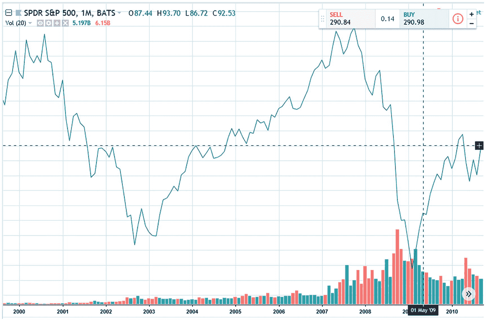

**图 11-1** 2000 年 1 月至 2009 年 1 月期间的 `SPY` 月度图表

请注意，输入数据集包含了两次市场崩盘期间的市场价格，因此网络应该能够学习到这些崩盘期间的市场行为。我们从之前的示例中已经了解到，为了在训练范围之外进行预测，我们需要将原始数据转换为允许我们这样做的格式。作为此转换的一部分，我们创建了包含两个字段的价格差异数据集。

- 字段 1：当前月与上月价格之间的百分比差异
- 字段 2：下个月与当前月价格之间的百分比差异

表 11-2 显示了转换后的价格差异数据集。

**表 11-2** 价格差异数据集

| 字段 1 | 字段 2 | 日期 | 输入价格 |
| --- | --- | --- | --- |
| -5.090352221 | -2.010814222 | 200001 | 1394.46 |
| -2.010814222 | 9.671989579 | 200002 | 1366.42 |
| 9.671989579 | -3.079582004 | 200003 | 1498.58 |
| -3.079582004 | -2.191499762 | 200004 | 1452.43 |
| -2.191499762 | 2.39335492 | 200005 | 1420.6 |
| 2.39335492 | -1.63412622 | 200006 | 1454.6 |
| -1.63412622 | 6.069903483 | 200007 | 1430.83 |
| 6.069903483 | -5.348294766 | 200008 | 1517.68 |
| -5.348294766 | -0.494949565 | 200009 | 1436.51 |
| -0.494949565 | -8.006856024 | 200010 | 1429.4 |
| -8.006856024 | 0.405338606 | 200011 | 1314.95 |
| 0.405338606 | 3.463659224 | 200012 | 1320.28 |
| 3.463659224 | -9.229068601 | 200101 | 1366.01 |
| -9.229068601 | -6.420471958 | 200102 | 1239.94 |
| -6.420471958 | 7.681435454 | 200103 | 1160.33 |
| 7.681435454 | 0.509019897 | 200104 | 1249.46 |
| 0.509019897 | -2.503543501 | 200105 | 1255.82 |
| -2.503543501 | -1.07401297 | 200106 | 1224.38 |
| -1.07401297 | -6.410838569 | 200107 | 1211.23 |
| -6.410838569 | -8.172338962 | 200108 | 1133.58 |
| -8.172338962 | 1.809902588 | 200109 | 1040.94 |
| 1.809902588 | 7.517597992 | 200110 | 1059.78 |
| 7.517597992 | 0.757382948 | 200111 | 1139.45 |
| 0.757382948 | -1.557382761 | 200112 | 1148.08 |
| -1.557382761 | -2.076623606 | 200201 | 1130.2 |
| -2.076623606 | 3.673886133 | 200202 | 1106.73 |
| 3.673886133 | -6.141765224 | 200203 | 1147.39 |
| -6.141765224 | -0.908145452 | 200204 | 1076.92 |
| -0.908145452 | -7.245534794 | 200205 | 1067.14 |
| -7.245534794 | -7.90042634 | 200206 | 989.82 |
| -7.90042634 | 0.488141989 | 200207 | 911.62 |
| 0.488141989 | -11.00243431 | 200208 | 916.07 |
| -11.00243431 | 8.64488274 | 200209 | 815.28 |
| 8.64488274 | 5.706963512 | 200210 | 885.76 |
| 5.706963512 | -6.033258216 | 200211 | 936.31 |
| -6.033258216 | -2.741469846 | 200212 | 879.82 |
| -2.741469846 | -1.700362276 | 200301 | 855.7 |
| -1.700362276 | 0.835760566 | 200302 | 841.15 |
| 0.835760566 | 8.104411799 | 200303 | 848.18 |
| 8.104411799 | 5.089866073 | 200304 | 916.92 |
| 5.089866073 | 1.132224286 | 200305 | 963.59 |
| 1.132224286 | 1.622370446 | 200306 | 974.5 |
| 1.622370446 | 1.787319122 | 200307 | 990.31 |
| 1.787319122 | -1.194432595 | 200308 | 1008.01 |
| -1.194432595 | 5.496149482 | 200309 | 995.97 |
| 5.496149482 | 0.71285131 | 200310 | 1050.71 |
| 0.71285131 | 5.076545077 | 200311 | 1058.2 |
| 5.076545077 | 1.727642276 | 200312 | 1111.92 |
| 1.727642276 | 1.220902991 | 200401 | 1131.13 |
| 1.220902991 | -1.635893584 | 200402 | 1144.94 |
| -1.635893584 | -1.679082942 | 200403 | 1126.21 |
| -1.679082942 | 1.208344622 | 200404 | 1107.3 |
| 1.208344622 | 1.798907806 | 200405 | 1120.68 |
| 1.798907806 | -3.429052277 | 200406 | 1140.84 |
| -3.429052277 | 0.228733253 | 200407 | 1101.72 |
| 0.228733253 | 0.93639064 | 200408 | 1104.24 |
| 0.93639064 | 1.401424752 | 200409 | 1114.58 |
| 1.401424752 | 3.859493895 | 200410 | 1130.2 |
| 3.859493895 | 3.245812816 | 200411 | 1173.82 |
| 3.245812816 | -2.529044821 | 200412 | 1211.92 |
| -2.529044821 | 1.890338365 | 200501 | 1181.27 |
| 1.890338365 | -1.911764706 | 200502 | 1203.6 |
| -1.911764706 | -2.010858977 | 200503 | 1180.59 |
| -2.010858977 | 2.99520249 | 200504 | 1156.85 |
| 2.99520249 | -0.01426773 | 200505 | 1191.5 |
| -0.01426773 | 3.59682036 | 200506 | 1191.33 |
| 3.59682036 | -1.122202596 | 200507 | 1234.18 |
| -1.122202596 | 0.694894004 | 200508 | 1220.33 |
| 0.694894004 | -1.774074104 | 200509 | 1228.81 |
| -1.774074104 | 3.518612108 | 200510 | 1207.01 |
| 3.518612108 | -0.09523962 | 200511 | 1249.48 |
| -0.09523962 | 2.546683864 | 200512 | 1248.29 |
| 2.546683864 | 0.045309668 | 200601 | 1280.08 |
| 0.045309668 | 1.109584121 | 200602 | 1280.66 |
| 1.109584121 | 1.215566041 | 200603 | 1294.87 |
| 1.215566041 | -3.091690129 | 200604 | 1310.61 |
| -3.091690129 | 0.008660804 | 200605 | 1270.09 |
| 0.008660804 | 0.508581326 | 200606 | 1270.2 |
| 0.508581326 | 2.127426253 | 200607 | 1276.66 |
| 2.127426253 | 2.456627449 | 200608 | 1303.82 |
| 2.456627449 | 3.15080286 | 200609 | 1335.85 |
| 3.15080286 | 1.646660958 | 200610 | 1377.94 |
| 1.646660958 | 1.261575148 | 200611 | 1400.63 |
| 1.261575148 | 1.405908482 | 200612 | 1418.3 |
| 1.405908482 | -2.184614529 | 200701 | 1438.24 |
| -2.184614529 | 0.997995479 | 200702 | 1406.82 |
| 0.997995479 | 4.329068311 | 200703 | 1420.86 |
| 4.329068311 | 3.25492286 | 200704 | 1482.37 |
| 3.25492286 | -1.781630973 | 200705 | 1530.62 |
| -1.781630973 | -3.198190707 | 200706 | 1503.35 |
| -3.198190707 | 1.286359232 | 200707 | 1455.27 |
| 1.286359232 | 3.579400132 | 200708 | 1473.99 |
| 3.579400132 | 1.482233503 | 200709 | 1526.75 |
| 1.482233503 | -4.404342382 | 200710 | 1549.38 |
| -4.404342382 | -0.862848887 | 200711 | 1481.14 |
| -0.862848887 | -6.11634749 | 200712 | 1468.36 |
| -6.11634749 | -3.476116209 | 200801 | 1378.55 |
| -3.476116209 | -0.595958305 | 200802 | 1330.63 |
| -0.595958305 | 4.754668481 | 200803 | 1322.7 |
| 4.754668481 | 1.067415325 | 200804 | 1385.59 |
| 1.067415325 | -8.596238164 | 200805 | 1400.38 |
| -8.596238164 | -0.9859375 | 200806 | 1280 |
| -0.9859375 | 1.219050324 | 200807 | 1267.38 |
| 1.219050324 | -9.079145327 | 200808 | 1282.83 |
| -9.079145327 | -16.94245344 | 200809 | 1166.36 |
| -16.94245344 | -7.484903226 | 200810 | 968.75 |
| -7.484903226 | 0.782156565 | 200811 | 896.24 |
| 0.782156565 | -8.565734846 | 200812 | 903.25 |
| -8.565734846 | -10.99312249 | 200901 | 825.88 |
| -10.99312249 | 8.540450829 | 200902 | 735.09 |
| 8.540450829 | 9.392507551 | 200903 | 797.87 |
| 9.392507551 | 5.308142666 | 200904 | 872.81 |
| 5.308142666 | 0.019583524 | 200905 | 919.14 |
| 0.019583524 | 7.414175695 | 200906 | 919.32 |
| 7.414175695 | 3.356017337 | 200907 | 987.48 |
| 3.356017337 | 3.572338383 | 200908 | 1020.62 |
| 3.572338383 | -1.976198585 | 200909 | 1057.08 |
| -1.976198585 | 5.736399695 | 200910 | 1036.19 |
| 5.736399695 | 1.777059774 | 200911 | 1095.63 |
| 1.777059774 | -3.69742624 | 200912 | 1115.1 |

第 3 列和第 4 列用于辅助计算第 1 列和第 2 列，但在处理过程中会被忽略。与往常一样，我们将此数据集归一化到区间 [-1, 1] 上。表 11-3 展示了归一化后的数据集。

**表 11-3** 归一化后的价格差异数据集

| `priceDiffPerc` | `targetPriceDiffPerc` | `Date` | `inputPrice` |
| --- | --- | --- | --- |
| -0.006023481 | 0.199279052 | 200001 | 1394.46 |
| 0.199279052 | 0.978132639 | 200002 | 1366.42 |
| 0.978132639 | 0.128027866 | 200003 | 1498.58 |
| 0.128027866 | 0.187233349 | 200004 | 1452.43 |
| 0.187233349 | 0.492890328 | 200005 | 1420.6 |
| 0.492890328 | 0.224391585 | 200006 | 1454.6 |
| 0.224391585 | 0.737993566 | 200007 | 1430.83 |
| 0.737993566 | -0.023219651 | 200008 | 1517.68 |
| -0.023219651 | 0.300336696 | 200009 | 1436.51 |
| 0.300336696 | -0.200457068 | 200010 | 1429.4 |
| -0.200457068 | 0.360355907 | 200011 | 1314.95 |
| 0.360355907 | 0.564243948 | 200012 | 1320.28 |
| 0.564243948 | -0.281937907 | 200101 | 1366.01 |
| -0.281937907 | -0.094698131 | 200102 | 1239.94 |
| -0.094698131 | 0.84542903 | 200103 | 1160.33 |
| 0.84542903 | 0.367267993 | 200104 | 1249.46 |
| 0.367267993 | 0.166430433 | 200105 | 1255.82 |
| 0.166430433 | 0.261732469 | 200106 | 1224.38 |
| 0.261732469 | -0.094055905 | 200107 | 1211.23 |
| -0.094055905 | -0.211489264 | 200108 | 1133.58 |
| -0.211489264 | 0.453993506 | 200109 | 1040.94 |
| 0.453993506 | 0.834506533 | 200110 | 1059.78 |
| 0.834506533 | 0.38382553 | 200111 | 1139.45 |
| 0.38382553 | 0.229507816 | 200112 | 1148.08 |
| 0.229507816 | 0.19489176 | 200201 | 1130.2 |
| 0.19489176 | 0.578259076 | 200202 | 1106.73 |
| 0.578259076 | -0.076117682 | 200203 | 1147.39 |
| -0.076117682 | 0.272790303 | 200204 | 1076.92 |
| 0.272790303 | -0.14970232 | 200205 | 1067.14 |
| -0.14970232 | -0.193361756 | 200206 | 989.82 |
| -0.193361756 | 0.365876133 | 200207 | 911.62 |
| 0.365876133 | -0.400162287 | 200208 | 916.07 |
| -0.400162287 | 0.909658849 | 200209 | 815.28 |
| 0.909658849 | 0.713797567 | 200210 | 885.76 |
| 0.713797567 | -0.068883881 | 200211 | 936.31 |
| -0.068883881 | 0.150568677 | 200212 | 879.82 |
| 0.150568677 | 0.219975848 | 200301 | 855.7 |
| 0.219975848 | 0.389050704 | 200302 | 841.15 |
| 0.389050704 | 0.873627453 | 200303 | 848.18 |
| 0.873627453 | 0.672657738 | 200304 | 916.92 |
| 0.672657738 | 0.408814952 | 200305 | 963.59 |
| 0.408814952 | 0.441491363 | 200306 | 974.5 |
| 0.441491363 | 0.452487941 | 200307 | 990.31 |
| 0.452487941 | 0.253704494 | 200308 | 1008.01 |
| 0.253704494 | 0.699743299 | 200309 | 995.97 |
| 0.699743299 | 0.380856754 | 200310 | 1050.71 |
| 0.380856754 | 0.671769672 | 200311 | 1058.2 |
| 0.671769672 | 0.448509485 | 200312 | 1111.92 |
| 0.448509485 | 0.414726866 | 200401 | 1131.13 |
| 0.414726866 | 0.224273761 | 200402 | 1144.94 |
| 0.224273761 | 0.221394471 | 200403 | 1126.21 |
| 0.221394471 | 0.413889641 | 200404 | 1107.3 |
| 0.413889641 | 0.45326052 | 200405 | 1120.68 |
| 0.45326052 | 0.104729848 | 200406 | 1140.84 |
| 0.104729848 | 0.348582217 | 200407 | 1101.72 |
| 0.348582217 | 0.395759376 | 200408 | 1104.24 |
| 0.395759376 | 0.42676165 | 200409 | 1114.58 |
| 0.42676165 | 0.590632926 | 200410 | 1130.2 |
| 0.590632926 | 0.549720854 | 200411 | 1173.82 |
| 0.549720854 | 0.164730345 | 200412 | 1211.92 |
| 0.164730345 | 0.459355891 | 200501 | 1181.27 |
| 0.459355891 | 0.205882353 | 200502 | 1203.6 |
| 0.205882353 | 0.199276068 | 200503 | 1180.59 |
| 0.199276068 | 0.533013499 | 200504 | 1156.85 |
| 0.533013499 | 0.332382151 | 200505 | 1191.5 |
| 0.332382151 | 0.573121357 | 200506 | 1191.33 |
| 0.573121357 | 0.258519827 | 200507 | 1234.18 |
| 0.258519827 | 0.3796596 | 200508 | 1220.33 |
| 0.3796596 | 0.215061726 | 200509 | 1228.81 |
| 0.215061726 | 0.567907474 | 200510 | 1207.01 |
| 0.567907474 | 0.326984025 | 200511 | 1249.48 |
| 0.326984025 | 0.503112258 | 200512 | 1248.29 |
| 0.503112258 | 0.336353978 | 200601 | 1280.08 |
| 0.336353978 | 0.407305608 | 200602 | 1280.66 |
| 0.407305608 | 0.414371069 | 200603 | 1294.87 |
| 0.414371069 | 0.127220658 | 200604 | 1310.61 |
| 0.127220658 | 0.33391072 | 200605 | 1270.09 |
| 0.33391072 | 0.367238755 | 200606 | 1270.2 |
| 0.367238755 | 0.47516175 | 200607 | 1276.66 |
| 0.47516175 | 0.497108497 | 200608 | 1303.82 |
| 0.497108497 | 0.543386857 | 200609 | 1335.85 |
| 0.543386857 | 0.443110731 | 200610 | 1377.94 |
| 0.443110731 | 0.417438343 | 200611 | 1400.63 |
| 0.417438343 | 0.427060565 | 200612 | 1418.3 |
| 0.427060565 | 0.187692365 | 200701 | 1438.24 |
| 0.187692365 | 0.399866365 | 200702 | 1406.82 |
| 0.399866365 | 0.621937887 | 200703 | 1420.86 |
| 0.621937887 | 0.550328191 | 200704 | 1482.37 |
| 0.550328191 | 0.214557935 | 200705 | 1530.62 |
| 0.214557935 | 0.12012062 | 200706 | 1503.35 |
| 0.12012062 | 0.419090615 | 200707 | 1455.27 |
| 0.419090615 | 0.571960009 | 200708 | 1473.99 |
| 0.571960009 | 0.4321489 | 200709 | 1526.75 |
| 0.4321489 | 0.039710508 | 200710 | 1549.38 |
| 0.039710508 | 0.275810074 | 200711 | 1481.14 |
| 0.275810074 | -0.074423166 | 200712 | 1468.36 |
| -0.074423166 | 0.101592253 | 200801 | 1378.55 |
| 0.101592253 | 0.29360278 | 200802 | 1330.63 |
| 0.29360278 | 0.650311232 | 200803 | 1322.7 |
| 0.650311232 | 0.404494355 | 200804 | 1385.59 |
| 0.404494355 | -0.239749211 | 200805 | 1400.38 |
| -0.239749211 | 0.267604167 | 200806 | 1280 |
| 0.267604167 | 0.414603355 | 200807 | 1267.38 |
| 0.414603355 | -0.271943022 | 200808 | 1282.83 |
| -0.271943022 | -0.796163563 | 200809 | 1166.36 |
| -0.796163563 | -0.165660215 | 200810 | 968.75 |
| -0.165660215 | 0.385477104 | 200811 | 896.24 |
| 0.385477104 | -0.237715656 | 200812 | 903.25 |
| -0.237715656 | -0.399541499 | 200901 | 825.88 |
| -0.399541499 | 0.902696722 | 200902 | 735.09 |
| 0.902696722 | 0.959500503 | 200903 | 797.87 |
| 0.959500503 | 0.687209511 | 200904 | 872.81 |
| 0.687209511 | 0.334638902 | 200905 | 919.14 |
| 0.334638902 | 0.827611713 | 200906 | 919.32 |
| 0.827611713 | 0.557067822 | 200907 | 987.48 |
| 0.557067822 | 0.571489226 | 200908 | 1020.62 |
| 0.571489226 | 0.201586761 | 200909 | 1057.08 |
| 0.201586761 | 0.71575998 | 200910 | 1036.19 |
| 0.71575998 | 0.451803985 | 200911 | 1095.63 |
| 0.451803985 | 0.086838251 | 200912 | 1115.1 |

再次强调，请忽略第 3 列和第 4 列。它们在此处仅用于我们准备此数据集的惯例，但不会被处理。

## 将函数拓扑结构纳入数据集

接下来，我们希望将函数拓扑结构的信息纳入数据集中，因为这不仅允许匹配单个 `Field1` 值，还能匹配一组 12 个 `Field1` 值（即匹配一年的数据）。为此，我们使用滑动窗口记录来构建训练文件。每个滑动窗口记录包含来自 12 条原始记录的 12 个 `inputPriceDiffPerc` 字段，以及来自下一条原始记录（紧随第 12 条原始记录之后的记录）的 `targetPriceDiffPerc` 字段。清单 11-1 展示了最终的数据集。

**清单 11-1** 由滑动窗口记录组成的训练数据集

|   |   |   |   | 滑动窗口 |   |   |   |   |
|---|---|---|---|---|---|---|---|---|
| 0.723 | 0.724 | 0.623 | 0.854 | -0.050 | 0.688 | 0.103 | 0.631 | 0.438 | 0.401 | 0.803 | 0.666 | 0.208 |
| 0.724 | 0.623 | 0.854 | -0.050 | 0.688 | 0.103 | 0.631 | 0.438 | 0.401 | 0.803 | 0.666 | 0.394 | 0.596 |
| 0.623 | 0.854 | -0.050 | 0.688 | 0.103 | 0.631 | 0.438 | 0.401 | 0.803 | 0.666 | 0.394 | 0.208 | 0.256 |
| 0.854 | -0.050 | 0.688 | 0.103 | 0.631 | 0.438 | 0.401 | 0.803 | 0.666 | 0.394 | 0.208 | 0.596 | -0.639 |
| -0.050 | 0.688 | 0.103 | 0.631 | 0.438 | 0.401 | 0.803 | 0.666 | 0.394 | 0.208 | 0.596 | 0.256 | 0.749 |
| 0.688 | 0.103 | 0.631 | 0.438 | 0.401 | 0.803 | 0.666 | 0.394 | 0.208 | 0.596 | 0.256 | -0.639 | 0.869 |
| 0.103 | 0.631 | 0.438 | 0.401 | 0.803 | 0.666 | 0.394 | 0.208 | 0.596 | 0.256 | -0.639 | 0.749 | 0.728 |
| 0.631 | 0.438 | 0.401 | 0.803 | 0.666 | 0.394 | 0.208 | 0.596 | 0.256 | -0.639 | 0.749 | 0.869 | 0.709 |
| 0.438 | 0.401 | 0.803 | 0.666 | 0.394 | 0.208 | 0.596 | 0.256 | -0.639 | 0.749 | 0.869 | 0.728 | 0.607 |
| 0.401 | 0.803 | 0.666 | 0.394 | 0.208 | 0.596 | 0.256 | -0.639 | 0.749 | 0.869 | 0.728 | 0.709 | 0.118 |
| 0.803 | 0.666 | 0.394 | 0.208 | 0.596 | 0.256 | -0.639 | 0.749 | 0.869 | 0.728 | 0.709 | 0.607 | 0.592 |
| 0.666 | 0.394 | 0.208 | 0.596 | 0.256 | -0.639 | 0.749 | 0.869 | 0.728 | 0.709 | 0.607 | 0.118 | 0.586 |
| 0.394 | 0.208 | 0.596 | 0.256 | -0.639 | 0.749 | 0.869 | 0.728 | 0.709 | 0.607 | 0.118 | 0.592 | 0.167 |
| 0.208 | 0.596 | 0.256 | -0.639 | 0.749 | 0.869 | 0.728 | 0.709 | 0.607 | 0.118 | 0.592 | 0.586 | 0.696 |
| 0.596 | 0.256 | -0.639 | 0.749 | 0.869 | 0.728 | 0.709 | 0.607 | 0.118 | 0.592 | 0.586 | 0.167 | 0.120 |
| 0.256 | -0.639 | 0.749 | 0.869 | 0.728 | 0.709 | 0.607 | 0.118 | 0.592 | 0.586 | 0.167 | 0.696 | 0.292 |
| -0.639 | 0.749 | 0.869 | 0.728 | 0.709 | 0.607 | 0.118 | 0.592 | 0.586 | 0.167 | 0.696 | 0.120 | 0.143 |
| 0.749 | 0.869 | 0.728 | 0.709 | 0.607 | 0.118 | 0.592 | 0.586 | 0.167 | 0.696 | 0.120 | 0.292 | 0.750 |
| 0.869 | 0.728 | 0.709 | 0.607 | 0.118 | 0.592 | 0.586 | 0.167 | 0.696 | 0.120 | 0.292 | 0.143 | 0.460 |
| 0.728 | 0.709 | 0.607 | 0.118 | 0.592 | 0.586 | 0.167 | 0.696 | 0.120 | 0.292 | 0.143 | 0.750 | 0.719 |
| 0.709 | 0.607 | 0.118 | 0.592 | 0.586 | 0.167 | 0.696 | 0.120 | 0.292 | 0.143 | 0.750 | 0.460 | -0.006 |
| 0.607 | 0.118 | 0.592 | 0.586 | 0.167 | 0.696 | 0.120 | 0.292 | 0.143 | 0.750 | 0.460 | 0.719 | 0.199 |
| 0.118 | 0.592 | 0.586 | 0.167 | 0.696 | 0.120 | 0.292 | 0.143 | 0.750 | 0.460 | 0.719 | -0.006 | 0.978 |
| 0.592 | 0.586 | 0.167 | 0.696 | 0.120 | 0.292 | 0.143 | 0.750 | 0.460 | 0.719 | -0.006 | 0.199 | 0.128 |
| 0.586 | 0.167 | 0.696 | 0.120 | 0.292 | 0.143 | 0.750 | 0.460 | 0.719 | -0.006 | 0.199 | 0.978 | 0.187 |
| 0.167 | 0.696 | 0.120 | 0.292 | 0.143 | 0.750 | 0.460 | 0.719 | -0.006 | 0.199 | 0.978 | 0.128 | 0.493 |
| 0.696 | 0.120 | 0.292 | 0.143 | 0.750 | 0.460 | 0.719 | -0.006 | 0.199 | 0.978 | 0.128 | 0.187 | 0.224 |
| 0.120 | 0.292 | 0.143 | 0.750 | 0.460 | 0.719 | -0.006 | 0.199 | 0.978 | 0.128 | 0.187 | 0.493 | 0.738 |
| 0.292 | 0.143 | 0.750 | 0.460 | 0.719 | -0.006 | 0.199 | 0.978 | 0.128 | 0.187 | 0.493 | 0.224 | -0.023 |
| 0.143 | 0.750 | 0.460 | 0.719 | -0.006 | 0.199 | 0.978 | 0.128 | 0.187 | 0.493 | 0.224 | 0.738 | 0.300 |
| 0.750 | 0.460 | 0.719 | -0.006 | 0.199 | 0.978 | 0.128 | 0.187 | 0.493 | 0.224 | 0.738 | -0.023 | -0.200 |
| 0.460 | 0.719 | -0.006 | 0.199 | 0.978 | 0.128 | 0.187 | 0.493 | 0.224 | 0.738 | -0.023 | 0.300 | 0.360 |
| 0.719 | -0.006 | 0.199 | 0.978 | 0.128 | 0.187 | 0.493 | 0.224 | 0.738 | -0.023 | 0.300 | -0.200 | 0.564 |
| -0.006 | 0.199 | 0.978 | 0.128 | 0.187 | 0.493 | 0.224 | 0.738 | -0.023 | 0.300 | -0.200 | 0.360 | -0.282 |
| 0.199 | 0.978 | 0.128 | 0.187 | 0.493 | 0.224 | 0.738 | -0.023 | 0.300 | -0.200 | 0.360 | 0.564 | -0.095 |
| 0.978 | 0.128 | 0.187 | 0.493 | 0.224 | 0.738 | -0.023 | 0.300 | -0.200 | 0.360 | 0.564 | -0.282 | 0.845 |
| 0.128 | 0.187 | 0.493 | 0.224 | 0.738 | -0.023 | 0.300 | -0.200 | 0.360 | 0.564 | -0.282 | -0.095 | 0.367 |
| 0.187 | 0.493 | 0.224 | 0.738 | -0.023 | 0.300 | -0.200 | 0.360 | 0.564 | -0.282 | -0.095 | 0.845 | 0.166 |
| 0.493 | 0.224 | 0.738 | -0.023 | 0.300 | -0.200 | 0.360 | 0.564 | -0.282 | -0.095 | 0.845 | 0.367 | 0.262 |
| 0.224 | 0.738 | -0.023 | 0.300 | -0.200 | 0.360 | 0.564 | -0.282 | -0.095 | 0.845 | 0.367 | 0.166 | -0.094 |
| 0.738 | -0.023 | 0.300 | -0.200 | 0.360 | 0.564 | -0.282 | -0.095 | 0.845 | 0.367 | 0.166 | 0.262 | -0.211 |
| -0.023 | 0.300 | -0.200 | 0.360 | 0.564 | -0.282 | -0.095 | 0.845 | 0.367 | 0.166 | 0.262 | -0.094 | 0.454 |
| 0.300 | -0.200 | 0.360 | 0.564 | -0.282 | -0.095 | 0.845 | 0.367 | 0.166 | 0.262 | -0.094 | -0.211 | 0.835 |
| -0.200 | 0.360 | 0.564 | -0.282 | -0.095 | 0.845 | 0.367 | 0.166 | 0.262 | -0.094 | -0.211 | 0.454 | 0.384 |
| 0.360 | 0.564 | -0.282 | -0.095 | 0.845 | 0.367 | 0.166 | 0.262 | -0.094 | -0.211 | 0.454 | 0.835 | 0.230 |
| 0.564 | -0.282 | -0.095 | 0.845 | 0.367 | 0.166 | 0.262 | -0.094 | -0.211 | 0.454 | 0.835 | 0.384 | 0.195 |
| -0.282 | -0.095 | 0.845 | 0.367 | 0.166 | 0.262 | -0.094 | -0.211 | 0.454 | 0.835 | 0.384 | 0.230 | 0.578 |
| -0.095 | 0.845 | 0.367 | 0.166 | 0.262 | -0.094 | -0.211 | 0.454 | 0.835 | 0.384 | 0.230 | 0.195 | -0.076 |
| 0.845 | 0.367 | 0.166 | 0.262 | -0.094 | -0.211 | 0.454 | 0.835 | 0.384 | 0.230 | 0.195 | 0.578 | 0.273 |
| 0.367 | 0.166 | 0.262 | -0.094 | -0.211 | 0.454 | 0.835 | 0.384 | 0.230 | 0.195 | 0.578 | -0.076 | -0.150 |
| 0.166 | 0.262 | -0.094 | -0.211 | 0.454 | 0.835 | 0.384 | 0.230 | 0.195 | 0.578 | -0.076 | 0.273 | -0.193 |
| 0.262 | -0.094 | -0.211 | 0.454 | 0.835 | 0.384 | 0.230 | 0.195 | 0.578 | -0.076 | 0.273 | -0.150 | 0.366 |
| -0.094 | -0.211 | 0.454 | 0.835 | 0.384 | 0.230 | 0.195 | 0.578 | -0.076 | 0.273 | -0.150 | -0.193 | -0.400 |
| -0.211 | 0.454 | 0.835 | 0.384 | 0.230 | 0.195 | 0.578 | -0.076 | 0.273 | -0.150 | -0.193 | 0.366 | 0.910 |
| 0.454 | 0.835 | 0.384 | 0.230 | 0.195 | 0.578 | -0.076 | 0.273 | -0.150 | -0.193 | 0.366 | -0.400 | 0.714 |
| 0.835 | 0.384 | 0.230 | 0.195 | 0.578 | -0.076 | 0.273 | -0.150 | -0.193 | 0.366 | -0.400 | 0.910 | -0.069 |
| 0.384 | 0.230 | 0.195 | 0.578 | -0.076 | 0.273 | -0.150 | -0.193 | 0.366 | -0.400 | 0.910 | 0.714 | 0.151 |
| 0.230 | 0.195 | 0.578 | -0.076 | 0.273 | -0.150 | -0.193 | 0.366 | -0.400 | 0.910 | 0.714 | -0.069 | 0.220 |
| 0.195 | 0.578 | -0.076 | 0.273 | -0.150 | -0.193 | 0.366 | -0.400 | 0.910 | 0.714 | -0.069 | 0.151 | 0.389 |
| 0.578 | -0.076 | 0.273 | -0.150 | -0.193 | 0.366 | -0.400 | 0.910 | 0.714 | -0.069 | 0.151 | 0.220 | 0.874 |
| -0.076 | 0.273 | -0.150 | -0.193 | 0.366 | -0.400 | 0.910 | 0.714 | -0.069 | 0.151 | 0.220 | 0.389 | 0.673 |
| 0.273 | -0.150 | -0.193 | 0.366 | -0.400 | 0.910 | 0.714 | -0.069 | 0.151 | 0.220 | 0.389 | 0.874 | 0.409 |
| -0.150 | -0.193 | 0.366 | -0.400 | 0.910 | 0.714 | -0.069 | 0.151 | 0.220 | 0.389 | 0.874 | 0.673 | 0.441 |
| -0.193 | 0.366 | -0.400 | 0.910 | 0.714 | -0.069 | 0.151 | 0.220 | 0.389 | 0.874 | 0.673 | 0.409 | 0.452 |
| 0.366 | -0.400 | 0.910 | 0.714 | -0.069 | 0.151 | 0.220 | 0.389 | 0.874 | 0.673 | 0.409 | 0.441 | 0.254 |
| -0.400 | 0.910 | 0.714 | -0.069 | 0.151 | 0.220 | 0.389 | 0.874 | 0.673 | 0.409 | 0.441 | 0.452 | 0.700 |
| 0.910 | 0.714 | -0.069 | 0.151 | 0.220 | 0.389 | 0.874 | 0.673 | 0.409 | 0.441 | 0.452 | 0.254 | 0.381 |
| 0.714 | -0.069 | 0.151 | 0.220 | 0.389 | 0.874 | 0.673 | 0.409 | 0.441 | 0.452 | 0.254 | 0.700 | 0.672 |
| -0.069 | 0.151 | 0.220 | 0.389 | 0.874 | 0.673 | 0.409 | 0.441 | 0.452 | 0.254 | 0.700 | 0.381 | 0.449 |
| 0.151 | 0.220 | 0.389 | 0.874 | 0.673 | 0.409 | 0.441 | 0.452 | 0.254 | 0.700 | 0.381 | 0.672 | 0.415 |
| 0.220 | 0.389 | 0.874 | 0.673 | 0.409 | 0.441 | 0.452 | 0.254 | 0.700 | 0.381 | 0.672 | 0.449 | 0.224 |
| 0.389 | 0.874 | 0.673 | 0.409 | 0.441 | 0.452 | 0.254 | 0.700 | 0.381 | 0.672 | 0.449 | 0.415 | 0.221 |
| 0.874 | 0.673 | 0.409 | 0.441 | 0.452 | 0.254 | 0.700 | 0.381 | 0.672 | 0.449 | 0.415 | 0.224 | 0.414 |
| 0.673 | 0.409 | 0.441 | 0.452 | 0.254 | 0.700 | 0.381 | 0.672 | 0.449 | 0.415 | 0.224 | 0.221 | 0.453 |
| 0.409 | 0.441 | 0.452 | 0.254 | 0.700 | 0.381 | 0.672 | 0.449 | 0.415 | 0.224 | 0.221 | 0.414 | 0.105 |
| 0.441 | 0.452 | 0.254 | 0.700 | 0.381 | 0.672 | 0.449 | 0.415 | 0.224 | 0.221 | 0.414 | 0.453 | 0.349 |
| 0.452 | 0.254 | 0.700 | 0.381 | 0.672 | 0.449 | 0.415 | 0.224 | 0.221 | 0.414 | 0.453 | 0.105 | 0.396 |
| 0.254 | 0.700 | 0.381 | 0.672 | 0.449 | 0.415 | 0.224 | 0.221 | 0.414 | 0.453 | 0.105 | 0.349 | 0.427 |
| 0.700 | 0.381 | 0.672 | 0.449 | 0.415 | 0.224 | 0.221 | 0.414 | 0.453 | 0.105 | 0.349 | 0.396 | 0.591 |
| 0.381 | 0.672 | 0.449 | 0.415 | 0.224 | 0.221 | 0.414 | 0.453 | 0.105 | 0.349 | 0.396 | 0.427 | 0.550 |
| 0.672 | 0.449 | 0.415 | 0.224 | 0.221 | 0.414 | 0.453 | 0.105 | 0.349 | 0.396 | 0.427 | 0.591 | 0.165 |
| 0.449 | 0.415 | 0.224 | 0.221 | 0.414 | 0.453 | 0.105 | 0.349 | 0.396 | 0.427 | 0.591 | 0.550 | 0.459 |
| 0.415 | 0.224 | 0.221 | 0.414 | 0.453 | 0.105 | 0.349 | 0.396 | 0.427 | 0.591 | 0.550 | 0.165 | 0.206 |
| 0.224 | 0.221 | 0.414 | 0.453 | 0.105 | 0.349 | 0.396 | 0.427 | 0.591 | 0.550 | 0.165 | 0.459 | 0.199 |
| 0.221 | 0.414 | 0.453 | 0.105 | 0.349 | 0.396 | 0.427 | 0.591 | 0.550 | 0.165 | 0.459 | 0.206 | 0.533 |
| 0.414 | 0.453 | 0.105 | 0.349 | 0.396 | 0.427 | 0.591 | 0.550 | 0.165 | 0.459 | 0.206 | 0.199 | 0.332 |
| 0.453 | 0.105 | 0.349 | 0.396 | 0.427 | 0.591 | 0.550 | 0.165 | 0.459 | 0.206 | 0.199 | 0.533 | 0.573 |
| 0.105 | 0.349 | 0.396 | 0.427 | 0.591 | 0.550 | 0.165 | 0.459 | 0.206 | 0.199 | 0.533 | 0.332 | 0.259 |
| 0.349 | 0.396 | 0.427 | 0.591 | 0.550 | 0.165 | 0.459 | 0.206 | 0.199 | 0.533 | 0.332 | 0.573 | 0.380 |
| 0.396 | 0.427 | 0.591 | 0.550 | 0.165 | 0.459 | 0.206 | 0.199 | 0.533 | 0.332 | 0.573 | 0.259 | 0.215 |
| 0.427 | 0.591 | 0.550 | 0.165 | 0.459 | 0.206 | 0.199 | 0.533 | 0.332 | 0.573 | 0.259 | 0.380 | 0.568 |
| 0.591 | 0.550 | 0.165 | 0.459 | 0.206 | 0.199 | 0.533 | 0.332 | 0.573 | 0.259 | 0.380 | 0.215 | 0.327 |
| 0.550 | 0.165 | 0.459 | 0.206 | 0.199 | 0.533 | 0.332 | 0.573 | 0.259 | 0.380 | 0.215 | 0.568 | 0.503 |
| 0.165 | 0.459 | 0.206 | 0.199 | 0.533 | 0.332 | 0.573 | 0.259 | 0.380 | 0.215 | 0.568 | 0.327 | 0.336 |
| 0.459 | 0.206 | 0.199 | 0.533 | 0.332 | 0.573 | 0.259 | 0.380 | 0.215 | 0.568 | 0.327 | 0.503 | 0.407 |
| 0.206 | 0.199 | 0.533 | 0.332 | 0.573 | 0.259 | 0.380 | 0.215 | 0.568 | 0.327 | 0.503 | 0.336 | 0.414 |
| 0.199 | 0.533 | 0.332 | 0.573 | 0.259 | 0.380 | 0.215 | 0.568 | 0.327 | 0.503 | 0.336 | 0.407 | 0.127 |
| 0.533 | 0.332 | 0.573 | 0.259 | 0.380 | 0.215 | 0.568 | 0.327 | 0.503 | 0.336 | 0.407 | 0.414 | 0.334 |
| 0.332 | 0.573 | 0.259 | 0.380 | 0.215 | 0.568 | 0.327 | 0.503 | 0.336 | 0.407 | 0.414 | 0.127 | 0.367 |
| 0.573 | 0.259 | 0.380 | 0.215 | 0.568 | 0.327 | 0.503 | 0.336 | 0.407 | 0.414 | 0.127 | 0.334 | 0.475 |
| 0.259 | 0.380 | 0.215 | 0.568 | 0.327 | 0.503 | 0.336 | 0.407 | 0.414 | 0.127 | 0.334 | 0.367 | 0.497 |
| 0.380 | 0.215 | 0.568 | 0.327 | 0.503 | 0.336 | 0.407 | 0.414 | 0.127 | 0.334 | 0.367 | 0.475 | 0.543 |
| 0.215 | 0.568 | 0.327 | 0.503 | 0.336 | 0.407 | 0.414 | 0.127 | 0.334 | 0.367 | 0.475 | 0.497 | 0.443 |
| 0.568 | 0.327 | 0.503 | 0.336 | 0.407 | 0.414 | 0.127 | 0.334 | 0.367 | 0.475 | 0.497 | 0.543 | 0.417 |
| 0.327 | 0.503 | 0.336 | 0.407 | 0.414 | 0.127 | 0.334 | 0.367 | 0.475 | 0.497 | 0.543 | 0.443 | 0.427 |
| 0.503 | 0.336 | 0.407 | 0.414 | 0.127 | 0.334 | 0.367 | 0.475 | 0.497 | 0.543 | 0.443 | 0.417 | 0.188 |
| 0.336 | 0.407 | 0.414 | 0.127 | 0.334 | 0.367 | 0.475 | 0.497 | 0.543 | 0.443 | 0.417 | 0.427 | 0.400 |
| 0.407 | 0.414 | 0.127 | 0.334 | 0.367 | 0.475 | 0.497 | 0.543 | 0.443 | 0.417 | 0.427 | 0.188 | 0.622 |
| 0.414 | 0.127 | 0.334 | 0.367 | 0.475 | 0.497 | 0.543 | 0.443 | 0.417 | 0.427 | 0.188 | 0.400 | 0.550 |
| 0.127 | 0.334 | 0.367 | 0.475 | 0.497 | 0.543 | 0.443 | 0.417 | 0.427 | 0.188 | 0.400 | 0.622 | 0.215 |
| 0.334 | 0.367 | 0.475 | 0.497 | 0.543 | 0.443 | 0.417 | 0.427 | 0.188 | 0.400 | 0.622 | 0.550 | 0.120 |
| 0.367 | 0.475 | 0.497 | 0.543 | 0.443 | 0.417 | 0.427 | 0.188 | 0.400 | 0.622 | 0.550 | 0.215 | 0.419 |
| 0.475 | 0.497 | 0.543 | 0.443 | 0.417 | 0.427 | 0.188 | 0.400 | 0.622 | 0.550 | 0.215 | 0.120 | 0.572 |
| 0.497 | 0.543 | 0.443 | 0.417 | 0.427 | 0.188 | 0.400 | 0.622 | 0.550 | 0.215 | 0.120 | 0.419 | 0.432 |
| 0.543 | 0.443 | 0.417 | 0.427 | 0.188 | 0.400 | 0.622 | 0.550 | 0.215 | 0.120 | 0.419 | 0.572 | 0.040 |
| 0.443 | 0.417 | 0.427 | 0.188 | 0.400 | 0.622 | 0.550 | 0.215 | 0.120 | 0.419 | 0.572 | 0.432 | 0.276 |
| 0.417 | 0.427 | 0.188 | 0.400 | 0.622 | 0.550 | 0.215 | 0.120 | 0.419 | 0.572 | 0.432 | 0.040 | -0.074 |
| 0.427 | 0.188 | 0.400 | 0.622 | 0.550 | 0.215 | 0.120 | 0.419 | 0.572 | 0.432 | 0.040 | 0.276 | 0.102 |
| 0.188 | 0.400 | 0.622 | 0.550 | 0.215 | 0.120 | 0.419 | 0.572 | 0.432 | 0.040 | 0.276 | -0.074 | 0.294 |
| 0.400 | 0.622 | 0.550 | 0.215 | 0.120 | 0.419 | 0.572 | 0.432 | 0.040 | 0.276 | -0.074 | 0.102 | 0.650 |

由于函数是非连续的，我们将此数据集拆分为微批次（单月记录）。

## 构建微批次文件

清单 11-2 展示了从归一化滑动窗口数据集构建微批次文件的程序代码。

```
```

// 从归一化滑动窗口文件构建微批次文件。
// 每个微批次数据集应包含 12 个 `inputPriceDiffPerc` 字段，
// 这些字段取自原始文件中的 12 条记录，外加一个 `targetPriceDiffPerc`
// 值，该值取自下一条月记录。每个微批次都包含标签记录。

```java
package sample7_build_microbatches;

import java.io.BufferedReader;
import java.io.BufferedWriter;
import java.io.File;
import java.io.FileInputStream;
import java.io.PrintWriter;
import java.io.FileNotFoundException;
import java.io.FileReader;
import java.io.FileWriter;
import java.io.IOException;
import java.io.InputStream;
import java.nio.file.*;
import java.util.Properties;

public class Sample7_Build_MicroBatches
{
    // 训练配置
    static int numberOfRowsInInputFile = 121;
    static int numberOfRowsInBatch = 13;
    static String  strInputFileName =
        "C:/My_Neural_Network_Book/Book_Examples/Sample7_SlidWindows_Train.csv";
    static String  strOutputFileNameBase =
        "C:/My_Neural_Network_Book/Temp_Files/Sample7_Microbatches_Train_Batch_";

    // 测试配置
    //static int numberOfRowsInInputFile = 122;
    //static int numberOfRowsInBatch = 13;
    //static String  strInputFileName =
    //    "C:/My_Neural_Network_Book/Book_Examples/Sample7_SlidWindows_Test.csv";
    //static String  strOutputFileNameBase =
    //    "C:/My_Neural_Network_Book/Temp_Files/Sample7_Microbatches_Test_Batch_";

    static InputStream input = null;

    // ===================================================================
    // 主方法
    // ===================================================================
    public static void main(String[] args)
    {
        BufferedReader br;
        PrintWriter out;
        String cvsSplitBy = ",";
        String line = "";
        String lineLabel = "";
        String[] strOutputFileNames = new String[1070];
        String iString;
        String strOutputFileName;
        String[] strArrLine = new String[1086];
        int i;
        int r;

        // 读取原始数据并将其拆分为批次
        try
        {
            // 如果输出文件存在，则删除所有输出文件
            for (i = 0; i < 10 && i = 10 && i < 100)
                strOutputFileName = strOutputFileNameBase + "0" + iString + ".csv";
            else
                strOutputFileName = strOutputFileNameBase + iString + ".csv";

            out = new PrintWriter(new BufferedWriter(new FileWriter(strOutputFileName)));

            // 按原样写入标题行
            out.println(lineLabel);
            out.println(strArrLine[i]);
            out.close();
        }  // 结束 FOR i 循环
        }  // 结束 TRY
        catch (IOException io)
        {
            io.printStackTrace();
        }
    }  // 结束主方法
}  // 结束类
```

### 清单 11-2

构建微批次文件的程序代码

此程序将滑动窗口数据集拆分为微批次文件。图 11-2 展示了微批次文件列表的一个片段。

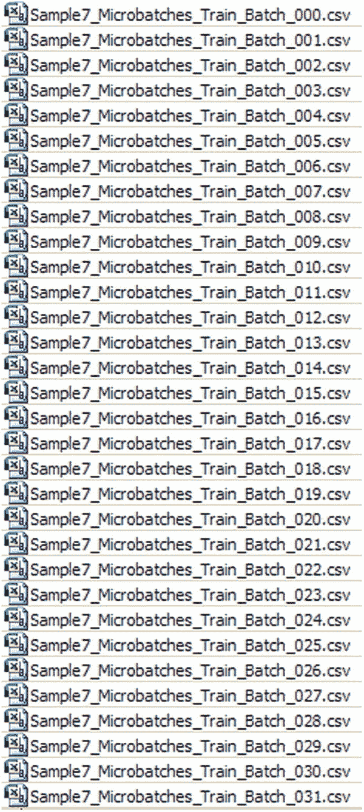

图 11-2

微批次文件列表片段

### 清单 11-3

微批次文件示例

清单 11-3 展示了每个微批次数据集打开时的样子。

```
滑动窗口微批次记录
-0.006023481 0.199279052 0.978132639 0.128027866 0.187233349 0.492890328 0.224391585 0.737993566 -0.023219651 0.300336696 -0.200457068 0.360355907 -0.281937907
```

微批次文件是供网络处理的训练文件。

### 网络架构

图 11-3 展示了此示例的网络架构。该网络有 12 个输入神经元、七个隐藏层（每层有 25 个神经元）以及一个输出层神经元。

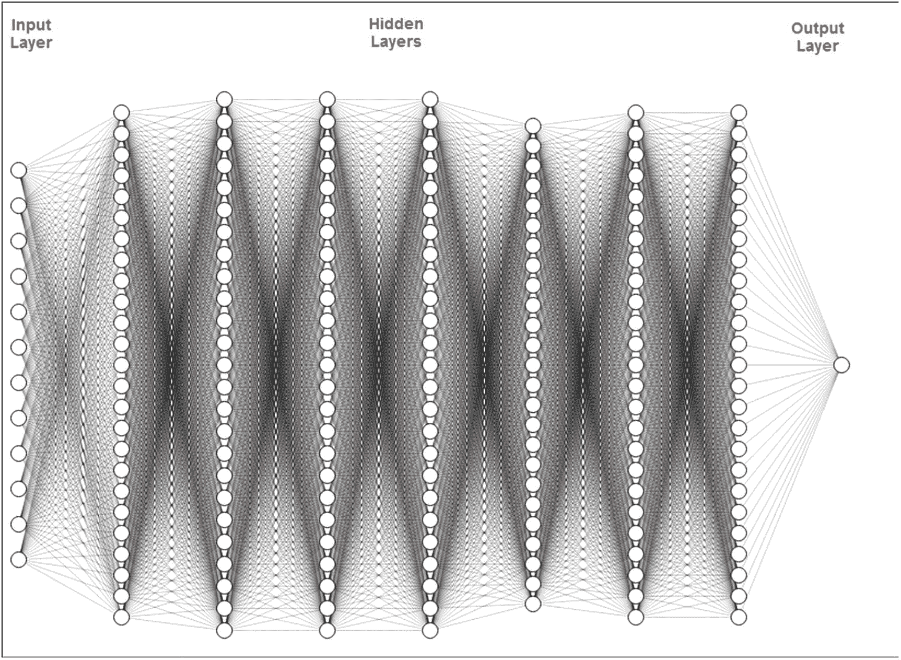

图 11-3

网络架构

现在，我们准备构建网络处理程序。

### 程序代码

#### 清单 11-4

展示了程序代码。

```java
// ==============================================================
// 使用微批次方法逼近 SPY 价格函数。
// 每个微批次文件包含标签记录和数据记录。
// 数据记录包含 12 个 `inputPriceDiffPerc` 字段以及一个
// `targetPriceDiffPerc` 字段。
//
// 输入层神经元数量为 12
// 输出层神经元数量为 1
// ==============================================================

package saple7;

import java.io.BufferedReader;
import java.io.File;
import java.io.FileInputStream;
import java.io.PrintWriter;
import java.io.FileNotFoundException;
import java.io.FileReader;
import java.io.FileWriter;
import java.io.IOException;
import java.io.InputStream;
import java.nio.file.*;
import java.util.Properties;
import java.time.YearMonth;
import java.awt.Color;
import java.awt.Font;
import java.io.BufferedReader;
import java.io.BufferedWriter;
import java.text.DateFormat;
import java.text.ParseException;
import java.text.SimpleDateFormat;
import java.time.LocalDate;
import java.time.Month;
import java.time.ZoneId;
import java.util.ArrayList;
import java.util.Calendar;
import java.util.Date;
import java.util.List;
import java.util.Locale;
import java.util.Properties;
import org.encog.Encog;
import org.encog.engine.network.activation.ActivationTANH;
import org.encog.engine.network.activation.ActivationReLU;
import org.encog.ml.data.MLData;
import org.encog.ml.data.MLDataPair;
import org.encog.ml.data.MLDataSet;
import org.encog.ml.data.buffer.MemoryDataLoader;
import org.encog.ml.data.buffer.codec.CSVDataCODEC;
import org.encog.ml.data.buffer.codec.DataSetCODEC;
import org.encog.neural.networks.BasicNetwork;
import org.encog.neural.networks.layers.BasicLayer;
import org.encog.neural.networks.training.propagation.resilient.ResilientPropagation;
import org.encog.persist.EncogDirectoryPersistence;
import org.encog.util.csv.CSVFormat;
import org.knowm.xchart.SwingWrapper;
import org.knowm.xchart.XYChart;
import org.knowm.xchart.XYChartBuilder;
import org.knowm.xchart.XYSeries;
import org.knowm.xchart.demo.charts.ExampleChart;
import org.knowm.xchart.style.Styler.LegendPosition;
import org.knowm.xchart.style.colors.ChartColor;
import org.knowm.xchart.style.colors.XChartSeriesColors;
import org.knowm.xchart.style.lines.SeriesLines;
import org.knowm.xchart.style.markers.SeriesMarkers;
import org.knowm.xchart.BitmapEncoder;
import org.knowm.xchart.BitmapEncoder.BitmapFormat;
import org.knowm.xchart.QuickChart;
import org.knowm.xchart.SwingWrapper;

public class Saple7 implements ExampleChart
{
    // 归一化参数
    // 归一化区间
    static double Nh =  1;
    static double Nl = -1;

    // `inputPriceDiffPerc`
    static double inputPriceDiffPercDh = 10.00;
    static double inputPriceDiffPercDl = -20.00;

    // `targetPriceDiffPerc`
    static double targetPriceDiffPercDh = 10.00;
    static double targetPriceDiffPercDl = -20.00;

    static String cvsSplitBy = ",";
    static Properties prop = null;
    static Date workDate = null;
    static int paramErrorCode = 0;
    static int paramBatchNumber = 0;
    static int paramDayNumber = 0;
    static String strWorkingMode;
    static String strNumberOfBatchesToProcess;
    static String strNumberOfRowsInInputFile;
    static String strNumberOfRowsInBatches;
    static String strIputNeuronNumber;
    static String strOutputNeuronNumber;
    static String strNumberOfRecordsInTestFile;
    static String strInputFileNameBase;
    static String strTestFileNameBase;
    static String strSaveNetworkFileNameBase;
    static String strTrainFileName;
    static String strValidateFileName;
    static String strChartFileName;
    static String strDatesTrainFileName;
    static String strPricesFileName;
    static int intWorkingMode;
    static int intNumberOfBatchesToProcess;
    static int intNumberOfRowsInBatches;
    static int intInputNeuronNumber;
    static int intOutputNeuronNumber;
    static String strOutputFileName;
    static String strSaveNetworkFileName;
    static String strNumberOfMonths;
    static String strYearMonth;
    static XYChart Chart;
    static String iString;
    static double inputPriceFromFile;

    //static List xData = new ArrayList();
    static List xData = new ArrayList();
    static List yData1 = new ArrayList();
    static List yData2 = new ArrayList();

    // 这两个数组用于加载两个日期文件
    static Date[] yearDateTraining = new Date[150];
    static String[] strTrainingFileNames = new String[150];
    static String[] strTestingFileNames = new String[150];
    static String[] strSaveNetworkFileNames = new String[150];
    static BufferedReader br3;

    static double recordNormInputPriceDiffPerc_00 = 0.00;
    static double recordNormInputPriceDiffPerc_01 = 0.00;
    static double recordNormInputPriceDiffPerc_02 = 0.00;
    static double recordNormInputPriceDiffPerc_03 = 0.00;
    static double recordNormInputPriceDiffPerc_04 = 0.00;
    static double recordNormInputPriceDiffPerc_05 = 0.00;
    static double recordNormInputPriceDiffPerc_06 = 0.00;
    static double recordNormInputPriceDiffPerc_07 = 0.00;
    static double recordNormInputPriceDiffPerc_08 = 0.00;
    static double recordNormInputPriceDiffPerc_09 = 0.00;
    static double recordNormInputPriceDiffPerc_10 = 0.00;
```

## 示例代码

以下是一个Java类的示例代码，展示了图表创建、网络训练和测试的逻辑。

```java
static double recordNormInputPriceDiffPerc_11 = 0.00;
static double recordNormTargetPriceDiffPerc = 0.00;
static double tempMonth = 0.00;
static int intNumberOfSavedNetworks = 0;
static double[] linkToSaveInputPriceDiffPerc_00 = new double[150];
static double[] linkToSaveInputPriceDiffPerc_01 = new double[150];
static double[] linkToSaveInputPriceDiffPerc_02 = new double[150];
static double[] linkToSaveInputPriceDiffPerc_03 = new double[150];
static double[] linkToSaveInputPriceDiffPerc_04 = new double[150];
static double[] linkToSaveInputPriceDiffPerc_05 = new double[150];
static double[] linkToSaveInputPriceDiffPerc_06 = new double[150];
static double[] linkToSaveInputPriceDiffPerc_07 = new double[150];
static double[] linkToSaveInputPriceDiffPerc_08 = new double[150];
static double[] linkToSaveInputPriceDiffPerc_09 = new double[150];
static double[] linkToSaveInputPriceDiffPerc_10 = new double[150];
static double[] linkToSaveInputPriceDiffPerc_11 = new double[150];
static int[] returnCodes  = new int[3];
static int intDayNumber = 0;
static File file2 = null;
static double[] linkToSaveTargetPriceDiffPerc = new double[150];
static double[] arrPrices = new double[150];

@Override
public XYChart getChart()
{
    // 创建图表
    Chart = new XYChartBuilder().width(900).height(500).title(getClass().getSimpleName()).xAxisTitle("月份").yAxisTitle("价格").build();

    // 自定义图表
    Chart.getStyler().setPlotBackgroundColor(ChartColor.getAWTColor(ChartColor.GREY));
    Chart.getStyler().setPlotGridLinesColor(new Color(255, 255, 255));
    Chart.getStyler().setChartBackgroundColor(Color.WHITE);
    Chart.getStyler().setLegendBackgroundColor(Color.PINK);
    Chart.getStyler().setChartFontColor(Color.MAGENTA);
    Chart.getStyler().setChartTitleBoxBackgroundColor(new Color(0, 222, 0));
    Chart.getStyler().setChartTitleBoxVisible(true);
    Chart.getStyler().setChartTitleBoxBorderColor(Color.BLACK);
    Chart.getStyler().setPlotGridLinesVisible(true);
    Chart.getStyler().setAxisTickPadding(20);
    Chart.getStyler().setAxisTickMarkLength(15);
    Chart.getStyler().setPlotMargin(20);
    Chart.getStyler().setChartTitleVisible(false);
    Chart.getStyler().setChartTitleFont(new Font(Font.MONOSPACED, Font.BOLD, 24));
    Chart.getStyler().setLegendFont(new Font(Font.SERIF, Font.PLAIN, 18));
    // Chart.getStyler().setLegendPosition(LegendPosition.InsideSE);
    Chart.getStyler().setLegendPosition(LegendPosition.OutsideE);
    Chart.getStyler().setLegendSeriesLineLength(12);
    Chart.getStyler().setAxisTitleFont(new Font(Font.SANS_SERIF, Font.ITALIC, 18));
    Chart.getStyler().setAxisTickLabelsFont(new Font(Font.SERIF, Font.PLAIN, 11));
    Chart.getStyler().setDatePattern("yyyy-MM");
    Chart.getStyler().setDecimalPattern("#0.00");

    // 训练配置
    intWorkingMode = 0;
    intNumberOfBatchesToProcess = 120;
    strInputFileNameBase =
        "C:/My_Neural_Network_Book/Temp_Files/Sample7_Microbatches_Train_Batch_";
    strSaveNetworkFileNameBase =
        "C:/My_Neural_Network_Book/Temp_Files/Sample7_Save_Network_Batch_";
    strChartFileName = "C:/My_Neural_Network_Book/Temp_Files/Sample7_XYLineChart_Train.jpg";
    strDatesTrainFileName =
        "C:/My_Neural_Network_Book/Book_Examples/Sample7_Dates_Real_SP500_3000.csv";
    strPricesFileName =
        "C:/My_Neural_Network_Book/Book_Examples/Sample7_InputPrice_SP500_200001_200901.csv";

    // 测试配置
    //intWorkingMode = 1;
    //intNumberOfBatchesToProcess = 121;
    //intNumberOfSavedNetworks = 120;
    //strInputFileNameBase =
        "C:/My_Neural_Network_Book/Temp_Files/Sample7_Microbatches_Test_Batch_";
    //strSaveNetworkFileNameBase =
        "C:/My_Neural_Network_Book/Temp_Files/Sample7_Save_Network_Batch_";
    //strChartFileName =
        "C:/My_Neural_Network_Book/Book_Examples/Sample7_XYLineChart_Test.jpg";
    //strDatesTrainFileName =
        "C:/My_Neural_Network_Book/Book_Examples/Sample7_Dates_Real_SP500_3000.csv";
    //strPricesFileName =
        "C:/My_Neural_Network_Book/Book_Examples/Sample7_InputPrice_SP500_200001_200901.csv";

    // 通用配置
    intNumberOfRowsInBatches = 1;
    intInputNeuronNumber = 12;
    intOutputNeuronNumber = 1;

    // 生成训练批次文件名及对应的保存网络文件名，并存入数组
    for (int i = 0; i =10 && i  0);
    }   // 结束训练逻辑
    else
    {
        if(intWorkingMode == 1)
        {
            // 加载并测试网络逻辑
            loadAndTestNetwork();
        }
    }  // 结束 ELSE
}     // 结束 Try
catch (Exception e1)
{
    e1.printStackTrace();
}
Encog.getInstance().shutdown();
return Chart;
}  // 结束方法

// =======================================================
// 将 CSV 加载到内存。
// @return 加载的数据集。
// =======================================================
public static MLDataSet loadCSV2Memory(String filename, int input, int ideal,
    boolean headers, CSVFormat format, boolean significance)
{
    DataSetCODEC codec = new CSVDataCODEC(new File(filename), format, headers, input, ideal,
        significance);
    MemoryDataLoader load = new MemoryDataLoader(codec);
    MLDataSet dataset = load.external2Memory();
    return dataset;
}

// =======================================================
//  主方法。
//  @param 命令行参数。不使用任何参数。
// ======================================================
public static void main(String[] args)
{
    ExampleChart exampleChart = new Saple7();
    XYChart Chart = exampleChart.getChart();
    new SwingWrapper(Chart).displayChart();
} // 结束主方法

//=====================================================================
// 模式 0。将批次作为独立网络进行训练，并将它们分别保存到磁盘上的文件中。
//=====================================================================
static public int[] trainBatches(int paramErrorCode,int paramBatchNumber,
    int paramDayNumber)
{
    int rBatchNumber;
    double realDenormTargetToPredictPricePerc = 0;
    double maxGlobalResultDiff = 0.00;
    double averGlobalResultDiff = 0.00;
    double sumGlobalResultDiff = 0.00;
    double normTargetPriceDiffPerc = 0.00;
    double normPredictPriceDiffPerc = 0.00;
    double normInputPriceDiffPercFromRecord = 0.00;
    double denormTargetPriceDiffPerc;
    double denormPredictPriceDiffPerc;
    double denormInputPriceDiffPercFromRecord;
    double workNormInputPrice;
    Date tempDate;
    double trainError;
    double realDenormPredictPrice;
    double realDenormTargetPrice;

    // 构建网络
    BasicNetwork network = new BasicNetwork();
    // 输入层
    network.addLayer(new BasicLayer(null,true,intInputNeuronNumber));
    // 隐藏层。
    network.addLayer(new BasicLayer(new ActivationTANH(),true,25));
    network.addLayer(new BasicLayer(new ActivationTANH(),true,25));
    network.addLayer(new BasicLayer(new ActivationTANH(),true,25));
    network.addLayer(new BasicLayer(new ActivationTANH(),true,25));
    network.addLayer(new BasicLayer(new ActivationTANH(),true,25));
    network.addLayer(new BasicLayer(new ActivationTANH(),true,25));
    network.addLayer(new BasicLayer(new ActivationTANH(),true,25));
    // 输出层
    network.addLayer(new BasicLayer(new ActivationTANH(),false,intOutputNeuronNumber));
    network.getStructure().finalizeStructure();
    network.reset();

    // 遍历批次
    intDayNumber = paramDayNumber;  // 图表的天数
    for (rBatchNumber = paramBatchNumber; rBatchNumber = 500 && realDenormTargetToPredictPricePerc > 0.00091)
    {
        returnCodes[0] = 1;
        returnCodes[1] = rBatchNumber;
        returnCodes[2] = intDayNumber-1;
        //System.out.println("重试");
        return returnCodes;
    }
    //System.out.println(realDenormTargetToPredictPricePerc);
    } while(realDenormTargetToPredictPricePerc >  0.0009);

    // 此批次已优化
    // 保存当前批次的网络
    EncogDirectoryPersistence.saveObject(new
        File(strSaveNetworkFileNames[rBatchNumber]),network);

    // 打印该批次训练后的神经网络结果
    //System.out.println("训练后的神经网络结果");

    // 在网络优化后获取结果
    int i = - 1; // 用于获取结果的数组索引
    maxGlobalResultDiff = 0.00;
    averGlobalResultDiff = 0.00;
    sumGlobalResultDiff = 0.00;
    //if (rBatchNumber == 857)
    //    i = i;

    // 验证
    for (MLDataPair pair:  trainingSet)
    {
        i++;
        MLData inputData = pair.getInput();
        MLData actualData = pair.getIdeal();
        MLData predictData = network.compute(inputData);

        // 这些值是归一化的，因为整个输入都是归一化的
        normTargetPriceDiffPerc = actualData.getData(0);
        normPredictPriceDiffPerc = predictData.getData(0);
        //normInputPriceDiffPercFromRecord[i] = inputData.getData(0);
        normInputPriceDiffPercFromRecord = inputData.getData(0);

        // 反归一化此数据以显示真实结果值
```

## 清单 11-4 神经网络处理程序代码

```java
denormTargetPriceDiffPerc = ((targetPriceDiffPercDl - targetPriceDiffPercDh)*
normTargetPriceDiffPerc - Nh*targetPriceDiffPercDl + targetPriceDiffPercDh*Nl)/(Nl - Nh);

denormPredictPriceDiffPerc =((targetPriceDiffPercDl - targetPriceDiffPercDh)*
normPredictPriceDiffPerc - Nh*targetPriceDiffPercDl + targetPriceDiffPercDh*Nl)/(Nl - Nh);

denormInputPriceDiffPercFromRecord = ((inputPriceDiffPercDl - inputPriceDiffPercDh)*
normInputPriceDiffPercFromRecord - Nh*inputPriceDiffPercDl + inputPriceDiffPercDh*Nl)/(Nl - Nh);

// 获取该行第 12 个元素的价格
inputPriceFromFile = arrPrices[rBatchNumber+12];

// 将 denormPredictPriceDiffPerc 和 denormTargetPriceDiffPerc
// 转换为真实的反归一化价格
realDenormTargetPrice = inputPriceFromFile +
inputPriceFromFile*(denormTargetPriceDiffPerc/100);

realDenormPredictPrice = inputPriceFromFile +
inputPriceFromFile*(denormPredictPriceDiffPerc/100);

realDenormTargetToPredictPricePerc = (Math.abs(realDenormTargetPrice -
realDenormPredictPrice)/realDenormTargetPrice)*100;

System.out.println("月份 = " + (rBatchNumber+1) + "  目标价格 = " + realDenormTargetPrice +
"  预测价格 = " + realDenormPredictPrice + "  差异 = " + realDenormTargetToPredictPricePerc);

if (realDenormTargetToPredictPricePerc > maxGlobalResultDiff)
{
maxGlobalResultDiff = realDenormTargetToPredictPricePerc;
}

sumGlobalResultDiff = sumGlobalResultDiff + realDenormTargetToPredictPricePerc;

// 填充图表元素
tempDate = yearDateTraining[rBatchNumber+14];
//xData.add(tempDate);
tempMonth = (double) rBatchNumber+14;
xData.add(tempMonth);
yData1.add(realDenormTargetPrice);
yData2.add(realDenormPredictPrice);
}  // 结束价格对循环
}  // 结束批次循环

XYSeries series1 = Chart.addSeries("实际价格", xData, yData1);
XYSeries series2 = Chart.addSeries("预测价格", xData, yData2);
series1.setLineColor(XChartSeriesColors.BLUE);
series2.setMarkerColor(Color.ORANGE);
series1.setLineStyle(SeriesLines.SOLID);
series2.setLineStyle(SeriesLines.SOLID);

// 打印最大和平均结果
averGlobalResultDiff = sumGlobalResultDiff/intNumberOfBatchesToProcess;
System.out.println(" ");
System.out.println("maxGlobalResultDiff = " + maxGlobalResultDiff);
System.out.println("averGlobalResultDiff = " + averGlobalResultDiff);
System.out.println(" ");

// 保存图表图像
try
{
BitmapEncoder.saveBitmapWithDPI(Chart, strChartFileName, BitmapFormat.JPG, 100);
}
catch (Exception bt)
{
bt.printStackTrace();
}

System.out.println ("图表和网络已保存");
System.out.println("训练批次验证结束");
returnCodes[0] = 0;
returnCodes[1] = 0;
returnCodes[2] = 0;
return returnCodes;
}  // 结束方法

//======================================================================
// 模式 1。加载之前保存的训练好的网络并处理测试微批次
//======================================================================
static public void loadAndTestNetwork()
{
System.out.println("测试网络结果");
List xData = new ArrayList();
List yData1 = new ArrayList();
List yData2 = new ArrayList();
double realDenormTargetToPredictPricePerc = 0;
double maxGlobalResultDiff = 0.00;
double averGlobalResultDiff = 0.00;
double sumGlobalResultDiff = 0.00;
double maxGlobalIndex = 0;
recordNormInputPriceDiffPerc_00 = 0.00;
recordNormInputPriceDiffPerc_01 = 0.00;
recordNormInputPriceDiffPerc_02 = 0.00;
recordNormInputPriceDiffPerc_03 = 0.00;
recordNormInputPriceDiffPerc_04 = 0.00;
recordNormInputPriceDiffPerc_05 = 0.00;
recordNormInputPriceDiffPerc_06 = 0.00;
recordNormInputPriceDiffPerc_07 = 0.00;
recordNormInputPriceDiffPerc_08 = 0.00;
recordNormInputPriceDiffPerc_09 = 0.00;
recordNormInputPriceDiffPerc_10 = 0.00;
recordNormInputPriceDiffPerc_11 = 0.00;
double recordNormTargetPriceDiffPerc = 0.00;
double normTargetPriceDiffPerc;
double normPredictPriceDiffPerc;
double normInputPriceDiffPercFromRecord;
double denormTargetPriceDiffPerc;
double denormPredictPriceDiffPerc;
double denormInputPriceDiffPercFromRecord;
double realDenormTargetPrice = 0.00;
double realDenormPredictPrice = 0.00;
double minVectorValue = 0.00;
String tempLine;
String[] tempWorkFields;
int tempMinIndex = 0;
double rTempPriceDiffPerc = 0.00;
double rTempKey = 0.00;
double vectorForNetworkRecord = 0.00;
double r_00 = 0.00;
double r_01 = 0.00;
double r_02 = 0.00;
double r_03 = 0.00;
double r_04 = 0.00;
double r_05 = 0.00;
double r_06 = 0.00;
double r_07 = 0.00;
double r_08 = 0.00;
double r_09 = 0.00;
double r_10 = 0.00;
double r_11 = 0.00;
double vectorDiff;
double r1 = 0.00;
double r2 = 0.00;
double vectorForRecord = 0.00;
int k1 = 0;
int k3 = 0;
BufferedReader br4;
BasicNetwork network;

try
{
maxGlobalResultDiff = 0.00;
averGlobalResultDiff = 0.00;
sumGlobalResultDiff = 0.00;
for (k1 = 0; k1 < intNumberOfBatchesToProcess; k1++)
{
// ... (此处省略了部分循环体代码，以保持排版紧凑)
if (realDenormTargetToPredictPricePerc > maxGlobalResultDiff)
{
maxGlobalResultDiff = realDenormTargetToPredictPricePerc;
}
sumGlobalResultDiff = sumGlobalResultDiff + realDenormTargetToPredictPricePerc;
} // 结束 IF

// 填充图表元素
tempMonth = (double) k1+14;
xData.add(tempMonth);
yData1.add(realDenormTargetPrice);
yData2.add(realDenormPredictPrice);
}   // 结束 K1 循环

// 打印最大和平均结果
System.out.println(" ");
System.out.println(" ");
System.out.println("处理测试批次的结果");
averGlobalResultDiff = sumGlobalResultDiff/intNumberOfBatchesToProcess;
System.out.println("maxGlobalResultDiff = " + maxGlobalResultDiff + "  i = " + maxGlobalIndex);
System.out.println("averGlobalResultDiff = " + averGlobalResultDiff);
System.out.println(" ");
System.out.println(" ");
}     // 结束 TRY
catch (IOException e1)
{
e1.printStackTrace();
}

// 所有测试批次文件已处理完毕
XYSeries series1 = Chart.addSeries("实际价格", xData, yData1);
XYSeries series2 = Chart.addSeries("预测价格", xData, yData2);
series1.setLineColor(XChartSeriesColors.BLUE);
series2.setMarkerColor(Color.ORANGE);
series1.setLineStyle(SeriesLines.SOLID);
series2.setLineStyle(SeriesLines.SOLID);

// 保存图表图像
try
{
BitmapEncoder.saveBitmapWithDPI(Chart, strChartFileName, BitmapFormat.JPG, 100);
}
catch (Exception bt)
{
bt.printStackTrace();
}

System.out.println ("图表已保存");
System.out.println("微批次训练测试结束");
} // 结束方法

//=============================================================
// 将训练日期文件加载到内存
//=============================================================
public static void loadDatesInMemory()
{
BufferedReader br1 = null;
DateFormat sdf = new SimpleDateFormat("yyyy-MM");
Date dateTemporateDate = null;
String strTempKeyorateDate;
int intTemporateDate;
String line = "";
String cvsSplitBy = ",";

try
{
br1 = new BufferedReader(new FileReader(strDatesTrainFileName));
int i = -1;
int r = -2;
while ((line = br1.readLine()) != null)
{
i++;
r++;
// 跳过标题行
if(i > 0)
{
// 使用逗号作为分隔符拆分行
String[] workFields = line.split(cvsSplitBy);
strTempKeyorateDate = workFields[0];
intTemporateDate = Integer.parseInt(strTempKeyorateDate);
try
{
dateTemporateDate = convertIntegerToDate(intTemporateDate);
}
catch (ParseException e)
{
e.printStackTrace();
System.exit(1);
}
yearDateTraining[r] = dateTemporateDate;
}
}  // 结束 while 循环
br1.close();
}
catch (IOException ex)
{
ex.printStackTrace();
System.err.println("打开文件时出错 = " + ex);
System.exit(1);
}
}

//=============================================================
// 将整数形式的月份日期转换为 Date 变量
//=============================================================
public static Date convertIntegerToDate(int denormInputDateI) throws ParseException
{
int numberOfYears = denormInputDateI/12;
int numberOfMonths = denormInputDateI - numberOfYears*12;
if (numberOfMonths == 0)
{
numberOfYears = numberOfYears - 1;
numberOfMonths = 12;
}
String strNumberOfYears = Integer.toString(numberOfYears);
if(numberOfMonths < 10)
{
strNumberOfMonths = "0" + Integer.toString(numberOfMonths);
}
else
{
strNumberOfMonths = Integer.toString(numberOfMonths);
}
String strDateToConvert = strNumberOfYears + "-" + strNumberOfMonths;
return sdf.parse(strDateToConvert);
}

//=============================================================
// 将价格文件加载到内存
//=============================================================
public static void loadPricesInMemory()
{
BufferedReader br1 = null;
String line = "";
String cvsSplitBy = ",";
try
{
br1 = new BufferedReader(new FileReader(strPricesFileName));
int r = -1;
while ((line = br1.readLine()) != null)
{
r++;
// 使用逗号作为分隔符拆分行
String[] workFields = line.split(cvsSplitBy);
strTempKeyPrice = workFields[0];
tempPrice = Double.parseDouble(strTempKeyPrice);
arrPrices[r] = tempPrice;
}  // 结束 while 循环
br1.close();
}
catch (IOException ex)
{
ex.printStackTrace();
System.err.println("打开文件时出错 = " + ex);
System.exit(1);
}
}
} // 结束 Encog 类
```

# 训练过程

大部分情况下，训练方法的逻辑与前面示例中使用的逻辑相似，因此无需额外解释，但有一个部分需要在此讨论。

有时，我们处理的函数值非常小，导致计算出的误差甚至更小。在某些情况下，网络误差会达到小数点后 14 位甚至更多零的微观数值，例如：`0.000000000000025`。当遇到这样的误差时，你会开始质疑计算的精度。在本代码中，我们包含了处理此类情况的示例。

我们没有简单地调用 `train.getError()` 方法来确定网络误差，而是使用配对数据集来获取每个训练周期中网络的输入值、实际函数值和预测函数值，对这些值进行反归一化，然后计算计算值与实际值之间的误差百分比差异。当这个差异小于误差限制时，我们以 `returnCode` 0 退出配对循环，如清单 11-5 所示。

**清单 11-5 使用实际函数值检查误差**

```java
int epoch = 1;

double tempLastErrorPerc = 0.00;

do

{

train.iteration();

epoch++;

for (MLDataPair pair1:  trainingSet)

{

MLData inputData = pair1.getInput();

MLData actualData = pair1.getIdeal();

MLData predictData = network.compute(inputData);

// 这些值是归一化的，因为整个输入都是归一化的

normTargetPriceDiffPerc = actualData.getData(0);

normPredictPriceDiffPerc = predictData.getData(0);

denormTargetPriceDiffPerc = ((targetPriceDiffPercDl -

targetPriceDiffPercDh)*normTargetPriceDiffPerc -

Nh*targetPriceDiffPercDl + targetPriceDiffPercDh*Nl)/(Nl - Nh);

denormPredictPriceDiffPerc =((targetPriceDiffPercDl -

targetPriceDiffPercDh)*normPredictPriceDiffPerc  -

Nh*targetPriceDiffPercDl + targetPriceDiffPercDh*Nl)/(Nl - Nh);

inputPriceFromFile = arrPrices[rBatchNumber+12];

realDenormTargetPrice = inputPriceFromFile +

inputPriceFromFile*denormTargetPriceDiffPerc/100;

realDenormPredictPrice = inputPriceFromFile +

inputPriceFromFile*denormPredictPriceDiffPerc/100;

realDenormTargetToPredictPricePerc = (Math.abs(realDenormTargetPrice -

realDenormPredictPrice)/realDenormTargetPrice)*100;

}

if (epoch >= 500 && realDenormTargetToPredictPricePerc > 0.00091)

{

returnCodes[0] = 1;

returnCodes[1] = rBatchNumber;

returnCodes[2] = intDayNumber-1;

return returnCodes;

}

} while(realDenormTargetToPredictPricePerc >  0.0009);
```

### 训练结果

清单 11-6 展示了训练结果。

```text
月份 =  1  目标价格 = 1239.94000  预测价格 = 1239.93074  差值 = 7.46675E-4
月份 =  2  目标价格 = 1160.33000  预测价格 = 1160.32905  差值 = 8.14930E-5
月份 =  3  目标价格 = 1249.46000  预测价格 = 1249.44897  差值 = 8.82808E-4
月份 =  4  目标价格 = 1255.82000  预测价格 = 1255.81679  差值 = 2.55914E-4
月份 =  5  目标价格 = 1224.38000  预测价格 = 1224.37483  差值 = 4.21901E-4
月份 =  6  目标价格 = 1211.23000  预测价格 = 1211.23758  差值 = 6.25530E-4
月份 =  7  目标价格 = 1133.58000  预测价格 = 1133.59013  差值 = 8.94046E-4
月份 =  8  目标价格 = 1040.94000  预测价格 = 1040.94164  差值 = 1.57184E-4
月份 =  9  目标价格 = 1059.78000  预测价格 = 1059.78951  差值 = 8.97819E-4
月份 = 10  目标价格 = 1139.45000  预测价格 = 1139.45977  差值 = 8.51147E-4
月份 = 11  目标价格 = 1148.08000  预测价格 = 1148.07912  差值 = 7.66679E-5
月份 = 12  目标价格 = 1130.20000  预测价格 = 1130.20593  差值 = 5.24564E-4
月份 = 13  目标价格 = 1106.73000  预测价格 = 1106.72654  差值 = 3.12787E-4
月份 = 14  目标价格 = 1147.39000  预测价格 = 1147.39283  差值 = 2.46409E-4
月份 = 15  目标价格 = 1076.92000  预测价格 = 1076.92461  差值 = 4.28291E-4
月份 = 16  目标价格 = 1067.14000  预测价格 = 1067.14948  差值 = 8.88156E-4
月份 = 17  目标价格 = 989.819999  预测价格 = 989.811316  差值 = 8.77328E-4
月份 = 18  目标价格 = 911.620000  预测价格 = 911.625389  差值 = 5.91142E-4
月份 = 19  目标价格 = 916.070000  预测价格 = 916.071216  差值 = 1.32725E-4
月份 = 20  目标价格 = 815.280000  预测价格 = 815.286704  差值 = 8.22304E-4
月份 = 21  目标价格 = 885.760000  预测价格 = 885.767730  差值 = 8.72729E-4
月份 = 22  目标价格 = 936.310000  预测价格 = 936.307290  差值 = 2.89468E-4
月份 = 23  目标价格 = 879.820000  预测价格 = 879.812595  差值 = 8.41647E-4
月份 = 24  目标价格 = 855.700000  预测价格 = 855.700307  差值 = 3.58321E-5
月份 = 25  目标价格 = 841.150000  预测价格 = 841.157407  差值 = 8.80559E-4
月份 = 26  目标价格 = 848.180000  预测价格 = 848.177279  差值 = 3.22296E-4
月份 = 27  目标价格 = 916.920000  预测价格 = 916.914394  差值 = 6.11352E-4
月份 = 28  目标价格 = 963.590000  预测价格 = 963.591678  差值 = 1.74172E-4
月份 = 29  目标价格 = 974.500000  预测价格 = 974.505665  差值 = 5.81287E-4
月份 = 30  目标价格 = 990.310000  预测价格 = 990.302895  差值 = 7.17406E-4
月份 = 31  目标价格 = 1008.01000  预测价格 = 1008.00861  差值 = 1.37856E-4
月份 = 32  目标价格 = 995.970000  预测价格 = 995.961734  差值 = 8.29902E-4
月份 = 33  目标价格 = 1050.71000  预测价格 = 1050.70954  差值 = 4.42062E-5
月份 = 34  目标价格 = 1058.20000  预测价格 = 1058.19690  差值 = 2.93192E-4
月份 = 35  目标价格 = 1111.92000  预测价格 = 1111.91406  差值 = 5.34581E-4
月份 = 36  目标价格 = 1131.13000  预测价格 = 1131.12351  差值 = 5.73549E-4
月份 = 37  目标价格 = 1144.94000  预测价格 = 1144.94240  差值 = 2.09638E-4
月份 = 38  目标价格 = 1126.21000  预测价格 = 1126.21747  差值 = 6.63273E-4
月份 = 39  目标价格 = 1107.30000  预测价格 = 1107.30139  差值 = 1.25932E-4
月份 = 40  目标价格 = 1120.68000  预测价格 = 1120.67926  差值 = 6.62989E-5
月份 = 41  目标价格 = 1140.84000  预测价格 = 1140.83145  差值 = 7.49212E-4
月份 = 42  目标价格 = 1101.72000  预测价格 = 1101.72597  差值 = 5.42328E-4
月份 = 43  目标价格 = 1104.24000  预测价格 = 1104.23914  差值 = 7.77377E-5
月份 = 44  目标价格 = 1114.58000  预测价格 = 1114.58307  差值 = 2.75127E-4
月份 = 45  目标价格 = 1130.20000  预测价格 = 1130.19238  差值 = 6.74391E-4
月份 = 46  目标价格 = 1173.82000  预测价格 = 1173.82891  差值 = 7.58801E-4
月份 = 47  目标价格 = 1211.92000  预测价格 = 1211.92000  差值 = 4.97593E-7
月份 = 48  目标价格 = 1181.27000  预测价格 = 1181.27454  差值 = 3.84576E-4
月份 = 49  目标价格 = 1203.60000  预测价格 = 1203.60934  差值 = 7.75922E-4
月份 = 50  目标价格 = 1180.59000  预测价格 = 1180.60006  差值 = 8.51986E-4
月份 = 51  目标价格 = 1156.85000  预测价格 = 1156.85795  差值 = 6.87168E-4
月份 = 52  目标价格 = 1191.50000  预测价格 = 1191.50082  差值 = 6.89121E-5
月份 = 53  目标价格 = 1191.32000  预测价格 = 1191.32780  差值 = 1.84938E-4
月份 = 54  目标价格 = 1234.18000  预测价格 = 1234.18141  差值 = 1.14272E-4
月份 = 55  目标价格 = 1220.33000  预测价格 = 1220.33276  差值 = 2.26146E-4
月份 = 56  目标价格 = 1228.81000  预测价格 = 1228.80612  差值 = 3.15986E-4
月份 = 57  目标价格 = 1207.01000  预测价格 = 1207.00419  差值 = 4.81617E-4
月份 = 58  目标价格 = 1249.48000  预测价格 = 1249.48941  差值 = 7.52722E-4
月份 = 59  目标价格 = 1248.29000  预测价格 = 1248.28153  差值 = 6.78199E-4
月份 = 60  目标价格 = 1280.08000  预测价格 = 1280.07984  差值 = 1.22483E-5
月份 = 61  目标价格 = 1280.66000  预测价格 = 1280.66951  差值 = 7.42312E-4
月份 = 62  目标价格 = 1294.87000  预测价格 = 1294.86026  差值 = 7.51869E-4
月份 = 63  目标价格 = 1310.61000  预测价格 = 1310.60544  差值 = 3.48001E-4
月份 = 64  目标价格 = 1270.09000  预测价格 = 1270.08691  差值 = 2.43538E-4
月份 = 65  目标价格 = 1270.20000  预测价格 = 1270.19896  差值 = 8.21560E-5
月份 = 66  目标价格 = 1276.66000  预测价格 = 1276.66042  差值 = 3.26854E-5
月份 = 67  目标价格 = 1303.82000  预测价格 = 1303.82874  差值 = 6.70418E-4
月份 = 68  目标价格 = 1335.85000  预测价格 = 1335.84632  差值 = 2.75638E-4
月份 = 69  目标价格 = 1377.94000  预测价格 = 1377.94691  差值 = 5.01556E-4
月份 = 70  目标价格 = 1400.63000  预测价格 = 1400.63379  差值 = 2.70408E-4
月份 = 71  目标价格 = 1418.30000  预测价格 = 1418.31183  差值 = 8.34099E-4
月份 = 72  目标价格 = 1438.24000  预测价格 = 1438.24710  差值 = 4.93547E-4
月份 = 73  目标价格 = 1406.82000  预测价格 = 1406.81500  差值 = 3.56083E-4
月份 = 74  目标价格 = 1420.86000  预测价格 = 1420.86304  差值 = 2.13861E-4
月份 = 75  目标价格 = 1482.37000  预测价格 = 1482.37807  差值 = 5.44135E-4
月份 = 76  目标价格 = 1530.62000  预测价格 = 1530.60780  差值 = 7.96965E-4
月份 = 77  目标价格 = 1503.35000  预测价格 = 1503.35969  差值 = 6.44500E-4
月份 = 78  目标价格 = 1455.27000  预测价格 = 1455.25870  差值 = 7.77012E-4
月份 = 79  目标价格 = 1473.99000  预测价格 = 1474.00301  差值 = 8.82764E-4
月份 = 80  目标价格 = 1526.75000  预测价格 = 1526.74507  差值 = 3.23149E-4
月份 = 81  目标价格 = 1549.38000  预测价格 = 1549.38480  差值 = 3.10035E-4
月份 = 82  目标价格 = 1481.14000  预测价格 = 1481.14819  差值 = 5.52989E-4
月份 = 83  目标价格 = 1468.36000  预测价格 = 1468.34730  差值 = 8.64876E-4
月份 = 84  目标价格 = 1378.55000  预测价格 = 1378.53761  差值 = 8.98605E-4
月份 = 85  目标价格 = 1330.63000  预测价格 = 1330.64177  差值 = 8.84310E-4
月份 = 86  目标价格 = 1322.70000  预测价格 = 1322.71089  差值 = 8.23113E-4
月份 = 87  目标价格 = 1385.59000  预测价格 = 1385.58259  差值 = 5.34831E-4
月份 = 88  目标价格 = 1400.38000  预测价格 = 1400.36749  差值 = 8.93019E-4
月份 = 89  目标价格 = 1279.99999  预测价格 = 1279.98926  差值 = 8.38844E-4
月份 = 90  目标价格 = 1267.38       预测价格 = 1267.39112  差值 = 8.77235E-4
月份 = 91  目标价格 = 1282.83000  预测价格 = 1282.82564  差值 = 3.40160E-4
月份 = 92  目标价格 = 1166.36000  预测价格 = 1166.35838  差值 = 1.38537E-4
月份 = 93  目标价格 = 968.750000  预测价格 = 968.756639  差值 = 6.85325E-4
月份 = 94  目标价格 = 896.24000   预测价格 = 896.236238  差值 = 4.19700E-4
月份 = 95  目标价格 = 903.250006  预测价格 = 903.250891  差值 = 9.86647E-5
月份 = 96  目标价格 = 825.880000  预测价格 = 825.877467  差值 = 3.06702E-4
月份 = 97  目标价格 = 735.090000  预测价格 = 735.089888  差值 = 1.51705E-5
```

月份 = 98  目标价格 = 797.870000  预测价格 = 797.864377  差值 = 7.04777E-4

月份 = 99  目标价格 = 872.810000  预测价格 = 872.817137  差值 = 8.17698E-4

月份 = 100 目标价格 = 919.14000  预测价格 = 919.144707  差值 = 5.12104E-4

月份 = 101 目标价格 = 919.32000  预测价格 = 919.311948  差值 = 8.75905E-4

月份 = 102 目标价格 = 987.48000  预测价格 = 987.485732  差值 = 5.80499E-4

月份 = 103 目标价格 = 1020.6200  预测价格 = 1020.62163  差值 = 1.60605E-4

月份 = 104 目标价格 = 1057.0800  预测价格 = 1057.07122  差值 = 8.30374E-4

月份 = 105 目标价格 = 1036.1900  预测价格 = 1036.18940  差值 = 5.79388E-5

月份 = 106 目标价格 = 1095.6300  预测价格 = 1095.63936  差值 = 8.54512E-4

月份 = 107 目标价格 = 1115.1000  预测价格 = 1115.09792  差值 = 1.86440E-4

月份 = 108 目标价格 = 1073.8700  预测价格 = 1073.87962  差值 = 8.95733E-4

月份 = 109 目标价格 = 1104.4900  预测价格 = 1104.48105  差值 = 8.10355E-4

月份 = 110 目标价格 = 1169.4300  预测价格 = 1169.42384  差值 = 5.26459E-4

月份 = 111 目标价格 = 1186.6900  预测价格 = 1186.68972  差值 = 2.39657E-5

月份 = 112 目标价格 = 1089.4100  预测价格 = 1089.40111  差值 = 8.16044E-4

月份 = 113 目标价格 = 1030.7100  预测价格 = 1030.71574  差值 = 5.57237E-4

月份 = 114 目标价格 = 1101.6000  预测价格 = 1101.59105  差值 = 8.12503E-4

月份 = 115 目标价格 = 1049.3300  预测价格 = 1049.32154  差值 = 8.06520E-4

月份 = 116 目标价格 = 1141.2000  预测价格 = 1141.20704  差值 = 6.1701E-4

月份 = 117 目标价格 = 1183.2600  预测价格 = 1183.27030  差值 = 8.705E-4

月份 = 118 目标价格 = 1180.5500  预测价格 = 1180.54438  差值 = 4.763E-4

月份 = 119 目标价格 = 1257.6400  预测价格 = 1257.63292  差值 = 5.628E-4

月份 = 120 目标价格 = 1286.1200  预测价格 = 1286.11021  差值 = 7.608E-4

最大误差百分比 = 7.607871107092592E-4

平均误差百分比 = 6.339892589243827E-6

清单 11-6

训练结果

日志显示，由于使用了微批次方法，该非连续函数的近似结果相当不错。

`maxErrorDifferencePerc` 小于 0.000761%，`averErrorDifferencePerc` 小于 0.00000634%。

图 11-4 展示了训练/验证结果的图表。

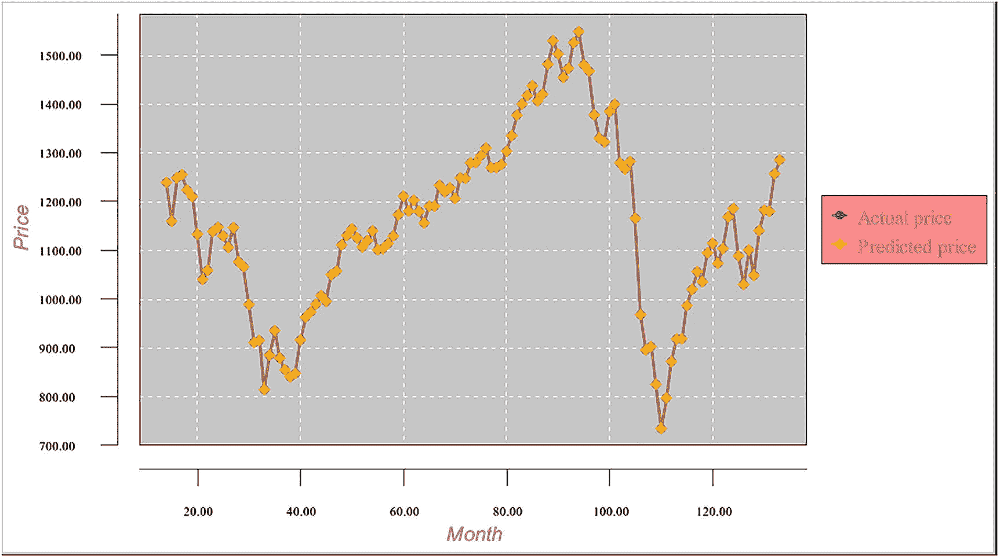

**图 11-4** 训练结果图表

### 测试数据集

测试数据集的格式与训练数据集相同。如本例开头所述，我们的目标是根据十年历史数据预测下个月的市场价格。因此，测试数据集与训练数据集相同，但应在末尾额外包含一条微批次记录，该记录将用于下个月的价格预测（超出网络训练范围）。表 11-4 展示了价格差异测试数据集的一个片段：

**表 11-4** 价格差异测试数据集片段

| priceDiffPerc | targetPriceDiffPerc | Date | inputPrice |
| --- | --- | --- | --- |
| 5.840553677 | 5.857688372 | 199704 | 801.34 |
| 5.857688372 | 4.345263356 | 199705 | 848.28 |
| 4.345263356 | 7.814583004 | 199706 | 885.14 |
| 7.814583004 | -5.746560342 | 199707 | 954.31 |
| -5.746560342 | 5.315352374 | 199708 | 899.47 |
| 5.315352374 | -3.447766236 | 199709 | 947.28 |
| -3.447766236 | 4.458682294 | 199710 | 914.62 |
| 4.458682294 | 1.573163073 | 199711 | 955.4 |
| 1.573163073 | 1.015013963 | 199712 | 970.43 |
| 1.015013963 | 7.04492594 | 199801 | 980.28 |
| 7.04492594 | 4.994568014 | 199802 | 1049.34 |
| 4.994568014 | 0.907646925 | 199803 | 1101.75 |
| 0.907646925 | -1.882617495 | 199804 | 1111.75 |
| -1.882617495 | 3.943822079 | 199805 | 1090.82 |
| 3.943822079 | -1.161539547 | 199806 | 1133.84 |
| -1.161539547 | -14.57967109 | 199807 | 1120.67 |
| -14.57967109 | 6.239553736 | 199808 | 957.28 |
| 6.239553736 | 8.029419573 | 199809 | 1017.01 |
| 8.029419573 | 5.91260342 | 199810 | 1098.67 |
| 5.91260342 | 5.63753083 | 199811 | 1163.63 |
| 5.63753083 | 4.10094124 | 199812 | 1229.23 |
| 4.10094124 | -3.228251696 | 199901 | 1279.64 |
| -3.228251696 | 3.879418249 | 199902 | 1238.33 |
| 3.879418249 | 3.79439819 | 199903 | 1286.37 |
| 3.79439819 | -2.497041597 | 199904 | 1335.18 |
| -2.497041597 | 5.443833344 | 199905 | 1301.84 |
| 5.443833344 | -3.204609859 | 199906 | 1372.71 |
| -3.204609859 | -0.625413932 | 199907 | 1328.72 |
| -0.625413932 | -2.855173772 | 199908 | 1320.41 |
| -2.855173772 | 6.253946722 | 199909 | 1282.71 |

表 11-5 展示了归一化测试数据集的一个片段：

**表 11-5** 归一化测试数据集片段

| priceDiffPerc | targetPriceDiffPerc | Date | inputPrice |
| --- | --- | --- | --- |
| 0.722703578 | 0.723845891 | 199704 | 801.34 |
| 0.723845891 | 0.623017557 | 199705 | 848.28 |
| 0.623017557 | 0.854305534 | 199706 | 885.14 |
| 0.854305534 | -0.049770689 | 199707 | 954.31 |
| -0.049770689 | 0.687690158 | 199708 | 899.47 |
| 0.687690158 | 0.103482251 | 199709 | 947.28 |
| 0.103482251 | 0.63057882 | 199710 | 914.62 |
| 0.63057882 | 0.438210872 | 199711 | 955.4 |
| 0.438210872 | 0.401000931 | 199712 | 970.43 |
| 0.401000931 | 0.802995063 | 199801 | 980.28 |
| 0.802995063 | 0.666304534 | 199802 | 1049.34 |
| 0.666304534 | 0.393843128 | 199803 | 1101.75 |
| 0.393843128 | 0.2078255 | 199804 | 1111.75 |
| 0.2078255 | 0.596254805 | 199805 | 1090.82 |
| 0.596254805 | 0.255897364 | 199806 | 1133.84 |
| 0.255897364 | -0.638644739 | 199807 | 1120.67 |
| -0.638644739 | 0.749303582 | 199808 | 957.28 |
| 0.749303582 | 0.868627972 | 199809 | 1017.01 |
| 0.868627972 | 0.727506895 | 199810 | 1098.67 |
| 0.727506895 | 0.709168722 | 199811 | 1163.63 |
| 0.709168722 | 0.606729416 | 199812 | 1229.23 |
| 0.606729416 | 0.118116554 | 199901 | 1279.64 |
| 0.118116554 | 0.591961217 | 199902 | 1238.33 |
| 0.591961217 | 0.586293213 | 199903 | 1286.37 |
| 0.586293213 | 0.166863894 | 199904 | 1335.18 |
| 0.166863894 | 0.696255556 | 199905 | 1301.84 |
| 0.696255556 | 0.119692676 | 199906 | 1372.71 |
| 0.119692676 | 0.291639071 | 199907 | 1328.72 |
| 0.291639071 | 0.142988415 | 199908 | 1320.41 |
| 0.142988415 | 0.750263115 | 199909 | 1282.71 |

最后，表 11-6 展示了滑动窗口测试数据集。这是用于测试已训练网络的数据集：

**表 11-6** 滑动窗口测试数据集片段

|   |   |   |   | 滑动窗口 |   |   |   |   |
|---|---|---|---|---|---|---|---|---|
| 0.723 | 0.724 | 0.623 | 0.854 | -0.050 | 0.688 | 0.103 | 0.631 | 0.438 | 0.401 | 0.803 | 0.666 | 0.208 |
| 0.724 | 0.623 | 0.854 | -0.050 | 0.688 | 0.103 | 0.631 | 0.438 | 0.401 | 0.803 | 0.666 | 0.394 | 0.596 |
| 0.623 | 0.854 | -0.050 | 0.688 | 0.103 | 0.631 | 0.438 | 0.401 | 0.803 | 0.666 | 0.394 | 0.208 | 0.256 |
| 0.854 | -0.050 | 0.688 | 0.103 | 0.631 | 0.438 | 0.401 | 0.803 | 0.666 | 0.394 | 0.208 | 0.596 | -0.639 |
| -0.050 | 0.688 | 0.103 | 0.631 | 0.438 | 0.401 | 0.803 | 0.666 | 0.394 | 0.208 | 0.596 | 0.256 | 0.749 |
| 0.688 | 0.103 | 0.631 | 0.438 | 0.401 | 0.803 | 0.666 | 0.394 | 0.208 | 0.596 | 0.256 | -0.639 | 0.869 |
| 0.103 | 0.631 | 0.438 | 0.401 | 0.803 | 0.666 | 0.394 | 0.208 | 0.596 | 0.256 | -0.639 | 0.749 | 0.728 |
| 0.631 | 0.438 | 0.401 | 0.803 | 0.666 | 0.394 | 0.208 | 0.596 | 0.256 | -0.639 | 0.749 | 0.869 | 0.709 |
| 0.438 | 0.401 | 0.803 | 0.666 | 0.394 | 0.208 | 0.596 | 0.256 | -0.639 | 0.749 | 0.869 | 0.728 | 0.607 |
| 0.401 | 0.803 | 0.666 | 0.394 | 0.208 | 0.596 | 0.256 | -0.639 | 0.749 | 0.869 | 0.728 | 0.709 | 0.118 |
| 0.803 | 0.666 | 0.394 | 0.208 | 0.596 | 0.256 | -0.639 | 0.749 | 0.869 | 0.728 | 0.709 | 0.607 | 0.592 |
| 0.666 | 0.394 | 0.208 | 0.596 | 0.256 | -0.639 | 0.749 | 0.869 | 0.728 | 0.709 | 0.607 | 0.118 | 0.586 |
| 0.394 | 0.208 | 0.596 | 0.256 | -0.639 | 0.749 | 0.869 | 0.728 | 0.709 | 0.607 | 0.118 | 0.592 | 0.167 |
| 0.208 | 0.596 | 0.256 | -0.639 | 0.749 | 0.869 | 0.728 | 0.709 | 0.607 | 0.118 | 0.592 | 0.586 | 0.696 |
| 0.596 | 0.256 | -0.639 | 0.749 | 0.869 | 0.728 | 0.709 | 0.607 | 0.118 | 0.592 | 0.586 | 0.167 | 0.120 |
| 0.256 | -0.639 | 0.749 | 0.869 | 0.728 | 0.709 | 0.607 | 0.118 | 0.592 | 0.586 | 0.167 | 0.696 | 0.292 |
| -0.639 | 0.749 | 0.869 | 0.728 | 0.709 | 0.607 | 0.118 | 0.592 | 0.586 | 0.167 | 0.696 | 0.120 | 0.143 |
| 0.749 | 0.869 | 0.728 | 0.709 | 0.607 | 0.118 | 0.592 | 0.586 | 0.167 | 0.696 | 0.120 | 0.292 | 0.750 |
| 0.869 | 0.728 | 0.709 | 0.607 | 0.118 | 0.592 | 0.586 | 0.167 | 0.696 | 0.120 | 0.292 | 0.143 | 0.460 |
| 0.728 | 0.709 | 0.607 | 0.118 | 0.592 | 0.586 | 0.167 | 0.696 | 0.120 | 0.292 | 0.143 | 0.750 | 0.719 |
| 0.709 | 0.607 | 0.118 | 0.592 | 0.586 | 0.167 | 0.696 | 0.120 | 0.292 | 0.143 | 0.750 | 0.460 | -0.006 |
| 0.607 | 0.118 | 0.592 | 0.586 | 0.167 | 0.696 | 0.120 | 0.292 | 0.143 | 0.750 | 0.460 | 0.719 | 0.199 |
| 0.118 | 0.592 | 0.586 | 0.167 | 0.696 | 0.120 | 0.292 | 0.143 | 0.750 | 0.460 | 0.719 | -0.006 | 0.978 |
| 0.592 | 0.586 | 0.167 | 0.696 | 0.120 | 0.292 | 0.143 | 0.750 | 0.460 | 0.719 | -0.006 | 0.199 | 0.128 |
| 0.586 | 0.167 | 0.696 | 0.120 | 0.292 | 0.143 | 0.750 | 0.460 | 0.719 | -0.006 | 0.199 | 0.978 | 0.187 |
| 0.167 | 0.696 | 0.120 | 0.292 | 0.143 | 0.750 | 0.460 | 0.719 | -0.006 | 0.199 | 0.978 | 0.128 | 0.493 |
| 0.696 | 0.120 | 0.292 | 0.143 | 0.750 | 0.460 | 0.719 | -0.006 | 0.199 | 0.978 | 0.128 | 0.187 | 0.224 |
| 0.120 | 0.292 | 0.143 | 0.750 | 0.460 | 0.719 | -0.006 | 0.199 | 0.978 | 0.128 | 0.187 | 0.493 | 0.738 |
| 0.292 | 0.143 | 0.750 | 0.460 | 0.719 | -0.006 | 0.199 | 0.978 | 0.128 | 0.187 | 0.493 | 0.224 | -0.023 |
| 0.143 | 0.750 | 0.460 | 0.719 | -0.006 | 0.199 | 0.978 | 0.128 | 0.187 | 0.493 | 0.224 | 0.738 | 0.300 |
| 0.750 | 0.460 | 0.719 | -0.006 | 0.199 | 0.978 | 0.128 | 0.187 | 0.493 | 0.224 | 0.738 | -0.023 | -0.200 |
| 0.460 | 0.719 | -0.006 | 0.199 | 0.978 | 0.128 | 0.187 | 0.493 | 0.224 | 0.738 | -0.023 | 0.300 | 0.360 |
| 0.719 | -0.006 | 0.199 | 0.978 | 0.128 | 0.187 | 0.493 | 0.224 | 0.738 | -0.023 | 0.300 | -0.200 | 0.564 |
| -0.006 | 0.199 | 0.978 | 0.128 | 0.187 | 0.493 | 0.224 | 0.738 | -0.023 | 0.300 | -0.200 | 0.360 | -0.282 |
| 0.199 | 0.978 | 0.128 | 0.187 | 0.493 | 0.224 | 0.738 | -0.023 | 0.300 | -0.200 | 0.360 | 0.564 | -0.095 |
| 0.978 | 0.128 | 0.187 | 0.493 | 0.224 | 0.738 | -0.023 | 0.300 | -0.200 | 0.360 | 0.564 | -0.282 | 0.845 |
| 0.128 | 0.187 | 0.493 | 0.224 | 0.738 | -0.023 | 0.300 | -0.200 | 0.360 | 0.564 | -0.282 | -0.095 | 0.367 |
| 0.187 | 0.493 | 0.224 | 0.738 | -0.023 | 0.300 | -0.200 | 0.360 | 0.564 | -0.282 | -0.095 | 0.845 | 0.166 |
| 0.493 | 0.224 | 0.738 | -0.023 | 0.300 | -0.200 | 0.360 | 0.564 | -0.282 | -0.095 | 0.845 | 0.367 | 0.262 |
| 0.224 | 0.738 | -0.023 | 0.300 | -0.200 | 0.360 | 0.564 | -0.282 | -0.095 | 0.845 | 0.367 | 0.166 | -0.094 |
| 0.738 | -0.023 | 0.300 | -0.200 | 0.360 | 0.564 | -0.282 | -0.095 | 0.845 | 0.367 | 0.166 | 0.262 | -0.211 |
| -0.023 | 0.300 | -0.200 | 0.360 | 0.564 | -0.282 | -0.095 | 0.845 | 0.367 | 0.166 | 0.262 | -0.094 | 0.454 |
| 0.300 | -0.200 | 0.360 | 0.564 | -0.282 | -0.095 | 0.845 | 0.367 | 0.166 | 0.262 | -0.094 | -0.211 | 0.835 |
| -0.200 | 0.360 | 0.564 | -0.282 | -0.095 | 0.845 | 0.367 | 0.166 | 0.262 | -0.094 | -0.211 | 0.454 | 0.384 |
| 0.360 | 0.564 | -0.282 | -0.095 | 0.845 | 0.367 | 0.166 | 0.262 | -0.094 | -0.211 | 0.454 | 0.835 | 0.230 |
| 0.564 | -0.282 | -0.095 | 0.845 | 0.367 | 0.166 | 0.262 | -0.094 | -0.211 | 0.454 | 0.835 | 0.384 | 0.195 |
| -0.282 | -0.095 | 0.845 | 0.367 | 0.166 | 0.262 | -0.094 | -0.211 | 0.454 | 0.835 | 0.384 | 0.230 | 0.578 |
| -0.095 | 0.845 | 0.367 | 0.166 | 0.262 | -0.094 | -0.211 | 0.454 | 0.835 | 0.384 | 0.230 | 0.195 | -0.076 |
| 0.845 | 0.367 | 0.166 | 0.262 | -0.094 | -0.211 | 0.454 | 0.835 | 0.384 | 0.230 | 0.195 | 0.578 | 0.273 |
| 0.367 | 0.166 | 0.262 | -0.094 | -0.211 | 0.454 | 0.835 | 0.384 | 0.230 | 0.195 | 0.578 | -0.076 | -0.150 |
| 0.166 | 0.262 | -0.094 | -0.211 | 0.454 | 0.835 | 0.384 | 0.230 | 0.195 | 0.578 | -0.076 | 0.273 | -0.193 |
| 0.262 | -0.094 | -0.211 | 0.454 | 0.835 | 0.384 | 0.230 | 0.195 | 0.578 | -0.076 | 0.273 | -0.150 | 0.366 |
| -0.094 | -0.211 | 0.454 | 0.835 | 0.384 | 0.230 | 0.195 | 0.578 | -0.076 | 0.273 | -0.150 | -0.193 | -0.400 |
| -0.211 | 0.454 | 0.835 | 0.384 | 0.230 | 0.195 | 0.578 | -0.076 | 0.273 | -0.150 | -0.193 | 0.366 | 0.910 |
| 0.454 | 0.835 | 0.384 | 0.230 | 0.195 | 0.578 | -0.076 | 0.273 | -0.150 | -0.193 | 0.366 | -0.400 | 0.714 |
| 0.835 | 0.384 | 0.230 | 0.195 | 0.578 | -0.076 | 0.273 | -0.150 | -0.193 | 0.366 | -0.400 | 0.910 | -0.069 |
| 0.384 | 0.230 | 0.195 | 0.578 | -0.076 | 0.273 | -0.150 | -0.193 | 0.366 | -0.400 | 0.910 | 0.714 | 0.151 |
| 0.230 | 0.195 | 0.578 | -0.076 | 0.273 | -0.150 | -0.193 | 0.366 | -0.400 | 0.910 | 0.714 | -0.069 | 0.220 |
| 0.195 | 0.578 | -0.076 | 0.273 | -0.150 | -0.193 | 0.366 | -0.400 | 0.910 | 0.714 | -0.069 | 0.151 | 0.389 |
| 0.578 | -0.076 | 0.273 | -0.150 | -0.193 | 0.366 | -0.400 | 0.910 | 0.714 | -0.069 | 0.151 | 0.220 | 0.874 |
| -0.076 | 0.273 | -0.150 | -0.193 | 0.366 | -0.400 | 0.910 | 0.714 | -0.069 | 0.151 | 0.220 | 0.389 | 0.673 |
| 0.273 | -0.150 | -0.193 | 0.366 | -0.400 | 0.910 | 0.714 | -0.069 | 0.151 | 0.220 | 0.389 | 0.874 | 0.409 |
| -0.150 | -0.193 | 0.366 | -0.400 | 0.910 | 0.714 | -0.069 | 0.151 | 0.220 | 0.389 | 0.874 | 0.673 | 0.441 |
| -0.193 | 0.366 | -0.400 | 0.910 | 0.714 | -0.069 | 0.151 | 0.220 | 0.389 | 0.874 | 0.673 | 0.409 | 0.452 |
| 0.366 | -0.400 | 0.910 | 0.714 | -0.069 | 0.151 | 0.220 | 0.389 | 0.874 | 0.673 | 0.409 | 0.441 | 0.254 |
| -0.400 | 0.910 | 0.714 | -0.069 | 0.151 | 0.220 | 0.389 | 0.874 | 0.673 | 0.409 | 0.441 | 0.452 | 0.700 |
| 0.910 | 0.714 | -0.069 | 0.151 | 0.220 | 0.389 | 0.874 | 0.673 | 0.409 | 0.441 | 0.452 | 0.254 | 0.381 |
| 0.714 | -0.069 | 0.151 | 0.220 | 0.389 | 0.874 | 0.673 | 0.409 | 0.441 | 0.452 | 0.254 | 0.700 | 0.672 |
| -0.069 | 0.151 | 0.220 | 0.389 | 0.874 | 0.673 | 0.409 | 0.441 | 0.452 | 0.254 | 0.700 | 0.381 | 0.449 |
| 0.151 | 0.220 | 0.389 | 0.874 | 0.673 | 0.409 | 0.441 | 0.452 | 0.254 | 0.700 | 0.381 | 0.672 | 0.415 |
| 0.220 | 0.389 | 0.874 | 0.673 | 0.409 | 0.441 | 0.452 | 0.254 | 0.700 | 0.381 | 0.672 | 0.449 | 0.224 |
| 0.389 | 0.874 | 0.673 | 0.409 | 0.441 | 0.452 | 0.254 | 0.700 | 0.381 | 0.672 | 0.449 | 0.415 | 0.221 |
| 0.874 | 0.673 | 0.409 | 0.441 | 0.452 | 0.254 | 0.700 | 0.381 | 0.672 | 0.449 | 0.415 | 0.224 | 0.414 |
| 0.673 | 0.409 | 0.441 | 0.452 | 0.254 | 0.700 | 0.381 | 0.672 | 0.449 | 0.415 | 0.224 | 0.221 | 0.453 |
| 0.409 | 0.441 | 0.452 | 0.254 | 0.700 | 0.381 | 0.672 | 0.449 | 0.415 | 0.224 | 0.221 | 0.414 | 0.105 |
| 0.441 | 0.452 | 0.254 | 0.700 | 0.381 | 0.672 | 0.449 | 0.415 | 0.224 | 0.221 | 0.414 | 0.453 | 0.349 |
| 0.452 | 0.254 | 0.700 | 0.381 | 0.672 | 0.449 | 0.415 | 0.224 | 0.221 | 0.414 | 0.453 | 0.105 | 0.396 |
| 0.254 | 0.700 | 0.381 | 0.672 | 0.449 | 0.415 | 0.224 | 0.221 | 0.414 | 0.453 | 0.105 | 0.349 | 0.427 |
| 0.700 | 0.381 | 0.672 | 0.449 | 0.415 | 0.224 | 0.221 | 0.414 | 0.453 | 0.105 | 0.349 | 0.396 | 0.591 |
| 0.381 | 0.672 | 0.449 | 0.415 | 0.224 | 0.221 | 0.414 | 0.453 | 0.105 | 0.349 | 0.396 | 0.427 | 0.550 |
| 0.672 | 0.449 | 0.415 | 0.224 | 0.221 | 0.414 | 0.453 | 0.105 | 0.349 | 0.396 | 0.427 | 0.591 | 0.165 |
| 0.449 | 0.415 | 0.224 | 0.221 | 0.414 | 0.453 | 0.105 | 0.349 | 0.396 | 0.427 | 0.591 | 0.550 | 0.459 |
| 0.415 | 0.224 | 0.221 | 0.414 | 0.453 | 0.105 | 0.349 | 0.396 | 0.427 | 0.591 | 0.550 | 0.165 | 0.206 |
| 0.224 | 0.221 | 0.414 | 0.453 | 0.105 | 0.349 | 0.396 | 0.427 | 0.591 | 0.550 | 0.165 | 0.459 | 0.199 |
| 0.221 | 0.414 | 0.453 | 0.105 | 0.349 | 0.396 | 0.427 | 0.591 | 0.550 | 0.165 | 0.459 | 0.206 | 0.533 |
| 0.414 | 0.453 | 0.105 | 0.349 | 0.396 | 0.427 | 0.591 | 0.550 | 0.165 | 0.459 | 0.206 | 0.199 | 0.332 |
| 0.453 | 0.105 | 0.349 | 0.396 | 0.427 | 0.591 | 0.550 | 0.165 | 0.459 | 0.206 | 0.199 | 0.533 | 0.573 |
| 0.105 | 0.349 | 0.396 | 0.427 | 0.591 | 0.550 | 0.165 | 0.459 | 0.206 | 0.199 | 0.533 | 0.332 | 0.259 |
| 0.349 | 0.396 | 0.427 | 0.591 | 0.550 | 0.165 | 0.459 | 0.206 | 0.199 | 0.533 | 0.332 | 0.573 | 0.380 |
| 0.396 | 0.427 | 0.591 | 0.550 | 0.165 | 0.459 | 0.206 | 0.199 | 0.533 | 0.332 | 0.573 | 0.259 | 0.215 |
| 0.427 | 0.591 | 0.550 | 0.165 | 0.459 | 0.206 | 0.199 | 0.533 | 0.332 | 0.573 | 0.259 | 0.380 | 0.568 |
| 0.591 | 0.550 | 0.165 | 0.459 | 0.206 | 0.199 | 0.533 | 0.332 | 0.573 | 0.259 | 0.380 | 0.215 | 0.327 |
| 0.550 | 0.165 | 0.459 | 0.206 | 0.199 | 0.533 | 0.332 | 0.573 | 0.259 | 0.380 | 0.215 | 0.568 | 0.503 |
| 0.165 | 0.459 | 0.206 | 0.199 | 0.533 | 0.332 | 0.573 | 0.259 | 0.380 | 0.215 | 0.568 | 0.327 | 0.336 |
| 0.459 | 0.206 | 0.199 | 0.533 | 0.332 | 0.573 | 0.259 | 0.380 | 0.215 | 0.568 | 0.327 | 0.503 | 0.407 |
| 0.206 | 0.199 | 0.533 | 0.332 | 0.573 | 0.259 | 0.380 | 0.215 | 0.568 | 0.327 | 0.503 | 0.336 | 0.414 |
| 0.199 | 0.533 | 0.332 | 0.573 | 0.259 | 0.380 | 0.215 | 0.568 | 0.327 | 0.503 | 0.336 | 0.407 | 0.127 |
| 0.533 | 0.332 | 0.573 | 0.259 | 0.380 | 0.215 | 0.568 | 0.327 | 0.503 | 0.336 | 0.407 | 0.414 | 0.334 |
| 0.332 | 0.573 | 0.259 | 0.380 | 0.215 | 0.568 | 0.327 | 0.503 | 0.336 | 0.407 | 0.414 | 0.127 | 0.367 |
| 0.573 | 0.259 | 0.380 | 0.215 | 0.568 | 0.327 | 0.503 | 0.336 | 0.407 | 0.414 | 0.127 | 0.334 | 0.475 |
| 0.259 | 0.380 | 0.215 | 0.568 | 0.327 | 0.503 | 0.336 | 0.407 | 0.414 | 0.127 | 0.334 | 0.367 | 0.497 |
| 0.380 | 0.215 | 0.568 | 0.327 | 0.503 | 0.336 | 0.407 | 0.414 | 0.127 | 0.334 | 0.367 | 0.475 | 0.543 |
| 0.215 | 0.568 | 0.327 | 0.503 | 0.336 | 0.407 | 0.414 | 0.127 | 0.334 | 0.367 | 0.475 | 0.497 | 0.443 |
| 0.568 | 0.327 | 0.503 | 0.336 | 0.407 | 0.414 | 0.127 | 0.334 | 0.367 | 0.475 | 0.497 | 0.543 | 0.417 |
| 0.327 | 0.503 | 0.336 | 0.407 | 0.414 | 0.127 | 0.334 | 0.367 | 0.475 | 0.497 | 0.543 | 0.443 | 0.427 |
| 0.503 | 0.336 | 0.407 | 0.414 | 0.127 | 0.334 | 0.367 | 0.475 | 0.497 | 0.543 | 0.443 | 0.417 | 0.188 |
| 0.336 | 0.407 | 0.414 | 0.127 | 0.334 | 0.367 | 0.475 | 0.497 | 0.543 | 0.443 | 0.417 | 0.427 | 0.400 |
| 0.407 | 0.414 | 0.127 | 0.334 | 0.367 | 0.475 | 0.497 | 0.543 | 0.443 | 0.417 | 0.427 | 0.188 | 0.622 |
| 0.414 | 0.127 | 0.334 | 0.367 | 0.475 | 0.497 | 0.543 | 0.443 | 0.417 | 0.427 | 0.188 | 0.400 | 0.550 |
| 0.127 | 0.334 | 0.367 | 0.475 | 0.497 | 0.543 | 0.443 | 0.417 | 0.427 | 0.188 | 0.400 | 0.622 | 0.215 |
| 0.334 | 0.367 | 0.475 | 0.497 | 0.543 | 0.443 | 0.417 | 0.427 | 0.188 | 0.400 | 0.622 | 0.550 | 0.120 |
| 0.367 | 0.475 | 0.497 | 0.543 | 0.443 | 0.417 | 0.427 | 0.188 | 0.400 | 0.622 | 0.550 | 0.215 | 0.419 |
| 0.475 | 0.497 | 0.543 | 0.443 | 0.417 | 0.427 | 0.188 | 0.400 | 0.622 | 0.550 | 0.215 | 0.120 | 0.572 |
| 0.497 | 0.543 | 0.443 | 0.417 | 0.427 | 0.188 | 0.400 | 0.622 | 0.550 | 0.215 | 0.120 | 0.419 | 0.432 |
| 0.543 | 0.443 | 0.417 | 0.427 | 0.188 | 0.400 | 0.622 | 0.550 | 0.215 | 0.120 | 0.419 | 0.572 | 0.040 |
| 0.443 | 0.417 | 0.427 | 0.188 | 0.400 | 0.622 | 0.550 | 0.215 | 0.120 | 0.419 | 0.572 | 0.432 | 0.276 |
| 0.417 | 0.427 | 0.188 | 0.400 | 0.622 | 0.550 | 0.215 | 0.120 | 0.419 | 0.572 | 0.432 | 0.040 | -0.074 |
| 0.427 | 0.188 | 0.400 | 0.622 | 0.550 | 0.215 | 0.120 | 0.419 | 0.572 | 0.432 | 0.040 | 0.276 | 0.102 |
| 0.188 | 0.400 | 0.622 | 0.550 | 0.215 | 0.120 | 0.419 | 0.572 | 0.432 | 0.040 | 0.276 | -0.074 | 0.294 |
| 0.400 | 0.622 | 0.550 | 0.215 | 0.120 | 0.419 | 0.572 | 0.432 | 0.040 | 0.276 | -0.074 | 0.102 | 0.650 |
| 0.622 | 0.550 | 0.215 | 0.120 | 0.419 | 0.572 | 0.432 | 0.040 | 0.276 | -0.074 | 0.102 | 0.294 | 0.404 |

滑动窗口测试数据集被分割成微批次文件，图 11-5 展示了测试微批次文件列表的一个片段。

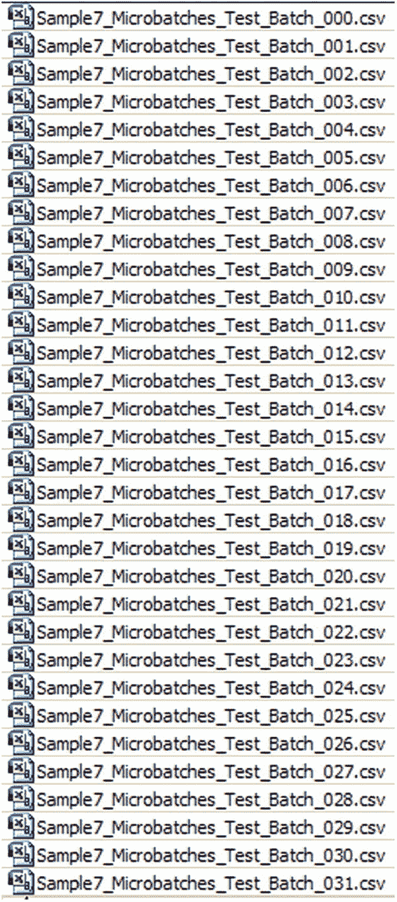

**图 11-5** 测试微批次数据集列表片段

### 测试逻辑

该方法中包含许多新的代码片段，下面我们来逐一讨论。我们在一个循环中遍历测试微批次数据集集合，加载微批次数据集及对应的已保存网络。请注意，我们不再处理单个测试数据集，而是处理一组微批次测试数据集。接下来，我们从网络中获取输入值、实际值和预测价格值；对它们进行归一化；并计算真实的实际价格和预测价格。对于所有存在已保存网络记录的测试记录，都会执行此操作。

然而，测试数据集中最后一个微批次记录没有对应的已保存网络文件，原因很简单：网络并未针对该点进行训练。对于这条记录，我们检索其 12 个 `inputPriceDiffPerc` 字段，这些字段是网络训练期间使用的键。接着，我们在所有已保存网络文件的键中搜索，这些键位于名为 `linkToSaveInputPriceDiffPerc_00`、`linkToSaveInputPriceDiffPerc_01` 等的内存数组中。

由于每个已保存网络关联 12 个键，搜索按以下方式进行。对于正在处理的微批次，我们使用欧几里得几何计算 12 维空间中的向量值。例如，对于 12 个变量的函数 `y = f(x1, x2, x3, x4, x5, x6, x7, x8, x9, x10, x11, x12)`，向量值是每个 `x` 值平方之和的平方根。

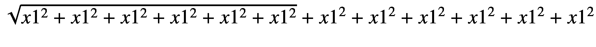 `(11-1)`

然后，对于 `linkToSaveInputPriceDiffPerc` 数组中保存的每组网络键，也计算其向量值。选择与处理记录键集高度匹配的网络键，并将其加载到内存中。最后，我们从该网络中获取输入值、激活值和预测值；对它们进行反归一化；并计算真实的实际值和预测值。清单 11-7 展示了此逻辑的代码。

# 清单 11-7：选择已保存网络记录的逻辑

```java
static public void loadAndTestNetwork()
{
    List xData = new ArrayList();
    List yData1 = new ArrayList();
    List yData2 = new ArrayList();
    int k1 = 0;
    int k3 = 0;
    BufferedReader br4;
    BasicNetwork network;

    try
    {
        // Process testing batches
        maxGlobalResultDiff = 0.00;
        averGlobalResultDiff = 0.00;
        sumGlobalResultDiff = 0.00;

        for (k1 = 0; k1 < intNumberOfBatchesToProcess; k1++)
        {
            // ... (此处省略部分循环体代码)
            if (realDenormTargetToPredictPricePerc > maxGlobalResultDiff)
                maxGlobalResultDiff = realDenormTargetToPredictPricePerc;
            sumGlobalResultDiff = sumGlobalResultDiff + realDenormTargetToPredictPricePerc;
        } // End of IF

        }  // End for the pair loop

        // Populate chart elements
        tempMonth = (double) k1+14;
        xData.add(tempMonth);
        yData1.add(realDenormTargetPrice);
        yData2.add(realDenormPredictPrice);
    }   // End of loop K1

    // Print the max and average results
    System.out.println(" ");
    System.out.println(" ");
    System.out.println("Results of processing testing batches");
    averGlobalResultDiff = sumGlobalResultDiff/intNumberOfBatchesToProcess;
    System.out.println("maxGlobalResultDiff = " + maxGlobalResultDiff + "  i = " + maxGlobalIndex);
    System.out.println("averGlobalResultDiff = " + averGlobalResultDiff);
    System.out.println(" ");
    System.out.println(" ");
}     // End of TRY

catch (IOException e1)
{
    e1.printStackTrace();
}

// All testing batch files have been processed
XYSeries series1 = Chart.addSeries("Actual Price", xData, yData1);
XYSeries series2 = Chart.addSeries("Forecasted Price", xData, yData2);
series1.setLineColor(XChartSeriesColors.BLUE);
series2.setMarkerColor(Color.ORANGE);
series1.setLineStyle(SeriesLines.SOLID);
series2.setLineStyle(SeriesLines.SOLID);

// Save the chart image
try
{
    BitmapEncoder.saveBitmapWithDPI(Chart, strChartFileName, BitmapFormat.JPG, 100);
}
catch (Exception bt)
{
    bt.printStackTrace();
}
System.out.println ("The Chart has been saved");
} // End of the method
```

## 测试结果

清单 11-8 展示了测试结果的日志。

```
Month =     1  targetPrice = 1090.81999   predictPrice = 1090.81862   diff = 1.26406E-4  
Month =     2  targetPrice = 1133.83999   predictPrice = 1133.84137   diff = 1.21514E-4  
Month =     3  targetPrice = 1120.67000   predictPrice = 1120.66834   diff = 1.47557E-4  
Month =     4  targetPrice = 957.280000   predictPrice = 957.273196   diff = 7.10741E-4  
Month =     5  targetPrice = 1017.00999   predictPrice = 1017.00773   diff = 2.22221E-4  
Month =     6  targetPrice = 1098.67000   predictPrice = 1098.66795   diff = 1.86309E-4  
Month =     7  targetPrice = 1163.63000   predictPrice = 1163.62063   diff = 8.04467E-4  
Month =     8  targetPrice = 1229.22999   predictPrice = 1229.22777   diff = 1.80847E-4  
Month =     9  targetPrice = 1279.64000   predictPrice = 1279.63438   diff = 4.38765E-4  
Month =   10  targetPrice = 1238.33000   predictPrice = 1238.33288    diff = 2.33186E-4  
Month =   11  targetPrice = 1286.37000   predictPrice = 1286.36771    diff = 1.77470E-4  
Month =   12  targetPrice = 1335.18000   predictPrice = 1335.18633    diff = 4.74799E-4  
Month =   13  targetPrice = 1301.84000   predictPrice = 1301.85154    diff = 8.86728E-4  
Month =   14  targetPrice = 1372.70999   predictPrice = 1372.72035    diff = 7.54282E-4  
Month =   15  targetPrice = 1328.71999   predictPrice = 1328.70998    diff = 7.53875E-4  
Month =   16  targetPrice = 1320.40999   predictPrice = 1320.40583    diff = 3.15133E-4  
Month =   17  targetPrice = 1282.70999   predictPrice = 1282.72125    diff = 8.77519E-4  
Month =   18  targetPrice = 1362.93000   predictPrice = 1362.92718    diff = 2.06881E-4  
Month =   19  targetPrice = 1388.91000   predictPrice = 1388.89924    diff = 7.74644E-4  
Month =   20  targetPrice = 1469.25000   predictPrice = 1469.23911    diff = 7.40870E-4  
Month =   21  targetPrice = 1394.46000   predictPrice = 1394.47216    diff = 8.72695E-4  
Month =   22  targetPrice = 1366.42000   predictPrice = 1366.41754    diff = 1.79908E-4  
Month =   23  targetPrice = 1498.58000   predictPrice = 1498.58325    diff = 2.17251E-4  
Month =   24  targetPrice = 1452.42999   predictPrice = 1452.42533    diff = 3.21443E-4  
Month =   25  targetPrice = 1420.59999   predictPrice = 1420.60865    diff = 6.09378E-4  
Month =   26  targetPrice = 1454.59999   predictPrice = 1454.58933    diff = 7.33179E-4  
Month =   27  targetPrice = 1430.82999   predictPrice = 1430.82343    diff = 4.58933E-4  
Month =   28  targetPrice = 1517.68000   predictPrice = 1517.66742    diff = 8.28335E-4  
Month =   29  targetPrice = 1436.51000   predictPrice = 1436.50133    diff = 6.03050E-4  
Month =   30  targetPrice = 1429.40000   predictPrice = 1429.38716    diff = 8.98280E-4  
Month =   31  targetPrice = 1314.95000   predictPrice = 1314.95726    diff = 5.52363E-4  
Month =   32  targetPrice = 1320.27999   predictPrice = 1320.27602    diff = 3.00856E-4  
Month =   33  targetPrice = 1366.00999   predictPrice = 1366.01970    diff = 7.10801E-4  
Month =   34  targetPrice = 1239.93999   predictPrice = 1239.94653    diff = 5.27151E-4  
Month =   35  targetPrice = 1160.32999   predictPrice = 1160.32332    diff = 5.74945E-4  
Month =   36  targetPrice = 1249.45999   predictPrice = 1249.45964    diff = 2.80901E-5  
Month =   37  targetPrice = 1255.81999   predictPrice = 1255.83124    diff = 8.95371E-4  
Month =   38  targetPrice = 1224.37999   predictPrice = 1224.37930    diff = 5.65439E-5  
Month =   39  targetPrice = 1211.23000   predictPrice = 1211.23811    diff = 6.70068E-4  
Month =   40  targetPrice = 1133.57999   predictPrice = 1133.57938    diff = 5.41728E-5  
Month =   41  targetPrice = 1040.94000   predictPrice = 1040.94868    diff = 8.34020E-4  
Month =   42  targetPrice = 1059.78000   predictPrice = 1059.78527    diff = 4.98200E-4  
Month =   43  targetPrice = 1139.45000   predictPrice = 1139.44873    diff = 1.11249E-4  
Month =   44  targetPrice = 1148.08000   predictPrice = 1148.08052    diff = 4.56909E-5  
Month =   45  targetPrice = 1130.20000   predictPrice = 1130.19783    diff = 1.91119E-4  
Month =   46  targetPrice = 1106.73000   predictPrice = 1106.72432    diff = 5.12476E-4  
Month =   47  targetPrice = 1147.39000   predictPrice = 1147.39610    diff = 5.32008E-4  
Month =   48  targetPrice = 1076.91999   predictPrice = 1076.91978    diff = 2.00479E-5  
Month =   49  targetPrice = 1067.13999   predictPrice = 1067.13933    diff = 6.22573E-5  
Month =   50  targetPrice = 989.819999   predictPrice = 989.821716    diff = 1.73446E-4  
Month =   51  targetPrice = 911.620000   predictPrice = 911.617992    diff = 2.20263E-4  
Month =   52  targetPrice = 916.070000   predictPrice = 916.077853    diff = 8.57315E-4  
Month =   53  targetPrice = 815.280000   predictPrice = 815.272825    diff = 8.79955E-4  
Month =   54  targetPrice = 885.759999   predictPrice = 885.765094    diff = 5.75183E-4  
Month =   55  targetPrice = 936.309999   predictPrice = 936.309870    diff = 1.38348E-5  
Month =   56  targetPrice = 879.820000   predictPrice = 879.812301    diff = 8.74999E-4  
Month =   57  targetPrice = 855.700000   predictPrice = 855.704800    diff = 5.60997E-4  
Month =   58  targetPrice = 841.149999   predictPrice = 841.157370    diff = 8.76199E-4  
Month =   59  targetPrice = 848.179999   predictPrice = 848.177501    diff = 2.94516E-4  
Month =   60  targetPrice = 916.919999   predictPrice = 916.916469    diff = 3.85047E-4  
Month =   61  targetPrice = 963.589999   predictPrice = 963.589343    diff = 6.81249E-5  
Month =   62  targetPrice = 974.499999   predictPrice = 974.501631    diff = 1.67473E-4  
Month =   63  targetPrice = 990.309999   predictPrice = 990.317332    diff = 7.40393E-4  
Month =   64  targetPrice = 1008.00999   predictPrice = 1008.01649    diff = 6.44417E-4  
Month =   65  targetPrice = 995.970000   predictPrice = 995.962936    diff = 7.09244E-4  
Month =   66  targetPrice = 1050.71000   predictPrice = 1050.70415    diff = 5.56362E-4  
```

## 清单 11-8

测试结果

| Month | targetPrice | predictPrice | diff |
| :--- | :--- | :--- | :--- |
| 67 | 1058.19999 | 1058.20655 | 6.19497E-4 |
| 68 | 1111.92000 | 1111.91877 | 1.10107E-4 |
| 69 | 1131.12999 | 1131.12013 | 8.71747E-4 |
| 70 | 1144.93999 | 1144.94455 | 3.97919E-4 |
| 71 | 1126.20999 | 1126.21662 | 5.88137E-4 |
| 72 | 1107.30000 | 1107.30902 | 8.15027E-4 |
| 73 | 1120.67999 | 1120.68134 | 1.19709E-4 |
| 74 | 1140.83999 | 1140.83233 | 6.72045E-4 |
| 75 | 1101.71999 | 1101.72991 | 8.99967E-4 |
| 76 | 1104.24000 | 1104.23781 | 1.97959E-4 |
| 77 | 1114.58000 | 1114.57983 | 1.46639E-5 |
| 78 | 1130.19999 | 1130.19492 | 4.48619E-4 |
| 79 | 1173.81999 | 1173.81767 | 1.98190E-4 |
| 80 | 1211.91999 | 1211.91169 | 6.84919E-4 |
| 81 | 1181.26999 | 1181.26737 | 2.22043E-4 |
| 82 | 1203.60000 | 1203.60487 | 4.05172E-4 |
| 83 | 1180.59000 | 1180.59119 | 1.01641E-4 |
| 84 | 1156.84999 | 1156.84136 | 7.46683E-4 |
| 85 | 1191.49999 | 1191.49043 | 8.02666E-4 |
| 86 | 1191.32999 | 1191.31947 | 8.83502E-4 |
| 87 | 1234.17999 | 1234.17993 | 5.48814E-6 |
| 88 | 1220.33000 | 1220.31947 | 8.62680E-4 |
| 89 | 1228.80999 | 1228.82099 | 8.95176E-4 |
| 90 | 1207.00999 | 1207.00976 | 1.92764E-5 |
| 91 | 1249.48000 | 1249.48435 | 3.48523E-4 |
| 92 | 1248.28999 | 1248.27937 | 8.51313E-4 |
| 93 | 1280.08000 | 1280.08774 | 6.05221E-4 |
| 94 | 1280.66000 | 1280.66295 | 2.30633E-4 |
| 95 | 1294.86999 | 1294.85904 | 8.46250E-4 |
| 96 | 1310.60999 | 1310.61570 | 4.35072E-4 |
| 97 | 1270.08999 | 1270.08943 | 4.41920E-5 |
| 98 | 1270.19999 | 1270.21071 | 8.43473E-4 |
| 99 | 1276.65999 | 1276.65263 | 5.77178E-4 |
| 100 | 1303.81999 | 1303.82201 | 1.54506E-4 |
| 101 | 1335.85000 | 1335.83897 | 8.25569E-4 |
| 102 | 1377.93999 | 1377.94590 | 4.28478E-4 |
| 103 | 1400.63000 | 1400.62758 | 1.72417E-4 |
| 104 | 1418.29999 | 1418.31083 | 7.63732E-4 |
| 105 | 1438.23999 | 1438.23562 | 3.04495E-4 |
| 106 | 1406.82000 | 1406.83156 | 8.21893E-4 |
| 107 | 1420.85999 | 1420.86256 | 1.80566E-4 |
| 108 | 1482.36999 | 1482.35896 | 7.44717E-4 |
| 109 | 1530.62000 | 1530.62213 | 1.39221E-4 |
| 110 | 1503.34999 | 1503.33884 | 7.42204E-4 |
| 111 | 1455.27000 | 1455.27626 | 4.30791E-4 |
| 112 | 1473.98999 | 1473.97685 | 8.91560E-4 |
| 113 | 1526.75000 | 1526.76231 | 8.06578E-4 |
| 114 | 1549.37999 | 1549.39017 | 6.56917E-4 |
| 115 | 1481.14000 | 1481.15076 | 7.27101E-4 |
| 116 | 1468.35999 | 1468.35702 | 2.02886E-4 |
| 117 | 1378.54999 | 1378.55999 | 7.24775E-4 |
| 118 | 1330.63000 | 1330.61965 | 7.77501E-4 |
| 119 | 1322.70000 | 1322.69947 | 3.99053E-5 |
| 120 | 1385.58999 | 1385.60045 | 7.54811E-4 |
| 121 | 1400.38000 | 1162.09439 | 17.0157 |

`maxErrorPerc` = 17.0157819794876
`averErrorPerc` = 0.14062629735113719

图 11-6 展示了测试结果的图表。

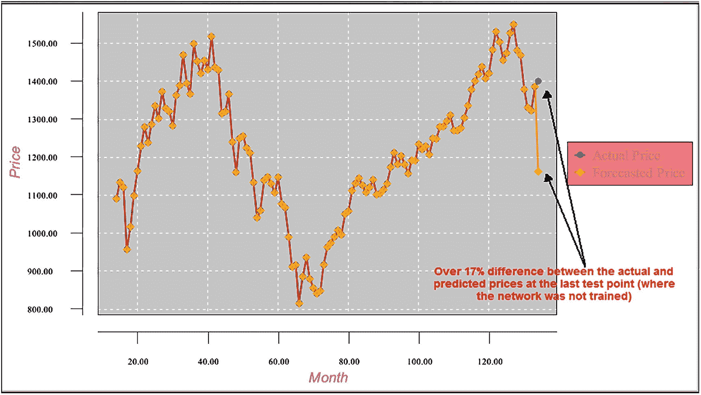
图 11-6 测试结果图表

## 分析测试结果

在网络训练过的所有数据点上，预测价格与实际价格高度吻合（黄色和蓝色图表几乎重叠）。然而，在下一个月的点上（网络未训练过的数据点），预测价格与实际价格（我们恰好已知）的偏差超过了 17%。甚至下个月预测价格的方向（与上个月的差值）也是错误的。实际价格略有上涨，而预测价格却大幅下跌。

由于这些数据点的价格大约在 1200 到 1300 之间，17%的偏差意味着误差超过 200 个点。这不能被视为有效的预测，对交易者/投资者而言毫无用处。那么，问题出在哪里？我们并没有违反在训练范围外预测函数值的限制（通过将价格函数转换为依赖于月份间价格差而非连续月份）。为了回答这个问题，让我们深入研究一下。

当我们处理最后一条测试记录时，我们从之前的 12 条原始记录中获取其前 12 个字段的值。这些值代表当前月与上个月之间的价格差百分比。记录中的最后一个字段是下个月（第 13 条记录）的价格值与第 12 个月价格值之间的百分比差值。所有字段均已归一化，记录如下所示：

- 0.621937887 0.550328191 0.214557935 0.12012062 0.419090615 0.571960009 0.4321489 0.039710508 0.275810074 -0.074423166 0.101592253 0.29360278 0.         (11-2)

通过已知微批次记录 12 的价格（即 1,385.95），并获取网络预测的 `targetPriceDiffPerc` 字段（即下个月与当前月价格的百分比差值），我们可以按如下方式计算下个月的预测价格：

- `nextMonthPredictedPrice = record12ActualPrice + record12ActualPrice * predictedPriceDiffPerc / 100.00`       (11-3)

为了获取网络对记录 13 的预测值（`predictedPriceDiffPerc`），我们将当前处理记录中 12 个 `inputPriceDiffPerc` 字段的向量值输入训练好的网络（参见 `代码清单 10-2`）。网络返回-16.129995719。综合所有信息，我们得到下个月的预测价格。

```
1385.59 - 1385.59 *16.12999/100.00 = 1,162.0943923170353
```

下个月的预测价格等于 1,162.09，而实际价格为 1,400.38，因此偏差为 17.02%。这正是处理日志中最后一条记录显示的结果。

```
Month = 121  targetPrice = 1400.3800000016674  predictPrice = 1162.0943923170353   diff = 17.0157819794876
```

下个月价格的计算结果在数学上是正确的，它基于最后一个训练点的价格与网络返回的下一个点与当前点之间的价格差百分比之和。

问题在于，历史股票市场价格不会在相同或相似条件下重复出现。网络针对最后处理记录的计算向量（10.1）返回的价格差百分比，并不适用于计算下个月的预测价格。这就是本例所用模型的问题所在，该模型假设未来月份的价格差百分比与过去相同或接近条件下记录的价格差百分比相似。

这是需要吸取的重要教训。如果模型是错误的，那么一切都不会奏效。在参与任何神经网络开发之前，首先要做的是证明所选模型能够正确工作。这将为你节省大量时间和精力。

## 总结

本章阐述了为项目选择正确工作模型的重要性。在开始任何开发之前，先证明模型对你的项目能够正确工作。未能选择正确的模型将导致应用程序运行异常。当网络被用于预测各类游戏（赌博、体育等）的结果时，也会产生错误的结果。

# 12. 三维空间中的逼近函数

本章讨论三维空间中的逼近函数。此类函数值依赖于两个变量（而非前几章讨论的一个变量）。图 12-1 展示了本章所考虑的三维函数图表。

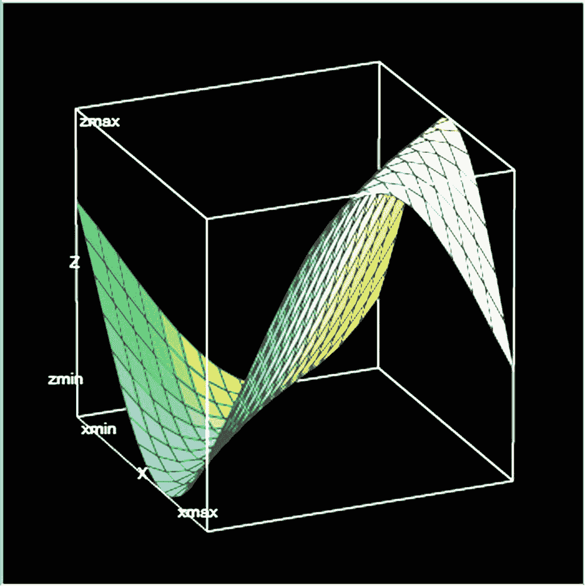
图 12-1 三维空间中的函数图表

## 示例：三维空间中的逼近函数

该函数的公式为：`z(x, y) = 50.00 + sin(x * y)`。但同样，我们假设函数公式未知，并且该函数是通过某些点上的值给出的。

### 数据准备

函数值在区间 [3.00, 4.00] 上给出，两个函数自变量 `x` 和 `y` 的增量均为 0.02。训练数据集的起始点为 3.00，测试数据集的起始点为 3.01。`x` 和 `y` 值的增量为 0.02。训练数据集记录包含三个字段，如 `代码清单 12-1` 所示。

```
字段 1 – x 自变量的值
字段 2 – y 自变量的值
字段 3 – 函数值。
```

**`代码清单 12-1`** 训练数据集的记录结构

表 12-1 展示了训练数据集的一部分。训练数据集包含了 `x` 和 `y` 所有可能组合的记录。

### 表 12-1
训练数据集片段

| x | y | z |
| --- | --- | --- |
| 3 | 3 | 50.41211849 |
| 3 | 3.02 | 50.35674187 |
| 3 | 3.04 | 50.30008138 |
| 3 | 3.06 | 50.24234091 |
| 3 | 3.08 | 50.18372828 |
| 3 | 3.1 | 50.12445442 |
| 3 | 3.12 | 50.06473267 |
| 3 | 3.14 | 50.00477794 |
| 3 | 3.16 | 49.94480602 |
| 3 | 3.18 | 49.88503274 |
| 3 | 3.2 | 49.82567322 |
| 3 | 3.22 | 49.76694108 |
| 3 | 3.24 | 49.70904771 |
| 3 | 3.26 | 49.65220145 |
| 3 | 3.28 | 49.59660689 |
| 3 | 3.3 | 49.54246411 |
| 3 | 3.32 | 49.48996796 |
| 3 | 3.34 | 49.43930738 |
| 3 | 3.36 | 49.39066468 |
| 3 | 3.38 | 49.34421494 |
| 3 | 3.4 | 49.30012531 |
| 3 | 3.42 | 49.25855448 |
| 3 | 3.44 | 49.21965205 |
| 3 | 3.46 | 49.18355803 |
| 3 | 3.48 | 49.15040232 |
| 3 | 3.5 | 49.12030424 |
| 3 | 3.52 | 49.09337212 |
| 3 | 3.54 | 49.06970288 |
| 3 | 3.56 | 49.0493817 |
| 3 | 3.58 | 49.03248173 |
| 3 | 3.6 | 49.01906377 |
| 3 | 3.62 | 49.00917613 |
| 3 | 3.64 | 49.00285438 |
| 3 | 3.66 | 49.00012128 |
| 3 | 3.68 | 49.00098666 |
| 3 | 3.7 | 49.00544741 |
| 3 | 3.72 | 49.01348748 |
| 3 | 3.74 | 49.02507793 |
| 3 | 3.76 | 49.04017704 |
| 3 | 3.78 | 49.05873048 |
| 3 | 3.8 | 49.08067147 |
| 3 | 3.82 | 49.10592106 |
| 3 | 3.84 | 49.13438836 |
| 3 | 3.86 | 49.16597093 |
| 3 | 3.88 | 49.2005551 |
| 3 | 3.9 | 49.23801642 |
| 3 | 3.92 | 49.27822005 |
| 3 | 3.94 | 49.3210213 |
| 3 | 3.96 | 49.36626615 |
| 3 | 3.98 | 49.41379176 |
| 3 | 4 | 49.46342708 |
| 3.02 | 3 | 50.35674187 |
| 3.02 | 3.02 | 50.29969979 |
| 3.02 | 3.04 | 50.24156468 |
| 3.02 | 3.06 | 50.18254857 |
| 3.02 | 3.08 | 50.1228667 |
| 3.02 | 3.1 | 50.06273673 |
| 3.02 | 3.12 | 50.00237796 |
| 3.02 | 3.14 | 49.94201051 |
| 3.02 | 3.16 | 49.88185455 |
| 3.02 | 3.18 | 49.82212948 |
| 3.02 | 3.2 | 49.76305311 |

表 12-2 展示了测试数据集的一部分。它具有相同的结构，但包含了未用于网络训练的 `x` 和 `y` 点。

### 表 12-2
测试数据集片段

| x | y | z |
| --- | --- | --- |
| 3.01 | 3.01 | 50.35664845 |
| 3.01 | 3.03 | 50.29979519 |
| 3.01 | 3.05 | 50.24185578 |
| 3.01 | 3.07 | 50.18304015 |
| 3.01 | 3.09 | 50.12356137 |
| 3.01 | 3.11 | 50.06363494 |
| 3.01 | 3.13 | 50.00347795 |
| 3.01 | 3.15 | 49.94330837 |
| 3.01 | 3.17 | 49.88334418 |
| 3.01 | 3.19 | 49.82380263 |
| 3.01 | 3.21 | 49.76489943 |
| 3.01 | 3.23 | 49.70684798 |
| 3.01 | 3.25 | 49.64985862 |
| 3.01 | 3.27 | 49.59413779 |
| 3.01 | 3.29 | 49.53988738 |
| 3.01 | 3.31 | 49.48730393 |
| 3.01 | 3.33 | 49.43657796 |
| 3.01 | 3.35 | 49.38789323 |
| 3.01 | 3.37 | 49.34142613 |
| 3.01 | 3.39 | 49.29734501 |
| 3.01 | 3.41 | 49.25580956 |
| 3.01 | 3.43 | 49.21697029 |
| 3.01 | 3.45 | 49.18096788 |
| 3.01 | 3.47 | 49.14793278 |
| 3.01 | 3.49 | 49.11798468 |
| 3.01 | 3.51 | 49.09123207 |
| 3.01 | 3.53 | 49.06777188 |
| 3.01 | 3.55 | 49.04768909 |
| 3.01 | 3.57 | 49.03105648 |
| 3.01 | 3.59 | 49.0179343 |
| 3.01 | 3.61 | 49.00837009 |
| 3.01 | 3.63 | 49.0023985 |
| 3.01 | 3.65 | 49.00004117 |
| 3.01 | 3.67 | 49.00130663 |
| 3.01 | 3.69 | 49.00619031 |
| 3.01 | 3.71 | 49.0146745 |
| 3.01 | 3.73 | 49.02672848 |
| 3.01 | 3.75 | 49.04230856 |
| 3.01 | 3.77 | 49.06135831 |
| 3.01 | 3.79 | 49.08380871 |
| 3.01 | 3.81 | 49.10957841 |
| 3.01 | 3.83 | 49.13857407 |
| 3.01 | 3.85 | 49.17069063 |
| 3.01 | 3.87 | 49.20581173 |
| 3.01 | 3.89 | 49.24381013 |
| 3.01 | 3.91 | 49.28454816 |
| 3.01 | 3.93 | 49.32787824 |
| 3.01 | 3.95 | 49.37364338 |
| 3.01 | 3.97 | 49.42167777 |
| 3.01 | 3.99 | 49.47180739 |
| 3.03 | 3.01 | 50.29979519 |
| 3.03 | 3.03 | 50.24146764 |
| 3.03 | 3.05 | 50.18225361 |

## 网络架构

图 12-2 展示了网络架构。我们正在处理的函数有两个输入（`x` 和 `y`）；因此，网络架构有两个输入。

### 图 12-2
网络架构


训练数据集和测试数据集在处理前均被归一化。我们将使用常规网络流程来逼近该函数。根据处理结果，我们将决定是否需要使用微批次方法。

## 程序代码

### 代码清单 12-2

```java
// ===============================================================
// 使用传统过程对三维函数的近似。
// 输入文件已归一化。
// ===============================================================
package sample9;

import java.io.BufferedReader;
import java.io.File;
import java.io.FileInputStream;
import java.io.PrintWriter;
import java.io.FileNotFoundException;
import java.io.FileReader;
import java.io.FileWriter;
import java.io.IOException;
import java.io.InputStream;
import java.nio.file.*;
import java.util.Properties;
import java.time.YearMonth;
import java.awt.Color;
import java.awt.Font;
import java.io.BufferedReader;
import java.text.DateFormat;
import java.text.ParseException;
import java.text.SimpleDateFormat;
import java.time.LocalDate;
import java.time.Month;
import java.time.ZoneId;
import java.util.ArrayList;
import java.util.Calendar;
import java.util.Date;
import java.util.List;
import java.util.Locale;
import java.util.Properties;
import org.encog.Encog;
import org.encog.engine.network.activation.ActivationTANH;
import org.encog.engine.network.activation.ActivationReLU;
import org.encog.ml.data.MLData;
import org.encog.ml.data.MLDataPair;
import org.encog.ml.data.MLDataSet;
import org.encog.ml.data.buffer.MemoryDataLoader;
import org.encog.ml.data.buffer.codec.CSVDataCODEC;
import org.encog.ml.data.buffer.codec.DataSetCODEC;
import org.encog.neural.networks.BasicNetwork;
import org.encog.neural.networks.layers.BasicLayer;
import org.encog.neural.networks.training.propagation.resilient.ResilientPropagation;
import org.encog.persist.EncogDirectoryPersistence;
import org.encog.util.csv.CSVFormat;
import org.knowm.xchart.SwingWrapper;
import org.knowm.xchart.XYChart;
import org.knowm.xchart.XYChartBuilder;
import org.knowm.xchart.XYSeries;
import org.knowm.xchart.demo.charts.ExampleChart;
import org.knowm.xchart.style.Styler.LegendPosition;
import org.knowm.xchart.style.colors.ChartColor;
import org.knowm.xchart.style.colors.XChartSeriesColors;
import org.knowm.xchart.style.lines.SeriesLines;
import org.knowm.xchart.style.markers.SeriesMarkers;
import org.knowm.xchart.BitmapEncoder;
import org.knowm.xchart.BitmapEncoder.BitmapFormat;
import org.knowm.xchart.QuickChart;
import org.knowm.xchart.SwingWrapper;

public class Sample9 implements ExampleChart
{
    // 归一化区间
    static double Nh =  1;
    static double Nl = -1;

    // 第一列
    static double minXPointDl = 2.00;
    static double maxXPointDh = 6.00;

    // 第二列
    static double minYPointDl = 2.00;
    static double maxYPointDh = 6.00;

    // 第三列 - 目标数据
    static double minTargetValueDl = 45.00;
    static double maxTargetValueDh = 55.00;

    static double doublePointNumber = 0.00;
    static int intPointNumber = 0;
    static InputStream input = null;
    static double[] arrPrices = new double[2700];
    static double normInputXPointValue = 0.00;
    static double normInputYPointValue = 0.00;
    static double normPredictValue = 0.00;
    static double normTargetValue = 0.00;
    static double normDifferencePerc = 0.00;
    static double returnCode = 0.00;
    static double denormInputXPointValue = 0.00;
    static double denormInputYPointValue = 0.00;
    static double denormPredictValue = 0.00;
    static double denormTargetValue = 0.00;
    static double valueDifference = 0.00;
    static int numberOfInputNeurons;
    static int numberOfOutputNeurons;
    static int intNumberOfRecordsInTestFile;
    static String trainFileName;
    static String priceFileName;
    static String testFileName;
    static String chartTrainFileName;
    static String chartTrainFileNameY;
    static String chartTestFileName;
    static String networkFileName;
    static int workingMode;
    static String cvsSplitBy = ",";
    static int numberOfInputRecords = 0;
    static List xData = new ArrayList();
    static List yData1 = new ArrayList();
    static List yData2 = new ArrayList();
    static XYChart Chart;

    @Override
    public XYChart getChart()
    {
        // 创建图表
        Chart = new  XYChartBuilder().width(900).height(500).title(getClass().
                getSimpleName()).xAxisTitle("x").yAxisTitle("y= f(x)").build();

        // 自定义图表
        //Chart = new  XYChartBuilder().width(900).height(500).title(getClass().
        //   getSimpleName()).xAxisTitle("y").yAxisTitle("z= f(y)").build();
```

# 示例代码：神经网络训练与图表生成

```java
//Chart = new XYChartBuilder().width(900).height(500).title(getClass().
//          getSimpleName()).xAxisTitle("y").yAxisTitle("z= f(y)").build();

// 自定义图表
Chart.getStyler().setPlotBackgroundColor(ChartColor.getAWTColor(ChartColor.GREY));
Chart.getStyler().setPlotGridLinesColor(new Color(255, 255, 255));
//Chart.getStyler().setPlotBackgroundColor(ChartColor.getAWTColor(ChartColor.WHITE));
//Chart.getStyler().setPlotGridLinesColor(new Color(0, 0, 0));
Chart.getStyler().setChartBackgroundColor(Color.WHITE);
//Chart.getStyler().setLegendBackgroundColor(Color.PINK);
Chart.getStyler().setLegendBackgroundColor(Color.WHITE);
//Chart.getStyler().setChartFontColor(Color.MAGENTA);
Chart.getStyler().setChartFontColor(Color.BLACK);
Chart.getStyler().setChartTitleBoxBackgroundColor(new Color(0, 222, 0));
Chart.getStyler().setChartTitleBoxVisible(true);
Chart.getStyler().setChartTitleBoxBorderColor(Color.BLACK);
Chart.getStyler().setPlotGridLinesVisible(true);
Chart.getStyler().setAxisTickPadding(20);
Chart.getStyler().setAxisTickMarkLength(15);
Chart.getStyler().setPlotMargin(20);
Chart.getStyler().setChartTitleVisible(false);
Chart.getStyler().setChartTitleFont(new Font(Font.MONOSPACED, Font.BOLD, 24));
Chart.getStyler().setLegendFont(new Font(Font.SERIF, Font.PLAIN, 18));
Chart.getStyler().setLegendPosition(LegendPosition.OutsideS);
Chart.getStyler().setLegendSeriesLineLength(12);
Chart.getStyler().setAxisTitleFont(new Font(Font.SANS_SERIF, Font.ITALIC, 18));
Chart.getStyler().setAxisTickLabelsFont(new Font(Font.SERIF, Font.PLAIN, 11));
Chart.getStyler().setDatePattern("yyyy-MM");
Chart.getStyler().setDecimalPattern("#0.00");

try {
    // 配置
    // 训练模式
    //workingMode = 1;
    //numberOfInputRecords = 2602;
    //trainFileName = "C:/My_Neural_Network_Book/Book_Examples/Sample9_Calculate_Train_Norm.csv";
    //chartTrainFileName = "C:/My_Neural_Network_Book/Book_Examples/Sample9_Chart_X_Training_Results.csv";
    //chartTrainFileName = "C:/My_Neural_Network_Book/Book_Examples/Sample9_Chart_Y_Training_Results.csv";

    // 测试模式
    workingMode = 2;
    numberOfInputRecords = 2602;
    testFileName = "C:/My_Neural_Network_Book/Book_Examples/Sample9_Calculate_Test_Norm.csv";
    chartTestFileName = "C:/My_Neural_Network_Book/Book_Examples/Sample9_Chart_X_Testing_Results.csv";
    chartTestFileName = "C:/My_Neural_Network_Book/Book_Examples/Sample9_Chart_Y_Testing_Results.csv";

    // 配置数据的公共部分
    networkFileName = "C:/My_Neural_Network_Book/Book_Examples/Sample9_Saved_Network_File.csv";
    numberOfInputNeurons = 2;
    numberOfOutputNeurons = 1;

    // 检查要运行的工作模式
    if (workingMode == 1) {
        // 训练模式
        File file1 = new File(chartTrainFileName);
        File file2 = new File(networkFileName);
        if (file1.exists()) file1.delete();
        if (file2.exists()) file2.delete();
        returnCode = 0;    // 清除错误代码
        do {
            returnCode = trainValidateSaveNetwork();
        } while (returnCode > 0);
    } else {
        // 测试模式
        loadAndTestNetwork();
    }
} catch (Throwable t) {
    t.printStackTrace();
    System.exit(1);
} finally {
    Encog.getInstance().shutdown();
}
Encog.getInstance().shutdown();
return Chart;
}  // 方法结束

// =======================================================
// 将 CSV 加载到内存。
// @return 加载的数据集。
// =======================================================
public static MLDataSet loadCSV2Memory(String filename, int input, int ideal, boolean headers,
    CSVFormat format, boolean significance) {
    DataSetCODEC codec = new CSVDataCODEC(new File(filename), format, headers, input, ideal,
        significance);
    MemoryDataLoader load = new MemoryDataLoader(codec);
    MLDataSet dataset = load.external2Memory();
    return dataset;
}

// =======================================================
//  主方法。
//  @param 命令行参数。不使用任何参数。
// ======================================================
public static void main(String[] args) {
    ExampleChart exampleChart = new Sample9();
    XYChart Chart = exampleChart.getChart();
    new SwingWrapper(Chart).displayChart();
} // 主方法结束

//======================================================================
// 此方法训练、验证并保存训练好的网络文件
//======================================================================
static public double trainValidateSaveNetwork() {
    // 将训练 CSV 文件加载到内存中
    MLDataSet trainingSet =
        loadCSV2Memory(trainFileName, numberOfInputNeurons, numberOfOutputNeurons,
            true, CSVFormat.ENGLISH, false);

    // 创建一个神经网络
    BasicNetwork network = new BasicNetwork();
    // 输入层
    network.addLayer(new BasicLayer(null, true, numberOfInputNeurons));
    // 隐藏层
    network.addLayer(new BasicLayer(new ActivationTANH(), true, 7));
    network.addLayer(new BasicLayer(new ActivationTANH(), true, 7));
    network.addLayer(new BasicLayer(new ActivationTANH(), true, 7));
    network.addLayer(new BasicLayer(new ActivationTANH(), true, 7));
    network.addLayer(new BasicLayer(new ActivationTANH(), true, 7));
    // 输出层
    network.addLayer(new BasicLayer(new ActivationTANH(), false, 1));
    network.getStructure().finalizeStructure();
    network.reset();

    // 训练神经网络
    final ResilientPropagation train = new ResilientPropagation(network, trainingSet);
    int epoch = 1;
    do {
        train.iteration();
        System.out.println("Epoch #" + epoch + " Error:" + train.getError());
        epoch++;
        if (epoch >= 11000 && network.calculateError(trainingSet) > 0.00000091) {    // 0.00000371
            returnCode = 1;
            System.out.println("Try again");
            return returnCode;
        }
    } while (train.getError() > 0.0000009);  // 0.0000037

    // 保存网络文件
    EncogDirectoryPersistence.saveObject(new File(networkFileName), network);
    System.out.println("Neural Network Results:");

    double sumNormDifferencePerc = 0.00;
    double averNormDifferencePerc = 0.00;
    double maxNormDifferencePerc = 0.00;
    int m = 0;                  // 输入文件中的记录编号
    double xPointer = 0.00;

    for (MLDataPair pair : trainingSet) {
        m++;
        xPointer++;
        //if(m == 0)
        // continue;
        final MLData output = network.compute(pair.getInput());
        MLData inputData = pair.getInput();
        MLData actualData = pair.getIdeal();
        MLData predictData = network.compute(inputData);

        // 计算并打印结果
        normInputXPointValue = inputData.getData(0);
        normInputYPointValue = inputData.getData(1);
        normTargetValue = actualData.getData(0);
        normPredictValue = predictData.getData(0);

        denormInputXPointValue = ((minXPointDl - maxXPointDh) * normInputXPointValue -
            Nh * minXPointDl + maxXPointDh * Nl) / (Nl - Nh);
        denormInputYPointValue = ((minYPointDl - maxYPointDh) * normInputYPointValue -
            Nh * minYPointDl + maxYPointDh * Nl) / (Nl - Nh);
        denormTargetValue = ((minTargetValueDl - maxTargetValueDh) * normTargetValue -
            Nh * minTargetValueDl + maxTargetValueDh * Nl) / (Nl - Nh);
        denormPredictValue = ((minTargetValueDl - maxTargetValueDh) * normPredictValue -
            Nh * minTargetValueDl + maxTargetValueDh * Nl) / (Nl - Nh);

        valueDifference =
            Math.abs(((denormTargetValue - denormPredictValue) / denormTargetValue) * 100.00);

        System.out.println("xPoint = " + denormInputXPointValue + "  yPoint = " +
            denormInputYPointValue + "  denormTargetValue = " +
            denormTargetValue + "  denormPredictValue = " + denormPredictValue +
            "  valueDifference = " + valueDifference);

        //System.out.println("intPointNumber = " + intPointNumber);
        sumNormDifferencePerc = sumNormDifferencePerc + valueDifference;
        if (valueDifference > maxNormDifferencePerc)
            maxNormDifferencePerc = valueDifference;

        xData.add(denormInputYPointValue);
        //xData.add(denormInputYPointValue);
        yData1.add(denormTargetValue);
        yData2.add(denormPredictValue);
    }   // 结束 for pair 循环

    XYSeries series1 = Chart.addSeries("Actual data", xData, yData1);
    XYSeries series2 = Chart.addSeries("Predict data", xData, yData2);
    series1.setLineColor(XChartSeriesColors.BLACK);
    series2.setLineColor(XChartSeriesColors.LIGHT_GREY);
    series1.setMarkerColor(Color.BLACK);
    series2.setMarkerColor(Color.WHITE);
    series1.setLineStyle(SeriesLines.SOLID);
    series2.setLineStyle(SeriesLines.SOLID);

    try {
        //保存图表图像
        //BitmapEncoder.saveBitmapWithDPI(Chart, chartTrainFileName,
        //  BitmapFormat.JPG, 100);
        BitmapEncoder.saveBitmapWithDPI(Chart, chartTrainFileName, BitmapFormat.JPG, 100);
    }
}
```

## 列表 12-2

#### 程序代码

```java
System.out.println ("Train Chart file has been saved") ;

}

catch (IOException ex)

{

ex.printStackTrace();

System.exit(3);

}

// 最后，保存这个训练好的网络

EncogDirectoryPersistence.saveObject(new File(networkFileName),network);

System.out.println ("Train Network has been saved") ;

averNormDifferencePerc  = sumNormDifferencePerc/numberOfInputRecords;

System.out.println(" ");

System.out.println("maxErrorPerc = " + maxNormDifferencePerc + "  averErrorPerc = " +

averNormDifferencePerc);

returnCode = 0.00;

return returnCode;

}   // 方法结束

//=================================================

// 此方法加载并测试训练好的网络

//=================================================

static public void loadAndTestNetwork()

{

System.out.println("Testing the networks results");

List xData = new ArrayList();

List yData1 = new ArrayList();

List yData2 = new ArrayList();

double targetToPredictPercent = 0;

double maxGlobalResultDiff = 0.00;

double averGlobalResultDiff = 0.00;

double sumGlobalResultDiff = 0.00;

double maxGlobalIndex = 0;

double normInputXPointValueFromRecord = 0.00;

double normInputYPointValueFromRecord = 0.00;

double normTargetValueFromRecord = 0.00;

double normPredictValueFromRecord = 0.00;

BasicNetwork network;

maxGlobalResultDiff = 0.00;

averGlobalResultDiff = 0.00;

sumGlobalResultDiff = 0.00;

// 将测试数据集加载到内存中

MLDataSet testingSet =

loadCSV2Memory(testFileName,numberOfInputNeurons,numberOfOutputNeurons,true,

CSVFormat.ENGLISH,false);

// 加载保存的训练好的网络

network =

(BasicNetwork)EncogDirectoryPersistence.loadObject(new File(networkFileName));

int i = - 1; // 当前记录的索引

double xPoint = -0.00;

for (MLDataPair pair:  testingSet)

{

i++;

xPoint = xPoint + 2.00;

MLData inputData = pair.getInput();

MLData actualData = pair.getIdeal();

MLData predictData = network.compute(inputData);

// 这些值是归一化的，因为整个输入都是归一化的

normInputXPointValueFromRecord = inputData.getData(0);

normInputYPointValueFromRecord = inputData.getData(1);

normTargetValueFromRecord = actualData.getData(0);

normPredictValueFromRecord = predictData.getData(0);

denormInputXPointValue = ((minXPointDl - maxXPointDh)*

normInputXPointValueFromRecord - Nh*minXPointDl + maxXPointDh*Nl)/(Nl - Nh);

denormInputYPointValue = ((minYPointDl - maxYPointDh)*

normInputYPointValueFromRecord - Nh*minYPointDl + maxYPointDh*Nl)/(Nl - Nh);

denormTargetValue = ((minTargetValueDl - maxTargetValueDh)*

normTargetValueFromRecord - Nh*minTargetValueDl + maxTargetValueDh*Nl)/(Nl - Nh);

denormPredictValue =((minTargetValueDl - maxTargetValueDh)*

normPredictValueFromRecord - Nh*minTargetValueDl + maxTargetValueDh*Nl)/(Nl - Nh);

targetToPredictPercent = Math.abs((denormTargetValue - denormPredictValue)/

denormTargetValue*100);

System.out.println("xPoint = " + denormInputXPointValue + "  yPoint = " +

denormInputYPointValue + "  TargetValue = " +

denormTargetValue + "  PredictValue = " + denormPredictValue + "  DiffPerc = " +

targetToPredictPercent);

if (targetToPredictPercent > maxGlobalResultDiff)

maxGlobalResultDiff = targetToPredictPercent;

sumGlobalResultDiff = sumGlobalResultDiff + targetToPredictPercent;

// 填充图表元素

xData.add(denormInputXPointValue);

yData1.add(denormTargetValue);

yData2.add(denormPredictValue);

}  // 结束 for pair 循环

// 打印最大和平均结果

System.out.println(" ");

averGlobalResultDiff = sumGlobalResultDiff/numberOfInputRecords;

System.out.println("maxErrorPerc = " + maxGlobalResultDiff);

System.out.println("averErrorPerc = " + averGlobalResultDiff);

// 所有测试批处理文件已处理完毕

XYSeries series1 = Chart.addSeries("Actual data", xData, yData1);

XYSeries series2 = Chart.addSeries("Predict data", xData, yData2);

series1.setLineColor(XChartSeriesColors.BLACK);

series2.setLineColor(XChartSeriesColors.LIGHT_GREY);

series1.setMarkerColor(Color.BLACK);

series2.setMarkerColor(Color.WHITE);

series1.setLineStyle(SeriesLines.SOLID);

series2.setLineStyle(SeriesLines.SOLID);

// 保存图表图像

try

{

BitmapEncoder.saveBitmapWithDPI(Chart, chartTestFileName , BitmapFormat.JPG, 100);

}

catch (Exception bt)

{

bt.printStackTrace();

}

System.out.println ("The Chart has been saved");

System.out.println("End of testing for test records");

} // 方法结束

} // 类结束
```

## 处理结果

清单 12-3 展示了训练处理结果的末尾片段。

```
xPoint = 4.0  yPoint = 3.3    TargetValue = 50.59207  PredictedValue = 50.58836  DiffPerc = 0.00733

xPoint = 4.0  yPoint = 3.32  TargetValue = 50.65458  PredictedValue = 50.65049  DiffPerc = 0.00806

xPoint = 4.0  yPoint = 3.34  TargetValue = 50.71290  PredictedValue = 50.70897  DiffPerc = 0.00775

xPoint = 4.0  yPoint = 3.36  TargetValue = 50.76666  PredictedValue = 50.76331  DiffPerc = 0.00659

xPoint = 4.0  yPoint = 3.38  TargetValue = 50.81552  PredictedValue = 50.81303  DiffPerc = 0.00488

xPoint = 4.0  yPoint = 3.4    TargetValue = 50.85916  PredictedValue = 50.85764  DiffPerc = 0.00298

xPoint = 4.0  yPoint = 3.42  TargetValue = 50.89730  PredictedValue = 50.89665  DiffPerc = 0.00128

xPoint = 4.0  yPoint = 3.44  TargetValue = 50.92971  PredictedValue = 50.92964  DiffPerc = 0.00131

xPoint = 4.0  yPoint = 3.46  TargetValue = 50.95616  PredictedValue = 50.95626  DiffPerc = 0.00179

xPoint = 4.0  yPoint = 3.48  TargetValue = 50.97651  PredictedValue = 50.97624  DiffPerc = 0.00 515

xPoint = 4.0  yPoint = 3.5    TargetValue = 50.99060  PredictedValue = 50.98946  DiffPerc = 0.00224

xPoint = 4.0  yPoint = 3.52  TargetValue = 50.99836  PredictedValue = 50.99587  DiffPerc = 0.00488

xPoint = 4.0  yPoint = 3.54  TargetValue = 50.99973  PredictedValue = 50.99556  DiffPerc = 0.00818

xPoint = 4.0  yPoint = 3.56  TargetValue = 50.99471  PredictedValue = 50.98869  DiffPerc = 0.01181

xPoint = 4.0  yPoint = 3.58  TargetValue = 50.98333  PredictedValue = 50.97548  DiffPerc = 0.01538

xPoint = 4.0  yPoint = 3.6    TargetValue = 50.96565  PredictedValue = 50.95619  DiffPerc = 0.01856

xPoint = 4.0  yPoint = 3.62  TargetValue = 50.94180  PredictedValue = 50.93108  DiffPerc = 0.02104

xPoint = 4.0  yPoint = 3.64  TargetValue = 50.91193  PredictedValue = 50.90038  DiffPerc = 0.02268

xPoint = 4.0  yPoint = 3.66  TargetValue = 50.87622  PredictedValue = 50.86429  DiffPerc = 0.02344

xPoint = 4.0  yPoint = 3.68  TargetValue = 50.83490  PredictedValue = 50.82299  DiffPerc = 0.02342

xPoint = 4.0  yPoint = 3.7    TargetValue = 50.78825  PredictedValue = 50.77664  DiffPerc = 0.02286

xPoint = 4.0  yPoint = 3.72  TargetValue = 50.73655  PredictedValue = 50.72537  DiffPerc = 0.02203

xPoint = 4.0  yPoint = 3.74  TargetValue = 50.68014  PredictedValue = 50.66938  DiffPerc = 0.02124

xPoint = 4.0  yPoint = 3.76  TargetValue = 50.61938  PredictedValue = 50.60888  DiffPerc = 0.02074

xPoint = 4.0  yPoint = 3.78  TargetValue = 50.55466  PredictedValue = 50.54420  DiffPerc = 0.02069

xPoint = 4.0  yPoint = 3.8    TargetValue = 50.48639  PredictedValue = 50.47576  DiffPerc = 0.02106

xPoint = 4.0  yPoint = 3.82  TargetValue = 50.41501  PredictedValue = 50.40407  DiffPerc = 0.02170

xPoint = 4.0  yPoint = 3.84  TargetValue = 50.34098  PredictedValue = 50.32979  DiffPerc = 0.02222

xPoint = 4.0  yPoint = 3.86  TargetValue = 50.26476  PredictedValue = 50.25363  DiffPerc = 0.02215

xPoint = 4.0  yPoint = 3.88  TargetValue = 50.18685  PredictedValue = 50.17637  DiffPerc = 0.02088

xPoint = 4.0  yPoint = 3.9   TargetValue = 50.10775   PredictedValue = 50.09883  DiffPerc = 0.01780

xPoint = 4.0  yPoint = 3.92  TargetValue = 50.02795  PredictedValue = 50.02177  DiffPerc = 0.01236

xPoint = 4.0  yPoint = 3.94  TargetValue = 49.94798  PredictedValue = 49.94594  DiffPerc = 0.00409

xPoint = 4.0  yPoint = 3.96  TargetValue = 49.86834  PredictedValue = 49.87197  DiffPerc = 0.00727

xPoint = 4.0  yPoint = 3.98  TargetValue = 49.78954  PredictedValue = 49.80041  DiffPerc = 0.02182

xPoint = 4.0  yPoint = 4.0   TargetValue = 49.71209   PredictedValue = 49.73170  DiffPerc = 0.03944

MaxErrorPerc = 0.03944085774812906

AverErrorPerc = 0.00738084715672128
```

#### 清单 12-3

训练处理结果的末尾片段

此处我们不会展示训练结果的图表，因为绘制两个交叉的 3D 图表会显得杂乱。相反，我们将图表中的所有目标值和预测值投影到单个面板上，以便于比较。图 12-3 展示了将函数值投影到单个面板上的过程。

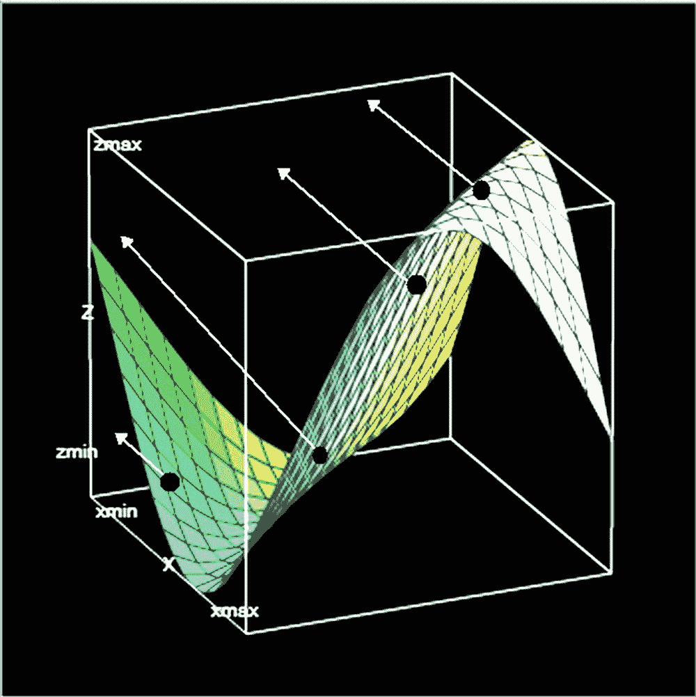

图 12-4 展示了训练结果的投影图。

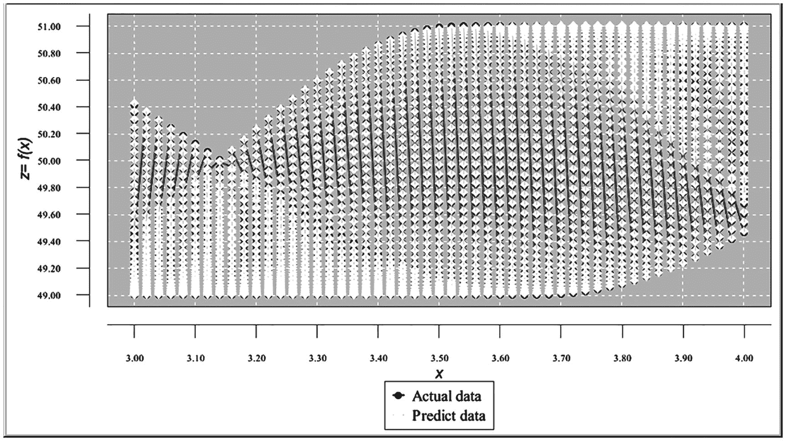

清单 12-4 展示了测试结果。

```python
# 清单 12-4 测试结果
xPoint = 3.99900  yPoint = 3.13900  TargetValue = 49.98649  PredictValue = 49.98797  DiffPerc = 0.00296
xPoint = 3.99900  yPoint = 3.15900  TargetValue = 50.06642  PredictValue = 50.06756  DiffPerc = 0.00227
xPoint = 3.99900  yPoint = 3.17900  TargetValue = 50.14592  PredictValue = 50.14716  DiffPerc = 0.00246
xPoint = 3.99900  yPoint = 3.19900  TargetValue = 50.22450  PredictValue = 50.22617  DiffPerc = 0.00333
xPoint = 3.99900  yPoint = 3.21900  TargetValue = 50.30163  PredictValue = 50.30396  DiffPerc = 0.00462
xPoint = 3.99900  yPoint = 3.23900  TargetValue = 50.37684  PredictValue = 50.37989  DiffPerc = 0.00605
xPoint = 3.99900  yPoint = 3.25900  TargetValue = 50.44964  PredictValue = 50.45333  DiffPerc = 0.00730
xPoint = 3.99900  yPoint = 3.27900  TargetValue = 50.51957  PredictValue = 50.52367  DiffPerc = 0.00812
xPoint = 3.99900  yPoint = 3.29900  TargetValue = 50.58617  PredictValue = 50.59037  DiffPerc = 0.00829
xPoint = 3.99900  yPoint = 3.31900  TargetValue = 50.64903  PredictValue = 50.65291  DiffPerc = 0.00767
xPoint = 3.99900  yPoint = 3.33900  TargetValue = 50.70773  PredictValue = 50.71089  DiffPerc = 0.00621
xPoint = 3.99900  yPoint = 3.35900  TargetValue = 50.76191  PredictValue = 50.76392  DiffPerc = 0.00396
xPoint = 3.99900  yPoint = 3.37900  TargetValue = 50.81122  PredictValue = 50.81175  DiffPerc = 0.00103
xPoint = 3.99900  yPoint = 3.39900  TargetValue = 50.85535  PredictValue = 50.85415  DiffPerc = 0.00235
xPoint = 3.99900  yPoint = 3.41900  TargetValue = 50.89400  PredictValue = 50.89098  DiffPerc = 0.00594
xPoint = 3.99900  yPoint = 3.43900  TargetValue = 50.92694  PredictValue = 50.92213  DiffPerc = 0.00945
xPoint = 3.99900  yPoint = 3.45900  TargetValue = 50.95395  PredictValue = 50.94754  DiffPerc = 0.01258
xPoint = 3.99900  yPoint = 3.47900  TargetValue = 50.97487  PredictValue = 50.96719  DiffPerc = 0.01507
xPoint = 3.99900  yPoint = 3.49900  TargetValue = 50.98955  PredictValue = 50.98104  DiffPerc = 0.01669
xPoint = 3.99900  yPoint = 3.51900  TargetValue = 50.99790  PredictValue = 50.98907  DiffPerc = 0.01731
xPoint = 3.99900  yPoint = 3.53900  TargetValue = 50.99988  PredictValue = 50.99128  DiffPerc = 0.01686
xPoint = 3.99900  yPoint = 3.55900  TargetValue = 50.99546  PredictValue = 50.98762  DiffPerc = 0.01537
xPoint = 3.99900  yPoint = 3.57900  TargetValue = 50.98468  PredictValue = 50.97806  DiffPerc = 0.01297
xPoint = 3.99900  yPoint = 3.59900  TargetValue = 50.96760  PredictValue = 50.96257  DiffPerc = 0.00986
xPoint = 3.99900  yPoint = 3.61900  TargetValue = 50.94433  PredictValue = 50.94111  DiffPerc = 0.00632
xPoint = 3.99900  yPoint = 3.63900  TargetValue = 50.91503  PredictValue = 50.91368  DiffPerc = 0.00265
xPoint = 3.99900  yPoint = 3.65900  TargetValue = 50.87988  PredictValue = 50.88029  DiffPerc = 0.00808
xPoint = 3.99900  yPoint = 3.67900  TargetValue = 50.83910  PredictValue = 50.84103  DiffPerc = 0.00378
xPoint = 3.99900  yPoint = 3.69900  TargetValue = 50.79296  PredictValue = 50.79602  DiffPerc = 0.00601
xPoint = 3.99900  yPoint = 3.71900  TargetValue = 50.74175  PredictValue = 50.74548  DiffPerc = 0.00735
xPoint = 3.99900  yPoint = 3.73900  TargetValue = 50.68579  PredictValue = 50.68971  DiffPerc = 0.00773
xPoint = 3.99900  yPoint = 3.75900  TargetValue = 50.62546  PredictValue = 50.62910  DiffPerc = 0.00719
xPoint = 3.99900  yPoint = 3.77900  TargetValue = 50.56112  PredictValue = 50.56409  DiffPerc = 0.00588
xPoint = 3.99900  yPoint = 3.79900  TargetValue = 50.49319  PredictValue = 50.49522  DiffPerc = 0.00402
xPoint = 3.99900  yPoint = 3.81900  TargetValue = 50.42211  PredictValue = 50.42306  DiffPerc = 0.00188
xPoint = 3.99900  yPoint = 3.83900  TargetValue = 50.34834  PredictValue = 50.34821  DiffPerc = 0.00251
xPoint = 3.99900  yPoint = 3.85900  TargetValue = 50.27233  PredictValue = 50.27126  DiffPerc = 0.00213
xPoint = 3.99900  yPoint = 3.87900  TargetValue = 50.19459  PredictValue = 50.19279  DiffPerc = 0.00358
xPoint = 3.99900  yPoint = 3.89900  TargetValue = 50.11560  PredictValue = 50.11333  DiffPerc = 0.00452
xPoint = 3.99900  yPoint = 3.91900  TargetValue = 50.03587  PredictValue = 50.03337  DiffPerc = 0.00499
xPoint = 3.99900  yPoint = 3.93900  TargetValue = 49.95591  PredictValue = 49.95333  DiffPerc = 0.00517
xPoint = 3.99900  yPoint = 3.95900  TargetValue = 49.87624  PredictValue = 49.87355  DiffPerc = 0.00538
xPoint = 3.99900  yPoint = 3.97900  TargetValue = 49.79735  PredictValue = 49.79433  DiffPerc = 0.00607
xPoint = 3.99900  yPoint = 3.99900  TargetValue = 49.71976  PredictValue = 49.71588  DiffPerc = 0.00781

MaxErrorPerc  = 0.017317654932154674
AverErrorPerc  = 0.007356218626151153
```

图 12-5 展示了测试结果的投影图。

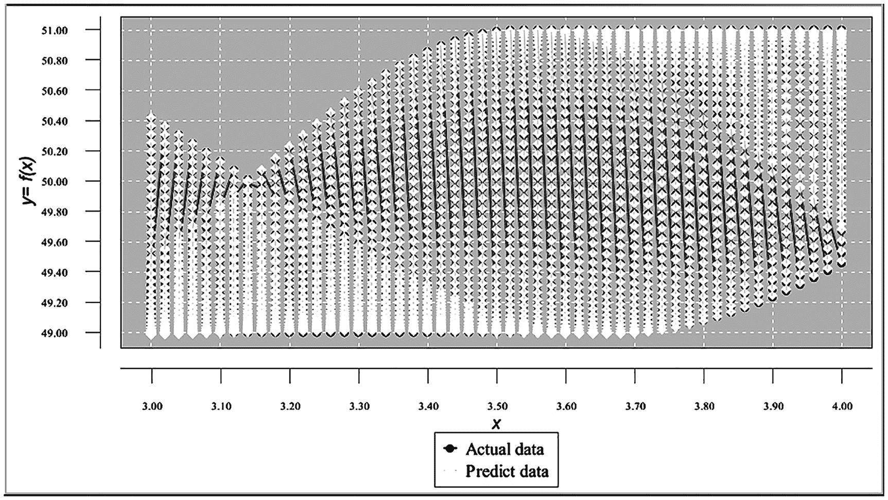

近似结果是可以接受的；因此，无需使用微批量方法。

## 总结

在本章中，我们讨论了如何使用神经网络进行三维空间中的函数近似。我们了解到，三维空间中的函数近似（二元函数）与二维空间中的函数近似方法类似。唯一的区别在于，网络架构应包含两个输入，并且训练和测试数据集应包含所有可能的 `x` 和 `y` 值组合的记录。这些结果可以推广到对多于两个变量的函数进行近似。

# 第三部分 计算机视觉简介

## 13. 图像识别

神经网络也可用于识别图像。图像识别（图像分类）是人工智能最重要的分支之一。计算机视觉实际上是一种视觉模式识别技术。它被银行广泛用于处理支票，被邮局用于识别地址。在许多领域（自动驾驶汽车、人脸识别等），图像识别都极其重要。

同时，图像识别也是人工智能中最困难的学科之一。表面上看，我们似乎可以复用本书前几章学到的神经网络处理的所有方面来识别图像。每张数字图像都是一组像素或点，因此，如果我们创建一个包含不同图像的非常大的数据集，将这些数据输入神经网络并进行训练，那么网络应该能够完成这项工作。

不幸的是，实际情况要复杂得多。我们可以训练网络识别各种单一图像，然后要求网络识别给定的图像（例如，它是猫还是狗？）。但即使是单一物体类型，也存在巨大的变化（狗有多少种，它们的形状、毛发、面部等）。此外，如果狗的图像显示的是站立的狗，程序将无法识别坐着的狗、移动的狗、倒置的狗或从不同角度显示的狗。目前正在进行一些研究，以构建三维神经网络，而处理彩色图像又增加了另一层难度。

除此之外，真实图像可能显示多个物体叠加在一张图像上。图像还可能因阴影落在物体的某些部分或阳光照射在其他部分而变得更加复杂，例如一只猫坐在沙发上，或一只狗被汽车部分遮挡。你应该能理解这个大致概念。

### 手写数字分类

在本节中，我们将讨论图像识别的简单任务，具体来说，就是识别手写数字。请观察图 13-1 所示的手写数字序列。

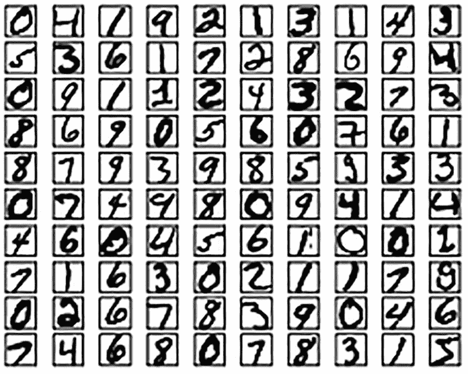

这些数字由不同的人书写。即使是同一个人，根据所用笔的类型、站立或坐姿以及许多其他因素，写出的数字也可能不同。请参见图 13-2 中人们书写的同一数字几乎无穷无尽的变化。

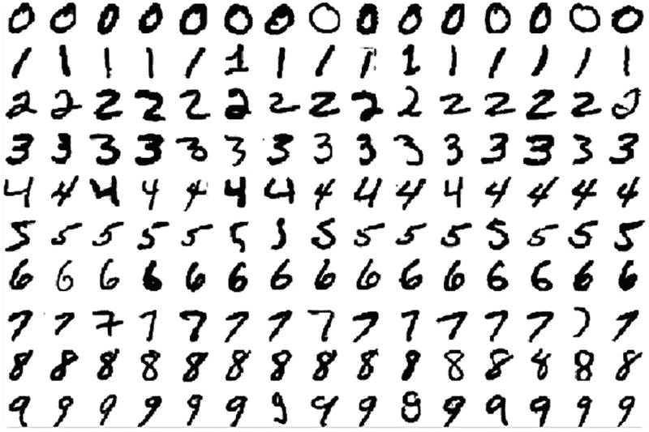

如果我们收集数千（或数百万）个手写数字，并用它们来训练神经网络，就可以构建一个数字识别程序。

**准备输入数据**

为了构建输入，我们将使用 `MNIST` 数据集，其中包含数万张手写数字的扫描图像。`MNIST` 是美国国家标准与技术研究院（`NIST`）收集的两个数据集的修改子集。第一个数据集包含 60,000 条记录，应用于网络训练。第二个数据集包含 10,000 条记录，应用于测试训练好的网络。

两个数据集中的每条记录都代表一个数字图像（28*28 像素 = 784 像素）。这些图像是黑白的。每条记录的格式包含 785 个字段。第一个字段是数字的文本表示（例如，5）。接下来的 784 个字段表示图像中每个像素强度的灰度值。每个像素值是一个单独的数字，代表像素的亮度（像素强度），可能的值从 0 到 255，其中 0 表示白色，其余数字表示逐渐变暗的灰色阴影。图 13-3 显示了图像的一个片段。

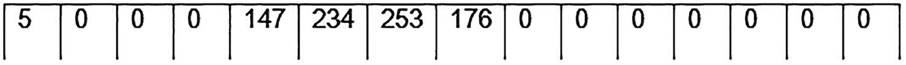

您可以通过从 `http://yann.lecun.com/exdb/mnist/` 网站下载来获取这两个文件。但是，该网站上的数据文件是为 Python 编程语言格式化的，因此从该网站下载对您没有帮助。相反，我们将使用已转换为 `CSV`（Excel）格式的文件（我们在本书的所有示例中都使用了这种格式）。您可以从本书的 `GitHub` 站点获取这些文件。

图 13-4 显示了其中一个 `CSV` 文件的片段。

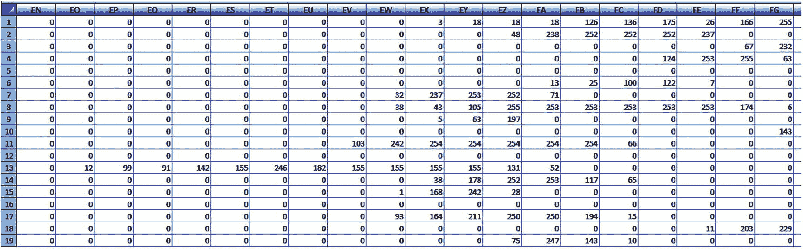

**输入数据转换**

我们需要构建一个程序来训练神经网络识别（分类）数字。为此，我们首先需要找到一种方法，将每条记录所代表的数字编码成网络能够理解的某种数字形式。我们将每个数字表示为一个十字段序列（序列中的每个字段具有字符值 0 或 1）。例如，数字 5 将通过在该十字段序列的第五个位置（字段）中置 1 来表示（其余字段设置为 0）。因此，这是一种数字的字节级表示。

图 13-5 显示了数字 5 的示例。

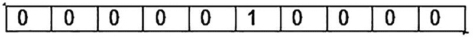

我们将把这十个字节级图像表示的字段放在每条记录的末尾，它们将被视为网络的输出字段。

因此，我们需要将原始 `CSV` 文件的记录（包含 785 个字段：第一个字段是数字的字母形式，接下来的 784 个字段是图像中每个像素的灰度值）转换为不同格式的记录。转换后的记录格式如下：前 784 个字段是图像中每个像素的灰度值，后面跟着 10 个字段，即该记录数字的字节级表示。

图 13-6 显示了转换过程的图形表示。

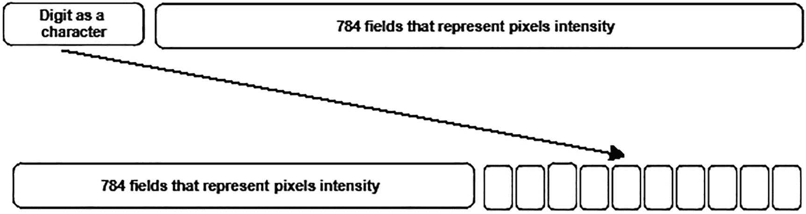

因此，该记录将包含前 784 个字段（网络的输入字段），后跟 10 个字段（网络的目标字段）。在训练网络时，我们教导网络：如果前 784 个字段包含给定的灰度像素强度值，那么这代表数字 5 的图像（其余图像以此类推）。

在进行此转换的同时，我们还需要将输入的灰度字段值和目标字段值归一化到区间 [-1.00, 1.00]。

**构建转换程序**

`CSV` 输入训练数据集是 `C:\Image_Recognition\MNIST_Data\mnist_train.csv`。`CSV` 输入测试数据集是 `C:\Image_Recognition\MNIST_Data\mnist_test.csv`。

以下是转换后对应的文件：

`C:\Image_Recognition\MNIST_Data\mnist_train_input_Norm.csv`
`C:\Image_Recognition\MNIST_Data\mnist_test_input_Norm.csv`

转换逻辑会读取输入数据集中的所有记录。对于每条记录，它提取第一个字段（即字符数字）并构建相应的目标字段（10 个字段，数字的字节级表示）。程序将这 10 个目标字段放在输出记录的末尾（紧跟在 784 个输入字段之后）。

784 个输入字段（位于输入记录中数字字段之后）被放在转换后记录的开头。最后，我们对转换后记录的所有字段进行归一化。请参见清单 13-1。

```java
// ===============================================================
// 该程序将包含 785 个字段的 MNIST CSV 输入训练文件转换为 CSV 归一化训练输入文件。
//===============================================================
package numberrecognition_convertinputtrainfile;

import java.time.YearMonth;
import java.awt.Color;
import java.awt.Font;
import java.io.File;
import java.io.FileInputStream;
import java.text.DateFormat;
import java.text.ParseException;
import java.text.SimpleDateFormat;
import java.time.LocalDate;
import java.time.Month;
import java.time.ZoneId;
import java.util.ArrayList;
import java.util.Calendar;
import java.util.Date;
import java.util.List;
import java.util.Locale;
import java.util.Properties;
import java.io.BufferedReader;
import java.io.BufferedWriter;
import java.io.File;
import java.io.FileInputStream;
import java.io.PrintWriter;
import java.io.FileNotFoundException;
import java.io.FileReader;
import java.io.FileWriter;
import java.io.IOException;
import java.io.InputStream;
import java.nio.file.*;
import java.util.Properties;

public class NumberRecognition_ConvertInputTrainFile
{
    // 归一化区间
    static double Nh =  1;
    static double Nl = -1;

    // 输入点
    static double minXPointDl = 0.00;
    static double maxXPointDh = 255.00;

    // 目标点
    static double minTargetValueDl = 0.00;
    static double maxTargetValueDh = 1.00;

    public static double normalize(double value, double Dh, double Dl)
    {
        double normalizedValue = (value - Dl)*(Nh - Nl)/(Dh - Dl) + Nl;
        return normalizedValue;
    }

    public static void main(String[] args)
    {
        // 归一化训练文件
        String inputFileName = "C:/Image_Recognition/MNIST_Data/mnist_train.csv";
        String outputNormFileName =
            "C:/Image_Recognition/MNIST_Data/mnist_train_input_Norm.csv";

        BufferedReader br = null;
        PrintWriter out = null;
        String line = "";
        String cvsSplitBy = ",";

        double[] inputXPointValue = new double[784] ;
        double[] targetXPointValue = new double[10] ;
        double[] normInputXPointValue = new double[784];
        double[] normTargetXPointValue = new double[10];

        String[] strNormInputXPointValue  = new String[784];
        String[] strNormTargetXPointValue  = new String[10];;

        String strLabelLine1 = "";
        String fullLine;

        // 构建标签行 labelLine1
        for (int m = 0; m < 794; m++)
            if(m == 793)
                strLabelLine1 = strLabelLine1 + Integer.toString(m);
            else
                strLabelLine1 = strLabelLine1 + Integer.toString(m) + ",";

        try
        {
            Files.deleteIfExists(Paths.get(outputNormFileName));
            br = new BufferedReader(new FileReader(inputFileName));
            out = new
                PrintWriter(new BufferedWriter(new FileWriter(outputNormFileName)));
            out.println(strLabelLine1);

            while ((line = br.readLine()) != null)
            {
                // 使用逗号作为分隔符拆分行
                String[] workFields = line.split(cvsSplitBy);

                for (int k = 0; k < 784; k++)
                    inputXPointValue[k] = Double.parseDouble(workFields[k+1]);

                double digitValue = Double.parseDouble(workFields[0]);
                int workIndex = (int) digitValue;

                // 首先，清空数组 targetXPointValue
                for (int v = 0; v < 10; v++)
                    targetXPointValue[v] = 0.00;

                targetXPointValue[workIndex] = 1.00;

                // 对这些字段进行归一化
                for (int k = 0; k < 784; k++)
                    normInputXPointValue[k] =
                        normalize(inputXPointValue[k], maxXPointDh, minXPointDl);

                for (int k = 0; k < 10; k++)
                    normTargetXPointValue[k] =
                        normalize(targetXPointValue[k], maxTargetValueDh, minTargetValueDl);

                // 将归一化后的字段转换为字符串，以便插入到输出 CSV 文件中
                for (int k = 0; k < 784; k++)
                    strNormInputXPointValue[k] = Double.toString(normInputXPointValue[k]);

                for (int k = 0; k < 10; k++)
                    strNormTargetXPointValue[k] = Double.toString(normTargetXPointValue[k]);

                // 将这些字段拼接成一个字符串行，使用逗号分隔符
                fullLine = "";
                for (int k = 0; k < 784; k++)
                    fullLine  = fullLine + strNormInputXPointValue[k] + ",";

                for (int k = 0; k < 10; k++)
                {
                    if(k == 9)
                        fullLine  = fullLine + strNormTargetXPointValue[k];
                    else
                        fullLine  = fullLine + strNormTargetXPointValue[k] + ",";
                }

                // 将完整行写入输出文件
                out.println(fullLine);

            }    // while 循环结束

            out.close();
            br.close();
            System.out.println("转换完成。");
            System.exit(0);

        }  // TRY 块结束
        catch (FileNotFoundException e)
        {
            e.printStackTrace();
            System.exit(1);
        }
        catch (IOException io)
        {
            io.printStackTrace();
        }
        finally
        {
            if (br != null)
            {
                try
                {
                    br.close();
                    out.close();
                }
                catch (IOException e)
                {
                    e.printStackTrace();
                }
            }
        }
    }
}
```

**清单 13-1**
用于转换输入训练数据集的程序代码

**程序说明**

```
// ===========================================================
// The program converts the MNIST CSV input test file that consists of a records
// with 785 fields into the CSV normalized test input file.
// ===========================================================
```

package numberrecognition_convertinputtestfile;

import java.time.YearMonth;
import java.awt.Color;
import java.awt.Font;
import java.io.File;
import java.io.FileInputStream;
import java.text.DateFormat;
import java.text.ParseException;
import java.text.SimpleDateFormat;
import java.time.LocalDate;
import java.time.Month;
import java.time.ZoneId;
import java.util.ArrayList;
import java.util.Calendar;
import java.util.Date;
import java.util.List;
import java.util.Locale;
import java.util.Properties;
import java.io.BufferedReader;
import java.io.BufferedWriter;
import java.io.File;
import java.io.FileInputStream;
import java.io.PrintWriter;
import java.io.FileNotFoundException;
import java.io.FileReader;
import java.io.FileWriter;
import java.io.IOException;
import java.io.InputStream;
import java.nio.file.*;
import java.util.Properties;

public class NumberRecognition_ConvertInputTestFile
{
    // Interval to normalize
    static double Nh =  1;
    static double Nl = -1;

    // Input points columns
    static double minXPointDl = 0.00;
    static double maxXPointDh = 255.00;

    // Target points
    static double minTargetValueDl = 0.00;
    static double maxTargetValueDh = 1.00;

    public static double normalize(double value, double Dh, double Dl)
    {
        double normalizedValue = (value - Dl)*(Nh - Nl)/(Dh - Dl) + Nl;
        return normalizedValue;
    }

    public static void main(String[] args)
    {
        // Normalize train file
        String inputFileName = "C:/Image_Recognition/MNIS_Data/mnist_test.csv";
        String outputNormFileName = "C:/Image_Recognition/MNIS_Data/mnist_test_input_Norm.csv";

        BufferedReader br = null;
        PrintWriter out = null;
        String line = "";
        String cvsSplitBy = ",";

        double[] inputXPointValue = new double[784] ;
        double[] targetXPointValue = new double[10] ;
        double[] normInputXPointValue = new double[784];
        double[] normTargetXPointValue = new double[10];

        String[] strNormInputXPointValue  = new String[784];
        String[] strNormTargetXPointValue  = new String[10];;

        String strLabelLine1 = "";
        String fullLine;

        // Build the labelLine1
        for (int m = 0; m < 794; m++)
            if(m == 793)
                strLabelLine1 = strLabelLine1 + Integer.toString(m);
            else
                strLabelLine1 = strLabelLine1 + Integer.toString(m) + ",";

        try
        {
            Files.deleteIfExists(Paths.get(outputNormFileName));
            br = new BufferedReader(new FileReader(inputFileName));
            out = new
            PrintWriter(new BufferedWriter(new FileWriter(outputNormFileName)));
            out.println(strLabelLine1);

            while ((line = br.readLine()) != null)
            {
                // Brake the line using comma as separator
                String[] workFields = line.split(cvsSplitBy);

                for (int k = 0; k < 784; k++)
                    inputXPointValue[k] = Double.parseDouble(workFields[k+1]);

                double digitValue = Double.parseDouble(workFields[0]);
                int workIndex = (int) digitValue;

                // First, clear the array targetXPointValue
                for (int v = 0; v < 10; v++)
                    targetXPointValue[v] = 0.00;

                targetXPointValue[workIndex] = 1.00;

                // Normalize these fields
                for (int k = 0; k < 784; k++)
                    normInputXPointValue[k] =
                    normalize(inputXPointValue[k], maxXPointDh, minXPointDl);

                for (int k = 0; k < 10; k++)
                    normTargetXPointValue[k] =
                    normalize(targetXPointValue[k], maxTargetValueDh, minTargetValueDl);

                // Convert normalized fields to string, so they can be inserted
                //into the output CSV file
                for (int k = 0; k < 784; k++)
                    strNormInputXPointValue[k] = Double.toString(normInputXPointValue[k]);

                for (int k = 0; k < 10; k++)
                    strNormTargetXPointValue[k] = Double.toString(normTargetXPointValue[k]);

                // Concantenate these fields into a string line with
                //coma separator
                fullLine = "";
                for (int k = 0; k < 784; k++)
                    fullLine  = fullLine + strNormInputXPointValue[k] + ",";

                for (int k = 0; k < 10; k++)
                {
                    if(k == 9)
                        fullLine  = fullLine + strNormTargetXPointValue[k];
                    else
                        fullLine  = fullLine + strNormTargetXPointValue[k] + ",";
                }

                // Put fullLine into the output file
                out.println(fullLine);
            }    // end of while

            br.close();
            out.close();
            System.out.println("Convertion completed.");
            System.exit(0);
        }  // end of TRY
        catch (FileNotFoundException e)
        {
            e.printStackTrace();
            System.exit(1);
        }
        catch (IOException io)
        {
            io.printStackTrace();
        }
        finally
        {
            if (br != null)
            {
                try
                {
                    br.close();
                    out.close();
                }
                catch (IOException e)
                {
                    e.printStackTrace();
                }
            }
        }
    }
}
```

**清单 13-2**
转换输入测试数据集的程序代码

运行前面的程序后，我们构建了以下两个文件：

*   归一化训练文件：`mnist_train_input_Norm.csv`
*   归一化测试文件：`mnist_test_input_Norm.csv`

我们将在下一章中使用这两个文件作为训练和测试数字识别程序的输入。

### 本章小结

本章介绍了计算机视觉——人工智能的一个分支。它解释了使用人工神经网络进行图像识别的基本概念，重点介绍了最简单的图像识别任务，即手写数字的分类。在下一章中，我们将开发一个数字识别程序。

# 14. 手写数字分类

在上一章中，我们准备了两个输入文件：

*   用于网络训练的文件：
    ```
    C:\Image_Recognition\MNIS_Data\ mnist_train_input_Norm.csv
    ```
*   用于网络测试的文件：
    ```
    C:\Image_Recognition\MNIS_Data\ mnist_test_input_Norm.csv
    ```

提醒一下，两个文件中记录的格式如下：前 784 个字段包含灰度像素强度值（24*24 = 784 个字段）。这些是网络的输入字段。记录的下十个字段表示该记录所代表的图像（编码为字节级数字格式）。这些是记录的目标字段。相应地，我们构建神经网络。

### 网络架构

由于神经元数量非常庞大，图 14-1 展示了一个概念性的网络示意图。

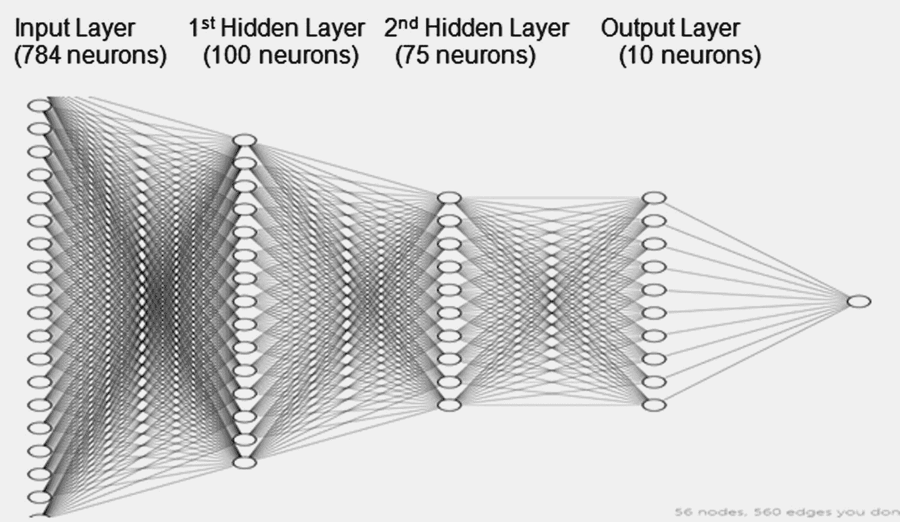

**图 14-1**
网络架构

输入层的神经元数量和输出层的神经元数量由我们的数据模型预先确定（784 个输入字段和 10 个输出字段）。但是，隐藏层的数量和隐藏层中神经元的数量通常通过实验确定，即尝试各种配置并选择产生最佳结果的配置。对于此示例，我们使用具有两个隐藏层的网络。第一个隐藏层有 100 个神经元，第二个隐藏层有 75 个神经元。

请记住，具有多个隐藏层的网络被认为是深度网络。在某些复杂情况下，深度网络可以显著提高计算结果的精度。然而，开发人员经常在训练具有多个隐藏层的网络时遇到困难，并且在某些情况下，具有多个隐藏层的网络的结果精度反而低于具有单个隐藏层（或扁平网络）的网络。

此外，增加隐藏层中神经元的数量和增加隐藏层的数量通常会导致处理量大幅增加，需要更强大的计算机。因此，再次建议尝试各种配置，并选择产生最佳结果的配置。

### 程序代码

清单 14-1 展示了程序代码。

```java
/*
 * 该程序使用训练或测试输入文件，该文件是一个 MNIS 文件，
 * 包含 60,000（用于训练）或 10,000（用于测试）张手写数字图像，
 * 这些图像被转换为 CSV 文件。
 * 每个字符串代表一个数字图像的灰度图像。图像尺寸为
 * 28*28 = 784 个点/像素。每条记录包含 784 个输入字段和 10 个目标
 * 输出字段（图像的字节表示）。
 * 转换后的输入文件已经过归一化处理。
 */
package numberrecognition;

import java.time.YearMonth;
import java.awt.Color;
import java.awt.Font;
import java.io.File;
import java.io.FileInputStream;
import java.io.IOException;
import java.io.InputStream;
import static java.lang.Math.abs;
import java.text.DateFormat;
import java.text.ParseException;
import java.text.SimpleDateFormat;
import java.time.LocalDate;
import java.time.Month;
import java.time.ZoneId;
import java.util.ArrayList;
import java.util.Calendar;
import java.util.Date;
import java.util.List;
import java.util.Locale;
import java.util.Properties;
import org.encog.Encog;
import org.encog.engine.network.activation.ActivationTANH;
import org.encog.engine.network.activation.ActivationReLU;
import org.encog.ml.data.MLData;
import org.encog.ml.data.MLDataPair;
import org.encog.ml.data.MLDataSet;
import org.encog.ml.data.buffer.MemoryDataLoader;
import org.encog.ml.data.buffer.codec.CSVDataCODEC;
import org.encog.ml.data.buffer.codec.DataSetCODEC;
import org.encog.neural.networks.BasicNetwork;
import org.encog.neural.networks.layers.BasicLayer;
import org.encog.neural.networks.training.propagation.resilient.ResilientPropagation;
import org.encog.persist.EncogDirectoryPersistence;
import org.encog.util.csv.CSVFormat;

public class NumberRecognition
{
    static int numberOfInputNeurons = 784;
    static int numberOfOutputNeurons = 10;

    // 归一化系数
    // 归一化区间
    static double Nh =  1;
    static double Nl = -1;

    // 输入字段的归一化范围
    static double imageBitDh = 256.00;
    static double imageBitDl = 0.00;

    // 输出字段的归一化范围
    static double outputDh = 1.00;
    static double outputDl = 0.00;

    static String inputFileName;
    static String trainFileName;
    static String testFileName;
    static String networkFileName;
    static int workingMode;
    static Date workDate = null;
    static String strNumberOfMonths;
    static String strYearMonth;
    static double maxGlobalDiffPerc = 0;
    static double averGlobalDiffPerc = 0;

    // =======================================================
    // 主方法。
    // ======================================================
    public static void main(String[] args)
    {
        // 设置程序运行参数
        // --- 工作模式（0 - 训练，1 – 测试） --
        workingMode = 0; // 训练模式

        // 设置
        trainFileName = "C:/Image_Recognition/MNIS_Data/mnist_train_input_Norm.csv";
    }
}
```

# 列表 14-1 数字识别程序代码

## 主方法

```java
testFileName = "C:/Image_Recognition/MNIS_Data/mnist_test_input_Norm.csv";

networkFileName = "C:/Image_Recognition/MNIS_Data/saved_network_file";

if(workingMode == 0)
    inputFileName = trainFileName;
else
    inputFileName = testFileName;

try
{
    File file1 = new File(networkFileName);
    if(workingMode == 0)
    {
        if(file1.exists())
            file1.delete();
        // 构建网络，训练并测试其效果
        trainTestSaveNetwork();
    }
    else
    {
        // 不保存训练好的网络文件。读取它并用于测试
        loadAndTestNetwork();
    }
}
catch (Throwable t)
{
    t.printStackTrace();
}
finally
{
    Encog.getInstance().shutdown();
}

Encog.getInstance().shutdown();
} // 主方法结束
```

## 数据加载方法

```java
//--------------------------------------------------------------
// 将 CSV 加载到内存中。
// @return 加载的数据集。
// -------------------------------------------------------------
public static MLDataSet loadCSV2Memory(String filename, int input, int ideal, boolean headers, CSVFormat format, boolean significance)
{
    DataSetCODEC codec = new CSVDataCODEC(new File(filename), format, headers, input, ideal, significance);
    MemoryDataLoader load = new MemoryDataLoader(codec);
    MLDataSet dataset = load.external2Memory();
    return dataset;
}
```

## 网络训练与测试方法

```java
//======================================================================
// 此方法构建、训练并保存训练好的网络
//======================================================================
static public void trainTestSaveNetwork()
{
    // 通过将 CSV 文件加载到内存中来准备训练文件
    MLDataSet trainingSet = loadCSV2Memory(inputFileName,numberOfInputNeurons,numberOfOutputNeurons,true,CSVFormat.ENGLISH,false);

    // 创建一个神经网络，不使用工厂
    BasicNetwork network = new BasicNetwork();
    // 输入层
    network.addLayer(new BasicLayer(null,true,numberOfInputNeurons));
    // 隐藏层
    network.addLayer(new BasicLayer(new ActivationTANH(),true,100));
    network.addLayer(new BasicLayer(new ActivationTANH(),true,75));
    //network.addLayer(new BasicLayer(new ActivationLOG(),true,3));
    //network.addLayer(new BasicLayer(new ActivationReLU(),true,8));
    //network.addLayer(new BasicLayer(new ActivationSigmoid(),true,3));
    // 输出层
    network.addLayer(new BasicLayer(new ActivationTANH(),false,numberOfOutputNeurons));
    //network.addLayer(new BasicLayer(new ActivationLOG(),false,1));
    //network.addLayer(new BasicLayer(new ActivationReLU(),false,1));
    //network.addLayer(new BasicLayer(new ActivationSigmoid(),false,1));

    network.getStructure().finalizeStructure();
    network.reset();

    // 训练神经网络
    final ResilientPropagation train = new ResilientPropagation(network, trainingSet);
    //Backpropagation train = new Backpropagation(network,trainingSet,0.7,0.3);
    //Backpropagation train = new Backpropagation(network,trainingSet,0.5,0.5);

    int epoch = 1;
    do
    {
        train.iteration();
        System.out.println("Epoch #" + epoch + " Error:" + train.getError());
        epoch++;
    } while(train.getError() > 0.005);

    System.out.println("网络已训练完成");

    for(MLDataPair pair: trainingSet)
    {
        final MLData output = network.compute(pair.getInput());
    }

    // 现在测试网络。训练好的网络保留在内存中
    System.out.println("正在测试网络");

    double[] normImageBit = new double[784];
    double[] normTargetImageBit = new double[10];
    double[] normPredictImageBit = new double[10];
    double[] denormImageBit = new double[784];
    double[] denormPredictImageBit = new double[10];
    double[] denormTargetImageBit = new double[10];
    double[] differencePerc = new double[10];

    // 加载输入 CSV 文件。
    MLDataSet testingSet = loadCSV2Memory(inputFileName,numberOfInputNeurons,numberOfOutputNeurons,true,CSVFormat.ENGLISH,false);

    int i = 0;
    int numberOfErrors = 0;
    for (MLDataPair pair: testingSet)
    {
        i++;
        MLData inputData = pair.getInput();
        MLData actualData = pair.getIdeal();
        MLData predictData = network.compute(inputData);

        // 获取优化后的结果
        for (int k = 0; k < 784; k++)
            normImageBit[k] = inputData.getData(k);
        for (int k = 0; k < 10; k++)
            normTargetImageBit[k] = actualData.getData(k);
        for (int k = 0; k < 10; k++)
            normPredictImageBit[k] = predictData.getData(k);

        System.out.println(" ");
        System.out.println("记录 = " + i);
        System.out.println(" ");
        System.out.println("目标 =  " + normTargetImageBit[0] + " " + normTargetImageBit[1] + " " + normTargetImageBit[2] +
            " " + normTargetImageBit[3] + " " + normTargetImageBit[4] + " " + normTargetImageBit[5] +
            " " + normTargetImageBit[6] + " " + normTargetImageBit[7] + " " + normTargetImageBit[8] +
            " " + normTargetImageBit[9]);
        System.out.println("预测 = " + normPredictImageBit[0] + " " + normPredictImageBit[1] + " " + normPredictImageBit[2] +
            " " + normPredictImageBit[3] + " " + normPredictImageBit[4] + " " + normPredictImageBit[5] +
            " " + normPredictImageBit[6] + " " + normPredictImageBit[7] + " " + normPredictImageBit[8] +
            " " + normPredictImageBit[9]);

        // 反归一化输入数据
        // 反归一化点字段
        for (int m = 0; m < 784; m++)
            denormImageBit[m] = ((imageBitDl - imageBitDh)*normImageBit[m] - Nh*imageBitDl + imageBitDh*Nl)/(Nl - Nh);
        // 反归一化目标字段
        for (int m = 0; m < 10; m++)
            denormTargetImageBit[m] = ((outputDl - outputDh)*normTargetImageBit[m] - Nh*outputDl + outputDh*Nl)/(Nl - Nh);
        // 反归一化预测字段
        for (int m = 0; m < 10; m++)
            denormPredictImageBit[m] = ((outputDl - outputDh)*normPredictImageBit[m] - Nh*outputDl + outputDh*Nl)/(Nl - Nh);

        System.out.println("反归一化目标 =  " + denormTargetImageBit[0] + " " + denormTargetImageBit[1] + " " +
            denormTargetImageBit[2] +
            " " + denormTargetImageBit[3] + " " + denormTargetImageBit[4] + " " + denormTargetImageBit[5] +
            " " + denormTargetImageBit[6] + " " + denormTargetImageBit[7] + " " + denormTargetImageBit[8] +
            " " + denormTargetImageBit[9]);
        System.out.println("反归一化预测 = " + denormPredictImageBit[0] + " " + denormPredictImageBit[1] + " " +
            denormPredictImageBit[2] +
            " " + denormPredictImageBit[3] + " " + denormPredictImageBit[4] + " " + denormPredictImageBit[5] +
            " " + denormPredictImageBit[6] + " " + denormPredictImageBit[7] + " " + denormPredictImageBit[8] +
            " " + denormPredictImageBit[9]);

        double r0 = abs(denormTargetImageBit[0]) - abs(denormPredictImageBit[0]);
        double r1 = abs(denormTargetImageBit[1]) - abs(denormPredictImageBit[1]);
        double r2 = abs(denormTargetImageBit[2]) - abs(denormPredictImageBit[2]);
        double r3 = abs(denormTargetImageBit[3]) - abs(denormPredictImageBit[3]);
        double r4 = abs(denormTargetImageBit[4]) - abs(denormPredictImageBit[4]);
        double r5 = abs(denormTargetImageBit[5]) - abs(denormPredictImageBit[5]);
        double r6 = abs(denormTargetImageBit[6]) - abs(denormPredictImageBit[6]);
        double r7 = abs(denormTargetImageBit[7]) - abs(denormPredictImageBit[7]);
        double r8 = abs(denormTargetImageBit[8]) - abs(denormPredictImageBit[8]);
        double r9 = abs(denormTargetImageBit[9]) - abs(denormPredictImageBit[9]);

        if(abs(r0) < 0.01 &&
           abs(r1) < 0.01 &&
           abs(r2) < 0.01 &&
           abs(r3) < 0.01 &&
           abs(r4) < 0.01 &&
           abs(r5) < 0.01 &&
           abs(r6) < 0.01 &&
           abs(r7) < 0.01 &&
           abs(r8) < 0.01 &&
           abs(r9) < 0.01)
        {}
        else
        {
            System.out.println("不匹配");
            numberOfErrors = numberOfErrors + 1;
        }
    } // FOR 循环结束

    System.out.println("错误数量 = " + numberOfErrors);
}  // 方法结束
```

## 编程逻辑

本节将介绍相关设置。输入文件的每条记录包含 784 个输入字段和 10 个输出字段。

```java
static int numberOfInputNeurons = 784;
static int numberOfOutputNeurons = 10;
```

以下是归一化区间：

```java
static double Nh =  1;
static double Nl = -1;
```

以下是输入字段值的范围（灰度像素的最大值和最小值）：

```java
static double imageBitDh = 255.00;
static double imageBitDl = 0.00;
```

以下是输出字段值的范围（表示图像字节表示形式的字段的最大值和最小值）：

```java
static double outputDh = 1.00;
static double outputDl = 0.00;
```

程序根据 `workingMode` 参数的值以两种模式（训练模式或测试模式）运行。

```java
// --- 工作模式（0 - 训练，1 - 测试） --
workingMode = 0; // 训练模式
```

## 代码示例

```java
// 通用设置
trainFileName = "C:/Image_Recognition/MNIS_Data/mnist_train_input_Norm.csv";
testFileName = "C:/Image_Recognition/MNIS_Data/mnist_test_input_Norm.csv";
networkFileName = "C:/Image_Recognition/MNIS_Data/saved_network_file";

// 检查 `workingMode` 字段，并以训练或测试模式运行程序
if (workingMode == 0) {
    if (file1.exists())
        file1.delete();
    // 构建网络，训练并测试其效果
    trainTestSaveNetwork();
} else {
    // 不保存训练好的网络文件。读取它并用于测试
    loadAndTestNetwork();
}
} catch (Throwable t) {
    t.printStackTrace();
} finally {
    Encog.getInstance().shutdown();
}
```

## 执行

当以训练模式运行时（执行 `trainTestSaveNetwork` 方法），逻辑会将输入文件加载到内存中，构建网络，训练网络，并在各轮次之间迭代，直到网络误差小于 0.005。

最后，我们将训练好的网络保存到磁盘上的文件中，这样在测试模式下运行程序时，我们可以直接检索内存中已保存的训练好的网络。保存路径为：`"C:/Image_Recognition/MNIS_Data/saved_network_file"`。

当以测试模式运行时，会执行 `loadAndTestNetwork()` 方法。逻辑会将之前保存的训练好的网络加载到内存中，并测试其针对用作输入的测试数据集的效果。

我们从训练好的网络中检索三组字段：输入数据、实际数据和预测数据。

```java
MLData inputData = pair.getInput();
MLData actualData = pair.getIdeal();
MLData predictData = network.compute(inputData);
```

由于输入数据集是归一化的，我们从网络中检索到的数据也是归一化的，因此下一步是对输入数据、实际数据和预测数据进行反归一化。最后，我们要检查网络识别手写数字的效果。如果数字图像未被识别，我们将 `numberOfErrors` 字段加 1。该网络对手写数字的分类准确率约为 92%，对于这个简单的程序来说，效果相当不错。

## 卷积神经网络

为了对更复杂的图像进行分类，研究人员目前使用一种更复杂的人工神经网络，称为 `卷积神经网络`。我们目前讨论的神经网络都是全连接网络，这意味着下一层的每个神经元都与前一层的每个神经元相连。

在卷积网络中，下一层的每个神经元仅与前一层的紧密相邻的一组神经元相连，这组神经元通常被称为 `局部感受野`（或 `补丁`）。图 14-2 展示了一个隐藏神经元与一个神经元补丁（5*5）的连接。

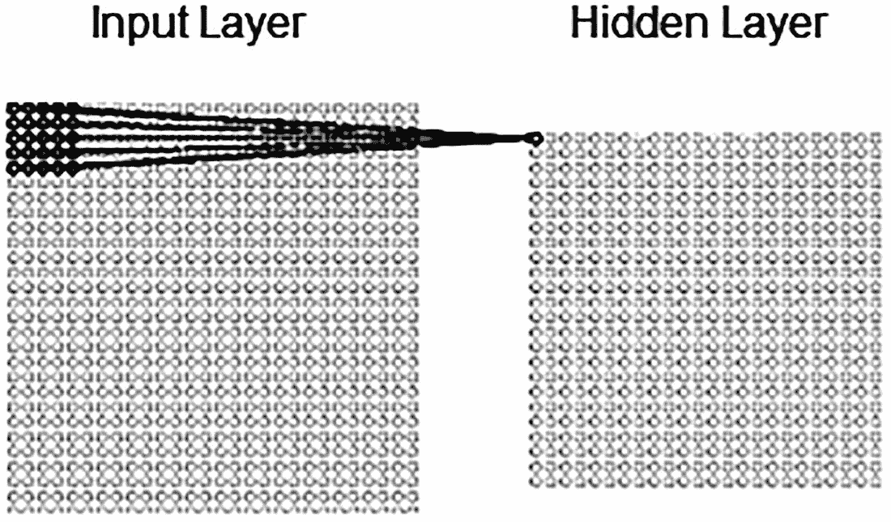

图 14-2 神经元连接

隐藏层中的下一个神经元与通过将补丁滑动一个像素而获得的另一个补丁相连，以此类推。因此，每个隐藏神经元学习分析其特定的局部感受野，而不是所有输入神经元。卷积网络的结构比全连接网络复杂得多，超出了这本入门书的范围。关于卷积网络的更详细信息，可以在以下书籍中找到：

*   *高级应用深度学习、卷积神经网络与目标检测*，作者：Michelucci Umberto（Apress，2019 年）
*   *深度学习：基础、理论与应用*，作者：Kaizhu Huang、Amiz Hussain、Qiu-Feng Wang、Rui Zhang（Springer，2019 年）

强大的卷积网络目前被成功用于处理与平面图像不同的三维物体。此外，也有尝试处理具有红绿蓝（RGB）编码（多维图像）的彩色图像。

## 总结

在本章中，我们开发了一个能够以相当高的准确率识别（分类）手写数字的程序。我们还讨论了一种称为 `卷积网络` 的不同类型神经网络的一些基本概念。

# 索引

## A

- 激活函数
- 人工智能神经网络（参见 神经网络）
- 人工神经元

## B

- 反向传播过程
- 反向传播计算
  - 隐藏层：`W¹[11]`，`W¹[12]`，`W¹[21]`，`W¹[22]`，`W¹[31]`，`W¹[32]`
  - 权重调整（输出层）：`W²[11]`，`W²[12]`，`W²[13]`
- 生物/人工神经元

## C

- 复杂周期函数
  - 图表表示
  - 代码片段
  - 数据准备
  - 误差限
  - 函数拓扑
  - 函数值区间/训练过程
  - 网络架构
  - 程序代码
  - 滑动窗口记录
  - 测试输出
  - 训练处理结果
- 连续函数/复杂拓扑
  - 函数公式
  - 微批量方法
  - 程序代码
  - 测试处理结果
  - 训练处理结果
  - 网络架构
  - 处理训练结果
  - 程序代码
- 螺旋类函数
  - 常规网络处理
  - 常规处理结果
  - 微批量过程
  - 多个函数值
  - 网络架构
  - 程序代码
  - 测试数据集
  - 测试结果
  - 训练数据集
  - 训练处理结果
  - 测试数据集
  - 训练数据集

## D

- 数据准备
  - 测试结果
  - 训练数据
  - 反向传播方法
  - 错误消息字段
  - 网络架构
  - 网络误差
  - 归一化测试数据集
  - 归一化训练数据集
  - 配对数据集
  - 程序代码
  - 结果
  - `returnCode` 方法
  - 转换数据集
- 数据准备/转换
- 深入探究
- 数字识别

## E

- Encog 软件
  - 数据集命名
  - 项目导航窗口
  - 归一化程序
  - 项目对话框
  - `Sample1_Norm` 项目
  - 源代码
  - 测试数据集
  - 训练数据集
- 调试/执行程序
  - 函数逼近
  - 网络架构
  - 神经网络
  - 创建全局库
  - 导入语句
  - JAR 文件位置
  - 导航窗口
  - 项目创建
  - 属性对话框
  - 源代码
  - XChart jar 文件
- 原始/逼近函数
  - 程序代码
  - 激活函数
  - 反向传播
  - 图表文件
  - 代码片段
  - 代码检索
  - 反归一化
  - 图形元素
  - 网络误差
  - 预测值
  - 单变量函数
  - 训练方法
  - `workingMode` 方法
  - XChart 包
  - 测试数据集
  - 测试模式图表
  - 逼近图表系列配置
  - 输出/结果
  - 训练和测试数据集
  - 训练数据集
  - 训练处理方法
- 交易所交易基金（ETF）（参见 股票市场指数）

## F, G

- 预测
- 前向传播计算
  - 隐藏层
  - 输出层
- 函数拓扑数据集，滑动窗口记录

## H

- 手写数字
  - 概念网络图
  - 卷积神经网络
  - 执行
  - 输入文件
  - 局部感受野
  - 程序代码
  - 编程逻辑过程

## I

- 图像识别
  - 转换过程
  - 字节表示
  - 图形表示
  - 测试数据集
  - 训练数据集
  - 手写数字
  - 输入数据准备
  - MNIST 数据集
  - 记录表示变体
  - 视觉模式
- 内部机制
  - 实际值/目标值
  - 反向传播导数
  - 前向传播计算
  - 全连接网络
  - 函数导数/发散函数公式
  - 输入记录 1
  - 输入记录 2
  - 输入记录 3
  - 输入记录 4
  - 网络预测值
  - 神经网络架构
  - 回归
  - Sigmoid 激活函数

## J, K, L

- Java 环境
  - 下载
  - Encog 框架（另请参见 Encog 软件）
  - `JAVA_HOME` 环境变量
  - 属性对话框
  - 变量对话框
  - 网站
  - XChart 包
- Java/NetBeans 环境
  - `CLASSPATH` 系统变量

## M

- 手动逼近
  - 反向（参见 反向传播计算）
  - 偏置调整
  - 误差调整
  - 隐藏层
  - 输出层误差函数
  - 前向传播计算
  - 隐藏层和输出层
  - 局部/全局最小值
  - 矩阵/标量计算
  - 小批量/随机梯度
  - 网络图
  - 神经元表示向量
- 微批量方法
  - 数据集文件片段
  - `getChart()` 方法
  - 程序代码
  - `save-network` 文件
  - 测试方法图表表示
  - 处理代码结果
  - 训练方法图表表示
  - 代码片段 2
  - 片段数据集
  - 归一化测试数据集
  - 输出记录设置
  - `returnCode`（代码片段）
  - 测试数据集

## N

- NetBeans IDE 过程
  - 用户项目
  - XChart jar 文件
- 神经网络
  - 激活函数
  - 生物/人工神经元
  - 人类神经元
  - 学习过程
  - 含义
  - 示意图
  - Sigmoid 函数
- 非连续函数
  - 图表表示
  - 输入数据集
  - 微批量（参见 微批量方法）
  - 网络架构
  - 神经网络误差函数流程图
  - 模式
  - 前向传播计算
  - 函数值
  - 网络架构
  - 神经元
  - 处理
  - 处理结果
  - 记录误差
  - 训练过程
  - 归一化输入数据集
  - 程序代码
  - 训练方法片段代码
  - 低质量函数逼近
  - 不令人满意的代码

## O

- 对象分类
  - 数据归一化
  - 程序代码
  - 测试数据集
  - 训练数据集
  - 程序代码记录
  - 网络架构
  - 测试数据集
  - 训练数据集
  - 词语-数字交叉引用
  - 测试方法
  - 训练方法
  - 验证结果
  - 测试代码
  - 训练代码

## P, Q, R

- 周期函数
  - 复杂（参见 复杂周期函数）
  - 数据准备（参见 数据准备）
  - 函数值
  - 网络架构
  - 归一化测试数据集
  - 归一化训练数据集
  - 程序代码
  - 测试处理
  - 训练处理结果

## S

- 股票市场指数
  - 实际函数值
  - 函数拓扑（参见 函数拓扑）
  - `getError()` 方法
  - 历史月度价格
  - 微批量文件
  - 网络处理程序
  - 程序代码
  - 归一化数据集
  - 价格差异数据集
  - 程序代码
  - 滑动窗口
  - SPY 月度图表
  - 测试数据集分析过程
  - 欧几里得几何
  - 逻辑结果
  - 微批量数据集
  - 归一化数据集
  - 价格差异
  - 已保存的网络记录
  - 训练方法
  - 训练结果
  - 验证结果

## T, U, V, W, X, Y, Z

- 三维（3D）空间
  - 图表表示
  - 数据准备
  - 网络架构
  - 处理结果
  - 投影图
  - 单面板测试结果
  - 训练结果
  - 程序代码
  - 记录结构
  - 测试数据集