# 深入探究 TensorFlow

在上一章中，你了解了 TensorFlow 平台的能力。在领略了 TensorFlow 的强大功能之后，现在是时候学习如何将这些能力应用到你自己的实际应用中去了。

我们将从一个简单的应用开始，它将教你一个简单机器学习应用开发的复杂细节。

## 一个简单的机器学习应用

为了让你开始 TensorFlow 编码，我们将从一个简单的 Hello World 类应用开始。在这个简单的应用中，你将开发一个使用统计回归技术进行预测的机器学习模型。

在此应用中，我们将使用程序代码本身内部声明的一组固定数据点。我们的数据将由 (`x`, `y`) 坐标值组成。我们计算一个名为 `z` 的值，它与 `x` 和 `y` 存在某种线性关系。例如，对于给定的 `x` 和 `y` 值，`z` 的值可以使用以下数学公式计算：

```
z = 7 * x + 6 * y + 5
```

我们的任务是让机器自行学习，在给定足够多的 `x` 和 `y` 值以及相应的目标 `z` 值的情况下，为上述关系找到最佳拟合。一旦模型训练完成，我们将使用该模型来预测任何未见过的 `x` 和 `y` 值对应的 `z`。例如，给定 `x` 等于 2 且 `y` 等于 3，模型应预测输出 `z` 等于 37。如果它预测出 37，并且对于任何先前未知的 `x` 和 `y` 都能以 100% 的准确率预测 `z`，我们就说该模型已完全训练，准确率达到 100%。实际上，开发一个能以 100% 准确率预测的模型是永远不可能的。因此，我们尝试优化模型性能，以达到 100% 这一理想准确率水平。

从上述讨论可以看出，我们试图解决的问题是一个经典的线性回归案例研究。为简单起见，我们将创建一个仅包含一个神经元的单层网络，该网络经过训练来解决线性回归问题。在实践中，你的网络通常由多个层和多个节点组成。在这个简单的应用中，我将避免使用此类深度网络，因为定义它们需要对 Keras API 有更深入的理解。你将在本章后面接触到这些 Keras API。对于这个简单的应用以及本书中的所有后续应用，你将使用 Google Colab 进行开发。

### 创建 Colab 笔记本

在第一个应用中，我将指导你完成在 Colab 中创建、测试和推理机器学习模型开发的整个过程。这是为了那些刚接触机器学习开发的读者而对开发过程进行的较为详细的解释。

在浏览器中通过输入以下网址启动 Google Colab：

```
http://colab.research.google.com
```

你将看到如图 2-1 所示的屏幕。

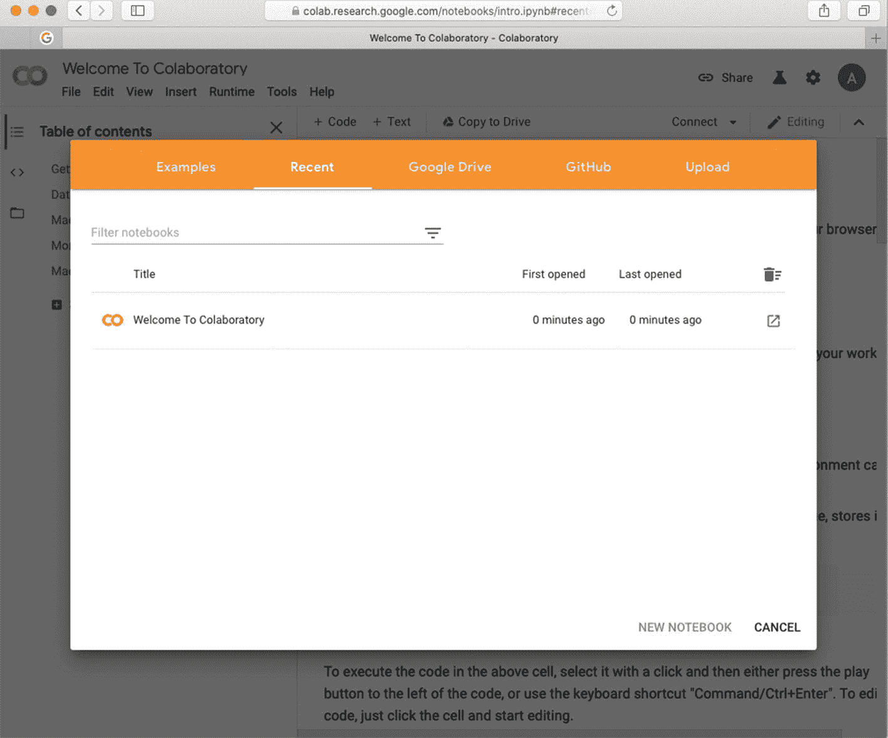

图 2-1

创建新的 Colab 笔记本

选择 `新建 PYTHON3 笔记本` 选项以打开一个新的 Python 3 笔记本。假设你已登录 Google 账户，你将看到如图 2-2 所示的屏幕。


图 2-2

新的 Colab 笔记本

笔记本的默认名称以 `Untitledxxx.ipnyb` 开头。将其名称更改为 Hello World 或你喜欢的任何名称。接下来，你将编写代码以在你的 Python 代码中导入 TensorFlow 库。

### 导入

我们简单的程序将需要三个导入——TensorFlow 2.x、用于处理数据的 `numpy` 库，以及用于绘制图表的 `matplotlib`。

#### 导入 TensorFlow 2.x

要在 Python 笔记本中导入 TensorFlow，你需要使用以下程序语句：

```
import tensorflow as tf
```

这会导入默认版本，目前（撰写本文时）是 1.x。执行上述命令的输出如图 2-3 所示。

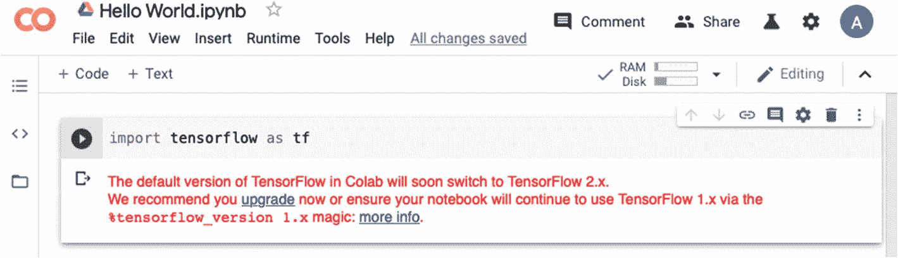

图 2-3 — 默认的 TensorFlow 库导入

由于本书基于 TensorFlow 2.x，我们需要显式导入它。为此，你必须运行一个 `tensorflow_version` 魔法命令。魔法命令是 Colab 的一项功能，通过以下语句运行：

```
%tensorflow_version 2.x
```

当你运行这段代码时，TensorFlow 2.x 将被选中。输出如图 2-4 所示。


图 2-4 — 加载 TensorFlow 2.x

在选中 TensorFlow 2.x 之后，你可以使用传统的导入语句来导入 TensorFlow 库，如下所示：

```
import tensorflow as tf
```

**注意：** 在当前版本的 Colab 中，不再需要使用魔法命令。

Keras 库现在是 TensorFlow 的一部分。要在我们的应用中使用 Keras，我们需要从 TensorFlow 中导入它。这通过以下导入语句完成：

```
from tensorflow import keras
```

要使用 Keras 模块，你现在需要使用 `tf.keras` 语法。接下来，你将导入其他必需的库。

#### 导入 NumPy

NumPy 是一个用于在 Python 中支持大型多维数组的库。它包含一组高级数学函数，用于对这些数组进行操作。任何机器学习模型的开发都严重依赖于数组的使用。你将使用 NumPy 数组来存储网络所需的输入数据。

要导入 NumPy，请使用以下导入语句：

```
import numpy as np
```

`matplotlib` 是一个用于创建高质量二维图表的 Python 库。你将在我们的项目中使用这个库来绘制准确度和误差指标。

要导入 `matplotlib`，请使用以下语句：

```
import matplotlib.pyplot as plt
```

至此，我们完成了应用的导入工作。接下来，你将创建应用所需的数据。

### 设置数据

我们将创建一组包含 `x` 和 `y` 坐标的 100 个数据点。数据点的数量通过以下语句在 Python 变量中声明：

```
number_of_datapoints = 100
```

要生成 `x` 和 `y` 坐标，你需要使用 NumPy 中的 `random` 模块。要生成 `x` 值，请使用以下程序语句：

```
# 生成范围在 -5 到 +5 之间的随机 x 值
x = np.random.uniform(low = -5 , high = 5 ,
size = (number_of_datapoints, 1))
```

`uniform` 函数中的 `low` 和 `high` 参数定义了随机数生成器的下限和上限。`size` 参数指定了数组的维度，即要生成多少个值。上述程序语句的返回值是一个包含 100 行和 1 列的数组。你可以使用以下语句打印生成数组的前五个值：

```
x[:5,:].round(2)
```

在输出中，通过调用 `round` 函数，每个值都被截断为两位小数。执行此语句的示例输出如下所示：

```
array([[ 4.57],
[-0.68],
[ 2.64],
[-3.17],
[-4.86]])
```

请注意，每次运行的输出都会有所不同。同样，`y` 值使用类似的语句生成，如下所示：

```
y = np.random.uniform(-5 , 5 , size = (number_of_datapoints , 1))
```

我们使用一个线性方程来建立 `x` 和 `y` 之间的关系：

```
z = 7 * x + 6 * y + 5
```

在机器学习术语中，`x` 和 `y` 是特征，`z` 是标签。一旦我们的模型训练完成，我们将要求模型根据给定的 `x` 和 `y` 预测 `z`。我之前提到过，我们将训练网络来发现 `x` 和 `y` 之间的关系。为此，我们需要在我们使用上述方程计算的每个 `z` 值中引入一些噪声。你使用与之前相同的 `random` 函数生成噪声，其值范围从 –1 到 +1，使用以下语句：

```
noise = np.random.uniform(low =-1 , high =1,
size = (number_of_datapoints, 1))
```

现在，你使用线性方程创建 `z` 数组，并向其中添加噪声，如下所示：

```
z = 7 * x + 6 * y + 5 + noise
```

我们神经网络的输入是一个一维数组，包含 100 行，每行由另一个一维数组组成，该数组以 `x` 和 `y` 值作为列。要创建所需的输入数据格式，你需要使用 `column_stack` 函数，如下所示：

```
input = np.column_stack((x,y))
```

打印 `input` 数组的前五个值会产生以下输出：

```
array([[-1.9 ,  2.91],
[-2.14, -0.81],
[ 4.18,  1.79],
[-0.93, -4.41],
[-1.8 , -1.31]])
```

至此，你已经准备好了用于训练网络的数据。我们的下一个任务是创建网络本身。

### 定义神经网络

如前所述，我们的神经网络将包含一个单一的神经元，该神经元接受一个一维向量并输出一个单一值。该网络如图 2-5 所示。

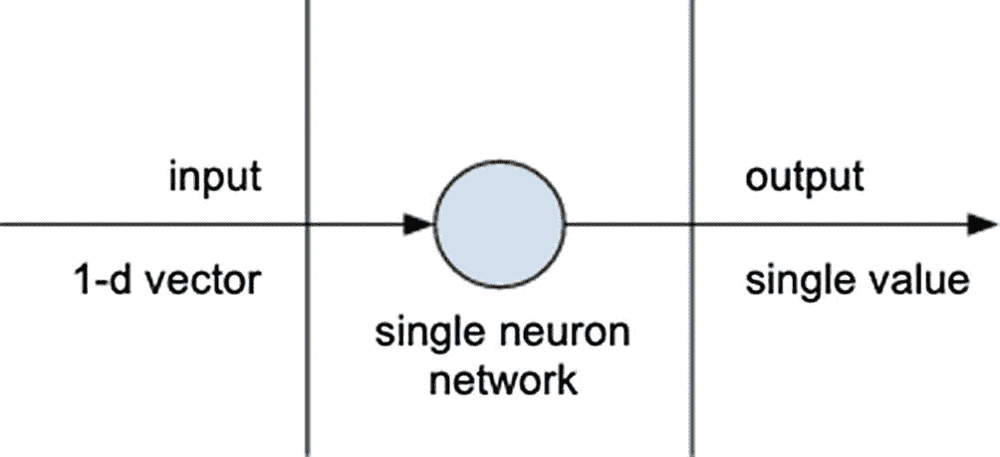

图 2-5 — 单层/单节点网络

为了定义网络模型，Keras 提供了一个 Sequential API。使用这个 API，你将能够构建多层次的复杂网络架构。在我们当前的需求中，我们需要创建一个由单层单神经元组成的 ANN 架构。你使用以下语句定义模型：

```
model = tf.keras.Sequential([keras.layers.Dense(units=1, input_shape=[1])])
```

`units` 参数定义了输出空间的维度。在这里，通过指定值为 1，你定义了一个单层网络，其中包含一个输出单一值的神经元。`Dense` 函数接受多个参数，允许你创建复杂的 ANN 架构。在本书中，你将使用 `keras.Sequential` API 创建许多复杂的架构。

模型定义完成后，我们需要编译它，并使其准备好在我们数据集上进行训练。

### 编译模型

要训练模型，我们首先需要定义一个学习过程。模型编译就是设置其学习过程的一种方式。学习过程本身包含以下几个组成部分：

- 目标损失函数

- 优化器

- 评估指标

首先，它使用某个损失函数来确定推理结果与目标值之间的差距。模型在训练过程中会尝试最小化这个损失。Keras 提供了几个预定义的损失函数，例如 `categorical_crossentropy`、`mean_squared_error`、`huber_loss` 和 `poisson`。其次，为了帮助减少损失，我们使用优化器。优化器是一种用于改变神经网络属性的算法或方法。这些属性包括权重和学习率。通过改变这些属性，我们试图最小化损失。Keras 提供了几个预定义的优化器，再举几个例子，如 `SGD`（随机梯度下降）、`RMSprop`、`Adagrad` 和 `Adam`。最后，我们定义一个用于评判模型性能的评估指标函数——举几个预定义的评估指标函数为例，如 `MSE`（均方误差）、`RMSE`（均方根误差）、`MAE`（平均绝对误差）和 `MAPE`（平均绝对百分比误差）。

因此，我们通过在模型上调用 `compile` 函数来设置学习过程。`compile` 函数将上述三个参数作为其参数。以下代码片段说明了 `compile` 的用法：

```
model.compile(optimizer = 'sgd' ,
loss = 'mean_squared_error' ,
metrics = ['mse'] )
```

这里，我们指定随机梯度下降作为优化器，均方误差作为损失函数，并且同样将均方误差作为评估指标。

现在，既然模型已经了解了学习过程，是时候向其输入一些训练数据了。

### 训练网络

模型的训练需要经过多次迭代。最初，我们为网络中的各个节点分配一些预设的权重。在第一次训练迭代之后，我们查看损失，然后调整这些权重以进行第二次迭代，并在此次迭代中尝试最小化损失。这个过程会持续多次迭代；我们称之为轮次（epochs）。在每个轮次结束时，我们保存并监控损失，以确保我们正朝着正确的方向优化网络。为了保存这种状态，我们需要在 Keras 中创建一个历史对象，这可以通过以下代码片段完成：

```
from tensorflow.keras.callbacks import History
history = History()
```

我们将把前面的 `history` 对象作为参数传递给模型训练方法。训练本身是通过调用模型的 `fit` 方法来完成的，如下所示：

```
model.fit(input, z , epochs = 15 , verbose = 1,
validation_split = 0.2, callbacks = [history])
```

第一个参数指定了我们之前创建的堆叠输入。第二个参数指定了目标值。`epochs` 参数定义了迭代次数。`verbose` 参数指定你是否希望观察训练进度。`validation_split` 参数指定将使用给定数据的 20% 来验证训练好的模型。最后，`callbacks` 参数指定了中间监控数据的存储位置。它指定了在每个轮次结束时调用的回调函数。训练过程中的部分输出如图 2-6 所示。

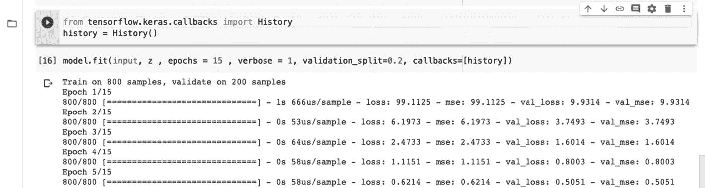

图 2-6

模型训练期间的输出

一旦所有轮次完成，模型应该就训练好了。我们需要验证模型是否确实训练得符合我们的需求。为此，我们将通过观察模型在学习过程中被要求创建的评估指标来检查训练输出。

### 检查训练输出

我们要求模型在每个轮次将状态保存到一个 `history` 变量中。我们可以借助以下语句来检查 `history` 中记录了哪些内容：

```
print(history.history.keys())
```

这条打印语句的输出将是：

```
dict_keys(['loss', 'mse', 'val_loss', 'val_mse'])
```

我们看到，在每个轮次，模型都保存了训练数据和验证数据上的 `loss` 和 `mse`（均方误差）。验证损失和 `mse` 以 `val_` 前缀表示。现在，我们将为 `loss` 和 `mse` 创建一个图表。要打印训练数据和验证数据上的损失，请使用以下代码片段：

```
plt.plot(history.history['loss'])
plt.plot(history.history['val_loss'])
plt.title('Accuracy')
plt.ylabel('loss')
plt.xlabel('epoch')
plt.legend(['train', 'validation'], loc='upper right')
plt.show()
```

这里，我们绘制了记录历史中的 `loss` 和 `val_loss` 键值。输出如图 2-7 所示。

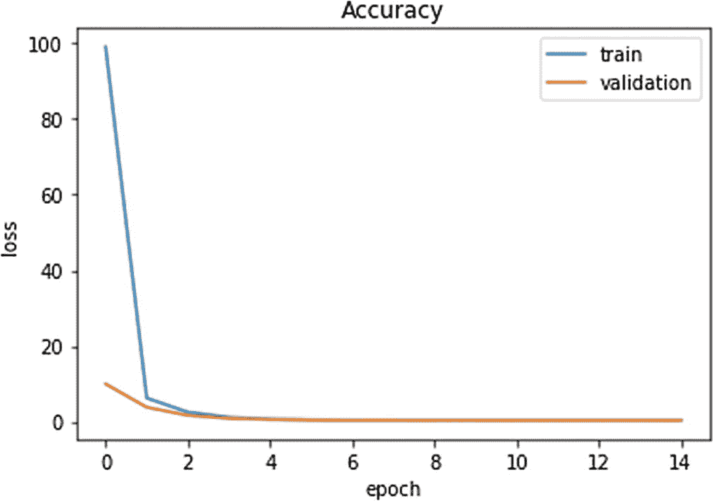

图 2-7

损失 vs. 轮次

从图 2-7 中我们观察到，损失在第三个轮次结束时就已经降得很低了，并且模型在我们于 `fit` 方法中指定的 15 个轮次结束时已经完全训练好。我们还将打印均方误差以进一步验证这一说法。要绘制 `mse`，请使用以下代码片段：

```
plt.plot(history.history['mse'])
plt.plot(history.history['val_mse'])
plt.title('mean squared error')
plt.ylabel('mse')
plt.xlabel('epochs')
plt.legend(['train' , 'validation'] , loc = 'upper right')
plt.show()
```

执行上述代码的输出如图 2-8 所示。

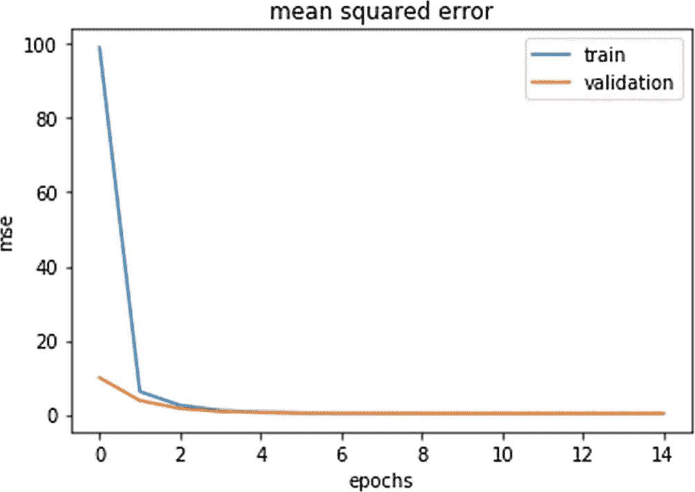

图 2-8

均方误差 vs. 轮次

最后，我们还将使用以下代码片段绘制预测输出与实际输出的对比图：

```
plt.plot(np.squeeze(model.predict_on_batch(input)), np.squeeze(z))
plt.xlabel('predicted output')
plt.ylabel('real output')
plt.show()
```

程序输出如图 2-9 所示。

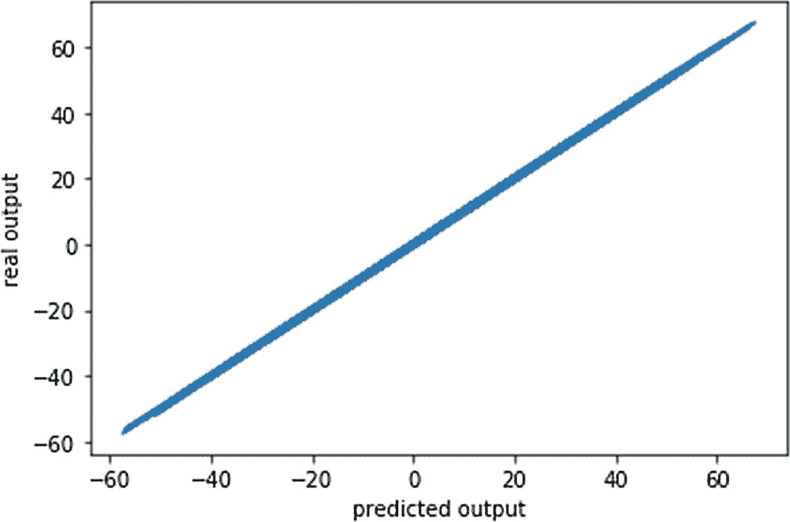

图 2-9

预测输出 vs. 实际输出值

正如你在图 2-9 中所观察到的，模型预测的输出与预期输出非常接近。因此，我们完全可以认为模型训练得很好。为了通过测试，我们需要在未见过的数据上测试模型的预测能力，接下来将进行这一步。

### 预测

要对未见过的 `x` 和 `y` 值进行预测，你将在训练好的模型上使用 `predict` 函数。如下面的程序语句所示：

```python
print("Predicted z for x=2, y=3 ---> ",
model.predict([[2,3]]).round(2))
```

这里，我们指定 `x` 等于 2，`y` 等于 3。结果四舍五入到两位小数。当你执行上述打印语句时，你会看到以下输出：

```
Predicted z for x=2, y=3 ---> [[36.99]]
```

现在，让我们检查一下预测值是否足够接近预期输出。要查看预期输出，请运行以下代码：

```python
# Checking from equation
# z = 7*x + 6*y + 5
print("Expected output: ", 7*2 + 6*3 + 5)
```

执行后会在屏幕上打印 37。我们模型的预测值是 36.99，与预期值非常接近。请注意，如果你运行代码，预测输出每次都会不同，因为模型的准确率每次都会变化。你可以用更多的 `x` 和 `y` 值来测试模型的预测，以验证模型的训练效果。

### 完整源代码

我们之前介绍的简单 Hello World 应用程序的完整源代码如代码清单 2-1 所示，供您快速参考。

```python
# Load TensorFlow 2.x in a Colab project.
%tensorflow_version 2.x
# Import required libraries
import tensorflow as tf
import numpy as np
import matplotlib.pyplot as plt
# Set up data
number_of_datapoints = 1000
# generate random x values in the range -5 to +5
x = np.random.uniform(low = -5 , high = 5 , size = (number_of_datapoints, 1))
# generate random y values in the range -5 to +5
y = np.random.uniform(-5 , 5 , size = (number_of_datapoints , 1))
# generate some random error in the range -1 to +1
noise = np.random.uniform(low =-1 , high =1, size = (number_of_datapoints, 1))
z = 7 * x + 6 * y + 5 + noise
# Print x, y and z sample values for manual verification
x[:5,:].round(2)
y[:2,:].round(2)
z[:2,:].round(2)
# Stack x and y arrays for inputting to neural network
input = np.column_stack((x,y))
# Print few values of input array for demonstration purpose.
input[:2,:].round(2)
# Create a Keras sequential model consisting of single layer with a single neuron .
model = tf.keras.Sequential([tf.keras.layers.Dense(units=1)])

# Compile the model with the specified optimizer, loss function and error metrics.
model.compile(optimizer = 'sgd' , loss = 'mean_squared_error' , metrics = ['mse'] )
# Import History module to record loss and accuracy on each epoch during training
from tensorflow.keras.callbacks import History
history = History()
model.fit(input, z , epochs = 15 , verbose = 1, validation_split=0.2, callbacks=[history])
# Print keys in the history just to know their names. These will be used for plotting the metrics.
print(history.history.keys())
# Plot the loss metric on both training and validation datasets.
plt.plot(history.history['loss'])
plt.plot(history.history['val_loss'])
plt.title('Accuracy')
plt.ylabel('loss')
plt.xlabel('epoch')
plt.legend(['train', 'validation'], loc='upper right')
plt.show()
# Plot the mean squared error on both training and validation datasets.
plt.plot(history.history['mse'])
plt.plot(history.history['val_mse'])
plt.title('mean squared error')
plt.ylabel('mse')
plt.xlabel('epochs')
plt.legend(['train' , 'validation'] , loc = 'upper right')
plt.show()
plt.plot(np.squeeze(model.predict_on_batch(input)), np.squeeze(z))
plt.xlabel('predicted output')
plt.ylabel('real output')
plt.show()
print("Predicted z for x=2, y=3 ---> ", model.predict([[2,3]]).round(2))
# Checking from equation
# z = 7*x + 6*y + 5
print("Expected output: ", 7*2 + 6*3 + 5)
```

**代码清单 2-1** 一个简单的线性回归应用源代码

如果您已经运行了这个简单项目并得到了上述输出，恭喜您！您使用 TensorFlow 2.x 进行深度学习的环境现已配置完成。接下来，您将深入真实的机器学习开发。在下一节中，您将学习真实的机器学习开发生命周期。您将使用一个真实的数据集，学习如何对其进行预处理并使其准备好输入神经网络，定义一个多层深度神经网络，训练它，测试模型，并绘制准确率指标以优化模型。不仅如此，您还将学习如何在 Colab 环境中使用 TensorBoard 来可视化指标，以便对模型训练进行分析。

那么，让我们开始这个基于 TensorFlow 的真实项目吧。

## TensorFlow 中的二分类

在前面的示例中，我们使用了内置数据集来训练模型。现在，我们将使用一个真实的数据集来进行一些实际的机器学习。您将解决一个分类问题。我们将使用来自热门 Kaggle 网站的一个挑战赛中的数据集。该数据集包含一家银行的客户数据。现在假设这家银行找到您，希望您开发一个机器学习预测模型，该模型能提供关于客户离开银行可能性的洞察。在金融术语中，这被称为客户流失。如果银行知道某个客户可能在不久的将来离开，就可以采取一些预防措施来留住该客户。

您要解决的问题是开发一个二分类模型。您将使用 TensorFlow 的深度学习库，并利用 Keras 高级 API 来实现该模型。更具体地说，您将在本示例中学习以下内容：

- 如何从本地或远程服务器加载 CSV 数据？
- 如何对其进行预处理并使其准备好用于机器学习算法？
- 如何使用 TensorFlow 的高级 Keras API 定义多层人工神经网络？
- 如何训练模型？
- 在测试数据上评估模型性能。
- 在 TensorBoard 上可视化结果。
- 进行性能分析。
- 对未见数据进行推断。

那么，让我们开始项目开发。

## 项目设置

创建一个新的 Colab 项目，并将其命名为 `Binary Classification`。该项目使用银行客户数据（`Churn_Modelling.csv`），该数据可在本书的源代码下载中找到。将下载的文件复制到您 Google Drive 中您选择的文件夹中。请注意，您稍后需要在程序代码中正确设置文件路径。如果您不想下载数据文件，您仍然可以通过本书的 GitHub 设置获取数据来运行项目。现在，您可以开始编写项目代码了。

### 导入库

与前面的示例一样，在代码窗口中包含以下导入语句：

```python
%tensorflow_version 2.x
import tensorflow as tf
from tensorflow import keras
```

您将使用 `pandas` 数据框来加载外部数据库。您将使用 `sklearn` 库来预处理数据并创建训练/验证数据集。您将使用 `matplotlib` 进行一些图表绘制。要使用这些库，请在项目代码中包含以下导入语句：

```python
# loading data
import pandas as pd
# scaling feature values
from sklearn.preprocessing import StandardScaler
# encoding target values
from sklearn.preprocessing import LabelEncoder
# shuffling data
from sklearn.utils import shuffle
# splitting the dataset into training and validation
from sklearn.model_selection import train_test_split
# plotting curves
import matplotlib.pyplot as plt
```

接下来，您需要在程序中挂载驱动器，以便程序可以访问存储在 Google Drive 中的文档。

### 挂载 Google Drive

要挂载 Google Drive，请在新的代码单元格中输入以下代码：

```python
from google.colab import drive
drive.mount('/content/drive')
```

当您运行此代码时，它会要求您输入授权码以访问您的驱动器。您将看到如图 2-10 所示的屏幕。


**图 2-10** Google Drive 的授权码

点击提供的链接。系统会要求您登录您的 Google 帐户。您将看到类似于图 2-11 所示的授权码。

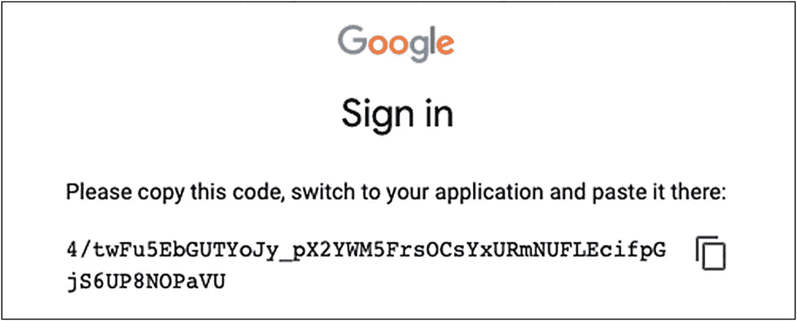

**图 2-11** Google 登录授权

点击授权码旁边的图标将其复制到剪贴板。将代码粘贴到之前显示的授权窗口中。授权成功后，您将在屏幕上看到以下消息：

```
Mounted at /content/drive
```

现在，您已准备好通过程序代码访问您驱动器中的内容。

### 加载数据

要加载数据，请在新的代码单元格中输入以下程序代码并执行：

```python
data = pd.read_csv('/content/drive/ /Churn_Modelling.csv')
```

请注意，您需要为 CSV 文件设置正确的路径。

如果您决定使用本书 GitHub 仓库中的数据，请使用以下代码替换前面的代码段：

```python
data_url = 'https://raw.githubusercontent.com/Apress/artificial-neural-networks-with-tensorflow-2/main/ch02/Churn_Modelling.csv'
data=pd.read_csv(data_url)
```

`read_csv` 函数从指定文件加载数据，并将其复制到一个 `pandas` 数据帧中。

#### 打乱数据

现场收集的数据可能会按照数据收集者的便利性和舒适度以特定顺序排列。为了获得更好的机器学习效果，您应该对数据进行随机化处理，这样学习过程就不会遵循数据中不期望的模式。因此，我们使用以下语句打乱数据：

```python
data=shuffle(data)
```

#### 检查数据

您可以通过打印 `data` 数据帧的内容来验证数据是否正确加载。我没有通过调用 `data.head()` 来打印前几行，而是打印了整个数据集，以便您了解其中的记录数和列数。如图 2-12 所示。

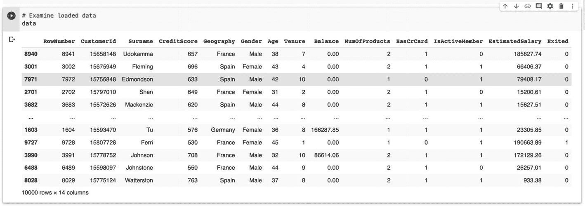

**图 2-12** 数据集

数据库中有 10,000 行和 14 列。以下是各个字段的简要说明：

*   `RowNumber` – 从 1 到 10,000 的编号。
*   `CustomerId` – 客户的唯一标识。
*   `Surname` – 客户的姓氏。
*   `CreditScore` – 客户的信用评分。
*   `Geography` – 客户所在国家。
*   `Gender` – 男性或女性。
*   `Age` – 客户年龄。
*   `Tenure` – 客户与该银行合作的时间长度。
*   `Balance` – 客户的银行余额。
*   `NumOfProducts` – 客户当前使用的银行产品数量。
*   `HasCrCard` – 客户是否持有信用卡？
*   `IsActiveMember` – 客户当前是否活跃？
*   `EstimatedSalary` – 客户当前的预估薪资。
*   `Exited` – 值为 1 表示客户已离开该银行。

现在，既然您已经将数据加载到内存中，下一步任务是在将其输入到我们的网络之前对其进行清洗。我们称之为数据预处理，接下来将讨论这一点。

### 数据预处理

原始的实时数据可能并不总是满足神经网络（ANN）的训练要求。具体来说，您需要检查数据并针对以下项目进行处理：

*   数据可能包含空值。
*   数据库中的所有字段可能并非都对学习有用。
*   数值字段的值可能存在较大差异，因此必须将其缩放到同一水平。
*   某些字段可能包含分类值，例如男性和女性；这些需要编码为 0 和 1。
*   最后，您需要决定哪些字段用作特征，以及标签是什么。

那么，让我们开始处理数据。

#### 检查空值

如果数据包含空值，将严重影响网络训练。检查空值最简单的方法是调用 `isnull` 函数。这通过以下程序语句完成：

```python
data.isnull().sum()
```

上述语句的输出结果如下：

```
RowNumber          0
CustomerId         0
Surname            0
CreditScore        0
Geography          0
Gender             0
Age                0
Tenure             0
Balance            0
NumOfProducts      0
HasCrCard          0
IsActiveMember     0
EstimatedSalary    0
Exited             0
dtype: int64
```

对空值求和的结果为零。很明显，我们的数据集不包含任何空值。因此，不存在从数据集中删除行（包含空字段的行）的问题。

接下来是选择机器学习字段的主要任务。

#### 选择特征和标签

并非数据库中的所有字段都对训练算法有用。例如，`CustomerId` 和 `Surname` 等字段对我们的机器学习没有任何意义。因此，我们需要删除这些列。这通过以下语句完成：

```python
X = data.drop(labels=['CustomerId', 'Surname', 'RowNumber', 'Exited'], axis = 1)
```

请注意，我们从数据集中删除了四个字段。`X` 是一个新数组，包含与我们的模型构建相关的字段。

客户是否离开银行标志着我们模型的输出。因此，`Exited` 字段成为我们模型构建的标签。这通过以下语句提取到变量 `y` 中：

```python
y = data['Exited']
```

至此，您已经准备好了特征（`X`）和标签（`y`）张量。

#### 编码分类列

您必须检查所选列中是否有任何列包含分类值。为此，我们将使用以下语句检查所有选定列的数据类型：

```python
X.dtypes
```

上述语句的输出如下所示：

CreditScore          int64
Geography           object
Gender              object
Age                  int64
Tenure               int64
Balance            float64
NumOfProducts        int64
HasCrCard            int64
IsActiveMember       int64
EstimatedSalary    float64
Dtype: object

请注意，`Geography` 和 `Gender` 是对象类型。你可以通过打印特征张量的前五行来检查它们包含的值，如图 2-13 所示。

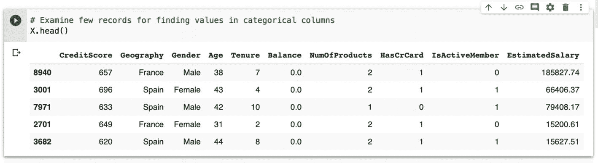
图 2-13 特征向量的前五行

`Gender` 取两个分类值：Male 和 Female，而 `Geography` 有三个分类值：Germany、Spain 和 France。在将其输入网络之前，你需要将这些值转换为数值。编码通过使用 sklearn 预处理模块中的 `LabelEncoder` 完成。如下代码片段所示：

```python
from sklearn.preprocessing import LabelEncoder
label = LabelEncoder()
X['Geography'] = label.fit_transform(X['Geography'])
X['Gender'] = label.fit_transform(X['Gender'])
```

独热编码为分类列创建虚拟变量。由于 `Geography` 列有三个不同的值，它将创建三个变量——每个国家一个。因此，我们的训练数据集中将有三个与国家相关的特征。特征过多会增加训练时间。为了减少特征数量，你可以排除与国家字段相关的一个虚拟变量，同时仍能达到相同的结果。我们通过调用 `get_dummies` 方法来删除第一个变量：

```python
X = pd.get_dummies(X, drop_first=True, columns=['Geography'])
```

如果你此时通过打印前五行来检查数据，你会注意到 `Geography` 只有两列——`Geography_1` 和 `Geography_2`。

在将数据输入网络之前，我们还需要做一件事，就是将所有的数值缩放到 -1 到 1 的范围内。

### 缩放数值

由于真实数据中的特征可能具有很宽的数据值范围，如果我们将所有这些数据点标准化到同一尺度，机器学习的效果会更好。理想情况下，为了使机器学习获得更好的结果，每列的平均值应为 0，标准差应为 1。因此，我们使用以下方程对所有数据点进行变换：

```
z = (x - mu) / s
```

其中 `mu` 是平均值，`s` 是标准差。这种标准化通过使用 `sklearn` 的 `StandardScaler` 函数来执行，如下代码片段所示：

```python
from sklearn.preprocessing import StandardScaler
scaler = StandardScaler()
X = scaler.fit_transform(X)
```

至此，我们的数据预处理工作已完成。我们现在准备定义并训练模型。在训练模型时，我们还需要验证训练过程。如果训练结果不符合我们的预期，我们将需要进一步预处理数据——例如调整特征数量等。为了进行测试，我们将保留一部分数据。因此，我们将整个预处理后的数据分割开——大部分用于训练，小部分用于测试训练好的模型。

### 创建训练集和测试集

为了将数据分成两部分，我们使用 `sklearn` 的 `train_test_split` 方法，如下面的程序语句所示：

```python
# 将数据集分割为训练集和测试集
from sklearn.model_selection import train_test_split
X_train, X_test, y_train, y_test = train_test_split(X, y, test_size = 0.3)
```

`test_size` 参数决定了应保留多少百分比的数据用于测试。该函数返回一组用于训练和测试的向量。

很多时候，验证集和测试集这两个术语会被混用。为了避免混淆，我在此给出这些术语被广泛接受的明确定义：

- **训练集** – 用于模型拟合的那部分数据。
- **验证集** – 在训练期间用于调整超参数的那部分数据。
- **测试集** – 在模型训练后用于评估其性能的那部分数据。

现在，是时候定义我们的网络了。

### 定义人工神经网络

预处理后，我们的数据集中有 11 个特征。特征的数量通过以下语句计算训练数据集的形状来确定：

```python
X_train.shape[1]
```

网络的预期输出是一个二进制值，指示客户离开银行的可能性。目标值在 `y_train` 向量中指定。

你将创建一个四层深度学习网络模型。在第一层，你将使用 128 个节点，第二层有 64 个，第三层有 32 个，第四层是一个单一的输出节点。为了创建网络，你使用 `tf.keras` API，这是 TensorFlow 中的一个新标准。你使用 `Sequential` API 来创建层的线性堆叠。你使用以下语句实例化模型：

```python
model = keras.models.Sequential()
```

你使用以下语句将包含 128 个节点的第一层添加到堆叠中：

```python
model.add(keras.layers.Dense(128, activation = 'relu',
input_dim = X_train.shape[1]))
```

该层的输入维度在参数 `input_dim` 中设置，该参数是由 `X_train` 向量的形状定义的特征数量。我们使用 ReLU（修正线性单元）作为激活函数。激活函数用于根据节点的加权和来决定该节点是否被激活。ReLU 是使用最广泛的激活函数，它对负输入输出 0，否则输出 1。

同样，你使用以下语句将第二层添加到网络中：

```python
model.add(keras.layers.Dense(64, activation = 'relu'))
```

该层的输入来自前一层，因此无需指定输入向量的维度。使用以下语句添加第三层：

```python
model.add(keras.layers.Dense(32, activation = 'relu'))
```

最后，使用以下语句添加网络中的最后一层：

```python
model.add(keras.layers.Dense(1, activation = 'sigmoid'))
```

我们在这里使用 sigmoid 作为激活函数，因为这一层输出的是二进制值。sigmoid 函数是一种激活函数，也称为挤压函数。挤压函数将输出限制在 0 到 1 之间，使其适用于预测概率。

你通过调用 `summary` 函数来打印网络摘要，如下所示：

```python
model.summary()
```

屏幕上打印的摘要如下所示：

```
Model: "sequential"
_________________________________________________________________
Layer (type)                 Output Shape              Param #
=================================================================
dense (Dense)                (None, 128)               1536
_________________________________________________________________
dense_1 (Dense)              (None, 64)                8256
_________________________________________________________________
dense_2 (Dense)              (None, 32)                2080
_________________________________________________________________
dense_3 (Dense)              (None, 1)                 33
=================================================================
Total params: 11,905
Trainable params: 11,905
Non-trainable params: 0
_________________________________________________________________
```

### 编译模型

在模型架构定义之后，需要对其进行编译。要编译模型，你调用模型的 `compile` 方法：

```python
model.compile(loss = 'binary_crossentropy',
optimizer='adam', metrics=['accuracy'])
```

由于我们正在开发的模型是一个二元分类器，我们使用 `binary_crossentropy` 作为损失函数。我们在训练模型时使用 `Adam` 优化器，因为它最适合这种情况。在训练之后，如果你对模型的性能不满意，你可以尝试其他优化器。通过为 `metrics` 参数指定值，可以收集准确率指标用于分析。

我还将向你展示如何使用 TensorBoard 来分析网络性能。为此，我们需要定义一个回调函数，该函数将在训练期间的每个 epoch 被调用。我们将把日志收集在 `log` 文件夹中。要清除之前的日志，我们使用以下操作：

```bash
!rm -rf ./log/
```

你使用以下代码片段定义回调函数：

```python
#tensorboard 可视化
import datetime, os
logdir = os.path.join("log",
datetime.datetime.now().strftime("%Y%m%d-%H%M%S"))
tensorboard_callback = tf.keras.callbacks.TensorBoard(logdir,
histogram_freq = 1)
```

完成训练分析的设置和模型的编译后，我们现在可以开始训练了。

### 模型训练

要训练模型，你在模型实例上使用 `fit` 方法：

```python
r = model.fit(X_train, y_train, batch_size = 32, epochs = 50,
validation_data = (X_test, y_test),
callbacks = [tensorboard_callback])
```

`fit` 函数的第一个参数定义了特征向量，第二个参数定义了标签。`batch_size` 参数顾名思义定义了训练的批次大小。`epochs` 参数决定了训练期间将执行多少次迭代。我们在数据预处理期间生成的测试数据用于模型验证，并通过 `validation_data` 参数传递给 `fit` 函数。最后，`callbacks` 参数指定了每次迭代结束时将调用哪个回调函数。训练期间的部分输出如图 2-14 所示。

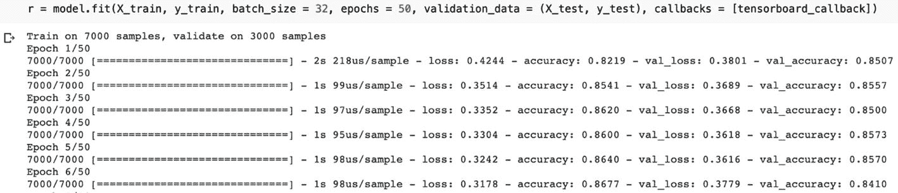
图 2-14 训练期间的程序输出

训练结束后，你可以使用收集到的指标来评估模型是否训练到了你期望的准确率。

### 性能评估

为了评估性能，我们将在 Colab 环境中使用 `%tensorboard` 魔术命令启动 TensorBoard。在此之前，我们需要使用 `%load_ext` 魔术命令加载 tensorboard。

```python
%load_ext tensorboard
%tensorboard --logdir log #在 colab 上启动 tensorboard 的命令
```

运行此魔术命令会启动 TensorBoard，你将在屏幕上看到准确率和损失指标的图表。准确率和损失指标的图表如图 2-15 所示。

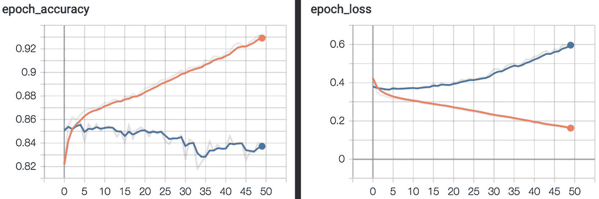
图 2-15 TensorBoard 中的准确率和损失指标

这里显示的两条曲线分别绘制在训练数据和验证数据上。检查准确率和损失指标有助于你判断模型是否表现良好。这些图表基本上展示了模型在每个 epoch 的准确率和损失。如果准确率在每个 epoch 都在提升，说明你的训练方向是正确的。同样，损失应该在每个 epoch 持续降低。这些图表可以轻松检测出过拟合等问题。如果你对性能不满意，可以调整模型参数并重新训练以提高准确率。你可以尝试不同的优化器和/或引入正则化来提升模型准确率。

你还可以通过调用 `evaluate` 方法，并将测试特征和标签向量作为参数传递，来评估模型在测试数据上的性能。评估模型的程序语句及其输出如下所示：

```python
test_scores = model.evaluate(X_test, y_test)
print('Test Loss: ', test_scores[0])
print('Test accuracy: ', test_scores[1] * 100)
```

```
Test Loss:  0.6143370634714762
Test accuracy:  83.96666646003723
```

测试数据上的准确率约为 83%，这表明模型能够正确分类 83% 的给定数据点。

我还将向你展示如何使用 matplotlib（一种传统的性能评估方式）在验证数据上绘制性能图表。使用以下代码片段即可实现：

```python
%matplotlib inline
import matplotlib.pyplot as plt #用于绘制曲线
plt.plot(r.history['val_accuracy'], label="val_acc")
plt.plot(r.history['val_loss'], label="val_loss")
plt.legend()
plt.show()
```

由 matplotlib 生成的图表如图 2-16 所示。

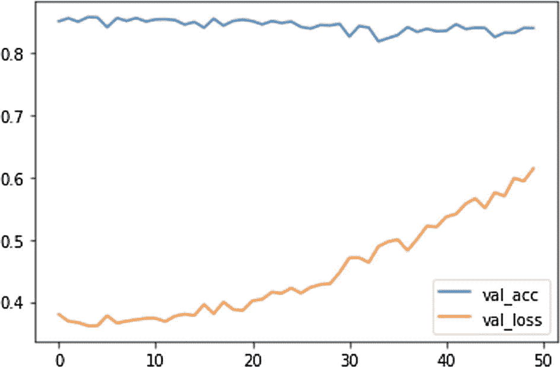
图 2-16 验证数据上的准确率/损失矩阵

除了准确率和损失指标，我们还经常使用混淆矩阵来评估网络的性能，接下来将对此进行讨论。

### 对测试数据进行预测

混淆矩阵需要预测值和真实标签。因此，我们首先需要对测试数据生成预测。使用 `predict_classes` 方法进行预测，如下所示：

```python
y_pred = model.predict_classes(X_test)
```

该方法将特征向量作为参数，并返回一个预测张量。你可以在控制台上打印预测结果。结果如下所示：

```
y_pred
array([[1],
       [0],
       [0],
       ...,
       [1],
       [0],
       [0]], dtype=int32)
```

这里，任何索引位置上的值 1 表示该客户将要离开银行，值 0 表示银行留住了该客户。

你可以使用这些预测结果来创建并绘制混淆矩阵，从而更好地可视化模型的性能。

### 混淆矩阵

我将首先向你展示如何生成混淆矩阵，然后展示如何解读矩阵图。要生成混淆矩阵，你可以使用 sklearn 的内置函数，如下所示：

```python
from sklearn.metrics import confusion_matrix
cf = confusion_matrix(y_test, y_pred)
cf
```

这将给出以下输出：

```
array([[2175,  209],
       [ 283,  333]])
```

你将使用以下代码绘制此矩阵，以获得视觉效果：

```python
from mlxtend.plotting import plot_confusion_matrix
plot_confusion_matrix(conf_mat = cf, cmap = plt.cm.cmapname)
```

该图如图 2-17 所示。

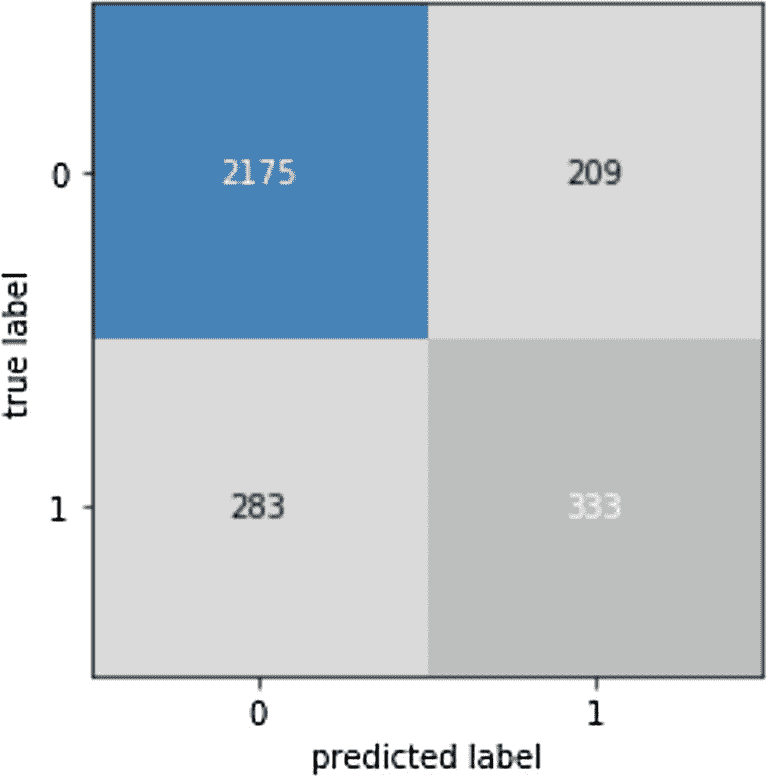
图 2-17 混淆矩阵

x 轴代表预测标签，y 轴代表真实标签。如图所示，有 2175 个真正例和 333 个真负例。真正例表示客户会离开银行，并且被我们的模型正确分类。同样，真负例表示这些客户不会离开银行，并且被正确分类。真正例和真负例有助于我们确定模型的准确率。

sklearn 定义了 `accuracy_score` 函数来计算准确率分数，该分数通过将真正例和真负例的数量相加，然后除以预测总数得到。以下程序语句计算了我们模型的准确率分数：

```python
from sklearn.metrics import accuracy_score
accuracy_score(y_test, y_pred)
```

```
0.8396666666666667
```

执行此语句得到的准确率分数为 83.63%，这在机器学习中是一个被广泛接受的准确率。

既然模型已经训练到令我们满意的程度，现在是时候将其用于未见过的数据了。

# 对未见数据进行预测

为了为我们的用例创建未见数据，我们需要了解所有特征的数据类型，我们将为这些特征分配一些虚拟值。

我们特征的头部转储显示了列名及其包含的值的范围。特征向量的部分转储如图 2-18 所示。

因此，对于我们的未见测试数据，我们将使用以下值：

- `CreditScore = 615`
- `Gender = Male`
- `Age = 22`
- `Tenure = 5`
- `Balance = 20000`
- `NumOfProducts = 1`
- `HasCrCard = 1`
- `IsActiveMember = 1`
- `EstimatedSalary = 60000`
- `Geography = Spain`

你将通过调用训练后模型的 `predict` 方法，并将上述值按适当索引放入参数列表中，来输入这些数据。

```python
customer = model.predict([[615, 1, 22, 5, 20000, 5, 1, 1, 60000, 0, 0]])
customer
if customer[0] == 1:
    print ("Customer is likely to leave")
else:
    print ("Customer will stay")
```

执行上述代码段会得到以下输出：

```
Customer will stay
```

值为 0 表示该客户不太可能离开银行。请注意，此预测的准确率仍约为之前计算的 83%。

在模型完全训练到令你满意之后，你可以将其保存到磁盘，并部署到生产服务器上进行实际应用。具体如何操作将在下一章深入讨论 `tf.keras` 实现时进行说明。

## 完整源代码

项目的完整源代码见清单 2-2，供您快速参考。

```python
%tensorflow_version 2.x
import tensorflow as tf
from tensorflow import keras
import pandas as pd
#### Load data from Github
data_url = 'https://raw.githubusercontent.com/Apress/artificial-neural-networks-with-tensorflow-2/main/ch02/Churn_Modelling.csv'
data=pd.read_csv(data_url)
#### Shuffle data for taking care of patterns in data collection
from sklearn.utils import shuffle
data=shuffle(data) #shuffling the data
#### Examine loaded data
data
#### Check for null values
data.isnull().sum()
#### Drop irrelevant columns to set up features vector
X = data.drop(labels=['CustomerId', 'Surname', 'RowNumber', 'Exited'], axis = 1)
#### Set up labels vector
y = data['Exited']
#### Check data types for finding categorical columns
X.dtypes
#### Examine few records for finding values in categorical columns
X.head()
#### Encode categorical columns
from sklearn.preprocessing import LabelEncoder
label = LabelEncoder()
X['Geography'] = label.fit_transform(X['Geography'])
X['Gender'] = label.fit_transform(X['Gender'])
#### Drop the first column of Geography to reduce the number of features
X = pd.get_dummies(X, drop_first=True, columns=['Geography'])
X.head()
#### Scale all data points to -1 to + 1
from sklearn.preprocessing import StandardScaler
scaler = StandardScaler()
X = scaler.fit_transform(X)
#### Split dataset into training and validation
from sklearn.model_selection import train_test_split
X_train, X_test, y_train, y_test = train_test_split(X, y, test_size = 0.3)
#### Determine number of features
X_train.shape[1]
#### Create a stacked layers sequential network
model = keras.models.Sequential() # Create linear stack of layers
model.add(keras.layers.Dense(128, activation = 'relu', input_dim = X_train.shape[1])) # Dense fully connected layer
model.add(keras.layers.Dense(64, activation = 'relu'))
model.add(keras.layers.Dense(32, activation = 'relu'))
model.add(keras.layers.Dense(1, activation = 'sigmoid')) # activation sigmoid for a single output
#### Print model summary
model.summary()
#### Compile model with desired loss function, optimizer and evaluation metrics
model.compile(loss = 'binary_crossentropy', optimizer="adam", metrics=['accuracy'])
#to clear any other logs if present so that graphs won't overlap with previous saved logs in tensorboard
!rm -rf ./log/
#tensorboard visualization
import datetime, os
logdir = os.path.join("log", datetime.datetime.now().strftime("%Y%m%d-%H%M%S"))
tensorboard_callback = tf.keras.callbacks.TensorBoard(logdir, histogram_freq = 1)
#### Perform training
r = model.fit(X_train, y_train, batch_size = 32, epochs = 50, validation_data = (X_test, y_test), callbacks = [tensorboard_callback])
#### Load tensorboard in Colab
%load_ext tensorboard
%tensorboard --logdir log #command to launch tensorboard on colab
#### evaluate model performance on test data
test_scores = model.evaluate(X_test, y_test)
print('Test Loss: ', test_scores[0])
print('Test accuracy: ', test_scores[1] * 100)
#### Plot metrics in matplotlib
%matplotlib inline
import matplotlib.pyplot as plt #for plotting curves
plt.plot(r.history['val_accuracy'], label="val_acc")
plt.plot(r.history['val_loss'], label="val_loss")
plt.legend()
plt.show()
#### Predict on test data
y_pred = model.predict_classes(X_test)
y_pred
#### Create confusion matrix
from sklearn.metrics import confusion_matrix
cf = confusion_matrix(y_test, y_pred)
cf
#### Plot confusion matrix
from mlxtend.plotting import plot_confusion_matrix
plot_confusion_matrix(conf_mat = cf, cmap = plt.cm.cmapname)
#### Compute accuracy score
from sklearn.metrics import accuracy_score
accuracy_score(y_test, y_pred)
#### Predict on unseen customer data
customer = model.predict([[615, 1, 22, 5, 20000, 5, 1, 1, 60000, 0, 0]])
customer
if customer[0] == 1:
    print ("Customer is likely to leave")
else:
    print ("Customer will stay")
```

**Listing 2-2** Binary classification full source

## 本章小结

在本章中，您使用 TensorFlow 2.x 搭建了深度学习环境，并利用 Colab 开发 Python 笔记本。通过一个简单的应用，您熟悉了开发环境。

随后，我们通过一个更详细的真实示例，学习了如何加载外部数据库、预处理数据使其适用于机器学习、定义深度神经网络、编译模型、训练模型、使用 TensorBoard 和 `matplotlib` 图表评估模型性能，以及最终如何使用训练好的模型对未见过的数据进行预测。

尽管我们评估了模型性能，但并未讨论如何改进它。在下一章中，您将学习一些提升模型性能的技巧。下一章将更深入地探讨 TensorFlow Keras 的集成，并讨论图像分类问题。