# 3. 深入探索 `tf.keras`

Keras 是一个运行在 TensorFlow 之上的高级神经网络 API。过去许多年，您一直在使用以 TensorFlow 为后端的 Keras API。随着 TensorFlow 2.x 的发布，这一情况发生了变化。TensorFlow 现已将 Keras 集成到 `tf.keras` API 中。`tf.keras` 是 TensorFlow 对 Keras API 规范的实现。这一变化主要是为了在使用 Keras 与 TensorFlow 时保持一致性，同时也使得在使用 Keras 时能够利用 TensorFlow 的多项特性，例如即时执行、分布式训练等。截至撰写本文时，最新的 Keras 版本是 2.3.0。该版本增加了对 TensorFlow 2.x 的支持，并且也是多后端 Keras 的最后一个主要版本。此后，您将在所有深度学习应用中使用 `tf.keras`。在第二章中，您已经开始使用 `tf.keras` 入门 TensorFlow。本章将带您更深入地了解 `tf.keras` 的使用。

## 入门指南

在创建深度学习应用时，最重要的任务是定义神经网络模型。在上一章开发一个简单应用时，您创建了一个包含单层单神经元的网络。回顾一下，这是通过以下程序语句实现的：

```
model = tf.keras.Sequential([tf.keras.layers.Dense(units=1)])
```

虽然我没有明确说明，但上述语句在 TensorFlow 中使用了 Keras 函数式 API。该语句创建了一个单层/单神经元网络模型。在早期的 Keras 实现中，您可以通过以下两条语句完成相同操作：

```
model = keras.Sequential()
model.add(Dense(1, input_dim = 1))
```

该模型的可视化截图如图 3-1 所示。


图 3-1

单层/单神经元模型

现在，使用函数式 API 是定义 Keras 深度学习模型的推荐方式。

## 用于模型构建的函数式 API

使用函数式 API，您将能够创建具有非线性拓扑结构的极其复杂的模型。您可以在模型内共享层，还可以创建具有多个输入和输出的模型。因此，在本书的所有应用中，我将使用函数式 API 来定义 ANN 模型。接下来，我将向您展示如何使用函数式 API 定义几种架构。

### 序列模型

假设你想构建一个如图 3-2 所示的模型。


图 3-2

多层模型

如图 3-2 所示，所需的网络由多个层组成。函数式 API 提供了一套用于构建层图的工具。

假设你已经完成了必要的导入，如下代码所示：

```
import tensorflow as tf
from tensorflow import keras
```

要创建图 3-2 所示的模型，首先需要创建一个输入层，这可以通过以下代码语句完成：

```
inputs = keras.Input(shape=(8,), name="image")
```

上述语句返回一个大小为 8 的 `inputs` 张量。接下来，我们将使用以下语句添加一个包含 12 个节点的 `Dense` 层：

```
x = layers.Dense(12, activation="relu")(inputs)
```

请注意，我们将 `inputs` 张量作为输入传递给了新添加的层。新层本身返回一个大小为 12 的张量，该张量可以作为下一层的输入。现在，我们将使用以下语句再添加一个包含 8 个节点的层：

```
x = layers.Dense(8, activation="relu")(x)
```

再次注意，前一层的张量被输入到新层。同样，你可以向网络中添加任意数量的层，每层都有自己的节点集和激活函数。最后，我们将使用以下语句向网络中添加输出层：

```
outputs = layers.Dense(5)(x)
```

该层的输出是一个大小为 5 的张量。因此，我们期望网络在给定特定输入时输出五个值之一。

现在，可以使用这些输入和输出来定义模型，如下所示：

```
model = keras.Model(inputs=inputs, outputs=outputs,
name='multilayer model')
```

可以使用以下语句生成网络图：

```
keras.utils.plot_model(model, 'multilayer_model.png',
show_shapes=True)
```

生成的网络图如图 3-3 所示。


图 3-3

多层网络的网络图

函数式 API 还允许你创建具有多个输入和输出、共享层等的复杂架构。表 3-1 中展示了一些此类复杂架构。

表 3-1

几种复杂的 ANN 架构

|  |

### 模型子类化

如果你更倾向于面向对象编程，并且有 Java/C++ 等背景，你可能想知道是否存在子类化的概念，以便能够重用之前创建的模型。TensorFlow 支持模型子类化。要创建用于模型定义的自定义类，你需要继承 `tf.keras.Model`：

```
class MyModel(tf.keras.Model):
```

你需要在类定义中提供两个重写的方法——`__init__` 和 `call`。顾名思义，`__init__` 在类实例化时被调用。下面代码片段给出了 `__init__` 的典型定义：

```
def __init__(self, use_dp = False, num_output = 1):
    super(MyModel, self).__init__()
    self.use_dp = use_dp
    self.dense1 = tf.keras.layers.Dense(12, activation=tf.nn.relu)
    self.dense2 = tf.keras.layers.Dense(24, activation=tf.nn.relu)
    self.dense3 = tf.keras.layers.Dense(4, activation=tf.nn.relu)
    self.dense4 = tf.keras.layers.Dense(10, activation=tf.nn.sigmoid)
    if self.use_dp:
        self.dp = tf.keras.layers.Dropout(0.3)
```

在构造函数中，我们为构建网络时将使用的不同类型的层定义了变量。这里所有的层都是 `Dense` 类型——全连接层。第一层包含 12 个节点，第二层包含 24 个节点，第三层包含 4 个节点，最后一层包含 10 个节点。前三层使用 ReLU 作为激活函数，而最后一层使用 sigmoid。我们还定义了一个 dropout 层，以防我们决定在上述任何 `Dense` 层上添加 dropout 层。dropout 比例为 30%，如 dropout 参数值 0.3 所示。

接下来，你定义在对象创建期间使用的 `call` 方法。下面代码段展示了一个典型的 `call` 方法：

```
def call(self, x):
    x = self.dense1(x)
    x = self.dense2(x)
    if self.use_dp:
        x = self.dp(x)
    x = self.dense3(x)
    if self.use_dp:
        x = self.dp(x)
    return self.dense4(x)
```

该网络由四层组成，每一层的输出成为下一层的输入。最后，我们返回 `dense4`，它给出了 10 个类别。第二层和第三层使用了 dropout。至此，我们完成了模型的子类化。接下来，我们将实例化这个模型。

要在程序代码中实例化该模型，你可以使用以下程序语句：

```
model = MyModel()
```

创建模型对象后，你可以调用其常规的 `compile` 方法，通过传递所需的参数集来编译它，如下代码所示：

```
model.compile(loss = tf.losses.binary_crossentropy,
              optimizer = 'adam',
              metrics = ['accuracy'])
```

通常，如果你喜欢面向对象编程，你会使用模型子类化。否则，没有特别的需要进行子类化，函数式 API 可以满足你创建复杂架构的所有需求。

### 预定义层

为了创建网络架构，`tf.keras` 提供了顺序 API，你可以不断向其添加网络层。有多个预定义层可供你直接使用。这个列表非常详尽。每个层都定义为一个类，你在代码中实例化该类并将其实例添加到你的模型中。以下是常用预定义层的部分列表：

*   `Dense` – 全连接层
*   `Conv2D` – 二维卷积层
*   `InputLayer` – 网络的入口点
*   `LSTM` – 长短期记忆层
*   `RNN` – 自定义循环层的基类

这个列表确实非常详尽，你会找到诸如 `Dropout`、`Flatten`、`LayerNormalization`、`Multiply` 等类。除了这些预定义的类之外，你还可以定义自己的自定义层。

### 自定义层

自定义类继承自 `tf.keras.layers.Layer`。你需要重写四个函数：`init`、`build`、`call` 和 `compute_output_shape`。一个典型的自定义类定义如下方代码所示：

```
class MyLayer(tf.keras.layers.Layer):
    def __init__(self, output_dim, **kwargs):
        self.output_dim = output_dim
        super(MyLayer, self).__init__(**kwargs)
    def build(self, input_shape):
        self.W = self.add_weight(name='kernel',
                                 shape=(input_shape[1], self.output_dim),
                                 initializer='uniform',
                                 trainable=True)
        self.built = True
    def call(self, x):
        return tf.matmul(x, self.W)
    def compute_output_shape(self, input_shape):
        return (input_shape[0], self.output_dim)
```

在 `init` 方法中，我们调用了父类的构造函数，并设置了输出的维度。在 `build` 方法中，我们设置了初始权重矩阵。矩阵的形状借助输入参数 `input_shape` 来设定。权重通过 `initializer` 参数设置为均匀分布。并且我们将此矩阵设置为可训练的。在 `call` 方法中，我们设定了要对权重矩阵执行的任何操作。在当前代码中，我们对权重与输入向量 `x` 执行矩阵乘法。最后，`compute_output_shape` 返回输出维度。

现在，你可以在任何网络配置中使用这个自定义层，如下方代码片段所示：

```
model = tf.keras.Sequential([
    tf.keras.layers.Dense(256, input_shape=(784,)),
    tf.keras.layers.Dense(256, activation='relu'),
    MyLayer(10),
    tf.keras.layers.Dense(10, activation='softmax')
])
```

请注意自定义层是如何被添加在两个 `Dense` 层之间的。事实上，你可以将自定义层添加到网络中任何你想要的位置。上述配置的网络结构图如图 3-4 所示。


**图 3-4** 包含自定义层的网络

现在，你可以使用通常的 `compile` 函数来编译模型：

```
model.compile(optimizer='adam',
              loss=tf.keras.losses.binary_crossentropy,
              metrics=['accuracy'])
```

最后，通过调用模型的 `fit` 方法来训练它：

```
model.fit(x, y1, batch_size=32, epochs=30)
```

自定义层的完整项目代码可在本书的下载资源中找到。

创建自定义层让你在设计复杂的网络架构时拥有极大的灵活性。在本书中，你将使用函数式 API 创建各种各样的网络拓扑结构。

### 保存模型

通常，在模型完全训练好后，你会将其保存到磁盘，以便后续部署到生产机器上。不仅如此，你在 `tf.keras` 中创建的模型也可以在训练过程中的任何时刻保存。利用这个保存的模型，你可以从之前中断的地方恢复训练。这有助于避免在单次会话中花费过长的训练时间。此外，你可以与他人共享保存的模型，以便他们能够重现并继续你的工作。`tf.keras` 提供了几种保存工作成果的方法，接下来将进行讨论。

### 保存整个模型

当你保存整个模型时，以下信息将被保存：

*   模型的架构
*   权重
*   你传递给其 `compile` 方法的训练配置
*   优化器及其状态

要保存模型，你将使用以下代码：

```
model.save('filename.h5')
```

要重新创建模型，你将使用以下代码：

```
new_model = keras.models.load_model('filename.h5')
```

#### 导出为 SavedModel 格式

TensorFlow 使用一种名为 SavedModel 的独立序列化格式，该格式可供除 Python 之外的 TensorFlow 实现使用。TensorFlow Serving 也支持此格式。要将整个模型保存为此格式，你将使用以下代码：

```
model.save('filename', save_format='tf')
```

要加载保存的模型，你将使用：

```
new_model = keras.models.load_model('filename')
```

#### 保存架构

在某些情况下，你可能只对保存模型的架构感兴趣，而不关心其权重值或优化器状态。在这种需求下，你可以调用 `get_config` 方法来检索模型的配置，并在之后使用它来在保存的实例上重新创建模型。如下方代码片段所示：

```

##### 检索并保存模型配置
config = model.get_config()

##### 重新创建模型
model = keras.Model.from_config(config)
```

请注意，当你像此语句所示那样重新创建模型时，你将丢失所有先前学习到的信息。

#### 保存权重

在某些情况下，你可能只对保存模型的训练状态感兴趣，而不关心其架构。在这种情况下，你可以使用 `get_weights` 和 `set_weights` 方法来单独保存和检索权重。如下方代码所示：

```

##### 检索模型状态
weights = model.get_weights()

##### 恢复状态
model.set_weights(weights)
```

**注意：** 默认情况下，自定义层不支持 `model.save()` 和 `model.get_config()`。你需要重写 `get_config()` 以支持自定义层。不过，自定义层支持保存权重。

#### 保存为 JSON 格式

有时，你可能希望将模型保存为 JSON 格式。你可以使用以下代码片段来实现：

```
from keras.models import model_from_json

##### 序列化为 JSON
json_model = model_1.to_json()
with open("model_1.json", "w") as json_file:
    json_file.write(json_model)

##### 加载 JSON 并重新创建模型
from keras.models import model_from_json
file = open('model_1.json', 'r')
buffer = file.read()
file.close()
model = tf.keras.models.model_from_json(buffer)
```

考虑以下模型定义：

```
model_1 = tf.keras.Sequential([
    Conv2D(32, (3, 3), activation='relu', padding='same', input_shape=(32, 32, 3)),
    Conv2D(32, (3, 3), activation='relu', padding='same'),
    MaxPooling2D((2, 2)),
    Dense(128, activation='relu'),
    Dense(10, activation='softmax')
])
```

当你将此模型架构保存为 JSON 格式时，你将看到如清单 3-1 所示的代码：

```
{
    "class_name": "Sequential",
    "config": {
        "name": "sequential_3",
        "layers": [
            {
                "class_name": "Conv2D",
                "config": {
                    "name": "conv2d_2",
                    "trainable": true,
                    "batch_input_shape": [null, 32, 32, 3],
                    "dtype": "float32",
                    "filters": 32,
                    "kernel_size": [3, 3],
                    "strides": [1, 1],
                    "padding": "same",
                    "data_format": "channels_last",
                    "dilation_rate": [1, 1],
                    "activation": "relu",
                    "use_bias": true,
                    "kernel_initializer": {
                        "class_name": "GlorotUniform",
                        "config": { "seed": null }
                    },
                    "bias_initializer": {
                        "class_name": "Zeros",
                        "config": {}
                    },
                    "kernel_regularizer": null,
                    "bias_regularizer": null,
                    "activity_regularizer": null,
                    "kernel_constraint": null,
                    "bias_constraint": null
                }
            }
        ]
    },
    ...
    "keras_version": "2.2.4-tf",
    "backend": "tensorflow"
}
```

**清单 3-1** 模型的 JSON 表示形式

保存为 JSON 格式的项目代码可在本书的下载资源中找到。

通过对 `tf.keras` 的简要介绍，现在我将带你进入更实用的 `tf.keras` 学习方法。在下一节中，你将基于卷积神经网络（CNN）开发一个图像分类模型。

# 卷积神经网络

在开始定义用于图像分类的网络之前，我先介绍几个概念。请看图 3-5 所示的图像。


图 3-5

彩色图像 275x183 像素

如果我问你这张图像显示的是什么？你会立刻回答：这是一只鸟。这张图像的大小为 275x183 像素，每个像素代表一个包含 RGB 分量的颜色值。现在，我将把同一张图像转换为黑白素描图。新图像如图 3-6 所示。


图 3-6

黑白素描图像 275x183 像素

同样，如果我问你这张图像显示的是什么？你会说这是一只鸟。现在，我将把图像缩小到 32x32 像素。缩小后的新图像如图 3-7 所示。

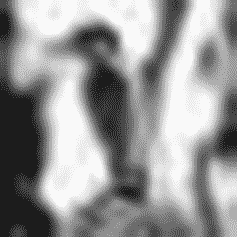

图 3-7

缩小后的图像 32x32 像素

你仍然能辨认出图像中显示的是一只鸟。现在，我们来思考一个问题：既然你眼前有一张美丽的鸟图可供欣赏，为什么还要进行所有这些变换呢？如果我们的目标是让机器学会解释（分类）给定图像中的物体，我们真的需要向计算机输入如此高分辨率的图像吗？如果人类即使只看图像的简化版本也能做出预测，为什么我们不能让计算机在这些简化图像上学习图像识别的基础知识呢？这样做的原因是，高分辨率图像包含大量“比特”信息，而这些信息对于我们进行物体识别的目的来说是冗余的。向计算机输入大量“比特”信息会需要大量的内存和处理能力，而这两者在现实世界中都非常稀缺。因此，为了减少神经网络所需的训练时间并避免使用重型资源，我们将在数据集中使用简化图像。图 3-8 展示了另一张汽车图片。原始图像大小为 200x200。即使在缩小到 32x32 的简化图像中，你仍然能辨认出这是一辆汽车。

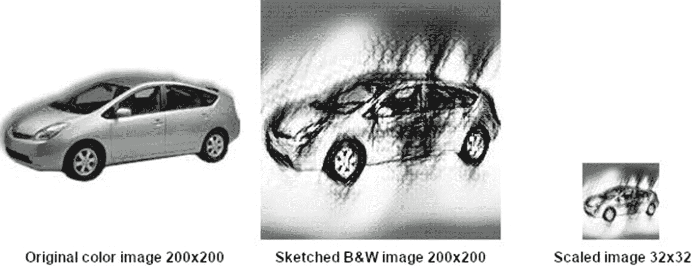

图 3-8

汽车图像及其变换

关于图像分类，已有大量研究，人们成功设计了人工神经网络（ANN）架构以实现高精度。上述图像变换过程被称为卷积。由于本书主要侧重于在 TF2.x 中构建高性能网络，因此图像卷积的精确定义和解释超出了本书的范围。研究人员设计了称为卷积神经网络（CNN）的网络来解决图像分类和物体识别问题。CNN 包含卷积层，其后是若干其他类型的层。一个包含两个卷积层的典型 CNN 架构如图 3-9 所示。

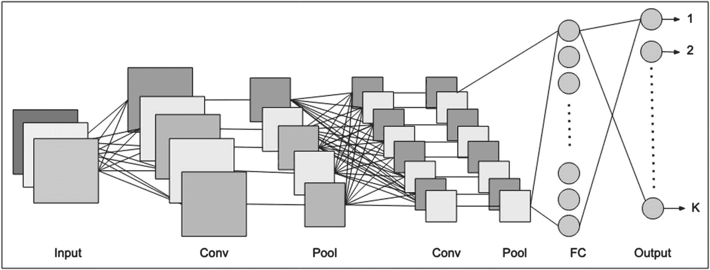

图 3-9

CNN 架构

幸运的是，如前所述，`tf.keras` 提供了几个即用型层，包括卷积层、池化层、展平层等。你的任务现在是将这些层按正确的顺序和架构组装起来。这正是你将在下一节中学习的内容，届时你将创建 5 种不同的 CNN 架构并评估它们的性能。

## 使用 CNN 进行图像分类

在本节中，你将学习如何将给定图像分类为已知类型之一。假设给你一张图像，要求你识别图像中显示的物体。对人类来说，这通常是一项简单的任务。但对于机器来说，解释图像并将其分类为已知物体类型并非易事。幸运的是，该领域已有大量研发成果，你拥有许多经过训练、即用型的机器学习模型，能够以很高的准确度正确识别给定图像中的物体。在本项目中，你将学习如何借助 `tf.keras` 提供的库，自行开发这样一个模型。那么，让我们开始这个项目吧。

### 创建项目

在 Colab 中打开一个新的 Python3 笔记本，并将其命名为 `Ch3-imageClassifier`。使用以下代码加载并导入 TensorFlow 2.x：

```
import tensorflow as tf
```

海量数据是任何机器学习项目的首要需求。幸运的是，对于图像分类，已经有人付出了大量努力来收集和清洗图像，使其可以直接用于你的图像分类算法。你的任务现在只是开发一个模型，并不断优化它，使其能够以可接受的准确度检测给定图像中的物体。在我们深入研究模型开发之前，先看看有哪些数据集可供我们使用。

### 图像数据集

本项目将使用的图像数据集由加拿大高等研究院（CIFAR）创建。该数据集向公众开放，旨在鼓励人们开发图像识别技术。CIFAR 研究院的研究人员创建了两个数据集：CIFAR-10 和 CIFAR-100。这两个数据集均由 60000 张 32x32 像素的彩色图像组成。CIFAR-10 图像分为 10 个类别，包含猫、鸟、船、飞机等类别。每个类别有 6000 张图像，并且这些图像经过适当随机化处理，适合用作机器学习数据集。请注意，在第 2 章学习二元分类时，我们需要自行对数据进行随机化处理。CIFAR-10 数据集也适当地划分为训练集和测试集：训练集包含 50000 张图像，其余 10000 张图像属于测试集。图 3-10 展示了一组示例图像及其类别，以便您快速了解所提供的图像数据。

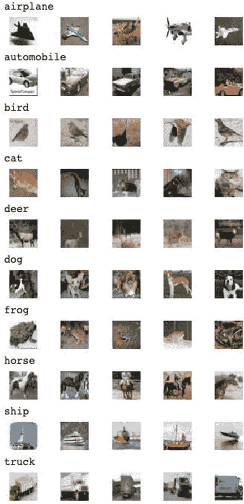

图 3-10：CIFAR-10 示例图像

请注意，所有图像都具有固定尺寸——32x32 像素。这是机器学习所必需的。您不能将不同尺寸的图像输入到机器学习算法中。神经网络的输入始终是预先确定的固定尺寸。分辨率可变的图像包含数量不等的像素，因此无法输入到预设拓扑结构的网络中。幸运的是，CIFAR 数据集的创建者不辞辛劳地将所有真实图像缩小到固定的微型尺寸。请注意，如果您尝试使用真实世界中的图像（例如 512x512 像素或更大）来训练模型，那么人工神经网络所需的输入点（像素）数量将非常庞大。这直接意味着需要训练大量的“权重”，从而需要巨大的处理能力和时间。当图像缩小到 32x32 像素时，显然会丢失数据；但是，您会发现，在这些精简后的图像上进行训练，仍然能产生出色的结果，并且在现实世界中识别未见过的对象时，也能获得非常可接受的结果。

CIFAR-100 数据集与 CIFAR-10 类似，不同之处在于它代表 100 个类别而非 10 个。每个类别进一步分为粗粒度和细粒度。例如，一个名为“人”的超类包含“婴儿”、“男孩”、“女孩”、“男人”和“女人”这些子类。

本项目将使用 CIFAR-10 数据集。那么，让我们开始将此数据集加载到程序中。

## 加载数据集

`tf.keras` 集成提供了几个内置数据库，方便您进行模型开发。这些数据库也包括 CIFAR-10。这些数据库位于 `tf.keras.dataset` 模块中。可以使用以下两行代码将可用数据集的列表打印到控制台：

```python
import tensorflow_datasets as tfds
print ("数据集数量: ", len(tfds.list_builders()))
tfds.list_builders()
```

以下是输出结果的部分列表，供您快速参考。

```
数据集数量: 141
['abstract_reasoning',
'aeslc',
'aflw2k3d',
'amazon_us_reviews',
'arc',
'bair_robot_pushing_small',
'big_patent',
'bigearthnet',
'billsum',
'binarized_mnist',
'binary_alpha_digits',
'c4',
'caltech101',
'caltech_birds2010',
...
```

正如您可能注意到的，目前有 141 个数据集可供您使用。您将使用 `cifar10` 数据集来开发当前应用程序。

### 创建训练/测试数据集

在上一章开发的二元分类器中，您使用了 `sklearn` 的 `train_test_split` 方法来创建训练集和测试集。现在，`keras.datasets` 提供了一个 `load_data` 方法，可以通过一次调用创建训练集和测试集。使用以下语句从内置的 CIFAR 数据集中创建这些数据集。

```python
(x_train, y_train), (x_test, y_test) = tf.keras.datasets.cifar10.load_data()
```

数据加载后，您将在四个变量中获得特征数组和标签数组。您可以使用以下代码段检查可用于训练和测试的图像数量：

```python
print("x_train 维度 : ",x_train.shape)
print("x_test 维度  : ",x_test.shape)
print("y_train 维度 : ",y_train.shape)
print("y_test 维度  : ",y_test.shape)
```

执行上述代码后，您将看到以下输出：

```
x_train 维度 :  (50000, 32, 32, 3)
x_test 维度  :  (10000, 32, 32, 3)
y_train 维度 :  (50000, 1)
y_test 维度  :  (10000, 1)
```

从 `x_train` 的大小可知，训练集中有 50000 张图像，每张图像为 32x32 像素，每个像素具有三个 RGB 值，代表其颜色。`x_test` 的形状表明测试数据集包含 10000 张图像。对于 `x_train` 中的每张图像，`y_train` 中都有一个 0 到 9 范围内的特定整数值。`y_train` 成为我们机器学习的标签。我们将使用 `x_train` 来训练模型，使用 `x_test` 来评估模型的性能。

如果您好奇内存中加载了什么，可以尝试使用以下代码在控制台上打印其中一张图像：

```python
import matplotlib.pyplot as plt
plt.imshow(x_train[40])
```

执行上述代码将显示索引值为 40 的图像。该图像如图 3-11 所示。

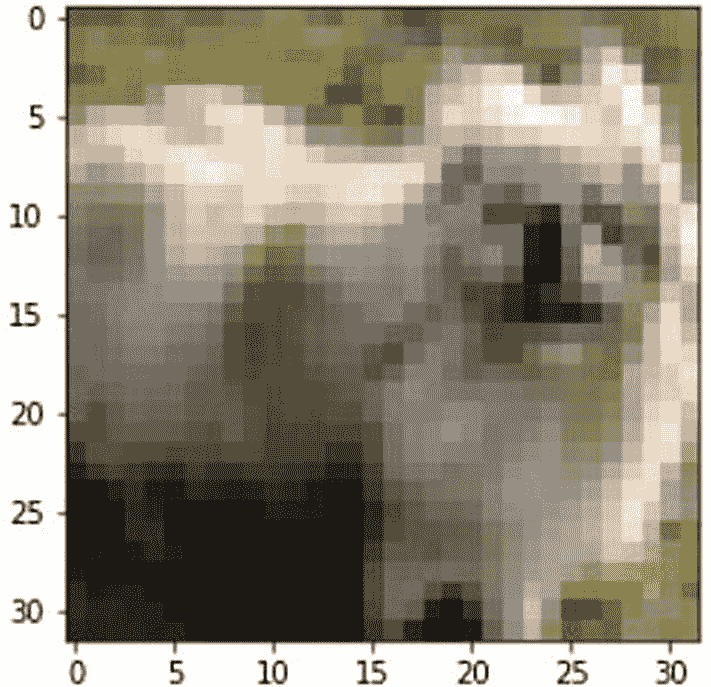

图 3-11：数据集中的示例图像

很明显，这张 32x32 像素的图像几乎无法让您猜测它包含什么？但是，正如我所说，对于我们的机器学习算法来说，这种尺寸的图像足以用于训练。现在，我们将准备用于模型训练的训练数据集。

### 准备模型训练数据

如前所述，我们将使用 `x_train` 来训练模型。您需要保留一部分数据用于训练阶段的验证。我们将保留 5% 的训练数据用于验证。

#### 创建验证数据集

为了将训练数据拆分为实际的训练数据集和验证数据集，我们使用 `sklearn` 的拆分方法，如下面的代码段所示：

```python
from sklearn.model_selection import train_test_split
x_train, x_val, y_train, y_val = train_test_split(x_train, y_train, test_size = 0.05, random_state = 0)
```

在这里，我们保留 5% 的训练数据用于模型训练期间的验证。`x_val` 和 `y_val` 分别代表我们的特征和标签验证数据集。接下来，我们将对数据进行增强。

#### 数据增强

在解释如何进行数据增强之前，先说明什么是数据增强以及它在机器学习中的必要性。数据增强是数据科学家用来增加模型训练期间可用数据多样性的策略。现场收集的原始数据可能表现出单一性，导致训练不完善。数据增强避免了为增加多样性而收集新数据的需要。常用的增强技术包括裁剪、填充和水平翻转。对于图像数据增强，Keras 预处理模块提供了 `ImageDataGenerator` 类。你可以通过以下代码片段实例化该类：

```
from tensorflow.keras.preprocessing.image import ImageDataGenerator
datagen = ImageDataGenerator(
rotation_range=15,
width_shift_range=0.1,
height_shift_range=0.1,
horizontal_flip=True, )
```

各个参数决定了在指定图像上执行的增强类型。如示例中的参数名称所示，图像可能会被旋转、平移甚至翻转，以在捕获的数据中获得所需的多样性。你将使用这个 `datagen` 实例来增强训练数据。

由于每个 RGB 值的范围在 0 到 255 之间，因此也需要将其缩放到 0 到 1 的范围内。为了进行缩放，我们定义缩放函数如下：

```
def normalize(data):
data = data.astype("float32")
data = data/255.0
return data
```

现在，我们将使用以下代码片段对训练/测试数据进行增强和缩放：

```
x_train = normalize(x_train)
datagen.fit(x_train)
x_val = normalize(x_val)
datagen.fit(x_val)
x_test = normalize(x_test)
```

`normalize` 函数对训练数据和验证数据进行缩放。`ImageDataGenerator` 的 `fit` 方法对数据进行增强。我们仅对测试数据进行归一化，但不进行增强，因为我们需要在真实图像（而非增强后的图像）上获得测试结果。

作为数据处理的一部分，最后需要做的是调用 `to_categorical` 方法将整数值转换为矩阵。请注意，我们的标签列包含十个类别，分别对应不同的对象类型，例如鸟和汽车。为了转换这一列，我们使用 Keras 工具库中的 `to_categorical` 函数，如下所示：

```
y_train = tf.keras.utils.to_categorical(y_train, 10)
y_test = tf.keras.utils.to_categorical(y_test, 10)
y_val = tf.keras.utils.to_categorical(y_val, 10)
```

完成所有这些转换后，如果你想查看它们对图像的影响，只需使用下面给出的 `imshow` 函数在控制台上再次打印图像即可：

```
plt.imshow(x_train[40])
```

生成的图像如图 3-12 所示。

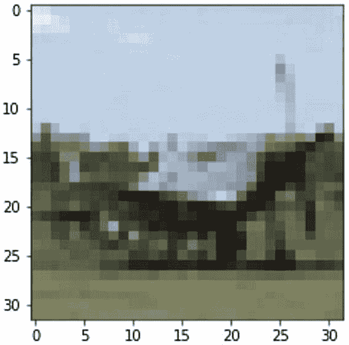

图 3-12

索引为 40 的转换后图像

现在，既然我们已经完成了数据预处理，让我们打印修改后数据的维度，以便了解预处理的最终结果。你可以使用以下代码片段打印维度：

```
print("x_train dimensions : ",x_train.shape)
print("y_train dimensions : ",y_train.shape)
print("x_test dimensions  : ",x_test.shape)
print("y_test dimensions  : ",y_test.shape)
print("x_val dimensions   : ",x_val.shape)
print("y_val dimensions   : ",y_val.shape)
```

上述代码的执行输出如下：

```
x_train dimensions :  (47500, 32, 32, 3)
y_train dimensions :  (47500, 10)
x_test dimensions  :  (10000, 32, 32, 3)
y_test dimensions  :  (10000, 10)
x_val dimensions   :  (2500, 32, 32, 3)
y_val dimensions   :  (2500, 10)
```

请注意，特征向量的维度保持不变，而标签向量的维度已变为 10。这是因为我们的数据集中有 10 个类别。

现在，进入机器学习最重要的部分，即定义模型。在定义模型之前，我将编写一个函数，用于训练、评估并打印指定模型的误差指标。我这样做的目的是向你展示不同模型架构对结果准确率的影响。我将从一个简单的架构开始，然后不断添加改进，以期提高准确率。如果对模型所做的更改导致准确率降低，我们将放弃这些更改，并尝试新的更改。

### 模型开发

在本节中，我们将定义几个具有不同架构的模型。你将训练这些模型并对未见过的图像进行预测。然后，你将根据模型的准确率和预测结果对其进行性能评级。你将把最佳模型保存到磁盘，并在生产环境中进一步使用它来对未见过的图像执行图像分类。

为了比较不同模型的性能，我将定义一个函数，该函数可对我们定义的每个模型进行调用。此函数将训练模型、评估其性能并打印误差指标。

### 训练/评估/显示函数

我们定义用于实现训练、模型评估和指标显示的函数如下：

```
def results(model):
```

该函数接收一个类型为 `model` 的参数。我们将创建不同类型的模型，并将其作为参数传递给此函数。

在函数体内，我们调用模型的 `fit` 方法来开始训练。如下面的函数调用所示：

```
epoch = 20
r = model.fit(x_train, y_train, batch_size = 32,
epochs = epoch, validation_data =
(x_val, y_val), verbose = 1)
```

在训练过程中，您将看到每个轮次的输出，如图 3-13 所示。

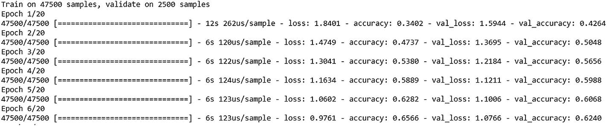

**图 3-13**  
训练进行中

训练迭代次数在名为 `epoch` 的 Python 变量中声明，该变量设置为 `20`。在检查误差指标后，您可以更改此数字以重新训练网络。`fit` 方法的参数含义不言自明，我在前一章讨论二分类项目时已经介绍过。

训练结束后，我们将在测试数据上评估模型的准确率。这是通过调用模型的 `evaluate` 方法完成的，如下所示：

```
acc = model.evaluate(x_test, y_test)
print("test set loss : ", acc[0])
print("test set accuracy :", acc[1]*100)
```

上述代码的典型输出如下所示：

```
test set loss :  1.4717637085914612
test set accuracy : 65.78999757766724
```

我们使用以下代码段绘制准确率指标：

```

#### 绘制训练和验证准确率
epoch_range = range(1, epoch+1)
plt.plot(epoch_range, r.history['accuracy'])
plt.plot(epoch_range, r.history['val_accuracy'])
plt.title('Classification Accuracy')
plt.ylabel('Accuracy')
plt.xlabel('Epoch')
plt.legend(['Train', 'Val'], loc='lower right')
plt.show()
```

训练和验证数据的指标都会被绘制出来。典型的绘图如图 3-14 所示。

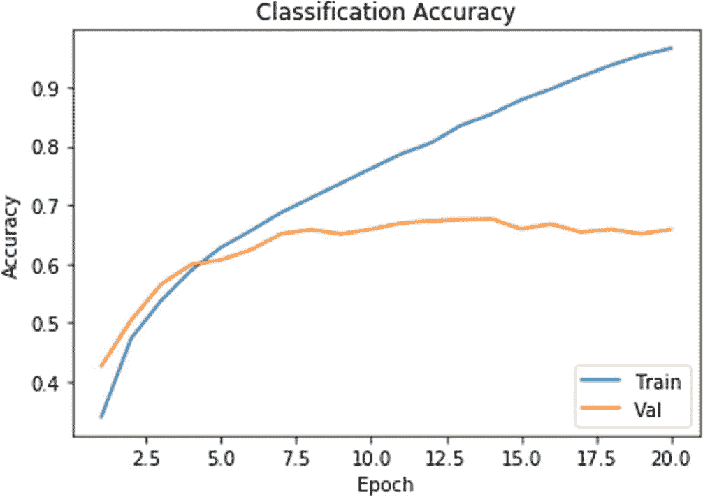

**图 3-14**  
准确率指标图

同样，我们使用以下代码段绘制损失指标：

```

#### 绘制训练和验证损失值
plt.plot(epoch_range,r.history['loss'])
plt.plot(epoch_range, r.history['val_loss'])
plt.title('Model loss')
plt.ylabel('Loss')
plt.xlabel('Epoch')
plt.legend(['Train', 'Val'], loc='lower right')
plt.show()
```

典型的绘图如图 3-15 所示。

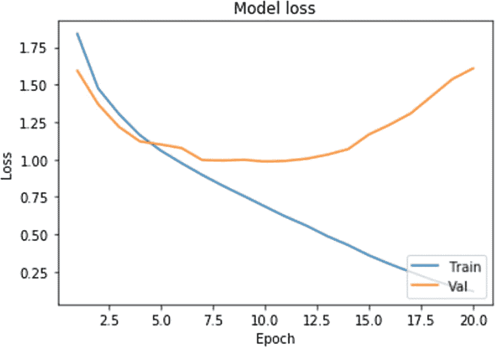

**图 3-15**  
损失指标图

上述绘图代码的含义不言自明，已在第 2 章中解释过。至此，`results` 函数的定义完成。以下是完整的函数代码，供您快速参考。

```
def results(model):
epoch = 20
r = model.fit(x_train, y_train, batch_size = 32,
epochs = epoch, validation_data =
(x_val, y_val), verbose = 1)
acc = model.evaluate(x_test, y_test)
print("test set loss : ", acc[0])
print("test set accuracy :", acc[1]*100)

#### 绘制训练和验证准确率
epoch_range = range(1, epoch+1)
plt.plot(epoch_range, r.history['accuracy'])
plt.plot(epoch_range, r.history['val_accuracy'])
plt.title('Classification Accuracy')
plt.ylabel('Accuracy')
plt.xlabel('Epoch')
plt.legend(['Train', 'Val'], loc='lower right')
plt.show()

#### 绘制训练和验证损失值
plt.plot(epoch_range,r.history['loss'])
plt.plot(epoch_range, r.history['val_loss'])
plt.title('Model loss')
plt.ylabel('Loss')
plt.xlabel('Epoch')
plt.legend(['Train', 'Val'], loc='lower right')
plt.show()
```

在开始定义各种模型之前，让我再定义一个函数，该函数将用于预测指定图像中嵌入对象的类别。

### 预测函数

由于我们的数据集包含 10 个类别，我们首先在代码中定义这些类别的名称：

```
classes = ['airplane','automobile', 'bird', 'cat',
'deer','dog','frog', 'horse','ship','truck']
```

我们定义名为 `predict_class` 的函数如下：

```
def predict_class(filename, model):
```

该函数接收两个参数——第一个参数指定图像文件的名称，第二个参数指定用于对给定图像进行分类的模型。因此，这是一个通用函数，可用于比较不同模型的性能。

在函数内部，我们使用以下代码将图像加载到内存中：

```
img = load_img(filename, target_size=(32, 32))
```

我们在屏幕上显示图像以供参考：

```
plt.imshow(img)
```

我们需要将图像数据转换为可以输入到模型 `predict` 方法的数组。`img_to_array` 方法结合重塑操作可以完成此转换。

```
img = img_to_array(img)
img = img.reshape(1,32,32,3)
```

然后，我们使用以下语句缩放数组元素：

```
img = img.astype('float32')
img = img/255.0
```

图像数据现在已准备好输入到模型的 `predict` 函数。

```
result = model.predict(img)
```

`predict` 函数返回的输出是矩阵形式。我们将输出复制到一个字典中。我们使用 `for` 循环将输出转换为字典，如下面的语句所示：

```
dict2 = {}
for i in range(10):
dict2[result[0][i]] = classes[i]
```

预测结果成为字典中的键，其类别成为字典中的值。

现在，我们将 `result[0]`（即预测结果）复制到一个名为 `res` 的列表中。我们对这个数组进行排序，以按升序排列预测结果。

```
res = result[0]
res.sort()
```

我们选取前三个预测结果进行显示。请注意，最佳预测结果存储在最后一个索引处。

```
res = res[::-1]
results = res[:3]
```

我们最终在屏幕上打印结果。

```
print("Top predictions of these images are")
for i in range(3):
print("{} : {}".format(dict2[results[i]],
(results[i]*100).round(2)))
```

我们还显示实验中使用的图像以供参考。请注意，该图像已包含在 `plt` 对象中。

```
print('The image given as input is')
```

至此，我们的 `predict_class` 函数定义完成。以下是完整的定义，供您快速参考：

```

#### 预测给定图像中的类别
from tensorflow.keras.preprocessing.image
import load_img, img_to_array
classes = ['airplane','automobile', 'bird', 'cat', 'deer',
'dog','frog', 'horse','ship','truck']
def predict_class(filename, model):
img = load_img(filename, target_size=(32, 32))
plt.imshow(img)

#### 转换为数组

#### 重塑为具有 3 个通道的单个样本
img = img_to_array(img)
img = img.reshape(1,32,32,3)

#### 准备像素数据
img = img.astype('float32')
img = img/255.0

#### 预测结果
result = model.predict(img)
dict2 = {}
for i in range(10):
dict2[result[0][i]] = classes[i]
res = result[0]
res.sort()
res = res[::-1]
results = res[:3]
print("Top predictions of these images are")
for i in range(3):
print("{} : {}".format(dict2[results[i]],
(results[i]*100).round(2)))
print('The image given as input is')
```

现在是时候开始定义我们的模型了。

## 定义模型

在本节中，我们将定义 5 个复杂度递增的模型。定义每个模型后，我们将立即对其进行训练，评估其性能并进行一些预测。最后，我们将比较不同模型产生的结果。那么，让我们从第一个模型开始。

### 包含 2 个卷积层的模型

我们在实验中使用的第一个模型是一个简单的模型，仅包含 2 个卷积层。为了定义模型，Keras 提供了你在第 2 章中已经使用过的 Sequential API。你可以通过以下语句导入 Sequential API：

```
from tensorflow.keras.models import Sequential
```

Sequential API 允许你构建一个顺序网络架构，你可以按照所需的顺序不断向其中添加层。Keras 提供了多种现成的层类型供你使用。同时，它也允许你在需要时创建自己的自定义层。对于这个应用，我们将使用 Keras 提供的层。其中一些命名的层包括`Conv2D`、`Dense`、`Dropout`和`Flatten`。你可以通过以下程序语句在代码中导入它们：

```
from tensorflow.keras.layers import Dense, Dropout, Conv2D, MaxPooling2D, Flatten, BatchNormalization
```

现在，我们通过实例化`Sequential`类来定义模型，如下所示：

```
model_1 = Sequential([
    Conv2D(32, (3, 3), activation = 'relu', padding = 'same', input_shape = (32, 32, 3)),
    Conv2D(32, (3, 3), activation = 'relu', padding = 'same'),
    MaxPooling2D((2, 2)),
    Flatten(),
    Dense(128, activation = 'relu'),
    Dense(10, activation = 'softmax')
])
```

如构造函数中所指定的，该网络由 6 层组成。第一层是`Conv2D`类型，即我们的卷积层。它包含 32 个大小为 3x3 的滤波器，作用于 32x32x3 的图像上。网络的输入是 32x32x3，你应该记得这是`x_train`向量的维度。第二层同样是卷积层。第三层是`MaxPooling2D`层，其后是`Flatten`层。最后两层是`Dense`层——第一层包含 128 个节点，使用 ReLU 激活函数；第二层包含 10 个节点，使用 softmax 激活函数。请记住，我们的网络应该输出 10 个类别，因此最后一层包含 10 个节点。可以使用以下代码生成网络图：

```
from tensorflow.keras.utils import plot_model
plot_model(model_1, to_file='model1.png')
```

生成的网络图如图 3-16 所示。

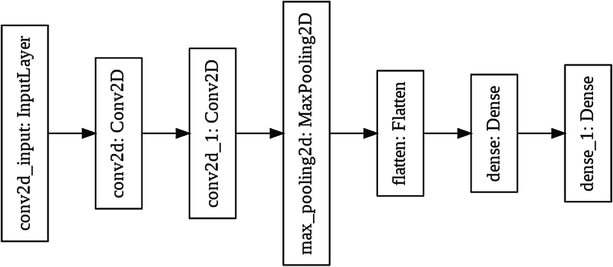

**图 3-16** 模型 1 的网络图

可以通过在`model_1`实例上调用`summary`方法来打印网络摘要，如下所示：

```
Model: "sequential"
_______________________________________________________________
Layer (type)                 Output Shape              Param #
===============================================================
conv2d (Conv2D)              (None, 32, 32, 32)        896
_______________________________________________________________
conv2d_1 (Conv2D)            (None, 32, 32, 32)        9248
_______________________________________________________________
max_pooling2d (MaxPooling2D) (None, 16, 16, 32)        0
_______________________________________________________________
flatten (Flatten)            (None, 8192)              0
_______________________________________________________________
dense (Dense)                (None, 128)               1048704
_______________________________________________________________
dense_1 (Dense)              (None, 10)                1290
===============================================================
Total params: 1,060,138
Trainable params: 1,060,138
Non-trainable params: 0
```

定义网络后，我们将优化器设置为 SGD，并使用损失函数`categorical_crossentropy`编译模型，如下面的代码片段所示：

```
opt = tf.keras.optimizers.SGD(lr=0.001, momentum=0.9)
model_1.compile(optimizer=opt, loss = 'categorical_crossentropy', metrics = ['accuracy'])
```

现在，我们通过调用之前定义的`results`函数，并将`model_1`作为参数传递给它，来训练、评估并显示误差指标。

```
results(model_1)
```

生成的输出如图 3-17 所示。

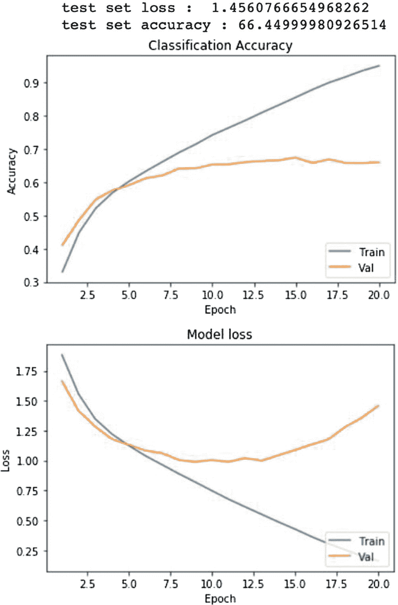

**图 3-17** 模型 1 的误差指标

如你所见，准确率约为 66%——显然在大多数情况下不在可接受范围内。此外，还存在明显的过拟合现象。你可以通过参数优化和正则化来减少过拟合。我们将持续应用此类技术来改进模型的性能。

现在，你将使用以下代码段对一张未见过的图像进行预测：

```
import urllib
resource = urllib.request.urlopen("https://raw.githubusercontent.com/Apress/artificial-neural-networks-with-tensorflow-2/main/ch03/test01.png")
output = open("file01.jpg", "wb")
output.write(resource.read())
output.close()
predict_class("file01.jpg", model_1)
```

预测的输出如图 3-18 所示。

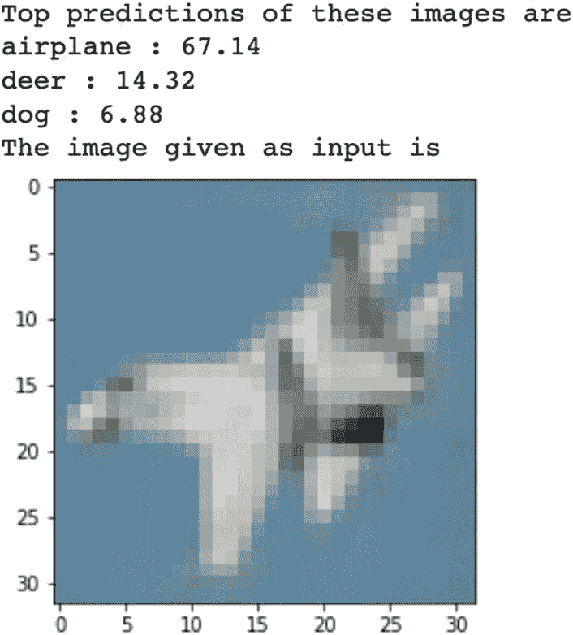

**图 3-18** `model_1`的性能

现在，为了提高准确率，我们将在网络架构中再添加两个卷积层。

### 具有 4 个卷积层的 Model_2

现在，我们将按照下方代码所示，定义一个包含 4 个卷积层的新架构：

```python
model_2 = Sequential([
Conv2D(32, (3, 3), activation = 'relu', padding = 'same',
input_shape = (32, 32, 3)),
Conv2D(32, (3, 3), activation = 'relu', padding = 'same'),
MaxPooling2D((2, 2)),
Conv2D(64, (3, 3), activation = 'relu', padding = 'same'),
Conv2D(64, (3, 3), activation = 'relu', padding = 'same'),
MaxPooling2D((2, 2)),
Flatten(),
Dense(128, activation = 'relu'),
Dense(10, activation = 'softmax')
])
opt = tf.keras.optimizers.SGD(lr = 0.001, momentum = 0.9)
model_2.compile(optimizer = opt, loss =
'categorical_crossentropy',
metrics = ['accuracy'])
```

为方便快速查阅，下方打印了模型摘要：

```
Model: "sequential_1"
_______________________________________________________________
Layer (type)                 Output Shape              Param #
===============================================================
conv2d_2 (Conv2D)            (None, 32, 32, 32)        896
_______________________________________________________________
conv2d_3 (Conv2D)            (None, 32, 32, 32)        9248
_______________________________________________________________
max_pooling2d_1 (MaxPooling2 (None, 16, 16, 32)        0
_______________________________________________________________
conv2d_4 (Conv2D)            (None, 16, 16, 64)        18496
_______________________________________________________________
conv2d_5 (Conv2D)            (None, 16, 16, 64)        36928
_______________________________________________________________
max_pooling2d_2 (MaxPooling2 (None, 8, 8, 64)          0
_______________________________________________________________
flatten_1 (Flatten)          (None, 4096)              0
_______________________________________________________________
dense_2 (Dense)              (None, 128)               524416
_______________________________________________________________
dense_3 (Dense)              (None, 10)                1290
===============================================================
Total params: 591,274
Trainable params: 591,274
Non-trainable params: 0
```

网络结构图如图 3-19 所示。


图 3-19

模型 2 网络结构图

模型的误差指标如图 3-20 所示。

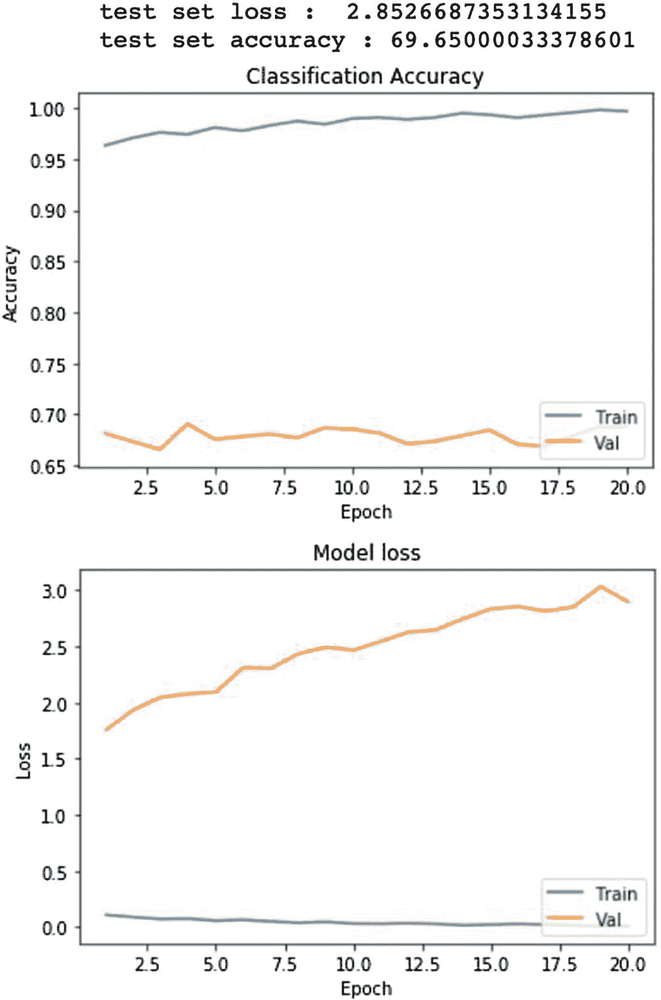

图 3-20

模型 2 误差指标

该模型对第一个模型所用同一张图片的预测结果如下：

```
Top predictions of these images are
airplane : 99.95
bird : 0.04
deer : 0.01
```

你可以观察到，准确率从 66.44%略微提升到了约 69.65%。对给定图片的预测结果几乎保持不变。

现在，我们将尝试添加更多卷积层，看看模型的准确率是否能进一步提升。

### 第三个模型：6 个卷积层，分别使用 32、64 和 128 个滤波器

修改后的模型定义如下方代码所示：

```python
model_3 = Sequential([
Conv2D(32, (3, 3), activation = 'relu', padding = 'same',
input_shape = (32, 32, 3)),
Conv2D(32, (3, 3), activation = 'relu', padding = 'same'),
MaxPooling2D((2, 2)),
Conv2D(64, (3, 3), activation = 'relu', padding = 'same'),
Conv2D(64, (3, 3), activation = 'relu', padding = 'same'),
MaxPooling2D((2, 2)),
Conv2D(128, (3, 3), activation = 'relu', padding = 'same'),
Conv2D(128, (3, 3), activation = 'relu', padding = 'same'),
MaxPooling2D((2, 2)),
Flatten(),
Dense(128, activation = 'relu'),
Dense(10, activation = 'softmax')
])
opt = tf.keras.optimizers.SGD(lr = 0.001, momentum = 0.9)
model_3.compile(optimizer = opt, loss = 'categorical_crossentropy',
metrics = ['accuracy'])
```

模型摘要如下：

```
Model: "sequential_2"
_______________________________________________________________
Layer (type)                 Output Shape              Param #
===============================================================
conv2d_6 (Conv2D)            (None, 32, 32, 32)        896
_______________________________________________________________
conv2d_7 (Conv2D)            (None, 32, 32, 32)        9248
_______________________________________________________________
max_pooling2d_3 (MaxPooling2 (None, 16, 16, 32)        0
_______________________________________________________________
conv2d_8 (Conv2D)            (None, 16, 16, 64)        18496
_______________________________________________________________
conv2d_9 (Conv2D)            (None, 16, 16, 64)        36928
_______________________________________________________________
max_pooling2d_4 (MaxPooling2 (None, 8, 8, 64)          0
_______________________________________________________________
conv2d_10 (Conv2D)           (None, 8, 8, 128)         73856
_______________________________________________________________
conv2d_11 (Conv2D)           (None, 8, 8, 128)         147584
_______________________________________________________________
max_pooling2d_5 (MaxPooling2 (None, 4, 4, 128)         0
_______________________________________________________________
flatten_2 (Flatten)          (None, 2048)              0
_______________________________________________________________
dense_4 (Dense)              (None, 128)               262272
_______________________________________________________________
dense_5 (Dense)              (None, 10)                1290
===============================================================
Total params: 550,570
Trainable params: 550,570
Non-trainable params: 0
```

该模型的网络结构图如图 3-21 所示。

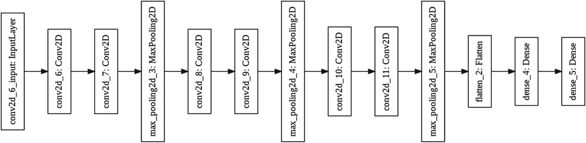

图 3-21

模型 3 网络结构图

模型的误差指标如图 3-22 所示。

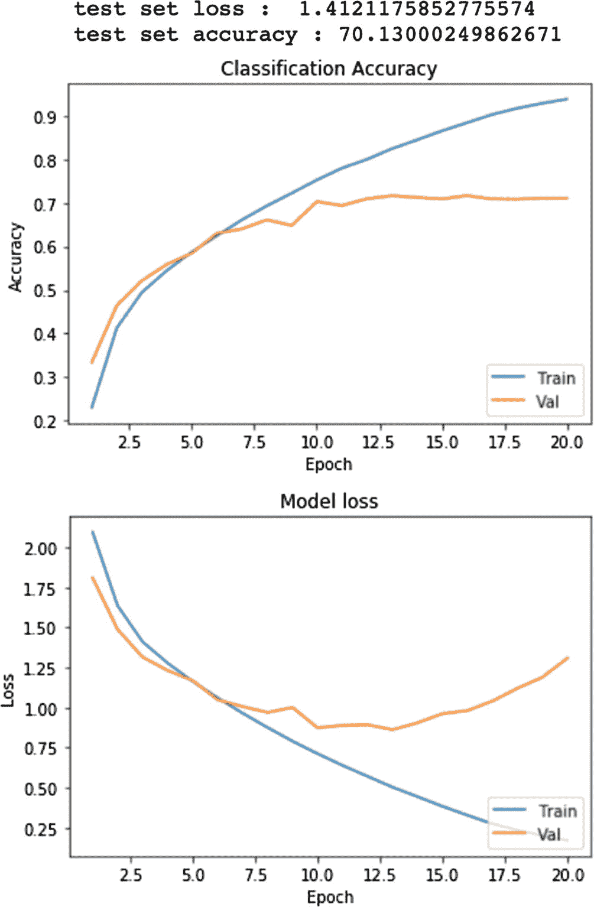

图 3-22

模型 3 误差指标

该模型对我们之前图片的预测结果如下：

```
Top predictions of these images are
deer : 87.18
bird : 8.07
airplane : 3.81
```

模型的准确率（70.13%）几乎与之前模型的准确率水平（69.65%）持平。因此，仅仅增加更多的卷积层并不能帮助我们创建更好的模型。

现在，让我们尝试向模型添加一个 dropout 层。

### 第四种模型：添加 Dropout 层

Dropout 的思想是在训练过程中随机丢弃网络中的一些单元及其连接。训练每一步中参数数量的减少会产生正则化效果。修改后的模型定义如下：

```python
model_4 = Sequential([
Conv2D(32, (3, 3), activation = 'relu', kernel_initializer =
'he_uniform', padding = 'same', input_shape = (32, 32, 3)),
Conv2D(32, (3, 3), activation = 'relu', kernel_initializer =
'he_uniform', padding = 'same'),
MaxPooling2D((2, 2)),
Dropout(0.2),
Conv2D(64, (3, 3), activation = 'relu', kernel_initializer =
'he_uniform', padding = 'same'),
Conv2D(64, (3, 3), activation = 'relu', kernel_initializer =
'he_uniform', padding = 'same'),
MaxPooling2D((2, 2)),
Dropout(0.2),
Conv2D(128, (3, 3), activation = 'relu', kernel_initializer =
'he_uniform', padding = 'same'),
Conv2D(128, (3, 3), activation = 'relu', kernel_initializer =
'he_uniform', padding = 'same'),
MaxPooling2D((2, 2)),
Dropout(0.3),
Flatten(),
Dense(128, activation = 'relu'),
Dense(10, activation = 'softmax')
])
opt = tf.keras.optimizers.SGD(lr = 0.001, momentum = 0.9)
model_4.compile(optimizer = opt, loss = 'categorical_crossentropy',
metrics = ['accuracy'])
```

模型摘要如下：

```
Model: "sequential_3"
_______________________________________________________________
Layer (type)                 Output Shape              Param #
===============================================================
conv2d_12 (Conv2D)           (None, 32, 32, 32)        896
_______________________________________________________________
conv2d_13 (Conv2D)           (None, 32, 32, 32)        9248
_______________________________________________________________
max_pooling2d_6 (MaxPooling2 (None, 16, 16, 32)        0
_______________________________________________________________
dropout (Dropout)            (None, 16, 16, 32)        0
_______________________________________________________________
conv2d_14 (Conv2D)           (None, 16, 16, 64)        18496
_______________________________________________________________
conv2d_15 (Conv2D)           (None, 16, 16, 64)        36928
_______________________________________________________________
max_pooling2d_7 (MaxPooling2 (None, 8, 8, 64)          0
_______________________________________________________________
dropout_1 (Dropout)          (None, 8, 8, 64)          0
_______________________________________________________________
conv2d_16 (Conv2D)           (None, 8, 8, 128)         73856
_______________________________________________________________
conv2d_17 (Conv2D)           (None, 8, 8, 128)         147584
_______________________________________________________________
max_pooling2d_8 (MaxPooling2 (None, 4, 4, 128)         0
_______________________________________________________________
dropout_2 (Dropout)          (None, 4, 4, 128)         0
_______________________________________________________________
flatten_3 (Flatten)          (None, 2048)              0
_______________________________________________________________
dense_6 (Dense)              (None, 128)               262272
_______________________________________________________________
dense_7 (Dense)              (None, 10)                1290
===============================================================
Total params: 550,570
Trainable params: 550,570
Non-trainable params: 0
```

该模型的网络图如图 3-23 所示。

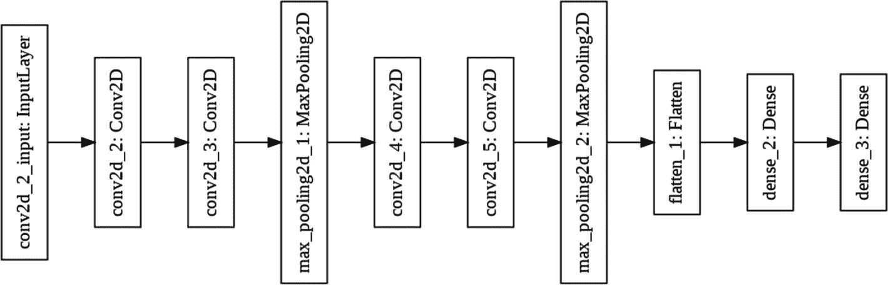

图 3-23

模型 4 网络图

模型的误差指标如图 3-24 所示。

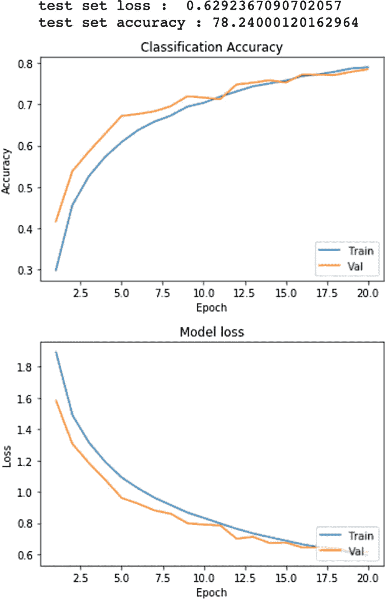

图 3-24

模型 4 误差指标

对之前使用的同一张图像的预测结果如下：

```
Top predictions of these images are
cat : 26.33
dog : 25.52
airplane : 21.61
```

准确率现已提升至 78.24%，比之前的情况有更大的提升。现在我们将创建一个包含批归一化和正则化的新模型。

### 模型 5

`BatchNormalization` 的工作方式与常规归一化相同，区别在于它作用于数据批次。前一层的激活在每个批次上进行处理，以保持平均激活值接近 0，标准差接近 1。因此，它减少了训练步数，从而加快了训练过程。在某些情况下，它还可能消除前一个模型中使用 dropout 的需求。

正则化是一种通过在训练集上适当拟合函数以减少误差，从而避免过拟合的技术。

我们将在新的模型定义中应用这些技术。

模型定义如下代码所示：

```python
weight_decay = 1e-4
model_5 = Sequential([
Conv2D(32, (3, 3), activation = 'relu', padding = 'same',
kernel_regularizer = tf.keras.regularizers.l2(weight_decay),
input_shape = (32, 32, 3)),
BatchNormalization(),
Conv2D(32, (3, 3), activation = 'relu', kernel_regularizer =
tf.keras.regularizers.l2(weight_decay), padding = 'same'),
BatchNormalization(),
MaxPooling2D((2, 2)),
Dropout(0.2),
Conv2D(64, (3, 3), activation = 'relu', kernel_regularizer =
tf.keras.regularizers.l2(weight_decay), padding = 'same'),
BatchNormalization(),
Conv2D(64, (3, 3), activation = 'relu', kernel_regularizer =
tf.keras.regularizers.l2(weight_decay), padding = 'same'),
BatchNormalization(),
MaxPooling2D((2, 2)),
Dropout(0.3),
Conv2D(128, (3, 3), activation = 'relu', kernel_regularizer =
tf.keras.regularizers.l2(weight_decay), padding = 'same'),
BatchNormalization(),
Conv2D(128, (3, 3), activation = 'relu', kernel_regularizer =
tf.keras.regularizers.l2(weight_decay), padding = 'same'),
BatchNormalization(),
MaxPooling2D((2, 2)),
Dropout(0.3),
Flatten(),
Dense(128, activation = 'relu'),
Dense(10, activation = 'softmax')
])
opt = tf.keras.optimizers.SGD(lr = 0.001, momentum = 0.9)
model_5.compile(optimizer = opt, loss = 'categorical_crossentropy',
metrics = ['accuracy'])
```

模型摘要如下：

```
Model: "sequential_4"
_______________________________________________________________
Layer (type)                 Output Shape              Param #
===============================================================
conv2d_18 (Conv2D)           (None, 32, 32, 32)        896
_______________________________________________________________
batch_normalization (BatchNo (None, 32, 32, 32)        128
_______________________________________________________________
conv2d_19 (Conv2D)           (None, 32, 32, 32)        9248
_______________________________________________________________
batch_normalization_1 (Batch (None, 32, 32, 32)        128
_______________________________________________________________
max_pooling2d_9 (MaxPooling2 (None, 16, 16, 32)        0
_______________________________________________________________
dropout_3 (Dropout)          (None, 16, 16, 32)        0
_______________________________________________________________
conv2d_20 (Conv2D)           (None, 16, 16, 64)        18496
_______________________________________________________________
batch_normalization_2 (Batch (None, 16, 16, 64)        256
_______________________________________________________________
conv2d_21 (Conv2D)           (None, 16, 16, 64)        36928
_______________________________________________________________
batch_normalization_3 (Batch (None, 16, 16, 64)        256
_______________________________________________________________
max_pooling2d_10 (MaxPooling (None, 8, 8, 64)          0
_______________________________________________________________
dropout_4 (Dropout)          (None, 8, 8, 64)          0
_______________________________________________________________
conv2d_22 (Conv2D)           (None, 8, 8, 128)         73856
_______________________________________________________________
batch_normalization_4 (Batch (None, 8, 8, 128)         512
_______________________________________________________________
conv2d_23 (Conv2D)           (None, 8, 8, 128)         147584
_______________________________________________________________
batch_normalization_5 (Batch (None, 8, 8, 128)         512
_______________________________________________________________
max_pooling2d_11 (MaxPooling (None, 4, 4, 128)         0
_______________________________________________________________
dropout_5 (Dropout)          (None, 4, 4, 128)         0
_______________________________________________________________
flatten_4 (Flatten)          (None, 2048)              0
_______________________________________________________________
dense_8 (Dense)              (None, 128)               262272
_______________________________________________________________
dense_9 (Dense)              (None, 10)                1290
===============================================================
Total params: 552,362
Trainable params: 551,466
Non-trainable params: 896
```

网络结构图如图 3-25 所示。

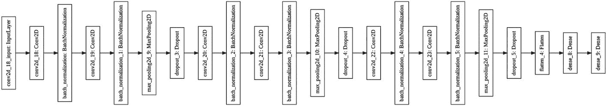

**图 3-25** 模型 5 网络结构图

误差指标图如图 3-26 所示。

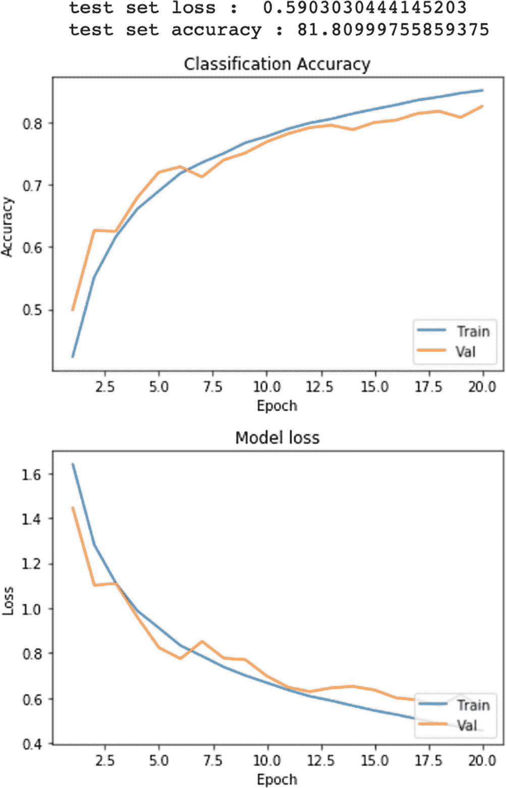

**图 3-26** 模型 5 误差指标

对先前示例中使用的同一张图片的预测结果如下：

```
这些图片的 top 预测结果为
airplane : 83.3
cat : 5.25
ship : 4.34
```

准确率现已提升至 81.80%，相比之前所有其他设计有了显著提高。五种不同模型的对比见表 3-2。

**表 3-2** 不同模型的性能对比

| 模块 | 模型 1 | 模型 2 | 模型 3 | 模型 4 | 模型 5 |
| --- | --- | --- | --- | --- | --- |
| 损失 | 1.4560 | 2.8526 | 1.4121 | 0.6292 | 0.5903 |
| 准确率 | 66.4499 | 69.6500 | 70.1300 | 78.2400 | 81.8099 |

显然，在我们测试的所有模型中，模型 5 的准确率最高。同时，请注意模型 3 和模型 2 提供了相同水平的准确率，这表明仅仅增加更多的卷积层并不能帮助提高模型的准确率。

### 保存模型

既然你已经开发了具有不同准确率的模型，你可以选择适合生产环境的模型。为此，你需要将模型保存到文件中。之前，我已经讨论过保存模型及其属性和状态的各种方法。

你可以通过调用模型实例上的 `save` 方法将上述任何一个模型保存到磁盘，如下所示：

```
model_5.save("model_5.h5")
```

模型被保存为 HDF5 格式，并且可以随时使用以下语句重新加载：

```
m = load_model("model_5.h5")
```

然后，新加载的模型可用于预测任何未见过的图像。

### 预测未见过的图像

现在，我们将使用我们保存的模型来预测三张不同尺寸的未见过的图像。这三张图像如图 3-27 所示。

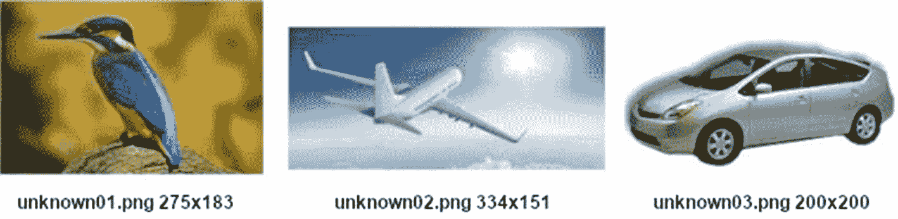

**图 3-27** 用于测试的未见过的图像

请注意，所有图像都不是正方形尺寸。我们的模型是在 32x32 的正方形图像上训练的，并且需要相同尺寸的输入。让我们尝试看看模型是否能准确预测这些图像中的物体。使用以下代码片段从项目 GitHub 加载图像，并调用我们的 `predict_class` 函数进行预测。

```

#### 未见过的图像 1
resource = urllib.request.urlopen("https://raw.githubusercontent.com/Apress/artificial-neural-networks-with-tensorflow-2/main/ch03/unknown01.png")
output.write(resource.read())
output.close()
predict_class("/content/unknown01.jpg", m)

#### 未见过的图像 2
resource = urllib.request.urlopen("https://raw.githubusercontent.com/Apress/artificial-neural-networks-with-tensorflow-2/main/ch03/unknown02.png")
output = open("/content/unknown02.jpg","wb")
output.write(resource.read())
output.close()
predict_class("/content/unknown02.jpg", m)

#### 未见过的图像 3
resource = urllib.request.urlopen("https://raw.githubusercontent.com/Apress/artificial-neural-networks-with-tensorflow-2/main/ch03/unknown03.png")
output = open("/content/unknown03.jpg","wb")
output.write(resource.read())
output.close()
predict_class("/content/unknown03.jpg", m)
```

模型对这三张图像的预测结果如下：

```
这些图片的 top 预测结果为
airplane : 98.56
bird : 0.66
deer : 0.64
这些图片的 top 预测结果为
automobile : 99.94
airplane : 0.06
truck : 0.0
这些图片的 top 预测结果为
bird : 99.9
cat : 0.08
airplane : 0.01
```

你看到，在所有三种情况下，我们的模型都以接近 99% 的准确率正确预测了物体。恭喜！你已经学会了使用 `tf.keras` 开发用于图像分类的机器学习模型。该项目的完整源代码可在项目下载中找到。

到目前为止，在本章和上一章中，你已经创建了自己的模型，这无疑是一个耗时且需要大量精力的过程。那么，为什么不直接重用他人训练好的模型，将其应用于你自己的数据集以满足你的需求呢？这正是下一章要介绍的内容。所以，请继续阅读吧！

# 总结

Keras API 现已完全在 TF 中实现，并通过 `tf.keras` 模块进行访问。借助 `tf.keras` 提供的函数式 API，你现在能够创建具有多输入/多输出、非线性拓扑结构、共享层模型等复杂网络架构。你学习了如何使用预定义层和自定义层来定义此类架构。你还学习了如何为面向对象编程对模型进行子类化。你学习了如何保存模型、其状态和权重。为了应用这些知识，本章涵盖了一个使用 CNN 进行图像分类的完整示例。在 CNN 的简要理论基础上，该应用开发了一个基于 CIFAR-10 数据集的完整图像分类应用。你从一个简单模型开始，并通过应用不同技术（如增加 `Conv2D` 层数量、添加 Dropout、`BatchNormalization` 和正则化）持续提升其性能。你学习了如何保存模型，并在之后用于对未见过的图像进行推理。

