# 迁移学习

在上一章中，你开发了一个二值图像分类器。使用 60,000 张图像，训练模型花费了一些时间。我们达到的准确率约为 80% 到 90%。如果你想要更高的准确率，则需要更多图像进行训练。事实上，深度学习网络在拥有更多数据点时学习效果更好。`ImageNet`（`https://devopedia.org/imagenet`）是首个在规模上达到如此程度的数据库，它包含 14,197,122 张图像，分为 21,841 个子类别，这些子类别又进一步分为 27 个子树。为了对 `ImageNet` 中的图像进行分类，人们开发了许多机器学习模型；这些模型主要是作为研究和竞赛的一种方式而开发的。2017 年，其中一个模型实现了低至 2.3% 的错误率。其底层网络非常复杂。考虑到这样一个复杂网络的可训练参数数量，想象一下训练该模型所需的资源和时间。

现在的问题是，我们能否重用这些网络所学到的知识，并利用它们的知识为我们自身谋利？而这正是本章的全部内容。其背后的技术称为迁移学习。这就像人类将他们的学识传授给年轻一代。在本章中，你将学习如何将其他网络的学习成果转化为自身优势，并在它们工作的基础上开发自己的新模型。

简而言之，本章涵盖以下内容：
-   知识迁移是什么意思？
-   什么是 `TensorFlow Hub`？
-   有哪些可用的预训练模型？
-   如何使用预训练模型？
-   如何使用迁移学习技术创建犬种分类器？

那么，让我们从这个问题开始：什么是知识迁移？

## 知识迁移

在过去的几十年里，开发人员一直使用二进制库来重用自己或他人共享的代码。在机器学习中，我们能否通过重用他人开发的模型来促进自身发展，从而应用相同的概念？这并不像听起来那么简单。在软件库中，共享的只是代码。在机器学习中，需要共享的远不止代码。一个训练好的模型的四个重要组成部分如下：
-   算法
-   数据
-   训练
-   专业知识

首先，是某人开发的用于训练神经网络的算法。这是知识迁移的代码部分。第二是数据。通常，模型借助大量数据点进行学习。第三是训练——训练一个模型需要巨大的处理能力和时间。训练网络时会消耗大量资源。最后，是领域专家的知识和专业技能，它们会内在地嵌入到训练好的模型中。那么，我们如何将这四个方面迁移到一个新模型中呢？为了促进这一点，`TensorFlow` 的研究人员受到启发，开发了 `TensorFlow Hub`。

### TensorFlow Hub

`TensorFlow Hub` 是 `TensorFlow` 提供的一个平台，用于发布预训练模型。其他用户可以从中发现并重用这些模型中的部分机器学习模块。那么，什么是模块？模块的可视化表示如图 4-1 所示。

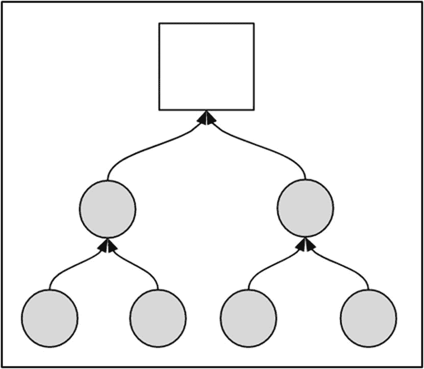

图 4-1 模块图

模块本质上是 `TensorFlow` 图的一个自包含片段，连同其训练权重。该图可以在其他地方重用，以执行类似的任务。开发者可以向该图添加更多层来创建自己的模型。然后，可以使用较小的数据集训练新模型，从而加快训练速度。从某种意义上说，这也会产生泛化效果，使得泛化模块可以在多个模型中重用。你可以将模型想象成软件工程中的最终可执行文件（二进制文件），而模块则像是用于创建可执行文件的通用库。

模块是可组合的，如图 4-2 所示。

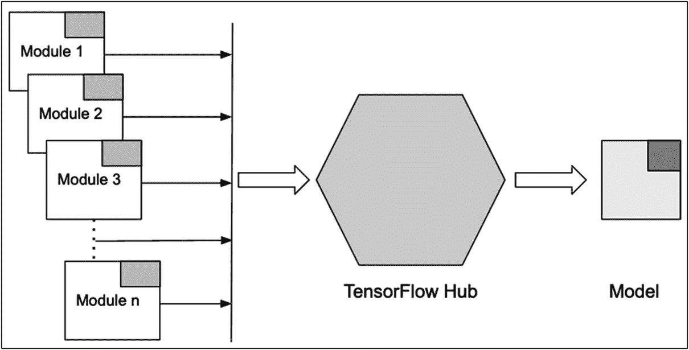

图 4-2 `TensorFlow Hub` 架构

你可以在预训练模块之上添加自己的层来创建自己的网络。然后，可以训练整个网络，包括嵌入的预训练模块。

模块是可重用且可重新训练的，只需向函数调用传递一个参数即可。当我说它们是可重新训练时，意味着你可以像对待普通神经网络一样通过它们进行反向传播。请注意，如果你进行重新训练，请确保使用较低的学习率；否则，现有的权重可能会失控，产生完全意想不到的结果。

当你创建自己的模型，并且觉得该模型可能对社区有用时，你可以将其提交给 `Google`，以便纳入 `TensorFlow Hub`。`Hub` 中目前有许多第三方模块。`Google` 警告你要谨慎使用第三方模块，尤其是在你不信任其来源的情况下。

那么，目前有哪些模块可供你使用呢？

### 预训练模块

`TensorFlow Hub` 中提供了由谷歌及其渠道合作伙伴开发的多个预训练模块。这些模块分为三类：图像、文本和视频。其中“图像”领域类别如图 4-3 所示。

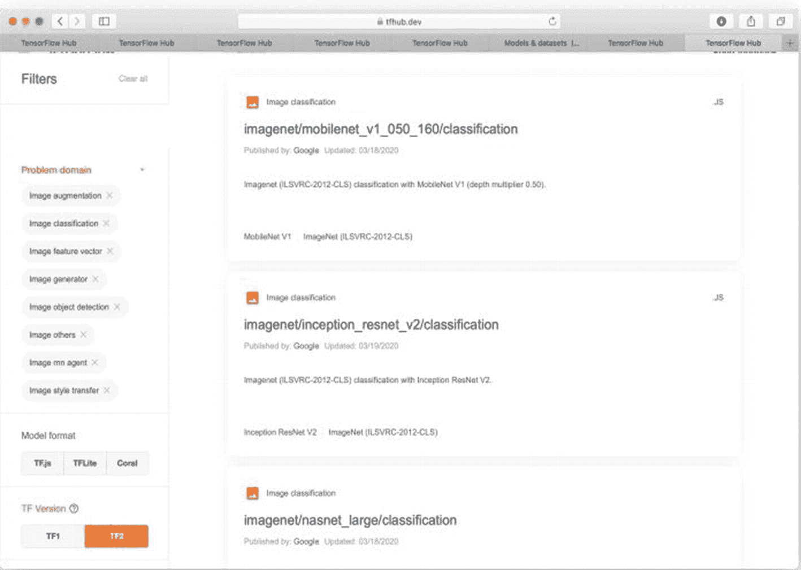

图 4-3 `TensorFlow` 中的预定义模型

图像领域中的部分模块包括：
-   使用 `MobileNet`/`Inception ResNet V2`/`NASNet-A` 进行 `ImageNet` 分类
-   使用 `MobileNet`/`Inception`/`ResNet`/`PNASnet` 提取图像特征向量

上述模块支持 `TF2`。此外，还有一份详尽的模块列表，这些模块由谷歌及其他合作伙伴开发，运行于 `TF1` 环境下，并正在等待迁移至 `TF2`。以下是一些你可能感兴趣的 `TF1` 类别下的模块：
-   Progressive GAN
-   快速任意图像风格迁移
-   执行随机裁剪、小角度旋转和颜色失真的图像增强模块
-   预测任意照片大致地理位置的 `PlaNet`
-   Google landmarks - 深度局部特征 (`DELF`)

在文本类别下，你将找到如下模块：
-   `ELMO`
-   `BERT`
-   通用句子编码器
-   基于英文维基百科语料库训练的令牌级文本嵌入

在视频类别下，截至撰写本文时，尚无适用于 `TF2` 的模型。在 `TF1` 环境下，有谷歌和 `DeepMind` 创建的少量模型。

再次强调，`TF1` 类别下的模块总数非常庞大。你可以访问 `TensorFlow Hub` 网站（`https://tfhub.dev/`）查看所有可用模块的完整列表。

现在，你已经了解了有哪些资源可供使用。接下来的问题是，如何使用这样的预训练模块。

### 使用模块

要在你的程序代码中使用预训练模块，请从 `tfdev` 网站选择所需的模块。查找“模型格式”；在“保存的模型”下，你将找到该模块的 `URL`，如图 4-4 的截图所示。

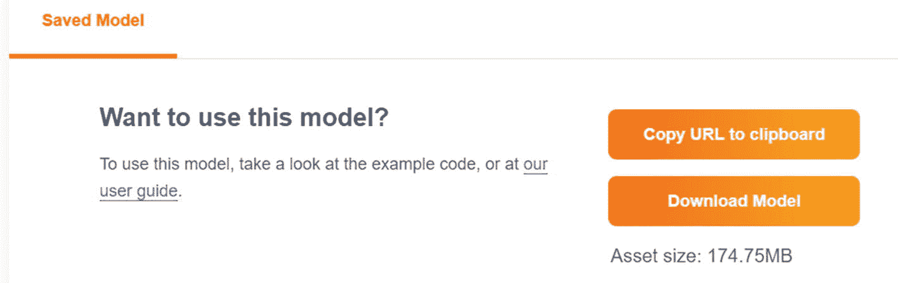

图 4-4 模块的 `URL`

复制该 `URL`，并按如下所示在你的程序代码中使用它：

```
module_url = "https://tfhub.dev/google/imagenet/mobilenet_v2_100_160/feature_vector/4"
my_model = hub.KerasLayer(module_url)
```

然后，你可以向 `my_model` 添加更多层。使用 `fit` 方法训练你的新模型，就像训练其他模型一样。训练完成后，用它进行预测。

了解了预训练模块的能力之后，是时候动手尝试了。

### ImageNet 分类器

在本项目中，你将使用谷歌提供的名为 `mobilenet_v2` 的 `ImageNet` 分类器。该分类器提供 1001 种不同的分类。该模型基于超过一百万张图像进行训练。它使用的初始学习率为 0.045，每个 `epoch` 的学习率衰减率为 0.98。它使用了 16 个 `GPU` 异步工作器，批量大小为 96。你可以想象创建此模型所涉及的资源数量。你将利用迁移学习，将这种知识迁移到在此之上构建你自己的图像分类器。你将在本章接下来的两个项目中完成这项工作。第一个项目将教你如何使用 `MobileNet` 模型对你自己的图像进行分类。第二个项目将向你展示如何扩展它以添加更多你自己的分类。

首先，我将向你展示如何使用 `ImageNet` 分类器对你自己的图像进行分类。本质上，在本项目中，你将按原样使用 `MobileNet` 分类器，而不向其添加任何层。你只需学习如何加载预训练模型并将其应用于你自己的图像。本章后面的项目（犬种分类器）将深入探讨许多细节，届时你将向 `ImageNet` 模块添加你自己的分类层，并进行大量研究，以了解迁移学习带来的好处。

那么，首先在 `Colab` 中创建一个名为 `ImageNetClassifier` 的项目。

### 设置项目

使用以下代码片段设置 `TensorFlow` 并导入所需的包：

```
import tensorflow tf
#### 其他导入
import tensorflow_hub as hub
import numpy as np
import matplotlib.pyplot as plt
```

请注意，你需要导入 `tensorflow_hub`。另外两个导入 `numpy` 和 `matplotlib` 的作用与往常一样；你在之前的项目中已经使用过它们。

### 分类器 URL

本项目将使用预训练的 `MobileNet` 分类器。在 `TensorFlow Hub` 上找到此分类器。在 `tfhub.dev` 网站上搜索的截图如图 4-5 所示。

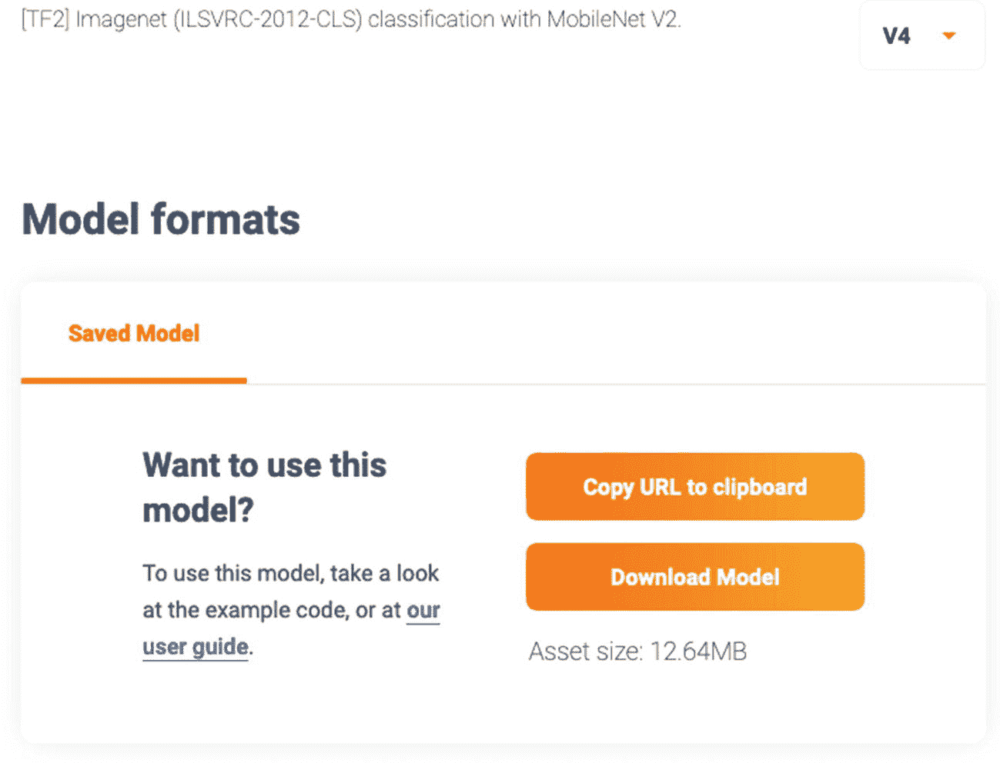

图 4-5 `TensorFlow Hub` 上的 `MobileNet` 模型

点击“复制 `URL`”按钮复制模型的 `URL`。你将获得以下 `URL`：

```
https://tfhub.dev/google/tf2-preview/mobilenet_v2/classification/4
```

请注意，你获得的版本可能比此处显示的更新。

在你的项目代码中声明两个变量，如下所示：

```
classifier_url = "https://tfhub.dev/google/tf2-preview/mobilenet_v2/classification/4"
IMAGE_SHAPE = (224, 224)
```

根据模型描述，该模型的输入需要 224x224 像素的图像。模型描述可在用户指南中找到，你可以通过点击图 4-5 中显示的“我们的用户指南”链接来阅读。

### 创建模型

接下来，你使用 `Sequential API` 创建模型，如下所示：

```
#### 创建一个模型
classifier = tf.keras.Sequential([
hub.KerasLayer(classifier_url, input_shape = IMAGE_SHAPE+(3,))
])
```

`hub.KerasLayer` 返回添加到我们顺序模型中的模块。该模块中包含的所有层现在都可供我们的网络使用。我们不会向此模型添加任何我们自己的层。因此，我们的模型定义现已完成。由于这是一个完全训练好的模型，我们无需在其上调用 `fit` 方法进行进一步训练。你只需调用其 `predict` 方法来推断任何给定的输入图像。在调用 `predict` 之前，让我们准备一些图像作为模型的输入。

### 准备图像

我在本书的下载站点上上传了几张图片。这些图片的 `URL` 已列在下方。请将以下代码添加到你的项目中：

```
#### 设置图片下载的 URL
image_url1 = "https://raw.githubusercontent.com/Apress/artificial-neural-networks-with-tensorflow-2/main/Ch04/bulck_cart.jpg"
image_url2 = "https://raw.githubusercontent.com/Apress/artificial-neural-networks-with-tensorflow-2/main/Ch04/flower.jpg"
image_url3 = "https://raw.githubusercontent.com/Apress/artificial-neural-networks-with-tensorflow-2/main/Ch04/swordweapon.jpg"
image_url4 = "https://raw.githubusercontent.com/Apress/artificial-neural-networks-with-tensorflow-2/main/Ch04/tiger.jpg"
image_url5 = "https://raw.githubusercontent.com/Apress/artificial-neural-networks-with-tensorflow-2/main/Ch04/tree.jpg"
```

你将使用以下代码将这些图片下载到你的驱动器中：

```
#### 下载图片
!pip install wget
import wget
wget.download(image_url1,'image1.jpg')
wget.download(image_url2,'image2.jpg')
wget.download(image_url3,'image3.jpg')
wget.download(image_url4,'image4.jpg')
wget.download(image_url5,'image5.jpg')
```

我们使用 `wget` 来下载这五个图片文件。它们会被存储在你的驱动器的 `/content/` 文件夹中，文件名分别为 `image1`、`image2`，以此类推。

由于这些图片尺寸不一，你需要在将它们加载到内存后，将其大小调整为 224x224。同时，你还需要将数据重新缩放到 0 到 1 的范围内，以便进行更好的机器学习。所有这些操作都在以下代码中完成：

```
#### 加载图片并调整为模型所需的 224x224 尺寸
import PIL.Image as Image
image1 = tf.keras.utils.get_file("/content/image1.jpg", image_url1)
image1 = Image.open(image1).resize(IMAGE_SHAPE)

#### 加载图片并调整为模型所需的 224x224 尺寸
import PIL.Image as Image
image1 = tf.keras.utils.get_file("/content/image1.jpg", image_url1)
image1 = Image.open(image1).resize(IMAGE_SHAPE)

#### 缩放数组
image1 = np.array(image1)/255.0
image2 = tf.keras.utils.get_file("/content/image2.jpg", image_url2)
image2 = Image.open(image2).resize(IMAGE_SHAPE)
image2 = np.array(image2)/255.0
image3 = tf.keras.utils.get_file("/content/image3.jpg", image_url3)
image3 = Image.open(image3).resize(IMAGE_SHAPE)
image3 = np.array(image3)/255.0
image4 = tf.keras.utils.get_file("/content/image4.jpg", image_url4)
image4 = Image.open(image4).resize(IMAGE_SHAPE)
image4 = np.array(image4)/255.0
image5 = tf.keras.utils.get_file("/content/image5.jpg", image_url5)
image5 = Image.open(image5).resize(IMAGE_SHAPE)
image5 = np.array(image5)/255.0
```

现在，你已经准备好对图片进行推理了。那么，让我们从第一张图片开始。你通过调用模型的 `predict` 方法来推理图片：

```
result = classifier.predict(image1[np.newaxis, ...])
```

概率预测结果现在存储在 `result` 张量中。使用 `shape` 方法打印结果的形状：

```
result.shape
(1, 1001)
```

你可以看到 `result` 数组中有 1001 个值，表明输出中有 1001 个类别。概率预测结果按升序排列。因此，选取最后一个值作为我们模型做出的最高预测。

```
predicted_class = np.argmax(result[0], axis=-1)
predicted_class
```

如你所见，预测的类别是 293。这个整数对我们来说毫无意义。幸运的是，`Google` 提供了这些整数到标签的映射。

### 加载标签映射

标签名称可在 `Google` 站点的 `ImageNetLabels.txt` 文件中找到，我们使用以下代码将其加载到程序中：

```
labels_path = tf.keras.utils.get_file('ImageNetLabels.txt','https://storage.googleapis.com/download.tensorflow.org/data/ImageNetLabels.txt')
imagenet_labels = np.array(open(labels_path).read().splitlines())
```

使用以下两个打印语句打印标签名称和数组长度：

print(`imagenet_labels`)
print("Number of labels: ", len(`imagenet_labels`))
['background' 'tench' 'goldfish' ... 'bolete' 'ear' 'toilet tissue']
Number of labels:  1001

接下来两行显示的输出列出了数组开头和结尾的几个名称。它还告诉你共有 1001 个名称，每个名称对应我们模型的一个输出类别。

### 显示预测结果

为了显示预测结果，我们使用以下代码绘制图片和预测的类别名称：

```python
plt.imshow(image1)
plt.axis('off')
predicted_class_name = imagenet_labels[predicted_class]
_ = plt.title("Prediction: " + predicted_class_name.title())
```

结果如图 4-6 所示。

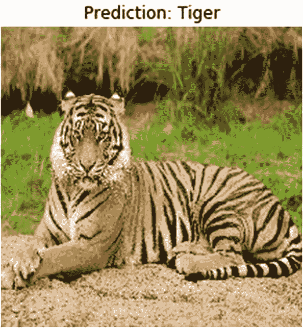
**图 4-6：带有预测标题的测试图片**

如你所见，我们的模型正确预测了图片，表明它是一只老虎。现在，通过编写与 `image1` 类似的代码，对其他四张图片进行预测。

为此，你可以使用此处展示的 `predict_display_image` 函数：

```python
def predict_display_image(imagex):
    result = classifier.predict(imagex[np.newaxis, ...])
    predicted_class = np.argmax(result[0], axis=-1)
    plt.imshow(imagex)
    plt.axis('off')
    predicted_class_name = imagenet_labels[predicted_class]
    _ = plt.title("Prediction: " + predicted_class_name.title())
```

该函数接收一个预处理后的图片作为参数，对其进行推理，并连同图片本身一起打印预测结果。

你将按如下方式对剩余的四张图片调用此函数：

```python
# 对指定图片进行预测并打印结果
predict_display_image(image2)
predict_display_image(image3)
predict_display_image(image4)
predict_display_image(image5)
```

四个预测结果如图 4-7 所示。

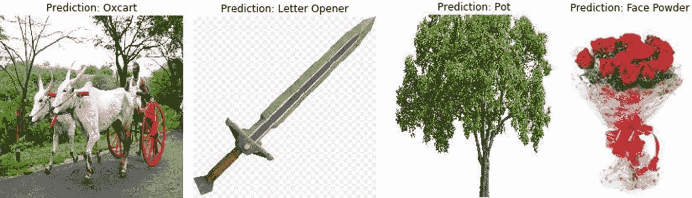
**图 4-7：其他四张图片的预测结果**

在讨论图 4-7 的输出之前，让我们先看看 `ImageNet` 分类器所分类的类别列表。

### 列出所有类别

要查看 `ImageNet` 预测的所有类别列表，请使用以下代码：

```python
for i in range (len(imagenet_labels)):
    print (imagenet_labels[i])
```

输出中的前几项如下所示：

```
background
tench
goldfish
great white shark
tiger shark
hammerhead
electric ray
stingray
cock
Hen
```

现在，我将讨论图 4-7 中显示的结果。

### 结果讨论

输出中的第一张图片被解释为手推车，这是正确的。第二张图片被解释为开信刀，其外观与剑相似。请注意，实际图片是一把剑。开信刀在外观上与剑相似。因此，这个推理结果可以认为是合理的。第三张图片是一棵树，被解释为花盆。最后一张是一束玫瑰，被解释为粉饼——完全错误。那么，我们从这次讨论中能得出什么结论呢？为了区分泰迪熊和玫瑰花束，`ImageNet` 需要更多图片进行进一步训练。这显然超出了我们的能力范围。然而，我们将能够扩展 `ImageNet`，添加我们自己的分类。这正是我将在下一个主题中展示的内容。

## 犬种分类器

假设你有一个包含狗图片及其品种标签的数据集。你可能无法为每个类别收集到足够多的图片。你希望开发一个模型，根据狗的品种对其进行分类。你可以考虑使用之前课程中讨论过的 `ImageNet` 分类器来提取狗图片的特征。然后，你将在其之上添加一个层，根据这些提取的特征来区分不同品种的狗。简而言之，你将迁移 `ImageNet` 的学习成果来对狗的种类进行分类，从而省去为特征提取而训练模型的麻烦。

图像分类模型拥有数百万个参数。从头开始训练它们通常是一项艰巨的任务。这需要大量的训练数据，并且计算成本很高。迁移学习通过利用已经训练好的模型的一部分来缩短这一过程。你只需在其之上添加自己的分类层即可。

本项目将演示如何使用来自 `TensorFlow Hub` `MobileNet V2` 的预训练 `TF2` 保存模型，构建一个用于对犬种进行分类的 `Keras` 模型。该模型接受尺寸为 `(224,224,3)` 的输入用于图像特征提取，随后通过我们模型的输出 `Dense` 层，使用 `softmax` 进行分类。

让我们开始构建这个项目。

### 项目描述

犬种项目将使用迁移学习来定义一个用于对不同犬种进行分类的新模型。这是一个多类分类器，它将给定的狗图片分类到几个预定义的类别中。区分多类分类和二分类，可以说，狗与猫或人类与马是二分类。特斯拉在其自动驾驶汽车中使用了多类图像分类。

对于本项目，我们将使用来自 `Kaggle` 犬种识别竞赛的数据集（`https://www.kaggle.com/c/dog-breed-identification/overview`）。它包含 10,000 多张标记图像，涵盖 120 个不同的犬种。我们需要通过将图像数据转换为张量来预处理数据。我们的机器学习模型将找出输入张量中的模式。`Kaggle` 作为一个竞赛平台，已经分别提供了训练数据和测试数据。显然，测试数据没有标签。

#### 创建项目

创建一个新的 `Colab` 项目，并将其重命名为 `DogBreedClassifier`。使用以下两条语句导入 `TensorFlow` 和 `TensorFlow Hub`：

```python
import tensorflow as tf
import tensorflow_hub as hub
```

接下来，你将把数据加载到项目中。

#### 加载数据

我已将全部数据（来源：`www.kaggle.com/c/dog-breed-identification/data`）保存在项目站点上，以便你可以一次性运行项目，无需担心单独下载数据。要将数据下载到你的项目中，请运行以下代码片段：

```bash
! wget --no-check-certificate -r 'https://drive.google.com/uc?export=download&id=11t-eBwdXU9EWriDhyhFBuMqHYiQ4gdae' -O dogbreed
```

请注意，在上述下载过程中，假定下载站点是可信的。如果你有任何疑虑，你可以使用自己的工具下载文件，并在项目中包含适当的路径以输入到模型。

下载的 `zip` 文件包含用于训练和测试的标签和图像。`zip` 文件的结构如图 4-8 所示。

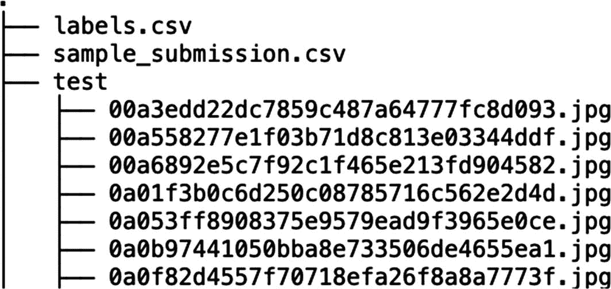
**图 4-8：下载数据的文件夹结构**

使用以下命令解压下载的文件：

```bash
!unzip dogbreed
```

`zip` 文件还包含训练图像的标签。你可以通过加载 `labels.csv` 文件并打印前五条记录来检查标签：

```python
### 查看标签
import pandas as pd
labels_csv = pd.read_csv("/content/labels.csv")
labels_csv.head()
```

这将显示如图 4-9 所示的输出。

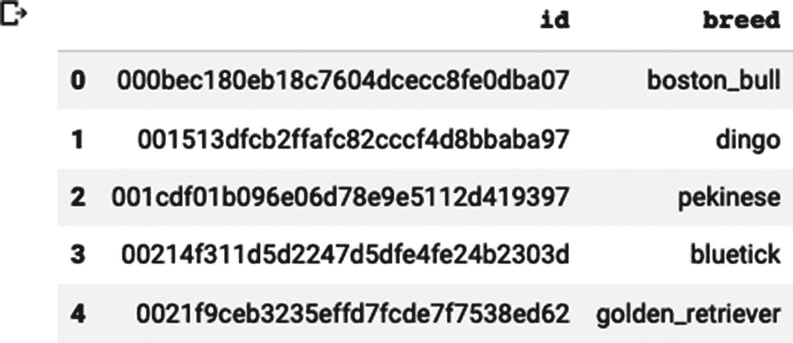
**图 4-9：部分标签**

要描述表格的内容，请在数据框上调用 `describe` 方法。该命令及其输出如图 4-10 所示。

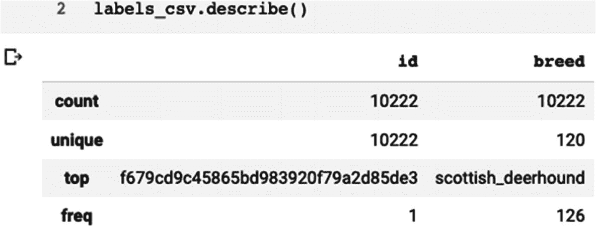
**图 4-10：标签表结构**

从输出中可以看出，共有 10,222 张图像和 120 个类别。要打印数据分布，请使用以下语句：

```python
### 每个品种有多少张图像？
labels_csv["breed"].value_counts().plot.bar(figsize=(20, 10));
```

执行后将生成如图 4-11 所示的图表。

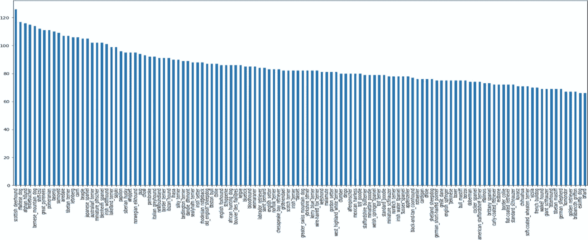
**图 4-11：图像数据分布**

如图 4-11 所示，每个类别都有超过 60 张图像。谷歌建议开始进行图像分类时，每个类别至少要有十张图像。图像数量越多，找出它们之间模式的机会就越大。

现在，你可以尝试使用以下命令打印数据集中的一张示例图像：

```python
from IPython.display import display, Image
Image("/content/train/000bec180eb18c7604dcecc8fe0dba07.jpg")
```

输出如图 4-12 所示。

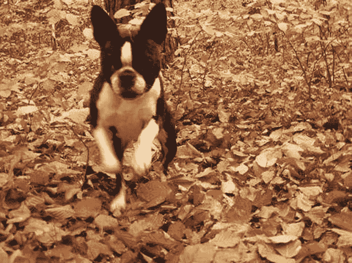
**图 4-12：下载数据集中的示例图像**

现在，你已经拥有了用于训练和测试模型的所有数据。这些数据需要转换为特定格式才能输入到我们的模型中。

#### 设置图像和标签

现在我们将设置图像路径，以便为训练准备数据。这通过以下两条程序语句完成：

```python
#### 为方便使用，定义训练文件路径
train_path = "/content/train"
#### 根据图像 ID 创建路径名称
filenames = [train_path + '/'+fname + ".jpg" for fname in labels_csv["id"]]
```

你可以通过打印其中一张图像来验证文件路径是否正确设置，如下所示：

```python
#### 直接从文件路径检查图像
Image(filenames[9000])
```

你应该会看到如图 4-13 所示的图像。

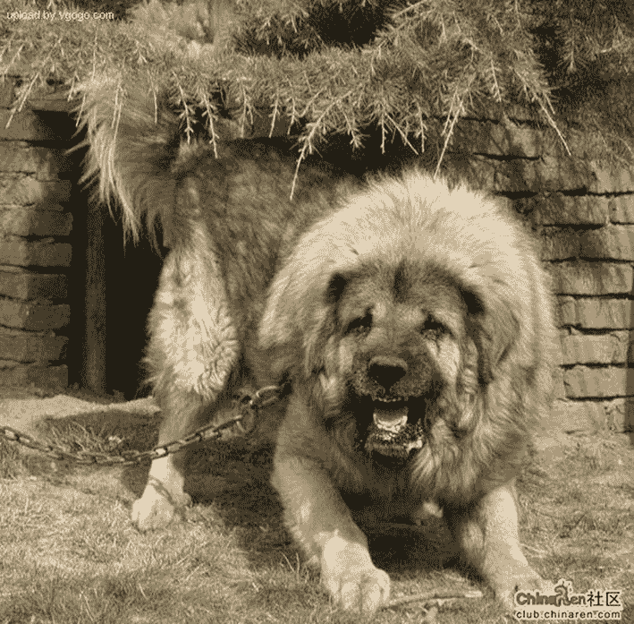
**图 4-13：来自新路径的示例图像**

现在我们已经设置好待处理的图像，接下来将设置标签数组。我们将从 `labels_csv` 中读取标签，并将其转换为 `numpy` 数组。

```python
import numpy as np
labels = labels_csv["breed"].to_numpy()
```

如我们所知，标签数量为 10,222。我们需要从这些标签中提取唯一值，使用以下代码实现：

```python
unique_breeds = np.unique(labels)
len(unique_breeds)
```

输出结果为 120，表明数据集中有 120 个类别。换句话说，共有 120 个犬种被分类。你可以通过调用 `list` 方法打印此列表：

```python
#### 打印类别名称
list(unique_breeds)
```

部分输出如图 4-14 所示。

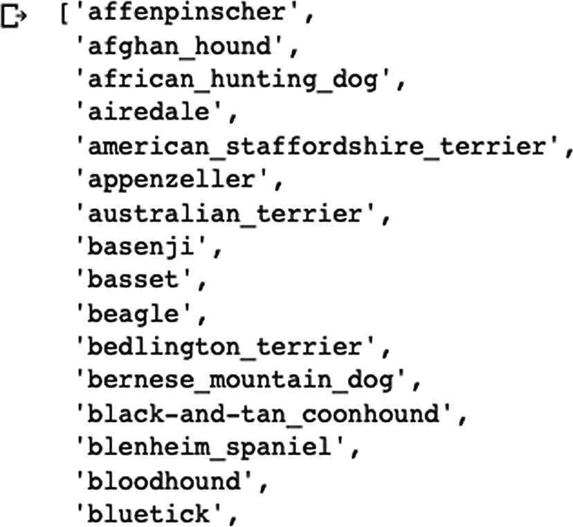
**图 4-14：类别（标签）列表**

接下来，使用以下代码将目标标签编码为 0 到 `n_classes-1` 之间的值：

```python
#### 将目标标签编码为 0 到 120 之间的值
from sklearn.preprocessing import LabelEncoder
labels = LabelEncoder().fit_transform(labels).reshape(-1,1)
labels
```

输出如图 4-15 所示。

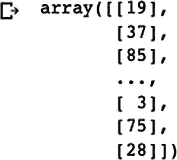
**图 4-15：编码后的标签**

从图 4-15 可以看出，第一只狗被分类为 #19，第二只为 #37，以此类推。现在使用 `OneHotEncoder` 将这些分类值转换为用于模型训练的列。

```python
#### 使用独热编码转换分类值
from sklearn.preprocessing import OneHotEncoder
boolean_labels = OneHotEncoder().fit_transform(labels).toarray()
```

你可以通过打印数组中的某个值来查看独热编码的效果，如下所示：

```python
boolean_labels[5]
```

执行结果如图 4-16 所示。

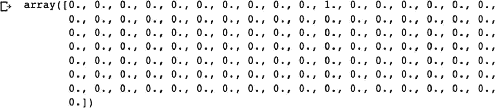
**图 4-16：独热编码后的典型标签数据**

请注意，编码完成后，现在增加了 120 个字段。对于每个列（字段），除了值为 1 的那一列外，其他值均为 0。这就是给定图像所属的类别。

现在我们已经预处理了标签，使其可用于机器学习，接下来我们将预处理图像，使其可供模型学习。

### 预处理图像

到目前为止，您已将标签转换为数字格式。然而，图像仍然只是文件名。您必须读取图像数据，并将其转换为适合输入模型的格式。我们将以张量的形式表示图像数据，以便利用 `GPU` 进行更快的处理。为此，我们将编写一个函数，执行以下操作：

1.  接收图像文件名作为输入
2.  以二进制格式加载图像（`jpeg` 文件）
3.  将图像数据转换为张量
4.  将图像大小调整为 `(224, 224)` 的形状
5.  返回图像张量

为什么需要将图像大小调整为 224x224？请记住，`MobileNet` 模型要求输入图像的形状为 `(224, 224, 3)`，其中 3 代表 `RGB` 维度。那么，让我们来看看各个步骤。

我们首先为特征和标签设置变量：

```python
#### 设置变量
X = filenames
y = boolean_labels
```

接下来，将训练数据集拆分为训练集和验证集：

```python
from sklearn.model_selection import train_test_split
#### 拆分为训练集和验证集
X_train, X_val, y_train, y_val = train_test_split(
    X, y, test_size=0.2, random_state=42)
```

在训练文件夹中的 10,222 张图像中，现在将有 2045 张图像用于验证。

现在，您将编写一个用于预处理图像的函数，即从给定路径加载图像，读取其数据，并将其转换为张量。

#### 处理图像

我们首先为图像大小定义一个变量：

```python
IMG_SIZE = 224
```

我们定义名为 `process_image` 的函数，如下所示：

```python
def process_image(image_path):
```

该函数接受一个参数，即图像文件的路径。要读取图像，您需要使用 `tf.io` 的 `read_file` 函数。

```python
image = tf.io.read_file(image_path)
```

`read_file` 函数将 `jpeg` 图像中的数据读取到二进制数组中。读取的数据使用 `tf.image` 的 `decode_jpeg` 方法进行解码。

```python
image = tf.image.decode_jpeg(image, channels=3)
```

然后，通过调用 `tf.image` 的 `convert_image_dtype` 方法将图像数据转换为浮点值。

```python
image = tf.image.convert_image_dtype(image, tf.float32)
```

我们通过调用 `tf.image` 的 `resize` 函数来调整图像大小。

```python
image = tf.image.resize(image, size=[IMG_SIZE, IMG_SIZE])
```

最后，该函数将处理后的图像数据返回给调用者。

```python
return image
```

`process_image` 的完整函数代码如 `代码清单 4-1` 所示。

### 定义图像大小

`IMG_SIZE = 224`

```python
def process_image(image_path):
    """
    接收图像文件路径并将其转换为张量。
    """
    # 读取图像文件
    image = tf.io.read_file(image_path)
    # 将 jpeg 图像转换为数值张量
    image = tf.image.decode_jpeg(image, channels=3)
    # 将颜色通道值从 0-225 转换为 0-1
    image = tf.image.convert_image_dtype(image, tf.float32)
    # 将图像大小调整为我们所需的大小 (224, 244)
    image = tf.image.resize(image, size=[IMG_SIZE, IMG_SIZE])
    return image
```

代码清单 4-1 `process_image` 函数

接下来，我们将编写一个函数来将图像与标签关联起来。

### 将标签关联到图像

我们将编写一个函数，该函数接收图像路径作为参数，通过调用我们的 `process_image` 函数处理图像，并将其与标签关联。函数定义如下：

```python
# 创建一个简单的函数，返回一个元组 (image, label)
def get_image_label(image_path, label):
    """
    接收图像文件路径名称和关联标签，
    处理图像并返回一个 (image, label) 元组。
    """
    image = process_image(image_path)
    return image, label
```

该函数返回一个元组，其中包含张量形式的图像及其关联标签。

现在，我们将编写一个函数，将我们的数据转换为输入管道。

### 创建数据批次

首先，我们来理解什么是批次。批次是数据的一小部分——即图像及其标签。通常，一个批次的大小为 `32`；这意味着一个批次中包含 `32` 张图像和 `32` 个对应的标签。在深度学习中，我们通常不会一次性在整个数据集中寻找模式，而是每次在一个批次中寻找。一次性加载和处理 `10,000` 多张图像需要巨大的内存和处理能力。因此，我们将其分成小批次，一次处理一个。现在，我们将编写一个函数，将数据划分为批次，并创建由图像数据及其关联标签组成的张量。

创建批次的函数如代码清单 4-2 所示。

```python
# 定义批次大小，32 是一个不错的默认值
BATCH_SIZE = 32
# 创建一个将数据转换为批次的函数
def create_data_batches(x, y=None, batch_size=BATCH_SIZE, data_type=1):
    """
    根据图像（x）和标签（y）对创建数据批次。
    如果是训练数据则进行打乱，如果是验证数据则不进行打乱。
    也接受测试数据作为输入（无标签）。
    """
    # 如果数据是测试数据集，则没有标签
    if data_type == 3:
        print("正在创建测试数据批次...")
        data = tf.data.Dataset.from_tensor_slices((tf.constant(x)))  # 仅文件路径
        data_batch = data.map(process_image).batch(BATCH_SIZE)
        return data_batch
    # 如果数据是验证数据集，则无需打乱
    elif data_type == 2:
        print("正在创建验证数据批次...")
        data = tf.data.Dataset.from_tensor_slices((tf.constant(x),  # 文件路径
                                                    tf.constant(y)))  # 标签
        data_batch = data.map(get_image_label).batch(BATCH_SIZE)
        return data_batch
    else:
        # 如果数据是训练数据集，则进行打乱
        print("正在创建训练数据批次...")
        # 将文件路径和标签转换为张量
        data = tf.data.Dataset.from_tensor_slices((tf.constant(x),  # 文件路径
                                                    tf.constant(y)))  # 标签
        # 在映射图像处理函数之前打乱路径名和标签
        # 比打乱图像更快
        data = data.shuffle(buffer_size=len(x))
        # 创建（图像，标签）元组
        # （这也会将图像路径转换为预处理后的图像）
        data = data.map(get_image_label)
        # 将数据转换为批次
        data_batch = data.batch(BATCH_SIZE)
        return data_batch
```

代码清单 4-2 创建数据批次的函数

根据输入值，该函数会为训练、验证和测试数据集创建批次。在训练数据集中，我们打乱数据以实现一定的随机性。函数 `from_tensor_slices` 将数据转换为输入管道。`map` 函数将（图像，标签）元组转换为数据输入管道。`batch` 函数将数据分割成批次。

现在，我们将编写一个函数来显示数据集中的一些图像。这在测试过程中对我们很有用。

### 图像显示函数

我们现在编写一个函数来显示数据集中的 `25` 张图像。函数 `show_25_images` 的完整代码如代码清单 4-3 所示。假设您熟悉 `matplotlib` 绘图，该代码不言自明，无需进一步注释。

```python
# 用于查看数据批次中图像的函数
import matplotlib.pyplot as plt
def show_25_images(images, labels):
    """
    显示数据批次中的 25 张图像。
    """
    # 设置图形
    plt.figure(figsize=(10, 10))
    # 循环 25 次（用于显示 25 张图像）
    for i in range(25):
        # 创建子图（5 行，5 列）
        ax = plt.subplot(5, 5, i+1)
        # 显示图像
        plt.imshow(images[i])
        # 将图像标签添加为标题
        plt.title(unique_breeds[labels[i].argmax()])
        # 关闭网格线
        plt.axis("off")
```

代码清单 4-3 显示图像函数

准备好用于数据预处理和显示的各种函数后，我们现在可以定义机器学习模型了。

### 选择预训练模型

如前所述，我们将在模型定义中使用迁移学习。为此，我们需要在 `TensorFlow Hub` 中寻找合适的模型。`Hub` 将模型分类到不同的类别下。如果您选择图像分类类别，您会发现其下列出了多个模型。其中一些模型是特定于 `1.x` 版本的。由于我们使用的是 `TF2`，请选择一个支持 `TF2` 的模型。在撰写本文时，`mobilenet_v2_130_224` 就是这样一个模型。选择的截图如图 4-17 所示。

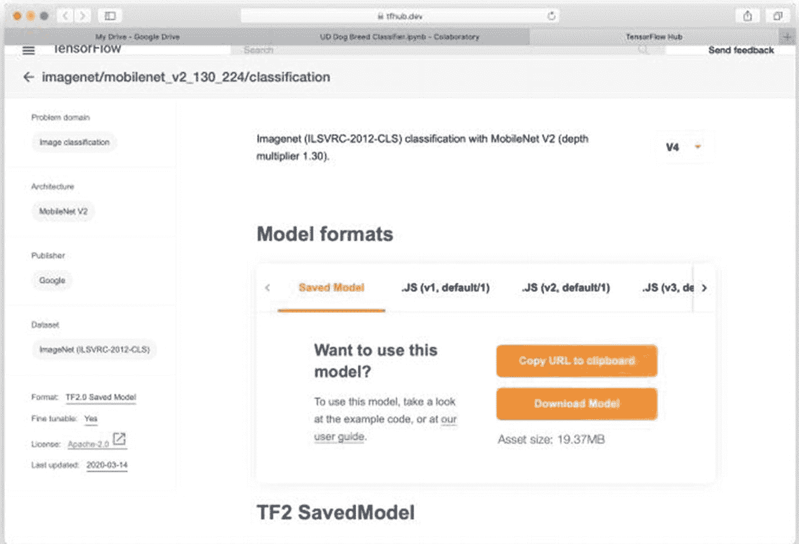

图 4-17 从 tfhub 选择 MobileNet

查看模型文档，您会发现该模型接受形状为 `(224, 224, 3)` 的输入。

## 定义模型

要定义一个模型，我们需要三个重要的信息：

-   输入形状（图像，以张量形式表示）
-   期望的类别数量（犬种数量）
-   我们想要使用的预训练模型的 URL

我们使用以下代码段来声明这些变量：

```python
# 设置模型的输入形状
INPUT_SHAPE = [None, IMG_SIZE, IMG_SIZE, 3]  # 批次、高度、宽度、颜色通道
# 设置模型的输出形状
OUTPUT_SHAPE = len(unique_breeds)  # 唯一标签的数量
# 从 TensorFlow Hub 设置模型 URL
MODEL_URL = "https://tfhub.dev/google/imagenet/mobilenet_v2_130_224/classification/4"
```

为了定义模型，我们将编写一个名为 `create_model` 的函数：

```python
def create_model(input_shape=INPUT_SHAPE,
                 output_shape=OUTPUT_SHAPE,
                 model_url=MODEL_URL):
    print("Building model with:", MODEL_URL)
```

`create_model` 函数将 `input_shape`、`output_shape` 和预训练模型 URL 作为参数。我创建了一个用于模型构建的函数，以便稍后你可以尝试可能需要不同输入和输出形状的其他预训练模型。

接下来，我们将使用 `Sequential API` 在我们的模型中定义两个层。

```python
# 设置模型层
model = tf.keras.Sequential([
    hub.KerasLayer(MODEL_URL),  # TensorFlow Hub 层
    tf.keras.layers.Dense(units=OUTPUT_SHAPE,
                          activation="softmax")  # 输出层
])
```

第一层是从 `Hub` 获取的整个预训练模型。第二层是 `softmax` 分类层，它将狗分类为我们所寻求的 `120` 个类别。

接下来，你将使用以下语句编译模型：

```python
# 编译模型
model.compile(
    loss=tf.keras.losses.CategoricalCrossentropy(),
    optimizer=tf.keras.optimizers.Adam(),
    metrics=["accuracy"]
)
```

我们使用 `CategoricalCrossentropy` 作为损失函数，并使用 `Adam` 优化器。我们捕获准确率指标来评估模型的性能。

我们通过调用 `build` 方法来构建模型，该方法将输入张量作为其参数：

```python
model.build(INPUT_SHAPE)
```

最后，我们将编译后的模型返回给调用者：

```python
return model
```

`create_model` 的完整函数定义如代码清单 4-4 所示。

```python
# 创建一个构建 Keras 模型的函数
def create_model(input_shape=INPUT_SHAPE,
                 output_shape=OUTPUT_SHAPE,
                 model_url=MODEL_URL):
    print("Building model with:", MODEL_URL)
    # 设置模型层
    model = tf.keras.Sequential([
        hub.KerasLayer(MODEL_URL),  # TensorFlow Hub 层
        tf.keras.layers.Dense(units=OUTPUT_SHAPE,
                              activation="softmax")  # 输出层
    ])
    # 编译模型
    model.compile(
        loss=tf.keras.losses.CategoricalCrossentropy(),
        optimizer=tf.keras.optimizers.Adam(),
        metrics=["accuracy"]
    )
    # 构建模型
    model.build(INPUT_SHAPE)
    return model
```

代码清单 4-4 `create_model` 函数

你可以通过创建一个 `model` 变量并打印其摘要来测试此函数，如下所示：

```python
model = create_model()
model.summary()
```

上述代码生成的模型摘要输出如图 4-18 所示。

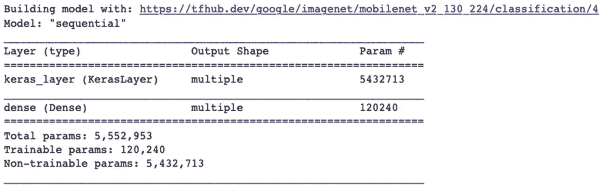

图 4-18 模型摘要

现在我们已经准备好模型进行训练，让我们创建用于训练的数据集。

## 创建数据集

我们已经将训练数据集拆分为训练集和验证集。现在我们只需要使用之前定义的 `create_data_batches` 函数对这些数据进行预处理。

```python
train_data = create_data_batches(X_train, y_train)
val_data = create_data_batches(X_val, y_val)
```

如果你只想直观地检查数据集中的几条记录，请使用我们之前开发的函数 `show_25_images`：

```python
train_images, train_labels = next(train_data.as_numpy_iterator())
show_25_images(train_images, train_labels)
```

你将看到如图 4-19 所示的输出。

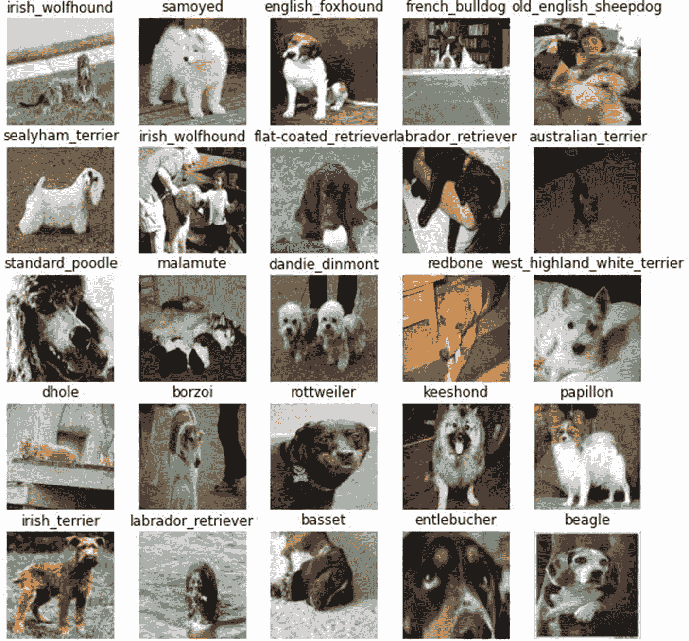

图 4-19 数据集中的样本图像

请注意，在你的情况下，输出可能会显示不同的图片，因为我们每次运行都会打乱训练数据集。

我们用于模型训练的数据集现在已经准备好了。在训练模型之前，我们还需要做最后一件事，那就是设置 `TensorBoard` 用于分析。

### 设置 TensorBoard

首先，你需要加载 `TensorBoard` 扩展。

```python
%load_ext tensorboard
```

接下来，你将清理之前运行产生的日志（如果有的话）。

```python
!rm -rf ./logs/  # 清理之前的日志
```

你现在将创建一个回调函数，该函数将在每个 `epoch` 之后被调用。

```python
import datetime
import os

# 创建一个构建 TensorBoard 回调的函数
def create_tensorboard_callback():
    # 创建一个用于存储 TensorBoard 日志的日志目录
    logdir = os.path.join("logs",
                          # 为日志添加时间戳
                          datetime.datetime.now().strftime("%Y%m%d-%H%M%S"))
    return tf.keras.callbacks.TensorBoard(logdir)
```

请注意，在该函数中，我们创建了一个日志目录，并在每个日志中存储当前时间。

我们将使用 `EarlyStopping` 函数来监控验证数据集上的准确率。以下代码将创建两个用于日志记录和监控的变量：

```python
# TensorBoard 回调
model_tensorboard = create_tensorboard_callback()

# 早停回调
model_early_stopping = tf.keras.callbacks.EarlyStopping(monitor="accuracy",
                                                         # 在连续 3 轮
                                                         # 没有改进后停止
                                                         patience=3)
```

我们将把这些值传递给 `fit` 方法中的 `callbacks` 参数。如果在训练过程中，验证数据集上的准确率在过去三个周期内没有显著改善（由 `patience` 参数定义），则训练将停止。

现在，我们准备编写实际训练的代码。

### 模型训练

我们首先通过调用之前定义的函数 `create_model` 来构建模型。

```python
model = create_model()
```

我们定义一个变量来表示训练期间使用的 `epoch` 数量。

```python
NUM_EPOCHS = 100
```

我将 `epoch` 数量声明得非常大。我将向你演示 `TF2` 的一个重要特性，即当模型准确率达到饱和水平时，它会自动停止训练，这表明进一步的训练无助于获得更好的准确率。当你实际进行模型训练时，你会注意到训练会在设定的 `100` 个 `epoch` 之前就提前停止。

我们现在通过调用 `fit` 方法开始训练。

```python
model.fit(x=train_data,
          epochs=NUM_EPOCHS,
          validation_data=val_data,
          callbacks=[model_tensorboard,
                     model_early_stopping])
```

训练输出会详细显示在你的屏幕上。当我运行训练时，它在 `14` 次迭代后停止了。训练停止前的训练进度截图如图 4-20 所示。

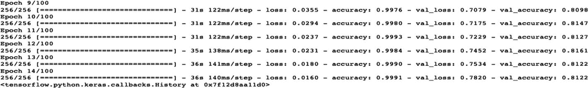

图 4-20 EarlyStopping 之前的训练输出

请注意，在第 `12/13/14` 次迭代时，验证数据集上的准确率分别为 `0.8161/0.8122/0.8122`，表明训练已饱和。在验证数据上测试准确率可以让你了解模型在训练集之外的情况下的泛化能力。

### 检查日志

你现在可以使用以下魔术命令在你的 `Colab` 环境中打开 `TensorBoard`：

```python
%tensorboard --logdir logs
```

图 4-21 中的截图显示了训练和验证数据的准确率和损失图。

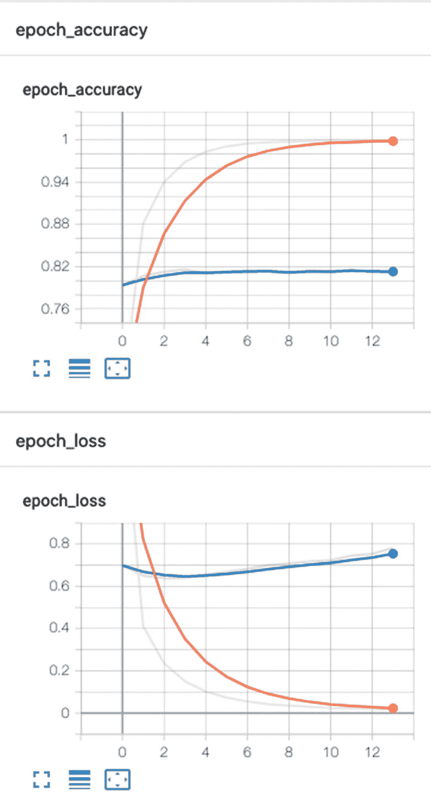

图 4-21 准确率和损失指标

### 评估模型性能

你可以通过调用模型的 `evaluate` 方法来评估其性能。

```python
model.evaluate(val_data)
```

在我的运行中，它显示准确率为 `80.88%`，如图 4-22 所示的输出结果。

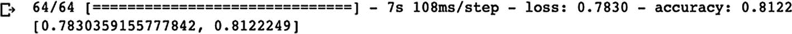

# 模型评估与预测

图 4-22 模型评估输出

现在，你将对测试图像进行预测，以查看模型是否达到令人满意的效果。

## 对测试图像进行预测

下载的数据集在单独的测试文件夹中包含用于测试的图像。你只需设置这些图像的路径，并调用我们的 `create_data_batches` 函数来准备用于处理的数据集。

```python
# 设置测试图像的路径
test_path = "/content/test"
test_filenames = [test_path +'/'+ fname for fname in os.listdir(test_path)]

# 准备测试数据集
test_data = create_data_batches(test_filenames, data_type = 3)
```

你通过在训练好的模型上调用 `predict` 方法来进行预测。

```python
# 进行预测
test_predictions = model.predict(test_data,
verbose=1)
```

当你运行上述代码时，你将得到一个预测数组。你可以通过打印其形状来检查该数组的大小。

```python
test_predictions.shape
```

你将得到输出 `(10357,120)`，表明分析了 10,357 张图像。数组中的每个元素都是另一个包含 120 个元素的数组。每个元素表示具有相应索引值的狗类型的概率。例如，以下代码行将打印测试数据中第一张图像的预测结果：

```python
test_predictions[0]
```

在我的案例中，输出如图 4-23 所示。

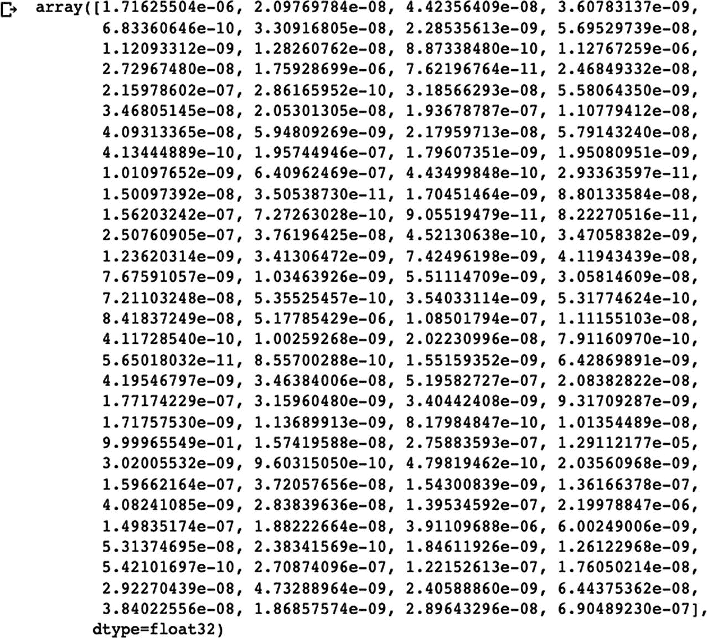

图 4-23 第一张图像的 120 个概率值

你可以使用 `numpy` 的 `argmax` 函数找出最大概率及其对应的索引值。以下代码片段将打印第一张图像的预测结果：

```python
# 模型预测的最大概率值
print(f"最大值: {np.max(predictions[0])}")

# predictions[0] 中最大值所在的索引
print(f"最大索引: {np.argmax(predictions[0])}")

# 预测的标签
print(f"预测标签: {unique_breeds[np.argmax(predictions[0])]}") # 预测的标签
```

当你运行代码时，你将看到以下输出：

```
最大值: 0.9999655485153198
最大索引: 84
预测标签: papillon
```

现在，我将为你提供代码，以便你可以打印狗的图像、预测类别以及前十名预测的分布图。这样你就能更好地可视化和解释测试结果。

## 可视化测试结果

我们将在输出的每一行中创建两个图。第一个图将显示狗的图像及其预测的类别名称。第二个图将是分布条形图。

第一个绘图函数如代码清单 4-5 所示。

```python
def plot_pred(prediction_probabilities, images):
    image = process_image(images)
    pred_label = unique_breeds[np.argmax(prediction_probabilities)]
    plt.imshow(image)
    plt.axis('off')
    plt.title(pred_label)
```

代码清单 4-5 用于绘制图像和预测的函数

函数 `plot_pred` 将预测概率和图像数组作为参数。通过调用 `process_image` 函数获取图像，然后进行绘制。图像的标签从 `unique_breeds` 数组中获取，并作为图标题打印出来。

用于打印概率条形图的函数如代码清单 4-6 所示。

```python
def plot_pred_conf(prediction_probabilities):
    top_10_pred_indexes = prediction_probabilities.argsort()[-10:][::-1]
    top_10_pred_values = prediction_probabilities[top_10_pred_indexes]
    top_10_pred_labels = unique_breeds[top_10_pred_indexes]
    top_plot = plt.bar(np.arange(len(top_10_pred_labels)),
                       top_10_pred_values,
                       color="grey")
    plt.xticks(np.arange(len(top_10_pred_labels)),
               labels=top_10_pred_labels,
               rotation="vertical")
    top_plot[0].set_color("green")
```

代码清单 4-6 用于在给定图像上绘制预测结果的函数

我们通过对预测数组进行排序，然后从排序后的数组中选取最后十个条目，从而获得前十名预测的索引。然后，我们绘制条形图，并将 x 轴标签设置为垂直文本。

现在，你将使用以下代码片段打印前三张图像及其预测结果：

```python
num_rows = 3
plt.figure(figsize = (5 * 2, 5 * num_rows))
for i in range(num_rows):
    plt.subplot(num_rows, 2, 2*i+1)
    plot_pred(prediction_probabilities=predictions[i],
              images=test_filenames[i])
    plt.subplot(num_rows, 2, 2*i+2)
    plot_pred_conf(prediction_probabilities=predictions[i])
    plt.tight_layout(h_pad=1.0)
plt.show()
```

运行此代码的输出如图 4-24 所示。

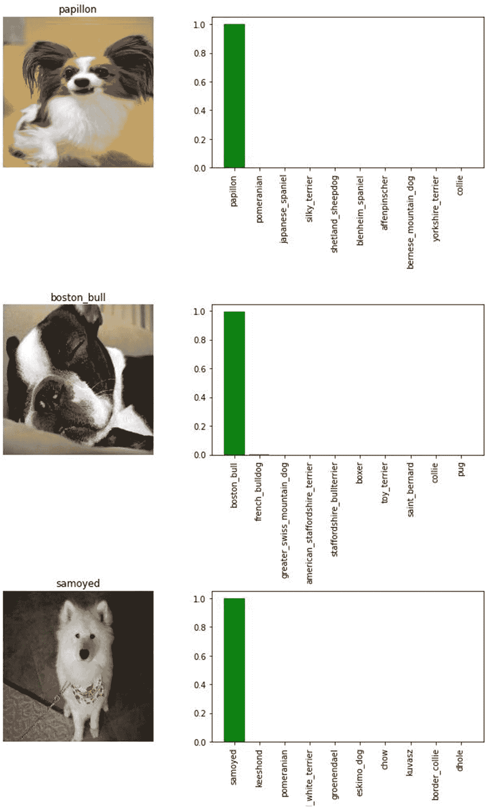

图 4-24 图像和预测概率

在查看了测试数据的结果后，我们现在尝试预测一张未知图像；假设这是一只非狗类的动物。

## 预测未知图像

假设你将图 4-25 中所示的老虎图像输入到我们的网络中，网络会推断出什么？


图 4-25 测试图像

为了测试这一点，首先使用以下代码片段从本书的网站加载图像：

```python
!pip install wget
url='https://raw.githubusercontent.com/Apress/artificial-neural-networks-with-tensorflow-2/main/Ch04/tiger.jpg'
import wget
wget.download(url,'tiger.jpg')
```

然后，通过调用我们的 `create_data_batches` 函数为模型准备图像：

```python
data=create_data_batches(['/content/tiger.jpg'],batch_size=1,data_type=3)
```

现在，使用模型的 `predict` 方法进行预测：

```python
result = model.predict(data)
```

获取预测的类别及其名称：

```python
predict_class_index = np.argmax(result[0],axis=-1)
predict_class_name = unique_breeds[(predict_class_index)]
```

接下来，你可以通过调用模型上的 `predict_proba` 方法获取概率预测：

```python
result_proba = model.predict_proba(data,batch_size=None)
```

然后，你可以检查预测的最大值。如果该值小于某个阈值，你可以断定给定的图像根本不是狗。

```python
if result_proba.max() > 0.7:
    print(pred_label)
else:
    print('不是狗品种，因为预测概率为 {}'.format(result_proba.max()))
```

运行此代码的输出如图 4-26 所示。

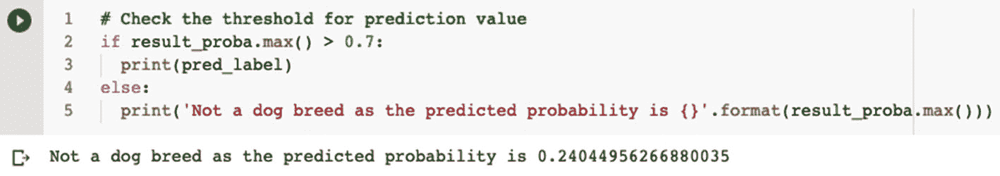

图 4-26 对未见图像的预测结果

现在，你将能够体会到迁移学习的有用性。由于 `MobileNet` 模型是在广泛类别的数据上训练的，我们可以利用其知识推断给定的输入图像不是狗。如果它是狗的图像，它会使用我们的分类层将其品种分类为已知的 120 个类别之一。

我还想向你展示迁移学习的另一个重要用途。那就是我们是否可以使用较小的数据集进行工作。

## 使用较小数据集进行训练

由于在每种情况下收集大量数据点可能很困难，我们将检验迁移学习是否有助于我们利用较小的数据集开发出可用的模型。

你首先需要编写一个名为 `train_model` 的函数，该函数可被一组模型调用。函数定义如下：

```python
model_performances = []

# 用于在指定数量的图像上训练给定模型的函数
def train_model (model, NUM_IMAGES):
    model.fit(x=train_data,
              epochs=NUM_EPOCHS,
              validation_data=val_data,
              callbacks=[model_tensorboard,
                         model_early_stopping])

    # 追加结果
    model_performances.append(model.evaluate(val_data))
```

`train_model` 函数接受两个参数：`model` 参数指定要训练的模型，`NUM_IMAGES` 指定用于训练模型的图像数量。该函数简单地调用模型的 `fit` 方法进行训练，然后通过调用其 `evaluate` 方法来评估性能。评估结果会被添加到一个数组中，以便后续进行比较。

该函数本身通过以下代码片段进行调用：

```python
# 训练
NUM_EPOCHS = 100
# 创建模型并测试 1000、2000、3000、4000 张图像
for NUM_IMAGES in range(1000, 5000, 1000):
    model = create_model()
    x_train,x_val,y_train,y_val=train_test_split(X[:NUM_IMAGES],y[:NUM_IMAGES],test_size=0.2,random_state=10)
    train_data=create_data_batches(x_train,y_train,batch_size=10)
    val_data=create_data_batches(x_val,y_val,batch_size=10,data_type=2)
    train_model(model,NUM_IMAGES)
    model_performances.append(model.evaluate(val_data))
```

在调用 `train_model` 之前，我们通过调用 `create_model` 函数来创建一个模型。我们针对指定数量的图像，将训练数据集分割为训练集和验证集。我们像之前一样预处理数据，然后在处理后的数据上训练所创建的模型。请记住，训练结束后，评估结果会存储在一个数组中。现在，你将创建一个用于存储损失和准确率指标的 `pandas` 数据框：

```python
import pandas as pd
comp = pd.DataFrame(model_performances,index = [1000,2000,3000,4000], columns = ['val_loss', 'val_acc'])
```

你可以使用以下代码绘制结果以进行可视化：

```python
# 绘制表格
import matplotlib.pyplot as plt
plt.style.use('ggplot')
comp.plot.bar()
plt.xlabel('图像数量')
plt.ylabel('性能值')
plt.show()
```

输出图如图 4-27 所示。

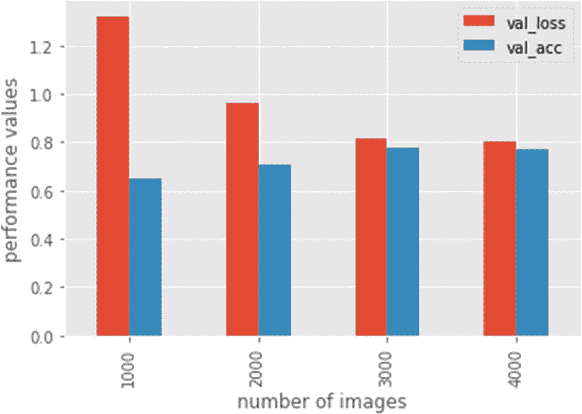

图 4-27 不同大小数据集上的误差指标

从这些图中可以看出，准确率得分在大约 2000 张图像后趋于饱和。因此，与其在包含 10000 张图像的完整数据集上训练模型，不如在更小的数据集上训练，同时仍能获得可接受的结果。这将是迁移学习的一大优势，尤其是在你没有足够的数据点可用于训练时。

现在，既然你已经完成了用于狗品种分类的新模型的创建，你可能会想将其投入实际使用。为此，我将向你展示如何保存训练好的模型，并在之后重新使用它来推断未见过的图像。

## 保存/重新加载模型

要以 h5 格式保存训练好的模型，请调用其 `save` 方法：

```python
model.save('model.h5') # 保存模型
```

要加载保存的模型，请使用 `load_model` 方法。

```python
from tensorflow.keras.models import load_model
model=load_model('model.h5',custom_objects={"KerasLayer":hub.KerasLayer})
```

你可以检查模型的摘要，以确保模型已正确加载：

```python
model.summary()
```

你将看到如图 4-28 所示的输出。

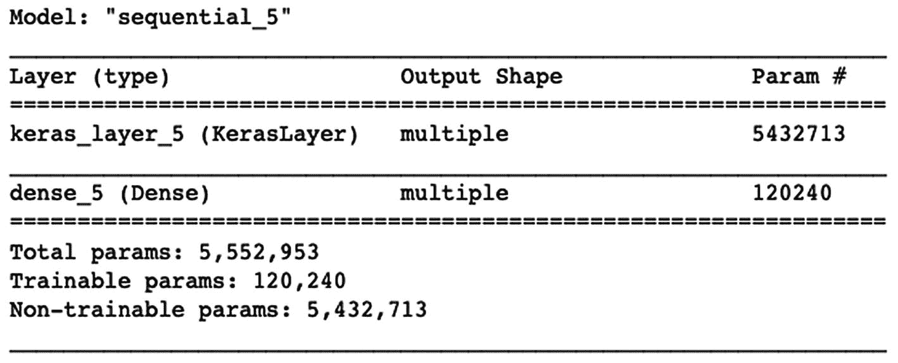

图 4-28 已加载模型的摘要

现在，你可以像我们对未知图像所做的那样，自由地使用加载的模型进行进一步的推断。尽情享受吧！

## 提交你的作品

你难道不为到目前为止所学到的知识感到兴奋吗？TensorFlow 允许你提交自己的创作，以便纳入 tfhub 仓库。`tensorflow_hub` 库用于从该仓库加载模型。基于 HTTP 的协议支持检索模型的文档，并提供获取模型本身的端点。要从仓库加载模型，你可以使用 `load_model` 方法，就像你在本章示例中看到的那样。你可以创建自己的模型仓库，这些模型可通过 `tensorflow_hub` 库加载。为此，你的 HTTP 分发服务需要遵循特定的协议。

当你的模型完全训练到令你满意的程度后，你将使用以下代码保存计算图和参数值：

```python
saver = tf.train.saver()
saver.save (sess, ‘my_model’)
```

然后，可以将保存的模型部署到生产服务器上，供公众使用。经过 Beta 测试后，你可以将其添加到仓库中，通过 tfhub 库造福社区。有关此规范的更多细节超出了本书的范围。感兴趣的读者可以参考 TensorFlow 网站上“托管你自己的模型”下的更多信息。

## 进一步工作

我已经向你展示了一个图像分类的示例，该示例使用了 TensorFlow Hub 中的预训练模型。如前所述，Hub 也提供其他领域的模型。例如，你可以轻松开发自己的目标检测分类器、文本分类器、通用句子编码器等。建议你访问 TensorFlow Hub 网站，探索这些预训练模型。

TensorFlow 网站上列出了几个商业部署的案例研究。举个例子，Airbnb 通过重新训练 `ResNet50` 模型对其图像进行分类，以改善客户体验。有人使用 `TensorFlow.js` 让 Amazon Echo 响应手语，以造福残障人士。可口可乐在其移动购买凭证应用程序中使用了 `SqueezeNet` `CNN` 进行 OCR。谷歌 Pixel 手机使用 `TF Hub` 的 `MobileNet` 模块进行相机图像识别，并增强其相机功能。在你的应用程序中使用迁移学习有无限的可能性。因此，请不断尝试 TensorFlow Hub 中提供的预训练模型，并运用你的智慧将它们应用到自己的应用程序中。

## 总结

迁移学习是机器学习中一种重要的知识迁移技术。在软件工程中，人们使用二进制库来重用代码。在机器学习中，训练好的模型包含算法、数据、处理能力以及专家的领域知识。所有这些都需要迁移到新模型中。这正是迁移学习所提供的。在 TensorFlow Hub 中，有多个跨领域和由不同开发者提供的预训练模型。在本章中，你首先学习了如何重用其中一个模型来对你自己的图像进行分类。在后续部分，你开发了一个多类图像分类器，该分类器运行在谷歌预训练的模型之上，利用了他们的专业知识、处理时间和处理能力。Hub 中还有其他几个模型可供你探索。

在下一章中，你将通过一个回归模型开发的示例来学习机器学习的复杂性。