# 5. 用于回归的神经网络

到目前为止，我们研究了深度学习中的分类模型。我们能否将目前所学的深度学习技术应用于回归问题——这个在数据分析中可能被认为是最简单的问题？考虑到深度学习的开销，在回归领域尝试使用深度学习是否值得？与传统的统计技术相比，尤其是在回归建模方面，使用深度学习是否有优势？你将在本章中找到这些及相关问题的答案。

你已经知道，简单的线性回归是机器学习中最简单的事情，而且很多时候这是机器学习中教授的第一个主题。统计回归模型已经存在多年，并在许多实际应用中提供了有用的预测。这些模型同样被用于工业、商业和科学环境中。与此同时，我们在这本书中学到的深度学习网络已被证明成功解决了世界上最复杂的问题。它们提供了非常准确的预测，模拟了我们大脑的学习过程。现在，问题是我们能否使用深度学习网络来运行一个回归问题？而且，与使用传统统计编码技术运行回归相比，我们能否获得任何优势？对这个问题的简短回答是：完全可以。要理解为什么以及如何做到，请继续阅读！

让我先定义什么是回归。

## 回归

我将从回归的定义开始，接着介绍它在现实世界中的应用。然后，我将向你解释回归的统计建模，以及各种回归类型。

### 定义

在统计建模中，回归分析是一组统计过程。这些过程试图建立一个因变量（目标）和一个自变量（特征）之间的关系。因变量也被称为结果变量，自变量有时被称为预测变量或协变量。在简单情况下，只存在一个单一的预测变量，而在更复杂的数据分布中，会有多个协变量。回归的最简单形式是线性回归，分析者在此找到预测变量和结果之间的直线关系。但在许多实际情况下，这种关系不能用一条直线来表示。这种关系可能是一组直线，从而形成某种多项式。在复杂数据集中确定超平面是数据分析师面临的一大挑战。存在几种类型的回归，例如线性、逻辑、逐步回归等。估计关系的类型并编写相应的代码对开发者来说并非易事。

那么，你在哪里应用回归建模呢？

### 应用

回归分析主要用于解决以下领域的问题：

- 预测和预报
- 推断因果关系

估算房屋价格是大多数线性回归模型的预测能力。一个多变量模型可以预测给定股票的未来价格。因果关系是为了回答这样的问题——什么事件导致了另一个事件，或者什么带来了某种变化？网站流量激增的原因是什么，装配线故障的原因是什么，某种药物是否改善了某些医疗状况——这些都是建立因果关系的例子。为了处理这些应用领域，数据分析师必须首先调查一个关系是否具有预测能力。为什么两个变量之间的关系具有或不具有因果解释？用现代术语来说，回答这些问题对统计学家或数据分析师来说并非易事。神经网络将帮助你回答这些问题，这正是我将在本章中向你展示的内容。

### 回归问题

在回归问题中，我们根据一组连续值的输入来预测一个因变量的值或概率。与你之前研究的分类模型相比，分类问题是从预定义的类别列表中选择一个类别。例如，在第 4 章中，你做了一个狗品种分类器，其中输入图像被推断为 120 个预定义品种集合中的一个类别。

在回归分析中，你对一个因变量和一个或多个自变量之间的关系进行建模。这种关系可以用一个简单的数学方程表示：

```
γ = β₁X₁ + β₂X₂ + β₃X₃ + ... + βₖXₖ + ε
```

其中 `γ` 是你试图预测的因变量，而 `X₁`、`X₂`、…、`Xₖ` 是自变量。`β₁`、`β₂` … `βₖ` 是神经网络中的系数或权重，`ε` 是误差或偏差，在机器学习术语中如此称呼。现在，让我们看看回归的类型。

### 回归类型

回归分析可以分为以下几类：

- 线性
- 多项式
- 逻辑
- 逐步
- 岭
- 套索
- 弹性网络

当因变量和自变量之间存在线性关系（一条直线）时，线性回归适用。在多项式回归的情况下，因变量最适合用多项式拟合，即一条曲线或一系列曲线。在此类模型中，异常值可能会扭曲预测，因此容易受到机器学习术语中所谓的过拟合的影响。在逻辑回归的情况下，预测值是二元的，并且严格遵循二项分布。当你拥有大量自变量（即高维度）时，你可以使用逐步回归来检测哪些变量是显著的，并剔除不显著的变量，以最大化模型的预测能力。当自变量高度相关（也称为多重共线性）时，它们会使方差变得足够大，从而导致预测值出现较大偏差。岭回归技术向回归估计中添加一个偏差项，以惩罚系数或权重值。它使用最小二乘法来收缩系数，确保它们不会达到零。这是一种正则化形式——L2 正则化。套索正则化类似于岭回归，并通过收缩回归系数以相同的方式帮助解决多重共线性问题。然而，现在收缩的是绝对值，而不是最小二乘值。这也意味着某些权重可以收缩到零，从而完全消除该特定节点的输出。这在特征选择中很有用，因为它本质上是从一组因变量中挑选出一个。这也是一种正则化类型——L1 正则化。最后，弹性网络是岭回归和套索回归的结合。该模型依次使用 L1 和 L2 正则化进行训练，从而在这两种技术之间取得平衡。因此，弹性网络可能会选择多个相关的变量。

所有这些是否让你完全困惑了？不仅要理解统计技术，还要考虑各种类型的回归，你可以很容易地想象到编码它们所涉及的复杂性。深度学习技术能否拯救你？继续阅读！

## 神经网络中的回归

为了向你证明神经网络确实可以用于解决哪怕是最简单的回归问题，我将用一个简单的例子来演示。在我们的程序中，将使用来自 Kaggle 竞赛的一个数据集进行简单线性回归。你可以从这里（`www.kaggle.com/luddarell/101-simple-linear-regressioncsv`）下载该数据集。数据仅包含两列——`GPA` 和 `SAT`。`GPA` 列代表学生的平均绩点，`SAT` 列代表学生的 `SAT`（学术能力评估测试）分数。我们将开发一个线性回归模型，以建立学生 `GPA` 与 `SAT` 分数之间的关系。模型训练完成后，我们将用它来预测给定 `GPA` 的学生在 `SAT` 考试中可能获得的分数。

### 项目设置

创建一个新的 Colab 项目，并将其命名为 `LinearRegression`。在项目代码中添加以下导入：

```python
import tensorflow as tf
from tensorflow import keras
import pandas as pd
```

数据文件可在本书的网站上获取。要在你的项目中下载该文件，我们将使用 `wget`。添加以下代码来安装 `wget`：

```python
!pip install wget
import wget
```

现在，使用以下代码下载文件：

```python
url = 'https://raw.githubusercontent.com/Apress/artificial-neural-networks-with-tensorflow-2/main/Ch05/student.csv'
wget.download(url,'data.csv')
```

下载的文件将存储在 `/content/` 文件夹中，文件名为 `data.csv`。你可以通过先将文件加载到 pandas 数据框中，然后使用以下代码打印前几条记录来检查其内容：

```python
import pandas as pd
df=pd.read_csv('/content/data.csv')
df.head(10)
```

你将看到如图 5-1 所示的输出。

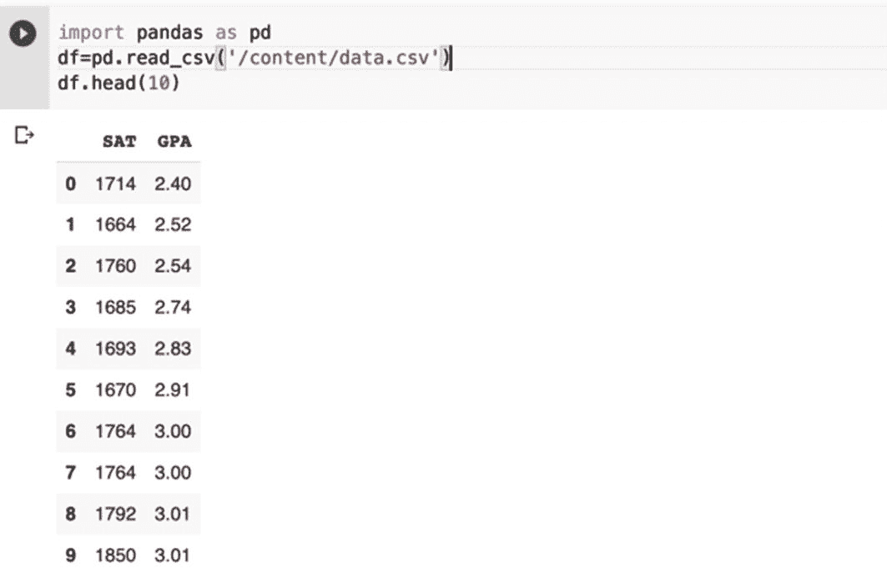

接下来，你将从此数据集中提取特征和标签。

### 提取特征和标签

该数据集仅包含两列——`GPA` 和 `SAT`。我们将使用 `GPA` 作为特征，`SAT` 作为标签。请注意，我们试图根据学生的 `GPA` 来预测其 `SAT` 分数。要提取特征和标签，请使用以下代码：

```python
### 提取特征和标签
dataset = df.values
x = dataset[:,1]
y = dataset[:,0]
```

为了使这个程序足够简单，我不会创建训练集和验证集。此外，我们也不会保留任何数据进行测试。接下来，我们定义模型。

### 定义/训练模型

为了定义模型，我们像之前一样使用 `Sequential` API：

```python
model = tf.keras.Sequential([tf.keras.layers.Dense
(units=1, input_shape=[1])])
```

我们的网络模型仅包含一个单层，该层只有一个神经元。该模型的输入是一个一维张量。接下来，我们编译模型：

```python
model.compile(optimizer = 'sgd',
loss = 'mean_squared_error')
```

我们使用随机梯度下降作为优化器，均方误差作为损失函数。

模型使用通常的 `fit` 方法进行训练：

```python
model.fit(X, y, epochs = 15)
```

请注意，在这个简单的例子中，我没有捕获用于评估模型性能的误差指标。

### 预测

现在，模型已经训练完成，我们可以进行一些预测了。假设你想知道一个 `GPA` 为 `5.0` 的学生在 `SAT` 中能得多少分。你可以使用模型的 `predict` 方法并打印其结果，如下所示：

```python
result = model.predict([5.0])
print("Expected SAT score for GPA 5.0: {:.0f}"
.format(result[0][0]))
```

要找出一个 `GPA` 为 `3.2` 的学生在 `SAT` 中能得多少分，你可以使用以下代码：

```python
result = model.predict([3.2])
print("Expected SAT score for GPA 3.2: {:.0f}"
.format(result[0][0]))
```

请注意，我们没有费心去验证这些预测的准确性。但这向我们证明了一点：神经网络可以用来为即使是最简单的线性回归问题创建机器学习模型。

接下来，我将讨论回归分析中一个更实际的问题——多重共线性。

## 葡萄酒质量分析

在这个项目中，你将使用回归分析，根据某些特征来确定葡萄酒的质量。你将使用 UCI 机器学习库中提供的白葡萄酒质量数据集。该模型的目标是根据给定的输入特征集来预测葡萄酒质量。该数据集提供了以下基于理化测试的输入特征。

特征列表：

1.  固定酸度
2.  挥发性酸度
3.  柠檬酸
4.  残糖
5.  氯化物
6.  游离二氧化硫
7.  总二氧化硫
8.  密度
9.  `pH` 值
10. 硫酸盐
11. 酒精

数据库中的质量字段将用作标签。质量值范围在 0 到 10 之间。

```
输出标签：
质量
```

### 创建项目

创建一个新的 Colab 项目，并将其重命名为 `WineQuality`。使用以下代码加载 TensorFlow 2.x 并导入所需的库：

```python
import tensorflow as tf
import pandas as pd
import requests
import io
import matplotlib.pyplot as plt
```

### 数据准备

白葡萄酒质量数据集可在 UCI 网站上获取。

### 下载数据

我们将在代码中声明一个变量来引用 UCI 机器学习库：

`https://raw.githubusercontent.com/Apress/artificial-neural-networks-with-tensorflow-2/main/Ch05/winequality-white.csv`

### 准备数据集

你将使用 `pandas` 库将 CSV 文件读入数据框。

```python
dataset = pd.read_csv(url , sep = ';')
```

你可以通过调用数据框的 `head` 或 `tail` 方法来显示其中的几条记录。调用 `tail` 的结果如图 5-2 所示。

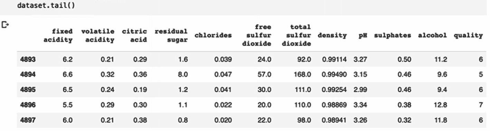

从图 5-2 可以看出，数据库中有 4897 条记录。每条记录包含 12 个字段；最后一个字段是质量，我们将把它用作标签。我们使用以下两条语句提取特征和标签：

```python
x = dataset.drop('quality', axis = 1)
y = dataset['quality']
```

接下来，你将创建数据集。

### 创建数据集

对于机器学习，你需要训练数据集和测试数据集。训练数据集进一步划分为训练集和验证集。为了创建这些数据集，我们使用 `sklearn` 的 `train_test_split` 方法，如下所示：

```python
#### 创建训练集、验证集和测试集
from sklearn.model_selection import train_test_split
x_train_1 , x_test , y_train_1 , y_test =
train_test_split
(x , y , test_size = 0.15 , random_state = 0)
x_train , x_val , y_train , y_val =
train_test_split(x_train_1 , y_train_1 ,
test_size = 0.05 , random_state = 0)
```

请注意，15% 的数据被保留用于测试。训练数据按 95:5 的比例分割——95% 用于训练，5% 用于验证。

通常，不同字段的数据在数值上表现出很大的差异。如果将这些数据项缩放到一个固定的尺度，神经网络将学习得更好。因此，我们需要对整个数据进行预处理。这种预处理主要包括通过标准化或 Z-score 归一化进行特征缩放。你需要重新缩放特征值，使其具有均值为零、标准差为一的标准正态分布。如图 5-3 所示。

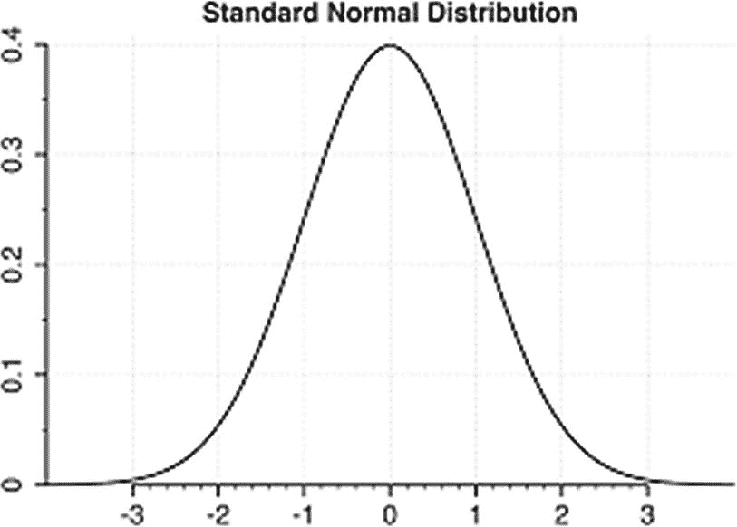

我们现在开始缩放数据，以便理想地达到图 5-3 中所示的分布曲线。

### 缩放数据

为了缩放我们的输入数据，或者更准确地说，为了使其居中，你需要减去均值，然后将结果除以标准差：

```
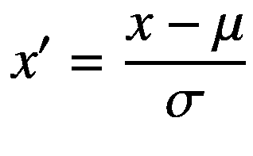
```

其中 `μ` 是均值，`σ` 是标准差。

你首先对训练集进行变换。为此，我们使用 `sklearn` 的 `StandardScaler` 类，并调用其 `fit_transform` 方法。以下代码执行此变换：

```python
from sklearn.preprocessing import StandardScaler
sc_x = StandardScaler()
x_train_new = sc_x.fit_transform(x_train)
```

你可以通过绘制变换前后的原始数据来检查此变换的效果。以下代码为 `fixed_acidity` 字段生成了这两个图：

```python
fig, (ax1, ax2) = plt.subplots
(ncols = 2, figsize = (20, 10))
ax1.scatter(x_train.index,
x_train['fixed acidity'],
color = c,
label = 'raw',
alpha = 0.4,
marker = m
)
ax2.scatter(x_train.index,
x_train_new[: , 1],
color = c,
label = 'adjusted',
alpha = 0.4,
marker = m
)
ax1.set_title('Training dataset')
ax2.set_title('Standardized training dataset')
for ax in (ax1, ax2):
ax.set_xlabel('index')
ax.set_ylabel('fixed acidity')
ax.legend(loc ='upper right')
ax.grid()
plt.tight_layout()
plt.show()
```

输出如图 5-4 所示。

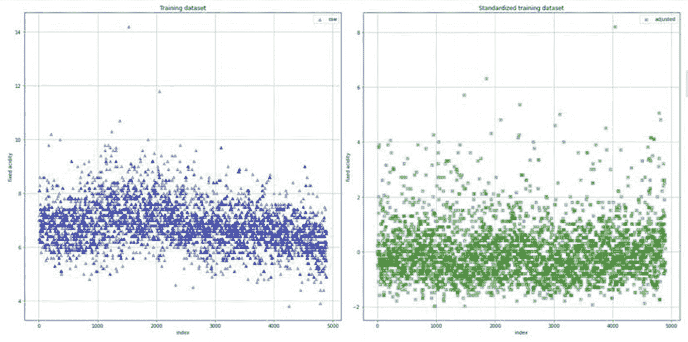

左侧的图显示的是原始数据，你可以看到 `fixed acidity` 字段的值范围大约从 0 到 14，均值在 7 左右。右侧的图显示的是变换后的相同数据。请注意，均值约为 0，数据变化范围在 –2 到 +2 之间，表明标准差为 +/-1。如果你检查其他字段的图，你会再次注意到均值被拉到了零，并且在零的两侧有大致均匀的分布，其范围等于标准差。

你可以再尝试绘制一个图——这次将 `total sulfur dioxide` 放在 y 轴上，将 `residual sugar` 放在 x 轴上。以下代码生成这些图：

## 模型构建

在构建模型之前，我将编写一个小函数来可视化训练结果，该函数可用于我们将要训练的多个模型。

### 指标可视化函数

我打算使用 `matplotlib` 来绘制分析指标，而不是用 TensorBoard 进行分析。我将定义一个函数，在每次新模型试验后重复调用。如果你决定改用 TensorBoard，请记住，每次绘图和模型运行后，你可能需要重置其状态或提供一个单独的日志文件夹。因此，使用绘图函数可能更方便。

完整的绘图函数如代码清单 5-1 所示。和之前一样，该函数无需额外注释，其含义一目了然。

```python
import matplotlib.pyplot as plt
epoch = 30
def plot_learningCurve(history):

#### 绘制训练集和验证集的准确率曲线
epoch_range = range(1, epoch+1)

#### 绘制训练集的 mae 随 epoch 变化的曲线
plt.plot(epoch_range, history.history['mae'])

#### 绘制验证集的 val_mae 随 epoch 变化的曲线
plt.plot(epoch_range, history.history['val_mae'])
plt.ylim([0, 2])
plt.title('Model mae')
plt.ylabel('mae')
plt.xlabel('Epoch')
plt.legend(['Train', 'Val'], loc = 'upper right')
plt.show()
print("--------------------------------
------------------------")

#### 绘制训练集和验证集的损失值曲线
plt.plot(epoch_range, history.history['loss'])
plt.plot(epoch_range, history.history['val_loss'])
plt.ylim([0, 4])
plt.title('Model loss')
plt.ylabel('Loss')
plt.xlabel('Epoch')
plt.legend(['Train', 'Val'], loc = 'upper right')
plt.show()
```

代码清单 5-1 指标可视化函数

现在，我们将开始构建模型。你将创建三个复杂度递增的模型。定义模型后，你将对其进行训练，并在测试数据上评估其性能。我们将使用相同的测试数据来评估在本练习中构建的各种模型的性能。在案例研究中，我们将尝试为大型模型使用不同的优化器。我会向你展示过拟合何时发生以及如何检测它。然后，我会给你一些关于如何缓解过拟合的提示。

那么，让我们从小模型开始实验。

### 小模型

在小模型中，我们将构建一个只有一个隐藏层的模型。

#### 定义

模型的输入是一个包含 11 个输入特征的张量，输出是一个给出葡萄酒质量的单层。我们将在隐藏层中设置 16 个神经元，每个神经元都使用 ReLU 激活函数。模型通过以下语句定义：

```python
small_model = tf.keras.Sequential([
tf.keras.layers.Dense(16 ,
activation = 'relu' ,
input_shape = (11 , )),
tf.keras.layers.Dense(1)
])
```

我们将使用 Adam 优化器和 `mean_squared_error`（`mse`）作为损失函数。我们将使用平均绝对误差（`mae`）进行分析。模型通过以下语句编译：

```python
small_model.compile(optimizer = 'adam' ,
loss = 'mse' ,
metrics = ['mae'])
```

#### 训练

我们通过调用模型的 `fit` 方法来训练它。训练时我们使用批次大小为 32。请注意，我们的数据集中有 4000 多条记录。因此，在训练过程中有足够的空间创建足够数量的批次。以下语句执行训练并将结果捕获到 `history_small` 变量中：

```python
history_small = small_model.fit
(x_train_new, y_train ,
batch_size = 32,
epochs = 30,verbose = 1 ,
validation_data =
(x_val_new , y_val))
```

#### 评估

训练结束后，我们通过调用之前定义的绘图函数来绘制评估指标：

```python
plot_learningCurve(history_small)
```

输出如图 5-6 所示。

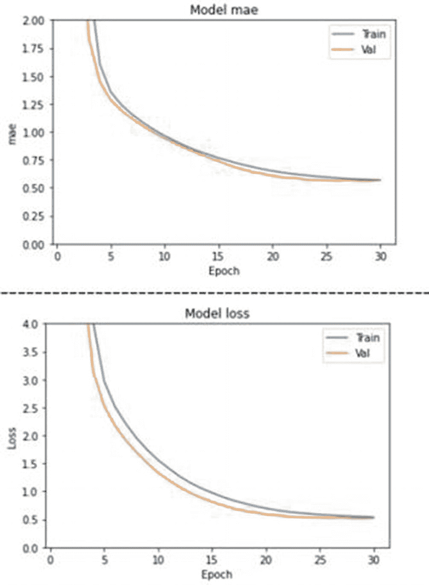 图 5-6 小模型评估指标

你可以通过调用模型的 `evaluate` 方法，在之前创建的测试数据上评估其性能。方法调用及其输出如下所示：

```python
s_test_loss , s_test_mae = small_model.evaluate
(x_test_new , y_test ,
batch_size = 32 , verbose = 1)
print("small model test_loss : {}"
.format(s_test_loss))
print("small model test_mae : {} "
.format(s_test_mae))
```

```
small model test_loss : 0.6353380084037781
small model test_mae : 0.6149751543998718
```

#### 在未见数据上评估

为了评估模型在未见数据上的性能，我们需要创建这样一个数据项。为此，我从测试数据中选取了 ID 为 2125 的数据点。我移除了其中的标签（葡萄酒质量），并使用以下声明创建了未见数据：

```python
unseen_data = np.array([[6.0 , 0.28 , 0.22 , 12.15 ,
0.048 , 42.0 , 163.0 ,
0.99570 , 3.20 , 0.46 ,
10.1]])
```

然后，你可以对该测试数据进行预测并打印结果，如下所示：

```python
y_small = small_model.predict
(sc_x.transform(unseen_data))
print ("Wine quality on unseen data
(small model): ", y_small[0][0])
```

```
Wine quality on unseen data (small model):  5.618517
```

预测的葡萄酒质量为 5.62，这与训练数据集中 ID 为 2125 的数据项的实际标签值 5.0 接近。

现在，我们将继续构建一个更复杂的模型。

### 中等模型

在这个模型中，我们将隐藏层的数量从 1 层增加到 3 层。我们还将每个隐藏层中的神经元数量增加到 64 个。我们将继续使用之前使用的 Adam 优化器和 `mse` 作为损失函数。我们将使用 `mae` 作为评估指标。

#### 模型定义/训练

以下代码定义了模型、编译了模型并对其进行了训练：

```python
medium_model = tf.keras.Sequential([
tf.keras.layers.Dense
(64 , activation = 'relu' ,
input_shape = (11, )),
tf.keras.layers.Dense
(64 , activation = 'relu'),
tf.keras.layers.Dense
(64 , activation = 'relu'),
tf.keras.layers.Dense(1)
])
medium_model.compile(loss = 'mse' ,
optimizer = 'adam' ,
metrics = ['mae'])
history_medium = medium_model.fit
(x_train_new , y_train ,
batch_size = 32,
epochs = 30, verbose = 1 ,
validation_data =
(x_val_new , y_val))
```

在 `medium_model` 的定义中，我们简单地添加了两个 `Dense` 层，使其总共包含三个隐藏层，每层由 64 个神经元组成。和之前一样，每个神经元都通过 ReLU 函数激活。添加这些层的目的是检查为网络增加更多层是否有助于获得更好的准确率。那么，让我们通过检查评估结果来测试一下。

#### 模型评估

与之前的情况类似，我们通过调用绘图函数来绘制评估指标。

```python
plot_learningCurve(history_medium)
```

该图如图 5-7 所示。

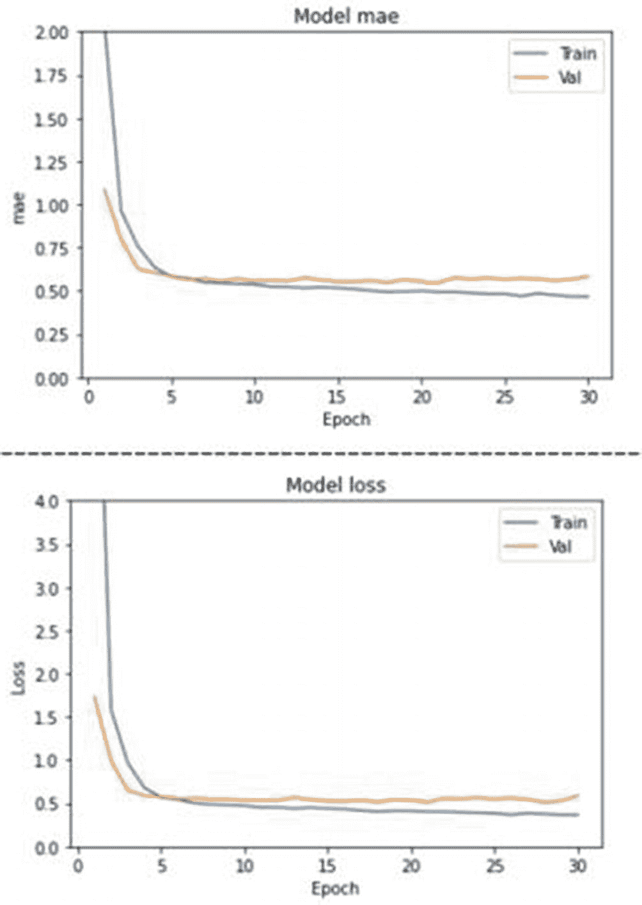 图 5-7 中等模型误差指标

从图 5-7 中可以看出，训练在大约五个周期后趋于饱和。将此与小型模型的情况进行对比，在小型模型中，直到大约 20 个周期才出现饱和。在 `medium_model` 中，我们还观察到一些过拟合。如果你看到每个图中两条曲线出现分歧，那就是过拟合的情况。

现在，让我们评估模型在测试数据上的性能：

```python
m_test_loss , m_test_mae = medium_model.evaluate
(x_test_new , y_test ,
batch_size = 32 , verbose = 1 )
print("medium model test_loss : {}".format
(m_test_loss))
print("medium model test_mae : {}".format
(m_test_mae))
```

你将看到以下输出：

```
medium model test_loss : 0.6351445317268372
medium model test_mae : 0.6231803894042969
```

与小型模型相比，`test_loss` 和 `test_mae` 的值都有所降低。最后，让我们检查在未见数据上的评估结果：

```python
y_medium = medium_model.predict
(sc_x.transform(unseen_data))
print ("Wine quality on unseen data
(medium model): ", y_medium[0][0])
```

```
Wine quality on unseen data (medium model):  5.246436
```

现在预测的葡萄酒质量为 5.25，更接近实际值 5.0，并且明显低于 `small_model` 预测的 5.62。

现在，让我们继续使用一个更复杂的模型。

### 大型模型

现在，我们将向中等模型再添加两个隐藏层，使其总共拥有四个隐藏层。我们还将每层的神经元数量增加到 128。请注意，增加层数和神经元数量会增加需要调整的参数数量。我们再次继续使用 `Adam`、`mse` 和 `mae`。

#### 模型定义/训练

在模型定义和训练的代码中，除了增加两个额外的层和神经元数量外，没有太多变化。以下代码段给出了模型定义及其训练：

```python
large_model = tf.keras.Sequential([
tf.keras.layers.Dense
(128 , activation = 'relu' ,
input_shape = (11, )),
tf.keras.layers.Dense
(128 , activation = 'relu'),
tf.keras.layers.Dense
(128 , activation = 'relu'),
tf.keras.layers.Dense
(128 , activation = 'relu'),
tf.keras.layers.Dense(1)
])
large_model.compile
(loss = 'mse' , optimizer = 'adam' ,
metrics = ['mae'])
history_large = large_model.fit
(x_train_new , y_train ,
batch_size = 32, epochs = 30,
verbose = 1 , validation_data =
(x_val_new , y_val))
```

现在，让我们看看模型的性能评估。

#### 模型评估

误差指标的图如图 5-8 所示，该图是通过调用我们的 `plot_learningCurve` 方法生成的：

```python
plot_learningCurve(history_large)
```

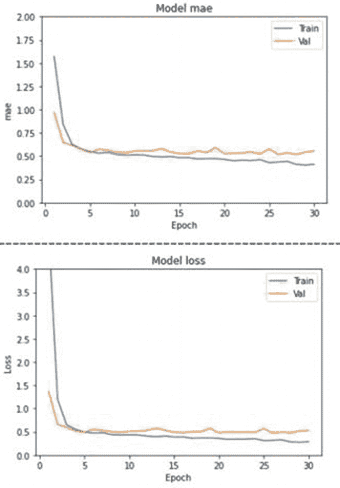 图 5-8 大型模型误差指标

从图 5-8 中，你可以观察到饱和在更早的时候（大约三个周期后）就达到了。你还会注意到，这是一个更严重的过拟合情况。我将在后续章节中向你展示克服这种过拟合的技术。现在，让我们看看在测试数据上的评估结果，如下所示：

```python
l_test_loss , l_test_mae = large_model.evaluate
(x_test_new , y_test ,
batch_size = 32 , verbose = 1)
print("large model test_loss : {}"
.format(l_test_loss))
print("large model test_mae : {}"
.format(l_test_mae))
```

```
large model test_loss : 0.5520739555358887
large model test_mae : 0.5552783012390137
```

现在损失为 0.57，`mae` 也是 0.57。稍后我会提供一个表格来比较这三个模型的结果。现在，让我们检查在未见数据上的结果。

```python
y_large = large_model.predict(sc_x.transform
(np.array([[6.0 , 0.28 , 0.22 , 12.15 ,
0.048 , 42.0 , 163.0 ,
0.99570 , 3.20 , 0.46 ,
10.1]])))
print ("Wine quality on unseen data (large model): ",
y_large[0][0])
```

```
Wine quality on unseen data (large model):  5.389405
```

# 解决过拟合

在我向你展示一些解决过拟合的技术之前，让我先讨论一下什么是过拟合，以及与此相关的什么是良好拟合和什么是欠拟合。

## 什么是过拟合？

图 5-9 中的图表直观地向你展示了过拟合、良好拟合和欠拟合之间的区别。

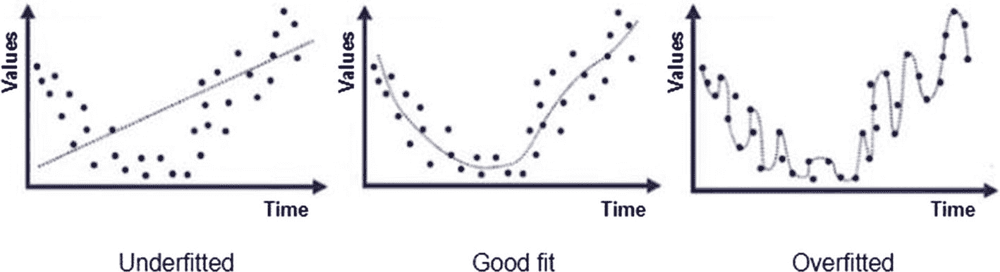
**图 5-9** 模型拟合的各种模式

通常，当模型在训练期间使用的数据上准确率很高，但在新数据上准确率显著下降时，就会发生过拟合。换句话说，模型很好地学习了训练数据，但无法泛化其推理。正如你从图 5-9 中看到的，如果曲线不平衡，就有可能发生过拟合。减少过拟合的技术之一是添加 `dropout` 层。

那么，让我们尝试一下。

## 添加 Dropout 层

在大型模型中，可以非常清楚地观察到过拟合。让我们尝试向该模型添加 `dropout` 层，以检查它是否能减少过拟合。添加了 `dropout` 层的新模型如下代码片段所示：

```python
large_model_overfit = tf.keras.Sequential([
tf.keras.layers.Dense
(128 , activation = 'relu' ,
input_shape = (11, )),
tf.keras.layers.Dropout(0.4),
tf.keras.layers.Dense
(128 , activation = 'relu'),
tf.keras.layers.Dropout(0.3),
tf.keras.layers.Dense
(128 , activation = 'relu'),
tf.keras.layers.Dropout(0.2),
tf.keras.layers.Dense
(128 , activation = 'relu'),
tf.keras.layers.Dense(1)
])
large_model_overfit.compile(loss = 'mse' ,
optimizer = 'adam' , metrics = ['mae'])
history_large_overfit = large_model_overfit.fit
(x_train_new , y_train , batch_size = 32,
epochs = 30,verbose = 0 , validation_data =
(x_val_new , y_val))
plot_learningCurve(history_large_overfit)
```

我们在前三个隐藏的 `Dense` 层之后添加了 40%、30% 和 20% 的 `dropout`。其余代码与我们测试大型模型时相同。现在，让我们看看该模型生成的误差指标。图 5-10 给出了两个网络的误差指标图——左侧是没有 `dropout` 层的网络，右侧是带有 `dropout` 层的网络。

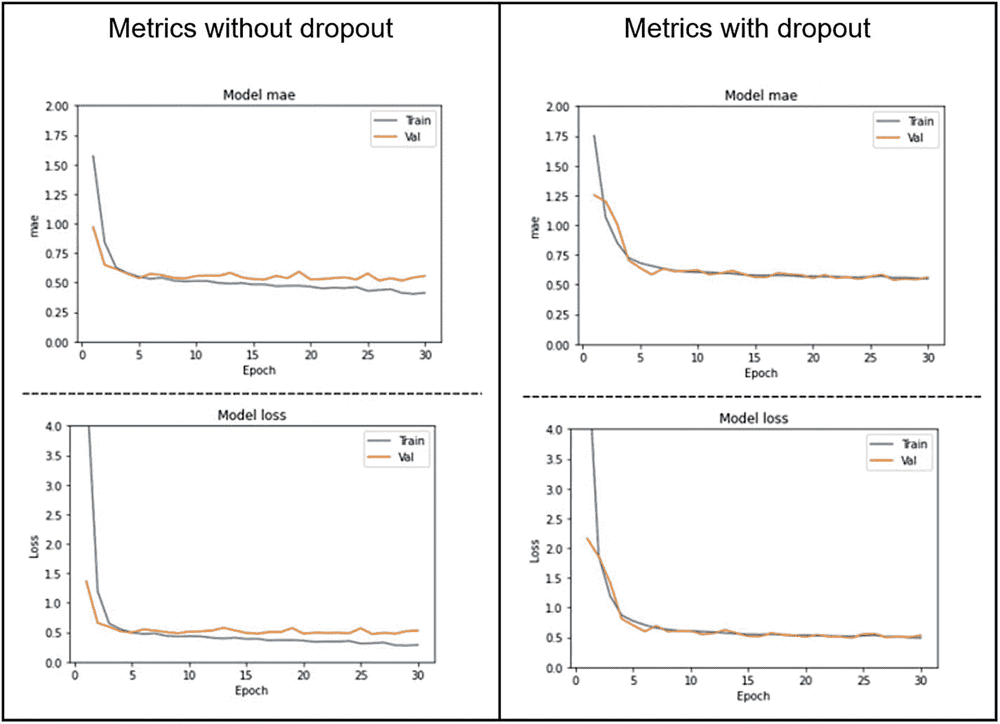
**图 5-10** 在大型模型中添加 `dropout` 的效果

从图 5-10 中可以清楚地看到，添加 `dropout` 层可以消除或至少减少过拟合。

`dropout` 层通常添加到大型网络中，因为它们的每一层都有足够数量的神经元，你可以从中舍弃掉一部分的输出。

## 使用 RMSprop 优化

小型模型没有表现出任何过拟合。我们仍然可以通过使用 `RMSprop` 优化器来优化其训练，这正是我现在要演示的内容。以下代码片段使用了 `RMSprop` 优化：

```python
model_small = tf.keras.Sequential([
tf.keras.layers.Dense(16 ,
activation = 'relu' ,
input_shape = (11 , )),
tf.keras.layers.Dense(1)
])
optimizer = tf.keras.optimizers.RMSprop(0.001)
model_small.compile(loss = 'mse' , optimizer =
optimizer , metrics = ['mae'])
history_small_overfit = model_small.fit
(x_train_new , y_train , batch_size = 32,
epochs = 30, verbose = 0 ,
validation_data =
(x_val_new , y_val))
plot_learningCurve(history_small_overfit)
```

在我们小型模型的案例研究中，唯一的变化是将优化器从 `Adam` 改为 `RMSprop`。我们使用了非常慢的学习率 `0.001`。图 5-11 展示了添加此优化器后的结果。

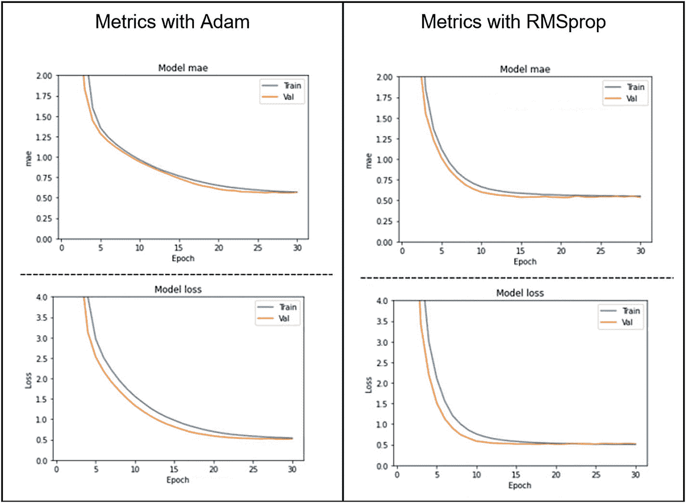
**图 5-11** `Adam` 与 `RMSprop` 误差指标对比

图 5-11 的左侧展示了使用 `Adam` 优化器的模型指标，右侧展示了使用 `RMSprop` 优化器的模型指标。右侧的曲线相比左侧更加平滑，表明过拟合程度更低。此外，图表清晰地显示，使用 `RMSprop` 显著减少了训练轮数。这将减少训练时间，这在处理大型数据集时至关重要。另一种减少训练时间的方法是使用你在前一章学到的 `TensorFlow` 的 `EarlyStopping` 功能。

## 结果讨论

我在此展示我们测试的三个模型其中一次运行的结果。请注意，你的结果以及每次运行的结果都会有所不同。

```
small model test_loss : 0.6353380084037781
small model test_mae : 0.6149751543998718
Wine quality on unseen data (small model):  5.618517
Trainable params: 209
medium model test_loss : 0.6351445317268372
medium model test_mae : 0.6231803894042969
Wine quality on unseen data (medium model):  5.246436
Trainable params: 9,153
large model test_loss : 0.5520739555358887
large model test_mae : 0.5552783012390137
Wine quality on unseen data (large model):  5.389405
Trainable params: 51,201
```

结果以表格形式汇总在表 5-1 中，以便快速比较。

**表 5-1** 不同模型误差比较

| | MSE | MAE | 未见数据葡萄酒质量预测 | 可训练参数 |
| --- | --- | --- | --- | --- |
| 小型模型 | 0.6353 | 0.6149 | 5.6185 | 209 |
| 中型模型 | 0.6351 | 0.6231 | 5.2464 | 9153 |
| 大型模型 | 0.5520 | 0.5552 | 5.3894 | 51201 |

从表 5-1 可以看出，损失和 `mae` 最初会减少，但随后对于更大的模型会显示出更高的值。然而，差异很小。同样，对未见数据的预测也几乎在相同范围内。同时，增加模型的复杂度导致了过拟合。现在，如果你查看可训练参数，它们从 209 增加到了惊人的 51,201。那么，在这样一个简单的回归案例中，是否有必要使用复杂模型呢？可以得出结论，在这种小数据集的情况下，使用小型模型是可以的。

总结我们目前的研究，可以得出结论：神经网络和深度学习技术可用于解决回归问题。当你拥有多个不同范围数值特征时，请确保在数据预处理阶段将每个特征独立缩放到相同范围。如果没有足够的数据，请使用具有少量隐藏层的小型网络以避免过拟合。

在我们的回归项目中，我们使用均方误差（`mse`）作为损失函数，平均绝对误差（`mae`）作为评估指标。这些在回归模型中很常见。然而，`tf.keras` 库为回归模型提供了更多损失函数。我现在将讨论其中一些，以便你在实验中可以尝试使用它们来创建性能更好的模型。

## 损失函数

损失函数是衡量模型预测预期结果好坏程度的一种指标。没有一种损失函数可以适用于所有类型的数据。根据数据的分布和异常值的存在，你需要使用不同的损失函数。回归问题使用的损失函数可能与分类问题使用的不同。我将介绍几种专门用于回归问题的损失函数，以及它们适用于哪种数据分布。我将讨论以下五种损失函数：

*   均方误差（`mse`）/二次损失/L2 损失
*   平均绝对误差（`mae`）/L1 损失
*   `Huber` 损失
*   `Log cosh` 损失
*   分位数损失

## 均方误差

这可能是最常用的损失函数。数学上，它表示为

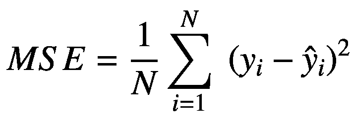

你计算预测值与真实值之间的差值，将其平方，然后在整个数据集上取平均值。该损失函数理想情况下适用于消除异常值，因为平方会放大误差。该函数在 `tf.keras` 库中作为 `tf.keras.losses.MSE` 提供。

## 平均绝对误差

数学上，`mae` 表示为

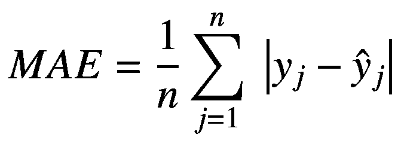

这里，你取预测值与真实值之差的绝对值，然后在整个数据集上取平均值。该函数不会过分重视异常值，并在所有数据点上提供均匀的度量。该函数在 `tf.keras` 库中作为 `tf.keras.losses.MAE` 提供。

## Huber 损失

`mse` 能检测异常值，而 `mae` 会忽略它们。可能存在这两种方法都无法给出理想预测的情况。考虑一种数据分布，其中大约 80% 的数据的真实目标值为 `y1`，而其余 20% 的真实目标值为 `y2`。基于平均值工作的 `mae` 模型会将 20% 视为异常值，而放大误差的 `mse` 模型可能在许多情况下将 `y2` 作为预测值。`Huber` 损失提供了介于 `mae` 和 `mse` 之间的解决方案。数学上，它表示为


从方程中可以看出，当 𝛿 趋近于 0 时，`Huber` 损失趋近于 `mae`；当 𝛿 趋近于无穷大时，趋近于 `mse`。它对异常值不太敏感，并提供了介于 `mae` 和 `mse` 之间的解决方案。`Huber` 损失函数作为 `tf.keras` 库的一部分提供，并使用 `tf.keras.losses.Huber()` 指定。

## 对数双曲余弦损失

其数学表达式为：

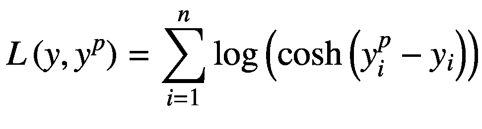

该函数计算误差的双曲余弦的对数。对于小误差，`log(cosh(x))` 近似于 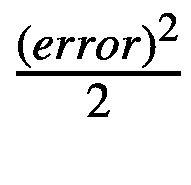；对于大误差，则近似于 `abs(error) – log(error)`。因此，它在大多数情况下表现类似于 `mse`。该函数处处二阶可导，并具备 `Huber` 损失的所有优点。在 `tf.keras` 库中，该函数以 `tf.keras.losses.LogCosh()` 的形式提供。

## 分位数损失

考虑图 5-12 左侧所示的数据分布。

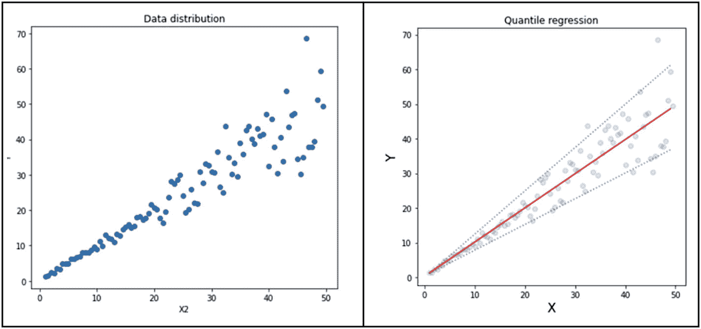
**图 5-12** 分位数回归图

你可能希望用多条回归线来建模这些数据，如图 5-12 右侧所示，而不是仅用一条回归线。在这种情况下，分位数损失就能派上用场。其数学表达式为：

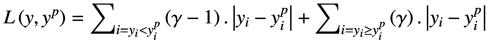

其中 *γ* 取值在 0 到 1 之间。分位数损失实际上是 `mae` 的扩展。当 *γ* 取值为 0.5 时，它就变成了 `mae`。*γ* 取其他值则会对高估或低估分别施加惩罚。

当你希望预测一个区间而非单个点时，分位数损失函数非常有用。这可以在许多业务问题中显著改善决策。

现在，我们已经了解了可用于回归的各种损失函数，接下来让我介绍一下 `tf.keras` 中可用的优化器，它们可以与这些损失函数配合使用。

## 优化器

优化器本质上是用于在模型训练过程中减少损失的算法。它们通过更新权重参数来最小化损失函数，而损失函数则持续告知优化器其是否正朝着达到全局最小值的正确方向前进。与损失函数不同，优化器并非回归问题所独有，所有可用的优化器都可以应用于回归问题。`tf.keras` 中提供的各种优化器如下：

- `Adagrad`
- `RMSprop`
- `Adam`
- `SGD`
- `Adadelta`
- `Adamax`
- `Nadam`

我们在之前的项目中已经使用过其中一些优化器。每个优化器都有其特定的用途。我强烈建议你阅读 `tf.keras` 文档，以了解每个优化器的重要性。根据需求，尝试使用不同的优化器来提升模型性能。再次强调，这些优化器并非回归问题所独有，而是适用于所有类型的深度学习项目。

# 总结

总结本章所学内容，可以这样说：如果现有的统计回归模型能够满足你的需求，那就无需使用神经网络。

如果你正在建模一个具有大量特征且这些特征与目标值之间存在复杂超平面关系的数据集，那么请使用深度学习神经网络来获得额外的预测能力。传统的回归函数在 `R`、`scikit-learn` 以及其他类似的库中都有提供。例如，`scikit-learn` 库除了线性回归之外，还提供了其他几种回归器，如 `KNeighboursRegressor`、`DecisionTreeRegressor` 和 `RandomForestRegressor`。另一方面，神经网络虽然有一些额外的开销，但其提供的预测能力是前面提到的任何回归器都无法比拟的。很难找到一个能完美拟合给定数据集的回归方程。相反，深度学习网络会自行尝试找到最佳拟合，无需你付出额外的努力。因此，总而言之，今后即使是解决小型的回归问题，也请考虑使用神经网络；谁知道呢，这个小问题（数据集）可能会随着时间的推移变得庞大，届时再依赖传统的统计技术将是一场噩梦。

下一章将带你了解一些快速机器学习的技术。