# 6. 估算器

## 简介

任何机器学习项目都包含多个阶段，包括训练、评估、预测，以及最终导出到生产服务器上提供服务。你在前几章中已经学习了这些阶段，当时我们讨论了分类和回归的机器学习项目。为了开发性能最佳的模型，你尝试了不同的 ANN 架构。基本上，你通过实验多种不同的原型来达到期望的结果。在 TF 2.0 之前，整个实验过程并不容易，因为每次修改代码，你都需要构建一个计算图并在会话中运行它。你将在本章学习的估算器正是为了处理所有这些底层工作而设计的。创建图并在会话中运行它们的整个过程非常耗时，并且给代码调试带来了许多挑战。

此外，在模型完全开发完成后，将其部署到生产环境也面临挑战，你可能希望将其部署到分布式环境以获得更好的性能。同时，你可能还希望在 CPU、GPU 或 TPU 上运行模型。这都需要修改代码。为了帮助你解决所有这些问题，并将一切统一在一个框架下，估算器应运而生，尽管这是在 TF 2.0 之前。然而，你将在本章学习并在未来所有项目中使用的估算器，能够利用 TF 2.x 中引入的许多新功能。例如，构建数据管道和模型开发之间有了清晰的分离。在分布式环境上的部署也无需任何代码更改。增强的日志记录和追踪功能使调试更加容易。在本章中，你将学习估算器是如何实现这一切的。

具体来说，你将学习以下内容：

- 什么是估算器？
- 什么是预制的估算器？
- 使用预制估算器解决分类问题
- 使用预制估算器解决回归问题
- 基于 Keras 模型构建自定义估算器
- 基于 `tfhub` 模块构建自定义估算器

## 估算器概述

TensorFlow 估算器是一个高级 API，它将机器学习开发的多个阶段统一在一个框架下。它封装了用于训练、评估、预测以及导出模型以供生产使用的各种 API。它是一个高级 API，为现有的 TensorFlow API 栈提供了进一步的抽象。

### API 栈

在引入估算器之后，TensorFlow 的新 API 栈如图 6-1 所示。


图 6-1

TensorFlow API 栈

到目前为止，你主要使用了中级 API；当你需要对模型开发进行更精细的控制时，低级 API 的使用才成为罕见的需求。现在，学习了估算器 API 之后，你可能甚至不会在模型开发中使用中级 API。但你已经开发好的模型会怎样呢——它们能否从这个 API 中受益？如果可以，如何让它们使用这个 API？幸运的是，TensorFlow 团队开发了一个接口，允许你将现有模型迁移到估算器接口。不仅如此，他们还自行创建了一些估算器，以便你快速上手。这些被称为预置估算器。它们不仅仅是起点。它们已经过充分开发和测试，可供你在当前项目中使用。如果这些估算器不能满足你的需求，或者你想迁移现有模型以利用估算器提供的优势，你可以使用估算器 API 开发自定义估算器。在了解如何使用预置估算器和构建自己的估算器之前，我先更详细地讨论一下它的优势。

### 估算器的优势

为了让你快速了解估算器提供的主要优势，我首先在此列出它们：

*   提供统一的训练/评估/预测接口
*   通过输入函数处理数据输入
*   创建检查点
*   创建摘要日志

这些可能不是唯一的优势，但肯定是最重要的。我现在将逐一详细讨论。为了理解讨论内容，请牢记图 6-2 中描绘的估算器接口。


图 6-2

估算器接口

如图 6-2 所示，估算器类提供了三个用于训练、评估和预测的接口方法。因此，一旦你开发了一个估算器对象，你将能够在同一个对象上调用 `train`、`evaluate` 和 `predict` 方法。请注意，你需要为每个方法发送不同的数据集。这是借助输入函数实现的。我将在本节后面更详细地解释这个输入函数的结构。此时只需说明，输入函数的引入简化了你对不同数据集的实验。

训练期间创建的检查点允许你回滚到已知状态，并从该检查点继续训练。这将为你节省大量训练时间，尤其是当错误发生在某个 epoch 的末尾时。这也使调试更快。训练结束后，评估期间创建的摘要日志可以在 TensorBoard 上可视化，让你快速了解模型训练得有多好。

当模型训练到完全满意后，接下来就是部署任务。将训练好的模型部署到 CPU/GPU/TPU，甚至移动设备和 Web，以及分布式环境，以前需要多次更改代码。如果你使用估算器，你可以直接部署训练好的模型，或者最多在这些平台上进行最少的更改。

说了这么多优势，让我们先看看估算器的类型。

### 估算器类型

估算器分为两类：

*   预置估算器
*   自定义估算器

这种分类可以在图 6-3 所示的图表中直观地看到。


图 6-3

估算器分类

预置估算器就像一个盒子里的模型，其模型功能已由 TensorFlow 团队编写好。另一方面，在自定义估算器中，你需要提供这种模型功能。在这两种情况下，你创建的估算器对象都将具有用于训练、评估和预测的通用接口。两者都可以以类似的方式导出用于服务。

TensorFlow 库提供了一些预置估算器供你立即使用；如果这些不能满足你的目的，和/或你想迁移现有模型以获得估算器的优势，你将创建自己的估算器类。所有估算器都是 `tf.estimator.Estimator` 基类的子类。

`DNNClassifier`、`LinearClassifier` 和 `LinearRegressor` 是预置估算器的几个例子。`DNNClassifier` 用于创建基于密集神经网络的分类模型，而 `LinearRegressor` 用于处理线性回归问题。你将在本章后续部分学习如何使用这两个类。

作为构建自定义估算器的一部分，你将把现有的 Keras 模型转换为估算器。这样做将使你能够利用估算器提供的几个优势，这些优势你之前已经看到过。你将为你上一章开发的葡萄酒质量回归模型构建一个自定义估算器。最后，我还将向你展示如何基于 `tfhub` 模块构建自定义估算器。

要使用估算器，你需要理解两个新概念——输入函数和特征列。输入函数基于 `tf.data.dataset` 创建一个数据管道，该管道以批次方式将数据馈送到模型中进行训练和评估。你也可以为推理创建一个数据管道。我将在 `DNNClassifier` 项目中向你展示如何做到这一点。特征列指定估算器如何解释数据。在我讨论这些输入函数和特征列概念之前，我将概述一个基于估算器的项目的开发流程。

### 基于估算器的项目工作流程

基于估算器的项目开发所需的各种步骤如下：

*   加载数据
*   数据预处理
*   定义特征列
*   定义输入函数
*   模型实例化
*   模型训练
*   模型评估
*   在 TensorBoard 上判断模型性能
*   使用模型进行预测

作为你在之前所有章节中所学内容的一部分，你肯定对上述工作流程中的许多步骤都很熟悉。需要关注的是定义特征列和输入函数。我现在将描述这些要求。

### 特征列

特征列在原始数据和估计器之间搭建了一座桥梁。它能将各种原始数据转换为估计器所需的格式。你可以使用 `tf.feature_column` 模块来构建一个特征列列表。这个列表随后会成为估计器构造函数的输入。估计器对象在解释来自输入函数的数据时会使用这个列表。整个过程如图 6-4 所示。


图 6-4 – 特征列的使用方式

如图 6-4 中间区块所示，特征列列表如下：

*   固定酸度（数值型）
*   挥发性酸度（数值型）
*   柠檬酸（数值型）
*   …

这些是你在上一章开发的葡萄酒质量模型的特征。列表中的每个元素都是 `tf.feature_column.numeric_column` 类型。以下代码片段说明了如何构建这样一个列表：

```

# 构建数值特征数组
numeric_feature = []
for col in numeric_columns:
    numeric_feature.append(tf.feature_column.numeric_column(key=col))
```

有时，你的数据集可能包含你想用作模型构建特征的分类型字段。以下代码片段说明了如何为这些分类型字段构建特征列：

```
categorical_features = []
for col in categorical_columns:
    vocabulary = data[col].unique()
    cate = tf.feature_column.categorical_column_with_vocabulary_list(col, vocabulary)
    categorical_features.append(tf.feature_column.indicator_column(cate))
```

请注意，我们首先通过调用 `categorical_column_with_vocabulary_list` 方法获取词汇表，然后将指示器列追加到列表中。

如图 6-4 所示，此列表作为参数传递给估计器构造函数。如果你的模型同时需要数值型和分类型特征，则需要将两者都追加到目标特征列中。

图 6-4 左侧区块显示了实际由输入函数构建的数据。这些数据将输入到估计器的 `train`/`evaluate`/`predict` 方法调用中。

接下来，我将介绍如何编写输入函数。

### 输入函数

输入函数的目的是返回以下两个对象，供我们的估计器模型对象使用：

*   一个特征名称（键）与包含相应特征数据的张量或稀疏张量（值）组成的字典
*   一个包含一个或多个标签的张量

基本框架如下所示：

```
def input_fn(dataset):
    # 创建包含特征名称的字典
    # 以及包含相应数据的张量
    # 为标签数据创建张量
    return dictionary, label
```

你可以基于此原型编写用于训练/评估/推理的独立函数。

现在，我将向你展示一个取自本章稍后讨论的示例中的输入函数的实际实现。这将进一步澄清你们脑海中关于输入函数的概念。

输入函数是一个具有以下原型的 Python 函数：

```
def input_fn(features, labels, training=True, batch_size=32):
```

这里的 `features` 和 `labels` 参数代表包含特征和标签数据的张量。在函数内部，通过调用 `tf.data.Dataset` 模块的 `from_tensor_slices` 函数将数据转换为张量。

```
#### 将输入转换为数据集
Dataset = tf.data.Dataset.from_tensor_slices((dict(features), labels))
```

该函数的输入参数是一个包含特征和相应标签的 Python 字典。最后，该函数通过使用 `tf.data.Dataset` 的 `batch` 方法，以批次形式将此数据返回给调用者。

```
return dataset.batch(batch_size)
```

函数结构如图 6-5 所示，以便进一步理解。


图 6-5 – 输入函数结构

整个过程可能看起来相当复杂；一个实际的例子将有助于澄清整个实现过程，而这正是我接下来要做的。

# 预置估计器

我将讨论两种类型的预置估计器——一种用于分类问题，另一种用于回归类型的问题。首先，我将描述一个分类项目。我们将为此项目使用预置的 `DNNClassifier`。`DNNClassifier` 定义了一个深度神经网络，并将其输入分类到多个类别中。你将使用 MNIST 数据库将手写数字分类为十个数字。我要描述的第二个项目使用了名为 `LinearRegressor` 的预置估计器。该项目使用了波士顿地区的 Airbnb 数据库。该数据库包含 Airbnb 上列出的多个房屋。对于每个列出的房屋，会捕获多个特征，并列出房屋的售价/可售价。利用这些信息，你将开发一个回归模型来预测新上市房屋可能售出的价格。

使用这两个不同的模型将让你深入了解如何在你自己的模型开发问题中使用预置估计器。那么，让我们先从分类模型开始。

## 用于分类的 DNNClassifier

创建一个新的 Colab 项目并将其重命名为 `DNNClassifier-estimator`。像往常一样，使用以下语句导入 TensorFlow：

```
import tensorflow as tf
```

我们将为此项目使用 MNIST 数据库。该数据集可在 `sklearn` 工具包中找到。它是手写数字的数据库。我们的任务是使用预置分类器来识别这些图像中嵌入的数字。输出包含十个类别，对应十个数字。

### 加载数据

要从 `sklearn` 加载 MNIST 数据，请使用以下代码：

```
from sklearn import datasets
digits = datasets.load_digits()
```

你可以通过绘制一些图像来检查加载数据的内容。以下代码将显示前四张图像：

```
#### 绘制样本图像
import matplotlib.pyplot as plt
plt.figure(figsize=(1,1))
fig, ax = plt.subplots(1,4)
ax[0].imshow(digits.images[0])
ax[1].imshow(digits.images[1])
ax[2].imshow(digits.images[2])
ax[3].imshow(digits.images[3])
plt.show()
```

你将看到如图 6-6 所示的输出。

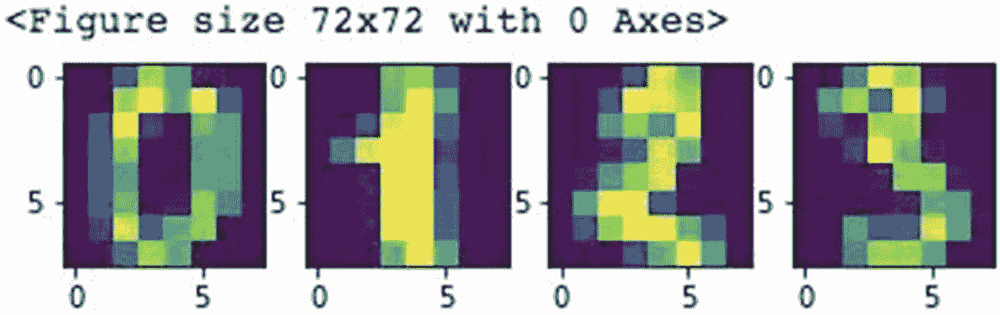

图 6-6 – 样本图像

每张图像的大小为 8x8 像素。

## 准备数据

所有图像都是彩色图像。我们不需要颜色分量来识别数字。灰度图像就足以满足我们的需求。因此，我们通过重塑图像来移除颜色分量：

```
n_samples = len(digits.images)
data = digits.images.reshape((n_samples, -1))
```

如果你检查 `data` 的形状，你会注意到共有 1797 张图像，每张图像总共包含 64 个像素值。

我们使用以下代码将数据拆分为训练集和测试集：

```
from sklearn.model_selection import train_test_split
X_train, X_test, y_train, y_test = train_test_split(
    data, digits.target, test_size=0.05, shuffle=False)
```

至此，我们已经准备好为估计器定义输入函数。

#### 估算器输入函数

正如您之前所见，输入函数需要特定格式的数据。我们需要指定一个列列表，然后将实际数据作为输入提供给估算器。图像数据由 64 个像素组成。在模型训练期间，每个像素将表示为一个数值列。因此，要创建包含这些像素数据的张量，我们首先为像素列创建名称：

```

#### 为模型输入函数创建列名
columns = ['p_'+ str(i) for i in range(1,65)]
```

列名将依次为 `p_1`、`p_2` 等。现在，我们将通过从 `tf.feature_column` 类中追加一个 `numeric_column` 类型到一个名为 `feature_columns` 的数组中来构建我们的特征列。

```
feature_columns = []
for col in columns:
    feature_columns.append
    (tf.feature_column.numeric_column(key = col))
```

我们按如下方式定义输入函数：

```
def input_fn(features, labels, training =
True, batch_size = 32):
```

第一个参数定义特征数据，第二个参数定义目标值，第三个参数指定数据是用于训练还是评估。数据以批次处理——批次大小由最后一个参数决定。

现在，我们将这些数据转换为张量数据集，以便估算器更高效地处理。

```

#### 将输入转换为数据集
dataset = tf.data.Dataset.from_tensor_slices
((dict(features),labels))
```

通过调用 `from_tensor_slices` 方法将数据转换为张量。该方法接受由特征字典和对应标签组成的输入。

如果输入数据用于训练，我们会打乱数据集。

```

#### 在训练模式下打乱并重复
if training:
    dataset=dataset.shuffle(1000).repeat()
```

`shuffle` 方法用于打乱数据集。我们指定了 1000 的缓冲区大小来进行打乱。为了处理那些太大而无法完全放入内存的数据集，打乱操作是按数据批次进行的。如果缓冲区大小大于数据集中的数据点数量，您将获得均匀的打乱效果。如果缓冲区大小为 1，则完全不会进行打乱。

最后，我们返回数据批次：

```

#### 以批次形式提供输入用于训练
return dataset.batch(batch_size)
```

现在，是时候创建一个估算器实例了。

#### 创建估算器实例

我们使用预制的 `DNNClassifier` 估算器来实现我们的目的。使用以下语句创建实例：

```
classifier = tf.estimator.DNNClassifier
(hidden_units = [256, 128, 64],
feature_columns = feature_columns,
optimizer = 'Adagrad',
n_classes = 10,
model_dir = 'classifier')
```

构造函数接受五个参数。第一个参数定义了网络架构。在这里，我们在架构中定义了三个隐藏层；第一层包含 256 个神经元，第二层包含 128 个，第三层包含 64 个。第二个参数指定数据将具有的特征列表。请注意，我们之前已经创建了 `feature_columns` 向量，因此这里将其设置为默认参数。第三个参数指定要使用的优化器，此处默认设置为 `Adagrad`。`Adagrad` 是一种基于梯度的优化算法，它正是这样做的：它根据参数调整学习率，执行更小的更新。`n_classes` 参数定义了输出类别的数量。在我们的例子中，它是 10，即数字 0 到 9 的个数。最后一个参数 `model_dir` 指定了用于维护日志的目录名称。

接下来是模型训练的重要部分。

### 模型训练

我们创建的估算器模型将使用我们常用的 `train` 方法进行训练。在开始训练之前，我们需要创建用于训练的输入数据集。为此，我们使用以下语句创建一个包含训练数据和特征列表的 pandas 数据框：

```

#### 为训练创建数据框
import pandas as pd
dftrain = pd.DataFrame(X_train, columns = columns)
```

我们通过调用之前创建的分类器对象上的 `train` 方法来开始训练：

```
classifier.train(input_fn = lambda:input_fn
(dftrain,
y_train,
training = True),
steps = 2000)
```

该方法将我们的 `input_fn` 作为参数。`input_fn` 本身将特征和标签数据作为前两个参数。`training` 参数设置为 `True`，以便数据会被打乱。步数定义为 2000。让我解释一下这意味着什么。在机器学习中，一个 epoch 意味着对整个训练集进行一次遍历。一个 step 对应一次前向传播和一次反向传播。如果您没有在数据集中创建批次，那么一个 step 就恰好对应一个 epoch。但是，如果您将数据集分成了批次，那么一个 epoch 将包含许多 steps——请注意，一个 step 是对单个数据批次的一次迭代。您可以使用以下公式计算整个训练周期中执行的总 epoch 数：

`Number_of_epochs = (batch_size * number_of_steps) / (number_of_training_samples)`

在当前示例中，批次大小为 32，步数为 2000，训练样本数为 1707。因此，完成训练需要 `(32 * 2000) / 1707`，即 38 个 epochs。

### 模型评估

为了评估模型的性能，您将像之前一样创建一个数据框，但这次使用测试数据作为输入：

```
dftest = pd.DataFrame(X_test, columns = columns)
```

通过调用分类器上的 `evaluate` 方法来执行评估。

```
eval_result = classifier.evaluate(
    input_fn = lambda:input_fn(dftest, y_test,
    training = False)
)
```

请注意，`training` 参数设置为 `false`。您可以通过简单地打印 `eval_result` 的值来打印评估结果。输出结果如图 6-7 中的截图所示。

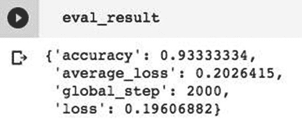

图 6-7

模型评估结果

评估完成后，您可以通过加载在 `DNNClassifier` 构造函数的 `model_dir` 参数中指定为值的文件夹中的日志，在 TensorBoard 中查看各种参数。

```
%load_ext tensorboard
%tensorboard --logdir ./classifier
```

来自日志的样本损失图如图 6-8 所示。

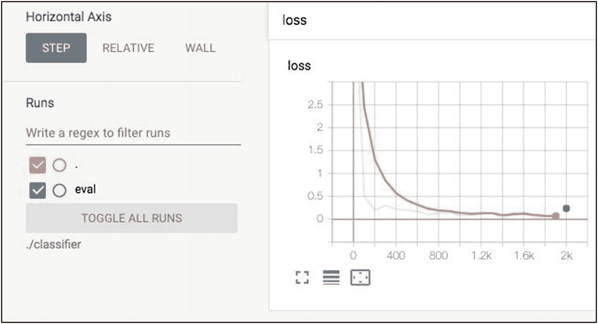

图 6-8

样本评估指标

接下来，您将学习如何使用我们训练好的估算器来预测未见过的数据。

### 预测未见数据

为了预测未见数据，我们首先创建一个名为 `pred_input_fn` 的输入函数，如下所示：

```python

#### 用于预测的输入函数
def pred_input_fn(features, batch_size = 32):
  # 将输入转换为不含标签的数据集。
  return tf.data.Dataset.from_tensor_slices(dict(features)).batch(batch_size)
```

该函数返回仅包含特征而不含标签的数据张量批次。我们将从 `dftest` 数据集中选取两个数据点来测试预测功能，如下所示：

```python
test = dftest.iloc[:2,:]
```

我们将从 `y_test` 数据集中获取这两个数据项的目标值：

```python
expected = y_test[:2].tolist()
```

我们通过在估计器对象上调用 `predict` 方法来执行实际预测：

```python
pred = list(classifier.predict(
    input_fn =  lambda: pred_input_fn(test))
)
```

输入函数使用我们为测试这两个未见数据项而创建的测试数据。

最后，我们使用以下循环打印这两个项的预测类别、预测概率以及实际目标值：

```python
for pred_dict, expec in zip(pred, expected):
  class_id = pred_dict['class_ids'][0]
  probability = pred_dict['probabilities'][class_id]
  print('predicted class {} , probability of prediction {} , expected label {}'.format(class_id, probability, expec))
```

上述语句执行后的输出如下：

```
predicted class 8 , probability of prediction 0.9607188701629639 , expected label 8
predicted class 4 , probability of prediction 0.9926437735557556 , expected label 4
```

### 尝试不同的 ANN 架构

在评估模型性能时，尝试不同的 ANN 架构非常容易。例如，您可以通过更改估计器构造函数中的 `hidden_units` 参数值，为之前的架构增加一个层。我在现有代码中尝试了以下配置：

```python
hidden_units = [256, 128, 64, 32],
```

执行后产生的评估结果如图 6-9 所示。

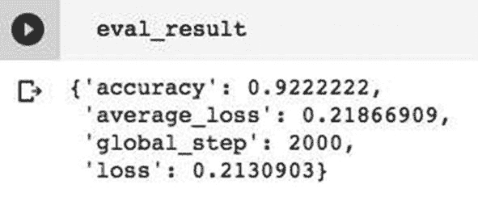

图 6-9 更密集网络的评估结果

不仅可以调整隐藏层数量及其神经元数量，您还可以通过在估计器实例化代码中添加参数来引入 dropout，如下所示：

```python
classifier = tf.estimator.DNNClassifier(
    hidden_units = [256, 128, 64, 32],
    feature_columns = feature_columns,
    optimizer='Adagrad',
    n_classes=10,
    dropout = 0.2,
    model_dir='classifier')
```

此配置的评估结果如图 6-10 所示。

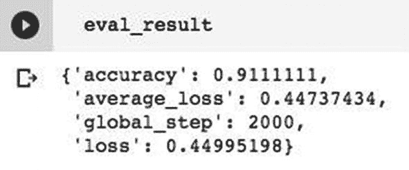

图 6-10 添加 dropout 后的评估指标

因此，您可以轻松尝试多种模型架构。您也可以尝试不同的数据集——例如，通过更改 `Features` 列列表中包含的特征数量。一旦对模型性能满意，您可以将其保存到文件中，然后直接将保存的文件部署到生产服务器供所有人使用。

### 项目源码

项目的完整代码见代码清单 6-1，供您快速参考。

```python
import tensorflow as tf
from sklearn import datasets
digits = datasets.load_digits()
#绘制样本图像
import matplotlib.pyplot as plt
plt.figure(figsize=(1,1))
fig, ax = plt.subplots(1,4)
ax[0].imshow(digits.images[0])
ax[1].imshow(digits.images[1])
ax[2].imshow(digits.images[2])
ax[3].imshow(digits.images[3])
plt.show()

#### 将数据重塑为二维
n_samples = len(digits.images)
data = digits.images.reshape((n_samples, -1))
data.shape

#### 分割训练/测试集
from sklearn.model_selection import train_test_split
X_train, X_test, y_train, y_test = train_test_split(
    data, digits.target, test_size = 0.05, shuffle=False)

#### 为模型输入函数创建列名
columns = ['p_'+ str(i) for i in range(1,65)]
feature_columns = []
for col in columns:
    feature_columns.append(tf.feature_column.numeric_column(key=col))
def input_fn(features, labels, training = True, batch_size = 32):
    #将输入转换为数据集
    dataset = tf.data.Dataset.from_tensor_slices((dict(features),labels))
    #在训练模式下进行洗牌和重复
    if training:
        dataset=dataset.shuffle(1000).repeat()
    #以批次形式提供输入用于训练
    return dataset.batch(batch_size)
classifier = tf.estimator.DNNClassifier(
    hidden_units = [256, 128, 64],
    feature_columns = feature_columns,
    optimizer = 'Adagrad',
    n_classes = 10,
    model_dir = 'classifier')

#### 创建训练用的数据框
import pandas as pd
dftrain = pd.DataFrame(X_train, columns = columns)
classifier.train(input_fn = lambda: input_fn(dftrain, y_train, training = True), steps = 2000)

#### 创建评估用的数据框
dftest = pd.DataFrame(X_test, columns = columns)
eval_result = classifier.evaluate(
    input_fn = lambda: input_fn(dftest, y_test, training = False))
eval_result
%load_ext tensorboard
%tensorboard --logdir ./classifier

#### 用于预测的输入函数
def pred_input_fn(features, batch_size = 32):
    # 将输入转换为不含标签的数据集。
    return tf.data.Dataset.from_tensor_slices(dict(features)).batch(batch_size)
test = dftest.iloc[:2,:]
#用于预测的前两个数据点
expected = y_test[:2].tolist()
#期望的标签
pred = list(classifier.predict(
    input_fn =  lambda: pred_input_fn(test))
)
for pred_dict, expec in zip(pred, expected):
    class_id = pred_dict['class_ids'][0]
    probability = pred_dict['probabilities'][class_id]
    print('predicted class {} , probability of prediction {} , expected label {}'.format(class_id, probability, expec))
```

代码清单 6-1 `DNNClassifier-Estimator` 完整源码

现在，您已经了解了如何使用密集神经网络分类估计器，接下来我将向您展示如何使用预置分类器解决回归问题。

## 用于回归的 LinearRegressor

正如我在前一章中提到的，神经网络可用于解决回归问题。为了支持这一观点，我们还在 TF 库中看到了一个用于支持回归模型开发的预置估计器。我将在本节讨论如何使用这个估计器。

## 项目描述

我们在此项目中尝试解决的回归问题是确定波士顿房屋的预估售价。为此，我们将使用波士顿的 Airbnb 数据集（[`www.kaggle.com/airbnb/boston`](http://www.kaggle.com/airbnb/boston)）。该数据集包含多列，必须仔细检查各列是否适合作为模型开发的特征。因此，对于回归模型的开发，您需要对数据进行严格的预处理，以便充分减少特征数量，同时在预测房价方面达到较高的准确度。

### 创建项目

像往常一样，创建一个 Colab 项目并将其重命名为 `DNNRegressor-Estimator`。导入以下库：

```python
import tensorflow as tf
import pandas as pd
import matplotlib.pyplot as plt
import numpy as np
```

### 加载数据

你可以使用以下代码中指定的 URL 将数据下载到你的项目中：

```
url = 'https://raw.githubusercontent.com/Apress/artificial-neural-networks-with-tensorflow-2/main/ch06/listings.csv' data = pd.read_csv(url)
```

数据被读取到一个 pandas 数据帧中。你可以通过调用其 `shape` 方法来检查数据大小。你将了解到共有 3585 行和高达 95 列。即使对于经验丰富的数据分析师来说，找出这 95 列之间的回归关系也并非易事。这正是你再次意识到神经网络可以助你一臂之力的地方。

在数据库中的 95 列中，显然并非所有列都对我们的模型训练有用。因此，我们需要进行一些数据清洗，以移除不需要的列并标准化剩余的列。我们现在按照下文所述进行数据预处理。

### 特征选择

我们要做的第一件事是列出所有列，我们通过调用 `data` 上的 `columns` 方法来实现。执行此操作后，你将看到如图 6-11 所示的输出。

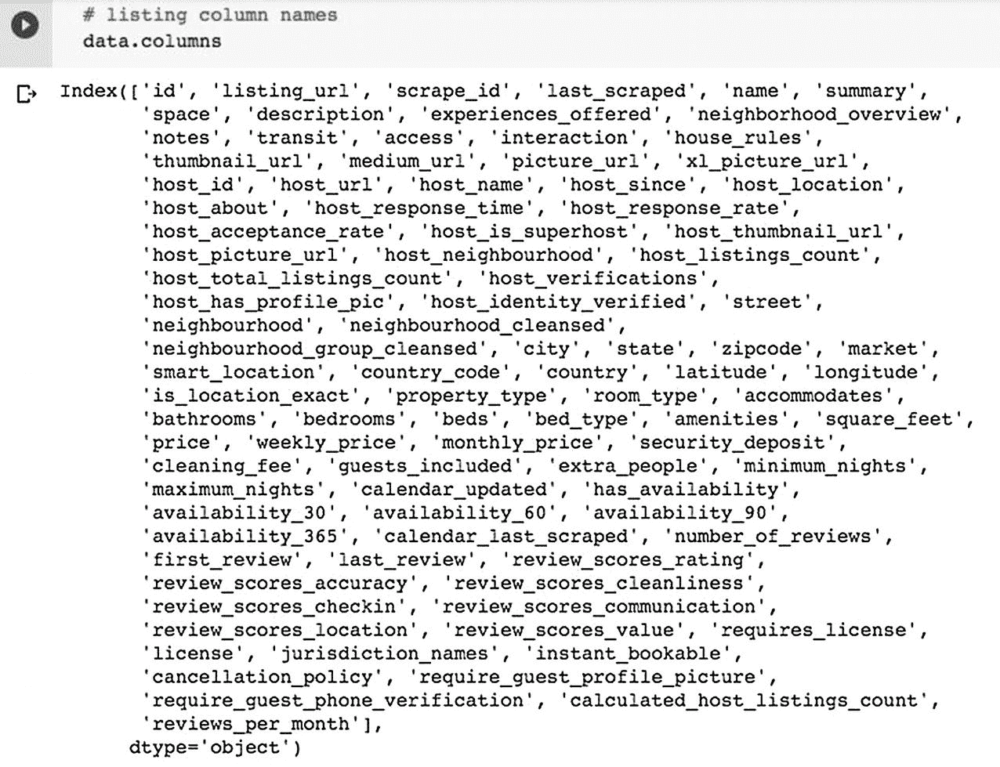

图 6-11

列列表

如果你愿意，可以使用 `data.info()` 来更好地了解数据结构。你可以很容易地注意到，有许多字段可能与我们无关。为了更好地了解哪些列可以删除，请通过调用 `describe` 方法获取数据描述。屏幕输出如图 6-12 所示。

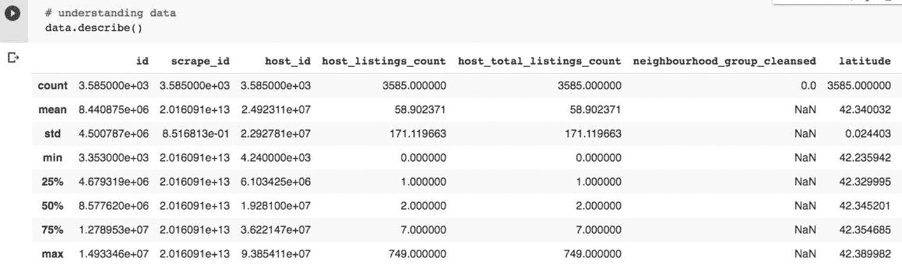

图 6-12

数据描述

经过仔细检查数据后，我决定只使用 17 列进行分析。在实践中，你可以使用任何已知的特征选择技术——比如单变量选择或带有热力图的相关矩阵。这些列是通过显式输入其名称来选择的，如下所示：

```
#### 仅选择少数列作为我们的特征
data = data[['property_type','room_type',
'bathrooms','bedrooms','beds','bed_type',
'accommodates','host_total_listings_count',
'number_of_reviews','review_scores_value',
'neighbourhood_cleansed','cleaning_fee',
'minimum_nights','security_deposit',
'host_is_superhost','instant_bookable',
'price']]
```

选择好特征后，我们需要确保其中包含的数据是干净的。

### 数据清洗

我们首先检查数据是否包含任何空值。你可以通过使用 `isnull` 函数并对其输出进行 `sum` 求和来实现。图 6-13 中的截图显示了包含空值的列。

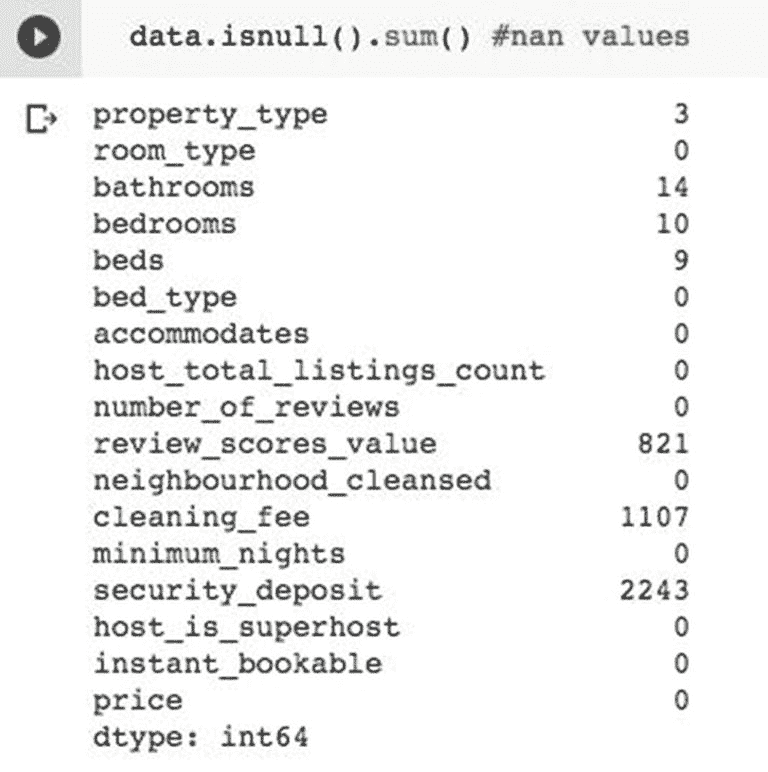

图 6-13

检查空值

如图 6-13 所示，有七列包含空值，其总和不为零。由于 `security_deposit` 列在 3585 条记录中有 2243 个空值，占比非常大，我们将在分析中删除此列。

```
data = data.drop('security_deposit' , axis = 1)
```

我们可以通过打印几条记录来检查数据。命令及其输出如图 6-14 所示。

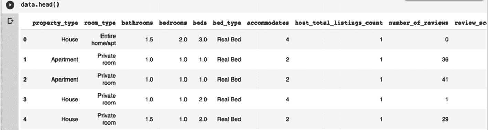

图 6-14

检查数据

```
data.head()
```

当你检查这些数据时，你会注意到 `property_type` 字段是分类变量。我们将在清洗操作中单独处理它。你还会注意到 `cleaning_fee`、`security_deposit` 和 `price` 列也包含 `$` 符号。这些值必须在去除 `$` 符号后转换为浮点数。另外，请注意金额字段在数字之间还包含逗号。这也需要被去除。为了清理这三列中的值，我们编写一个转换函数，如下所示：

```
#### 函数用于移除 $ 和 , 字符
def transform(x):
x = str(x)
x = x.replace('$','')
x = x.replace(",","")
return float(x)
```

我们现在在一个 `for` 循环中对这三个字段应用此转换：

```
for col in ["cleaning_fee","price"]:
data[col] = data[col].apply(transform)
#### 用平均值填充 nan
data[col].fillna(data[col].mean(),inplace = True)
```

在循环中，我们还用字段的平均值替换空值。

对于其余列，我们使用以下代码仅用列的平均值替换空值：

```
#### 用平均值填充 nan 值
for feature in ["bathrooms","bedrooms","beds",
"review_scores_value"]:
data[feature].fillna(data[feature].mean(),
inplace = True)
```

接下来，我们查看分类列——`property_type`。由于这是一个分类列，我们不能简单地用平均值替换空值。我们需要找到一个合适的值来替换空字段。为此，让我们检查此列中的唯一值。唯一值如图 6-15 所示。

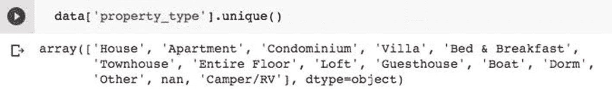

图 6-15

分类列中的唯一值

我们可以通过调用 `value_counts` 方法来检查每个值的频率。如图 6-16 所示。

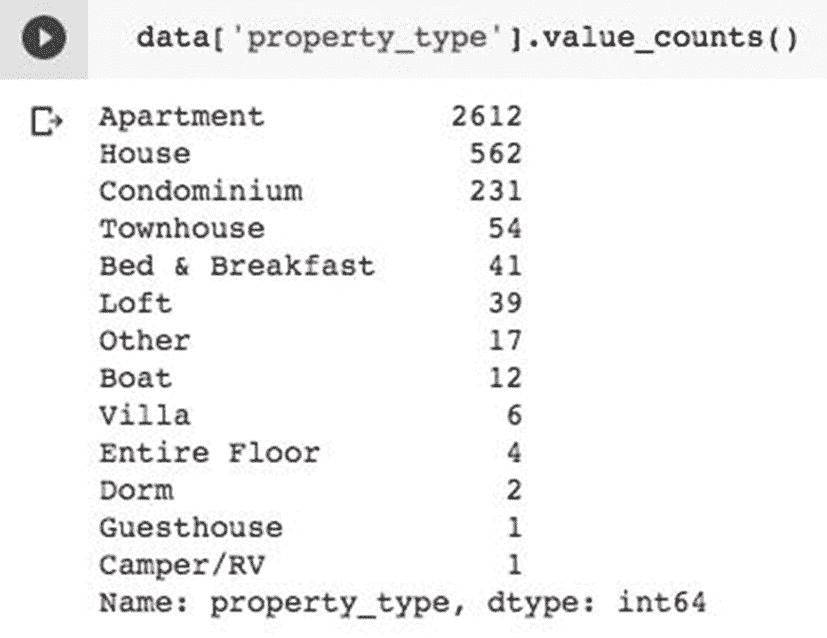

图 6-16

`property_type` 值的频率分布

由于 `Apartment` 一词出现频率最高，我们将使用它作为此列中空值的替换文本。我们使用以下代码语句进行此替换：

```
#### 用 Apartment 替换 nan
data['property_type'].fillna('Apartment',
inplace = True)
```

## 创建数据集

现在，我们准备从预处理后的数据中提取特征和标签。通过以下两条语句实现：

```
feature = data.drop('price', axis = 1)
#输入数据
target = data['price']
```

作为数据预处理的一部分，还有最后一点我想向你展示。我们要预测新注册公寓的价格。因此，让我们查看一下数据库中价格的分布情况。你可以使用以下代码绘制价格的直方图：

```

#### 价格值直方图
data['price'].plot(kind='hist',grid = True)
plt.title('price distribution')
plt.xlabel('price')
```

直方图如图 6-17 所示。

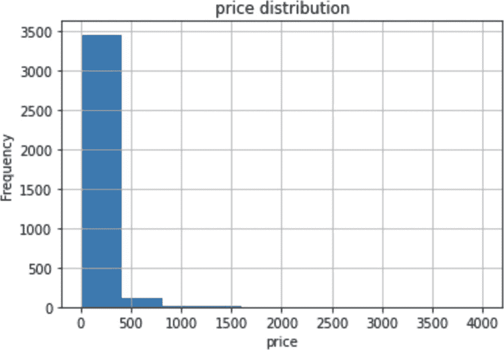

图 6-17

原始价格分布

如图 6-17 所示，大部分价格值处于价格范围的较低区间。为了更好的学习效果，这些价格应具有更均匀的分布，而非当前这种偏态分布。这可以通过对价格取对数来实现，代码如下：

```
target = np.log(data.price) #输出数据
target.hist()
plt.title
('price distribution after log transformation')
```

转换后，分布如图 6-18 所示。

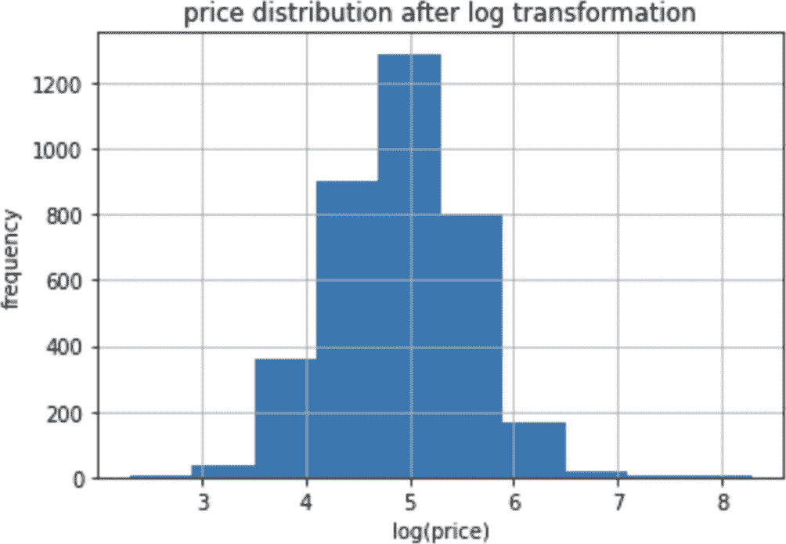

图 6-18

转换后的价格分布

至此，你的数据处理已完成。现在我们创建训练集和测试集。

为了创建训练集和测试集，我们使用 `sklearn` 的 `train_test_split` 方法。

```

#### 分割输入和输出数据用于训练和测试
from sklearn.model_selection import train_test_split
xtrain,xtest,ytrain,ytest=train_test_split
(feature, target, test_size = 0.2,
random_state = 42)
```

我们保留 20% 的数据用于测试。在构建估计器之前，最后需要做的是创建特征列，接下来我们就进行这一步。

### 构建特征列

在之前的应用中，你将特征列创建为简单的特征名称列表。该列表中的所有列都是数值型的。当前数据集同时包含数值型和类别型特征。首先，我们构建数值型列的列表：

```

#### 选择数值型特征列
numeric_columns = feature.select_dtypes
(include = np.number).columns.tolist()
numeric_columns
```

我们从特征列表中包含所有类型为 `np.number` 的列，并创建一个名为 `numeric_columns` 的新列表。打印该列表时，你会看到如图 6-19 所示的输出。

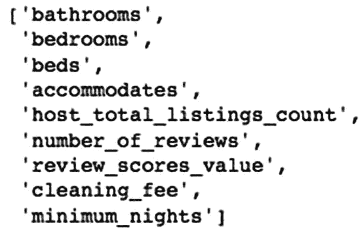

图 6-19

数值型特征数组

注意，特征列表中所有数值型列的名称都被添加到了新列表中。接下来，我们将把这个数组转换为估计器输入函数所需的格式。输入函数要求列表中应包含特征及其数据类型（`tf.feature_column`）。我们使用 `for` 循环构建此列表，如下所示：

```

#### 构建数值型特征数组
numeric_feature = []
for col in numeric_columns:
numeric_feature.append
(tf.feature_column.numeric_column(key=col))
numeric_feature
```

如果打印此列表，你会看到如图 6-20 所示的输出。

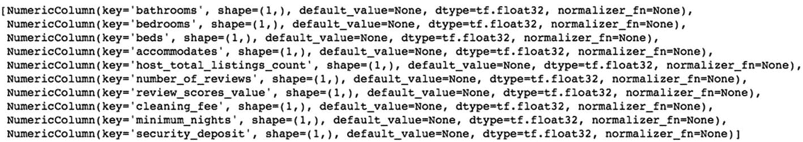

图 6-20

特征列

同样，我们将创建特征列表中存在的类别型列列表。我们选择并构建具有类别属性的列名列表，如下所示：

```

#### 选择类别型特征列
categorical_columns = feature.select_dtypes
(exclude=np.number).columns.tolist()
categorical_columns
```

打印此列表时，你会看到如图 6-21 所示的输出。

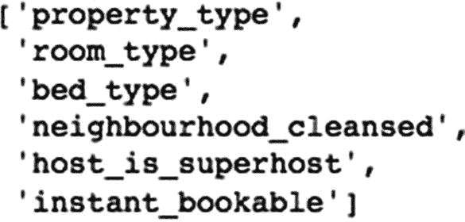

图 6-21

类别型列列表

注意，有六列包含类别值。现在，我们使用以下 `for` 循环构建包含这些类别字段的特征列：

```
categorical_features = []
for col in categorical_columns:
vocabulary = data[col].unique()
cate = tf.feature_column.
categorical_column_with_vocabulary_list
(col, vocabulary)
categorical_features.append
(tf.feature_column.indicator_column(cate))
```

我们首先提取类别列中的唯一值，然后构建词汇表列表，最后将其添加到 `categorical_features` 列表中。如果打印此列表，你会看到如图 6-22 所示的输出。

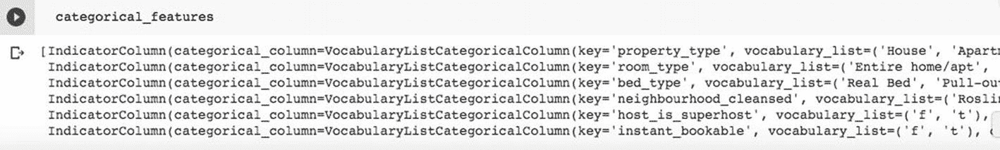

图 6-22

类别型列的特征列

最后，我们将数值型和类别型特征合并到一个列表中，作为参数输入到接下来定义的输入函数中。

```

#### 将两个特征合并为最终的特征列表
features = categorical_features +
numeric_feature
```

### 定义输入函数

输入函数定义如下：

```

#### 用于训练和评估的输入函数
def input_fn(features,labels,training = True,batch_size = 32):
#将输入转换为数据集
dataset=tf.data.Dataset.from_tensor_slices
((dict(features), labels))
#在训练模式下进行打乱和重复
if training:
dataset=dataset.shuffle(10000).repeat()

#### 返回数据批次
return dataset.batch(batch_size)
```

如之前项目所示，该函数将特征和标签作为前两个参数。`training` 参数决定数据是否用于训练；如果是，则对数据进行打乱。`from_tensor_slices` 函数调用为数据管道创建一个张量，以输入到我们的模型。该函数以批次形式返回数据。

### 创建估计器实例

现在我们使用以下语句创建一个预置估计器的实例：

```
linear_regressor = tf.estimator.LinearRegressor(
feature_columns = features,
model_dir = "linear_regressor")
```

注意，我们使用 `LinearRegressor` 类作为回归任务的预置估计器。第一个参数是特征列，它指定了合并后的数值型和类别型列列表。第二个参数是用于保存日志的目录名称。

### 模型训练

我们通过调用 `train` 方法来训练模型：

```
linear_regressor.train(input_fn = lambda:input_fn(xtrain,
ytrain,
training = True),
steps = 2000)
```

输入函数接收 `xtrain` 数据集中的特征数据和 `ytrain` 数据集中的目标值。`training` 参数设置为 `true`，以启用数据打乱。步数将决定训练阶段的轮数。

### 模型评估

我们通过调用 `evaluate` 方法来评估模型：

```
linear_regressor.evaluate(
input_fn = lambda:input_fn
(xtest, ytest, training = False)
)
```

这次，输入函数使用 `xtest` 和 `ytest` 数据集进行评估。典型的评估输出如下所示：

```
{'average_loss': 0.18083459,
'global_step': 2000,
'label/mean': 4.9370537,
'loss': 0.1811692,
'prediction/mean': 4.956979}
```

评估完成后，我们可以通过加载 TensorBoard 查看各项指标。

```
%load_ext tensorboard
%tensorboard --logdir ./linear_regressor
```

TensorBoard 上显示的损失曲线如图 6-23 所示。

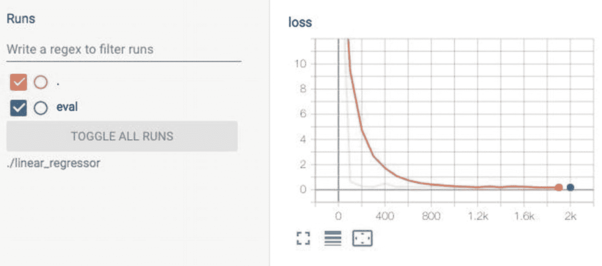

图 6-23

损失指标

### 项目源码

项目的完整代码见代码清单 6-2，方便您快速查阅。

```
import tensorflow as tf
import pandas as pd
import matplotlib.pyplot as plt
import numpy as np
url = 'https://raw.githubusercontent.com/Apress/artificial-neural-networks-with-tensorflow-2/main/ch06/listings.csv'
data = pd.read_csv(url)

#### listing column names
data.columns

#### understanding data
data.describe()

#### Selecting only few columns as our features
data = data[['property_type','room_type',
'bathrooms','bedrooms','beds','bed_type',
'accommodates','host_total_listings_count',
'number_of_reviews','review_scores_value',
'neighbourhood_cleansed','cleaning_fee',
'minimum_nights','security_deposit',
'host_is_superhost','instant_bookable',
'price']]
data.isnull().sum() #nan values
data.head()

#### function to remove $ and , characters
def transform(x):
x = str(x)
x = x.replace('$','')
x = x.replace(",","")
return float(x)
for col in ["cleaning_fee","security_deposit","price"]:
data[col] = data[col].apply(transform)

#### apply function
#filling nan with mean value
data[col].fillna(data[col].mean(),inplace = True)
#filling nan values with mean value
for feature in ["bathrooms","bedrooms","beds",
"review_scores_value"]:
data[feature].fillna(data[feature].mean(),
inplace = True)
data['property_type'].unique()

#### get frequency of all unique values
data['property_type'].value_counts()

#### replacing nan with Apartment
data['property_type'].fillna
('Apartment', inplace = True)
feature = data.drop('price', axis = 1)
#input data
target = data['price']

#### price value histogram
data['price'].plot(kind='hist',grid = True)
plt.title('price distribution')
plt.xlabel('price')

#### make a log transformation to remove skew.
target = np.log(data.price) #output data
target.hist()
plt.title('price distribution after log transformation')
#splitting input and output data for training and testing
from sklearn.model_selection
import train_test_split
xtrain,xtest,ytrain,ytest =
train_test_split
(feature, target, test_size = 0.2,
random_state = 42)

#### selecting numerical feature columns
numeric_columns = feature.select_dtypes
(include = np.number).columns.tolist()
numeric_columns

#### build numeric features array
numeric_feature = []
for col in numeric_columns:
numeric_feature.append
(tf.feature_column.numeric_column(key=col))
numeric_feature
#selecting categorical feature columns
categorical_columns = feature.select_dtypes
(exclude=np.number).columns.tolist()
categorical_columns
categorical_features = []
for col in categorical_columns:
vocabulary = data[col].unique()
cate = tf.feature_column.
categorical_column_with_vocabulary_list
(col, vocabulary)
categorical_features.append
(tf.feature_column.indicator_column(cate))
categorical_features

#### combining both features as our final features list
features = categorical_features +
numeric_feature

#### An input function for training and evaluation
def input_fn(features,labels,training = True,batch_size = 32):
#converts inputs to a dataset
dataset=tf.data.Dataset.from_tensor_slices(
(dict(features), labels))
#shuffle and repeat in a training mode
if training:
dataset=dataset.shuffle(10000).repeat()

#### return batches of data
return dataset.batch(batch_size)
linear_regressor = tf.estimator.LinearRegressor(
feature_columns = features,
model_dir = "linear_regressor")
linear_regressor.train(input_fn = lambda:input_fn(xtrain,
ytrain,
training = True),
steps = 2000)
linear_regressor.evaluate(
input_fn = lambda:input_fn
(xtest, ytest, training = False)
)
%load_ext  tensorboard
%tensorboard --logdir ./linear_regressor
代码清单 6-2
LinearRegressor-Estimator 完整源码
```

本项目演示了如何使用预制的 `LinearRegressor` 来解决线性回归问题。接下来，我将介绍如何构建你自己的自定义估算器。

## 自定义估算器

在上一章中，你开发了一个葡萄酒质量分类器。你使用了三种不同的架构——小型、中型和大型——来比较它们的结果。现在，我将向你展示如何将这些现有的 Keras 模型转换为自定义估算器，以利用估算器提供的各种功能。

### 创建项目

创建一个新的 Colab 项目，并将其重命名为 `ModelToEstimator`。将以下导入语句添加到项目中：

```
import tensorflow as tf
import pandas as pd
from sklearn.model_selection
import train_test_split
from sklearn.preprocessing
import StandardScaler
```

### 加载数据

我们将使用你之前用过的白葡萄酒质量数据。使用以下代码从 UCI 机器学习库将数据下载到你的项目中：

```
data_url='https://raw.githubusercontent.com/Apress/artificial-neural-networks-with-tensorflow-2/main/Ch05/winequality-white.csv'
data=pd.read_csv(data_url,delimiter=';')
```

由于你已经熟悉这些数据，我就不再重复描述了。这里我也不会包含任何数据预处理步骤。我将直接进入特征选择环节。

## 创建数据集

正如你在上一章中所了解的，数据库中的 `quality` 字段被用作目标标签，其余字段则用作特征。为了分离出特征和目标标签，我们使用了以下代码：

```
x = data.iloc[:,:-1]
y = data.iloc[:,-1]
```

所有选定的数值型特征现在都必须缩放到正态分布。

```
sc = StandardScaler()
x = sc.fit_transform(x)
```

我们现在通过使用 `train_test_split` 方法来创建训练/测试数据集。

```
xtrain, xtest, ytrain, ytest =
train_test_split(x, y, test_size =
0.3,random_state = 20)
```

我们将 `xtrain` 的形状捕获到一个变量中；这在定义 Keras 顺序模型时是必需的。

```
input_shape = xtrain.shape[1]
```

## 定义模型

我们使用上一个例子中的小型模型定义。模型定义如下：

```
small_model = tf.keras.models.Sequential([
tf.keras.layers.Dense
(64,activation = 'relu',
input_shape = (input_shape,)),
tf.keras.layers.Dense(1)
])
```

输出层包含一个神经元，它输出一个表示葡萄酒质量的浮点值。请注意，我们像上一章讨论的葡萄酒质量问题一样，将此问题视为回归问题。

我们通过调用模型的 `compile` 方法来编译它：

```
small_model.compile
(loss = 'mse', optimizer = 'adam')
```

我们将其视为回归问题，因此使用 `mse` 作为损失函数。我们将在实例化估算器时使用这个编译好的模型。在此之前，我们先定义输入函数。

### 定义输入函数

输入函数的定义方式与前例相同，如下所示：

```
def input_fn(features, labels,
training = True, batch_size = 32):
#将输入转换为数据集
dataset = tf.data.Dataset.from_tensor_slices
(({'dense_input':features},labels))
#在训练模式下进行打乱和重复
if training:
dataset = dataset.shuffle(1000).repeat()
#为训练提供批量输入
return dataset.batch(batch_size)
```

该函数定义与前例完全相同，无需进一步解释。

现在，是时候将我们的模型转换为估算器了。

### 模型转估算器

为了将现有的 Keras 模型转换为估算器实例，TF 库提供了一个名为 `model_to_estimator` 的函数。该函数的调用方式如下代码所示：

```
keras_small_estimator = tf.keras.estimator.model_to_estimator(
keras_model = small_model,
model_dir = 'keras_small_classifier')
```

该函数接受两个参数：第一个参数指定之前已编译的 Keras 模型，第二个参数指定训练期间日志的存储文件夹名称。函数调用返回一个估算器实例，你可以像前例一样使用它进行训练、评估和预测。

### 模型训练

我们通过在估算器实例上调用 `train` 方法来训练模型，就像我们在前例中所做的那样。

```
keras_small_estimator.train
(input_fn = lambda:input_fn
(xtrain, ytrain), steps = 2000)
```

在训练中，输入函数将特征数据作为 `xtrain`，标签作为 `ytrain`。步数设置为 2000，这决定了训练轮数。由 `training` 参数设置的模式采用默认值 `True`。

## 评估

训练完成后，你可以通过在估算器实例上调用 `evaluate` 方法来评估模型的性能。

```
eval_small_result =
keras_small_estimator.evaluate(
input_fn = lambda:input_fn
(xtest, ytest, training = False),
steps=1000)
print('Eval result: {}'.format
(eval_small_result))
```

这次输入函数为 `training` 参数指定了值，设置为 `False`。之前创建的测试数据用于评估。评估后，结果将打印在控制台上。你可以使用 TensorBoard 查看评估生成的各种指标。

```
%load_ext tensorboard
%tensorboard --logdir ./keras_small_classifier
```

请注意，我们从之前指定的日志文件夹中获取指标。

### 项目源码

项目的完整代码见清单 6-3，供你快速参考。

```
import tensorflow as tf
import pandas as pd
from sklearn.model_selection
import train_test_split
from sklearn.preprocessing
import StandardScaler
data_url='https://raw.githubusercontent.com/Apress/artificial-neural-networks-with-tensorflow-2/main/Ch05/winequality-white.csv'
data=pd.read_csv(data_url,delimiter=';')
x = data.iloc[:,:-1]
y = data.iloc[:,-1]
sc = StandardScaler()
x = sc.fit_transform(x)
xtrain, xtest, ytrain,
ytest = train_test_split
(x, y, test_size = 0.3,random_state = 20)
input_shape = xtrain.shape[1]
small_model = tf.keras.models.Sequential([
tf.keras.layers.Dense
(64,activation = 'relu',
input_shape = (input_shape,)),
tf.keras.layers.Dense(1)
])
small_model.compile
(loss = 'mse', optimizer = 'adam')
def input_fn(features, labels, training =
True, batch_size = 32):
#将输入转换为数据集
dataset = tf.data.Dataset.from_tensor_slices
(({'dense_input':features},labels))
#在训练模式下进行打乱和重复
if training:
dataset = dataset.shuffle(1000).repeat()
#为训练提供批量输入
return dataset.batch(batch_size)
keras_small_estimator = tf.keras.estimator.model_to_estimator(
keras_model = small_model, model_dir =
'keras_small_classifier')
keras_small_estimator.train
(input_fn = lambda:input_fn
(xtrain, ytrain), steps = 2000)
eval_small_result =
keras_small_estimator.evaluate(
input_fn = lambda:input_fn
(xtest, ytest, training = False),
steps=1000)
print('Eval result: {}'.format
(eval_small_result))
%load_ext tensorboard
%tensorboard --logdir ./keras_small_classifier
清单 6-3
ModelToEstimator 完整源码
```

## 预训练模型的自定义估算器

在第 4 章中，你了解了如何使用 TF Hub 中的预训练模型。你已经看到如何在自己的模型定义中重用这些模型。在扩展其架构的同时，也可以将这些模型转换为估算器。以下代码展示了如何扩展 VGG16 模型，并在扩展后的模型上创建自定义估算器。VGG16 是一种先进的深度学习模型，经过训练可将图像分类为 1000 个类别。假设你只想将数据集分类为两个类别——猫和狗。因此，我们只需要一个二分类。为此，我们需要将输出从多分类改为二分类。这个示例展示了如何将 VGG16 的现有输出层替换为单神经元全连接层。

### 创建项目

创建一个新的 Colab 项目，并将其重命名为 `tfhub-custom-estimator`。像往常一样导入 TensorFlow。

```
import tensorflow as tf
```

### 导入 VGG16

使用以下语句将 VGG16 预训练模型导入到你的项目中：

```
keras_Vgg16 = tf.keras.applications.VGG16(
input_shape=(160, 160, 3), include_top=False)
```

模型的输入形状根据原始模型规范设置。`include_top` 参数指定是否移除模型的顶层。显然，我们不想为这个已经训练好的模型重新生成权重。因此，我们将 `trainable` 参数设置为 `false`：

```
keras_Vgg16.trainable = False
```

### 构建你的模型

现在，我们将在加载的 VGG16 模型之上构建我们的模型：

```
estimator_model = tf.keras.Sequential([
keras_Vgg16,
tf.keras.layers.GlobalAveragePooling2D(),
tf.keras.layers.Dense(256),
tf.keras.layers.Dense(1)
])
```

我们通过将 VGG16 作为基础层来构建一个顺序模型。在此之上，我们添加一个池化层，接着是两个全连接层。最后一层是二分类输出层。

你可以打印两个模型的摘要，以查看你所做的更改。

原始模型摘要通过以下语句打印：

```
keras_Vgg16.summary()
```

输出如图 6-24 所示。

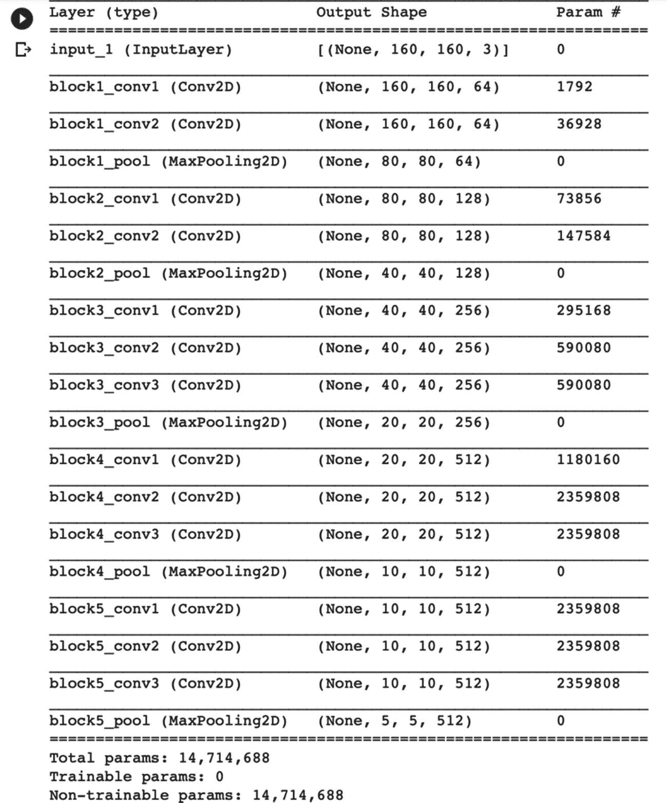

图 6-24

VGG16 模型摘要

如图 6-24 所示，VGG16 模型有多个隐藏层，可训练参数总数超过 1400 万。你可以想象训练这个模型所需的时间和资源。显然，在你的应用中，当你使用这个模型时，你绝不会考虑重新训练它。

现在，你可以打印新构建模型的摘要。

```
estimator_model.summary()
```

输出如图 6-25 所示。

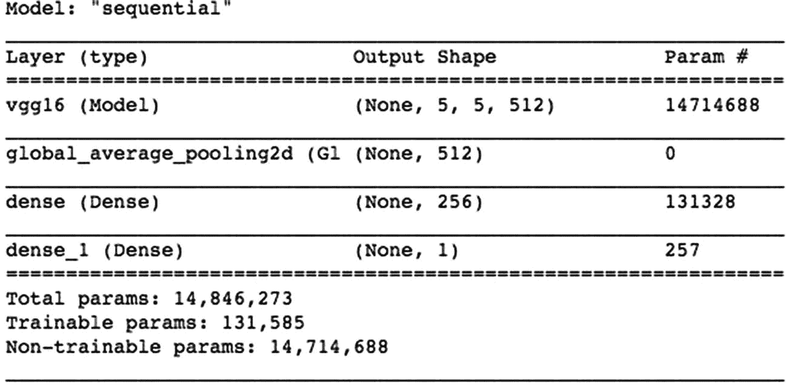

图 6-25

扩展后模型的摘要

在你的模型中，只有大约 10 万个可训练参数。

### 编译模型

像往常一样，使用所需的优化器、损失函数和指标来编译模型：

```
### 编译模型
estimator_model.compile(
optimizer = 'adam',
loss=tf.keras.losses.BinaryCrossentropy
(from_logits = True),
metrics = ['accuracy'])
```

### 创建估算器

你使用 `model_to_estimator` 方法创建一个估算器：

```
est_vgg16 = tf.keras.estimator.model_to_estimator
(keras_model = estimator_model)
```

在训练估算器之前，你需要处理你的图像。

### 数据处理

模型需要尺寸为 160x160 像素的图像。我们使用 TF 示例中给出的以下 `preprocess` 函数对图像进行预处理：

```
IMG_SIZE = 160
import tensorflow_datasets as tfds
def preprocess(image, label):
image = tf.cast(image, tf.float32)
image = tf.image.resize
(image, (IMG_SIZE, IMG_SIZE))
return image, label
```

以下 `Input` 函数将定义猫狗训练数据的数据管道，该数据可在 TensorFlow 内置数据集中获取：

```
def train_input_fn(batch_size):
data = tfds.load('cats_vs_dogs',
as_supervised=True)
train_data = data['train']
train_data = train_data.map(preprocess).shuffle(500).batch
(batch_size)
return train_data
```

### 训练/评估

通过调用估计器的 `train` 方法来训练模型。

```
est_vgg16.train(input_fn =
lambda: train_input_fn(32), steps = 500)
```

模型训练完成后，可以评估其性能：

```
est_vgg16.evaluate(input_fn = lambda: train_input_fn(32), steps=10)
```

请注意，我使用了相同的训练数据集但不同的步长来进行模型评估，因为此处没有单独的测试数据集可用。

评估产生以下结果：

```
{'accuracy': 0.96875, 'global_step': 500, 'loss': 0.27651623}
```

### 项目源码

完整的项目源码见代码清单 6-4。

```
import tensorflow as tf
keras_Vgg16 = tf.keras.applications.VGG16(
input_shape=(160, 160, 3), include_top=False)
keras_Vgg16.trainable = False
estimator_model = tf.keras.Sequential([
keras_Vgg16,
tf.keras.layers.GlobalAveragePooling2D(),
tf.keras.layers.Dense(256),
tf.keras.layers.Dense(1)
])
keras_Vgg16.summary()
estimator_model.summary()
### 编译模型
estimator_model.compile(
optimizer = 'adam',
loss=tf.keras.losses.BinaryCrossentropy
(from_logits = True),
metrics = ['accuracy'])
est_vgg16 = tf.keras.estimator.model_to_estimator
(keras_model = estimator_model)
IMG_SIZE = 160
import tensorflow_datasets as tfds
def preprocess(image, label):
image = tf.cast(image, tf.float32)
image = tf.image.resize
(image, (IMG_SIZE, IMG_SIZE))
return image, label
def train_input_fn(batch_size):
data = tfds.load('cats_vs_dogs',
as_supervised = True)
train_data = data['train']
train_data = train_data.map(preprocess).shuffle(500).batch
(batch_size)
return train_data
est_vgg16.train(input_fn = lambda: train_input_fn(32), steps=500)
est_vgg16.evaluate(input_fn = lambda: train_input_fn(32), steps=10)
代码清单 6-4
VGG16 自定义估计器完整源码
```

这个简单的示例演示了如何将预训练模型应用到自己的模型中。

## 本章小结

估计器通过提供统一的训练、评估和预测接口，简化了模型开发流程。它们将数据管道与模型开发分离，从而让你能够轻松地使用不同的数据集进行实验。估计器分为预定义估计器和自定义估计器。在本章中，你学习了如何使用预定义估计器处理分类和回归两类问题。自定义估计器用于将现有模型迁移到估计器接口，以利用估计器提供的优势。基于估计器的模型可以在分布式环境甚至 CPU/GPU/TPU 上进行训练。一旦你使用估计器开发了模型，即使是在分布式环境中，也可以轻松部署而无需修改任何代码。你还学习了如何在构建自己的模型时使用像 VGG16 这样的预训练模型。建议尽可能使用预训练模型。如果它不能满足你的需求，再考虑创建自定义估计器。

