# 7. 文本生成

在本书中，到目前为止你使用的都是普通神经网络，即那些不具备记忆过去能力的网络。它们接受固定大小的向量作为输入，并产生固定大小的输出。以图像分类为例，输入是一张图像，输出是模型训练过的类别之一。现在，考虑一种情况，即预测需要依赖先前预测的结果。举个例子，假设你在看电影。你的大脑会不断猜测下一个场景是什么。这种猜测不仅依赖于刚刚发生的情节，还可能依赖于 15 分钟前甚至一小时前（对于长电影）发生的事情。我们使用的普通神经网络，就其工作方式而言，没有记忆来记住过去发生的事情，也无法将这种知识应用于当前的猜测。

再举一个例子：我说我来自印度。好的，你获得了“我来自印度”这个信息。过了一段时间，有人让你猜我说什么语言。你回答“印度国语”的概率很大程度上取决于你是否还记得我来自印度。我们目前所见的神经网络根本无法解决这类问题。这正是循环神经网络（RNN）及其特殊版本——长短期记忆网络（LSTM）登场的原因。在本章中，你将了解 RNN 和 LSTM，随后会有一个文本生成的示例。后续所有章节也将使用这些网络来解决不同领域的问题。因此，充分理解本章内容将有助于你更好地理解后续章节。

在本章中，我们将训练基于字符级别的 RNN 语言模型。我们将一段文本作为输入提供给模型，训练模型理解文本中字符的序列关系，然后让模型预测用户指定字符序列的下一个字符出现的概率。简而言之，如果有人让你预测字符序列 `"hell"` 之后的下一个字符，你很可能会回答 `"o"`。这是因为字符 `"o"` 的概率在所有字母中最高。我们将训练我们的网络来执行此类预测。

具体来说，我将讨论两个文本生成应用；第一个应用比较简单，旨在让你熟悉该过程的细节。在这个简单的应用中，你将训练模型根据其对现有名字的了解来生成婴儿名字。第二个应用则更具挑战性，我们将尝试让模型学习一部著名小说的语义和写作风格，然后创作一部新的小说。

那么，首先让我们尝试理解什么是循环神经网络。

# 循环神经网络

与你用于图像分类问题的卷积神经网络类似，RNN 也已存在数十年之久。然而，直到最近，随着可供研究人员使用的计算资源日益增长，其全部潜力才得以充分发挥。如今，RNN 被用于语音转文本转录、语言翻译、手写文本生成、时间序列预测，并已成为强大的语言模型。在计算机视觉应用中，我们也能看到 RNN 的身影，例如帧级视频分类、图像描述生成、视觉问答等。当前，RNN 及其变体有着众多应用。在本书的后续章节中，你将学习如何使用 RNN 来开发各类此类应用。

RNN 使我们能够处理向量序列，这些序列可以是输入、输出，或者最常见的情况是两者兼有。图 7-1 展示了三种模型。

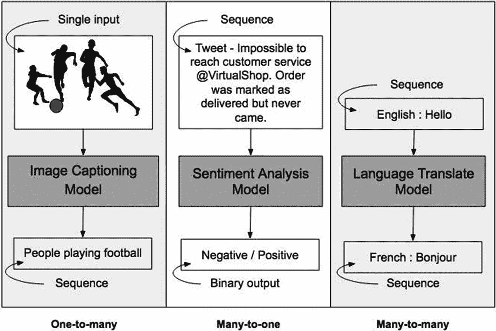

图 7-1

说明：具有不同输入/输出的神经网络模型

请看图 7-1 中所示的图像描述生成神经网络模型。它接收单个输入，即一张图像。然后为图像生成一个描述，即一个单词/字符序列。在图 7-1 所示的情绪分析模型中，模型的输入是一条推文，它由一个单词/字符序列组成。模型产生的输出是负面或正面情绪，这是一个二值输出，即单个输出。最后，考虑一个接受序列作为输入并输出另一个序列的模型。图 7-1 所示的语言翻译模型接收一个英文单词/句子，并输出其法语翻译，这同样是一个单词/句子序列。

在阐述了 RNN 的优势之后，接下来让我描述一个简单 RNN 的架构。

## 简单 RNN

借助图 7-2 所示的架构图，可以最好地描述 RNN。

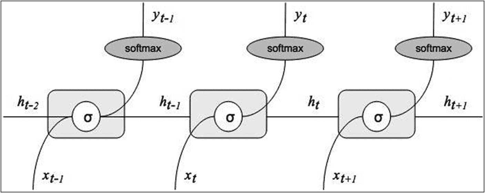

图 7-2

RNN 架构

在每个节点处，`X[i]` 是输入向量，`h[i]` 是输出。整个网络中除第一个节点外的每个节点，都会接收前一个节点的输出作为额外输入。同样，该网络由多个节点组成，每个节点的输出不仅受其自身输入的影响，还受先前节点推理结果的影响。因此，RNN 可以被视为一种旨在识别数据序列中模式的人工神经网络。简而言之，RNN 不仅接收当前输入，还会考虑其在时间上先前感知到的信息，因此网络接收两个输入：当前值和过去值。问题在于，我们要让 RNN 考虑过去值的深度是多少。当你训练深度较大的 RNN 时，会遇到一个众所周知的梯度消失问题。在具有大量层的网络训练中，梯度消失和梯度爆炸问题广为人知。RNN 本质上处理的是可能规模相当大的序列，因此容易发生梯度消失。在讨论这个问题的解决方案之前，让我先简要描述一下什么是梯度消失和梯度爆炸。

## 梯度消失与梯度爆炸

在神经网络模型训练期间，梯度会一直反向传播到初始层。在每一层，它们都会经历连续的矩阵乘法。对于较深的网络，由于链较长，梯度会呈指数级收缩，趋近于远小于 1 的值，最终消失，导致模型停止进一步学习。这被称为梯度消失问题。另一方面，如果梯度值大于 1，它们会随着在链中传播而变得更大，最终爆炸导致模型崩溃。这被称为梯度爆炸问题。

通过以上讨论，你可以很容易理解为什么 RNN 容易发生梯度消失问题。为了克服这个问题，人们提出了一种称为长短期记忆网络的新模型，接下来我将对此进行讨论。

## LSTM – 一种特殊情况

长短期记忆网络，通常称为 LSTM，是一种特殊的 RNN。它们能够学习长期依赖关系，同时避免简单 RNN 模型中出现的梯度消失问题。Hochreiter 和 Schmidhuber 于 1997 年首次提出 LSTM。后来，许多人对其进行了改进和推广。如今，LSTM 被广泛用于解决各种问题。

开发 LSTM 的主要动机是让模型能够长时间记住信息。这应该是它们的默认行为，而不是需要费力去实现的事情。

与其他循环神经网络一样，LSTM 具有重复模块链的形式，只是重复模块的内部架构与标准 RNN 不同。标准 RNN 模块及其链已在图 7-2 中展示。RNN 中的每个模块都具有简单的结构，例如图 7-2 中所示的单个 `tanh` 层。与此相反，LSTM 模块的结构更为复杂。LSTM 模块如图 7-3 所示。

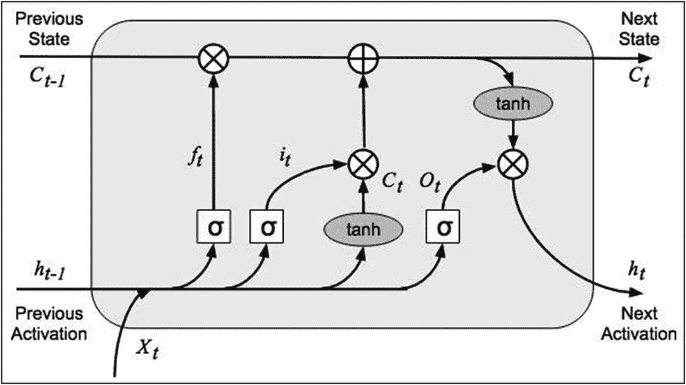

图 7-3

LSTM 架构

每个重复模块包含四个网络层。它们以一种非常特殊的方式相互交互。在 LSTM 中，信息通过一种称为细胞状态的机制流动。整个流程可以借助以下四个细胞状态来解释：

- 遗忘门
- 输入门
- 更新门
- 输出门

我将简要描述每个门的作用。

### 遗忘门

遗忘门在我们的 LSTM 模块中高亮显示，如图 7-4 所示。

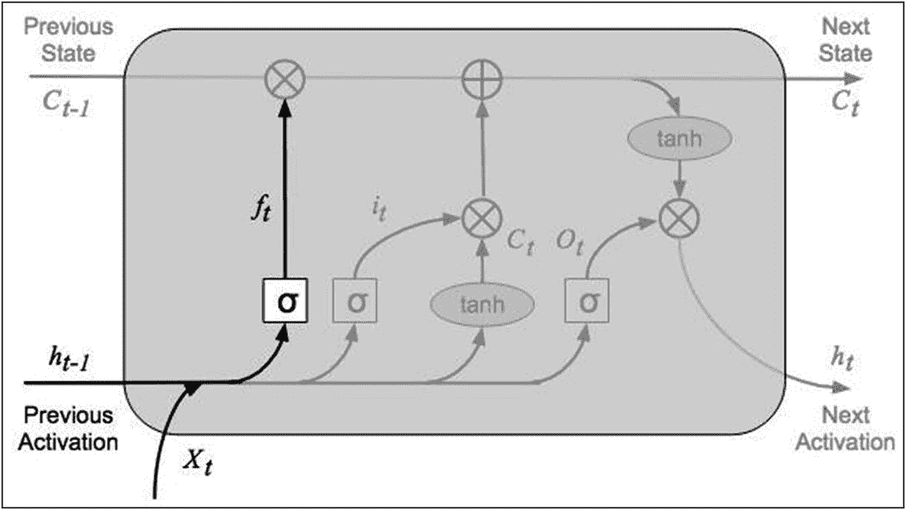

图 7-4

遗忘门

遗忘门层具有一个 sigmoid 函数（`σ`），用于决定丢弃或保留哪些信息。该层的输入是前一个隐藏状态（`h[t-1]`）和当前输入（`x[t]`），输出是二值。对于细胞状态 `C[t-1]` 中的每个数字，输出 False 告诉网络遗忘该信息，输出 True 则要求网络保留该信息。数学上，这用以下方程表示：

```
f_t = σ(W_f . [h_{t-1}, x_t] + b_f)
```

### 输入门

输入门在图 7-5 中高亮显示。

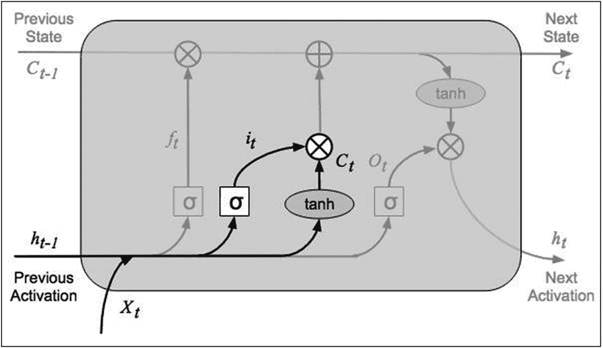

图 7-5

输入门

sigmoid 输入层决定我们将更新哪些值，而 `tanh` 激活层创建一个新的候选值向量 `C̃_t`。数学上，这表示为

```
i_t = σ(W_i . [h_{t-1}, x_t] + b_i)
```

```
C̃_t = tanh(W_c . [h_{t-1}, x_t] + b_c)
```

### 更新门

更新门在图 7-6 中高亮显示。

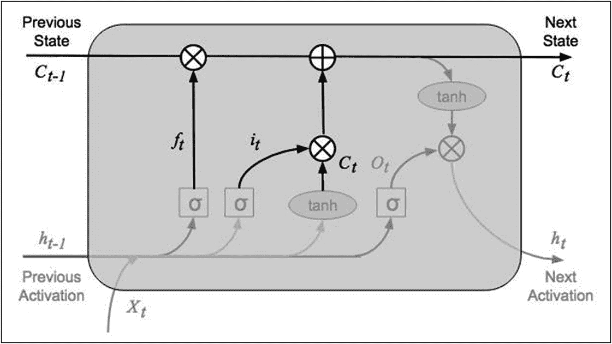

图 7-6

更新门

此处，旧的细胞状态 `C[t-1]` 与 `f[t]` 相乘，并加上 `i[t] * C[t]`，从而将旧的细胞状态更新为新的细胞状态 。数学上，其表达式为：

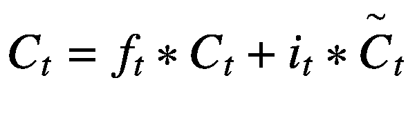

### 输出门

输出门在图 7-7 中高亮显示。

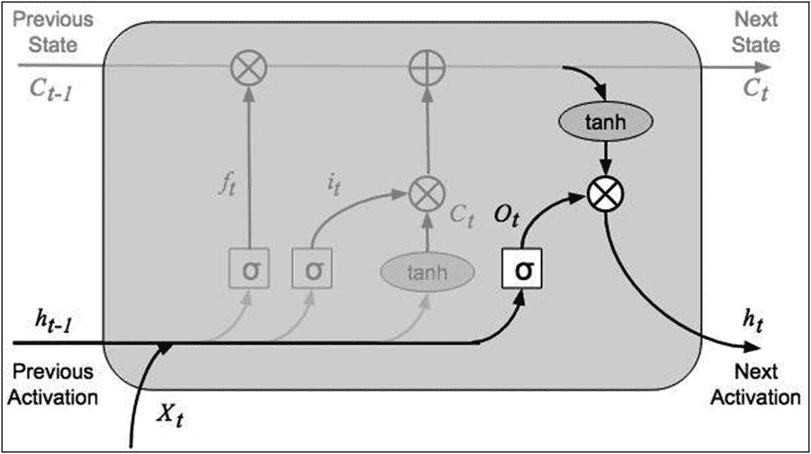

图 7-7

输出门

首先，sigmoid 层决定我们将保留细胞状态的哪一部分。然后，我们将细胞状态输入 `tanh` 激活函数，并将其与 sigmoid 门的输出相乘，以得到最终输出。数学上，其表达式为：

![$$ {o}_t=\sigma \left({W}_o\left[{h}_{t-1,}{x}_t\right]+{b}_o\right) $$](images/495303_1_En_7_Chapter/495303_1_En_7_Chapter_TeX_Eque.png)


因此，通过这种对 RNN 模块的增强，LSTM 实现了长短期记忆，并克服了简单 RNN 中出现的梯度消失问题。

凭借长期记忆的能力，LSTM 被广泛应用于许多领域。在本章中，我将重点介绍 LSTM 在语言模型中的应用。说到语言模型，它又有众多应用，其中一些列举如下：

-   在打字时预测下一个字符或单词
-   单词或句子补全
-   学习大量文本的句法和语义含义，例如，学习莎士比亚和阿加莎·克里斯蒂的风格，并以其风格生成新故事
-   神经机器翻译

在介绍了所有这些理论之后，我将继续向你演示 LSTM 在文本生成中的应用。

### 文本生成

一个语言句子是一系列字符，它们向读者传达句法和语义含义。每位作者也有自己的写作风格。我们在文本生成中的任务是创建一个遵循作者写作风格的新文本，并且使生成的文本也具有句法和语义含义。例如，你可能想根据莎士比亚的写作风格写一部新小说，或者根据先前判决的法律案例创建一份法律文件，并遵循撰写此类文件的法律写作风格。你甚至可能想通过理解其他 Python 程序的语法和语言结构来生成 Python 计算机源代码。可能性是无限的。其中大多数都需要大量的资源和时间处理。在接下来的示例中，我将向你展示如何生成婴儿名字——这是一个可以应用文本生成的简单示例，随后是一个更实际的示例，即根据一部著名小说的文本生成文本。

让我先描述一下文本生成背后的一些理论。

### 模型训练

由于我们希望在字符级别进行预测，我们将整个文本划分为称为序列的字符组。考虑下面这段取自我们将用于训练的文本：

> *“Investors so much about their startup hubs. As a lot of mind I don’t know the more airborning case of the European of the schedule, and from such sites …”*

我们将把这个输入分割成每 25 个字符的序列。如图 7-8 所示。

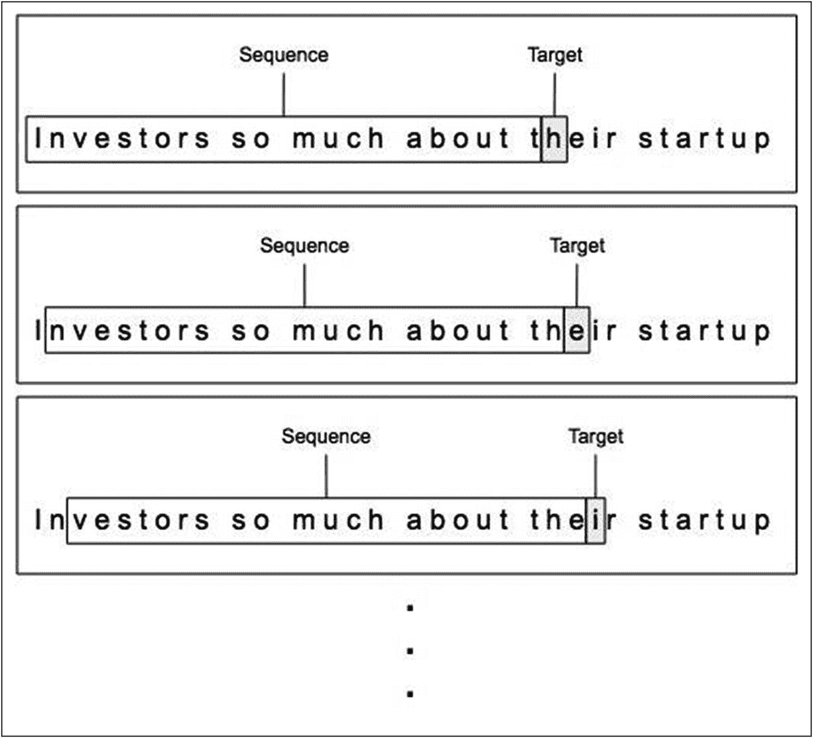

图 7-8

将输入文本切片为序列

前 25 个字符将按其出现的顺序组合在一起，形成第一个序列。该序列后面跟着字符 `h`。因此，我们训练网络，对于这个给定的字符序列，下一个字符应该是 `h`。然后，我们将窗口向右移动一个字符，对于新序列，我们告诉模型该序列的下一个字符是 `e`。接着再进行一次窗口移动，如最后一个序列所示，下一个字符将是 `i`。同样，我们针对整个语料库持续训练模型，告诉它对于文本中任何给定的 25 个字符序列，下一个字符是什么。现在，你会理解为什么简单的 DNN（深度神经网络）不能用于此类应用，因为这些应用需要长期记忆来记住序列及其后续字符。

一旦模型训练完成，希望它已经学习了文本的写作风格、句法和语义。显然，你提供的语料库越多，模型获得的理解就越好。这相当于一个事实：在阅读了阿加莎·克里斯蒂的几部小说后，一个人开始理解她的写作风格。训练完成后，我们如何使用模型来生成具有其学习风格的新文本呢？

### 推理

我们遵循与训练期间类似的步骤。我们从包含预定义序列的种子开始。假设我们定义一个 25 个字符的窗口大小，就像我们在训练期间所做的那样。用于推理的窗口大小不必与训练期间使用的相同。基于给定的 25 个字符序列，我们要求模型预测第 26 个字符。我们将预测结果作为预测文本的一部分存储起来。然后，我们将窗口向右移动一个字符，这次将预测的字符作为新序列中的最后一个（第 25 个）字符。对于这个新创建的序列，我们要求模型预测下一个字符。新的预测将被添加到下一个序列中，依此类推。同样，我们可以要求模型预测给定输入种子之后的任意数量的字符。如果模型已经很好地学习了这些序列，它将生成有意义的文本。在本章的大型语料库示例中，我将向你展示长时间训练过程中的逐步结果。

### 模型定义

我们用于训练的网络模型将主要由多个 LSTM 层组成，如图 7-9 所示。

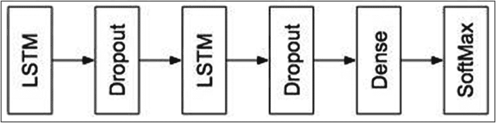

图 7-9

用于文本生成的神经网络

每个 LSTM 层将由大量节点组成。节点数量越多，模型的长期记忆能力就越强。然而，这也意味着需要训练大量的权重。通过使网络变深，即增加更多 LSTM 层，模型可以很好地学习复杂数据。对于每个 LSTM 层，`return_sequences` 参数将设置为 `True`，因为它将其输出连接到下一个 LSTM 层。对于最后一个 LSTM 层，此参数将设置为 `False`，其输出被馈送到一个 `Dense` 层，用于根据每个可能字符的概率分数进行字符分类。为此，我们使用 `softmax`。

在介绍了所有这些理论之后，现在让我们进入一个实际示例，以便更好地理解这些理论。我接下来要描述的应用是，给定一组已知名字，生成婴儿名字。

# 生成婴儿名字

在本项目中，你将使用著名文本生成博客文章——*循环神经网络的不合理有效性*（`http://karpathy.github.io/2015/05/21/rnn-effectiveness/`）中给出的数据集。该数据集包含多个已知的婴儿名字，每个名字由换行符分隔。你将使用这些名字来训练 LSTM 模型，使其记住数据集中定义的序列。训练完成后，你将要求模型根据其学习到的语义预测一些新名字。

### 创建项目

创建一个新的 Colab 项目，并将其重命名为 `TextGenerationBabyNames`。导入所需的库。

```
import sys
import re
import requests
import numpy as np
import tensorflow as tf
from tensorflow.keras import Sequential
from tensorflow.keras.callbacks import ModelCheckpoint
from tensorflow.keras.layers import Dense, Activation, Dropout, LSTM
```

## 下载文本

要下载数据集，请对以下命令中指定的 URL 发起 HTTP 请求：`r = requests.get('https://cs.stanford.edu/people/karpathy/namesGenUnique.txt')`

请求成功后，你可以通过将响应中的文本复制到本地变量中来提取数据集：

```
raw_txt = r.text
```

通过调用 `raw_txt` 上的 `len` 方法来检查读取的数据长度：

```
len(raw_txt)
```

你将得到输出 `52127`，表明数据集中总共有 52,127 个字符。要查看数据的样子，只需在终端上打印 `raw_txt`：

```
raw_txt
```

该命令及其输出如图 7-10 所示。

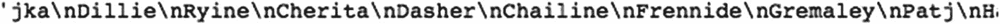

**图 7-10** 数据文件内容

你会看到一个长列表，其中包含由换行符分隔的名字。你可以使用 `print` 语句将它们逐行打印出来，查看前几个名字：

```
print(raw_txt[:100])
```

你将看到以下输出：

```
jka
Dillie
Ryine
Cherita
Dasher
Chailine
Frennide
Gremaley
Patj
Handi
Gully
Wennie
Ferentra
Jixandli
```

程序打印了前 100 个字符。这些名字的长度显然是可变的。

## 处理文本

为了将数据输入到我们的模型中进行训练，我们必须去掉 `\n` 字符。我们使用以下命令将其替换为空格：

```
raw_txt = raw_txt.replace('\n', ' ')
```

现在，我们通过创建一个集合来提取 `raw_txt` 中的所有唯一字符：

```
set(raw_txt)
```

部分输出如图 7-11 所示。

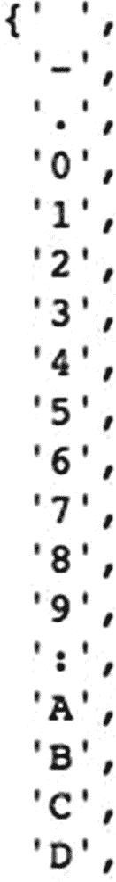

**图 7-11** 唯一字符集

如你所见，该集合包含空格、短划线（`-`）、点（`.`）、冒号（`:`）和数字（0 到 9）等字符。在训练模型之前，应从集合中移除这些字符，因为它们对模型将要生成的新名字没有用处。我们使用正则表达式来移除这些字符。

```
raw_txt = re.sub('[-.0-9:]', '', raw_txt)
```

此外，在生成的婴儿名字中，我们不需要同时存在大写和小写字符。因此，我们通过调用 `lower` 方法将所有字符转换为小写：

```
raw_txt1 = raw_txt.lower()
set(raw_txt1)
```

尝试再次打印该集合，你会注意到它只包含小写字母和空格字符。

你可能会想，如果我们最终只需要一组小写字母和空格字符，为什么还要进行整个数据处理练习。为了生成婴儿名字，目标字符集只包含字母和用于分隔名字的空格。然而，在更高级的文本生成应用中，例如生成包含数学公式的文档、法律文件、科学摘要等，你的目标字符集会大得多，包含各种字符。但是，采用较大的目标字符集也会导致训练时间呈指数级增长。因此，通常我们会从原始文本中剔除一些不需要的字符。这种移除不需要字符的文本处理可以加快训练速度。

你现在可以检查这个新集合的大小：

```
len1 = len(set(raw_txt1))
print(len1)
```

它会在你的终端上打印 `27`。

由于模型处理的是数字而不是字母，你需要将字母映射到不同的数字。此外，当模型输出预测时，它会发送一组数字，这些数字必须转换回字母才能理解。因此，我们为这些映射创建两个数组。这通过以下代码片段完成：

```
chars = sorted(list(set(raw_txt1)))
arr = np.arange(0, len1)
char_to_ix = {}
ix_to_char = {}
for i in range(len1):
    char_to_ix[chars[i]] = arr[i]
    ix_to_char[arr[i]] = chars[i]
```

`char_to_ix` 数组将提供从集合中的字符到唯一整数的映射，而 `ix_to_char` 将提供从整数到字符的反向映射。尝试打印 `ix_to_char` 数组，你将看到如图 7-12 所示的部分输出。

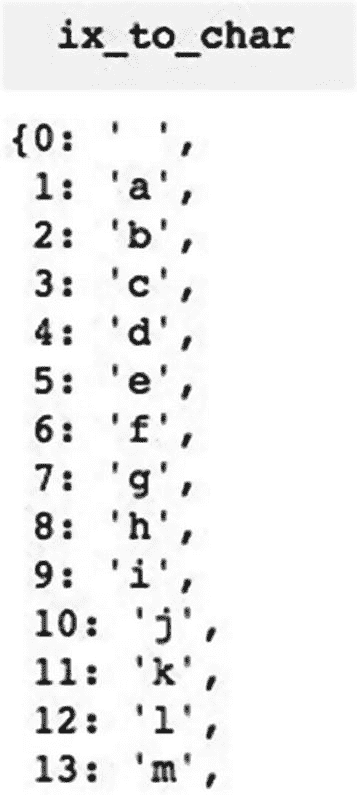

**图 7-12** 预处理后的唯一字符集

现在，你将使用以下代码片段创建输入和输出序列：

```
maxlen = 5
x_data = []
y_data = []
for i in range(0, len(raw_txt1) - maxlen, 1):
    in_seq = raw_txt1[i: i + maxlen]
    out_seq = raw_txt1[i + maxlen]
    x_data.append([char_to_ix[char] for char in in_seq])
    y_data.append([char_to_ix[out_seq]])
nb_chars = len(x_data)
print('Text corpus: {}'.format(nb_chars))
print('Sequences # ', int(len(x_data) / maxlen))
```

请注意，我们定义了一个长度为 5 的序列。因此，前五个字符将是输入，第六个字符将是目标。在下一个循环中，第 2 到第 6 个字符将是输入序列，第 7 个字符将是目标，依此类推。因此，在 `for` 循环中，我们创建了用于训练模型的 `x_data`，`y_data` 是训练期间使用的目标值。前面代码片段的输出如下：

```
Text corpus: 52038
Sequences #  10407
```

数据集包含 52,038 个字符，被划分为 10,407 个序列，每个序列长度为 5。

接下来，我们将数据转换为 numpy 数组以输入到我们的模型，并将训练数据归一化到 0 到 1 的范围内。

```
x = np.reshape(x_data, (nb_chars, maxlen, 1))
x = x / float(len(chars))
```

我们将目标序列转换为分类列。

```
y = tf.keras.utils.to_categorical(y_data)
y[:1]
```

在前面的语句中，当你打印转换后 `y_data` 中的某个项目时，你会看到如图 7-13 所示的输出。

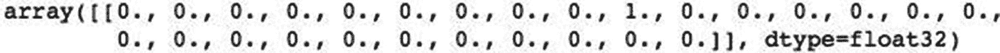

**图 7-13** 分类后的目标数据示例

在这个数组中，其中一个值为 1，其余为 0。值 1 对应于 `char_to_ix` 数组中该特定索引处的字符。

你现在可以打印 `x_data` 的形状：

```
x.shape
```

输出为

```
(52038, 5, 1)
```

这表明输入有 52,038 个序列，每个序列长度为 5。你也可以通过调用 `y.shape` 来检查 `y` 的大小。

```
y.shape
```

输出为

```
(52038, 27)
```

输出中有 27 个类别。

## 定义模型

我们按如下方式定义模型：

```python
model = tf.keras.Sequential([
    tf.keras.layers.LSTM(256,
                         input_shape=(maxlen, 1),
                         return_sequences=True),
    tf.keras.layers.LSTM(256,
                         return_sequences=True),
    tf.keras.layers.Dropout(0.2),
    tf.keras.layers.LSTM(64),
    tf.keras.layers.Dropout(0.2),
    tf.keras.layers.Dense(len(y[1]),
                          activation='softmax')
])
```

模型摘要如下所示：

```
Model: "sequential"
____________________________________________________
Layer (type)          Output Shape        Param #
====================================================
lstm (LSTM)           (None, 5, 256)      264192
____________________________________________________
lstm_1 (LSTM)        (None, 5, 256)       525312
____________________________________________________
dropout (Dropout)    (None, 5, 256)       0
____________________________________________________
lstm_2 (LSTM)        (None, 64)           82176
____________________________________________________
dropout_1 (Dropout)  (None, 64)           0
____________________________________________________
dense (Dense)        (None, 27)           1755
====================================================
Total params: 873,435
Trainable params: 873,435
Non-trainable params: 0
```

如您所见，该模型包含三个 LSTM 层，每层由 500 个节点组成。每个 LSTM 层之后是一个 dropout 率为 20% 的 dropout 层。最后一层是一个包含 27 个节点的 Dense 层，通过 softmax 激活函数进行分类。请注意，我们的数据有 27 个分类输出。模型的视觉表示如图 7-14 所示。

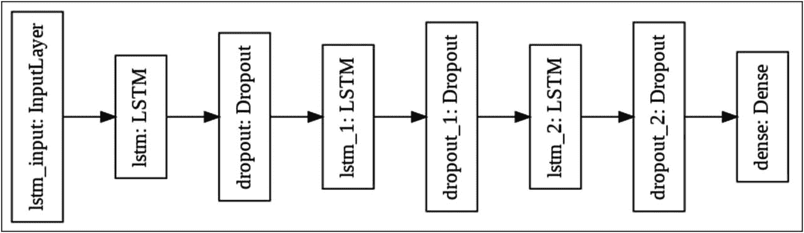

**图 7-14** 模型架构层

## 编译

我们使用分类交叉熵和 Adam 优化器来编译模型。

```python
model.compile(loss='categorical_crossentropy',
              optimizer='adam')
```

请注意，对于这类语言模型问题，没有测试数据集。我们对整个数据集进行建模，以预测序列中每个分类字符的概率。模型完美预测下一个字符的准确率对我们来说并不重要。相反，我们关注的是最小化所选的损失函数。因此，我们试图在泛化能力和过拟合之间取得平衡，避免死记硬背。

## 创建检查点

训练 LSTM 网络通常需要很长时间。由于网络本身的特性，每个 epoch 后的损失可能会增加或减少。最低的损失最终会为我们带来最佳的预测结果。因此，我们需要捕获产生最低损失的 epoch 的模型权重。这可以通过使用 `ModelCheckPoint` 方法并在每个 epoch 后设置回调来实现。

```python
filepath = "model_weights_babynames.hdf5"
checkpoint = ModelCheckpoint(filepath,
                             monitor='loss', verbose=1,
                             save_best_only=True, mode='min')
model_callbacks = [checkpoint]
```

您之前在第 4 章的一个项目中已经使用过诸如提前停止之类的回调，因此这是另一种类型的回调，它将在每个 epoch 后被调用。

## 训练

现在我们通过调用 `fit` 方法来训练模型。

```python
model.fit(x, y, epochs=300, batch_size=32,
          callbacks=model_callbacks)
```

我将 epoch 数设置为 10，批次大小设置为 32 个序列。稍后我将向您展示增加这两个变量值的效果。当我在 GPU 上运行此代码时，每个 epoch 的训练时间大约为 6 秒，这对我们来说是合理的。我想在此说明，我如此关注训练时间的原因是，在大型语料库上训练 LSTM 并拥有大量分类输出时，即使您在一组 GPU 上使用分布式训练，也需要数小时才能完成。

训练结束后，让我们尝试进行一些预测。

### 预测

我们首先需要创建一个输入序列。目前，我们从原始数据库中定义一个输入序列。它通过以下代码片段定义：

```python
pattern = []
seed = 'handi'
for i in seed:
    value = char_to_ix[i]
    pattern.append(value)
```

我们使用的序列是“handi”——长度为 5。请注意，我们的模型定义期望输入序列大小为 5。种子序列中的每个字符都通过我们之前创建的 `char_to_ix` 数组转换为其整数值。

现在，我们将设置一个 for 循环，以预测给定序列“handi”之后的 100 个字符。作为参考，我们首先打印种子，并将词汇表中的字符数设置为 `n_vocab` 变量。

```python
print(seed)
n_vocab = len(chars)
```

我们设置循环来进行 100 次预测。

```python
for i in range(100):
```

我们首先使用以下两条语句重塑此输入模式并归一化其内容：

```python
X = np.reshape(pattern, (1, len(pattern), 1))
X = X / float(n_vocab)
```

我们将此输入馈送到模型，并要求它预测给定模式之后的下一个字符：

```python
int_prediction = model.predict(X, verbose=0)
```

我们提取具有最大预测概率的字符的索引，并使用我们之前创建的 `ix_to_char` 数组将其转换为字符。

```python
index = np.argmax(int_prediction)
prediction = ix_to_char[index]
```

我们在终端上打印预测的字符：

```python
sys.stdout.write(prediction)
```

我们将此字符附加到我们的模式中，并通过提取最后五个字符（即我们的输入序列长度）来重新创建一个新模式。使用这个新模式，我们要求模型进行下一次预测。同样，我们将要求模型以我们定义为种子的输入序列开始，进行 100 次预测。

```python
pattern.append(index)
pattern = pattern[1:len(pattern)]
```

用于生成 100 个字符的整个 for 循环在代码清单 7-1 中给出，供您快速参考。

```python
print(seed)
n_vocab = len(chars)
for i in range(100):
    X = np.reshape(pattern, (1, len(pattern), 1))
    X = X / float(n_vocab)
    int_prediction = model.predict(X, verbose=0)
    index = np.argmax(int_prediction)
    prediction = ix_to_char[index]
    sys.stdout.write(prediction)
    pattern.append(index)
    pattern = pattern[1:len(pattern)]
```

**代码清单 7-1** 用于预测 100 个字符的循环

### 完整源码 – `TextGenerationBabyNames`

婴儿名字生成项目的完整源码见代码清单 7-2。

```
import sys
import re
import requests
import numpy as np
import tensorflow as tf
from tensorflow.keras import Sequential
from tensorflow.keras.callbacks
import ModelCheckpoint
from tensorflow.keras.layers
import Dense, Activation,
Dropout, LSTM
r = requests.get('https://cs.stanford.edu/people/karpathy/namesGenUnique.txt')
raw_txt = r.text
len(raw_txt)
raw_txt
print(raw_txt[:100])
set(raw_txt)
len(set(raw_txt))
raw_txt = raw_txt.replace('\n' , ' ')
set(raw_txt)
len(set(raw_txt))
raw_txt = re.sub('[-.0-9:]' , '' , raw_txt)
len(set(raw_txt))
raw_txt1 = raw_txt.lower()
set(raw_txt1)
len1 = len(set(raw_txt1))
print (len1)
len1
chars = sorted(list(set(raw_txt1)))
arr = np.arange(0, len1)
char_to_ix = {}
ix_to_char = {}
for i in range(len1):
char_to_ix[chars[i]] = arr[i]
ix_to_char[arr[i]] = chars[i]
char_to_ix
ix_to_char
#print("Total length of file  : {}".format(len(raw_txt1)))
maxlen = 5
x_data = []
y_data = []
for i in range(0, len(raw_txt1) - maxlen, 1):
in_seq  = raw_txt1[i: i + maxlen]
out_seq = raw_txt1[i + maxlen]
x_data.append([char_to_ix[char]
for char in in_seq])
y_data.append([char_to_ix[out_seq]])
nb_chars = len(x_data)
print('Text corpus: {}'.format(nb_chars))
print('Sequences # ', int(len(x_data) / maxlen))
#y_data[:5]
#x_data[1][:]
x = np.reshape(x_data , (nb_chars , maxlen , 1))
x = x/float(len(chars))
y = tf.keras.utils.to_categorical(y_data)
y[:1]
x.shape
y.shape
model = tf.keras.Sequential([
tf.keras.layers.LSTM(256,
input_shape = (maxlen, 1),
return_sequences = True),
tf.keras.layers.LSTM(256,
return_sequences = True),
tf.keras.layers.Dropout(0.2),
tf.keras.layers.LSTM(64),
tf.keras.layers.Dropout(0.2),
tf.keras.layers.Dense(len(y[1]),
activation='softmax')
])
model.summary()
model.compile(loss = 'categorical_crossentropy',
optimizer = 'adam')
filepath = "model_weights_babynames.hdf5"
checkpoint = ModelCheckpoint(filepath,
monitor = 'loss', verbose = 1,
save_best_only = True, mode = 'min')
model_callbacks = [checkpoint]
model.fit(x,y, epochs = 300, batch_size = 32 ,
callbacks = model_callbacks)
pattern = []
seed = 'handi'
for i in seed:
value = char_to_ix[i]
pattern.append(value)
print(seed)
n_vocab = len(chars)
for i in range(100):
X = np.reshape(pattern , (1, len(pattern) , 1))
X = X/float(n_vocab)
int_prediction = model.predict(X , verbose = 0)
index = np.argmax(int_prediction)
prediction = ix_to_char[index]
sys.stdout.write(prediction)
pattern.append(index)
pattern = pattern[1:len(pattern)]
from google.colab import drive
drive.mount('/content/drive')
cd 'My Drive'
model.save('baby_names_model.h5')
from tensorflow.keras.models import load_model
saved_model = load_model('baby_names_model.h5')
pattern = []
seed = 'bgajm'
for i in seed:
value = char_to_ix[i]
pattern.append(value)
print(seed)
n_vocab = len(chars)
for i in range(100):
X = np.reshape(pattern , (1, len(pattern) , 1))
X = X/float(n_vocab)
int_prediction = saved_model.predict
(X , verbose = 0)
index = np.argmax(int_prediction)
prediction = ix_to_char[index]
sys.stdout.write(prediction)
pattern.append(index)
pattern = pattern[1:len(pattern)]
Listing 7-2
TextGenerationBabyNames full source
```

运行代码后，我得到了如图 7-15 所示的输出。

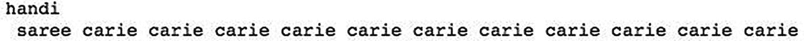

图 7-15

种子 `"handi"` 生成的婴儿名字

网络可能已经很好地生成了有意义的名字。现在，你可以尝试增加训练轮数，看看预测结果是否有改进。

当我将模型重新训练 50 轮，批次大小为 128 时，对于相同的种子 `"handi"`，我得到了如图 7-16 所示的输出。

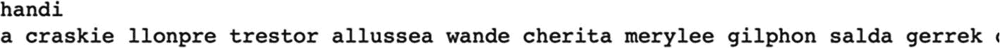

图 7-16

50 轮训练后的婴儿名字

根据个人对名字的偏好，这看起来可能更好。至少，名字没有重复。

这里需要理解的关键点是：通过增加训练轮数、增加 LSTM 层节点数、增加 LSTM 层数、调整序列长度等操作，可能会提高预测质量。事实上，理论上，经过充分训练的大型网络，对于原始文本中的已知种子，能够生成与原始文本完全相同的输出。这相当于说，一个拥有图像式记忆的人能够按原始顺序复现原文。通过这个讨论，我们了解到 LSTM 神经网络可以有效地用于自主生成模仿原文的高质量文本。

就我们生成婴儿名字的应用而言，使用网络生成数据库中已存在的名字是没有意义的。要生成数据库中不存在但听起来与现有名字相似的名字，你需要用原始文本中不存在的输入序列作为网络的种子。通常，人们会生成一个随机种子。我尝试了随机种子 `"bgajm"`，得到了如图 7-17 所示的输出。

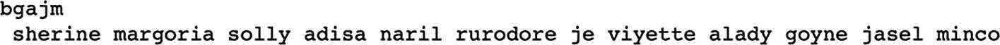

图 7-17

使用随机种子生成的名字

在进入更复杂的文本生成问题之前，我想指出网络训练时间对批次大小的另一个重要依赖关系。如果批次大小较小，覆盖整个文本语料库中所有字符所需的时间会更长，从而导致训练时间增加。同时，增加批次大小会需要更多的系统内存资源。因此，在获得网络最佳训练时间的同时，需要在批次大小和可分配资源之间进行权衡。考虑到 LSTM 训练时间较长，建议在训练后保存模型，以便后续用于不同的种子。接下来，我将展示如何保存和复用模型进行后续预测。

### 保存/复用模型

你将把训练好的模型保存到 Google Drive。为此，你需要挂载驱动器。

```
from google.colab import drive
drive.mount('/content/drive')
```

挂载过程中，系统会要求你输入授权码。挂载驱动器后，切换到你想保存模型的文件夹。

```
cd 'drive/My Drive/TextGenerationDemo'
```

现在，调用模型的 `save` 方法，将其保存到所需的文件名。

```
model.save('baby_names_model.h5')
```

你可以在之后的任何时间点通过调用 `load_model` 重新加载保存的模型。

```
from tensorflow.keras.models import load_model
saved_model = load_model('baby_names_model.h5')
```

加载后的模型存储在变量 `saved_model` 中，可用于后续的预测或进一步训练。

通过这个简单的文本生成示例介绍之后，让我们进入一个更实际的例子，使用更大的文本语料库。

# 高级文本生成

在本应用中，我们将使用列夫·托尔斯泰著名小说《战争与和平》中的文本（`https://cs.stanford.edu/people/karpathy/char-rnn/warpeace_input.txt`）。这部小说自然使用了大量特殊字符，例如问号/感叹号、引号和句号。在之前的示例中，我们剔除了这些字符，因为我们只想生成名字。在这个项目中，我不会移除所有此类特殊字符，因为我们希望创作另一部小说，或至少一段包含所有这些字符的文字。

在如此庞大的语料库上训练一个复杂的 LSTM 模型所需的时间非常长；你需要做好定期存储模型训练状态的准备。我将向你展示如何在每个 epoch 结束时保存模型的状态。这样，如果在训练过程中断连，你可以从之前已知的检查点继续训练。此外，我还将增加另一个功能，即在每个 epoch 结束时，通过让模型基于一个固定种子进行预测来测试其性能。我们会将预测结果存储到 Google Drive 的一个文件中。这样，你可以在后台持续训练模型，并通过定期检查磁盘上预测文件的内容来评估其性能。

### 创建项目

创建一个新的 Colab 项目，并将其重命名为 `LargeCorpusTextGeneration`。导入所需的库。

```python
import sys
import requests
import numpy as np
import tensorflow as tf
from tensorflow.keras import Sequential
from tensorflow.keras.callbacks import ModelCheckpoint
from tensorflow.keras.layers import Dense, Activation, Dropout, LSTM
```

你将在训练过程中每个 epoch 结束时保存检查点数据和模型的预测结果。为此，你需要挂载 Google Drive 并指定用于保存数据的相应文件夹。

```python
from google.colab import drive
drive.mount('/content/drive')
```

挂载过程中，系统会要求你进行授权。当驱动器挂载完成后，你需要设置用于存储文件的文件夹。

```bash
cd '/content/drive/My Drive/TextGenerationDemo'
```

## 加载文本

我们通过发起以下 HTTP 请求将小说文本加载到项目中：

```python
r = requests.get("https://cs.stanford.edu/people/karpathy/char-rnn/warpeace_input.txt")
```

我们从响应对象中将小说文本读取到一个局部变量中。

```python
raw_txt = r.text
```

我们获取文本中唯一字符的列表，并打印语料库大小和输出类别数量：

```python
chars = sorted(list(set(raw_txt)))
print("Corpus: {}".format(len(raw_txt)))
print("Categories: {}".format(len(chars)))
```

你将看到以下输出：

```
Corpus: 3258246
Categories: 87
```

这部小说包含超过 300 万个字符，文本中有 87 个唯一字符。这两个数字都远大于我们婴儿名字模型中的数字。

## 处理数据

与之前的示例类似，我们需要将所有唯一字符映射为整数，以便模型处理。我们还需要提供反向映射来解释模型的输出。我们通过创建以下两个数组来实现这一点：

```python
ix_to_char = {ix:char for ix, char in enumerate(chars)}
char_to_ix = {char:ix for ix, char in enumerate(chars)}
```

然后，我们使用以下代码段将整个文本分割成序列：

```python
maxlen = 10
x_data = []
y_data = []
for i in range(0, len(raw_txt) - maxlen, 1):
    in_seq  = raw_txt[i: i + maxlen]
    out_seq = raw_txt[i + maxlen]
    x_data.append([char_to_ix[char] for char in in_seq])
    y_data.append([char_to_ix[out_seq]])
nb_chars = len(x_data)
print('Number of sequences:', int(len(x_data)/maxlen))
```

这段代码与你之前看到的示例类似。当序列大小为 10 时，创建的序列数量为 325,823。这是上述代码的输出：

```
Number of sequences: 325823
```

现在，我们对输入数据进行缩放和重塑，使其适合输入我们的网络。

```python
#### scale and transform data
x = np.reshape(x_data, (nb_chars, maxlen, 1))
n_vocab = len(chars)
x = x/float(n_vocab)
```

我们通过调用 `to_categorical` 方法将输出转换为其类别。

```python
y = tf.keras.utils.to_categorical(y_data)
```

你可以使用 print 语句检查输入和输出的大小：

```python
print("The shape of x_training data : ", x.shape)
print("The shape of y_training data : ", y.shape)
```

输出为

```
The shape of x_training data :  (3258236, 10, 1)
The shape of y_training data :  (3258236, 86)
```

如你所见，我们有大量的序列。网络的输入数量将为 10，输出为 86 个类别。

## 定义模型

我们使用以下代码定义模型：

```python
Model = tf.keras.Sequential([
    tf.keras.layers.LSTM(800, input_shape = (len(x[1]), 1), return_sequences = True),
    tf.keras.layers.Dropout(0.2),
    tf.keras.layers.LSTM(800, return_sequences = True),
    tf.keras.layers.Dropout(0.2),
    tf.keras.layers.LSTM(800),
    tf.keras.layers.Dropout(0.2),
    tf.keras.layers.Dense(len(y[1]), activation = 'softmax')
])
```

模型定义与之前示例中使用的相同，只是考虑到输入文本的语料库大小，我增加了每一层的节点数量。

模型使用典型的交叉熵和 Adam 优化器进行编译。

```python
Model.compile(loss = 'categorical_crossentropy', optimizer = 'adam')
```

现在，我将描述本项目最重要的部分，即在每个 epoch 结束时保存模型的状态及其预测结果。

## 创建检查点

为了创建检查点，你需要为训练方法创建一个自定义回调函数。我们首先为检查点文件指定名称。

```python
filepath = "model_weights_saved.hdf5"
```

我们使用 `ModelCheckpoint` 方法来创建一个回调方法：

```python
checkpoint = ModelCheckpoint(filepath, monitor = 'loss', verbose = 1, save_best_only = True, mode = 'min')
```

在回调函数中，我们将监控损失值，并保存损失值最小时的模型训练权重。

我们创建一个变量来列出回调函数的数量，在本例中只有一个。

```python
model_callbacks = [checkpoint]
```

### `CustomCallback` 类

现在我们将创建另一个回调函数，用于写入模型的预测结果。我们会在每个 epoch 结束时将预测结果存储到一个文本文件中。我们创建一个全局变量来跟踪 epoch 编号。

```
epoch_number = 0
```

我们声明一个用于存储预测结果的文件名：

```
filename = 'predictions.txt'
```

如果文件已存在，我们覆盖其内容。

```
file = open(filename , 'w')
file.truncate()
file.close()
```

我们按如下方式声明自定义类：

```
class CustomCallback(tf.keras.callbacks.Callback):
```

我们使用以下语句定义一个名为 `on_epoch_end` 的方法：

```
def on_epoch_end(self , epoch , logs = None):
```

该方法将在每个 epoch 结束时被调用。在方法体中，我们首先增加全局 epoch 计数：

```
global epoch_number
epoch_number = epoch_number + 1
```

我们以追加模式打开预测文件，以便添加我们的预测结果：

```
filename = 'predictions.txt'
file = open(filename , 'a')
```

我们声明种子文本：

```
seed = "looking fo"
```

我们通过一个简单的 for 循环从该种子文本创建一个模式：

```
pattern = []
for i in seed:
value = char_to_ix[i]
pattern.append(value)
```

我们首先将 epoch 编号写入文件：

```
file.seek(0)
file.write("\n\n Epoch number :
{}\n\n".format(epoch_number))
```

我们设置一个循环来进行 100 次预测：

```
for i in range(100):
```

我们重塑并缩放输入数据：

```
X = np.reshape(pattern ,
(1, len(pattern) , 1))
X = X/float(n_vocab)
```

我们让模型预测给定种子文本的下一个字符：

```
int_prediction = Model.predict(X ,
verbose = 0)
```

我们选取概率最大的字符，并将其复制到预测变量中：

```
index = np.argmax(int_prediction)
prediction = ix_to_char[index]
```

我们将预测的字符写入文件：

```
file.write(prediction)
```

我们将预测的字符添加到模式中，并提取最后十个字符（我们种子文本的大小）以创建新模式：

```
pattern.append(index)
pattern = pattern[1:len(pattern)]
```

现在我们迭代进行下一次预测。在预测 100 次之后，我们关闭文件：

```
file.close()
```

### 模型训练

创建两个回调函数后，我们现在使用以下语句训练模型：

```
Model.fit(x, y , batch_size = 200,
epochs = 10 ,
callbacks = [CustomCallback() ,
model_callbacks])
```

我们定义了一个足够大的批次大小，即 200 个序列。在 `fit` 调用中指定了两个回调函数。自定义回调函数存储预测结果，模型回调函数存储模型状态。

当我运行训练时，在 GPU 上每个 epoch 大约需要 550 秒。幸运的是，结果在每个 epoch 结束时都会保存。因此，无需担心超时或断开连接，因为我能够看到模型直到上次中断时的性能，并且还可以使用“结果”部分之后讨论的代码，从上一个断点继续进一步训练。

### 结果

第一个、第五个和第十个 epoch 之后的预测结果如下：

```
Epoch number : 1
r the soldiers were all the same time the soldiers were all the same time the soldiers were all the
Predictions after 5 epochs:
Epoch number : 5
r the first time to the countess was a serious and the servants and the servants and the servants an
Predictions after 10 epochs:
Epoch number : 10
r the first time they had been sent to the countess was a still more than the countess was a still m
```

你可以注意到，模型的性能在每个 epoch 都在不断提升。

### 训练续接

要从最后一个已知的检查点继续训练，请使用以下代码：

```
try:
Model.load_weights(filepath)
except Exception as error:
print("Error loading in model : {}".format(error))
```

我们只需从存储的检查点文件加载权重，然后调用模型的 `fit` 方法来继续训练。

```
Model.fit(x, y , batch_size = 200, epochs = 10 ,
callbacks = [CustomCallback() ,
model_callbacks])
```

请注意，epoch 编号将从全局 epoch 的最后一个值继续。

以下是我继续训练总共 50 个 epoch 时的一些结果。

```
Epoch number : 20
r the first time to the countess was a small conversation with the state of a strange and the counte
Epoch number : 30
r the first time the soldiers who were all the same time he had seen and was about to see the counte
Epoch number : 40
r the first time the staff officer who had been at the same time he had seen him to the countess was
Epoch number : 50
r the first time the streets of the countess was a man of his soul and the same time he had seen and
```

如你所见，随着训练的进行，模型的输出质量不断提升。

### 一些观察

为了进行一些实验并减少训练时间，我将每个 LSTM 层中的节点数从 800 减少到 100。这确实将训练时间从大约 10 分钟缩短到了 2 分钟。在运行训练 100 个 epoch 后，以下是几个时间点的结果：

```
Epoch number : 1
and the same and the same and the same and the same and the same and the same and the same and the
Epoch number : 25
and the service and the service and the service and the service and the service and the service and
Epoch number : 50
and the same to the same to the same to the same to the same to the same to the same to the same to
Epoch number : 75
and the strength to the same and the strength to the same and the strength to the same and the stre
Epoch number : 100
and the same and the same and the same and the same and the same and the same and the same and the
```

如你所见，尽管 epoch 数量更多，但模型不再学习。我们可以得出结论，理解大型文本需要更多的内存，这通过增加每个 LSTM 层中的节点数来实现。

我进行了另一个实验，将每个 LSTM 层中的节点数增加到 500。结果，训练时间增加到大约 11 分钟/epoch。以下是结果：

```
Epoch number : 5
the same time to the same time to the same time to the same time to the same time to the same time
Epoch number : 10
the countess was a strange and the same things and the same things and the same things and the same
Epoch number : 15
the countess and the same time the soldiers and the same time the soldiers and the same time the so
Epoch number : 20
, and the same time the countess was still the staff of the countess was still the staff of the coun
```

我们看到通过增加节点数有所改进。在第 20 个 epoch，它甚至生成了一个逗号。继续进一步训练可能会进一步提升性能。

## 完整源代码

`LargeCorpusTextGeneration` 的完整源代码如代码清单 7-3 所示。

```python
import sys
import requests
import numpy as np
import tensorflow as tf
from tensorflow.keras import Sequential
from tensorflow.keras.callbacks import ModelCheckpoint
from tensorflow.keras.layers import Dense, Activation, Dropout, LSTM
from google.colab import drive

drive.mount('/content/drive')
cd '/content/drive/My Drive/TextGenerationDemo'

r = requests.get("https://cs.stanford.edu/people/karpathy/char-rnn/warpeace_input.txt")
raw_txt = r.text
chars = sorted(list(set(raw_txt)))
print("Corpus: {}".format(len(raw_txt)))
print("Categories: {}".format(len(chars)))

ix_to_char = {ix:char for ix, char in enumerate(chars)}
char_to_ix = {char:ix for ix, char in enumerate(chars)}

maxlen = 10
x_data = []
y_data = []

for i in range(0, len(raw_txt) - maxlen, 1):
    in_seq  = raw_txt[i: i + maxlen]
    out_seq = raw_txt[i + maxlen]
    x_data.append([char_to_ix[char] for char in in_seq])
    y_data.append([char_to_ix[out_seq]])

nb_chars = len(x_data)
print('Number of sequences:', int(len(x_data)/maxlen))

#### scale and transform data
x = np.reshape(x_data, (nb_chars, maxlen, 1))
n_vocab = len(chars)
x = x/float(n_vocab)
x.shape

y = tf.keras.utils.to_categorical(y_data)
print("The shape of x_training data : ", x.shape)
print("The shape of y_training data : ", y.shape)

Model = tf.keras.Sequential([
    tf.keras.layers.LSTM(800, input_shape=(len(x[1]), 1), return_sequences=True),
    tf.keras.layers.Dropout(0.2),
    tf.keras.layers.LSTM(800, return_sequences=True),
    tf.keras.layers.Dropout(0.2),
    tf.keras.layers.LSTM(800),
    tf.keras.layers.Dropout(0.2),
    tf.keras.layers.Dense(len(y[1]), activation='softmax')
])

Model.compile(loss='categorical_crossentropy', optimizer='adam')

filepath = "model_weights_saved.hdf5"
checkpoint = ModelCheckpoint(filepath, monitor='loss', verbose=1, save_best_only=True, mode='min')
model_callbacks = [checkpoint]

epoch_number = 0
filename = 'predictions.txt'
file = open(filename, 'w')
file.truncate()
file.close()

class CustomCallback(tf.keras.callbacks.Callback):
    def on_epoch_end(self, epoch, logs=None):
        global epoch_number
        epoch_number = epoch_number + 1
        filename = 'predictions.txt'
        file = open(filename, 'a')
        seed = "looking fo"
        pattern = []
        for i in seed:
            value = char_to_ix[i]
            pattern.append(value)
        file.seek(0)
        file.write("\n\n Epoch number : {}\n\n".format(epoch_number))
        for i in range(100):
            X = np.reshape(pattern, (1, len(pattern), 1))
            X = X/float(n_vocab)
            int_prediction = Model.predict(X, verbose=0)
            index = np.argmax(int_prediction)
            prediction = ix_to_char[index]
            #sys.stdout.write(prediction)
            file.write(prediction)
            pattern.append(index)
            pattern = pattern[1:len(pattern)]
        file.close()

Model.fit(x, y, batch_size=2000, epochs=10, callbacks=[CustomCallback(), model_callbacks])

try:
    Model.load_weights(filepath)
except Exception as error:
    print("Error loading in model : {}".format(error))

Model.fit(x, y, batch_size=200, epochs=25, callbacks=[CustomCallback(), model_callbacks])
```

*代码清单 7-3* `LargeCorpusTextGeneration` 完整源代码

## 拓展阅读

Andrej Karpathy 在文本生成方面所做的工作值得一提，该工作发表在他著名的博客 *循环神经网络的非凡有效性* ([`http://karpathy.github.io/2015/05/21/rnn-effectiveness/`](http://karpathy.github.io/2015/05/21/rnn-effectiveness/)) 中。在他的实验中，他使用了莎士比亚文学、维基百科文章、LaTeX（代数几何语言文本），甚至 Linux 源代码。经过详尽训练后产生的结果非常出色。他能够生成奇妙的数学方程，这些方程在大多数情况下语法正确。他的模型能够生成几乎可以编译的计算机源代码。这可以作为一个很好的证明，表明使用 LSTM 进行文本生成在实际中能够生成高质量的文本。

从我讨论的两个示例中，你可以很容易地理解，训练一个 LSTM 来生成高质量文本需要大量的资源和时间。要获得最佳结果，还需要你进行一些实验。以下是你在微调文本生成应用时需要考虑的一些技巧：

*   为节省训练时间，通过移除不需要的字符来减小词汇量。
*   添加更多 LSTM 和 Dropout 层，并在每层中增加更多 LSTM 单元。
*   尝试调整超参数，例如批次大小、优化器和序列长度，看看哪种效果最好。
*   尝试使用大量的训练轮次。
*   使用大型文本语料库。

## 本章小结

在本章中，你学习了一种新的神经网络架构，即 RNN。LSTM 是 RNN 的一种特殊情况。传统的 DNN 不具备记忆能力，而 LSTM 同时具有长期和短期记忆。因此，对于像文本生成这样记忆至关重要的场景，LSTM 表现出色。你学习了如何创建基于 LSTM 的网络来生成婴儿名字，甚至在学习了著名作家的小说后生成高质量的文本段落。

在下一章中，你将学习另一种用于语言翻译的语言模型，例如从英语翻译成法语，或从西班牙语翻译成日语。

