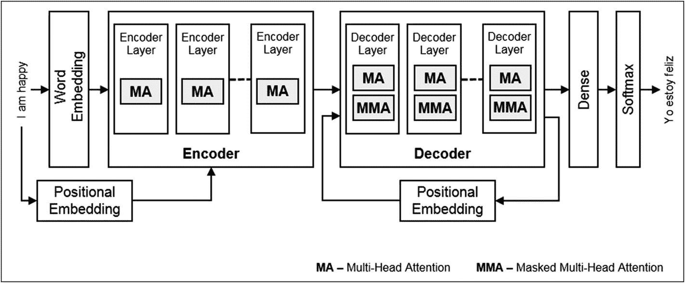
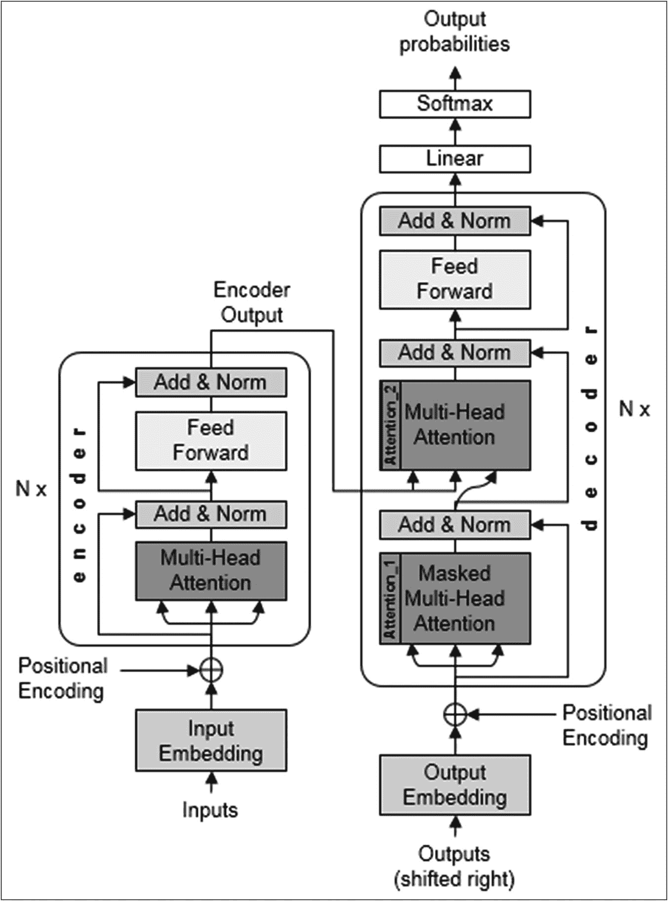
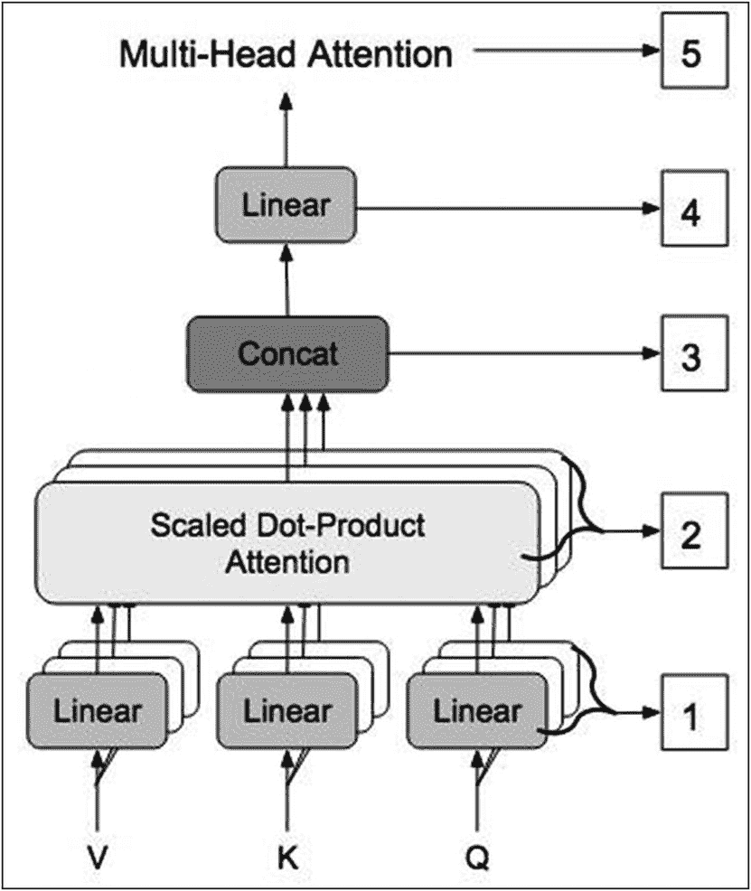
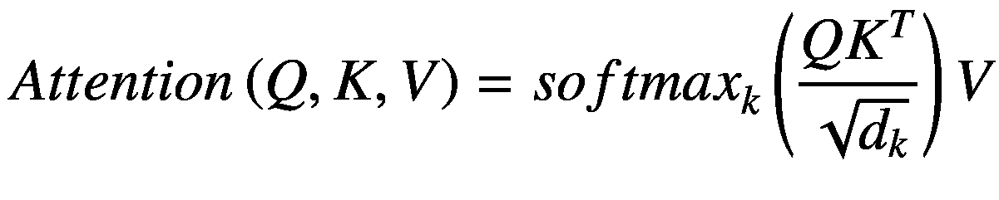
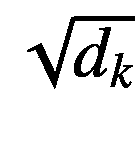
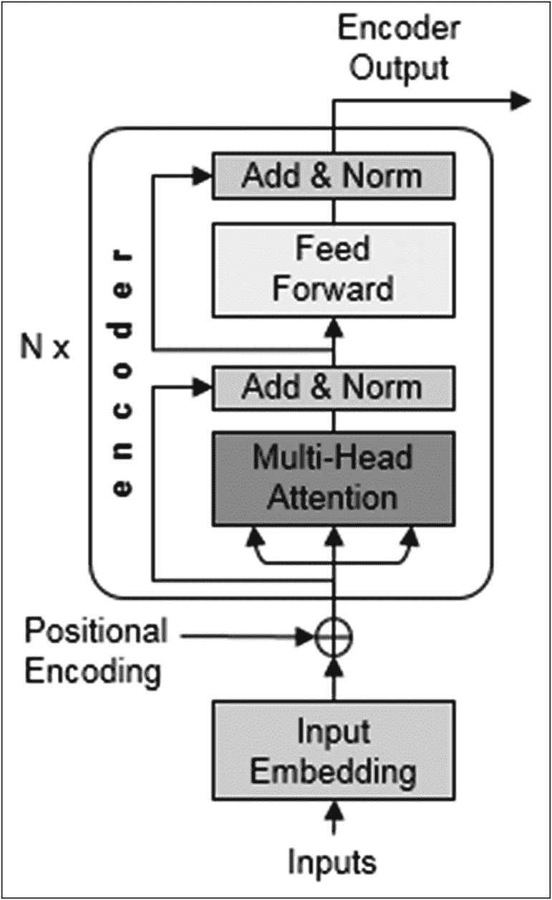
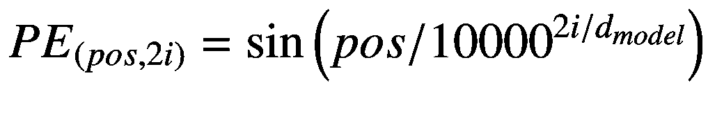
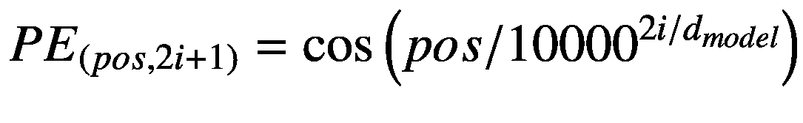
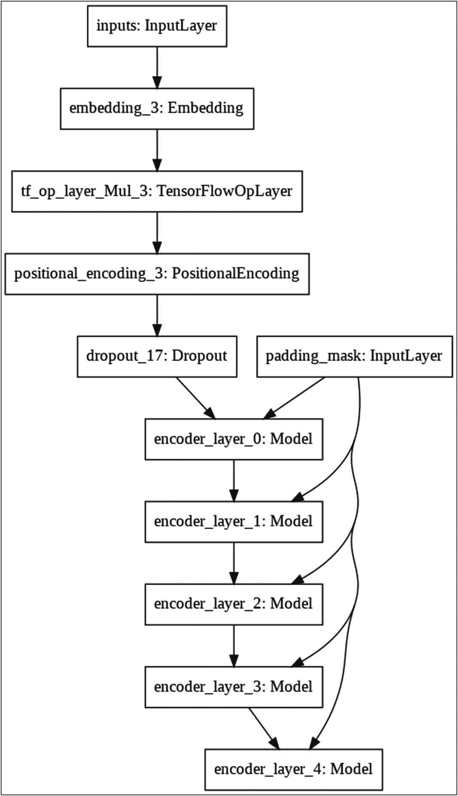

# 9. 自然语言理解

## 引言

在上一章中，你使用了 `seq2seq` 模型结合注意力机制进行语言翻译。在本章中，我将向你展示一种更复杂的自然语言处理技术。你将学习使用自然语言建模领域的最新创新——Transformer 模型。Transformer 模型消除了对 LSTM 的需求，并且比使用 LSTM 的 `seq2seq` 模型产生更好的结果。那么，让我们来理解什么是 Transformer 模型。

## Transformer

在上一章中，你看到了注意力机制在语言翻译中的重要性。注意力模块为对句子语义重要的单词赋予权重。然后，这些权重与常规翻译结果一起作为输入提供给解码器。通过了解句子的哪些部分重要，解码器能够提供更好的翻译。

Transformer 模型的示意图如图 9-1 所示。



**图 9-1** Transformer 的通用架构

因此，Transformer 与你在上一章中看到的模型一样，包含一个编码器和一个解码器。这里的主要区别在于，编码器和解码器都不包含像之前案例中那样的 LSTM 层。相反，它们都包含多层专门设计的 Keras 层，称为编码器层和解码器层。编码器层和解码器的层数可由用户配置。编码器层包含一个特殊的注意力块，称为多头注意力——在图中标记为 MA。解码器也包含这种 MA 块。此外，解码器还包含另一个注意力块，称为掩码多头注意力——在图中标记为 MMA。编码/解码过程不像之前那样顺序进行。相反，整个句子被分割成单词，这些单词被并行处理。它们被分成多个头，可能因此得名“多头”。这种划分也促进了分布式训练和推理。因此，Transformer 模型的性能优于第 14 章讨论的带有注意力机制的编码器/解码器模型。

你可能在图中还注意到了另一件事，那就是使用了额外的嵌入块。通常，我们有词嵌入。在 Transformer 中，我们有一个额外的嵌入，称为位置嵌入，应用于给定的句子。位置嵌入指定了给定句子中单词的相对位置。这消除了对长期记忆的需求，而长期记忆是使用 LSTM 的编码器/解码器模型的特点。整个 Transformer 的工作原理在某种程度上复杂得难以消化。对于开发者来说，当他们看到可运行的代码时，他们能更好地理解幕后发生的事情。而这正是我在本章中将要采用的方法。我将向你展示 Transformer 的工作代码，并采用自上而下的方法，向你解释与上下文相关的每一个模块。

那么，让我们开始这个项目吧。

## Transformer

创建一个新的 Colab 项目，并将其重命名为 `NLP-transformer`（NLP 代表自然语言处理）。像往常一样，导入所需的库。

```
import tensorflow as tf
from tensorflow.keras.models import Model
from tensorflow.keras.layers import Input,Dense,LSTM,Embedding,Bidirectional,RepeatVector,Concatenate,Activation,Dot,Lambda
from tensorflow.keras.preprocessing.text import Tokenizer
from tensorflow.keras.preprocessing.sequence import pad_sequences
from keras import preprocessing,utils
import numpy as np
import matplotlib.pyplot as plt
import tensorflow_datasets as tfds
import os
import re
import numpy as np
import string
```

## 下载数据

从本书的网站下载数据。

```
!pip install wget
import wget
url = 'https://raw.githubusercontent.com/Apress/artificial-neural-networks-with-tensorflow-2/main/ch08/spa.txt'
wget.download(url,'spa.txt')
```

这是你在上一章（第 8 章关于 NMT）中使用的同一个数据库。因此，我不在此描述其结构。

## 创建数据集

创建数据集的代码与你在上一章（第 8 章）中开发的代码相同。我在此仅提供代码供你快速参考。

```

### 读取数据
with open('/content/spa.txt',encoding='utf-8', errors='ignore') as file:
    text=file.read().split('\n')
input_texts=[] #编码器输入
target_texts=[] #解码器输入

#### 我们将选择整个数据的一个子集
NUM_SAMPLES = 10000
for line in text[:NUM_SAMPLES]:
    english, spanish  = line.split('\t')[:2]
    target_text = spanish.lower()
    input_texts.append(english.lower())
    target_texts.append(target_text)
```

与之前的情况一样，我们将只使用整个语料库的一个子集。我们将只使用完整语料库中的 10,000 个样本。

### 数据预处理

我们使用以下代码从数据中移除标点符号：

```
regex = re.compile('[%s]' %re.escape(string.punctuation))
for s in input_texts:
    regex.sub('', s)
for s in target_texts:
    regex.sub('', s)
```

现在，你已经准备好进行分词和填充数据了。

### 分词数据

在此应用中，我们将使用 `SubWordTextEncoder` 类在我们的数据语料库上创建分词器。分词器将文本映射到一个 ID。如果指定的文本不在字典中，它会将其拆分为子词。

首先，我们将为我们的输入数据集（英文）构建一个分词器。

```
tokenizer_input = tfds.features.text.SubwordTextEncoder.build_from_corpus(
    input_texts, target_vocab_size=2**13)
```

第二个参数 `target_vocab_size` 中指定的值是一个任意大的值。

为了测试分词器，你可以尝试向其输入一个字符串。例如，在以下代码段中，我们对字符串进行编码：

```

#### 示例展示此分词器如何工作
tokenized_string1=tokenizer_input.encode('hello i am good')
tokenized_string1
```

输出如下：

```
[2269, 1, 41, 89]
```

你可以以表格格式打印相同内容，以便更好地查看映射关系。

```
for token in tokenized_string1:
    print ('{} ----> {}'.format(token, tokenizer_input.decode([token])))
```

输出为：

```
2269 ----> hello
1 ----> i
41 ----> am
89 ----> good
```

如你所见，每个单词都在字典中，并映射到一个唯一的 ID。现在，让我们尝试输入一些可能不在字典中的内容。

### 如果单词不在词典中

`tokenized_string2 = tokenizer_input.encode('how is the moon')`
```
for token in tokenized_string2:
    print('{} ----> {}'.format(token, tokenizer_input.decode([token])))
```

输出结果为

```
64 ----> how
4 ----> is
21 ----> the
2827 ----> m
2829 ----> o
75 ----> on
```

观察未知单词 `moon` 是如何被拆分为已知单词的。

同样地，为西班牙语文本创建一个映射，这是我们翻译的目标语言。

```
tokenizer_out = tfds.features.text.SubwordTextEncoder.build_from_corpus(
    target_texts, target_vocab_size=2**13)
```

现在，为输入和输出添加起始标签和结束标签的标记。

```
START_TOKEN_in = [tokenizer_input.vocab_size]  # 输入起始标记
END_TOKEN_in = [tokenizer_input.vocab_size + 1]  # 输入结束标记
START_TOKEN_out = [tokenizer_out.vocab_size]  # 输出起始标记
END_TOKEN_out = [tokenizer_out.vocab_size + 1]  # 输出结束标记
```

你可以使用以下语句查看它们的 ID：

```
START_TOKEN_in, END_TOKEN_in, START_TOKEN_out, END_TOKEN_out
```

输出结果为

```
([2974], [2975], [5737], [5738])
```

现在，我们将编写一个函数，用于对两个数据集进行分词和填充。我们将标记的最大长度设为 10。

```
MAX_LENGTH = 10

#### 对句子进行分词、过滤和填充
def tokenize_and_padding(inputs, outputs):
    tokenized_inputs, tokenized_outputs = [], []
    for (input_sentence, output_sentence) in zip(inputs, outputs):
        # 对句子进行分词
        input_sentence = START_TOKEN_in + tokenizer_input.encode(input_sentence) + END_TOKEN_in
        output_sentence = START_TOKEN_out + tokenizer_out.encode(output_sentence) + END_TOKEN_out

        # 检查分词后句子的最大长度
        # if len(input_sentence) <= MAX_LENGTH and len(output_sentence) <= MAX_LENGTH:
        tokenized_inputs.append(input_sentence)
        tokenized_outputs.append(output_sentence)

    # 对分词后的句子进行填充
    tokenized_inputs = tf.keras.preprocessing.sequence.pad_sequences(
        tokenized_inputs, maxlen=MAX_LENGTH, padding='post')
    tokenized_outputs = tf.keras.preprocessing.sequence.pad_sequences(
        tokenized_outputs, maxlen=MAX_LENGTH, padding='post')
    return tokenized_inputs, tokenized_outputs

english, spanish = tokenize_and_padding(input_texts, target_texts)
```

你可以通过打印其中一个元素来检查此函数的结果。

```
english[1], spanish[1]
```

输出结果为

```
(array([2974,   50, 2764, 2975,   0,   0,   0,   0,   0,   0], dtype=int32),
 array([5737, 1017, 5527, 5738,   0,   0,   0,   0,   0,   0], dtype=int32))
```

可以看到每个句子都被填充到了十个元素。另外，请注意索引为 1 的英语句子是 "go."，其中单词 `go` 映射为 50，句点映射为 2764。2974 是我们的起始标记，2975 是我们的结束标记。

### 准备训练数据集

现在我们将准备训练数据集。为了创建输入管道，我们将使用 `tf.data.Dataset`，并利用缓存和预取等功能来加速处理过程。训练过程中使用了教师强制（teacher forcing）。以下代码用于准备数据集：

```
BATCH_SIZE = 32
BUFFER_SIZE = 10000

### 解码器输入使用前一个目标作为输入
```

```python

### 从目标数据中移除 START_TOKEN
dataset = tf.data.Dataset.from_tensor_slices((
{
'inputs': english,
'decoder_inputs': spanish[:, :-1]
},
{
'outputs':spanish[:, 1:]
},
))
dataset = dataset.cache()
dataset = dataset.shuffle(BUFFER_SIZE)
dataset = dataset.batch(BATCH_SIZE)
dataset = dataset.prefetch(tf.data.experimental.AUTOTUNE)
```

对数据集进行预取操作，可以在数据预处理和模型执行之间创建重叠。当模型正在执行第 `n` 步训练时，输入管道会同时读取第 `n+1` 步的数据。这能显著提升整体训练速度。

### Transformer 模型

在解释 Transformer 模型的实现时，我将采用自上而下的方法。该模型由多个组件构成，显然，在组件未创建之前无法构建整个模型。但为了更好地理解模型的构建方式，我会先概述其主要组件，再深入讲解每个组件的细节及其实现。项目代码主要基于 TensorFlow 作者发布的 Transformer 聊天机器人实现，该实现遵循 Apache 2.0 许可证。毋庸置疑，代码编写精良、结构清晰，几乎无需任何改进。因此，我直接沿用了其中部分实现。

现在，让我们来看图 9-2 所示的 Transformer 架构总览图。



**图 9-2** Transformer 的详细架构

如图所示，该模型包含编码器、解码器和多头注意力模块。整个架构的核心就是多头注意力。我将先讨论其构建过程，然后依次讲解编码器和解码器的构建。最后，我会展示如何训练并使用该 Transformer 模型进行推理——即通过比以往 seq2seq 语言翻译模型更强大的自然语言理解能力，将英语转换为西班牙语。

## 多头注意力

多头注意力是本项目的核心。它在 Transformer 架构的多个位置被使用，并作为网络层包含在 Transformer 网络的定义中。因此，我们将为其编写一个类，该类继承自 Keras 的 Layer 类（`tf.keras.layers.Layer`）。这个类的实例（即一个 Keras 层）将被嵌入到编码器和解码器网络的适当位置。多头注意力的示意图组件如图 9-3 所示。



**图 9-3** 多头注意力架构

在此示意图中，一个显著特点是使用了多个头来处理 Q（查询）、K（键）和 V（值）向量。这三个向量被分割成多个头，并通过线性（全连接）层处理。这使得模型能够并发处理输入句子中的多个单词，从而促进分布式训练。每个头都应用了缩放点积注意力。根据该多头注意力是用于编码器还是解码器，我们会在注意力步骤中应用相应的掩码。两种掩码类型将在后文解释。三个头的注意力输出通过 `tf.transpose` 和 `tf.reshape` 进行拼接，然后通过一个全连接层生成最终的注意力向量。

虽然示意图看起来实现起来可能很复杂，但实际上并不太难。架构图显示了五个主要组件（层），编号为 1 到 5。我将给出多头注意力类的完整实现，然后解释这些层 1 到 5 在类定义中的位置。以下是清单 9-1 中的类定义。

```python
class MultiHeadAttention(tf.keras.layers.Layer):
    def __init__(self, d_model, num_heads, name="multi_head_attention"):
        super(MultiHeadAttention, self).__init__(name=name)
        self.num_heads = num_heads
        self.d_model = d_model
        self.depth = d_model // self.num_heads
        self.query_dense = tf.keras.layers.Dense(units=d_model)
        self.key_dense = tf.keras.layers.Dense(units=d_model)
        self.value_dense = tf.keras.layers.Dense(units=d_model)
        self.dense = tf.keras.layers.Dense(units=d_model)

    def split_heads(self, inputs, batch_size):
        inputs = tf.reshape(inputs, shape=(batch_size, -1, self.num_heads, self.depth))
        return tf.transpose(inputs, perm=[0, 2, 1, 3])

    def call(self, inputs):
        query, key, value, mask = inputs['query'], inputs['key'], inputs['value'], inputs['mask']
        batch_size = tf.shape(query)[0]

        # 线性层
        query = self.query_dense(query)
        key = self.key_dense(key)
        value = self.value_dense(value)

        # 分割头
        query = self.split_heads(query, batch_size)
        key = self.split_heads(key, batch_size)
        value = self.split_heads(value, batch_size)

        # 缩放点积注意力
        scaled_attention = scaled_dot_product_attention(query, key, value, mask)
        scaled_attention = tf.transpose(scaled_attention, perm=[0, 2, 1, 3])

        # 拼接头
        concat_attention = tf.reshape(scaled_attention, (batch_size, -1, self.d_model))

        # 最终线性层
        outputs = self.dense(concat_attention)
        return outputs
```

**清单 9-1** MultiHeadAttention 类定义

`MultiHeadAttention` 类继承自 Keras 的 Layer 类：

```python
class MultiHeadAttention(tf.keras.layers.Layer):
```

在初始化（类构造函数）中，传入了一些参数，这些参数被存储在类变量中供后续使用。

```python
def __init__(self, d_model, num_heads, name="multi_head_attention"):
    super(MultiHeadAttention, self).__init__(name=name)
    self.num_heads = num_heads
    self.d_model = d_model
    self.depth = d_model // self.num_heads
```

注意力网络的输入通过一个全连接线性层。请注意，该网络接收三个输入：V、K 和 Q（参见图 9-3）。Q 是一个包含查询的矩阵，表示序列中一个单词的向量表示。K（键）是序列中所有单词的向量表示。V（值）也是序列中所有单词的向量表示。

这三个输入层定义如下：

```python
self.query_dense = tf.keras.layers.Dense(units=d_model)
self.key_dense = tf.keras.layers.Dense(units=d_model)
self.value_dense = tf.keras.layers.Dense(units=d_model)
```

我们还声明了另一个全连接层，它将用于注意力模型的输出。

```python
self.dense = tf.keras.layers.Dense(units=d_model)
```

至此，类构造函数定义完成。

现在，让我们定义一个将输入数据分割成多个头的方法。这允许你并发处理输入句子中的不同单词，并促进分布式训练。函数定义如下，它仅对数据进行重塑、转置若干列，然后将处理后的输入返回给调用者。

```python
def split_heads(self, inputs, batch_size):
    inputs = tf.reshape(inputs, shape=(batch_size, -1, self.num_heads, self.depth))
    return tf.transpose(inputs, perm=[0, 2, 1, 3])
```

接下来是构建整个网络的重要函数调用。我们首先分离出四个输入，如下所示：

```python
def call(self, inputs):
    query, key, value, mask = inputs['query'], inputs['key'], inputs['value'], inputs['mask']
    batch_size = tf.shape(query)[0]
```

接着，我们为三个输入创建线性层，如下所示。这是图 9-3 中显示的第 1 部分。

### 线性层

`query = self.query_dense(query)`
`key = self.key_dense(key)`
`value = self.value_dense(value)`

我们使用 `split_heads` 函数对输入进行拆分。这是图 9-3 中所示的第二部分。

```

### 拆分注意力头
query = self.split_heads(query, batch_size)
key = self.split_heads(key, batch_size)
value = self.split_heads(value, batch_size)
```

接下来，我们计算缩放点积注意力，如图 9-3 中的第三部分所示。

```

### 缩放点积注意力
scaled_attention = scaled_dot_product_attention(query, key, value, mask)
scaled_attention = tf.transpose(scaled_attention, perm=[0, 2, 1, 3])
```

稍等！我们还没有定义这个函数。正如我所说，我将采用自上而下的方法来解释代码。因此，在完成这个多头类的定义后，我会立即定义并解释这个函数。

现在，我们使用以下语句将所有注意力头拼接起来。这是图 9-3 中的第四部分。

```

### 拼接注意力头
concat_attention = tf.reshape(scaled_attention, (batch_size, -1, self.d_model))
```

最后，我们定义输出密集层——图 9-3 中的第五部分。

```
outputs = self.dense(concat_attention)
```

然后将输出返回给调用者。现在，我将定义用于计算缩放点积注意力的函数。

## 缩放点积注意力函数

Transformer 使用的缩放点积注意力函数接收三个输入：Q（查询）、K（键）、V（值）。计算注意力的公式为



首先，我们计算 *QK*^(*T*)。

```
QxK_transpose = tf.matmul(query, key, transpose_b=True)
```

接下来，我们计算表达式 *QK*^(*T*) 除以  的结果。

```
depth = tf.cast(tf.shape(key)[-1], tf.float32)
logits = QxK_transpose / tf.math.sqrt(depth)
```

如果指定了掩码，我们将其加上以屏蔽填充标记。

```
if mask is not None:
    logits += (mask * -1e9)
```

为什么将掩码乘以一个很大的负值？这是因为 softmax 的很大负输入在输出中接近于零。

我们对结果应用 softmax：

```
attention_weights = tf.nn.softmax(logits, axis=-1)
```

最后，我们通过将注意力权重与 V 输入向量进行矩阵乘法来计算输出。

```
output = tf.matmul(attention_weights, value)
```

然后将输出返回给调用者。

```
return output
```

完整的函数代码如代码清单 9-2 所示。

```
def scaled_dot_product_attention(query, key, value, mask):
    QxK_transpose = tf.matmul(query, key, transpose_b=True)
    depth = tf.cast(tf.shape(key)[-1], tf.float32)
    logits = QxK_transpose / tf.math.sqrt(depth)
    if mask is not None:
        logits += (mask * -1e9)

    # softmax 在最后一个轴（seq_len_k）上归一化
    attention_weights = tf.nn.softmax(logits, axis=-1)
    output = tf.matmul(attention_weights, value)
    return output
```

*代码清单 9-2*  
*缩放点积注意力函数*

在定义了 Transformer 架构的主要组件之后，现在让我们定义编码器和解码器。首先，我将展示编码器是如何构建的，然后是解码器。

## 编码器架构

编码器架构如图 9-4 所示。



*图 9-4*  
*编码器架构*

如图 9-4 所示，编码器由一个单一的 Keras 层或块（我们称之为编码器层）组成，该层重复 N 次。而编码器层本身又由几个层组成，包括我们之前定义的多头注意力和一个带有归一化的前馈网络。编码器接收的输入包括输入句子嵌入以及定义句子中单词相对位置的位置编码。在定义编码器层之前，我将定义两个辅助函数，用于位置编码和屏蔽一批序列中的所有填充标记。

首先，我将介绍掩码函数。

## 掩码函数

当你向网络输入填充序列时，网络可能会将这些额外的标记（零）视为输入。例如，我们的第一个英文句子 "go." 编码如下：

```
(array([2974,  50, 2764, 2975,   0,   0,   0,   0,   0,   0], dtype=int32),
```

该序列包含开始和结束标记，这对我们来说没问题。然而，我们不希望模型将所有尾随零视为有效输入。因此，我们编写一个掩码函数来屏蔽所有我们添加的额外填充。

```
def create_padding_mask(x):
    mask = tf.cast(tf.math.equal(x, 0), tf.float32)
```

### (batch_size, 1, 1, sequence length)
返回 `mask[:, tf.newaxis, tf.newaxis, :]`

你可以在上述有效序列上测试该函数：

```
x=tf.constant([[2974,   50, 2764, 2975,    0,    0,
0,    0,    0,    0]])
create_padding_mask(x)
```

输出结果如下：

```
你可以清晰地看到，所有填充的零现在都被标记为 1，
而其余字符则被标记为 0。
同样，我们编写另一个填充函数来遮蔽序列中的未来
标记。前瞻掩码用于遮蔽序列中的未来
标记。换句话说，掩码指示哪些条目
不应被使用。这意味着，为了预测第三个词，只有
第一个和第二个词会被使用。类似地，为了预测第四个
词，只有第一、第二和第三个词会被使用，以此类推。
```

我们定义的前瞻掩码函数如下：

```
def create_look_ahead_mask(x):
seq_len = tf.shape(x)[1]
look_ahead_mask = 1 - tf.linalg.band_part
(tf.ones((seq_len, seq_len)), -1, 0)
padding_mask = create_padding_mask(x)
return tf.maximum(look_ahead_mask, padding_mask)
```

我们将把这些辅助函数用作 `tf.keras.layers.Lambda` 层。接下来，我们将为位置编码做好准备。

## PositionalEncoding 类

与你上一章使用的 seq2seq 模型类似，Transformer 模型并不通过 LSTM 来拥有记忆。因此，为了提供给定句子中单词相对位置的信息，我们向网络输入一个名为位置编码的额外输入。然后，位置编码和嵌入这两个向量会一起被送入网络。嵌入将具有相似含义的标记（单词）聚集在一起，但它们并不指定（编码）单词在句子中的相对位置。因此，将两者相加，可以根据单词含义的相似性及其在句子中的位置，使单词更紧密地聚集在一起。这发生在整个 d 维空间中。

位置编码的计算公式如下：





该公式的证明（[`https://arxiv.org/pdf/1706.03762.pdf`](https://arxiv.org/pdf/1706.03762.pdf)）超出了本书的范围。该公式的实现很简单，可以在下面给出的类定义中看到：

```
class PositionalEncoding(tf.keras.layers.Layer):
def __init__(self, position, d_model):
super(PositionalEncoding, self).__init__()
self.pos_encoding = self.positional_encoding
(position, d_model)
def get_angles(self, position, i, d_model):
angles = 1 / tf.pow(10000, (2 * (i // 2)) /
tf.cast(d_model, tf.float32))
return position * angles
def positional_encoding(self, position, d_model):
angle_rads = self.get_angles(
position=tf.range(position, dtype=tf.float32)
[:, tf.newaxis],
i=tf.range(d_model, dtype=tf.float32)
[tf.newaxis, :],
d_model=d_model)
### 对数组中的偶数索引应用正弦函数
sines = tf.math.sin(angle_rads[:, 0::2])
### 对数组中的奇数索引应用余弦函数
cosines = tf.math.cos(angle_rads[:, 1::2])
pos_encoding = tf.concat([sines, cosines],
axis=-1)
pos_encoding = pos_encoding[tf.newaxis, ...]
return tf.cast(pos_encoding, tf.float32)
def call(self, inputs):
return inputs + self.pos_encoding
[:, :tf.shape(inputs)[1], :]
```

定义好辅助函数后，现在让我们继续定义编码器层，它在编码器中会重复多次。

## 编码器层

如图 9-4 的编码器示意图所示，重复 N 次的编码器层包含以下部分：

1.  多头注意力（带填充掩码）
2.  两个全连接层，后接 dropout

每个部分还将包含一个归一化层，用于处理深度神经网络中的梯度消失问题。

在下面的编码器层定义中，可以很容易地观察到这种网络结构：

```
def encoder_layer(units, d_model, num_heads, dropout,
name="encoder_layer"):
inputs = tf.keras.Input(shape=(None, d_model),
name="inputs")
padding_mask = tf.keras.Input(shape=(1, 1, None),
name="padding_mask")
### 带填充掩码的多头注意力
attention = MultiHeadAttention(
d_model, num_heads, name="attention")({
'query': inputs,
'key': inputs,
'value': inputs,
'mask': padding_mask
})
attention = tf.keras.layers.Dropout
(rate=dropout)(attention)
attention = tf.keras.layers.LayerNormalization(
epsilon=1e-6)(inputs + attention)
### 两个全连接层，后接 dropout
outputs = tf.keras.layers.Dense(units=units,
activation='relu')(attention)
outputs = tf.keras.layers.Dense(units=d_model)
(outputs)
outputs = tf.keras.layers.Dropout(rate=dropout)
(outputs)
outputs = tf.keras.layers.LayerNormalization(
epsilon=1e-6)(attention + outputs)
return tf.keras.Model(
inputs=[inputs, padding_mask],
outputs=outputs, name=name)
```

有了这个设置，我们现在就可以定义编码器本身了。

### 编码器

正如你目前所看到的，编码器将包含以下组件：

1.  给定句子的输入嵌入
2.  给定句子中单词相对位置的位置编码
3.  重复的编码器层

重复编码器层的数量由你决定。在我们的项目中，我们将使用两次重复。第一个编码器层的输入是输入嵌入和位置编码之和。第二个编码器层的输出，即编码器的最终输出，将成为解码器的输入。

```
def encoder(vocab_size,
num_layers,
units,
d_model,
num_heads,
dropout,
name="encoder"):
inputs = tf.keras.Input(shape=(None,),
name="inputs")
### 创建填充掩码
padding_mask = tf.keras.Input(shape=(1, 1, None),
name="padding_mask")
### 创建词嵌入 + 位置编码的组合
embeddings = tf.keras.layers.Embedding
(vocab_size, d_model)(inputs)
embeddings *= tf.math.sqrt(tf.cast
(d_model, tf.float32))
embeddings = PositionalEncoding
(vocab_size, d_model)(embeddings)
outputs = tf.keras.layers.Dropout(rate=dropout)
(embeddings)
### 重复编码器层两次
for i in range(num_layers):
outputs = encoder_layer(
units=units,
d_model=d_model,
num_heads=num_heads,
dropout=dropout,
name="encoder_layer_{}".format(i),
)([outputs, padding_mask])
return tf.keras.Model(
inputs=[inputs, padding_mask], outputs=outputs,
name=name)
```

请注意，在两个嵌入层之间，我们共享相同的权重矩阵，只是在输入到 `PositionalEncoding` 之前，将这些权重乘以 `d_model` 的平方根。

为了可视化编码器架构，你可以使用以下代码生成其模型图：

```
sample_encoder = encoder(
vocab_size=8192,
num_layers=5,
units=512,
d_model=128,
num_heads=4,
dropout=0.3,
name="sample_encoder")
tf.keras.utils.plot_model(
sample_encoder, to_file='encoder.png')
```

请注意，这里我重复了五次编码器层，仅用于演示目的。在实际项目中，我只重复了两次。编码器的网络图如图 9-5 所示。



**图 9-5** 编码器网络图

请注意，输入是如何先进行词嵌入，然后与位置编码结合，再送入第一个编码器层的。编码器层本身重复了五次，每一层都对输入应用了填充掩码。编码器的输出将成为解码器的输入。虽然为了清晰起见，我将编码器层重复了五次，但在项目代码中，为了节省训练时间，只重复了两次。我们现在继续定义解码器。

# 解码器架构

解码器架构如图 9-6 所示。


图 9-6 解码器架构

解码器的输入是编码器的输出。与编码器使用重复的编码器层类似，解码器也由重复的解码器层组成。第一层接收来自编码器的输入，最后一层经过线性密集网络到达最终的 Softmax 层，该层输出目标词的概率。解码器的其他输入是输出词嵌入和位置编码的组合。接下来，我将描述重复的解码器层的构建。

## 解码器层

如图 9-6 所示，解码器层实际上包含两个多头注意力机制：

1.  多头注意力（`Attention_2`，如图 9-6 所示）
2.  掩码多头注意力（`Attention_1`，如图 9-6 所示）

前面列表中的第一个多头注意力 `Attention_2` 接收来自编码器的输入。这个输入是*值*和*键*向量。该多头注意力的另一个输入来自掩码多头注意力子层的输出。列表中第二个多头注意力（`Attention_1`），我们为其添加了“掩码”前缀，它接收的输入是前一个解码器状态和位置编码的组合。这两个层都使用了适当的填充掩码。多头注意力 `Attention_2` 的输出经过两个密集层，然后进行 dropout。这就构成了一个解码器层的结构。在解码器的实现中，该层会被重复 N 次。

解码器层的代码如下：

```
def decoder_layer(units, d_model, num_heads,
dropout, name="decoder_layer"):
inputs = tf.keras.Input(shape=
(None, d_model), name="inputs")
enc_outputs = tf.keras.Input(shape=(None, d_model),
name="encoder_outputs")
look_ahead_mask = tf.keras.Input(
shape=(1, None, None), name="look_ahead_mask")
padding_mask = tf.keras.Input(shape=(1, 1, None),
name='padding_mask')
attention1 = MultiHeadAttention(
d_model, num_heads, name="attention_1")(inputs={
'query': inputs,
'key': inputs,
'value': inputs,
'mask': look_ahead_mask
})
attention1 = tf.keras.layers.LayerNormalization(
epsilon=1e-6)(attention1 + inputs)
attention2 = MultiHeadAttention(
d_model, num_heads, name="attention_2")(inputs={
'query': attention1,
'key': enc_outputs,
'value': enc_outputs,
'mask': padding_mask
})
attention2 = tf.keras.layers.Dropout
(rate=dropout)(attention2)
attention2 = tf.keras.layers.LayerNormalization(
epsilon=1e-6)(attention2 + attention1)
outputs = tf.keras.layers.Dense(units=units,
activation='relu')(attention2)
outputs = tf.keras.layers.Dense(units=d_model)
(outputs)
outputs = tf.keras.layers.Dropout(rate=dropout)
(outputs)
outputs = tf.keras.layers.LayerNormalization(
epsilon=1e-6)(outputs + attention2)
return tf.keras.Model(
inputs=[inputs, enc_outputs, look_ahead_mask,
padding_mask],
outputs=outputs,
name=name)
```

这里 `Attention_1` 是我们前面列表中定义为第 2 项的掩码多头注意力，`Attention_2` 是列表中定义的第 1 项。`Attention_2` 的输出经过两个密集块，然后进行 dropout。

你可以通过执行以下代码来可视化解码器层的网络架构：

```
sample_decoder_layer = decoder_layer(
units=512,
d_model=128,
num_heads=4,
dropout=0.3,
name="sample_decoder_layer")
tf.keras.utils.plot_model(
sample_decoder_layer,
to_file='decoder_layer.png')
```

输出结果，即解码器层的架构，如图 9-7 所示。


图 9-7 解码器层网络图

请注意两个多头注意力的位置、它们的输入和输出。接下来，我将定义解码器块。

### 解码器

与编码器的情况类似，解码器网络是通过将解码器层重复 N 次来构建的。我们已经看到了解码器的各种输入。解码器的输出进入一个线性层和 softmax 分类器。

解码器定义如下：

```
def decoder(vocab_size,
num_layers,
units,
d_model,
num_heads,
dropout,
name='decoder'):
inputs = tf.keras.Input(shape=(None,),
name='inputs')
enc_outputs = tf.keras.Input(shape=(None, d_model),
name='encoder_outputs')
look_ahead_mask = tf.keras.Input(
shape=(1, None, None), name="look_ahead_mask")
padding_mask = tf.keras.Input(shape=(1, 1, None),
name='padding_mask')
embeddings = tf.keras.layers.Embedding
(vocab_size, d_model)(inputs)
embeddings *= tf.math.sqrt(tf.cast
(d_model, tf.float32))
embeddings = PositionalEncoding
(vocab_size, d_model)(embeddings)
outputs = tf.keras.layers.Dropout(rate=dropout)
(embeddings)
for i in range(num_layers):
outputs = decoder_layer(
units=units,
d_model=d_model,
num_heads=num_heads,
dropout=dropout,
name='decoder_layer_{}'.format(i),
)(inputs=[outputs, enc_outputs, look_ahead_mask,
padding_mask])
return tf.keras.Model(
inputs=[inputs, enc_outputs, look_ahead_mask,
padding_mask],
outputs=outputs,
name=name)
```

可以使用以下代码构建一个示例解码器：

```
sample_decoder = decoder(
vocab_size=8192,
num_layers=2,
units=512,
d_model=128,
num_heads=4,
dropout=0.3,
name="sample_decoder")
tf.keras.utils.plot_model(
sample_decoder, to_file='decoder.png')
```

此代码生成的图如图 9-8 所示。


图 9-8 解码器网络图

最后是我们的最终目标，即定义 Transformer。

### Transformer 模型

Transformer 由编码器、解码器和一个最终的线性层组成。解码器的输出是线性层的输入。

Transformer 定义如下：

```
def transformer(input_vocab_size,
target_vocab_size,
num_layers,
units,
d_model,
num_heads,
dropout,
name="transformer"):
inputs = tf.keras.Input(shape=(None,),
name="inputs")
dec_inputs = tf.keras.Input(shape=(None,),
name="decoder_inputs")
enc_padding_mask = tf.keras.layers.Lambda(
create_padding_mask, output_shape=(1, 1, None),
name='enc_padding_mask')(inputs)

### 在第一个注意力块中掩码解码器输入的未来词元
look_ahead_mask = tf.keras.layers.Lambda(
create_look_ahead_mask,
output_shape=(1, None, None),
name='look_ahead_mask')(dec_inputs)

### 在第二个注意力块中掩码编码器输出
dec_padding_mask = tf.keras.layers.Lambda(
create_padding_mask, output_shape=(1, 1, None),
name='dec_padding_mask')(inputs)
enc_outputs = encoder(
vocab_size=input_vocab_size,
num_layers=num_layers,
units=units,
d_model=d_model,
num_heads=num_heads,
dropout=dropout,
)(inputs=[inputs, enc_padding_mask])
dec_outputs = decoder(
vocab_size=target_vocab_size,
num_layers=num_layers,
units=units,
d_model=d_model,
num_heads=num_heads,
dropout=dropout,
)(inputs=[dec_inputs, enc_outputs, look_ahead_mask,
dec_padding_mask])
outputs = tf.keras.layers.Dense(units=target_vocab_size,
name="outputs")(dec_outputs)
return tf.keras.Model(inputs=[inputs, dec_inputs],
outputs=outputs, name=name)
```

你可以通过运行以下代码查看网络架构：

```
sample_transformer = transformer(
input_vocab_size = 100,
target_vocab_size = 100,
num_layers=4,
units=512,
d_model=128,
num_heads=4,
dropout=0.3,
name="sample_transformer")
tf.keras.utils.plot_model(
sample_transformer, to_file='transformer.png')
```

# 网络架构图与模型训练

生成的网络架构图如图 9-9 所示。


**图 9-9.** 示例 Transformer 的网络图

可以看到，整个架构足够简单易懂。它主要包含一个编码器和一个解码器。现在，我们已经定义了`Transformer`，接下来需要基于此定义创建一个模型，以便后续编译。

## 创建训练模型

要创建训练模型，我们只需使用所需参数实例化`transformer`类。

```python
D_MODEL = 256
model = transformer(
    tokenizer_input.vocab_size+2,
    tokenizer_out.vocab_size+2,
    num_layers = 2,
    units = 512,
    d_model = D_MODEL,
    num_heads = 8,
    dropout = 0.1)
```

如前所述，我将层数设置为 2，而参考论文（[`https://arxiv.org/abs/1706.03762`](https://arxiv.org/abs/1706.03762)）建议该值为 6。同样，其他参数也设置为较低值以加快训练速度。要获得更准确的结果，您应该尝试为`num_layers`、`units`和`d_model`设置更大的值。

要编译此模型，我们需要定义损失函数和优化器。

### 损失函数

损失是通过使用稀疏分类熵函数测量输出`y`的真实值与预测值之间的差异来计算的。由于所有输入序列都经过填充，因此在计算损失时应用填充掩码非常重要。损失函数代码如下所示：

```python
def loss(y_true, y_pred):
    y_true = tf.reshape(y_true, shape=(-1, 10 - 1))
    loss = tf.keras.losses.SparseCategoricalCrossentropy(
        from_logits=True, reduction="none")
    (y_true, y_pred)
    mask = tf.cast(tf.not_equal(y_true, 0), tf.float32)
    loss = tf.multiply(loss, mask)
    return tf.reduce_mean(loss)
```

## 优化器

我们将使用`Adam`优化器来训练模型。参考论文（[`https://arxiv.org/pdf/1706.03762.pdf`](https://arxiv.org/pdf/1706.03762.pdf)）建议为优化器使用自定义学习率。自定义学习率由以下公式指定：


根据该公式，学习率最初会随着`warmup_steps`设置步数线性增加，然后随着步数的平方根倒数成比例下降。在上一段引用的论文中，作者将`warmup_steps`设置为 4000，我们将继续使用相同的值。

为了实现此公式，我们创建一个自定义调度器类，如下所示：

```python
class CustomSchedule
    (tf.keras.optimizers.schedules.LearningRateSchedule):
    def __init__(self, d_model, warmup_steps=4000):
        super(CustomSchedule, self).__init__()
        self.d_model = d_model
        self.d_model = tf.cast(self.d_model, tf.float32)
        self.warmup_steps = warmup_steps
    def __call__(self, step):
        arg1 = tf.math.rsqrt(step)
        arg2 = step * (self.warmup_steps**-1.5)
        return tf.math.rsqrt(self.d_model) *
            tf.math.minimum(arg1, arg2)
```

## 编译

我们使用选定的优化器和损失函数编译模型：

```python
model.compile(optimizer=optimizer, loss=loss)
```

## 训练

最后，我们通过调用模型的`fit`方法开始训练：

```python
EPOCHS = 20
model.fit(dataset, epochs=EPOCHS)
```

每个 epoch 大约需要 70 秒来训练模型。

### 推理

对于推理（即将给定的英语句子翻译成德语），我们创建一个名为`translate`的函数。我们需要使用之前创建的`tokenizer`对输入语句进行编码，并为其添加开始和结束标记。我们的最大序列长度由变量`MAX_LENGTH`定义为 10。因此，我们创建一个循环来迭代十个输入单词，通过将注意力集中在整个输入句子上，逐个翻译它们。`translate`的函数代码如下所示：

```python
def translate (input_sentence):
    input_sentence = START_TOKEN_in +
        tokenizer_input.encode
        (input_sentence) + END_TOKEN_in
    encoder_input = tf.expand_dims(input_sentence, 0)
    decoder_input = [tokenizer_out.vocab_size]
    output = tf.expand_dims(decoder_input, 0)
    for i in range(MAX_LENGTH):
        predictions = model(inputs=[encoder_input,
            output], training=False)
        # select the last word
        predictions = predictions[:, -1:, :]
        predicted_id = tf.cast(tf.argmax(predictions,
            axis=-1), tf.int32)
        # terminate on END_TOKEN
        if tf.equal(predicted_id, END_TOKEN_out[0]):
            break
        # concatenated the predicted_id to the output
        output = tf.concat([output, predicted_id],
            axis=-1)
    return tf.squeeze(output, axis=0)
```

## 测试

现在是时候在一些真实输入句子上测试我们的模型了。您可以设置一个输入句子数组，并定义一个循环来执行翻译并将输出打印到控制台。测试循环代码如下所示：

```python
test_sentences = ['i am sorry', 'how are you']
for s in test_sentences:
    prediction = translate(s)
    predicted_sentence = tokenizer_out.decode(
        [i for i in prediction if i <
        qtokenizer_out.vocab_size])
    print('Input: {}'.format(s))
    print('Output: {}'.format(predicted_sentence))
```

您将看到以下输出：

```
Input: i am sorry
Output: lo siento.
Input: how are you
Output: cómo estás.
```

## 完整源代码

完整源代码请参见清单 9-3 以供参考。

```python
import tensorflow as tf
from tensorflow.keras.models import Model
from tensorflow.keras.layers import Input, Dense, LSTM, Embedding, Bidirectional, RepeatVector, Concatenate, Activation, Dot, Lambda
from tensorflow.keras.preprocessing.text import Tokenizer
from tensorflow.keras.preprocessing.sequence import pad_sequences
from keras import preprocessing, utils
import numpy as np
import matplotlib.pyplot as plt
import tensorflow_datasets as tfds
import os
import re
import numpy as np
import string
!pip install wget
import wget
url = 'https://raw.githubusercontent.com/Apress/artificial-neural-networks-with-tensorflow-2/main/ch08/spa.txt'
wget.download(url, 'spa.txt')

### 读取数据
with open('/content/spa.txt', encoding='utf-8', errors='ignore') as file:
    text = file.read().split('\n')
input_texts = []  # 编码器输入
target_texts = []  # 解码器输入

### 我们将选择整个数据集的子集
NUM_SAMPLES = 10000
for line in text[:NUM_SAMPLES]:
    english, spanish = line.split('\t')[:2]
    target_text = spanish.lower()
    input_texts.append(english.lower())
    target_texts.append(target_text)
regex = re.compile('[%s]' % re.escape(string.punctuation))
for s in input_texts:
    regex.sub('', s)
for s in target_texts:
    regex.sub('', s)
input_texts[1], target_texts[1]
tokenizer_input = tfds.features.text.SubwordTextEncoder.build_from_corpus(input_texts, target_vocab_size=2**13)

### 示例展示该分词器的工作原理
tokenized_string1 = tokenizer_input.encode('hello i am good')
tokenized_string1
for token in tokenized_string1:
    print('{} ----> {}'.format(token, tokenizer_input.decode([token])))

### 如果单词不在词典中
tokenized_string2 = tokenizer_input.encode('how is the moon')
for token in tokenized_string2:
    print('{} ----> {}'.format(token, tokenizer_input.decode([token])))

### 对西班牙语文本进行分词
tokenizer_out = tfds.features.text.SubwordTextEncoder.build_from_corpus(target_texts, target_vocab_size=2**13)
START_TOKEN_in = [tokenizer_input.vocab_size]  # 输入起始标记
END_TOKEN_in = [tokenizer_input.vocab_size + 1]  # 输入结束标记
START_TOKEN_out = [tokenizer_out.vocab_size]  # 输出起始标记
END_TOKEN_out = [tokenizer_out.vocab_size + 1]  # 输出结束标记
START_TOKEN_in, END_TOKEN_in, START_TOKEN_out, END_TOKEN_out
MAX_LENGTH = 10

### 分词、过滤和填充句子
def tokenize_and_padding(inputs, outputs):
    tokenized_inputs, tokenized_outputs = [], []
    for (input_sentence, output_sentence) in zip(inputs, outputs):
        # 对句子进行分词
        input_sentence = START_TOKEN_in + tokenizer_input.encode(input_sentence) + END_TOKEN_in
        output_sentence = START_TOKEN_out + tokenizer_out.encode(output_sentence) + END_TOKEN_out
        # 检查分词后句子的最大长度
        # if len(input_sentence) <= MAX_LENGTH and len(output_sentence) <= MAX_LENGTH:
        tokenized_inputs.append(input_sentence)
        tokenized_outputs.append(output_sentence)
    # 对分词后的句子进行填充
    tokenized_inputs = tf.keras.preprocessing.sequence.pad_sequences(tokenized_inputs, maxlen=MAX_LENGTH, padding='post')
    tokenized_outputs = tf.keras.preprocessing.sequence.pad_sequences(tokenized_outputs, maxlen=MAX_LENGTH, padding='post')
    return tokenized_inputs, tokenized_outputs
english, spanish = tokenize_and_padding(input_texts, target_texts)
english[1], spanish[1]
BATCH_SIZE = 32
BUFFER_SIZE = 10000

### 解码器输入使用前一个目标作为输入

### 从目标中移除 START_TOKEN
dataset = tf.data.Dataset.from_tensor_slices((
    {
        'inputs': english,
        'decoder_inputs': spanish[:, :-1]
    },
    {
        'outputs': spanish[:, 1:]
    },
))
dataset = dataset.cache()
dataset = dataset.shuffle(BUFFER_SIZE)
dataset = dataset.batch(BATCH_SIZE)
dataset = dataset.prefetch(tf.data.experimental.AUTOTUNE)
class MultiHeadAttention(tf.keras.layers.Layer):
    def __init__(self, d_model, num_heads, name="multi_head_attention"):
        super(MultiHeadAttention, self).__init__(name=name)
        self.num_heads = num_heads
        self.d_model = d_model
        self.depth = d_model // self.num_heads
        self.query_dense = tf.keras.layers.Dense(units=d_model)
        self.key_dense = tf.keras.layers.Dense(units=d_model)
        self.value_dense = tf.keras.layers.Dense(units=d_model)
        self.dense = tf.keras.layers.Dense(units=d_model)
    def split_heads(self, inputs, batch_size):
        inputs = tf.reshape(inputs, shape=(batch_size, -1, self.num_heads, self.depth))
        return tf.transpose(inputs, perm=[0, 2, 1, 3])
    def call(self, inputs):
        query, key, value, mask = inputs['query'], inputs['key'], inputs['value'], inputs['mask']
        batch_size = tf.shape(query)[0]
        # 线性层
        query = self.query_dense(query)
        key = self.key_dense(key)
        value = self.value_dense(value)
        # 分割多头
        query = self.split_heads(query, batch_size)
        key = self.split_heads(key, batch_size)
        value = self.split_heads(value, batch_size)
        # 缩放点积注意力
        scaled_attention = scaled_dot_product_attention(query, key, value, mask)
        scaled_attention = tf.transpose(scaled_attention, perm=[0, 2, 1, 3])
        # 拼接多头
        concat_attention = tf.reshape(scaled_attention, (batch_size, -1, self.d_model))
        # 最终线性层
        outputs = self.dense(concat_attention)
        return outputs
def scaled_dot_product_attention(query, key, value, mask):
    QxK_transpose = tf.matmul(query, key, transpose_b=True)
    depth = tf.cast(tf.shape(key)[-1], tf.float32)
    logits = QxK_transpose / tf.math.sqrt(depth)
    if mask is not None:
        logits += (mask * -1e9)
    # softmax 在最后一个轴（seq_len_k）上归一化
    attention_weights = tf.nn.softmax(logits, axis=-1)
    output = tf.matmul(attention_weights, value)
    return output
def create_padding_mask(x):
    mask = tf.cast(tf.math.equal(x, 0), tf.float32)
    # (batch_size, 1, 1, sequence length)
    return mask[:, tf.newaxis, tf.newaxis, :]

### 函数测试
x = tf.constant([[2974, 50, 2764, 2975, 0, 0, 0, 0, 0, 0]])
create_padding_mask(x)
def create_look_ahead_mask(x):
    seq_len = tf.shape(x)[1]
    look_ahead_mask = 1 - tf.linalg.band_part(tf.ones((seq_len, seq_len)), -1, 0)
    padding_mask = create_padding_mask(x)
    return tf.maximum(look_ahead_mask, padding_mask)
class PositionalEncoding(tf.keras.layers.Layer):
    def __init__(self, position, d_model):
        super(PositionalEncoding, self).__init__()
        self.pos_encoding = self.positional_encoding(position, d_model)
    def get_angles(self, position, i, d_model):
        angles = 1 / tf.pow(10000, (2 * (i // 2)) / tf.cast(d_model, tf.float32))
        return position * angles
    def positional_encoding(self, position, d_model):
        angle_rads = self.get_angles(
            position=tf.range(position, dtype=tf.float32)[:, tf.newaxis],
            i=tf.range(d_model, dtype=tf.float32)[tf.newaxis, :],
            d_model=d_model)
        # 对数组中的偶数索引应用 sin
        sines = tf.math.sin(angle_rads[:, 0::2])
        # 对数组中的奇数索引应用 cos
        cosines = tf.math.cos(angle_rads[:, 1::2])
        pos_encoding = tf.concat([sines, cosines], axis=-1)
        pos_encoding = pos_encoding[tf.newaxis, ...]
        return tf.cast(pos_encoding, tf.float32)
    def call(self, inputs):
        return inputs + self.pos_encoding[:, :tf.shape(inputs)[1], :]
def encoder_layer(units, d_model, num_heads, dropout, name="encoder_layer"):
    inputs = tf.keras.Input(shape=(None, d_model), name="inputs")
    padding_mask = tf.keras.Input(shape=(1, 1, None), name="padding_mask")
    # 带填充掩码的多头注意力
    attention = MultiHeadAttention(d_model, num_heads, name="attention")({
        'query': inputs,
        'key': inputs,
        'value': inputs,
        'mask': padding_mask
    })
    attention = tf.keras.layers.Dropout(rate=dropout)(attention)
    attention = tf.keras.layers.LayerNormalization(epsilon=1e-6)(inputs + attention)
    # 两个全连接层后接 dropout
    outputs = tf.keras.layers.Dense(units=units, activation='relu')(attention)
    outputs = tf.keras.layers.Dense(units=d_model)(outputs)
    outputs = tf.keras.layers.Dropout(rate=dropout)(outputs)
    outputs = tf.keras.layers.LayerNormalization(epsilon=1e-6)(attention + outputs)
    return tf.keras.Model(inputs=[inputs, padding_mask], outputs=outputs, name=name)
def encoder(vocab_size, num_layers, units, d_model, num_heads, dropout, name="encoder"):
    inputs = tf.keras.Input(shape=(None,), name="inputs")
    # 创建填充掩码
    padding_mask = tf.keras.Input(shape=(1, 1, None), name="padding_mask")
    # 创建词嵌入和位置编码的组合
    embeddings = tf.keras.layers.Embedding(vocab_size, d_model)(inputs)
    embeddings *= tf.math.sqrt(tf.cast(d_model, tf.float32))
    embeddings = PositionalEncoding(vocab_size, d_model)(embeddings)
    outputs = tf.keras.layers.Dropout(rate=dropout)(embeddings)
    # 重复编码器层两次
    for i in range(num_layers):
        outputs = encoder_layer(
            units=units,
            d_model=d_model,
            num_heads=num_heads,
            dropout=dropout,
            name="encoder_layer_{}".format(i),
        )([outputs, padding_mask])
    return tf.keras.Model(inputs=[inputs, padding_mask], outputs=outputs, name=name)
sample_encoder = encoder(
    vocab_size=8192,
    num_layers=5,
    units=512,
    d_model=128,
    num_heads=4,
    dropout=0.3,
    name="sample_encoder")
tf.keras.utils.plot_model(sample_encoder, to_file='encoder.png')
def decoder_layer(units, d_model, num_heads, dropout, name="decoder_layer"):
    inputs = tf.keras.Input(shape=(None, d_model), name="inputs")
    enc_outputs = tf.keras.Input(shape=(None, d_model), name="encoder_outputs")
    look_ahead_mask = tf.keras.Input(shape=(1, None, None), name="look_ahead_mask")
    padding_mask = tf.keras.Input(shape=(1, 1, None), name='padding_mask')
    attention1 = MultiHeadAttention(d_model, num_heads, name="attention_1")(inputs={
        'query': inputs,
        'key': inputs,
        'value': inputs,
        'mask': look_ahead_mask
    })
    attention1 = tf.keras.layers.LayerNormalization(epsilon=1e-6)(attention1 + inputs)
    attention2 = MultiHeadAttention(d_model, num_heads, name="attention_2")(inputs={
        'query': attention1,
        'key': enc_outputs,
        'value': enc_outputs,
        'mask': padding_mask
    })
    attention2 = tf.keras.layers.Dropout(rate=dropout)(attention2)
    attention2 = tf.keras.layers.LayerNormalization(epsilon=1e-6)(attention2 + attention1)
    outputs = tf.keras.layers.Dense(units=units, activation='relu')(attention2)
    outputs = tf.keras.layers.Dense(units=d_model)(outputs)
    outputs = tf.keras.layers.Dropout(rate=dropout)(outputs)
    outputs = tf.keras.layers.LayerNormalization(epsilon=1e-6)(outputs + attention2)
    return tf.keras.Model(
        inputs=[inputs, enc_outputs, look_ahead_mask, padding_mask],
        outputs=outputs,
        name=name)
sample_decoder_layer = decoder_layer(
    units=512,
    d_model=128,
    num_heads=4,
    dropout=0.3,
    name="sample_decoder_layer")
tf.keras.utils.plot_model(sample_decoder_layer, to_file='decoder_layer.png')
def decoder(vocab_size, num_layers, units, d_model, num_heads, dropout, name='decoder'):
    inputs = tf.keras.Input(shape=(None,), name='inputs')
    enc_outputs = tf.keras.Input(shape=(None, d_model), name='encoder_outputs')
    look_ahead_mask = tf.keras.Input(shape=(1, None, None), name="look_ahead_mask")
    padding_mask = tf.keras.Input(shape=(1, 1, None), name='padding_mask')
    embeddings = tf.keras.layers.Embedding(vocab_size, d_model)(inputs)
    embeddings *= tf.math.sqrt(tf.cast(d_model, tf.float32))
    embeddings = PositionalEncoding(vocab_size, d_model)(embeddings)
    outputs = tf.keras.layers.Dropout(rate=dropout)(embeddings)
    for i in range(num_layers):
        outputs = decoder_layer(
            units=units,
            d_model=d_model,
            num_heads=num_heads,
            dropout=dropout,
            name='decoder_layer_{}'.format(i),
        )(inputs=[outputs, enc_outputs, look_ahead_mask, padding_mask])
    return tf.keras.Model(
        inputs=[inputs, enc_outputs, look_ahead_mask, padding_mask],
        outputs=outputs,
        name=name)
sample_decoder = decoder(
    vocab_size=8192,
    num_layers=2,
    units=512,
    d_model=128,
    num_heads=4,
    dropout=0.3,
    name="sample_decoder")
tf.keras.utils.plot_model(sample_decoder, to_file='decoder.png')
def transformer(input_vocab_size, target_vocab_size, num_layers, units, d_model, num_heads, dropout, name="transformer"):
    inputs = tf.keras.Input(shape=(None,), name="inputs")
    dec_inputs = tf.keras.Input(shape=(None,), name="decoder_inputs")
    enc_padding_mask = tf.keras.layers.Lambda(create_padding_mask, output_shape=(1, 1, None), name='enc_padding_mask')(inputs)
    # 在第一个注意力块中掩码解码器输入的未来标记
    look_ahead_mask = tf.keras.layers.Lambda(create_look_ahead_mask, output_shape=(1, None, None), name='look_ahead_mask')(dec_inputs)
    # 在第二个注意力块中掩码编码器输出
    dec_padding_mask = tf.keras.layers.Lambda(create_padding_mask, output_shape=(1, 1, None), name='dec_padding_mask')(inputs)
    enc_outputs = encoder(
        vocab_size=input_vocab_size,
        num_layers=num_layers,
        units=units,
        d_model=d_model,
        num_heads=num_heads,
        dropout=dropout,
    )(inputs=[inputs, enc_padding_mask])
    dec_outputs = decoder(
        vocab_size=target_vocab_size,
        num_layers=num_layers,
        units=units,
        d_model=d_model,
        num_heads=num_heads,
        dropout=dropout,
    )(inputs=[dec_inputs, enc_outputs, look_ahead_mask, dec_padding_mask])
    outputs = tf.keras.layers.Dense(units=target_vocab_size, name="outputs")(dec_outputs)
    return tf.keras.Model(inputs=[inputs, dec_inputs], outputs=outputs, name=name)
sample_transformer = transformer(
    input_vocab_size=100,
    target_vocab_size=100,
    num_layers=4,
    units=512,
    d_model=128,
    num_heads=4,
    dropout=0.3,
    name="sample_transformer")
tf.keras.utils.plot_model(sample_transformer, to_file='transformer.png')
D_MODEL = 256
model = transformer(
    tokenizer_input.vocab_size + 2,
    tokenizer_out.vocab_size + 2,
    num_layers=2,
    units=512,
    d_model=D_MODEL,
    num_heads=8,
    dropout=0.1)
def loss(y_true, y_pred):
    y_true = tf.reshape(y_true, shape=(-1, 10 - 1))
    loss = tf.keras.losses.SparseCategoricalCrossentropy(from_logits=True, reduction="none")(y_true, y_pred)
    mask = tf.cast(tf.not_equal(y_true, 0), tf.float32)
    loss = tf.multiply(loss, mask)
    return tf.reduce_mean(loss)
class CustomSchedule(tf.keras.optimizers.schedules.LearningRateSchedule):
    def __init__(self, d_model, warmup_steps=4000):
        super(CustomSchedule, self).__init__()
        self.d_model = d_model
        self.d_model = tf.cast(self.d_model, tf.float32)
        self.warmup_steps = warmup_steps
    def __call__(self, step):
        arg1 = tf.math.rsqrt(step)
        arg2 = step * (self.warmup_steps**-1.5)
        return tf.math.rsqrt(self.d_model) * tf.math.minimum(arg1, arg2)
learning_rate = CustomSchedule(D_MODEL)
optimizer = tf.keras.optimizers.Adam(learning_rate, beta_1=0.9, beta_2=0.98, epsilon=1e-9)
model.compile(optimizer=optimizer, loss=loss)
EPOCHS = 20
model.fit(dataset, epochs=EPOCHS)
def translate(input_sentence):
    input_sentence = START_TOKEN_in + tokenizer_input.encode(input_sentence) + END_TOKEN_in
    encoder_input = tf.expand_dims(input_sentence, 0)
    decoder_input = [tokenizer_out.vocab_size]
    output = tf.expand_dims(decoder_input, 0)
    for i in range(MAX_LENGTH):
        predictions = model(inputs=[encoder_input, output], training=False)
        # 选择最后一个词
        predictions = predictions[:, -1:, :]
        predicted_id = tf.cast(tf.argmax(predictions, axis=-1), tf.int32)
        # 遇到 END_TOKEN 时终止
        if tf.equal(predicted_id, END_TOKEN_out[0]):
            break
        # 将 predicted_id 拼接到输出中
        output = tf.concat([output, predicted_id], axis=-1)
    return tf.squeeze(output, axis=0)
test_sentences = ['i am sorry', 'how are you']
for s in test_sentences:
    prediction = translate(s)
    predicted_sentence = tokenizer_out.decode([i for i in prediction if i < tokenizer_out.vocab_size])
    print('输入: {}'.format(s))
    print('输出: {}'.format(predicted_sentence))
```
**列表 9-3** `NLP_TRANSFORMER`

### 下一步是什么？

近年来，一种名为 `BERT` 的新型语言表示模型变得流行并被广泛使用。该模型由 Jacob Devlin 等人在其 2018 年 10 月发表的论文《BERT：用于语言理解的深度双向 Transformer 预训练》（[`https://arxiv.org/pdf/1810.04805.pdf`](https://arxiv.org/pdf/1810.04805.pdf)）中提出。`BERT` 代表来自 Transformer 的双向编码器表示。该模型的精妙之处在于，你可以使用预训练的 `BERT` 模型，并仅通过添加一个额外的层进行微调，就能创建各种应用，例如问答、语言翻译等。感兴趣的读者可参阅 Devlin 等人的原始论文以获取更多信息。

# 总结

在本章中，你学习了另一种用于自然语言处理的模型，即 Transformer。Transformer 模型比之前提到的带有注意力机制的 `seq2seq` 模型提供了更好的自然语言理解能力。Transformer 模型不使用 `LSTM` 来记忆长输入句子。相反，它使用位置嵌入来获取句子中重要单词的相对位置信息。Transformer 使用了一种不同的注意力模型，称为多头注意力，该模型通过将输入拆分为多个通道，从多个头获取输入。这促进了分布式训练和推理。总体而言，Transformer 的表现远优于本书中讨论的其他模型。

在下一章中，你将学习图像描述，你将学习设计一个能够为任何给定图像生成描述的深度神经网络。

