# 14. 图像转换

你是否曾想过为你祖母的老式黑白照片上色？你可能会找一位 Photoshop 艺术家来做这件事，支付高昂的费用，并等待几天/几周才能完成。如果我告诉你，你可以用深度神经网络做到这一点，难道你不会兴奋地想要学习如何操作吗？好吧，本章将教你如何几乎瞬间将黑白图像转换为彩色图像的技术。这项技术很简单，使用了一种称为自编码器的网络架构。那么，让我们先来看看自编码器。

## 自编码器

自编码器由两部分组成——编码器和解码器。其示意图如图 14-1 所示。

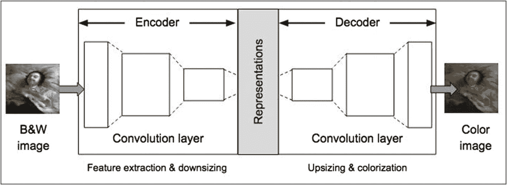

**图 14-1** 自编码器架构

在左侧，我们有一张输入到网络的黑白图像。在右侧，即网络输出处，我们得到一张与输入内容相同的彩色图像。中间的过程可以这样描述：编码器通过一系列卷积层处理图像，并缩小图像尺寸，以学习输入图像的降维表示。然后，解码器尝试通过另一系列卷积层重建图像，在此过程中放大图像并添加颜色。

现在，要理解如何为图像上色，你必须首先了解色彩空间。

## 色彩空间

彩色图像由给定色彩空间中的颜色和亮度强度组成。通过使用红、绿、蓝等原色可以创建一系列颜色。这一系列颜色被称为色彩空间，例如 `RGB`。从数学上讲，色彩空间是一种抽象的数学模型，它简单地将颜色范围描述为数字元组。每种颜色由一个点表示。

我将介绍三种最流行的色彩空间：

* `RGB`
* `YCbCr`
* `Lab`

`RGB` 是最常用的色彩空间。它包含三个通道——红色（`R`）、绿色（`G`）和蓝色（`B`）。每个通道由 8 位表示，最大值为 256。三者组合可以表示超过 1600 万种颜色。

`JPEG` 和 `MPEG` 格式使用 `YCbCr` 色彩空间。与 `RGB` 相比，它更适用于数字传输和存储。`Y` 通道表示灰度图像的亮度。`Cb` 和 `Cr` 分别表示蓝色和红色差色度分量。`Y` 通道的取值范围是 16 到 235。`Cb` 和 `Cr` 的取值范围是 16 到 240。请注意，所有这些通道的组合值可能不代表有效的颜色。在我们的上色应用中，我们不使用这种色彩空间。

`Lab` 色彩空间由国际照明委员会（`CIE`）设计。该色彩空间的视觉表示如图 14-2 所示。

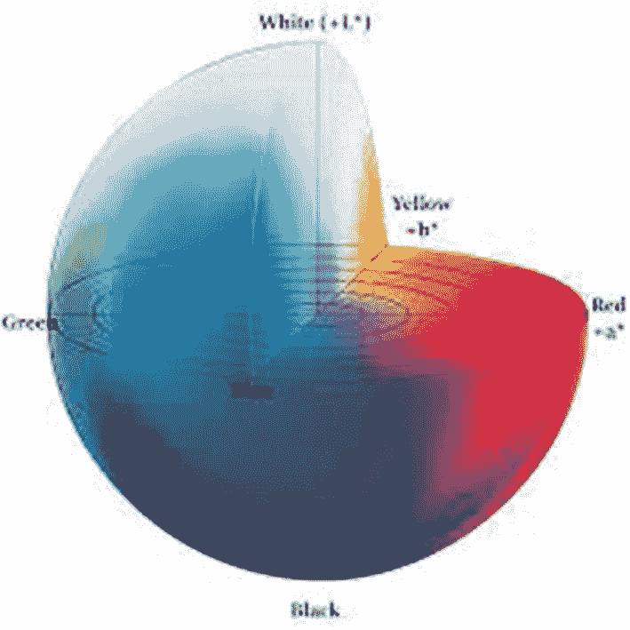

**图 14-2** Lab 色彩空间

`Lab` 色彩空间比计算机显示器和打印机的色域更大。因此，以 `Lab` 表示的位图图像需要每个像素更多的数据才能获得与 `RGB` 或 `CMYK` 相同的精度。因此，`Lab` 色彩空间通常用作中间色彩空间，而非最终色彩空间。

`L` 通道表示亮度，取值范围为 0 到 100。“`a`”通道编码从绿色（`-`）到红色（`+`），“`b`”通道编码从蓝色（`-`）到黄色（`+`）。对于 8 位实现，两者的取值范围均为 `-127` 到 `+127`。`Lab` 色彩空间近似于人眼视觉。这些分量值的数值变化量大致对应于相同的视觉感知变化量。

我们在项目中使用 `Lab` 色彩空间。通过分离代表亮度的灰度分量，网络只需学习用于上色的剩余两个通道。这有助于减小网络规模并实现更快的收敛。

我现在将讨论自编码器的不同网络拓扑结构。

## 网络配置

自编码器网络可以通过三种不同方式进行配置：

* 基础模型
* 合并模型
* 使用预训练网络的合并模型

我现在将讨论这三种模型。

### 基础模型

基础模型的配置如图 14-1 所示，其中编码器有一系列带步长的卷积层，用于缩小图像尺寸并提取特征。解码器也有用于放大和上色的卷积层。在这种自编码器中，编码器不够深，无法提取图像的全局特征。全局特征有助于我们确定如何为图像的某些区域上色。如果我们使编码器网络变深，表示的维度会变得太小，解码器无法忠实地重建原始图像。因此，编码器中需要两条路径——一条用于获取全局特征，另一条用于获取图像的丰富表示。这正是接下来两种模型所做的。你将在本章的第一个项目中构建一个基础网络。

### 合并模型

该模型由 Lizuka 等人在其论文“Let there be Color!”（`http://iizuka.cs.tsukuba.ac.jp/projects/colorization/data/colorization_sig2016.pdf`）中提出。模型架构如图 14-3 所示。

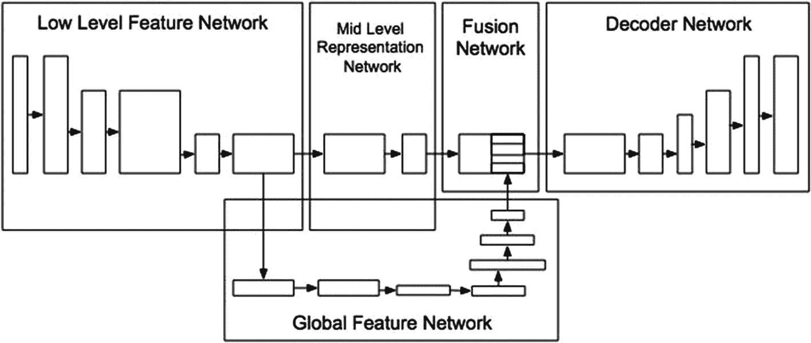

**图 14-3** 合并模型架构

#### 使用八层编码器提取中层表征

采用八层编码器来提取中层表征。第六层的输出被分叉，并送入另一个七层网络以提取全局特征。随后，一个融合网络将这两个输出拼接起来，并馈送到解码器。

## 使用预训练网络的融合模型

该模型由 Baldassarre 等人在其论文“Deep Koalarization: Image Colorization using CNNs and Inception-Resnet-v2”（[`https://arxiv.org/pdf/1712.03400.pdf`](https://arxiv.org/pdf/1712.03400.pdf)）中提出。模型架构的示意图如图 14-4 所示。

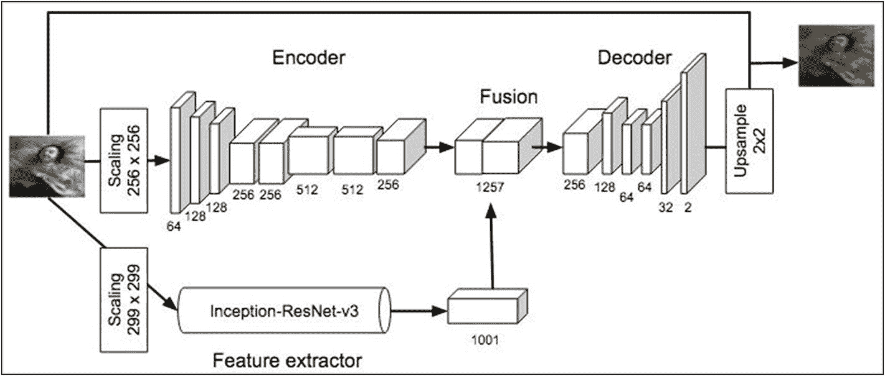

**图 14-4** 使用预训练网络的模型

特征提取由预训练的 `ResNet` 完成。在本章的第二个项目中，我将向你展示如何使用预训练模型进行特征提取，尽管你不会构建像此示意图中那样复杂的模型。通过介绍自动编码器及其配置，让我们开始进行一些实际应用。

## 自动编码器

在这个项目中，你将使用基础自动编码器。

打开一个新的 Colab 笔记本，并将其重命名为 `AutoEncoder – Custom`。添加以下导入：

```python
import numpy as np
import pandas as pd
import os
import matplotlib.pyplot as plt
from tqdm import tqdm
from itertools import chain
import skimage
from skimage.io import imread, imshow
from skimage.transform import resize
from skimage.util import crop, pad
from skimage.morphology import label
from skimage.color import rgb2gray, gray2rgb, rgb2lab, lab2rgb
from sklearn.model_selection import train_test_split
import tensorflow as tf
from tensorflow.keras.models import Model, load_model, Sequential
from tensorflow.keras.preprocessing.image import ImageDataGenerator
from tensorflow.keras.layers import Input, Dense, UpSampling2D, RepeatVector, Reshape
from tensorflow.keras.layers import Dropout, Lambda
from tensorflow.keras.layers import Conv2D, Conv2DTranspose
from tensorflow.keras.layers import MaxPooling2D
from tensorflow.keras import backend as K
```

### 加载数据

你将使用 Kaggle 网站上为此项目提供的数据集。该网站（[`www.kaggle.com/thedownhill/art-images-drawings-painting-sculpture-engraving`](http://www.kaggle.com/thedownhill/art-images-drawings-painting-sculpture-engraving)）提供了一个包含约 9000 张图像的数据集，涵盖五种艺术类型。如果你有 Kaggle 账户，可以使用以下代码通过你的凭据下载数据集：

```python
#!pip install -q kaggle
#!mkdir ~/.kaggle
#!touch ~/.kaggle/kaggle.json
#api_token = {"username":"Your UserName", "key":"Your key"}
#import json
#with open('/root/.kaggle/kaggle.json', 'w') as file:

### json.dump(api_token, file)
#!chmod 600 ~/.kaggle/kaggle.json
#!kaggle datasets download -d thedownhill/art-images-drawings-painting-sculpture-engraving
```

或者，数据也可从本书的下载站点获取，并可使用 `wget` 下载到你的项目中，如下代码片段所示：

```bash
!wget --no-check-certificate -r 'https://drive.google.com/uc?export=download&id=1CKs7s_MZMuZFBXDchcL_AgmCxgPBTJXK' -O art-images-drawings-painting-sculpture-engraving.zip
```

下载数据文件后，使用 `unzip` 工具将其解压到你的驱动器中：

```bash
!unzip art-images-drawings-painting-sculpture-engraving.zip
```

文件解压后，你的驱动器中将存储大量图像，这些图像按特定文件夹结构排列。图像尺寸各异。我们将所有训练图像转换为固定的 256x256 尺寸。我们定义一些变量来创建训练数据集，如下所示：

```python
IMG_WIDTH = 256
IMG_HEIGHT = 256
TRAIN_PATH = '/content/dataset/dataset_updated/training_set/painting/'
train_ids = next(os.walk(TRAIN_PATH))[2]
```

`os.walk` 获取文件夹中存在的所有文件名。

我们首先检查代码中是否有损坏的图像（不可读），并将其从数据集中移除，尽管这一步对我们的目的来说并非必需。

```python
missing_count = 0
for n, id_ in tqdm(enumerate(train_ids), total=len(train_ids)):
    path = TRAIN_PATH + id_+''
    try:
        img = imread(path)
    except:
        missing_count += 1
print("\n\nTotal missing: "+ str(missing_count))
```

运行此代码时，你会发现数据集中有 86 张损坏的图像。

现在，我们将创建训练集，并注意移除损坏的图像。

```python
X_train = np.zeros((len(train_ids)-missing_count, IMG_HEIGHT, IMG_WIDTH, 3), dtype=np.uint8)
missing_images = 0
for n, id_ in tqdm(enumerate(train_ids), total=len(train_ids)):
    path = TRAIN_PATH + id_+''
    try:
        img = imread(path)
        img = resize(img, (IMG_HEIGHT, IMG_WIDTH), mode='constant', preserve_range=True)
        X_train[n-missing_images] = img
    except:
        missing_images += 1
X_train = X_train.astype('float32') / 255.
```

现在，你可以使用以下语句查看图像的外观：

```python
plt.imshow(X_train[5])
```

输出如图 14-5 所示。

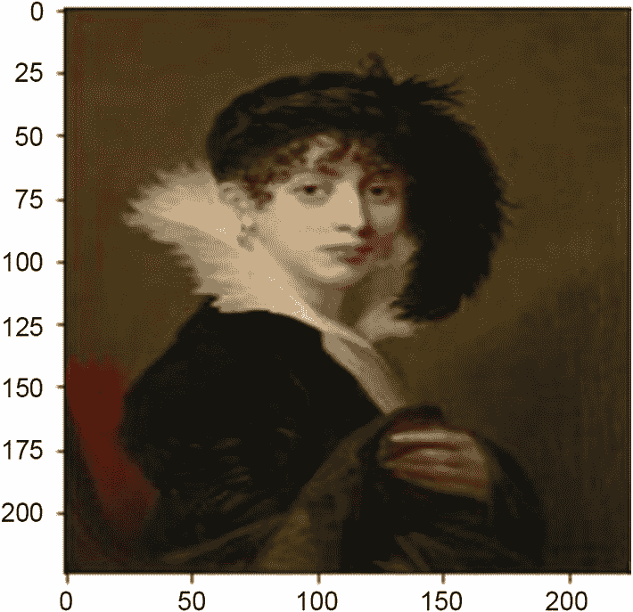

**图 14-5** 示例图像

### 创建训练/测试数据集

我们将从已创建的数据集中保留少量图像用于测试。

```python
x_train, x_test = train_test_split(X_train, test_size=20)
```

`train_test_split` 方法根据 `test_size` 参数指定，保留 20 张图像用于测试。

### 准备训练数据集

为了训练模型，我们将图像从 RGB 格式转换为 Lab 格式。如前所述，L 通道是灰度通道，代表图像的亮度。“a” 是绿色和红色之间的色彩平衡，“b” 是蓝色和黄色之间的色彩平衡。

首先，我们将从 Keras 库创建一个 `ImageDataGenerator` 实例，将图像转换为像素数组，最后将它们组合成一个巨大的向量。

```python
datagen = ImageDataGenerator(
    shear_range=0.2,
    zoom_range=0.2,
    rotation_range=20,
    horizontal_flip=True)
```

如果每张图像都发生扭曲，模型将学习得更好。`shear_range` 使图像向左或向右倾斜，其他参数 `zoom`、`rotation` 和 `horizontal_flip` 各有其含义。

现在，我们将编写一个函数来创建用于训练的数据批次。函数定义如下：

```python
def create_training_batches(dataset=X_train, batch_size = 20):
    # iteration for every image
    for batch in datagen.flow(dataset, batch_size=batch_size):
        # convert from rgb to grayscale
        X_batch = rgb2gray(batch)
        # convert rgb to Lab format
        lab_batch = rgb2lab(batch)
        # extract L component
        X_batch = lab_batch[:,:,:,0]
        # reshape
        X_batch = X_batch.reshape(X_batch.shape+(1,))
        # extract a and b features of the image
        Y_batch = lab_batch[:,:,:,1:] / 128
        yield X_batch, Y_batch
```

该函数首先通过调用 `rgb2gray` 方法将给定图像从 RGB 转换为灰度。然后通过调用 `rgb2lab` 方法将图像转换为 Lab 格式。如果我们采用 Lab 色彩空间，只需要预测两个分量，而其他色彩空间则需要预测三个或四个分量。如前所述，这有助于减小网络规模并实现更快的收敛。最后，我们从图像中提取 L、a 和 b 分量。

## 定义模型

现在，我们将定义自动编码器模型。模型配置基于论文“Let there be Color!”（[`http://iizuka.cs.tsukuba.ac.jp/projects/colorization/data/colorization_sig2016.pdf`](http://iizuka.cs.tsukuba.ac.jp/projects/colorization/data/colorization_sig2016.pdf)）中提出的建议。

```python
### 编码器层的输入
inputs1 = Input(shape=(IMG_WIDTH, IMG_HEIGHT, 1,))
### 编码器
### 使用 Conv2d 减小特征图和图像尺寸
### 将图像转换为 128x128
encoder_output = Conv2D(64, (3,3), activation="relu",
padding='same', strides=2)(inputs1)
encoder_output = Conv2D(128, (3,3),
activation='relu',
padding='same')(encoder_output)
### 将图像转换为 64x64
encoder_output = Conv2D(128, (3,3),
activation='relu', padding="same",
strides=2)(encoder_output)
encoder_output = Conv2D(256, (3,3),
activation='relu',
padding='same')(encoder_output)
### 将图像转换为 32x32
encoder_output = Conv2D(256, (3,3),
activation='relu', padding="same",
strides=2)(encoder_output)
encoder_output = Conv2D(512, (3,3),
activation='relu', padding="same")
(encoder_output)
### 中层特征提取
encoder_output = Conv2D(512, (3,3),
activation='relu',
padding='same')(encoder_output)
encoder_output = Conv2D(256, (3,3),
activation='relu',
padding='same')(encoder_output)
### 解码器
### 为灰度图像添加颜色并放大尺寸
decoder_output = Conv2D(128, (3,3),
activation='relu',
padding='same')(encoder_output)
decoder_output = UpSampling2D((2, 2))(decoder_output)
### 图像尺寸 64x64
decoder_output = Conv2D(64, (3,3), activation="relu",
padding='same')(decoder_output)
decoder_output = Conv2D(64, (3,3), activation="relu",
padding='same')(decoder_output)
decoder_output = UpSampling2D((2, 2))(decoder_output)
### 图像尺寸 128x128
decoder_output = Conv2D(32, (3,3), activation="relu",
padding='same')(decoder_output)
decoder_output = Conv2D(2, (3, 3), activation="tanh",
padding='same')(decoder_output)
decoder_output = UpSampling2D((2, 2))(decoder_output)
### 图像尺寸 256x256
```

编码器和解码器都包含少量 `Conv2D` 层。编码器通过一系列层对图像进行下采样以提取其特征，而解码器则通过其自身的层集，尝试使用不同位置的上采样并为灰度图像添加颜色来重建原始图像，最终生成尺寸为 256x256 的图像。解码器的最后一层使用 `tanh` 激活函数，将值压缩到 -1 到 +1 之间。请记住，我们之前已将 `a` 和 `b` 值归一化到 -1 到 +1 的范围内。

定义编码器和解码器层之后，构建模型并使用其 `compile` 方法进行编译。我们使用 `mse` 作为损失函数，并使用 `Adam` 优化器。

```python
model = Model(inputs=inputs1, outputs=decoder_output)
model.compile(loss='mse', optimizer="adam",
metrics=['accuracy'])
print(model.summary())
```

模型摘要如图 14-6 所示。

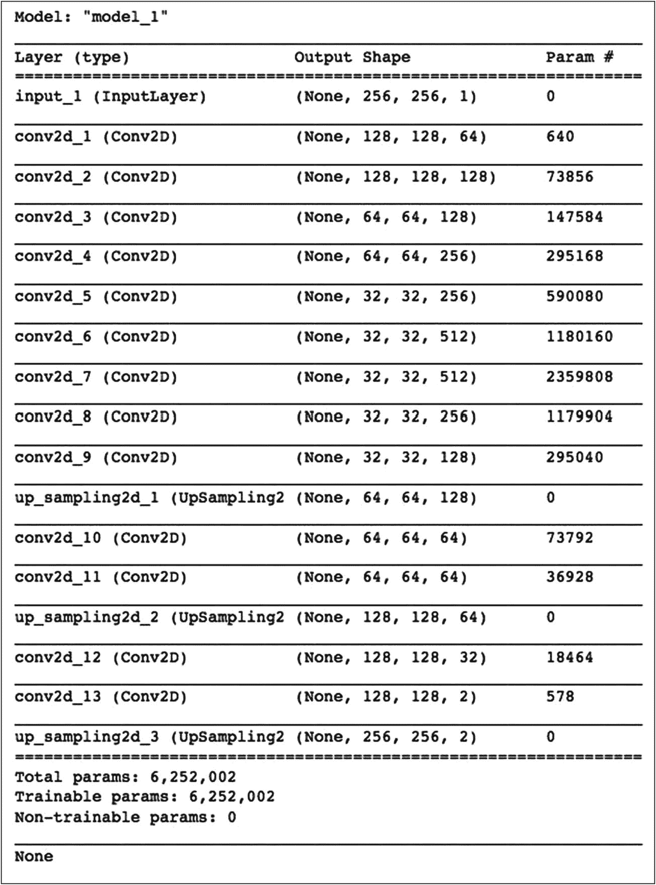

图 14-6
自编码器模型摘要

你可以通过绘制模型来获得可视化效果：

```python
tf.keras.utils.plot_model(model)
```

输出如图 14-7 所示。

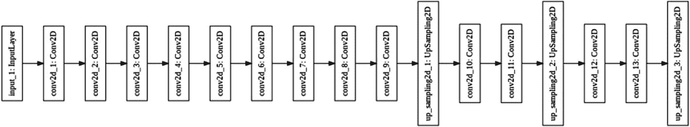

图 14-7
模型图

### 模型训练

我们通过调用模型的 `fit` 方法来训练模型。

```python
BATCH_SIZE = 20
model.fit_generator(create_training_batches
(X_train,BATCH_SIZE),
epochs= 100,
verbose=1,
steps_per_epoch=X_train.shape[0]/BATCH_SIZE)
```

在 GPU 上训练模型，每个 epoch 花费了我略多于一分钟的时间。通过使用预训练模型，训练时间减少到大约每秒一个 epoch，正如你在本章运行第二个项目时将会看到的那样。

## 测试

现在，你可以在我们之前创建的测试数据集上检查模型性能。请注意，对于测试图像，我们不会像对训练图像那样进行扭曲。我们只需将图像转换为 Lab 格式并进行预测。以下是对测试图像进行模型预测的代码。

```python
test_image = rgb2lab(x_test)[:,:,:,0]
test_image = test_image.reshape
(test_image.shape+(1,))
output = model.predict(test_image)
output = output * 128
### 生成输出图像数组
generated_images = np.zeros
((len(output),256, 256, 3))
for i in range(len(output)):
### 遍历输出
cur = np.zeros((256, 256, 3))
### 虚拟数组
cur[:,:,0] = test_image[i][:,:,0]
### 分配灰度分量
cur[:,:,1:] = output[i]
### 分配 a 和 b 分量
### 从 lab 转换为 rgb 格式，因为 plt 仅适用于 rgb 模式
generated_images[i] = lab2rgb(cur)
```

使用以下代码片段显示生成的图像以及原始图像：

```python
plt.figure(figsize=(20, 6))
for i in range(10):
### 灰度图
plt.subplot(3, 10, i + 1)
plt.imshow(rgb2gray(x_test)[i].reshape(256, 256))
plt.gray()
plt.axis('off')
### 重新着色
plt.subplot(3, 10, i + 1 +10)
plt.imshow(generated_images[i].reshape
(256, 256,3))
plt.axis('off')
### 原始图像
plt.subplot(3, 10, i + 1 + 20)
plt.imshow(x_test[i].reshape(256, 256,3))
plt.axis('off')
plt.tight_layout()
plt.show()
```

输出如图 14-8 所示。

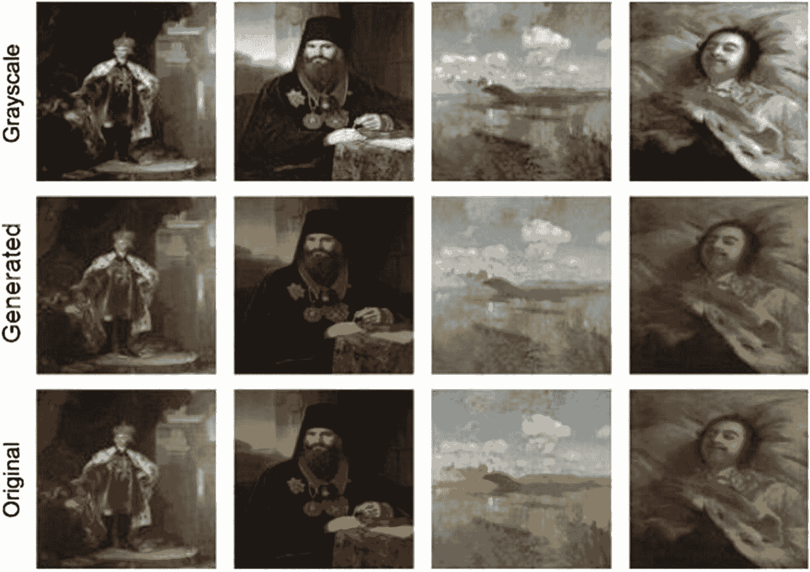

图 14-8
模型推理

第一行是从第三行给出的原始彩色图像创建的一组灰度图像。中间行显示模型生成的图像。如你所见，模型能够生成与原始图像足够接近的图像。现在，我将向你展示如何在不同尺寸的未见图像上使用此模型。

## 对未见图像进行推理

你可以在自己选择的未见图像上测试模型的性能。本书网站提供了一张示例图像，可以使用 `wget` 下载。

```bash
!wget https://raw.githubusercontent.com/Apress/artificial-neural-networks-with-tensorflow-2/main/ch14/mountain.jpg
```

显示原始图像：

```python
img = imread("mountain.jpg")
plt.imshow(img)
```

图像如图 14-9 所示。

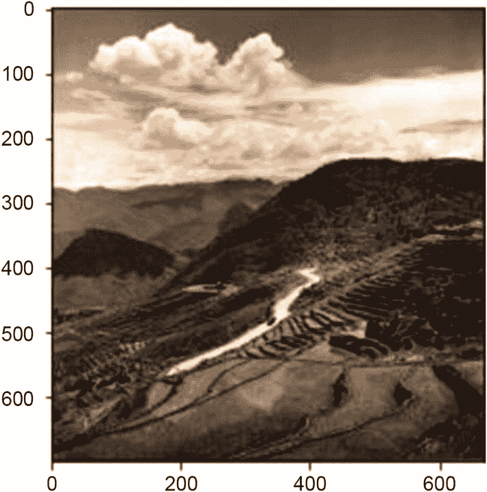

图 14-9
不同尺寸的示例图像

现在，使用以下代码运行推理。请注意，在将图像输入网络之前，我们需要更改图像尺寸。

```python
img = resize(img, (IMG_HEIGHT, IMG_WIDTH),
mode='constant', preserve_range=True)
img = img.astype('float32') / 255.
test_image = rgb2lab(img)[:,:,0]
test_image = test_image.reshape
((1,)+test_image.shape+(1,))
output = model.predict(test_image)
output = output * 128
plt.imshow(img)
plt.axis('off')
```

生成的图像如图 14-10 所示。

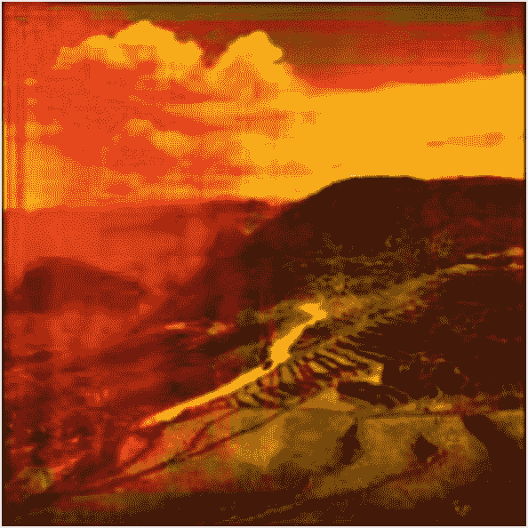

图 14-10
由自定义自编码器模型生成的彩色图像

## 完整源代码

完整源代码见清单 14-1，供你参考。

```python
import numpy as np
import pandas as pd
import os
import matplotlib.pyplot as plt
from tqdm import tqdm
from itertools import chain
import skimage
from skimage.io import imread, imshow
from skimage.transform import resize
from skimage.util import crop, pad
from skimage.morphology import label
from skimage.color import rgb2gray, gray2rgb, rgb2lab, lab2rgb
from sklearn.model_selection import train_test_split
import tensorflow as tf
from tensorflow.keras.models import Model, load_model, Sequential
from tensorflow.keras.preprocessing.image import ImageDataGenerator
from tensorflow.keras.layers import Input, Dense, UpSampling2D, RepeatVector, Reshape
from tensorflow.keras.layers import Dropout, Lambda
from tensorflow.keras.layers import Conv2D, Conv2DTranspose
from tensorflow.keras.layers import MaxPooling2D
from tensorflow.keras import backend as K

#!pip install -q kaggle
#!mkdir ~/.kaggle
#!touch ~/.kaggle/kaggle.json
#api_token = {"username":"Your UserName", "key":"Your key"}
#import json
#with open('/root/.kaggle/kaggle.json', 'w') as file:

### json.dump(api_token, file)
#!chmod 600 ~/.kaggle/kaggle.json
#!kaggle datasets download -d thedownhill/art-images-drawings-painting-sculpture-engraving
!wget --no-check-certificate -r 'https://drive.google.com/uc?export=download&id=1CKs7s_MZMuZFBXDchcL_AgmCxgPBTJXK' -O art-images-drawings-painting-sculpture-engraving.zip
!unzip art-images-drawings-painting-sculpture-engraving.zip

IMG_WIDTH = 256
IMG_HEIGHT = 256
TRAIN_PATH = '/content/dataset/dataset_updated/training_set/painting/'
train_ids = next(os.walk(TRAIN_PATH))[2]
missing_count = 0

for n, id_ in tqdm(enumerate(train_ids), total=len(train_ids)):
    path = TRAIN_PATH + id_ + ''
    try:
        img = imread(path)
    except:
        missing_count += 1

print("\n\n 总缺失数量: " + str(missing_count))

X_train = np.zeros((len(train_ids) - missing_count, IMG_HEIGHT, IMG_WIDTH, 3), dtype=np.uint8)
missing_images = 0

for n, id_ in tqdm(enumerate(train_ids), total=len(train_ids)):
    path = TRAIN_PATH + id_ + ''
    try:
        img = imread(path)
        img = resize(img, (IMG_HEIGHT, IMG_WIDTH), mode='constant', preserve_range=True)
        X_train[n - missing_images] = img
    except:
        missing_images += 1

X_train = X_train.astype('float32') / 255.
plt.imshow(X_train[5])

x_train, x_test = train_test_split(X_train, test_size=20)

datagen = ImageDataGenerator(
    shear_range=0.2,
    zoom_range=0.2,
    rotation_range=20,
    horizontal_flip=True
)

def create_training_batches(dataset=X_train, batch_size=20):
    # 遍历每张图像
    for batch in datagen.flow(dataset, batch_size=batch_size):
        # 从 RGB 转换为灰度图
        X_batch = rgb2gray(batch)
        # 将 RGB 转换为 Lab 格式
        lab_batch = rgb2lab(batch)
        # 提取 L 分量
        X_batch = lab_batch[:,:,:,0]
        # 重塑形状
        X_batch = X_batch.reshape(X_batch.shape + (1,))
        # 提取图像的 a 和 b 特征
        Y_batch = lab_batch[:,:,:,1:] / 128
        yield X_batch, Y_batch

### 编码器层的输入
inputs1 = Input(shape=(IMG_WIDTH, IMG_HEIGHT, 1,))

### 编码器

### 使用 Conv2d 减小特征图和图像尺寸

### 将图像转换为 128x128
encoder_output = Conv2D(64, (3,3), activation="relu", padding='same', strides=2)(inputs1)
encoder_output = Conv2D(128, (3,3), activation='relu', padding='same')(encoder_output)

### 将图像转换为 64x64
encoder_output = Conv2D(128, (3,3), activation='relu', padding="same", strides=2)(encoder_output)
encoder_output = Conv2D(256, (3,3), activation='relu', padding='same')(encoder_output)

### 将图像转换为 32x32
encoder_output = Conv2D(256, (3,3), activation='relu', padding="same", strides=2)(encoder_output)
encoder_output = Conv2D(512, (3,3), activation='relu', padding="same")(encoder_output)

### 中层特征提取
encoder_output = Conv2D(512, (3,3), activation='relu', padding='same')(encoder_output)
encoder_output = Conv2D(256, (3,3), activation='relu', padding='same')(encoder_output)

### 解码器

### 为灰度图像添加颜色并放大尺寸
decoder_output = Conv2D(128, (3,3), activation='relu', padding='same')(encoder_output)
decoder_output = UpSampling2D((2, 2))(decoder_output)

### 图像尺寸 64x64
decoder_output = Conv2D(64, (3,3), activation="relu", padding='same')(decoder_output)
decoder_output = Conv2D(64, (3,3), activation="relu", padding='same')(decoder_output)
decoder_output = UpSampling2D((2, 2))(decoder_output)

### 图像尺寸 128x128
decoder_output = Conv2D(32, (3,3), activation="relu", padding='same')(decoder_output)
decoder_output = Conv2D(2, (3, 3), activation="tanh", padding='same')(decoder_output)
decoder_output = UpSampling2D((2, 2))(decoder_output)

### 图像尺寸 256x256

### 编译模型
model = Model(inputs=inputs1, outputs=decoder_output)
model.compile(loss='mse', optimizer="adam", metrics=['accuracy'])
print(model.summary())
tf.keras.utils.plot_model(model)

BATCH_SIZE = 20
model.fit_generator(create_training_batches(X_train, BATCH_SIZE),
                    epochs=100,
                    verbose=1,
                    steps_per_epoch=X_train.shape[0] / BATCH_SIZE)

test_image = rgb2lab(x_test)[:,:,:,0]
test_image = test_image.reshape(test_image.shape + (1,))
output = model.predict(test_image)
output = output * 128

### 生成输出图像数组
generated_images = np.zeros((len(output), 256, 256, 3))
for i in range(len(output)):
    # 遍历输出
    cur = np.zeros((256, 256, 3))
    # 虚拟数组
    cur[:,:,0] = test_image[i][:,:,0]
    # 分配灰度分量
    cur[:,:,1:] = output[i]
    # 分配 a 和 b 分量
    # 从 Lab 转换为 RGB 格式，因为 plt 仅适用于 RGB 模式
    generated_images[i] = lab2rgb(cur)

plt.figure(figsize=(20, 6))
for i in range(10):
    # 灰度图
    plt.subplot(3, 10, i + 1)
    plt.imshow(rgb2gray(x_test)[i].reshape(256, 256))
    plt.gray()
    plt.axis('off')
    # 重新着色
    plt.subplot(3, 10, i + 1 + 10)
    plt.imshow(generated_images[i].reshape(256, 256, 3))
    plt.axis('off')
    # 原图
    plt.subplot(3, 10, i + 1 + 20)
    plt.imshow(x_test[i].reshape(256, 256, 3))
    plt.axis('off')

plt.tight_layout()
plt.show()

!wget https://raw.githubusercontent.com/Apress/artificial-neural-networks-with-tensorflow-2/main/ch14/mountain.jpg
img = imread("mountain.jpg")
plt.imshow(img)
img = resize(img, (IMG_HEIGHT, IMG_WIDTH), mode='constant', preserve_range=True)
img = img.astype('float32') / 255.
test_image = rgb2lab(img)[:,:,0]
test_image = test_image.reshape((1,) + test_image.shape + (1,))
output = model.predict(test_image)
output = output * 128
plt.imshow(img)
plt.axis('off')

### 列表 14-1

### AutoEncoder_Custom
```

### 使用预训练模型进行特征提取

现在，我将向你展示如何使用预训练模型进行特征提取，从而节省大量训练时间，并获得更好的特征提取效果。

## 将预训练模型用作编码器

目前有多种预训练模型可用于图像处理。你在第 12 章中使用过这样一个 `VGG16` 模型。使用该模型可以提取图像特征，这正是我们在之前的程序中通过创建自己的编码器所做的事情。那么，为什么不使用迁移学习，用 `VGG16` 预训练模型来代替编码器呢？这正是我将在本应用中演示的内容。与你自己定义的编码器相比，使用预训练模型无疑会提供更好的结果，并且训练速度也更快。

## 项目描述

你将使用与上一个项目相同的图像数据集。因此，数据加载和预处理代码保持不变。变化的是模型定义和推理过程。所以，我将只描述相关的改动。整个项目源码可在本书的下载网站上找到，本节末尾也提供了源码，方便你快速参考。项目名称为 `AutoEncoder-TransferLearning`。

由于 `VGG16` 是在大小为 224x224 的图像上训练的，你需要将这两个常量值修改为以下内容：

```
IMG_WIDTH = 224
IMG_HEIGHT = 224
```

## 定义模型

你已经在第 12 章（图 12-5）中看到了 `VGG16` 的架构。VGG 模型的前 18 层用于提取图像特征。因此，我们将使用这些层，并丢弃所有后续层。我们使用以下代码片段创建一个新的序贯模型：

```
vggmodel = tf.keras.applications.vgg16.VGG16()
newmodel = Sequential()
num = 0
for i, layer in enumerate(vggmodel.layers):
if i<19:
newmodel.add(layer)
newmodel.summary()
for layer in newmodel.layers:
layer.trainable=False
```

我们将所有这些层的 `trainable` 参数设置为 `false`，因为我们打算使用预训练模型进行特征提取。模型摘要如图 14-11 所示。

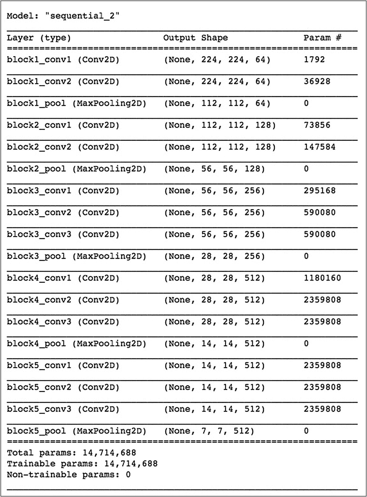

**图 14-11** 预训练编码器模型摘要

## 提取特征

你将使用已创建的 `newmodel` 提取训练数据集图像中的特征。我们只需将每张训练图像传入网络，并在第 19 层收集预测结果。

```
vggfeatures = []
for sample in x_train:
sample = gray2rgb(sample)
sample = sample.reshape((1,224,224,3))
prediction = newmodel.predict(sample)
prediction = prediction.reshape((7,7,512))
vggfeatures.append(prediction)
vggfeatures = np.array(vggfeatures)
```

## 定义网络

现在，你将按如下方式定义我们的编码器/解码器架构：

```
#编码器
encoder_input = Input(shape=(7, 7, 512,))
#解码器
decoder_output = Conv2D(256, (3,3),
activation='relu', padding="same")
(encoder_input)
decoder_output = Conv2D(128, (3,3),
activation='relu', padding="same")
(decoder_output)
decoder_output = UpSampling2D((2, 2))(decoder_output)
decoder_output = Conv2D(64, (3,3), activation="relu",
padding='same')(decoder_output)
decoder_output = UpSampling2D((2, 2))(decoder_output)
decoder_output = Conv2D(32, (3,3), activation="relu",
padding='same')(decoder_output)
decoder_output = UpSampling2D((2, 2))(decoder_output)
decoder_output = Conv2D(16, (3,3), activation="relu",
padding='same')(decoder_output)
decoder_output = UpSampling2D((2, 2))(decoder_output)
decoder_output = Conv2D(2, (3, 3), activation="tanh",
padding='same')(decoder_output)
decoder_output = UpSampling2D((2, 2))(decoder_output)
model = Model(inputs=encoder_input,
outputs=decoder_output)
model.summary()
```

对于编码器，我们只需指定输入，而解码器架构与上一个示例相同，我们不断放大图像并为其添加颜色。

模型摘要如图 14-12 所示。

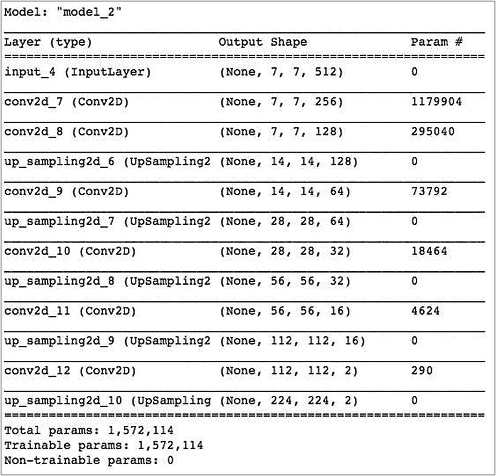

**图 14-12** 编码器-解码器模型摘要

### 模型训练

使用以下两条语句编译并训练模型：

```
model.compile(optimizer='Adam', loss="mse")
model.fit(vggfeatures, image_a_b_gen(x_train),
verbose=1, epochs=100, batch_size=128)
```

我们使用 `Adam` 优化器和 `mse` 损失函数进行训练。在 GPU 上训练网络时，每个 epoch 大约需要一秒钟——这比我们之前的网络有了显著改进。由于我们使用了预训练编码器，因此只需要训练解码器的参数。

### 推理

现在，运行以下代码从测试数据集中生成图像。该代码足够简单，易于理解。

```
sample = x_test[1:6]
for image in sample:
lab = rgb2lab(image)
l = lab[:,:,0]
L = gray2rgb(l)
L = L.reshape((1,224,224,3))
vggpred = newmodel.predict(L)
ab = model.predict(vggpred)
ab = ab*128
cur = np.zeros((224, 224, 3))
cur[:,:,0] = l
cur[:,:,1:] = ab
plt.subplot(1,2,1)
plt.title("生成的图像")
plt.imshow( lab2rgb(cur))
plt.axis('off')
plt.subplot(1,2,2)
plt.title("原始图像")
plt.imshow(image)
plt.axis('off')
plt.show()
```

上述代码的输出如图 14-13 所示。

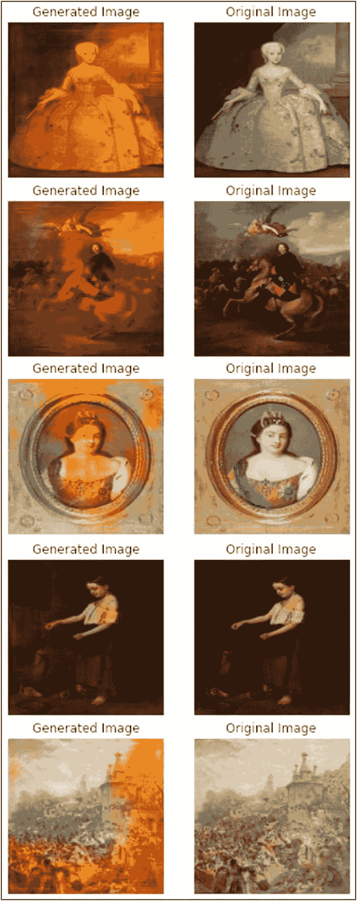

**图 14-13** 在测试图像上的模型推理结果

## 对未见过的图像进行推理

与之前的示例类似，测试模型在你选择的未见过的图像上的性能。我们将使用与之前示例相同的图像。

```
!wget https://raw.githubusercontent.com/Apress/artificial-neural-networks-with-tensorflow-2/main/ch14/mountain.jpg
```

如果你想再次查看原始图像，可以显示它。

```
img = imread("mountain.jpg")
plt.imshow(img)
```

现在，使用以下代码运行推理。请注意，在将图像输入网络之前，我们需要将图像大小调整为 224x224。

```
test = img_to_array(load_img("mountain.jpg"))
test = resize(test, (224,224), anti_aliasing=True)
test*= 1.0/255
lab = rgb2lab(test)
l = lab[:,:,0]
L = gray2rgb(l)
L = L.reshape((1,224,224,3))
vggpred = newmodel.predict(L)
ab = model.predict(vggpred)
ab = ab*128
cur = np.zeros((224, 224, 3))
cur[:,:,0] = l
cur[:,:,1:] = ab
plt.imshow( lab2rgb(cur))
plt.axis('off')
```

程序输出如图 14-14 所示。

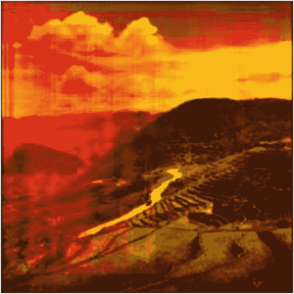

**图 14-14** 由自编码器迁移学习模型生成的彩色图像

## 完整源码

完整的源码见列表 14-2，供你参考。

```python
import numpy as np
import pandas as pd
import cv2
import os
import sys
import matplotlib.pyplot as plt
from tqdm import tqdm
from itertools import chain
import skimage
from PIL import Image
from skimage.io import imread, imshow,
imread_collection, concatenate_images
from skimage.transform import resize
from skimage.util import crop, pad
from skimage.morphology import label
from skimage.color import rgb2gray, gray2rgb,
rgb2lab, lab2rgb
from sklearn.model_selection import train_test_split
from tensorflow.keras.applications.vgg16 import VGG16
from tensorflow.keras.preprocessing.image
import load_img
from tensorflow.keras.preprocessing.image
import img_to_array
from tensorflow.keras.applications.vgg16
import preprocess_input
import tensorflow as tf
from tensorflow.keras.models
import Model, load_model,Sequential
from tensorflow.keras.preprocessing.image
import ImageDataGenerator
from tensorflow.keras.layers import Input, Dense,
UpSampling2D, RepeatVector, Reshape
from tensorflow.keras.layers import Dropout, Lambda
from tensorflow.keras.layers
import Conv2D, Conv2DTranspose
from tensorflow.keras.layers import MaxPooling2D
from tensorflow.keras.layers import concatenate
from tensorflow.keras import backend as K
#!pip install -q kaggle
#!mkdir ~/.kaggle
#!touch ~/.kaggle/kaggle.json
#api_token = {"username":"","key":""}
#import json
#with open('/root/.kaggle/kaggle.json', 'w') as file:

### json.dump(api_token, file)
#!chmod 600 ~/.kaggle/kaggle.json
#!kaggle datasets download -d thedownhill/art-images-drawings-painting-sculpture-engraving
!wget --no-check-certificate -r 'https://drive.google.com/uc?export=download&id=1CKs7s_MZMuZFBXDchcL_AgmCxgPBTJXK' -O art-images-drawings-painting-sculpture-engraving.zip
!unzip art-images-drawings-painting-sculpture-engraving.zip
IMG_WIDTH = 224
IMG_HEIGHT = 224
TRAIN_PATH =
'/content/dataset/dataset_updated/training_set/painting/'
train_ids = next(os.walk(TRAIN_PATH))[2]
missing_count = 0
for n, id_ in tqdm(enumerate(train_ids),
total=len(train_ids)):
path = TRAIN_PATH + id_+''
try:
img = imread(path)
except:
missing_count += 1
print("\n\n 总计缺失: "+ str(missing_count))
X_train = np.zeros((len(train_ids)-missing_count,
IMG_HEIGHT, IMG_WIDTH, 3), dtype=np.uint8)
missing_images = 0
for n, id_ in tqdm(enumerate(train_ids),
total=len(train_ids)):
path = TRAIN_PATH + id_+''
try:
img = imread(path)
img = resize(img, (IMG_HEIGHT, IMG_WIDTH),
mode='constant',
preserve_range=True)
X_train[n-missing_images] = img
except:
missing_images += 1
X_train = X_train.astype('float32') / 255.
plt.imshow(X_train[5])
x_train, x_test = train_test_split
(X_train, test_size=1500)
datagen = ImageDataGenerator(
shear_range=0.2,
zoom_range=0.2,
rotation_range=20,
horizontal_flip=True)
def image_a_b_gen(dataset=X_train):

### 对每张图像进行迭代
for batch in datagen.flow(dataset, batch_size=542):

### 从 rgb 转换为灰度
X_batch = rgb2gray(batch)

### 将 rgb 转换为 Lab 格式
lab_batch = rgb2lab(batch)
X_batch = lab_batch[:,:,:,1:] /128
return X_batch
vggmodel = tf.keras.applications.vgg16.VGG16()
newmodel = Sequential()
num = 0
for i, layer in enumerate(vggmodel.layers):
if i<19:
newmodel.add(layer)
newmodel.summary()
for layer in newmodel.layers:
layer.trainable=False
vggfeatures = []
for sample in x_train:
sample = gray2rgb(sample)
sample = sample.reshape((1,224,224,3))
prediction = newmodel.predict(sample)
prediction = prediction.reshape((7,7,512))
vggfeatures.append(prediction)
vggfeatures = np.array(vggfeatures)
#编码器
encoder_input = Input(shape=(7, 7, 512,))
#解码器
decoder_output = Conv2D(256, (3,3),
activation='relu', padding="same")
(encoder_input)
decoder_output = Conv2D(128, (3,3),
activation='relu', padding="same")
(decoder_output)
decoder_output = UpSampling2D((2, 2))(decoder_output)
decoder_output = Conv2D(64, (3,3), activation="relu",
padding='same')(decoder_output)
decoder_output = UpSampling2D((2, 2))(decoder_output)
decoder_output = Conv2D(32, (3,3), activation="relu",
padding='same')(decoder_output)
decoder_output = UpSampling2D((2, 2))(decoder_output)
decoder_output = Conv2D(16, (3,3), activation="relu",
padding='same')(decoder_output)
decoder_output = UpSampling2D((2, 2))(decoder_output)
decoder_output = Conv2D(2, (3, 3), activation="tanh",
padding='same')(decoder_output)
decoder_output = UpSampling2D((2, 2))(decoder_output)
model = Model(inputs=encoder_input,
outputs=decoder_output)
model.summary()
model.compile(optimizer='Adam', loss="mse")
model.fit(vggfeatures, image_a_b_gen(x_train),
verbose=1, epochs=100, batch_size=128)
sample = x_test[1:6]
for image in sample:
lab = rgb2lab(image)
l = lab[:,:,0]
L = gray2rgb(l)
L = L.reshape((1,224,224,3))
vggpred = newmodel.predict(L)
ab = model.predict(vggpred)
ab = ab*128
cur = np.zeros((224, 224, 3))
cur[:,:,0] = l
cur[:,:,1:] = ab
plt.subplot(1,2,1)
plt.title("生成的图像")
plt.imshow( lab2rgb(cur))
plt.axis('off')
plt.subplot(1,2,2)
plt.title("原始图像")
plt.imshow(image)
plt.axis('off')
plt.show()
!wget https://raw.githubusercontent.com/Apress/artificial-neural-networks-with-tensorflow-2/main/ch14/mountain.jpg
img = imread("mountain.jpg")
plt.imshow(img)
test = img_to_array(load_img("mountain.jpg"))
test = resize(test, (224,224), anti_aliasing=True)
test*= 1.0/255
lab = rgb2lab(test)
l = lab[:,:,0]
L = gray2rgb(l)
L = L.reshape((1,224,224,3))
vggpred = newmodel.predict(L)
ab = model.predict(vggpred)
ab = ab*128
cur = np.zeros((224, 224, 3))
cur[:,:,0] = l
cur[:,:,1:] = ab
plt.imshow( lab2rgb(cur))
plt.axis('off')
清单 14-2
AutoEncoder_TransferLearning
```

# 总结

使用深度神经网络可以为黑白图像添加色彩。你学习了如何创建`AutoEncoders`（自编码器），并用它们为黑白图像着色。`AutoEncoder`包含一个用于提取图像特征的`Encoder`（编码器），以及一个利用编码器提取的表示来重建图像的`Decoder`（解码器）。你还学习了如何使用预训练的图像分类器来提取图像特征，并将其作为`Encoder`的一部分。

