# 1. TensorFlow 快速入门

TensorFlow 是一个用于开发和部署机器学习应用的端到端开源平台。我们可以称其为完整的机器学习生态系统。我们都在 Facebook 的照片中见过人脸标记功能。嗯，这就是一个机器学习应用。自动驾驶汽车使用物体检测来避免道路碰撞。机器现在可以将西班牙语翻译成英语。人声被转换成文本，供你创建数字文档。所有这些都是机器学习应用。甚至我们经常使用的一个简单的 `OCR`（光学字符识别）应用也使用了机器学习。如今还开发了许多更高级的应用——例如图像描述、图像生成、图像翻译、时间序列预测、理解人类语言等等。所有这些以及更多应用都可以在 `TensorFlow` 平台上开发和部署。而这正是你将在本书中学习的内容。

无论你是初学者还是专家，`TensorFlow` 都能帮助你轻松构建自己的机器学习模型。在 `TensorFlow` 中，你可以定义自己的神经网络架构，对其进行实验、训练，并最终部署到生产服务器上。不仅如此，一个完全训练好的模型可以部署到移动设备、嵌入式设备，以及支持 JavaScript 的网络上。

你可能使用过其他机器学习开发库——仅举几例，`Keras`、`Torch`、`Theano` 和 `Pytorch`。KDnuggets（`www.kdnuggets.com`）最近进行的一项关于“哪个深度学习框架增长最快？”的研究得出了如图 1-1 所示的发现。

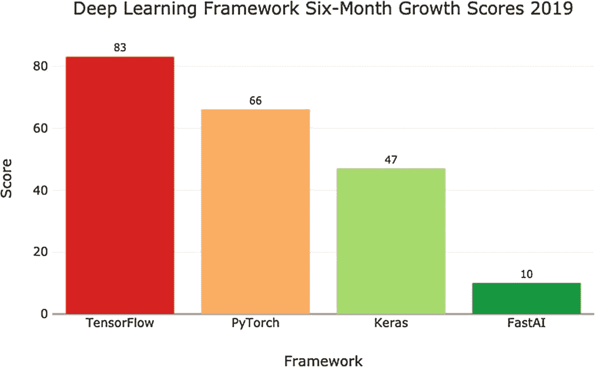

图 1-1

深度学习框架增长情况 – 2019 年

2018 年对几个流行框架进行的类似调查如图 1-2 所示。

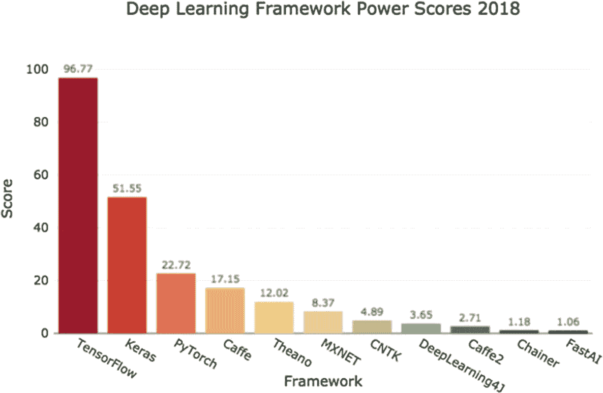

图 1-2

几个深度学习框架的功率分数

非常明显，`TensorFlow` 是所有被调查的深度学习框架中的赢家。因此，你选择学习并使用 `TensorFlow 2.x` 进行深度学习应用开发是正确的决定。现在让我们开始学习 `TensorFlow`。

## 什么是 TensorFlow 2.0？

一张图胜过千言万语。我将为你提供整个 `TensorFlow` 平台的简化概念表示。


### TensorFlow 2.x 平台

整个平台的概念如图 1-3 所示。

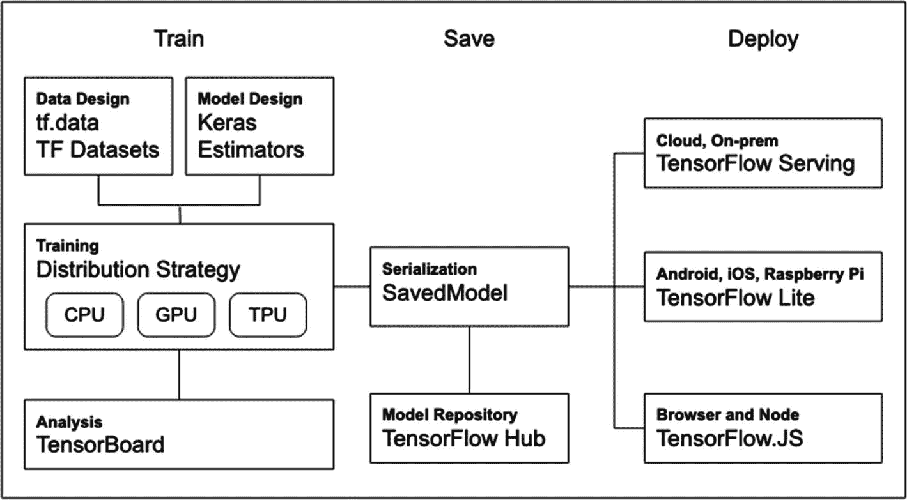

图 1-3 TensorFlow 2.x 平台

与任何典型的机器学习项目一样，它包含三个不同的阶段。在第一阶段（也称为训练阶段），我们定义人工神经网络模型，并在给定数据上对其进行训练。同时，我们使用测试数据测试模型，并重新训练，直到对其性能满意为止。在下一阶段，我们将模型保存到一个文件中，该文件稍后可以部署到生产服务器上。在开发的第三阶段，我们将保存的模型部署到生产服务器上，准备对未见过的数据进行预测。

现在，我将描述图 1-3 中所示所有三个阶段的各个组件。

## 训练

训练包括读取数据、将其准备成模型所需的特定格式、创建模型本身，以及运行多个周期（epoch）来训练模型。TensorFlow 2.x 提供了大量函数、库和工具来促进快速训练。通常，在整个开发过程中，机器学习模型训练会占用相当多的时间。借助 TensorFlow 2.x 提供的工具和设施，与传统的训练方法相比，你将能够在更短的时间内训练模型。整个训练模块如图 1-4 所示。

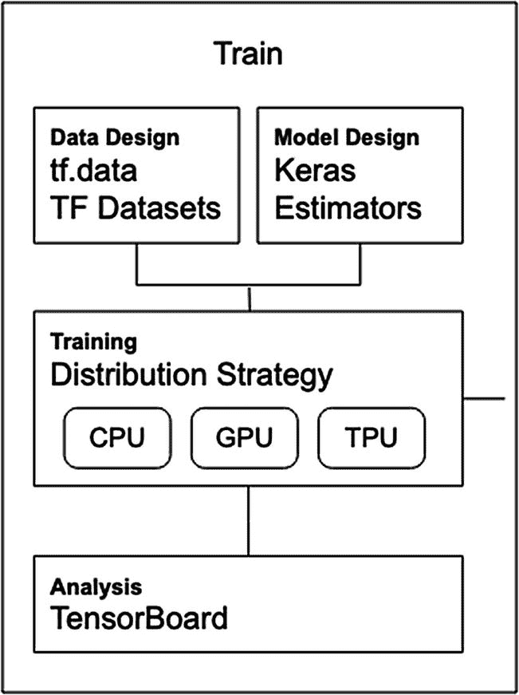

图 1-4 训练模块

现在，我将向你解释训练模块的各个组件。

## 数据准备

考虑图 1-5 中所示的数据设计模块。

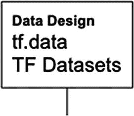

图 1-5 数据设计模块

数据设计模块展示了两个模块——`tf.data` 和 TF Datasets。我将讨论它们各自包含的内容。首先，我将描述 `tf.data`。

模型训练要求根据模型的设计将数据准备成特定格式。数据准备需要几个步骤。首先，你需要从外部源加载数据并进行清洗。清洗过程包括删除包含空字段的行、将分类字段映射到列，以及通常将数值缩放到 -1 到 +1 的范围内。接下来，你需要决定哪些列是你的特征，以及标签是什么。你需要删除那些与模型训练完全无关的列。例如，数据库中的姓名和客户 ID 字段在机器学习训练中将是完全冗余的字段。最后，你需要将数据拆分为训练集和测试集。`tf.data` 模块提供了执行所有这些数据操作所需的各种函数。

TensorFlow 还提供了从许多流行的机器学习库中获取的内置数据集，这些数据集已准备好可在你的 `tf.data` 包中使用。有超过 100 个即用型数据集，分为多个类别，例如音频、图像、视频、文本、翻译等。根据你的需求，你将从一个类别中加载数据，并快速进入模型开发阶段。未来，此模块可能会添加更多数据集。你将能够使用单个程序语句从 `tf.data.dataset` 加载数据，该语句同时创建训练集和测试集。因此，这为你节省了大量准备数据的精力，并且你将能够快速专注于模型训练。尽管如此，你可能无法直接使用数据集将其输入到你的机器学习算法中。数值字段可能需要缩放。分类字段可能需要转换。像用于电影评论的 `imdb` 这样的数据集可能需要编码为不同的格式。你可能需要重塑（改变维度）数据。因此，对这些内置数据集几乎总是需要进行某种预处理。然而，它们仍然为机器学习从业者提供了极大的便利。顺便提一下，这些数据集还支持高性能数据管道，以促进训练迭代之间的快速数据传输，从而实现更快的训练。

#### 设计模型

Keras API 现已集成到 TensorFlow 库中。你可以使用 `tf.keras` 访问整个 API。`tf.keras` 是一个高级 API，它为 TF 1.x 中使用的许多 API 提供了标准化。使用 `tf.keras`，你将能够利用 TensorFlow 2.x 中引入的几个新特性；例如，你的模型开发将受益于即时执行（eager execution）。使用 `tf.keras` 模块的函数式 API，你将能够设计高度复杂的模型。

TensorFlow 2.x 还提供了估算器（Estimators），可用于快速比较不同模型。估算器模块如图 1-6 所示。

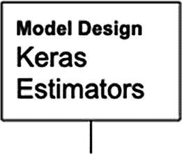

图 1-6 `tf.estimator` 模块

估算器在 `tf.estimator` 下提供，这是一个高级 TensorFlow API。它们封装了机器学习的各个阶段，如模型训练、评估、预测以及导出模型以通过生产服务器提供服务。库中提供了几个预制的估算器；`LinearClassifier` 和 `DNNClassifier` 就是此类预制估算器的两个例子。除了使用预制估算器，你还可以构建自己的自定义估算器。不仅如此，该库还提供了一个名为 `model_to_estimator` 的函数，用于将现有模型转换为估算器。为什么要这样做？将 Keras 模型转换为估算器将使你能够使用 TensorFlow 的分布式训练。

#### 分布式策略

在整个机器学习过程中，最耗时的部分是训练。即使在非常先进的设备上，这也可能需要几分钟到几天的时间。你可能需要大量的处理能力和内存来训练模型。幸运的是，TensorFlow 2.x 在这方面为你提供了帮助。请看图 1-7 中所示的分布式策略模块。

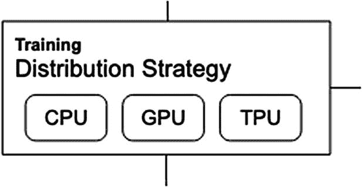

图 1-7 分布式策略模块

现在，模型训练可以在 CPU（中央处理器）、GPU（图形处理器）或 TPU（张量处理器）上进行。不仅如此，你还可以将训练分布到多个硬件单元上。这大大减少了你的训练时间。

#### 分析

在模型训练阶段，你需要在训练的不同阶段分析结果。基于此，你将重新配置网络、修改损失函数、尝试不同的优化器等。TensorFlow 为此提供了一个很好的分析工具，称为 TensorBoard，如图 1-8 所示。

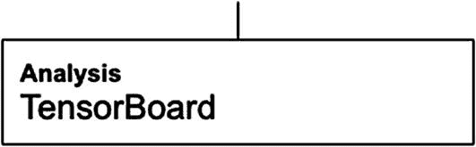

图 1-8 TensorBoard 模块

TensorBoard 提供了各种指标的图表，例如准确率和损失，这些指标在模型训练中被广泛使用。TensorBoard 中还有其他几个功能，随着你进一步阅读本书，你将不断学习到它们。


### 模型保存

通用架构中的模型保存模块如图 1-9 所示。

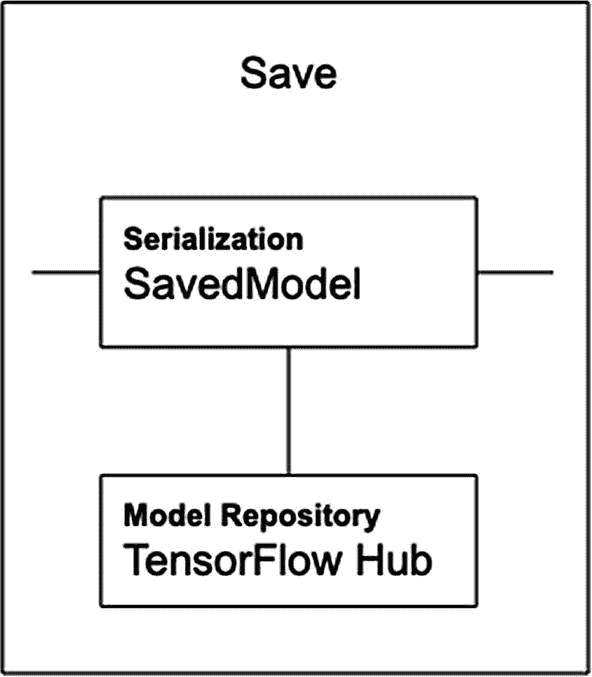

图 1-9

模型保存模块

模型保存包含两个部分——将开发好的模型保存到磁盘，以及从仓库中复用预训练模型。

在将模型训练到所需的精度水平后，将其保存到磁盘。在 `TensorFlow 1.x` 中，有多种保存模型的方式。`TF 2.x` 将模型保存标准化为名为 `SavedModel` 的抽象。保存后的模型可以直接加载到您的机器学习应用中，也可以上传到生产服务器进行服务。`TensorFlow 2.x` 模型被保存为标准化格式，以便能够部署到移动设备、嵌入式设备和 Web 上。`TensorFlow` 提供了 API，可以将开发好的模型部署到这些不同的平台，包括通过 `JavaScript` 和 `Node.js` 支持的 Web。

所谓的 `TensorFlow Hub` 是一个包含许多预训练模型的仓库。您可以使用迁移学习来复用和扩展这些模型，以满足您的需求。使用预训练模型的好处是，您可以用更小的数据集和更快的训练速度来训练模型。您会找到用于文本和图像识别的模型、在 `Google News` 数据集上训练的模型，甚至还有用于 `Progressive GAN` 和 `Google Landmarks Deep Local Features` 的模块。不幸的是，在撰写本文时，这些模型中的大多数都是为 `TensorFlow 1.x` 编写的，需要移植到新版本。请查看 `TensorFlow` 网站以获取模型更新，希望当您阅读本文时，大多数模型都已更新到 `TensorFlow 2.x`。

接下来，您将了解部署选项。

### 部署

训练好的模型可以部署到各种平台上，如图 1-10 所示。

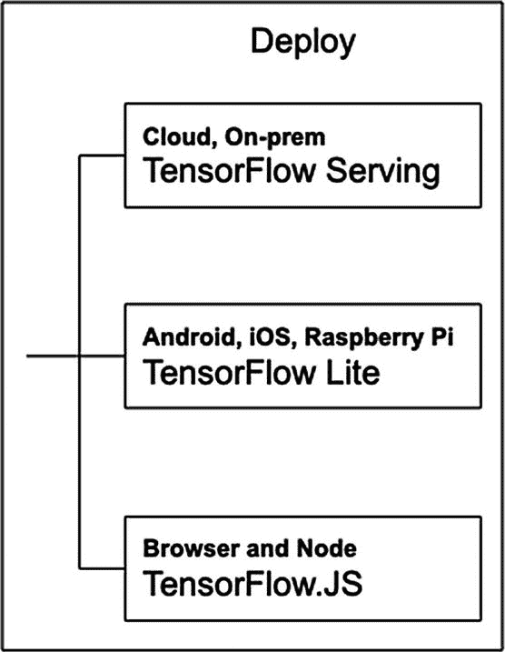

图 1-10

模型部署选项

`TensorFlow 2.x` 最棒的一点是，您将能够将训练好的模型部署到云端或本地。不仅如此，使用 `TensorFlow 2.0`，您甚至可以将模型部署到移动设备（如 `Android` 和 `iOS`）以及嵌入式设备（如 `Raspberry Pi`）上。您还可以使用 `Node.js` 将模型部署到 Web 上。这将允许您在喜欢的浏览器中使用该模型。通常，部署可以分为以下几类：

*   **TensorFlow Serving** – 一个允许模型通过 `HTTP/REST` 或 `gRPC/Protocol buffers` 提供服务的库。

*   **TensorFlow Lite** – 一种轻量级解决方案，用于在 `Android`、`iOS` 以及像 `Raspberry Pi` 和 `Edge TPUs` 这样的嵌入式系统上部署模型。

*   **TensorFlow.js** – 支持在 `JavaScript` 环境（如 Web 浏览器）或通过 `Node.js` 在服务器端部署模型。使用 `TensorFlow.js`，您还可以用 `JavaScript` 定义模型，并使用类似 `Keras` 的 API 直接在 Web 浏览器中训练这些模型。

在对 `TensorFlow` 做了这些简单介绍之后，我将简要描述 `TensorFlow 2.x` 的一些主要显著特性。

## TensorFlow 2.x 提供了什么？

与早期版本相比，`TensorFlow 2.x` 引入了许多新特性。我将简要总结 `TensorFlow 2.x` 的显著特性。在您阅读本书的过程中，您将更好地理解它们的用途。

### TensorFlow 中的 `tf.keras`

`Keras` API 现在可以通过 `TensorFlow` 的 `tf.keras` API 获得。这是一个高级 API，为 `TensorFlow` 特定的功能（如即时执行、数据管道和估算器）提供支持。使用 `tf.keras`，您可以像使用 `Keras` 一样构建和训练模型，而不会牺牲灵活性和性能。

要在程序中使用 `tf.keras`，您将使用以下代码：

```
import tensorflow as tf
from tensorflow import keras
```

一旦加载了 `TensorFlow` 库，您将能够定义自己的神经网络架构、创建模型、训练和测试它们。您将在第 2 章讨论 `TensorFlow 2.x` 的 Hello World 程序时学习这一点。

### 即时执行

在 `TensorFlow 2.x` 之前，您的机器学习代码分为两部分：

1.  构建计算图

2.  创建会话来执行图

这些步骤可以使用以下代码来解释：

```
import tensorflow as tf
a = 2
b = 3
c = tf.add(a, b, name="Add")
print(c)
```

这会在您的控制台上打印以下内容：

```
Tensor("Add:0", shape=(), dtype=int32)
```

它本质上构建了一个图，可以如图 1-11 所示进行可视化。

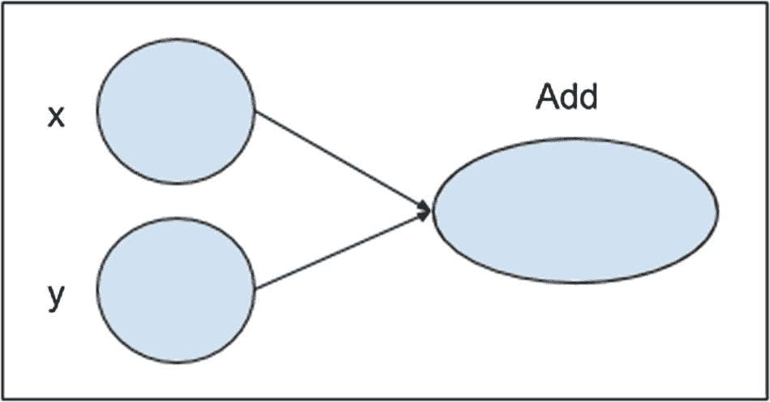

图 1-11

计算图

要运行图本身，您需要按如下方式创建一个会话并运行它以执行您的加法函数：

```
sess = tf.Session()
print(sess.run(c))
sess.close()
```

当您运行上述代码时，结果 `5` 将打印在您的控制台上。

使用 `TensorFlow 2.x`，您无需创建会话即可执行相同的操作。以下代码说明了如何做到这一点：

```
import tensorflow as tf
a = 2
b = 3
c = tf.add(a, b, name="Add")
print(c)
```

执行上述代码的输出将是

```
tf.Tensor(5, shape=(), dtype=int32)
```

请注意，输出张量的值是 5。

因此，会话创建被完全消除了。这在构建大型模型时非常有帮助。通常，在开发过程中，一个小错误可能会在模型的开头某处弹出，要求您再次构建整个计算图。每次修复一个错误，您都需要构建完整的图。这会造成很多不便，并且是一个非常耗时的过程。在 `TensorFlow 2.x` 中，即时执行允许您运行部分代码，而无需构建完整的计算图。这种即时执行是默认实现的，因此您在定义模型时无需考虑任何特殊情况。您可以运行命令 `tf.executing_eagerly()` 来验证。

随着会话创建的消除，`TensorFlow` 代码现在可以像 `Python` 代码一样运行。`TF 2.x` 创建的是所谓的动态计算图，而不是 `TF 1.x` 中创建的静态计算图。

### 分布式

机器学习模型构建中最昂贵的操作是训练模型。`TensorFlow 2.x` 现在提供了一个名为 `tf.distribute.Strategy` 的 API，用于将训练分布到多个 GPU 和 TPU 上。使用此 API，您只需对现有模型和训练代码进行最少的代码更改，即可实现分布式训练。该 API 提供了六种分布式策略：

1.  `MirroredStrategy`

2.  `CentralStorageStrategy`

3.  `MultiWorkerMirroredStrategy`

4.  `TPUStrategy`

5.  `ParameterServerStrategy`

6.  `OneDeviceStrategy`

您可以进一步查阅文档以了解有关这些策略的更多信息。

由于 `tf.distribute.Strategy` 已集成到 `tf.keras` 中，因此它在训练和推理过程中都能自然地利用速度提升的优势。


### TensorBoard

TensorBoard 是一个可视化工具，可帮助您在机器学习模型开发过程中进行实验。借助 TensorBoard，您可以执行以下操作：

- 可视化损失和准确率指标
- 可视化模型图
- 查看权重、偏置等的直方图
- 显示图像
- 分析程序

显示准确率和损失指标的 TensorBoard 典型截图如图 1-12 所示。

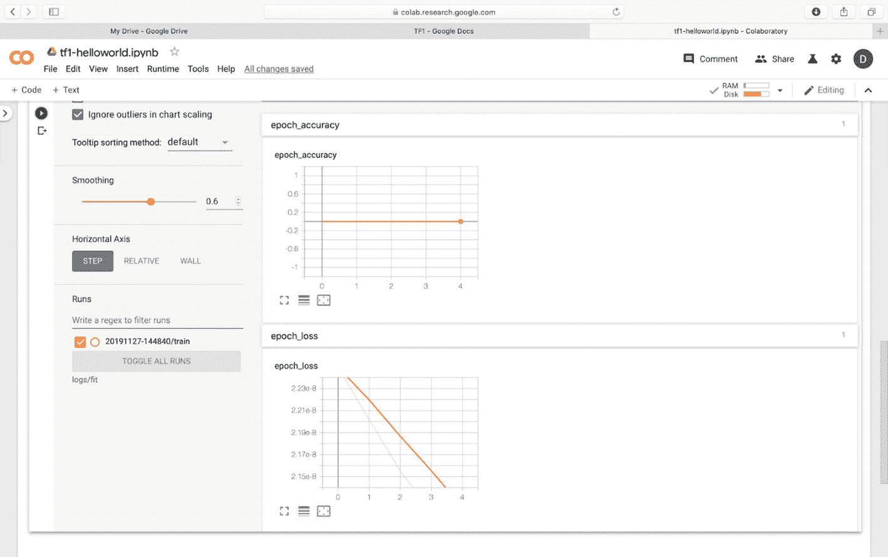

图 1-12：TensorBoard 指标显示

借助 TensorBoard，您可以直接在 Jupyter 环境中可视化模型训练。它提供了许多有用且令人兴奋的功能，例如内存分析、查看混淆矩阵和概念模型图等。它是一个允许您在机器学习工作流程中进行测量并查看结果的工具。

### Vision Kit

借助 TensorFlow 2.x，您现在可以设计自己的、能够进行图像识别的物联网设备。这些物联网设备将由 TensorFlow 的机器学习模型驱动。借助 Google AIY Vision Kit，您将能够构建自己的、可以看见并识别物体的智能相机。您可以选择为此智能相机创建自己的识别模型，或使用预训练模型。整个套件可装入一个方便的小纸板立方体中，并由 Raspberry Pi 驱动。该套件提供了构建您自己的智能相机所需的一切。

### Voice Kit

就像您构建为物联网设备提供视觉能力的智能相机一样，借助 Voice Kit，您将能够为物联网设备提供聆听和应答能力。在 Google AIY Voice Kit 的帮助下，您将能够创建自己的自然语言处理器，它可以连接到 Google Assistant 或云端的语音转文本服务。有了它，您将能够向物联网设备发出语音命令，甚至提出问题并获得答案。与 Vision Kit 一样，它也可以装入一个方便的纸板立方体中，并由 Raspberry Pi 驱动。该套件包含构建支持音频的物联网设备所需的一切，包括 Raspberry Pi。

### Edge TPU

如果您是物联网设备制造商，您会很高兴能够在设备本身上快速原型化您的新机器学习模型。Coral 正是为此目的创建了 Edge TPU 板。这是一个用于快速原型化设备端机器学习产品的开发板。它是一个带有可拆卸系统模块（SOM）的单板计算机。SOM 包含 eMMC、SOC、无线芯片和 Edge TPU。这也非常适合物联网设备和其他嵌入式系统所需的快速设备端机器学习推理。

### AIY 套件的预训练模型

有多个预训练模型可供您在 AIY 套件上使用。其中一些列举如下：

- 人脸检测器
- 狗/猫/人检测器
- 用于识别食物的菜肴分类器
- 图像分类器
- 用于识别鸟类、昆虫和植物的自然探索器

如果您开发了自己的模型，欢迎您将其提交给 Google，以便纳入上述 Google 网站上显示的预训练模型列表中。

### 数据管道

正如我们所看到的，借助 TensorFlow 2.0，训练可以分布在 GPU 和 TPU 上，从而大大减少执行单个训练步骤所需的时间。这也要求在两步之间提供高效的数据传输。新的 `tf.data` API 有助于跨各种模型和加速器构建灵活高效的输入管道。您将在第 2 章中使用数据管道。

### 安装

TensorFlow 2.x 可以安装在以下平台上：

- macOS 10.12.6 或更高版本
- Ubuntu 16.04 或更高版本
- Windows 7 或更高版本
- Raspbian 9.0 或更高版本

我个人使用 Mac 进行开发。本教程中给出的所有程序均在 Mac 上开发和测试。

TensorFlow 的安装很简单。它需要 `pip` 版本 > 19.0。您可以通过在控制台窗口中运行以下命令来确保您的机器上安装了最新的 `pip`：

```
pip install --upgrade pip
```

要安装仅 CPU 版本的 TensorFlow，请运行以下命令：

```
pip install tensorflow
```

要安装 CPU/GPU 版本，请使用以下命令：

```
pip install tensorflow-gpu
```

### 安装

要在 Mac 上安装 TensorFlow，您的机器上必须安装 Xcode 9.2 或更高版本（命令行工具）。`pip` 包有一些依赖项，可以使用命令行工具上的以下命令进行安装：

```
pip install -U --user pip six numpy wheel setuptools mock 'future>=0.17.1'
pip install -U --user keras_applications --no-deps
pip install -U --user keras_preprocessing --no-deps
```

安装完这些依赖项后，您可以运行 `pip install` 来安装您想要使用的任何版本的 TensorFlow。

### Docker 安装

如果您不想自己费心安装 TensorFlow，可以利用 Docker 容器中现成的镜像。要下载 Docker 镜像，请使用以下命令：

```
docker pull tensorflow/tensorflow
```

成功下载 Docker 容器后，运行以下命令启动 Jupyter notebook 服务器：

```
docker run -it -p 8888:8888 tensorflow/tensorflow
```

Jupyter 环境启动后，打开一个 notebook 并按需使用 TensorFlow。这将在下一节“测试”中解释。

### 无需安装

到目前为止，我已经向您展示了在几个平台上安装 TensorFlow 的方法。使用 Docker 镜像可以省去您研究依赖项的工作。还有另一种学习和使用 TensorFlow 的简单方法——那就是使用 Google Colab。这无需安装即可使用 TensorFlow。您只需在浏览器中启动 Google Colab。Google Colab 是一个 Google 研究项目，它本质上在浏览器中为您提供了一个 Jupyter notebook 环境。无需任何设置，您的整个 notebook 代码都在云端运行。您将使用 Google Colab 来运行本教程中的程序。


## 测试

由于本书中的项目将使用 Google Colab，我将向你展示如何在 Colab 中测试 TensorFlow 的安装。通过打开网址 [`http://colab.research.google.com`](http://colab.research.google.com) 来启动 Colab。假设你已登录 Google 账户，你将看到如图 1-13 所示的截图。

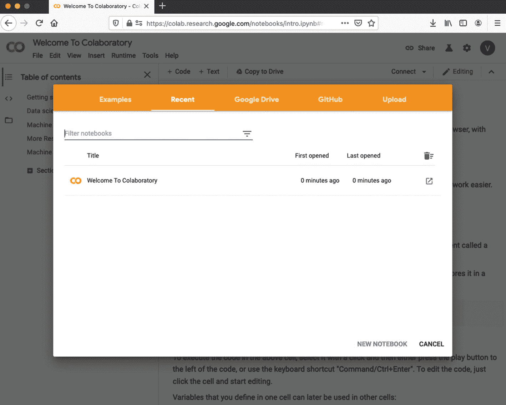

图 1-13

Colab 打开一个新笔记本

选择 **新建 PYTHON3 笔记本** 菜单。浏览器中会打开一个空白笔记本。在代码窗口中输入以下两条程序语句：

```
%tensorflow_version 2.x
import tensorflow as tf
```

`%tensorflow_version` 被称为 Colab 魔法命令，用于加载 TF 2.x 而非默认的 TF 1.x。该魔法命令的使用将在后续章节 2 讨论 TF Hello World 应用时进行说明。

注意

在当前版本的 Colab 中，不再需要使用 `%tensorflow_version`。因此该语句是多余的，我已在后续所有章节中将其删除。

运行该代码单元，你将看到如图 1-14 所示的输出。

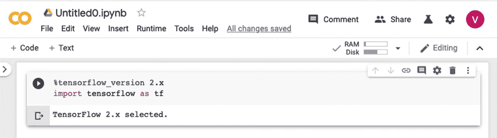

图 1-14

测试 Colab 环境设置

消息显示已选择 TensorFlow 2.x，因此可在你的笔记本中使用。

现在，向你的项目添加一个代码单元，并在其中写入以下代码：

```
c = tf.constant([[2.0, 3.0], [1.0, 4.0]])
d = tf.constant([[1.0, 2.0], [0.0, 1.0]])
e = tf.matmul(c, d)
print (e)
```

运行代码后，你应该会看到以下输出：

```
tf.Tensor(
[[2\. 7.]
[1\. 6.]], shape=(2, 2), dtype=float32)
```

如果你看到上述输出，那么你现在已准备好可以在 Colab 环境中使用 TensorFlow 2.x 了。请注意，与 TF 1.x 不同，上述代码中并未创建任何会话。

至此，我们完成了 TensorFlow 2.x 的安装和设置。

