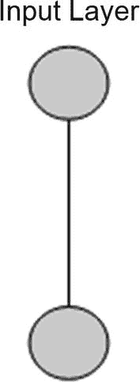
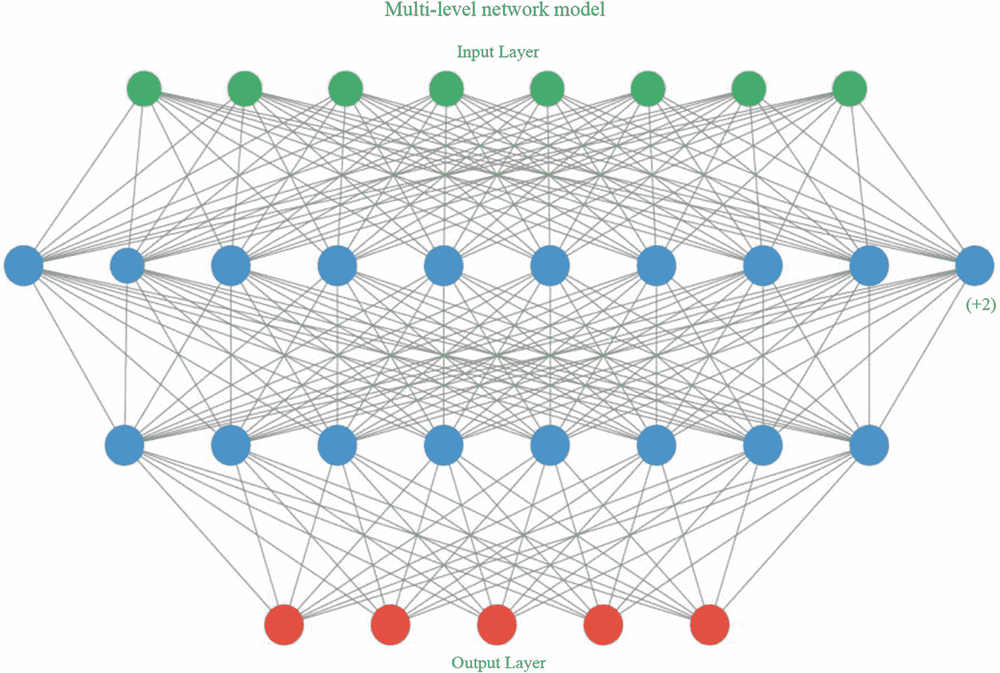
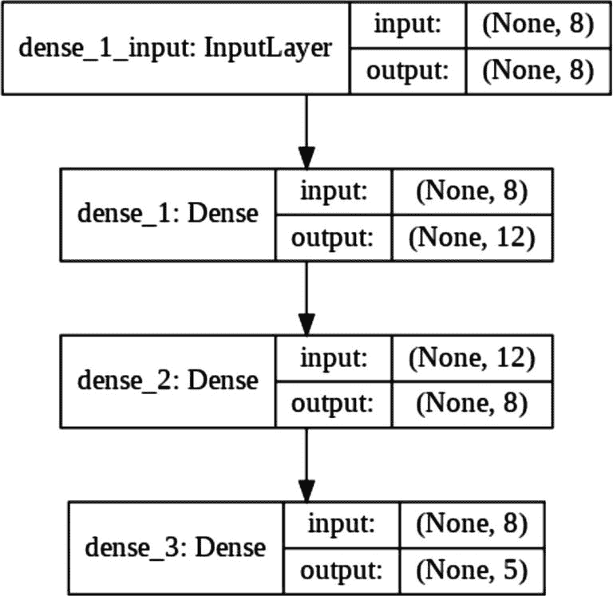
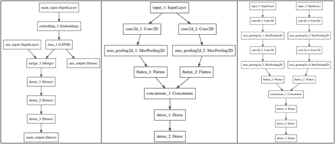
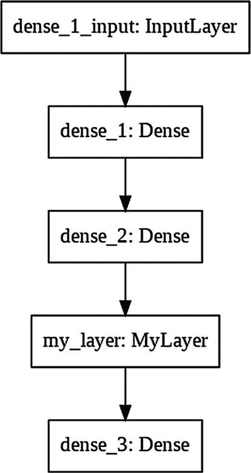

# 3. 深入探索 `tf.keras`

Keras 是一个运行在 TensorFlow 之上的高级神经网络 API。过去许多年，您一直在使用以 TensorFlow 为后端的 Keras API。随着 TensorFlow 2.x 的发布，这一情况发生了变化。TensorFlow 现已将 Keras 集成到 `tf.keras` API 中。`tf.keras` 是 TensorFlow 对 Keras API 规范的实现。这一变化主要是为了在使用 Keras 与 TensorFlow 时保持一致性，同时也使得在使用 Keras 时能够利用 TensorFlow 的多项特性，例如即时执行、分布式训练等。截至撰写本文时，最新的 Keras 版本是 2.3.0。该版本增加了对 TensorFlow 2.x 的支持，并且也是多后端 Keras 的最后一个主要版本。此后，您将在所有深度学习应用中使用 `tf.keras`。在第二章中，您已经开始使用 `tf.keras` 入门 TensorFlow。本章将带您更深入地了解 `tf.keras` 的使用。

## 入门指南

在创建深度学习应用时，最重要的任务是定义神经网络模型。在上一章开发一个简单应用时，您创建了一个包含单层单神经元的网络。回顾一下，这是通过以下程序语句实现的：

```
model = tf.keras.Sequential([tf.keras.layers.Dense(units=1)])
```

虽然我没有明确说明，但上述语句在 TensorFlow 中使用了 Keras 函数式 API。该语句创建了一个单层/单神经元网络模型。在早期的 Keras 实现中，您可以通过以下两条语句完成相同操作：

```
model = keras.Sequential()
model.add(Dense(1, input_dim = 1))
```

该模型的可视化截图如图 3-1 所示。



图 3-1

单层/单神经元模型

现在，使用函数式 API 是定义 Keras 深度学习模型的推荐方式。

## 用于模型构建的函数式 API

使用函数式 API，您将能够创建具有非线性拓扑结构的极其复杂的模型。您可以在模型内共享层，还可以创建具有多个输入和输出的模型。因此，在本书的所有应用中，我将使用函数式 API 来定义 ANN 模型。接下来，我将向您展示如何使用函数式 API 定义几种架构。


### 序列模型

假设你想构建一个如图 3-2 所示的模型。



图 3-2

多层模型

如图 3-2 所示，所需的网络由多个层组成。函数式 API 提供了一套用于构建层图的工具。

假设你已经完成了必要的导入，如下代码所示：

```
import tensorflow as tf
from tensorflow import keras
```

要创建图 3-2 所示的模型，首先需要创建一个输入层，这可以通过以下代码语句完成：

```
inputs = keras.Input(shape=(8,), name="image")
```

上述语句返回一个大小为 8 的 `inputs` 张量。接下来，我们将使用以下语句添加一个包含 12 个节点的 `Dense` 层：

```
x = layers.Dense(12, activation="relu")(inputs)
```

请注意，我们将 `inputs` 张量作为输入传递给了新添加的层。新层本身返回一个大小为 12 的张量，该张量可以作为下一层的输入。现在，我们将使用以下语句再添加一个包含 8 个节点的层：

```
x = layers.Dense(8, activation="relu")(x)
```

再次注意，前一层的张量被输入到新层。同样，你可以向网络中添加任意数量的层，每层都有自己的节点集和激活函数。最后，我们将使用以下语句向网络中添加输出层：

```
outputs = layers.Dense(5)(x)
```

该层的输出是一个大小为 5 的张量。因此，我们期望网络在给定特定输入时输出五个值之一。

现在，可以使用这些输入和输出来定义模型，如下所示：

```
model = keras.Model(inputs=inputs, outputs=outputs,
name='multilayer model')
```

可以使用以下语句生成网络图：

```
keras.utils.plot_model(model, 'multilayer_model.png',
show_shapes=True)
```

生成的网络图如图 3-3 所示。



图 3-3

多层网络的网络图

函数式 API 还允许你创建具有多个输入和输出、共享层等的复杂架构。表 3-1 中展示了一些此类复杂架构。

表 3-1

几种复杂的 ANN 架构

|  |

### 模型子类化

如果你更倾向于面向对象编程，并且有 Java/C++ 等背景，你可能想知道是否存在子类化的概念，以便能够重用之前创建的模型。TensorFlow 支持模型子类化。要创建用于模型定义的自定义类，你需要继承 `tf.keras.Model`：

```
class MyModel(tf.keras.Model):
```

你需要在类定义中提供两个重写的方法——`__init__` 和 `call`。顾名思义，`__init__` 在类实例化时被调用。下面代码片段给出了 `__init__` 的典型定义：

```
def __init__(self, use_dp = False, num_output = 1):
    super(MyModel, self).__init__()
    self.use_dp = use_dp
    self.dense1 = tf.keras.layers.Dense(12, activation=tf.nn.relu)
    self.dense2 = tf.keras.layers.Dense(24, activation=tf.nn.relu)
    self.dense3 = tf.keras.layers.Dense(4, activation=tf.nn.relu)
    self.dense4 = tf.keras.layers.Dense(10, activation=tf.nn.sigmoid)
    if self.use_dp:
        self.dp = tf.keras.layers.Dropout(0.3)
```

在构造函数中，我们为构建网络时将使用的不同类型的层定义了变量。这里所有的层都是 `Dense` 类型——全连接层。第一层包含 12 个节点，第二层包含 24 个节点，第三层包含 4 个节点，最后一层包含 10 个节点。前三层使用 ReLU 作为激活函数，而最后一层使用 sigmoid。我们还定义了一个 dropout 层，以防我们决定在上述任何 `Dense` 层上添加 dropout 层。dropout 比例为 30%，如 dropout 参数值 0.3 所示。

接下来，你定义在对象创建期间使用的 `call` 方法。下面代码段展示了一个典型的 `call` 方法：

```
def call(self, x):
    x = self.dense1(x)
    x = self.dense2(x)
    if self.use_dp:
        x = self.dp(x)
    x = self.dense3(x)
    if self.use_dp:
        x = self.dp(x)
    return self.dense4(x)
```

该网络由四层组成，每一层的输出成为下一层的输入。最后，我们返回 `dense4`，它给出了 10 个类别。第二层和第三层使用了 dropout。至此，我们完成了模型的子类化。接下来，我们将实例化这个模型。

要在程序代码中实例化该模型，你可以使用以下程序语句：

```
model = MyModel()
```

创建模型对象后，你可以调用其常规的 `compile` 方法，通过传递所需的参数集来编译它，如下代码所示：

```
model.compile(loss = tf.losses.binary_crossentropy,
              optimizer = 'adam',
              metrics = ['accuracy'])
```

通常，如果你喜欢面向对象编程，你会使用模型子类化。否则，没有特别的需要进行子类化，函数式 API 可以满足你创建复杂架构的所有需求。

### 预定义层

为了创建网络架构，`tf.keras` 提供了顺序 API，你可以不断向其添加网络层。有多个预定义层可供你直接使用。这个列表非常详尽。每个层都定义为一个类，你在代码中实例化该类并将其实例添加到你的模型中。以下是常用预定义层的部分列表：

*   `Dense` – 全连接层
*   `Conv2D` – 二维卷积层
*   `InputLayer` – 网络的入口点
*   `LSTM` – 长短期记忆层
*   `RNN` – 自定义循环层的基类

这个列表确实非常详尽，你会找到诸如 `Dropout`、`Flatten`、`LayerNormalization`、`Multiply` 等类。除了这些预定义的类之外，你还可以定义自己的自定义层。


### 自定义层

自定义类继承自 `tf.keras.layers.Layer`。你需要重写四个函数：`init`、`build`、`call` 和 `compute_output_shape`。一个典型的自定义类定义如下方代码所示：

```
class MyLayer(tf.keras.layers.Layer):
    def __init__(self, output_dim, **kwargs):
        self.output_dim = output_dim
        super(MyLayer, self).__init__(**kwargs)
    def build(self, input_shape):
        self.W = self.add_weight(name='kernel',
                                 shape=(input_shape[1], self.output_dim),
                                 initializer='uniform',
                                 trainable=True)
        self.built = True
    def call(self, x):
        return tf.matmul(x, self.W)
    def compute_output_shape(self, input_shape):
        return (input_shape[0], self.output_dim)
```

在 `init` 方法中，我们调用了父类的构造函数，并设置了输出的维度。在 `build` 方法中，我们设置了初始权重矩阵。矩阵的形状借助输入参数 `input_shape` 来设定。权重通过 `initializer` 参数设置为均匀分布。并且我们将此矩阵设置为可训练的。在 `call` 方法中，我们设定了要对权重矩阵执行的任何操作。在当前代码中，我们对权重与输入向量 `x` 执行矩阵乘法。最后，`compute_output_shape` 返回输出维度。

现在，你可以在任何网络配置中使用这个自定义层，如下方代码片段所示：

```
model = tf.keras.Sequential([
    tf.keras.layers.Dense(256, input_shape=(784,)),
    tf.keras.layers.Dense(256, activation='relu'),
    MyLayer(10),
    tf.keras.layers.Dense(10, activation='softmax')
])
```

请注意自定义层是如何被添加在两个 `Dense` 层之间的。事实上，你可以将自定义层添加到网络中任何你想要的位置。上述配置的网络结构图如图 3-4 所示。



**图 3-4** 包含自定义层的网络

现在，你可以使用通常的 `compile` 函数来编译模型：

```
model.compile(optimizer='adam',
              loss=tf.keras.losses.binary_crossentropy,
              metrics=['accuracy'])
```

最后，通过调用模型的 `fit` 方法来训练它：

```
model.fit(x, y1, batch_size=32, epochs=30)
```

自定义层的完整项目代码可在本书的下载资源中找到。

创建自定义层让你在设计复杂的网络架构时拥有极大的灵活性。在本书中，你将使用函数式 API 创建各种各样的网络拓扑结构。

### 保存模型

通常，在模型完全训练好后，你会将其保存到磁盘，以便后续部署到生产机器上。不仅如此，你在 `tf.keras` 中创建的模型也可以在训练过程中的任何时刻保存。利用这个保存的模型，你可以从之前中断的地方恢复训练。这有助于避免在单次会话中花费过长的训练时间。此外，你可以与他人共享保存的模型，以便他们能够重现并继续你的工作。`tf.keras` 提供了几种保存工作成果的方法，接下来将进行讨论。

### 保存整个模型

当你保存整个模型时，以下信息将被保存：

*   模型的架构
*   权重
*   你传递给其 `compile` 方法的训练配置
*   优化器及其状态

要保存模型，你将使用以下代码：

```
model.save('filename.h5')
```

要重新创建模型，你将使用以下代码：

```
new_model = keras.models.load_model('filename.h5')
```

#### 导出为 SavedModel 格式

TensorFlow 使用一种名为 SavedModel 的独立序列化格式，该格式可供除 Python 之外的 TensorFlow 实现使用。TensorFlow Serving 也支持此格式。要将整个模型保存为此格式，你将使用以下代码：

```
model.save('filename', save_format='tf')
```

要加载保存的模型，你将使用：

```
new_model = keras.models.load_model('filename')
```

#### 保存架构

在某些情况下，你可能只对保存模型的架构感兴趣，而不关心其权重值或优化器状态。在这种需求下，你可以调用 `get_config` 方法来检索模型的配置，并在之后使用它来在保存的实例上重新创建模型。如下方代码片段所示：

```
##### 检索并保存模型配置
config = model.get_config()
##### 重新创建模型
model = keras.Model.from_config(config)
```

请注意，当你像此语句所示那样重新创建模型时，你将丢失所有先前学习到的信息。

#### 保存权重

在某些情况下，你可能只对保存模型的训练状态感兴趣，而不关心其架构。在这种情况下，你可以使用 `get_weights` 和 `set_weights` 方法来单独保存和检索权重。如下方代码所示：

```
##### 检索模型状态
weights = model.get_weights()
##### 恢复状态
model.set_weights(weights)
```

**注意：** 默认情况下，自定义层不支持 `model.save()` 和 `model.get_config()`。你需要重写 `get_config()` 以支持自定义层。不过，自定义层支持保存权重。

#### 保存为 JSON 格式

有时，你可能希望将模型保存为 JSON 格式。你可以使用以下代码片段来实现：

```
from keras.models import model_from_json
##### 序列化为 JSON
json_model = model_1.to_json()
with open("model_1.json", "w") as json_file:
    json_file.write(json_model)
##### 加载 JSON 并重新创建模型
from keras.models import model_from_json
file = open('model_1.json', 'r')
buffer = file.read()
file.close()
model = tf.keras.models.model_from_json(buffer)
```

考虑以下模型定义：

```
model_1 = tf.keras.Sequential([
    Conv2D(32, (3, 3), activation='relu', padding='same', input_shape=(32, 32, 3)),
    Conv2D(32, (3, 3), activation='relu', padding='same'),
    MaxPooling2D((2, 2)),
    Dense(128, activation='relu'),
    Dense(10, activation='softmax')
])
```

当你将此模型架构保存为 JSON 格式时，你将看到如清单 3-1 所示的代码：

```
{
    "class_name": "Sequential",
    "config": {
        "name": "sequential_3",
        "layers": [
            {
                "class_name": "Conv2D",
                "config": {
                    "name": "conv2d_2",
                    "trainable": true,
                    "batch_input_shape": [null, 32, 32, 3],
                    "dtype": "float32",
                    "filters": 32,
                    "kernel_size": [3, 3],
                    "strides": [1, 1],
                    "padding": "same",
                    "data_format": "channels_last",
                    "dilation_rate": [1, 1],
                    "activation": "relu",
                    "use_bias": true,
                    "kernel_initializer": {
                        "class_name": "GlorotUniform",
                        "config": { "seed": null }
                    },
                    "bias_initializer": {
                        "class_name": "Zeros",
                        "config": {}
                    },
                    "kernel_regularizer": null,
                    "bias_regularizer": null,
                    "activity_regularizer": null,
                    "kernel_constraint": null,
                    "bias_constraint": null
                }
            }
        ]
    },
    ...
    "keras_version": "2.2.4-tf",
    "backend": "tensorflow"
}
```

**清单 3-1** 模型的 JSON 表示形式

保存为 JSON 格式的项目代码可在本书的下载资源中找到。

通过对 `tf.keras` 的简要介绍，现在我将带你进入更实用的 `tf.keras` 学习方法。在下一节中，你将基于卷积神经网络（CNN）开发一个图像分类模型。


