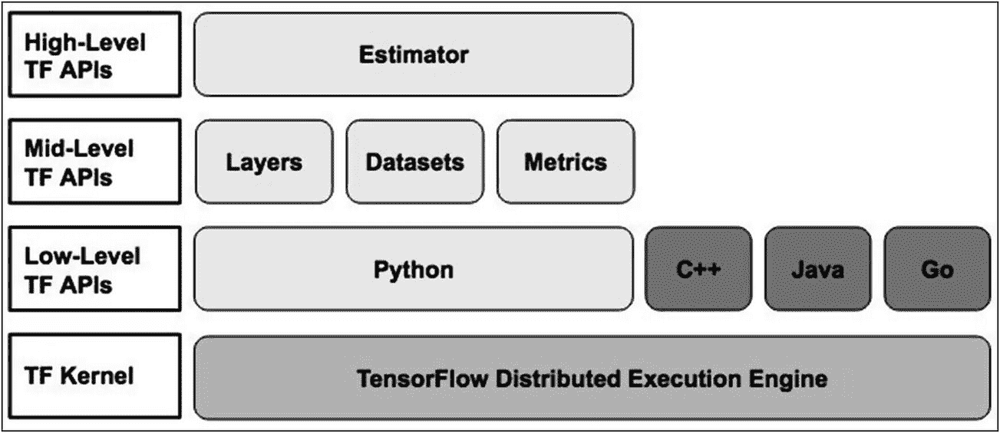
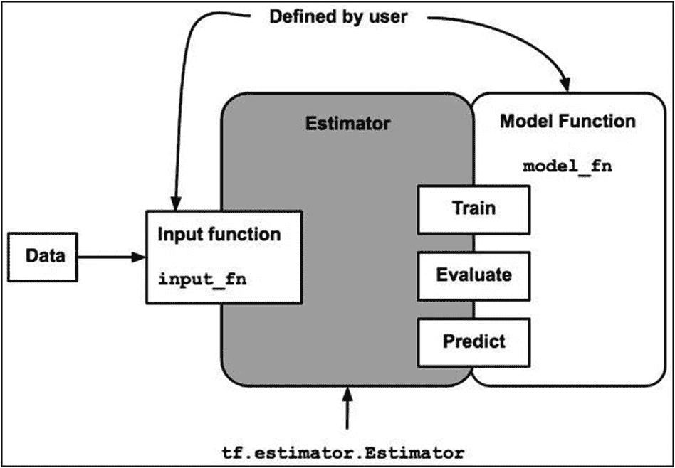
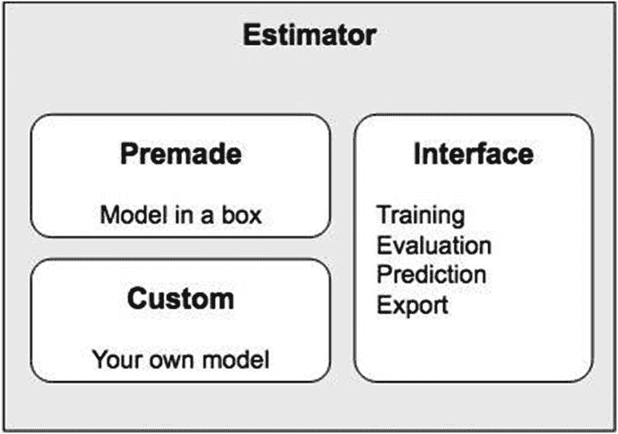
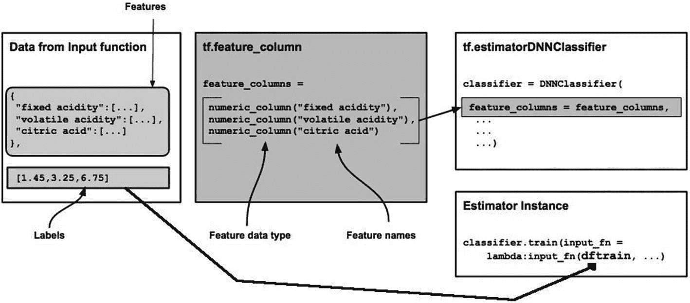
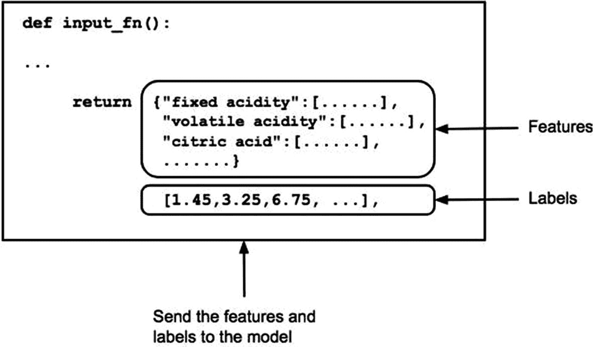

# 6. 估算器

## 简介

任何机器学习项目都包含多个阶段，包括训练、评估、预测，以及最终导出到生产服务器上提供服务。你在前几章中已经学习了这些阶段，当时我们讨论了分类和回归的机器学习项目。为了开发性能最佳的模型，你尝试了不同的 ANN 架构。基本上，你通过实验多种不同的原型来达到期望的结果。在 TF 2.0 之前，整个实验过程并不容易，因为每次修改代码，你都需要构建一个计算图并在会话中运行它。你将在本章学习的估算器正是为了处理所有这些底层工作而设计的。创建图并在会话中运行它们的整个过程非常耗时，并且给代码调试带来了许多挑战。

此外，在模型完全开发完成后，将其部署到生产环境也面临挑战，你可能希望将其部署到分布式环境以获得更好的性能。同时，你可能还希望在 CPU、GPU 或 TPU 上运行模型。这都需要修改代码。为了帮助你解决所有这些问题，并将一切统一在一个框架下，估算器应运而生，尽管这是在 TF 2.0 之前。然而，你将在本章学习并在未来所有项目中使用的估算器，能够利用 TF 2.x 中引入的许多新功能。例如，构建数据管道和模型开发之间有了清晰的分离。在分布式环境上的部署也无需任何代码更改。增强的日志记录和追踪功能使调试更加容易。在本章中，你将学习估算器是如何实现这一切的。

具体来说，你将学习以下内容：

- 什么是估算器？
- 什么是预制的估算器？
- 使用预制估算器解决分类问题
- 使用预制估算器解决回归问题
- 基于 Keras 模型构建自定义估算器
- 基于 `tfhub` 模块构建自定义估算器

## 估算器概述

TensorFlow 估算器是一个高级 API，它将机器学习开发的多个阶段统一在一个框架下。它封装了用于训练、评估、预测以及导出模型以供生产使用的各种 API。它是一个高级 API，为现有的 TensorFlow API 栈提供了进一步的抽象。


### API 栈

在引入估算器之后，TensorFlow 的新 API 栈如图 6-1 所示。



图 6-1

TensorFlow API 栈

到目前为止，你主要使用了中级 API；当你需要对模型开发进行更精细的控制时，低级 API 的使用才成为罕见的需求。现在，学习了估算器 API 之后，你可能甚至不会在模型开发中使用中级 API。但你已经开发好的模型会怎样呢——它们能否从这个 API 中受益？如果可以，如何让它们使用这个 API？幸运的是，TensorFlow 团队开发了一个接口，允许你将现有模型迁移到估算器接口。不仅如此，他们还自行创建了一些估算器，以便你快速上手。这些被称为预置估算器。它们不仅仅是起点。它们已经过充分开发和测试，可供你在当前项目中使用。如果这些估算器不能满足你的需求，或者你想迁移现有模型以利用估算器提供的优势，你可以使用估算器 API 开发自定义估算器。在了解如何使用预置估算器和构建自己的估算器之前，我先更详细地讨论一下它的优势。

### 估算器的优势

为了让你快速了解估算器提供的主要优势，我首先在此列出它们：

*   提供统一的训练/评估/预测接口
*   通过输入函数处理数据输入
*   创建检查点
*   创建摘要日志

这些可能不是唯一的优势，但肯定是最重要的。我现在将逐一详细讨论。为了理解讨论内容，请牢记图 6-2 中描绘的估算器接口。



图 6-2

估算器接口

如图 6-2 所示，估算器类提供了三个用于训练、评估和预测的接口方法。因此，一旦你开发了一个估算器对象，你将能够在同一个对象上调用 `train`、`evaluate` 和 `predict` 方法。请注意，你需要为每个方法发送不同的数据集。这是借助输入函数实现的。我将在本节后面更详细地解释这个输入函数的结构。此时只需说明，输入函数的引入简化了你对不同数据集的实验。

训练期间创建的检查点允许你回滚到已知状态，并从该检查点继续训练。这将为你节省大量训练时间，尤其是当错误发生在某个 epoch 的末尾时。这也使调试更快。训练结束后，评估期间创建的摘要日志可以在 TensorBoard 上可视化，让你快速了解模型训练得有多好。

当模型训练到完全满意后，接下来就是部署任务。将训练好的模型部署到 CPU/GPU/TPU，甚至移动设备和 Web，以及分布式环境，以前需要多次更改代码。如果你使用估算器，你可以直接部署训练好的模型，或者最多在这些平台上进行最少的更改。

说了这么多优势，让我们先看看估算器的类型。

### 估算器类型

估算器分为两类：

*   预置估算器
*   自定义估算器

这种分类可以在图 6-3 所示的图表中直观地看到。



图 6-3

估算器分类

预置估算器就像一个盒子里的模型，其模型功能已由 TensorFlow 团队编写好。另一方面，在自定义估算器中，你需要提供这种模型功能。在这两种情况下，你创建的估算器对象都将具有用于训练、评估和预测的通用接口。两者都可以以类似的方式导出用于服务。

TensorFlow 库提供了一些预置估算器供你立即使用；如果这些不能满足你的目的，和/或你想迁移现有模型以获得估算器的优势，你将创建自己的估算器类。所有估算器都是 `tf.estimator.Estimator` 基类的子类。

`DNNClassifier`、`LinearClassifier` 和 `LinearRegressor` 是预置估算器的几个例子。`DNNClassifier` 用于创建基于密集神经网络的分类模型，而 `LinearRegressor` 用于处理线性回归问题。你将在本章后续部分学习如何使用这两个类。

作为构建自定义估算器的一部分，你将把现有的 Keras 模型转换为估算器。这样做将使你能够利用估算器提供的几个优势，这些优势你之前已经看到过。你将为你上一章开发的葡萄酒质量回归模型构建一个自定义估算器。最后，我还将向你展示如何基于 `tfhub` 模块构建自定义估算器。

要使用估算器，你需要理解两个新概念——输入函数和特征列。输入函数基于 `tf.data.dataset` 创建一个数据管道，该管道以批次方式将数据馈送到模型中进行训练和评估。你也可以为推理创建一个数据管道。我将在 `DNNClassifier` 项目中向你展示如何做到这一点。特征列指定估算器如何解释数据。在我讨论这些输入函数和特征列概念之前，我将概述一个基于估算器的项目的开发流程。

### 基于估算器的项目工作流程

基于估算器的项目开发所需的各种步骤如下：

*   加载数据
*   数据预处理
*   定义特征列
*   定义输入函数
*   模型实例化
*   模型训练
*   模型评估
*   在 TensorBoard 上判断模型性能
*   使用模型进行预测

作为你在之前所有章节中所学内容的一部分，你肯定对上述工作流程中的许多步骤都很熟悉。需要关注的是定义特征列和输入函数。我现在将描述这些要求。


### 特征列

特征列在原始数据和估计器之间搭建了一座桥梁。它能将各种原始数据转换为估计器所需的格式。你可以使用 `tf.feature_column` 模块来构建一个特征列列表。这个列表随后会成为估计器构造函数的输入。估计器对象在解释来自输入函数的数据时会使用这个列表。整个过程如图 6-4 所示。



图 6-4 – 特征列的使用方式

如图 6-4 中间区块所示，特征列列表如下：

*   固定酸度（数值型）
*   挥发性酸度（数值型）
*   柠檬酸（数值型）
*   …

这些是你在上一章开发的葡萄酒质量模型的特征。列表中的每个元素都是 `tf.feature_column.numeric_column` 类型。以下代码片段说明了如何构建这样一个列表：

```
# 构建数值特征数组
numeric_feature = []
for col in numeric_columns:
    numeric_feature.append(tf.feature_column.numeric_column(key=col))
```

有时，你的数据集可能包含你想用作模型构建特征的分类型字段。以下代码片段说明了如何为这些分类型字段构建特征列：

```
categorical_features = []
for col in categorical_columns:
    vocabulary = data[col].unique()
    cate = tf.feature_column.categorical_column_with_vocabulary_list(col, vocabulary)
    categorical_features.append(tf.feature_column.indicator_column(cate))
```

请注意，我们首先通过调用 `categorical_column_with_vocabulary_list` 方法获取词汇表，然后将指示器列追加到列表中。

如图 6-4 所示，此列表作为参数传递给估计器构造函数。如果你的模型同时需要数值型和分类型特征，则需要将两者都追加到目标特征列中。

图 6-4 左侧区块显示了实际由输入函数构建的数据。这些数据将输入到估计器的 `train`/`evaluate`/`predict` 方法调用中。

接下来，我将介绍如何编写输入函数。

### 输入函数

输入函数的目的是返回以下两个对象，供我们的估计器模型对象使用：

*   一个特征名称（键）与包含相应特征数据的张量或稀疏张量（值）组成的字典
*   一个包含一个或多个标签的张量

基本框架如下所示：

```
def input_fn(dataset):
    # 创建包含特征名称的字典
    # 以及包含相应数据的张量
    # 为标签数据创建张量
    return dictionary, label
```

你可以基于此原型编写用于训练/评估/推理的独立函数。

现在，我将向你展示一个取自本章稍后讨论的示例中的输入函数的实际实现。这将进一步澄清你们脑海中关于输入函数的概念。

输入函数是一个具有以下原型的 Python 函数：

```
def input_fn(features, labels, training=True, batch_size=32):
```

这里的 `features` 和 `labels` 参数代表包含特征和标签数据的张量。在函数内部，通过调用 `tf.data.Dataset` 模块的 `from_tensor_slices` 函数将数据转换为张量。

```
#### 将输入转换为数据集
Dataset = tf.data.Dataset.from_tensor_slices((dict(features), labels))
```

该函数的输入参数是一个包含特征和相应标签的 Python 字典。最后，该函数通过使用 `tf.data.Dataset` 的 `batch` 方法，以批次形式将此数据返回给调用者。

```
return dataset.batch(batch_size)
```

函数结构如图 6-5 所示，以便进一步理解。



图 6-5 – 输入函数结构

整个过程可能看起来相当复杂；一个实际的例子将有助于澄清整个实现过程，而这正是我接下来要做的。

