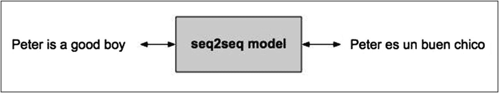
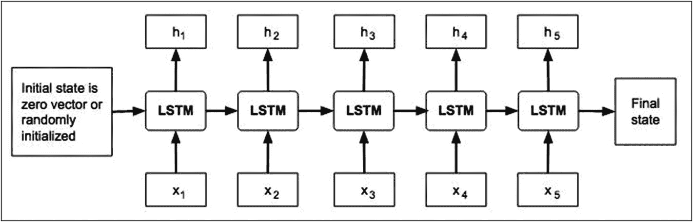
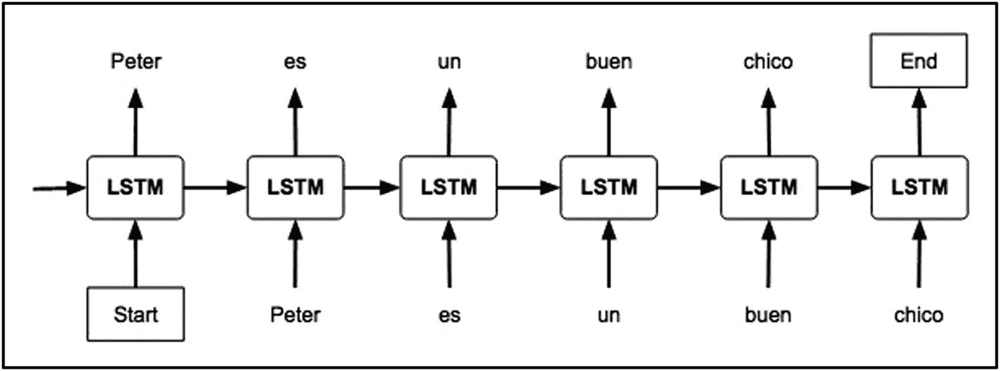
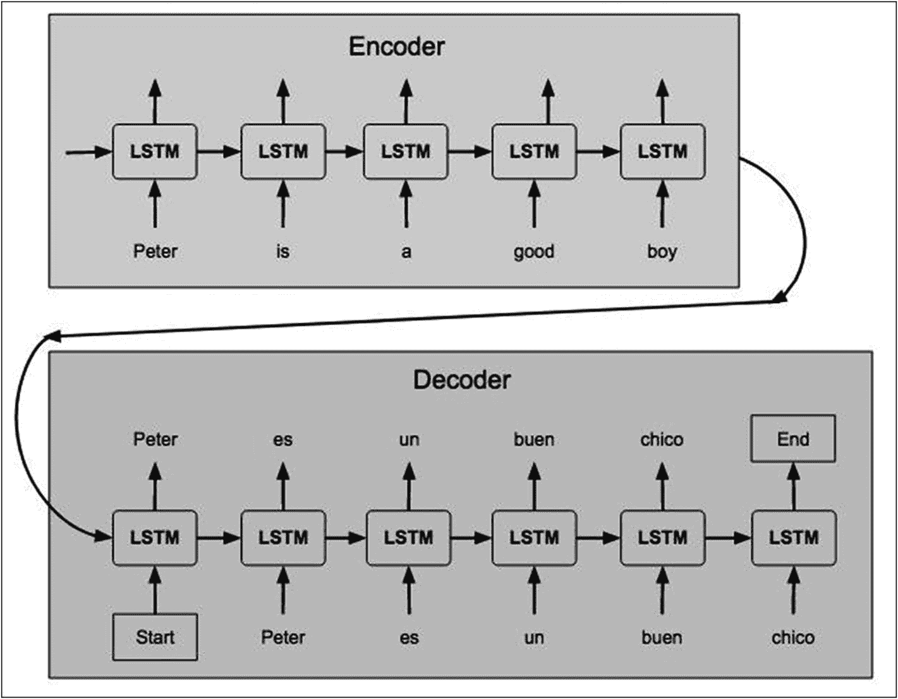

# 序列到序列建模

在上一章中，你学习了 RNN 和 LSTM。我们将使用这些网络模型，结合编码器/解码器与注意力机制，来创建一个神经机器翻译模型。在阅读过程中，我会向你解释什么是编码器、解码器和注意力机制。编码器/解码器模型是一类通用的序列到序列建模方法，广泛应用于情感分析、神经机器翻译、聊天机器人、命名实体识别，甚至文本生成等多个领域。例如，向聊天机器人提问“How are you today?”，它可能会回答“I am fine, thank you! How are you doing today?”。这显然不是逐词翻译及其对应回复。这类翻译需要对庞大的词汇库进行模型训练，并使用神经网络模型，这与你在本书中迄今为止学到的传统机器学习模型有很大不同。

在本章中，我们将只关注神经机器翻译。我们的模型会将英语短语翻译成对应的西班牙语单词，如图 8-1 所示。

图 8-1

使用 seq2seq 建模进行英西翻译

英语短语“How are you?”被翻译成“¿Cómo estás?”。输出序列的长度不必与输入序列相同。为了理解这是如何实现的，我先解释一下编码器和解码器的架构。

## 编码器/解码器

编码器和解码器是序列到序列模型的两个主要组成部分。两者都使用 LSTM。你会记得，LSTM 能够记住长序列，并且不会出现梯度消失问题；因此，它们是语言翻译模型的理想选择。编码器和解码器是同一 LSTM 架构的两组不同实例。首先，我将描述编码器架构。

### 编码器

编码器架构如图 8-2 所示。

图 8-2

编码器架构

我们将整个输入句子按单词级别拆分，并在每个时间步将其输入到编码器中。以我们的示例语句“Peter is a good boy”为例，我们将按五个时间步将输入送入 LSTM，如下所示：

`X1` = “Peter”, `X2` = “is”, `X3` = “a”, `X4` = “good”, `X5` = “boy”

LSTM 计算隐藏状态值`h[i]`。这些隐藏状态与下一个单词一起，在下一个时间步被送入解码器。这就是网络捕获输入序列上下文信息的方式。编码器的初始状态通常是一个零向量。编码器的最终状态，也称为“思维向量”，被用作解码器的输入。

### 解码器

解码器架构如图 8-3 所示，其中包含了我们示例输入句子的时间戳。

图 8-3

解码器架构

解码器通过将解码器 LSTM 单元的隐藏状态从前一个单元馈送到下一个单元，来训练根据前一个单词预测下一个单词。在将目标序列送入解码器之前，会在序列的开头和结尾添加特殊标记`<START>`和`<END>`。

在解码测试序列时，目标序列是未知的。因此，我们通过将第一个单词（始终是`<start>`标记）传入解码器来开始预测目标序列。`<end>`标记表示句子的结束。

我现在将讨论推理过程中的解码步骤。

### 推理

推理过程中的时间步骤如下所示：

*   解码器的初始输入是`<start>`标记。
*   在推理过程中，解码器 LSTM 会在一个循环中被多次调用，以在每个时间步/迭代中生成一个输出单词。
*   解码器的初始状态等于编码器的最终状态。
*   在每个时间步，解码器状态被保留，并用作下一个时间步/迭代的初始状态。
*   每个时间步的预测输出被作为输入馈送到下一个时间步/迭代。
*   循环在遇到`<end>`标记时终止。

我们示例文本的整个推理过程如图 8-4 所示。

图 8-4

编码器/解码器中的推理过程

这就是序列到序列（seq2seq）模型的工作原理。我现在将讨论 seq2seq 模型的缺点。

## seq2seq 模型的缺点

seq2seq 模型由编码器-解码器架构组成，其中编码器处理输入序列并将信息编码成一个上下文向量。这个上下文向量有时被称为“思维向量”，并且是固定长度的。这个思维向量被期望能够很好地概括整个输入序列。解码器随后用这个思维向量进行初始化，并被要求执行转换。这些固定长度的思维向量有一个明显的缺点：无法记住长序列。通常，对于长序列，当它们处理完整个序列时，已经忘记了序列的前面部分。为了解决这个问题，提出了注意力机制。

