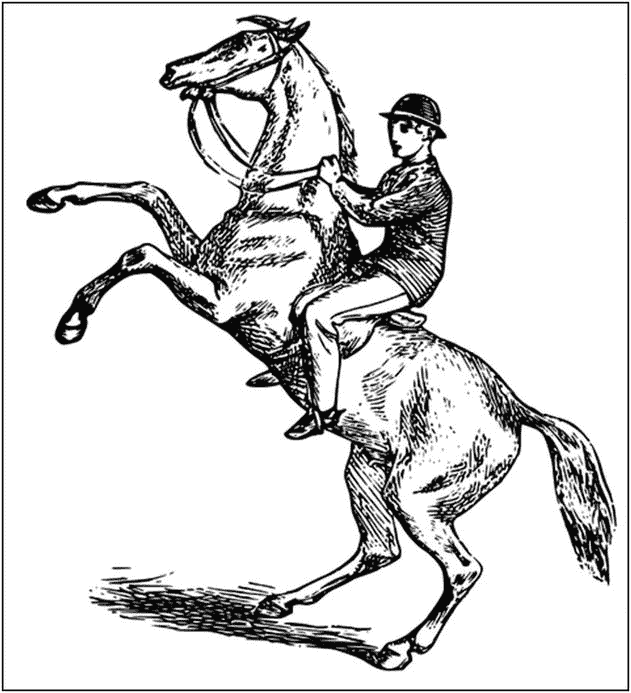
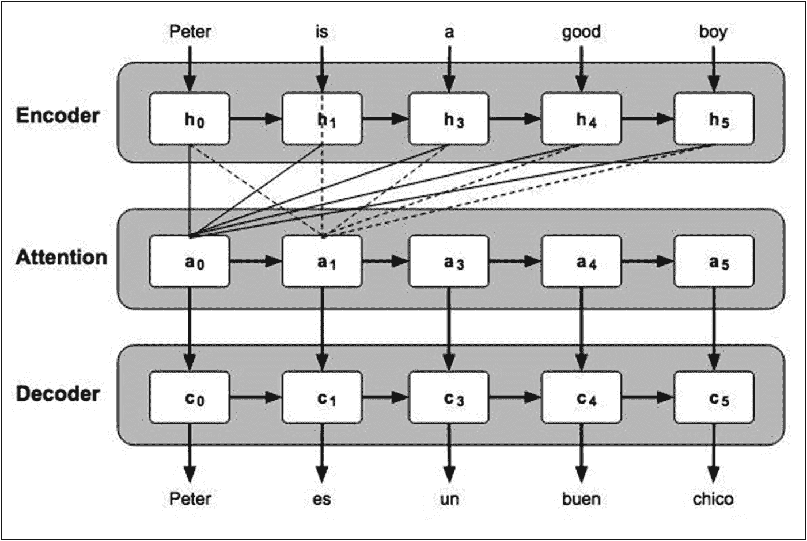
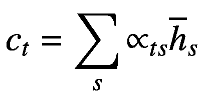

# 注意力模型

人类在观看或聆听时，会有意识地将注意力集中在图像或文本的某一部分。以图 8-5 所示的照片为例。

图 8-5

一幅将注意力引向马匹和女士的图像。图片来源：[`http://www.clker.com/clipart-man-riding-a-rearing-horse.html`](http://www.clker.com/clipart-man-riding-a-rearing-horse.html)

当你看到这张照片的瞬间，你的注意力会集中在一匹马和一位女士身上。因此，如果你需要为这张照片生成描述，你可能会说“一位女士在骑马”。同样，如果有人问“你最喜欢哪项运动？”，你的注意力会立刻集中在“运动”和“你”这两个词上。我们的编码器/解码器模型缺少这种关注输入序列中特定关键词的特性。因此，注意力机制的直觉在于：在时间戳 `t` 生成一个词时，我们需要对每个词投入多少注意力？所以，注意力机制的基本思想是在生成目标词时，增加输入序列中特定词的重要性。

注意力模型的创建是为了帮助记忆输入源中的长句。注意力模型并非仅从编码器的最后一个隐藏状态构建单个上下文向量，而是为整个输入序列创建一个上下文向量。如图 8-6 所示。

图 8-6

带有注意力模块的编码器/解码器架构

此处，输入序列是“Peter is a good boy.”。该序列被拆分为单个单词。解码器按时间步从编码器输出中获取输入。如果使用这种简单的序列到序列建模，翻译质量将不佳。因此，我们在中间引入一个注意力层。现在，解码器在每个时间步的输入将是其先前状态加上输入序列的注意力上下文。例如，在生成单词“buen”时，解码器将更多地关注像 Peter、good 和 boy 这样的词。注意力网络为输入词分配不同的权重，以生成一个注意力上下文，解码器在预测下一个词时会使用该上下文。

在任意给定时间步 `t[s]`，网络的注意力权重（`α`）可以用数学公式表示如下：

然后，上下文向量可以表示为：

其中 `c[t]` 表示时间步 `t` 的上下文，alpha 和 `h` 分别表示权重和隐藏状态。最终的注意力向量，它是所有 `c[t]` 和 `h[t]` 的函数，计算如下：

![$$ {a}_t=f\left({c}_t,{h}_t\right)=\mathit{\tanh}\left({W}_c\left[{h}_t,{h}_t\right]\right) $$](images/495303_1_En_8_Chapter/495303_1_En_8_Chapter_TeX_Equc.png)

`a[t]` 与解码器自身的先前状态一起作为输入传入解码器。当你查看下一节项目中提供的实现时，你将能更好地理解这个注意力网络。

通过以上对神经机器翻译的介绍，让我们进入实际实现环节。

