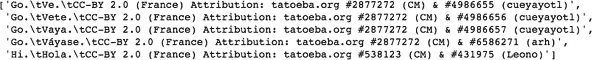
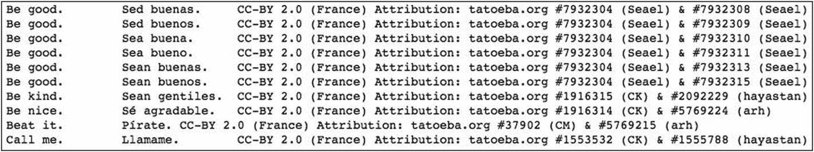
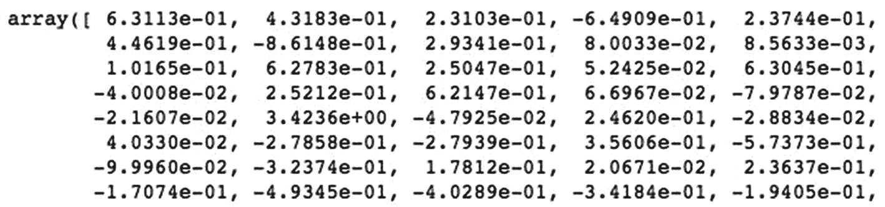
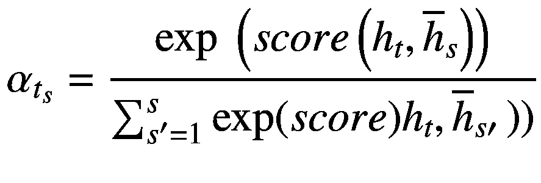
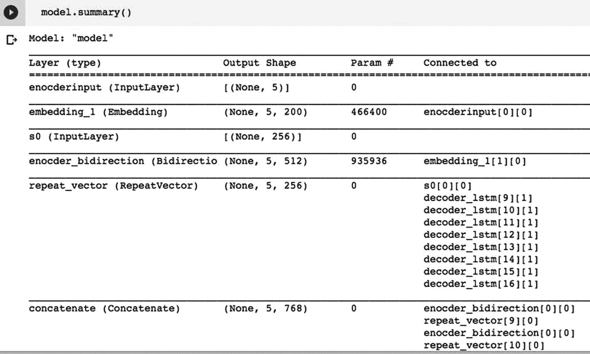
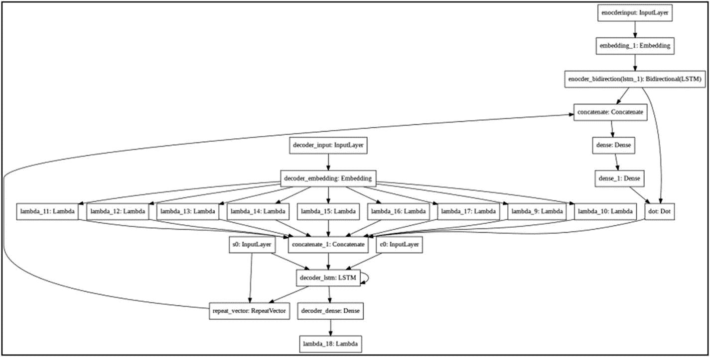
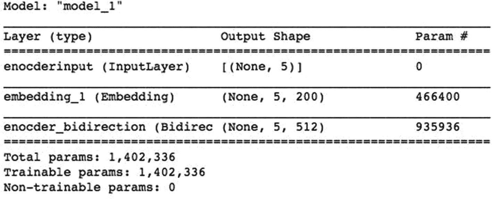
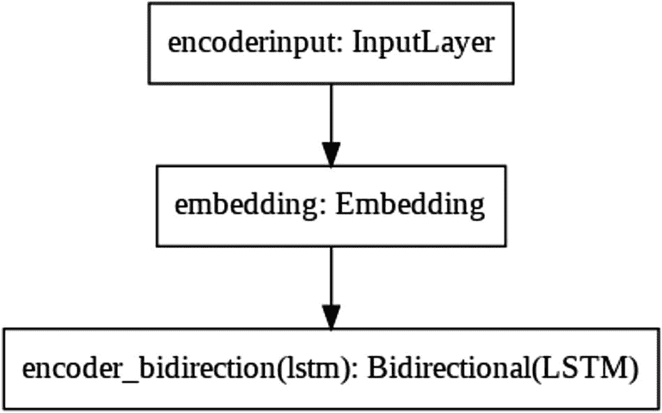
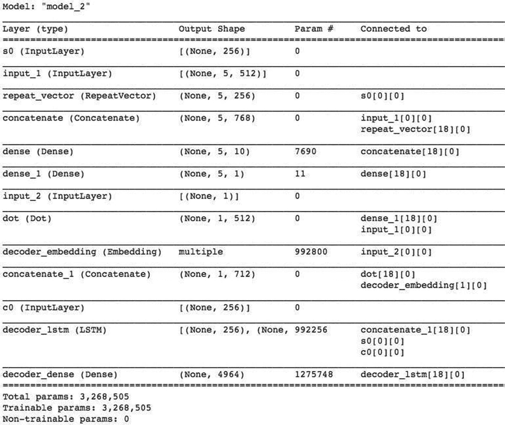
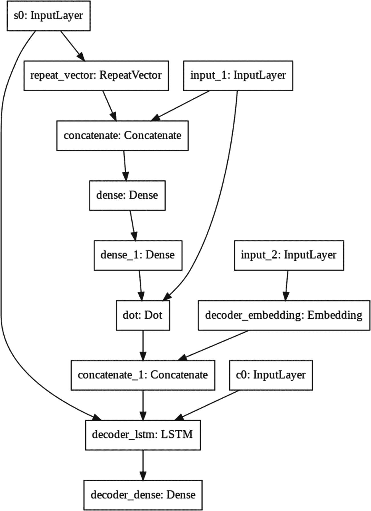

# 英语到西班牙语翻译器

我们将使用本章迄今学到的 NMT 技术创建一个英语到西班牙语的翻译器。你将使用带有注意力模块的编码器/解码器模型。为了训练此类模型，你需要一组两种语言之间的句子映射。幸运的是，有人已经创建了这样的映射。你可以在以下网站找到这些映射：[`www.manythings.org/anki/`](http://www.manythings.org/anki/)。这些是制表符分隔的双语句子对。数据集数量非常详尽，你可以找到世界上许多流行语言之间的映射。文件中的每一行格式如下：

- 英语 + 制表符 + 其他语言 + 制表符 + 归属

在本项目中，你还需要使用由 Jeffrey Pennington 等人创建的全局词向量（GloVe）。这是一个庞大的数据集。我建议你在开始本项目之前，先将该数据集下载（[`http://nlp.stanford.edu/data/glove.6B.zip`](http://nlp.stanford.edu/data/glove.6B.zip)）到本地驱动器。解压下载的 `glove*.zip` 文件。它包含四种不同维度的词向量——50、100、200 和 300。GloVe 文件将在后面详细解释。这些是名为 `glove.6B.50d.txt`、`glove.6B.100d.txt`、`glove.6B.200d.txt` 和 `glove.6B.300d.txt` 的文本文件。我在代码中使用了 200 维的文件。将所有文件复制到你的 Google Drive 中，以便你的 Colab 项目可以访问。

完成下载后，你现在就可以创建项目了。

### 创建项目

打开一个新的 Colab 文档，并将其重命名为 `NMT`。导入以下库：

```python
import tensorflow as tf
from tensorflow.keras.models import Model
from tensorflow.keras.layers import Input,
Dense, LSTM, Embedding, Bidirectional,
RepeatVector, Concatenate, Activation,
Dot, Lambda
from tensorflow.keras.preprocessing.text
import Tokenizer
from tensorflow.keras.preprocessing.sequence
import pad_sequences
from keras import preprocessing, utils
import numpy as np
import matplotlib.pyplot as plt
```

## 下载翻译数据集

从本书的代码仓库下载西班牙语到英语的翻译数据集：

```python
!pip install wget
import wget
url = 'https://raw.githubusercontent.com/Apress/artificial-neural-networks-with-tensorflow-2/main/ch08/spa.txt'wget.download(url,'spa.txt')
```


## 创建数据集

使用以下语句读取翻译数据文件的内容：

```
### 读取数据
with open('/content/spa.txt',encoding='utf-8',errors='ignore') as file:
text=file.read().split('\n')
```

你可以使用以下命令打印前五行：

```
text[:5]
```

输出结果如图 8-7 所示。



图 8-7

翻译文件内容

此处，输入和目标数据由制表符分隔。

你可以使用以下循环检查 100 到 110 范围内的更多记录：

```
for t in text[100:110]:
print(t)
```

输出结果如图 8-8 所示。



图 8-8

表格格式的翻译文件内容

请注意，翻译内容由制表符分隔。第一组单词/句子是我们的输入数据集，制表符后的第二组是我们的目标数据集。其余文本是属性信息，我们在此不使用。例如，如图 8-8 所示，英文文本“Be nice.”的翻译是“Sé agradable.”。请注意，相同的输入句子可能有多个翻译，它们都表达相同的意思。

现在，我们将声明两个变量来存储输入和目标数据。

```
input_texts=[] #编码器输入
target_texts=[] # 解码器输入
```

我们将选择前 10,000 个单词/句子进行训练。文档中共有 122,937 个句子，最后一个为空。文档中包含 2,751,187 个单词和 18,127,427 个字符。如果使用完整数据集，训练模型将花费很长时间。使用较小的数据集也会限制翻译的词汇量。我们将按制表符分割每一行，以将输入与目标分开。我们使用以下代码用数据库中的前 10,000 条记录填充声明的两个数组：

```
NUM_SAMPLES = 10000
for line in text[:NUM_SAMPLES]:
english, spanish  = line.split('\t')[:2]
target_text = spanish.lower()
input_texts.append(english.lower())
target_texts.append(target_text)
```

打印两个数组中的前五个条目以检查其内容：

```
print(input_texts[:5],target_texts[:5])
```

输出结果如下：

```
['go.', 'go.', 'go.', 'go.', 'hi.'] ['ve.', 'vete.', 'vaya.', 'váyase.', 'hola.']
```

如你所见，文本中存在点字符。我们需要将其去除。

### 数据预处理

现在我们将进行一些文本处理，使文本准备好用于机器学习。

#### 清理标点符号

我们将首先从目标数据集和输入数据集中移除所有标点符号。通过调用 `string` 类的 `punctuation` 方法可以轻松列出标点符号。

```
import string
print('预处理中要移除的字符', string.punctuation)
```

这将产生以下输出：

```
预处理中要移除的字符 !"#$%&'()*+,-./:;?@[\]^_`{|}~
```

为了移除标点符号，我们定义一个小函数：

```
def remove_punctuation(s):
out=s.translate(str.maketrans("","",string.punctuation))
return out
```

我们通过调用此函数来移除输入和目标输出中的标点：

```
input_texts = [remove_punctuation(s)
for s in input_texts]
target_texts = [remove_punctuation(s)
for s in target_texts]
```

我们可以检查两个数组中的前五个项目，以确认数据已清理干净：

```
input_texts[:5],target_texts[:5]
```

输出结果如下：

```
(['go', 'go', 'go', 'go', 'hi'], ['ve', 'vete', 'vaya', 'váyase', 'hola'])
```

#### 添加开始/结束标签

对于目标文本，我们需要添加开始和结束标签。我们在讨论编码器/解码器架构时已经了解了 `<start>` 和 `<end>` 标签的用途。我们使用以下语句添加标签：

```
##### 添加开始和结束标签
target_texts=[' ' + s + ' '
for s in target_texts]
```

你可以像这样检查其中一个目标项目：

```
target_texts[1]
```

你将看到以下输出：

```
' vete '
```

#### 对输入数据集进行分词

我们的数据是文本格式，我们知道神经网络不理解文本数据，因此我们将用整数值对每个单词进行分词。

我们将首先对输入文本进行分词以创建词汇表。`word_index` 字典提供了诸如 (`'hello'`:133) 的映射。

```
tokenizer_in=Tokenizer()
#对输入文本进行分词
tokenizer_in.fit_on_texts(input_texts)
#输入的词汇表大小
input_vocab_size=len(tokenizer_in.word_index) + 1
```

你可以检查词汇表的大小：

```
input_vocab_size
```

大小为 2332。这意味着字典中有 2332 个标记，我们将能够使用它们进行翻译。如果你使用了包含 122,937 个单词/句子的完整数据集，你将得到包含 13,731 个单词/句子的词汇表。你可以使用以下代码检查分词字典中的几个项目：

```
### 列出几个项目
input_tokens = tokenizer_in.index_word
for k,v in sorted(input_tokens.items())[2000:2010]:
print (k,v)
```

你将看到以下输出：

```
2001 visa
2002 trains
2003 poems
2004 forgetful
2005 insane
2006 flew
2007 harvard
2008 obvious
2009 lecture
2010 divorce
```

如你所见，每个单词/句子都通过标记获得了其唯一的标识。

#### 对输出数据集进行分词

与输入数据集类似，你将使用以下代码对输出数据集进行分词：

```
#对输出（即西班牙语翻译）进行分词
tokenizer_out=Tokenizer(filters='')
tokenizer_out.fit_on_texts(target_texts)
#输出的词汇表大小
output_vocab_size=len(tokenizer_out.word_index) + 1
output_vocab_size
```

由于我们在特殊标记（如 `<start>` 和 `<end>`）中使用了尖括号，我们不希望分词器过滤这些（`<` `>`）符号。因此，对于输出数据集，我们将过滤器设置为单引号（`''`）以过滤输出标记。

这将打印输出 4964，表明你的词汇表中有 4964 个西班牙语单词/句子。你可以检查字典中的几个项目。

```
### 列出几个项目
output_tokens = tokenizer_out.index_word
for k,v in sorted(output_tokens.items())[2000:2010]:
print (k,v)
```

你将看到以下输出：

```
2001 suyos
2002 ley
2003 palabras
2004 ausente
2005 delgaducho
2006 sucio
2007 adoptado
2008 violento
2009 roncando
2010 podríamos
```

如你所见，你将获得一个为翻译而分词后的西班牙语单词列表。

利用这两个数据集，你将训练你的编码器/解码器模型。用户将能够使用你的模型对数据集中出现的这些标准短语进行翻译。如果用户输入的短语不在标准数据集中，该短语将被拆分为单词，每个单词将使用这些集合进行翻译。每次翻译后，模型将借助注意力模块尝试猜测下一个单词。请注意此处注意力模块的重要性。解码器接收两个输入——编码器的先前状态和来自注意力模块的上下文向量。然后，解码器基于这两个输入预测概率最大的单词。


## 创建输入序列

现在，你将通过调用 `texts_to_sequences` 方法将输入文本转换为序列。这显然是将数据输入模型所必需的。

```
#将分词后的句子转换为序列
tokenized_input = tokenizer_in.texts_to_sequences
( input_texts )
```

我们词典中的单词长度不固定。然而，为了训练，我们需要固定长度的序列。接下来，你将确定分词后输入中单词的最大长度，并用零将所有序列填充至此长度。

```
#输入的最大长度
maxlen_input = max( [ len(x)
for x in tokenized_input ] )
#将序列填充到固定的最大长度
padded_input = preprocessing.sequence.pad_sequences
( tokenized_input , maxlen=maxlen_input ,
padding='post' )
```

你可以检查几个序列来观察这种填充的效果。

```
padded_input[2000:2010]
```

输出如下所示：

```
array([[  1, 613, 195,   0,   0],
[  1,  54, 109,   0,   0],
[  1,  54, 109,   0,   0],
[  1,  54, 109,   0,   0],
[  1,  54, 182,   0,   0],
[  1,  54,  14,   0,   0],
[  1,  54,  98,   0,   0],
[  1,  54,  98,   0,   0],
[  1,  54,  10,   0,   0],
[  1,  54,  10,   0,   0]], dtype=int32)
```

请注意每个序列末尾出现的零。换句话说，像“I voted yes”这样的输入句子将被转换为类似 `[1,613,195,0,0]` 的填充序列。注意序列中最后两个零；这就是填充。

因此，我们所有的输入序列现在都具有恒定的长度 5。如果你使用整个词汇表，单词的最大长度会有所不同，因此每个输入序列的大小将是这个最大值。

我们将输入数据转换为 numpy 数组：

```
encoder_input_data = np.array( padded_input )
print( encoder_input_data.shape)
```

程序打印出以下值：

```
(10000, 5)
```

因此，共有 10,000 个固定宽度为 5 的输入序列。

### 创建输出序列

与输入文本类似，你将把分词后的输出转换为序列：

```
#将分词后的文本转换为序列
tokenized_output = tokenizer_out.texts_to_sequences
(target_texts)
```

你可以使用以下代码检查输出词汇表的大小：

```
output_vocab_size=len(tokenizer_out.word_index) + 1
output_vocab_size
```

大小为 4964，因此我们的词汇表中有 4964 个西班牙语单词。

我们在输出上使用教师强制（teacher forcing），以便训练收敛得更快。在教师强制中，我们向解码器提示下一个单词，减少其猜测工作，使其学习更快。请注意，教师强制仅在训练模型时使用，在测试或推理模式下不使用。

```
### 教师强制
for i in range(len(tokenized_output)) :
tokenized_output[i] = tokenized_output[i][1:]
```

我们确定输出的最大长度，并用零填充所有输出标记。

```
maxlen_output = max( [ len(x)
for x in tokenized_output ] )
padded_output = preprocessing.sequence.pad_sequences
( tokenized_output ,
maxlen=maxlen_output ,
padding='post' )
```

我们将输出数据转换为 numpy 数组，使其与机器学习兼容。

```
#### 转换为 numpy
decoder_input_data = np.array( padded_output )
```

让我们打印几个元素。

```
decoder_input_data[2000:2010]
```

打印解码器数据的几个元素会产生以下输出：

```
array([[  11, 1147,   26,  108,    2,    0,    0,    0,    0],
[  51,   17,  135,    2,    0,    0,    0,    0,    0],
[  11,   51,   17,  135,    2,    0,    0,    0,    0],
[  11,   51,   13,  224,    2,    0,    0,    0,    0],
[  51,   59,    2,    0,    0,    0,    0,    0,    0],
[  51,   20,    2,    0,    0,    0,    0,    0,    0],
[  28,   51,    2,    0,    0,    0,    0,    0,    0],
[  37,   51,    2,    0,    0,    0,    0,    0,    0],
[  51,   88,    2,    0,    0,    0,    0,    0,    0],
[  51,   19,    2,    0,    0,    0,    0,    0,    0]],
dtype=int32)
```

注意每个输出元素是如何用零填充以使所有元素长度相等的。这里，对于我们选择的数据集，序列长度为 9。同样，如果你使用完整数据集，这个固定长度会有不同的值。

我们使用独热编码（one-hot encoding）来创建解码器的目标输出。

```
#解码器目标输出
decoder_target_one_hot=np.zeros((len(input_texts),
maxlen_output,
output_vocab_size),
dtype='float32')
for i,d in enumerate(padded_output):
for t,word in enumerate(d):
decoder_target_one_hot[i,t,word]=1
```

你可以通过打印其中一个元素来检查目标输出：

```
decoder_target_one_hot[0]
```

你将看到以下输出：

```
array([[0., 0., 0., ..., 0., 0., 0.],
[0., 0., 1., ..., 0., 0., 0.],
[1., 0., 0., ..., 0., 0., 0.],
...,
[1., 0., 0., ..., 0., 0., 0.],
[1., 0., 0., ..., 0., 0., 0.],
[1., 0., 0., ..., 0., 0., 0.]], dtype=float32)
```

注意整个输出是如何用独热编码进行编码的。

### GloVe 词嵌入

在开始项目之前，你下载了词向量数据集。这个数据集提供了词与词之间共现概率的比率。换句话说，对于任何给定的单词，它会告诉你在这个世界中所有其他单词出现在该给定单词旁边的概率。例如，单词“cream”出现在单词“ice”旁边的概率可能是最高的。这个数据集实际上是在一个巨大的词汇表上创建的。这些概率的知识有助于对输入语句进行某种形式的意义编码。我们将基于这个数据集为我们的输入英语词汇构建一个词典。我们将把输入序列输入到一个嵌入层，该层将输入单词转换为词向量。这些词向量将作为输入传递给编码器。我们将在程序中加载这个词向量词典。


### 索引词向量

`glove` 词嵌入提供了四种维度的映射：50、100、200 和 300。在我们的程序中，将使用 200 维的文件。使用的维度越高，翻译效果越好，但代价是处理时间和资源消耗的增加。

以下是 50 维文件中的一行示例：

```
more 0.87943 -0.11176 0.4338 -0.42919 0.41989 0.2183 -0.3674 -0.60889 -0.41072 0.4899 -0.4006 -0.50159 0.24187 -0.1564 0.67703 -0.021355 0.33676 0.35209 -0.24232 -1.0745 -0.13775 0.29949 0.44603 -0.14464 0.16625 -1.3699 -0.38233 -0.011387 0.38127 0.038097 4.3657 0.44172 0.34043 -0.35538 0.30073 -0.09223 -0.33221 0.37709 -0.29665 -0.30311 -0.49652 0.34285 0.77089 0.60848 0.15698 0.029356 -0.42687 0.37183 -0.71368 0.30175
' -0.039369 1.2036 0.35401 -0.55999 -0.52078 -0.66988 -0.75417 -0.6534 -0.23246 0.58686 -0.40797 1.2057 -1.11 0.51235 0.1246 0.05306 0.61041 -1.1295 -0.11834 0.26311 -0.72112 -0.079739 0.75497 -0.023356 -0.56079 -2.1037 -1.8793 -0.179 -0.14498 -0.63742 3.181 0.93412 -0.6183 0.58116 0.58956 -0.19806 0.42181 -0.85674 0.33207 0.020538 -0.60141 0.50403 -0.083316 0.20239 0.443 -0.060769 -0.42807 -0.084135 0.49164 0.085654
```

词索引是 `more`。该行中的其余条目是其他词的共现概率。我们将嵌入矩阵文件中的每一行分割成词标记。我们将第一个标记用作字典中的键。其余标记是该目标词与其他词的共现概率，并作为值插入字典中。

创建此字典的代码如下所示：

```
#creating dictionary of words corresponding to vectors
print('Indexing word vectors.')
embeddings_index = {}
#### Use this open command in case of downloading using wget above
#f = open('glove.6B.200d.txt', encoding='utf-8')
#### we can choose any dimensions 50 100 200 300
f = open('drive/My Drive/tfbookdata/glove.6B.200d.txt',
encoding='utf-8')
for line in f:
values = line.split()
word = values[0]
coefs = np.asarray(values[1:], dtype="float32")
embeddings_index[word] = coefs
f.close()
print('Found %s word vectors.' %
len(embeddings_index))
```

运行代码时，它会打印出 `400000`，表明完整数据集中有这么多嵌入可用。当然，我们需要为从 2332 个词的数据集中选出的词获取嵌入。你可以尝试打印其中一个关键词的矩阵：

```
embeddings_index["any"]
```

矩阵的部分输出如图 8-9 所示。



**图 8-9** 关键词“any”的嵌入矩阵

你会注意到，对于像“any”这样的每个词，都有 200 个可用的映射，这正是我们选择的维度大小。

### 创建子集

现在，我们将使用一个简单的 `for` 循环提取英语输入词汇表的条目，如下所示：

```
#embedding matrix
num_words = len(tokenizer_in.word_index)+1
word2idx_input = tokenizer_in.word_index
embedding_matrix = np.zeros((num_words, 200))
for word,i in word2idx_input.items():
if i<num_words:
embedding_vector = embeddings_index.get(word)
if embedding_vector is not None:
embedding_matrix[i] = embedding_vector
embedding_matrix.shape
```

矩阵创建后，其形状将打印在终端上，如下所示：

```
(2332, 200)
```

请注意，我们之前看到输入库中有 2332 个标记化的词（英语）。每个词都有 200 个共现概率。为什么是 200？这是因为我们选择了一个 200 维的映射文件。

### 定义嵌入层

我们声明两个变量，在创建 LSTM 和嵌入层时将使用它们。

```
#lstm hidden dimensions
LATENT_DIM=256
#embeding layer dimensions
EMBEDDING_DIM=200
```

我们按如下方式声明嵌入层：

```
embedding_layer=Embedding(input_vocab_size,
EMBEDDING_DIM,
weights=[embedding_matrix],
input_length=maxlen_input)
```

请注意，我们的输入词汇表大小是 2332，维度是 200——即我们选择的矩阵大小。`weights` 参数被设置为我们之前创建的嵌入矩阵，该矩阵提供了词到向量的映射。`input_length` 被设置为我们填充序列的最大长度，在本例中为 5。

现在，我们将开始定义模型。为此，我们将创建一些实用方法和层。

### 定义编码器

我们现在定义编码器。对于编码器，首先定义输入层。

```
#encoder
encoder_input = Input(shape=(maxlen_input,),
name = 'encoderinput')
```

该层的输入大小为 5，由 `maxlen_input` 参数值决定。我们使用以下语句创建一个带有此输入的 `embedding_layer`：

```
encoder_input = embedding_layer(encoder_input)
```

接下来，我们按如下方式定义 LSTM 层：

```
encoder = Bidirectional(LSTM(LATENT_DIM,
return_sequences=True,
dropout = 0.3),
name = 'encoder_bidirection')
```

我们使用双向 LSTM。隐藏层数量设置为 `LATENT_DIM`，即 200。序列在每个时间步都返回到下一个隐藏层。每层有 30% 的 dropout。

最后，我们将编码器输入层传递给此编码器。

```
encoder_outputs = encoder(encoder_input)
```

这将生成编码器输出。你可以通过在其上调用 `shape` 方法来检查其形状。

```
encoder_outputs.shape
```

它给出以下输出：

```
TensorShape([None, 5, 512])
```

由于 LSTM 是双向的，我们得到 512 维，这是我们的潜在维度（`LATENT_DIM`）256 乘以 2 的结果。潜在维度是 LSTM 层中的单元数。

至此，我们将继续定义解码器。

### 定义解码器

我们首先为解码器模型定义输入层：

```
decoder_inputs = Input(shape=(maxlen_output,),
name='decoder_input')
```

其中，对于我们的数据集，`maxlen_output` 是 9。嵌入层使用以下语句定义：

```
decoder_embedding = Embedding(output_vocab_size,
EMBEDDING_DIM,
name='decoder_embedding')
```

对于我们的数据集，`output_vocab_size` 是 4964，而由 `EMBEDDING_DIM` 值指定的输出维度是 200。最后，我们创建解码器输入：

```
decoder_input = decoder_embedding(decoder_inputs)
```

通过调用 `shape` 方法打印此张量的形状：

```
decoder_input.shape
```

输出为

```
TensorShape([None, 9, 200])
```

请注意，输出词汇表的序列长度为 9。

#### 定义解码器层

我们现在定义解码器层。我们需要一个 LSTM 层和一个 softmax 激活的全连接层。

LSTM 层定义如下：

```
decoder_lstm = LSTM(LATENT_DIM,
return_state = True,
name = 'decoder_lstm')
```

`LATENT_DIM` 参数的值为 256，即隐藏层数量。在每个时间步，状态都会返回到下一层。

softmax 全连接层定义如下：

```
decoder_dense = Dense(output_vocab_size,
activation='softmax',
name='decoder_dense')
```

该层的维度设置为 `output_vocab_size`，在本例中为 4964。该层将预测词汇表中每个词出现的概率。如果我们采用完整数据集，该层的维度会非常高，从而导致解码时间增加。

我们现在定义注意力层。

### 注意力网络

我们现在将开始为我们的注意力网络定义模型。


#### 定义 Softmax

我们的注意力上下文在每个时间步计算，并为网络分配不同的注意力权重集。任意给定时间步 `t[s]` 的注意力权重（`α`）可以用数学公式表示如下：



我们在以下名为 `softmax_attention` 的方法中实现 alpha 的计算：

```
##### Computing alphas
import tensorflow.keras.backend as k
def softmax_attention(x):
assert(k.ndim(x)>2)
e=k.exp(x-k.max(x,axis=1,keepdims=True))
s=k.sum(e,axis=1,keepdims=True)
return e/s
```

数据预期形状为 `NxTxD`，其中 `N` 是样本数，`T` 是序列长度，`D` 是向量维度。通过对时间维度进行 softmax 操作，我们希望确保时间维度上的所有输出之和为 1。因此，我们对输入中的所有值进行指数运算，但减去最大值以保证数值稳定性。然后，我们除以指数和。这些操作在 `axis=1`（即时间维度）上执行。

#### 注意力层

我们将定义几个层用于我们的注意力模型。我们将这些层声明为全局变量，因为解码器会重复使用它们。

我们创建一个 `attention_repeat` 层，作为编码器和解码器模块之间的桥梁。

```
attention_repeat =  RepeatVector(maxlen_input)
```

在我们的例子中，`maxlen_input` 为 5。我们按如下方式定义连接层：

```
attention_concat = Concatenate(axis=-1)
```

我们定义一个包含十个节点和 tanh 激活函数的全连接层。

```
dense1_layer = Dense(10,activation='tanh')
```

我们创建另一个包含单个节点的全连接层。其激活函数由我们专门编写的随时间变化的 softmax 函数完成。

```
dense2_layer = Dense(1,activation = softmax_attention)
```

最后，我们编写一个点积层，用于执行 `α[t] * h[t]` 的加权求和。

```
dot_layer = Dot(axes=1)
```

#### 注意力上下文

我们现在编写一个名为 `context_attention` 的注意力函数，解码器将在每个时间步调用它。

```
def context_attention(h, st_1):
```

该函数接受两个参数：`h` 是编码器的当前隐藏状态，`s[t_1]` 是解码器的上一个隐藏状态。因此，`h` 在每次迭代时会取不同的值，如 `h[1]`、`h[2]`、……、`h[t]`；类似地，`s` 在每个时间步也会取不同的值。其形状为 `LATENT_DIM*2`，在我们的例子中等于 512。我们将 `LATENT_DIM` 定义为 256。为什么这里要乘以 2？这是因为我们将使用双向 LSTM。

现在，我们将使用重复层将 `s[t-1]` 复制 `t[x]` 次。其形状将为 (`t[x]`, `LATENT_DIM`)。

```
st_1=attention_repeat(st_1)
```

我们将所有 `h[t]` 与 `s[t-1]` 连接起来。

```
x=attention_concat([h,st_1])
```

`x` 的形状将为 (`t[x]`, `LATENT_DIM + LATENT_DIM * 2`)。

现在我们使用第一个全连接层来学习 `α` 值。

```
x=dense1_layer(x)
```

我们使用第二个全连接层，并应用自定义的 softmax 函数。

```
alphas=dense2_layer(x)
```

最后，我们对所有 `α` 和 `h` 进行点积运算。

```
context = dot_layer([alphas,h])
```

最终的上下文被返回给调用者。

```
return context
```

`context_attention` 的完整函数代码见代码清单 8-1。

```
##### computing attention context
def context_attention(h, st_1)
st_1=attention_repeat(st_1)
x=attention_concat([h,st_1])
x=dense1_layer(x)
alphas=dense2_layer(x)
context = dot_layer([alphas,h])
return context
Listing 8-1
Function for computing the attention context
```


### 收集输出

现在我们将收集所有时间步长的输出。首先，我们需要创建初始状态以馈送到解码器。

```
initial_s = Input(shape=(LATENT_DIM,), name="s0")
initial_c = Input(shape=(LATENT_DIM,), name="c0")
```

我们还编写了一个 `Concatenate` 函数，用于沿轴 2 连接输出。

```
context_last_word_concat_layer = Concatenate(axis=2)
```

我们将遍历所有时间步长来收集输出。我们将初始状态复制到两个局部变量中，这些变量稍后将在 `for` 循环中使用。

```
s = initial_s
c = initial_c
```

我们声明一个 `outputs` 数组用于收集输出。

```
outputs = []
```

我们通过声明一个 `for` 循环来遍历所有时间步长：

```
for t in range(maxlen_output): #ty times
```

我们词汇表的 `maxlen_output` 是 9，因此 `for` 循环将收集 9 个输出。

对于初始状态，我们通过调用 `context_attention` 函数来创建一个上下文。

```
#使用注意力机制获取上下文
context=context_attention(encoder_outputs,s)
```

注意函数的参数；第一个参数是编码器的输出，第二个参数是解码器的初始状态。

每个时间步长需要一个不同的层：

```
selector=Lambda(lambda x: x[:,t:t+1])
x_t=selector(decoder_input)
```

我们调用 `context_last_word_concat_layer` 函数来为解码器创建一个输入。

```
decoder_lstm_input=context_last_word_concat_layer
([context,x_t])
```

我们将组合后的 `[context,last word]` 连同 `s` 和 `c` 一起传入 LSTM，以获取新的 `s`、`c` 和输出。

```
out,s,c=decoder_lstm(decoder_lstm_input, initial_state=[s,c])
```

我们调用最终的 `Dense` 层来获取下一个单词的预测。

```
decoder_outputs = decoder_dense(out)
```

我们将输出追加到列表中。

```
outputs.append(decoder_outputs)
```

完整的用于收集输出的 `for` 循环如代码清单 8-2 所示，供您快速参考。

```
s = initial_s
c = initial_c
outputs = []
#首先将输出收集到一个列表中
for t in range(maxlen_output): #ty times
#使用注意力机制获取上下文
context=context_attention(encoder_outputs,s)
#每个时间步长需要一个不同的层
selector=Lambda(lambda x: x[:,t:t+1])
x_t=selector(decoder_input)
#组合
decoder_lstm_input=context_last_word_concat_layer
([context,x_t])
#将组合后的[context,last word]传入 lstm
#连同[s,c]
#获取新的[s,c]和输出
out,s,c=decoder_lstm(decoder_lstm_input,
initial_state=[s,c])
#最终的全连接层用于获取下一个单词的预测
decoder_outputs = decoder_dense(out)
outputs.append(decoder_outputs)
代码清单 8-2
时间步长的解码器输出
```

现在 `outputs` 是一个长度为 `t[y]` 的列表。尝试使用以下命令打印 `outputs`：

```
outputs
```

您将得到以下输出：

```
[,
,
,
,
,
,
,
,
]
```

每个元素的形状为 `(batch size, output vocab size)`。如果我们简单地将所有输出堆叠成一个张量，它的形状将是 `T x N x D`。我们希望 `N` 维度出现在前面。因此，我们定义一个函数来堆叠和转置矩阵，如下所示。参数 `x` 是一个长度为 `T` 的列表；每个元素是一个 `batch_size * output_vocab_size` 的张量。

```
def stack(x):
x=k.stack(x)
x=k.permute_dimensions(x,pattern=(1,0,2))
return x
```

返回值是一个形状为 `batch_size x T x output_vocab_size` 的张量。

我们按如下方式调用此函数以生成最终输出：

```
stacker=Lambda(stack)
outputs=stacker(outputs)
outputs
```

这将给出以下输出：

```
注意转置矩阵后形状是如何变化的。
```

最后，我们现在准备定义我们的模型。

## 定义模型

我们的最终模型将有一个编码器、一个解码器以及我们为编码器准备的初始状态作为输入，而输出将是我们之前生成的最终输出。该模型使用以下语句定义：

```
model=Model(inputs=[encoder_inputs,
decoder_inputs,
initial_s,
initial_c],
outputs=outputs)
```

您可以通过调用其 `summary` 方法来获取模型摘要。输出很长。我将只向您展示摘要的前几行，如图 8-10 所示。



**图 8-10** 模型嵌入编码器/解码器

我们模型的可训练参数数量如下所示：

```
Total params: 4,670,841
Trainable params: 4,670,841
Non-trainable params: 0
```

您可以轻松判断此类语言模型训练的复杂性。如果我们使用完整的数据集，参数数量将会非常庞大。

尝试使用 `plot_model` 函数打印模型的可视化表示：

```
tf.keras.utils.plot_model (model)
```

该图如图 8-11 所示。



**图 8-11** 完整模型的可视化表示

从这个可视化表示中，您将能够看到语言翻译的完整流程。亲自验证一下输入序列是如何首先使用 GloVe 词向量字典（右上角的嵌入层）进行嵌入，然后是双向编码器，接着是整个复杂的带有注意力网络的解码器。

最后，我们使用分类交叉熵和 Adam 优化器编译模型。

```
model.compile(optimizer='adam',
loss='categorical_crossentropy',
metrics=['accuracy'])
```

### 模型训练

我们通过将零作为输入来创建初始状态。

```
initial_s_training=np.zeros((NUM_SAMPLES,LATENT_DIM))
initial_c_training =np.zeros(shape=(NUM_SAMPLES,LATENT_DIM))
```

我们使用以下语句训练模型：

```
R = model.fit([encoder_input_data,
decoder_input_data,
initial_s_training,
initial_c_training],
decoder_target_one_hot,
batch_size=100,
epochs=100,
validation_split=0.3)
```

我将模型训练了 100 个周期；每个周期在 GPU 上大约需要 5 秒。

### 推理

我们现在准备在一些真实的推理上测试我们的模型。为此，我们将定义一个用于编码用户输入文本的编码器和一个执行翻译的解码器。

#### 编码

我们创建一个编码器模型来编码我们的输入文本。

```
encoder_model = Model(encoder_inputs, encoder_outputs)
```

模型摘要如图 8-12 所示。



**图 8-12** 编码器模型摘要

您也可以生成此模型的可视化表示，以找出它在我们之前图 8-12 所示的完整模型中的位置。

```
tf.keras.utils.plot_model (encoder_model)
```

模型图如图 8-13 所示。



**图 8-13** 编码器模型可视化

我们将在翻译输入文本时使用此模型。

#### 解码

我们将为解码器模型创建一些变量。

```
encoder_outputs_as_input = Input(shape=
(maxlen_input, LATENT_DIM* 2,))
```

注意长度是 `LATENT_DIM * 2`，因为我们使用了双向 LSTM。

我们将一次预测一个单词，输入也是一个单词，因此我们按如下方式声明另一个变量：

```
decoder_input_embedding = Input(shape=(1,))
```

我们调用 `decoder_embedding` 来为解码器创建一个包含单个单词输入的输入。

```
decoder_input_ = decoder_embedding
(decoder_input_embedding)
```

我们通过调用 `one_step_attention` 函数来计算每个时间步长的上下文：

```
context = context_attention
(encoder_outputs_as_input, initial_s)
```

我们通过调用 `context_last_word_concat_layer` 方法来计算解码器输入。

```
decoder_lstm_input = context_last_word_concat_layer(
[context, decoder_input_])
```

我们调用解码器并收集其输出。

```
out, s, c = decoder_lstm(decoder_lstm_input,
initial_state=[initial_s, initial_c])
decoder_outputs = decoder_dense(out)
```

最后，我们按如下方式定义解码器模型：

```
decoder_model = Model(
inputs=[
decoder_input_embedding,
encoder_outputs_as_input,
initial_s,
initial_c
],
outputs=[decoder_outputs, s, c]
)
decoder_model.summary()
```

模型摘要如图 8-14 所示。



**图 8-14** 解码器模型摘要

可训练参数的数量高达 300 多万。

您可以按如下方式生成模型的可视化表示：

```
tf.keras.utils.plot_model (decoder_model)
```

模型图如图 8-15 所示。



**图 8-15** 解码器模型的可视化表示

我们现在准备尝试我们的语言翻译。

#### 翻译

由于模型处理输入文本并将输出预测为整数，我们需要创建一个从整数到索引的反向映射。我们使用以下代码对两种语言都执行此操作：

```
word2index_input=tokenizer_in.word_index
word2index_output=tokenizer_out.word_index
#为英语创建从整数到单词的反向映射
idx2word_eng = {v:k for k, v in
word2index_input.items()}
#为西班牙语创建从整数到单词的反向映射
idx2word_trans = {v:k for k, v in
word2index_output.items()}
```

我们编写一个函数来解码由几个单词组成的句子。该函数定义如下：

```
def decode_sequence(input_seq):
```

在函数体中，我们将输入编码为状态向量。

```
enc_out = encoder_model.predict(input_seq)
```

我们生成长度为 1 的空目标序列。

```
target_seq = np.zeros((1, 1))
```

我们用起始字符填充目标序列的第一个字符。注意分词器将所有单词转换为小写。

```
target_seq[0, 0] = word2index_output['']
```

我们使用 `<end>` 标记来中断循环：

```
End_statement = word2index_output['']
```

由于状态在每次循环中都会更新，我们在每次迭代时初始化它们。

```
s = np.zeros((1,LATENT_DIM))
c = np.zeros((1,LATENT_DIM))
```

为了存储翻译后的序列，我们声明一个输出数组。

```
output_sentence = []
```

我们现在定义一个 `for` 循环来生成输出。

```
for _ in range(maxlen_output):
```

在每次迭代中，我们调用解码器的 `predict` 方法。

```
out, s, c = decoder_model.predict([target_seq,
enc_out, s, c])
```

我们根据解码器输出的预测概率选择下一个单词。

```
index = np.argmax(out.flatten())
```

如果我们到达序列的末尾，则终止循环。

```
if End_statement == index:
break
```

我们将预测单词的索引转换为其字符格式，并将其添加到输出序列中。

```
word = ''
if index > 0:
word = idx2word_trans[index]
output_sentence.append(word)
```

我们更新解码器输入，它只是最后生成的单词。

```
target_seq[0, 0] = index
```

最后，我们将组合后的输出序列返回给调用者。

```
return ' '.join(output_sentence)
```

整个函数如代码清单 8-3 所示，供您快速参考。

```
def decode_sequence(input_seq):
```


##### 将输入编码为状态向量。
`enc_out = encoder_model.predict(input_seq)`

##### 生成长度为 1 的空目标序列。
`target_seq = np.zeros((1, 1))`

##### 用起始字符填充目标序列的第一个字符。

##### 注意：分词器将所有单词转换为小写
`target_seq[0, 0] = word2index_output['']`

##### 如果遇到此标记则停止
`End_statement = word2index_output['']`

##### [s, c] 将在每次循环迭代中更新
`s = np.zeros((1,LATENT_DIM))`
`c = np.zeros((1,LATENT_DIM))`

##### 创建翻译结果
`output_sentence = []`
`for _ in range(maxlen_output):`
    `out, s, c = decoder_model.predict([target_seq, enc_out, s, c])`

    # 获取下一个词
    `index = np.argmax(out.flatten())`

    # 结束句子
    `if End_statement == index:`
        `break`
    `word = ''`
    `if index > 0:`
        `word = idx2word_trans[index]`
    `output_sentence.append(word)`

    # 更新解码器输入

    # 即刚刚生成的词
    `target_seq[0, 0] = index`
`return ' '.join(output_sentence)`

代码清单 8-3：解码输入序列的函数

现在我们已经准备好进行一些实际的翻译。我定义了一个循环来接受用户输入。用户可以输入一个英文句子，并得到西班牙语的翻译版本。循环代码如下所示：

```
count=0
while (count<5):
    input_text=[str(input('input the sentence : '))]
    seq=tokenizer_in.texts_to_sequences(input_text)
    input_seq=pad_sequences(seq,maxlen=maxlen_input, padding='post')
    translation=decode_sequence(input_seq)
    print('Predicted translation:', translation)
    count+=1
```

模型进行的几次翻译如下所示：

```
input the sentence : Hello
Predicted translation: hola
input the sentence : How are you?
Predicted translation: ¿qué están
input the sentence : What are you doing?
Predicted translation: ¿cómo están usted
input the sentence : see you later
Predicted translation: te luego
input the sentence : bye
Predicted translation: ¡ataque
```

假设你懂西班牙语，你会发现并非所有翻译都是正确的。这是由于我们没有足够的数据实例，导致准确率低且验证损失高。请记住，在创建数据集时，我们并没有使用完整的词汇表。通过增加词汇量、调整嵌入层维度、改变编码器/解码器的潜在维度、尝试不同数量的隐藏层以及使用更深的模型来微调模型，肯定可以提高翻译质量。到目前为止，你在语言翻译的语言模型开发中学到的内容保持不变。只有通过微调模型的实验以及拥有大量的训练资源，才能创建一个能够将一种语言高质量翻译成世界上任何其他语言的模型——当然，前提是你拥有这些语言的翻译数据集。

## 完整源代码

完整的源代码见代码清单 8-4，供你随时参考。

```
import tensorflow as tf
from tensorflow.keras.models import Model
from tensorflow.keras.layers import Input, Dense, LSTM, Embedding, Bidirectional, RepeatVector, Concatenate, Activation, Dot, Lambda
from tensorflow.keras.preprocessing.text import Tokenizer
from tensorflow.keras.preprocessing.sequence import pad_sequences
from keras import preprocessing, utils
import numpy as np
import matplotlib.pyplot as plt
!pip install wget
import wget
url = 'https://raw.githubusercontent.com/Apress/artificial-neural-networks-with-tensorflow-2/main/ch08/spa.txt'
wget.download(url,'spa.txt')

### 读取数据
with open('/content/spa.txt',encoding='utf-8',errors='ignore') as file:
    text=file.read().split('\n')
len(text)

### 输入数据和目标数据由制表符 '	' 分隔
text[:5]
for t in text[100:110]:
    print(t)
input_texts=[] #编码器输入
target_texts=[] # 解码器输入

### 我们将选择整个数据的子集
NUM_SAMPLES = 10000
for line in text[:NUM_SAMPLES]:
    english, spanish  = line.split('\t')[:2]
    target_text = spanish.lower()
    input_texts.append(english.lower())
    target_texts.append(target_text)
print(input_texts[:5],target_texts[:5])
import string
print('预处理中要删除的字符', string.punctuation)
#从目标和输入中删除标点符号
def remove_punctuation(s):
    out=s.translate(str.maketrans("","", string.punctuation))
    return out
input_texts = [remove_punctuation(s) for s in input_texts]
target_texts = [remove_punctuation(s) for s in target_texts]
input_texts[:5],target_texts[:5]

### 添加开始和结束标记
target_texts=[' ' + s + ' ' for s in target_texts]
target_texts[1]
tokenizer_in=Tokenizer()
#对输入文本进行分词
tokenizer_in.fit_on_texts(input_texts)
#输入的词汇表大小
input_vocab_size=len(tokenizer_in.word_index) + 1
input_vocab_size

### 列出几个项目
input_tokens = tokenizer_in.index_word
for k,v in sorted(input_tokens.items())[2000:2010]:
    print (k,v)
#对输出（即西班牙语翻译）进行分词
tokenizer_out=Tokenizer(filters='')
tokenizer_out.fit_on_texts(target_texts)
#输出的词汇表大小
output_vocab_size=len(tokenizer_out.word_index) + 1
output_vocab_size

### 列出几个项目
output_tokens = tokenizer_out.index_word
for k,v in sorted(output_tokens.items())[2000:2010]:
    print (k,v)
#将分词后的句子转换为序列
tokenized_input = tokenizer_in.texts_to_sequences( input_texts )
#输入的最大长度
maxlen_input = max( [ len(x) for x in tokenized_input ] )
#将序列填充到最大长度
padded_input = preprocessing.sequence.pad_sequences( tokenized_input , maxlen=maxlen_input , padding='post' )
padded_input[2000:2010]
encoder_input_data = np.array( padded_input )
print( encoder_input_data.shape)
#将分词后的文本转换为序列
tokenized_output = tokenizer_out.texts_to_sequences(target_texts)
output_vocab_size=len(tokenizer_out.word_index) + 1
output_vocab_size

### 教师强制
for i in range(len(tokenized_output)) :
    tokenized_output[i] = tokenized_output[i][1:]

### 填充
maxlen_output = max( [ len(x) for x in tokenized_output ] )
padded_output = preprocessing.sequence.pad_sequences( tokenized_output , maxlen=maxlen_output , padding='post' )

### 转换为 numpy 数组
decoder_input_data = np.array( padded_output )
decoder_input_data[2000:2010]
#解码器目标输出
decoder_target_one_hot=np.zeros((len(input_texts), maxlen_output, output_vocab_size), dtype='float32')
for i,d in enumerate(padded_output):
    for t,word in enumerate(d):
        decoder_target_one_hot[i,t,word]=1
decoder_target_one_hot[0]
from google.colab import drive
drive.mount('/content/drive', force_remount=True)
#创建单词到向量的字典
print('索引词向量。')
embeddings_index = {}

### 如果使用上面的 wget 下载，请使用此打开命令
#f = open('glove.6B.200d.txt', encoding='utf-8')

### 我们可以选择任何维度：50、100、200、300
f = open('drive/My Drive/tfbookdata/glove.6B.200d.txt', encoding='utf-8')
for line in f:
    values = line.split()
    word = values[0]
    coefs = np.asarray(values[1:], dtype="float32")
    embeddings_index[word] = coefs
f.close()
print('找到 %s 个词向量。' % len(embeddings_index))
embeddings_index["any"]
#嵌入矩阵
num_words = len(tokenizer_in.word_index)+1
word2idx_input = tokenizer_in.word_index
embedding_matrix = np.zeros((num_words, 200))
for word,i in word2idx_input.items():
    if i<num_words:
        embedding_vector = embeddings_index.get(word)
        if embedding_vector is not None:
            embedding_matrix[i] = embedding_vector
embedding_matrix[2000:2010]

### 编码器
encoder_inputs = Input(shape=(maxlen_input,))
enc_emb = Embedding(input_vocab_size, 200, mask_zero=True)(encoder_inputs)
encoder_lstm = Bidirectional(LSTM(LATENT_DIM, return_state=True, return_sequences=True))
encoder_outputs, forward_h, forward_c, backward_h, backward_c = encoder_lstm(enc_emb)
state_h = Concatenate()([forward_h, backward_h])
state_c = Concatenate()([forward_c, backward_c])
encoder_states = [state_h, state_c]

### 解码器
decoder_inputs = Input(shape=(maxlen_output,))
dec_emb_layer = Embedding(output_vocab_size, 200, mask_zero=True)
dec_emb = dec_emb_layer(decoder_inputs)
decoder_lstm = LSTM(LATENT_DIM*2, return_state=True, return_sequences=True)
decoder_outputs, _, _ = decoder_lstm(dec_emb, initial_state=encoder_states)

### 注意力机制
attention = Dot(axes=[2,2])([decoder_outputs, encoder_outputs])
attention = Activation('softmax')(attention)
context = Dot(axes=[2,1])([attention, encoder_outputs])
decoder_combined_context = Concatenate(axis=-1)([context, decoder_outputs])

## 输出
decoder_dense = Dense(output_vocab_size, activation='softmax')
decoder_outputs = decoder_dense(decoder_combined_context)

### 模型
model = Model([encoder_inputs, decoder_inputs], decoder_outputs)
model.summary()

## 编译
model.compile(optimizer='rmsprop', loss='categorical_crossentropy', metrics=['accuracy'])

## 训练
history = model.fit([encoder_input_data, decoder_input_data], decoder_target_one_hot, batch_size=64, epochs=100, validation_split=0.2)

### 保存模型
model.save('s2s.h5')

### 推理编码器模型
encoder_model = Model(encoder_inputs, [encoder_outputs, state_h, state_c])

### 推理解码器模型
decoder_state_input_h = Input(shape=(LATENT_DIM*2,))
decoder_state_input_c = Input(shape=(LATENT_DIM*2,))
decoder_hidden_state_input = Input(shape=(maxlen_input, LATENT_DIM*2))
dec_emb2 = dec_emb_layer(decoder_inputs)
decoder_outputs2, state_h2, state_c2 = decoder_lstm(dec_emb2, initial_state=[decoder_state_input_h, decoder_state_input_c])

### 推理时的注意力机制
attention2 = Dot(axes=[2,2])([decoder_outputs2, decoder_hidden_state_input])
attention2 = Activation('softmax')(attention2)
context2 = Dot(axes=[2,1])([attention2, decoder_hidden_state_input])
decoder_combined_context2 = Concatenate(axis=-1)([context2, decoder_outputs2])
decoder_outputs2 = decoder_dense(decoder_combined_context2)
decoder_model = Model([decoder_inputs, decoder_hidden_state_input, decoder_state_input_h, decoder_state_input_c], [decoder_outputs2, state_h2, state_c2])

### 输出的映射
word2idx_output = tokenizer_out.word_index
idx2word_trans = dict(map(reversed, word2idx_output.items()))

### 解码函数
def decode_sequence(input_seq):
    enc_out = encoder_model.predict(input_seq)
    target_seq = np.zeros((1, 1))
    target_seq[0, 0] = word2idx_output['']
    End_statement = word2idx_output['']
    s = np.zeros((1, LATENT_DIM*2))
    c = np.zeros((1, LATENT_DIM*2))
    output_sentence = []
    for _ in range(maxlen_output):
        out, s, c = decoder_model.predict([target_seq, enc_out, s, c])
        index = np.argmax(out.flatten())
        if End_statement == index:
            break
        word = ''
        if index > 0:
            word = idx2word_trans[index]
        output_sentence.append(word)
        target_seq[0, 0] = index
    return ' '.join(output_sentence)

### Softmax 函数
def softmax_attention(x):
    e = k.exp(x - k.max(x, axis=1, keepdims=True))
    s = k.sum(e, axis=1, keepdims=True)
    return e/s

### 我们重复使用的神经网络层
attention_repeat = RepeatVector(maxlen_input)
attention_concat = Concatenate(axis=-1)
dense1_layer = Dense(10, activation='tanh')
dense2_layer = Dense(1, activation=softmax_attention)
dot_layer = Dot(axes=1)
```


### 计算注意力上下文

```python
def context_attention(h, st_1):
    st_1 = attention_repeat(st_1)
    x = attention_concat([h, st_1])
    x = dense1_layer(x)
    alphas = dense2_layer(x)
    context = dot_layer([alphas, h])
    return context
```

### 待输入的初始状态

```python
initial_s = Input(shape=(LATENT_DIM,), name="s0")
initial_c = Input(shape=(LATENT_DIM,), name="c0")
context_last_word_concat_layer = Concatenate(axis=2)
s = initial_s
c = initial_c
outputs = []
```

### 先将输出收集到列表中

```python
for t in range(maxlen_output):  # 循环 ty 次
    # 使用注意力机制获取上下文
    context = context_attention(encoder_outputs, s)
    # 每个时间步需要不同的层
    selector = Lambda(lambda x: x[:, t:t + 1])
    x_t = selector(decoder_input)
    # 合并
    decoder_lstm_input = context_last_word_concat_layer([context, x_t])
    # 将合并后的 [context, last word] 传入 lstm
    # 同时传入 [s, c]
    # 获取新的 [s, c] 和输出
    out, s, c = decoder_lstm(decoder_lstm_input, initial_state=[s, c])
    # 最终的全连接层，用于预测下一个词
    decoder_outputs = decoder_dense(out)
    outputs.append(decoder_outputs)
```

```python
def stack(x):
    x = k.stack(x)
    x = k.permute_dimensions(x, pattern=(1, 0, 2))
    return x

stacker = Lambda(stack)
outputs = stacker(outputs)
outputs
```

```python
model = Model(inputs=[encoder_inputs, decoder_inputs, initial_s, initial_c], outputs=outputs)
model.summary()
tf.keras.utils.plot_model(model)
model.compile(optimizer='adam', loss='categorical_crossentropy', metrics=['accuracy'])
```

```python
initial_s_training = np.zeros((NUM_SAMPLES, LATENT_DIM))  # 初始 s c
initial_c_training = np.zeros(shape=(NUM_SAMPLES, LATENT_DIM))
r = model.fit([encoder_input_data, decoder_input_data, initial_s_training, initial_c_training],
              decoder_target_one_hot,
              batch_size=100,
              epochs=100,
              validation_split=0.3)
```

```python
encoder_model = Model(encoder_inputs, encoder_outputs)
encoder_model.summary()
tf.keras.utils.plot_model(encoder_model)
```

```python
### 由于双向结构，输入的长度将是潜在维度的两倍
encoder_outputs_as_input = Input(shape=(maxlen_input, LATENT_DIM * 2,))
### 我们将一次预测一个词，输入也只有一个词
decoder_input_embedding = Input(shape=(1,))
decoder_input_ = decoder_embedding(decoder_input_embedding)
### 计算上下文
context = context_attention(encoder_outputs_as_input, initial_s)
decoder_lstm_input = context_last_word_concat_layer([context, decoder_input_])
out, s, c = decoder_lstm(decoder_lstm_input, initial_state=[initial_s, initial_c])
decoder_outputs = decoder_dense(out)
decoder_model = Model(
    inputs=[decoder_input_embedding, encoder_outputs_as_input, initial_s, initial_c],
    outputs=[decoder_outputs, s, c]
)
decoder_model.summary()
### tf.keras.utils.plot_model(decoder_model, to_file='decoder_model.jpg')
tf.keras.utils.plot_model(decoder_model)
```

```python
word2index_input = tokenizer_in.word_index
word2index_output = tokenizer_out.word_index
### 将整数反向映射为英文单词
idx2word_eng = {v: k for k, v in word2index_input.items()}
### 将整数反向映射为西班牙语单词
idx2word_trans = {v: k for k, v in word2index_output.items()}
```

```python
def decode_sequence(input_seq):
    # 将输入序列编码为状态向量
    enc_out = encoder_model.predict(input_seq)

    # 生成长度为 1 的空目标序列
    target_seq = np.zeros((1, 1))

    # 将目标序列的第一个字符设置为起始字符
    # 注意：分词器会将所有单词转为小写
    target_seq[0, 0] = word2index_output['']

    # 如果遇到此标记则停止
    End_statement = word2index_output['']

    # [s, c] 将在每次循环迭代中更新
    s = np.zeros((1, LATENT_DIM))
    c = np.zeros((1, LATENT_DIM))

    # 生成翻译结果
    output_sentence = []
    for _ in range(maxlen_output):
        out, s, c = decoder_model.predict([target_seq, enc_out, s, c])

        # 获取下一个词
        index = np.argmax(out.flatten())

        # 结束句子
        if End_statement == index:
            break
        word = ''
        if index > 0:
            word = idx2word_trans[index]
        output_sentence.append(word)

        # 更新解码器输入
```


### `which` 只是刚刚生成的单词

`target_seq[0, 0] = index`
`return ' '.join(output_sentence)`

```
count=0
while (count<5):
    input_text=[str(input('input the sentence : '))]
    seq=tokenizer_in.texts_to_sequences(input_text)
    input_seq=pad_sequences(seq,maxlen=maxlen_input, padding='post')
    translation=decode_sequence(input_seq)
    print('Predicted translation:', translation)
    count+=1
```

**清单 8-4** NMT 项目的完整源代码

## 本章小结

在本章中，你学习了一个用于神经机器翻译（NMT）的复杂深度学习应用。NMT 用于将文本从一种语言翻译成另一种语言。你实现了一个用于英西翻译的 NMT 模型。为了提高翻译质量，你还使用了词向量字典。NMT 模型本质上是一个 `seq2seq`（序列到序列）模型，包含一个编码器和一个解码器。简单的编码器/解码器模型无法为长句提供高质量的翻译。因此，我们为该模型添加了注意力网络以提高翻译质量。

在下一章中，你将学习另一种用于语言理解的语言模型。

