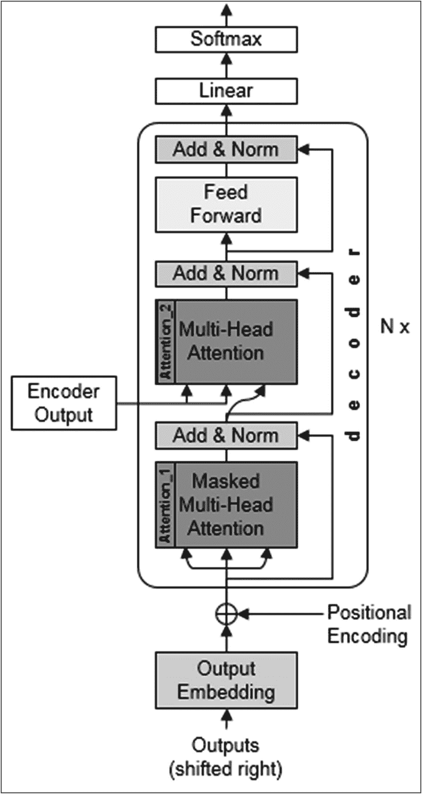
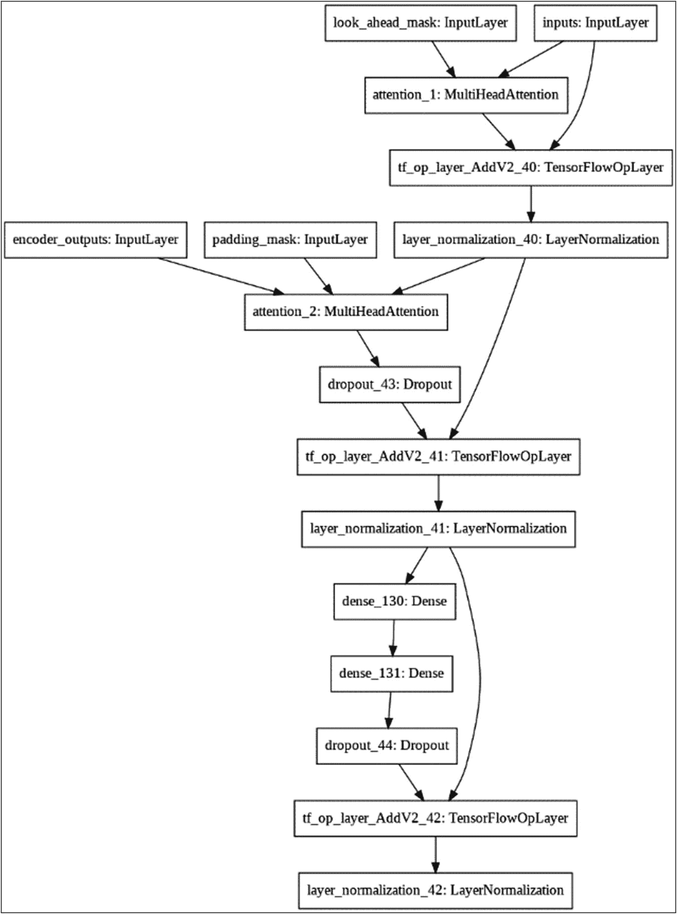
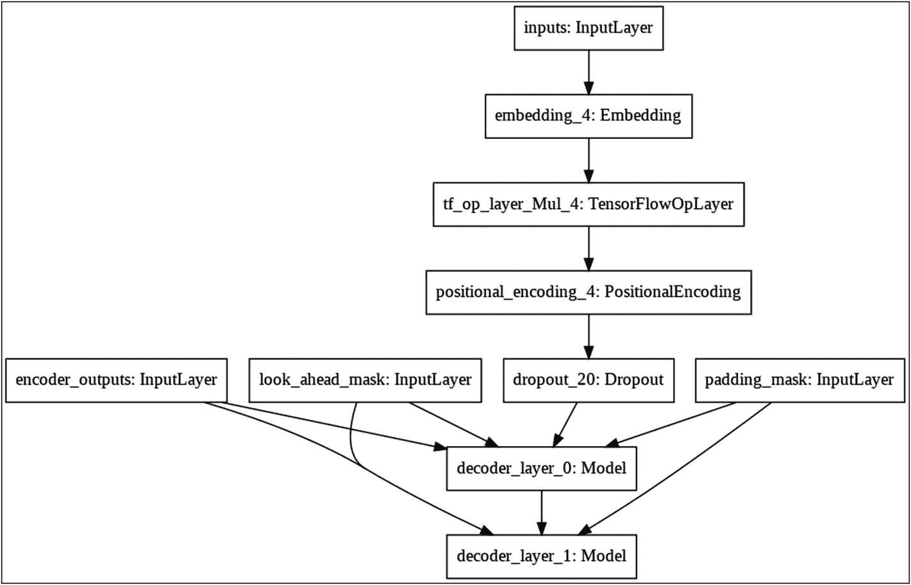

# 解码器架构

解码器架构如图 9-6 所示。



图 9-6 解码器架构

解码器的输入是编码器的输出。与编码器使用重复的编码器层类似，解码器也由重复的解码器层组成。第一层接收来自编码器的输入，最后一层经过线性密集网络到达最终的 Softmax 层，该层输出目标词的概率。解码器的其他输入是输出词嵌入和位置编码的组合。接下来，我将描述重复的解码器层的构建。

## 解码器层

如图 9-6 所示，解码器层实际上包含两个多头注意力机制：

1.  多头注意力（`Attention_2`，如图 9-6 所示）
2.  掩码多头注意力（`Attention_1`，如图 9-6 所示）

前面列表中的第一个多头注意力 `Attention_2` 接收来自编码器的输入。这个输入是*值*和*键*向量。该多头注意力的另一个输入来自掩码多头注意力子层的输出。列表中第二个多头注意力（`Attention_1`），我们为其添加了“掩码”前缀，它接收的输入是前一个解码器状态和位置编码的组合。这两个层都使用了适当的填充掩码。多头注意力 `Attention_2` 的输出经过两个密集层，然后进行 dropout。这就构成了一个解码器层的结构。在解码器的实现中，该层会被重复 N 次。

解码器层的代码如下：

```
def decoder_layer(units, d_model, num_heads,
dropout, name="decoder_layer"):
inputs = tf.keras.Input(shape=
(None, d_model), name="inputs")
enc_outputs = tf.keras.Input(shape=(None, d_model),
name="encoder_outputs")
look_ahead_mask = tf.keras.Input(
shape=(1, None, None), name="look_ahead_mask")
padding_mask = tf.keras.Input(shape=(1, 1, None),
name='padding_mask')
attention1 = MultiHeadAttention(
d_model, num_heads, name="attention_1")(inputs={
'query': inputs,
'key': inputs,
'value': inputs,
'mask': look_ahead_mask
})
attention1 = tf.keras.layers.LayerNormalization(
epsilon=1e-6)(attention1 + inputs)
attention2 = MultiHeadAttention(
d_model, num_heads, name="attention_2")(inputs={
'query': attention1,
'key': enc_outputs,
'value': enc_outputs,
'mask': padding_mask
})
attention2 = tf.keras.layers.Dropout
(rate=dropout)(attention2)
attention2 = tf.keras.layers.LayerNormalization(
epsilon=1e-6)(attention2 + attention1)
outputs = tf.keras.layers.Dense(units=units,
activation='relu')(attention2)
outputs = tf.keras.layers.Dense(units=d_model)
(outputs)
outputs = tf.keras.layers.Dropout(rate=dropout)
(outputs)
outputs = tf.keras.layers.LayerNormalization(
epsilon=1e-6)(outputs + attention2)
return tf.keras.Model(
inputs=[inputs, enc_outputs, look_ahead_mask,
padding_mask],
outputs=outputs,
name=name)
```

这里 `Attention_1` 是我们前面列表中定义为第 2 项的掩码多头注意力，`Attention_2` 是列表中定义的第 1 项。`Attention_2` 的输出经过两个密集块，然后进行 dropout。

你可以通过执行以下代码来可视化解码器层的网络架构：

```
sample_decoder_layer = decoder_layer(
units=512,
d_model=128,
num_heads=4,
dropout=0.3,
name="sample_decoder_layer")
tf.keras.utils.plot_model(
sample_decoder_layer,
to_file='decoder_layer.png')
```

输出结果，即解码器层的架构，如图 9-7 所示。



图 9-7 解码器层网络图

请注意两个多头注意力的位置、它们的输入和输出。接下来，我将定义解码器块。

### 解码器

与编码器的情况类似，解码器网络是通过将解码器层重复 N 次来构建的。我们已经看到了解码器的各种输入。解码器的输出进入一个线性层和 softmax 分类器。

解码器定义如下：

```
def decoder(vocab_size,
num_layers,
units,
d_model,
num_heads,
dropout,
name='decoder'):
inputs = tf.keras.Input(shape=(None,),
name='inputs')
enc_outputs = tf.keras.Input(shape=(None, d_model),
name='encoder_outputs')
look_ahead_mask = tf.keras.Input(
shape=(1, None, None), name="look_ahead_mask")
padding_mask = tf.keras.Input(shape=(1, 1, None),
name='padding_mask')
embeddings = tf.keras.layers.Embedding
(vocab_size, d_model)(inputs)
embeddings *= tf.math.sqrt(tf.cast
(d_model, tf.float32))
embeddings = PositionalEncoding
(vocab_size, d_model)(embeddings)
outputs = tf.keras.layers.Dropout(rate=dropout)
(embeddings)
for i in range(num_layers):
outputs = decoder_layer(
units=units,
d_model=d_model,
num_heads=num_heads,
dropout=dropout,
name='decoder_layer_{}'.format(i),
)(inputs=[outputs, enc_outputs, look_ahead_mask,
padding_mask])
return tf.keras.Model(
inputs=[inputs, enc_outputs, look_ahead_mask,
padding_mask],
outputs=outputs,
name=name)
```

可以使用以下代码构建一个示例解码器：

```
sample_decoder = decoder(
vocab_size=8192,
num_layers=2,
units=512,
d_model=128,
num_heads=4,
dropout=0.3,
name="sample_decoder")
tf.keras.utils.plot_model(
sample_decoder, to_file='decoder.png')
```

此代码生成的图如图 9-8 所示。



图 9-8 解码器网络图

最后是我们的最终目标，即定义 Transformer。

### Transformer 模型

Transformer 由编码器、解码器和一个最终的线性层组成。解码器的输出是线性层的输入。

Transformer 定义如下：

```
def transformer(input_vocab_size,
target_vocab_size,
num_layers,
units,
d_model,
num_heads,
dropout,
name="transformer"):
inputs = tf.keras.Input(shape=(None,),
name="inputs")
dec_inputs = tf.keras.Input(shape=(None,),
name="decoder_inputs")
enc_padding_mask = tf.keras.layers.Lambda(
create_padding_mask, output_shape=(1, 1, None),
name='enc_padding_mask')(inputs)
### 在第一个注意力块中掩码解码器输入的未来词元
look_ahead_mask = tf.keras.layers.Lambda(
create_look_ahead_mask,
output_shape=(1, None, None),
name='look_ahead_mask')(dec_inputs)
### 在第二个注意力块中掩码编码器输出
dec_padding_mask = tf.keras.layers.Lambda(
create_padding_mask, output_shape=(1, 1, None),
name='dec_padding_mask')(inputs)
enc_outputs = encoder(
vocab_size=input_vocab_size,
num_layers=num_layers,
units=units,
d_model=d_model,
num_heads=num_heads,
dropout=dropout,
)(inputs=[inputs, enc_padding_mask])
dec_outputs = decoder(
vocab_size=target_vocab_size,
num_layers=num_layers,
units=units,
d_model=d_model,
num_heads=num_heads,
dropout=dropout,
)(inputs=[dec_inputs, enc_outputs, look_ahead_mask,
dec_padding_mask])
outputs = tf.keras.layers.Dense(units=target_vocab_size,
name="outputs")(dec_outputs)
return tf.keras.Model(inputs=[inputs, dec_inputs],
outputs=outputs, name=name)
```

你可以通过运行以下代码查看网络架构：

```
sample_transformer = transformer(
input_vocab_size = 100,
target_vocab_size = 100,
num_layers=4,
units=512,
d_model=128,
num_heads=4,
dropout=0.3,
name="sample_transformer")
tf.keras.utils.plot_model(
sample_transformer, to_file='transformer.png')
```


