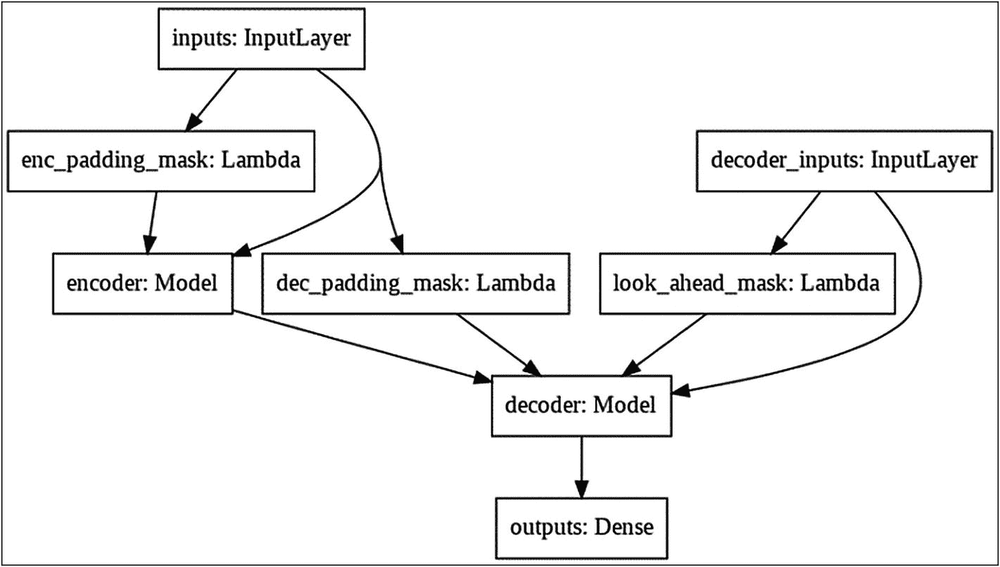
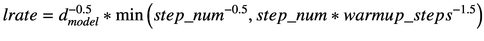

# 网络架构图与模型训练

生成的网络架构图如图 9-9 所示。



**图 9-9.** 示例 Transformer 的网络图

可以看到，整个架构足够简单易懂。它主要包含一个编码器和一个解码器。现在，我们已经定义了`Transformer`，接下来需要基于此定义创建一个模型，以便后续编译。

## 创建训练模型

要创建训练模型，我们只需使用所需参数实例化`transformer`类。

```python
D_MODEL = 256
model = transformer(
    tokenizer_input.vocab_size+2,
    tokenizer_out.vocab_size+2,
    num_layers = 2,
    units = 512,
    d_model = D_MODEL,
    num_heads = 8,
    dropout = 0.1)
```

如前所述，我将层数设置为 2，而参考论文（[`https://arxiv.org/abs/1706.03762`](https://arxiv.org/abs/1706.03762)）建议该值为 6。同样，其他参数也设置为较低值以加快训练速度。要获得更准确的结果，您应该尝试为`num_layers`、`units`和`d_model`设置更大的值。

要编译此模型，我们需要定义损失函数和优化器。

### 损失函数

损失是通过使用稀疏分类熵函数测量输出`y`的真实值与预测值之间的差异来计算的。由于所有输入序列都经过填充，因此在计算损失时应用填充掩码非常重要。损失函数代码如下所示：

```python
def loss(y_true, y_pred):
    y_true = tf.reshape(y_true, shape=(-1, 10 - 1))
    loss = tf.keras.losses.SparseCategoricalCrossentropy(
        from_logits=True, reduction="none")
    (y_true, y_pred)
    mask = tf.cast(tf.not_equal(y_true, 0), tf.float32)
    loss = tf.multiply(loss, mask)
    return tf.reduce_mean(loss)
```

## 优化器

我们将使用`Adam`优化器来训练模型。参考论文（[`https://arxiv.org/pdf/1706.03762.pdf`](https://arxiv.org/pdf/1706.03762.pdf)）建议为优化器使用自定义学习率。自定义学习率由以下公式指定：



根据该公式，学习率最初会随着`warmup_steps`设置步数线性增加，然后随着步数的平方根倒数成比例下降。在上一段引用的论文中，作者将`warmup_steps`设置为 4000，我们将继续使用相同的值。

为了实现此公式，我们创建一个自定义调度器类，如下所示：

```python
class CustomSchedule
    (tf.keras.optimizers.schedules.LearningRateSchedule):
    def __init__(self, d_model, warmup_steps=4000):
        super(CustomSchedule, self).__init__()
        self.d_model = d_model
        self.d_model = tf.cast(self.d_model, tf.float32)
        self.warmup_steps = warmup_steps
    def __call__(self, step):
        arg1 = tf.math.rsqrt(step)
        arg2 = step * (self.warmup_steps**-1.5)
        return tf.math.rsqrt(self.d_model) *
            tf.math.minimum(arg1, arg2)
```

## 编译

我们使用选定的优化器和损失函数编译模型：

```python
model.compile(optimizer=optimizer, loss=loss)
```

## 训练

最后，我们通过调用模型的`fit`方法开始训练：

```python
EPOCHS = 20
model.fit(dataset, epochs=EPOCHS)
```

每个 epoch 大约需要 70 秒来训练模型。

### 推理

对于推理（即将给定的英语句子翻译成德语），我们创建一个名为`translate`的函数。我们需要使用之前创建的`tokenizer`对输入语句进行编码，并为其添加开始和结束标记。我们的最大序列长度由变量`MAX_LENGTH`定义为 10。因此，我们创建一个循环来迭代十个输入单词，通过将注意力集中在整个输入句子上，逐个翻译它们。`translate`的函数代码如下所示：

```python
def translate (input_sentence):
    input_sentence = START_TOKEN_in +
        tokenizer_input.encode
        (input_sentence) + END_TOKEN_in
    encoder_input = tf.expand_dims(input_sentence, 0)
    decoder_input = [tokenizer_out.vocab_size]
    output = tf.expand_dims(decoder_input, 0)
    for i in range(MAX_LENGTH):
        predictions = model(inputs=[encoder_input,
            output], training=False)
        # select the last word
        predictions = predictions[:, -1:, :]
        predicted_id = tf.cast(tf.argmax(predictions,
            axis=-1), tf.int32)
        # terminate on END_TOKEN
        if tf.equal(predicted_id, END_TOKEN_out[0]):
            break
        # concatenated the predicted_id to the output
        output = tf.concat([output, predicted_id],
            axis=-1)
    return tf.squeeze(output, axis=0)
```

## 测试

现在是时候在一些真实输入句子上测试我们的模型了。您可以设置一个输入句子数组，并定义一个循环来执行翻译并将输出打印到控制台。测试循环代码如下所示：

```python
test_sentences = ['i am sorry', 'how are you']
for s in test_sentences:
    prediction = translate(s)
    predicted_sentence = tokenizer_out.decode(
        [i for i in prediction if i <
        qtokenizer_out.vocab_size])
    print('Input: {}'.format(s))
    print('Output: {}'.format(predicted_sentence))
```

您将看到以下输出：

```
Input: i am sorry
Output: lo siento.
Input: how are you
Output: cómo estás.
```

## 完整源代码

完整源代码请参见清单 9-3 以供参考。


```python
import tensorflow as tf
from tensorflow.keras.models import Model
from tensorflow.keras.layers import Input, Dense, LSTM, Embedding, Bidirectional, RepeatVector, Concatenate, Activation, Dot, Lambda
from tensorflow.keras.preprocessing.text import Tokenizer
from tensorflow.keras.preprocessing.sequence import pad_sequences
from keras import preprocessing, utils
import numpy as np
import matplotlib.pyplot as plt
import tensorflow_datasets as tfds
import os
import re
import numpy as np
import string
!pip install wget
import wget
url = 'https://raw.githubusercontent.com/Apress/artificial-neural-networks-with-tensorflow-2/main/ch08/spa.txt'
wget.download(url, 'spa.txt')
### 读取数据
with open('/content/spa.txt', encoding='utf-8', errors='ignore') as file:
    text = file.read().split('\n')
input_texts = []  # 编码器输入
target_texts = []  # 解码器输入
### 我们将选择整个数据集的子集
NUM_SAMPLES = 10000
for line in text[:NUM_SAMPLES]:
    english, spanish = line.split('\t')[:2]
    target_text = spanish.lower()
    input_texts.append(english.lower())
    target_texts.append(target_text)
regex = re.compile('[%s]' % re.escape(string.punctuation))
for s in input_texts:
    regex.sub('', s)
for s in target_texts:
    regex.sub('', s)
input_texts[1], target_texts[1]
tokenizer_input = tfds.features.text.SubwordTextEncoder.build_from_corpus(input_texts, target_vocab_size=2**13)
### 示例展示该分词器的工作原理
tokenized_string1 = tokenizer_input.encode('hello i am good')
tokenized_string1
for token in tokenized_string1:
    print('{} ----> {}'.format(token, tokenizer_input.decode([token])))
### 如果单词不在词典中
tokenized_string2 = tokenizer_input.encode('how is the moon')
for token in tokenized_string2:
    print('{} ----> {}'.format(token, tokenizer_input.decode([token])))
### 对西班牙语文本进行分词
tokenizer_out = tfds.features.text.SubwordTextEncoder.build_from_corpus(target_texts, target_vocab_size=2**13)
START_TOKEN_in = [tokenizer_input.vocab_size]  # 输入起始标记
END_TOKEN_in = [tokenizer_input.vocab_size + 1]  # 输入结束标记
START_TOKEN_out = [tokenizer_out.vocab_size]  # 输出起始标记
END_TOKEN_out = [tokenizer_out.vocab_size + 1]  # 输出结束标记
START_TOKEN_in, END_TOKEN_in, START_TOKEN_out, END_TOKEN_out
MAX_LENGTH = 10
### 分词、过滤和填充句子
def tokenize_and_padding(inputs, outputs):
    tokenized_inputs, tokenized_outputs = [], []
    for (input_sentence, output_sentence) in zip(inputs, outputs):
        # 对句子进行分词
        input_sentence = START_TOKEN_in + tokenizer_input.encode(input_sentence) + END_TOKEN_in
        output_sentence = START_TOKEN_out + tokenizer_out.encode(output_sentence) + END_TOKEN_out
        # 检查分词后句子的最大长度
        # if len(input_sentence) <= MAX_LENGTH and len(output_sentence) <= MAX_LENGTH:
        tokenized_inputs.append(input_sentence)
        tokenized_outputs.append(output_sentence)
    # 对分词后的句子进行填充
    tokenized_inputs = tf.keras.preprocessing.sequence.pad_sequences(tokenized_inputs, maxlen=MAX_LENGTH, padding='post')
    tokenized_outputs = tf.keras.preprocessing.sequence.pad_sequences(tokenized_outputs, maxlen=MAX_LENGTH, padding='post')
    return tokenized_inputs, tokenized_outputs
english, spanish = tokenize_and_padding(input_texts, target_texts)
english[1], spanish[1]
BATCH_SIZE = 32
BUFFER_SIZE = 10000
### 解码器输入使用前一个目标作为输入
### 从目标中移除 START_TOKEN
dataset = tf.data.Dataset.from_tensor_slices((
    {
        'inputs': english,
        'decoder_inputs': spanish[:, :-1]
    },
    {
        'outputs': spanish[:, 1:]
    },
))
dataset = dataset.cache()
dataset = dataset.shuffle(BUFFER_SIZE)
dataset = dataset.batch(BATCH_SIZE)
dataset = dataset.prefetch(tf.data.experimental.AUTOTUNE)
class MultiHeadAttention(tf.keras.layers.Layer):
    def __init__(self, d_model, num_heads, name="multi_head_attention"):
        super(MultiHeadAttention, self).__init__(name=name)
        self.num_heads = num_heads
        self.d_model = d_model
        self.depth = d_model // self.num_heads
        self.query_dense = tf.keras.layers.Dense(units=d_model)
        self.key_dense = tf.keras.layers.Dense(units=d_model)
        self.value_dense = tf.keras.layers.Dense(units=d_model)
        self.dense = tf.keras.layers.Dense(units=d_model)
    def split_heads(self, inputs, batch_size):
        inputs = tf.reshape(inputs, shape=(batch_size, -1, self.num_heads, self.depth))
        return tf.transpose(inputs, perm=[0, 2, 1, 3])
    def call(self, inputs):
        query, key, value, mask = inputs['query'], inputs['key'], inputs['value'], inputs['mask']
        batch_size = tf.shape(query)[0]
        # 线性层
        query = self.query_dense(query)
        key = self.key_dense(key)
        value = self.value_dense(value)
        # 分割多头
        query = self.split_heads(query, batch_size)
        key = self.split_heads(key, batch_size)
        value = self.split_heads(value, batch_size)
        # 缩放点积注意力
        scaled_attention = scaled_dot_product_attention(query, key, value, mask)
        scaled_attention = tf.transpose(scaled_attention, perm=[0, 2, 1, 3])
        # 拼接多头
        concat_attention = tf.reshape(scaled_attention, (batch_size, -1, self.d_model))
        # 最终线性层
        outputs = self.dense(concat_attention)
        return outputs
def scaled_dot_product_attention(query, key, value, mask):
    QxK_transpose = tf.matmul(query, key, transpose_b=True)
    depth = tf.cast(tf.shape(key)[-1], tf.float32)
    logits = QxK_transpose / tf.math.sqrt(depth)
    if mask is not None:
        logits += (mask * -1e9)
    # softmax 在最后一个轴（seq_len_k）上归一化
    attention_weights = tf.nn.softmax(logits, axis=-1)
    output = tf.matmul(attention_weights, value)
    return output
def create_padding_mask(x):
    mask = tf.cast(tf.math.equal(x, 0), tf.float32)
    # (batch_size, 1, 1, sequence length)
    return mask[:, tf.newaxis, tf.newaxis, :]
### 函数测试
x = tf.constant([[2974, 50, 2764, 2975, 0, 0, 0, 0, 0, 0]])
create_padding_mask(x)
def create_look_ahead_mask(x):
    seq_len = tf.shape(x)[1]
    look_ahead_mask = 1 - tf.linalg.band_part(tf.ones((seq_len, seq_len)), -1, 0)
    padding_mask = create_padding_mask(x)
    return tf.maximum(look_ahead_mask, padding_mask)
class PositionalEncoding(tf.keras.layers.Layer):
    def __init__(self, position, d_model):
        super(PositionalEncoding, self).__init__()
        self.pos_encoding = self.positional_encoding(position, d_model)
    def get_angles(self, position, i, d_model):
        angles = 1 / tf.pow(10000, (2 * (i // 2)) / tf.cast(d_model, tf.float32))
        return position * angles
    def positional_encoding(self, position, d_model):
        angle_rads = self.get_angles(
            position=tf.range(position, dtype=tf.float32)[:, tf.newaxis],
            i=tf.range(d_model, dtype=tf.float32)[tf.newaxis, :],
            d_model=d_model)
        # 对数组中的偶数索引应用 sin
        sines = tf.math.sin(angle_rads[:, 0::2])
        # 对数组中的奇数索引应用 cos
        cosines = tf.math.cos(angle_rads[:, 1::2])
        pos_encoding = tf.concat([sines, cosines], axis=-1)
        pos_encoding = pos_encoding[tf.newaxis, ...]
        return tf.cast(pos_encoding, tf.float32)
    def call(self, inputs):
        return inputs + self.pos_encoding[:, :tf.shape(inputs)[1], :]
def encoder_layer(units, d_model, num_heads, dropout, name="encoder_layer"):
    inputs = tf.keras.Input(shape=(None, d_model), name="inputs")
    padding_mask = tf.keras.Input(shape=(1, 1, None), name="padding_mask")
    # 带填充掩码的多头注意力
    attention = MultiHeadAttention(d_model, num_heads, name="attention")({
        'query': inputs,
        'key': inputs,
        'value': inputs,
        'mask': padding_mask
    })
    attention = tf.keras.layers.Dropout(rate=dropout)(attention)
    attention = tf.keras.layers.LayerNormalization(epsilon=1e-6)(inputs + attention)
    # 两个全连接层后接 dropout
    outputs = tf.keras.layers.Dense(units=units, activation='relu')(attention)
    outputs = tf.keras.layers.Dense(units=d_model)(outputs)
    outputs = tf.keras.layers.Dropout(rate=dropout)(outputs)
    outputs = tf.keras.layers.LayerNormalization(epsilon=1e-6)(attention + outputs)
    return tf.keras.Model(inputs=[inputs, padding_mask], outputs=outputs, name=name)
def encoder(vocab_size, num_layers, units, d_model, num_heads, dropout, name="encoder"):
    inputs = tf.keras.Input(shape=(None,), name="inputs")
    # 创建填充掩码
    padding_mask = tf.keras.Input(shape=(1, 1, None), name="padding_mask")
    # 创建词嵌入和位置编码的组合
    embeddings = tf.keras.layers.Embedding(vocab_size, d_model)(inputs)
    embeddings *= tf.math.sqrt(tf.cast(d_model, tf.float32))
    embeddings = PositionalEncoding(vocab_size, d_model)(embeddings)
    outputs = tf.keras.layers.Dropout(rate=dropout)(embeddings)
    # 重复编码器层两次
    for i in range(num_layers):
        outputs = encoder_layer(
            units=units,
            d_model=d_model,
            num_heads=num_heads,
            dropout=dropout,
            name="encoder_layer_{}".format(i),
        )([outputs, padding_mask])
    return tf.keras.Model(inputs=[inputs, padding_mask], outputs=outputs, name=name)
sample_encoder = encoder(
    vocab_size=8192,
    num_layers=5,
    units=512,
    d_model=128,
    num_heads=4,
    dropout=0.3,
    name="sample_encoder")
tf.keras.utils.plot_model(sample_encoder, to_file='encoder.png')
def decoder_layer(units, d_model, num_heads, dropout, name="decoder_layer"):
    inputs = tf.keras.Input(shape=(None, d_model), name="inputs")
    enc_outputs = tf.keras.Input(shape=(None, d_model), name="encoder_outputs")
    look_ahead_mask = tf.keras.Input(shape=(1, None, None), name="look_ahead_mask")
    padding_mask = tf.keras.Input(shape=(1, 1, None), name='padding_mask')
    attention1 = MultiHeadAttention(d_model, num_heads, name="attention_1")(inputs={
        'query': inputs,
        'key': inputs,
        'value': inputs,
        'mask': look_ahead_mask
    })
    attention1 = tf.keras.layers.LayerNormalization(epsilon=1e-6)(attention1 + inputs)
    attention2 = MultiHeadAttention(d_model, num_heads, name="attention_2")(inputs={
        'query': attention1,
        'key': enc_outputs,
        'value': enc_outputs,
        'mask': padding_mask
    })
    attention2 = tf.keras.layers.Dropout(rate=dropout)(attention2)
    attention2 = tf.keras.layers.LayerNormalization(epsilon=1e-6)(attention2 + attention1)
    outputs = tf.keras.layers.Dense(units=units, activation='relu')(attention2)
    outputs = tf.keras.layers.Dense(units=d_model)(outputs)
    outputs = tf.keras.layers.Dropout(rate=dropout)(outputs)
    outputs = tf.keras.layers.LayerNormalization(epsilon=1e-6)(outputs + attention2)
    return tf.keras.Model(
        inputs=[inputs, enc_outputs, look_ahead_mask, padding_mask],
        outputs=outputs,
        name=name)
sample_decoder_layer = decoder_layer(
    units=512,
    d_model=128,
    num_heads=4,
    dropout=0.3,
    name="sample_decoder_layer")
tf.keras.utils.plot_model(sample_decoder_layer, to_file='decoder_layer.png')
def decoder(vocab_size, num_layers, units, d_model, num_heads, dropout, name='decoder'):
    inputs = tf.keras.Input(shape=(None,), name='inputs')
    enc_outputs = tf.keras.Input(shape=(None, d_model), name='encoder_outputs')
    look_ahead_mask = tf.keras.Input(shape=(1, None, None), name="look_ahead_mask")
    padding_mask = tf.keras.Input(shape=(1, 1, None), name='padding_mask')
    embeddings = tf.keras.layers.Embedding(vocab_size, d_model)(inputs)
    embeddings *= tf.math.sqrt(tf.cast(d_model, tf.float32))
    embeddings = PositionalEncoding(vocab_size, d_model)(embeddings)
    outputs = tf.keras.layers.Dropout(rate=dropout)(embeddings)
    for i in range(num_layers):
        outputs = decoder_layer(
            units=units,
            d_model=d_model,
            num_heads=num_heads,
            dropout=dropout,
            name='decoder_layer_{}'.format(i),
        )(inputs=[outputs, enc_outputs, look_ahead_mask, padding_mask])
    return tf.keras.Model(
        inputs=[inputs, enc_outputs, look_ahead_mask, padding_mask],
        outputs=outputs,
        name=name)
sample_decoder = decoder(
    vocab_size=8192,
    num_layers=2,
    units=512,
    d_model=128,
    num_heads=4,
    dropout=0.3,
    name="sample_decoder")
tf.keras.utils.plot_model(sample_decoder, to_file='decoder.png')
def transformer(input_vocab_size, target_vocab_size, num_layers, units, d_model, num_heads, dropout, name="transformer"):
    inputs = tf.keras.Input(shape=(None,), name="inputs")
    dec_inputs = tf.keras.Input(shape=(None,), name="decoder_inputs")
    enc_padding_mask = tf.keras.layers.Lambda(create_padding_mask, output_shape=(1, 1, None), name='enc_padding_mask')(inputs)
    # 在第一个注意力块中掩码解码器输入的未来标记
    look_ahead_mask = tf.keras.layers.Lambda(create_look_ahead_mask, output_shape=(1, None, None), name='look_ahead_mask')(dec_inputs)
    # 在第二个注意力块中掩码编码器输出
    dec_padding_mask = tf.keras.layers.Lambda(create_padding_mask, output_shape=(1, 1, None), name='dec_padding_mask')(inputs)
    enc_outputs = encoder(
        vocab_size=input_vocab_size,
        num_layers=num_layers,
        units=units,
        d_model=d_model,
        num_heads=num_heads,
        dropout=dropout,
    )(inputs=[inputs, enc_padding_mask])
    dec_outputs = decoder(
        vocab_size=target_vocab_size,
        num_layers=num_layers,
        units=units,
        d_model=d_model,
        num_heads=num_heads,
        dropout=dropout,
    )(inputs=[dec_inputs, enc_outputs, look_ahead_mask, dec_padding_mask])
    outputs = tf.keras.layers.Dense(units=target_vocab_size, name="outputs")(dec_outputs)
    return tf.keras.Model(inputs=[inputs, dec_inputs], outputs=outputs, name=name)
sample_transformer = transformer(
    input_vocab_size=100,
    target_vocab_size=100,
    num_layers=4,
    units=512,
    d_model=128,
    num_heads=4,
    dropout=0.3,
    name="sample_transformer")
tf.keras.utils.plot_model(sample_transformer, to_file='transformer.png')
D_MODEL = 256
model = transformer(
    tokenizer_input.vocab_size + 2,
    tokenizer_out.vocab_size + 2,
    num_layers=2,
    units=512,
    d_model=D_MODEL,
    num_heads=8,
    dropout=0.1)
def loss(y_true, y_pred):
    y_true = tf.reshape(y_true, shape=(-1, 10 - 1))
    loss = tf.keras.losses.SparseCategoricalCrossentropy(from_logits=True, reduction="none")(y_true, y_pred)
    mask = tf.cast(tf.not_equal(y_true, 0), tf.float32)
    loss = tf.multiply(loss, mask)
    return tf.reduce_mean(loss)
class CustomSchedule(tf.keras.optimizers.schedules.LearningRateSchedule):
    def __init__(self, d_model, warmup_steps=4000):
        super(CustomSchedule, self).__init__()
        self.d_model = d_model
        self.d_model = tf.cast(self.d_model, tf.float32)
        self.warmup_steps = warmup_steps
    def __call__(self, step):
        arg1 = tf.math.rsqrt(step)
        arg2 = step * (self.warmup_steps**-1.5)
        return tf.math.rsqrt(self.d_model) * tf.math.minimum(arg1, arg2)
learning_rate = CustomSchedule(D_MODEL)
optimizer = tf.keras.optimizers.Adam(learning_rate, beta_1=0.9, beta_2=0.98, epsilon=1e-9)
model.compile(optimizer=optimizer, loss=loss)
EPOCHS = 20
model.fit(dataset, epochs=EPOCHS)
def translate(input_sentence):
    input_sentence = START_TOKEN_in + tokenizer_input.encode(input_sentence) + END_TOKEN_in
    encoder_input = tf.expand_dims(input_sentence, 0)
    decoder_input = [tokenizer_out.vocab_size]
    output = tf.expand_dims(decoder_input, 0)
    for i in range(MAX_LENGTH):
        predictions = model(inputs=[encoder_input, output], training=False)
        # 选择最后一个词
        predictions = predictions[:, -1:, :]
        predicted_id = tf.cast(tf.argmax(predictions, axis=-1), tf.int32)
        # 遇到 END_TOKEN 时终止
        if tf.equal(predicted_id, END_TOKEN_out[0]):
            break
        # 将 predicted_id 拼接到输出中
        output = tf.concat([output, predicted_id], axis=-1)
    return tf.squeeze(output, axis=0)
test_sentences = ['i am sorry', 'how are you']
for s in test_sentences:
    prediction = translate(s)
    predicted_sentence = tokenizer_out.decode([i for i in prediction if i < tokenizer_out.vocab_size])
    print('输入: {}'.format(s))
    print('输出: {}'.format(predicted_sentence))
```
**列表 9-3** `NLP_TRANSFORMER`


### 下一步是什么？

近年来，一种名为 `BERT` 的新型语言表示模型变得流行并被广泛使用。该模型由 Jacob Devlin 等人在其 2018 年 10 月发表的论文《BERT：用于语言理解的深度双向 Transformer 预训练》（[`https://arxiv.org/pdf/1810.04805.pdf`](https://arxiv.org/pdf/1810.04805.pdf)）中提出。`BERT` 代表来自 Transformer 的双向编码器表示。该模型的精妙之处在于，你可以使用预训练的 `BERT` 模型，并仅通过添加一个额外的层进行微调，就能创建各种应用，例如问答、语言翻译等。感兴趣的读者可参阅 Devlin 等人的原始论文以获取更多信息。

