# 10. 图像描述

当你度假时，你会拍摄许多美丽的风景和地点的照片，然后为这些照片添加一些描述并发布到你的社交网络上。想象一下，如果你有一个移动应用能为你自动生成照片描述，这难道不是一件很棒的事情吗？在本章中，你将学习如何创建和训练一个神经网络来为你的照片生成描述。

描述生成是一个非常具有挑战性的问题。要解决这个问题，你需要同时具备计算机视觉和自然语言处理的知识。计算机视觉帮助你理解图像的内容，这基本上是目标检测。`NLP` 则将这种理解转化为按正确顺序排列的词语。

解决此问题的最通用架构如图 10-1 所示。

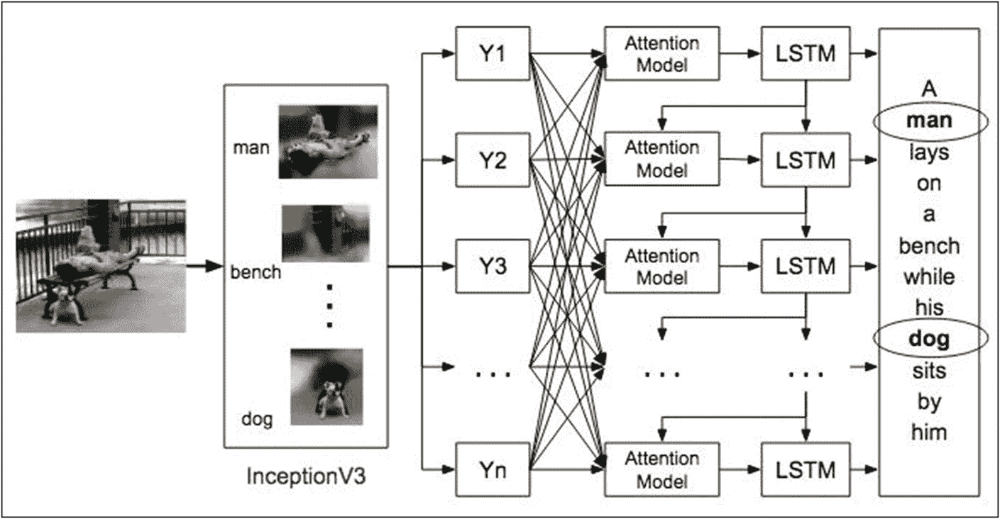

**图 10-1** 图像描述的通用架构

我们将图像通过一个预训练的网络，例如 `InceptionV3` 或 `VGG16`，这些网络是为图像分类而设计的。然而，我们将只使用此类网络的卷积层来提取图像中的特征，并忽略网络的分类部分。如图 10-1 所示，我们有一张图片，上面是一个男人躺在长椅上，旁边坐着一只狗。当你将这张图像通过图像分类网络时，你将提取出图像的各个部分，例如男人、狗、长椅等。检测到这些物体后，你需要生成一个关联所有这些图像组件的描述，而这正是这个图像描述应用中最具挑战性的部分。你不能简单地列出物体的名称。相反，你需要使用这些词语（检测到的物体名称）创建一个恰当且有意义的句子。这就是 `NLP` 模块发挥作用的地方，它将包含用于生成句子的 `LSTM`。然而，为了使其更有意义，你需要一个类似于上一章中使用的注意力机制。回顾一下，你在第 9 章中使用了带有**多头注意力**的 Transformer 模型来进行翻译。在本章中，对于 `NLP`，你将使用一个不同的注意力模块，称为 Bahdanau 注意力。Dzmitry Bahdanau 提出了一种加性注意力（[`https://arxiv.org/pdf/1409.0473.pdf`](https://arxiv.org/pdf/1409.0473.pdf)），它对编码器和解码器的状态进行线性组合。它学习在给定序列中共同对齐和翻译词语。最初，这是为了改进基于编码器-解码器 `RNN`（循环神经网络）的机器翻译而开发的。

Bahdanau 模型的示意图如图 10-2 所示。

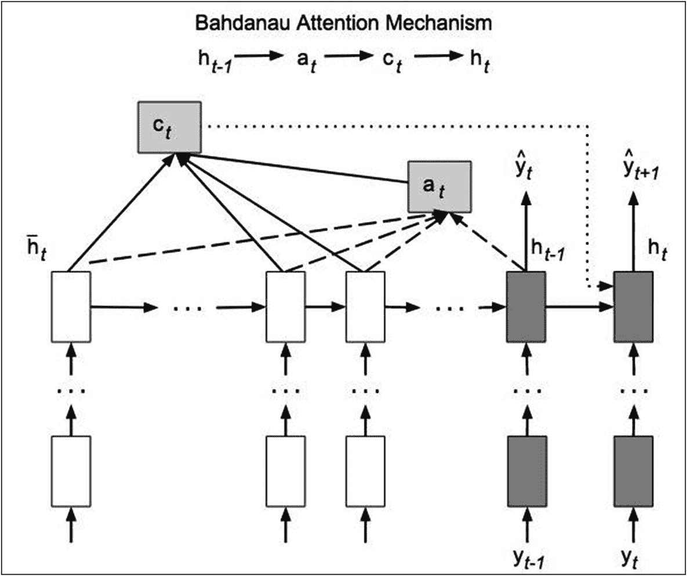

**图 10-2** Bahdanau 注意力

这由以下公式控制：

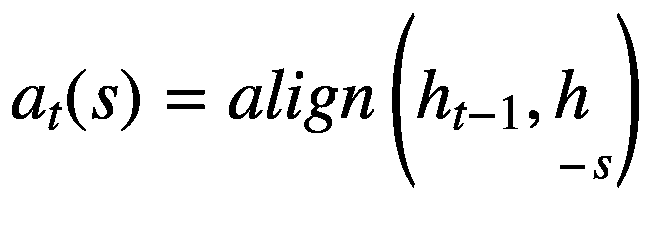

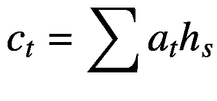

![$$ {h}_t= RNN\left({h}_{t-1}^{l-1},\left[{c}_t;{h}_{t-1}\right]\right) $$](images/495303_1_En_10_Chapter/495303_1_En_10_Chapter_TeX_Equc.png)

与上一章类似，我将通过其实现向你解释 Bahdanau 注意力模块。那么，让我们直接跳入开发一个图像描述项目吧。

## 项目描述

与任何其他 `ML` 项目一样，创建图像描述网络模型最重要的是要有合适的训练和测试数据。幸运的是，Flickr 已公开提供此类数据。`Flickr8k` 数据集包含约 8000 张图像，而 `Flickr30k` 数据集包含约 30,000 张图像。如果你想使用比这些更大的数据集，`MS COCO` 包含约 180,000 张图像。所有这些图像都有相应的描述。每张图像可能有多条描述。使用更大的数据集可以在未见过的图像上获得更好的预测精度；然而，这会消耗大量训练资源。出于学习目的，`Flickr8k` 数据已经足够，因为我们不太关心生成的描述在多大程度上代表了给定的图像。该数据集中的每张图像都附有五条相关的描述。

### 创建项目

打开一个新的 Colab 项目，并将其重命名为 `ImageCaptioning`。导入所需的库。

```python
import os
import time
import pickle
import numpy as np
import tensorflow as tf
import matplotlib.pyplot as plt
from sklearn.utils import shuffle
from sklearn.model_selection import train_test_split
from tensorflow.keras.applications import InceptionV3
from os import listdir
from tqdm import tqdm
from PIL import Image
```

## 下载数据


本项目需要下载两种类型的数据库——图像及其对应的描述文本。正如我之前提到的，Flickr 已将该数据库（`http://academictorrents.com/details/9dea07ba660a722ae1008c4c8afdd303b6f6e53b`）向公众开放。该数据库包含图像和描述文本。请使用以下代码下载描述文本数据：

```
!wget --no-check-certificate -r  'https://drive.google.com/uc?export=download&id=1c7yGTpizf5egVD9dc3Q2lrxS8wtOAV42' -O Flickr8k_text.zip
```

解压下载的文件：

```
!mkdir captions images
!unzip 'Flickr8k_text.zip' -d '/content/captions'
```

现在，你驱动器中的 captions 文件夹将包含多个文件。训练图像和测试图像分别存放在两个独立的文件夹中。如果你打开 `Flickr_8k.trainImages.txt` 文件，会看到一长串以 `.jpg` 为扩展名的文件名列表。这些就是你的图像文件。打开 `Flickr8k.token.txt` 文件，你会看到与这些图像对应的描述文本。以下是该文件的前几行内容，供你理解其格式。

```
1000268201_693b08cb0e.jpg#1    A girl going into a wooden building .
1000268201_693b08cb0e.jpg#2    A little girl climbing into a wooden playhouse .
1000268201_693b08cb0e.jpg#3    A little girl climbing the stairs to her playhouse .
1000268201_693b08cb0e.jpg#4    A little girl in a pink dress going into a wooden cabin .
1001773457_577c3a7d70.jpg#0    A black dog and a spotted dog are fighting
```

使用以下代码下载并解压图像数据库：

```
!wget --no-check-certificate -r 'https://drive.google.com/uc?export=download&id=1126G_E2OpvULyvTm0Kz_oMhOzv8CkiW1' -O Flickr8k_Dataset.zip
!unzip 'Flickr8k_Dataset.zip' -d '/content/images'
```

图像会被解压到你驱动器中的 images 文件夹中。图 10-3 展示了其中一张图像。


**图 10-3** 数据集中的示例图像

与该图像对应的描述文本可以在你之前下载的描述文本文件（`Flickr8k.token.txt`）中找到。以下是上图对应的描述文本。

```
1003163366_44323f5815.jpg#0    A man lays on a bench while his dog sits by him .
1003163366_44323f5815.jpg#1    A man lays on the bench to which a white dog is also tied .
1003163366_44323f5815.jpg#2    a man sleeping on a bench outside with a white and black dog sitting next to him .
1003163366_44323f5815.jpg#3    A shirtless man lies on a park bench with his dog .
1003163366_44323f5815.jpg#4    man laying on bench holding leash of dog sitting on ground
```

你可以通过下面这段简单的代码来检查数据库中有多少张图像：

```
image_dir = '/content/images/Flicker8k_Dataset'
images = listdir(image_dir)
print("The number of jpg flies in Flicker8k: {}"
.format(len(images)))
```

你会看到该数据库包含 8091 张图像——足够我们进行实验和学习。

## 解析 Token 文件

现在，我们将解析 token 文件，以创建图像名称及其对应描述文本的列表。你已经看到了 token 文件（`Flickr8k.token.txt`）的结构。它包含一个文件名和一个以制表符分隔的描述文本。我们将创建两个列表，一个包含图像路径，另一个包含其对应的描述文本。为了缩短训练时间，我将只使用每张图像的一个描述文本。不言而喻，如果使用数据集中每张图像提供的五个描述文本，模型的推理效果会更好。

首先，我们将编写一个函数，将 token 文件的内容加载到内存中。

### 加载数据

以下函数将 token 文件的内容加载到内存中，并返回一个字符串。

```
#### load doc into memory
def load(filename):
file = open(filename, 'r')
text = file.read()
file.close()
return text
filename = '/content/captions/Flickr8k.token.txt'
doc = load(filename)
```

执行上述代码后，`doc` 变量将保存整个文件的内容。必须解析该内容，以创建我们想要的两个独立列表。

我们创建一个迭代器（一个列表变量）来遍历 images 文件夹中的文件。

```
dirs = listdir('/content/images/Flicker8k_Dataset')
```

你可以检查几个条目：

```
dirs[:5]
```

输出应如下所示：

```
['3583065748_7d149a865c.jpg',
'3358621566_12bac2e9d2.jpg',
'509778093_21236bb64d.jpg',
'2094323311_27d58b1513.jpg',
'3314180199_2121e80368.jpg']
```

### 创建列表

现在，我们将编写一个函数来创建这两个列表：

```
def load_small(doc):
PATH = '/content/images/Flicker8k_Dataset/'
img_path = []
img_id = []
img_cap = []
for line in doc.split('\n'):
tokens = line.split()
if len(line)  ' + image_desc
+ ' '
if image_id in dirs:
img_path.append(image_path)
img_cap.append(image_desc)
else:
continue
return img_path , img_cap
```

我将图像数量限制为 8000 张，并且每张图像只读取一个描述文本。对于每个描述文本，我们还添加了 `<start>` 和 `<end>` 标签。

调用此函数以创建两个所需的列表：

```
all_image_path , all_image_captions = load_small(doc)
```

检查列表的大小以及图像列表中的几个条目：

```
print('Number of images: ', len(all_image_path))
all_image_path[:5]
```

输出如下所示：

```
Number of images:  8000
['/content/images/Flicker8k_Dataset/1000268201_693b08cb0e.jpg',
'/content/images/Flicker8k_Dataset/1001773457_577c3a7d70.jpg',
'/content/images/Flicker8k_Dataset/1002674143_1b742ab4b8.jpg',
'/content/images/Flicker8k_Dataset/1003163366_44323f5815.jpg',
'/content/images/Flicker8k_Dataset/1007129816_e794419615.jpg']
```

同时，检查描述文本列表的内容：

```
print('Number of captions: ',
len(all_image_captions))
all_image_captions[:5]
```

输出如下所示：

```
Number of captions:  8000
[' A child in a pink dress is climbing up a set of stairs in an entry way . ',
' A black dog and a spotted dog are fighting ',
' A little girl covered in paint sits in front of a painted rainbow with her hands in a bowl . ',
' A man lays on a bench while his dog sits by him . ',
' A man in an orange hat staring at something . ']
```

请注意，该列表包含 8000 个描述文本，每张图像对应一个描述文本。

我们对训练数据进行打乱：

```
train_captions, img_name_vector =
shuffle(all_image_captions,
all_image_path,
random_state=1)
```

## 加载 InceptionV3 模型

我们将使用 InceptionV3 模型从图像中提取特征。使用以下语句加载模型：

```
image_model = InceptionV3(include_top=False,
weights='imagenet')
```

`weights` 参数指定的值是 `imagenet`，这是一个包含超过 1500 万张标注高分辨率图像、约 22000 个类别的数据集。InceptionV3 模型在 120 万张图像上进行了训练，另有 5 万张图像用于验证，10 万张图像用于测试。因此，我们利用这个训练成果，使用预训练权重。

请注意，在模型提取过程中，我们移除了顶层。顶层用于图像分类。由于我们只对特征提取感兴趣，因此不需要这些顶层。现在，我们将基于 `image_model` 创建自己的 `tf.keras` 模型，用于提取图像特征。我们首先提取 InceptionV3 模型的最后一层：

```
new_input = image_model.input
hidden_layer = image_model.layers[-1].output
```

现在，我们通过采用提取的模型输入架构，并将 `hidden_layer` 作为输出层来创建我们的模型。这个隐藏层就是最后一个 softmax 层之前的层。

```
image_features_extract_model = tf.keras.Model
(new_input, hidden_layer)
```


### 该输出层的形状为 `8x8x2048`，这是 `InceptionV3` 模型的最后一个卷积层。我们使用到最后一个卷积层为止的层，是因为将对从该层提取的特征应用注意力机制。

## 准备数据集

`InceptionV3` 模型要求输入图像尺寸为 `299x299`。此外，图像必须经过归一化处理，使其像素值范围在 –1 到 1 之间。

我们编写一个用于加载和调整图像大小的函数：

```
def load_image(image_path):
    img = tf.io.read_file(image_path)
    img = tf.image.decode_jpeg(img, channels=3)
    img = tf.image.resize(img, (299, 299))
    img = tf.keras.applications.inception_v3.preprocess_input(img)
    return img, image_path
```

我们通过调用 `from_tensor_slices` 并使用上述 `load_image` 函数进行预处理来创建图像数据集。

```
encode_train = sorted(set(img_name_vector))
image_dataset = tf.data.Dataset.from_tensor_slices(encode_train)
image_dataset = image_dataset.map(load_image, num_parallel_calls=tf.data.experimental.AUTOTUNE).batch(16)
```

## 提取特征

对于数据集中的每张图像，我们通过调用之前创建的模型 `image_features_extract_model` 来提取特征。在重塑数据后，我们将其保存到物理文件中。我们通过以下 for 循环来实现这一点：

```
for img, path in tqdm(image_dataset):
    batch_features = image_features_extract_model(img)
    batch_features = tf.reshape(batch_features, (batch_features.shape[0], -1, batch_features.shape[3]))
    for bf, p in zip(batch_features, path):
        path_of_feature = p.numpy().decode("utf-8")
        np.save(path_of_feature, bf.numpy())
```

请注意，虽然将特征保存到内存中会更高效，但每张图像需要 `8x8x2048` 个浮点数，因此会消耗大量资源。请注意，在撰写本文时，Colab 的内存限制为 `12GB`。在 GPU 上运行上述循环大约花费了我 2 分钟。

## 创建词汇表

现在，我们将创建一个包含所有唯一单词的词汇表。

```
tokenizer = tf.keras.preprocessing.text.Tokenizer(filters='!"#$%&()*+.,-/:;=?@[\]^_`{|}~ ')
tokenizer.fit_on_texts(train_captions)
max_size = len(tokenizer.word_index)
```

## 创建输入序列

我们使用以下代码创建分词后单词的输入序列：

```
train_seqs = tokenizer.texts_to_sequences(train_captions)
```

打印几个序列：

```
train_seqs[:5]
```

输出结果为：

```
[[2, 1, 2339, 8, 155, 2340, 1198, 19, 2341, 1390, 24, 480, 554, 3],
 [2, 21, 1714, 7, 1199, 1715, 1, 108, 2342, 19, 5, 173, 3],
 [2, 1, 11, 4, 1, 28, 32, 506, 1, 507, 3],
 [2, 1, 101, 102, 12, 1, 26, 3],
 [2, 63, 34, 4, 1, 272, 3]]
```

如您所见，这些序列的长度各不相同。为了进行模型开发，我们需要所有序列具有相同的长度。因此，我们对序列进行填充。

```
max_length = max(len(t) for t in train_seqs)
cap_vector = tf.keras.preprocessing.sequence.pad_sequences(train_seqs, padding='post')
```

打印 `cap_vector` 以检查其内容：

```
cap_vector[:5]
```

输出结果如图 10-4 所示。

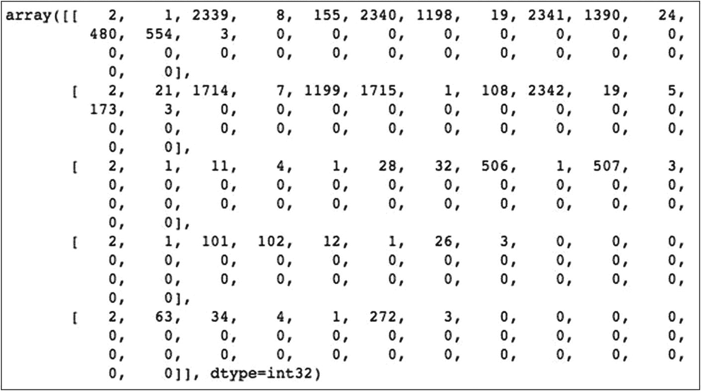

**图 10-4** 填充后的序列示例

您可以看到，所有分词后的单词都经过了填充，因此长度相等。

## 创建训练数据集

我们声明一些用于创建数据集的变量：

```
BATCH_SIZE = 64
BUFFER_SIZE = 1000
embedding_dim = 256
units = 512
vocab_size = max_size + 1
num_steps = len(img_name_vector) // BATCH_SIZE
```

以下函数将之前保存的每张图像的特征向量加载到张量中。

```
def map_func(img_name, cap):
    img_tensor = np.load(img_name.decode('utf-8') + '.npy')
    return img_tensor, cap
```

我们使用以下函数创建数据集：

```
def create_dataset(img_name_train, caption_train):
    dataset = tf.data.Dataset.from_tensor_slices((img_name_train, caption_train))
    # 使用 map 并行加载 numpy 文件
    dataset = dataset.map(lambda item1, item2: tf.numpy_function(map_func, [item1, item2], [tf.float32, tf.int32]), num_parallel_calls=tf.data.experimental.AUTOTUNE)
    # 打乱并分批
    dataset = dataset.shuffle(BUFFER_SIZE).batch(BATCH_SIZE).prefetch(buffer_size=tf.data.experimental.AUTOTUNE)
    return dataset
```

在上述代码中，我们使用 `map` 函数加载 numpy 文件。我们对数据进行打乱并创建数据批次。

```
dataset = create_dataset(img_name_vector, cap_vector)
```

## 创建模型

我们使用 Bahdanau 注意力机制和门控循环单元（GRU）创建序列到序列模型。GRU 在 RNN 中提供了一种门控机制。它类似于您在第 9 章中使用的带有遗忘门的 LSTM，但其参数比 LSTM 少。由于训练参数较少，它比 LSTM 训练更快，占用内存更少，执行速度也更快。然而，其缺点是在处理长序列时，准确率不如 LSTM。

Bahdanau 注意力机制的工作方式如下：

1.  为给定的输入图像生成编码器隐藏状态。
2.  计算对齐分数——对齐分数是在每个先前的编码器隐藏状态与先前的解码器隐藏状态之间计算的。
3.  对对齐分数进行 Softmax 处理。
4.  计算上下文向量。
5.  解码输出。
6.  重复步骤 2 到 5，直到遇到结束标记。

当您查看其实现时（在“解码器实现”部分讨论），您将更好地理解这些步骤。

### 创建编码器

编码器将提取的特征作为输入，并将其传递到一个全连接层。

Inception 编码器定义如下：

```
class Inception_Encoder(tf.keras.Model):
    def __init__(self, embedding_dim):
        super(Inception_Encoder, self).__init__()
        # fc 后的形状 = (batch_size, 64, embedding_dim)
        self.fc = tf.keras.layers.Dense(embedding_dim)

    def call(self, x):
        x = self.fc(x)
        x = tf.nn.relu(x)
        return x
```

### 创建解码器

这是本应用中最关键的部分。现在，您将编写一个嵌入注意力机制的解码器。您将使用 Bahdanau 注意力机制。我将对 Bahdanau 注意力机制进行简要介绍。

#### Bahdanau 注意力机制

根据“Show, Attend and Tell”([`https://arxiv.org/pdf/1502.03044.pdf`](https://arxiv.org/pdf/1502.03044.pdf))研究论文，我们从每张图像中提取一组特征向量，这些向量是图像对应部分的 N 维表示。编码器将这些特征向量通过一个全连接层传递。

通常，有两种类型的注意力机制：

1.  **Bahdanau 注意力机制** – 确定性的“软”注意力
2.  **Luong 注意力机制** – 随机性的“硬”注意力


我们使用确定性软注意力机制，即 Bahdanau 注意力。该注意力机制基本上为每个`input_vector`（即图像的提取特征）计算注意力权重和上下文向量。简单来说，上下文向量是图像在时间`t`时相关部分的动态表示。我们定义了一个注意力机制，它从输入向量中计算上下文向量，这些输入向量代表了在不同图像位置提取的特征。对于图像中的每个位置，我们称之为`loc`；该机制会生成一个正权重，在我们的代码中也称为`score`。该分数可以解释为位置`loc`是生成下一个单词的正确关注点的概率，或者我们是否应该给予`loc`一定的相对重要性。每个输入向量的注意力权重由一个注意力模型计算，为了计算这些注意力权重，我们使用一个多层感知器层，该层将先前的解码器隐藏状态和当前输入向量的隐藏状态作为输入。这个隐藏状态是编码器的输出。

## 解码器功能

解码器的功能可以总结为以下三个简单步骤。

为了预测目标词，解码器使用以下内容：

1.  上下文向量（注意力权重与编码器输出的加权乘积）
2.  上一个时间步的解码器输出
3.  先前的解码器隐藏状态

## 解码器初始化

我们按如下方式声明`Decoder`类：

```
class RNN_Decoder(tf.keras.Model):
```

在类初始化中，我们创建一个 GRU 层：

```
self.gru = tf.keras.layers.GRU(self.units,
return_sequences=True,
return_state=True,
recurrent_initializer=
'glorot_uniform')
```

我们使用批归一化来加速训练过程，并通常提高模型的性能。批归一化会自动标准化深度学习神经网络中某一层的输入。

```
self.batchnormalization =
tf.keras.layers.BatchNormalization
(axis=-1,
momentum=0.99,
epsilon=0.001,
center=True,
scale=True,
beta_initializer='zeros',
gamma_initializer='ones',
moving_mean_initializer='zeros',
moving_variance_initializer='ones',
beta_regularizer=None,
gamma_regularizer=None,
beta_constraint=None,
gamma_constraint=None)
```

为了实现注意力机制，我们声明了几个线性层：

```
self.W1 = tf.keras.layers.Dense(units)
self.W2 = tf.keras.layers.Dense(units)
self.V = tf.keras.layers.Dense(1)
```

## 解码器调用方法

解码器需要三个输入：

1.  编码器输出
2.  隐藏状态（初始化为 0）
3.  解码器输入（即起始标记）

我们按如下方式声明`call`方法：

```
def call(self, x, features, hidden):
```

其中`x`是解码器输入，`features`代表编码器输出，`hidden`是解码器隐藏状态，初始化为零。
首先，我们通过将先前的解码器隐藏状态的维度加 1 来改变其形状。

```
hidden_with_time_axis = tf.expand_dims(hidden, 1)
```

然后，我们计算注意力分数。

## 注意力分数

注意力分数由以下公式指定：

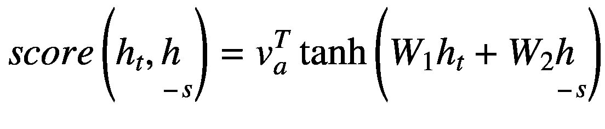

以 Bahdanau 风格实现注意力代码的伪代码如下：

```
score = FC(tanh(FC(EO) + FC(H)))
```

这是实际的实现：

```
score = tf.nn.tanh(self.W1(features) +
self.W2(hidden_with_time_axis))
```

在前面的语句中，提供了先前的解码器隐藏状态和当前输入向量的隐藏状态作为输入。
接下来，我们计算注意力权重。

## 注意力权重

注意力权重的数学表达式为：

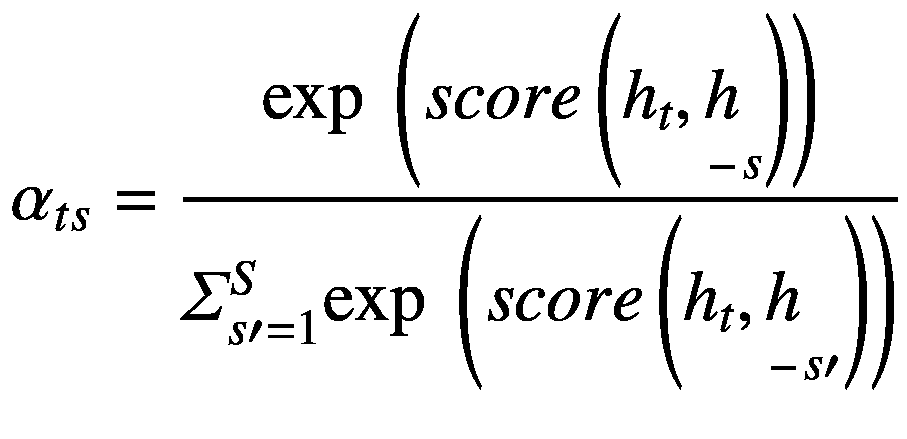

我们按如下方式实现：

```
attention_weights = tf.nn.softmax(self.V(score),
axis=1)
```

我们对分数应用 softmax 激活函数以获得注意力权重。softmax 激活函数将得到概率，其总和等于 1。这将有助于表示每个输入序列的权重或影响。输入序列的注意力权重越高，其对预测目标词的影响就越大。
然后，我们继续计算上下文向量。

## 上下文向量

上下文向量的数学表达式为：

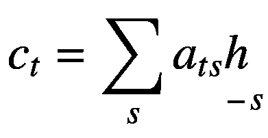

我们分两步实现。首先，我们计算每个输入的上下文向量：

```
context_vector = attention_weights * features
```

请注意，上下文向量是编码器隐藏状态及其各自分数的乘积。它基本上是注意力权重与当前输入向量隐藏状态（由编码器产生）的加权乘法。

接下来，我们对所有这些乘积求和。

```
context_vector = tf.reduce_sum(context_vector, axis=1)
```

这解码了输出——上下文向量与先前的解码器输出连接，并与先前的解码器隐藏状态一起馈送到该时间步的解码器 RNN 中，以产生新的输出。基本上，我们通过在前面的语句中重塑上下文向量来实现这一点。
至此，Bahdanau 注意力模型的实现完成。
我们现在继续进行实际的解码器实现。

## 解码器实现

我们首先通过嵌入层将字幕索引转换为向量。

```
x = self.embedding(x)
```

接下来，将上下文向量与字幕向量（`x`）映射并组合成一个向量。

```
x = tf.concat([tf.expand_dims(context_vector, 1),
x], axis=-1)
```

现在，将此向量传递通过 GRU。

```
output, state = self.gru(x)
```

将 GRU 层的输出传递通过一个 Dense 层。

```
x = self.fc1(output)
```

此时`x`的形状为 (`batch_size`, `max_length`, `hidden_size`)。接下来，将`x`重塑为 (`batch_size * max_length`, `hidden_size`)。

```
x = tf.reshape(x, (-1, x.shape[2]))
```

添加 Dropout 和 BatchNorm 层。

```
x = self.dropout(x)
x = self.batchnormalization(x)
```

此时输出形状为 (64 x 512)。将其传递通过一个 Dense 层，将其转换为 (64 x 8329)。在我们的例子中，8329 是词汇表大小。

```
x = self.fc2(x)
```

最后，将计算出的值返回给调用者。

```
return x, state, attention_weights
```

我们为解码器类再定义一个函数，用于重置解码器的初始状态。

```
def reset_state(self, batch_size):
return tf.zeros((batch_size, self.units))
```

解码器实现的完整代码在清单 10-1 中给出，供您快速参考。


```python
class RNN_Decoder(tf.keras.Model):
    def __init__(self, embedding_dim, units, vocab_size):
        super(RNN_Decoder, self).__init__()
        self.units = units
        self.embedding = tf.keras.layers.Embedding(vocab_size, embedding_dim)
        self.gru = tf.keras.layers.GRU(self.units, return_sequences=True, return_state=True, recurrent_initializer='glorot_uniform')
        self.fc1 = tf.keras.layers.Dense(self.units)
        self.dropout = tf.keras.layers.Dropout(0.5, noise_shape=None, seed=None)
        self.batchnormalization = tf.keras.layers.BatchNormalization(axis=-1, momentum=0.99, epsilon=0.001, center=True, scale=True, beta_initializer='zeros', gamma_initializer='ones', moving_mean_initializer='zeros', moving_variance_initializer='ones', beta_regularizer=None, gamma_regularizer=None, beta_constraint=None, gamma_constraint=None)
        self.fc2 = tf.keras.layers.Dense(vocab_size)
        # 实现注意力机制
        self.W1 = tf.keras.layers.Dense(units)
        self.W2 = tf.keras.layers.Dense(units)
        self.V = tf.keras.layers.Dense(1)

    def call(self, x, features, hidden):
        hidden_with_time_axis = tf.expand_dims(hidden, 1)
        # 注意力函数
        # 计算分数
        score = tf.nn.tanh(self.W1(features) + self.W2(hidden_with_time_axis))
        # 使用 Softmax 计算概率
        attention_weights = tf.nn.softmax(self.V(score), axis=1)
        # 计算上下文向量
        context_vector = attention_weights * features
        context_vector = tf.reduce_sum(context_vector, axis=1)
        # 将输入的描述索引（整数）传入嵌入层，转换为向量
        x = self.embedding(x)
        # 将上下文向量与输入向量（描述向量）映射后拼接
        x = tf.concat([tf.expand_dims(context_vector, 1), x], axis=-1)
        # 将拼接后的向量传入 GRU
        output, state = self.gru(x)
        # shape == (batch_size, max_length, hidden_size)
        # 将 GRU 层的输出传入一个全连接层
        x = self.fc1(output)
        # x shape == (batch_size * max_length, hidden_size)
        x = tf.reshape(x, (-1, x.shape[2]))
        # 添加 Dropout 和 BatchNorm 层
        x = self.dropout(x)
        x = self.batchnormalization(x)
        # output shape == (64 * 512)
        x = self.fc2(x)
        # shape : (64 * 8329(vocab))
        return x, state, attention_weights

    def reset_state(self, batch_size):
        return tf.zeros((batch_size, self.units))
```

**代码清单 10-1** 带有 Bahdanau 注意力的解码器类

## 编码器/解码器实例化

我们按如下方式创建编码器和解码器实例：

```python
encoder = Inception_Encoder(embedding_dim)
decoder = RNN_Decoder(embedding_dim, units, vocab_size)
```

出于好奇，你可以绘制编码器和解码器的模型图。

```python
tf.keras.utils.plot_model(encoder)
tf.keras.utils.plot_model(decoder)
```

模型图如图 10-5 所示。

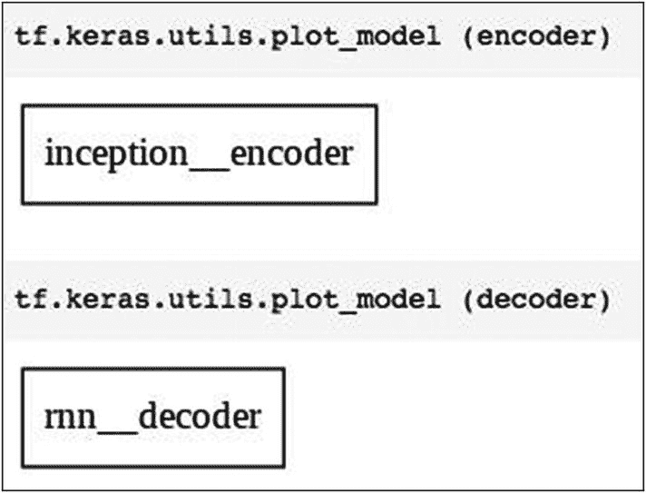

**图 10-5** 编码器/解码器的模型图

这些模型图其实没什么特别之处，因为所有处理过程都只在内部模型中完成。

## 定义优化器和损失函数

我们使用 `Adam` 优化器和 `SparseCategoricalCrossentropy` 作为损失函数。

```python
optimizer = tf.keras.optimizers.Adam()
loss_object = tf.keras.losses.SparseCategoricalCrossentropy(from_logits=True, reduction="none")

def loss_function(real, pred):
    mask = tf.math.logical_not(tf.math.equal(real, 0))
    loss_ = loss_object(real, pred)
    mask = tf.cast(mask, dtype=loss_.dtype)
    loss_ *= mask
    return tf.reduce_mean(loss_)
```

我将通过一个例子向你解释损失是如何计算的。损失函数接收两个参数——真实描述向量和预测值。该函数使用 `tf.keras.losses.SparseCategoricalCrossentropy` 模块的 `loss_object` 方法计算这两个向量之间的损失。然后我们使用 `tf.cast` 函数将掩码向量转换为 `float32` 数据类型。这有助于我们将向量转换为不同的数据类型以便进一步处理。最后，我们将 `loss_` 与掩码相乘；这样做的目的是将真实值（数据集中存在的描述值）映射到计算出的损失函数上。

我将用一个实际例子来说明上述操作。考虑以下真实描述，这是我在训练过程中选取的。

```
real(passed as a parameter) : tf.Tensor(
[  0   0   0   0   0   0    0   0    0   0   0   0   0    0
0   4   0   0   0   0 1760   0  367   0   0   4   0    0
0   0   0   0   0   0    0   9  453   0   0   0   0    0
0   0   0   0   0   0  132   0    0   0   0   0   0    0
0   0   0   4   0   0    0   5], shape=(64,), dtype=int32)
```

现在，对上述向量 `real` 应用以下语句。`tf.math.equal` 只是将向量转换为布尔值。它接收两个参数 `x` 和 `y`。如果 `x` 等于 `y`，则返回 `true`。

```
tf.math.equal(real , 0) tf.Tensor
```

这将产生以下张量：

```
[True  True  True  True  True  True  True  True  True  True  True  True
True  True  True False  True  True  True  True False  True False  True
True False  True  True  True  True  True  True  True  True  True False
False  True  True  True  True  True  True  True  True  True  True  True
False  True  True  True  True  True  True  True  True  True  True False
True  True  True False], shape=(64,), dtype=bool)
```

执行以下语句。`tf.math.logical_not` 接收一个布尔参数，并对其执行逻辑非运算。

```
mask = tf.math.logical_not(tf.math.equal(real, 0))
```

输出结果为：

```
tf.Tensor(
[False False False False False False False False False False False False
False False False  True False False False False  True False  True False
False  True False False False False False False False False False  True
True False False False False False False False False False False False
True False False False False False False False False False False  True
False False False  True], shape=(64,), dtype=bool)
```

现在，查看由以下语句产生的损失张量：

```
loss_ = loss_object(real, pred)
```

输出结果为：

```
loss_ = loss_object(real, pred)
tf.Tensor(
[13.458616  11.725777   13.339547   13.877813   13.6512375  13.609352
12.680449   13.963526   12.929108   12.504114   12.995626   13.473895
13.966334   13.3766165  13.607654    0.10513641 13.231352   13.313489
13.727711   14.456019   10.560667   13.632038    4.2983437  14.144966
14.331357    0.28515333 13.97144    13.087602   15.597718   13.351999
13.649492   12.489752   12.744471   12.558954   13.255367   1.8581532
3.1811125  13.873036   12.329573   12.222642   13.126439   14.233135
12.379726   11.951986   12.869691   13.468082   12.732171   12.240744
3.8898373  12.682398   13.192276   12.453615   15.758832   14.152502
13.160431   11.863881   12.530688   13.764532   13.640175   0.7283469
14.0648575  12.560375   14.25197     0.53315634], shape=(64,), dtype=float32)
```

使用以下语句创建掩码：

```
mask = tf.cast(mask, dtype=loss_.dtype)
```

结果得到以下张量：

```
tf.Tensor(
[0\. 0\. 0\. 0\. 0\. 0\. 0\. 0\. 0\. 0\. 0\. 0\. 0\. 0\. 0\. 1\. 0\. 0\. 0\. 0\. 1\. 0\. 1\. 0.
0\. 1\. 0\. 0\. 0\. 0\. 0\. 0\. 0\. 0\. 0\. 1\. 1\. 0\. 0\. 0\. 0\. 0\. 0\. 0\. 0\. 0\. 0\. 0.
1\. 0\. 0\. 0\. 0\. 0\. 0\. 0\. 0\. 0\. 0\. 1\. 0\. 0\. 0\. 1.], shape=(64,), dtype=float32)
```

最后，我们将 `loss_` 与掩码相乘。

```
loss_ *= mask
```

这将得到最终的损失张量。


```python
loss  tf.Tensor(
[ 0\.         0\.          0\.         0\.          0\.          0.
0\.          0\.          0\.         0\.          0\.          0.
0\.          0\.          0\.         0.10513641  0\.          0.
0\.          0\.         10.560667   0\.          4.2983437   0.
0\.          0.28515333  0\.         0\.          0\.          0.
0\.          0\.          0\.         0\.          0\.   1.8581532
3.1811125   0\.          0\.         0\.          0\.          0.
0\.          0\.          0\.         0\.          0\.          0.
3.8898373   0\.          0\.         0\.          0\.          0.
0\.          0\.          0\.         0\.          0\.   0.7283469
0\.          0\.          0\.         0.53315634], shape=(64,), dtype=float32)
```

## 创建检查点

我们创建一个单独的文件夹来保存检查点，并且在该文件夹中最多保存五个检查点。

```python
checkpoint_path = "./checkpoints/train"
ckpt = tf.train.Checkpoint(encoder=encoder,
decoder=decoder,
optimizer = optimizer)
ckpt_manager = tf.train.CheckpointManager
(ckpt, checkpoint_path, max_to_keep=5)
```

我们声明一个名为 `start_epoch` 的变量，以便您可以从上一个已知的检查点重新开始训练。

```python
start_epoch = 0
```

检查是否存在最后保存的状态：

```python
if ckpt_manager.latest_checkpoint:
start_epoch = int
(ckpt_manager.latest_checkpoint.split('-')[-1])
### 恢复 checkpoint_path 中的最新检查点
ckpt.restore(ckpt_manager.latest_checkpoint)
```

如果检查点未恢复，您可以通过调用以下代码显式地执行此操作：

```python
ckpt.restore(tf.train.latest_checkpoint
(checkpoint_path))
```

## 训练步骤函数

现在我们编写一个函数来定义训练步骤。我们将按照所需的轮次调用此函数。函数定义如下：

```python
loss_plot = []
def train_step(img_tensor, target):
loss = 0
### 为每个批次初始化隐藏状态
### 因为不同图像的描述文本不相关
hidden = decoder.reset_state
(batch_size=target.shape[0])
dec_input = tf.expand_dims([tokenizer.word_index
['<start>']] *
BATCH_SIZE, 1)
with tf.GradientTape() as tape:
features = encoder(img_tensor)
for i in range(1, target.shape[1]):
### 将特征传递给解码器
predictions, hidden, _ = decoder(dec_input,
features, hidden)
loss += loss_function(target[:, i],
predictions)
### 使用教师强制
dec_input = tf.expand_dims(target[:, i], 1)
total_loss = (loss / int(target.shape[1]))
trainable_variables = encoder.trainable_variables +
decoder.trainable_variables
gradients = tape.gradient
(loss, trainable_variables)
optimizer.apply_gradients(zip(gradients,
trainable_variables))
return loss, total_loss
```

该函数首先调用解码器模型中定义的 `reset_state` 来为每个批次初始化解码器的隐藏状态。我们这样做是因为我们不想使用前一批次的状态/描述文本。请注意，每个批次中的描述文本不会相同。我们在第一个批次中添加 `<start>` 标签。我们使用梯度带遍历数据批次，并在每次迭代中更新梯度。

### 模型训练

我们通过按所需次数调用训练步骤函数来训练模型。

```python
for epoch in range(start_epoch, 20):
start = time.time()
total_loss_train = 0
for (batch, (img_tensor, target))
in enumerate(dataset):
batch_loss, t_loss = train_step
(img_tensor, target)
total_loss_train += t_loss
if epoch % 5 == 0:
ckpt_manager.save()
print ('Epoch {} Train-Loss {:.4f}'.format
(epoch + 1,
(total_loss_train/num_steps)))
print ('Time taken for this epoch {}
sec\n'.format(time.time() - start))
```

## 模型推理

为了为未见过的图像生成描述文本，我们采取与训练期间处理图像相同的步骤。

我们编写 `evaluate` 函数如下：

```python
def evaluate(image):
hidden = decoder.reset_state(batch_size=1)
temp_input = tf.expand_dims
(load_image(image)[0], 0)
img_tensor_val = image_features_extract_model
(temp_input)
img_tensor_val = tf.reshape(img_tensor_val,
(img_tensor_val.shape[0],
-1,
img_tensor_val.shape[3]))
features = encoder(img_tensor_val)
dec_input = tf.expand_dims([tokenizer.word_index
['<start>']], 0)
result = []
for i in range(max_length):
predictions, hidden, attention_weights =
decoder(dec_input,
features, hidden)
predicted_id = tf.random.categorical
(predictions, 1)[0][0].numpy()
result.append(tokenizer.index_word[predicted_id])
if tokenizer.index_word[predicted_id] ==
'<end>':
return result
dec_input = tf.expand_dims([predicted_id], 0)
return result
```

该函数的实现很直接。我们像处理训练图像一样创建图像张量，调用编码器提取其特征，然后调用解码器预测 `max_length` 次单词。请注意，`max_length` 是之前计算好的，它指定了固定的序列长度。

我们编写 `predict` 函数来接受图像 URL 和图像的一些随机名称。下载的图像文件存储在 `/root/.keras` 文件夹中；通过将用户指定的名称附加到图像上，每个下载的文件都将以不同的名称复制。如果不这样做，后续所有下载的图像都会生成相同的描述文本。

```python
def predict(image_url , random_name):
image_extension = image_url[-4:]
image_path = tf.keras.utils.get_file
('image'+ random_name +
image_extension,
origin=image_url)
result = evaluate(image_path)
print ('Prediction Caption:', ' '.join(result))
Image.open(image_path)
return image_path
```

现在我们在一张测试图像上调用 `predict` 函数。

```python
image_url = 'https://tensorflow.org/images/surf.jpg'
path = predict(image_url , 'surfee')
Image.open(path)
```

输出如图 10-6 所示。


**图 10-6** 一张带有生成描述文本的示例图像

另一张图像的结果如图 10-7 所示。

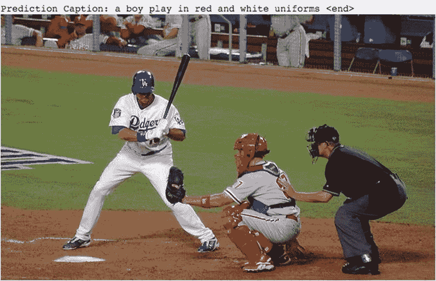

**图 10-7** 另一张带有生成描述文本的示例图像

```python
image_url = 'https://farm4.staticflickr.com/3296/2765087292_5356df67ce_z.jpg'
path = predict(image_url , 'baseball')
Image.open(path)
```

另一张图像的结果如图 10-8 所示。

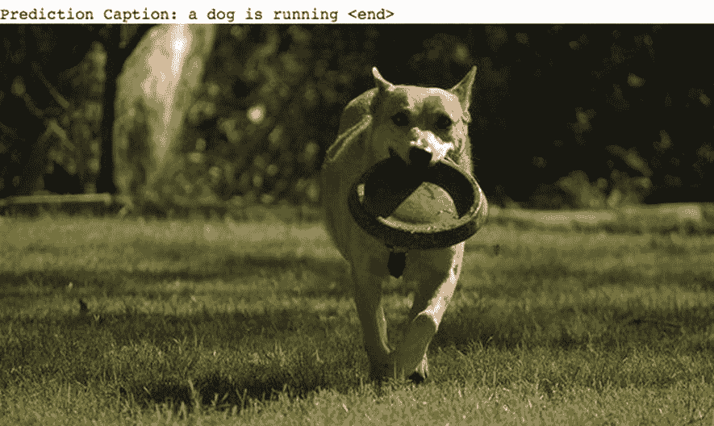

**图 10-8** 又一张带有生成描述文本的图像

```python
image_url = 'https://farm8.staticflickr.com/7139/8156048469_0847c7ce15_z.jpg'
path = predict(image_url , 'dog')
Image.open(path)
```

## 完整源代码

完整源代码见代码清单 10-2，供您随时参考。


```python
import os
import time
import pickle
import numpy as np
import tensorflow as tf
import matplotlib.pyplot as plt
from sklearn.utils import shuffle
from sklearn.model_selection import train_test_split
from tensorflow.keras.applications import InceptionV3
from os import listdir
from tqdm import tqdm
from PIL import Image
```

```bash
!wget --no-check-certificate -r 'https://drive.google.com/uc?export=download&id=1c7yGTpizf5egVD9dc3Q2lrxS8wtOAV42' -O Flickr8k_text.zip
!mkdir captions images
!unzip 'Flickr8k_text.zip' -d '/content/captions'
!wget --no-check-certificate -r 'https://drive.google.com/uc?export=download&id=1126G_E2OpvULyvTm0Kz_oMhOzv8CkiW1' -O Flickr8k_Dataset.zip
!unzip 'Flickr8k_Dataset.zip' -d '/content/images'
```

## Flickr8K 照片的位置

```python
image_dir = '/content/images/Flicker8k_Dataset'
images = listdir(image_dir)
print("Flicker8k 中 jpg 文件的数量: {}".format(len(images)))
```

## 将文档加载到内存中

```python
def load(filename):
    file = open(filename, 'r')
    text = file.read()
    file.close()
    return text

filename = '/content/captions/Flickr8k.token.txt'
doc = load(filename)
dirs = listdir('/content/images/Flicker8k_Dataset')
dirs[:5]
```

```python
def load_small(doc):
    PATH = '/content/images/Flicker8k_Dataset/'
    img_path = []
    img_id = []
    img_cap = []
    for line in doc.split('\n'):
        tokens = line.split()
        if len(line) < 2:
            continue
        image_id, image_desc = tokens[0].split('#')[0], ' '.join(tokens[1:])
        image_path = PATH + image_id
        if image_id in dirs:
            img_path.append(image_path)
            img_cap.append(image_desc)
        else:
            continue
    return img_path, img_cap

all_image_path, all_image_captions = load_small(doc)
print('图片数量: ', len(all_image_path))
all_image_path[:5]
print('描述数量: ', len(all_image_captions))
all_image_captions[:5]
```

```python
train_captions, img_name_vector = shuffle(all_image_captions, all_image_path, random_state=1)
```

```python
image_model = InceptionV3(include_top=False, weights='imagenet')
new_input = image_model.input
hidden_layer = image_model.layers[-1].output
image_features_extract_model = tf.keras.Model(new_input, hidden_layer)
```

```python
def load_image(image_path):
    img = tf.io.read_file(image_path)
    img = tf.image.decode_jpeg(img, channels=3)
    img = tf.image.resize(img, (299, 299))
    img = tf.keras.applications.inception_v3.preprocess_input(img)
    return img, image_path

encode_train = sorted(set(img_name_vector))
image_dataset = tf.data.Dataset.from_tensor_slices(encode_train)
image_dataset = image_dataset.map(load_image, num_parallel_calls=tf.data.experimental.AUTOTUNE).batch(16)

for img, path in tqdm(image_dataset):
    batch_features = image_features_extract_model(img)
    batch_features = tf.reshape(batch_features, (batch_features.shape[0], -1, batch_features.shape[3]))
    for bf, p in zip(batch_features, path):
        path_of_feature = p.numpy().decode("utf-8")
        np.save(path_of_feature, bf.numpy())
```

```python
tokenizer = tf.keras.preprocessing.text.Tokenizer(filters='!"#$%&()*+.,-/:;=?@[\]^_`{|}~ ')
tokenizer.fit_on_texts(train_captions)
max_size = len(tokenizer.word_index)
train_seqs = tokenizer.texts_to_sequences(train_captions)
train_seqs[:5]
max_length = max(len(t) for t in train_seqs)
cap_vector = tf.keras.preprocessing.sequence.pad_sequences(train_seqs, padding='post')
cap_vector[:5]
```

```python
BATCH_SIZE = 64
BUFFER_SIZE = 1000
embedding_dim = 256
units = 512
vocab_size = max_size + 1
num_steps = len(img_name_vector) // BATCH_SIZE
```

## 加载先前提取的特征

```python
def map_func(img_name, cap):
    img_tensor = np.load(img_name.decode('utf-8')+'.npy')
    return img_tensor, cap

def create_dataset(img_name_train, caption_train):
    dataset = tf.data.Dataset.from_tensor_slices((img_name_train, caption_train))
    dataset = dataset.map(lambda item1, item2: tf.numpy_function(map_func, [item1, item2], [tf.float32, tf.int32]), num_parallel_calls=tf.data.experimental.AUTOTUNE)
    dataset = dataset.shuffle(BUFFER_SIZE).batch(BATCH_SIZE).prefetch(buffer_size=tf.data.experimental.AUTOTUNE)
    return dataset

dataset = create_dataset(img_name_vector, cap_vector)
```

```python
class Inception_Encoder(tf.keras.Model):
    def __init__(self, embedding_dim):
        super(Inception_Encoder, self).__init__()
        self.fc = tf.keras.layers.Dense(embedding_dim)

    def call(self, x):
        x = self.fc(x)
        x = tf.nn.relu(x)
        return x
```

```python
class RNN_Decoder(tf.keras.Model):
    def __init__(self, embedding_dim, units, vocab_size):
        super(RNN_Decoder, self).__init__()
        self.units = units
        self.embedding = tf.keras.layers.Embedding(vocab_size, embedding_dim)
        self.gru = tf.keras.layers.GRU(self.units, return_sequences=True, return_state=True, recurrent_initializer='glorot_uniform')
        self.fc1 = tf.keras.layers.Dense(self.units)
        self.dropout = tf.keras.layers.Dropout(0.5, noise_shape=None, seed=None)
        self.batchnormalization = tf.keras.layers.BatchNormalization(axis=-1, momentum=0.99, epsilon=0.001, center=True, scale=True, beta_initializer='zeros', gamma_initializer='ones', moving_mean_initializer='zeros', moving_variance_initializer='ones', beta_regularizer=None, gamma_regularizer=None, beta_constraint=None, gamma_constraint=None)
        self.fc2 = tf.keras.layers.Dense(vocab_size)
        self.W1 = tf.keras.layers.Dense(units)
        self.W2 = tf.keras.layers.Dense(units)
        self.V = tf.keras.layers.Dense(1)

    def call(self, x, features, hidden):
        hidden_with_time_axis = tf.expand_dims(hidden, 1)
        score = tf.nn.tanh(self.W1(features) + self.W2(hidden_with_time_axis))
        attention_weights = tf.nn.softmax(self.V(score), axis=1)
        context_vector = attention_weights * features
        context_vector = tf.reduce_sum(context_vector, axis=1)
        x = self.embedding(x)
        x = tf.concat([tf.expand_dims(context_vector, 1), x], axis=-1)
        output, state = self.gru(x)
        x = self.fc1(output)
        x = tf.reshape(x, (-1, x.shape[2]))
        x = self.dropout(x)
        x = self.batchnormalization(x)
        x = self.fc2(x)
        return x, state, attention_weights

    def reset_state(self, batch_size):
        return tf.zeros((batch_size, self.units))
```

```python
encoder = Inception_Encoder(embedding_dim)
decoder = RNN_Decoder(embedding_dim, units, vocab_size)
tf.keras.utils.plot_model(encoder)
tf.keras.utils.plot_model(decoder)
```

```python
optimizer = tf.keras.optimizers.Adam()
loss_object = tf.keras.losses.SparseCategoricalCrossentropy(from_logits=True, reduction="none")

def loss_function(real, pred):
    mask = tf.math.logical_not(tf.math.equal(real, 0))
    loss_ = loss_object(real, pred)
    mask = tf.cast(mask, dtype=loss_.dtype)
    loss_ *= mask
    return tf.reduce_mean(loss_)

checkpoint_path = "./checkpoints/train"
ckpt = tf.train.Checkpoint(encoder=encoder, decoder=decoder, optimizer=optimizer)
ckpt_manager = tf.train.CheckpointManager(ckpt, checkpoint_path, max_to_keep=5)
start_epoch = 0
if ckpt_manager.latest_checkpoint:
    start_epoch = int(ckpt_manager.latest_checkpoint.split('-')[-1])
    ckpt.restore(ckpt_manager.latest_checkpoint)
ckpt.restore(tf.train.latest_checkpoint(checkpoint_path))
loss_plot = []
```

```python
def train_step(img_tensor, target):
    loss = 0
    hidden = decoder.reset_state(batch_size=target.shape[0])
    dec_input = tf.expand_dims([tokenizer.word_index['<start>']] * BATCH_SIZE, 1)
    with tf.GradientTape() as tape:
        features = encoder(img_tensor)
        for i in range(1, target.shape[1]):
            predictions, hidden, _ = decoder(dec_input, features, hidden)
            loss += loss_function(target[:, i], predictions)
            dec_input = tf.expand_dims(target[:, i], 1)
    total_loss = (loss / int(target.shape[1]))
    trainable_variables = encoder.trainable_variables + decoder.trainable_variables
    gradients = tape.gradient(loss, trainable_variables)
    optimizer.apply_gradients(zip(gradients, trainable_variables))
    return loss, total_loss

for epoch in range(start_epoch, 20):
    start = time.time()
    total_loss_train = 0
    for (batch, (img_tensor, target)) in enumerate(dataset):
        batch_loss, t_loss = train_step(img_tensor, target)
        total_loss_train += t_loss
    if epoch % 5 == 0:
        ckpt_manager.save()
    print('Epoch {} Train-Loss {:.4f}'.format(epoch + 1, (total_loss_train/num_steps)))
    print('Time taken for this epoch {} sec\n'.format(time.time() - start))
```

```python
def evaluate(image):
    hidden = decoder.reset_state(batch_size=1)
    temp_input = tf.expand_dims(load_image(image)[0], 0)
    img_tensor_val = image_features_extract_model(temp_input)
    img_tensor_val = tf.reshape(img_tensor_val, (img_tensor_val.shape[0], -1, img_tensor_val.shape[3]))
    features = encoder(img_tensor_val)
    dec_input = tf.expand_dims([tokenizer.word_index['<start>']], 0)
    result = []
    for i in range(max_length):
        predictions, hidden, attention_weights = decoder(dec_input, features, hidden)
        predicted_id = tf.random.categorical(predictions, 1)[0][0].numpy()
        result.append(tokenizer.index_word[predicted_id])
        if tokenizer.index_word[predicted_id] == '<end>':
            return result
        dec_input = tf.expand_dims([predicted_id], 0)
    return result

def predict(image_url, random_name):
    image_extension = image_url[-4:]
    image_path = tf.keras.utils.get_file('image' + random_name + image_extension, origin=image_url)
    result = evaluate(image_path)
    print('预测描述:', ' '.join(result))
    Image.open(image_path)
    return image_path
```

```python
image_url = 'https://tensorflow.org/images/surf.jpg'
path = predict(image_url, 'surfee')
Image.open(path)

image_url = 'https://farm4.staticflickr.com/3296/2765087292_5356df67ce_z.jpg'
path = predict(image_url, 'baseball')
Image.open(path)

image_url = 'https://farm8.staticflickr.com/7139/8156048469_0847c7ce15_z.jpg'
path = predict(image_url, 'dog')
Image.open(path)

image_url = 'https://farm5.staticflickr.com/4095/4910762818_b1e9022005_z.jpg'
path = predict(image_url, 'tennis')
Image.open(path)

image_url = 'https://farm3.staticflickr.com/2690/4179330518_b82897b153_z.jpg'
path = predict(image_url, 'competition')
Image.open(path)
```

**列表 10-2** 图像描述生成


