# 单变量时间序列分析

在本项目中，你将构建一个预测能源消耗的模型。为此，我们将使用 Kaggle 提供的数据集（[`www.kaggle.com/robikscube/hourly-energy-consumption`](https://www.kaggle.com/robikscube/hourly-energy-consumption)）。该数据集由 PJM Interconnection LLC 提供，包含超过 10 年的每小时能源消耗数据，单位是兆瓦。

### 创建项目

创建一个新的 Colab 项目，并将其重命名为 `Univariate – time series analysis`。导入所需的库：

```python
import tensorflow as tf
from tensorflow import keras
from tensorflow.keras import layers
import numpy as np
import pandas as pd
import matplotlib.pyplot as plt
import sklearn.preprocessing
from sklearn.metrics import r2_score
```

## 准备数据

从本书的下载页面将数据加载到项目中。

```python
url = 'https://raw.githubusercontent.com/Apress/artificial-neural-networks-with-tensorflow-2/main/ch11/DOM_hourly.csv'
df = pd.read_csv(url)
```

通过将数据打印到屏幕上来检查数据。图 11-1 显示了屏幕截图。

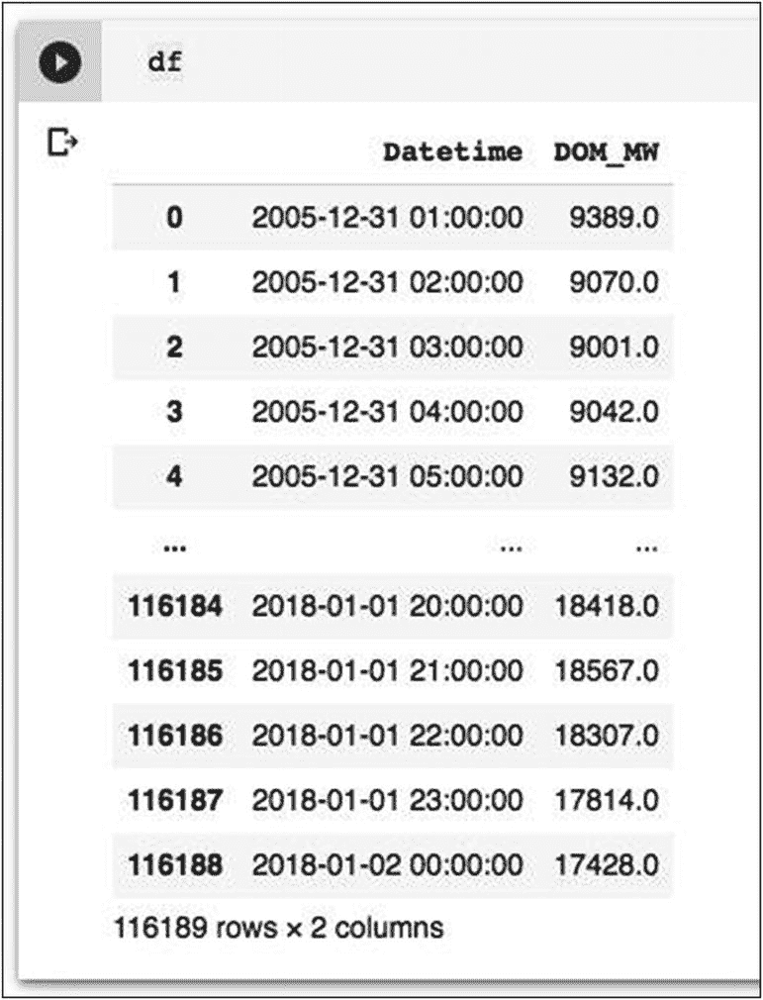

**图 11-1** 整个周期内的每小时电力消耗数据

该数据包含超过 100,000 个能耗读数。这些读数每隔一小时记录一次。数据从 2005 年开始，一直记录到 2018 年 1 月。你可以使用以下语句从中生成每日数据：

```python
### 取消注释以下行以生成每日数据
### df = df[df['Datetime'].str.contains("00:00:00")]
```

我在这里以及可下载的代码中注释掉了这行代码。最初，我们将在文件中提供的每小时数据上运行实验。稍后，你将取消注释上一行并重新运行项目以实现每周预测。这样做的目的将在本项目的末尾进行解释。

在日期时间字段上创建索引。创建索引会使日期时间列被视为日期而不是对象。

```python
df['Datetime'] = pd.to_datetime(df.Datetime, format = '%Y-%m-%d %H:%M:%S')
df.index = df.Datetime
df.drop(['Datetime'], axis = 1, inplace = True)
```

使用 `head()` 方法检查索引后的数据。

```python
df.head()
```

输出如图 11-2 所示。

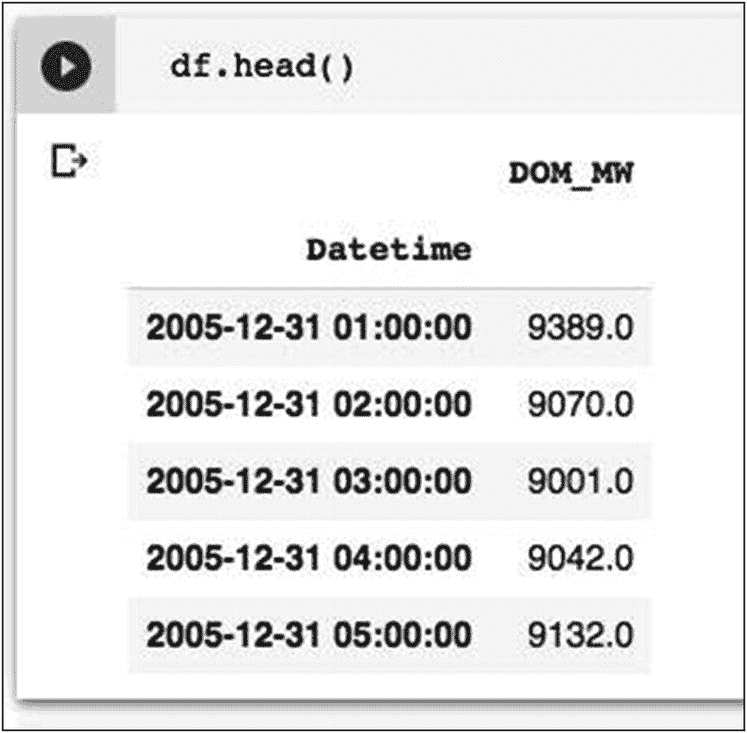

**图 11-2** 在日期时间字段上建立索引的数据

为了完整性，你可以检查数据中是否存在空值。

```python
### 检查缺失数据
df.isna().sum()
```

没有空值。

你可以通过绘制能耗与时间的关系图来观察能耗趋势。该图使用以下代码生成：

```python
#@title 日期范围
a = '2005-12-31'#@param {type:"date"}
b = '2018-01-31' #@param {type:"date"}
a = a+" 00:00:00"
b = b+" 00:00:00"
df.loc[a:b].plot(figsize = (16,4),legend = True)
plt.title('DOM 每小时电力消耗数据')
plt.ylabel('电力消耗 (MW)')
plt.show()
```

能耗图如图 11-3 所示。

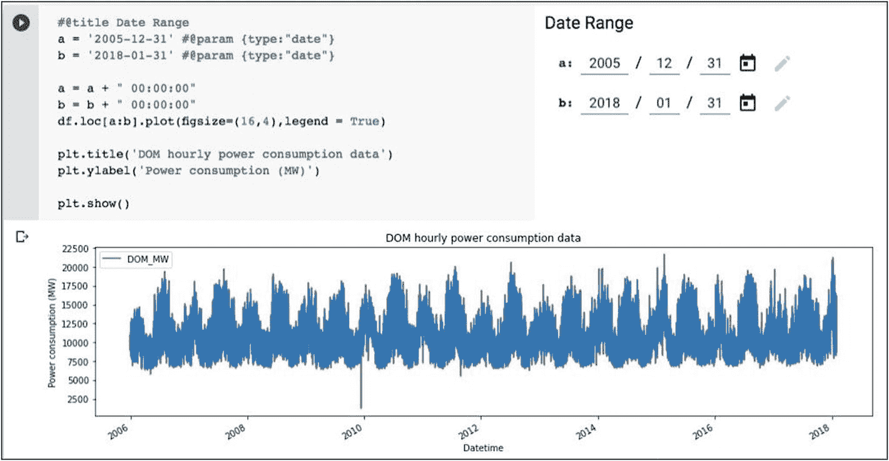

**图 11-3** 整个周期内的能耗图

如图 11-3 所示，整个周期内的消耗趋势几乎遵循统一的模式。在时间分析中，观察模式中的季节性变化非常重要。幸运的是，Colab 允许我们在运行时接受用户参数。在我们的绘图代码中，我接受开始和结束日期作为参数。你可以尝试更改这些日期，以生成更小区域的图表。图 11-4 显示了 2010 年 1 月的能耗图。

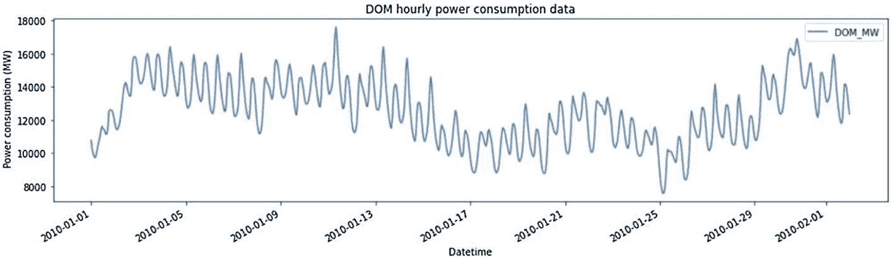

**图 11-4** 放大查看 2010 年 1 月的数据

观察趋势后，假设目标是预测 2018 年 2 月前两周的能源消耗。因此，我们需要创建一个模型，该模型使用跨越 13 年的大量数据进行训练。

在将这些数据输入模型进行训练之前，需要将数据归一化到 0 到 +1 的范围内。这可以通过使用 `sklearn` 的 `MinMaxScaler` 函数来实现。

```python
scaler = sklearn.preprocessing.MinMaxScaler()
df['DOM_MW'] = scaler.fit_transform(df['DOM_MW'].values.reshape(-1,1))
```

归一化后，你可以使用以下代码片段绘制归一化数据的图表：

```python
df.plot(figsize = (16,4), legend = True)
plt.title('DOM 每小时电力消耗数据 – 归一化后')
plt.ylabel('归一化后的电力消耗')
plt.show()
```

归一化后的数据图如图 11-5 所示。

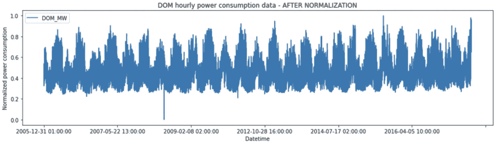

**图 11-5** 归一化后的能耗图

请注意，所有 y 值现在都介于 0 到 +1 之间。至此，数据预处理完成。你现在可以创建训练和测试数据集了。

### 创建训练/测试数据集

为了创建训练数据集，我们需要在整个数据集中创建序列。假设我们定义序列长度为 20，那么前 20 个数据点将是我们的第一个序列，第 21 个点将是我们的目标值。下一个序列将从第 1 个到第 21 个数据点，第 22 个将成为目标，依此类推。如图 11-6 所示。

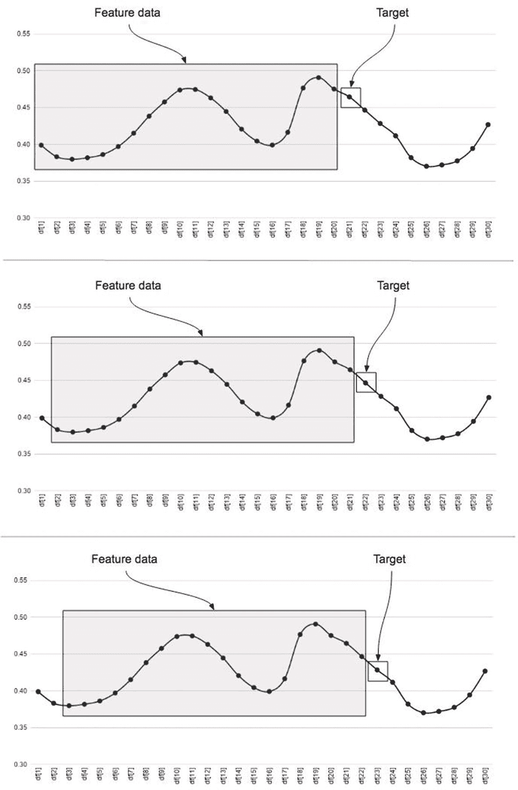

**图 11-6** 数据如何被序列化

第一个图表显示了一个包含 20 个数据点的序列，从 `df[1]` 到 `df[20]`，第 21 个是目标。下一个序列包含从 `df[2]` 到 `df[21]` 的数据点，第 22 个是目标。第三个序列包含从 `df[3]` 到 `df[22]` 的数据，第 23 个是目标。

为了创建这样的序列数据，我们声明一个名为 `load_data` 的函数，如下所示：

```python
def load_data(stock, seq_len):
```

`stock` 参数指定需要拆分为序列的数据集。`seq_len` 参数指定所需的序列长度。我在这里将序列长度作为参数传递，以便稍后你可以尝试不同的序列范围来预测短期/长期趋势。序列是使用以下 for 循环创建的：

```python
X_train = []
y_train = []
for i in range(seq_len, len(stock)):
    X_train.append(stock.iloc[i-seq_len : i, 0])
    y_train.append(stock.iloc[i, 0])
```

我们的数据集中有 116,189 个数据点。我们将使用前 90% 的数据点进行训练，其余用于测试。

```python
X_test = X_train[int(0.9*(len(stock))):]
y_test = y_train[int(0.9*(len(stock))):]
X_train = X_train[:int(0.9*(len(stock)))]
y_train = y_train[:int(0.9*(len(stock)))]
```

接下来，我们将这些数据转换为 numpy 数组。

```python
### 转换为 numpy 数组
X_train = np.array(X_train)
y_train = np.array(y_train)
X_test = np.array(X_test)
y_test = np.array(y_test)
```

我们将 numpy 数组重塑为所需的形状。

```python
### 重塑数据以输入到 RNN 模型
X_train = np.reshape(X_train, (int(0.9*(len(stock))), seq_len, 1))
X_test = np.reshape(X_test, (X_test.shape[0], seq_len, 1))
```

我们将创建的数据集返回给调用者：

```python
return [X_train, y_train, X_test, y_test]
```

完整的函数定义如清单 11-1 所示。


```python
def load_data(stock, seq_len):
    X_train = []
    y_train = []
    for i in range(seq_len, len(stock)):
        X_train.append(stock.iloc[i-seq_len : i, 0])
        y_train.append(stock.iloc[i, 0])
    X_test = X_train[int(0.9*(len(stock))):]
    y_test = y_train[int(0.9*(len(stock))):]
    X_train = X_train[:int(0.9*(len(stock)))]
    y_train = y_train[:int(0.9*(len(stock)))]
    # convert to numpy array
    X_train = np.array(X_train)
    y_train = np.array(y_train)
    X_test = np.array(X_test)
    y_test = np.array(y_test)
    # reshape data to input into RNN models
    X_train = np.reshape(X_train,
                         (X_train.shape[0], seq_len, 1))
    X_test = np.reshape(X_test,
                        (X_test.shape[0], seq_len, 1))
    return [X_train, y_train, X_test, y_test]
```
代码清单 11-1 `load_data` 函数代码

使用此函数，我们现在创建训练/测试数据集：

```python
#create train, test data
seq_len = 20 #choose sequence length
X_train, y_train, X_test, y_test = load_data(df, seq_len)
```

为了理解数据集的维度，请使用以下代码打印它们的形状：

```python
print('X_train.shape = ',X_train.shape)
print('y_train.shape = ', y_train.shape)
print('X_test.shape = ', X_test.shape)
print('y_test.shape = ',y_test.shape)
```

你将看到以下输出：

```
X_train.shape =  (104570, 20, 1)
y_train.shape =  (104570,)
X_test.shape =  (11599, 20, 1)
y_test.shape =  (11599,)
```

注意 `X_train` 和 `X_test` 的形状。两者都包含 20 个数据点的序列数据。

### 创建输入张量

我们使用以下代码创建用于将数据分批输入模型的张量：

```python
batch_size  = 256
buffer_size = 1000
train_data = tf.data.Dataset.from_tensor_slices((X_train, y_train))
train_data = train_data.cache().shuffle(buffer_size).batch(batch_size).repeat()
test_data = tf.data.Dataset.from_tensor_slices((X_test, y_test))
test_data = test_data.batch(batch_size).repeat()
```

你可能会疑惑，我们如何打乱时间序列数据？我们打乱的是窗口的位置，而不是单个窗口内的数据。通常，当你像这样打乱训练数据时，你打乱的是这些序列输入模型的顺序。这样做并不会打乱单个序列内部的数据顺序。对于无状态网络，这是可行的，因为网络的记忆不会跨序列持久化。对于有状态网络，由于评估一个序列需要记住前一个序列中发生的事件，这种打乱方式将不起作用。从本质上讲，所有 LSTM 默认都是有状态的。只有在你想将状态从一个批次维持到下一个批次时，才需要考虑选择无状态还是有状态。因此，在分批训练网络时，是否将给定的时间序列视为无状态或有状态，由你决定。

现在，我们准备构建模型。

## 构建模型

我们使用以下代码构建模型：

```python
rnn_model = tf.keras.models.Sequential([
    tf.keras.layers.LSTM(8, input_shape = X_train.shape[-2:]),
    tf.keras.layers.Dense(1)
])
```

使用以下命令绘制网络模型：

```python
tf.keras.utils.plot_model(rnn_model)
```

你将看到图 11-7 中的输出。

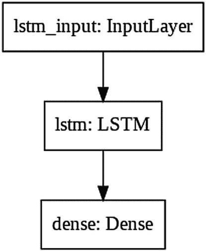

图 11-7 网络模型

注意，第一层是一个包含 20 个节点的 LSTM 输入层，接着是一个包含 8 个节点的 LSTM 层，最后是一个输出层。

## 编译与训练

我们使用模型的 `compile` 方法进行编译：

```python
rnn_model.compile(optimizer = 'adam', loss = 'mae')
```

通过调用其 `fit` 方法来训练模型。

```python
EVALUATION_INTERVAL = 200
EPOCHS = 10
rnn_model.fit(train_data, epochs = EPOCHS,
              steps_per_epoch = EVALUATION_INTERVAL,
              validation_data = test_data,
              validation_steps = 50)
```

模型完成训练后，我们对其进行性能评估。

## 评估

为了评估模型的性能，我们在测试数据上调用其 `predict` 方法。

```python
rnn_predictions = rnn_model.predict(X_test)
```

我们调用 `sklearn_metrics` 的 `r2_score` 来检查性能得分：

```python
rnn_score = r2_score(y_test, rnn_predictions)
print("R2 Score of RNN model = " + "{:.4f}".format(rnn_score))
```

你将看到以下输出：

```
R2 Score of RNN model = 0.9484
```

`R²`（决定系数）是一种回归评分。最佳可能得分为 1.0。`R²` 得分为 0.0 表示模型是常数模型，总是预测 `y` 的期望值，而忽略输入特征。在我们的案例中，该值接近 1.0，因此我们可以放心地认为模型训练良好。

现在，我们将使用以下绘图代码绘制整个测试数据集的实际值与预测值的对比图：

```python
#@title Data Range
a = 0 #@param {type:"slider", min:0, max:12000, step:1}
b = 12000 #@param {type:"slider", min:0, max:12000, step:1}
def plot_predictions(test, predicted, title):
    plt.figure(figsize = (16,4))
    plt.plot(test[a:b], color = 'blue', label = 'Normalized power consumption')
    plt.plot(predicted[a:b], alpha = 0.7, color = 'orange', label = 'Predicted power consumption')
    plt.title(title)
    plt.xlabel('Time')
    plt.ylabel('Normalized power consumption')
    plt.legend()
    plt.show()
plot_predictions(y_test, rnn_predictions, "Predictions made by simple RNN model")
```

输出如图 11-8 所示。

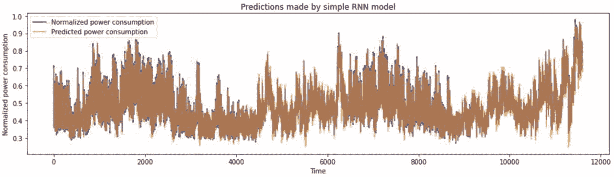

图 11-8 归一化尺度下的实际值与预测值对比图

我们看到预测值接近实际值，这意味着 RNN 模型在预测能耗方面表现良好。

你可以使用提供的滑块选择数据范围来放大图表。图 11-9 显示了窄范围下的一个示例图。

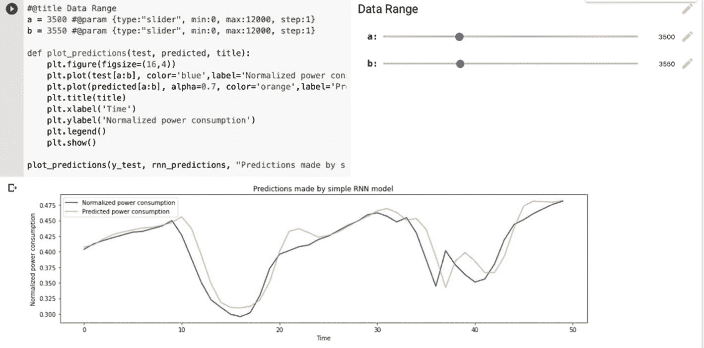

图 11-9 放大实际值与预测值对比图

预测曲线紧密跟随预期的目标值。因此，我们确信该模型即使在较小的数据范围内也能正常工作。

你可以使用以下代码放大图表的末尾，查看预测效果：

```python
history_data = list(y_test[-40:])
plottingvalues = list(history_data) + list(rnn_predictions[:50])
plt.figure(figsize = (16,4))
plt.plot(plottingvalues, color = 'orange', label = 'forecasted value', marker = 'o')
plt.plot(y_test[-40:], color = 'green', label = 'history', marker = 'x')
plt.xlabel('Time')
plt.ylabel('Normalized power consumption scale')
plt.legend()
plt.show()
```

输出如图 11-10 所示。

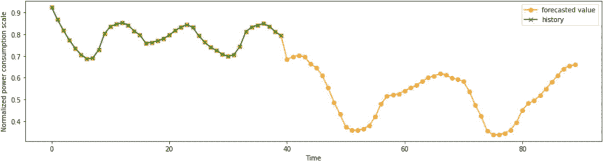

图 11-10 放大预测图表的末尾

## 预测下一个数据点

现在，我们将使用模型预测下一个数据点。为此，我们从测试数据中提取最后一个数据点，并对其应用预测函数。

```python
X = X_test[-1:]
rnn_predictions1 = rnn_model.predict(X)
```

你可以通过在控制台打印来检查预测值。命令及其输出如下所示：

```
rnn_predictions1
array([[0.798944]], dtype = float32)
```

这是我们的模型对时间戳 2018:01:02 01:00:00 的预测，因为数据集中最后一个数据点对应的时间戳是 2018:01:02 00:00:00。

为了更好地可视化结果，我将生成一个包含最后 40 个数据点以及预测值的图表。这通过以下代码片段完成：


```python
history_data = list(y_test[-40:])
plottingvalues = list(history_data)+list(rnn_predictions1)
plt.figure(figsize = (16,4))
plt.plot(plottingvalues, color = 'orange', label = 'forecasted value', marker = 'o')
plt.plot(y_test[-40:], color = 'green', label = 'history', marker = 'x')
plt.xlabel('Time')
plt.ylabel('Normalized power consumption scale')
plt.legend()
plt.show()
```

上述代码的执行结果如图 11-11 所示。

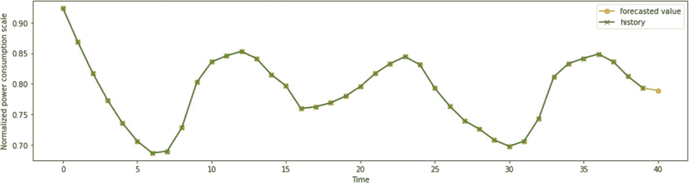

**图 11-11** 显示预测点的图表

## 预测数据点范围

通常，您可能对预测现有数据之外的时间范围内的功耗感兴趣。我们的最后一个数据点是 `2018:01:02 00:00:00` 时刻。假设您想预测接下来的 25 个数据点。这类似于多元回归。生成这些预测的技巧是，将单个预测用作下一个测试集的数据，并重复预测 25 次。我将向您展示如何使用实际代码来实现这一点。首先，我们从测试集中提取最后 40 个数据点。

```python
history_data = list(y_test[-40:])
```

然后，我们编写一个函数，在将最后一个预测添加到数据集后，构建一个新的数据集。

```python
def make_data(X, rnn_predictions1):
    val = list(X[0][1:]) + list(rnn_predictions1)
    X_new = []
    X_new.append(list(val))
    X_new = np.array(X_new)
    return X_new
```

我们将创建一个列表变量来存储所有预测结果。

```python
forecast = list()
```

我们像之前一样提取最后一个测试数据点，用于进行下一个数据点的预测。

```python
X = X_test[-1:]
```

现在，我们定义一个循环来创建测试数据，对其进行预测，然后将其添加到预测列表中。

```python
for i in range(25):
    X = make_data(X, rnn_predictions1)
    rnn_predictions1 = rnn_model.predict(X)
    forecast += list(rnn_predictions1)
```

最后，我们绘制包含历史数据和接下来 25 个预测的所有数据点。

```python
plottingvalues = list(history_data) + list(forecast)
plt.figure(figsize=(16,4))
plt.plot(plottingvalues, color = 'orange', label = 'forecasted value', marker = 'o')
plt.plot(y_test[-40:], color = 'green', label = 'history', marker = 'x')
plt.xlabel('Time (ticks)')
plt.ylabel('Normalized power consumption scale')
plt.legend()
plt.show()
```

上述代码生成的图表如图 11-12 所示。

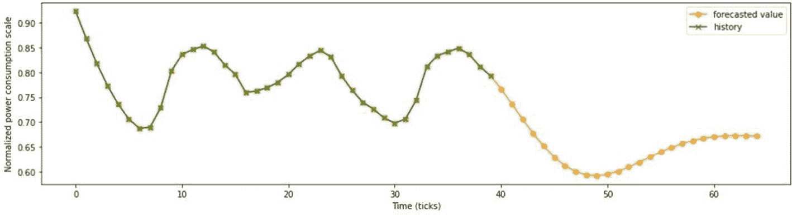

**图 11-12** 扩展预测图

好的，您已经能够预测接下来几个小时的能源消耗。然而，当您拥有过去 13 年的数据时，您可能更感兴趣的是预测接下来一周或几周的消耗量。使用我之前展示的外推技术可能无法很好地完成这项任务。现在，我们可以尝试在每日数据上训练模型，以便通过外推法预测未来 25 天的消耗量。

请记住，我们已经编写了提取每日消耗数据的代码。只需取消注释下面这行代码即可，这里再次展示以便您快速回顾。

```python
### uncomment the following line for generating daily data
### df = df[df['Datetime'].str.contains("00:00:00")]
```

现在，重置环境并运行整个项目。2018 年 1 月 1 日（我们的最后一个数据点）之后一周的消耗预测图如图 11-13 所示。

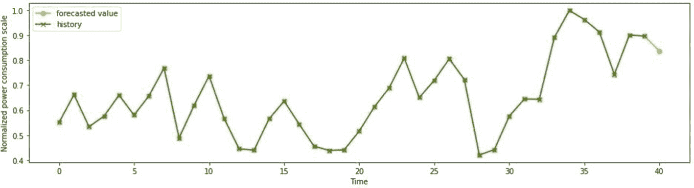

**图 11-13** 下一周的预测

2018 年 1 月 31 日之后 25 周的外推预测如图 11-14 所示。

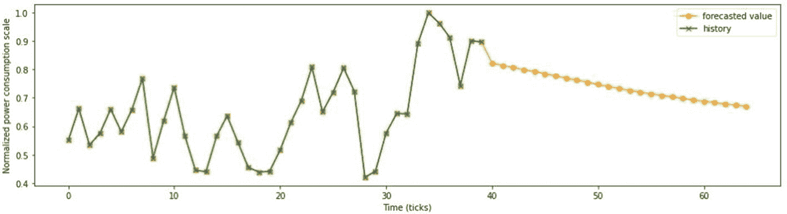

**图 11-14** 25 周的外推预测

要获得不同的预测结果，您需要进行多次此类实验，包括更改 ANN 配置（增加层数、使用 `SimpleRNN`、使用 dropout 等）、增加训练轮数、尝试周度和月度数据集等。由于未来无法以确定的精度进行预测，您需要从这些实验中选择最合适的预测结果。

## 完整源代码

完整的程序代码如代码清单 11-2 所示。


```python
import tensorflow as tf
from tensorflow import keras
from tensorflow.keras import layers
import numpy as np
import pandas as pd
import matplotlib.pyplot as plt
import sklearn.preprocessing
from sklearn.metrics import r2_score
url = 'https://raw.githubusercontent.com/Apress/artificial-neural-networks-with-tensorflow-2/main/ch11/DOM_hourly.csv' df = pd.read_csv(url)
df
### 取消下面一行的注释以生成每日数据
#df = df[df['Datetime'].str.contains("00:00:00")]
df['Datetime'] = pd.to_datetime(df.Datetime
format = '%Y-%m-%d %H:%M:%S')
df.index = df.Datetime
df.drop(['Datetime'], axis = 1,inplace = True)
df.head()
df
#检查缺失数据
df.isna().sum()
#@title 日期范围
a = '2005-12-31' #@param {type:"date"}
b = '2018-01-31' #@param {type:"date"}
a = a + " 00:00:00"
b = b + " 00:00:00"
df.loc[a:b].plot(figsize = (16,4),legend = True)
plt.title('DOM 每小时电力消耗数据')
plt.ylabel('电力消耗 (MW)')
plt.show()
df.shape
scaler = sklearn.preprocessing.MinMaxScaler()
df['DOM_MW'] = scaler.fit_transform(df['DOM_MW'].
values.reshape(-1,1))
df.plot(figsize = (16,4), legend = True)
plt.title('DOM 每小时电力消耗数据 – 归一化后')
plt.ylabel('归一化电力消耗')
plt.show()
def load_data(stock, seq_len):
X_train = []
y_train = []
for i in range(seq_len, len(stock)):
X_train.append(stock.iloc[i-seq_len : i, 0])
y_train.append(stock.iloc[i, 0])
X_test = X_train[int(0.9*(len(stock))):]
y_test = y_train[int(0.9*(len(stock))):]
X_train = X_train[:int(0.9*(len(stock)))]
y_train = y_train[:int(0.9*(len(stock)))]
### 转换为 numpy 数组
X_train = np.array(X_train)
y_train = np.array(y_train)
X_test = np.array(X_test)
y_test = np.array(y_test)
### 重塑数据以输入 RNN 模型
X_train = np.reshape(X_train,
(X_train.shape[0], seq_len, 1))
X_test = np.reshape(X_test,
(X_test.shape[0], seq_len, 1))
return [X_train, y_train, X_test, y_test]
#创建训练、测试数据
seq_len = 20 #选择序列长度
X_train, y_train, X_test, y_test = load_data
(df, seq_len)
print('X_train.shape = ',X_train.shape)
print('y_train.shape = ', y_train.shape)
print('X_test.shape = ', X_test.shape)
print('y_test.shape = ',y_test.shape)
batch_size  = 256
buffer_size = 1000
train_data = tf.data.Dataset.from_tensor_slices
((X_train  y_train))
train_data = train_data.cache().shuffle(buffer_size).
batch(batch_size).repeat()
test_data = tf.data.Dataset.from_tensor_slices
((X_test  y_test))
test_data = test_data.batch(batch_size).repeat()
rnn_model = tf.keras.models.Sequential([
tf.keras.layers.LSTM(8, input_shape =
X_train.shape[-2:]),
tf.keras.layers.Dense(1)
])
tf.keras.utils.plot_model(rnn_model)
rnn_model.compile(optimizer = 'adam', loss = 'mae')
EVALUATION_INTERVAL = 200
EPOCHS = 10
rnn_model.fit(train_data, epochs=EPOCHS,
steps_per_epoch =
EVALUATION_INTERVAL,
validation_data = test_data,
validation_steps = 50)
rnn_predictions = rnn_model.predict(X_test)
rnn_score = r2_score(y_test,rnn_predictions)
print("RNN 模型的 R2 分数 = "
+"{:.4f}".format(rnn_score));
#@title 数据范围
a = 0 #@param {type:"slider", min:0,
max:12000, step:1}
b = 12000 #@param {type:"slider", min:0,
max:12000, step:1}
def plot_predictions(test, predicted, title):
plt.figure(figsize = (16,4))
plt.plot(test[a:b], color = 'blue',
label = '归一化电力消耗')
plt.plot(predicted[a:b], alpha = 0.7,
color = 'orange',
label = '预测电力消耗')
plt.title(title)
plt.xlabel('时间')
plt.ylabel('归一化电力消耗')
plt.legend()
plt.show()
plot_predictions(y_test, rnn_predictions,
"简单 RNN 模型的预测结果")
history_data = list(y_test[-40:])
plottingvalues = list(history_data)+
list(rnn_predictions[:50])
plt.figure(figsize = (16,4))
plt.plot(plottingvalues, color = 'orange',
label = '预测值',marker = 'o')
plt.plot(y_test[-40:], color = 'green',
label = '历史值',marker = 'x')
plt.xlabel('时间')
plt.ylabel('归一化电力消耗标度')
plt.legend()
plt.show()
X = X_test[-1:]
rnn_predictions1 = rnn_model.predict(X)
rnn_predictions1
history_data = list(y_test[-40:])
plottingvalues = list(history_data)+
list(rnn_predictions1)
plt.figure(figsize = (16,4))
plt.plot(plottingvalues, color = 'orange',
label = '预测值',marker = 'o')
plt.plot(y_test[-40:], color = 'green',
label = '历史值',marker = 'x')
plt.xlabel('时间')
plt.ylabel('归一化电力消耗标度')
plt.legend()
plt.show()
history_data = list(y_test[-40:])
def make_data(X,rnn_predictions1):
val = list(X[0][1:])+list(rnn_predictions1)
X_new = []
X_new.append(list(val))
X_new = np.array(X_new)
return X_new
forecast = list()
X = X_test[-1:]
for i in range (25):
X = make_data(X,rnn_predictions1)
rnn_predictions1 = rnn_model.predict(X)
forecast += list(rnn_predictions1)
plottingvalues = list(history_data)+list(forecast)
plt.figure(figsize = (16,4))
plt.plot(plottingvalues, color = 'orange',
label = '预测值',marker = 'o')
plt.plot(y_test[-40:], color = 'green',
label = '历史值',marker = 'x')
plt.xlabel('时间（刻度）')
plt.ylabel('归一化电力消耗标度')
plt.legend()
plt.show()
清单 11-2
Univariate-time.ipynb
```


接下来我将讲解如何开发一个用于执行多变量分析的模型。

## 多变量时间序列分析

在本节中，我将介绍如何创建一个多变量时间序列分析的机器学习模型。为此，你将使用 Kaggle 提供的伦敦共享单车数据集（[`www.kaggle.com/hmavrodiev/london-bike-sharing-dataset`](https://www.kaggle.com/hmavrodiev/london-bike-sharing-dataset)）。该数据集提供了特定时间点的共享单车数量以及相应的天气状况。可以观察到，单车需求量也具有季节性。我们模型的目标是综合考虑所有这些变量，来预测未来的单车需求量。数据集中各列的描述如下：

1.  `timestamp`
2.  `cnt` – 共享单车数量
3.  `t1` – 实际温度（摄氏度）
4.  `t2` – “体感”温度（摄氏度）
5.  `hum` – 湿度（百分比）
6.  `wind_speed` – 风速（公里/小时）
7.  `weather_code` – 天气类别
8.  `is_holiday` – 布尔值，1 表示节假日
9.  `is_weekend` – 布尔值，1 表示周末
10. `season` – 分类值：0-春季，1-夏季，2-秋季，3-冬季

`cnt` 列将作为我们的预测目标。其余所有列都可以用作特征。因此，这是一个多变量问题，目标值取决于其他九个字段的值。

### 创建项目

创建一个 Colab 项目，并将其重命名为 `Multivariate time series analysis`。像往常一样导入所需的库：

```python
import numpy as np
import pandas as pd
import tensorflow as tf
import matplotlib.pyplot as plt
import sklearn.preprocessing
import seaborn as sns
```

## 准备数据

使用以下代码将数据加载到项目中：

```python
url = 'https://raw.githubusercontent.com/Apress/artificial-neural-networks-with-tensorflow-2/main/ch11/london_merged.csv'
df = pd.read_csv(url, parse_dates=['timestamp'], index_col="timestamp")
```

与之前的示例类似，我们将把 `timestamp` 列用作日期而非对象。检查数据。截图如图 11-15 所示。

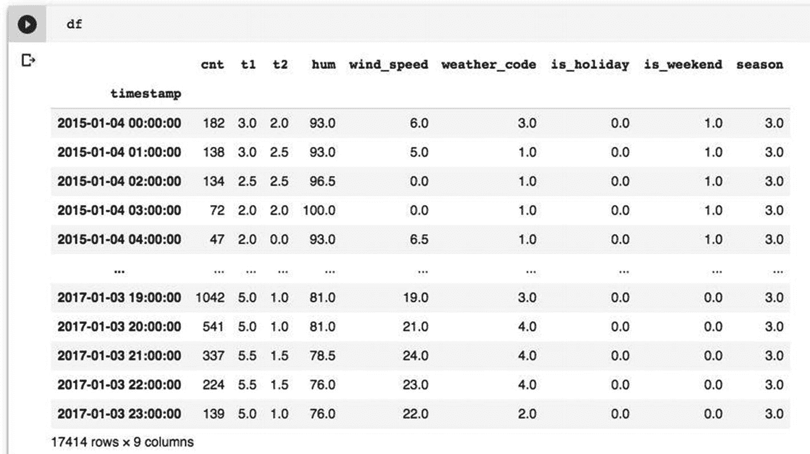

**图 11-15** 多变量时间序列分析的数据

如你所见，共有 17,414 条记录和 9 列。请注意，我们已从数据集中移除了 `timestamp` 列，并将其用作索引。

我们将通过调用 `dftypes` 方法来检查数据类型。输出如图 11-16 所示。

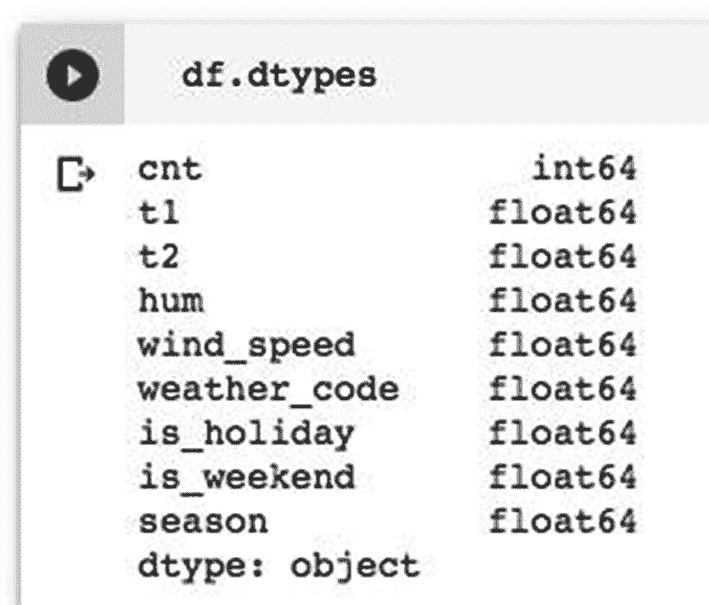

**图 11-16** 共享单车数据库中的数据类型

我们所有的特征列都是数值类型。但是，像 `weather_code` 和 `season` 这样的列使用了分类值。`is_holiday` 和 `is_weekend` 列包含布尔值。当我们对所有数值进行标准化缩放时，不应缩放这些列。

## 检查平稳性

现在我们将检查分析中的所有列是否平稳。平稳序列是指其属性——均值、方差和协方差——不随时间变化的序列。要使序列平稳，其特征值的模应小于 1。Johansen 检验可用于检查最多 12 个时间序列之间的协整性。在当前数据集中，我们有九个时间序列，因此无需在编码中做任何额外准备即可轻松应用此检验。我们使用以下代码进行检验：

```python
#检查平稳性
from statsmodels.tsa.vector_ar.vecm import coint_johansen
johan_test_temp = df
coint_johansen(johan_test_temp, -1, 1).eig
```

运行检验时，它会打印所有九列的特征值，如下所示：

```
array([2.61219379e-01, 1.31970167e-01, 5.22046139e-02, 4.19830465e-02, 2.10126207e-02, 1.75450605e-02, 1.36518877e-02, 6.26085775e-04, 7.56291478e-05])
```


