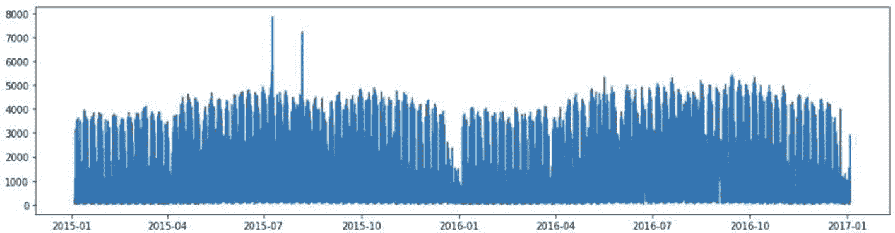
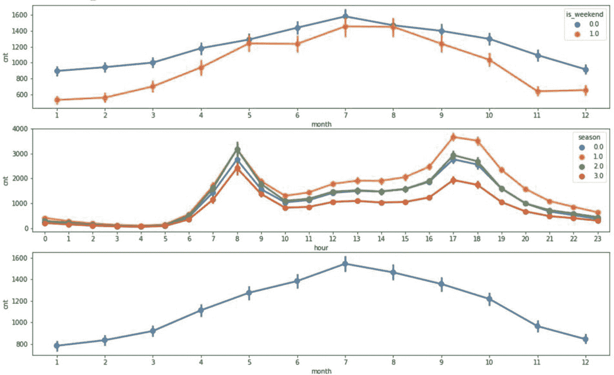
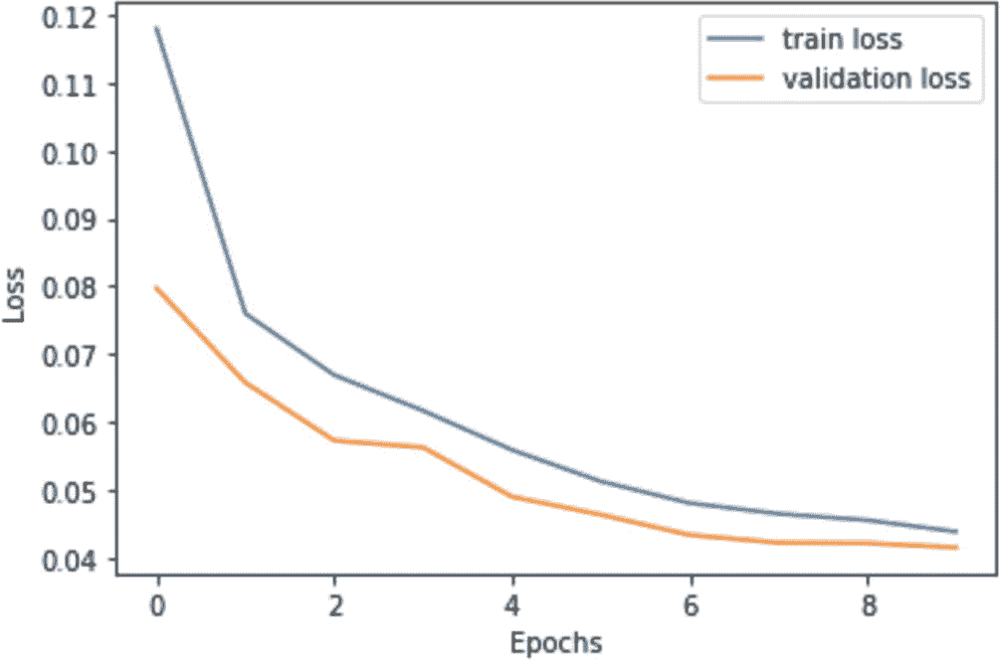
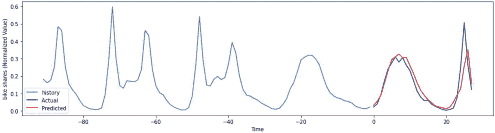
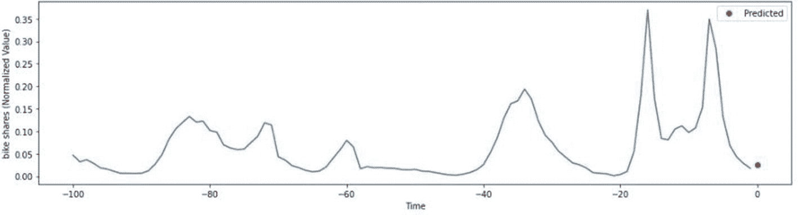
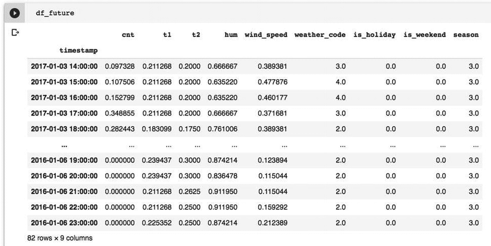
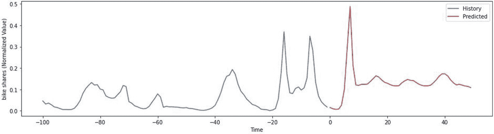

# 特征值与数据探索

所有特征值均小于 1，表明所有测试的时间序列都是平稳的。如果发现非平稳序列，需要检查列表以确定是哪个序列导致了问题。

## 数据探索

现在，我们将探索几个特征列和目标值，以了解其分布。我们从`cnt`列开始，该列代表自行车共享数量，是本次分析中的目标值。我们使用以下代码行绘制`cnt`分布：

```python
plt.figure(figsize = (16,4))
plt.plot(df.index, df["cnt"]);
```

分布如图 11-17 所示。



**图 11-17** 整个时期的自行车共享数据分布

看起来需求在整个时期内是均匀分布的。现在，让我们检查需求分布是否存在季节性变化。我们将首先为聚合的每小时和每月数据创建索引。

```python
### create indexes
df['hour'] = df.index.hour
df['month'] = df.index.month
```

然后，我们使用上述索引创建三个图表，以观察周末、节假日和季节性需求。我们使用以下绘图代码生成这些图表：

```python
fig,(ax1, ax2, ax3)= plt.subplots(nrows = 3)
fig.set_size_inches(16, 10)
sns.pointplot(data = df, x = 'month', y = 'cnt',
hue = 'is_weekend', ax = ax1)
sns.pointplot(data = df, x = 'hour', y = 'cnt',
hue = 'season', ax = ax2);
sns.pointplot(data = df, x = 'month', y = 'cnt',
ax = ax3)
```

输出如图 11-18 所示。



**图 11-18** 自行车共享的季节性依赖关系

第一个图表显示了周末和工作日期间一年中每个月的自行车共享聚合数据。可以清楚地看到，无论是否为周末，每年 7 月的需求都更高。第二个图表显示了数据库中列出的四个分类季节（0-春季，1-夏季，2-秋季，3-冬季）中，一天中每个小时的聚合需求。在每个季节，您都会观察到早上（8 点）和晚上（5-6 点）的需求更高。最后，最后一个图表显示了不考虑周末、节假日或季节的月度聚合需求。它显示 7 月份的需求更高，而 1 月至 12 月期间的需求最低。

了解了需求模式后，我们现在继续进行数据清洗和准备。

## 数据准备

我们使用`MinMaxScaler`缩放所有数值列：

```python
### scaling numeric columns
scaler = sklearn.preprocessing.MinMaxScaler()
df['t1'] = scaler.fit_transform(df['t1'].
values.reshape(-1,1))
df['t2'] = scaler.fit_transform(df['t2'].
values.reshape(-1,1))
df['hum'] = scaler.fit_transform(df['hum'].
values.reshape(-1,1))
df['wind_speed'] = scaler.fit_transform
(df['wind_speed'].values.reshape(-1,1))
df['cnt'] = scaler.fit_transform
(df['cnt'].values.reshape(-1,1))
```

请注意，我们已从该预处理中排除了包含分类值和布尔值的列。

我们将使用 90%的数据进行训练，其余 10%用于测试。

```python
### use 90% for training
train_size = int(len(df) * 0.9)
test_size = len(df) - train_size
train, test = df.iloc[0:train_size],
df.iloc[train_size:len(df)]
```

现在，我们将创建用于向网络输入数据的张量。为此，我们编写一个名为`create_dataset`的函数，该函数将用于训练和测试数据集。

```python
def create_dataset(X, y, time_steps = 1):
Xs, ys = [], []
for i in range(len(X) - time_steps):
v = X.iloc[i:(i + time_steps)].values
Xs.append(v)
ys.append(y.iloc[i + time_steps])
return np.array(Xs), np.array(ys)
```

使用序列长度 10，我们创建训练和测试数据集。

```python
time_steps = 10
X_train, y_train =
create_dataset(train, train.cnt, time_steps)
X_test, y_test =
create_dataset(test, test.cnt, time_steps)
```

我们切片数据集并创建数据批次以改进训练：

```python
batch_size  = 256
buffer_size = 1000
train_data = tf.data.Dataset.from_tensor_slices
((X_train  y_train))
train_data = train_data.cache().shuffle
(buffer_size).batch(batch_size).repeat()
test_data = tf.data.Dataset.from_tensor_slices
((X_test  y_test))
test_data = test_data.batch(batch_size).repeat()
```

## 创建模型

我们使用以下代码定义网络模型：

```python
simple_lstm_model = tf.keras.models.Sequential([
tf.keras.layers.LSTM
(8, input_shape = X_train.shape[-2:]),
tf.keras.layers.Dense(1)
])
simple_lstm_model.compile
(optimizer = 'adam', loss = 'mae')
```

该模型与上一个示例中使用的模型类似。

## 训练

我们像往常一样通过调用其`fit`方法来训练模型。

```python
EVALUATION_INTERVAL = 200
EPOCHS = 10
history = simple_lstm_model.fit(
train_data,
epochs = EPOCHS,
steps_per_epoch = EVALUATION_INTERVAL,
validation_data = test_data,
validation_steps = 50)
```

训练结束后，我们使用以下代码绘制损失：

```python
### plot losses
plt.plot(history.history['loss'],
label = 'train loss')
plt.plot(history.history['val_loss'],
label = 'validation loss')
plt.xlabel("Epochs")
plt.ylabel("Loss")
plt.legend()
```

输出图如图 11-19 所示。



**图 11-19** 损失指标

损失在第三个 epoch 之后开始趋于平稳。没有观察到过拟合。因此，我们对模型的训练感到满意。现在，让我们评估其在测试数据上的性能。

## 评估

我们通过调用测试数据上的`predict`方法来评估性能。

```python
X_test,y_test = create_dataset(df,df.cnt,10)
y_pred = simple_lstm_model.predict(X_test)
```

现在，我们将绘制预测结果以获得一些可视化。编写一个小函数来创建指定长度的时间步长：

```python
def create_time_steps(length):
return list(range(-length, 0))
```

然后，我们使用以下代码进行绘图：

```python
plt.figure(figsize = (16,4))
num_in = create_time_steps(91)
num_out = 28
plt.plot(num_in,y_train[15571:],label = 'history')
plt.plot(np.arange(num_out),
y_test[15661:15689], 'b',label='Actual ')
plt.plot(np.arange(num_out),
y_pred[15661:15689], 'r',label = 'Predicted')
plt.xlabel("Time")
plt.ylabel("bike shares (Normalized Value)")
plt.legend()
plt.show()
```

该图如图 11-20 所示。



**图 11-20** 自行车共享的实际值与预测值

## 预测未来点

模型评估完成后，我们现在将预测未来的下一个自行车共享数量。我们通过一个简单的语句进行此预测：

```python
y_pred = simple_lstm_model.predict(X_test[-1:])
```

我们打印预测值：

```python
### print value
y_pred
```

控制台上的输出应类似于：

```
array([[0.03246454]], dtype = float32)
```

现在，我们将绘制此预测，以了解该数据点的位置。我们使用以下代码生成图表：

```python
### plot prediction
plt.figure(figsize = (16,4))
num_in = create_time_steps(100)
num_out = 1
plt.plot(num_in,y_test[-100:])
plt.plot(np.arange(num_out),y_pred, 'ro',
label = 'Predicted')
plt.xlabel("Time")
plt.ylabel("bike shares (Normalized Value)")
plt.legend()
plt.show()
```

该图如图 11-21 所示。



**图 11-21** 下一个数据点的自行车共享预测


## 预测数据点范围

我们对未来数据点的预测看起来不错。我们能否对多个数据点进行预测？让我们尝试一下。

## 预测数据点范围

测试集中最后一个数据点是 2017 年 1 月 3 日 23:00:00。我们想要预测从 2017 年 1 月 4 日 00:00:00 开始，接下来 100 个点（按小时计）的需求。我们需要这一时期的特征数据。所以，我要做的是先从测试数据集中选取一些条目。

```
df2 = df['2017-01-03 14:00:00':'2017-01-03 23:00:00']
```

在上述语句中，`df2`现在将包含从 2017 年 1 月 3 日 14:00:00 到 2017 年 1 月 3 日 23:00:00 的测试数据。因此，本质上我选取了数据集的最后十个数据点。

现在，我将从原始数据集中选取过去一年的特征数据。

```
df1 =  df['2016-01-04 00:00:00':'2016-01-06 23:00:00']
```

注意，我选取的是从 2016 年 1 月 4 日 00:00:00 开始，接下来 3 天的数据。我们将`cnt`字段设置为零。

```
df1['cnt'] = 0
```

我们现在通过将这些过去的数据追加到当前数据中来创建一个新的数据框：

```
df_future = df2.append(df1, sort = False)
```

你可以通过打印`df_future`的内容来检查数据：

```
df_future
```

输出结果如图 11-22 所示。



**图 11-22** 用于预测的新数据集

如你所见，时间戳存在不连续性。对于我们的分析来说，这并不重要。为了整洁起见，你可以使用以下语句直接删除索引：

```
#df_future  = df_future.reset_index(drop = True)
```

现在，我们在一个连续循环中进行预测，每次将预测值添加到`df_future`数据框中。执行此操作的`for`循环如下所示：

```
predictions = []
### make prediction in a loop every time adding the last prediction
for i in range(50):
X_f, y_f = create_dataset
(df_future, df_future.cnt, time_steps)
y_pred = simple_lstm_model.predict(X_f[i:i+1])
df_future['cnt'][i+10] = y_pred
predictions.append(float(y_pred[0][0]))
```

我只使用了 50 次迭代；你可以遍历我们创建的全部数据。

你可以打印`predictions`数组来检查所有预测值。更好的是，我们可以通过使用以下代码创建图表来可视化预测结果：

```
plt.figure(figsize = (16,4))
num_in = create_time_steps(100)
num_out = 50
plt.plot(num_in,y_test[-100:],label = 'History')
plt.plot(np.arange(num_out),predictions, 'r',
label = 'Predicted')
plt.xlabel("Time")
plt.ylabel("bike shares (Normalized Value)")
plt.legend()
plt.show()
```

生成的图表如图 11-23 所示。



**图 11-23** 自行车共享数据的几周预测

至此，我们完成了关于如何为多变量时间序列分析创建深度神经网络模型的讨论。请注意，统计模型有标准的实现可用。例如，`statsmodels`库中有一个`VAR`（向量自回归）模型，可以按如下代码使用：

```
from statsmodels.tsa.vector_ar.var_model import VAR
model = VAR(endog = train)
result = model.fit()
```

一旦训练数据拟合到模型中，就可以通过调用其`forecast`方法进行预测。

```
prediction = result.forecast(validation_data.y,
steps = len(valid))
```

随着神经网络的出现，你可能不再需要理解这种复杂统计建模背后的数学原理。让神经网络自行学习并为我们进行预测。

## 完整源代码

完整的程序代码如代码清单 11-3 所示。


```python
import numpy as np
import pandas as pd
import tensorflow as tf
import matplotlib.pyplot as plt
import sklearn.preprocessing
import seaborn as sns
url = 'https://raw.githubusercontent.com/Apress/artificial-neural-networks-with-tensorflow-2/main/ch11/london_merged.csv' df = pd.read_csv(url,parse_dates=['timestamp'], index_col="timestamp")
df
df.dtypes
#检查平稳性
from statsmodels.tsa.vector_ar.vecm
import coint_johansen
johan_test_temp = df
coint_johansen(johan_test_temp,-1,1).eig
plt.figure(figsize = (16,4))
plt.plot(df.index, df["cnt"]);
### 创建索引
df['hour'] = df.index.hour
df['month'] = df.index.month
fig,(ax1, ax2, ax3) = plt.subplots(nrows = 3)
fig.set_size_inches(16, 10)
sns.pointplot(data = df, x = 'month',
y = 'cnt', hue = 'is_weekend', ax = ax1)
sns.pointplot(data = df, x = 'hour',
y = 'cnt', hue = 'season', ax = ax2);
sns.pointplot(data = df, x = 'month',
y = 'cnt', ax = ax3)
### 缩放数值列
scaler = sklearn.preprocessing.MinMaxScaler()
df['t1'] = scaler.fit_transform(df['t1'].values.reshape(-1,1))
df['t2'] = scaler.fit_transform
(df['t2'].values.reshape(-1,1))
df['hum'] = scaler.fit_transform
(df['hum'].values.reshape(-1,1))
df['wind_speed'] = scaler.fit_transform
(df['wind_speed'].values.reshape(-1,1))
df['cnt'] = scaler.fit_transform
(df['cnt'].values.reshape(-1,1))
### 使用 90%的数据进行训练
train_size = int(len(df) * 0.9)
test_size = len(df) - train_size
train, test = df.iloc[0:train_size],
df.iloc[train_size:len(df)]
def create_dataset(X, y, time_steps = 1):
Xs, ys = [], []
for i in range(len(X) - time_steps):
v = X.iloc[i:(i + time_steps)].values
Xs.append(v)
ys.append(y.iloc[i + time_steps])
return np.array(Xs), np.array(ys)
### 创建输入张量
time_steps = 10
X_train, y_train = create_dataset
(train, train.cnt, time_steps)
X_test, y_test = create_dataset
(test, test.cnt, time_steps)
batch_size  = 256
buffer_size = 1000
train_data = tf.data.Dataset.from_tensor_slices
((X_train  y_train))
train_data = train_data.cache().shuffle
(buffer_size).batch(batch_size).repeat()
test_data = tf.data.Dataset.from_tensor_slices
((X_test  y_test))
test_data = test_data.batch(batch_size).repeat()
simple_lstm_model = tf.keras.models.Sequential([
tf.keras.layers.LSTM(8, input_shape =
X_train.shape[-2:]),
tf.keras.layers.Dense(1)
])
simple_lstm_model.compile(optimizer = 'adam',
loss = 'mae')
EVALUATION_INTERVAL = 200
EPOCHS = 10
history = simple_lstm_model.fit(
train_data,
epochs = EPOCHS,
steps_per_epoch = EVALUATION_INTERVAL,
validation_data = test_data,
validation_steps = 50)
### 绘制损失曲线
plt.plot(history.history['loss'],
label = '训练损失')
plt.plot(history.history['val_loss'],
label = '验证损失')
plt.xlabel("轮次")
plt.ylabel("损失")
plt.legend()
X_test,y_test = create_dataset(df,df.cnt,10)
y_pred = simple_lstm_model.predict(X_test)
def create_time_steps(length):
return list(range(-length, 0))
plt.figure(figsize = (16,4))
num_in = create_time_steps(91)
num_out = 28
plt.plot(num_in,y_train[15571:],label = '历史数据')
plt.plot(np.arange(num_out),
y_test[15661:15689], 'b',label='实际值 ')
plt.plot(np.arange(num_out),
y_pred[15661:15689], 'r',label = '预测值')
plt.xlabel("时间")
plt.ylabel("共享单车数量（归一化值）")
plt.legend()
plt.show()
y_pred = simple_lstm_model.predict(X_test[-1:])
### 打印数值
y_pred
### 绘制预测图
plt.figure(figsize = (16,4))
num_in = create_time_steps(100)
num_out = 1
plt.plot(num_in,y_test[-100:])
plt.plot(np.arange(num_out),y_pred, 'ro',
label ='预测值')
plt.xlabel("时间")
plt.ylabel("共享单车数量（归一化值）")
plt.legend()
plt.show()
df2 = df['2017-01-03 14:00:00':'2017-01-03 23:00:00']
df1 =  df
['2016-01-04 00:00:00':'2016-01-06 23:00:00']
df1['cnt'] = 0
df_future = df2.append(df1, sort = False)
### 删除索引并非必需操作
#df_future  = df_future.reset_index(drop = True)
df_future
predictions = []
### 在循环中每次添加最后一个预测值进行预测
for i in range(50):
X_f, y_f = create_dataset
(df_future, df_future.cnt, time_steps)
y_pred = simple_lstm_model.predict(X_f[i:i+1])
df_future['cnt'][i+10] = y_pred
predictions.append(float(y_pred[0][0]))
predictions
plt.figure(figsize = (16,4))
num_in = create_time_steps(100)
num_out = 50
plt.plot(num_in,y_test[-100:],label = '历史数据')
plt.plot(np.arange(num_out),predictions, 'r',
label = '预测值')
plt.xlabel("时间")
plt.ylabel("共享单车数量（归一化值）")
plt.legend()
plt.show()
清单 11-3
多变量时间序列.ipynb
```


