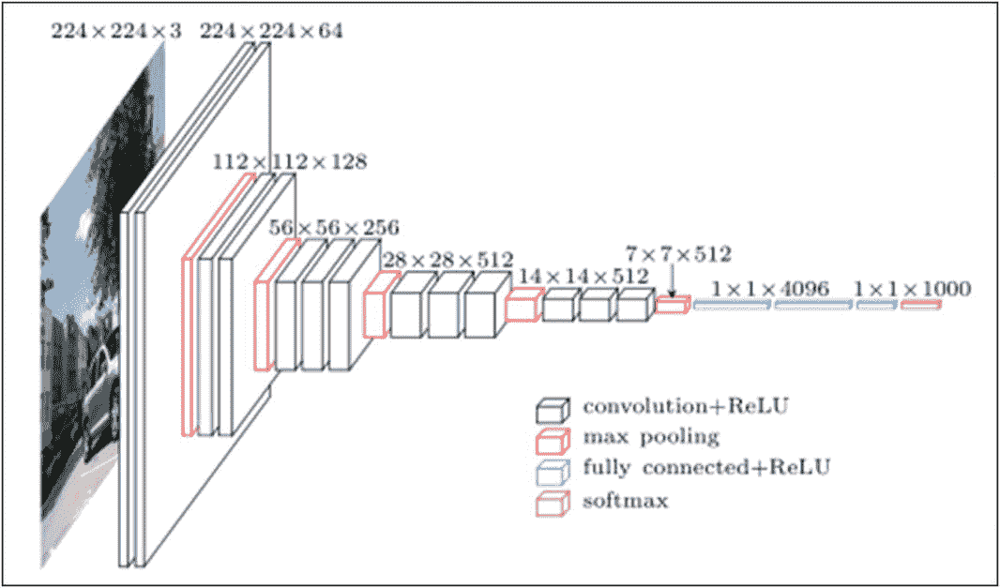
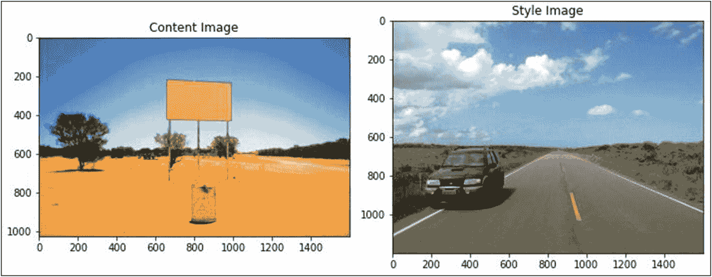
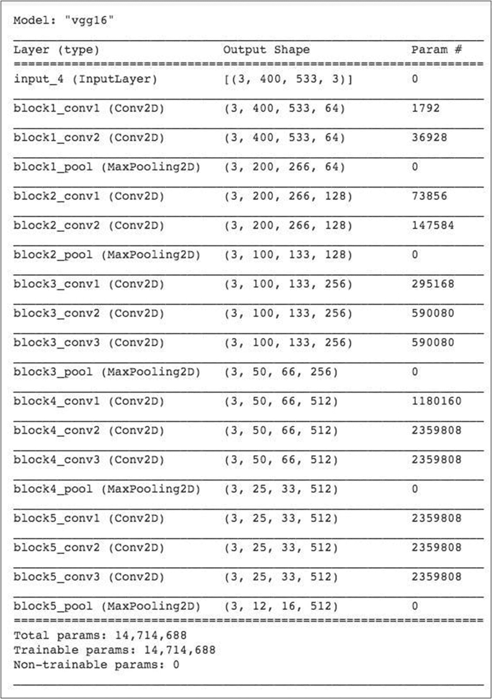
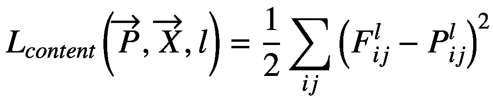
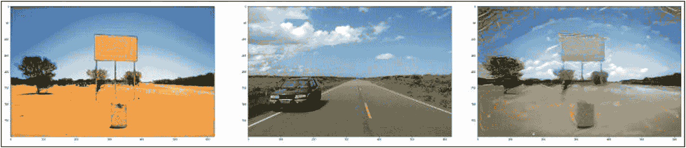

# 使用 VGG16 进行风格迁移

`Gatys 等人 (2015)` 提出了风格迁移背后的核心思想。其核心思想是，用于图像分类的预训练 CNN（卷积神经网络）能够编码图像的感知和语义信息。目前世界上有许多这样的预训练 CNN 可供使用。我们将使用 `VGG16` 来提取图像的特征，然后分别处理其内容和风格。原始论文使用了来自 `Simonyan 和 Zisserman (2015)` 的 19 层 VGG 网络模型。`VGG16` 模型架构如图 12-5 所示。



**图 12-5** VGG16 架构（图片来源：[researchgate.net](https://www.researchgate.net)）

由于我们不是在进行图像分类，而只对特征提取感兴趣，因此我们不需要 VGG 网络的全连接层或最终的 softmax 分类器。我们只需要模型的一部分。那么，我们如何只提取模型的特定部分呢？幸运的是，这对我们来说是一项非常简单的任务，因为 Keras 提供了一个预训练的 `VGG16` 模型，你可以从中分离出各层。Keras 还提供了许多其他模型，包括后来的 `VGG19`。要移除顶部的全连接层，你需要在提取模型层时将 `include_top` 变量的值设置为 `False`。

### 创建项目

创建一个新的 Colab 项目，并将其重命名为 `CustomStyleTransfer`。安装以下两个包：

```
!pip install keras==2.3.1
!pip install tensorflow==2.1.0
```

**注意：** 在发布时发现，本项目使用的预训练 `VGG16` 模型在上述指定的 Keras 和 TensorFlow 版本下运行，并且截至撰写本文时，尚不支持更新的版本。

导入所需的库。

```
import tensorflow as tf
import re
import urllib
from tensorflow.keras.preprocessing.image import load_img, img_to_array
from matplotlib import pyplot as plt
from IPython import display
from PIL import Image
import numpy as np
from tensorflow.keras.applications import vgg16
from tensorflow.keras import backend as K
from keras import backend as K
from scipy.optimize import fmin_l_bfgs_b
```

## 下载图像

与之前的项目一样，你需要编写一个下载函数并调用它来下载本项目所需的两张图像。代码如代码清单 12-3 所示。

```
def download_image_from_URL(imageURL):
    imageName = re.search('[a-z0-9\-]+\.(jpe?g|png|gif|bmp|JPG)', imageURL, re.IGNORECASE)
    imageName = imageName.group(0)
    urllib.request.urlretrieve(imageURL, imageName)
    imagePath = "./" + imageName
    return imagePath

### 这是你想要转换的目标图像的路径。
target_url = "https://raw.githubusercontent.com/Apress/artificial-neural-networks-with-tensorflow-2/main/ch12/blank-sign.jpg"
target_path = download_image_from_URL(target_url)

### 这是风格图像的路径。
style_url = "https://raw.githubusercontent.com/Apress/artificial-neural-networks-with-tensorflow-2/main/ch12/road.jpg"
```

**代码清单 12-3** 下载图像的函数

我们将目标图像缩放为高度 400 像素。为了保持宽高比，我们按如下方式重新计算宽度：

```
width, height = load_img(target_path).size
img_height = 400
img_width = int(width * img_height / height)
```

## 显示图像

为了显示这两张图像，我们使用与上一个项目类似的代码。代码如代码清单 12-4 所示。

```
content = Image.open(target_path)
style = Image.open(style_path)

plt.figure(figsize=(10, 10))
plt.subplot(1, 2, 1)
plt.imshow(content)
plt.title('内容图像')
plt.subplot(1, 2, 2)
plt.imshow(style)
plt.title('风格图像')
plt.tight_layout()
plt.show()
```

**代码清单 12-4** 显示内容和风格图像

输出如图 12-6 所示。



**图 12-6** 内容和风格图像

## 预处理图像

如前所述，你将使用 `VGG16` 模型来提取图像中的特征。我们需要根据 VGG 训练过程来处理图像数据。幸运的是，Keras 不仅为 `VGG16` 提供了这种预处理，还为许多其他流行模型（如 ResNet、Inception、DenseNet 等）提供了预处理。该库提供了一个名为 `preprocess_input` 的函数，该函数接受一个编码了一批图像的张量或 numpy 数组作为输入，并返回一个预处理后的 numpy 数组或类型为 `float32` 的 `tf.tensor`。该方法将图像从 RGB 转换为 BGR，并对每个通道进行零中心化。请注意，VGG 网络是在每个通道均值为 `[103.939, 116.779, 123.68]` 且通道顺序为 BGR（蓝/绿/红）的图像上训练的。代码清单 12-5 中的代码对给定图像执行此预处理。

```
def preprocess_image(image_path):
    img = load_img(image_path, target_size=(img_height, img_width))
    img = img_to_array(img)
    img = np.expand_dims(img, axis=0)
    img = tf.keras.applications.vgg16.preprocess_input(img)
    return img
```

**代码清单 12-5** 为 VGG16 网络预处理图像

如果你希望查看输出，我们需要进行反向预处理。此外，我们必须将所有值裁剪到 0–255 范围内。我们在以下函数定义中执行此操作：

```
def deprocess_image(x):
    # 通过均值像素移除零中心化
    x[:, :, 0] += 103.939
    x[:, :, 1] += 116.779
    x[:, :, 2] += 123.68
    # 'BGR' -> 'RGB'
    x = x[:, :, ::-1]
    x = np.clip(x, 0, 255).astype('uint8')
    return x
```

现在，你将基于 `VGG16` 模型构建模型。

### 模型构建

为了构建模型，我们将图像张量数据输入 `VGG16`，并提取特征图、内容表示和风格表示。模型将加载预训练的 ImageNet 权重。模型构建代码如下所示：

```
target = K.constant(preprocess_image(target_path))
style = K.constant(preprocess_image(style_path))

### 这个占位符将包含我们生成的图像
combination_image = K.placeholder((1, img_height, img_width, 3))

### 我们将三张图像合并成一个批次
input_tensor = K.concatenate([target, style, combination_image], axis=0)

### 使用我们的三张图像批次作为输入来构建 VGG16 网络。
model = vgg16.VGG16(input_tensor=input_tensor, weights='imagenet', include_top=False)
```

在这段代码中，我们首先通过调用之前定义的 `preprocess` 方法来构建内容和风格图像的输入张量。我们为目标图像创建一个占位符，然后通过调用 `concatenate` 方法为三张图像创建一个张量。然后将其作为参数传递给 `VGG16` 方法，以提取我们所需的模型。

现在，你可以查看模型摘要。

```
model.summary()
```

摘要输出如图 12-7 所示。



**图 12-7** 模型摘要

## 内容损失

我们将在每个期望的层计算内容损失，并将它们相加。在每次迭代中，我们将输入图像馈送到模型。模型将正确计算所有内容损失，并且由于我们使用的是即时执行模式，所有梯度也将被计算。内容损失表示随机生成的噪声图像 (G) 与内容图像 (C) 的相似程度。内容损失的计算方式如下。

假设我们选择预训练网络（VGG 网络）中的一个隐藏层 (L) 来计算损失。令 P 和 F 分别代表原始图像和生成的图像。令 `F[l]` 和 `P[l]` 为层 L 中各自图像的特征表示。那么，内容损失定义如下：




我们将内容损失的公式编码如下：

```
def content_loss(base, combination):
    return K.sum(K.square(combination - base))
```

## 风格损失

为了计算风格损失，我们首先需要计算 Gram 矩阵。Gram 矩阵是一个额外的预处理步骤，用于找出不同通道之间的相关性，这些相关性随后将用于衡量风格本身。

我们定义 Gram 矩阵如下：

```
def gram_matrix(x):
    features = K.batch_flatten(K.permute_dimensions(x, (2, 0, 1)))
    gram = K.dot(features, K.transpose(features))
    return gram
```

风格损失会计算风格图像和生成图像的 Gram 矩阵，然后将代价返回给调用者。该代价是风格图像的 Gram 矩阵与生成图像的 Gram 矩阵之差的平方。用数学公式表示如下：

![$$ {L}_{GM}\left(S,G,l\right)=\frac{1}{4{N}_l²{M}_l²}\sum \limits_{ij}{\left( GM\left[l\right]{(S)}_{ij}- GM\left[l\right]{(G)}_{ij}\right)}² $$](images/495303_1_En_12_Chapter/495303_1_En_12_Chapter_TeX_Equb.png)

风格损失函数的定义如下：

```
def style_loss(style, combination):
    S = gram_matrix(style)
    C = gram_matrix(combination)
    channels = 3
    size = img_height * img_width
    return K.sum(K.square(S - C)) / (4. * (channels ** 2) * (size ** 2))
```

## 总变差损失

为了对输出进行正则化以实现平滑，我们定义了相邻像素的总变差损失，如下所示：

```
def total_variation_loss(x):
    a = K.square(x[:, :img_height - 1, :img_width - 1, :] - x[:, 1:, :img_width - 1, :])
    b = K.square(x[:, :img_height - 1, :img_width - 1, :] - x[:, :img_height - 1, 1:, :])
    return K.sum(K.pow(a + b, 1.25))
```

## 计算内容和风格的损失

我们首先选择 VGG16 的内容层和风格层。我使用了 Johnson 等人（2016）定义的层，而不是 Gatys 等人（2015）建议的层，因为这样能产生更好的最终结果。

首先，我们将所有层映射到一个字典中。

```
### 将层名称映射到激活张量的字典
outputs_dict = dict([(layer.name, layer.output) for layer in model.layers])
```

我们提取内容层：

```
### 用于内容损失的层名称
content_layer = 'block5_conv2'
```

我们提取风格层：

```
### 用于风格损失的层名称列表
style_layers = ['block1_conv1', 'block2_conv1', 'block3_conv1', 'block4_conv1', 'block5_conv1']
```

我们定义几个权重变量，用于计算损失分量的加权平均值。可以将它们视为风格层和内容层的超参数，决定这些层在最终模型中的权重。

```
total_variation_weight = 1e-4
style_weight = 10.
content_weight = 0.025
```

我们通过添加所有分量来计算总损失。

```
### 通过将所有分量添加到一个 `loss` 变量中来定义损失
loss = K.variable(0.)
layer_features = outputs_dict[content_layer]
target_features = layer_features[0, :, :, :]
combination_features = layer_features[2, :, :, :]
loss = loss + content_weight * content_loss(target_features, combination_features)
for layer_name in style_layers:
    layer_features = outputs_dict[layer_name]
    style_reference_features = layer_features[1, :, :, :]
    combination_features = layer_features[2, :, :, :]
    sl = style_loss(style_reference_features, combination_features)
    loss += (style_weight / len(style_layers)) * sl
loss += total_variation_weight * total_variation_loss(combination_image)
```

## 评估器类

最后，我们将定义一个名为 `Evaluator` 的类，用于在一次传递中计算损失和梯度。

```
grads = K.gradients(loss, combination_image)[0]
### 用于获取当前损失值和当前梯度值的函数
fetch_loss_and_grads = K.function([combination_image], [loss, grads])

class Evaluator(object):
    def __init__(self):
        self.loss_value = None
        self.grads_values = None

    def loss(self, x):
        assert self.loss_value is None
        x = x.reshape((1, img_height, img_width, 3))
        outs = fetch_loss_and_grads([x])
        loss_value = outs[0]
        grad_values = outs[1].flatten().astype('float64')
        self.loss_value = loss_value
        self.grad_values = grad_values
        return self.loss_value

    def grads(self, x):
        assert self.loss_value is not None
        grad_values = np.copy(self.grad_values)
        self.loss_value = None
        self.grad_values = None
        return grad_values

evaluator = Evaluator()
```

## 生成输出图像

现在我们已经准备好了所有实用函数，是时候生成风格化图像了。我们从一组随机像素（一张随机图像）开始，并使用 L-BFGS（有限内存 Broyden-Fletcher-Goldfarb-Shanno）算法进行优化。该算法使用二阶导数来最小化或最大化函数，并且比标准梯度下降法快得多。训练循环如下所示：

```
iterations = 50
x = preprocess_image(target_path)
x = x.flatten()
for i in range(1, iterations):
    x, min_val, info = fmin_l_bfgs_b(evaluator.loss, x, fprime=evaluator.grads, maxfun=10)
    print('Iteration %0d, loss: %0.02f' % (i, min_val))
img = x.copy().reshape((img_height, img_width, 3))
img = deprocess_image(img)
```

训练结束时，我们将最终输出图像复制到一个变量中，并重新处理它，使其准备好显示。

## 显示图像

我们现在使用以下代码显示所有三张图像：

```
plt.figure(figsize=(50, 50))
plt.subplot(3,3,1)
plt.imshow(load_img(target_path, target_size=(img_height, img_width)))
plt.subplot(3,3,2)
plt.imshow(load_img(style_path, target_size=(img_height, img_width)))
plt.subplot(3,3,3)
plt.imshow(img)
plt.show()
```

输出图像如图 12-8 所示。



**图 12-8** 内容图像、风格图像和风格化图像

## 完整源代码

`CustomStyleTransfer` 的完整源代码见代码清单 12-6。


```python
!pip install keras==2.3.1
!pip install tensorflow==2.1.0
import tensorflow as tf
import re
import urllib
from tensorflow.keras.preprocessing.image import load_img, img_to_array
from matplotlib import pyplot as plt
from IPython import display
from PIL import Image
import numpy as np
from tensorflow.keras.applications import vgg16
from tensorflow.keras import backend as K
from keras import backend as K
from scipy.optimize import fmin_l_bfgs_b

def download_image_from_URL(imageURL):
    imageName = re.search('[a-z0-9\-]+\.(jpe?g|png|gif|bmp|JPG)', imageURL, re.IGNORECASE)
    imageName = imageName.group(0)
    urllib.request.urlretrieve(imageURL, imageName)
    imagePath = "./" + imageName
    return imagePath

### 这是你想要转换的图片路径。
target_url = "https://raw.githubusercontent.com/Apress/artificial-neural-networks-with-tensorflow-2/main/ch12/blank-sign.jpg"
target_path = download_image_from_URL(target_url)

### 这是风格图片的路径。
style_url = "https://raw.githubusercontent.com/Apress/artificial-neural-networks-with-tensorflow-2/main/ch12/road.jpg"
style_path = download_image_from_URL(style_url)

### 生成图片的尺寸。
width, height = load_img(target_path).size
img_height = 400
img_width = int(width * img_height / height)

content = Image.open(target_path)
style = Image.open(style_path)

plt.figure(figsize=(10, 10))
plt.subplot(1, 2, 1)
plt.imshow(content)
plt.title('内容图片')
plt.subplot(1, 2, 2)
plt.imshow(style)
plt.title('风格图片')
plt.tight_layout()
plt.show()

### 根据 VGG16 的要求预处理数据
def preprocess_image(image_path):
    img = load_img(image_path, target_size=(img_height, img_width))
    img = img_to_array(img)
    img = np.expand_dims(img, axis=0)
    img = tf.keras.applications.vgg16.preprocess_input(img)
    return img

def deprocess_image(x):
    # 通过均值像素去除零中心化
    x[:, :, 0] += 103.939
    x[:, :, 1] += 116.779
    x[:, :, 2] += 123.68
    # 'BGR' -> 'RGB'
    x = x[:, :, ::-1]
    x = np.clip(x, 0, 255).astype('uint8')
    return x

target = K.constant(preprocess_image(target_path))
style = K.constant(preprocess_image(style_path))

### 这个占位符将包含我们生成的图片
combination_image = K.placeholder((1, img_height, img_width, 3))

### 我们将三张图片合并成一个批次
input_tensor = K.concatenate([target, style, combination_image], axis=0)

### 以包含三张图片的批次作为输入，构建 VGG16 网络。
model = vgg16.VGG16(input_tensor=input_tensor, weights='imagenet', include_top=False)
model.summary()

### 计算生成图片的内容损失
def content_loss(base, combination):
    return K.sum(K.square(combination - base))

def gram_matrix(x):
    features = K.batch_flatten(K.permute_dimensions(x, (2, 0, 1)))
    gram = K.dot(features, K.transpose(features))
    return gram

def style_loss(style, combination):
    S = gram_matrix(style)
    C = gram_matrix(combination)
    channels = 3
    size = img_height * img_width
    return K.sum(K.square(S - C)) / (4. * (channels ** 2) * (size ** 2))

def total_variation_loss(x):
    a = K.square(x[:, :img_height - 1, :img_width - 1, :] - x[:, 1:, :img_width - 1, :])
    b = K.square(x[:, :img_height - 1, :img_width - 1, :] - x[:, :img_height - 1, 1:, :])
    return K.sum(K.pow(a + b, 1.25))

### 将层名称映射到激活张量的字典
outputs_dict = dict([(layer.name, layer.output) for layer in model.layers])

### 用于内容损失的层名称
content_layer = 'block5_conv2'

### 用于风格损失的层名称；
style_layers = ['block1_conv1', 'block2_conv1', 'block3_conv1', 'block4_conv1', 'block5_conv1']

### 损失分量加权平均中的权重
total_variation_weight = 1e-4
style_weight = 10.
content_weight = 0.025

### 通过将所有分量添加到 `loss` 变量来定义损失
loss = K.variable(0.)
layer_features = outputs_dict[content_layer]
target_features = layer_features[0, :, :, :]
combination_features = layer_features[2, :, :, :]
loss = loss + content_weight * content_loss(target_features, combination_features)

for layer_name in style_layers:
    layer_features = outputs_dict[layer_name]
    style_reference_features = layer_features[1, :, :, :]
    combination_features = layer_features[2, :, :, :]
    sl = style_loss(style_reference_features, combination_features)
    loss += (style_weight / len(style_layers)) * sl

loss += total_variation_weight * total_variation_loss(combination_image)

grads = K.gradients(loss, combination_image)[0]

### 用于获取当前损失值和当前梯度值的函数
fetch_loss_and_grads = K.function([combination_image], [loss, grads])

class Evaluator(object):
    def __init__(self):
        self.loss_value = None
        self.grads_values = None

    def loss(self, x):
        assert self.loss_value is None
        x = x.reshape((1, img_height, img_width, 3))
        outs = fetch_loss_and_grads([x])
        loss_value = outs[0]
        grad_values = outs[1].flatten().astype('float64')
        self.loss_value = loss_value
        self.grad_values = grad_values
        return self.loss_value

    def grads(self, x):
        assert self.loss_value is not None
        grad_values = np.copy(self.grad_values)
        self.loss_value = None
        self.grad_values = None
        return grad_values

evaluator = Evaluator()

iterations = 50
x = preprocess_image(target_path)
x = x.flatten()

for i in range(1, iterations):
    x, min_val, info = fmin_l_bfgs_b(evaluator.loss, x, fprime=evaluator.grads, maxfun=10)
    print('迭代次数 %0d，损失值: %0.02f' % (i, min_val))

img = x.copy().reshape((img_height, img_width, 3))
img = deprocess_image(img)

plt.figure(figsize=(50, 50))
plt.subplot(3,3,1)
plt.imshow(load_img(target_path, target_size=(img_height, img_width)))
plt.subplot(3,3,2)
plt.imshow(load_img(style_path, target_size=(img_height, img_width)))
plt.subplot(3,3,3)
plt.imshow(img)
plt.show()

列表 12-6
CustomStyleTransfer 完整源代码
```


