# 13. 图像生成

你是否曾想象过神经网络可用于生成复杂的彩色图像？动漫呢？名人面孔呢？卧室呢？听起来是不是很有趣？所有这些都可以通过神经网络中最有趣的概念——生成对抗网络（GAN）来实现。这一概念由伊恩·J·古德费洛于 2014 年提出并发展。GAN 生成的图像看起来非常逼真，以至于几乎无法区分真假图像。需要提醒的是，要生成如此复杂的图像，你需要大量资源来训练网络，但正如你在学习本章时会看到的，它确实有效。那么，让我们来看看什么是 GAN。

## GAN – 生成对抗网络

在 GAN 中，有两个神经网络模型通过对抗过程同时训练。一个网络称为生成器，另一个称为判别器。生成器（艺术家）学习创建看起来真实的图像。判别器（评论家）学习区分真实图像和伪造图像。因此，这是两个相互竞争的模型，试图击败对方。最终，如果你能训练生成器超越判别器，你就实现了目标。

## GAN 如何工作？

正如我所说，GAN 由两个网络组成。训练 GAN 需要两个步骤：

1.  保持生成器空闲，训练判别器。在真实图像上训练判别器若干个周期，看它是否能正确地将它们预测为真实图像。在同一训练阶段，在伪造图像（由生成器生成）上训练判别器，看它是否能将它们预测为伪造图像。
2.  保持判别器空闲，训练生成器。利用判别器对伪造图像的预测结果来改进这些图像。

重复上述步骤大量周期，并手动检查结果（伪造图像）是否看起来真实。如果看起来真实，则停止训练。如果不真实，则继续上述两个步骤，直到伪造图像看起来真实为止。

整个过程如图 13-1 所示。

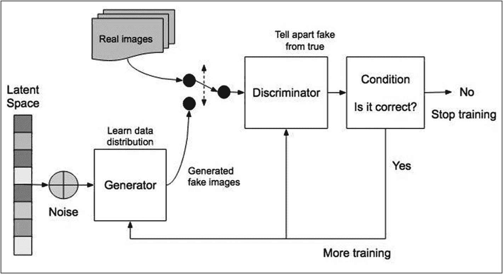

**图 13-1** GAN 工作原理示意图

### 生成器

生成器示意图如图 13-2 所示。

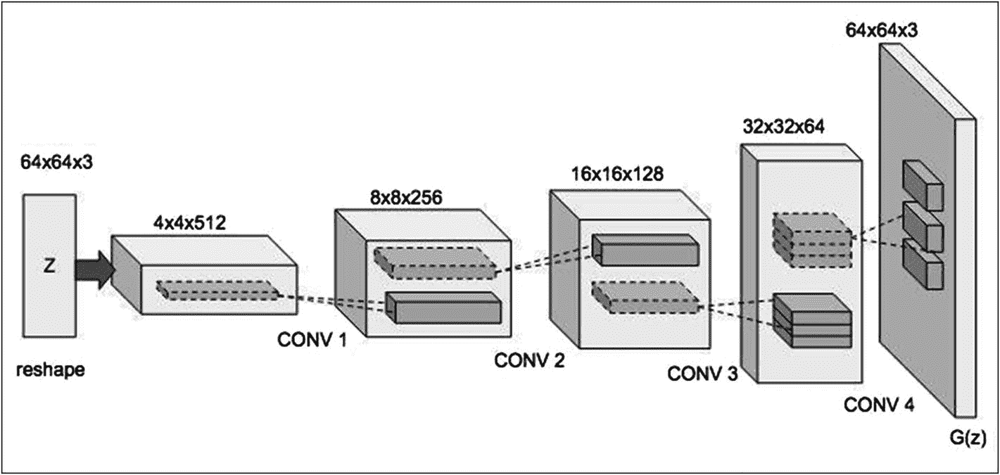

**图 13-2** 生成器架构

生成器接收一个具有一定维度的随机噪声向量。在我们的示例中，我们将使用 100 维。从这个随机向量中，它生成一个 64x64x3 的图像。图像通过一系列卷积层转换进行上采样。每个卷积转置层之后都跟着一个批归一化和一个带泄露的 ReLU。带泄露的 ReLU 既没有梯度消失问题，也没有 ReLU 死亡问题。带泄露的 ReLU 试图修复“ReLU 死亡”问题。ReLU 会获得一个 0.01 左右的小值，而不是消亡为 0。我们在每个卷积层中使用步长以避免不稳定的训练。注意，在每次卷积时，图像是如何被上采样以创建最终的 64x64x3 图像的。

### 判别器

判别器示意图如图 13-3 所示。

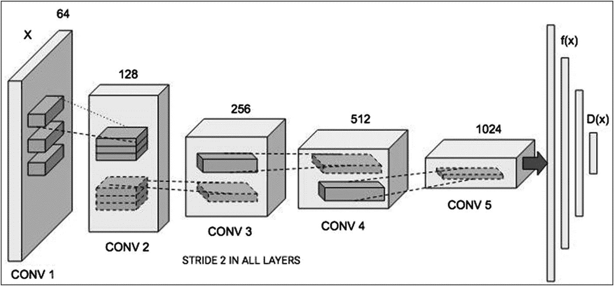

**图 13-3** 判别器架构

判别器也使用卷积层，并对给定图像进行下采样以进行评估。

### 数学公式

GAN 的工作原理可以用下面给出的简单数学公式表示：

![$$ \frac{\mathit{\min}}{G}\frac{\mathit{\max}}{D}V\left(D,G\right)=\frac{\mathit{\min}}{G}\frac{\mathit{\max}}{D}\left({E}_{z\sim {P}_{data}(x)}\left[ logD(x)\right]+{E}_{z\sim {P}_z(z)}\left[\mathit{\log}\left(1-D\left(G(z)\right)\right)\right]\right) $$](images/495303_1_En_13_Chapter/495303_1_En_13_Chapter_TeX_Equa.png)

其中`G`代表生成器，`D`代表判别器。`data(x)`代表真实数据的分布，`pz`代表生成数据或伪造数据的分布。`x`代表来自真实数据的样本，`z`代表来自生成数据的样本。`D(x)`代表判别器网络，`G(z)`代表生成器网络。

在真实数据上训练时的判别器损失表示为


(1)

在来自生成器的伪造数据上训练时的判别器损失表示为

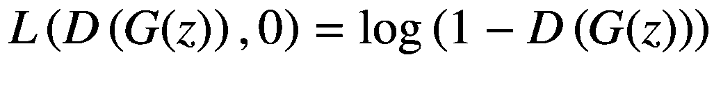

(2)

对于真实数据，判别器的预测应接近 1。因此，应最大化方程 1 以使`D(x)`接近 1。第一个方程是真实数据上的判别器损失，应最大化以使`D(G(z))`接近 1。因为第二个方程是伪造数据上的判别器损失，所以也应最大化。注意，log 是一个递增函数。对于第二个方程，判别器对生成的伪造数据的预测应接近零。为了最大化第二个方程，我们必须将`D(G(z))`的值最小化到零。因此，我们需要最大化判别器的两个损失。判别器的总损失是方程 1 和 2 给出的两个损失之和。因此，组合后的总损失也将被最大化。

生成器损失表示为

![$$ {L}^{(G)}=\mathit{\min}\left[\mathit{\log}\left(D(x)\right)+\mathit{\log}\left(1-D\left(G(z)\right)\right)\right] $$](images/495303_1_En_13_Chapter/495303_1_En_13_Chapter_TeX_Equ3.png)

(3)

在生成器训练期间，我们需要最小化这个损失。

## 数字生成

在这个项目中，我们将使用 Kaggle 提供的流行 MNIST 数据集。如你所知，该数据集包含手写数字的图像。我们将创建一个 GAN 模型来生成与这些图像看起来相同的额外图像。这可能有助于某些人在未来的开发中增加训练数据集的大小。

### 创建项目

创建一个 Colab 项目并将其重命名为`DigitGen-GAN`。导入所需的库。


```python
import matplotlib.pyplot as plt
import tensorflow as tf
import numpy as np
import time
from tensorflow import keras
from tensorflow.keras import layers
import os
```

## 加载数据集

使用以下语句将数据集加载到代码中：

```python
(train_images,train_labels),
(test_images,test_labels) =
tf.keras.datasets.mnist.load_data()
```

训练和测试数据集被分别加载到独立的 `numpy` 数组中。由于我们只对生成单个数字（例如 9）感兴趣，因此将从训练数据集中提取所有包含数字 9 的图像。

```python
digit9_images = []
for i in range(len(train_images)):
if train_labels[i] == 9:
digit9_images.append(train_images[i])
train_images = np.array(digit9_images)
train_images.shape
```

形状为 `(5949, 28, 28)`。因此，我们有 5949 张 28x28 大小的图像。这是一个庞大的数据集。我们的模型将尝试生成同样大小的图像，并匹配这些图像的外观。

你可以通过以下代码在终端打印几张图像，验证是否只包含数字 9 的图像：

```python
n = 10
f = plt.figure()
for i in range(n):
f.add_subplot(1, n, i + 1)
plt.subplot(1, n, i+1 ).axis("off")
plt.imshow(train_images[i])
plt.show()
```

你将看到如图 13-4 所示的输出。

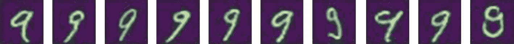

**图 13-4** 样本图像

现在，我们将准备用于训练的数据集。

## 准备数据集

首先，使用以下语句对数据进行重塑；请注意，数据集中图像的大小为 28x28 像素。

```python
train_images = train_images.reshape (
train_images.shape[0], 28, 28, 1).astype
('float32')
```

由于图像中每个颜色值的范围是 0 到 256，我们将这些值归一化到 -1 到 1 的范围内，以便更好地学习。平均值为 127.5，因此以下公式将值归一化到 -1 到 +1 的范围内。你也可以选择使用 255 将值归一化到 0 到 1 之间。

```python
train_images = (train_images - 127.5) / 127.5
```

我们通过调用 `from_tensor_slices` 方法来创建用于训练的批次数据集。

```python
train_dataset = tf.data.Dataset.from_tensor_slices(
train_images).shuffle
(train_images.shape[0]).batch(32)
```

接下来是我们应用的重要部分，即定义生成器模型。

## 定义生成器模型

生成器的目的是创建包含数字 9 的图像，这些图像看起来与训练数据集中的图像相似。

你将使用 Keras 顺序模型来创建生成器。

```python
gen_model = tf.keras.Sequential()
```

你将添加 Keras `Dense` 层作为第一层。你也可以选择将 `Conv2D` 层作为第一层。

```python
gen_model.add(tf.keras.layers.Dense(7*7*256,
use_bias=False,
input_shape=(100,)))
```

该层的输入指定为 100，因为稍后我们将使用维度为 100 的噪声向量作为该 GAN 模型的输入。我们将从 7x7 的图像尺寸开始，并不断将其放大到最终的目标尺寸 28x28。z 维度 256 指定了用于图像的滤波器数量，最终会转换为 3 用于最终图像。

接下来，我们向模型添加一个批归一化层以提供稳定性。

```python
gen_model.add(tf.keras.layers.BatchNormalization())
gen_model.add(tf.keras.layers.LeakyReLU())
```

我们添加激活层为 leaky ReLU。

我们将输出重塑为 7x7x256：

```python
gen_model.add(tf.keras.layers.Reshape((7, 7, 256)))
```

现在，我们使用 `Conv2D` 层来放大生成的图像。

```python
gen_model.add(tf.keras.layers.Conv2DTranspose
(128, (5, 5),
strides=(1, 1),
padding='same',
use_bias=False))
```

第一个参数是输出空间的维度，即卷积中输出滤波器的数量。第二个参数是 `kernel_size`，它指定了卷积滤波器的高度和宽度。第三个参数指定了沿高度和宽度的卷积 `strides`。要理解步长，可以想象一个滤波器从左到右、从上到下以每次 1 个像素的方式在图像上移动。这种移动称为步长。步长为 `(2, 2)` 时，滤波器每侧移动 2 个像素，将图像放大 2x2 倍。

由于步长指定为 `(1, 1)`，该层的输出将是大小为 7x7 的图像——与其输入相同。`padding` 确保尺寸保持不变。`use_bias` 参数中的 `false` 值表示该层不使用偏置向量。该层之后是批归一化和激活层，与之前相同：

```python
gen_model.add(tf.keras.layers.BatchNormalization())
gen_model.add(tf.keras.layers.LeakyReLU())
```

接下来，我们添加步长设置为 `(2, 2)` 的 `Conv2DTranspose` 层，然后是批归一化和激活层。

```python
gen_model.add(tf.keras.layers.Conv2DTranspose
(64, (5, 5),
strides=(2, 2),
padding='same',
use_bias=False))
gen_model.add(tf.keras.layers.BatchNormalization())
gen_model.add(tf.keras.layers.LeakyReLU())
```

输出图像现在将是 14x14 的大小。

我们现在添加最后一个 `Conv2D` 层，步长等于 `(2, 2)`，从而进一步将图像放大到 28x28 的大小。这是我们最终期望的图像尺寸。

```python
gen_model.add(tf.keras.layers.Conv2DTranspose
(1, (5, 5),
strides=(2, 2),
padding='same',
use_bias=False,
activation='tanh'))
```

最后一层使用 `tanh` 激活函数，映射参数值为 1，从而为我们提供单个输出图像。

由绘图工具生成的模型图如图 13-5 所示。

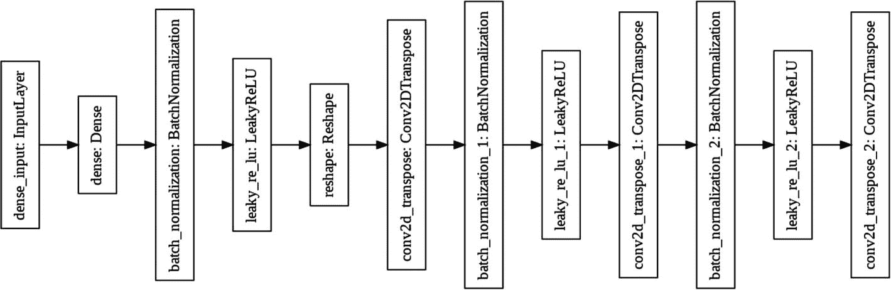

**图 13-5** 生成器架构

模型摘要如图 13-6 所示。

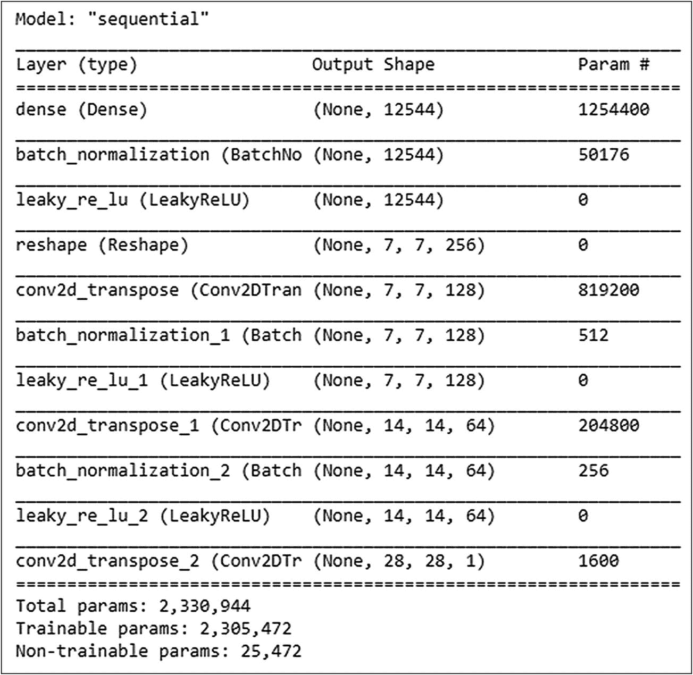

**图 13-6** 生成器模型摘要

## 测试生成器

你将使用随机输入向量测试生成器，并通过以下代码在控制台上显示结果：

```python
noise = tf.random.normal([1, 100])
#giving random input vector
generated_image = gen_model(noise, training=False)
plt.imshow(generated_image[0, :, :, 0], cmap="gray")
```

图像将类似于图 13-7 所示。

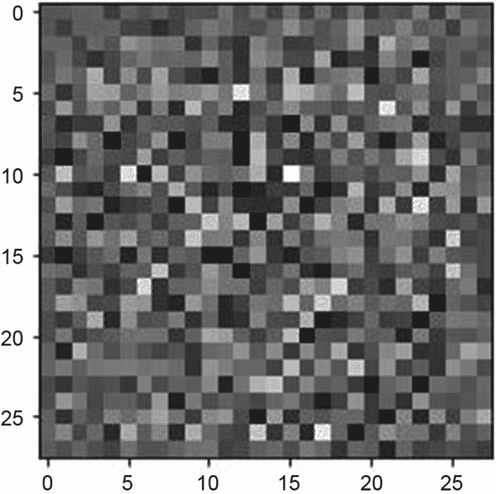

**图 13-7** 生成器生成的随机图像

检查图像的形状：

```python
generated_image.shape
```

它给出以下输出：

```
TensorShape([1, 28, 28, 1])
```

输出表明图像具有我们期望的 28x28 尺寸。接下来，我们将定义判别器。

## 定义判别器模型

我们按如下方式定义判别器：

```python
discri_model = tf.keras.Sequential()
discri_model.add(tf.keras.layers.Conv2D
(64, (5, 5),
strides=(2, 2),
padding='same',
input_shape=[28, 28, 1]))
discri_model.add(tf.keras.layers.LeakyReLU())
discri_model.add(tf.keras.layers.Dropout(0.3))
discri_model.add(tf.keras.layers.Conv2D
(128, (5, 5),
strides=(2, 2),
padding='same'))
discri_model.add(tf.keras.layers.LeakyReLU())
discri_model.add(tf.keras.layers.Dropout(0.3))
discri_model.add(tf.keras.layers.Flatten())
discri_model.add(tf.keras.layers.Dense(1))
```

判别器仅使用两个卷积层。最后一个卷积层的输出类型为 `(batch size, height, width, filters)`。网络中的 `Flatten` 层将此输出展平，以馈送到网络中的最后一个 `Dense` 层。


模型图如图 13-8 所示。

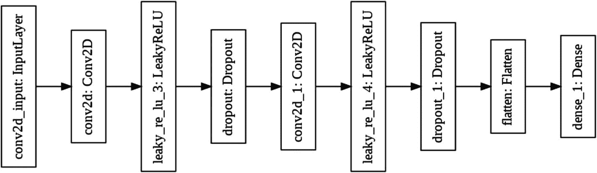

**图 13-8** 判别器架构

模型摘要如图 13-9 所示。

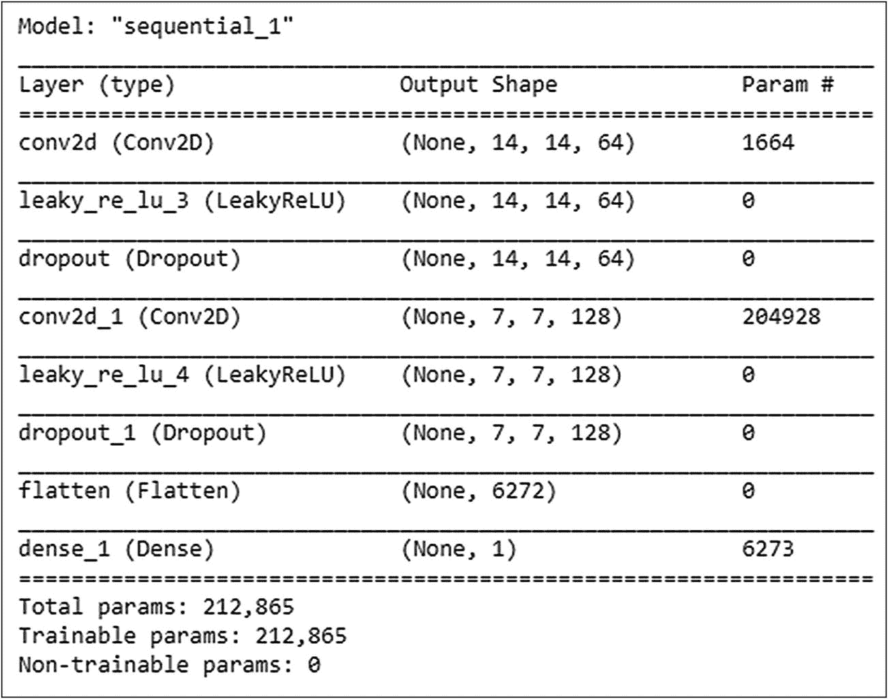

**图 13-9** 判别器模型摘要

请注意，判别器只有大约 20 万个可训练参数。

## 测试判别器

你可以通过将我们之前生成的图像输入判别器来对其进行测试。

```
decision = discri_model(generated_image)
```

如果图像是假的，判别器会给出一个负值；如果是真的，则给出正值。打印该测试图像的判别器决策结果。

```
print (decision)
```

它会输出以下决策结果：

```
tf.Tensor([[0.0033829]], shape=(1, 1), dtype=float32)
```

决策值为 `0.0033`，这是一个正数，表明该图像是真实的。最大值为 `1` 表示模型确信该图像是真实的。如果你使用生成器生成另一张图像并测试判别器的输出，可能会得到负值结果。这是因为我们尚未在某些数据集上训练生成器和判别器。

## 定义损失函数

现在，我们将为生成器和判别器定义损失函数。

```
cross_entropy = tf.keras.losses.BinaryCrossentropy(from_logits=True)
```

我们使用 Keras 的二元交叉熵函数来实现此目的。请注意，我们有两个类别——一个（`1`）代表真实图像，另一个（`0`）代表虚假图像。我们针对这两个类别计算损失，因此这使我们的问题成为一个二元分类问题。因此，我们使用二元交叉熵作为损失函数。

我们定义一个函数来计算生成器损失，如下所示：

```
def generator_loss(generated_output):
    return cross_entropy(tf.ones_like(generated_output), generated_output)
```

该函数的返回值量化了生成器欺骗判别器的能力。如果生成器表现良好，判别器会将虚假图像分类为真实图像，并返回决策值 `1`。因此，该函数将判别器对生成图像的决策与全 1 数组进行比较。

我们定义判别器损失函数如下：

```
def discriminator_loss(real_output, generated_output):
    # 计算将图像视为真实图像时的损失 [1,1,...,1]
    real_loss = cross_entropy(tf.ones_like(real_output), real_output)
    # 计算将图像视为虚假图像时的损失 [0,0,...,0]
    generated_loss = cross_entropy(tf.zeros_like(generated_output), generated_output)
    # 计算总损失
    total_loss = real_loss + generated_loss
    return total_loss
```

我们首先让判别器认为给定的图像是真实的，然后计算相对于全 1 数组的损失。接着，我们让判别器认为该图像是虚假的，然后要求其计算相对于全 0 数组的损失。判别器确定的总损失是这两个损失之和。

现在，我们为生成器和判别器定义优化器，两者均设置为 `Adam`。

```
gen_optimizer = tf.optimizers.Adam(1e-4)
discri_optimizer = tf.optimizers.Adam(1e-4)
```

接下来，你将编写一些在训练过程中使用的实用函数。

## 定义训练所需的几个函数

首先，我们声明几个变量：

```
epoch_number = 0
EPOCHS = 100
noise_dim = 100
seed = tf.random.normal([1, noise_dim])
```

我们将训练模型 `100` 个周期。你可以随时根据自己的选择更改此变量。更多的周期数将为我们要生成的数字 `9` 生成更好的图像。噪声维度设置为 `100`，用于在创建随机图像时作为生成器网络的首次输入。种子设置为单张图像的随机数据。

## 检查点设置

由于训练可能需要很长时间，我们在训练中提供了检查点功能，以便将生成器和判别器的中间状态保存到本地文件中。

```
checkpoint_dir = '/content/drive/My Drive/GAN1/Checkpoint'
checkpoint_prefix = os.path.join(checkpoint_dir, "ckpt")
checkpoint = tf.train.Checkpoint(
    generator_optimizer=gen_optimizer,
    discriminator_optimizer=discri_optimizer,
    generator=gen_model,
    discriminator=discri_model
)
```

如果发生断连，你可以从最后一个检查点继续训练。我将向你展示如何操作。

## 设置云端硬盘

检查点数据将保存到 Google 云端硬盘中名为 `GAN1/Checkpoint` 的文件夹中。因此，在运行代码之前，请确保你已在 Google 云端硬盘中创建了此文件夹结构。

使用以下代码将云端硬盘挂载到你的项目中：

```
from google.colab import drive
drive.mount('/content/drive')
```

将当前文件夹更改为新位置，以便检查点文件存储在此位置。

```
cd '/content/drive/My Drive/GAN1'
```

接下来，我们编写一个 `gradient_tuning` 函数。

## 模型训练步骤

我们的生成器和判别器模型都将分多个步骤进行训练。我们将为这些步骤编写一个函数。

我们将使用梯度带（`tf.GradientTape`）对生成器和判别器进行自动微分。自动微分计算计算相对于其输入变量的梯度。在梯度带上下文中执行的操作会被记录到磁带上。然后使用反向模式微分来计算新的梯度。你无需深入了解这些操作即可理解模型的训练方式。

在每个步骤中，我们将一批图像作为输入传递给该函数。我们将要求判别器对训练图像和生成的图像都产生输出。我们将训练输出称为真实输出，将生成的图像输出称为虚假输出。我们将计算生成器在虚假输出上的损失以及判别器在真实和虚假输出上的损失。我们将使用梯度带根据这些损失计算两者的梯度，然后将新的梯度应用于模型。完整的函数定义以及每行的注释见代码清单 13-1。

```
def gradient_tuning(images):
    # 创建一个噪声向量。
    noise = tf.random.normal([16, noise_dim])
    # 使用梯度带进行自动微分
    with tf.GradientTape() as generator_tape, tf.GradientTape() as discriminator_tape:
        # 要求生成器生成随机图像
        generated_images = gen_model(noise, training=True)
        # 要求判别器评估真实图像并生成其输出
        real_output = discri_model(images, training=True)
        # 要求判别器对生成的（虚假）图像进行评估
        fake_output = discri_model(generated_images, training=True)
        # 计算生成器在虚假数据上的损失
        gen_loss = generator_loss(fake_output)
        # 计算之前定义的判别器损失
        disc_loss = discriminator_loss(real_output, fake_output)
        # 计算生成器的梯度
        gen_gradients = generator_tape.gradient(gen_loss, gen_model.trainable_variables)
        # 计算判别器的梯度
        discri_gradients = discriminator_tape.gradient(disc_loss, discri_model.trainable_variables)
        # 使用优化器处理梯度并将其应用于变量
        gen_optimizer.apply_gradients(zip(gen_gradients, gen_model.trainable_variables))
        # 对判别器执行相同操作
        discri_optimizer.apply_gradients(zip(discri_gradients, discri_model.trainable_variables))
```

**代码清单 13-1** 梯度调整函数

现在，我们再编写一个函数，用于生成数字 `9`（我们期望的输出）的图像，并将其保存到你的 Google 云端硬盘中。


```python
def generate_and_save_images(model, epoch, test_input):
    global epoch_number
    epoch_number = epoch_number + 1
    # set training to false to ensure inference mode
    predictions = model(test_input, training=False)
    # display and save image
    fig = plt.figure(figsize=(4,4))
    for i in range(predictions.shape[0]):
        plt.imshow(predictions[i, :, :, 0] * 127.5 + 127.5, cmap="gray")
        plt.axis('off')
    plt.savefig('image_at_epoch_{:01d}.png'.format(epoch_number))
    plt.show()
```

该函数使用全局变量 `epoch_number` 来追踪训练轮次，以便在断连后继续训练。模型的 `test_input` 始终是我们的随机种子。将 `training` 设置为 `False` 后，在此种子上执行推理，以确保批归一化生效。然后，我们在用户控制台上显示图像，并将其保存到驱动器中，文件名后缀为 `epoch_number`。

利用这些函数，你现在可以编写代码来训练模型并生成一些输出。

### 模型训练

要训练生成器和判别器模型，你需要设置一个简单的 `for` 循环，如清单 13-2 所示。`train` 方法将真实图像数据集作为其第一个参数。我将其设为参数，以便你可以使用不同的图像数据集和/或不同尺寸进行实验。第二个参数是你希望执行训练的轮次数。我们对数据集中的每个批次数据调用 `gradient_tuning`。在每个轮次结束时，我们生成图像并将其保存到用户的驱动器中。此外，网络状态会作为检查点保存，以便在断连后能从最后一个检查点继续训练。每个轮次的执行时间会被追踪并打印在用户控制台上。模型训练的函数如清单 13-2 所示。

```python
def train(dataset, epochs):
    for epoch in range(epochs):
        start = time.time()
        for image_batch in dataset:
            gradient_tuning(image_batch)
        # Produce images as we go
        generate_and_save_images(gen_model, epoch + 1, seed)
        # save checkpoint data
        checkpoint.save(file_prefix = checkpoint_prefix)
        print ('Time for epoch {} is {} sec'.format(epoch + 1, time.time()-start))
```

清单 13-2：模型训练函数

现在，通过调用此 `train` 方法开始模型训练。

```python
train(train_dataset, EPOCHS)
```

随着训练的进行，检查点会被保存，并且每个轮次都会生成图像。图像会显示在控制台上，并保存到你的 Google Drive 中。我运行 100 个轮次的输出如表 13-1 所示。

**表 13-1** 程序生成的数字 9 的图像

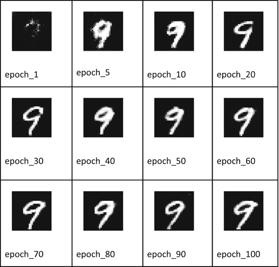

从输出中可以看出，网络在仅 20/30 个轮次后就能生成可接受的输出，而在 70 轮次及以上时，质量达到最佳。

在训练过程中，如果发生断连，你可以从之前已知的检查点恢复网络状态，如下面的语句所示，并继续训练。

```python
#run this code only if there is a runtime disconnection
try:
    checkpoint.restore(tf.train.latest_checkpoint(checkpoint_dir))
except Exception as error:
    print("Error loading in model : {}".format(error))
train(train_dataset, EPOCHS)
```

在我运行此应用时，在 GPU 上每个轮次大约需要 10 秒。很多时候，对于更复杂的图像生成，可能需要几个小时才能获得可接受的输出。在这种情况下，检查点对于重新启动训练非常有用。

## 完整源代码

用于生成手写数字图像的完整源代码如清单 13-3 所示。


```python
import matplotlib.pyplot as plt
import tensorflow as tf
import numpy as np
import time
from tensorflow import keras
from tensorflow.keras import layers
import os

(train_images, train_labels), (test_images, test_labels) = tf.keras.datasets.mnist.load_data()

digit9_images = []
for i in range(len(train_images)):
    if train_labels[i] == 9:
        digit9_images.append(train_images[i])

train_images = np.array(digit9_images)
train_images.shape

n = 10
f = plt.figure()
for i in range(n):
    f.add_subplot(1, n, i + 1)
    plt.subplot(1, n, i + 1).axis("off")
    plt.imshow(train_images[i])
plt.show()

train_images = train_images.reshape(train_images.shape[0], 28, 28, 1).astype('float32')
train_images = (train_images - 127.5) / 127.5

train_dataset = tf.data.Dataset.from_tensor_slices(train_images).shuffle(train_images.shape[0]).batch(32)

gen_model = tf.keras.Sequential()
#### 向网络输入一张 7x7 的随机图像
gen_model.add(tf.keras.layers.Dense(7 * 7 * 256, use_bias=False, input_shape=(100,)))
#### 添加批归一化以增强稳定性
gen_model.add(tf.keras.layers.BatchNormalization())
gen_model.add(tf.keras.layers.LeakyReLU())
#### 重塑输出
gen_model.add(tf.keras.layers.Reshape((7, 7, 256)))
### 应用 (5x5) 滤波器和 (1,1) 步长。输出图像仍为 7x7。
gen_model.add(tf.keras.layers.Conv2DTranspose(128, (5, 5), strides=(1, 1), padding='same', use_bias=False))
gen_model.add(tf.keras.layers.BatchNormalization())
gen_model.add(tf.keras.layers.LeakyReLU())
### 应用 (2,2) 步长。输出图像变为 14x14。
gen_model.add(tf.keras.layers.Conv2DTranspose(64, (5, 5), strides=(2, 2), padding='same', use_bias=False))
gen_model.add(tf.keras.layers.BatchNormalization())
gen_model.add(tf.keras.layers.LeakyReLU())
### 再次上采样，将图像放大至 28x28，即最终尺寸。
gen_model.add(tf.keras.layers.Conv2DTranspose(1, (5, 5), strides=(2, 2), padding='same', use_bias=False, activation='tanh'))

gen_model.summary()
tf.keras.utils.plot_model(gen_model)

noise = tf.random.normal([1, 100])
### 输入随机向量
generated_image = gen_model(noise, training=False)
plt.imshow(generated_image[0, :, :, 0], cmap="gray")
generated_image.shape

discri_model = tf.keras.Sequential()
discri_model.add(tf.keras.layers.Conv2D(64, (5, 5), strides=(2, 2), padding='same', input_shape=[28, 28, 1]))
discri_model.add(tf.keras.layers.LeakyReLU())
discri_model.add(tf.keras.layers.Dropout(0.3))
discri_model.add(tf.keras.layers.Conv2D(128, (5, 5), strides=(2, 2), padding='same'))
discri_model.add(tf.keras.layers.LeakyReLU())
discri_model.add(tf.keras.layers.Dropout(0.3))
discri_model.add(tf.keras.layers.Flatten())
discri_model.add(tf.keras.layers.Dense(1))

discri_model.summary()
tf.keras.utils.plot_model(discri_model)

decision = discri_model(generated_image)
print(decision)

cross_entropy = tf.keras.losses.BinaryCrossentropy(from_logits=True)

#### 创建损失函数
def generator_loss(generated_output):
    return cross_entropy(tf.ones_like(generated_output), generated_output)

def discriminator_loss(real_output, generated_output):
    # 计算图像为真实图像时的损失 [1,1,...,1]
    real_loss = cross_entropy(tf.ones_like(real_output), real_output)
    # 计算图像为伪造图像时的损失 [0,0,...,0]
    generated_loss = cross_entropy(tf.zeros_like(generated_output), generated_output)
    # 计算总损失
    total_loss = real_loss + generated_loss
    return total_loss

gen_optimizer = tf.optimizers.Adam(1e-4)
discri_optimizer = tf.optimizers.Adam(1e-4)

epoch_number = 0
EPOCHS = 100
noise_dim = 100
seed = tf.random.normal([1, noise_dim])

checkpoint_dir = '/content/drive/My Drive/GAN1/Checkpoint'
checkpoint_prefix = os.path.join(checkpoint_dir, "ckpt")
checkpoint = tf.train.Checkpoint(generator_optimizer=gen_optimizer,
                                 discriminator_optimizer=discri_optimizer,
                                 generator=gen_model,
                                 discriminator=discri_model)

from google.colab import drive
drive.mount('/content/drive')
cd '/content/drive/My Drive/GAN1'

def gradient_tuning(images):
    # 创建一个噪声向量。
    noise = tf.random.normal([16, noise_dim])
    # 使用梯度带进行自动微分
    with tf.GradientTape() as generator_tape, tf.GradientTape() as discriminator_tape:
        # 让生成器生成随机图像
        generated_images = gen_model(noise, training=True)
        # 让判别器评估真实图像并生成输出
        real_output = discri_model(images, training=True)
        # 让判别器评估生成的（伪造）图像
        fake_output = discri_model(generated_images, training=True)
        # 计算生成器在伪造数据上的损失
        gen_loss = generator_loss(fake_output)
        # 按先前定义计算判别器损失
        disc_loss = discriminator_loss(real_output, fake_output)
        # 计算生成器的梯度
        gen_gradients = generator_tape.gradient(gen_loss, gen_model.trainable_variables)
        # 计算判别器的梯度
        discri_gradients = discriminator_tape.gradient(disc_loss, discri_model.trainable_variables)
        # 使用优化器处理梯度并将其应用于变量
        gen_optimizer.apply_gradients(zip(gen_gradients, gen_model.trainable_variables))
        # 对判别器执行相同操作
        discri_optimizer.apply_gradients(zip(discri_gradients, discri_model.trainable_variables))

def generate_and_save_images(model, epoch, test_input):
    global epoch_number
    epoch_number = epoch_number + 1
    # 将 training 设为 False 以确保推理模式
    predictions = model(test_input, training=False)
    # 显示并保存图像
    fig = plt.figure(figsize=(4, 4))
    for i in range(predictions.shape[0]):
        plt.imshow(predictions[i, :, :, 0] * 127.5 + 127.5, cmap="gray")
        plt.axis('off')
        plt.savefig('image_at_epoch_{:01d}.png'.format(epoch_number))
        plt.show()

def train(dataset, epochs):
    for epoch in range(epochs):
        start = time.time()
        for image_batch in dataset:
            gradient_tuning(image_batch)
        # 在训练过程中生成图像
        generate_and_save_images(gen_model, epoch + 1, seed)
        # 保存检查点数据
        checkpoint.save(file_prefix=checkpoint_prefix)
        print('第 {} 个 epoch 耗时 {} 秒'.format(epoch + 1, time.time() - start))

train(train_dataset, EPOCHS)

#### 仅在运行时断开连接时运行此代码
try:
    checkpoint.restore(tf.train.latest_checkpoint(checkpoint_dir))
except Exception as error:
    print("加载模型时出错：{}".format(error))

train(train_dataset, EPOCHS)
```

**列表 13-3** `DigitGen-GAN.ipynb`


在本示例中，你训练了一个用于生成手写数字的模型。在下一个示例中，我将向你展示如何创建手写字符。

## 字母表生成

正如 Kaggle 提供数字数据集一样，手写字母数据集可通过另一个名为 `extra-keras-datasets` 的包获取。你将使用该数据集来生成手写字母。生成器和判别器模型及其训练和推理过程，均与数字生成案例保持一致。因此，我将直接给出如何从 Kaggle 网站加载字母数据集的代码，并展示生成图像的输出结果。完整项目源码可在本书仓库的 `emnist-GAN` 目录下找到。

## 下载数据

该数据集位于一个独立的包中，你可以通过运行 `pip` 工具进行安装。

```
pip install extra-keras-datasets
```

将该包导入你的项目。

```
from extra_keras_datasets import emnist
```

将数据加载到项目中，并显示一张图像及其对应的标签。

```
(train_images,train_labels),
(test_images,test_labels) =
emnist.load_data(type='letters')
plt.imshow(train_images[1])
print ("label: ", train_labels[1])
```

输出结果如图 13-10 所示。

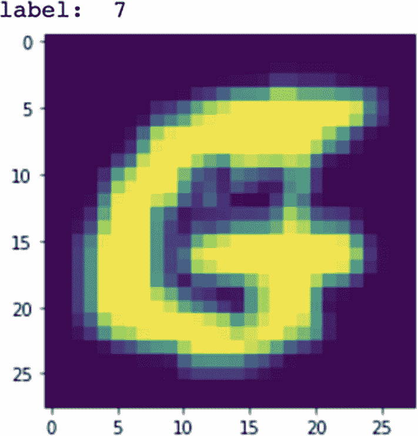

**图 13-10** 手写字符 G 的图像

与数字数据库类似，每张图像的尺寸均为 28x28。因此，我们可以沿用之前生成该尺寸图像的生成器模型。对我们此次实验而言，一个便利之处在于：每个字母标签的值与其在字母表中的位置相对应。例如，字母 `a` 的标签值为 `1`，字母 `b` 的标签值为 `2`，以此类推。

### 创建单个字母的数据集

与数字生成示例类似，我们将训练模型以生成单个字母。因此，我们需要创建一个仅包含目标字母图像的数据集。这可以通过以下代码实现：

```
letter_G_images = []
for i in range(len(train_images)):
if train_labels[i] == 7:
letter_G_images.append(train_images[i])
train_images = np.array(letter_G_images)
```

你可以通过运行以下小型 `for` 循环来验证是否已成功提取出仅包含字母 G 的图像：

```
n = 10
f = plt.figure()
for i in range(n):
f.add_subplot(1, n, i + 1)
plt.subplot(1, n, i+1 ).axis("off")
plt.imshow(train_images[i])
plt.show()
```

输出结果如图 13-11 所示。

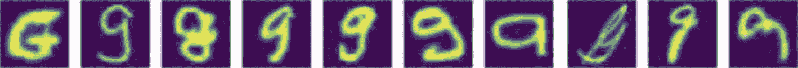

**图 13-11** 手写字符样本图像

好了，现在你的数据集已经准备就绪。其余代码，包括数据预处理、模型定义、损失函数、优化器、训练等，均与数字生成应用保持一致。此处不再重复代码，仅展示我运行后的最终输出结果。

### 程序输出

不同训练周期下的程序输出如表 13-2 所示。

**表 13-2** 不同训练周期生成的图像

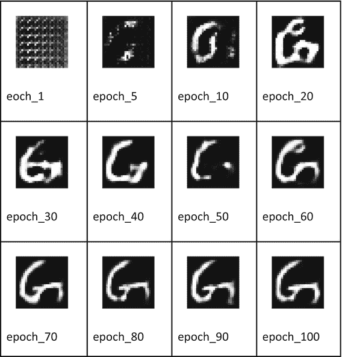

与数字生成案例类似，你可以观察到模型在最初的几个训练周期内快速收敛，到第 100 个训练周期结束时，即可获得高质量的输出结果。

## 完整源码

字符图像生成的完整源代码见代码清单 13-4。


```python
import matplotlib.pyplot as plt
import tensorflow as tf
import numpy as np
import time
from tensorflow import keras
from tensorflow.keras import layers
import os
pip install extra-keras-datasets
from extra_keras_datasets import emnist
(train_images,train_labels),
(test_images,test_labels) =
emnist.load_data(type='letters')
plt.imshow(train_images[1])
print ("label: ", train_labels[1])
letter_G_images = []
for i in range(len(train_images)):
if train_labels[i] == 7:
letter_G_images.append(train_images[i])
train_images = np.array(letter_G_images)
n = 10
f = plt.figure()
for i in range(n):
f.add_subplot(1, n, i + 1)
plt.subplot(1, n, i+1 ).axis("off")
plt.imshow(train_images[i])
plt.show()
train_images = train_images.reshape (
train_images.shape[0], 28, 28, 1).astype('float32')
train_images = (train_images - 127.5) / 127.5
train_dataset = tf.data.Dataset.from_tensor_slices(
train_images).shuffle
(train_images.shape[0]).batch(32)
gen_model = tf.keras.Sequential()
#### 向网络输入一张 7x7 的随机图像
gen_model.add(tf.keras.layers.Dense
(7*7*256,
use_bias=False,
input_shape=(100,)))
#### 添加批归一化以增强稳定性
gen_model.add(tf.keras.layers.BatchNormalization())
gen_model.add(tf.keras.layers.LeakyReLU())
#### 重塑输出
gen_model.add(tf.keras.layers.Reshape((7, 7, 256)))
#### 应用(5x5)滤波器和(1,1)步长。
#### 图像输出仍为 7x7。
gen_model.add(tf.keras.layers.Conv2DTranspose
(128, (5, 5),
strides=(1, 1),
padding='same',
use_bias=False))
gen_model.add(tf.keras.layers.BatchNormalization())
gen_model.add(tf.keras.layers.LeakyReLU())
#### 应用(2,2)步长。输出图像现在为 14x14。
gen_model.add(tf.keras.layers.Conv2DTranspose
(64, (5, 5),
strides=(2, 2),
padding='same',
use_bias=False))
gen_model.add(tf.keras.layers.BatchNormalization())
gen_model.add(tf.keras.layers.LeakyReLU())
#### 再次上采样，图像放大至 28x28，即最终尺寸。
gen_model.add(tf.keras.layers.Conv2DTranspose
(1, (5, 5),
strides=(2, 2),
padding='same',
use_bias=False,
activation='tanh'))
gen_model.summary()
tf.keras.utils.plot_model(gen_model)
noise = tf.random.normal([1, 100])# 生成随机输入向量
generated_image = gen_model(noise, training=False)
plt.imshow(generated_image[0, :, :, 0], cmap="gray")
generated_image.shape
discri_model = tf.keras.Sequential()
discri_model.add(tf.keras.layers.Conv2D
(64, (5, 5),
strides=(2, 2),
padding='same',
input_shape=[28, 28, 1]))
discri_model.add(tf.keras.layers.LeakyReLU())
discri_model.add(tf.keras.layers.Dropout(0.3))
discri_model.add(tf.keras.layers.Conv2D
(128, (5, 5),
strides=(2, 2),
padding='same'))
discri_model.add(tf.keras.layers.LeakyReLU())
discri_model.add(tf.keras.layers.Dropout(0.3))
discri_model.add(tf.keras.layers.Flatten())
discri_model.add(tf.keras.layers.Dense(1))
discri_model.summary()
tf.keras.utils.plot_model(discri_model)
decision = discri_model(generated_image)
print (decision)
cross_entropy = tf.keras.losses.BinaryCrossentropy(from_logits=True)
#### 创建损失函数
def generator_loss(generated_output):
return cross_entropy(tf.ones_like(generated_output),
generated_output)
def discriminator_loss(real_output,
generated_output):
#### 计算图像为真实图像时的损失 [1,1,...,1]
real_loss = cross_entropy(tf.ones_like
(real_output),real_output)
#### 计算图像为伪造图像时的损失 [0,0,...,0]
generated_loss = cross_entropy
(tf.zeros_like(generated_output),
generated_output)
### 计算总损失
total_loss = real_loss + generated_loss
return total_loss
gen_optimizer = tf.optimizers.Adam(1e-4)
discri_optimizer = tf.optimizers.Adam(1e-4)
epoch_number = 0
EPOCHS = 100
noise_dim = 100
seed = tf.random.normal([1, noise_dim])
checkpoint_dir =
'/content/drive/My Drive/GAN2/Checkpoint'
checkpoint_prefix = os.path.join
(checkpoint_dir, "ckpt")
checkpoint = tf.train.Checkpoint
(generator_optimizer = gen_optimizer,
discriminator_optimizer =
discri_optimizer,
generator= gen_model,
discriminator = discri_model)
from google.colab import drive
drive.mount('/content/drive')
cd '/content/drive/My Drive/GAN2'
def gradient_tuning(images):
### 创建一个噪声向量。
noise = tf.random.normal([16, noise_dim])
### 使用梯度带进行自动微分
with tf.GradientTape()
as generator_tape, tf.GradientTape()
as discriminator_tape:
### 让生成器生成随机图像
generated_images = gen_model
(noise, training = True)
### 让判别器评估真实图像并生成输出
real_output = discri_model
(images, training = True)
#### 让判别器评估生成的（伪造）图像
fake_output = discri_model
(generated_images, training = True)
#### 计算生成器在伪造数据上的损失
gen_loss = generator_loss(fake_output)
#### 按先前定义计算判别器损失
disc_loss = discriminator_loss
(real_output, fake_output)
### 计算生成器的梯度
gen_gradients = generator_tape.gradient
(gen_loss,
gen_model.trainable_variables)
### 计算判别器的梯度
discri_gradients = discriminator_tape.gradient
(disc_loss,
discri_model.trainable_variables)
#### 使用优化器处理梯度并将其应用于变量
gen_optimizer.apply_gradients(zip(gen_gradients,
gen_model.trainable_variables))
### 对判别器执行相同操作
discri_optimizer.apply_gradients(
zip(discri_gradients,
discri_model.trainable_variables))
def generate_and_save_images
(model, epoch, test_input):
global epoch_number
epoch_number = epoch_number + 1
### 设置 training=False 以确保推理模式
predictions = model(test_input,
training = False)
### 显示并保存图像
fig = plt.figure(figsize=(4,4))
for i in range(predictions.shape[0]):
plt.imshow(predictions
[i, :, :, 0] * 127.5 + 127.5,
cmap='gray')
plt.axis('off')
plt.savefig('image_at_epoch_
{:01d}.png'.format(epoch_number))
plt.show()
def train(dataset, epochs):
for epoch in range(epochs):
start = time.time()
for image_batch in dataset:
gradient_tuning(image_batch)
### 在训练过程中生成图像
generate_and_save_images(gen_model,
epoch + 1,
seed)
### 保存检查点数据
checkpoint.save(file_prefix =
checkpoint_prefix)
print ('Time for epoch {} is {} sec'.format
(epoch + 1,
time.time()-start))
train(train_dataset, EPOCHS)
#### 仅在运行时断开连接时运行此代码
try:
checkpoint.restore(tf.train.latest_checkpoint
(checkpoint_dir))
except Exception as error:
print("Error loading in model :
{}".format(error))
train(train_dataset, 100)
Listing 13-4
emnist-GAN.ipynb
```


